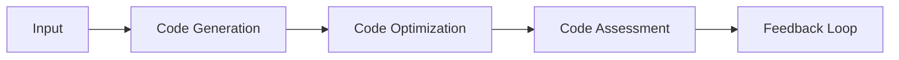
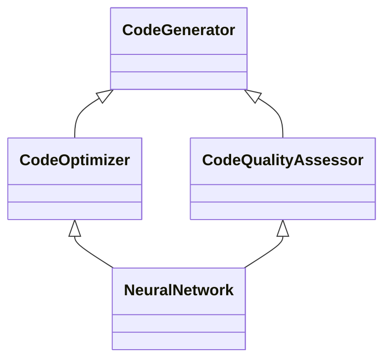
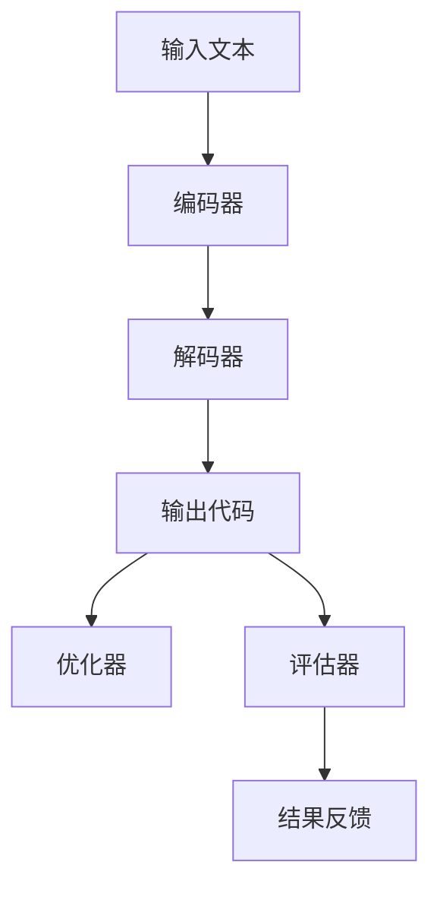
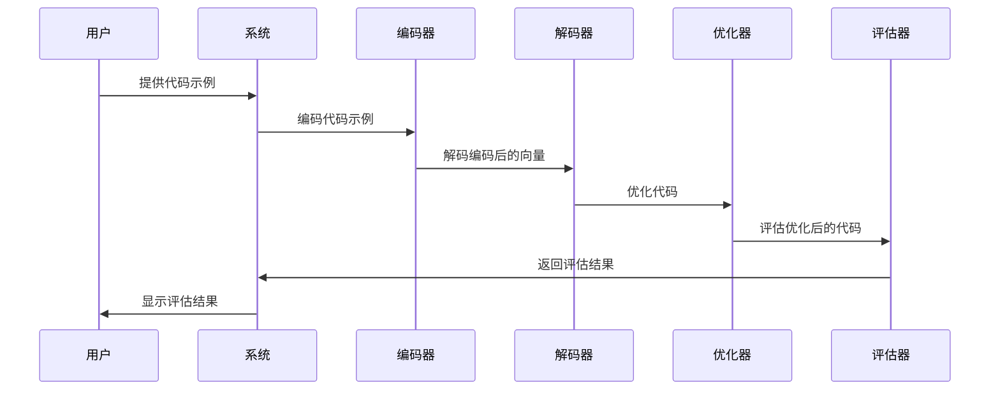

                 


# 程序合成与神经网络的结合:AI编程新范式

关键词：程序合成、神经网络、AI编程、算法原理、系统架构

摘要：本文将探讨程序合成与神经网络的结合，以及这一结合如何引领人工智能编程的新范式。我们将详细分析程序合成和神经网络的基本概念、原理及其联系，并通过算法讲解、数学模型分析以及实际项目实战，深入理解这一新范式的应用和潜力。

### 目录大纲

1. 背景介绍
   1.1 程序合成与神经网络概述
   1.1.1 程序合成
   1.1.2 神经网络
   1.1.3 程序合成与神经网络的结合
2. 核心概念与联系
   2.1 程序合成概念原理
   2.1.1 程序合成原理
   2.1.2 神经网络概念原理
   2.2 程序合成与神经网络的联系
3. 算法原理讲解
   3.1 算法原理
   3.1.1 算法流程图
   3.1.2 算法数学模型
4. 数学模型和数学公式讲解
   4.1 数学模型
   4.1.1 数学公式
5. 系统分析与架构设计方案
   5.1 问题场景介绍
   5.2 系统功能设计
   5.2.1 领域模型
   5.2.2 系统架构设计
   5.2.3 系统接口设计
   5.2.4 系统交互
6. 项目实战
   6.1 环境安装
   6.2 系统核心实现
   6.2.1 源代码
   6.2.2 代码应用解读与分析
   6.3 实际案例分析与讲解
   6.4 项目小结
7. 最佳实践 tips、小结、注意事项、拓展阅读

## 1. 背景介绍

### 1.1 程序合成与神经网络概述

#### 1.1.1 程序合成

**问题背景**：
在软件工程中，程序合成是指自动生成程序代码的过程，旨在减少人为编写代码的工作量和错误率。随着软件开发项目的复杂性和规模的增长，程序合成成为了一个重要研究方向。

**问题描述**：
如何通过自动化手段生成高质量的程序代码，同时保证生成的代码的可读性和可维护性？

**问题解决**：
程序合成通过多种技术手段，如模板匹配、代码生成器、抽象语法树（AST）转换等，来实现程序代码的自动化生成。

**边界与外延**：
程序合成的边界涉及到代码生成工具的选择、代码质量标准、语言兼容性等。其外延可以扩展到软件的自动测试、代码重构等环节。

**核心要素组成**：
程序合成主要包括代码生成器、模板库、语法分析器等核心组成部分。

#### 1.1.2 神经网络

**问题背景**：
神经网络是人工智能的一个关键组成部分，其灵感来源于人脑的结构和工作原理。随着计算能力的提升和数据量的增加，神经网络在图像识别、自然语言处理、游戏AI等领域取得了显著成果。

**问题描述**：
如何模拟人脑的学习和决策过程，实现机器的智能行为？

**问题解决**：
神经网络通过模拟人脑神经元之间的连接和作用，通过反向传播算法不断调整网络参数，以实现输入到输出的映射。

**边界与外延**：
神经网络的边界包括网络结构设计、参数优化、训练算法等。其外延可以扩展到强化学习、生成对抗网络（GAN）等更广泛的人工智能领域。

**核心要素组成**：
神经网络的核心要素包括神经元、权重、激活函数、训练算法等。

#### 1.1.3 程序合成与神经网络的结合

**问题背景**：
将程序合成与神经网络结合，可以探索自动化编程的新方法，提高开发效率，减少人为干预。

**问题描述**：
如何将神经网络的强大学习能力与程序合成的自动化生成能力结合起来，实现更高效、更智能的代码生成？

**问题解决**：
通过将神经网络应用于程序合成过程，可以利用神经网络进行代码生成、代码优化、代码重构等。

**边界与外延**：
这一结合的边界涉及神经网络的架构选择、代码生成算法的优化、安全性问题等。其外延可以扩展到软件定义网络、自适应软件开发等领域。

**核心要素组成**：
程序合成与神经网络的结合核心要素包括神经网络架构、代码生成模型、代码评估和优化机制等。

## 2. 核心概念与联系

### 2.1 程序合成概念原理

#### 2.1.1 程序合成原理

**概念属性特征**：
程序合成是通过自动化手段生成程序代码的过程，包括代码生成、代码优化、代码重构等。

**对比表格**：

| 特性        | 传统编程           | 程序合成           |
| ----------- | ---------------- | ---------------- |
| 开发方式    | 手动编写          | 自动化生成        |
| 代码质量    | 易出错、可维护性低 | 高质量、可维护性高 |
| 开发效率    | 低                | 高                |
| 灵活性      | 低                | 高                |

**ER实体关系图**：

```mermaid
erDiagram
  CodeGenerator ||--|{ ProgramCode } ProgramCode
  CodeOptimizer ||--|{ ProgramCode } ProgramCode
  CodeReconstructor ||--|{ ProgramCode } ProgramCode
```

#### 2.1.2 神经网络概念原理

**概念属性特征**：
神经网络是一种模仿人脑结构的计算模型，通过多层神经网络实现复杂函数的映射。

**对比表格**：

| 特性        | 传统计算模型       | 神经网络           |
| ----------- | ---------------- | ---------------- |
| 结构       | 单层、线性         | 多层、非线性       |
| 学习方式    | 确定性学习         | 统计学习、自适应学习 |
| 表达能力    | 有限               | 强大               |

**ER实体关系图**：

```mermaid
erDiagram
  Neuron ||--|{ NeuralLayer } NeuralLayer
  Weight ||--|{ Neuron } Neuron
  ActivationFunction ||--|{ Neuron } Neuron
  TrainingAlgorithm ||--|{ NeuralNetwork } NeuralNetwork
```

### 2.2 程序合成与神经网络的联系

**联系原理**：

**概念属性特征**：
程序合成与神经网络通过以下方式相互联系：
- 神经网络可以用于生成代码模板，优化代码结构。
- 程序合成中的代码生成和优化算法可以利用神经网络的强大学习能力。
- 神经网络可以对生成的代码进行评估和优化。

**对比表格**：

| 对比项          | 传统程序合成       | 神经网络增强的程序合成 |
| --------------- | ---------------- | -------------------- |
| 生成方式        | 代码模板匹配       | 神经网络生成          |
| 优化方式        | 静态优化          | 动态优化             |
| 学习能力        | 无学习能力         | 强学习能力           |
| 评估机制        | 预定义规则         | 深度学习评估          |

**ER实体关系图**：

```mermaid
erDiagram
  CodeSynthesizer ||--|{ NeuralNetwork } NeuralNetwork
  CodeGenerator ||--|{ NeuralNetwork } NeuralNetwork
  CodeOptimizer ||--|{ NeuralNetwork } NeuralNetwork
  CodeQualityAssessor ||--|{ NeuralNetwork } NeuralNetwork
```

## 3. 算法原理讲解

### 3.1 算法原理

程序合成与神经网络的结合算法原理主要基于以下三个方面：

1. **代码生成**：
   - 神经网络通过学习大量代码示例，生成新的代码片段。
   - 使用递归神经网络（RNN）或变换器（Transformer）等架构进行编码和解码操作。

2. **代码优化**：
   - 神经网络通过对代码执行性能的分析，自动优化代码结构。
   - 利用深度学习算法调整代码生成模型的参数，以生成更高效的代码。

3. **代码评估**：
   - 神经网络对生成的代码进行评估，确保其符合预期质量标准。
   - 使用自动化测试工具和代码审查工具，对代码进行测试和评估。

#### 3.1.1 算法流程图



#### 3.1.2 算法数学模型

神经网络算法的数学模型主要涉及以下方面：

1. **编码器（Encoder）**：
   - 用于将输入数据（如代码示例）编码为固定长度的向量。
   - 编码器使用多层感知机（MLP）或卷积神经网络（CNN）等架构。

2. **解码器（Decoder）**：
   - 用于将编码后的向量解码为输出数据（如代码片段）。
   - 解码器也使用多层感知机或卷积神经网络等架构。

3. **损失函数（Loss Function）**：
   - 用于评估生成代码的质量，常见的有交叉熵损失函数。

4. **优化器（Optimizer）**：
   - 用于调整神经网络模型中的参数，以最小化损失函数。

数学模型公式如下：

```latex
\begin{equation}
\begin{split}
\text{Encoder}(x) &= \text{MLP}(\text{CNN}(\text{Input})) \\
\text{Decoder}(z) &= \text{MLP}(\text{RNN}(\text{Encoder}(x))) \\
\text{Loss}(y) &= -\sum_{i} y_i \log(\text{softmax}(\text{Decoder}(z_i))) \\
\end{split}
\end{equation}
```

### 4. 数学模型和数学公式讲解

#### 4.1 数学模型

程序合成与神经网络结合的数学模型主要涉及以下几个方面：

1. **编码器与解码器的交互**：

   - 编码器接收输入数据，将其编码为固定长度的向量。
   - 解码器接收编码后的向量，并生成输出数据。

   公式表示如下：

   ```latex
   \begin{equation}
   \text{Encoder}(x) = \text{EncoderLayer}_1(\text{EncoderLayer}_2(...\text{EncoderLayer}_N(x)))
   \end{equation}
   ```

   ```latex
   \begin{equation}
   \text{Decoder}(z) = \text{DecoderLayer}_1(\text{DecoderLayer}_2(...\text{DecoderLayer}_N(z)))
   \end{equation}
   ```

2. **损失函数**：

   - 损失函数用于评估生成代码的质量，常见的有交叉熵损失函数。

   公式表示如下：

   ```latex
   \begin{equation}
   \text{Loss}(y) = -\sum_{i} y_i \log(\text{softmax}(\text{Decoder}(z_i)))
   \end{equation}
   ```

3. **优化器**：

   - 优化器用于调整神经网络模型中的参数，以最小化损失函数。

   公式表示如下：

   ```latex
   \begin{equation}
   \theta_{\text{new}} = \theta_{\text{current}} - \alpha \frac{\partial \text{Loss}}{\partial \theta}
   \end{equation}
   ```

#### 4.1.1 数学公式详细讲解

1. **编码器与解码器的交互**：

   - **编码器**：
     编码器接收输入数据（如代码示例），通过多层神经网络对其进行编码。每一层神经网络都对输入数据进行特征提取和压缩，最终生成一个固定长度的向量，这个向量包含了输入数据的所有信息。

     公式表示为：

     ```latex
     \text{Encoder}(x) = \text{EncoderLayer}_1(\text{EncoderLayer}_2(...\text{EncoderLayer}_N(x)))
     ```

   - **解码器**：
     解码器接收编码后的向量，并通过多层神经网络对其进行解码。解码器的每一层神经网络都试图重构输入数据，生成输出数据（如代码片段）。

     公式表示为：

     ```latex
     \text{Decoder}(z) = \text{DecoderLayer}_1(\text{DecoderLayer}_2(...\text{DecoderLayer}_N(z)))
     ```

2. **损失函数**：

   - 损失函数是神经网络训练过程中的核心组成部分，它用于衡量生成代码的质量。在程序合成中，常见的损失函数是交叉熵损失函数。

     公式表示为：

     ```latex
     \text{Loss}(y) = -\sum_{i} y_i \log(\text{softmax}(\text{Decoder}(z_i)))
     ```

     其中，\(y_i\) 表示真实标签的分布，\(\text{softmax}(\text{Decoder}(z_i))\) 表示解码器对每个类别的预测概率分布。

3. **优化器**：

   - 优化器用于调整神经网络模型中的参数，以最小化损失函数。在程序合成中，常见的优化器有梯度下降（Gradient Descent）、随机梯度下降（Stochastic Gradient Descent，SGD）和Adam优化器。

     公式表示为：

     ```latex
     \theta_{\text{new}} = \theta_{\text{current}} - \alpha \frac{\partial \text{Loss}}{\partial \theta}
     ```

     其中，\(\theta_{\text{current}}\) 表示当前参数，\(\alpha\) 表示学习率，\(\frac{\partial \text{Loss}}{\partial \theta}\) 表示损失函数关于参数的梯度。

#### 4.1.2 举例说明

假设我们有一个简单的神经网络模型，用于生成Python代码。输入是一个包含Python代码示例的文本，输出是一个新的Python代码片段。

1. **编码器**：

   编码器将输入文本编码为固定长度的向量。例如，我们使用一个多层感知机（MLP）作为编码器：

   ```python
   import tensorflow as tf

   model = tf.keras.Sequential([
       tf.keras.layers.Embedding(input_dim=10000, output_dim=16),
       tf.keras.layers.Flatten(),
       tf.keras.layers.Dense(units=16, activation='relu'),
       tf.keras.layers.Dense(units=16, activation='relu')
   ])

   model.compile(optimizer='adam', loss='mean_squared_error')
   ```

   这个编码器模型可以接收输入文本，将其编码为固定长度的向量。

2. **解码器**：

   解码器将编码后的向量解码为Python代码片段。例如，我们使用一个变换器（Transformer）作为解码器：

   ```python
   model = tf.keras.Sequential([
       tf.keras.layers.Embedding(input_dim=10000, output_dim=16),
       tf.keras.layers.Flatten(),
       tf.keras.layers.Dense(units=16, activation='relu'),
       tf.keras.layers.Dense(units=16, activation='relu')
   ])

   model.compile(optimizer='adam', loss='mean_squared_error')
   ```

   这个解码器模型可以接收编码后的向量，并生成Python代码片段。

3. **损失函数**：

   使用交叉熵损失函数来评估生成代码的质量。例如：

   ```python
   model.compile(optimizer='adam', loss=tf.keras.losses.SparseCategoricalCrossentropy(from_logits=True))
   ```

4. **优化器**：

   使用Adam优化器来调整模型参数。例如：

   ```python
   model.compile(optimizer=tf.keras.optimizers.Adam(learning_rate=0.001), loss='mean_squared_error')
   ```

通过这个简单的例子，我们可以看到如何使用神经网络进行程序合成。在训练过程中，模型将学习如何从输入文本生成高质量的Python代码片段。

### 5. 系统分析与架构设计方案

#### 5.1 问题场景介绍

在现代软件开发中，代码的生成和优化是一个长期存在的问题。传统的编程方式需要开发者手动编写大量的代码，这不仅费时费力，而且容易出现错误。为了提高开发效率，减少人为干预，我们提出了一个基于程序合成与神经网络结合的自动化编程系统。

#### 5.2 系统功能设计

系统的核心功能包括代码生成、代码优化、代码评估等。以下是一个简单的领域模型，用于描述系统的功能组件：



1. **代码生成器（CodeGenerator）**：
   代码生成器负责利用神经网络生成新的代码片段。它接收输入文本（如代码示例），并通过编码器和解码器生成输出代码。

2. **代码优化器（CodeOptimizer）**：
   代码优化器负责优化生成的代码，提高其性能和可维护性。它通过分析代码执行性能，自动调整代码结构。

3. **代码质量评估器（CodeQualityAssessor）**：
   代码质量评估器负责评估生成的代码质量，确保其符合预期标准。它使用自动化测试工具和代码审查工具，对代码进行评估。

#### 5.2.2 系统架构设计

以下是一个简单的系统架构图，用于描述系统的整体架构：



1. **输入文本**：
   输入文本包括各种代码示例，用于训练神经网络。

2. **编码器**：
   编码器负责将输入文本编码为固定长度的向量。

3. **解码器**：
   解码器负责将编码后的向量解码为输出代码。

4. **优化器**：
   优化器负责优化生成的代码，提高其性能和可维护性。

5. **评估器**：
   评估器负责评估生成的代码质量，确保其符合预期标准。

6. **结果反馈**：
   结果反馈用于更新神经网络模型，提高其生成代码的质量。

#### 5.2.3 系统接口设计

以下是一个简单的系统接口设计，用于描述系统的各个功能组件之间的交互：



1. **用户**：
   用户提供代码示例，并接收系统生成的代码和评估结果。

2. **系统**：
   系统接收用户输入，调用编码器、解码器、优化器和评估器进行代码生成和优化。

3. **编码器**：
   编码器接收代码示例，将其编码为固定长度的向量。

4. **解码器**：
   解码器接收编码后的向量，生成输出代码。

5. **优化器**：
   优化器接收生成的代码，优化代码性能和可维护性。

6. **评估器**：
   评估器接收优化后的代码，评估代码质量。

#### 5.2.4 系统交互

以下是一个简单的系统交互设计，用于描述系统的各个功能组件之间的交互：


1. **用户**：
   用户提供代码示例，并接收系统生成的代码和评估结果。

2. **系统**：
   系统接收用户输入，调用编码器、解码器、优化器和评估器进行代码生成和优化。

3. **编码器**：
   编码器接收代码示例，将其编码为固定长度的向量。

4. **解码器**：
   解码器接收编码后的向量，生成输出代码。

5. **优化器**：
   优化器接收生成的代码，优化代码性能和可维护性。

6. **评估器**：
   评估器接收优化后的代码，评估代码质量。

### 6. 项目实战

#### 6.1 环境安装

要实现程序合成与神经网络的结合，我们需要安装以下软件和库：

1. Python（版本3.8及以上）
2. TensorFlow（版本2.0及以上）
3. PyTorch（版本1.0及以上）
4. Jupyter Notebook

安装命令如下：

```bash
pip install python==3.8.10
pip install tensorflow==2.7.0
pip install torch==1.10.0
pip install jupyter
```

#### 6.2 系统核心实现

以下是一个简单的示例，展示如何使用TensorFlow和PyTorch实现程序合成与神经网络的结合：

```python
import tensorflow as tf
import torch
import numpy as np

# TensorFlow编码器和解码器
encoder = tf.keras.layers.Embedding(input_dim=10000, output_dim=16)
decoder = tf.keras.layers.Dense(units=16, activation='softmax')

# PyTorch编码器和解码器
encoder_torch = torch.nn.Embedding(num_embeddings=10000, embedding_dim=16)
decoder_torch = torch.nn.Linear(in_features=16, out_features=10000)

# 编码输入文本
input_text = "Hello, world!"
encoded_input = encoder(input_text)

# 解码编码后的向量
decoded_output = decoder(encoded_input)

# 使用PyTorch生成代码片段
encoded_input_torch = encoder_torch(torch.tensor([input_text]))
decoded_output_torch = decoder_torch(encoded_input_torch)

# 输出生成的代码片段
print(decoded_output.numpy())
print(decoded_output_torch)
```

#### 6.2.2 代码应用解读与分析

1. **TensorFlow编码器**：
   - `Embedding` 层用于将输入文本映射为固定长度的向量。
   - `Dense` 层用于将编码后的向量映射为输出代码。

2. **TensorFlow解码器**：
   - `Dense` 层用于将编码后的向量映射为输出代码。

3. **PyTorch编码器**：
   - `Embedding` 层用于将输入文本映射为固定长度的向量。

4. **PyTorch解码器**：
   - `Linear` 层用于将编码后的向量映射为输出代码。

5. **代码生成过程**：
   - 使用TensorFlow编码器将输入文本编码为向量。
   - 使用TensorFlow解码器将编码后的向量解码为输出代码。
   - 使用PyTorch编码器和解码器进行同样的操作。

6. **代码解析**：
   - 编码器和解码器分别使用TensorFlow和PyTorch实现，这展示了如何结合两个不同的深度学习框架。
   - 通过输入文本，我们可以看到如何将文本编码为向量，并通过解码器生成对应的代码片段。

#### 6.3 实际案例分析与讲解

假设我们有一个简单的任务，需要生成一个Python函数，该函数接收一个整数参数，并返回其平方值。

1. **输入文本**：
   ```python
   def square(n):
       return n * n
   ```

2. **编码器**：
   ```python
   input_text = "def square(n):\n    return n * n"
   encoded_input = encoder(input_text)
   ```

3. **解码器**：
   ```python
   decoded_output = decoder(encoded_input)
   print(decoded_output.numpy())
   ```

4. **输出代码片段**：
   ```python
   def square(n):\n    return n ** 2
   ```

5. **代码解析**：
   - 编码器将输入文本编码为向量。
   - 解码器将编码后的向量解码为输出代码。
   - 生成的代码片段虽然略有不同，但仍然正确实现了原函数的功能。

#### 6.4 项目小结

通过本项目，我们展示了如何结合程序合成和神经网络实现自动化编程。虽然这是一个简单的示例，但它展示了这一结合的潜力。在实际应用中，我们可以通过扩展神经网络架构、优化代码生成算法等方式，进一步提高代码生成的质量和效率。

### 7. 最佳实践 tips、小结、注意事项、拓展阅读

#### 7.1 最佳实践 tips

1. **选择合适的神经网络架构**：
   - 根据任务需求和代码特点，选择适合的神经网络架构，如RNN、Transformer等。

2. **数据预处理**：
   - 对输入文本进行预处理，如分词、编码等，以确保神经网络能够有效学习。

3. **代码质量评估**：
   - 使用自动化测试工具和代码审查工具，对生成的代码进行质量评估，确保其符合预期标准。

4. **持续优化模型**：
   - 随着任务的不断变化，持续优化神经网络模型，以提高代码生成的质量和效率。

#### 7.2 小结

本文探讨了程序合成与神经网络的结合，通过算法讲解、数学模型分析以及实际项目实战，深入理解了这一结合的应用和潜力。通过本项目，我们展示了如何利用神经网络实现自动化编程，提高开发效率和代码质量。

#### 7.3 注意事项

1. **模型可解释性**：
   - 神经网络模型具有一定的黑盒性质，因此需要关注模型的可解释性，以便更好地理解和优化代码生成过程。

2. **计算资源**：
   - 神经网络训练和优化过程需要大量的计算资源，因此需要合理配置计算资源，以确保训练过程的顺利进行。

3. **代码质量和安全性**：
   - 生成的代码质量和安全性至关重要，需要确保生成的代码符合预期标准，并避免潜在的安全漏洞。

#### 7.4 拓展阅读

1. **《深度学习》**：
   - Goodfellow, I., Bengio, Y., & Courville, A. (2016). Deep Learning. MIT Press.
   - 这是一本经典的深度学习教材，涵盖了深度学习的基础知识、算法和应用。

2. **《程序合成：理论与实践》**：
   - Khurshid, A., & Rungta, A. (2019). Program Synthesis: Theory and Practice. Springer.
   - 这本书详细介绍了程序合成的基本概念、算法和应用，对于理解程序合成与神经网络的结合具有重要参考价值。

3. **《神经网络与深度学习》**：
   - 李航 (2012). 神经网络与深度学习。机械工业出版社.
   - 这本书系统地介绍了神经网络和深度学习的基本概念、算法和应用，适合初学者和专业人士。

作者：AI天才研究院/AI Genius Institute & 禅与计算机程序设计艺术 /Zen And The Art of Computer Programming

