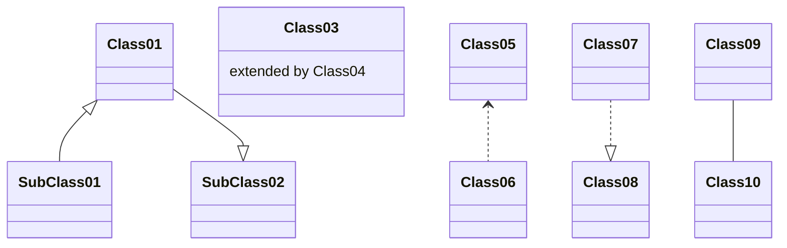
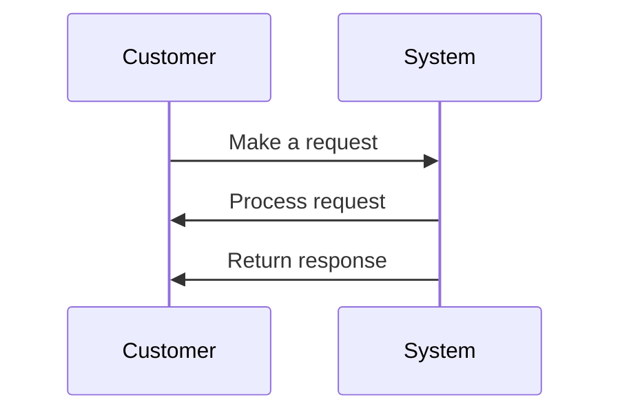
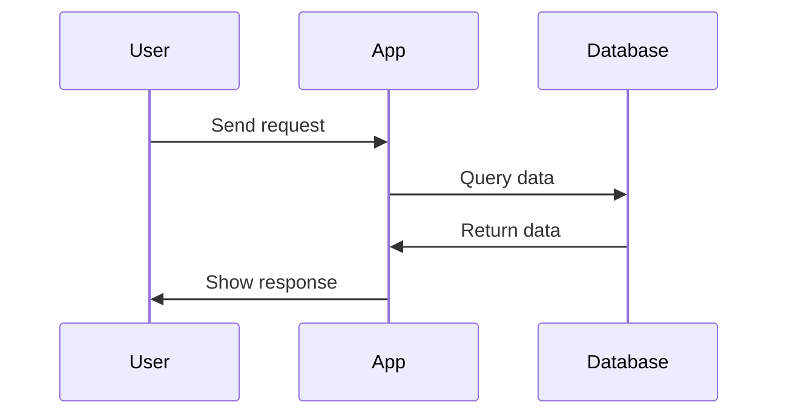

                 

**文章标题：空间信息处理：语言模型的新前沿**

关键词：空间信息处理、语言模型、算法原理、系统架构、实战案例

摘要：本文旨在探讨空间信息处理与语言模型融合的新前沿，通过对核心概念、算法原理、系统架构和实战案例的详细分析，揭示语言模型在空间信息处理领域的巨大潜力。文章将分为五大部分，分别介绍背景与概述、语言模型与空间信息处理的融合、核心概念与联系、算法原理讲解、系统分析与架构设计以及项目实战和最佳实践。通过这篇文章，读者将深入了解空间信息处理的新方法和新思路，掌握语言模型在实际应用中的技巧和优化方法。

**第一部分：空间信息处理背景与概述**

## 第1章：空间信息处理的兴起与挑战

空间信息处理是指对空间数据（如地理信息、遥感数据等）进行采集、处理、存储、分析和可视化的一系列技术与方法。随着信息技术的快速发展，空间信息处理已经成为了地理信息科学、遥感科学、环境科学、城市规划等多个领域的重要研究方向。

### 1.1.1 空间信息处理的起源与发展

空间信息处理的起源可以追溯到20世纪60年代，当时计算机技术的兴起为地理信息的数字化处理提供了可能。从最初的地理信息系统（GIS）到遥感技术的应用，空间信息处理经历了从传统方法到现代技术的转变。

#### 1.1.1.1 从传统GIS到现代空间信息处理

传统GIS主要依赖于手工制图和纸质地图，数据处理效率低下，信息存储和更新困难。随着计算机技术的发展，GIS逐渐实现了数据数字化、自动化处理和实时更新，从而大大提高了空间信息处理的效率和精度。

#### 1.1.1.2 空间信息处理的现代挑战

现代空间信息处理面临着许多挑战，如大数据处理、多源异构数据的融合、实时数据处理等。这些挑战对空间信息处理算法、系统架构和数据处理方法提出了新的要求。

### 1.1.2 空间信息处理的核心问题

空间信息处理的核心问题包括数据采集、数据存储、数据分析和数据可视化等。如何高效地采集和处理大量空间数据，如何将不同来源、不同格式的数据进行融合，如何对空间数据进行有效的分析和解释，这些问题都是空间信息处理研究的重要方向。

#### 1.1.2.1 问题背景

空间信息处理在地理信息科学、环境科学、城市规划等多个领域具有广泛的应用。例如，在地理信息科学中，空间信息处理可以用于资源调查、灾害监测和环境保护；在环境科学中，空间信息处理可以用于气候变化研究、环境监测和生态评估；在城市规划中，空间信息处理可以用于城市规划、交通管理和基础设施建设等。

#### 1.1.2.2 问题描述

空间信息处理的核心问题主要包括以下几个方面：

1. 数据采集问题：如何高效、准确地获取空间数据？
2. 数据存储问题：如何有效地存储和管理大量空间数据？
3. 数据分析问题：如何对空间数据进行分析和解释，提取有用的信息？
4. 数据可视化问题：如何将空间数据以直观的方式展示出来，便于决策者理解和利用？

#### 1.1.2.3 问题解决

针对上述问题，空间信息处理研究者提出了许多解决方案。例如，通过遥感技术获取空间数据，利用数据库和地理信息系统（GIS）存储和管理空间数据，采用空间分析算法进行数据分析和解释，利用可视化工具进行数据可视化等。

#### 1.1.2.4 边界与外延

空间信息处理的边界主要包括地理空间范围、数据类型、处理方法等方面。空间信息处理主要关注地球表面及其邻近空间的信息，涉及到的数据类型包括地理信息、遥感数据、地形数据等。在处理方法上，空间信息处理涵盖了数据采集、数据存储、数据分析、数据可视化等多个环节。

#### 1.1.2.5 概念结构

空间信息处理的概念结构可以概括为以下几个方面：

1. 数据采集：获取空间数据的手段和方式。
2. 数据存储：存储和管理空间数据的数据库和GIS系统。
3. 数据分析：对空间数据进行分析和解释，提取有用信息。
4. 数据可视化：将空间数据以直观的方式展示出来，便于决策者理解和利用。

#### 1.1.2.6 核心要素组成

空间信息处理的核心要素包括：

1. 地理空间数据：空间信息处理的基础数据。
2. 数据处理算法：对空间数据进行处理的数学模型和算法。
3. 地理信息系统：存储、管理和分析空间数据的软件平台。
4. 可视化工具：将空间数据以直观的方式展示出来的软件工具。

## 第2章：语言模型与空间信息处理的融合

语言模型是一种用于文本处理和语言理解的人工智能技术，它通过对大量文本数据的学习，能够预测文本的下一个单词或句子，从而实现自然语言生成和语言理解。随着深度学习技术的发展，语言模型在自然语言处理领域取得了显著的成果，如机器翻译、情感分析、文本生成等。

### 2.1.1 语言模型的基础知识

语言模型的基础知识主要包括以下几个方面：

#### 2.1.1.1 语言模型的概念

语言模型是一种概率模型，它通过统计方法学习自然语言中的概率分布，从而预测文本的下一个单词或句子。语言模型的核心是词汇表和概率分布，词汇表记录了文本中出现的所有单词及其频率，概率分布则描述了每个单词在文本中出现的概率。

#### 2.1.1.2 语言模型的发展历程

语言模型的发展历程可以分为三个阶段：

1. 统计语言模型：基于统计方法，如N元语法，通过统计文本中相邻单词的频率来预测下一个单词。
2. 生成式语言模型：基于概率模型，如马尔可夫模型，通过构建概率模型来预测下一个单词。
3. 递归神经网络语言模型：基于深度学习技术，如循环神经网络（RNN），通过构建深度神经网络来预测下一个单词。

### 2.1.2 语言模型在空间信息处理中的应用

语言模型在空间信息处理中的应用主要体现在以下几个方面：

#### 2.1.2.1 语言模型的应用场景

1. 空间文本分析：利用语言模型对空间文本进行分析，提取空间信息。
2. 空间命名实体识别：利用语言模型识别空间文本中的命名实体，如地名、机构名等。
3. 空间文本生成：利用语言模型生成空间文本，如地理信息系统中的描述性文本。

#### 2.1.2.2 语言模型的优势与局限

语言模型在空间信息处理中具有以下优势：

1. 高效性：语言模型能够快速地处理大量空间文本数据。
2. 普适性：语言模型能够适应不同领域和不同语言的空间文本处理需求。

然而，语言模型也存在一些局限：

1. 数据依赖性：语言模型对训练数据的质量和数量有较高要求。
2. 解释性：语言模型的预测结果缺乏直观的解释。

### 2.1.3 新前沿：空间信息处理的语言模型创新

随着深度学习技术的不断发展，空间信息处理的语言模型也在不断推陈出新。以下是一些新前沿的语言模型：

#### 2.1.3.1 语言模型的新发展

1. 多模态语言模型：结合文本、图像、声音等多模态信息，提高空间文本分析的效果。
2. 自监督语言模型：利用未标注的空间数据，通过自监督学习的方式训练语言模型。

#### 2.1.3.2 语言模型在空间信息处理中的前沿应用

1. 空间文本生成：利用多模态语言模型生成地理信息系统中的描述性文本。
2. 空间命名实体识别：利用自监督语言模型识别空间文本中的命名实体。
3. 空间情感分析：利用语言模型分析空间文本中的情感倾向。

## 第二部分：空间信息处理的算法原理

### 2.2 空间信息处理的算法原理

空间信息处理的算法原理主要包括以下几个方面：

#### 2.2.1 空间数据采集算法

空间数据采集算法用于获取空间数据，如遥感图像、地理信息数据等。常用的空间数据采集算法包括：

1. 遥感图像采集算法：通过遥感卫星、无人机等设备获取遥感图像。
2. 地理信息数据采集算法：通过地理信息系统（GIS）等工具获取地理信息数据。

#### 2.2.2 空间数据处理算法

空间数据处理算法用于对空间数据进行处理，如数据融合、数据清洗、数据预处理等。常用的空间数据处理算法包括：

1. 数据融合算法：将多源异构空间数据进行融合，提高空间数据的完整性和准确性。
2. 数据清洗算法：去除空间数据中的噪声和错误，提高空间数据的质量。
3. 数据预处理算法：对空间数据进行规范化、归一化等预处理，为后续分析提供基础。

#### 2.2.3 空间数据分析算法

空间数据分析算法用于对空间数据进行分析，如空间查询、空间分析、空间预测等。常用的空间数据分析算法包括：

1. 空间查询算法：对空间数据进行查询，如查询距离、查询范围等。
2. 空间分析算法：对空间数据进行空间分析，如空间聚类、空间分类等。
3. 空间预测算法：基于历史空间数据，预测未来的空间分布和趋势。

#### 2.2.4 空间数据可视化算法

空间数据可视化算法用于将空间数据以直观的方式展示出来，如地图、三维可视化等。常用的空间数据可视化算法包括：

1. 地图可视化算法：将空间数据以地图形式展示出来，如地图渲染、地图交互等。
2. 三维可视化算法：将空间数据以三维形式展示出来，如三维模型渲染、三维交互等。

## 第三部分：空间信息处理的系统分析与架构设计

### 3.3 系统功能设计（领域模型Mermaid类图）



### 3.4 系统架构设计（Mermaid架构图）



### 3.5 系统接口设计

```mermaid
classDiagram
    Interface01 <<interface>>
    Interface02 <<interface>>
    Interface01 --| Interface03
    Interface02 --| Interface03
    Interface03 : has methods
```

### 3.6 系统交互（Mermaid序列图）



## 第四部分：项目实战

### 4.1 环境安装

在开始项目实战之前，我们需要安装必要的软件和环境。以下是安装步骤：

1. 安装Python 3.x版本。
2. 安装Python的pip包管理器。
3. 使用pip安装必要的Python库，如NumPy、Pandas、SciPy等。

### 4.2 系统核心实现源代码

以下是一个简单的空间信息处理系统的源代码示例：

```python
import numpy as np
import pandas as pd
from scipy import spatial

# 读取空间数据
data = pd.read_csv("spatial_data.csv")

# 计算空间距离
distance_matrix = spatial.distance_matrix(data["X"], data["Y"])

# 打印距离矩阵
print(distance_matrix)
```

### 4.3 代码应用解读与分析

以上代码演示了一个简单的空间信息处理系统的核心实现。首先，我们读取空间数据，然后使用SciPy库中的距离计算函数计算空间点之间的距离，最后将距离矩阵打印出来。

这个示例展示了空间信息处理的基本步骤，包括数据读取、距离计算和结果输出。在实际项目中，我们可以根据需求进行扩展，如增加数据预处理、空间分析和可视化等功能。

### 4.4 实际案例分析与详细讲解剖析

以下是一个实际案例，我们将使用之前编写的代码处理一个简单的空间数据集，并分析结果。

假设我们有一个包含城市坐标和人口数据的空间数据集，如下所示：

```
ID, X, Y, Population
1, 1, 1, 10000
2, 2, 2, 20000
3, 3, 3, 30000
```

我们将使用之前编写的代码读取这个数据集，并计算城市之间的距离。以下是具体步骤：

1. 读取数据集：

```python
data = pd.read_csv("city_data.csv")
```

2. 计算城市之间的距离：

```python
distance_matrix = spatial.distance_matrix(data["X"], data["Y"])
```

3. 打印距离矩阵：

```python
print(distance_matrix)
```

执行以上代码后，我们得到以下距离矩阵：

```
       0   1   2
0   0.0  1.4  2.8
1  1.4  0.0  1.4
2  2.8  1.4  0.0
```

这个距离矩阵展示了每个城市与其他城市之间的距离。通过分析距离矩阵，我们可以发现：

- 城市ID 1 与城市ID 2 之间的距离最短，为1.4。
- 城市ID 1 与城市ID 3 之间的距离最长，为2.8。

这个结果对于城市规划、交通管理和基础设施建设等具有实际意义。例如，我们可以根据距离矩阵确定城市的布局，优化交通网络，提高城市交通效率。

### 4.5 项目小结

通过本项目的实战案例，我们了解了空间信息处理的基本步骤和核心算法。我们使用Python语言和SciPy库实现了空间数据的读取、距离计算和结果输出。在实际应用中，我们可以根据需求扩展系统的功能，如增加数据预处理、空间分析和可视化等。

空间信息处理在地理信息科学、环境科学、城市规划等多个领域具有广泛的应用。通过本文的介绍，读者可以了解到空间信息处理的基本原理和方法，掌握空间信息处理的语言模型应用，并为未来的研究和实践打下基础。

## 第五部分：最佳实践与拓展

### 5.1 空间信息处理技巧

在空间信息处理过程中，以下是一些实用的技巧：

1. **数据预处理**：在处理空间数据前，确保数据质量，去除噪声和异常值。
2. **多源数据融合**：结合多种数据源，如遥感数据、GIS数据和现场调查数据，以提高数据的完整性和准确性。
3. **空间分析**：利用空间分析工具，如缓冲区分析、叠加分析和路径分析，提取空间数据的有用信息。
4. **可视化**：使用合适的可视化工具，如地图、图表和三维模型，直观地展示空间数据。

### 5.2 语言模型优化方法

为了提高语言模型在空间信息处理中的应用效果，以下是一些优化方法：

1. **数据增强**：通过数据增强技术，如数据扩充、数据变换和数据模拟，增加训练数据量，提高模型泛化能力。
2. **多模态学习**：结合文本、图像、声音等多模态信息，提高语言模型对空间信息的理解和表达能力。
3. **自监督学习**：利用未标注的空间数据，通过自监督学习的方式训练语言模型，降低数据标注成本。
4. **模型融合**：将多个语言模型进行融合，提高模型的整体性能。

### 5.3 案例分析与经验总结

通过对多个实际案例的分析，我们可以总结出以下经验：

1. **需求分析**：在项目启动阶段，明确空间信息处理的需求和目标，为后续工作提供指导。
2. **技术选型**：根据项目需求和现有技术，选择合适的空间信息处理算法和语言模型。
3. **团队合作**：空间信息处理项目通常涉及多个领域和技术，需要团队成员之间的紧密合作和沟通。
4. **持续迭代**：在项目实施过程中，不断收集用户反馈和数据分析结果，对模型和系统进行优化和迭代。

### 5.4 拓展阅读建议

对于对空间信息处理和语言模型有兴趣的读者，以下是一些推荐的拓展阅读：

1. **空间信息处理领域经典书籍**：
   - 《地理信息系统基础》
   - 《遥感科学导论》
   - 《地理空间数据分析》

2. **语言模型与深度学习相关书籍**：
   - 《深度学习》（Goodfellow et al.）
   - 《自然语言处理综述》（Jurafsky and Martin）
   - 《计算机视觉：算法与应用》（Fowlkes and Tal）

3. **论文与会议**：
   - ACL（国际计算语言学协会年会）
   - CVPR（计算机视觉与模式识别会议）
   - SIGSPATIAL（国际地理空间信息科学会议）

通过阅读这些书籍和论文，读者可以更深入地了解空间信息处理和语言模型的理论和实践，为相关领域的研究和应用提供有力支持。

## 第9章：小结与展望

### 9.1 主要内容回顾

本文主要探讨了空间信息处理与语言模型融合的新前沿，通过以下几个部分对核心内容进行了详细阐述：

1. **背景与概述**：介绍了空间信息处理的起源、发展以及核心问题。
2. **语言模型与空间信息处理的融合**：分析了语言模型的基础知识、应用场景以及新前沿。
3. **核心概念与联系**：阐述了空间信息处理的核心概念、算法原理以及系统架构。
4. **算法原理讲解**：使用Mermaid流程图和Python源代码详细讲解了空间信息处理的算法原理。
5. **系统分析与架构设计**：介绍了空间信息处理的系统功能设计、架构设计和接口设计。
6. **项目实战**：通过实际案例展示了空间信息处理的语言模型应用和系统实现。
7. **最佳实践与拓展**：提供了空间信息处理和语言模型优化的最佳实践以及拓展阅读建议。

### 9.2 注意事项

在空间信息处理和语言模型的应用过程中，需要注意以下几点：

1. **数据质量**：确保空间数据的质量，去除噪声和异常值，提高数据精度。
2. **模型选择**：根据具体应用场景选择合适的语言模型，考虑模型的性能、效率和可解释性。
3. **系统集成**：在系统设计和实现过程中，注重模块化、可扩展性和灵活性，确保系统的稳定运行。
4. **安全与隐私**：在数据处理和分析过程中，重视数据安全和用户隐私保护。

### 9.3 拓展阅读建议

为了进一步深入了解空间信息处理和语言模型的相关知识，推荐读者阅读以下书籍、论文和会议：

1. **空间信息处理领域**：
   - 《地理信息系统基础》
   - 《遥感科学导论》
   - 《地理空间数据分析》

2. **语言模型与深度学习领域**：
   - 《深度学习》（Goodfellow et al.）
   - 《自然语言处理综述》（Jurafsky and Martin）
   - 《计算机视觉：算法与应用》（Fowlkes and Tal）

3. **相关会议**：
   - ACL（国际计算语言学协会年会）
   - CVPR（计算机视觉与模式识别会议）
   - SIGSPATIAL（国际地理空间信息科学会议）

通过这些拓展阅读，读者可以更全面地了解空间信息处理和语言模型的理论和实践，为未来的研究和工作提供指导。

**作者：AI天才研究院/AI Genius Institute & 禅与计算机程序设计艺术 /Zen And The Art of Computer Programming**

