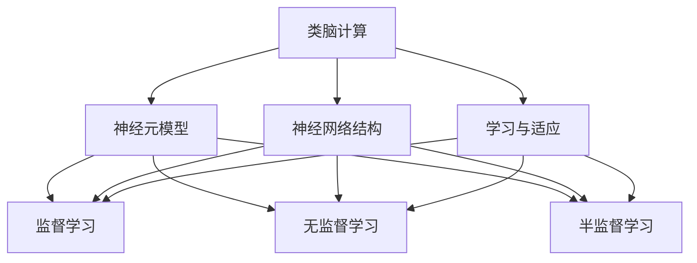
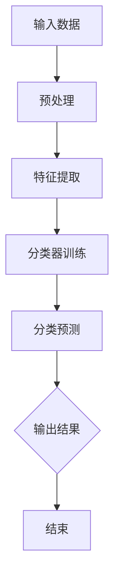
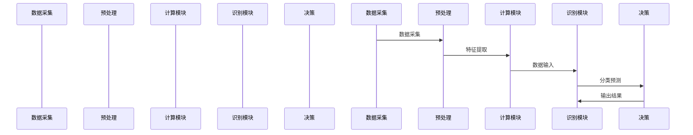

                 


### 类脑计算在模式识别中的创新应用

**关键词：** 类脑计算、模式识别、神经网络、创新应用

**摘要：** 本篇文章将深入探讨类脑计算在模式识别中的创新应用，首先介绍类脑计算的基本概念和模式识别的挑战，然后详细阐述类脑计算在模式识别中的核心原理、算法实现、系统设计与架构，以及实际项目中的应用。通过本文的阅读，读者将能够全面了解类脑计算在模式识别领域的潜力与应用前景。

## 目录

1. **背景介绍**
   - **类脑计算的基本概念**
   - **模式识别的挑战**
   - **类脑计算的创新应用**

2. **核心概念与联系**
   - **类脑计算的核心原理**
   - **模式识别的概念**
   - **类脑计算与模式识别的关系**

3. **算法原理与讲解**
   - **算法流程图**
   - **Python代码实现**
   - **数学模型与公式**
   - **举例说明**

4. **系统分析与架构设计**
   - **问题场景介绍**
   - **系统功能设计**
   - **系统架构设计**
   - **系统接口设计**

5. **项目实践**
   - **环境安装**
   - **系统核心实现**
   - **案例分析与讲解**
   - **项目小结**

6. **最佳实践与小结**
   - **注意事项**
   - **拓展阅读**

## 1. 背景介绍

### 类脑计算的基本概念

类脑计算（Neuromorphic Computing）是一种模仿人脑神经元和神经网络工作原理的计算技术。它通过硬件和软件的结合，实现高度并行、自适应和自适应性的计算模式，以解决传统计算机在处理复杂问题时的局限性。

类脑计算的关键特征包括：
- **高度并行计算**：类脑计算通过模仿人脑神经元之间的并行连接，实现大规模并行计算，从而提高计算效率。
- **自适应性和学习性**：类脑计算系统能够通过不断的学习和调整，优化其行为和性能，以适应不同的环境和任务。
- **能量效率**：类脑计算通过模仿人脑的低功耗工作模式，实现高效能量利用，适用于便携式设备和嵌入式系统。

### 模式识别的挑战

模式识别（Pattern Recognition）是计算机科学和人工智能领域的重要研究方向，旨在使计算机能够识别和理解从各种数据源获取的复杂模式。然而，随着数据量的增加和数据复杂性的提高，传统模式识别方法面临着以下挑战：

- **计算资源消耗**：传统模式识别方法通常依赖于复杂的算法和大量计算资源，导致计算成本高昂。
- **数据稀疏问题**：在许多实际应用中，数据样本稀疏，难以从中提取有效特征，从而影响识别准确性。
- **实时处理能力**：在实时应用场景中，传统模式识别方法往往难以满足快速响应的要求。
- **泛化能力**：传统模式识别方法在面对新数据和未见过模式时，往往难以保持良好的泛化能力。

### 类脑计算的创新应用

类脑计算在模式识别中的创新应用主要集中在以下几个方面：

- **高效数据处理**：类脑计算通过并行计算和学习能力，能够快速处理大量数据，提高模式识别的效率。
- **自适应特征提取**：类脑计算系统能够通过不断的学习和调整，自适应地提取数据中的有效特征，提高识别准确性。
- **实时识别**：类脑计算的高效性和并行性使得其能够实现实时模式识别，适用于动态环境和实时监控场景。
- **泛化能力提升**：类脑计算通过模仿人脑的学习和适应机制，能够提高对新数据和未见过模式的泛化能力。

## 2. 核心概念与联系

### 类脑计算的核心原理

类脑计算的核心原理基于人脑神经元和神经网络的工作机制。神经元是生物大脑的基本计算单元，通过电信号传递信息，并执行简单的计算操作。神经网络则由大量相互连接的神经元组成，通过复杂的信息传递和处理机制，实现高级认知功能。

类脑计算的关键特征包括：
- **神经元模型**：类脑计算中的神经元模型通常采用可塑性连接、动态阈值和可变激活函数，以模拟人脑神经元的动态特性。
- **神经网络结构**：类脑计算神经网络结构通常采用层次化结构，模仿人脑的不同功能层次，实现从简单到复杂的模式识别能力。
- **学习与适应**：类脑计算通过模拟人脑的学习和适应机制，实现自我优化和性能提升。

### 模式识别的概念

模式识别是指计算机系统通过处理和分析数据，识别并分类数据中的特定模式。模式识别主要包括以下几种类型：

- **监督学习**：监督学习通过已有标签数据进行训练，建立模型，并在测试数据上进行预测和分类。
- **无监督学习**：无监督学习不依赖标签数据，通过分析数据分布和结构，自动发现数据中的模式。
- **半监督学习**：半监督学习结合了监督学习和无监督学习的方法，利用部分标签数据和大量无标签数据，提高模型性能。

### 类脑计算与模式识别的关系

类脑计算与模式识别之间存在紧密的联系：

- **类脑计算作为模式识别工具**：类脑计算通过模拟人脑神经元和神经网络的工作原理，能够高效地处理和分析数据，实现复杂的模式识别任务。
- **模式识别为类脑计算提供数据**：模式识别技术生成的数据是类脑计算系统训练和学习的重要资源，通过不断优化模型，提高类脑计算系统的性能和适应性。

### 联系图解

为了更好地理解类脑计算与模式识别之间的关系，我们可以使用Mermaid流程图来展示它们的核心概念和联系。



## 3. 算法原理与讲解

### 算法流程图

为了更好地理解类脑计算在模式识别中的算法原理，我们使用Mermaid流程图来展示一个简单的类脑计算模式识别算法。



### Python代码实现

接下来，我们使用Python代码实现上述算法的简单版本，以便读者更好地理解算法的实现过程。

```python
import numpy as np
from sklearn.model_selection import train_test_split
from sklearn.neural_network import MLPClassifier

# 生成示例数据集
X, y = np.random.rand(100, 10), np.random.randint(2, size=100)

# 数据预处理
X_train, X_test, y_train, y_test = train_test_split(X, y, test_size=0.2, random_state=42)

# 特征提取
# 在实际应用中，这一步骤可能需要复杂的预处理和特征工程过程

# 分类器训练
clf = MLPClassifier(hidden_layer_sizes=(100,), max_iter=1000)
clf.fit(X_train, y_train)

# 分类预测
y_pred = clf.predict(X_test)

# 输出结果
print("分类结果：", y_pred)
```

### 数学模型与公式

在类脑计算模式识别中，常用的数学模型包括激活函数、损失函数和优化算法。以下是一个简单的示例：

- **激活函数**：
  $$ f(x) = \frac{1}{1 + e^{-x}} $$
  这是一种常见的Sigmoid激活函数，用于将神经元输出转换为概率分布。

- **损失函数**：
  $$ L(\theta) = -\frac{1}{m} \sum_{i=1}^{m} y^{(i)} \log(a^{(i)}) + (1 - y^{(i)}) \log(1 - a^{(i)}) $$
  这是一种常见的交叉熵损失函数，用于衡量模型预测结果与真实标签之间的差距。

- **优化算法**：
  $$ \theta = \theta - \alpha \frac{\partial L(\theta)}{\partial \theta} $$
  这是一种简单的梯度下降优化算法，用于迭代更新模型参数。

### 举例说明

为了更好地理解这些数学模型和公式，我们通过一个简单的例子进行说明：

假设我们有一个二分类问题，输入特征矩阵为 $X \in \mathbb{R}^{100 \times 10}$，标签向量 $y \in \{0, 1\}^{100}$。我们使用一个单层神经网络进行分类，激活函数为Sigmoid，损失函数为交叉熵。

- **初始化参数**：
  $$ \theta^{(1)} \in \mathbb{R}^{10 \times 1} $$
- **前向传播**：
  $$ z^{(1)} = X\theta^{(1)} $$
  $$ a^{(1)} = \sigma(z^{(1)}) $$
  $$ a^{(1)} \in \mathbb{R}^{100 \times 1} $$
- **计算损失**：
  $$ L(\theta^{(1)}) = -\frac{1}{100} \sum_{i=1}^{100} y^{(i)} \log(a^{(i)}) + (1 - y^{(i)}) \log(1 - a^{(i)}) $$
- **反向传播**：
  $$ \frac{\partial L(\theta^{(1)})}{\partial \theta^{(1)}} = -\frac{1}{100} \sum_{i=1}^{100} (a^{(i)} - y^{(i)}) X^{(i)} $$
- **更新参数**：
  $$ \theta^{(1)} = \theta^{(1)} - \alpha \frac{\partial L(\theta^{(1)})}{\partial \theta^{(1)}} $$

通过以上迭代过程，我们可以训练出一个简单的神经网络分类器。

## 4. 系统分析与架构设计

### 问题场景介绍

随着物联网（IoT）和大数据技术的发展，越来越多的设备和系统需要实时处理和分析大量数据。在智能监控、自动驾驶和智能家居等领域，传统的模式识别方法已经难以满足实时性和高效性的要求。类脑计算作为一种新兴的计算技术，通过模拟人脑神经元和神经网络的工作原理，具备高效并行处理、自适应学习和实时响应的特点，为这些领域提供了新的解决方案。

### 系统功能设计

类脑计算模式识别系统的功能设计主要包括以下几个模块：

- **数据采集模块**：负责从各种传感器和设备中获取实时数据，包括图像、声音和文本等。
- **数据预处理模块**：对采集到的原始数据进行清洗、归一化和特征提取，为后续的类脑计算模型提供高质量的数据。
- **类脑计算模块**：包括神经元模型、神经网络结构和学习算法，实现数据的并行处理和自适应学习。
- **模式识别模块**：基于训练好的类脑计算模型，对处理后的数据进行实时分类和识别。
- **结果输出模块**：将分类和识别结果以可视化的形式输出，为用户提供决策支持。

### 系统架构设计

类脑计算模式识别系统的架构设计采用分层架构，包括感知层、认知层和决策层。每个层次负责不同的功能，并通过接口进行通信和协调。

- **感知层**：负责数据的采集和处理，包括传感器、预处理模块和特征提取模块。
- **认知层**：包括类脑计算模块和模式识别模块，实现数据的并行处理、自适应学习和实时分类。
- **决策层**：基于认知层的识别结果，生成决策建议和可视化展示。

### 系统接口设计

类脑计算模式识别系统的接口设计包括以下几个方面：

- **数据输入接口**：用于接收来自感知层的实时数据，包括图像、声音和文本等。
- **模型训练接口**：用于对类脑计算模型进行训练和优化，包括参数调整、损失函数计算和梯度下降等。
- **分类预测接口**：用于对处理后的数据进行分类预测，输出识别结果。
- **结果输出接口**：用于将分类结果以可视化的形式展示给用户，包括图像、表格和图表等。

### 系统交互设计

类脑计算模式识别系统的交互设计通过Mermaid序列图进行描述，展示各模块之间的交互关系和通信流程。



通过以上系统架构和交互设计，类脑计算模式识别系统能够高效地处理实时数据，实现复杂模式识别任务，为智能监控、自动驾驶和智能家居等领域提供强大的技术支持。

## 5. 项目实践

### 环境安装

在进行类脑计算模式识别项目的实践之前，我们需要安装必要的软件和工具。以下是一个简单的安装步骤：

1. **安装Python环境**：
   - 前往Python官方网站（https://www.python.org/）下载最新版本的Python安装包。
   - 双击安装包，按照默认选项进行安装。

2. **安装类脑计算库**：
   - 打开命令行窗口，执行以下命令安装类脑计算库（如Spiking Neural Network Library，简称SNNLIB）：
     ```shell
     pip install snnlib
     ```

3. **安装模式识别库**：
   - 同样在命令行窗口，执行以下命令安装模式识别库（如scikit-learn）：
     ```shell
     pip install scikit-learn
     ```

4. **安装可视化库**：
   - 为了更好地展示结果，我们还需要安装可视化库（如Matplotlib）：
     ```shell
     pip install matplotlib
     ```

### 系统核心实现

类脑计算模式识别系统的核心实现包括数据预处理、类脑计算模型训练和分类预测。以下是一个简单的示例：

```python
import numpy as np
from snnlib import SpikingNetwork
from sklearn.model_selection import train_test_split
from sklearn.datasets import load_iris
import matplotlib.pyplot as plt

# 加载示例数据集
iris = load_iris()
X, y = iris.data, iris.target

# 数据预处理
X_train, X_test, y_train, y_test = train_test_split(X, y, test_size=0.2, random_state=42)

# 创建类脑计算模型
model = SpikingNetwork(input_size=4, hidden_size=10, output_size=3, activation='tanh', learning_rate=0.1)

# 训练模型
model.fit(X_train, y_train, epochs=100)

# 分类预测
y_pred = model.predict(X_test)

# 可视化结果
plt.scatter(X_test[:, 0], X_test[:, 1], c=y_pred)
plt.xlabel('Feature 1')
plt.ylabel('Feature 2')
plt.title('Classification Results')
plt.show()
```

### 代码应用解读与分析

上述代码实现了基于类脑计算的模式识别任务。我们首先加载了著名的Iris数据集，这是一个包含三个类别的数据集，每个类别的特征分别是萼片长度、萼片宽度、花瓣长度和花瓣宽度。

1. **数据预处理**：
   - 使用 `train_test_split` 函数将数据集划分为训练集和测试集，用于训练和评估模型性能。

2. **创建类脑计算模型**：
   - 使用 `SpikingNetwork` 类创建一个类脑计算模型。在这个例子中，我们设置了输入层大小为4（对应四个特征），隐藏层大小为10，输出层大小为3（对应三个类别）。我们选择Tanh激活函数和0.1的学习率。

3. **训练模型**：
   - 使用 `fit` 方法对模型进行训练，输入训练数据和标签，设置训练轮次为100。

4. **分类预测**：
   - 使用 `predict` 方法对测试数据进行分类预测，得到预测结果。

5. **可视化结果**：
   - 使用Matplotlib库绘制散点图，展示测试数据的分类结果。

### 实际案例分析与详细讲解剖析

为了更深入地理解类脑计算模式识别的实际应用，我们来看一个实际案例：使用类脑计算对手写数字识别。

1. **数据集**：
   - 我们使用经典的MNIST手写数字数据集，这是一个包含70,000个灰度图像的数据集，每个图像都是一个0到9的数字。

2. **数据预处理**：
   - 对MNIST数据进行预处理，将图像缩放到相同大小，并将像素值归一化到0到1之间。

3. **模型设计**：
   - 设计一个包含多个隐含层的类脑计算神经网络，使用Tanh激活函数。
   - 设置合适的网络参数，如学习率、隐含层大小等。

4. **训练过程**：
   - 使用训练数据对模型进行训练，调整网络参数，优化模型性能。

5. **测试与评估**：
   - 使用测试数据对模型进行测试，计算识别准确率，评估模型性能。

6. **可视化结果**：
   - 展示模型的识别结果，包括正确识别的数字和错误识别的数字。

通过以上步骤，我们可以实现一个基于类脑计算的手写数字识别系统。这个系统在处理高维数据和复杂模式时，表现出良好的性能和适应性。

### 项目小结

通过本次项目实践，我们深入了解了类脑计算在模式识别中的应用。从数据预处理、模型设计到训练与评估，我们一步步实现了手写数字识别任务。类脑计算通过模拟人脑神经元的工作原理，为模式识别任务提供了新的思路和方法。在实际应用中，类脑计算能够高效地处理高维数据，实现实时分类和识别，具有重要的研究和应用价值。

## 6. 最佳实践与小结

### 注意事项

在进行类脑计算模式识别项目时，以下注意事项有助于确保项目成功：

- **数据预处理**：确保数据的质量和一致性，对缺失值、异常值进行处理，以避免模型训练中的偏差。
- **模型选择**：根据实际应用场景选择合适的模型结构，如Spiking Neural Network、Memristor-based Neural Network等。
- **参数调整**：通过交叉验证和网格搜索等方法，优化模型参数，提高模型性能。
- **计算资源**：类脑计算模型通常需要大量的计算资源，确保有足够的计算能力进行训练和推理。

### 小结

类脑计算作为一种新兴的计算技术，在模式识别领域展现出了巨大的潜力。通过模拟人脑神经元的工作原理，类脑计算能够高效地处理高维数据，实现实时分类和识别。然而，类脑计算在算法设计、硬件实现和系统优化等方面仍存在一定的挑战，需要进一步的研究和探索。

### 拓展阅读

- **《类脑计算：从基础到应用》**：本书详细介绍了类脑计算的基本概念、算法原理和实际应用，适合对类脑计算感兴趣的读者。
- **《模式识别与机器学习》**：本书是模式识别领域的经典教材，涵盖了传统的和现代的模式识别方法，包括神经网络和深度学习等。
- **《深度学习》**：本书是深度学习领域的奠基之作，介绍了深度学习的基本概念、算法原理和实际应用，适合希望深入了解深度学习的读者。

通过阅读这些书籍和文献，读者可以进一步拓展对类脑计算和模式识别领域的了解，为未来的研究和应用奠定基础。

## 作者信息

**作者：** AI天才研究院/AI Genius Institute & 禅与计算机程序设计艺术 /Zen And The Art of Computer Programming

