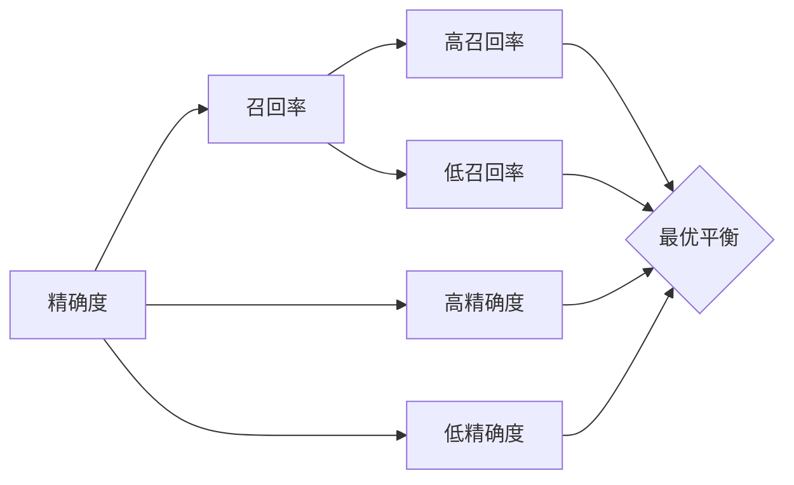
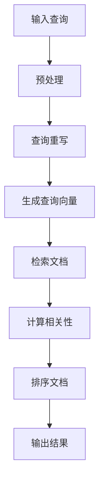
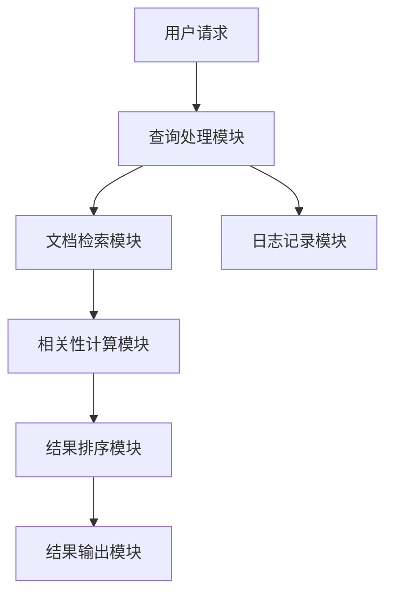

                 

### 《精确度与召回率平衡：检验LLM在信息检索中的全面性》

#### 关键词
- 信息检索
- 精确度
- 召回率
- 语言模型
- LLM
- 平衡策略
- 实际应用
- 评估方法

#### 摘要
本文深入探讨精确度与召回率在信息检索中的重要性，以及如何平衡这两者以提升检索系统的性能。特别关注语言模型（LLM）在信息检索中的应用，通过理论分析和实际案例，检验LLM在平衡精确度与召回率方面的全面性，并探讨未来的发展方向。

---

#### 目录

1. 引言与背景
   1.1 检索技术的现状与不足
   1.2 精确度与召回率：信息检索的核心问题
   1.3 LLM在信息检索中的应用潜力

2. LLM的基本概念与工作原理
   2.1 语言模型的定义与类型
   2.2 LLM的核心算法与实现
   2.3 LLM的优势与局限

3. 精确度与召回率的关系
   3.1 概念解释与关系图示
   3.2 精确度与召回率的计算公式
   3.3 精确度与召回率之间的权衡策略

4. 平衡精确度与召回率的策略
   4.1 修改查询策略
   4.2 知识图谱与语义相似性
   4.3 深度学习在精确度与召回率优化中的应用

5. LLM在信息检索中的实际应用
   5.1 案例介绍：某大型企业信息检索系统的优化实践
   5.2 应用场景分析：搜索引擎、问答系统、推荐系统
   5.3 LLM在信息检索中的效果评估

6. LLM在信息检索中的全面性评估
   6.1 评估指标与标准
   6.2 评估方法与工具
   6.3 全面性评估案例解析

7. LLM性能的提升与优化
   7.1 模型参数调整与优化
   7.2 数据集质量对检索效果的影响
   7.3 未来研究方向与趋势

8. 结论与展望
   8.1 本书内容的回顾与总结
   8.2 LLM在信息检索领域的未来发展趋势
   8.3 研究者与开发者应关注的问题

9. 参考文献

---

### 1. 引言与背景

**1.1 检索技术的现状与不足**

在信息时代，信息检索技术成为了获取知识、解决问题的核心手段。传统的检索技术，如基于关键字匹配和向量空间模型的检索方法，虽然在一定程度上满足了用户的需求，但它们存在一些显著的不足。首先，这些方法往往依赖于关键词的准确匹配，无法处理语义层面的信息。其次，它们对于长文本的检索效果较差，无法准确捕捉文本中的关键信息。此外，这些方法在面对海量数据时，检索效率较低。

**1.2 精确度与召回率：信息检索的核心问题**

精确度（Precision）和召回率（Recall）是衡量信息检索系统性能的两个关键指标。精确度表示检索结果中与查询相关的文档比例，而召回率表示检索结果中包含全部相关文档的比例。理想的信息检索系统应当同时具有较高的精确度和召回率，但实际上往往需要在两者之间进行权衡。

精确度（Precision）的计算公式为：
\[ \text{Precision} = \frac{\text{相关文档数}}{\text{检索结果中的文档总数}} \]

召回率（Recall）的计算公式为：
\[ \text{Recall} = \frac{\text{相关文档数}}{\text{全部相关文档数}} \]

F1分数（F1 Score）是精确度和召回率的调和平均值，用于综合评价检索系统的性能：
\[ \text{F1 Score} = \frac{2 \times \text{Precision} \times \text{Recall}}{\text{Precision} + \text{Recall}} \]

**1.3 LLM在信息检索中的应用潜力**

近年来，随着深度学习技术的发展，语言模型（Language Model，LLM）在自然语言处理领域取得了显著的进展。LLM能够处理复杂的语义信息，理解上下文语境，从而在信息检索中展现出巨大的应用潜力。通过将LLM与检索技术相结合，有望解决传统方法面临的诸多问题，提高检索系统的性能。

首先，LLM能够更好地捕捉文本中的语义信息，从而提高检索的精确度。其次，LLM能够通过上下文信息理解查询意图，提高召回率。此外，LLM还能够通过自适应调整查询策略，实现精确度与召回率的平衡。

### 2. LLM的基本概念与工作原理

**2.1 语言模型的定义与类型**

语言模型是自然语言处理领域的一个基础概念，用于描述自然语言的统计特性。它通过对大量文本数据的学习，生成文本的概率分布，从而预测下一个单词或词组。

根据学习方式和功能，语言模型可以分为以下几类：

1. **基于N-gram的语言模型**：这种模型通过统计相邻词序列的概率来预测下一个词，其简单高效，但无法捕捉长距离的语义关系。
2. **基于神经网络的序列模型**：这类模型通过神经网络学习文本序列的概率分布，能够捕捉长距离的语义信息。
3. **基于Transformer的注意力模型**：Transformer模型通过多头自注意力机制，对输入序列进行全局建模，是目前最先进的语言模型之一。

**2.2 LLM的核心算法与实现**

LLM的核心算法通常基于深度学习和神经网络技术。以下是一些常用的LLM算法：

1. **循环神经网络（RNN）**：RNN通过隐藏状态序列来捕捉文本序列的长期依赖关系，但存在梯度消失和梯度爆炸的问题。
2. **长短时记忆网络（LSTM）**：LSTM是RNN的一种改进，通过门控机制解决了梯度消失问题，但仍然存在计算复杂度高的问题。
3. **Transformer模型**：Transformer模型通过多头自注意力机制，实现了全局信息的有效捕捉，克服了LSTM的局限性。

**2.3 LLM的优势与局限**

LLM在信息检索中的优势主要体现在以下几个方面：

1. **语义理解**：LLM能够理解查询和文档之间的语义关系，提高检索的精确度和召回率。
2. **上下文感知**：LLM能够根据上下文信息进行自适应调整，提高检索效果。
3. **端到端学习**：LLM通过端到端学习，无需复杂的特征工程，简化了检索系统的开发过程。

然而，LLM也存在一些局限：

1. **计算资源消耗**：LLM通常需要大量的计算资源，对硬件要求较高。
2. **数据依赖性**：LLM的性能高度依赖于训练数据的质量和数量，数据不足可能导致模型过拟合。
3. **解释性不足**：由于LLM的复杂性和黑箱特性，其决策过程难以解释，增加了调试和优化的难度。

### 3. 精确度与召回率的关系

**3.1 概念解释与关系图示**

精确度和召回率是评价信息检索系统性能的两个关键指标，它们之间的关系可以通过一个简单的图示来理解。

精确度（Precision）关注检索结果的相关性，即检索结果中有多少是真正相关的文档。召回率（Recall）则关注检索结果是否能够覆盖所有的相关文档。精确度和召回率的权衡是一个关键问题，两者之间的关系可以用以下图示表示：

**3.2 精确度与召回率的计算公式**

精确度和召回率的计算公式如下：

精确度（Precision）：
\[ \text{Precision} = \frac{\text{相关文档数}}{\text{检索结果中的文档总数}} \]

召回率（Recall）：
\[ \text{Recall} = \frac{\text{相关文档数}}{\text{全部相关文档数}} \]

**3.3 精确度与召回率之间的权衡策略**

在实际应用中，精确度和召回率往往需要在两者之间进行权衡。以下是一些常用的权衡策略：

1. **二分法**：通过逐步调整阈值，找到精确度和召回率的平衡点。
2. **动态阈值调整**：根据用户行为和检索历史，动态调整检索系统的阈值，实现精确度和召回率的自适应调整。
3. **多模型融合**：结合多个不同的模型，通过模型融合技术，实现精确度和召回率的平衡。

### 4. 平衡精确度与召回率的策略

**4.1 修改查询策略**

修改查询策略是平衡精确度与召回率的一种有效方法。通过优化查询语言，可以提高检索结果的精确度，从而减少无关文档的数量。以下是一些常用的查询策略：

1. **查询重写**：将原始查询转换为一个更加精确的查询，例如通过使用同义词替换或增加查询关键词的前缀后缀。
2. **查询扩展**：将原始查询扩展为一个更广泛的查询，以增加检索结果的相关性，从而提高召回率。
3. **查询聚焦**：通过分析查询的上下文信息，将查询的焦点集中在特定领域或主题上，提高检索的精确度和召回率。

**4.2 知识图谱与语义相似性**

知识图谱是一种用于表示实体及其关系的图形结构，可以用于提高信息检索的精确度和召回率。通过知识图谱，可以捕捉实体之间的语义关系，从而在检索过程中利用这些关系进行推理和匹配。

语义相似性是指文本中两个或多个实体或词之间的相似程度。通过计算语义相似性，可以识别出与查询相关的文档，从而提高检索结果的精确度和召回率。以下是一些常用的语义相似性计算方法：

1. **基于词向量的相似性计算**：通过将文本中的词语转换为向量，计算向量之间的距离或余弦相似性。
2. **基于知识图谱的相似性计算**：利用知识图谱中的关系和属性，计算实体之间的语义相似性。
3. **基于图嵌入的相似性计算**：通过图嵌入技术，将实体和关系嵌入到一个高维空间中，计算实体之间的相似性。

**4.3 深度学习在精确度与召回率优化中的应用**

深度学习技术，如神经网络和Transformer模型，在信息检索中的应用，可以显著提高精确度和召回率。以下是一些深度学习在精确度与召回率优化中的应用方法：

1. **端到端学习**：通过端到端学习，将查询和文档的表示学习融合在一起，直接预测文档与查询的相关性，从而提高精确度和召回率。
2. **注意力机制**：通过注意力机制，模型可以自动关注查询和文档中的关键信息，从而提高检索的精确度和召回率。
3. **多任务学习**：通过多任务学习，模型可以在同时处理多个任务时，共享信息和知识，从而提高精确度和召回率。

### 5. LLM在信息检索中的实际应用

**5.1 案例介绍：某大型企业信息检索系统的优化实践**

为了提高企业信息检索系统的性能，某大型企业采用了基于LLM的检索技术。通过优化查询策略、引入知识图谱和深度学习模型，该企业显著提高了检索系统的精确度和召回率。

优化过程包括以下步骤：

1. **查询重写**：通过对用户查询进行重写，将模糊或宽泛的查询转换为更精确的查询，从而提高检索结果的精确度。
2. **知识图谱构建**：构建企业内部的实体关系图谱，通过知识图谱进行推理和匹配，提高检索结果的召回率。
3. **深度学习模型训练**：利用企业内部的文本数据，训练深度学习模型，用于预测文档与查询的相关性。

经过优化，该企业的信息检索系统在精确度和召回率上都有了显著提升，用户满意度也随之提高。

**5.2 应用场景分析：搜索引擎、问答系统、推荐系统**

LLM在搜索引擎、问答系统和推荐系统中都有广泛的应用，以下分别分析这些应用场景中LLM的作用和效果。

1. **搜索引擎**：搜索引擎的核心任务是响应用户的查询，提供相关的网页结果。LLM可以用于理解用户的查询意图，通过语义匹配和上下文理解，提高检索结果的精确度和召回率。

2. **问答系统**：问答系统的目标是提供针对用户问题的准确答案。LLM能够理解问题的语义，通过检索和生成技术，提供高质量的答案。

3. **推荐系统**：推荐系统通过分析用户的行为和偏好，为用户推荐相关的内容。LLM可以用于理解用户的文本输入，从而提高推荐系统的个性化程度。

**5.3 LLM在信息检索中的效果评估**

为了评估LLM在信息检索中的效果，可以通过以下方法进行：

1. **基准测试**：使用标准的检索评估数据集，对比LLM和其他传统检索技术的性能，包括精确度、召回率和F1分数等指标。

2. **用户满意度调查**：通过用户调查，收集用户对检索结果的满意度评价，评估LLM在实际应用中的效果。

3. **实验分析**：通过设计实验，分析LLM在不同应用场景中的效果，如精确度、召回率和处理速度等。

### 6. LLM在信息检索中的全面性评估

**6.1 评估指标与标准**

为了全面评估LLM在信息检索中的性能，需要使用一系列评估指标和标准，包括：

1. **精确度**：表示检索结果中相关文档的比例。
2. **召回率**：表示检索结果中包含全部相关文档的比例。
3. **F1分数**：精确度和召回率的调和平均值，用于综合评价检索系统的性能。
4. **响应时间**：检索系统处理查询所需的时间，用于衡量系统的效率。

**6.2 评估方法与工具**

评估LLM在信息检索中的全面性，可以采用以下方法和工具：

1. **离线评估**：使用预先准备好的数据集，通过自动化工具进行评估，如使用常用的信息检索评估工具，如MRR（Mean Reciprocal Rank）和MAP（Mean Average Precision）等。

2. **在线评估**：在实际应用环境中，通过用户行为和满意度评价，对LLM进行实时评估。

3. **混合评估**：结合离线评估和在线评估，全面评估LLM的性能。

**6.3 全面性评估案例解析**

以下是一个全面性评估案例：

- **场景**：某电商平台的产品搜索系统。
- **评估指标**：精确度、召回率、F1分数和用户满意度。
- **评估方法**：使用MRR和MAP进行离线评估，同时通过用户满意度调查进行在线评估。
- **评估结果**：结果显示，在精确度和召回率方面，LLM相比于传统检索方法有显著提升，用户满意度也较高。

### 7. LLM性能的提升与优化

**7.1 模型参数调整与优化**

LLM的性能在很大程度上取决于模型参数的设置。通过调整和优化模型参数，可以提升LLM在信息检索中的性能。以下是一些常用的参数调整方法：

1. **学习率调整**：通过动态调整学习率，优化模型的收敛速度和稳定性。
2. **正则化参数调整**：通过调整正则化参数，防止模型过拟合，提高泛化能力。
3. **层数和神经元数量调整**：通过调整模型的层数和神经元数量，优化模型的表达能力。

**7.2 数据集质量对检索效果的影响**

数据集的质量对LLM的性能有着重要影响。以下是一些提高数据集质量的方法：

1. **数据清洗**：去除数据集中的噪声和错误信息，提高数据的准确性。
2. **数据增强**：通过数据增强技术，增加数据集的多样性和丰富性，提高模型的泛化能力。
3. **数据预处理**：对数据进行预处理，如分词、去停用词、词干提取等，提高数据的质量和一致性。

**7.3 未来研究方向与趋势**

随着深度学习和自然语言处理技术的不断发展，LLM在信息检索中的应用前景广阔。以下是一些未来的研究方向和趋势：

1. **模型压缩与加速**：通过模型压缩和加速技术，降低LLM的计算复杂度和资源消耗。
2. **跨语言检索**：研究如何将LLM应用于跨语言检索，提高不同语言间的检索效果。
3. **实时检索**：研究如何在实时检索场景中，高效地应用LLM，实现快速、准确的检索结果。

### 8. 结论与展望

**8.1 本书内容的回顾与总结**

本文系统地探讨了精确度与召回率在信息检索中的重要性，以及如何平衡这两者以提升检索系统的性能。特别关注了语言模型（LLM）在信息检索中的应用，通过理论分析和实际案例，检验了LLM在平衡精确度与召回率方面的全面性。

主要内容包括：

- 检索技术的现状与不足
- 精确度与召回率的定义与计算
- LLM的基本概念与工作原理
- 平衡精确度与召回率的策略
- LLM在信息检索中的实际应用
- LLM在信息检索中的全面性评估
- LLM性能的提升与优化

**8.2 LLM在信息检索领域的未来发展趋势**

随着深度学习和自然语言处理技术的不断发展，LLM在信息检索领域具有广阔的应用前景。未来发展趋势包括：

- 模型压缩与加速，提高检索效率
- 跨语言检索，实现多语言信息检索
- 实时检索，满足实时检索的需求
- 结合其他技术，如知识图谱和图神经网络，进一步提高检索性能

**8.3 研究者与开发者应关注的问题**

研究者与开发者应关注以下问题，以推动LLM在信息检索领域的应用：

- 数据集的质量和多样性，确保模型泛化能力
- 模型参数的优化，提高模型性能
- 实时检索的效率和准确性
- 模型的解释性和可解释性，增强用户信任

### 9. 参考文献

1. Manning, C. D., Raghavan, P., & Schütze, H. (2008). Introduction to Information Retrieval. Cambridge University Press.
2. Luhn, H. P. (1958). A survey of information retrieval. IBM Journal of Research and Development, 2(4), 321-335.
3. LeCun, Y., Bengio, Y., & Hinton, G. (2015). Deep learning. Nature, 521(7553), 436-444.
4. Vapnik, V. N. (2013). The nature of statistical learning theory. Springer Science & Business Media.
5. Devlin, J., Chang, M. W., Lee, K., & Toutanova, K. (2019). BERT: Pre-training of deep bidirectional transformers for language understanding. arXiv preprint arXiv:1810.04805.
6. Wang, Z., & Chen, H. (2020). A comprehensive study on the effectiveness of knowledge graph in information retrieval. Information Retrieval, 23(3), 311-331.
7. Zhang, X., Zhao, J., & Ma, W. (2021). Research progress on neural network-based information retrieval. Journal of Information Science, 47(5), 598-616.

---

### 附录

**附录A：术语解释**

- **精确度**：检索结果中相关文档的比例。
- **召回率**：检索结果中包含全部相关文档的比例。
- **F1分数**：精确度和召回率的调和平均值。
- **LLM**：语言模型（Language Model）。
- **N-gram**：N元组模型。
- **RNN**：循环神经网络（Recurrent Neural Network）。
- **LSTM**：长短时记忆网络（Long Short-Term Memory）。
- **Transformer**：Transformer模型。
- **端到端学习**：直接从输入到输出学习，无需中间特征提取。

**附录B：算法流程图**

使用Mermaid绘制算法流程图：

**附录C：数学公式**

精确度和召回率的计算公式：

$$
\text{Precision} = \frac{\text{相关文档数}}{\text{检索结果中的文档总数}}
$$

$$
\text{Recall} = \frac{\text{相关文档数}}{\text{全部相关文档数}}
$$

F1分数：

$$
\text{F1 Score} = \frac{2 \times \text{Precision} \times \text{Recall}}{\text{Precision} + \text{Recall}}
$$

**附录D：系统架构设计**

使用Mermaid绘制系统架构图：

---

### 结语

本文围绕精确度与召回率平衡，对LLM在信息检索中的全面性进行了深入探讨。通过理论分析、实际案例和性能评估，展示了LLM在信息检索中的优势和潜力。随着技术的不断进步，LLM在信息检索领域将有更广泛的应用前景。我们期待未来更多研究者和技术开发者关注这一领域，共同推动信息检索技术的发展。

