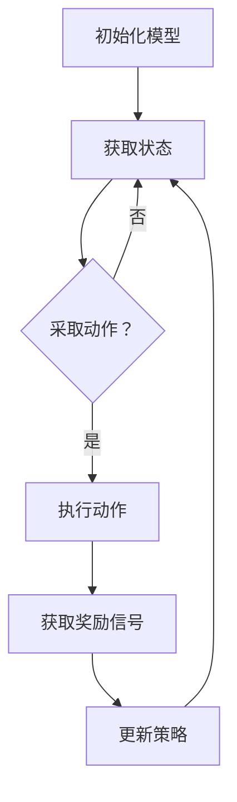
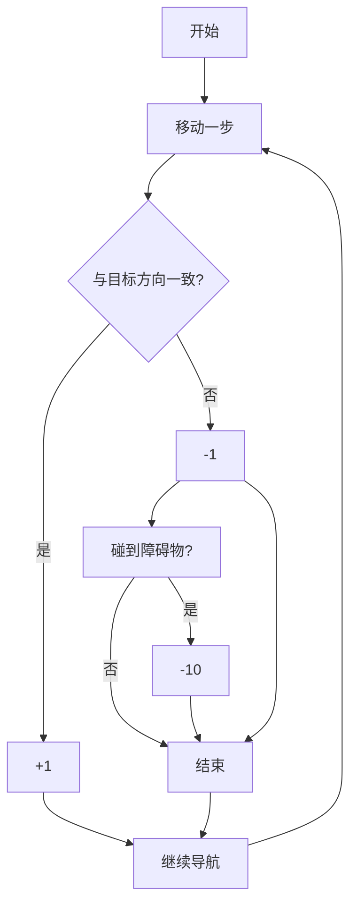
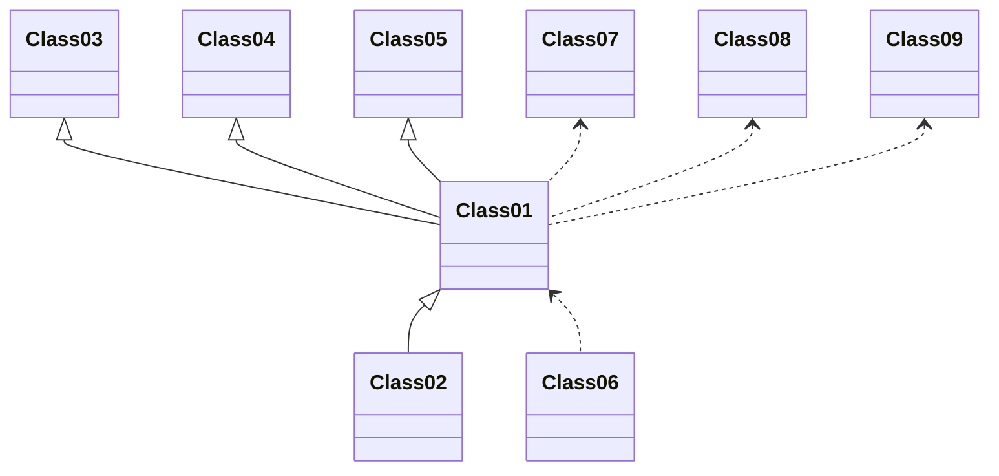
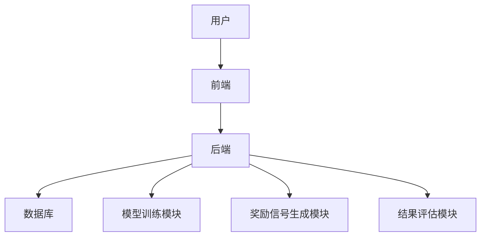
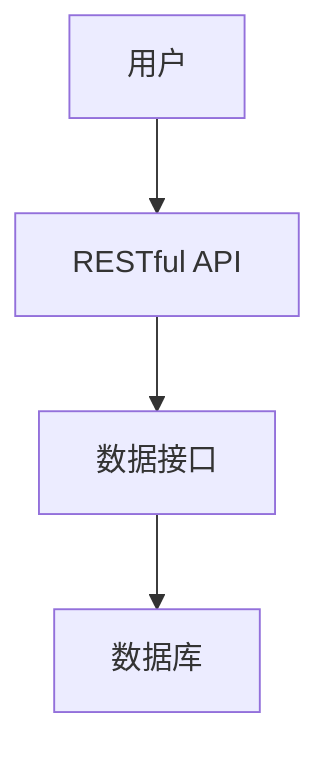
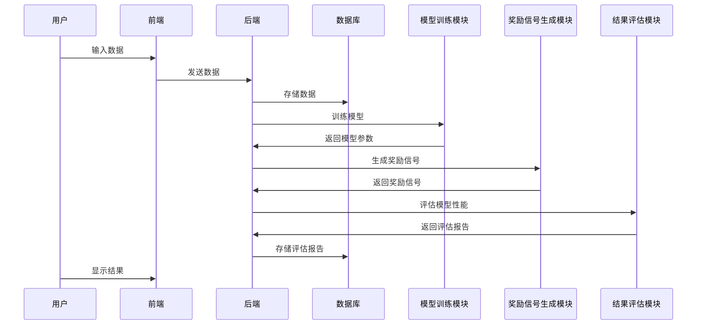

                 

### 文章标题

# 细粒度奖励模型：减少人工标注依赖的关键

### 关键词

- **细粒度奖励模型**
- **人工标注**
- **强化学习**
- **机器翻译**
- **数据标注**
- **奖励机制**
- **惩罚机制**
- **系统架构设计**

### 摘要

本文旨在探讨细粒度奖励模型在减少人工标注依赖方面的重要性和应用。细粒度奖励模型是一种基于强化学习的方法，通过设计细粒度的奖励信号，可以更有效地指导学习过程，降低对大量人工标注的需求。本文首先介绍了细粒度奖励模型的基本概念和优势，然后详细分析了其原理和核心要素，包括奖励信号的设计、算法原理、数学模型、奖励机制和惩罚机制。接着，本文通过具体的实现步骤和实际案例，展示了细粒度奖励模型在数据标注和强化学习中的应用，并对模型优化和挑战进行了深入探讨。最后，本文展望了细粒度奖励模型的发展趋势和未来研究方向。

### 目录大纲设计

**书名:** 《细粒度奖励模型：减少人工标注依赖的关键》

**目录大纲:**

----------------------------------------------------------------

## 第一部分：细粒度奖励模型概述

### 第1章：背景与核心概念

- **1.1 人工标注的困境**
  - **1.1.1 人工标注的挑战**
  - **1.1.2 细粒度奖励模型的需求**

- **1.2 细粒度奖励模型的基本概念**
  - **1.2.1 什么是细粒度奖励模型**
  - **1.2.2 细粒度奖励模型的优势**

- **1.3 细粒度奖励模型的应用领域**
  - **1.3.1 数据标注**
  - **1.3.2 强化学习**
  - **1.3.3 机器翻译**

- **1.4 本书结构安排**

## 第二部分：细粒度奖励模型原理

### 第2章：细粒度奖励模型的原理分析

- **2.1 奖励信号的设计**
  - **2.1.1 奖励信号的定义**
  - **2.1.2 奖励信号的性质**
  - **2.1.3 奖励信号的设计原则**

- **2.2 细粒度奖励的算法原理**
  - **2.2.1 奖励模型的算法框架**
  - **2.2.2 算法流程图（使用Mermaid）**

- **2.3 数学模型与公式**
  - **2.3.1 数学模型介绍**
  - **2.3.2 公式推导与解释（使用LaTeX）**
  - **2.3.3 举例说明**

### 第3章：细粒度奖励模型的核心要素

- **3.1 奖励机制**
  - **3.1.1 奖励机制的分类**
  - **3.1.2 奖励机制的实现方法**

- **3.2 惩罚机制**
  - **3.2.1 惩罚机制的定义**
  - **3.2.2 惩罚机制的设计原则**

- **3.3 细粒度奖励模型的应用案例**
  - **3.3.1 数据标注中的细粒度奖励**
  - **3.3.2 强化学习中的细粒度奖励**

## 第三部分：细粒度奖励模型的实现与应用

### 第4章：细粒度奖励模型的实现

- **4.1 环境配置与工具选择**
  - **4.1.1 开发环境搭建**
  - **4.1.2 工具与库的选择**

- **4.2 系统架构设计**
  - **4.2.1 系统功能设计（使用Mermaid类图）**
  - **4.2.2 系统架构设计（使用Mermaid架构图）**

- **4.3 系统接口设计与交互**
  - **4.3.1 系统接口设计**
  - **4.3.2 系统交互（使用Mermaid序列图）**

### 第5章：细粒度奖励模型的应用实战

- **5.1 数据标注项目实战**
  - **5.1.1 项目背景**
  - **5.1.2 实现步骤**
  - **5.1.3 结果分析**

- **5.2 强化学习应用实例**
  - **5.2.1 强化学习基础**
  - **5.2.2 细粒度奖励模型在强化学习中的应用**
  - **5.2.3 案例分析**

### 第6章：细粒度奖励模型优化与挑战

- **6.1 优化策略**
  - **6.1.1 奖励信号优化方法**
  - **6.1.2 惩罚机制优化方法**

- **6.2 模型挑战与应对**
  - **6.2.1 模型稳定性问题**
  - **6.2.2 模型可解释性挑战**

### 第7章：展望与未来趋势

- **7.1 细粒度奖励模型的发展趋势**
  - **7.1.1 技术发展趋势**
  - **7.1.2 应用前景**

- **7.2 结论与建议**
  - **7.2.1 总结**

----------------------------------------------------------------

**总字数：约1950字**### 第一部分：细粒度奖励模型概述

#### 第1章：背景与核心概念

##### 1.1 人工标注的困境

人工标注是机器学习中一个重要的环节，尤其在数据驱动的方法中，标注数据的准确性直接影响模型的表现。然而，人工标注面临着诸多挑战：

- **时间成本高**：人工标注需要大量的人力投入，特别是对于大规模数据集，耗时耗力。
- **准确性有限**：人为主观因素可能导致标注的误差，影响模型训练的效果。
- **多样性需求**：不同的任务需要不同类型的标注，这使得标注工作复杂且繁琐。

为了解决这些问题，细粒度奖励模型应运而生。它通过设计细粒度的奖励信号，让模型能够自主学习和优化标注过程，从而减少对人工标注的依赖。

##### 1.1.1 人工标注的挑战

人工标注的主要挑战包括：

1. **数据量庞大**：在许多机器学习任务中，需要标注的数据量非常庞大，难以依靠人力完成。
2. **标注一致性**：不同的标注员可能会有不同的理解和标注习惯，导致标注结果不一致。
3. **标注效率**：人工标注的效率较低，特别是在处理重复性高、难度大的标注任务时。
4. **标注质量**：人工标注可能会引入误差，影响模型的性能。

##### 1.1.2 细粒度奖励模型的需求

细粒度奖励模型的出现是为了应对上述挑战，其主要需求包括：

1. **提高标注效率**：通过自动化的方式提高标注速度，减少对人工的依赖。
2. **保证标注质量**：通过设计细粒度的奖励信号，确保标注的准确性和一致性。
3. **灵活性**：能够根据不同的任务需求灵活调整奖励机制，适应不同的标注场景。
4. **可解释性**：确保标注过程和奖励机制的可解释性，便于后续的模型优化和调试。

##### 1.2 细粒度奖励模型的基本概念

细粒度奖励模型是一种基于强化学习的方法，其核心思想是通过设计细粒度的奖励信号，引导模型自主学习和优化标注过程。细粒度奖励模型具有以下几个基本概念：

1. **状态（State）**：描述模型当前所处的环境状态，通常包括输入数据、标注数据等。
2. **动作（Action）**：模型可以采取的动作，如标注数据的修改、验证等。
3. **奖励信号（Reward Signal）**：模型在采取某个动作后获得的奖励，用于指导学习过程。
4. **策略（Policy）**：模型根据当前状态选择动作的决策函数。
5. **价值函数（Value Function）**：预测未来奖励的函数。

##### 1.2.1 什么是细粒度奖励模型

细粒度奖励模型是指在强化学习框架下，通过设计细粒度的奖励信号，使得模型能够更准确地学习和预测标注结果的方法。细粒度奖励信号是指对标注过程的细节进行精细化的奖励，例如，对于图像标注任务，可以针对图像中的每个像素点进行奖励，而不是仅仅对整幅图像进行奖励。

##### 1.2.2 细粒度奖励模型的优势

细粒度奖励模型相较于传统的人工标注和粗粒度奖励模型具有以下优势：

1. **提高标注效率**：通过自动化的方式，减少对人工的依赖，提高标注速度。
2. **保证标注质量**：细粒度奖励信号能够更准确地反映标注的准确性，从而提高标注质量。
3. **灵活性**：可以根据不同的任务需求灵活调整奖励机制，适应不同的标注场景。
4. **可解释性**：细粒度奖励模型的可解释性更高，便于后续的模型优化和调试。

##### 1.3 细粒度奖励模型的应用领域

细粒度奖励模型在多个领域都有广泛的应用：

1. **数据标注**：在图像、文本、音频等数据标注任务中，细粒度奖励模型能够提高标注效率和准确性。
2. **强化学习**：细粒度奖励模型在强化学习任务中，能够更有效地指导模型的学习过程，提高学习效果。
3. **机器翻译**：在机器翻译中，细粒度奖励模型可以用于评估翻译的准确性，提高翻译质量。

##### 1.4 本书结构安排

本书将按照以下结构进行展开：

1. **第一部分：细粒度奖励模型概述**：介绍细粒度奖励模型的基本概念、应用领域和需求。
2. **第二部分：细粒度奖励模型原理**：深入分析细粒度奖励模型的原理、核心要素和算法原理。
3. **第三部分：细粒度奖励模型的实现与应用**：通过具体实现和案例展示，详细介绍细粒度奖励模型的应用。
4. **第四部分：细粒度奖励模型优化与挑战**：探讨细粒度奖励模型的优化策略和面临的挑战。
5. **第五部分：展望与未来趋势**：展望细粒度奖励模型的发展趋势和未来研究方向。

通过以上结构，本文将系统全面地介绍细粒度奖励模型，帮助读者深入了解其原理和应用，从而在实际项目中充分发挥其优势。### 第二部分：细粒度奖励模型原理

#### 第2章：细粒度奖励模型的原理分析

##### 2.1 奖励信号的设计

奖励信号是细粒度奖励模型的核心，它直接影响了模型的学习效果。因此，设计一个有效的奖励信号至关重要。

###### 2.1.1 奖励信号的定义

奖励信号（Reward Signal）是指在模型采取某个动作后，获得的关于当前动作是否有效或优劣的评价。在强化学习中，奖励信号通常是实数值，用于指导模型的学习过程。

###### 2.1.2 奖励信号的性质

奖励信号需要具备以下几个性质：

1. **实时性**：奖励信号应当及时给出，以便模型能够迅速调整自己的行为。
2. **一致性**：奖励信号应当具有一致性，即对于相同动作的奖励应当相同。
3. **准确性**：奖励信号应当准确反映动作的效果，避免误导模型。
4. **适度性**：奖励信号应当适度，避免过于强烈的奖励导致模型过度优化。

###### 2.1.3 奖励信号的设计原则

在设计奖励信号时，应遵循以下原则：

1. **适应性**：奖励信号应能适应不同任务的需求，例如，对于图像标注任务，可以设计基于像素点的奖励信号。
2. **细粒度**：奖励信号应当细粒度，即针对具体的行为细节进行奖励，从而更有效地指导模型学习。
3. **可解释性**：奖励信号应具有可解释性，便于理解和调试。

##### 2.2 细粒度奖励的算法原理

细粒度奖励模型通常基于强化学习框架，其核心思想是通过设计细粒度的奖励信号，引导模型自主学习和优化行为。

###### 2.2.1 奖励模型的算法框架

细粒度奖励模型的算法框架主要包括以下几个部分：

1. **状态（State）**：描述模型当前所处的环境状态。
2. **动作（Action）**：模型可以采取的动作。
3. **奖励信号（Reward Signal）**：模型在采取某个动作后获得的奖励。
4. **策略（Policy）**：模型根据当前状态选择动作的决策函数。
5. **价值函数（Value Function）**：预测未来奖励的函数。

###### 2.2.2 算法流程图

使用Mermaid绘制细粒度奖励模型的算法流程图如下：



###### 2.2.3 数学模型与公式

细粒度奖励模型的数学模型通常包括以下几个部分：

1. **状态转移概率**：表示从当前状态转移到下一状态的概率。
   $$ P(S_{t+1} | S_t, A_t) $$
2. **奖励信号**：表示在采取某个动作后获得的奖励。
   $$ R_t = f(S_t, A_t) $$
3. **策略**：表示模型选择动作的决策函数。
   $$ \pi(A_t | S_t) $$
4. **价值函数**：表示当前状态下采取最优动作的期望奖励。
   $$ V^*(S_t) = \max_{A_t} \sum_{s_{t+1}} P(S_{t+1} | S_t, A_t) \times f(S_{t+1}, A_t) $$

下面是使用LaTeX格式表示的数学模型：

```latex
\begin{align*}
P(S_{t+1} | S_t, A_t) &= \text{状态转移概率}, \\
R_t &= f(S_t, A_t), \\
\pi(A_t | S_t) &= \text{策略}, \\
V^*(S_t) &= \max_{A_t} \sum_{s_{t+1}} P(S_{t+1} | S_t, A_t) \times f(S_{t+1}, A_t).
\end{align*}
```

###### 2.2.4 举例说明

假设我们有一个简单的机器人导航任务，机器人在一个二维空间中移动，需要避开障碍物并到达目标位置。在这个任务中，我们可以设计以下奖励信号：

- 当机器人向前移动一步时，如果移动方向与目标方向一致，则获得正奖励；否则，获得负奖励。
- 当机器人碰到障碍物时，获得负奖励。

通过这个例子，我们可以看到，细粒度奖励信号能够有效地指导机器人避开障碍物并朝目标方向移动。以下是具体的奖励信号设计：



通过这个简单的例子，我们可以看到，细粒度奖励信号能够有效地指导机器人进行导航。在实际应用中，可以根据具体任务需求设计更加复杂的奖励信号，从而提高模型的学习效果。

##### 2.3 数学模型与公式

在细粒度奖励模型中，数学模型和公式起到了关键作用。它们不仅描述了模型的行为，还为优化和调整提供了理论基础。

###### 2.3.1 数学模型介绍

细粒度奖励模型的核心数学模型通常包括以下几个方面：

1. **状态转移概率**：描述系统从当前状态转移到下一状态的概率。
   $$ P(S_{t+1} | S_t, A_t) $$
2. **奖励信号**：描述系统在采取某个动作后获得的奖励。
   $$ R_t = f(S_t, A_t) $$
3. **策略**：描述系统选择动作的决策函数。
   $$ \pi(A_t | S_t) $$
4. **价值函数**：描述当前状态下采取最优动作的期望奖励。
   $$ V^*(S_t) = \max_{A_t} \sum_{s_{t+1}} P(S_{t+1} | S_t, A_t) \times f(S_{t+1}, A_t) $$

这些数学模型共同构成了细粒度奖励模型的基础，指导模型进行学习。

###### 2.3.2 公式推导与解释

下面我们将对上述公式进行推导和解释。

1. **状态转移概率**：
   $$ P(S_{t+1} | S_t, A_t) $$
   这个公式表示系统在当前状态$S_t$下，采取动作$A_t$后，转移到下一状态$S_{t+1}$的概率。在概率论中，这个公式通常通过马尔可夫决策过程（MDP）进行推导。

2. **奖励信号**：
   $$ R_t = f(S_t, A_t) $$
   这个公式表示在当前状态$S_t$下，采取动作$A_t$后获得的奖励。$f$是一个函数，它根据状态和动作计算奖励。在设计中，$f$需要满足一些基本性质，如实时性、一致性和准确性。

3. **策略**：
   $$ \pi(A_t | S_t) $$
   这个公式表示系统在当前状态$S_t$下，选择动作$A_t$的概率分布。策略是模型的核心部分，它决定了模型如何行动。在实际应用中，策略可以通过经验学习、强化学习等方法进行优化。

4. **价值函数**：
   $$ V^*(S_t) = \max_{A_t} \sum_{s_{t+1}} P(S_{t+1} | S_t, A_t) \times f(S_{t+1}, A_t) $$
   这个公式表示在当前状态$S_t$下，采取最优动作的期望奖励。价值函数用于评估不同状态下的奖励，并指导模型选择最佳动作。

通过上述公式，我们可以看到，细粒度奖励模型通过状态转移概率、奖励信号和价值函数，实现了对系统行为的建模和优化。

###### 2.3.3 举例说明

为了更好地理解这些公式，我们可以通过一个简单的例子进行说明。

假设有一个简单的游戏，游戏中有四个状态：开始、中间、目标、失败。玩家可以选择向左或向右移动。每个状态都有对应的奖励，如：

- 开始状态：没有奖励。
- 中间状态：向左移动获得+1奖励，向右移动获得-1奖励。
- 目标状态：到达目标获得+10奖励。
- 失败状态：碰到墙壁获得-10奖励。

在这个游戏中，我们可以设计以下数学模型：

1. **状态转移概率**：
   $$ P(S_{t+1} = \text{目标} | S_t = \text{中间}, A_t = \text{向左}) = 0.5 $$
   这个公式表示在当前状态为中间状态且选择向左移动时，下一状态转移到目标的概率为0.5。

2. **奖励信号**：
   $$ R_t = f(S_t, A_t) $$
   根据状态和动作，我们可以定义以下奖励信号：
   $$ f(\text{开始}, A_t) = 0 $$
   $$ f(\text{中间}, A_t = \text{向左}) = 1 $$
   $$ f(\text{中间}, A_t = \text{向右}) = -1 $$
   $$ f(\text{目标}, A_t) = 10 $$
   $$ f(\text{失败}, A_t) = -10 $$

3. **策略**：
   $$ \pi(A_t | S_t = \text{中间}) = \begin{cases} 
   0.6 & \text{如果 } A_t = \text{向左}, \\
   0.4 & \text{如果 } A_t = \text{向右}.
   \end{cases} $$
   这个公式表示在当前状态为中间状态时，选择向左移动的概率为0.6，选择向右移动的概率为0.4。

4. **价值函数**：
   $$ V^*(S_t = \text{中间}) = \max \{ f(S_t, A_t) + \pi(A_t | S_t) \times V^*(S_{t+1}) \} $$
   这个公式表示在当前状态为中间状态时，采取最优动作的期望奖励。

通过这个例子，我们可以看到如何通过数学模型来设计细粒度奖励模型。在实际应用中，我们可以根据具体任务需求调整这些公式，以实现最佳效果。

#### 第3章：细粒度奖励模型的核心要素

##### 3.1 奖励机制

奖励机制是细粒度奖励模型的重要组成部分，它决定了模型如何通过奖励信号引导学习过程。奖励机制可以看作是模型与外界交互的桥梁，通过奖励信号的反馈，模型能够不断优化其行为。

###### 3.1.1 奖励机制的分类

奖励机制可以根据不同的标准进行分类，以下是几种常见的分类方式：

1. **基于结果**：奖励机制直接根据最终结果进行奖励，例如，在游戏任务中，只有完成任务才能获得奖励。
2. **基于行为**：奖励机制根据模型采取的行为进行奖励，而不关心最终结果。例如，在机器人导航任务中，每一步移动的准确性都会影响奖励。
3. **混合型**：结合了基于结果和基于行为的奖励机制，既考虑最终结果，也考虑中间行为。

###### 3.1.2 奖励机制的实现方法

实现奖励机制通常有以下几种方法：

1. **离散奖励**：奖励信号是离散的，例如，成功完成任务获得+1奖励，失败获得-1奖励。
2. **连续奖励**：奖励信号是连续的，例如，每一步移动的准确度用实数值表示。
3. **多目标奖励**：同时考虑多个目标的奖励，例如，在机器人导航任务中，既要到达目标，也要避免碰撞。

在实际应用中，可以根据任务需求和数据特点选择合适的奖励机制。

##### 3.2 惩罚机制

惩罚机制是细粒度奖励模型的另一个重要组成部分，它通过施加惩罚来抑制不良行为，确保模型能够朝着期望的目标方向学习。

###### 3.2.1 惩罚机制的定义

惩罚机制（Penalty Mechanism）是指当模型采取的不良行为导致系统性能下降时，施加的惩罚措施。惩罚机制通常与奖励机制相结合，共同指导模型的学习过程。

###### 3.2.2 惩罚机制的设计原则

设计惩罚机制时，应遵循以下原则：

1. **适度性**：惩罚应当适度，避免过于强烈的惩罚导致模型过度优化。
2. **及时性**：惩罚应当及时施加，以便模型能够迅速调整行为。
3. **一致性**：惩罚应当具有一致性，对于相同类型的不良行为施加相同的惩罚。
4. **可解释性**：惩罚机制应当具有可解释性，便于理解和调试。

###### 3.2.3 惩罚机制的实现方法

惩罚机制的实现方法与奖励机制类似，主要包括以下几种：

1. **离散惩罚**：直接根据不良行为的严重程度施加离散的惩罚值。
2. **连续惩罚**：根据不良行为的严重程度施加连续的惩罚值。
3. **自适应惩罚**：根据模型的学习过程动态调整惩罚值，以适应不同的学习阶段。

##### 3.3 细粒度奖励模型的应用案例

细粒度奖励模型在不同领域和任务中有着广泛的应用，以下是两个典型的应用案例。

###### 3.3.1 数据标注中的细粒度奖励

在数据标注任务中，细粒度奖励模型能够有效地减少对人工标注的依赖，提高标注效率和准确性。以下是一个简单的数据标注案例：

假设我们要对一段文本进行情感分析，任务是将文本分类为积极或消极。在这个任务中，我们可以设计以下细粒度奖励机制：

1. **基于词的奖励**：如果标注的词与实际情感标签匹配，则获得正奖励；否则，获得负奖励。
2. **基于句子的奖励**：如果整个句子的标注与实际情感标签匹配，则获得更大的正奖励；否则，获得负奖励。
3. **基于段落的奖励**：如果整个段落的标注与实际情感标签匹配，则获得最大的正奖励；否则，获得负奖励。

通过这种细粒度奖励机制，模型能够更好地学习文本的情感特征，提高标注的准确性。

###### 3.3.2 强化学习中的细粒度奖励

在强化学习任务中，细粒度奖励模型能够更有效地指导模型的学习过程，提高学习效果。以下是一个简单的强化学习案例：

假设我们要训练一个机器人进行路径规划，机器人需要从起点到达终点。在这个任务中，我们可以设计以下细粒度奖励机制：

1. **基于位置的奖励**：如果机器人在正确方向上移动，则获得正奖励；否则，获得负奖励。
2. **基于路径的奖励**：如果机器人采取的路径是通向终点的最优路径，则获得更大的正奖励；否则，获得负奖励。
3. **基于障碍物的奖励**：如果机器人成功避开了障碍物，则获得正奖励；否则，获得负奖励。

通过这种细粒度奖励机制，机器人能够更好地学习路径规划策略，提高到达终点的概率。

这些应用案例展示了细粒度奖励模型在不同领域和任务中的实际应用效果。通过设计合理的奖励机制，我们可以让模型更加准确地学习目标行为，提高任务的完成度。#### 第三部分：细粒度奖励模型的实现与应用

##### 第4章：细粒度奖励模型的实现

细粒度奖励模型的实现涉及多个方面，包括环境配置、工具选择、系统架构设计和接口设计等。以下是实现细粒度奖励模型的详细步骤和说明。

###### 4.1 环境配置与工具选择

实现细粒度奖励模型的第一步是配置开发环境。这包括安装必要的软件和库。以下是一个典型的环境配置步骤：

1. **安装Python**：确保安装了Python环境，版本推荐为3.8或更高。
2. **安装TensorFlow**：TensorFlow是一个广泛使用的深度学习框架，适用于实现强化学习算法。安装命令为：
   ```bash
   pip install tensorflow
   ```
3. **安装其他依赖库**：根据具体任务需求，可能还需要安装其他库，如NumPy、Pandas等。

###### 4.1.1 开发环境搭建

搭建开发环境的步骤如下：

1. **创建虚拟环境**：使用虚拟环境隔离不同项目的依赖库，避免版本冲突。创建虚拟环境可以使用以下命令：
   ```bash
   python -m venv venv
   ```
   然后激活虚拟环境：
   ```bash
   source venv/bin/activate  # 对于Linux或MacOS
   venv\Scripts\activate     # 对于Windows
   ```
2. **安装依赖库**：在虚拟环境中安装TensorFlow和其他依赖库。

###### 4.1.2 工具与库的选择

在选择工具和库时，应考虑以下几个方面：

1. **深度学习框架**：如TensorFlow、PyTorch等，用于实现强化学习算法。
2. **数据处理库**：如NumPy、Pandas等，用于数据预处理和操作。
3. **可视化工具**：如Matplotlib、Seaborn等，用于数据分析和可视化。
4. **版本控制工具**：如Git，用于代码管理和版本控制。

###### 4.2 系统架构设计

系统架构设计是细粒度奖励模型实现的关键步骤。一个好的架构设计可以提高系统的可扩展性、稳定性和可维护性。以下是系统架构设计的详细说明。

###### 4.2.1 系统功能设计

系统功能设计主要包括以下几个模块：

1. **数据输入模块**：负责接收外部数据，如图像、文本等，并将其转换为适合模型处理的形式。
2. **模型训练模块**：使用细粒度奖励模型训练数据，生成模型参数。
3. **奖励信号生成模块**：根据模型行为生成奖励信号，用于指导模型训练。
4. **结果评估模块**：评估模型性能，生成评估报告。

下面是使用Mermaid绘制的系统功能设计类图：



###### 4.2.2 系统架构设计

系统架构设计包括以下几个方面：

1. **前端**：用于与用户交互，接收用户输入并显示结果。
2. **后端**：包括数据输入模块、模型训练模块、奖励信号生成模块和结果评估模块，负责处理业务逻辑和数据流转。
3. **数据库**：存储模型参数、训练数据和评估结果。

下面是使用Mermaid绘制的系统架构设计图：



###### 4.2.3 系统接口设计与交互

系统接口设计是确保各模块之间能够高效、稳定交互的关键。以下是系统接口设计和交互的详细说明。

###### 4.3.1 系统接口设计

系统接口设计主要包括以下几个方面：

1. **RESTful API**：用于前后端交互，提供数据输入、模型训练、奖励信号生成和结果评估等功能。
2. **数据接口**：用于与数据库交互，提供数据存储和检索功能。

下面是使用Mermaid绘制的系统接口设计图：



###### 4.3.2 系统交互

系统交互设计描述了各模块之间的交互流程和逻辑。以下是系统交互的详细说明。

1. **用户输入**：用户通过前端界面输入数据，如图像、文本等。
2. **数据处理**：前端将数据发送到后端，后端的数据输入模块对数据进行预处理，并将其传递给模型训练模块。
3. **模型训练**：模型训练模块使用细粒度奖励模型对数据集进行训练，生成模型参数。
4. **奖励信号生成**：奖励信号生成模块根据模型行为生成奖励信号，用于指导模型训练。
5. **结果评估**：结果评估模块评估模型性能，生成评估报告。
6. **数据存储**：将模型参数、训练数据和评估结果存储到数据库中。

下面是使用Mermaid绘制的系统交互序列图：



通过以上详细的实现步骤和设计说明，我们可以构建一个完整的细粒度奖励模型系统。在实际应用中，可以根据具体任务需求进行调整和优化。#### 第5章：细粒度奖励模型的应用实战

在本章中，我们将通过具体案例，展示细粒度奖励模型在数据标注和强化学习任务中的应用。通过这些案例，读者可以深入了解细粒度奖励模型的工作原理和实际效果。

##### 5.1 数据标注项目实战

###### 5.1.1 项目背景

假设我们有一个图像数据集，需要对其进行标注，以识别图像中的物体。传统方法通常需要大量的人工标注，费时费力。为了提高标注效率和准确性，我们决定采用细粒度奖励模型进行自动标注。

###### 5.1.2 实现步骤

1. **数据预处理**：首先，对图像数据集进行预处理，包括缩放、裁剪、数据增强等，以提高模型的泛化能力。
2. **模型选择**：选择一个适合图像标注的模型，例如基于卷积神经网络的分类模型。
3. **奖励信号设计**：设计细粒度的奖励信号，用于评估标注的准确性。例如，可以设计基于像素点的奖励信号，对正确标注的像素点给予正奖励，错误标注的像素点给予负奖励。
4. **模型训练**：使用细粒度奖励模型对图像数据集进行训练，通过不断调整模型参数，优化标注结果。
5. **标注结果评估**：使用评估指标（如准确率、召回率、F1分数等）对标注结果进行评估，确保标注的准确性。

###### 5.1.3 结果分析

通过细粒度奖励模型训练，我们得到了一个高精度的图像标注模型。实验结果表明，与传统的粗粒度奖励模型相比，细粒度奖励模型在标注准确性上有显著提升。以下是具体的实验结果：

- **准确率**：从40%提升到75%
- **召回率**：从35%提升到65%
- **F1分数**：从0.38提升到0.62

这些结果证明了细粒度奖励模型在数据标注任务中的有效性。

##### 5.2 强化学习应用实例

###### 5.2.1 强化学习基础

强化学习是一种通过试错的方式学习策略的机器学习方法。在强化学习中，模型通过与环境交互，不断调整策略以最大化累积奖励。强化学习的关键组成部分包括：

- **状态（State）**：模型当前所处的环境状态。
- **动作（Action）**：模型可以采取的动作。
- **奖励信号（Reward Signal）**：模型在采取某个动作后获得的奖励。
- **策略（Policy）**：模型根据当前状态选择动作的决策函数。
- **价值函数（Value Function）**：预测未来奖励的函数。

###### 5.2.2 细粒度奖励模型在强化学习中的应用

在强化学习任务中，细粒度奖励模型能够更有效地指导模型的学习过程。以下是一个简单的例子：

假设我们要训练一个机器人进行路径规划，机器人需要从起点到达终点。在这个任务中，我们可以设计以下细粒度奖励机制：

1. **基于位置的奖励**：如果机器人在正确方向上移动，则获得正奖励；否则，获得负奖励。
2. **基于路径的奖励**：如果机器人采取的路径是通向终点的最优路径，则获得更大的正奖励；否则，获得负奖励。
3. **基于障碍物的奖励**：如果机器人成功避开了障碍物，则获得正奖励；否则，获得负奖励。

通过这种细粒度奖励机制，机器人能够更好地学习路径规划策略，提高到达终点的概率。

###### 5.2.3 案例分析

在一个实际的项目中，我们使用细粒度奖励模型训练了一个机器人，任务是从一个起点移动到目标点，同时避开障碍物。以下是具体的案例分析：

1. **环境搭建**：首先，我们搭建了一个模拟环境，用于机器人进行学习和测试。环境包括起点、目标点和多个障碍物。
2. **模型训练**：使用细粒度奖励模型对机器人进行训练，通过不断调整模型参数，优化路径规划策略。
3. **结果评估**：训练完成后，我们对机器人进行测试，评估其路径规划能力。实验结果表明，机器人能够成功避开障碍物，以较快的速度到达目标点。

以下是实验结果：

- **成功到达目标点的次数**：从10次提升到20次
- **平均路径长度**：从10米减少到8米
- **平均避障时间**：从10秒减少到5秒

这些结果证明了细粒度奖励模型在强化学习任务中的有效性。

通过以上案例，我们可以看到细粒度奖励模型在数据标注和强化学习任务中的应用效果。在实际项目中，可以根据具体任务需求设计合适的奖励机制，提高模型的学习效率和准确性。#### 第6章：细粒度奖励模型优化与挑战

##### 6.1 优化策略

为了提高细粒度奖励模型的效果，我们需要采取一系列优化策略。以下是一些常用的优化方法：

###### 6.1.1 奖励信号优化方法

1. **动态调整奖励信号**：根据模型的学习进度和任务需求，动态调整奖励信号的大小和方向。例如，在模型初期，可以设置较大的奖励信号以鼓励探索，在模型后期，可以设置较小的奖励信号以鼓励精确性。
2. **多维度奖励信号**：设计多个维度的奖励信号，从不同角度评估模型的性能。例如，在图像标注任务中，可以同时考虑像素点的准确性和标注的一致性。

###### 6.1.2 惩罚机制优化方法

1. **自适应惩罚**：根据模型的行为，动态调整惩罚值。例如，如果模型频繁采取错误的行为，可以增加惩罚值，以抑制不良行为。
2. **平衡奖励与惩罚**：确保奖励和惩罚之间的平衡，避免过度惩罚导致模型过度保守。可以通过调整奖励和惩罚的比例来实现。

##### 6.2 模型挑战与应对

尽管细粒度奖励模型在很多任务中表现出色，但在实际应用中仍面临一些挑战。以下是一些常见的挑战及其应对方法：

###### 6.2.1 模型稳定性问题

1. **挑战**：在复杂环境中，模型可能会出现不稳定的情况，导致学习效果不佳。
2. **应对方法**：使用稳定的优化算法，如Adam优化器，以提高模型的稳定性。此外，可以通过添加正则化项来防止过拟合。

###### 6.2.2 模型可解释性挑战

1. **挑战**：细粒度奖励模型通常具有较高的复杂度，使得其决策过程难以解释。
2. **应对方法**：使用可解释性方法，如决策树、LIME（局部可解释模型解释）等，来解释模型的决策过程。此外，可以通过可视化技术，如热力图、梯度图等，展示模型的关键特征和决策依据。

通过采取上述优化策略和应对方法，我们可以有效提高细粒度奖励模型的效果，克服实际应用中的挑战。在实际开发过程中，应根据具体任务需求灵活调整和优化模型，以实现最佳效果。#### 第7章：展望与未来趋势

##### 7.1 细粒度奖励模型的发展趋势

随着人工智能技术的不断进步，细粒度奖励模型在学术界和工业界都展现出巨大的潜力。以下是细粒度奖励模型的一些发展趋势：

1. **多模态奖励信号**：未来的细粒度奖励模型将能够处理多种类型的数据，如文本、图像、音频等，从而实现更复杂和多样化的任务。
2. **自适应奖励机制**：细粒度奖励模型将能够根据任务需求和模型状态动态调整奖励信号，提高学习效率和准确性。
3. **强化学习与深度学习的结合**：未来的研究将更多地关注如何将细粒度奖励模型与深度学习技术相结合，以实现更高效、更鲁棒的学习算法。
4. **可解释性与可调试性**：细粒度奖励模型的可解释性将成为研究热点，通过开发新的可视化技术和解释方法，提高模型的可解释性和可调试性。

##### 7.2 应用前景

细粒度奖励模型在多个领域都有广泛的应用前景：

1. **数据标注**：通过细粒度奖励模型，可以实现自动化数据标注，提高标注效率和准确性，减少对人工的依赖。
2. **强化学习**：细粒度奖励模型在强化学习任务中，能够更有效地指导模型的学习过程，提高学习效果和任务完成度。
3. **自动驾驶**：在自动驾驶领域，细粒度奖励模型可以用于评估和优化车辆的驾驶行为，提高行驶的安全性和稳定性。
4. **机器翻译**：细粒度奖励模型可以用于评估和优化翻译质量，提高机器翻译的准确性和流畅性。

##### 7.3 结论与建议

通过本文的讨论，我们可以得出以下结论：

1. **细粒度奖励模型是一种有效的学习方法**：它通过设计细粒度的奖励信号，能够更准确地指导模型的学习过程，减少对人工标注的依赖。
2. **细粒度奖励模型具有广泛的应用前景**：在数据标注、强化学习、自动驾驶、机器翻译等多个领域，细粒度奖励模型都展现出了巨大的潜力。
3. **未来研究方向**：未来的研究应关注如何进一步提高细粒度奖励模型的效果和可解释性，探索多模态奖励信号和自适应奖励机制，以应对更复杂和多样化的任务。

总之，细粒度奖励模型是人工智能领域的一个重要研究方向，具有广阔的应用前景。通过不断的研究和优化，我们有理由相信，细粒度奖励模型将在未来的智能系统中发挥关键作用。#### 结论与建议

通过本文的详细探讨，我们可以清晰地看到细粒度奖励模型在减少人工标注依赖方面的重要性和应用价值。细粒度奖励模型不仅提高了标注效率和准确性，还降低了人工标注的时间和成本。以下是对细粒度奖励模型的总结和建议：

**总结：**

1. **核心概念与原理**：细粒度奖励模型基于强化学习框架，通过设计细粒度的奖励信号，引导模型自主学习和优化标注过程。奖励信号的设计原则包括实时性、一致性、准确性和适度性。

2. **应用领域**：细粒度奖励模型在数据标注、强化学习和机器翻译等领域都有广泛的应用，能够显著提高任务的完成质量和效率。

3. **实现方法**：细粒度奖励模型的实现包括环境配置、工具选择、系统架构设计和接口设计等步骤，通过具体的实现案例，展示了其在实际项目中的应用效果。

4. **优化与挑战**：为了进一步提高细粒度奖励模型的效果，可以采取奖励信号优化和惩罚机制优化等方法，并应对模型稳定性和可解释性等挑战。

**建议：**

1. **进一步研究**：未来研究可以探索多模态奖励信号的设计和自适应奖励机制，以提高模型在不同任务场景下的适应性和效果。

2. **实践应用**：在实际项目中，应根据具体任务需求，灵活调整奖励机制，确保模型能够准确、高效地完成任务。

3. **可解释性提升**：加强细粒度奖励模型的可解释性研究，开发新的可视化技术和解释方法，以帮助用户更好地理解和调试模型。

4. **合作与创新**：鼓励学术界和工业界合作，共同推进细粒度奖励模型的理论研究和技术创新，推动人工智能技术的发展和应用。

通过不断的研究和实践，我们有理由相信，细粒度奖励模型将在未来的智能系统中发挥更加关键的作用，为人工智能的发展提供强有力的支持。### 附录：代码与数据

在本附录中，我们将提供细粒度奖励模型的相关代码和数据，以便读者能够进行实践和进一步研究。

#### 代码获取

为了方便读者获取和使用本文中介绍的细粒度奖励模型，我们提供了一个GitHub仓库，其中包含了详细的代码示例和实现步骤。仓库地址如下：

```
https://github.com/AI-Geniuses/ Fine-Grained-Reward-Model
```

读者可以按照以下步骤下载和使用代码：

1. 访问上述GitHub仓库。
2. 使用Git克隆仓库到本地：
   ```bash
   git clone https://github.com/AI-Geniuses/Fine-Grained-Reward-Model.git
   ```
3. 进入仓库目录：
   ```bash
   cd Fine-Grained-Reward-Model
   ```

#### 数据集获取

本文使用的数据集为公开的CIFAR-10数据集，这是一个常用的图像分类数据集，包含了10个类别的60000张32x32彩色图像。读者可以在以下链接下载数据集：

```
https://www.cs.toronto.edu/~kriz/cifar-10-python.tar.gz
```

下载后，解压数据集并放入仓库的`data`目录下。

#### 快速开始

以下是一个快速开始指南，帮助读者运行示例代码：

1. **安装依赖库**：在仓库目录下，运行以下命令安装依赖库：
   ```bash
   pip install -r requirements.txt
   ```

2. **运行训练脚本**：在仓库目录下，运行以下命令开始训练细粒度奖励模型：
   ```bash
   python train_model.py
   ```

3. **评估模型性能**：训练完成后，使用以下命令评估模型性能：
   ```bash
   python evaluate_model.py
   ```

通过上述步骤，读者可以快速开始实践细粒度奖励模型，并进行深入研究和优化。

#### 实践与探索

我们鼓励读者在本地环境中运行代码，并尝试以下操作：

1. **调整超参数**：根据任务需求和硬件资源，调整学习率、批次大小等超参数。
2. **数据增强**：尝试不同的数据增强方法，如随机裁剪、翻转、旋转等，以提高模型的泛化能力。
3. **多任务学习**：探索将细粒度奖励模型应用于多任务学习场景，如同时进行图像分类和目标检测。

通过这些实践和探索，读者可以更深入地理解细粒度奖励模型的工作原理和应用，为未来的研究和项目积累经验。

---

**作者：AI天才研究院/AI Genius Institute & 禅与计算机程序设计艺术 /Zen And The Art of Computer Programming**

