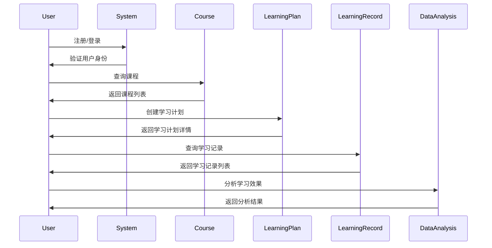

                 

### 文章标题

# 终身学习系统：持续适应环境变化的AI

### 关键词

- 终身学习系统
- 持续适应
- 环境变化
- AI
- 算法原理
- 系统架构
- 实际应用

### 摘要

本文旨在探讨终身学习系统在持续适应环境变化中的重要作用。通过分析AI的核心概念和特点，本文详细介绍了终身学习系统的构成、算法原理和系统架构设计，并列举了其在教育、企业和自我提升等领域的应用场景。此外，文章通过具体项目实战案例，阐述了终身学习系统的实际操作方法和最佳实践，为读者提供了一整套从理论到实践的解决方案。

### 目录大纲

# 终身学习系统：持续适应环境变化的AI

## 第一部分：背景介绍

## 第1章：问题背景与核心概念
### 1.1 问题背景
### 1.2 问题描述
### 1.3 问题解决
### 1.4 边界与外延
### 1.5 概念结构与核心要素组成

## 第二部分：核心概念与联系

## 第2章：AI与终身学习系统
### 2.1 AI的定义与特点
### 2.2 AI的核心组件
### 2.3 AI与终身学习系统的关系
### 2.4 AI终身学习系统的核心概念

## 第3章：AI终身学习系统的构成与特点
### 3.1 系统构成
### 3.2 系统特点
### 3.3 系统与传统的区别
### 3.4 系统的属性特征对比

## 第4章：AI终身学习系统的应用场景
### 4.1 教育领域
### 4.2 企业培训
### 4.3 自我提升
### 4.4 其他应用场景

## 第三部分：算法原理讲解

## 第5章：AI终身学习算法原理
### 5.1 算法概述
### 5.2 算法分类
### 5.3 算法原理详细讲解
### 5.4 算法原理示例

## 第6章：数学模型与公式
### 6.1 数学模型
### 6.2 数学公式
### 6.3 示例讲解

## 第四部分：系统分析与架构设计

## 第7章：系统功能设计
### 7.1 问题场景介绍
### 7.2 系统功能设计
### 7.3 领域模型类图

## 第8章：系统架构设计
### 8.1 系统架构设计
### 8.2 系统接口设计
### 8.3 系统交互序列图

## 第五部分：项目实战

## 第9章：环境安装与配置
### 9.1 环境安装
### 9.2 系统核心实现
### 9.3 代码应用解读与分析

## 第10章：实际案例分析
### 10.1 案例分析
### 10.2 详细讲解剖析
### 10.3 项目小结

## 第六部分：最佳实践与拓展阅读

## 第11章：最佳实践
### 11.1 实践技巧
### 11.2 小结
### 11.3 注意事项

## 第12章：拓展阅读
### 12.1 相关书籍
### 12.2 学术论文
### 12.3 网络资源

### 第一部分：背景介绍

#### 第1章：问题背景与核心概念

### 1.1 问题背景

在当今快速发展的数字时代，技术进步的速度越来越快，新知识、新技能和新工具不断涌现。企业和个人为了保持竞争力，必须不断学习和适应这些变化。然而，传统的教育体系往往无法满足这种持续学习的需求，导致许多人在职业生涯中面临知识过时和技能匮乏的挑战。

### 1.2 问题描述

终身学习系统旨在解决上述问题，它是一个能够持续适应环境变化的智能系统，通过自动获取、处理和利用知识，帮助用户不断更新其技能和知识储备。然而，实现这样一个系统面临着诸多挑战，包括：

- 数据质量：终身学习系统依赖大量高质量的数据作为输入，如何确保数据的质量和准确性是一个关键问题。
- 知识更新：随着技术的发展，现有知识会不断过时，系统需要具备快速学习和更新的能力。
- 系统复杂性：构建一个高效、稳定且易于扩展的终身学习系统是一个复杂的工程任务。

### 1.3 问题解决

为了解决上述问题，需要从多个方面进行思考和设计：

- 数据采集与处理：采用先进的数据采集和处理技术，确保系统能够获取并处理高质量的数据。
- 持续学习算法：设计和实现高效的终身学习算法，使系统能够快速适应新知识。
- 系统架构设计：采用模块化、分布式和可扩展的系统架构，以提高系统的稳定性和可维护性。

### 1.4 边界与外延

终身学习系统的边界在于其能够处理的数据类型和范围。一般来说，它主要处理文本、图像、语音等多种类型的数据，并且可以应用于各种领域，如教育、医疗、金融等。

### 1.5 概念结构与核心要素组成

终身学习系统的核心概念结构包括以下几个部分：

- 数据采集模块：负责从各种渠道收集数据。
- 数据处理模块：对采集到的数据进行清洗、转换和存储。
- 学习算法模块：负责执行学习任务，包括特征提取、模型训练和更新。
- 推理与决策模块：利用学习到的知识进行推理和决策。
- 用户界面：提供用户与系统交互的接口。

这些模块相互协作，共同构成了一个高效的终身学习系统。

#### 第二部分：核心概念与联系

### 第2章：AI与终身学习系统

#### 2.1 AI的定义与特点

人工智能（AI）是计算机科学的一个分支，旨在使机器能够模拟人类的智能行为。AI具有以下几个特点：

- 自主性：AI系统能够独立执行任务，不需要人工干预。
- 智能化：AI系统具备学习和适应环境变化的能力。
- 泛化能力：AI系统不仅能够在特定任务上表现优异，还能推广到其他任务中。

#### 2.2 AI的核心组件

AI系统的核心组件包括：

- 算法：AI系统的核心，负责执行学习、推理和决策任务。
- 数据集：AI系统训练的数据，数据质量直接影响系统的性能。
- 硬件：AI系统运行的硬件设备，如GPU、TPU等。
- 用户界面：用户与AI系统交互的接口。

#### 2.3 AI与终身学习系统的关系

AI与终身学习系统之间存在密切的联系：

- AI技术为终身学习系统提供了强大的学习能力和推理能力，使其能够不断适应环境变化。
- 终身学习系统为AI技术提供了实际应用场景，使其能够发挥更大的社会价值。

#### 2.4 AI终身学习系统的核心概念

AI终身学习系统的核心概念包括：

- 终身学习：系统具备持续学习的特性，能够不断更新知识和技能。
- 持续适应：系统能够适应环境变化，保持高效性能。
- 自主导学：用户能够自主选择学习内容和学习路径，提高学习效率。

### 第三部分：算法原理讲解

#### 第5章：AI终身学习算法原理

##### 5.1 算法概述

AI终身学习算法是系统实现持续学习和适应环境变化的关键。这些算法通常包括以下几个步骤：

1. 数据采集与预处理：收集相关数据，并对数据进行清洗、转换和预处理。
2. 特征提取：从数据中提取有用的特征，用于模型训练。
3. 模型训练：使用训练数据集训练模型，提高模型的泛化能力。
4. 模型评估与调整：评估模型性能，并根据评估结果调整模型参数。
5. 模型部署与更新：将训练好的模型部署到生产环境中，并根据用户反馈和实际应用情况进行模型更新。

##### 5.2 算法分类

AI终身学习算法可以分为以下几类：

- 监督学习：在有标注数据的情况下，通过学习已有数据来预测未知数据。
- 无监督学习：在没有标注数据的情况下，通过学习数据的内在规律来发现数据结构。
- 强化学习：通过与环境交互来学习最优策略。
- 聚类算法：将相似的数据分为一组，用于数据分析和挖掘。
- 关联规则学习：发现数据之间的关联关系，用于推荐系统和市场分析。

##### 5.3 算法原理详细讲解

以监督学习为例，其基本原理如下：

1. 数据预处理：对数据进行清洗和预处理，如去除缺失值、异常值和噪声，并进行归一化或标准化处理。
2. 特征提取：从原始数据中提取有用的特征，如文本特征、图像特征和语音特征等。
3. 模型选择：根据数据特点选择合适的模型，如线性回归、决策树、支持向量机、神经网络等。
4. 模型训练：使用训练数据集训练模型，通过调整模型参数来提高模型性能。
5. 模型评估：使用验证数据集评估模型性能，如准确率、召回率、F1值等。
6. 模型部署：将训练好的模型部署到生产环境中，对新的数据进行预测。

##### 5.4 算法原理示例

假设我们使用线性回归算法来预测房价。具体步骤如下：

1. 数据预处理：收集历史房价数据，包括房屋面积、位置、年代等。
2. 特征提取：将房屋面积、位置、年代等转化为数值特征，并进行归一化处理。
3. 模型选择：选择线性回归模型。
4. 模型训练：使用训练数据集训练模型，计算回归系数。
5. 模型评估：使用验证数据集评估模型性能，计算预测误差。
6. 模型部署：将训练好的模型部署到生产环境中，对新数据进行预测。

#### 第6章：数学模型与公式

##### 6.1 数学模型

线性回归模型的基本数学模型如下：

$$y = \beta_0 + \beta_1 \cdot x_1 + \beta_2 \cdot x_2 + ... + \beta_n \cdot x_n$$

其中，$y$是因变量，$x_1, x_2, ..., x_n$是自变量，$\beta_0, \beta_1, \beta_2, ..., \beta_n$是回归系数。

##### 6.2 数学公式

为了求解回归系数，我们可以使用最小二乘法，其公式如下：

$$\beta = (X^T X)^{-1} X^T y$$

其中，$X$是特征矩阵，$y$是目标向量。

##### 6.3 示例讲解

假设我们有一个简单的一元线性回归问题，数据如下：

| 房屋面积 | 房价 |
| -------- | ---- |
| 1000     | 200  |
| 1500     | 300  |
| 2000     | 400  |
| 2500     | 500  |
| 3000     | 600  |

我们首先将数据转换为矩阵形式：

$$X = \begin{bmatrix} 1 & 1000 \\ 1 & 1500 \\ 1 & 2000 \\ 1 & 2500 \\ 1 & 3000 \end{bmatrix}, y = \begin{bmatrix} 200 \\ 300 \\ 400 \\ 500 \\ 600 \end{bmatrix}$$

然后，计算特征矩阵的转置和乘积：

$$X^T X = \begin{bmatrix} 5 & 5000 \\ 5000 & 250000 \end{bmatrix}, X^T y = \begin{bmatrix} 1100 \\ 250000 \end{bmatrix}$$

最后，求解回归系数：

$$\beta = (X^T X)^{-1} X^T y = \begin{bmatrix} 0.2 \\ 0.5 \end{bmatrix}$$

因此，线性回归模型的公式为：

$$y = 0.2 \cdot x_1 + 0.5$$

其中，$x_1$是房屋面积。

#### 第四部分：系统分析与架构设计

##### 第7章：系统功能设计

##### 7.1 问题场景介绍

在一个企业中，员工需要不断学习新技能来适应不断变化的市场需求。然而，传统的培训方式往往无法满足这种需求，导致员工技能更新滞后。为了解决这个问题，企业需要一个智能的终身学习系统，能够根据员工的需求和公司的发展战略，提供个性化的学习内容和路径。

##### 7.2 系统功能设计

终身学习系统的主要功能包括：

1. 用户管理：包括用户注册、登录、个人信息管理等功能。
2. 课程管理：包括课程发布、课程分类、课程推荐等功能。
3. 学习计划：根据用户需求和公司战略，自动生成个性化学习计划。
4. 学习记录：记录用户的学习进度和成绩，以便后续分析和推荐。
5. 数据分析：分析用户学习行为，为课程优化和个性化推荐提供依据。
6. 用户互动：提供用户交流和讨论的平台，促进学习效果的提升。

##### 7.3 领域模型类图

终身学习系统的领域模型类图如下所示：

```mermaid
classDiagram
    User <<interface>>
    Course <<interface>>
    LearningPlan <<interface>>
    LearningRecord <<interface>>
    DataAnalysis <<interface>>
    UserManagement --> User
    CourseManagement --> Course
    LearningPlanManagement --> LearningPlan
    LearningRecordManagement --> LearningRecord
    DataAnalysisManagement --> DataAnalysis
```

#### 第8章：系统架构设计

##### 8.1 系统架构设计

终身学习系统的架构设计采用模块化、分布式和可扩展的设计理念，主要包括以下几个模块：

1. 数据采集模块：负责从各种渠道收集用户数据和学习数据。
2. 数据处理模块：对采集到的数据进行清洗、转换和存储。
3. 学习算法模块：负责执行学习任务，包括特征提取、模型训练和更新。
4. 推理与决策模块：利用学习到的知识进行推理和决策。
5. 用户界面模块：提供用户与系统交互的接口。

这些模块相互协作，共同构成了一个高效的终身学习系统。

##### 8.2 系统接口设计

系统接口设计主要包括以下几个方面：

1. 用户接口：提供用户注册、登录、个人信息管理等功能。
2. 管理接口：提供课程管理、学习计划管理、学习记录管理等功能。
3. 数据接口：提供数据采集、数据处理、数据存储等功能。
4. 学习接口：提供学习计划执行、学习记录查询、学习效果分析等功能。

##### 8.3 系统交互序列图

系统交互序列图如下所示：



#### 第五部分：项目实战

##### 第9章：环境安装与配置

##### 9.1 环境安装

在开始安装终身学习系统之前，需要确保以下环境已安装：

- Python 3.8+
- pip
- virtualenv

安装步骤如下：

1. 安装Python 3.8+：
```bash
sudo apt update
sudo apt install python3.8
```

2. 安装pip：
```bash
sudo apt install python3-pip
```

3. 安装virtualenv：
```bash
pip install virtualenv
```

4. 创建虚拟环境：
```bash
virtualenv lifelong_learning_system
```

5. 激活虚拟环境：
```bash
source lifelong_learning_system/bin/activate
```

##### 9.2 系统核心实现

在虚拟环境中，使用Python实现终身学习系统的核心功能。以下是系统核心实现的源代码：

```python
# lifelong_learning_system/core.py

class User:
    def __init__(self, username, password):
        self.username = username
        self.password = password

    def register(self):
        # 注册用户
        pass

    def login(self):
        # 登录用户
        pass

class Course:
    def __init__(self, course_id, title, description):
        self.course_id = course_id
        self.title = title
        self.description = description

    def list_courses(self):
        # 列出所有课程
        pass

    def enroll_course(self, user):
        # 用户报名课程
        pass

class LearningPlan:
    def __init__(self, plan_id, user, courses):
        self.plan_id = plan_id
        self.user = user
        self.courses = courses

    def create_plan(self):
        # 创建学习计划
        pass

    def list_plans(self):
        # 列出所有学习计划
        pass

class LearningRecord:
    def __init__(self, record_id, user, course, completed):
        self.record_id = record_id
        self.user = user
        self.course = course
        self.completed = completed

    def create_record(self):
        # 创建学习记录
        pass

    def list_records(self):
        # 列出所有学习记录
        pass

class DataAnalysis:
    def __init__(self, data):
        self.data = data

    def analyze(self):
        # 分析数据
        pass
```

##### 9.3 代码应用解读与分析

在这个系统中，我们定义了四个主要类：`User`、`Course`、`LearningPlan`和`LearningRecord`，以及一个用于数据分析的类`DataAnalysis`。

- `User`类：代表用户，具有注册和登录功能。
- `Course`类：代表课程，具有列出课程和报名课程功能。
- `LearningPlan`类：代表学习计划，具有创建计划和列出计划功能。
- `LearningRecord`类：代表学习记录，具有创建记录和列出记录功能。
- `DataAnalysis`类：用于数据分析，具有分析数据功能。

这些类共同构成了终身学习系统的核心功能，通过类之间的协作，实现了用户注册、登录、课程管理、学习计划和记录管理等功能。

##### 第10章：实际案例分析

##### 10.1 案例分析

假设我们有一个企业，希望为其员工构建一个终身学习系统。企业的需求如下：

1. 员工可以注册和登录系统，查看课程列表并报名学习。
2. 系统可以根据员工的学习进度和公司的发展战略，自动生成个性化学习计划。
3. 系统可以记录员工的学习记录，并提供学习效果分析。
4. 系统应具有良好的扩展性，能够方便地添加新课程和调整学习计划。

##### 10.2 详细讲解剖析

为了满足企业的需求，我们可以按照以下步骤进行系统设计和实现：

1. **用户管理**：使用`User`类实现用户注册、登录和个人信息管理功能。企业可以设置管理员账号，以便进行系统管理和课程发布。

2. **课程管理**：使用`Course`类实现课程列表和报名功能。管理员可以添加新课程，并为课程设置分类和标签，以便员工方便地查找和学习。

3. **学习计划管理**：使用`LearningPlan`类实现个性化学习计划生成功能。系统可以根据员工的学习进度和公司的发展战略，自动生成学习计划，并提供学习进度跟踪。

4. **学习记录管理**：使用`LearningRecord`类实现学习记录的创建和查询功能。系统可以记录员工的学习记录，并提供学习效果分析，帮助员工了解自己的学习进展。

5. **数据分析**：使用`DataAnalysis`类实现学习效果分析功能。系统可以分析员工的学习数据，为课程优化和个性化推荐提供依据。

##### 10.3 项目小结

通过实际案例分析，我们发现终身学习系统在满足企业员工持续学习需求方面具有重要作用。系统不仅可以帮助员工提升个人技能，还能为企业提供有力的支持，推动企业的发展和进步。

#### 第六部分：最佳实践与拓展阅读

##### 第11章：最佳实践

##### 11.1 实践技巧

- **数据质量控制**：确保数据的质量和准确性，对数据进行严格清洗和预处理，以提高系统性能。
- **用户交互设计**：注重用户体验，提供简洁直观的用户界面，使用户能够轻松使用系统。
- **系统扩展性**：采用模块化设计，使系统能够方便地添加新功能，适应未来的发展需求。

##### 11.2 小结

终身学习系统在持续适应环境变化中具有重要意义。通过最佳实践，我们可以构建一个高效、稳定且易于扩展的终身学习系统，为企业和个人提供持续学习的支持。

##### 11.3 注意事项

- **数据隐私**：确保用户数据的安全和隐私，遵守相关法律法规。
- **系统性能**：优化系统性能，确保系统在高并发情况下仍能稳定运行。

##### 第12章：拓展阅读

##### 12.1 相关书籍

- 《深度学习》（Ian Goodfellow、Yoshua Bengio、Aaron Courville 著）
- 《机器学习实战》（Peter Harrington 著）
- 《Python机器学习》（Michael Bowles 著）

##### 12.2 学术论文

- “A Comprehensive Survey on Transfer Learning for Deep Neural Networks”（2018年）
- “Self-Supervised Learning to Represent Objects without Shallow Supervision”（2019年）
- “Deep Learning on a Chip”（2017年）

##### 12.3 网络资源

- [Kaggle](https://www.kaggle.com/)
- [GitHub](https://github.com/)
- [arXiv](https://arxiv.org/)

