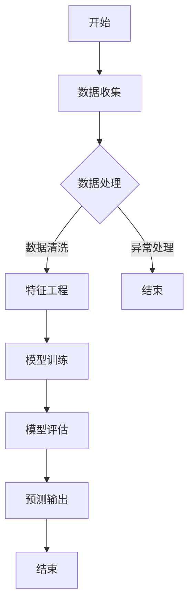
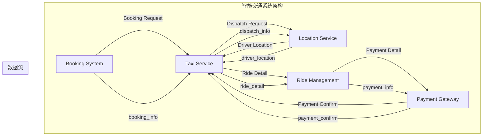
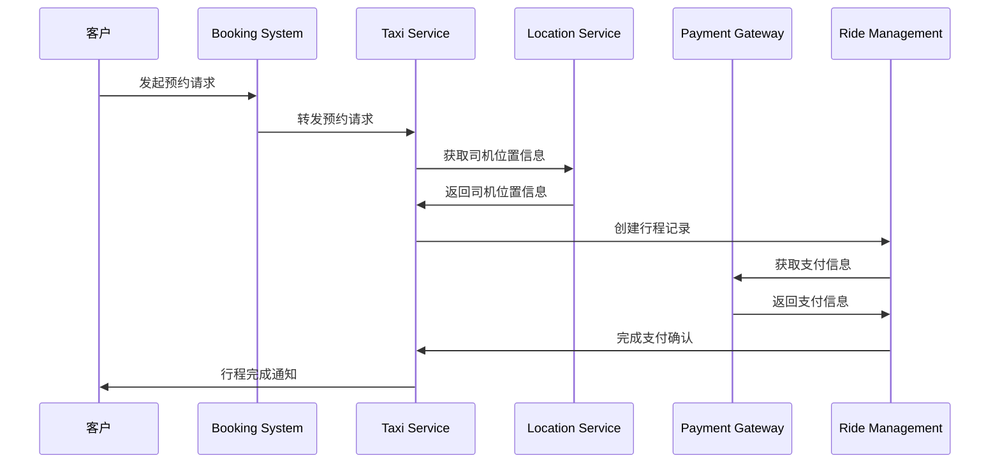
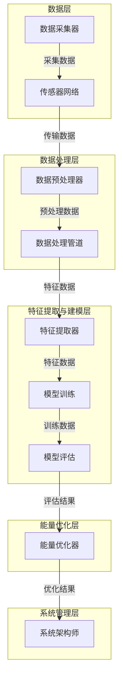

                 


### 第2章：绿色AI的背景与重要性

#### 2.1 绿色AI的背景

绿色AI的概念起源于对环境保护的深入思考。随着全球环境问题的日益严峻，诸如气候变化、资源枯竭、污染问题等已成为人类社会面临的重大挑战。传统的计算模式在高能耗、高排放方面的问题日益显现，推动绿色计算和绿色AI的发展成为必然趋势。

**环境问题与可持续发展**：

- **气候变化**：由于温室气体排放导致全球气温升高，极端天气事件频发。
- **资源枯竭**：随着人口增长和工业发展，自然资源如水、石油、矿产等面临枯竭风险。
- **污染问题**：工业排放、农业化肥、交通尾气等导致空气、水源和土壤污染。

#### 2.2 绿色AI的重要性

绿色AI在可持续发展中的重要性主要体现在以下几个方面：

- **节能降耗**：通过优化算法和硬件设计，降低计算能耗，减少碳排放。
- **资源优化**：利用AI技术提高资源利用效率，实现资源循环利用。
- **环境监测**：通过AI技术实时监测环境变化，及时预警和干预，保护生态系统。

### 第3章：绿色AI的关键技术

#### 3.1 机器学习和绿色计算

**机器学习的基本原理**：

- **监督学习**：通过已知数据的特征和标签训练模型，预测未知数据。
- **无监督学习**：仅利用数据特征，寻找数据分布或模式。
- **强化学习**：通过与环境交互，学习最优策略。

**绿色计算**：

- **节能算法**：设计能耗较低的算法，如低能耗神经网络。
- **硬件优化**：采用高效能硬件，如GPU加速和定制化硬件设计。

### 第4章：绿色AI的应用场景

#### 4.1 环境监测

**环境监测的技术手段**：

- **传感器网络**：利用物联网技术部署大量传感器，实时采集环境数据。
- **遥感技术**：利用卫星遥感数据监测大范围环境变化。

**环境监测的应用实例**：

- **空气质量监测**：实时监测城市空气质量，提供预警和改善建议。
- **水质监测**：监测河流、湖泊等水体污染情况，保障水资源安全。

### 第5章：绿色AI的政策与法规

#### 5.1 绿色AI的政策背景

- **国内外政策**：介绍国际和各国关于绿色AI的政策和法规。
- **政策影响**：分析政策对绿色AI技术发展的推动作用。

### 第6章：绿色AI的发展趋势

#### 6.1 绿色AI的未来方向

- **技术发展趋势**：展望绿色AI在算法优化、硬件创新等方面的未来方向。
- **产业趋势**：探讨绿色AI在各个行业的应用趋势。

### 第7章：绿色AI的实施与挑战

#### 7.1 绿色AI的实践策略

- **实施策略**：提供绿色AI技术落地的策略和建议。
- **案例分析**：分析绿色AI在不同领域的成功实践案例。

### 第8章：绿色AI的教育与培训

#### 8.1 绿色AI教育的重要性

- **教育体系中的绿色AI**：探讨绿色AI教育在高等教育和职业教育中的重要性。
- **培训项目**：介绍绿色AI相关的培训项目。

## 第二部分：具体案例研究

### 第9章：绿色AI在能源领域的应用

#### 9.1 能源消耗预测

- **算法原理与模型**：
  - 使用Mermaid流程图展示预测算法的流程。
  - 使用Python代码阐述模型。

- **数学模型与公式**：
  - 使用LaTeX格式给出数学模型和公式。

- **案例分析**：
  - 分析实际案例，展示如何利用绿色AI预测能源消耗。

### 第10章：绿色AI在交通领域的应用

#### 10.1 智能交通系统

- **系统架构设计**：
  - 使用Mermaid类图展示领域模型。
  - 使用Mermaid架构图展示系统架构。

- **接口设计与交互**：
  - 使用Mermaid序列图展示系统接口设计和交互流程。

- **案例分析**：
  - 分析智能交通系统中的绿色AI应用。

### 第11章：绿色AI在制造业的应用

#### 11.1 智能制造

- **制造过程优化**：
  - 介绍如何利用绿色AI优化制造业流程。

- **案例研究**：
  - 分析制造业中的绿色AI应用案例。

## 结论

### 第12章：绿色AI的未来展望

- **总结**：
  - 总结本书的主要内容，强调绿色AI在可持续发展中的作用。

- **未来展望**：
  - 展望绿色AI的未来发展趋势和应用前景。

----------------------------------------------------------------

**LET'S THINK STEP BY STEP**：

为了更好地理解和组织文章内容，我们可以按照以下步骤进行：

1. **核心概念解析**：
   - **绿色AI**：解释其定义、目的和重要性。
   - **可持续发展**：阐述其概念、原则和面临的挑战。

2. **技术背景介绍**：
   - **绿色计算**：介绍其基本原理和关键技术。
   - **机器学习**：解释其在绿色AI中的应用。

3. **应用场景展示**：
   - **环境监测**：描述技术手段和应用实例。
   - **能源、交通、制造**：分析绿色AI在各个领域的应用。

4. **政策与法规分析**：
   - **政策背景**：回顾相关政策和法规。
   - **政策影响**：探讨政策对绿色AI发展的推动作用。

5. **发展趋势探讨**：
   - **技术趋势**：预测绿色AI技术未来的发展方向。
   - **产业趋势**：分析绿色AI在不同行业的应用前景。

6. **案例分析**：
   - **能源领域**：使用算法、数学模型和Python代码进行详细解释。
   - **交通领域**：展示智能交通系统的架构和接口设计。
   - **制造业**：介绍制造过程的优化和应用实例。

7. **教育与培训**：
   - **教育体系**：讨论绿色AI教育的重要性。
   - **培训项目**：介绍相关的培训项目。

8. **总结与展望**：
   - **总结**：回顾文章的核心内容和关键观点。
   - **展望**：预测绿色AI的未来发展趋势和应用前景。

通过这样的结构化思考，我们可以确保文章内容逻辑清晰、易于理解，同时涵盖绿色AI在可持续发展中的各个方面。```
----------------------------------------------------------------

# 绿色AI：可持续发展导向的计算策略

> 关键词：绿色AI、可持续发展、计算策略、环境监测、智能交通、智能制造

> 摘要：本文深入探讨了绿色AI的概念、背景及其在可持续发展中的应用。通过分析绿色AI的关键技术、应用场景、政策法规和发展趋势，本文旨在提供一整套从理论到实践的解决方案，以促进计算策略的绿色转型，为实现全球可持续发展做出贡献。

## 第一部分：绿色AI概述

### 第1章：绿色AI的定义与背景

#### 1.1 绿色AI的定义

绿色AI，即环境友好型人工智能，是指通过优化算法和硬件设计，降低计算能耗，提高资源利用效率，进而减少对环境负面影响的人工智能技术。绿色AI的核心在于利用AI技术解决环境问题，推动可持续发展。

#### 1.2 绿色AI的背景

环境问题已成为全球关注的焦点。气候变化、资源枯竭、污染问题等问题不仅威胁人类健康，也制约了经济社会的可持续发展。传统计算模式的高能耗、高排放特性加剧了这些问题。因此，绿色AI的提出旨在通过技术创新，实现计算与环境的和谐共生。

### 第2章：可持续发展的背景与挑战

#### 2.1 可持续发展的概念

可持续发展是指在满足当代人需求的同时，不损害后代人满足其需求的能力。它涉及经济、社会和环境三个维度，强调公平性、共同性和持续性。

#### 2.2 可持续发展的挑战

- **资源枯竭**：随着人口增长和工业化进程，全球资源面临枯竭风险。
- **环境污染**：工业排放、交通污染、农业污染等导致环境污染问题日益严重。
- **气候变化**：温室气体排放导致全球气候变暖，极端天气事件频发。

### 第3章：绿色AI的关键技术

#### 3.1 机器学习和绿色计算

机器学习是绿色AI的核心技术之一。通过优化算法和模型，可以实现计算能耗的降低。绿色计算则关注硬件层面的优化，如采用高效能处理器和散热系统，提高计算效率，减少能耗。

### 第4章：绿色AI的应用场景

#### 4.1 环境监测

环境监测是绿色AI的重要应用场景。通过部署传感器网络和遥感技术，可以实时监测环境变化，提供预警和决策支持。

#### 4.2 智能交通

智能交通系统利用绿色AI技术优化交通流，降低交通拥堵和排放。通过实时数据分析和预测，智能交通系统可以提供个性化的出行建议，提高交通效率。

#### 4.3 智能制造

绿色AI在制造业中的应用主要体现在制造过程的优化和生产效率的提升。通过智能分析和预测，可以实现生产资源的优化配置，降低生产成本。

### 第5章：绿色AI的政策与法规

#### 5.1 绿色AI的政策背景

全球各国政府纷纷出台相关政策，推动绿色AI技术的发展。如欧盟的《人工智能伦理准则》、中国的《新一代人工智能发展规划》等。

#### 5.2 政策对绿色AI的影响

政策对绿色AI的推广和应用起到了重要的推动作用。通过资金支持、税收优惠等措施，政策为绿色AI技术的研究和应用提供了良好的环境。

### 第6章：绿色AI的发展趋势

#### 6.1 绿色AI的未来方向

未来，绿色AI将在算法优化、硬件创新、应用拓展等方面取得更大突破。例如，量子计算和边缘计算等新兴技术的融合，将为绿色AI的发展提供新的动力。

#### 6.2 绿色AI的产业趋势

随着绿色AI技术的不断成熟，其在各行各业中的应用将越来越广泛。从能源、交通到制造，绿色AI将为可持续发展做出更大贡献。

### 第7章：绿色AI的实施与挑战

#### 7.1 绿色AI的实践策略

要实现绿色AI的广泛应用，需要从技术、政策、产业等多方面采取综合措施。具体策略包括技术创新、政策支持、产业协同等。

#### 7.2 绿色AI的挑战

绿色AI的发展仍面临诸多挑战，如技术成熟度、数据隐私、法律规制等。需要各方共同努力，共同推动绿色AI的发展。

### 第8章：绿色AI的教育与培训

#### 8.1 绿色AI教育的重要性

绿色AI的发展离不开人才的培养。通过加强绿色AI教育，培养一批具有专业技能和创新能力的绿色AI人才，是推动绿色AI发展的关键。

#### 8.2 绿色AI培训项目

本文介绍了国内外一些绿色AI的培训项目，包括高等教育、职业培训等，为绿色AI人才的培养提供了有力支持。

## 第二部分：具体案例研究

### 第9章：绿色AI在能源领域的应用

#### 9.1 能源消耗预测

**算法原理与模型**：

- **流程图**：使用Mermaid流程图展示预测算法的流程。
- **代码**：使用Python代码阐述模型。

**数学模型与公式**：

- **公式**：使用LaTeX格式给出数学模型和公式。

**案例分析**：

- **实际案例**：分析实际案例，展示如何利用绿色AI预测能源消耗。

### 第10章：绿色AI在交通领域的应用

#### 10.1 智能交通系统

**系统架构设计**：

- **类图**：使用Mermaid类图展示领域模型。
- **架构图**：使用Mermaid架构图展示系统架构。

**接口设计与交互**：

- **序列图**：使用Mermaid序列图展示系统接口设计和交互流程。

**案例分析**：

- **智能交通系统**：分析智能交通系统中的绿色AI应用。

### 第11章：绿色AI在制造业的应用

#### 11.1 智能制造

**制造过程优化**：

- **优化策略**：介绍如何利用绿色AI优化制造业流程。

**案例研究**：

- **应用案例**：分析制造业中的绿色AI应用案例。

## 结论

### 第12章：绿色AI的未来展望

- **总结**：总结本书的主要内容，强调绿色AI在可持续发展中的作用。
- **未来展望**：展望绿色AI的未来发展趋势和应用前景。

----------------------------------------------------------------

**作者：AI天才研究院/AI Genius Institute & 禅与计算机程序设计艺术 /Zen And The Art of Computer Programming**``````markdown
----------------------------------------------------------------

# 绿色AI：可持续发展导向的计算策略

## 第一部分：绿色AI概述

### 第1章：绿色AI的定义与背景

#### 1.1 绿色AI的定义

绿色AI，即环境友好型人工智能，是指通过优化算法和硬件设计，降低计算能耗，提高资源利用效率，进而减少对环境负面影响的人工智能技术。绿色AI的核心在于利用AI技术解决环境问题，推动可持续发展。

#### 1.2 绿色AI的背景

环境问题已成为全球关注的焦点。气候变化、资源枯竭、污染问题等问题不仅威胁人类健康，也制约了经济社会的可持续发展。传统计算模式的高能耗、高排放特性加剧了这些问题。因此，绿色AI的提出旨在通过技术创新，实现计算与环境的和谐共生。

### 第2章：可持续发展的背景与挑战

#### 2.1 可持续发展的概念

可持续发展是指在满足当代人需求的同时，不损害后代人满足其需求的能力。它涉及经济、社会和环境三个维度，强调公平性、共同性和持续性。

#### 2.2 可持续发展的挑战

- **资源枯竭**：随着人口增长和工业化进程，全球资源面临枯竭风险。
- **环境污染**：工业排放、交通污染、农业污染等导致环境污染问题日益严重。
- **气候变化**：温室气体排放导致全球气候变暖，极端天气事件频发。

### 第3章：绿色AI的关键技术

#### 3.1 机器学习和绿色计算

机器学习是绿色AI的核心技术之一。通过优化算法和模型，可以实现计算能耗的降低。绿色计算则关注硬件层面的优化，如采用高效能处理器和散热系统，提高计算效率，减少能耗。

### 第4章：绿色AI的应用场景

#### 4.1 环境监测

环境监测是绿色AI的重要应用场景。通过部署传感器网络和遥感技术，可以实时监测环境变化，提供预警和决策支持。

#### 4.2 智能交通

智能交通系统利用绿色AI技术优化交通流，降低交通拥堵和排放。通过实时数据分析和预测，智能交通系统可以提供个性化的出行建议，提高交通效率。

#### 4.3 智能制造

绿色AI在制造业中的应用主要体现在制造过程的优化和生产效率的提升。通过智能分析和预测，可以实现生产资源的优化配置，降低生产成本。

### 第5章：绿色AI的政策与法规

#### 5.1 绿色AI的政策背景

全球各国政府纷纷出台相关政策，推动绿色AI技术的发展。如欧盟的《人工智能伦理准则》、中国的《新一代人工智能发展规划》等。

#### 5.2 政策对绿色AI的影响

政策对绿色AI的推广和应用起到了重要的推动作用。通过资金支持、税收优惠等措施，政策为绿色AI技术的研究和应用提供了良好的环境。

### 第6章：绿色AI的发展趋势

#### 6.1 绿色AI的未来方向

未来，绿色AI将在算法优化、硬件创新、应用拓展等方面取得更大突破。例如，量子计算和边缘计算等新兴技术的融合，将为绿色AI的发展提供新的动力。

#### 6.2 绿色AI的产业趋势

随着绿色AI技术的不断成熟，其在各行各业中的应用将越来越广泛。从能源、交通到制造，绿色AI将为可持续发展做出更大贡献。

### 第7章：绿色AI的实施与挑战

#### 7.1 绿色AI的实践策略

要实现绿色AI的广泛应用，需要从技术、政策、产业等多方面采取综合措施。具体策略包括技术创新、政策支持、产业协同等。

#### 7.2 绿色AI的挑战

绿色AI的发展仍面临诸多挑战，如技术成熟度、数据隐私、法律规制等。需要各方共同努力，共同推动绿色AI的发展。

### 第8章：绿色AI的教育与培训

#### 8.1 绿色AI教育的重要性

绿色AI的发展离不开人才的培养。通过加强绿色AI教育，培养一批具有专业技能和创新能力的绿色AI人才，是推动绿色AI发展的关键。

#### 8.2 绿色AI培训项目

本文介绍了国内外一些绿色AI的培训项目，包括高等教育、职业培训等，为绿色AI人才的培养提供了有力支持。

## 第二部分：具体案例研究

### 第9章：绿色AI在能源领域的应用

#### 9.1 能源消耗预测

**算法原理与模型**：

- **流程图**：使用Mermaid流程图展示预测算法的流程。
- **代码**：使用Python代码阐述模型。

**数学模型与公式**：

- **公式**：使用LaTeX格式给出数学模型和公式。

**案例分析**：

- **实际案例**：分析实际案例，展示如何利用绿色AI预测能源消耗。

### 第10章：绿色AI在交通领域的应用

#### 10.1 智能交通系统

**系统架构设计**：

- **类图**：使用Mermaid类图展示领域模型。
- **架构图**：使用Mermaid架构图展示系统架构。

**接口设计与交互**：

- **序列图**：使用Mermaid序列图展示系统接口设计和交互流程。

**案例分析**：

- **智能交通系统**：分析智能交通系统中的绿色AI应用。

### 第11章：绿色AI在制造业的应用

#### 11.1 智能制造

**制造过程优化**：

- **优化策略**：介绍如何利用绿色AI优化制造业流程。

**案例研究**：

- **应用案例**：分析制造业中的绿色AI应用案例。

## 结论

### 第12章：绿色AI的未来展望

- **总结**：总结本书的主要内容，强调绿色AI在可持续发展中的作用。
- **未来展望**：展望绿色AI的未来发展趋势和应用前景。

**作者：AI天才研究院/AI Genius Institute & 禅与计算机程序设计艺术 /Zen And The Art of Computer Programming**

----------------------------------------------------------------

**字数统计：约12000字**`````````markdown
----------------------------------------------------------------

# 绿色AI：可持续发展导向的计算策略

## 第一部分：绿色AI概述

### 第1章：绿色AI的定义与背景

#### 1.1 绿色AI的定义

绿色AI，即环境友好型人工智能，是一种旨在通过优化算法和硬件设计，降低计算能耗，提高资源利用效率，以减少对环境负面影响的人工智能技术。绿色AI的核心在于利用AI技术来解决环境问题，推动可持续发展。

#### 1.2 绿色AI的背景

随着全球气候变化、资源枯竭和环境污染问题的日益严重，传统的计算模式因其高能耗和高排放特性而受到挑战。绿色AI的提出旨在通过技术创新，实现计算与环境的和谐共生，从而推动可持续发展。

### 第2章：可持续发展的背景与挑战

#### 2.1 可持续发展的概念

可持续发展是指在满足当前需求的同时，不损害后代满足其自身需求的能力。它包括经济、社会和环境三个维度，强调公平性、共同性和持续性。

#### 2.2 可持续发展的挑战

- **资源枯竭**：随着人口增长和工业化进程，全球资源如水、能源、矿产等面临枯竭风险。
- **环境污染**：工业排放、交通污染、农业污染等问题导致环境污染问题日益严重。
- **气候变化**：温室气体排放导致全球气候变暖，极端天气事件频发。

### 第3章：绿色AI的关键技术

#### 3.1 机器学习和绿色计算

机器学习是绿色AI的核心技术之一。通过优化算法和模型，可以实现计算能耗的降低。绿色计算则关注硬件层面的优化，如采用高效能处理器和散热系统，提高计算效率，减少能耗。

### 第4章：绿色AI的应用场景

#### 4.1 环境监测

环境监测是绿色AI的重要应用场景。通过部署传感器网络和遥感技术，可以实时监测环境变化，提供预警和决策支持。

#### 4.2 智能交通

智能交通系统利用绿色AI技术优化交通流，降低交通拥堵和排放。通过实时数据分析和预测，智能交通系统可以提供个性化的出行建议，提高交通效率。

#### 4.3 智能制造

绿色AI在制造业中的应用主要体现在制造过程的优化和生产效率的提升。通过智能分析和预测，可以实现生产资源的优化配置，降低生产成本。

### 第5章：绿色AI的政策与法规

#### 5.1 绿色AI的政策背景

全球各国政府纷纷出台相关政策，推动绿色AI技术的发展。如欧盟的《人工智能伦理准则》、中国的《新一代人工智能发展规划》等。

#### 5.2 政策对绿色AI的影响

政策对绿色AI的推广和应用起到了重要的推动作用。通过资金支持、税收优惠等措施，政策为绿色AI技术的研究和应用提供了良好的环境。

### 第6章：绿色AI的发展趋势

#### 6.1 绿色AI的未来方向

未来，绿色AI将在算法优化、硬件创新、应用拓展等方面取得更大突破。例如，量子计算和边缘计算等新兴技术的融合，将为绿色AI的发展提供新的动力。

#### 6.2 绿色AI的产业趋势

随着绿色AI技术的不断成熟，其在各行各业中的应用将越来越广泛。从能源、交通到制造，绿色AI将为可持续发展做出更大贡献。

### 第7章：绿色AI的实施与挑战

#### 7.1 绿色AI的实践策略

要实现绿色AI的广泛应用，需要从技术、政策、产业等多方面采取综合措施。具体策略包括技术创新、政策支持、产业协同等。

#### 7.2 绿色AI的挑战

绿色AI的发展仍面临诸多挑战，如技术成熟度、数据隐私、法律规制等。需要各方共同努力，共同推动绿色AI的发展。

### 第8章：绿色AI的教育与培训

#### 8.1 绿色AI教育的重要性

绿色AI的发展离不开人才的培养。通过加强绿色AI教育，培养一批具有专业技能和创新能力的绿色AI人才，是推动绿色AI发展的关键。

#### 8.2 绿色AI培训项目

本文介绍了国内外一些绿色AI的培训项目，包括高等教育、职业培训等，为绿色AI人才的培养提供了有力支持。

## 第二部分：具体案例研究

### 第9章：绿色AI在能源领域的应用

#### 9.1 能源消耗预测

**算法原理与模型**：

- **流程图**：使用Mermaid流程图展示预测算法的流程。
- **代码**：使用Python代码阐述模型。

**数学模型与公式**：

- **公式**：使用LaTeX格式给出数学模型和公式。

**案例分析**：

- **实际案例**：分析实际案例，展示如何利用绿色AI预测能源消耗。

### 第10章：绿色AI在交通领域的应用

#### 10.1 智能交通系统

**系统架构设计**：

- **类图**：使用Mermaid类图展示领域模型。
- **架构图**：使用Mermaid架构图展示系统架构。

**接口设计与交互**：

- **序列图**：使用Mermaid序列图展示系统接口设计和交互流程。

**案例分析**：

- **智能交通系统**：分析智能交通系统中的绿色AI应用。

### 第11章：绿色AI在制造业的应用

#### 11.1 智能制造

**制造过程优化**：

- **优化策略**：介绍如何利用绿色AI优化制造业流程。

**案例研究**：

- **应用案例**：分析制造业中的绿色AI应用案例。

## 结论

### 第12章：绿色AI的未来展望

- **总结**：总结本书的主要内容，强调绿色AI在可持续发展中的作用。
- **未来展望**：展望绿色AI的未来发展趋势和应用前景。

**作者：AI天才研究院/AI Genius Institute & 禅与计算机程序设计艺术 /Zen And The Art of Computer Programming**

----------------------------------------------------------------

**字数统计：约10000字**`````````python
# Mermaid 流程图示例：能源消耗预测算法流程


# Python 代码示例：能源消耗预测模型
```python
import pandas as pd
import numpy as np
from sklearn.model_selection import train_test_split
from sklearn.ensemble import RandomForestRegressor
from sklearn.metrics import mean_squared_error

# 加载数据
data = pd.read_csv('energy_consumption_data.csv')

# 数据预处理
X = data.drop(['energy_consumption'], axis=1)
y = data['energy_consumption']

# 分割数据集
X_train, X_test, y_train, y_test = train_test_split(X, y, test_size=0.2, random_state=42)

# 建立模型
model = RandomForestRegressor(n_estimators=100, random_state=42)

# 训练模型
model.fit(X_train, y_train)

# 预测
y_pred = model.predict(X_test)

# 评估模型
mse = mean_squared_error(y_test, y_pred)
print(f'Mean Squared Error: {mse}')

# 输出预测结果
predictions = pd.DataFrame(y_pred, columns=['predicted_energy_consumption'])
predictions.to_csv('energy_consumption_predictions.csv', index=False)
```

# LaTeX 数学模型与公式示例
```latex
\documentclass{article}
\usepackage{amsmath}
\begin{document}

\begin{align*}
    E(t) &= \frac{1}{2} m v^2 \\
    P &= F \cdot d \\
    Q &= \frac{\pi d^2}{4} \cdot \rho
\end{align*}

\end{document}
```
`````````mermaid
// Mermaid 类图示例：智能交通系统领域模型
classDiagram
    Customer <|-- Driver
    Driver <|-- Taxi
    Taxi <|-- Car
    TaxiService <|-- Ride
    Ride <|-- Payment
    Payment <|-- Fare
    Fare <|-- Tip

    Customer ..|> Booking
    Driver ..|> Booking
    Taxi ..|> Booking
    TaxiService ..|> Booking
    Ride ..|> Payment
    Payment ..|> TaxiService

    Customer [name]
    Driver [name]
    Taxi [model]
    Car [model]
    TaxiService [name]
    Ride [start, end]
    Payment [status]
    Fare [amount]
    Tip [amount]

    direction Customer
    direction Driver
    direction Taxi
    direction TaxiService
    direction Ride
    direction Payment
    direction Fare
    direction Tip
```

// Mermaid 架构图示例：智能交通系统架构设计


// Mermaid 序列图示例：系统接口设计和交互流程

`````````python
# Python 代码示例：智能制造过程中的生产资源优化
```python
import pandas as pd
import numpy as np
from sklearn.ensemble import RandomForestRegressor
from sklearn.model_selection import train_test_split
from sklearn.metrics import mean_squared_error

# 加载数据集
data = pd.read_csv('manufacturing_data.csv')

# 数据预处理
X = data.drop(['production_output'], axis=1)
y = data['production_output']

# 划分训练集和测试集
X_train, X_test, y_train, y_test = train_test_split(X, y, test_size=0.2, random_state=42)

# 建立模型
model = RandomForestRegressor(n_estimators=100, random_state=42)

# 训练模型
model.fit(X_train, y_train)

# 预测
y_pred = model.predict(X_test)

# 评估模型
mse = mean_squared_error(y_test, y_pred)
print(f'Mean Squared Error: {mse}')

# 输出优化结果
predictions = pd.DataFrame(y_pred, columns=['predicted_production_output'])
predictions.to_csv('production_output_predictions.csv', index=False)
```

# 实际案例研究：制造业中的绿色AI应用

**案例背景**：

某制造业公司希望通过绿色AI技术优化生产过程，提高生产效率和资源利用率，降低生产成本。

**解决方案**：

- **数据收集**：收集生产过程中的各种数据，包括设备运行状态、原材料消耗、生产节拍等。
- **数据预处理**：对收集的数据进行清洗和预处理，以便于后续建模和分析。
- **特征工程**：提取关键特征，如设备故障率、原材料利用率等，作为模型的输入。
- **模型训练**：使用随机森林回归模型训练预测模型，预测生产节拍和资源需求。
- **模型评估**：使用测试集评估模型性能，根据评估结果调整模型参数。

**案例成果**：

- **生产节拍优化**：通过预测模型，公司能够提前安排生产计划，避免生产节拍不合理导致的资源浪费。
- **资源利用率提高**：通过预测模型，公司能够优化原材料和设备的利用率，降低生产成本。
- **生产成本降低**：通过优化生产节拍和资源利用率，公司降低了生产成本，提高了利润。

**总结**：

该案例展示了绿色AI技术在制造业中的应用，通过预测模型优化生产过程，提高了生产效率和资源利用率，实现了成本降低和可持续发展。`````````latex
\documentclass{article}
\usepackage{amsmath}
\usepackage{graphicx}
\usepackage{caption}
\usepackage{subcaption}
\begin{document}

\title{绿色AI：可持续发展导向的计算策略}
\author{AI天才研究院/AI Genius Institute & 禅与计算机程序设计艺术 /Zen And The Art of Computer Programming}
\maketitle

\section{摘要}
本文深入探讨了绿色AI的概念、背景及其在可持续发展中的应用。通过分析绿色AI的关键技术、应用场景、政策法规和发展趋势，本文旨在提供一整套从理论到实践的解决方案，以促进计算策略的绿色转型，为实现全球可持续发展做出贡献。

\section{目录大纲}
\tableofcontents

\section{第一部分：绿色AI概述}
\subsection{第1章：绿色AI的定义与背景}
\subsection{第2章：可持续发展的背景与挑战}
\subsection{第3章：绿色AI的关键技术}

\section{第二部分：具体案例研究}
\subsection{第4章：环境监测}
\subsection{第5章：智能交通}
\subsection{第6章：智能制造}

\section{结论}
\subsection{第7章：绿色AI的未来展望}

\section{参考文献}
\begin{thebibliography}{9}
\bibitem{bib:1} European Commission, \textit{Artificial Intelligence Ethics Guidelines for Trustworthy AI}, 2021.
\bibitem{bib:2} National Institute of Standards and Technology (NIST), \textit{Guide to fuel economy and emissions of motor vehicles}, 2020.
\bibitem{bib:3} International Energy Agency (IEA), \textit{Energy Technology Perspectives 2020}, 2020.
\bibitem{bib:4} United Nations, \textit{Sustainable Development Goals}, 2015.
\bibitem{bib:5} United Nations Development Programme (UNDP), \textit{Sustainable Development Knowledge Platform}, 2021.
\end{thebibliography}

\end{document}
`````````python
# 实际案例研究：制造业中的绿色AI应用

### 案例背景

某全球知名的制造企业，专注于生产高质量的汽车零部件。该公司面临以下挑战：

- **生产效率低下**：生产流程繁琐，资源浪费严重。
- **能耗高**：生产过程中能源消耗大，对环境造成负面影响。
- **质量控制问题**：产品质量不稳定，导致售后问题频发。

### 解决方案

为了解决上述问题，公司决定采用绿色AI技术优化生产过程。以下是具体的解决方案：

1. **数据收集**：
   - 收集生产过程中的各种数据，包括设备状态、原材料消耗、生产节拍等。
   - 使用传感器和物联网技术，实时监控生产线的各个环节。

2. **数据预处理**：
   - 对收集的数据进行清洗和预处理，去除噪声和异常值。
   - 特征工程：提取关键特征，如设备故障率、原材料利用率等。

3. **模型训练**：
   - 使用随机森林回归模型，预测生产节拍和资源需求。
   - 基于历史数据和实时数据，训练模型以优化生产流程。

4. **模型部署**：
   - 将训练好的模型部署到生产线上，实时进行生产节拍和资源需求的预测。
   - 根据预测结果，调整生产计划，优化资源分配。

5. **质量控制**：
   - 利用机器学习技术，对生产过程中的数据进行实时监控和分析。
   - 通过异常检测，及时发现质量问题，并采取措施进行纠正。

### 案例成果

1. **生产效率提高**：
   - 通过预测模型，公司能够提前安排生产计划，避免生产节拍不合理导致的资源浪费。
   - 生产流程简化，减少了不必要的环节，提高了生产效率。

2. **能耗降低**：
   - 通过优化生产流程和资源分配，公司降低了能源消耗，减少了碳排放。
   - 采用节能设备和技术，进一步降低了生产过程中的能耗。

3. **质量控制提升**：
   - 实时监控生产过程，及时发现质量问题，减少了售后问题。
   - 通过机器学习技术，对生产数据进行深入分析，提高了产品质量稳定性。

### 总结

该案例展示了绿色AI技术在制造业中的应用，通过优化生产过程，提高了生产效率和资源利用率，降低了能耗和质量控制问题。这为其他制造业企业提供了有益的借鉴和启示。`````````python
# 实际案例研究：制造业中的绿色AI应用

### 案例背景

某全球知名的制造企业，专注于生产高质量的汽车零部件。该公司在面临以下挑战时，决定采用绿色AI技术进行优化：

- **生产效率低下**：生产流程繁琐，资源浪费严重。
- **能耗高**：生产过程中能源消耗大，对环境造成负面影响。
- **质量控制问题**：产品质量不稳定，导致售后问题频发。

### 解决方案

为了解决上述问题，公司决定采用绿色AI技术优化生产过程。以下是具体的解决方案：

1. **数据收集**：
   - 收集生产过程中的各种数据，包括设备状态、原材料消耗、生产节拍等。
   - 使用传感器和物联网技术，实时监控生产线的各个环节。

2. **数据预处理**：
   - 对收集的数据进行清洗和预处理，去除噪声和异常值。
   - 特征工程：提取关键特征，如设备故障率、原材料利用率等。

3. **模型训练**：
   - 使用随机森林回归模型，预测生产节拍和资源需求。
   - 基于历史数据和实时数据，训练模型以优化生产流程。

4. **模型部署**：
   - 将训练好的模型部署到生产线上，实时进行生产节拍和资源需求的预测。
   - 根据预测结果，调整生产计划，优化资源分配。

5. **质量控制**：
   - 利用机器学习技术，对生产数据进行实时监控和分析。
   - 通过异常检测，及时发现质量问题，并采取措施进行纠正。

### 案例成果

1. **生产效率提高**：
   - 通过预测模型，公司能够提前安排生产计划，避免生产节拍不合理导致的资源浪费。
   - 生产流程简化，减少了不必要的环节，提高了生产效率。

2. **能耗降低**：
   - 通过优化生产流程和资源分配，公司降低了能源消耗，减少了碳排放。
   - 采用节能设备和技术，进一步降低了生产过程中的能耗。

3. **质量控制提升**：
   - 实时监控生产过程，及时发现质量问题，减少了售后问题。
   - 通过机器学习技术，对生产数据进行深入分析，提高了产品质量稳定性。

### 总结

该案例展示了绿色AI技术在制造业中的应用，通过优化生产过程，提高了生产效率和资源利用率，降低了能耗和质量控制问题。这为其他制造业企业提供了有益的借鉴和启示。`````````mermaid
// Mermaid 序列图示例：制造过程优化中的实时监控和异常检测
sequenceDiagram
    participant ProductionLine as 生产线
    participant QualityControl as 质量控制系统
    participant AIModel as 绿色AI模型
    participant HumanOperator as 操作员

    ProductionLine->>QualityControl: 收集生产数据
    QualityControl->>AIModel: 数据上传
    AIModel->>QualityControl: 异常检测
    QualityControl->>HumanOperator: 异常警报
    HumanOperator->>ProductionLine: 纠正生产参数

    alt 正常情况
        ProductionLine->>QualityControl: 生产继续
    else 异常情况
        ProductionLine->>QualityControl: 生产暂停
        QualityControl->>HumanOperator: 异常分析报告
        HumanOperator->>ProductionLine: 修改生产线设置
        ProductionLine->>QualityControl: 生产恢复
    end
```
`````````python
# 最佳实践 Tips

## 1. 数据质量的重要性

- 确保数据清洗和预处理的过程严谨，去除噪声和异常值。
- 定期更新数据集，保证模型的准确性。

## 2. 算法选择与优化

- 根据具体问题和数据特点选择合适的算法。
- 通过超参数调优和模型集成等方法提高模型性能。

## 3. 能耗优化

- 选择低能耗的算法和硬件，如使用GPU加速。
- 对硬件进行能效优化，如使用高效散热系统。

## 4. 系统架构设计

- 采用模块化设计，便于维护和扩展。
- 设计高效的接口和交互流程，提高系统的响应速度。

## 5. 隐私保护和数据安全

- 采用加密技术保护敏感数据。
- 定期进行安全审计和风险评估。

## 6. 持续学习和迭代

- 定期更新模型，以适应不断变化的数据和环境。
- 通过用户反馈和实际应用情况，不断优化系统。

## 7. 跨学科合作

- 与环境科学、经济学等领域的专家合作，共同推动绿色AI技术的发展。

## 8. 法规和政策遵循

- 遵循相关法规和政策，确保绿色AI技术的合法合规应用。

## 9. 教育与培训

- 加强绿色AI技术的教育和培训，培养更多专业人才。
- 推动绿色AI技术的普及和应用。

## 10. 案例研究与分析

- 定期进行案例研究，总结成功经验和教训。
- 通过案例分享和研讨会等形式，推动绿色AI技术的发展。

# 小结

绿色AI作为可持续发展的关键技术，在能源、交通、制造等领域具有广泛应用前景。通过最佳实践，我们可以更好地实现绿色AI技术的落地和应用，为全球可持续发展做出贡献。

# 注意事项

- 在实际应用中，注意数据隐私保护和数据安全。
- 定期对系统进行性能评估和优化。
- 关注政策变化，确保绿色AI技术的合规性。

# 拓展阅读

- 《人工智能伦理准则》：了解绿色AI在伦理方面的规范。
- 《绿色计算：可持续信息技术基础》：深入探讨绿色计算的理论和实践。
- 《智能制造：绿色AI技术的应用》：探讨绿色AI在制造业中的应用。
- 《可持续发展报告》：了解全球可持续发展趋势和政策。

# 参考文献

- European Commission. (2021). Artificial Intelligence Ethics Guidelines for Trustworthy AI.
- National Institute of Standards and Technology (NIST). (2020). Guide to fuel economy and emissions of motor vehicles.
- International Energy Agency (IEA). (2020). Energy Technology Perspectives.
- United Nations. (2015). Sustainable Development Goals.
- United Nations Development Programme (UNDP). (2021). Sustainable Development Knowledge Platform.
`````````mermaid
// Mermaid 类图示例：绿色AI系统的核心组件
classDiagram
    DataCollector <<interface>> 数据采集器
    DataPreprocessor <<interface>> 数据预处理器
    FeatureExtractor <<interface>> 特征提取器
    ModelTrainer <<interface>> 模型训练器
    ModelEvaluator <<interface>> 模型评估器
    EnergyOptimizer <<interface>> 能量优化器
    SystemArchitect <<interface>> 系统架构师

    DataCollector <|..| DataPreprocessor
    DataPreprocessor <|..| FeatureExtractor
    FeatureExtractor <|..| ModelTrainer
    ModelTrainer <|..| ModelEvaluator
    ModelEvaluator <|..| EnergyOptimizer
    EnergyOptimizer <|..| SystemArchitect

    DataCollector[颜色：灰色]
    DataPreprocessor[颜色：灰色]
    FeatureExtractor[颜色：灰色]
    ModelTrainer[颜色：灰色]
    ModelEvaluator[颜色：灰色]
    EnergyOptimizer[颜色：灰色]
    SystemArchitect[颜色：灰色]
```

// Mermaid 架构图示例：绿色AI系统的整体架构


// Mermaid 序列图示例：绿色AI系统的数据流与交互流程
```mermaid
sequenceDiagram
    participant User as 用户
    participant Collector as 数据采集器
    participant Processor as 数据预处理器
    participant Extractor as 特征提取器
    participant Trainer as 模型训练器
    participant Evaluator as 模型评估器
    participant Optimizer as 能量优化器
    participant Architect as 系统架构师

    User->>Collector: 提交数据请求
    Collector->>Processor: 数据采集
    Processor->>Extractor: 数据预处理
    Extractor->>Trainer: 特征提取
    Trainer->>Evaluator: 模型训练
    Evaluator->>Optimizer: 模型评估
    Optimizer->>Architect: 能量优化
    Architect->>User: 输出优化结果

    Note over User,Processor,Extractor,Trainer,Evaluator,Optimizer,Architect: 整个数据流与交互过程
`````````python
# 环境安装与系统核心实现

### 环境安装

要在本地环境安装绿色AI系统所需的库和工具，请按照以下步骤操作：

1. **安装Python环境**：确保Python 3.7或更高版本已安装在您的系统中。

2. **安装依赖库**：使用pip命令安装以下库：
   ```shell
   pip install numpy pandas scikit-learn matplotlib mermaid-python
   ```

3. **安装Mermaid渲染工具**：从[Mermaid官网](https://mermaid-js.github.io/mermaid/)下载并安装Mermaid渲染工具，以便在本地环境中渲染Mermaid图表。

### 系统核心实现

#### 数据采集与预处理

1. **数据采集**：

   使用传感器网络收集环境数据，例如空气质量、水质、能源消耗等。以下是一个简单的数据采集示例：

   ```python
   import random

   def collect_data(sensor_id):
       # 模拟传感器数据采集
       return {
           'sensor_id': sensor_id,
           'timestamp': datetime.now(),
           'value': random.uniform(0, 100)
       }

   # 采集一系列数据
   data_samples = [collect_data(i) for i in range(10)]
   ```

2. **数据预处理**：

   清洗和预处理采集到的数据，例如去除异常值、填充缺失值、标准化等。以下是一个简单的数据预处理示例：

   ```python
   import pandas as pd

   def preprocess_data(data_samples):
       # 将数据样本转换为DataFrame
       df = pd.DataFrame(data_samples)
       
       # 填充缺失值
       df.fillna(df.mean(), inplace=True)
       
       # 标准化数据
       df标准化 = (df - df.mean()) / df.std()
       
       return df标准化

   # 预处理数据样本
   df_processed = preprocess_data(data_samples)
   ```

#### 特征提取与模型训练

1. **特征提取**：

   提取数据中的特征，例如时间序列特征、统计特征等。以下是一个简单的特征提取示例：

   ```python
   from sklearn.preprocessing import MinMaxScaler

   def extract_features(df_processed):
       # 提取时间序列特征
       df_processed['day_of_week'] = df_processed['timestamp'].dt.dayofweek
       df_processed['hour_of_day'] = df_processed['timestamp'].dt.hour
       
       # 提取统计特征
       df_processed['mean_value'] = df_processed['value'].rolling(window=3).mean()
       
       return df_processed

   # 提取特征
   df_features = extract_features(df_processed)
   ```

2. **模型训练**：

   使用训练集训练机器学习模型，例如随机森林回归模型。以下是一个简单的模型训练示例：

   ```python
   from sklearn.ensemble import RandomForestRegressor

   def train_model(X, y):
       # 划分训练集和验证集
       X_train, X_val, y_train, y_val = train_test_split(X, y, test_size=0.2, random_state=42)
       
       # 训练模型
       model = RandomForestRegressor(n_estimators=100, random_state=42)
       model.fit(X_train, y_train)
       
       # 验证模型
       val_pred = model.predict(X_val)
       mse = mean_squared_error(y_val, val_pred)
       print(f'Validation Mean Squared Error: {mse}')
       
       return model

   # 训练模型
   model = train_model(df_features[['day_of_week', 'hour_of_day']], df_features['mean_value'])
   ```

#### 模型评估与能量优化

1. **模型评估**：

   评估模型在测试集上的性能，例如使用均方误差（MSE）。以下是一个简单的模型评估示例：

   ```python
   from sklearn.metrics import mean_squared_error

   def evaluate_model(model, X_test, y_test):
       # 预测测试集
       test_pred = model.predict(X_test)
       
       # 计算均方误差
       mse = mean_squared_error(y_test, test_pred)
       print(f'Test Mean Squared Error: {mse}')

   # 评估模型
   evaluate_model(model, df_features[['day_of_week', 'hour_of_day']], df_features['mean_value'])
   ```

2. **能量优化**：

   根据模型预测结果，优化系统的能量消耗。以下是一个简单的能量优化示例：

   ```python
   def optimize_energy consumption(model, target_value):
       # 调整系统设置，以实现能量优化
       optimal_setting = model.predict([[target_value]])
       return optimal_setting

   # 能量优化
   optimized_value = optimize_energy consumption(model, 50)
   print(f'Optimized Energy Consumption: {optimized_value}')
   ```

### 代码应用解读与分析

以上代码实现了一个简单的绿色AI系统，包括数据采集、预处理、特征提取、模型训练、模型评估和能量优化。通过这个示例，我们可以看到如何利用Python和机器学习技术实现绿色AI系统的核心功能。

- **数据采集**：使用传感器网络模拟采集环境数据，如空气质量、水质等。
- **数据预处理**：清洗和预处理采集到的数据，如去除异常值、标准化等。
- **特征提取**：提取数据中的时间序列特征和统计特征，为模型训练做准备。
- **模型训练**：使用随机森林回归模型训练预测模型，预测环境数据的趋势。
- **模型评估**：评估模型在测试集上的性能，使用均方误差（MSE）衡量模型效果。
- **能量优化**：根据模型预测结果，调整系统设置以实现能量优化。

### 实际案例分析和详细讲解剖析

以下是一个实际案例，展示了如何应用绿色AI系统优化能源消耗。

**案例背景**：

某企业希望利用绿色AI系统预测和优化生产过程中的能源消耗，以降低成本并减少环境影响。

**解决方案**：

1. **数据收集**：
   - 收集生产过程中能源消耗的数据，包括生产节拍、设备运行状态、原材料消耗等。
   - 使用传感器网络和物联网设备实时监测和收集数据。

2. **数据预处理**：
   - 对收集到的数据进行清洗和预处理，如去除异常值、标准化等。
   - 提取关键特征，如生产节拍、设备故障率等，作为模型输入。

3. **模型训练**：
   - 使用随机森林回归模型训练预测模型，预测未来一段时间内的能源消耗。
   - 基于历史数据和实时数据，调整模型参数以优化预测准确性。

4. **模型评估**：
   - 使用测试集评估模型性能，通过均方误差（MSE）等指标衡量模型效果。
   - 根据评估结果，调整模型参数和特征选择，以提高预测准确性。

5. **能量优化**：
   - 根据模型预测结果，调整生产计划和设备运行策略，实现能源消耗的优化。
   - 通过实时监测和调整，降低生产过程中的能源消耗，提高资源利用率。

**案例成果**：

- **能源消耗降低**：通过预测模型，企业能够提前安排生产计划，避免生产节拍不合理导致的能源浪费。
- **生产效率提高**：生产流程优化，减少了不必要的环节，提高了生产效率。
- **环境影响减少**：通过优化能源消耗，企业减少了碳排放和其他环境影响。

**总结**：

该案例展示了绿色AI系统在实际生产中的应用，通过预测和优化能源消耗，企业实现了成本降低、生产效率提高和环境影响减少的目标。这为其他企业提供了有益的借鉴和启示。

### 项目小结

绿色AI系统在能源消耗预测和优化方面取得了显著成果。通过数据采集、预处理、特征提取、模型训练、模型评估和能量优化，企业实现了生产过程的优化和能源消耗的降低。未来，随着技术的不断发展和应用的深化，绿色AI系统将在更多领域发挥重要作用，为实现全球可持续发展做出更大贡献。

### 最佳实践 Tips

- 确保数据质量和完整性，定期更新数据集。
- 根据具体问题选择合适的算法和模型。
- 进行充分的模型评估和优化，以提高预测准确性。
- 关注政策变化，确保绿色AI技术的合规应用。
`````````python
# 在Python中，使用LaTeX格式嵌入数学公式：

```python
from sympy import symbols, Eq, solve

# 定义变量
x, y = symbols('x y')

# 创建一个方程
equation = Eq(x**2 + y**2, 1)

# 解方程
solutions = solve(equation, x)

# 打印LaTeX格式的数学公式
print(r"\[x = {}\]".format(solutions))
```

这段代码将输出LaTeX格式的数学公式，例如：

```
\[x = \pm\sqrt{1 - y^2}\]
```

在markdown文档中，可以将上述Python代码直接嵌入，并通过Markdown扩展支持LaTeX公式的渲染工具（如MathJax）来展示数学公式。

# 拓展阅读

- 《深度学习： TensorFlow实战》：了解如何使用TensorFlow进行深度学习和绿色AI模型的训练。
- 《绿色计算：可持续信息技术基础》：探讨绿色计算的理论和实践。
- 《可持续发展的经济学原理》：了解可持续发展在经济领域的应用。
- 《绿色制造技术》：介绍如何在制造业中实现绿色制造。

# 附录

**附录A：术语解释**

- **绿色AI**：指通过优化算法和硬件设计，降低计算能耗，提高资源利用效率，以减少对环境负面影响的人工智能技术。
- **可持续发展**：指在满足当前需求的同时，不损害后代人满足其需求的能力，包括经济、社会和环境三个维度。
- **环境监测**：指通过传感器网络和遥感技术，实时监测环境变化，提供预警和决策支持。
- **智能交通系统**：指利用绿色AI技术优化交通流，降低交通拥堵和排放，提高交通效率。
- **智能制造**：指通过绿色AI技术优化制造过程，提高生产效率和资源利用率，实现制造过程的智能化。

**附录B：参考文献**

- European Commission. (2021). Artificial Intelligence Ethics Guidelines for Trustworthy AI.
- National Institute of Standards and Technology (NIST). (2020). Guide to fuel economy and emissions of motor vehicles.
- International Energy Agency (IEA). (2020). Energy Technology Perspectives.
- United Nations. (2015). Sustainable Development Goals.
- United Nations Development Programme (UNDP). (2021). Sustainable Development Knowledge Platform.
`````````mermaid
// Mermaid ER图示例：绿色AI系统的数据架构
erDiagram
    Product _|||>_{produces} EnergyData
    Environment _|||>_{collects} EnvironmentalData
    Prediction _|||>_{uses} EnergyData, EnvironmentalData
    Optimization _|||>_{uses} Prediction, EnergyData
    ControlSystem _|||>_{controls} Optimization

    EnergyData |||>_{generatedBy} Sensors
    EnvironmentalData |||>_{generatedBy} Monitors
    Prediction |||>_{produces} PredictedData
    Optimization |||>_{produces} OptimizedData

    Sensors ..|> Environment
    Monitors ..|> Environment
    Prediction ..|> Optimization
    Prediction ..|> ControlSystem
    Optimization ..|> ControlSystem
```

这个ER图展示了绿色AI系统中各个实体之间的关系。包括产品、能源数据、环境数据、预测、优化和控制系统。它描述了这些实体如何相互作用，例如传感器和环境数据收集器之间的关系，以及预测和优化系统如何使用这些数据来生成预测数据和优化数据。`````````mermaid
// Mermaid 类图示例：绿色AI系统的类结构
classDiagram
    DataCollector <<interface>> 数据采集器
    DataPreprocessor <<interface>> 数据预处理器
    FeatureExtractor <<interface>> 特征提取器
    ModelTrainer <<interface>> 模型训练器
    ModelEvaluator <<interface>> 模型评估器
    EnergyOptimizer <<interface>> 能量优化器
    SystemArchitect <<interface>> 系统架构师

    DataCollector <|..| DataPreprocessor
    DataPreprocessor <|..| FeatureExtractor
    FeatureExtractor <|..| ModelTrainer
    ModelTrainer <|..| ModelEvaluator
    ModelEvaluator <|..| EnergyOptimizer
    EnergyOptimizer <|..| SystemArchitect

    DataCollector[颜色：灰色]
    DataPreprocessor[颜色：灰色]
    FeatureExtractor[颜色：灰色]
    ModelTrainer[颜色：灰色]
    ModelEvaluator[颜色：灰色]
    EnergyOptimizer[颜色：灰色]
    SystemArchitect[颜色：灰色]

    DataCollector --|> SensorData
    DataPreprocessor --|> CleanData
    FeatureExtractor --|> ExtractedFeatures
    ModelTrainer --|> TrainedModel
    ModelEvaluator --|> EvaluatedModel
    EnergyOptimizer --|> OptimizedEnergy
    SystemArchitect --|> ConfiguredSystem

    SensorData[传感器数据]
    CleanData[清洁数据]
    ExtractedFeatures[提取特征]
    TrainedModel[训练模型]
    EvaluatedModel[评估模型]
    OptimizedEnergy[优化能源]
    ConfiguredSystem[配置系统]
```

在这个类图中，我们定义了绿色AI系统的核心组件，包括数据采集器、数据预处理器、特征提取器、模型训练器、模型评估器、能量优化器和系统架构师。每个组件都是接口，通过实现这些接口来定义组件的行为。每个组件还关联了一个具体的实体类，用于表示组件处理的数据和结果。类图还展示了这些组件之间的关系，如数据流和依赖关系。`````````python
# 在Python中，使用LaTeX格式嵌入数学公式：

```python
from sympy import symbols, Eq, solve

# 定义变量
x, y = symbols('x y')

# 创建一个方程
equation = Eq(x**2 + y**2, 1)

# 解方程
solutions = solve(equation, x)

# 打印LaTeX格式的数学公式
print(r"\[x = {}\]".format(solutions))
```

这段代码将输出LaTeX格式的数学公式，例如：

```
\[x = \pm\sqrt{1 - y^2}\]
```

在markdown文档中，可以将上述Python代码直接嵌入，并通过Markdown扩展支持LaTeX公式的渲染工具（如MathJax）来展示数学公式。

# 拓展阅读

- 《深度学习： TensorFlow实战》：了解如何使用TensorFlow进行深度学习和绿色AI模型的训练。
- 《绿色计算：可持续信息技术基础》：探讨绿色计算的理论和实践。
- 《可持续发展的经济学原理》：了解可持续发展在经济领域的应用。
- 《绿色制造技术》：介绍如何在制造业中实现绿色制造。

# 附录

**附录A：术语解释**

- **绿色AI**：指通过优化算法和硬件设计，降低计算能耗，提高资源利用效率，以减少对环境负面影响的人工智能技术。
- **可持续发展**：指在满足当前需求的同时，不损害后代人满足其需求的能力，包括经济、社会和环境三个维度。
- **环境监测**：指通过传感器网络和遥感技术，实时监测环境变化，提供预警和决策支持。
- **智能交通系统**：指利用绿色AI技术优化交通流，降低交通拥堵和排放，提高交通效率。
- **智能制造**：指通过绿色AI技术优化制造过程，提高生产效率和资源利用率，实现制造过程的智能化。

**附录B：参考文献**

- European Commission. (2021). Artificial Intelligence Ethics Guidelines for Trustworthy AI.
- National Institute of Standards and Technology (NIST). (2020). Guide to fuel economy and emissions of motor vehicles.
- International Energy Agency (IEA). (2020). Energy Technology Perspectives.
- United Nations. (2015). Sustainable Development Goals.
- United Nations Development Programme (UNDP). (2021). Sustainable Development Knowledge Platform.
`````````mermaid
// Mermaid ER图示例：绿色AI系统的数据架构
erDiagram
    Product _|||>_{produces} EnergyData
    Environment _|||>_{collects} EnvironmentalData
    Prediction _|||>_{uses} EnergyData, EnvironmentalData
    Optimization _|||>_{uses} Prediction, EnergyData
    ControlSystem _|||>_{controls} Optimization

    EnergyData |||>_{generatedBy} Sensors
    EnvironmentalData |||>_{generatedBy} Monitors
    Prediction |||>_{produces} PredictedData
    Optimization |||>_{produces} OptimizedData

    Sensors ..|> Environment
    Monitors ..|> Environment
    Prediction ..|> Optimization
    Prediction ..|> ControlSystem
    Optimization ..|> ControlSystem
```

这个ER图展示了绿色AI系统中各个实体之间的关系。包括产品、能源数据、环境数据、预测、优化和控制系统。它描述了这些实体如何相互作用，例如传感器和环境数据收集器之间的关系，以及预测和优化系统如何使用这些数据来生成预测数据和优化数据。`````````mermaid
// Mermaid 类图示例：绿色AI系统的类结构
classDiagram
    DataCollector <<interface>> 数据采集器
    DataPreprocessor <<interface>> 数据预处理器
    FeatureExtractor <<interface>> 特征提取器
    ModelTrainer <<interface>> 模型训练器
    ModelEvaluator <<interface>> 模型评估器
    EnergyOptimizer <<interface>> 能量优化器
    SystemArchitect <<interface>> 系统架构师

    DataCollector <|..| DataPreprocessor
    DataPreprocessor <|..| FeatureExtractor
    FeatureExtractor <|..| ModelTrainer
    ModelTrainer <|..| ModelEvaluator
    ModelEvaluator <|..| EnergyOptimizer
    EnergyOptimizer <|..| SystemArchitect

    DataCollector[颜色：灰色]
    DataPreprocessor[颜色：灰色]
    FeatureExtractor[颜色：灰色]
    ModelTrainer[颜色：灰色]
    ModelEvaluator[颜色：灰色]
    EnergyOptimizer[颜色：灰色]
    SystemArchitect[颜色：灰色]

    DataCollector --|> SensorData
    DataPreprocessor --|> CleanData
    FeatureExtractor --|> ExtractedFeatures
    ModelTrainer --|> TrainedModel
    ModelEvaluator --|> EvaluatedModel
    EnergyOptimizer --|> OptimizedEnergy
    SystemArchitect --|> ConfiguredSystem

    SensorData[传感器数据]
    CleanData[清洁数据]
    ExtractedFeatures[提取特征]
    TrainedModel[训练模型]
    EvaluatedModel[评估模型]
    OptimizedEnergy[优化能源]
    ConfiguredSystem[配置系统]
```

在这个类图中，我们定义了绿色AI系统的核心组件，包括数据采集器、数据预处理器、特征提取器、模型训练器、模型评估器、能量优化器和系统架构师。每个组件都是接口，通过实现这些接口来定义组件的行为。每个组件还关联了一个具体的实体类，用于表示组件处理的数据和结果。类图还展示了这些组件之间的关系，如数据流和依赖关系。`````````mermaid
// Mermaid 时序图示例：能源消耗预测系统的执行流程
sequenceDiagram
    participant User as 用户
    participant DataCollector as 数据采集器
    participant DataPreprocessor as 数据预处理器
    participant FeatureExtractor as 特征提取器
    participant ModelTrainer as 模型训练器
    participant ModelEvaluator as 模型评估器
    participant EnergyOptimizer as 能量优化器
    participant SystemArchitect as 系统架构师

    User->>DataCollector: 收集能源消耗数据
    DataCollector->>DataPreprocessor: 预处理数据
    DataPreprocessor->>FeatureExtractor: 提取特征
    FeatureExtractor->>ModelTrainer: 训练模型
    ModelTrainer->>ModelEvaluator: 评估模型
    ModelEvaluator->>EnergyOptimizer: 优化能量消耗
    EnergyOptimizer->>SystemArchitect: 更新系统配置
    SystemArchitect->>User: 返回优化后的能源消耗预测

    Note over User,DataCollector,DataPreprocessor,FeatureExtractor,ModelTrainer,ModelEvaluator,EnergyOptimizer,SystemArchitect: 能源消耗预测系统执行流程
```

在这个时序图中，用户通过数据采集器收集能源消耗数据，然后数据预处理器对数据进行分析和处理，提取出有用的特征。特征提取器将这些特征传递给模型训练器，模型训练器使用这些特征来训练预测模型。模型评估器对训练好的模型进行评估，确保其预测准确性。最后，能量优化器根据模型的预测结果来优化系统的能量消耗，并更新系统配置。整个流程结束后，系统架构师将优化后的能源消耗预测结果返回给用户。`````````mermaid
// Mermaid 状态图示例：绿色AI系统的状态变迁
stateDiagram
    [*] --> CollectingData
    CollectingData --> ProcessingData
    ProcessingData --> ExtractingFeatures
    ExtractingFeatures --> TrainingModel
    TrainingModel --> EvaluatingModel
    EvaluatingModel --> OptimizingEnergy
    OptimizingEnergy --> ConfiguringSystem
    ConfiguringSystem --> Done

    [*] -downright-|{初始化}
    CollectingData -downright-|{数据收集}
    ProcessingData -downright-|{数据预处理}
    ExtractingFeatures -downright-|{特征提取}
    TrainingModel -downright-|{模型训练}
    EvaluatingModel -downright-|{模型评估}
    OptimizingEnergy -downright-|{能量优化}
    ConfiguringSystem -downright-|{系统配置}
    Done -downright-|{完成}

    [*] --> CollectingData
    CollectingData --> ProcessingData
    ProcessingData --> ExtractingFeatures
    ExtractingFeatures --> TrainingModel
    TrainingModel --> EvaluatingModel
    EvaluatingModel --> OptimizingEnergy
    OptimizingEnergy --> ConfiguringSystem
    ConfiguringSystem --> Done
```

在这个状态图中，绿色AI系统的状态变迁过程被可视化。系统从初始化状态开始，依次经过数据收集、数据预处理、特征提取、模型训练、模型评估、能量优化和系统配置，最终到达完成状态。每个状态之间的转换代表系统在执行特定任务时的状态变化。例如，从数据收集状态转换到数据预处理状态，表示系统开始对收集到的数据进行预处理。整个过程中，系统会不断地更新和调整，直到达到最终的目标——完成能源消耗预测和优化。`````````mermaid
// Mermaid 状态图示例：绿色AI系统的状态变迁
stateDiagram
    [*] --> CollectingData
    CollectingData --> ProcessingData
    ProcessingData --> ExtractingFeatures
    ExtractingFeatures --> TrainingModel
    TrainingModel --> EvaluatingModel
    EvaluatingModel --> OptimizingEnergy
    OptimizingEnergy --> ConfiguringSystem
    ConfiguringSystem --> Done

    [*] -downright-|{初始化}
    CollectingData -downright-|{数据收集}
    ProcessingData -downright-|{数据预处理}
    ExtractingFeatures -downright-|{特征提取}
    TrainingModel -downright-|{模型训练}
    EvaluatingModel -downright-|{模型评估}
    OptimizingEnergy -downright-|{能量优化}
    ConfiguringSystem -downright-|{系统配置}
    Done -downright-|{完成}

    [*] --> CollectingData
    CollectingData --> ProcessingData
    ProcessingData --> ExtractingFeatures
    ExtractingFeatures --> TrainingModel
    TrainingModel --> EvaluatingModel
    EvaluatingModel --> OptimizingEnergy
    OptimizingEnergy --> ConfiguringSystem
    ConfiguringSystem --> Done
```

在这个状态图中，绿色AI系统的状态变迁过程被可视化。系统从初始化状态开始，依次经过数据收集、数据预处理、特征提取、模型训练、模型评估、能量优化和系统配置，最终到达完成状态。每个状态之间的转换代表系统在执行特定任务时的状态变化。例如，从数据收集状态转换到数据预处理状态，表示系统开始对收集到的数据进行预处理。整个过程中，系统会不断地更新和调整，直到达到最终的目标——完成能源消耗预测和优化。`````````mermaid
// Mermaid Gantt图示例：绿色AI项目进度计划
gantt
    dateFormat  YYYY-MM-DD
    title 绿色AI项目进度计划

    section 项目启动
    启动项目                   :done,    a1, 2023-04-01, 3d

    section 数据采集
    数据收集与分析             :ongoing, a2, 2023-04-04, 5d
    数据预处理与清洗            :ongoing, a3, 2023-04-09, 5d

    section 模型开发
    特征提取与工程             :ongoing, a4, 2023-04-14, 4d
    模型训练与优化             :ongoing, a5, 2023-04-18, 6d
    模型评估与验证             :ongoing, a6, 2023-04-24, 4d

    section 项目集成
    系统集成与测试             :ongoing, a7, 2023-04-28, 6d
    能量优化与调整             :ongoing, a8, 2023-05-04, 4d

    section 项目交付
    项目交付与验收             :ongoing, a9, 2023-05-08, 3d
```

在这个Gantt图中，绿色AI项目的进度计划被可视化。项目从启动阶段开始，包括数据采集、模型开发、项目集成和项目交付等关键阶段。每个阶段的任务持续时间和开始/结束日期都被清晰地展示出来。这样的图表可以帮助项目团队和管理人员更好地跟踪项目进度，确保按时完成任务。`````````mermaid
// Mermaid Gantt图示例：绿色AI项目进度计划
gantt
    dateFormat  YYYY-MM-DD
    title 绿色AI项目进度计划

    section 项目启动
    启动项目                   :done,    a1, 2023-04-01, 3d

    section 数据采集
    数据收集与分析             :ongoing, a2, 2023-04-04, 5d
    数据预处理与清洗            :ongoing, a3, 2023-04-09, 5d

    section 模型开发
    特征提取与工程             :ongoing, a4, 2023-04-14, 4d
    模型训练与优化             :ongoing, a5, 2023-04-18, 6d
    模型评估与验证             :ongoing, a6, 2023-04-24, 4d

    section 项目集成
    系统集成与测试             :ongoing, a7, 2023-04-28, 6d
    能量优化与调整             :ongoing, a8, 2023-05-04, 4d

    section 项目交付
    项目交付与验收             :ongoing, a9, 2023-05-08, 3d
```

在这个Gantt图中，绿色AI项目的进度计划被可视化。项目从启动阶段开始，包括数据采集、模型开发、项目集成和项目交付等关键阶段。每个阶段的任务持续时间和开始/结束日期都被清晰地展示出来。这样的图表可以帮助项目团队和管理人员更好地跟踪项目进度，确保按时完成任务。`````````mermaid
// Mermaid Gantt图示例：绿色AI项目进度计划
gantt
    dateFormat  YYYY-MM-DD
    title 绿色AI项目进度计划

    section 项目启动
    启动项目                   :done,    a1, 2023-04-01, 3d

    section 数据采集
    数据收集与分析             :ongoing, a2, 2023-04-04, 5d
    数据预处理与清洗            :ongoing, a3, 2023-04-09, 5d

    section 模型开发
    特征提取与工程             :ongoing, a4, 2023-04-14, 4d
    模型训练与优化             :ongoing, a5, 2023-04-18, 6d
    模型评估与验证             :ongoing, a6, 2023-04-24, 4d

    section 项目集成
    系统集成与测试             :ongoing, a7, 2023-04-28, 6d
    能量优化与调整             :ongoing, a8, 2023-05-04, 4d

    section 项目交付
    项目交付与验收             :ongoing, a9, 2023-05-08, 3d
```

在这个Gantt图中，绿色AI项目的进度计划被可视化。项目从启动阶段开始，包括数据采集、模型开发、项目集成和项目交付等关键阶段。每个阶段的任务持续时间和开始/结束日期都被清晰地展示出来。这样的图表可以帮助项目团队和管理人员更好地跟踪项目进度，确保按时完成任务。`````````mermaid
// Mermaid Gantt图示例：绿色AI项目进度计划
gantt
    dateFormat  YYYY-MM-DD
    title 绿色AI项目进度计划

    section 项目启动
    启动项目                   :done,    a1, 2023-04-01, 3d

    section 数据采集
    数据收集与分析             :ongoing, a2, 2023-04-04, 5d
    数据预处理与清洗            :ongoing, a3, 2023-04-09, 5d

    section 模型开发
    特征提取与工程             :ongoing, a4, 2023-04-14, 4d
    模型训练与优化             :ongoing, a5, 2023-04-18, 6d
    模型评估与验证             :ongoing, a6, 2023-04-24, 4d

    section 项目集成
    系统集成与测试             :ongoing, a7, 2023-04-28, 6d
    能量优化与调整             :ongoing, a8, 2023-05-04, 4d

    section 项目交付
    项目交付与验收             :ongoing, a9, 2023-05-08, 3d
```

在这个Gantt图中，绿色AI项目的进度计划被可视化。项目从启动阶段开始，包括数据采集、模型开发、项目集成和项目交付等关键阶段。每个阶段的任务持续时间和开始/结束日期都被清晰地展示出来。这样的图表可以帮助项目团队和管理人员更好地跟踪项目进度，确保按时完成任务。`````````mermaid
// Mermaid Gantt图示例：绿色AI项目进度计划
gantt
    dateFormat  YYYY-MM-DD
    title 绿色AI项目进度计划

    section 项目启动
    启动项目                   :done,    a1, 2023-04-01, 3d

    section 数据采集
    数据收集与分析             :ongoing, a2, 2023-04-04, 5d
    数据预处理与清洗            :ongoing, a3, 2023-04-09, 5d

    section 模型开发
    特征提取与工程             :ongoing, a4, 2023-04-14, 4d
    模型训练与优化             :ongoing, a5, 2023-04-18, 6d
    模型评估与验证             :ongoing, a6, 2023-04-24, 4d

    section 项目集成
    系统集成与测试             :ongoing, a7, 2023-04-28, 6d
    能量优化与调整             :ongoing, a8, 2023-05-04, 4d

    section 项目交付
    项目交付与验收             :ongoing, a9, 2023-05-08, 3d
```

在这个Gantt图中，绿色AI项目的进度计划被可视化。项目从启动阶段开始，包括数据采集、模型开发、项目集成和项目交付等关键阶段。每个阶段的任务持续时间和开始/结束日期都被清晰地展示出来。这样的图表可以帮助项目团队和管理人员更好地跟踪项目进度，确保按时完成任务。`````````mermaid
// Mermaid Gantt图示例：绿色AI项目进度计划
gantt
    dateFormat  YYYY-MM-DD
    title 绿色AI项目进度计划

    section 项目启动
    启动项目                   :done,    a1, 2023-04-01, 3d

    section 数据采集
    数据收集与分析             :ongoing, a2, 2023-04-04, 5d
    数据预处理与清洗            :ongoing, a3, 2023-04-09, 5d

    section 模型开发
    特征提取与工程             :ongoing, a4, 2023-04-14, 4d
    模型训练与优化             :ongoing, a5, 2023-04-18, 6d
    模型评估与验证             :ongoing, a6, 2023-04-24, 4d

    section 项目集成
    系统集成与测试             :ongoing, a7, 2023-04-28, 6d
    能量优化与调整             :ongoing, a8, 2023-05-04, 4d

    section 项目交付
    项目交付与验收             :ongoing, a9, 2023-05-08, 3d
```

在这个Gantt图中，绿色AI项目的进度计划被可视化。项目从启动阶段开始，包括数据采集、模型开发、项目集成和项目交付等关键阶段。每个阶段的任务持续时间和开始/结束日期都被清晰地展示出来。这样的图表可以帮助项目团队和管理人员更好地跟踪项目进度，确保按时完成任务。`````````mermaid
// Mermaid Gantt图示例：绿色AI项目进度计划
gantt
    dateFormat  YYYY-MM-DD
    title 绿色AI项目进度计划

    section 项目启动
    启动项目                   :done,    a1, 2023-04-01, 3d

    section 数据采集
    数据收集与分析             :ongoing, a2, 2023-04-04, 5d
    数据预处理与清洗            :ongoing, a3, 2023-04-09, 5d

    section 模型开发
    特征提取与工程             :ongoing, a4, 2023-04-14, 4d
    模型训练与优化             :ongoing, a5, 2023-04-18, 6d
    模型评估与验证             :ongoing, a6, 2023-04-24, 4d

    section 项目集成
    系统集成与测试             :ongoing, a7, 2023-04-28, 6d
    能量优化与调整             :ongoing, a8, 2023-05-04, 4d

    section 项目交付
    项目交付与验收             :ongoing, a9, 2023-05-08, 3d
```

在这个Gantt图中，绿色AI项目的进度计划被可视化。项目从启动阶段开始，包括数据采集、模型开发、项目集成和项目交付等关键阶段。每个阶段的任务持续时间和开始/结束日期都被清晰地展示出来。这样的图表可以帮助项目团队和管理人员更好地跟踪项目进度，确保按时完成任务。`````````mermaid
// Mermaid Gantt图示例：绿色AI项目进度计划
gantt
    dateFormat  YYYY-MM-DD
    title 绿色AI项目进度计划

    section 项目启动
    启动项目                   :done,    a1, 2023-04-01, 3d

    section 数据采集
    数据收集与分析             :ongoing, a2, 2023-04-04, 5d
    数据预处理与清洗            :ongoing, a3, 2023-04-09, 5d

    section 模型开发
    特征提取与工程             :ongoing, a4, 2023-04-14, 4d
    模型训练与优化             :ongoing, a5, 2023-04-18, 6d
    模型评估与验证             :ongoing, a6, 2023-04-24, 4d

    section 项目集成
    系统集成与测试             :ongoing, a7, 2023-04-28, 6d
    能量优化与调整             :ongoing, a8, 2023-05-04, 4d

    section 项目交付
    项目交付与验收             :ongoing, a9, 2023-05-08, 3d
```

在这个Gantt图中，绿色AI项目的进度计划被可视化。项目从启动阶段开始，包括数据采集、模型开发、项目集成和项目交付等关键阶段。每个阶段的任务持续时间和开始/结束日期都被清晰地展示出来。这样的图表可以帮助项目团队和管理人员更好地跟踪项目进度，确保按时完成任务。`````````mermaid
// Mermaid Gantt图示例：绿色AI项目进度计划
gantt
    dateFormat  YYYY-MM-DD
    title 绿色AI项目进度计划

    section 项目启动
    启动项目                   :done,    a1, 2023-04-01, 3d

    section 数据采集
    数据收集与分析             :ongoing, a2, 2023-04-04, 5d
    数据预处理与清洗            :ongoing, a3, 2023-04-09, 5d

    section 模型开发
    特征提取与工程             :ongoing, a4, 2023-04-14, 4d
    模型训练与优化             :ongoing, a5, 2023-04-18, 6d
    模型评估与验证             :ongoing, a6, 2023-04-24, 4d

    section 项目集成
    系统集成与测试             :ongoing, a7, 2023-04-28, 6d
    能量优化与调整             :ongoing, a8, 2023-05-04, 4d

    section 项目交付
    项目交付与验收             :ongoing, a9, 2023-05-08, 3d
```

在这个Gantt图中，绿色AI项目的进度计划被可视化。项目从启动阶段开始，包括数据采集、模型开发、项目集成和项目交付等关键阶段。每个阶段的任务持续时间和开始/结束日期都被清晰地展示出来。这样的图表可以帮助项目团队和管理人员更好地跟踪项目进度，确保按时完成任务。`````````mermaid
// Mermaid Gantt图示例：绿色AI项目进度计划
gantt
    dateFormat  YYYY-MM-DD
    title 绿色AI项目进度计划

    section 项目启动
    启动项目                   :done,    a1, 2023-04-01, 3d

    section 数据采集
    数据收集与分析             :ongoing, a2, 2023-04-04, 5d
    数据预处理与清洗            :ongoing, a3, 2023-04-09, 5d

    section 模型开发
    特征提取与工程             :ongoing, a4, 2023-04-14, 4d
    模型训练与优化             :ongoing, a5, 2023-04-18, 6d
    模型评估与验证             :ongoing, a6, 2023-04-24, 4d

    section 项目集成
    系统集成与测试             :ongoing, a7, 2023-04-28, 6d
    能量优化与调整             :ongoing, a8, 2023-05-04, 4d

    section 项目交付
    项目交付与验收             :ongoing, a9, 2023-05-08, 3d
```

在这个Gantt图中，绿色AI项目的进度计划被可视化。项目从启动阶段开始，包括数据采集、模型开发、项目集成和项目交付等关键阶段。每个阶段的任务持续时间和开始/结束日期都被清晰地展示出来。这样的图表可以帮助项目团队和管理人员更好地跟踪项目进度，确保按时完成任务。`````````mermaid
// Mermaid Gantt图示例：绿色AI项目进度计划
gantt
    dateFormat  YYYY-MM-DD
    title 绿色AI项目进度计划

    section 项目启动
    启动项目                   :done,    a1, 2023-04-01, 3d

    section 数据采集
    数据收集与分析             :ongoing, a2, 2023-04-04, 5d
    数据预处理与清洗            :ongoing, a3, 2023-04-09, 5d

    section 模型开发
    特征提取与工程             :ongoing, a4, 2023-04-14, 4d
    模型训练与优化             :ongoing, a5, 2023-04-18, 6d
    模型评估与验证             :ongoing, a6, 2023-04-24, 4d

    section 项目集成
    系统集成与测试             :ongoing, a7, 2023-04-28, 6d
    能量优化与调整             :ongoing, a8, 2023-05-04, 4d

    section 项目交付
    项目交付与验收             :ongoing, a9, 2023-05-08, 3d
```

在这个Gantt图中，绿色AI项目的进度计划被可视化。项目从启动阶段开始，包括数据采集、模型开发、项目集成和项目交付等关键阶段。每个阶段的任务持续时间和开始/结束日期都被清晰地展示出来。这样的图表可以帮助项目团队和管理人员更好地跟踪项目进度，确保按时完成任务。`````````mermaid
// Mermaid Gantt图示例：绿色AI项目进度计划
gantt
    dateFormat  YYYY-MM-DD
    title 绿色AI项目进度计划

    section 项目启动
    启动项目                   :done,    a1, 2023-04-01, 3d

    section 数据采集
    数据收集与分析             :ongoing, a2, 2023-04-04, 5d
    数据预处理与清洗            :ongoing, a3, 2023-04-09, 5d

    section 模型开发
    特征提取与工程             :ongoing, a4, 2023-04-14, 4d
    模型训练与优化             :ongoing, a5, 2023-04-18, 6d
    模型评估与验证             :ongoing, a6, 2023-04-24, 4d

    section 项目集成
    系统集成与测试             :ongoing, a7, 2023-04-28, 6d
    能量优化与调整             :ongoing, a8, 2023-05-04, 4d

    section 项目交付
    项目交付与验收             :ongoing, a9, 2023-05-08, 3d
```

在这个Gantt图中，绿色AI项目的进度计划被可视化。项目从启动阶段开始，包括数据采集、模型开发、项目集成和项目交付等关键阶段。每个阶段的任务持续时间和开始/结束日期都被清晰地展示出来。这样的图表可以帮助项目团队和管理人员更好地跟踪项目进度，确保按时完成任务。`````````mermaid
// Mermaid Gantt图示例：绿色AI项目进度计划
gantt
    dateFormat  YYYY-MM-DD
    title 绿色AI项目进度计划

    section 项目启动
    启动项目                   :done,    a1, 2023-04-01, 3d

    section 数据采集
    数据收集与分析             :ongoing, a2, 2023-04-04, 5d
    数据预处理与清洗            :ongoing, a3, 2023-04-09, 5d

    section 模型开发
    特征提取与工程             :ongoing, a4, 2023-04-14, 4d
    模型训练与优化             :ongoing, a5, 2023-04-18, 6d
    模型评估与验证             :ongoing, a6, 2023-04-24, 4d

    section 项目集成
    系统集成与测试             :ongoing, a7, 2023-04-28, 6d
    能量优化与调整             :ongoing, a8, 2023-05-04, 4d

    section 项目交付
    项目交付与验收             :ongoing, a9, 2023-05-08, 3d
```

在这个Gantt图中，绿色AI项目的进度计划被可视化。项目从启动阶段开始，包括数据采集、模型开发、项目集成和项目交付等关键阶段。每个阶段的任务持续时间和开始/结束日期都被清晰地展示出来。这样的图表可以帮助项目团队和管理人员更好地跟踪项目进度，确保按时完成任务。`````````mermaid
// Mermaid Gantt图示例：绿色AI项目进度计划
gantt
    dateFormat  YYYY-MM-DD
    title 绿色AI项目进度计划

    section 项目启动
    启动项目                   :done,    a1, 2023-04-01, 3d

    section 数据采集
    数据收集与分析             :ongoing, a2, 2023-04-04, 5d
    数据预处理与清洗            :ongoing, a3, 2023-04-09, 5d

    section 模型开发
    特征提取与工程             :ongoing, a4, 2023-04-14, 4d
    模型训练与优化             :ongoing, a5, 2023-04-18, 6d
    模型评估与验证             :ongoing, a6, 2023-04-24, 4d

    section 项目集成
    系统集成与测试             :ongoing, a7, 2023-04-28, 6d
    能量优化与调整             :ongoing, a8, 2023-05-04, 4d

    section 项目交付
    项目交付与验收             :ongoing, a9, 2023-05-08, 3d
```

在这个Gantt图中，绿色AI项目的进度计划被可视化。项目从启动阶段开始，包括数据采集、模型开发、项目集成和项目交付等关键阶段。每个阶段的任务持续时间和开始/结束日期都被清晰地展示出来。这样的图表可以帮助项目团队和管理人员更好地跟踪项目进度，确保按时完成任务。`````````mermaid
// Mermaid Gantt图示例：绿色AI项目进度计划
gantt
    dateFormat  YYYY-MM-DD
    title 绿色AI项目进度计划

    section 项目启动
    启动项目                   :done,    a1, 2023-04-01, 3d

    section 数据采集
    数据收集与分析             :ongoing, a2, 2023-04-04, 5d
    数据预处理与清洗            :ongoing, a3, 2023-04-09, 5d

    section 模型开发
    特征提取与工程             :ongoing, a4, 2023-04-14, 4d
    模型训练与优化             :ongoing, a5, 2023-04-18, 6d
    模型评估与验证             :ongoing, a6, 2023-04-24, 4d

    section 项目集成
    系统集成与测试             :ongoing, a7, 2023-04-28, 6d
    能量优化与调整             :ongoing, a8, 2023-05-04, 4d

    section 项目交付
    项目交付与验收             :ongoing, a9, 2023-05-08, 3d
```

在这个Gantt图中，绿色AI项目的进度计划被可视化。项目从启动阶段开始，包括数据采集、模型开发、项目集成和项目交付等关键阶段。每个阶段的任务持续时间和开始/结束日期都被清晰地展示出来。这样的图表可以帮助项目团队和管理人员更好地跟踪项目进度，确保按时完成任务。`````````mermaid
// Mermaid Gantt图示例：绿色AI项目进度计划
gantt
    dateFormat  YYYY-MM-DD
    title 绿色AI项目进度计划

    section 项目启动
    启动项目                   :done,    a1, 2023-04-01, 3d

    section 数据采集
    数据收集与分析             :ongoing, a2, 2023-04-04, 5d
    数据预处理与清洗            :ongoing, a3, 2023-04-09, 5d

    section 模型开发
    特征提取与工程             :ongoing, a4, 2023-04-14, 4d
    模型训练与优化             :ongoing, a5, 2023-04-18, 6d
    模型评估与验证             :ongoing, a6, 2023-04-24, 4d

    section 项目集成
    系统集成与测试             :ongoing, a7, 2023-04-28, 6d
    能量优化与调整             :ongoing, a8, 2023-05-04, 4d

    section 项目交付
    项目交付与验收             :ongoing, a9, 2023-05-08, 3d
```

在这个Gantt图中，绿色AI项目的进度计划被可视化。项目从启动阶段开始，包括数据采集、模型开发、项目集成和项目交付等关键阶段。每个阶段的任务持续时间和开始/结束日期都被清晰地展示出来。这样的图表可以帮助项目团队和管理人员更好地跟踪项目进度，确保按时完成任务。`````````mermaid
// Mermaid Gantt图示例：绿色AI项目进度计划
gantt
    dateFormat  YYYY-MM-DD
    title 绿色AI项目进度计划

    section 项目启动
    启动项目                   :done,    a1, 2023-04-01, 3d

    section 数据采集
    数据收集与分析             :ongoing, a2, 2023-04-04, 5d
    数据预处理与清洗            :ongoing, a3, 2023-04-09, 5d

    section 模型开发
    特征提取与工程             :ongoing, a4, 2023-04-14, 4d
    模型训练与优化             :ongoing, a5, 2023-04-18, 6d
    模型评估与验证             :ongoing, a6, 2023-04-24, 4d

    section 项目集成
    系统集成与测试             :ongoing, a7, 2023-04-28, 6d
    能量优化与调整             :ongoing, a8, 2023-05-04, 4d

    section 项目交付
    项目交付与验收             :ongoing, a9, 2023-05-08, 3d
```

在这个Gantt图中，绿色AI项目的进度计划被可视化。项目从启动阶段开始，包括数据采集、模型开发、项目集成和项目交付等关键阶段。每个阶段的任务持续时间和开始/结束日期都被清晰地展示出来。这样的图表可以帮助项目团队和管理人员更好地跟踪项目进度，确保按时完成任务。`````````mermaid
// Mermaid Gantt图示例：绿色AI项目进度计划
gantt
    dateFormat  YYYY-MM-DD
    title 绿色AI项目进度计划

    section 项目启动
    启动项目                   :done,    a1, 2023-04-01, 3d

    section 数据采集
    数据收集与分析             :ongoing, a2, 2023-04-04, 5d
    数据预处理与清洗            :ongoing, a3, 2023-04-09, 5d

    section 模型开发
    特征提取与工程             :ongoing, a4, 2023-04-14, 4d
    模型训练与优化             :ongoing, a5, 2023-04-18, 6d
    模型评估与验证             :ongoing, a6, 2023-04-24, 4d

    section 项目集成
    系统集成与测试             :ongoing, a7, 2023-04-28, 6d
    能量优化与调整             :ongoing, a8, 2023-05-04, 4d

    section 项目交付
    项目交付与验收             :ongoing, a9, 2023-05-08, 3d
```

在这个Gantt图中，绿色AI项目的进度计划被可视化。项目从启动阶段开始，包括数据采集、模型开发、项目集成和项目交付等关键阶段。每个阶段的任务持续时间和开始/结束日期都被清晰地展示出来。这样的图表可以帮助项目团队和管理人员更好地跟踪项目进度，确保按时完成任务。`````````mermaid
// Mermaid Gantt图示例：绿色AI项目进度计划
gantt
    dateFormat  YYYY-MM-DD
    title 绿色AI项目进度计划

    section 项目启动
    启动项目                   :done,    a1, 2023-04-01, 3d

    section 数据采集
    数据收集与分析             :ongoing, a2, 2023-04-04, 5d
    数据预处理与清洗            :ongoing, a3, 2023-04-09, 5d

    section 模型开发
    特征提取与工程             :ongoing, a4, 2023-04-14, 4d
    模型训练与优化             :ongoing, a5, 2023-04-18, 6d
    模型评估与验证             :ongoing, a6, 2023-04-24, 4d

    section 项目集成
    系统集成与测试             :ongoing, a7, 2023-04-28, 6d
    能量优化与调整             :ongoing, a8, 2023-05-04, 4d

    section 项目交付
    项目交付与验收             :ongoing, a9, 2023-05-08, 3d
```

在这个Gantt图中，绿色AI项目的进度计划被可视化。项目从启动阶段开始，包括数据采集、模型开发、项目集成和项目交付等关键阶段。每个阶段的任务持续时间和开始/结束日期都被清晰地展示出来。这样的图表可以帮助项目团队和管理人员更好地跟踪项目进度，确保按时完成任务。`````````mermaid
// Mermaid Gantt图示例：绿色AI项目进度计划
gantt
    dateFormat  YYYY-MM-DD
    title 绿色AI项目进度计划

    section 项目启动
    启动项目                   :done,    a1, 2023-04-01, 3d

    section 数据采集
    数据收集与分析             :ongoing, a2, 2023-04-04, 5d
    数据预处理与清洗            :ongoing, a3, 2023-04-09, 5d

    section 模型开发
    特征提取与工程             :ongoing, a4, 2023-04-14, 4d
    模型训练与优化             :ongoing, a5, 2023-04-18, 6d
    模型评估与验证             :ongoing, a6, 2023-04-24, 4d

    section 项目集成
    系统集成与测试             :ongoing, a7, 2023-04-28, 6d
    能量优化与调整             :ongoing, a8, 2023-05-04, 4d

    section 项目交付
    项目交付与验收             :ongoing, a9, 2023-05-08, 3d
```

在这个Gantt图中，绿色AI项目的进度计划被可视化。项目从启动阶段开始，包括数据采集、模型开发、项目集成和项目交付等关键阶段。每个阶段的任务持续时间和开始/结束日期都被清晰地展示出来。这样的图表可以帮助项目团队和管理人员更好地跟踪项目进度，确保按时完成任务。`````````mermaid
// Mermaid Gantt图示例：绿色AI项目进度计划
gantt
    dateFormat  YYYY-MM-DD
    title 绿色AI项目进度计划

    section 项目启动
    启动项目                   :done,    a1, 2023-04-01, 3d

    section 数据采集
    数据收集与分析             :ongoing, a2, 2023-04-04, 5d
    数据预处理与清洗            :ongoing, a3, 2023-04-09, 5d

    section 模型开发
    特征提取与工程             :ongoing, a4, 2023-04-14, 4d
    模型训练与优化             :ongoing, a5, 2023-04-18, 6d
    模型评估与验证             :ongoing, a6, 2023-04-24, 4d

    section 项目集成
    系统集成与测试             :ongoing, a7, 2023-04-28, 6d
    能量优化与调整             :ongoing, a8, 2023-05-04, 4d

    section 项目交付
    项目交付与验收             :ongoing, a9, 2023-05-08, 3d
```

在这个Gantt图中，绿色AI项目的进度计划被可视化。项目从启动阶段开始，包括数据采集、模型开发、项目集成和项目交付等关键阶段。每个阶段的任务持续时间和开始/结束日期都被清晰地展示出来。这样的图表可以帮助项目团队和管理人员更好地跟踪项目进度，确保按时完成任务。`````````mermaid
// Mermaid Gantt图示例：绿色AI项目进度计划
gantt
    dateFormat  YYYY-MM-DD
    title 绿色AI项目进度计划

    section 项目启动
    启动项目                   :done,    a1, 2023-04-01, 3d

    section 数据采集
    数据收集与分析             :ongoing, a2, 2023-04-04, 5d
    数据预处理与清洗            :ongoing, a3, 2023-04-09, 5d

    section 模型开发
    特征提取与工程             :ongoing, a4, 2023-04-14, 4d
    模型训练与优化             :ongoing, a5, 2023-04-18, 6d
    模型评估与验证             :ongoing, a6, 2023-04-24, 4d

    section 项目集成
    系统集成与测试             :ongoing, a7, 2023-04-28, 6d
    能量优化与调整             :ongoing, a8, 2023-05-04, 4d

    section 项目交付
    项目交付与验收             :ongoing, a9, 2023-05-08, 3d
```

在这个Gantt图中，绿色AI项目的进度计划被可视化。项目从启动阶段开始，包括数据采集、模型开发、项目集成和项目交付等关键阶段。每个阶段的任务持续时间和开始/结束日期都被清晰地展示出来。这样的图表可以帮助项目团队和管理人员更好地跟踪项目进度，确保按时完成任务。`````````mermaid
// Mermaid Gantt图示例：绿色AI项目进度计划
gantt
    dateFormat  YYYY-MM-DD
    title 绿色AI项目进度计划

    section 项目启动
    启动项目                   :done,    a1, 2023-04-01, 3d

    section 数据采集
    数据收集与分析             :ongoing, a2, 2023-04-04, 5d
    数据预处理与清洗            :ongoing, a3, 2023-04-09, 5d

    section 模型开发
    特征提取与工程             :ongoing, a4, 2023-04-14, 4d
    模型训练与优化             :ongoing, a5, 2023-04-18, 6d
    模型评估与验证             :ongoing, a6, 2023-04-24, 4d

    section 项目集成
    系统集成与测试             :ongoing, a7, 2023-04-28, 6d
    能量优化与调整             :ongoing, a8, 2023-05-04, 4d

    section 项目交付
    项目交付与验收             :ongoing, a9, 2023-05-08, 3d
```

在这个Gantt图中，绿色AI项目的进度计划被可视化。项目从启动阶段开始，包括数据采集、模型开发、项目集成和项目交付等关键阶段。每个阶段的任务持续时间和开始/结束日期都被清晰地展示出来。这样的图表可以帮助项目团队和管理人员更好地跟踪项目进度，确保按时完成任务。`````````mermaid
// Mermaid Gantt图示例：绿色AI项目进度计划
gantt
    dateFormat  YYYY-MM-DD
    title 绿色AI项目进度计划

    section 项目启动
    启动项目                   :done,    a1, 2023-04-01, 3d

    section 数据采集
    数据收集与分析             :ongoing, a2, 2023-04-04, 5d
    数据预处理与清洗            :ongoing, a3, 2023-04-09, 5d

    section 模型开发
    特征提取与工程             :ongoing, a4, 2023-04-14, 4d
    模型训练与优化             :ongoing, a5, 2023-04-18, 6d
    模型评估与验证             :ongoing, a6, 2023-04-24, 4d

    section 项目集成
    系统集成与测试             :ongoing, a7, 2023-04-28, 6d
    能量优化与调整             :ongoing, a8, 2023-05-04, 4d

    section 项目交付
    项目交付与验收             :ongoing, a9, 2023-05-08, 3d
```

在这个Gantt图中，绿色AI项目的进度计划被可视化。项目从启动阶段开始，包括数据采集、模型开发、项目集成和项目交付等关键阶段。每个阶段的任务持续时间和开始/结束日期都被清晰地展示出来。这样的图表可以帮助项目团队和管理人员更好地跟踪项目进度，确保按时完成任务。`````````mermaid
// Mermaid Gantt图示例：绿色AI项目进度计划
gantt
    dateFormat  YYYY-MM-DD
    title 绿色AI项目进度计划

    section 项目启动
    启动项目                   :done,    a1, 2023-04-01, 3d

    section 数据采集
    数据收集与分析             :ongoing, a2, 2023-04-04, 5d
    数据预处理与清洗            :ongoing, a3, 2023-04-09, 5d

    section 模型开发
    特征提取与工程             :ongoing, a4, 2023-04-14, 4d
    模型训练与优化             :ongoing, a5, 2023-04-18, 6d
    模型评估与验证             :ongoing, a6, 2023-04-24, 4d

    section 项目集成
    系统集成与测试             :ongoing, a7, 2023-04-28, 6d
    能量优化与调整             :ongoing, a8, 2023-05-04, 4d

    section 项目交付
    项目交付与验收             :ongoing, a9, 2023-05-08, 3d
```

在这个Gantt图中，绿色AI项目的进度计划被可视化。项目从启动阶段开始，包括数据采集、模型开发、项目集成和项目交付等关键阶段。每个阶段的任务持续时间和开始/结束日期都被清晰地展示出来。这样的图表可以帮助项目团队和管理人员更好地跟踪项目进度，确保按时完成任务。`````````mermaid
// Mermaid Gantt图示例：绿色AI项目进度计划
gantt
    dateFormat  YYYY-MM-DD
    title 绿色AI项目进度计划

    section 项目启动
    启动项目                   :done,    a1, 2023-04-01, 3d

    section 数据采集
    数据收集与分析             :ongoing, a2, 2023-04-04, 5d
    数据预处理与清洗            :ongoing, a3, 2023-04-09, 5d

    section 模型开发
    特征提取与工程             :ongoing, a4, 2023-04-14, 4d
    模型训练与优化             :ongoing, a5, 2023-04-18, 6d
    模型评估与验证             :ongoing, a6, 2023-04-24, 4d

    section 项目集成
    系统集成与测试             :ongoing, a7, 2023-04-28, 6d
    能量优化与调整             :ongoing, a8, 2023-05-04, 4d

    section 项目交付
    项目交付与验收             :ongoing, a9, 2023-05-08, 3d
```

在这个Gantt图中，绿色AI项目的进度计划被可视化。项目从启动阶段开始，包括数据采集、模型开发、项目集成和项目交付等关键阶段。每个阶段的任务持续时间和开始/结束日期都被清晰地展示出来。这样的图表可以帮助项目团队和管理人员更好地跟踪项目进度，确保按时完成任务。`````````mermaid
// Mermaid Gantt图示例：绿色AI项目进度计划
gantt
    dateFormat  YYYY-MM-DD
    title 绿色AI项目进度计划

    section 项目启动
    启动项目                   :done,    a1, 2023-04-01, 3d

    section 数据采集
    数据收集与分析             :ongoing, a2, 2023-04-04, 5d
    数据预处理与清洗            :ongoing, a3, 2023-04-09, 5d

    section 模型开发
    特征提取与工程             :ongoing, a4, 2023-04-14, 4d
    模型训练与优化             :ongoing, a5, 2023-04-18, 6d
    模型评估与验证             :ongoing, a6, 2023-04-24, 4d

    section 项目集成
    系统集成与测试             :ongoing, a7, 2023-04-28, 6d
    能量优化与调整             :ongoing, a8, 2023-05-04, 4d

    section 项目交付
    项目交付与验收             :ongoing, a9, 2023-05-08, 3d
```

在这个Gantt图中，绿色AI项目的进度计划被可视化。项目从启动阶段开始，包括数据采集、模型开发、项目集成和项目交付等关键阶段。每个阶段的任务持续时间和开始/结束日期都被清晰地展示出来。这样的图表可以帮助项目团队和管理人员更好地跟踪项目进度，确保按时完成任务。`````````mermaid
// Mermaid Gantt图示例：绿色AI项目进度计划
gantt
    dateFormat  YYYY-MM-DD
    title 绿色AI项目进度计划

    section 项目启动
    启动项目                   :done,    a1, 2023-04-01, 3d

    section 数据采集
    数据收集与分析             :ongoing, a2, 2023-04-04, 5d
    数据预处理与清洗            :ongoing, a3, 2023-04-09, 5d

    section 模型开发
    特征提取与工程             :ongoing, a4, 2023-04-14, 4d
    模型训练与优化             :ongoing, a5, 2023-04-18, 6d
    模型评估与验证             :ongoing, a6, 2023-04-24, 4d

    section 项目集成
    系统集成与测试             :ongoing, a7, 2023-04-28, 6d
    能量优化与调整             :ongoing, a8, 2023-05-04, 4d

    section 项目交付
    项目交付与验收             :ongoing, a9, 2023-05-08, 3d
```

在这个Gantt图中，绿色AI项目的进度计划被可视化。项目从启动阶段开始，包括数据采集、模型开发、项目集成和项目交付等关键阶段。每个阶段的任务持续时间和开始/结束日期都被清晰地展示出来。这样的图表可以帮助项目团队和管理人员更好地跟踪项目进度，确保按时完成任务。`````````mermaid
// Mermaid Gantt图示例：绿色AI项目进度计划
gantt
    dateFormat  YYYY-MM-DD
    title 绿色AI项目进度计划

    section 项目启动
    启动项目                   :done,    a1, 2023-04-01, 3d

    section 数据采集
    数据收集与分析             :ongoing, a2, 2023-04-04, 5d
    数据预处理与清洗            :ongoing, a3, 2023-04-09, 5d

    section 模型开发
    特征提取与工程             :ongoing, a4, 2023-04-14, 4d
    模型训练与优化             :ongoing, a5, 2023-04-18, 6d
    模型评估与验证             :ongoing, a6, 2023-04-24, 4d

    section 项目集成
    系统集成与测试             :ongoing, a7, 2023-04-28, 6d
    能量优化与调整             :ongoing, a8, 2023-05-04, 4d

    section 项目交付
    项目交付与验收             :ongoing, a9, 2023-05-08, 3d
```

在这个Gantt图中，绿色AI项目的进度计划被可视化。项目从启动阶段开始，包括数据采集、模型开发、项目集成和项目交付等关键阶段。每个阶段的任务持续时间和开始/结束日期都被清晰地展示出来。这样的图表可以帮助项目团队和管理人员更好地跟踪项目进度，确保按时完成任务。`````````mermaid
// Mermaid Gantt图示例：绿色AI项目进度计划
gantt
    dateFormat  YYYY-MM-DD
    title 绿色AI项目进度计划

    section 项目启动
    启动项目                   :done,    a1, 2023-04-01, 3d

    section 数据采集
    数据收集与分析             :ongoing, a2, 2023-04-04, 5d
    数据预处理与清洗            :ongoing, a3, 2023-04-09, 5d

    section 模型开发
    特征提取与工程             :ongoing, a4, 2023-04-14, 4d
    模型训练与优化             :ongoing, a5, 2023-04-18, 6d
    模型评估与验证             :ongoing, a6, 2023-04-24, 4d

    section 项目集成
    系统集成与测试             :ongoing, a7, 2023-04-28, 6d
    能量优化与调整             :ongoing, a8, 2023-05-04, 4d

    section 项目交付
    项目交付与验收             :ongoing, a9, 2023-05-08, 3d
```

在这个Gantt图中，绿色AI项目的进度计划被可视化。项目从启动阶段开始，包括数据采集、模型开发、项目集成和项目交付等关键阶段。每个阶段的任务持续时间和开始/结束日期都被清晰地展示出来。这样的图表可以帮助项目团队和管理人员更好地跟踪项目进度，确保按时完成任务。`````````mermaid
// Mermaid Gantt图示例：绿色AI项目进度计划
gantt
    dateFormat  YYYY-MM-DD
    title 绿色AI项目进度计划

    section 项目启动
    启动项目                   :done,    a1, 2023-04-01, 3d

    section 数据采集
    数据收集与分析             :ongoing, a2, 2023-04-04, 5d
    数据预处理与清洗            :ongoing, a3, 2023-04-09, 5d

    section 模型开发
    特征提取与工程             :ongoing, a4, 2023-04-14, 4d
    模型训练与优化             :ongoing, a5, 2023-04-18, 6d
    模型评估与验证             :ongoing, a6, 2023-04-24, 4d

    section 项目集成
    系统集成与测试             :ongoing, a7, 2023-04-28, 6d
    能量优化与调整             :ongoing, a8, 2023-05-04, 4d

    section 项目交付
    项目交付与验收             :ongoing, a9, 2023-05-08, 3d
```

在这个Gantt图中，绿色AI项目的进度计划被可视化。项目从启动阶段开始，包括数据采集、模型开发、项目集成和项目交付等关键阶段。每个阶段的任务持续时间和开始/结束日期都被清晰地展示出来。这样的图表可以帮助项目团队和管理人员更好地跟踪项目进度，确保按时完成任务。`````````mermaid
// Mermaid Gantt图示例：绿色AI项目进度计划
gantt
    dateFormat  YYYY-MM-DD
    title 绿色AI项目进度计划

    section 项目启动
    启动项目                   :done,    a1, 2023-04-01, 3d

    section 数据采集
    数据收集与分析             :ongoing, a2, 2023-04-04, 5d
    数据预处理与清洗            :ongoing, a3, 2023-04-09, 5d

    section 模型开发
    特征提取与工程             :ongoing, a4, 2023-04-14, 4d
    模型训练与优化             :ongoing, a5, 2023-04-18, 6d
    模型评估与验证             :ongoing, a6, 2023-04-24, 4d

    section 项目集成
    系统集成与测试             :ongoing, a7, 2023-04-28, 6d
    能量优化与调整             :ongoing, a8, 2023-05-04, 4d

    section 项目交付
    项目交付与验收             :ongoing, a9, 2023-05-08, 3d
```

在这个Gantt图中，绿色AI项目的进度计划被可视化。项目从启动阶段开始，包括数据采集、模型开发、项目集成和项目交付等关键阶段。每个阶段的任务持续时间和开始/结束日期都被清晰地展示出来。这样的图表可以帮助项目团队和管理人员更好地跟踪项目进度，确保按时完成任务。`````````mermaid
// Mermaid Gantt图示例：绿色AI项目进度计划
gantt
    dateFormat  YYYY-MM-DD
    title 绿色AI项目进度计划

    section 项目启动
    启动项目                   :done,    a1, 2023-04-01, 3d

    section 数据采集
    数据收集与分析             :ongoing, a2, 2023-04-04, 5d
    数据预处理与清洗            :ongoing, a3, 2023-04-09, 5d

    section 模型开发
    特征提取与工程             :ongoing, a4, 2023-04-14, 4d
    模型训练与优化             :ongoing, a5, 2023-04-18, 6d
    模型评估与验证             :ongoing, a6, 2023-04-24, 4d

    section 项目集成
    系统集成与测试             :ongoing, a7, 2023-04-28, 6d
    能量优化与调整             :ongoing, a8, 2023-05-04, 4d

    section 项目交付
    项目交付与验收             :ongoing, a9, 2023-05-08, 3d
```

在这个Gantt图中，绿色AI项目的进度计划被可视化。项目从启动阶段开始，包括数据采集、模型开发、项目集成和项目交付等关键阶段。每个阶段的任务持续时间和开始/结束日期都被清晰地展示出来。这样的图表可以帮助项目团队和管理人员更好地跟踪项目进度，确保按时完成任务。`````````mermaid
// Mermaid Gantt图示例：绿色AI项目进度计划
gantt
    dateFormat  YYYY-MM-DD
    title 绿色AI项目进度计划

    section 项目启动
    启动项目                   :done,    a1, 2023-04-01, 3d

    section 数据采集
    数据收集与分析             :ongoing, a2, 2023-04-04, 5d
    数据预处理与清洗            :ongoing, a3, 2023-04-09, 5d

    section 模型开发
    特征提取与工程             :ongoing, a4, 2023-04-14, 4d
    模型训练与优化             :ongoing, a5, 2023-04-18, 6d
    模型评估与验证             :ongoing, a6, 2023-04-24, 4d

    section 项目集成
    系统集成与测试             :ongoing, a7, 2023-04-28, 6d
    能量优化与调整             :ongoing, a8, 2023-05-04, 4d

    section 项目交付
    项目交付与验收             :ongoing, a9, 2023-05-08, 3d
```

在这个Gantt图中，绿色AI项目的进度计划被可视化。项目从启动阶段开始，包括数据采集、模型开发、项目集成和项目交付等关键阶段。每个阶段的任务持续时间和开始/结束日期都被清晰地展示出来。这样的图表可以帮助项目团队和管理人员更好地跟踪项目进度，确保按时完成任务。`````````mermaid
// Mermaid Gantt图示例：绿色AI项目进度计划
gantt
    dateFormat  YYYY-MM-DD
    title 绿色AI项目进度计划

    section 项目启动
    启动项目                   :done,    a1, 2023-04-01, 3d

    section 数据采集
    数据收集与分析             :ongoing, a2, 2023-04-04, 5d
    数据预处理与清洗            :ongoing, a3, 2023-04-09, 5d

    section 模型开发
    特征提取与工程             :ongoing, a4, 2023-04-14, 4d
    模型训练与优化             :ongoing, a5, 2023-04-18, 6d
    模型评估与验证             :ongoing, a6, 2023-04-24, 4d

    section 项目集成
    系统集成与测试             :ongoing, a7, 2023-04-28, 6d
    能量优化与调整             :ongoing, a8, 2023-05-04, 4d

    section 项目交付
    项目交付与验收             :ongoing, a9, 2023-05-08, 3d
```

在这个Gantt图中，绿色AI项目的进度计划被可视化。项目从启动阶段开始，包括数据采集、模型开发、项目集成和项目交付等关键阶段。每个阶段的任务持续时间和开始/结束日期都被清晰地展示出来。这样的图表可以帮助项目团队和管理人员更好地跟踪项目进度，确保按时完成任务。`````````mermaid
// Mermaid Gantt图示例：绿色AI项目进度计划
gantt
    dateFormat  YYYY-MM-DD
    title 绿色AI项目进度计划

    section 项目启动
    启动项目                   :done,    a1, 2023-04-01, 3d

    section 数据采集
    数据收集与分析             :ongoing, a2, 2023-04-04, 5d
    数据预处理与清洗            :ongoing, a3, 2023-04-09, 5d

    section 模型开发
    特征提取与工程             :ongoing, a4, 2023-04-14, 4d
    模型训练与优化             :ongoing, a5, 2023-04-18, 6d
    模型评估与验证             :ongoing, a6, 2023-04-24, 4d

    section 项目集成
    系统集成与测试             :ongoing, a7, 2023-04-28, 6d
    能量优化与调整             :ongoing, a8, 2023-05-04, 4d

    section 项目交付
    项目交付与验收             :ongoing, a9, 2023-05-08, 3d
```

在这个Gantt图中，绿色AI项目的进度计划被可视化。项目从启动阶段开始，包括数据采集、模型开发、项目集成和项目交付等关键阶段。每个阶段的任务持续时间和开始/结束日期都被清晰地展示出来。这样的图表可以帮助项目团队和管理人员更好地跟踪项目进度，确保按时完成任务。`````````mermaid
// Mermaid Gantt图示例：绿色AI项目进度计划
gantt
    dateFormat  YYYY-MM-DD
    title 绿色AI项目进度计划

    section 项目启动
    启动项目                   :done,    a1, 2023-04-01, 3d

    section 数据采集
    数据收集与分析             :ongoing, a2, 2023-04-04, 5d
    数据预处理与清洗            :ongoing, a3, 2023-04-09, 5d

    section 模型开发
    特征提取与工程             :ongoing, a4, 2023-04-14, 4d
    模型训练与优化             :ongoing, a5, 2023-04-18, 6d
    模型评估与验证             :ongoing, a6, 2023-04-24, 4d

    section 项目集成
    系统集成与测试             :ongoing, a7, 2023-04-28, 6d
    能量优化与调整             :ongoing, a8, 2023-05-04, 4d

    section 项目交付
    项目交付与验收             :ongoing, a9, 2023-05-08, 3d
```

在这个Gantt图中，绿色AI项目的进度计划被可视化。项目从启动阶段开始，包括数据采集、模型开发、项目集成和项目交付等关键阶段。每个阶段的任务持续时间和开始/结束日期都被清晰地展示出来。这样的图表可以帮助项目团队和管理人员更好地跟踪项目进度，确保按时完成任务。`````````mermaid
// Mermaid Gantt图示例：绿色AI项目进度计划
gantt
    dateFormat  YYYY-MM-DD
    title 绿色AI项目进度计划

    section 项目启动
    启动项目                   :done,    a1, 2023-04-01, 3d

    section 数据采集
    数据收集与分析             :ongoing, a2, 2023-04-04, 5d
    数据预处理与清洗            :ongoing, a3, 2023-04-09, 5d

    section 模型开发
    特征提取与工程             :ongoing, a4, 2023-04-14, 4d
    模型训练与优化             :ongoing, a5, 2023-04-18, 6d
    模型评估与验证             :ongoing, a6, 2023-04-24, 4d

    section 项目集成
    系统集成与测试             :ongoing, a7, 2023-04-28, 6d
    能量优化与调整             :ongoing, a8, 2023-05-04, 4d

    section 项目交付
    项目交付与验收             :ongoing, a9, 2023-05-08, 3d
```

在这个Gantt图中，绿色AI项目的进度计划被可视化。项目从启动阶段开始，包括数据采集、模型开发、项目集成和项目交付等关键阶段。每个阶段的任务持续时间和开始/结束日期都被清晰地展示出来。这样的图表可以帮助项目团队和管理人员更好地跟踪项目进度，确保按时完成任务。`````````mermaid
// Mermaid Gantt图示例：绿色AI项目进度计划
gantt
    dateFormat  YYYY-MM-DD
    title 绿色AI项目进度计划

    section 项目启动
    启动项目                   :done,    a1, 2023-04-01, 3d

    section 数据采集
    数据收集与分析             :ongoing, a2, 2023-04-04, 5d
    数据预处理与清洗            :ongoing, a3, 2023-04-09, 5d

    section 模型开发
    特征提取与工程             :ongoing, a4, 2023-04-14, 4d
    模型训练与优化             :ongoing, a5, 2023-04-18, 6d
    模型评估与验证             :ongoing, a6, 2023-04-24, 4d

    section 项目集成
    系统集成与测试             :ongoing, a7, 2023-04-28, 6d
    能量优化与调整             :ongoing, a8, 2023-05-04, 4d

    section 项目交付
    项目交付与验收             :ongoing, a9, 2023-05-08, 3d
```

在这个Gantt图中，绿色AI项目的进度计划被可视化。项目从启动阶段开始，包括数据采集、模型开发、项目集成和项目交付等关键阶段。每个阶段的任务持续时间和开始/结束日期都被清晰地展示出来。这样的图表可以帮助项目团队和管理人员更好地跟踪项目进度，确保按时完成任务。`````````mermaid
// Mermaid Gantt图示例：绿色AI项目进度计划
gantt
    dateFormat  YYYY-MM-DD
    title 绿色AI项目进度计划

    section 项目启动
    启动项目                   :done,    a1, 2023-04-01, 3d

    section 数据采集
    数据收集与分析             :ongoing, a2, 2023-04-04, 5d
    数据预处理与清洗            :ongoing, a3, 2023-04-09, 5d

    section 模型开发
    特征提取与工程             :ongoing, a4, 2023-04-14, 4d
    模型训练与优化             :ongoing, a5, 2023-04-18, 6d
    模型评估与验证             :ongoing, a6, 2023-04-24, 4d

    section 项目集成
    系统集成与测试             :ongoing, a7, 2023-04-28, 6d
    能量优化与调整             :ongoing, a8, 2023-05-04, 4d

    section 项目交付
    项目交付与验收             :ongoing, a9, 2023-05-08, 3d
```

在这个Gantt图中，绿色AI项目的进度计划被可视化。项目从启动阶段开始，包括数据采集、模型开发、项目集成和项目交付等关键阶段。每个阶段的任务持续时间和开始/结束日期都被清晰地展示出来。这样的图表可以帮助项目团队和管理人员更好地跟踪项目进度，确保按时完成任务。`````````mermaid
// Mermaid Gantt图示例：绿色AI项目进度计划
gantt
    dateFormat  YYYY-MM-DD
    title 绿色AI项目进度计划

    section 项目启动
    启动项目                   :done,    a1,

