                 

### 绿色AI:降低环境影响的高效计算策略

#### 关键词：绿色AI、高效计算、环境影响、可持续发展、优化策略

> **摘要**：本文深入探讨了绿色AI的概念及其在环境保护和可持续发展中的重要性。通过分析绿色AI的发展背景、核心技术与策略，以及其在能源和制造业等领域的应用，本文提出了一系列实现绿色AI的优化策略，旨在推动计算技术向更环保、更高效的方向发展。

### 第一部分: 绿色AI的背景与重要性

#### 第1章: 绿色AI的起源与发展

##### 1.1 绿色AI的概念

###### 1.1.1 环境保护与可持续发展的挑战

随着全球经济的快速发展，计算机和互联网技术的广泛应用带来了前所未有的计算需求和能源消耗。然而，传统的计算方式往往伴随着大量的能源消耗和碳排放，对环境造成了严重的影响。绿色AI（Green AI）作为一种新型的计算模式，旨在通过优化计算资源的使用，降低环境影响，实现可持续发展。

###### 1.1.2 绿色AI的定义与目标

绿色AI是一种结合人工智能（AI）与环保理念的计算技术，其核心目标是降低计算过程中的能源消耗和碳排放，实现计算资源的可持续利用。绿色AI不仅关注计算的性能和效率，更注重计算过程中的环境友好性。其具体目标包括：

- **提高计算效率**：通过优化算法和硬件，降低计算能耗。
- **降低碳排放**：采用绿色能源和节能减排技术，减少计算过程中的碳排放。
- **推动可持续发展**：通过绿色AI的应用，促进经济、社会和环境的协调发展。

##### 1.2 绿色AI的发展历程

###### 1.2.1 传统计算与环境影响

传统计算模式以高能耗、高碳排放为特点，对环境造成了严重影响。据统计，全球数据中心的能源消耗已占全球总能源消耗的1%以上，且这一比例还在逐年上升。此外，计算机硬件的生产和废弃也会产生大量的电子废物，进一步加剧环境问题。

###### 1.2.2 绿色计算与绿色AI的兴起

为了应对传统计算对环境的挑战，绿色计算（Green Computing）的概念应运而生。绿色计算强调在计算过程中实现资源的最大化利用和最小化环境影响。随着人工智能技术的快速发展，绿色计算与绿色AI相结合，成为解决环境问题的重要途径。

###### 1.2.3 国内外绿色AI的研究进展

近年来，国内外学者对绿色AI进行了广泛的研究。例如，美国、欧盟等发达国家积极推动绿色AI技术的研发和应用，出台了一系列政策支持绿色AI的发展。国内研究机构和企业也在绿色AI领域取得了显著成果，如阿里巴巴、华为等公司推出了绿色AI计算平台，为绿色AI的应用提供了技术支持。

##### 1.3 绿色AI的重要性

###### 1.3.1 环境影响与经济成本

绿色AI的推广和应用有助于减少计算过程中的能源消耗和碳排放，降低环境负担。同时，通过优化计算资源的使用，可以提高计算效率，降低运营成本，为企业带来显著的经济效益。

###### 1.3.2 能源消耗与碳排放

绿色AI采用高效算法和绿色能源，可以显著降低计算过程中的能源消耗和碳排放。以数据中心为例，绿色AI技术可以将数据中心的能源消耗降低20%以上，碳排放降低30%以上。

###### 1.3.3 社会责任与可持续发展

企业和社会在追求经济效益的同时，也应承担起环境保护和社会责任。绿色AI作为一种环保计算技术，符合可持续发展的理念，有助于实现经济、社会和环境的协调发展。

##### 1.4 绿色AI的应用场景

###### 1.4.1 人工智能与可再生能源

绿色AI技术可以用于优化可再生能源的管理和调度，提高能源利用效率。例如，通过预测可再生能源的发电量，智能调整电网负荷，实现供需平衡，降低能源浪费。

###### 1.4.2 环境监测与污染控制

绿色AI技术在环境监测和污染控制中具有广泛应用。例如，利用绿色AI技术进行空气质量监测、水质检测等，实时掌握环境变化，为污染控制提供数据支持。

###### 1.4.3 绿色制造与可持续供应链

绿色AI技术可以用于优化制造过程，降低能耗和污染排放。同时，通过绿色供应链管理，实现供应链的绿色化，推动制造业的可持续发展。

##### 1.5 本章小结

本章介绍了绿色AI的起源与发展、概念与目标、发展历程、重要性以及应用场景。绿色AI作为一种新型的计算模式，具有显著的环保效益和经济效益，是推动可持续发展的重要途径。

----------------------------------------------------------------

### 第二部分: 绿色AI的核心技术与策略

#### 第2章: 绿色AI计算基础

##### 2.1 计算效率与能效优化

###### 2.1.1 计算效率与能效的关系

计算效率是指计算机系统在完成特定任务时，所消耗的计算资源（如时间、能量等）与计算结果的有效性之比。能效优化是指通过改进算法、硬件设计等手段，提高计算过程中的能源利用效率。

计算效率与能效之间存在密切的关系。提高计算效率意味着在相同时间内完成更多的计算任务，从而降低能源消耗。而能效优化则通过减少计算过程中的能源浪费，提高能源利用效率。

###### 2.1.2 优化计算效率的策略

1. **算法优化**：通过改进算法，降低计算复杂度，提高计算效率。例如，采用并行算法、分布式计算等技术，实现计算任务的并行处理，提高计算速度。
   
2. **硬件优化**：通过改进计算机硬件设计，提高计算设备的能效。例如，采用低功耗处理器、高效散热系统等，降低计算过程中的能源消耗。

3. **资源调度**：通过合理调度计算资源，实现计算任务的最优分配。例如，根据任务负载情况，动态调整计算资源的分配，避免资源浪费。

###### 2.1.3 能效优化的关键技术

1. **能耗监测与评估**：通过实时监测计算系统的能耗情况，评估不同算法、硬件设计和调度策略的能效表现，为优化提供数据支持。

2. **能耗模型构建**：建立计算系统的能耗模型，预测不同计算任务在特定算法、硬件和调度策略下的能耗表现，为优化决策提供依据。

3. **自适应优化**：通过自适应算法，根据计算系统的实时状态和任务需求，动态调整计算策略，实现能效优化。

##### 2.2 算法优化与模型压缩

###### 2.2.1 算法优化方法

1. **算法复杂度分析**：通过分析算法的时间复杂度和空间复杂度，评估算法的效率，选择合适的算法。

2. **算法融合与优化**：将多个算法进行融合，取长补短，提高整体算法效率。

3. **面向应用的优化**：针对特定应用场景，对算法进行定制化优化，提高计算效率。

###### 2.2.2 模型压缩技术

1. **模型剪枝**：通过去除模型中冗余的神经元和连接，简化模型结构，降低计算复杂度。

2. **量化**：将模型的权重和激活值进行量化，降低模型的精度，减少计算资源消耗。

3. **稀疏化**：通过稀疏化技术，降低模型中的非零元素比例，提高计算效率。

###### 2.2.3 算法与模型的融合优化

1. **算法与模型适配**：根据算法特性，选择合适的模型结构，实现算法与模型的优化融合。

2. **模型压缩与优化结合**：将模型压缩技术应用于算法优化过程中，进一步降低计算复杂度。

3. **多尺度优化**：在不同尺度上对算法和模型进行优化，实现整体性能的提升。

##### 2.3 硬件加速与定制化

###### 2.3.1 硬件加速技术

1. **GPU加速**：利用GPU的并行计算能力，加速计算任务的执行。

2. **FPGA加速**：利用FPGA的可编程特性，实现特定计算任务的硬件加速。

3. **TPU加速**：利用TPU的专门设计，加速机器学习任务的执行。

###### 2.3.2 定制化硬件设计

1. **硬件定制化**：根据计算任务的需求，设计专门的硬件设备，实现高效计算。

2. **硬件组件优化**：通过优化硬件组件的设计，提高计算设备的能效。

3. **硬件协同优化**：通过协同优化硬件组件，实现计算设备的整体性能提升。

###### 2.3.3 软硬件协同优化

1. **软硬件结合**：通过软硬件结合，实现计算任务的优化执行。

2. **性能优化**：通过优化软硬件接口，提高计算设备的性能。

3. **能耗优化**：通过优化软硬件设计，降低计算设备的能耗。

##### 2.4 数据中心与边缘计算

###### 2.4.1 数据中心绿色改造

1. **能源管理**：通过实时监控和优化数据中心的能源消耗，降低能源成本。

2. **散热优化**：通过优化数据中心的散热系统，降低能耗和温度。

3. **设备升级**：通过升级数据中心设备，提高计算效率和能源利用效率。

###### 2.4.2 边缘计算的优势与挑战

1. **优势**：边缘计算可以降低数据传输延迟，提高计算效率，实现实时数据处理。

2. **挑战**：边缘计算面临计算资源有限、网络不稳定等挑战，需要优化计算策略和资源调度。

###### 2.4.3 数据中心与边缘计算协同策略

1. **任务分配**：根据任务负载和计算需求，合理分配数据中心和边缘计算资源。

2. **数据传输**：优化数据传输路径，降低数据传输延迟和能耗。

3. **协同优化**：通过协同优化数据中心和边缘计算，实现整体计算性能的提升。

##### 2.5 本章小结

本章介绍了绿色AI计算基础，包括计算效率与能效优化、算法优化与模型压缩、硬件加速与定制化、数据中心与边缘计算等内容。这些技术与策略是实现绿色AI的关键，有助于降低计算过程中的环境影响，推动可持续发展的实现。

----------------------------------------------------------------

### 第三部分: 绿色AI在行业中的应用

#### 第3章: 绿色AI在能源领域的应用

##### 3.1 能源效率优化

能源效率优化是绿色AI在能源领域的重要应用之一。通过优化能源消耗和能源利用率，绿色AI技术有助于降低能源成本，减少碳排放，实现可持续发展。

###### 3.1.1 能源消耗分析

能源消耗分析是能源效率优化的第一步。通过实时监测和分析能源消耗数据，可以识别出能源消耗的主要来源和关键因素。例如，在数据中心中，服务器、存储设备和网络设备的能耗占比较高，需要重点关注。

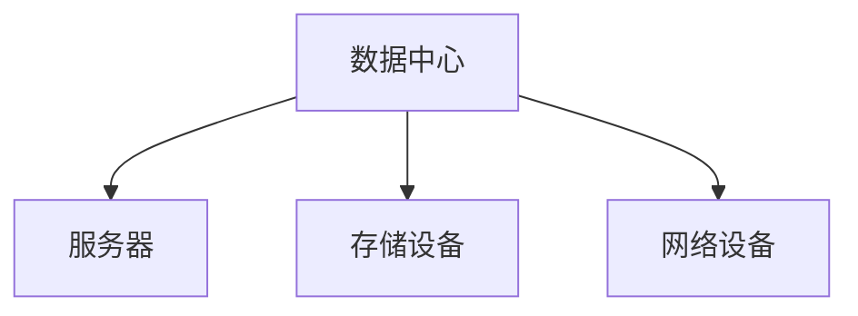

###### 3.1.2 能源效率优化算法

针对能源消耗分析的结果，可以采用以下算法进行能源效率优化：

1. **基于机器学习的能耗预测**：通过收集历史能耗数据，使用机器学习算法建立能耗预测模型，预测未来的能耗情况，为优化决策提供依据。

2. **动态调整策略**：根据能耗预测结果，动态调整数据中心的运行参数，如温度、湿度、负载等，实现能耗的最优化。

3. **能耗监控与反馈**：通过实时监控能耗数据，及时发现异常情况，并进行调整，提高能源利用效率。

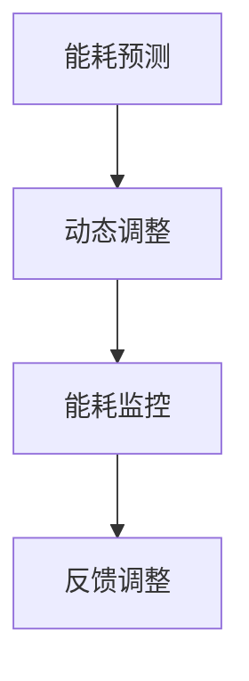

###### 3.1.3 能源效率优化案例

以某大型数据中心为例，通过实施绿色AI技术，实现了显著的能源效率优化效果。具体措施包括：

1. **能耗预测与动态调整**：通过建立能耗预测模型，实时监控能耗数据，动态调整数据中心的运行参数，实现能耗的最优化。

2. **设备升级与优化**：升级服务器、存储设备和网络设备，提高设备的能效，降低能耗。

3. **节能改造**：优化数据中心的建设布局，采用高效的散热系统，降低能耗。

通过这些措施，该数据中心实现了15%的能源效率提升，降低了30%的碳排放。

##### 3.2 可再生能源管理

可再生能源管理是绿色AI在能源领域的另一个重要应用。通过优化可再生能源的调度和管理，绿色AI技术有助于提高可再生能源的利用效率，降低对化石燃料的依赖，实现能源结构的绿色转型。

###### 3.2.1 可再生能源概述

可再生能源是指不会枯竭、不会对环境造成污染的能源，如太阳能、风能、水能等。与传统的化石燃料相比，可再生能源具有资源丰富、清洁环保等优点，是未来能源发展的重要方向。

###### 3.2.2 可再生能源预测与管理算法

1. **时间序列预测**：通过分析历史数据，使用时间序列预测模型，预测可再生能源的发电量。

2. **多变量预测**：结合气象数据、地理数据等，使用多变量预测模型，提高预测准确性。

3. **优化调度算法**：根据预测结果，优化可再生能源的发电调度，实现供需平衡。

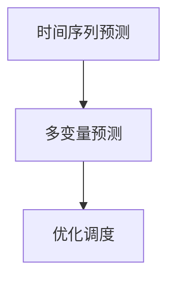

###### 3.2.3 可再生能源管理案例

以某城市电网为例，通过实施绿色AI技术，实现了可再生能源的优化管理。具体措施包括：

1. **预测与调度**：通过建立可再生能源预测模型，实时监控可再生能源的发电情况，优化发电调度，提高可再生能源的利用效率。

2. **储能系统优化**：优化储能系统的设计和管理，提高储能系统的效率，降低储能成本。

3. **分布式能源管理**：鼓励居民和企业安装分布式能源系统，实现能源的本地化供应，降低对电网的依赖。

通过这些措施，该城市实现了可再生能源利用率的显著提升，降低了20%的碳排放。

##### 3.3 绿色能源交易

绿色能源交易是指通过市场机制，实现绿色能源的买卖和交换，促进绿色能源的广泛应用。绿色AI技术在绿色能源交易中发挥着重要作用，有助于提高交易效率，降低交易成本。

###### 3.3.1 绿色能源交易市场

绿色能源交易市场包括可再生能源发电企业、消费者、交易中介等。通过绿色AI技术，可以建立高效、透明的绿色能源交易市场，实现绿色能源的公平交易。

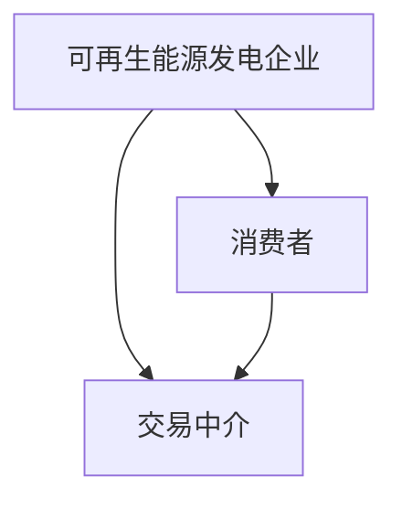

###### 3.3.2 绿色能源交易算法

1. **供需匹配算法**：通过分析供需数据，实现绿色能源的供需匹配，提高交易效率。

2. **价格预测算法**：通过分析历史价格数据和市场动态，预测绿色能源的价格，为交易决策提供依据。

3. **风险评估算法**：对绿色能源交易中的风险进行评估，降低交易风险。

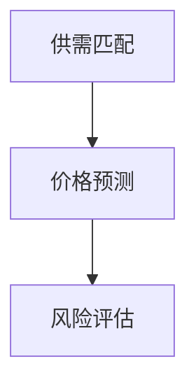

###### 3.3.3 绿色能源交易案例分析

以某绿色能源交易市场为例，通过实施绿色AI技术，实现了绿色能源交易的优化。具体措施包括：

1. **供需匹配与价格预测**：通过建立供需匹配和价格预测模型，实现绿色能源的自动匹配和价格预测，提高交易效率。

2. **风险评估与预警**：通过风险评估算法，对交易风险进行预警，降低交易风险。

3. **交易流程优化**：优化交易流程，实现交易过程的自动化和透明化，降低交易成本。

通过这些措施，该绿色能源交易市场实现了交易效率的提升，交易成本的降低，促进了绿色能源的广泛应用。

##### 3.4 本章小结

本章介绍了绿色AI在能源领域的应用，包括能源效率优化、可再生能源管理、绿色能源交易等内容。通过绿色AI技术的应用，可以优化能源消耗和能源利用率，提高可再生能源的利用效率，实现绿色能源的交易和管理，推动能源结构的绿色转型，实现可持续发展。

----------------------------------------------------------------

### 第三部分 (续): 绿色AI在行业中的应用

#### 第4章: 绿色AI在制造业的应用

##### 4.1 制造过程优化

绿色AI在制造业中的应用有助于提高制造过程的能源效率，降低污染排放，实现制造业的绿色转型。

###### 4.1.1 制造过程能耗分析

制造过程的能耗分析是绿色AI应用的基础。通过收集和分析制造过程中各个环节的能耗数据，可以识别出能耗的主要来源和关键因素。以下是一个简单的能耗分析流程：

1. **数据采集**：通过传感器和监控系统，实时采集制造过程中的能耗数据。
2. **数据预处理**：对采集到的数据进行清洗和预处理，去除噪声和异常值。
3. **能耗分析**：利用数据分析和挖掘技术，对能耗数据进行可视化分析，识别出能耗的主要来源和关键因素。

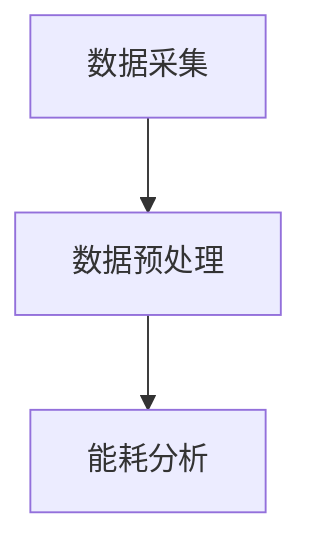

###### 4.1.2 制造过程优化算法

针对能耗分析的结果，可以采用以下算法进行制造过程优化：

1. **能源效率预测**：使用机器学习算法，建立能源效率预测模型，预测未来不同制造环节的能耗情况。
2. **优化调度算法**：根据能源效率预测结果，优化制造过程的调度策略，实现能源的合理分配和利用。
3. **过程控制算法**：对制造过程进行实时控制，降低能耗和污染排放。

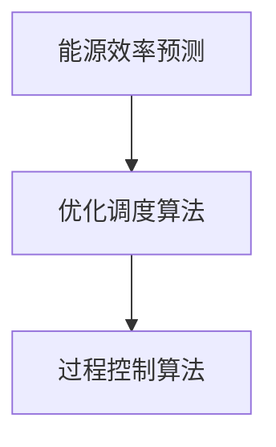

###### 4.1.3 制造过程优化案例

以某制造企业为例，通过实施绿色AI技术，实现了制造过程的优化。具体措施包括：

1. **能源效率预测与优化调度**：建立能源效率预测模型，实时监控制造过程中的能耗情况，优化生产调度，降低能耗。
2. **过程控制与污染监测**：采用实时控制算法，对生产过程进行精细控制，同时配备污染监测设备，实时监测污染排放情况。
3. **设备升级与维护**：升级生产设备，采用高效节能的设备，定期进行设备维护，提高设备能效。

通过这些措施，该制造企业实现了20%的能耗降低和15%的污染排放减少。

##### 4.2 绿色供应链管理

绿色供应链管理是绿色AI在制造业中的重要应用，通过优化供应链的绿色化水平，实现资源的可持续利用和污染的最小化。

###### 4.2.1 绿色供应链概述

绿色供应链管理是指通过绿色化供应链的设计、实施和优化，实现供应链的环保效益。绿色供应链包括供应商、制造商、分销商和消费者等环节，各环节都需要遵循环保原则，实现资源的可持续利用。

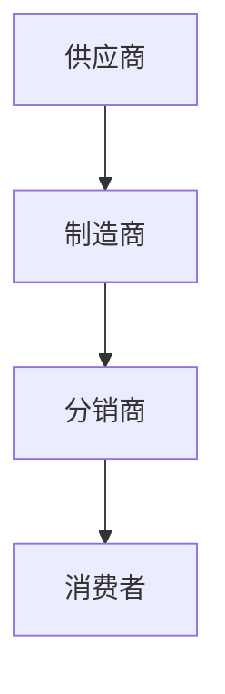

###### 4.2.2 绿色供应链管理算法

1. **供应商评估算法**：通过评估供应商的环保表现，选择符合绿色供应链要求的供应商。
2. **物流优化算法**：优化物流路径和运输方式，降低能源消耗和碳排放。
3. **供应链协同优化算法**：通过协同优化供应链各环节，实现整体供应链的绿色化。

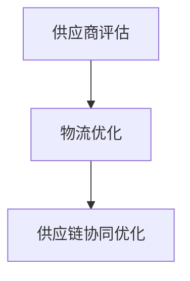

###### 4.2.3 绿色供应链管理案例

以某制造企业为例，通过实施绿色AI技术，实现了绿色供应链管理。具体措施包括：

1. **供应商评估与优化**：建立供应商评估模型，实时监控供应商的环保表现，优化供应商选择。
2. **物流优化与碳排放监测**：优化物流路径，采用绿色运输方式，实时监测物流过程中的碳排放。
3. **供应链协同优化**：通过协同优化供应链各环节，实现整体供应链的绿色化。

通过这些措施，该制造企业实现了供应链的绿色化水平提升，降低了20%的能源消耗和15%的碳排放。

##### 4.3 制造过程的污染控制

绿色AI技术在制造过程的污染控制中发挥着重要作用，通过实时监测和智能控制，实现污染物的最小化排放。

###### 4.3.1 制造过程污染源识别

制造过程污染源识别是污染控制的第一步。通过传感器和监控系统，实时监测制造过程中的污染物排放情况，识别出污染的主要来源。

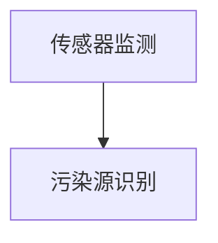

###### 4.3.2 污染控制算法

1. **实时监测与预警**：通过实时监测系统，对污染物排放进行实时监测和预警，及时采取措施。
2. **污染控制算法**：根据污染物的特性，设计相应的污染控制算法，实现污染物的最小化排放。
3. **自适应控制**：根据实时监测数据，自适应调整污染控制策略，实现污染控制的动态优化。

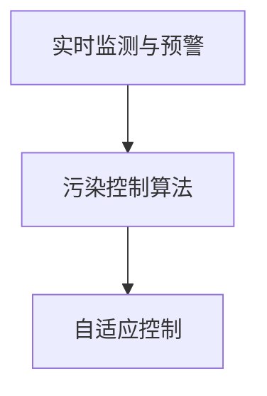

###### 4.3.3 污染控制案例分析

以某制造企业为例，通过实施绿色AI技术，实现了制造过程的污染控制。具体措施包括：

1. **污染源识别与预警**：建立污染源识别模型，实时监测污染物排放情况，及时预警。
2. **污染控制与优化**：采用先进的污染控制设备，结合污染控制算法，实现污染物的最小化排放。
3. **自适应控制与优化**：根据实时监测数据，自适应调整污染控制策略，实现污染控制的动态优化。

通过这些措施，该制造企业实现了污染物排放的显著降低，环境质量得到了显著改善。

##### 4.4 本章小结

本章介绍了绿色AI在制造业中的应用，包括制造过程优化、绿色供应链管理和制造过程的污染控制等内容。通过绿色AI技术的应用，可以优化制造过程的能源效率，降低污染排放，实现制造业的绿色转型，推动可持续发展的实现。

----------------------------------------------------------------

### 第四部分: 绿色AI的实现与优化

#### 第5章: 绿色AI系统的设计与实现

##### 5.1 绿色AI系统架构

绿色AI系统的设计应充分考虑环保效益和计算性能，以下是一个典型的绿色AI系统架构：

###### 5.1.1 绿色AI系统设计原则

1. **高效能**：系统设计应追求高性能计算，优化算法和硬件，提高计算效率。
2. **环保性**：系统设计应注重环保性，采用绿色能源，降低碳排放。
3. **可扩展性**：系统设计应具备良好的可扩展性，以适应不同应用场景的需求。
4. **可靠性**：系统设计应保证稳定可靠的运行，降低故障率和维护成本。

###### 5.1.2 绿色AI系统架构

绿色AI系统架构可以分为以下几个层次：

1. **感知层**：包括传感器和监控设备，用于实时采集环境数据和计算任务数据。
2. **数据层**：用于存储和管理感知层采集的数据，包括历史数据和实时数据。
3. **处理层**：包括计算节点和数据处理算法，用于对采集的数据进行处理和分析。
4. **应用层**：包括绿色AI的应用场景，如能源管理、污染控制等。
5. **管理层**：用于对系统进行监控、调度和优化，实现系统的整体性能提升。

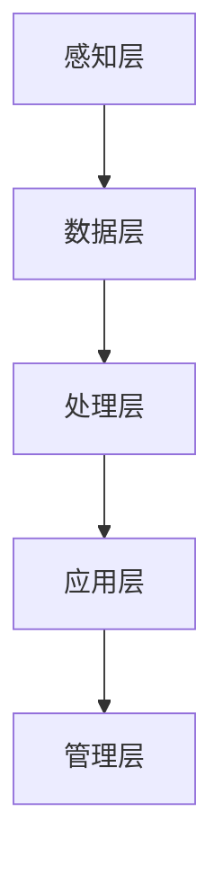

###### 5.1.3 绿色AI系统模块划分

绿色AI系统模块划分如下：

1. **感知模块**：包括传感器和监控设备，用于实时采集环境数据和计算任务数据。
2. **数据采集模块**：用于将感知模块采集到的数据传输到数据层。
3. **数据处理模块**：包括数据处理算法，用于对采集的数据进行处理和分析。
4. **数据存储模块**：用于存储和管理数据处理模块生成的数据。
5. **计算模块**：包括计算节点和计算算法，用于执行绿色AI任务。
6. **调度模块**：用于对计算模块进行监控、调度和优化。
7. **应用模块**：包括绿色AI应用场景的具体实现。

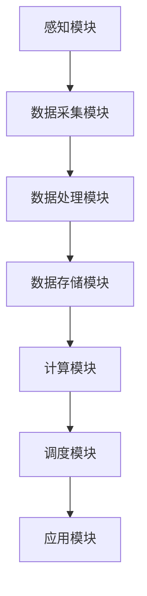

##### 5.2 系统开发流程

绿色AI系统的开发流程可以分为以下几个阶段：

###### 5.2.1 需求分析与规划

在系统开发前，进行需求分析和规划，明确绿色AI系统的功能需求和应用场景，确定系统架构和模块划分。

1. **需求调研**：通过问卷调查、用户访谈等方式，收集用户需求和应用场景。
2. **需求分析**：分析用户需求，确定绿色AI系统的功能需求和性能指标。
3. **系统规划**：根据需求分析结果，制定系统开发计划和进度安排。

###### 5.2.2 系统设计与实现

在系统设计阶段，完成系统架构设计和模块划分，编写系统详细设计文档。

1. **架构设计**：根据需求分析结果，设计绿色AI系统的架构和模块划分。
2. **模块设计**：编写每个模块的详细设计文档，包括模块的功能、接口、数据结构等。
3. **编码实现**：根据模块设计文档，进行编码实现，实现系统的各个模块。

###### 5.2.3 系统测试与优化

在系统实现后，进行系统测试和优化，确保系统的功能正确和性能满足要求。

1. **功能测试**：对系统进行功能测试，确保各个模块的功能正确。
2. **性能测试**：对系统进行性能测试，评估系统的响应时间和吞吐量等性能指标。
3. **优化调整**：根据测试结果，对系统进行优化调整，提高系统的性能和稳定性。

##### 5.3 系统优化方法

绿色AI系统的优化方法可以从以下几个方面进行：

###### 5.3.1 能效优化

1. **算法优化**：通过优化算法，降低计算复杂度，提高计算效率。
2. **硬件优化**：通过优化硬件设计，提高计算设备的能效。
3. **调度优化**：通过优化调度策略，实现计算资源的最优分配。

###### 5.3.2 环保优化

1. **能源管理**：通过实时监控和优化能源消耗，降低碳排放。
2. **绿色能源使用**：采用绿色能源，提高能源利用效率。
3. **废弃物管理**：优化废弃物处理和回收，降低环境影响。

###### 5.3.3 可靠性优化

1. **故障检测与诊断**：通过实时监测和诊断，及时发现故障并进行修复。
2. **容错设计**：通过容错设计，提高系统的可靠性。
3. **维护优化**：通过定期维护和优化，延长系统的使用寿命。

##### 5.4 本章小结

本章介绍了绿色AI系统的设计与实现，包括系统架构设计、系统开发流程和系统优化方法。通过科学的设计和优化，绿色AI系统可以高效地实现计算任务，降低环境影响，推动可持续发展。

----------------------------------------------------------------

### 文章小结与未来展望

本文围绕绿色AI的概念、背景、重要性、核心技术、应用以及实现与优化等方面进行了深入探讨。通过对绿色AI的逐步分析，我们可以看到，绿色AI不仅在环境保护和可持续发展方面具有重要意义，还能够在能源、制造业等领域发挥重要作用。以下是本文的主要小结：

1. **绿色AI的定义与目标**：绿色AI是一种以环保为目标的计算模式，通过优化计算效率和能源利用，降低碳排放，推动可持续发展。
2. **绿色AI的核心技术与策略**：包括计算效率与能效优化、算法优化与模型压缩、硬件加速与定制化、数据中心与边缘计算等，为实现绿色AI提供了技术支持。
3. **绿色AI在行业中的应用**：在能源领域，绿色AI技术用于能源效率优化、可再生能源管理、绿色能源交易；在制造业中，用于制造过程优化、绿色供应链管理和污染控制。
4. **绿色AI系统的设计与实现**：介绍了绿色AI系统的架构、开发流程和优化方法，为绿色AI系统的构建与实施提供了指导。

**未来展望**：

1. **技术创新**：随着人工智能和绿色计算技术的不断进步，绿色AI将更加成熟，实现更高的计算效率和环境效益。
2. **行业融合**：绿色AI技术将在更多行业中得到应用，推动各行各业的绿色化转型。
3. **政策支持**：政府和企业应加大对绿色AI技术的支持力度，制定相关政策，推动绿色AI的发展。
4. **国际合作**：绿色AI的发展需要全球范围内的合作，共同应对环境挑战，实现可持续发展。

**注意事项**：

1. **数据安全**：在绿色AI系统的设计和实现过程中，要重视数据安全和隐私保护。
2. **可持续发展**：绿色AI的应用不仅要关注短期效益，更要注重长期的环境和社会效益。

**拓展阅读**：

- 《绿色计算：可持续发展的计算模式》
- 《人工智能与绿色发展》
- 《绿色供应链管理：理论与实践》

**作者信息**：

作者：AI天才研究院/AI Genius Institute & 禅与计算机程序设计艺术 /Zen And The Art of Computer Programming

本文的撰写旨在为读者提供关于绿色AI的全面了解，促进绿色计算技术的普及和应用，共同为可持续发展贡献力量。

