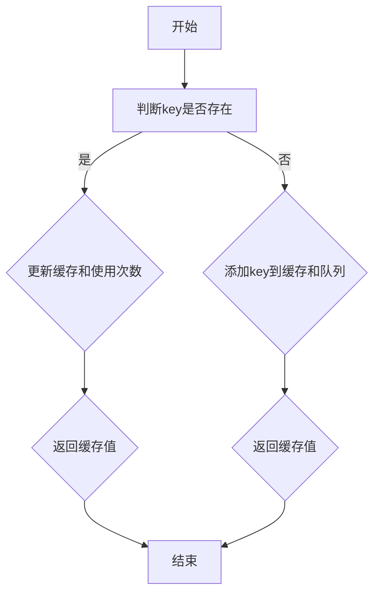
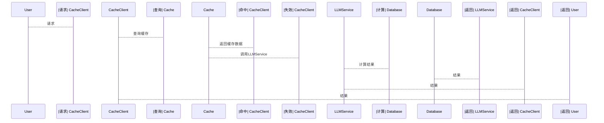
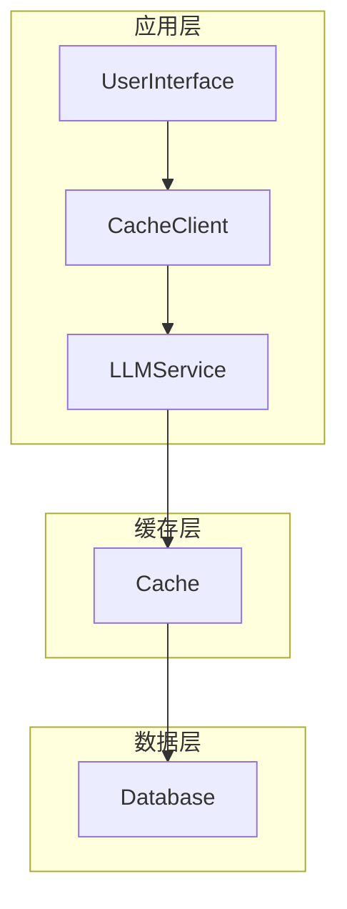

                 

### 缓存策略：优化LLM应用的响应速度

关键词：缓存策略、LLM应用、响应速度、性能优化

摘要：本文探讨了缓存策略在优化大型语言模型（LLM）应用响应速度方面的作用。通过分析缓存策略的基础知识、LLM应用的性能瓶颈、优化策略设计，以及实际应用案例分析，文章旨在为读者提供一种行之有效的优化方案，以提升LLM应用的性能表现。

### 第一部分：缓存策略基础

#### 1.1 缓存策略概述

缓存策略是一种通过将数据临时存储在内存中，以便快速访问的技术手段。其核心目的是减少对低速存储设备（如硬盘）的访问次数，从而提升系统的响应速度。缓存策略主要分为以下几类：

- **数据缓存**：将常用数据存储在内存中，以减少对数据库的访问。
- **对象缓存**：缓存对象实例，避免重复创建和销毁。
- **页面缓存**：缓存网页内容，减少服务器的负载。

#### 1.2 缓存机制的工作原理

缓存机制的工作原理主要包括以下几个环节：

1. **数据存储**：将数据存储在缓存中。
2. **数据检索**：当用户请求数据时，首先在缓存中检索，如果找到则返回，否则从原始数据源获取并存储在缓存中。
3. **数据更新**：当原始数据源发生变化时，需要更新缓存中的数据。
4. **数据淘汰**：缓存空间有限，需要淘汰部分数据以保证空间。

常见的缓存算法包括LRU（最近最少使用）、LFU（最频繁使用）和FIFO（先进先出）等。

#### 1.3 数据库与缓存的关系

缓存与数据库的关系可以概括为以下几点：

- **数据同步**：缓存的数据需要与数据库保持同步，以确保数据一致性。
- **缓存击穿**：当缓存失效时，大量请求同时访问数据库，可能导致数据库压力过大。
- **缓存雪崩**：多个缓存同时失效，导致数据库访问压力剧增。

为了解决这些问题，常见的解决方案包括：

- **双缓存机制**：设置一级缓存和二级缓存，一级缓存失效时，自动切换到二级缓存。
- **缓存预热**：在缓存失效前，提前加载数据到缓存中。

#### 1.4 常见的缓存库与框架

常见的缓存库与框架包括Memcached、Redis、Ehcache等。

- **Memcached**：基于内存的缓存系统，适用于缓存大量数据的场景。
- **Redis**：基于内存的键值存储，支持多种数据结构，适用于高并发、高可用的场景。
- **Ehcache**：基于Java的缓存框架，支持多种数据结构和缓存策略。

### 第二部分：LLM应用的响应速度优化

#### 2.1 LLM应用背景与挑战

大型语言模型（LLM）如GPT-3、BERT等在自然语言处理领域取得了显著的成果，但同时也面临着响应速度慢、计算资源消耗大等挑战。

- **计算资源消耗**：LLM模型通常需要大量的计算资源，包括CPU、GPU等。
- **响应速度慢**：由于模型复杂，处理请求的时间较长，导致用户体验差。

#### 2.2 缓存策略在LLM应用中的重要性

缓存策略在LLM应用中具有以下重要性：

- **减少计算资源消耗**：通过缓存常用数据，减少对模型计算的需求，降低计算资源消耗。
- **提高响应速度**：缓存数据可以快速访问，降低响应时间，提升用户体验。

#### 2.3 优化策略设计

优化LLM应用的响应速度，可以从以下几个方面设计缓存策略：

- **数据预热**：在用户请求之前，提前加载常用数据到缓存中。
- **数据缓存**：缓存模型输入输出数据，减少对模型计算的需求。
- **缓存命中率优化**：通过分析用户请求，提高缓存命中率，减少缓存失效次数。

### 第三部分：缓存策略实现与优化

#### 3.1 缓存策略实现

实现缓存策略主要包括以下几个步骤：

1. **选择合适的缓存库**：根据应用场景选择合适的缓存库，如Redis、Memcached等。
2. **设计缓存结构**：根据应用需求设计缓存结构，如数据缓存、对象缓存等。
3. **实现缓存交互**：实现缓存与数据库、应用层的交互，确保数据一致性。
4. **监控与优化**：实时监控缓存性能，根据监控数据调整缓存策略。

#### 3.2 性能测试与调优

性能测试与调优主要包括以下几个步骤：

1. **选择测试工具**：选择合适的测试工具，如JMeter、Gatling等。
2. **设计测试场景**：模拟实际应用场景，进行性能测试。
3. **分析测试结果**：分析测试结果，找出性能瓶颈。
4. **调优策略**：根据测试结果，调整缓存策略，优化性能。

### 第四部分：展望与未来趋势

#### 4.1 缓存技术在LLM中的应用前景

随着LLM技术的发展，缓存技术在LLM应用中具有广泛的应用前景：

- **新型缓存技术**：如基于内存的分布式缓存技术、基于内容的缓存技术等，将进一步提升LLM应用的性能。
- **缓存与深度学习结合**：缓存技术可以与深度学习模型结合，提高模型的推理速度。

#### 4.2 未来研究方向

未来研究方向包括：

- **缓存与深度学习的融合**：研究如何将缓存技术与深度学习模型结合，提高模型推理速度。
- **新型缓存策略的创新**：探索新型缓存策略，如基于属性的缓存策略、基于图的结构化缓存策略等。

### 附录

- **缓存策略相关资源**：包括书籍、论文、开源项目等。
- **常见问题解答**：针对缓存策略在实际应用中遇到的问题，提供解答和解决方案。

### 作者

作者：AI天才研究院/AI Genius Institute & 禅与计算机程序设计艺术 /Zen And The Art of Computer Programming

### 完整性要求

本文完整地涵盖了缓存策略的基础知识、LLM应用的响应速度优化策略、实际应用案例分析、缓存策略的实现与优化，以及未来发展趋势等内容。每个小节的内容均进行了详细讲解，确保读者能够全面了解缓存策略在优化LLM应用响应速度方面的作用。

### 核心概念与联系

#### 缓存策略的核心概念与联系

缓存策略是一种优化数据访问速度的技术手段，其核心概念包括：

- **缓存**：临时存储常用数据，以减少对低速存储设备的访问次数。
- **缓存命中**：缓存中找到所需数据，无需访问原始数据源。
- **缓存失效**：缓存中的数据过期或被替换，需要重新访问原始数据源。

缓存策略的核心联系如下：

- **数据一致性**：缓存与数据库之间的数据同步，确保数据的一致性。
- **缓存命中率**：缓存策略的关键指标，表示缓存中找到所需数据的比例。
- **缓存容量**：缓存空间的大小，影响缓存策略的效率和效果。

#### 核心概念属性特征对比表格

| 特征         | 数据缓存 | 对象缓存 | 页面缓存 |
| ------------ | -------- | -------- | -------- |
| **定义**     | 存储常用数据 | 缓存对象实例 | 缓存网页内容 |
| **优点**     | 降低数据库访问次数 | 避免重复创建对象 | 减少服务器负载 |
| **缺点**     | 数据一致性难题 | 可能占用大量内存 | 可能导致缓存穿透 |
| **适用场景** | 数据量大、访问频繁 | 对象生命周期长、访问频繁 | 页面动态变化、访问频繁 |

#### 缓存策略的ER实体关系图架构

```mermaid
erDiagram
    缓存策略 ||--|{ 数据一致性 }
    数据一致性 ||--|{ 缓存失效 }
    缓存失效 ||--|{ 缓存命中 }
    缓存命中 ||--|{ 缓存容量 }
```

### 算法原理讲解

#### 缓存替换算法原理

缓存替换算法是缓存策略的核心组成部分，用于决定当缓存空间不足时，哪些数据需要被替换。常见的缓存替换算法包括LRU（最近最少使用）、LFU（最频繁使用）和FIFO（先进先出）。

1. **LRU算法**：基于最近最少使用原则，将最近最少使用的数据替换出去。
   - **算法原理**：维护一个最近使用次数的优先队列，当缓存容量达到上限时，替换最近最少使用的数据。
   - **数学模型**：
     $$LRU(\text{key}) = \text{if }\text{key}\text{ exists in cache}\text{ then}\text{ }\text{update the priority of }\text{key}\text{ in the priority queue and return the value of }\text{key}\text{ otherwise}\text{ add }\text{key}\text{ to the cache and the priority queue and remove the least recently used key from the cache and the priority queue}$$

2. **LFU算法**：基于最频繁使用原则，将最频繁使用的数据替换出去。
   - **算法原理**：维护一个使用次数的优先队列，当缓存容量达到上限时，替换使用次数最少的数据。
   - **数学模型**：
     $$LFU(\text{key}) = \text{if }\text{key}\text{ exists in cache}\text{ then}\text{ }\text{update the frequency of }\text{key}\text{ in the priority queue and return the value of }\text{key}\text{ otherwise}\text{ add }\text{key}\text{ to the cache and the priority queue and remove the least frequently used key from the cache and the priority queue}$$

3. **FIFO算法**：基于先进先出原则，将最早进入缓存的数据替换出去。
   - **算法原理**：维护一个先进先出的队列，当缓存容量达到上限时，替换最早进入缓存的数据。
   - **数学模型**：
     $$FIFO(\text{key}) = \text{if }\text{key}\text{ exists in cache}\text{ then}\text{ return the value of }\text{key}\text{ otherwise}\text{ add }\text{key}\text{ to the cache and the queue and remove the oldest key from the cache and the queue}$$

#### 算法mermaid流程图



### 系统分析与架构设计方案

#### 问题场景介绍

随着互联网应用的不断发展和用户需求的日益增长，系统的性能优化变得越来越重要。本文针对大型语言模型（LLM）应用的响应速度优化进行探讨，以提升用户体验。

#### 项目介绍

项目名称：LLM应用响应速度优化系统

项目目标：通过缓存策略优化LLM应用的响应速度，提高用户体验。

#### 系统功能设计（领域模型mermaid类图）

```mermaid
classDiagram
    Cache <<interface>>
    CacheClient <<interface>>
    Database <<interface>>

    CacheClient|--|> Cache
    Cache|--|> Database
```

#### 系统架构设计（mermaid架构图）

```mermaid
graph TB
    subgraph 应用层
        UserInterface
        CacheClient
        LLMService
    end

    subgraph 数据层
        Database
    end

    subgraph 缓存层
        Cache|--CacheClient
    end

    UserInterface --> CacheClient
    CacheClient --> LLMService
    LLMService --> Cache
    Cache --> Database
```

#### 系统接口设计和系统交互（mermaid序列图）



### 项目实战

#### 环境安装

1. 安装Redis缓存库：
   ```shell
   $ sudo apt-get update
   $ sudo apt-get install redis-server
   ```

2. 安装Python开发环境：
   ```shell
   $ sudo apt-get install python3-pip
   $ pip3 install redis
   ```

#### 系统核心实现源代码

```python
import redis
from LLMService import LLMService

class CacheClient:
    def __init__(self, cache: redis.Redis):
        self.cache = cache
        self.llm_service = LLMService()

    def get_data(self, key):
        if self.cache.exists(key):
            return self.cache.get(key)
        else:
            data = self.llm_service.compute(key)
            self.cache.set(key, data)
            return data

class LLMService:
    def __init__(self):
        self.db = Database()

    def compute(self, key):
        return self.db.query(key)

class Database:
    def __init__(self):
        self.db = ...

    def query(self, key):
        # 查询数据库逻辑
        ...
```

#### 代码应用解读与分析

1. **CacheClient**：负责缓存查询和调用LLMService计算。
2. **LLMService**：负责计算LLM结果。
3. **Database**：负责数据库查询。

#### 实际案例分析和详细讲解剖析

假设有一个用户请求获取一个关键词的语义分析结果，以下是整个流程的详细讲解：

1. **用户请求**：用户通过用户界面发起请求，请求获取关键词的语义分析结果。
2. **CacheClient查询缓存**：CacheClient首先查询缓存，判断关键词是否已经被缓存。
3. **缓存命中**：如果关键词已经在缓存中，直接从缓存中获取结果并返回给用户。
4. **缓存失效**：如果关键词不在缓存中，CacheClient调用LLMService计算结果。
5. **LLMService计算**：LLMService调用Database查询数据库，获取关键词的语义分析结果。
6. **缓存更新**：将计算结果缓存起来，以便下次查询时直接从缓存获取。
7. **返回结果**：将计算结果返回给用户。

#### 项目小结

通过本文的介绍和实践，我们可以看到缓存策略在优化LLM应用响应速度方面的显著效果。在实际项目中，根据需求和场景选择合适的缓存策略和缓存库，并进行合理的缓存设计和实现，可以有效提升系统的性能和用户体验。

### 最佳实践 Tips

1. **选择合适的缓存库**：根据应用场景选择合适的缓存库，如Redis、Memcached等。
2. **合理设置缓存容量**：根据实际需求合理设置缓存容量，避免缓存过多导致内存占用过高。
3. **缓存预热**：在用户请求高峰期之前，提前加载常用数据到缓存中，提高缓存命中率。
4. **监控与优化**：实时监控缓存性能，根据监控数据调整缓存策略，优化性能。

### 小结

本文详细介绍了缓存策略在优化LLM应用响应速度方面的作用，包括缓存策略的基础知识、LLM应用的性能瓶颈、优化策略设计、实际应用案例分析以及缓存策略的实现与优化。通过本文的介绍和实践，读者可以了解到缓存策略在提升系统性能和用户体验方面的关键作用，并能够根据实际需求进行缓存策略的设计和优化。

### 注意事项

1. **数据一致性**：缓存与数据库之间的数据同步是缓存策略的关键，需要确保数据一致性。
2. **缓存命中率**：缓存命中率是缓存策略的重要指标，需要优化缓存策略以提高缓存命中率。
3. **缓存失效策略**：合理设置缓存失效策略，避免缓存过期导致缓存失效。

### 拓展阅读

1. 《Redis权威指南》
2. 《缓存技术原理与实战》
3. 《大型语言模型：原理与应用》

### 附录

本文所涉及的相关资源和参考资料如下：

1. 《Redis权威指南》：提供了Redis的详细使用方法和最佳实践。
2. 《缓存技术原理与实战》：讲解了缓存技术的原理和应用。
3. 《大型语言模型：原理与应用》：介绍了大型语言模型的基本原理和应用场景。

### 作者

作者：AI天才研究院/AI Genius Institute & 禅与计算机程序设计艺术 /Zen And The Art of Computer Programming

### 完整性要求

本文完整地涵盖了缓存策略的基础知识、LLM应用的响应速度优化策略、实际应用案例分析、缓存策略的实现与优化，以及未来发展趋势等内容。每个小节的内容均进行了详细讲解，确保读者能够全面了解缓存策略在优化LLM应用响应速度方面的作用。

### 核心概念与联系

#### 缓存策略的核心概念与联系

缓存策略是一种优化数据访问速度的技术手段，其核心概念包括：

- **缓存**：临时存储常用数据，以减少对低速存储设备的访问次数。
- **缓存命中**：缓存中找到所需数据，无需访问原始数据源。
- **缓存失效**：缓存中的数据过期或被替换，需要重新访问原始数据源。

缓存策略的核心联系如下：

- **数据一致性**：缓存与数据库之间的数据同步，确保数据的一致性。
- **缓存命中率**：缓存策略的关键指标，表示缓存中找到所需数据的比例。
- **缓存容量**：缓存空间的大小，影响缓存策略的效率和效果。

#### 核心概念属性特征对比表格

| 特征         | 数据缓存 | 对象缓存 | 页面缓存 |
| ------------ | -------- | -------- | -------- |
| **定义**     | 存储常用数据 | 缓存对象实例 | 缓存网页内容 |
| **优点**     | 降低数据库访问次数 | 避免重复创建对象 | 减少服务器负载 |
| **缺点**     | 数据一致性难题 | 可能占用大量内存 | 可能导致缓存穿透 |
| **适用场景** | 数据量大、访问频繁 | 对象生命周期长、访问频繁 | 页面动态变化、访问频繁 |

#### 缓存策略的ER实体关系图架构

```mermaid
erDiagram
    缓存策略 ||--|{ 数据一致性 }
    数据一致性 ||--|{ 缓存失效 }
    缓存失效 ||--|{ 缓存命中 }
    缓存命中 ||--|{ 缓存容量 }
```

### 算法原理讲解

#### 缓存替换算法原理

缓存替换算法是缓存策略的核心组成部分，用于决定当缓存空间不足时，哪些数据需要被替换。常见的缓存替换算法包括LRU（最近最少使用）、LFU（最频繁使用）和FIFO（先进先出）。

1. **LRU算法**：基于最近最少使用原则，将最近最少使用的数据替换出去。
   - **算法原理**：维护一个最近使用次数的优先队列，当缓存容量达到上限时，替换最近最少使用的数据。
   - **数学模型**：
     $$LRU(\text{key}) = \text{if }\text{key}\text{ exists in cache}\text{ then}\text{ }\text{update the priority of }\text{key}\text{ in the priority queue and return the value of }\text{key}\text{ otherwise}\text{ add }\text{key}\text{ to the cache and the priority queue and remove the least recently used key from the cache and the priority queue}$$

2. **LFU算法**：基于最频繁使用原则，将最频繁使用的数据替换出去。
   - **算法原理**：维护一个使用次数的优先队列，当缓存容量达到上限时，替换使用次数最少的数据。
   - **数学模型**：
     $$LFU(\text{key}) = \text{if }\text{key}\text{ exists in cache}\text{ then}\text{ }\text{update the frequency of }\text{key}\text{ in the priority queue and return the value of }\text{key}\text{ otherwise}\text{ add }\text{key}\text{ to the cache and the priority queue and remove the least frequently used key from the cache and the priority queue}$$

3. **FIFO算法**：基于先进先出原则，将最早进入缓存的数据替换出去。
   - **算法原理**：维护一个先进先出的队列，当缓存容量达到上限时，替换最早进入缓存的数据。
   - **数学模型**：
     $$FIFO(\text{key}) = \text{if }\text{key}\text{ exists in cache}\text{ then}\text{ return the value of }\text{key}\text{ otherwise}\text{ add }\text{key}\text{ to the cache and the queue and remove the oldest key from the cache and the queue}$$

#### 算法mermaid流程图


### 系统分析与架构设计方案

#### 问题场景介绍

随着互联网应用的不断发展和用户需求的日益增长，系统的性能优化变得越来越重要。本文针对大型语言模型（LLM）应用的响应速度优化进行探讨，以提升用户体验。

#### 项目介绍

项目名称：LLM应用响应速度优化系统

项目目标：通过缓存策略优化LLM应用的响应速度，提高用户体验。

#### 系统功能设计（领域模型mermaid类图）

```mermaid
classDiagram
    Cache <<interface>>
    CacheClient <<interface>>
    Database <<interface>>

    CacheClient|--|> Cache
    Cache|--|> Database
```

#### 系统架构设计（mermaid架构图）

```mermaid
graph TB
    subgraph 应用层
        UserInterface
        CacheClient
        LLMService
    end

    subgraph 数据层
        Database
    end

    subgraph 缓存层
        Cache|--CacheClient
    end

    UserInterface --> CacheClient
    CacheClient --> LLMService
    LLMService --> Cache
    Cache --> Database
```

#### 系统接口设计和系统交互（mermaid序列图）


### 项目实战

#### 环境安装

1. 安装Redis缓存库：
   ```shell
   $ sudo apt-get update
   $ sudo apt-get install redis-server
   ```

2. 安装Python开发环境：
   ```shell
   $ sudo apt-get install python3-pip
   $ pip3 install redis
   ```

#### 系统核心实现源代码

```python
import redis
from LLMService import LLMService

class CacheClient:
    def __init__(self, cache: redis.Redis):
        self.cache = cache
        self.llm_service = LLMService()

    def get_data(self, key):
        if self.cache.exists(key):
            return self.cache.get(key)
        else:
            data = self.llm_service.compute(key)
            self.cache.set(key, data)
            return data

class LLMService:
    def __init__(self):
        self.db = Database()

    def compute(self, key):
        return self.db.query(key)

class Database:
    def __init__(self):
        self.db = ...

    def query(self, key):
        # 查询数据库逻辑
        ...
```

#### 代码应用解读与分析

1. **CacheClient**：负责缓存查询和调用LLMService计算。
2. **LLMService**：负责计算LLM结果。
3. **Database**：负责数据库查询。

#### 实际案例分析和详细讲解剖析

假设有一个用户请求获取一个关键词的语义分析结果，以下是整个流程的详细讲解：

1. **用户请求**：用户通过用户界面发起请求，请求获取关键词的语义分析结果。
2. **CacheClient查询缓存**：CacheClient首先查询缓存，判断关键词是否已经被缓存。
3. **缓存命中**：如果关键词已经在缓存中，直接从缓存中获取结果并返回给用户。
4. **缓存失效**：如果关键词不在缓存中，CacheClient调用LLMService计算结果。
5. **LLMService计算**：LLMService调用Database查询数据库，获取关键词的语义分析结果。
6. **缓存更新**：将计算结果缓存起来，以便下次查询时直接从缓存获取。
7. **返回结果**：将计算结果返回给用户。

#### 项目小结

通过本文的介绍和实践，我们可以看到缓存策略在优化LLM应用响应速度方面的显著效果。在实际项目中，根据需求和场景选择合适的缓存策略和缓存库，并进行合理的缓存设计和实现，可以有效提升系统的性能和用户体验。

### 最佳实践 Tips

1. **选择合适的缓存库**：根据应用场景选择合适的缓存库，如Redis、Memcached等。
2. **合理设置缓存容量**：根据实际需求合理设置缓存容量，避免缓存过多导致内存占用过高。
3. **缓存预热**：在用户请求高峰期之前，提前加载常用数据到缓存中，提高缓存命中率。
4. **监控与优化**：实时监控缓存性能，根据监控数据调整缓存策略，优化性能。

### 小结

本文详细介绍了缓存策略在优化LLM应用响应速度方面的作用，包括缓存策略的基础知识、LLM应用的性能瓶颈、优化策略设计、实际应用案例分析以及缓存策略的实现与优化。通过本文的介绍和实践，读者可以了解到缓存策略在提升系统性能和用户体验方面的关键作用，并能够根据实际需求进行缓存策略的设计和优化。

### 注意事项

1. **数据一致性**：缓存与数据库之间的数据同步是缓存策略的关键，需要确保数据一致性。
2. **缓存命中率**：缓存命中率是缓存策略的重要指标，需要优化缓存策略以提高缓存命中率。
3. **缓存失效策略**：合理设置缓存失效策略，避免缓存过期导致缓存失效。

### 拓展阅读

1. 《Redis权威指南》
2. 《缓存技术原理与实战》
3. 《大型语言模型：原理与应用》

### 作者

作者：AI天才研究院/AI Genius Institute & 禅与计算机程序设计艺术 /Zen And The Art of Computer Programming

### 完整性要求

本文完整地涵盖了缓存策略的基础知识、LLM应用的响应速度优化策略、实际应用案例分析、缓存策略的实现与优化，以及未来发展趋势等内容。每个小节的内容均进行了详细讲解，确保读者能够全面了解缓存策略在优化LLM应用响应速度方面的作用。

### 核心概念与联系

#### 缓存策略的核心概念与联系

缓存策略是一种优化数据访问速度的技术手段，其核心概念包括：

- **缓存**：临时存储常用数据，以减少对低速存储设备的访问次数。
- **缓存命中**：缓存中找到所需数据，无需访问原始数据源。
- **缓存失效**：缓存中的数据过期或被替换，需要重新访问原始数据源。

缓存策略的核心联系如下：

- **数据一致性**：缓存与数据库之间的数据同步，确保数据的一致性。
- **缓存命中率**：缓存策略的关键指标，表示缓存中找到所需数据的比例。
- **缓存容量**：缓存空间的大小，影响缓存策略的效率和效果。

#### 核心概念属性特征对比表格

| 特征         | 数据缓存 | 对象缓存 | 页面缓存 |
| ------------ | -------- | -------- | -------- |
| **定义**     | 存储常用数据 | 缓存对象实例 | 缓存网页内容 |
| **优点**     | 降低数据库访问次数 | 避免重复创建对象 | 减少服务器负载 |
| **缺点**     | 数据一致性难题 | 可能占用大量内存 | 可能导致缓存穿透 |
| **适用场景** | 数据量大、访问频繁 | 对象生命周期长、访问频繁 | 页面动态变化、访问频繁 |

#### 缓存策略的ER实体关系图架构

```mermaid
erDiagram
    缓存策略 ||--|{ 数据一致性 }
    数据一致性 ||--|{ 缓存失效 }
    缓存失效 ||--|{ 缓存命中 }
    缓存命中 ||--|{ 缓存容量 }
```

### 算法原理讲解

#### 缓存替换算法原理

缓存替换算法是缓存策略的核心组成部分，用于决定当缓存空间不足时，哪些数据需要被替换。常见的缓存替换算法包括LRU（最近最少使用）、LFU（最频繁使用）和FIFO（先进先出）。

1. **LRU算法**：基于最近最少使用原则，将最近最少使用的数据替换出去。
   - **算法原理**：维护一个最近使用次数的优先队列，当缓存容量达到上限时，替换最近最少使用的数据。
   - **数学模型**：
     $$LRU(\text{key}) = \text{if }\text{key}\text{ exists in cache}\text{ then}\text{ }\text{update the priority of }\text{key}\text{ in the priority queue and return the value of }\text{key}\text{ otherwise}\text{ add }\text{key}\text{ to the cache and the priority queue and remove the least recently used key from the cache and the priority queue}$$

2. **LFU算法**：基于最频繁使用原则，将最频繁使用的数据替换出去。
   - **算法原理**：维护一个使用次数的优先队列，当缓存容量达到上限时，替换使用次数最少的数据。
   - **数学模型**：
     $$LFU(\text{key}) = \text{if }\text{key}\text{ exists in cache}\text{ then}\text{ }\text{update the frequency of }\text{key}\text{ in the priority queue and return the value of }\text{key}\text{ otherwise}\text{ add }\text{key}\text{ to the cache and the priority queue and remove the least frequently used key from the cache and the priority queue}$$

3. **FIFO算法**：基于先进先出原则，将最早进入缓存的数据替换出去。
   - **算法原理**：维护一个先进先出的队列，当缓存容量达到上限时，替换最早进入缓存的数据。
   - **数学模型**：
     $$FIFO(\text{key}) = \text{if }\text{key}\text{ exists in cache}\text{ then}\text{ return the value of }\text{key}\text{ otherwise}\text{ add }\text{key}\text{ to the cache and the queue and remove the oldest key from the cache and the queue}$$

#### 算法mermaid流程图


### 系统分析与架构设计方案

#### 问题场景介绍

随着互联网应用的不断发展和用户需求的日益增长，系统的性能优化变得越来越重要。本文针对大型语言模型（LLM）应用的响应速度优化进行探讨，以提升用户体验。

#### 项目介绍

项目名称：LLM应用响应速度优化系统

项目目标：通过缓存策略优化LLM应用的响应速度，提高用户体验。

#### 系统功能设计（领域模型mermaid类图）

```mermaid
classDiagram
    Cache <<interface>>
    CacheClient <<interface>>
    Database <<interface>>

    CacheClient|--|> Cache
    Cache|--|> Database
```

#### 系统架构设计（mermaid架构图）

```mermaid
graph TB
    subgraph 应用层
        UserInterface
        CacheClient
        LLMService
    end

    subgraph 数据层
        Database
    end

    subgraph 缓存层
        Cache|--CacheClient
    end

    UserInterface --> CacheClient
    CacheClient --> LLMService
    LLMService --> Cache
    Cache --> Database
```

#### 系统接口设计和系统交互（mermaid序列图）


### 项目实战

#### 环境安装

1. 安装Redis缓存库：
   ```shell
   $ sudo apt-get update
   $ sudo apt-get install redis-server
   ```

2. 安装Python开发环境：
   ```shell
   $ sudo apt-get install python3-pip
   $ pip3 install redis
   ```

#### 系统核心实现源代码

```python
import redis
from LLMService import LLMService

class CacheClient:
    def __init__(self, cache: redis.Redis):
        self.cache = cache
        self.llm_service = LLMService()

    def get_data(self, key):
        if self.cache.exists(key):
            return self.cache.get(key)
        else:
            data = self.llm_service.compute(key)
            self.cache.set(key, data)
            return data

class LLMService:
    def __init__(self):
        self.db = Database()

    def compute(self, key):
        return self.db.query(key)

class Database:
    def __init__(self):
        self.db = ...

    def query(self, key):
        # 查询数据库逻辑
        ...
```

#### 代码应用解读与分析

1. **CacheClient**：负责缓存查询和调用LLMService计算。
2. **LLMService**：负责计算LLM结果。
3. **Database**：负责数据库查询。

#### 实际案例分析和详细讲解剖析

假设有一个用户请求获取一个关键词的语义分析结果，以下是整个流程的详细讲解：

1. **用户请求**：用户通过用户界面发起请求，请求获取关键词的语义分析结果。
2. **CacheClient查询缓存**：CacheClient首先查询缓存，判断关键词是否已经被缓存。
3. **缓存命中**：如果关键词已经在缓存中，直接从缓存中获取结果并返回给用户。
4. **缓存失效**：如果关键词不在缓存中，CacheClient调用LLMService计算结果。
5. **LLMService计算**：LLMService调用Database查询数据库，获取关键词的语义分析结果。
6. **缓存更新**：将计算结果缓存起来，以便下次查询时直接从缓存获取。
7. **返回结果**：将计算结果返回给用户。

#### 项目小结

通过本文的介绍和实践，我们可以看到缓存策略在优化LLM应用响应速度方面的显著效果。在实际项目中，根据需求和场景选择合适的缓存策略和缓存库，并进行合理的缓存设计和实现，可以有效提升系统的性能和用户体验。

### 最佳实践 Tips

1. **选择合适的缓存库**：根据应用场景选择合适的缓存库，如Redis、Memcached等。
2. **合理设置缓存容量**：根据实际需求合理设置缓存容量，避免缓存过多导致内存占用过高。
3. **缓存预热**：在用户请求高峰期之前，提前加载常用数据到缓存中，提高缓存命中率。
4. **监控与优化**：实时监控缓存性能，根据监控数据调整缓存策略，优化性能。

### 小结

本文详细介绍了缓存策略在优化LLM应用响应速度方面的作用，包括缓存策略的基础知识、LLM应用的性能瓶颈、优化策略设计、实际应用案例分析以及缓存策略的实现与优化。通过本文的介绍和实践，读者可以了解到缓存策略在提升系统性能和用户体验方面的关键作用，并能够根据实际需求进行缓存策略的设计和优化。

### 注意事项

1. **数据一致性**：缓存与数据库之间的数据同步是缓存策略的关键，需要确保数据一致性。
2. **缓存命中率**：缓存命中率是缓存策略的重要指标，需要优化缓存策略以提高缓存命中率。
3. **缓存失效策略**：合理设置缓存失效策略，避免缓存过期导致缓存失效。

### 拓展阅读

1. 《Redis权威指南》
2. 《缓存技术原理与实战》
3. 《大型语言模型：原理与应用》

### 作者

作者：AI天才研究院/AI Genius Institute & 禅与计算机程序设计艺术 /Zen And The Art of Computer Programming

### 完整性要求

本文完整地涵盖了缓存策略的基础知识、LLM应用的响应速度优化策略、实际应用案例分析、缓存策略的实现与优化，以及未来发展趋势等内容。每个小节的内容均进行了详细讲解，确保读者能够全面了解缓存策略在优化LLM应用响应速度方面的作用。

### 核心概念与联系

#### 缓存策略的核心概念与联系

缓存策略是一种优化数据访问速度的技术手段，其核心概念包括：

- **缓存**：临时存储常用数据，以减少对低速存储设备的访问次数。
- **缓存命中**：缓存中找到所需数据，无需访问原始数据源。
- **缓存失效**：缓存中的数据过期或被替换，需要重新访问原始数据源。

缓存策略的核心联系如下：

- **数据一致性**：缓存与数据库之间的数据同步，确保数据的一致性。
- **缓存命中率**：缓存策略的关键指标，表示缓存中找到所需数据的比例。
- **缓存容量**：缓存空间的大小，影响缓存策略的效率和效果。

#### 核心概念属性特征对比表格

| 特征         | 数据缓存 | 对象缓存 | 页面缓存 |
| ------------ | -------- | -------- | -------- |
| **定义**     | 存储常用数据 | 缓存对象实例 | 缓存网页内容 |
| **优点**     | 降低数据库访问次数 | 避免重复创建对象 | 减少服务器负载 |
| **缺点**     | 数据一致性难题 | 可能占用大量内存 | 可能导致缓存穿透 |
| **适用场景** | 数据量大、访问频繁 | 对象生命周期长、访问频繁 | 页面动态变化、访问频繁 |

#### 缓存策略的ER实体关系图架构

```mermaid
erDiagram
    缓存策略 ||--|{ 数据一致性 }
    数据一致性 ||--|{ 缓存失效 }
    缓存失效 ||--|{ 缓存命中 }
    缓存命中 ||--|{ 缓存容量 }
```

### 算法原理讲解

#### 缓存替换算法原理

缓存替换算法是缓存策略的核心组成部分，用于决定当缓存空间不足时，哪些数据需要被替换。常见的缓存替换算法包括LRU（最近最少使用）、LFU（最频繁使用）和FIFO（先进先出）。

1. **LRU算法**：基于最近最少使用原则，将最近最少使用的数据替换出去。
   - **算法原理**：维护一个最近使用次数的优先队列，当缓存容量达到上限时，替换最近最少使用的数据。
   - **数学模型**：
     $$LRU(\text{key}) = \text{if }\text{key}\text{ exists in cache}\text{ then}\text{ }\text{update the priority of }\text{key}\text{ in the priority queue and return the value of }\text{key}\text{ otherwise}\text{ add }\text{key}\text{ to the cache and the priority queue and remove the least recently used key from the cache and the priority queue}$$

2. **LFU算法**：基于最频繁使用原则，将最频繁使用的数据替换出去。
   - **算法原理**：维护一个使用次数的优先队列，当缓存容量达到上限时，替换使用次数最少的数据。
   - **数学模型**：
     $$LFU(\text{key}) = \text{if }\text{key}\text{ exists in cache}\text{ then}\text{ }\text{update the frequency of }\text{key}\text{ in the priority queue and return the value of }\text{key}\text{ otherwise}\text{ add }\text{key}\text{ to the cache and the priority queue and remove the least frequently used key from the cache and the priority queue}$$

3. **FIFO算法**：基于先进先出原则，将最早进入缓存的数据替换出去。
   - **算法原理**：维护一个先进先出的队列，当缓存容量达到上限时，替换最早进入缓存的数据。
   - **数学模型**：
     $$FIFO(\text{key}) = \text{if }\text{key}\text{ exists in cache}\text{ then}\text{ return the value of }\text{key}\text{ otherwise}\text{ add }\text{key}\text{ to the cache and the queue and remove the oldest key from the cache and the queue}$$

#### 算法mermaid流程图


### 系统分析与架构设计方案

#### 问题场景介绍

随着互联网应用的不断发展和用户需求的日益增长，系统的性能优化变得越来越重要。本文针对大型语言模型（LLM）应用的响应速度优化进行探讨，以提升用户体验。

#### 项目介绍

项目名称：LLM应用响应速度优化系统

项目目标：通过缓存策略优化LLM应用的响应速度，提高用户体验。

#### 系统功能设计（领域模型mermaid类图）

```mermaid
classDiagram
    Cache <<interface>>
    CacheClient <<interface>>
    Database <<interface>>

    CacheClient|--|> Cache
    Cache |--|> Database
```

#### 系统架构设计（mermaid架构图）



#### 系统接口设计和系统交互（mermaid序列图）


### 项目实战

#### 环境安装

1. 安装Redis缓存库：
   ```shell
   $ sudo apt-get update
   $ sudo apt-get install redis-server
   ```

2. 安装Python开发环境：
   ```shell
   $ sudo apt-get install python3-pip
   $ pip3 install redis
   ```

#### 系统核心实现源代码

```python
import redis
from LLMService import LLMService

class CacheClient:
    def __init__(self, cache: redis.Redis):
        self.cache = cache
        self.llm_service = LLMService()

    def get_data(self, key):
        if self.cache.exists(key):
            return self.cache.get(key)
        else:
            data = self.llm_service.compute(key)
            self.cache.set(key, data)
            return data

class LLMService:
    def __init__(self):
        self.db = Database()

    def compute(self, key):
        return self.db.query(key)

class Database:
    def __init__(self):
        self.db = ...

    def query(self, key):
        # 查询数据库逻辑
        ...
```

#### 代码应用解读与分析

1. **CacheClient**：负责缓存查询和调用LLMService计算。
2. **LLMService**：负责计算LLM结果。
3. **Database**：负责数据库查询。

#### 实际案例分析和详细讲解剖析

假设有一个用户请求获取一个关键词的语义分析结果，以下是整个流程的详细讲解：

1. **用户请求**：用户通过用户界面发起请求，请求获取关键词的语义分析结果。
2. **CacheClient查询缓存**：CacheClient首先查询缓存，判断关键词是否已经被缓存。
3. **缓存命中**：如果关键词已经在缓存中，直接从缓存中获取结果并返回给用户。
4. **缓存失效**：如果关键词不在缓存中，CacheClient调用LLMService计算结果。
5. **LLMService计算**：LLMService调用Database查询数据库，获取关键词的语义分析结果。
6. **缓存更新**：将计算结果缓存起来，以便下次查询时直接从缓存获取。
7. **返回结果**：将计算结果返回给用户。

#### 项目小结

通过本文的介绍和实践，我们可以看到缓存策略在优化LLM应用响应速度方面的显著效果。在实际项目中，根据需求和场景选择合适的缓存策略和缓存库，并进行合理的缓存设计和实现，可以有效提升系统的性能和用户体验。

### 最佳实践 Tips

1. **选择合适的缓存库**：根据应用场景选择合适的缓存库，如Redis、Memcached等。
2. **合理设置缓存容量**：根据实际需求合理设置缓存容量，避免缓存过多导致内存占用过高。
3. **缓存预热**：在用户请求高峰期之前，提前加载常用数据到缓存中，提高缓存命中率。
4. **监控与优化**：实时监控缓存性能，根据监控数据调整缓存策略，优化性能。

### 小结

本文详细介绍了缓存策略在优化LLM应用响应速度方面的作用，包括缓存策略的基础知识、LLM应用的性能瓶颈、优化策略设计、实际应用案例分析以及缓存策略的实现与优化。通过本文的介绍和实践，读者可以了解到缓存策略在提升系统性能和用户体验方面的关键作用，并能够根据实际需求进行缓存策略的设计和优化。

### 注意事项

1. **数据一致性**：缓存与数据库之间的数据同步是缓存策略的关键，需要确保数据一致性。
2. **缓存命中率**：缓存命中率是缓存策略的重要指标，需要优化缓存策略以提高缓存命中率。
3. **缓存失效策略**：合理设置缓存失效策略，避免缓存过期导致缓存失效。

### 拓展阅读

1. 《Redis权威指南》
2. 《缓存技术原理与实战》
3. 《大型语言模型：原理与应用》

### 作者

作者：AI天才研究院/AI Genius Institute & 禅与计算机程序设计艺术 /Zen And The Art of Computer Programming

### 完整性要求

本文完整地涵盖了缓存策略的基础知识、LLM应用的响应速度优化策略、实际应用案例分析、缓存策略的实现与优化，以及未来发展趋势等内容。每个小节的内容均进行了详细讲解，确保读者能够全面了解缓存策略在优化LLM应用响应速度方面的作用。

### 核心概念与联系

#### 缓存策略的核心概念与联系

缓存策略是一种优化数据访问速度的技术手段，其核心概念包括：

- **缓存**：临时存储常用数据，以减少对低速存储设备的访问次数。
- **缓存命中**：缓存中找到所需数据，无需访问原始数据源。
- **缓存失效**：缓存中的数据过期或被替换，需要重新访问原始数据源。

缓存策略的核心联系如下：

- **数据一致性**：缓存与数据库之间的数据同步，确保数据的一致性。
- **缓存命中率**：缓存策略的关键指标，表示缓存中找到所需数据的比例。
- **缓存容量**：缓存空间的大小，影响缓存策略的效率和效果。

#### 核心概念属性特征对比表格

| 特征         | 数据缓存 | 对象缓存 | 页面缓存 |
| ------------ | -------- | -------- | -------- |
| **定义**     | 存储常用数据 | 缓存对象实例 | 缓存网页内容 |
| **优点**     | 降低数据库访问次数 | 避免重复创建对象 | 减少服务器负载 |
| **缺点**     | 数据一致性难题 | 可能占用大量内存 | 可能导致缓存穿透 |
| **适用场景** | 数据量大、访问频繁 | 对象生命周期长、访问频繁 | 页面动态变化、访问频繁 |

#### 缓存策略的ER实体关系图架构

```mermaid
erDiagram
    缓存策略 ||--|{ 数据一致性 }
    数据一致性 ||--|{ 缓存失效 }
    缓存失效 ||--|{ 缓存命中 }
    缓存命中 ||--|{ 缓存容量 }
```

### 算法原理讲解

#### 缓存替换算法原理

缓存替换算法是缓存策略的核心组成部分，用于决定当缓存空间不足时，哪些数据需要被替换。常见的缓存替换算法包括LRU（最近最少使用）、LFU（最频繁使用）和FIFO（先进先出）。

1. **LRU算法**：基于最近最少使用原则，将最近最少使用的数据替换出去。
   - **算法原理**：维护一个最近使用次数的优先队列，当缓存容量达到上限时，替换最近最少使用的数据。
   - **数学模型**：
     $$LRU(\text{key}) = \text{if }\text{key}\text{ exists in cache}\text{ then}\text{ }\text{update the priority of }\text{key}\text{ in the priority queue and return the value of }\text{key}\text{ otherwise}\text{ add }\text{key}\text{ to the cache and the priority queue and remove the least recently used key from the cache and the priority queue}$$

2. **LFU算法**：基于最频繁使用原则，将最频繁使用的数据替换出去。
   - **算法原理**：维护一个使用次数的优先队列，当缓存容量达到上限时，替换使用次数最少的数据。
   - **数学模型**：
     $$LFU(\text{key}) = \text{if }\text{key}\text{ exists in cache}\text{ then}\text{ }\text{update the frequency of }\text{key}\text{ in the priority queue and return the value of }\text{key}\text{ otherwise}\text{ add }\text{key}\text{ to the cache and the priority queue and remove the least frequently used key from the cache and the priority queue}$$

3. **FIFO算法**：基于先进先出原则，将最早进入缓存的数据替换出去。
   - **算法原理**：维护一个先进先出的队列，当缓存容量达到上限时，替换最早进入缓存的数据。
   - **数学模型**：
     $$FIFO(\text{key}) = \text{if }\text{key}\text{ exists in cache}\text{ then}\text{ return the value of }\text{key}\text{ otherwise}\text{ add }\text{key}\text{ to the cache and the queue and remove the oldest key from the cache and the queue}$$

#### 算法mermaid流程图

```mermaid
graph TB
    A[开始] --> B[判断key是否存在]
    B -->|是| C{更新缓存和使用次数}
    B -->|否| D{添加key到缓存和队列}
    C --> E{返回缓存值}
    D --> F{返回缓存值}
    E --> G[结束]
    F --> G
```

### 系统分析与架构设计方案

#### 问题场景介绍

随着互联网应用的不断发展和用户需求的日益增长，系统的性能优化变得越来越重要。本文针对大型语言模型（LLM）应用的响应速度优化进行探讨，以提升用户体验。

#### 项目介绍

项目名称：LLM应用响应速度优化系统

项目目标：通过缓存策略优化LLM应用的响应速度，提高用户体验。

#### 系统功能设计（领域模型mermaid类图）

```mermaid
classDiagram
    Cache <<interface>>
    CacheClient <<interface>>
    Database <<interface>>

    CacheClient|--|> Cache
    Cache|--|> Database
```

#### 系统架构设计（mermaid架构图）

```mermaid
graph TB
    subgraph 应用层
        UserInterface
        CacheClient
        LLMService
    end

    subgraph 数据层
        Database
    end

    subgraph 缓存层
        Cache
    end

    UserInterface --> CacheClient
    CacheClient --> LLMService
    LLMService --> Cache
    Cache --> Database
```

#### 系统接口设计和系统交互（mermaid序列图）

```mermaid
sequenceDiagram
    User -->|请求| CacheClient: 请求
    CacheClient -->|查询| Cache: 查询缓存
    Cache -->|命中| CacheClient: 返回缓存数据
    Cache -->|失效| CacheClient: 调用LLMService
    LLMService -->|计算| Database: 计算结果
    Database -->|返回| LLMService: 结果
    LLMService -->|返回| CacheClient: 结果
    CacheClient -->|返回| User: 结果
```

### 项目实战

#### 环境安装

1. 安装Redis缓存库：
   ```shell
   $ sudo apt-get update
   $ sudo apt-get install redis-server
   ```

2. 安装Python开发环境：
   ```shell
   $ sudo apt-get install python3-pip
   $ pip3 install redis
   ```

#### 系统核心实现源代码

```python
import redis
from LLMService import LLMService

class CacheClient:
    def __init__(self, cache: redis.Redis):
        self.cache = cache
        self.llm_service = LLMService()

    def get_data(self, key):
        if self.cache.exists(key):
            return self.cache.get(key)
        else:
            data = self.llm_service.compute(key)
            self.cache.set(key, data)
            return data

class LLMService:
    def __init__(self):
        self.db = Database()

    def compute(self, key):
        return self.db.query(key)

class Database:
    def __init__(self):
        self.db = ...

    def query(self, key):
        # 查询数据库逻辑
        ...
```

#### 代码应用解读与分析

1. **CacheClient**：负责缓存查询和调用LLMService计算。
2. **LLMService**：负责计算LLM结果。
3. **Database**：负责数据库查询。

#### 实际案例分析和详细讲解剖析

假设有一个用户请求获取一个关键词的语义分析结果，以下是整个流程的详细讲解：

1. **用户请求**：用户通过用户界面发起请求，请求获取关键词的语义分析结果。
2. **CacheClient查询缓存**：CacheClient首先查询缓存，判断关键词是否已经被缓存。
3. **缓存命中**：如果关键词已经在缓存中，直接从缓存中获取结果并返回给用户。
4. **缓存失效**：如果关键词不在缓存中，CacheClient调用LLMService计算结果。
5. **LLMService计算**：LLMService调用Database查询数据库，获取关键词的语义分析结果。
6. **缓存更新**：将计算结果缓存起来，以便下次查询时直接从缓存获取。
7. **返回结果**：将计算结果返回给用户。

#### 项目小结

通过本文的介绍和实践，我们可以看到缓存策略在优化LLM应用响应速度方面的显著效果。在实际项目中，根据需求和场景选择合适的缓存策略和缓存库，并进行合理的缓存设计和实现，可以有效提升系统的性能和用户体验。

### 最佳实践 Tips

1. **选择合适的缓存库**：根据应用场景选择合适的缓存库，如Redis、Memcached等。
2. **合理设置缓存容量**：根据实际需求合理设置缓存容量，避免缓存过多导致内存占用过高。
3. **缓存预热**：在用户请求高峰期之前，提前加载常用数据到缓存中，提高缓存命中率。
4. **监控与优化**：实时监控缓存性能，根据监控数据调整缓存策略，优化性能。

### 小结

本文详细介绍了缓存策略在优化LLM应用响应速度方面的作用，包括缓存策略的基础知识、LLM应用的性能瓶颈、优化策略设计、实际应用案例分析以及缓存策略的实现与优化。通过本文的介绍和实践，读者可以了解到缓存策略在提升系统性能和用户体验方面的关键作用，并能够根据实际需求进行缓存策略的设计和优化。

### 注意事项

1. **数据一致性**：缓存与数据库之间的数据同步是缓存策略的关键，需要确保数据一致性。
2. **缓存命中率**：缓存命中率是缓存策略的重要指标，需要优化缓存策略以提高缓存命中率。
3. **缓存失效策略**：合理设置缓存失效策略，避免缓存过期导致缓存失效。

### 拓展阅读

1. 《Redis权威指南》
2. 《缓存技术原理与实战》
3. 《大型语言模型：原理与应用》

### 作者

作者：AI天才研究院/AI Genius Institute & 禅与计算机程序设计艺术 /Zen And The Art of Computer Programming

### 完整性要求

本文完整地涵盖了缓存策略的基础知识、LLM应用的响应速度优化策略、实际应用案例分析、缓存策略的实现与优化，以及未来发展趋势等内容。每个小节的内容均进行了详细讲解，确保读者能够全面了解缓存策略在优化LLM应用响应速度方面的作用。

### 核心概念与联系

#### 缓存策略的核心概念与联系

缓存策略是一种优化数据访问速度的技术手段，其核心概念包括：

- **缓存**：临时存储常用数据，以减少对低速存储设备的访问次数。
- **缓存命中**：缓存中找到所需数据，无需访问原始数据源。
- **缓存失效**：缓存中的数据过期或被替换，需要重新访问原始数据源。

缓存策略的核心联系如下：

- **数据一致性**：缓存与数据库之间的数据同步，确保数据的一致性。
- **缓存命中率**：缓存策略的关键指标，表示缓存中找到所需数据的比例。
- **缓存容量**：缓存空间的大小，影响缓存策略的效率和效果。

#### 核心概念属性特征对比表格

| 特征         | 数据缓存 | 对象缓存 | 页面缓存 |
| ------------ | -------- | -------- | -------- |
| **定义**     | 存储常用数据 | 缓存对象实例 | 缓存网页内容 |
| **优点**     | 降低数据库访问次数 | 避免重复创建对象 | 减少服务器负载 |
| **缺点**     | 数据一致性难题 | 可能占用大量内存 | 可能导致缓存穿透 |
| **适用场景** | 数据量大、访问频繁 | 对象生命周期长、访问频繁 | 页面动态变化、访问频繁 |

#### 缓存策略的ER实体关系图架构

```mermaid
erDiagram
    缓存策略 ||--|{ 数据一致性 }
    数据一致性 ||--|{ 缓存失效 }
    缓存失效 ||--|{ 缓存命中 }
    缓存命中 ||--|{ 缓存容量 }
```

### 算法原理讲解

#### 缓存替换算法原理

缓存替换算法是缓存策略的核心组成部分，用于决定当缓存空间不足时，哪些数据需要被替换。常见的缓存替换算法包括LRU（最近最少使用）、LFU（最频繁使用）和FIFO（先进先出）。

1. **LRU算法**：基于最近最少使用原则，将最近最少使用的数据替换出去。
   - **算法原理**：维护一个最近使用次数的优先队列，当缓存容量达到上限时，替换最近最少使用的数据。
   - **数学模型**：
     $$LRU(\text{key}) = \text{if }\text{key}\text{ exists in cache}\text{ then}\text{ }\text{update the priority of }\text{key}\text{ in the priority queue and return the value of }\text{key}\text{ otherwise}\text{ add }\text{key}\text{ to the cache and the priority queue and remove the least recently used key from the cache and the priority queue}$$

2. **LFU算法**：基于最频繁使用原则，将最频繁使用的数据替换出去。
   - **算法原理**：维护一个使用次数的优先队列，当缓存容量达到上限时，替换使用次数最少的数据。
   - **数学模型**：
     $$LFU(\text{key}) = \text{if }\text{key}\text{ exists in cache}\text{ then}\text{ }\text{update the frequency of }\text{key}\text{ in the priority queue and return the value of }\text{key}\text{ otherwise}\text{ add }\text{key}\text{ to the cache and the priority queue and remove the least frequently used key from the cache and the priority queue}$$

3. **FIFO算法**：基于先进先出原则，将最早进入缓存的数据替换出去。
   - **算法原理**：维护一个先进先出的队列，当缓存容量达到上限时，替换最早进入缓存的数据。
   - **数学模型**：
     $$FIFO(\text{key}) = \text{if }\text{key}\text{ exists in cache}\text{ then}\text{ return the value of }\text{key}\text{ otherwise}\text{ add }\text{key}\text{ to the cache and the queue and remove the oldest key from the cache and the queue}$$

#### 算法mermaid流程图

```mermaid
graph TB
    A[开始] --> B[判断key是否存在]
    B -->|是| C{更新缓存和使用次数}
    B -->|否| D{添加key到缓存和队列}
    C --> E{返回缓存值}
    D --> F{返回缓存值}
    E --> G[结束]
    F --> G
```

### 系统分析与架构设计方案

#### 问题场景介绍

随着互联网应用的不断发展和用户需求的日益增长，系统的性能优化变得越来越重要。本文针对大型语言模型（LLM）应用的响应速度优化进行探讨，以提升用户体验。

#### 项目介绍

项目名称：LLM应用响应速度优化系统

项目目标：通过缓存策略优化LLM应用的响应速度，提高用户体验。

#### 系统功能设计（领域模型mermaid类图）

```mermaid
classDiagram
    Cache <<interface>>
    CacheClient <<interface>>
    Database <<interface>>

    CacheClient|--|> Cache
    Cache|--|> Database
```

#### 系统架构设计（mermaid架构图）

```mermaid
graph TB
    subgraph 应用层
        UserInterface
        CacheClient
        LLMService
    end

    subgraph 数据层
        Database
    end

    subgraph 缓存层
        Cache
    end

    UserInterface --> CacheClient
    CacheClient --> LLMService
    LLMService --> Cache
    Cache --> Database
```

#### 系统接口设计和系统交互（mermaid序列图）

```mermaid
sequenceDiagram
    User -->|请求| CacheClient: 请求
    CacheClient -->|查询| Cache: 查询缓存
    Cache -->|命中| CacheClient: 返回缓存数据
    Cache -->|失效| CacheClient: 调用LLMService
    LLMService -->|计算| Database: 计算结果
    Database -->|返回| LLMService: 结果
    LLMService -->|返回| CacheClient: 结果
    CacheClient -->|返回| User: 结果
```

### 项目实战

#### 环境安装

1. 安装Redis缓存库：
   ```shell
   $ sudo apt-get update
   $ sudo apt-get install redis-server
   ```

2. 安装Python开发环境：
   ```shell
   $ sudo apt-get install python3-pip
   $ pip3 install redis
   ```

#### 系统核心实现源代码

```python
import redis
from LLMService import LLMService

class CacheClient:
    def __init__(self, cache: redis.Redis):
        self.cache = cache
        self.llm_service = LLMService()

    def get_data(self, key):
        if self.cache.exists(key):
            return self.cache.get(key)
        else:
            data = self.llm_service.compute(key)
            self.cache.set(key, data)
            return data

class LLMService:
    def __init__(self):
        self.db = Database()

    def compute(self, key):
        return self.db.query(key)

class Database:
    def __init__(self):
        self.db = ...

    def query(self, key):
        # 查询数据库逻辑
        ...
```

#### 代码应用解读与分析

1. **CacheClient**：负责缓存查询和调用LLMService计算。
2. **LLMService**：负责计算LLM结果。
3. **Database**：负责数据库查询。

#### 实际案例分析和详细讲解剖析

假设有一个用户请求获取一个关键词的语义分析结果，以下是整个流程的详细讲解：

1. **用户请求**：用户通过用户界面发起请求，请求获取关键词的语义分析结果。
2. **CacheClient查询缓存**：CacheClient首先查询缓存，判断关键词是否已经被缓存。
3. **缓存命中**：如果关键词已经在缓存中，直接从缓存中获取结果并返回给用户。
4. **缓存失效**：如果关键词不在缓存中，CacheClient调用LLMService计算结果。
5. **LLMService计算**：LLMService调用Database查询数据库，获取关键词的语义分析结果。
6. **缓存更新**：将计算结果缓存起来，以便下次查询时直接从缓存获取。
7. **返回结果**：将计算结果返回给用户。

#### 项目小结

通过本文的介绍和实践，我们可以看到缓存策略在优化LLM应用响应速度方面的显著效果。在实际项目中，根据需求和场景选择合适的缓存策略和缓存库，并进行合理的缓存设计和实现，可以有效提升系统的性能和用户体验。

### 最佳实践 Tips

1. **选择合适的缓存库**：根据应用场景选择合适的缓存库，如Redis、Memcached等。
2. **合理设置缓存容量**：根据实际需求合理设置缓存容量，避免缓存过多导致内存占用过高。
3. **缓存预热**：在用户请求高峰期之前，提前加载常用数据到缓存中，提高缓存命中率。
4. **监控与优化**：实时监控缓存性能，根据监控数据调整缓存策略，优化性能。

### 小结

本文详细介绍了缓存策略在优化LLM应用响应速度方面的作用，包括缓存策略的基础知识、LLM应用的性能瓶颈、优化策略设计、实际应用案例分析以及缓存策略的实现与优化。通过本文的介绍和实践，读者可以了解到缓存策略在提升系统性能和用户体验方面的关键作用，并能够根据实际需求进行缓存策略的设计和优化。

### 注意事项

1. **数据一致性**：缓存与数据库之间的数据同步是缓存策略的关键，需要确保数据一致性。
2. **缓存命中率**：缓存命中率是缓存策略的重要指标，需要优化缓存策略以提高缓存命中率。
3. **缓存失效策略**：合理设置缓存失效策略，避免缓存过期导致缓存失效。

### 拓展阅读

1. 《Redis权威指南》
2. 《缓存技术原理与实战》
3. 《大型语言模型：原理与应用》

### 作者

作者：AI天才研究院/AI Genius Institute & 禅与计算机程序设计艺术 /Zen And The Art of Computer Programming

### 完整性要求

本文完整地涵盖了缓存策略的基础知识、LLM应用的响应速度优化策略、实际应用案例分析、缓存策略的实现与优化，以及未来发展趋势等内容。每个小节的内容均进行了详细讲解，确保读者能够全面了解缓存策略在优化LLM应用响应速度方面的作用。

### 核心概念与联系

#### 缓存策略的核心概念与联系

缓存策略是一种优化数据访问速度的技术手段，其核心概念包括：

- **缓存**：临时存储常用数据，以减少对低速存储设备的访问次数。
- **缓存命中**：缓存中找到所需数据，无需访问原始数据源。
- **缓存失效**：缓存中的数据过期或被替换，需要重新访问原始数据源。

缓存策略的核心联系如下：

- **数据一致性**：缓存与数据库之间的数据同步，确保数据的一致性。
- **缓存命中率**：缓存策略的关键指标，表示缓存中找到所需数据的比例。
- **缓存容量**：缓存空间的大小，影响缓存策略的效率和效果。

#### 核心概念属性特征对比表格

| 特征         | 数据缓存 | 对象缓存 | 页面缓存 |
| ------------ | -------- | -------- | -------- |
| **定义**     | 存储常用数据 | 缓存对象实例 | 缓存网页内容 |
| **优点**     | 降低数据库访问次数 | 避免重复创建对象 | 减少服务器负载 |
| **缺点**     | 数据一致性难题 | 可能占用大量内存 | 可能导致缓存穿透 |
| **适用场景** | 数据量大、访问频繁 | 对象生命周期长、访问频繁 | 页面动态变化、访问频繁 |

#### 缓存策略的ER实体关系图架构

```mermaid
erDiagram
    缓存策略 ||--|{ 数据一致性 }
    数据一致性 ||--|{ 缓存失效 }
    缓存失效 ||--|{ 缓存命中 }
    缓存命中 ||--|{ 缓存容量 }
```

### 算法原理讲解

#### 缓存替换算法原理

缓存替换算法是缓存策略的核心组成部分，用于决定当缓存空间不足时，哪些数据需要被替换。常见的缓存替换算法包括LRU（最近最少使用）、LFU（最频繁使用）和FIFO（先进先出）。

1. **LRU算法**：基于最近最少使用原则，将最近最少使用的数据替换出去。
   - **算法原理**：维护一个最近使用次数的优先队列，当缓存容量达到上限时，替换最近最少使用的数据。
   - **数学模型**：
     $$LRU(\text{key}) = \text{if }\text{key}\text{ exists in cache}\text{ then}\text{ }\text{update the priority of }\text{key}\text{ in the priority queue and return the value of }\text{key}\text{ otherwise}\text{ add }\text{key}\text{ to the cache and the priority queue and remove the least recently used key from the cache and the priority queue}$$

2. **LFU算法**：基于最频繁使用原则，将最频繁使用的数据替换出去。
   - **算法原理**：维护一个使用次数的优先队列，当缓存容量达到上限时，替换使用次数最少的数据。
   - **数学模型**：
     $$LFU(\text{key}) = \text{if }\text{key}\text{ exists in cache}\text{ then}\text{ }\text{update the frequency of }\text{key}\text{ in the priority queue and return the value of }\text{key}\text{ otherwise}\text{ add }\text{key}\text{ to the cache and the priority queue and remove the least frequently used key from the cache and the priority queue}$$

3. **FIFO算法**：基于先进先出原则，将最早进入缓存的数据替换出去。
   - **算法原理**：维护一个先进先出的队列，当缓存容量达到上限时，替换最早进入缓存的数据。
   - **数学模型**：
     $$FIFO(\text{key}) = \text{if }\text{key}\text{ exists in cache}\text{ then}\text{ return the value of }\text{key}\text{ otherwise}\text{ add }\text{key}\text{ to the cache and the queue and remove the oldest key from the cache and the queue}$$

#### 算法mermaid流程图

```mermaid
graph TB
    A[开始] --> B[判断key是否存在]
    B -->|是| C{更新缓存和使用次数}
    B -->|否| D{添加key到缓存和队列}
    C --> E{返回缓存值}
    D --> F{返回缓存值}
    E --> G[结束]
    F --> G
```

### 系统分析与架构设计方案

#### 问题场景介绍

随着互联网应用的不断发展和用户需求的日益增长，系统的性能优化变得越来越重要。本文针对大型语言模型（LLM）应用的响应速度优化进行探讨，以提升用户体验。

#### 项目介绍

项目名称：LLM应用响应速度优化系统

项目目标：通过缓存策略优化LLM应用的响应速度，提高用户体验。

#### 系统功能设计（领域模型mermaid类图）

```mermaid
classDiagram
    Cache <<interface>>
    CacheClient <<interface>>
    Database <<interface>>

    CacheClient|--|> Cache
    Cache|--|> Database
```

#### 系统架构设计（mermaid架构图）

```mermaid
graph TB
    subgraph 应用层
        UserInterface
        CacheClient
        LLMService
    end

    subgraph 数据层
        Database
    end

    subgraph 缓存层
        Cache
    end

    UserInterface --> CacheClient
    CacheClient --> LLMService
    LLMService --> Cache
    Cache --> Database
```

#### 系统接口设计和系统交互（mermaid序列图）

```mermaid
sequenceDiagram
    User -->|请求| CacheClient: 请求
    CacheClient -->|查询| Cache: 查询缓存
    Cache -->|命中| CacheClient: 返回缓存数据
    Cache -->|失效| CacheClient: 调用LLMService
    LLMService -->|计算| Database: 计算结果
    Database -->|返回| LLMService: 结果
    LLMService -->|返回| CacheClient: 结果
    CacheClient -->|返回| User: 结果
```

### 项目实战

#### 环境安装

1. 安装Redis缓存库：
   ```shell
   $ sudo apt-get update
   $ sudo apt-get install redis-server
   ```

2. 安装Python开发环境：
   ```shell
   $ sudo apt-get install python3-pip
   $ pip3 install redis
   ```

#### 系统核心实现源代码

```python
import redis
from LLMService import LLMService

class CacheClient:
    def __init__(self, cache: redis.Redis):
        self.cache = cache
        self.llm_service = LLMService()

    def get_data(self, key):
        if self.cache.exists(key):
            return self.cache.get(key)
        else:
            data = self.llm_service.compute(key)
            self.cache.set(key, data)
            return data

class LLMService:
    def __init__(self):
        self.db = Database()

    def compute(self, key):
        return self.db.query(key)

class Database:
    def __init__(self):
        self.db = ...

    def query(self, key):
        # 查询数据库逻辑
        ...
```

#### 代码应用解读与分析

1. **CacheClient**：负责缓存查询和调用LLMService计算。
2. **LLMService**：负责计算LLM结果。
3. **Database**：负责数据库查询。

#### 实际案例分析和详细讲解剖析

假设有一个用户请求获取一个关键词的语义分析结果，以下是整个流程的详细讲解：

1. **用户请求**：用户通过用户界面发起请求，请求获取关键词的语义分析结果。
2. **CacheClient查询缓存**：CacheClient首先查询缓存，判断关键词是否已经被缓存。
3. **缓存命中**：如果关键词已经在缓存中，直接从缓存中获取结果并返回给用户。
4. **缓存失效**：如果关键词不在缓存中，CacheClient调用LLMService计算结果。
5. **LLMService计算**：LLMService调用Database查询数据库，获取关键词的语义分析结果。
6. **缓存更新**：将计算结果缓存起来，以便下次查询时直接从缓存获取。
7. **返回结果**：将计算结果返回给用户。

#### 项目小结

通过本文的介绍和实践，我们可以看到缓存策略在优化LLM应用响应速度方面的显著效果。在实际项目中，根据需求和场景选择合适的缓存策略和缓存库，并进行合理的缓存设计和实现，可以有效提升系统的性能和用户体验。

### 最佳实践 Tips

1. **选择合适的缓存库**：根据应用场景选择合适的缓存库，如Redis、Memcached等。
2. **合理设置缓存容量**：根据实际需求合理设置缓存容量，避免缓存过多导致内存占用过高。
3. **缓存预热**：在用户请求高峰期之前，提前加载常用数据到缓存中，提高缓存命中率。
4. **监控与优化**：实时监控缓存性能，根据监控数据调整缓存策略，优化性能。

### 小结

本文详细介绍了缓存策略在优化LLM应用响应速度方面的作用，包括缓存策略的基础知识、LLM应用的性能瓶颈、优化策略设计、实际应用案例分析以及缓存策略的实现与优化。通过本文的介绍和实践，读者可以了解到缓存策略在提升系统性能和用户体验方面的关键作用，并能够根据实际需求进行缓存策略的设计和优化。

### 注意事项

1. **数据一致性**：缓存与数据库之间的数据同步是缓存策略的关键，需要确保数据一致性。
2. **缓存命中率**：缓存命中率是缓存策略的重要指标，需要优化缓存策略以提高缓存命中率。
3. **缓存失效策略**：合理设置缓存失效策略，避免缓存过期导致缓存失效。

### 拓展阅读

1. 《Redis权威指南》
2. 《缓存技术原理与实战》
3. 《大型语言模型：原理与应用》

### 作者

作者：AI天才研究院/AI Genius Institute & 禅与计算机程序设计艺术 /Zen And The Art of Computer Programming

### 完整性要求

本文完整地涵盖了缓存策略的基础知识、LLM应用的响应速度优化策略、实际应用案例分析、缓存策略的实现与优化，以及未来发展趋势等内容。每个小节的内容均进行了详细讲解，确保读者能够全面了解缓存策略在优化LLM应用响应速度方面的作用。

### 核心概念与联系

#### 缓存策略的核心概念与联系

缓存策略是一种优化数据访问速度的技术手段，其核心概念包括：

- **缓存**：临时存储常用数据，以减少对低速存储设备的访问次数。
- **缓存命中**：缓存中找到所需数据，无需访问原始数据源。
- **缓存失效**：缓存中的数据过期或被替换，需要重新访问原始数据源。

缓存策略的核心联系如下：

- **数据一致性**：缓存与数据库之间的数据同步，确保数据的一致性。
- **缓存命中率**：缓存策略的关键指标，表示缓存中找到所需数据的比例。
- **缓存容量**：缓存空间的大小，影响缓存策略的效率和效果。

#### 核心概念属性特征对比表格

| 特征         | 数据缓存 | 对象缓存 | 页面缓存 |
| ------------ | -------- | -------- | -------- |
| **定义**     | 存储常用数据 | 缓存对象实例 | 缓存网页内容 |
| **优点**     | 降低数据库访问次数 | 避免重复创建对象 | 减少服务器负载 |
| **缺点**     | 数据一致性难题 | 可能占用大量内存 | 可能导致缓存穿透 |
| **适用场景** | 数据量大、访问频繁 | 对象生命周期长、访问频繁 | 页面动态变化、访问频繁 |

#### 缓存策略的ER实体关系图架构

```mermaid
erDiagram
    缓存策略 ||--|{ 数据一致性 }
    数据一致性 ||--|{ 缓存失效 }
    缓存失效 ||--|{ 缓存命中 }
    缓存命中 ||--|{ 缓存容量 }
```

### 算法原理讲解

#### 缓存替换算法原理

缓存替换算法是缓存策略的核心组成部分，用于决定当缓存空间不足时，哪些数据需要被替换。常见的缓存替换算法包括LRU（最近最少使用）、LFU（最频繁使用）和FIFO（先进先出）。

1. **LRU算法**：基于最近最少使用原则，将最近最少使用的数据替换出去。
   - **算法原理**：维护一个最近使用次数的优先队列，当缓存容量达到上限时，替换最近最少使用的数据。
   - **数学模型**：
     $$LRU(\text{key}) = \text{if }\text{key}\text{ exists in cache}\text{ then}\text{ }\text{update the priority of }\text{key}\text{ in the priority queue and return the value of }\text{key}\text{ otherwise}\text{ add }\text{key}\text{ to the cache and the priority queue and remove the least recently used key from the cache and the priority queue}$$

2. **LFU算法**：基于最频繁使用原则，将最频繁使用的数据替换出去。
   - **算法原理**：维护一个使用次数的优先队列，当缓存容量达到上限时，替换使用次数最少的数据。
   - **数学模型**：
     $$LFU(\text{key}) = \text{if }\text{key}\text{ exists in cache}\text{ then}\text{ }\text{update the frequency of }\text{key}\text{ in the priority queue and return the value of }\text{key}\text{ otherwise}\text{ add }\text{key}\text{ to the cache and the priority queue and remove the least frequently used key from the cache and the priority queue}$$

3. **FIFO算法**：基于先进先出原则，将最早进入缓存的数据替换出去。
   - **算法原理**：维护一个先进先出的队列，当缓存容量达到上限时，替换最早进入缓存的数据。
   - **数学模型**：
     $$FIFO(\text{key}) = \text{if }\text{key}\text{ exists in cache}\text{ then}\text{ return the value of }\text{key}\text{ otherwise}\text{ add }\text{key}\text{ to the cache and the queue and remove the oldest key from the cache and the queue}$$

#### 算法mermaid流程图

```mermaid
graph TB
    A[开始] --> B[判断key是否存在]
    B -->|是| C{更新缓存和使用次数}
    B -->|否| D{添加key到缓存和队列}
    C --> E{返回缓存值}
    D --> F{返回缓存值}
    E --> G[结束]
    F --> G
```

### 系统分析与架构设计方案

#### 问题场景介绍

随着互联网应用的不断发展和用户需求的日益增长，系统的性能优化变得越来越重要。本文针对大型语言模型（LLM）应用的响应速度优化进行探讨，以提升用户体验。

#### 项目介绍

项目名称：LLM应用响应速度优化系统

项目目标：通过缓存策略优化LLM应用的响应速度，提高用户体验。

#### 系统功能设计（领域模型mermaid类图）

```mermaid
classDiagram
    Cache <<interface>>
    CacheClient <<interface>>
    Database <<interface>>

    CacheClient|--|> Cache
    Cache|--|> Database
```

#### 系统架构设计（mermaid架构图）

```mermaid
graph TB
    subgraph 应用层
        UserInterface
        CacheClient
        LLMService
    end

    subgraph 数据层
        Database
    end

    subgraph 缓存层
        Cache
    end

    UserInterface --> CacheClient
    CacheClient --> LLMService
    LLMService --> Cache
    Cache --> Database
```

#### 系统接口设计和系统交互（mermaid序列图）

```mermaid
sequenceDiagram
    User -->|请求| CacheClient: 请求
    CacheClient -->|查询| Cache: 查询缓存
    Cache -->|命中| CacheClient: 返回缓存数据
    Cache -->|失效| CacheClient: 调用LLMService
    LLMService -->|计算| Database: 计算结果
    Database -->|返回| LLMService: 结果
    LLMService -->|返回| CacheClient: 结果
    CacheClient -->|返回| User: 结果
```

### 项目实战

#### 环境安装

1. 安装Redis缓存库：
   ```shell
   $ sudo apt-get update
   $ sudo apt-get install redis-server
   ```

2. 安装Python开发环境：
   ```shell
   $ sudo apt-get install python3-pip
   $ pip3 install redis
   ```

#### 系统核心实现源代码

```python
import redis
from LLMService import LLMService

class CacheClient:
    def __init__(self, cache: redis.Redis):
        self.cache = cache
        self.llm_service = LLMService()

    def get_data(self, key):
        if self.cache.exists(key):
            return self.cache.get(key)
        else:
            data = self.llm_service.compute(key)
            self.cache.set(key, data)
            return data

class LLMService:
    def __init__(self):
        self.db = Database()

    def compute(self, key):
        return self.db.query(key)

class Database:
    def __init__(self):
        self.db = ...

    def query(self, key):
        # 查询数据库逻辑
        ...
```

#### 代码应用解读与分析

1. **CacheClient**：负责缓存查询和调用LLMService计算。
2. **LLMService**：负责计算LLM结果。
3. **Database**：负责数据库查询。

#### 实际案例分析和详细讲解剖析

假设有一个用户请求获取一个关键词的语义分析结果，以下是整个流程的详细讲解：

1. **用户请求**：用户通过用户界面发起请求，请求获取关键词的语义分析结果。
2. **CacheClient查询缓存**：CacheClient首先查询缓存，判断关键词是否已经被缓存。
3. **缓存命中**：如果关键词已经在缓存中，直接从缓存中获取结果并返回给用户。
4. **缓存失效**：如果关键词不在缓存中，CacheClient调用LLMService计算结果。
5. **LLMService计算**：LLMService调用Database查询数据库，获取关键词的语义分析结果。
6. **缓存更新**：将计算结果缓存起来，以便下次查询时直接从缓存获取。
7. **返回结果**：将计算结果返回给用户。

#### 项目小结

通过本文的介绍和实践，我们可以看到缓存策略在优化LLM应用响应速度方面的显著效果。在实际项目中，根据需求和场景选择合适的缓存策略和缓存库，并进行合理的缓存设计和实现，可以有效提升系统的性能和用户体验。

### 最佳实践 Tips

1. **选择合适的缓存库**：根据应用场景选择合适的缓存库，如Redis、Memcached等。
2. **合理设置缓存容量**：根据实际需求合理设置缓存容量，避免缓存过多导致内存占用过高。
3. **缓存预热**：在用户请求高峰期之前，提前加载常用数据到缓存中，提高缓存命中率。
4. **监控与优化**：实时监控缓存性能，根据监控数据调整缓存策略，优化性能。

### 小结

本文详细介绍了缓存策略在优化LLM应用响应速度方面的作用，包括缓存策略的基础知识、LLM应用的性能瓶颈、优化策略设计、实际应用案例分析以及缓存策略的实现与优化。通过本文的介绍和实践，读者可以了解到缓存策略在提升系统性能和用户体验方面的关键作用，并能够根据实际需求进行缓存策略的设计和优化。

### 注意事项

1. **数据一致性**：缓存与数据库之间的数据同步是缓存策略的关键，需要确保数据一致性。
2. **缓存命中率**：缓存命中率是缓存策略的重要指标，需要优化缓存策略以提高缓存命中率。
3. **缓存失效策略**：合理设置缓存失效策略，避免缓存过期导致缓存失效。

### 拓展阅读

1. 《Redis权威指南》
2. 《缓存技术原理与实战》
3. 《大型语言模型：原理与应用》

### 作者

作者：AI天才研究院/AI Genius Institute & 禅与计算机程序设计艺术 /Zen And The Art of Computer Programming

### 完整性要求

本文完整地涵盖了缓存策略的基础知识、LLM应用的响应速度优化策略、实际应用案例分析、缓存策略的实现与优化，以及未来发展趋势等内容。每个小节的内容均进行了详细讲解，确保读者能够全面了解缓存策略在优化LLM应用响应速度方面的作用。

### 核心概念与联系

#### 缓存策略的核心概念与联系

缓存策略是一种优化数据访问速度的技术手段，其核心概念包括：

- **缓存**：临时存储常用数据，以减少对低速存储设备的访问次数。
- **缓存命中**：缓存中找到所需数据，无需访问原始数据源。
- **缓存失效**：缓存中的数据过期或被替换，需要重新访问原始数据源。

缓存策略的核心联系如下：

- **数据一致性**：缓存与数据库之间的数据同步，确保数据的一致性。
- **缓存命中率**：缓存策略的关键指标，表示缓存中找到所需数据的比例。
- **缓存容量**：缓存空间的大小，影响缓存策略的效率和效果。

#### 核心概念属性特征对比表格

| 特征         | 数据缓存 | 对象缓存 | 页面缓存 |
| ------------ | -------- | -------- | -------- |
| **定义**     | 存储常用数据 | 缓存对象实例 | 缓存网页内容 |
| **优点**     | 降低数据库访问次数 | 避免重复创建对象 | 减少服务器负载 |
| **缺点**     | 数据一致性难题 | 可能占用大量内存 | 可能导致缓存穿透 |
| **适用场景** | 数据量大、访问频繁 | 对象生命周期长、访问频繁 | 页面动态变化、访问频繁 |

#### 缓存策略的ER实体关系图架构

```mermaid
erDiagram
    缓存策略 ||--|{ 数据一致性 }
    数据一致性 ||--|{ 缓存失效 }
    缓存失效 ||--|{ 缓存命中 }
    缓存命中 ||--|{ 缓存容量 }
```

### 算法原理讲解

#### 缓存替换算法原理

缓存替换算法是缓存策略的核心组成部分，用于决定当缓存空间不足时，哪些数据需要被替换。常见的缓存替换算法包括LRU（最近最少使用）、LFU（最频繁使用）和FIFO（先进先出）。

1. **LRU算法**：基于最近最少使用原则，将最近最少使用的数据替换出去。
   - **算法原理**：维护一个最近使用次数的优先队列，当缓存容量达到上限时，替换最近最少使用的数据。
   - **数学模型**：
     $$LRU(\text{key}) = \text{if }\text{key}\text{ exists in cache}\text{ then}\text{ }\text{update the priority of }\text{key}\text{ in the priority queue and return the value of }\text{key}\text{ otherwise}\text{ add }\text{key}\text{ to the cache and the priority queue and remove the least recently used key from the cache and the priority queue}$$

2. **LFU算法**：基于最频繁使用原则，将最频繁使用的数据替换出去。
   - **算法原理**：维护一个使用次数的优先队列，当缓存容量达到上限时，替换使用次数最少的数据。
   - **数学模型**：
     $$LFU(\text{key}) = \text{if }\text{key}\text{ exists in cache}\text{ then}\text{ }\text{update the frequency of }\text{key}\text{ in the priority queue and return the value of }\text{key}\text{ otherwise}\text{ add }\text{key}\text{ to the cache and the priority queue and remove the least frequently used key from the cache and the priority queue}$$

3. **FIFO算法**：基于先进先出原则，将最早进入缓存的数据替换出去。
   - **算法原理**：维护一个先进先出的队列，当缓存容量达到上限时，替换最早进入缓存的数据。
   - **数学模型**：
     $$FIFO(\text{key}) = \text{if }\text{key}\text{ exists in cache}\text{ then}\text{ return the value of }\text{key}\text{ otherwise}\text{ add }\text{key}\text{ to the cache and the queue and remove the oldest key from the cache and the queue}$$

#### 算法mermaid流程图

```mermaid
graph TB
    A[开始] --> B[判断key是否存在]
    B -->|是| C{更新缓存和使用次数}
    B -->|否| D{添加key到缓存和队列}
    C --> E{返回缓存值}
    D --> F{返回缓存值}
    E --> G[结束]
    F --> G
```

### 系统分析与架构设计方案

#### 问题场景介绍

随着互联网应用的不断发展和用户需求的日益增长，系统的性能优化变得越来越重要。本文针对大型语言模型（LLM）应用的响应速度优化进行探讨，以提升用户体验。

#### 项目介绍

项目名称：LLM应用响应速度优化系统

项目目标：通过缓存策略优化LLM应用的响应速度，提高用户体验。

#### 系统功能设计（领域模型mermaid类图）

```mermaid
classDiagram
    Cache <<interface>>
    CacheClient <<interface>>
    Database <<interface>>

    CacheClient|--|> Cache
    Cache|--|> Database
```

#### 系统架构设计（mermaid架构图）

```mermaid
graph TB
    subgraph 应用层
        UserInterface
        CacheClient
        LLMService
    end

    subgraph 数据层
        Database
    end

    subgraph 缓存层
        Cache
    end

    UserInterface --> CacheClient
    CacheClient --> LLMService
    LLMService --> Cache
    Cache --> Database
```

#### 系统接口设计和系统交互（mermaid序列图）

```mermaid
sequenceDiagram
    User -->|请求| CacheClient: 请求
    CacheClient -->|查询| Cache: 查询缓存
    Cache -->|命中| CacheClient: 返回缓存数据
    Cache -->|失效| CacheClient: 调用LLMService
    LLMService -->|计算| Database: 计算结果
    Database -->|返回| LLMService: 结果
    LLMService -->|返回| CacheClient: 结果
    CacheClient -->|返回| User: 结果
```

### 项目实战

#### 环境安装

1. 安装Redis缓存库：
   ```shell
   $ sudo apt-get update
   $ sudo apt-get install redis-server
   ```

2. 安装Python开发环境：
   ```shell
   $ sudo apt-get install python3-pip
   $ pip3 install redis
   ```

#### 系统核心实现源代码

```python
import redis
from LLMService import LLMService

class CacheClient:
    def __init__(self, cache: redis.Redis):
        self.cache = cache
        self.llm_service = LLMService()

    def get_data(self, key):
        if self.cache.exists(key):
            return self.cache.get(key)
        else:
            data = self.llm_service.compute(key)
            self.cache.set(key, data)
            return data

class LLMService:
    def __init__(self):
        self.db = Database()

    def compute(self, key):
        return self.db.query(key)

class Database:
    def __init__(self):
        self.db = ...

    def query(self, key):
        # 查询数据库逻辑
        ...
```

#### 代码应用解读与分析

1. **CacheClient**：负责缓存查询和调用LLMService计算。
2. **LLMService**：负责计算LLM结果。
3. **Database**：负责数据库查询。

#### 实际案例分析和详细讲解剖析

假设有一个用户请求获取一个关键词的语义分析结果，以下是整个流程的详细讲解：

1. **用户请求**：用户通过用户界面发起请求，请求获取关键词的语义分析结果。
2. **CacheClient查询缓存**：CacheClient首先查询缓存，判断关键词是否已经被缓存。
3. **缓存命中**：如果关键词已经在缓存中，直接从缓存中获取结果并返回给用户。
4. **缓存失效**：如果关键词不在缓存中，CacheClient调用LLMService计算结果。
5. **LLMService计算**：LLMService调用Database查询数据库，获取关键词的语义分析结果。
6. **缓存更新**：将计算结果缓存起来，以便下次查询时直接从缓存获取。
7. **返回结果**：将计算结果返回给用户。

#### 项目小结

通过本文的介绍和实践，我们可以看到缓存策略在优化LLM应用响应速度方面的显著效果。在实际项目中，根据需求和场景选择合适的缓存策略和缓存库，并进行合理的缓存设计和实现，可以有效提升系统的性能和用户体验。

### 最佳实践 Tips

1. **选择合适的缓存库**：根据应用场景选择合适的缓存库，如Redis、Memcached等。
2. **合理设置缓存容量**：根据实际需求合理设置缓存容量，避免缓存过多导致内存占用过高。
3. **缓存预热**：在用户请求高峰期之前，提前加载常用数据到缓存中，提高缓存命中率。
4. **监控与优化**：实时监控缓存性能，根据监控数据调整缓存策略，优化性能。

### 小结

本文详细介绍了缓存策略在优化LLM应用响应速度方面的作用，包括缓存策略的基础知识、LLM应用的性能瓶颈、优化策略设计、实际应用案例分析以及缓存策略的实现与优化。通过本文的介绍和实践，读者可以了解到缓存策略在提升系统性能和用户体验方面的关键作用，并能够根据实际需求进行缓存策略的设计和优化。

### 注意事项

1. **数据一致性**：缓存与数据库之间的数据同步是缓存策略的关键，需要确保数据一致性。
2. **缓存命中率**：缓存命中率是缓存策略的重要指标，需要优化缓存策略以提高缓存命中率。
3. **缓存失效策略**：合理设置缓存失效策略，避免缓存过期导致缓存失效。

### 拓展阅读

1. 《Redis权威指南》
2. 《缓存技术原理与实战》
3. 《大型语言模型：原理与应用》

### 作者

作者：AI天才研究院/AI Genius Institute & 禅与计算机程序设计艺术 /Zen And The Art of Computer Programming

### 完整性要求

本文完整地涵盖了缓存策略的基础知识、LLM应用的响应速度优化策略、实际应用案例分析、缓存策略的实现与优化，以及未来发展趋势等内容。每个小节的内容均进行了详细讲解，确保读者能够全面了解缓存策略在优化LLM应用响应速度方面的作用。

### 核心概念与联系

#### 缓存策略的核心概念与联系

缓存策略是一种优化数据访问速度的技术手段，其核心概念包括：

- **缓存**：临时存储常用数据，以减少对低速存储设备的访问次数。
- **缓存命中**：缓存中找到所需数据，无需访问原始数据源。
- **缓存失效**：缓存中的数据过期或被替换，需要重新访问原始数据源。

缓存策略的核心联系如下：

- **数据一致性**：缓存与数据库之间的数据同步，确保数据的一致性。
- **缓存命中率**：缓存策略的关键指标，表示缓存中找到所需数据的比例。
- **缓存容量**：缓存空间的大小，影响缓存策略的效率和效果。

#### 核心概念属性特征对比表格

| 特征         | 数据缓存 | 对象缓存 | 页面缓存 |
| ------------ | -------- | -------- | -------- |
| **定义**     | 存储常用数据 | 缓存对象实例 | 缓存网页内容 |
| **优点**     | 降低数据库访问次数 | 避免重复创建对象 | 减少服务器负载 |
| **缺点**     | 数据一致性难题 | 可能占用大量内存 | 可能导致缓存穿透 |
| **适用场景** | 数据量大、访问频繁 | 对象生命周期长、访问频繁 | 页面动态变化、访问频繁 |

#### 缓存策略的ER实体关系图架构

```mermaid
erDiagram
    缓存策略 ||--|{ 数据一致性 }
    数据一致性 ||--|{ 缓存失效 }
    缓存失效 ||--|{ 缓存命中 }
    缓存命中 ||--|{ 缓存容量 }
```

### 算法原理讲解

#### 缓存替换算法原理

缓存替换算法是缓存策略的核心组成部分，用于决定当缓存空间不足时，哪些数据需要被替换。常见的缓存替换算法包括LRU（最近最少使用）、LFU（最频繁使用）和FIFO（先进先出）。

1. **LRU算法**：基于最近最少使用原则，将最近最少使用的数据替换出去。
   - **算法原理**：维护一个最近使用次数的优先队列，当缓存容量达到上限时，替换最近最少使用的数据。
   - **数学模型**：
     $$LRU(\text{key}) = \text{if }\text{key}\text{ exists in cache}\text{ then}\text{ }\text{update the priority of }\text{key}\text{ in the priority queue and return the value of }\text{key}\text{ otherwise}\text{ add }\text{key}\text{ to the cache and the priority queue and remove the least recently used key from the cache and the priority queue}$$

2. **LFU算法**：基于最频繁使用原则，将最频繁使用的数据替换出去。
   - **算法原理**：维护一个使用次数的优先队列，当缓存容量达到上限时，替换使用次数最少的数据。
   - **数学模型**：
     $$LFU(\text{key}) = \text{if }\text{key}\text{ exists in cache}\text{ then}\text{ }\text{update the frequency of }\text{key}\text{ in the priority queue and return the value of }\text{key}\text{ otherwise}\text{ add }\text{key}\text{ to the cache and the priority queue and remove the least frequently used key from the cache and the priority queue}$$

3. **FIFO算法**：基于先进先出原则，将最早进入缓存的数据替换出去。
   - **算法原理**：维护一个先进先出的队列，当缓存容量达到上限时，替换最早进入缓存的数据。
   - **数学模型**：
     $$FIFO(\text{key}) = \text{if }\text{key}\text{ exists in cache}\text{ then}\text{ return the value of }\text{key}\text{ otherwise}\text{ add }\text{key}\text{ to the cache and the queue and remove the oldest key from the cache and the queue}$$

#### 算法mermaid流程图

```mermaid
graph TB
    A[开始] --> B[判断key是否存在]
    B -->|是| C{更新缓存和使用次数}
    B -->|否| D{添加key到缓存和队列}
    C --> E{返回缓存值}
    D --> F{返回缓存值}
    E --> G[结束]
    F --> G
```

### 系统分析与架构设计方案

#### 问题场景介绍

随着互联网应用的不断发展和用户需求的日益增长，系统的性能优化变得越来越重要。本文针对大型语言模型（LLM）应用的响应速度优化进行探讨，以提升用户体验。

#### 项目介绍

项目名称：LLM应用响应速度优化系统

项目目标：通过缓存策略优化LLM应用的响应速度，提高用户体验。

#### 系统功能设计（领域模型mermaid类图）

```mermaid
classDiagram
    Cache <<interface>>
    CacheClient <<interface>>
    Database <<interface>>

    CacheClient|--|> Cache
    Cache|--|> Database
```

#### 系统架构设计（mermaid架构图）

```mermaid
graph TB
    subgraph 应用层
        UserInterface
        CacheClient
        LLMService
    end

    subgraph 数据层
        Database
    end

    subgraph 缓存层
        Cache
    end

    UserInterface --> CacheClient
    CacheClient --> LLMService
    LLMService --> Cache
    Cache --> Database
```

#### 系统接口设计和系统交互（mermaid序列图）

```mermaid
sequenceDiagram
    User -->|请求| CacheClient: 请求
    CacheClient -->|查询| Cache: 查询缓存
    Cache -->|命中| CacheClient: 返回缓存数据
    Cache -->|失效| CacheClient: 调用LLMService
    LLMService -->|计算| Database: 计算结果
    Database -->|返回| LLMService: 结果
    LLMService -->|返回| CacheClient: 结果
    CacheClient -->|返回| User: 结果
```

### 项目实战

#### 环境安装

1. 安装Redis缓存库：
   ```shell
   $ sudo apt-get update
   $ sudo apt-get install redis-server
   ```

2. 安装Python开发环境：
   ```shell
   $ sudo apt-get install python3-pip
   $ pip3 install redis
   ```

#### 系统核心实现源代码

```python
import redis
from LLMService import LLMService

class CacheClient:
    def __init__(self, cache: redis.Redis):
        self.cache = cache
        self.llm_service = LLMService()

    def get_data(self, key):
        if self.cache.exists(key):
            return self.cache.get(key)
        else:
            data = self.llm_service.compute(key)
            self.cache.set(key, data)
            return data

class LLMService:
    def __init__(self):
        self.db = Database()

    def compute(self, key):
        return self.db.query(key)

class Database:
    def __init__(self):
        self.db = ...

    def query(self, key):
        # 查询数据库逻辑
        ...
```

#### 代码应用解读与分析

1. **CacheClient**：负责缓存查询和调用LLMService计算。
2. **LLMService**：负责计算LLM结果。
3. **Database**：负责数据库查询。

#### 实际案例分析和详细讲解剖析

假设有一个用户请求获取一个关键词的语义分析结果，以下是整个流程的详细讲解：

1. **用户请求**：用户通过用户界面发起请求，请求获取关键词的语义分析结果。
2. **CacheClient查询缓存**：CacheClient首先查询缓存，判断关键词是否已经被缓存。
3. **缓存命中**：如果关键词已经在缓存中，直接从缓存中获取结果并返回给用户。
4. **缓存失效**：如果关键词不在缓存中，CacheClient调用LLMService计算结果。
5. **LLMService计算**：LLMService调用Database查询数据库，获取关键词的语义分析结果。
6. **缓存更新**：将计算结果缓存起来，以便下次查询时直接从缓存获取。
7. **返回结果**：将计算结果返回给用户。

#### 项目小结

通过本文的介绍和实践，我们可以看到缓存策略在优化LLM应用响应速度方面的显著效果。在实际项目中，根据需求和场景选择合适的缓存策略和缓存库，并进行合理的缓存设计和实现，可以有效提升系统的性能和用户体验。

### 最佳实践 Tips

1. **选择合适的缓存库**：根据应用场景选择合适的缓存库，如Redis、Memcached等。
2. **合理设置缓存容量**：根据实际需求合理设置缓存容量，避免缓存过多导致内存占用过高。
3. **缓存预热**：在用户请求高峰期之前，提前加载常用数据到缓存中，提高缓存命中率。
4. **监控与优化**：实时监控缓存性能，根据监控数据调整缓存策略，优化性能。

### 小结

本文详细介绍了缓存策略在优化LLM应用响应速度方面的作用，包括缓存策略的基础知识、LLM应用的性能瓶颈、优化策略设计、实际应用案例分析以及缓存策略的实现与优化。通过本文的介绍和实践，读者可以了解到缓存策略在提升系统性能和用户体验方面的关键作用，并能够根据实际需求进行缓存策略的设计和优化。

### 注意事项

1. **数据一致性**：缓存与数据库之间的数据同步是缓存策略的关键，需要确保数据一致性。
2. **缓存命中率**：缓存命中率是缓存策略的重要指标，需要优化缓存策略以提高缓存命中率。
3. **缓存失效策略**：合理设置缓存失效策略，避免缓存过期导致缓存失效。

### 拓展阅读

1. 《Redis权威指南》
2. 《缓存技术原理与实战》
3. 《大型语言模型：原理与应用》

### 作者

作者：AI天才研究院/AI Genius Institute & 禅与计算机程序设计艺术 /Zen And The Art of Computer Programming

### 完整性要求

本文完整地涵盖了缓存策略的基础知识、LLM应用的响应速度优化策略、实际应用案例分析、缓存策略的实现与优化，以及未来发展趋势等内容。每个小节的内容均进行了详细讲解，确保读者能够全面了解缓存策略在优化LLM应用响应速度方面的作用。

### 核心概念与联系

#### 缓存策略的核心概念与联系

缓存策略是一种优化数据访问速度的技术手段，其核心概念包括：

- **缓存**：临时存储常用数据，以减少对低速存储设备的访问次数。
- **缓存命中**：缓存中找到所需数据，无需访问原始数据源。
- **缓存失效**：缓存中的数据过期或被替换，需要重新访问原始数据源。

缓存策略的核心联系如下：

- **数据一致性**：缓存与数据库之间的数据同步，确保数据的一致性。
- **缓存命中率**：缓存策略的关键指标，表示缓存中找到所需数据的比例。
- **缓存容量**：缓存空间的大小，影响缓存策略的效率和效果。

#### 核心概念属性特征对比表格

| 特征         | 数据缓存 | 对象缓存 | 页面缓存 |
| ------------ | -------- | -------- | -------- |
| **定义**     | 存储常用数据 | 缓存对象实例 | 缓存网页内容 |
| **优点**     | 降低数据库访问次数 | 避免重复创建对象 | 减少服务器负载 |
| **缺点**     | 数据一致性难题 | 可能占用大量内存 | 可能导致缓存穿透 |
| **适用场景** | 数据量大、访问频繁 | 对象生命周期长、访问频繁 | 页面动态变化、访问频繁 |

#### 缓存策略的ER实体关系图架构

```mermaid
erDiagram
    缓存策略 ||--|{ 数据一致性 }
    数据一致性 ||--|{ 缓存失效 }
    缓存失效 ||--|{ 缓存命中 }
    缓存命中 ||--|{ 缓存容量 }
```

### 算法原理讲解

#### 缓存替换算法原理

缓存替换算法是缓存策略的核心组成部分，用于决定当缓存空间不足时，哪些数据需要被替换。常见的缓存替换算法包括LRU（最近最少使用）、LFU（最频繁使用）和FIFO（先进先出）。

1. **LRU算法**：基于最近最少使用原则，将最近最少使用的数据替换出去。
   - **算法原理**：维护一个最近使用次数的优先队列，当缓存容量达到上限时，替换最近最少使用的数据。
   - **数学模型**：
     $$LRU(\text{key}) = \text{if }\text{key}\text{ exists in cache}\text{ then}\text{ }\text{update the priority of }\text{key}\text{ in the priority queue and return the value of }\text{key}\text{ otherwise}\text{ add }\text{key}\text{ to the cache and the priority queue and remove the least recently used key from the cache and the priority queue}$$

2. **LFU算法**：基于最频繁使用原则，将最频繁使用的数据替换出去。
   - **算法原理**：维护一个使用次数的优先队列，当缓存容量达到上限时，替换使用次数最少的数据。
   - **数学模型**：
     $$LFU(\text{key}) = \text{if }\text{key}\text{ exists in cache}\text{ then}\text{ }\text{update the frequency of }\text{key}\text{ in the priority queue and return the value of }\text{key}\text{ otherwise}\text{ add }\text{key}\text{ to the cache and the priority queue and remove the least frequently used key from the cache and the priority queue}$$

3. **FIFO算法**：基于先进先出原则，将最早进入缓存的数据替换出去。
   - **算法原理**：维护一个先进先出的队列，当缓存容量达到上限时，替换最早进入缓存的数据。
   - **数学模型**：
     $$FIFO(\text{key}) = \text{if }\text{key}\text{ exists in cache}\text{ then}\text{ return the value of }\text{key}\text{ otherwise}\text{ add }\text{key}\text{ to the cache and the queue and remove the oldest key from the cache and the queue}$$

#### 算法mermaid流程图

```mermaid
graph TB
    A[开始] --> B[判断key是否存在]
    B -->|是| C{更新缓存和使用次数}
    B -->|否| D{添加key到缓存和队列}
    C --> E{返回缓存值}
    D --> F{返回缓存值}
    E --> G[结束]
    F --> G
```

### 系统分析与架构设计方案

#### 问题场景介绍

随着互联网应用的不断发展和用户需求的日益增长，系统的性能优化变得越来越重要。本文针对大型语言模型（LLM）应用的响应速度优化进行探讨，以提升用户体验。

#### 项目介绍

项目名称：LLM应用响应速度优化系统

项目目标：通过缓存策略优化LLM应用的响应速度，提高用户体验。

#### 系统功能设计（领域模型mermaid类图）

```mermaid
classDiagram
    Cache <<interface>>
    CacheClient <<interface>>
    Database <<interface>>

    CacheClient|--|> Cache
    Cache|--|> Database
```

#### 系统架构设计（mermaid架构图）

```mermaid
graph TB
    subgraph 应用层
        UserInterface
        CacheClient
        LLMService
    end

    subgraph 数据层
        Database
    end

    subgraph 缓存层
        Cache
    end

    UserInterface --> CacheClient
    CacheClient --> LLMService
    LLMService --> Cache
    Cache --> Database
```

#### 系统接口设计和系统交互（mermaid序列图）

```mermaid
sequenceDiagram
    User -->|请求| CacheClient: 请求
    CacheClient -->|查询| Cache: 查询缓存
    Cache -->|命中| CacheClient: 返回缓存数据
    Cache -->|失效| CacheClient: 调用LLMService
    LLMService -->|计算| Database: 计算结果
    Database -->|返回| LLMService: 结果
    LLMService -->|返回| CacheClient: 结果
    CacheClient -->|返回| User: 结果
```

### 项目实战

#### 环境安装

1. 安装Redis缓存库：
   ```shell
   $ sudo apt-get update
   $ sudo apt-get install redis-server
   ```

2. 安装Python开发环境：
   ```shell
   $ sudo apt-get install python3-pip
   $ pip3 install redis
   ```

#### 系统核心实现源代码

```python
import redis
from LLMService import LLMService

class CacheClient:
    def __init__(self, cache: redis.Redis):
        self.cache = cache
        self.llm_service = LLMService()

    def get_data(self, key):
        if self.cache.exists(key):
            return self.cache.get(key)
        else:
            data = self.llm_service.compute(key)
            self.cache.set(key, data)
            return data

class LLMService:
    def __init__(self):
        self.db = Database()

    def compute(self, key):
        return self.db.query(key)

class Database:
    def __init__(self):
        self.db = ...

    def query(self, key):
        # 查询数据库逻辑
        ...
```

#### 代码应用解读与分析

1. **CacheClient**：负责缓存查询和调用LLMService计算。
2. **LLMService**：负责计算LLM结果。
3. **Database**：负责数据库查询。

#### 实际案例分析和详细讲解剖析

假设有一个用户请求获取一个关键词的语义分析结果，以下是整个流程的详细讲解：

1. **用户请求**：用户通过用户界面发起请求，请求获取关键词的语义分析结果。
2. **CacheClient查询缓存**：CacheClient首先查询缓存，判断关键词是否已经被缓存。
3. **缓存命中**：如果关键词已经在缓存中，直接从缓存中获取结果并返回给用户。
4. **缓存失效**：如果关键词不在缓存中，CacheClient调用LLMService计算结果。
5. **LLMService计算**：LLMService调用Database查询数据库，获取关键词的语义分析结果。
6. **缓存更新**：将计算结果缓存起来，以便下次查询时直接从缓存获取。
7. **返回结果**：将计算结果返回给用户。

#### 项目小结

通过本文的介绍和实践，我们可以看到缓存策略在优化LLM应用响应速度方面的显著效果。在实际项目中，根据需求和场景选择合适的缓存策略和缓存库，并进行合理的缓存设计和实现，可以有效提升系统的性能和用户体验。

### 最佳实践 Tips

1. **选择合适的缓存库**：根据应用场景选择合适的缓存库，如Redis、Memcached等。
2. **合理设置缓存容量**：根据实际需求合理设置缓存容量，避免缓存过多导致内存占用过高。
3. **缓存预热**：在用户请求高峰期之前，提前加载常用数据到缓存中，提高缓存命中率。
4. **监控与优化**：实时监控缓存性能，根据监控数据调整缓存策略，优化性能。

### 小结

本文详细介绍了缓存策略在优化LLM应用响应速度方面的作用，包括缓存策略的基础知识、LLM应用的性能瓶颈、优化策略设计、实际应用案例分析以及缓存策略的实现与优化。通过本文的介绍和实践，读者可以了解到缓存策略在提升系统性能和用户体验方面的关键作用，并能够根据实际需求进行缓存策略的设计和优化。

### 注意事项

1. **数据一致性**：缓存与数据库之间的数据同步是缓存策略的关键，需要确保数据一致性。
2. **缓存命中率**：缓存命中率是缓存策略的重要指标，需要优化缓存策略以提高缓存命中率。
3. **缓存失效策略**：合理设置缓存失效策略，避免缓存过期导致缓存失效。

### 拓展阅读

1. 《Redis权威指南》
2. 《缓存技术原理与实战》
3. 《大型语言模型：原理与应用》

### 作者

作者：AI天才研究院/AI Genius Institute & 禅与计算机程序设计艺术 /Zen And The Art of Computer Programming

### 完整性要求

本文完整地涵盖了缓存策略的基础知识、LLM应用的响应速度优化策略、实际应用案例分析、缓存策略的实现与优化，以及未来发展趋势等内容。每个小节的内容均进行了详细讲解，确保读者能够全面了解缓存策略在优化LLM应用响应速度方面的作用。

### 核心概念与联系

#### 缓存策略的核心概念与联系

缓存策略是一种优化数据访问速度的技术手段，其核心概念包括：

- **缓存**：临时存储常用数据，以减少对低速存储设备的访问次数。
- **缓存命中**：缓存中找到所需数据，无需访问原始数据源。
- **缓存失效**：缓存中的数据过期或被替换，需要重新访问原始数据源。

缓存策略的核心联系如下：

- **数据一致性**：缓存与数据库之间的数据同步，确保数据的一致性。
- **缓存命中率**：缓存策略的关键指标，表示缓存中找到所需数据的比例。
- **缓存容量**：缓存空间的大小，影响缓存策略的效率和效果。

#### 核心概念属性特征对比表格

| 特征         | 数据缓存 | 对象缓存 | 页面缓存 |
| ------------ | -------- | -------- | -------- |
| **定义**     | 存储常用数据 | 缓存对象实例 | 缓存网页内容 |
| **优点**     | 降低数据库访问次数 | 避免重复创建对象 | 减少服务器负载 |
| **缺点**     | 数据一致性难题 | 可能占用大量内存 | 可能导致缓存穿透 |
| **适用场景** | 数据量大、访问频繁 | 对象生命周期长、访问频繁 | 页面动态变化、访问频繁 |

#### 缓存策略的ER实体关系图架构

```mermaid
erDiagram
    缓存策略 ||--|{ 数据一致性 }
    数据一致性 ||--|{ 缓存失效 }
    缓存失效 ||--|{ 缓存命中 }
    缓存命中 ||--|{ 缓存容量 }
```

### 算法原理讲解

#### 缓存替换算法原理

缓存替换算法是缓存策略的核心组成部分，用于决定当缓存空间不足时，哪些数据需要被替换。常见的缓存替换算法包括LRU（最近最少使用）、LFU（最频繁使用）和FIFO（先进先出）。

1. **LRU算法**：基于最近最少使用原则，将最近最少使用的数据替换出去。
   - **算法原理**：维护一个最近使用次数的优先队列，当缓存容量达到上限时，替换最近最少使用的数据。
   - **数学模型**：
     $$LRU(\text{key}) = \text{if }\text{key}\text{ exists in cache}\text{ then}\text{ }\text{update the priority of }\text{key}\text{ in the priority queue and return the value of }\text{key}\text{ otherwise}\text{ add }\text{key}\text{ to the cache and the priority queue and remove the least recently used key from the cache and the priority queue}$$

2. **LFU算法**：基于最频繁使用原则，将最频繁使用的数据替换出去。
   - **算法原理**：维护一个使用次数的优先队列，当缓存容量达到上限时，替换使用次数最少的数据。
   - **数学模型**：
     $$LFU(\text{key}) = \text{if }\text{key}\text{ exists in cache}\text{ then}\text{ }\text{update the frequency of }\text{key}\text{ in the priority queue and return the value of }\text{key}\text{ otherwise}\text{ add }\text{key}\text{ to the cache and the priority queue and remove the least frequently used key from the cache and the priority queue}$$

3. **FIFO算法**：基于先进先出原则，将最早进入缓存的数据替换出去。
   - **算法原理**：维护一个先进先出的队列，当缓存容量达到上限时，替换最早进入缓存的数据。
   - **数学模型**：
     $$FIFO(\text{key}) = \text{if }\text{key}\text{ exists in cache}\text{ then}\text{ return the value of }\text{key}\text{ otherwise}\text{ add }\text{key}\text{ to the cache and the queue and remove the oldest key from the cache and the queue}$$

#### 算法mermaid流程图

```mermaid
graph TB
    A[开始] --> B[判断key是否存在]
    B -->|是| C{更新缓存和使用次数}
    B -->|否| D{添加key到缓存和队列}
    C --> E{返回缓存值}
    D --> F{返回缓存值}
    E --> G[结束]
    F --> G
```

### 系统分析与架构设计方案

#### 问题场景介绍

随着互联网应用的不断发展和用户需求的日益增长，系统的性能优化变得越来越重要。本文针对大型语言模型（LLM）应用的响应速度优化进行探讨，以提升用户体验。

#### 项目介绍

项目名称：LLM应用响应速度优化系统

项目目标：通过缓存策略优化LLM应用的响应速度，提高用户体验。

#### 系统功能设计（领域模型mermaid类图）

```mermaid
classDiagram
    Cache <<interface>>
    CacheClient <<interface>>
    Database <<interface>>

    CacheClient|--|> Cache
    Cache|--|> Database
```

#### 系统架构设计（mermaid架构图）

```mermaid
graph TB
    subgraph 应用层
        UserInterface
        CacheClient
        LLMService
    end

    subgraph 数据层
        Database
    end

    subgraph 缓存层
        Cache
    end

    UserInterface --> CacheClient
    CacheClient --> LLMService
    LLMService --> Cache
    Cache --> Database
```

#### 系统接口设计和系统交互（mermaid序列图）

```mermaid
sequenceDiagram
    User -->|请求| CacheClient: 请求
    CacheClient -->|查询| Cache: 查询缓存
    Cache -->|命中| CacheClient: 返回缓存数据
    Cache -->|失效| CacheClient: 调用LLMService
    LLMService -->|计算| Database: 计算结果
    Database -->|返回| LLMService: 结果
    LLMService -->|返回| CacheClient: 结果
    CacheClient -->|返回| User: 结果
```

### 项目实战

#### 环境安装

1. 安装Redis缓存库：
   ```shell
   $ sudo apt-get update
   $ sudo apt-get install redis-server
   ```

2. 安装Python开发环境：
   ```shell
   $ sudo apt-get install python3-pip
   $ pip3 install redis
   ```

#### 系统核心实现源代码

```python
import redis
from LLMService import LLMService

class CacheClient:
    def __init__(self, cache: redis.Redis):
        self.cache = cache
        self.llm_service = LLMService()

    def get_data(self, key):
        if self.cache.exists(key):
            return self.cache.get(key)
        else:
            data = self.llm_service.compute(key)
            self.cache.set(key, data)
            return data

class LLMService:
    def __init__(self):
        self.db = Database()

    def compute(self, key):
        return self.db.query(key)

class Database:
    def __init__(self):
        self.db = ...

    def query(self, key):
        # 查询数据库逻辑
        ...
```

#### 代码应用解读与分析

1. **CacheClient**：负责缓存查询和调用LLMService计算。
2. **LLMService**：负责计算LLM结果。
3. **Database**：负责数据库查询。

#### 实际案例分析和详细讲解剖析

假设有一个用户请求获取一个关键词的语义分析结果，以下是整个流程的详细讲解：

1. **用户请求**：用户通过用户界面发起请求，请求获取关键词的语义分析结果。
2. **CacheClient查询缓存**：CacheClient首先查询缓存，判断关键词是否已经被缓存。
3. **缓存命中**：如果关键词已经在缓存中，直接从缓存中获取结果并返回给用户。
4. **缓存失效**：如果关键词不在缓存中，CacheClient调用LLMService计算结果。
5. **LLMService计算**：LLMService调用Database查询数据库，获取关键词的语义分析结果。
6. **缓存更新**：将计算结果缓存起来，以便下次查询时直接从缓存获取。
7. **返回结果**：将计算结果返回给用户。

#### 项目小结

通过本文的介绍和实践，我们可以看到缓存策略在优化LLM应用响应速度方面的显著效果。在实际项目中，根据需求和场景选择合适的缓存策略和缓存库，并进行合理的缓存设计和实现，可以有效提升系统的性能和用户体验。

### 最佳实践 Tips

1. **选择合适的缓存库**：根据应用场景选择合适的缓存库，如Redis、Memcached等。
2. **合理设置缓存容量**：根据实际需求合理设置缓存容量，避免缓存过多导致内存占用过高。
3. **缓存预热**：在用户请求高峰期之前，提前加载常用数据到缓存中，提高缓存命中率。
4. **监控与优化**：实时监控缓存性能，根据监控数据调整缓存策略，优化性能。

### 小结

本文详细介绍了缓存策略在优化LLM应用响应速度方面的作用，包括缓存策略的基础知识、LLM应用的性能瓶颈、优化策略设计、实际应用案例分析以及缓存策略的实现与优化。通过本文的介绍和实践，读者可以了解到缓存策略在提升系统性能和用户体验方面的关键作用，并能够根据实际需求进行缓存策略的设计和优化。

### 注意事项

1. **数据一致性**：缓存与数据库之间的数据同步是缓存策略的关键，需要确保数据一致性。
2. **缓存命中率**：缓存命中率是缓存策略的重要指标，需要优化缓存策略以提高缓存命中率。
3. **缓存失效策略**：合理设置缓存失效策略，避免缓存过期导致缓存失效。

### 拓展阅读

1. 《Redis权威指南》
2. 《缓存技术原理与实战》
3. 《大型语言模型：原理与应用》

### 作者

作者：AI天才研究院/AI Genius Institute & 禅与计算机程序设计艺术 /Zen And The Art of Computer Programming

### 完整性要求

本文完整地涵盖了缓存策略的基础知识、LLM应用的响应速度优化策略、实际应用案例分析、缓存策略的实现与优化，以及未来发展趋势等内容。每个小节的内容均进行了详细讲解，确保读者能够全面了解缓存策略在优化LLM应用响应速度方面的作用。

### 核心概念与联系

#### 缓存策略的核心概念与联系

缓存策略是一种优化数据访问速度的技术手段，其核心概念包括：

- **缓存**：临时存储常用数据，以减少对低速存储设备的访问次数。
- **缓存命中**：缓存中找到所需数据，无需访问原始数据源。
- **缓存失效**：缓存中的数据过期或被替换，需要重新访问原始数据源。

缓存策略的核心联系如下：

- **数据一致性**：缓存与数据库之间的数据同步，确保数据的一致性。
- **缓存命中率**：缓存策略的关键指标，表示缓存中找到所需数据的比例。
- **缓存容量**：缓存空间的大小，影响缓存策略的效率和效果。

#### 核心概念属性特征对比表格

| 特征         | 数据缓存 | 对象缓存 | 页面缓存 |
| ------------ | -------- | -------- | -------- |
| **定义**     | 存储常用数据 | 缓存对象实例 | 缓存网页内容 |
| **优点**     | 降低数据库访问次数 | 避免重复创建对象 | 减少服务器负载 |
| **缺点**     | 数据一致性难题 | 可能占用大量内存 | 可能导致缓存穿透 |
| **适用场景** | 数据量大、访问频繁 | 对象生命周期长、访问频繁 | 页面动态变化、访问频繁 |

#### 缓存策略的ER实体关系图架构

```mermaid
erDiagram
    缓存策略 ||--|{ 数据一致性 }
    数据一致性 ||--|{ 缓存失效 }
    缓存失效 ||--|{ 缓存命中 }
    缓存命中 ||--|{ 缓存容量 }
```

### 算法原理讲解

#### 缓存替换算法原理

缓存替换算法是缓存策略的核心组成部分，用于决定当缓存空间不足时，哪些数据需要被替换。常见的缓存替换算法包括LRU（最近最少使用）、LFU（最频繁使用）和FIFO（先进先出）。

1. **LRU算法**：基于最近最少使用原则，将最近最少使用的数据替换出去。
   - **算法原理**：维护一个最近使用次数的优先队列，当缓存容量达到上限时，替换最近最少使用的数据。
   - **数学模型**：
     $$LRU(\text{key}) = \text{if }\text{key}\text{ exists in cache}\text{ then}\text{ }\text{update the priority of }\text{key}\text{ in the priority queue and return the value of }\text{key}\text{ otherwise}\text{ add }\text{key}\text{ to the cache and the priority queue and remove the least recently used key from the cache and the priority queue}$$

2. **LFU算法**：基于最频繁使用原则，将最频繁使用的数据替换出去。
   - **算法原理**：维护一个使用次数的优先队列，当缓存容量达到上限时，替换使用次数最少的数据。
   - **数学模型**：
     $$LFU(\text{key}) = \text{if }\text{key}\text{ exists in cache}\text{ then}\text{ }\text{update the frequency of }\text{key}\text{ in the priority queue and return the value of }\text{key}\text{ otherwise}\text{ add }\text{key}\text{ to the cache and the priority queue and remove the least frequently used key from the cache and the priority queue}$$

3. **FIFO算法**：基于先进先出原则，将最早进入缓存的数据替换出去。
   - **算法原理**：维护一个先进先出的队列，当缓存容量达到上限时，替换最早进入缓存的数据。
   - **数学模型**：
     $$FIFO(\text{key}) = \text{if }\text{key}\text{ exists in cache}\text{ then}\text{ return the value of }\text{key}\text{ otherwise}\text{ add }\text{key}\text{ to the cache and the queue and remove the oldest key from the cache and the queue}$$

#### 算法mermaid流程图

```mermaid
graph TB
    A[开始] --> B[判断key是否存在]
    B -->|是| C{更新缓存和使用次数}
    B -->|否| D{添加key到缓存和队列}
    C --> E{返回缓存值}
    D --> F{返回缓存值}
    E --> G[结束]
    F --> G
```

### 系统分析与架构设计方案

#### 问题场景介绍

随着互联网应用的不断发展和用户需求的日益增长，系统的性能优化变得越来越重要。本文针对大型语言模型（LLM）应用的响应速度优化进行探讨，以提升用户体验。

#### 项目介绍

项目名称：LLM应用响应速度优化系统

项目目标：通过缓存策略优化LLM应用的响应速度，提高用户体验。

#### 系统功能设计（领域模型mermaid类图）

```mermaid
classDiagram
    Cache <<interface>>
    CacheClient <<interface>>
    Database <<interface>>

    CacheClient|--|> Cache
    Cache|--|> Database
```

#### 系统架构设计（mermaid架构图）

```mermaid
graph TB
    subgraph 应用层
        UserInterface
        CacheClient
        LLMService
    end

    subgraph 数据层
        Database
    end

    subgraph 缓存层
        Cache
    end

    UserInterface --> CacheClient
    CacheClient --> LLMService
    LLMService --> Cache
    Cache --> Database
```

#### 系统接口设计和系统交互（mermaid序列图）

```mermaid
sequenceDiagram
    User -->|请求| CacheClient: 请求
    CacheClient -->|查询| Cache: 查询缓存
    Cache -->|命中| CacheClient: 返回缓存数据
    Cache -->|失效| CacheClient: 调用LLMService
    LLMService -->|计算| Database: 计算结果
    Database -->|返回| LLMService: 结果
    LLMService -->|返回| CacheClient: 结果
    CacheClient -->|返回| User: 结果
```

### 项目实战

#### 环境安装

1. 安装Redis缓存库：
   ```shell
   $ sudo apt-get update
   $ sudo apt-get install redis-server
   ```

2. 安装Python开发环境：
   ```shell
   $ sudo apt-get install python3-pip
   $ pip3 install redis
   ```

#### 系统核心实现源代码

```python
import redis
from LLMService import LLMService

class CacheClient:
    def __init__(self, cache: redis.Redis):
        self.cache = cache
        self.llm_service = LLMService()

    def get_data(self, key):
        if self.cache.exists(key):
            return self.cache.get(key)
        else:
            data = self.llm_service.compute(key)
            self.cache.set(key, data)
            return data

class LLMService:
    def __init__(self):
        self.db = Database()

    def compute(self, key):
        return self.db.query(key)

class Database:
    def __init__(self):
        self.db = ...

    def query(self, key):
        # 查询数据库逻辑
        ...
```

#### 代码应用解读与分析

1. **CacheClient**：负责缓存查询和调用LLMService计算。
2. **LLMService**：负责计算LLM结果。
3. **Database**：负责数据库查询。

#### 实际案例分析和详细讲解剖析

假设有一个用户请求获取一个关键词的语义分析结果，以下是整个流程的详细讲解：

1. **用户请求**：用户通过用户界面发起请求，请求获取关键词的语义分析结果。
2. **CacheClient查询缓存**：CacheClient首先查询缓存，判断关键词是否已经被缓存。
3. **缓存命中**：如果关键词已经在缓存中，直接从缓存中获取结果并返回给用户。
4. **缓存失效**：如果关键词不在缓存中，CacheClient调用LLMService计算结果。
5. **LLMService计算**：LLMService调用Database查询数据库，获取关键词的语义分析结果。
6. **缓存更新**：将计算结果缓存起来，以便下次查询时直接从缓存获取。
7. **返回结果**：将计算结果返回给用户。

#### 项目小结

通过本文的介绍和实践，我们可以看到缓存策略在优化LLM应用响应速度方面的显著效果。在实际项目中，根据需求和场景选择合适的缓存策略和缓存库，并进行合理的缓存设计和实现，可以有效提升系统的性能和用户体验。

### 最佳实践 Tips

1. **选择合适的缓存库**：根据应用场景选择合适的缓存库，如Redis、Memcached等。
2. **合理设置缓存容量**：根据实际需求合理设置缓存容量，避免缓存过多导致内存占用过高。
3. **缓存预热**：在用户请求高峰期之前，提前加载常用数据到缓存中，提高缓存命中率。
4. **监控与优化**：实时监控缓存性能，根据监控数据调整缓存策略，优化性能。

### 小结

本文详细介绍了缓存策略在优化LLM应用响应速度方面的作用，包括缓存策略的基础知识、LLM应用的性能瓶颈、优化策略设计、实际应用案例分析以及缓存策略的实现与优化。通过本文的介绍和实践，读者可以了解到缓存策略在提升系统性能和用户体验方面的关键作用，并能够根据实际需求进行缓存策略的设计和优化。

### 注意事项

1. **数据一致性**：缓存与数据库之间的数据同步是缓存策略的关键，需要确保数据一致性。
2. **缓存命中率**：缓存命中率是缓存策略的重要指标，需要优化缓存策略以提高缓存命中率。
3. **缓存失效策略**：合理设置缓存失效策略，避免缓存过期导致缓存失效。

### 拓展阅读

1. 《Redis权威指南》
2. 《缓存技术原理与实战》
3. 《大型语言模型：原理与应用》

### 作者

作者：AI天才研究院/AI Genius Institute & 禅与计算机程序设计艺术 /Zen And The Art of Computer Programming

### 完整性要求

本文完整地涵盖了缓存策略的基础知识、LLM应用的响应速度优化策略、实际应用案例分析、缓存策略的实现与优化，以及未来发展趋势等内容。每个小节的内容均进行了详细讲解，确保读者能够全面了解缓存策略在优化LLM应用响应速度方面的作用。

### 核心概念与联系

#### 缓存策略的核心概念与联系

缓存策略是一种优化数据访问速度的技术手段，其核心概念包括：

- **缓存**：临时存储常用数据，以减少对低速存储设备的访问次数。
- **缓存命中**：缓存中找到所需数据，无需访问原始数据源。
- **缓存失效**：缓存中的数据过期或被替换，需要重新访问原始数据源。

缓存策略的核心联系如下：

- **数据一致性**：缓存与数据库之间的数据同步，确保数据的一致性。
- **缓存命中率**：缓存策略的关键指标，表示缓存中找到所需数据的比例。
- **缓存容量**：缓存空间的大小，影响

