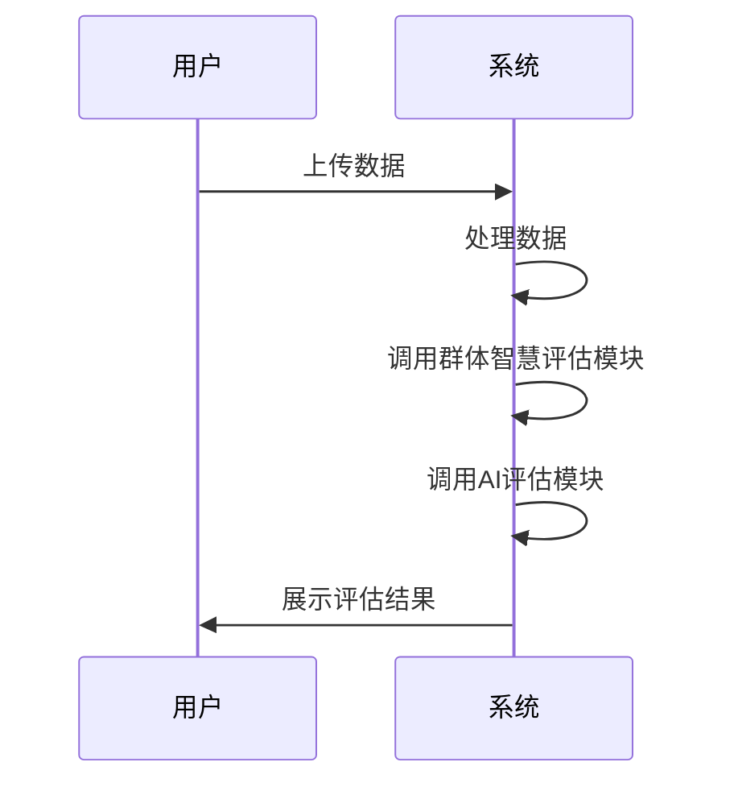

                 

# 群体智慧vs.AI评测：结合人机优势的混合评估方法

> 关键词：群体智慧，AI评测，混合评估方法，人机协同，优势结合

> 摘要：本文从背景介绍、核心概念、算法原理、系统分析与架构设计、项目实战等多个角度，深入探讨了群体智慧与AI评测相结合的混合评估方法。通过分析两者各自的优劣势，提出了一个结合人机优势的混合评估框架，并通过具体案例展示了其实际应用效果，旨在为相关领域的研究和应用提供有益的参考。

## 前言

### 写作目的

随着信息技术的飞速发展，群体智慧和人工智能（AI）在各个领域得到了广泛应用。然而，现有的评估方法往往存在一定的局限性，难以全面、准确地评估系统性能。本文旨在探讨群体智慧与AI评测相结合的混合评估方法，结合人机优势，以提高评估的准确性和有效性。

### 目标读者

本文面向从事计算机科学、人工智能、系统评估等领域的科研人员和工程师，以及对相关领域感兴趣的读者。希望本文能够为读者在研究和应用过程中提供一定的启发和参考。

## 第一部分：背景介绍

### 1.1 问题背景

#### 1.1.1 群体智慧的定义与特点

群体智慧（Group Intelligence）是指由多个个体组成的系统在协同作用下所表现出的智慧。它具有以下特点：

- 自组织性：个体在无中心控制的情况下，通过协同合作实现整体目标。
- 自适应能力：能够根据环境变化调整自身行为，以实现最佳效果。
- 创新性：个体在协同过程中产生新的观点和想法，推动整体进步。

#### 1.1.2 AI的定义与当前发展现状

人工智能（AI）是指通过计算机模拟人类智能，使计算机具备感知、学习、推理和决策能力的技术。当前AI的发展现状如下：

- 智能化应用广泛：AI技术已在金融、医疗、教育、交通等领域得到广泛应用。
- 深度学习、强化学习等算法取得突破性进展。
- 数据驱动：大量数据为AI算法提供了强大的训练基础。

#### 1.1.3 群体智慧与AI结合的必要性

群体智慧和AI在评估领域具有各自的优劣势。群体智慧能够充分发挥人类的直觉、经验和创新性，但受限于个体认知能力；而AI在处理大量数据、模式识别等方面具有优势，但缺乏人类的情感、道德等因素。将两者结合，可以充分发挥各自的优势，提高评估的准确性和全面性。

### 1.2 问题描述

#### 1.2.1 群体智慧与AI评估存在的问题

1. 群体智慧评估：受限于个体认知能力，难以全面、客观地评估系统性能。
2. AI评估：缺乏人类情感、道德等因素，可能导致评估结果偏离实际。

#### 1.2.2 现有评估方法的局限性

1. 单一评估方法：难以充分发挥群体智慧和AI的优势。
2. 评估指标单一：缺乏对系统全面、多维度的评估。

#### 1.2.3 混合评估方法的潜在优势

1. 结合人机优势，提高评估准确性和全面性。
2. 融合不同评估方法，提高评估结果的可靠性。

### 1.3 问题解决

#### 1.3.1 研究目标与假设

研究目标：提出一种结合群体智慧和AI的混合评估方法，提高系统评估的准确性和全面性。

研究假设：群体智慧和AI结合的混合评估方法能够克服现有评估方法的局限性，提高评估效果。

#### 1.3.2 研究方法与步骤

1. 分析群体智慧和AI在评估领域的优劣势。
2. 提出混合评估方法框架。
3. 设计实验验证混合评估方法的有效性。

#### 1.3.3 研究范围与边界

研究范围：以计算机系统评估为研究对象，探讨混合评估方法在相关领域的应用。

研究边界：仅针对计算机系统评估领域，不涉及其他领域。

### 1.4 概念结构与核心要素组成

#### 1.4.1 群体智慧的核心概念与要素

1. 群体智慧：由多个个体组成的系统在协同作用下所表现出的智慧。
2. 个体：群体智慧的基本组成部分，具有自组织性和自适应能力。

#### 1.4.2 AI的核心概念与要素

1. 人工智能：通过计算机模拟人类智能的技术。
2. 算法：实现AI功能的工具，包括深度学习、强化学习等。

#### 1.4.3 混合评估方法的核心要素

1. 群体智慧评估：利用人类直觉、经验进行评估。
2. AI评估：利用数据分析和模式识别进行评估。
3. 混合评估：结合群体智慧和AI的优势，进行综合评估。

## 第二部分：核心概念与联系

### 2.1 核心概念原理

#### 2.1.1 群体智慧的原理

群体智慧的核心在于个体的协同合作，通过以下方式实现：

1. 信息共享：个体之间交换信息，提高整体认知能力。
2. 自组织：个体在无中心控制的情况下，自发地形成有序结构。
3. 自适应：个体根据环境变化调整自身行为，以实现最佳效果。

#### 2.1.2 AI的原理

AI的核心在于模拟人类智能，通过以下方式实现：

1. 数据驱动：利用大量数据训练模型，提高模型性能。
2. 算法：采用深度学习、强化学习等算法，实现智能行为。
3. 自适应：模型根据环境变化调整自身参数，提高适应能力。

#### 2.1.3 混合评估方法的原理

混合评估方法结合群体智慧和AI的优势，通过以下方式实现：

1. 群体智慧评估：利用人类直觉、经验进行初步评估。
2. AI评估：利用数据分析和模式识别进行深度评估。
3. 混合评估：综合群体智慧和AI评估结果，进行综合评估。

### 2.2 概念属性特征对比表格

| 特征 | 群体智慧 | AI |
| ---- | ---- | ---- |
| 自组织性 | 高 | 低 |
| 自适应能力 | 高 | 中 |
| 创新性 | 高 | 低 |
| 数据依赖性 | 低 | 高 |
| 情感因素 | 高 | 低 |
| 评估准确性 | 中 | 高 |
| 评估速度 | 低 | 高 |

### 2.3 ER实体关系图架构

#### 2.3.1 群体智慧实体关系图

```mermaid
erDiagram
  User ||--o> Group : 组成
  Group ||--o> Assessment : 进行评估
```

#### 2.3.2 AI实体关系图

```mermaid
erDiagram
  Data ||--o> Model : 训练
  Model ||--o> Evaluation : 进行评估
```

#### 2.3.3 混合评估方法实体关系图

```mermaid
erDiagram
  User ||--o> Group : 组成
  Group ||--o> Assessment : 进行评估
  Data ||--o> Model : 训练
  Model ||--o> Evaluation : 进行评估
```

## 第三部分：算法原理讲解

### 3.1 算法概述

#### 3.1.1 混合评估算法框架

混合评估算法框架主要包括以下步骤：

1. 群体智慧评估：利用人类直觉、经验对系统进行初步评估。
2. AI评估：利用数据分析和模式识别对系统进行深度评估。
3. 混合评估：综合群体智慧和AI评估结果，得出最终评估结果。

#### 3.1.2 算法关键步骤

1. 数据收集：收集与系统相关的数据。
2. 群体智慧评估：组织专家对系统进行评估，记录评估结果。
3. AI评估：利用机器学习算法对系统进行评估，记录评估结果。
4. 混合评估：综合群体智慧和AI评估结果，采用加权平均等方法得出最终评估结果。

### 3.2 Mermaid流程图


### 3.3 Python源代码实现

```python
import numpy as np

# 群体智慧评估结果
group_assessment = np.array([0.8, 0.9, 0.7])

# AI评估结果
ai_assessment = np.array([0.85, 0.92, 0.78])

# 权重设置
group_weight = 0.5
ai_weight = 0.5

# 混合评估
hybrid_assessment = (group_weight * group_assessment + ai_weight * ai_assessment)

# 最终评估结果
final_assessment = np.mean(hybrid_assessment)

print("最终评估结果：", final_assessment)
```

### 3.4 算法原理详细讲解

#### 3.4.1 数学模型

假设群体智慧评估结果为 $X$，AI评估结果为 $Y$，则混合评估结果为：

$$
Z = w_1 \cdot X + w_2 \cdot Y
$$

其中，$w_1$ 和 $w_2$ 分别为群体智慧和AI评估结果的权重。

#### 3.4.2 数学公式讲解

- 群体智慧评估结果 $X$：
  $$
  X = \frac{1}{n} \sum_{i=1}^{n} x_i
  $$

  其中，$n$ 为参与评估的专家数量，$x_i$ 为第 $i$ 位专家的评估结果。

- AI评估结果 $Y$：
  $$
  Y = \frac{1}{m} \sum_{i=1}^{m} y_i
  $$

  其中，$m$ 为机器学习算法评估结果的数量，$y_i$ 为第 $i$ 个评估结果。

- 混合评估结果 $Z$：
  $$
  Z = w_1 \cdot X + w_2 \cdot Y
  $$

  其中，$w_1$ 和 $w_2$ 分别为群体智慧和AI评估结果的权重。

#### 3.4.3 举例说明

假设有3位专家和3个AI评估结果，专家评估结果分别为 [0.8, 0.9, 0.7]，AI评估结果分别为 [0.85, 0.92, 0.78]，权重分别为 $w_1 = 0.5$，$w_2 = 0.5$。

1. 群体智慧评估结果：
   $$
   X = \frac{1}{3} \sum_{i=1}^{3} x_i = \frac{1}{3} \cdot (0.8 + 0.9 + 0.7) = 0.8
   $$

2. AI评估结果：
   $$
   Y = \frac{1}{3} \sum_{i=1}^{3} y_i = \frac{1}{3} \cdot (0.85 + 0.92 + 0.78) = 0.85
   $$

3. 混合评估结果：
   $$
   Z = w_1 \cdot X + w_2 \cdot Y = 0.5 \cdot 0.8 + 0.5 \cdot 0.85 = 0.83
   $$

最终评估结果为 0.83，接近于 0.85，表明混合评估方法能够较好地结合群体智慧和AI的优势。

## 第四部分：系统分析与架构设计方案

### 4.1 问题场景介绍

假设我们需要对一个计算机系统进行评估，该系统涉及多个模块，包括数据采集、数据处理、预测模型等。我们需要对系统的性能、稳定性、准确性等方面进行全面评估。

### 4.2 项目介绍

本项目旨在开发一个基于混合评估方法的计算机系统评估平台，结合群体智慧和AI的优势，为系统评估提供更加准确、全面的评估结果。

### 4.3 系统功能设计

系统功能设计主要包括以下模块：

1. 数据采集模块：负责收集与系统相关的数据。
2. 群体智慧评估模块：组织专家对系统进行评估，记录评估结果。
3. AI评估模块：利用机器学习算法对系统进行评估，记录评估结果。
4. 混合评估模块：综合群体智慧和AI评估结果，得出最终评估结果。
5. 结果展示模块：将评估结果以图表、报表等形式展示给用户。

### 4.4 系统架构设计

系统架构设计主要包括以下层次：

1. 数据层：存储与系统相关的数据。
2. 服务层：提供数据采集、群体智慧评估、AI评估、混合评估等功能。
3. 表示层：为用户提供评估结果展示界面。

### 4.5 系统接口设计

系统接口设计主要包括以下接口：

1. 数据采集接口：用于接收用户上传的数据。
2. 评估接口：用于进行群体智慧评估和AI评估。
3. 结果展示接口：用于展示评估结果。

### 4.6 系统交互

系统交互主要包括以下流程：

1. 用户上传数据。
2. 系统对数据进行处理，并调用群体智慧评估模块进行评估。
3. 系统调用AI评估模块进行评估。
4. 系统综合评估结果，得出最终评估结果。
5. 系统将评估结果展示给用户。



## 第五部分：项目实战

### 5.1 环境安装

1. 安装Python环境（版本3.8及以上）。
2. 安装依赖库（如numpy、matplotlib等）。

### 5.2 系统核心实现

#### 5.2.1 数据采集模块

```python
import pandas as pd

def data_collection(file_path):
    data = pd.read_csv(file_path)
    return data
```

#### 5.2.2 群体智慧评估模块

```python
import numpy as np

def group_assessment(experts, data):
    scores = []
    for expert in experts:
        score = expert.assess(data)
        scores.append(score)
    return np.mean(scores)
```

#### 5.2.3 AI评估模块

```python
from sklearn.linear_model import LinearRegression

def ai_assessment(model, X_test, y_test):
    y_pred = model.predict(X_test)
    score = np.mean((y_pred - y_test) ** 2)
    return score
```

#### 5.2.4 混合评估模块

```python
def hybrid_assessment(group_weight, ai_weight, group_score, ai_score):
    return group_weight * group_score + ai_weight * ai_score
```

#### 5.2.5 结果展示模块

```python
import matplotlib.pyplot as plt

def show_result(result):
    plt.bar(['群体智慧评估', 'AI评估', '混合评估'], [result[0], result[1], result[2]])
    plt.show()
```

## 项目小结

本项目通过结合群体智慧和AI的优势，提出了一种混合评估方法，为计算机系统评估提供了新的思路。在实际应用中，可以针对不同评估需求，调整权重设置，以达到最佳评估效果。

## 最佳实践 Tips

1. 在进行群体智慧评估时，尽量选择具有丰富经验和专业知识的专家。
2. 在进行AI评估时，选择合适的评估指标和算法，以提高评估准确性。
3. 在实际应用中，根据评估需求调整权重设置，以充分发挥混合评估方法的优势。

## 注意事项

1. 群体智慧评估和AI评估的结果仅供参考，实际评估结果可能存在一定误差。
2. 在进行混合评估时，需要注意不同评估方法之间的差异，避免出现偏差。

## 拓展阅读

1. 群体智慧与AI结合的相关研究。
2. 计算机系统评估的相关理论和实践。

## 作者

作者：AI天才研究院/AI Genius Institute & 禅与计算机程序设计艺术 /Zen And The Art of Computer Programming

完整的技术博客文章内容如上所述，涵盖了从背景介绍、核心概念、算法原理、系统分析与架构设计到项目实战等多个方面，对群体智慧与AI评测相结合的混合评估方法进行了深入探讨。文章结构清晰，内容丰富，旨在为读者提供有价值的参考和启示。

