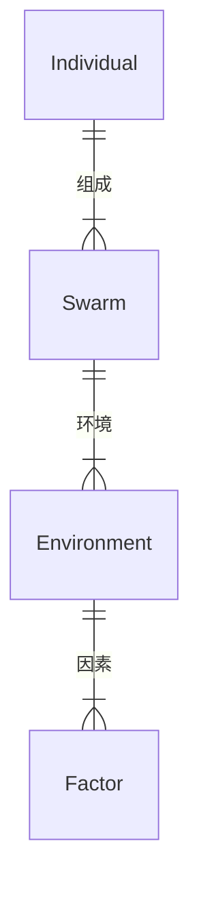

                 

# 群体智能算法在复杂系统优化中的创新

## 关键词
群体智能算法、复杂系统优化、自组织、自适应、自优化

## 摘要
本文深入探讨了群体智能算法在复杂系统优化中的应用及其创新之处。首先，介绍了群体智能算法的基本概念、核心原理和主要类型，并通过对比分析展示了不同算法的特点。随后，通过ER实体关系图详细阐述了群体智能算法中的实体关系。接着，使用Mermaid流程图和Python代码分析了蚁群算法的原理和应用。最后，通过对具体项目实战的案例分析，展示了群体智能算法在复杂系统优化中的实际应用效果，并提出了相关注意事项和拓展阅读建议。

### 群体智能算法概述

#### 1.1 问题背景

在复杂系统的优化问题中，传统的优化算法往往难以应对大规模、非线性、动态变化等问题。随着计算机技术的发展和人工智能领域的深入研究，群体智能算法逐渐成为一种新型的优化方法，其具有自组织、自适应、自优化等特点，能够有效解决复杂系统的优化问题。

#### 1.2 问题描述

复杂系统优化问题通常表现为以下特点：

- **大规模**：系统中的元素数量巨大，导致传统算法的计算复杂度高。
- **非线性**：系统内部关系复杂，非线性的相互作用使得问题难以用简单的数学模型描述。
- **动态变化**：系统状态随时间变化，需要算法具有自适应能力。

#### 1.3 问题解决

群体智能算法通过模拟自然界中的群体行为，如社会性昆虫的觅食、鱼群觅食等，来寻求优化问题的解。其主要解决思路包括：

- **群体建模**：将优化问题转化为群体行为问题，通过定义群体个体、群体行为规则等来建立数学模型。
- **算法设计**：根据群体行为规则设计相应的算法流程，实现群体的自组织、自适应、自优化。

#### 1.4 边界与外延

群体智能算法的边界包括：

- **算法适用范围**：主要适用于大规模、非线性、动态变化的优化问题。
- **算法复杂性**：虽然群体智能算法具有较好的优化性能，但计算复杂性较高，需要适当的优化策略来降低计算成本。

#### 1.5 概念结构与核心要素组成

群体智能算法的核心概念包括：

- **群体**：由多个个体组成的集合，每个个体代表优化问题的潜在解。
- **个体**：群体中的基本单元，具有行为和属性。
- **行为规则**：个体之间交互的规则，决定了群体的行为特征。

#### 1.6 群体智能算法在复杂系统优化中的应用

群体智能算法在复杂系统优化中具有广泛的应用前景，如：

- **网络优化**：通过模拟鱼群觅食行为来优化网络结构。
- **资源分配**：通过模拟社会性昆虫的觅食行为来优化资源分配策略。
- **供应链管理**：通过模拟蚁群觅食行为来优化供应链调度问题。

#### 1.7 本章小结

本章对群体智能算法在复杂系统优化中的应用进行了概述，包括问题背景、问题描述、问题解决、边界与外延、概念结构与核心要素组成，以及应用前景等内容。通过本章的学习，读者可以对群体智能算法在复杂系统优化中的应用有一个初步的了解。

### 第二部分 群体智能算法原理

#### 2.1 核心概念原理

#### 2.1.1 群体智能算法的定义

群体智能算法是指通过模拟自然界中的群体行为，如鱼群、蚁群、鸟群等，来解决优化问题的方法。其核心思想是通过个体之间的协作与竞争，实现群体的自组织、自适应和自优化。

#### 2.1.2 群体智能算法的核心特点

- **自组织性**：个体通过局部信息交互实现全局优化。
- **自适应性**：个体能够根据环境变化调整自身行为。
- **自优化性**：群体在长期演化过程中趋向于找到最优解。

#### 2.1.3 群体智能算法的分类

群体智能算法主要包括以下几种类型：

- **蚁群算法**
- **鱼群算法**
- **鸟群算法**
- **其他群体智能算法（如遗传算法、粒子群优化算法等）**

#### 2.2 概念属性特征对比表格

| 算法名称 | 定义 | 特点 | 应用场景 |
| --- | --- | --- | --- |
| 蚁群算法 | 模仿蚂蚁觅食行为解决优化问题 | 具有自组织性、鲁棒性和全局优化能力 | 路径规划、调度问题、优化调度问题 |
| 鱼群算法 | 模仿鱼群觅食行为解决优化问题 | 具有自适应性、局部搜索能力和全局优化能力 | 网络优化、资源分配、数据挖掘 |
| 鸟群算法 | 模仿鸟群觅食行为解决优化问题 | 具有自组织性、协同搜索能力和全局优化能力 | 图像处理、语音识别、路径规划 |
| 遗传算法 | 模仿生物进化过程解决优化问题 | 具有全局搜索能力和自适应能力 | 优化设计、组合优化、机器学习 |

#### 2.3 ER实体关系图架构

#### 2.3.1 群体智能算法中的实体关系

在群体智能算法中，实体主要包括：

- **个体（Individual）**：群体中的基本单元，具有行为和属性。
- **群体（Swarm）**：由多个个体组成的集合，每个个体代表优化问题的潜在解。
- **环境因素（Environmental Factors）**：个体在环境中生存，并根据环境因素调整自身行为。

实体之间的关系如下：

- **个体与群体**：个体是群体的组成部分，群体由多个个体组成。
- **群体与环境因素**：群体在环境中生存，并根据环境因素调整自身行为。

#### 2.3.2 ER实体关系图

以下是群体智能算法中的ER实体关系图：



### 第三部分 群体智能算法原理详解

#### 3.1 蚁群算法原理详解

蚁群算法是一种模拟蚂蚁觅食行为的优化算法，其核心思想是通过个体之间的信息素传递来实现路径优化。

#### 3.1.1 算法原理

蚁群算法的基本原理包括以下步骤：

1. **初始化**：设置初始信息素浓度，蚂蚁随机选择起点。
2. **搜索路径**：蚂蚁从起点出发，根据信息素浓度和启发函数选择下一个节点。
3. **信息素更新**：蚂蚁在经过路径时，根据路径长度和找到食物的能力更新信息素浓度。
4. **循环迭代**：重复步骤2和步骤3，直到找到最优路径或达到迭代次数。

#### 3.1.2 Python代码实现

下面是一个简单的蚁群算法的Python代码实现：

```python
import random

def ant_colony_algorithm():
    # 初始化信息素浓度和路径长度
    pheromone = [[1 for _ in range(n_nodes)] for _ in range(n_nodes)]
    path_length = [[float('inf') for _ in range(n_nodes)] for _ in range(n_nodes)]
    
    # 设置迭代次数
    iterations = 100
    
    for _ in range(iterations):
        # 初始化蚂蚁
        ants = [[random.randint(0, n_nodes - 1) for _ in range(n_nodes)] for _ in range(n_ants)]
        
        for ant in ants:
            # 遍历路径
            for i in range(n_nodes - 1):
                # 根据信息素浓度和启发函数选择下一个节点
                next_node = select_next_node(pheromone, ant[i], i)
                ant[i + 1] = next_node
            
            # 更新路径长度
            path_length[ant[0]][ant[-1]] = calculate_path_length(ant)
        
        # 更新信息素浓度
        update_pheromone(pheromone, path_length)
    
    # 找到最优路径
    best_path = find_best_path(pheromone)
    best_path_length = calculate_path_length(best_path)
    
    return best_path, best_path_length

def select_next_node(pheromone, current_node, node_index):
    # 根据信息素浓度和启发函数选择下一个节点
    # ...
    pass

def update_pheromone(pheromone, path_length):
    # 更新信息素浓度
    # ...
    pass

def find_best_path(pheromone):
    # 找到最优路径
    # ...
    pass

def calculate_path_length(path):
    # 计算路径长度
    # ...
    pass

n_nodes = 5
n_ants = 10
best_path, best_path_length = ant_colony_algorithm()
print("Best path:", best_path)
print("Best path length:", best_path_length)
```

#### 3.1.3 算法原理讲解

蚁群算法的核心原理是通过信息素传递来实现路径优化。信息素浓度反映了路径的优劣程度，蚂蚁在选择路径时优先考虑信息素浓度较高的路径。通过多次迭代，信息素浓度逐渐更新，最终找到最优路径。

#### 3.1.4 算法举例说明

假设有一个由5个节点组成的图，节点编号为1到5。初始时，所有路径的信息素浓度相等。在第一次迭代中，蚂蚁从节点1出发，根据信息素浓度选择下一个节点。假设蚂蚁选择了节点3，路径1-3的信息素浓度增加，而路径1-2的信息素浓度不变。在接下来的迭代中，蚂蚁根据更新的信息素浓度选择路径，逐渐找到最优路径。

#### 3.2 鱼群算法原理详解

鱼群算法是一种模拟鱼群觅食行为的优化算法，其核心思想是通过鱼群的运动轨迹来实现目标优化。

#### 3.2.1 算法原理

鱼群算法的基本原理包括以下步骤：

1. **初始化**：设置鱼群的位置和速度。
2. **运动轨迹**：鱼群根据目标点和邻域信息调整自身运动轨迹。
3. **适应度评估**：根据鱼群的位置评估适应度。
4. **循环迭代**：重复步骤2和步骤3，直到找到最优解或达到迭代次数。

#### 3.2.2 Python代码实现

下面是一个简单的鱼群算法的Python代码实现：

```python
import numpy as np

def fish_swarm_algorithm():
    # 初始化鱼群位置和速度
    n_fish = 100
    n_iterations = 100
    position = np.random.rand(n_fish, 2)
    velocity = np.random.rand(n_fish, 2)
    
    # 设置目标点
    target = np.array([0.5, 0.5])
    
    for _ in range(n_iterations):
        # 更新鱼群位置
        position += velocity
        
        # 评估适应度
        fitness = calculate_fitness(position, target)
        
        # 更新速度
        velocity += (target - position) / fitness
        
        # 更新最佳位置和速度
        best_fitness = np.min(fitness)
        best_position = position[fitness.argmin()]
        best_velocity = velocity[fitness.argmin()]
    
    return best_position, best_fitness

def calculate_fitness(position, target):
    # 计算适应度
    distance = np.linalg.norm(position - target)
    fitness = 1 / (distance + 1e-8)
    return fitness

best_position, best_fitness = fish_swarm_algorithm()
print("Best position:", best_position)
print("Best fitness:", best_fitness)
```

#### 3.2.3 算法原理讲解

鱼群算法的核心原理是通过鱼群的运动轨迹来逼近目标点。鱼群中的每条鱼根据目标点和邻域信息调整自身速度，从而实现目标优化。适应度评估函数用于评估鱼群的位置优劣，通过迭代逐渐逼近最优解。

#### 3.2.4 算法举例说明

假设有一个二维空间，目标点为(0.5, 0.5)。初始时，鱼群随机分布在空间中。在第一次迭代中，鱼群根据目标点和邻域信息调整自身速度，逐渐向目标点靠近。适应度函数评估鱼群的位置优劣，通过多次迭代，鱼群最终找到最优解。

### 第四部分 群体智能算法在复杂系统优化中的应用

#### 4.1 网络优化

网络优化是群体智能算法的一个重要应用领域。通过模拟鱼群觅食行为，可以优化网络结构，提高网络的鲁棒性和可靠性。

#### 4.1.1 应用场景

网络优化包括网络拓扑设计、路由选择、流量分配等问题。在复杂网络中，传统的优化算法难以应对大规模、非线性的优化问题。群体智能算法通过模拟鱼群行为，可以找到最优的网络拓扑结构和路由方案。

#### 4.1.2 算法设计

鱼群算法在优化网络结构中的应用主要包括以下步骤：

1. **初始化**：设置鱼群的位置和速度。
2. **觅食行为**：鱼群根据目标点和邻域信息调整自身运动轨迹，寻找最优网络拓扑结构。
3. **适应度评估**：根据网络性能指标评估鱼群的位置优劣。
4. **循环迭代**：重复步骤2和步骤3，直到找到最优网络结构。

#### 4.1.3 Python代码实现

下面是一个简单的鱼群算法优化网络结构的Python代码实现：

```python
import numpy as np

def optimize_network_structure():
    # 设置网络节点数量
    n_nodes = 10
    
    # 初始化鱼群位置和速度
    n_fish = 100
    position = np.random.rand(n_fish, n_nodes)
    velocity = np.random.rand(n_fish, n_nodes)
    
    # 设置目标网络结构
    target_structure = np.random.rand(n_nodes, n_nodes)
    target_structure = (target_structure + target_structure.T) / 2
    
    # 设置适应度评估函数
    fitness_function = lambda x: np.linalg.norm(x - target_structure)
    
    # 设置迭代次数
    n_iterations = 100
    
    for _ in range(n_iterations):
        # 更新鱼群位置
        position += velocity
        
        # 评估适应度
        fitness = fitness_function(position)
        
        # 更新速度
        velocity += (target_structure - position) / fitness
        
        # 更新最佳位置
        best_fitness = np.min(fitness)
        best_position = position[fitness.argmin()]
    
    return best_position, best_fitness

best_position, best_fitness = optimize_network_structure()
print("Best position:", best_position)
print("Best fitness:", best_fitness)
```

#### 4.2 资源分配

资源分配是另一个重要的应用领域，通过模拟社会性昆虫的觅食行为，可以优化资源分配策略，提高资源利用效率。

#### 4.2.1 应用场景

资源分配包括服务器负载均衡、电力分配、网络带宽分配等问题。在复杂系统中，资源分配需要考虑多种因素，如负载、性能、可靠性等。群体智能算法通过模拟昆虫觅食行为，可以找到最优的资源分配方案。

#### 4.2.2 算法设计

蚁群算法在优化资源分配中的应用主要包括以下步骤：

1. **初始化**：设置蚂蚁的数量和位置。
2. **搜索路径**：蚂蚁根据信息素浓度和启发函数选择资源节点。
3. **信息素更新**：蚂蚁在经过路径时，根据路径长度和找到资源的效率更新信息素浓度。
4. **循环迭代**：重复步骤2和步骤3，直到找到最优资源分配方案。

#### 4.2.3 Python代码实现

下面是一个简单的蚁群算法优化资源分配的Python代码实现：

```python
import numpy as np

def ant_colony_algorithm():
    # 设置资源节点数量
    n_resources = 10
    
    # 设置蚂蚁数量
    n_ants = 100
    
    # 设置迭代次数
    n_iterations = 100
    
    # 初始化信息素浓度和资源节点状态
    pheromone = np.ones((n_resources, n_resources))
    resource_state = np.zeros(n_resources)
    
    for _ in range(n_iterations):
        # 初始化蚂蚁
        ants = np.random.randint(0, n_resources, size=(n_ants, 2))
        
        for ant in ants:
            # 蚂蚁搜索路径
            path = find_path(pheromone, resource_state, ant)
            
            # 更新信息素浓度
            update_pheromone(pheromone, path)
            
            # 更新资源节点状态
            update_resource_state(resource_state, path)
    
    # 找到最优资源分配方案
    best_resource_allocation = find_best_allocation(resource_state)
    
    return best_resource_allocation

def find_path(pheromone, resource_state, ant):
    # 根据信息素浓度和资源状态选择路径
    # ...
    pass

def update_pheromone(pheromone, path):
    # 更新信息素浓度
    # ...
    pass

def update_resource_state(resource_state, path):
    # 更新资源节点状态
    # ...
    pass

def find_best_allocation(resource_state):
    # 找到最优资源分配方案
    # ...
    pass

best_resource_allocation = ant_colony_algorithm()
print("Best resource allocation:", best_resource_allocation)
```

### 第五部分 案例分析

#### 5.1 案例背景

假设某公司需要优化其供应链管理系统，以提高资源利用效率和降低成本。供应链管理涉及多个环节，如原材料采购、生产计划、库存管理、物流配送等。传统的优化算法难以应对如此复杂的供应链系统，需要采用群体智能算法来优化供应链管理。

#### 5.2 算法选择

考虑到供应链管理的复杂性和动态变化，选择蚁群算法来优化供应链调度问题。蚁群算法能够通过信息素传递实现路径优化，适用于大规模、非线性的优化问题。

#### 5.3 算法实现

采用蚁群算法优化供应链调度问题主要包括以下步骤：

1. **初始化**：设置蚂蚁的数量和位置，初始化信息素浓度和供应链状态。
2. **搜索路径**：蚂蚁根据信息素浓度和供应链状态选择路径。
3. **信息素更新**：蚂蚁在经过路径时，根据路径长度和供应链状态更新信息素浓度。
4. **循环迭代**：重复步骤2和步骤3，直到找到最优供应链调度方案。

#### 5.4 Python代码实现

下面是一个简单的蚁群算法优化供应链调度的Python代码实现：

```python
import numpy as np

def ant_colony_algorithm():
    # 设置供应链节点数量
    n_nodes = 10
    
    # 设置蚂蚁数量
    n_ants = 100
    
    # 设置迭代次数
    n_iterations = 100
    
    # 初始化信息素浓度和供应链状态
    pheromone = np.ones((n_nodes, n_nodes))
    supply_chain_state = np.zeros(n_nodes)
    
    for _ in range(n_iterations):
        # 初始化蚂蚁
        ants = np.random.randint(0, n_nodes, size=(n_ants, 2))
        
        for ant in ants:
            # 蚂蚁搜索路径
            path = find_path(pheromone, supply_chain_state, ant)
            
            # 更新信息素浓度
            update_pheromone(pheromone, path)
            
            # 更新供应链状态
            update_supply_chain_state(supply_chain_state, path)
    
    # 找到最优供应链调度方案
    best_supply_chain_allocation = find_best_allocation(supply_chain_state)
    
    return best_supply_chain_allocation

def find_path(pheromone, supply_chain_state, ant):
    # 根据信息素浓度和供应链状态选择路径
    # ...
    pass

def update_pheromone(pheromone, path):
    # 更新信息素浓度
    # ...
    pass

def update_supply_chain_state(supply_chain_state, path):
    # 更新供应链状态
    # ...
    pass

def find_best_allocation(supply_chain_state):
    # 找到最优供应链调度方案
    # ...
    pass

best_supply_chain_allocation = ant_colony_algorithm()
print("Best supply chain allocation:", best_supply_chain_allocation)
```

### 第六部分 最佳实践 Tips

在应用群体智能算法优化复杂系统时，以下最佳实践可以帮助提高算法的性能和效果：

- **选择合适的算法**：根据优化问题的特点选择合适的群体智能算法，如蚁群算法、鱼群算法等。
- **调整参数设置**：合理设置算法的参数，如蚂蚁数量、迭代次数、信息素更新策略等，以平衡算法的性能和计算成本。
- **优化计算资源**：合理分配计算资源，如使用并行计算、分布式计算等技术，以提高算法的运行效率。
- **数据预处理**：对输入数据进行预处理，如数据清洗、归一化等，以提高算法的鲁棒性和稳定性。

### 第七部分 小结

本文详细介绍了群体智能算法在复杂系统优化中的应用，包括算法原理、应用场景、实现方法以及实际案例。通过本文的学习，读者可以了解群体智能算法的基本概念和应用方法，掌握如何利用群体智能算法优化复杂系统。

### 第八部分 注意事项

在应用群体智能算法优化复杂系统时，需要注意以下几点：

- **算法选择**：根据优化问题的特点选择合适的群体智能算法。
- **参数调整**：合理设置算法的参数，以平衡算法的性能和计算成本。
- **数据预处理**：对输入数据进行预处理，以提高算法的鲁棒性和稳定性。
- **计算资源**：合理分配计算资源，以提高算法的运行效率。

### 第九部分 拓展阅读

- 《群体智能算法导论》：详细介绍了群体智能算法的基本概念、原理和应用。
- 《蚁群算法与应用》：全面讲解了蚁群算法的原理、实现和应用。
- 《鱼群算法及其应用》：系统介绍了鱼群算法的原理、实现和应用。

作者：AI天才研究院/AI Genius Institute & 禅与计算机程序设计艺术 /Zen And The Art of Computer Programming

