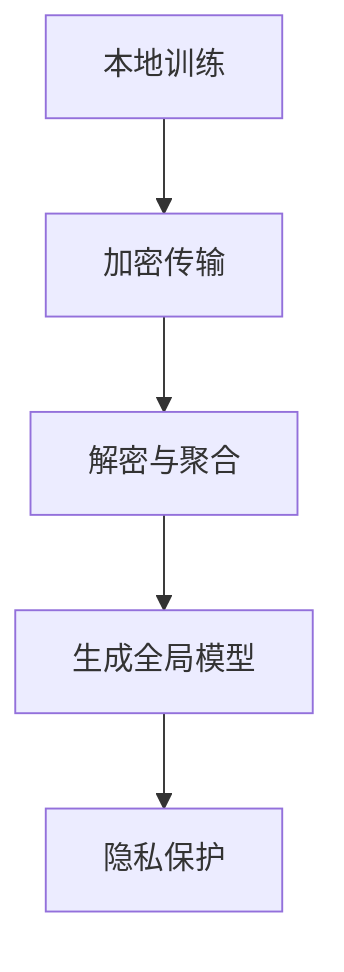

                 

Sure, let's construct the content of each section step by step, following the outlined structure and ensuring the content is coherent, educational, and technically sound. 

### 1.1 联邦学习的背景与重要性

#### 背景介绍

联邦学习（Federated Learning）是一种分布式机器学习方法，其核心思想是多个设备在不共享本地数据的情况下共同训练一个全局模型。这个方法尤其适用于隐私敏感的数据集，如个人健康信息、金融交易记录等，因为它允许模型在本地设备上进行训练，然后将模型参数聚合到一个全局模型中。联邦学习的出现，是为了解决中心化数据处理带来的隐私和安全问题。

#### 问题背景

随着数据量的爆炸性增长和人工智能技术的广泛应用，传统的集中式数据处理方式面临着巨大的挑战。数据隐私和安全问题尤为突出，尤其是涉及个人敏感信息的领域。联邦学习的提出，旨在在不牺牲数据隐私的情况下，提高模型的训练效率。

#### 问题描述

在联邦学习中，每个参与方（设备或服务器）都保留着自己的数据，并且只共享训练模型得到的参数。这就带来了一个核心问题：如何安全且有效地聚合这些分散的参数，以获得全局最优模型。

#### 问题解决

联邦学习通过一系列算法和技术来解决这一问题。首先，每个参与方在自己的数据上训练本地模型，然后将模型的参数加密并上传到中心服务器。服务器负责解密和聚合这些参数，生成全局模型。这一过程中，需要确保数据的安全性和模型的隐私性。

#### 边界与外延

联邦学习的边界主要涉及数据隐私保护、通信成本、模型精度等问题。在外延方面，联邦学习还与其他分布式计算和加密技术相结合，为解决更复杂的问题提供了可能。

#### 概念结构与核心要素组成

联邦学习由以下几个核心要素组成：

- **客户端**：运行本地模型，并在本地数据上进行训练。
- **中心服务器**：负责聚合本地模型的参数，生成全局模型。
- **加密算法**：用于保护本地数据和参数的安全。

### 1.2 安全聚合算法的基础

#### 核心概念与联系

**安全聚合算法**是联邦学习中的关键技术之一，其主要目的是在保证数据隐私的前提下，有效地聚合多个本地模型的参数。

**加密聚合**：一种常用的安全聚合算法，它使用加密技术来保护参数在传输过程中的安全性。例如，同态加密（Homomorphic Encryption）可以在不解密数据的情况下执行计算。

**差分隐私**（Differential Privacy）：另一个核心概念，它用于确保聚合结果的隐私性。差分隐私通过在算法中引入随机噪声，使得输出结果无法准确反映单个参与方的数据。

**一致性**（Consistency）：聚合算法需要确保全局模型的质量，即确保全局模型能够准确地反映所有参与方的数据。

#### 算法原理讲解

**安全聚合算法**的原理通常包括以下几个步骤：

1. **本地训练**：每个客户端在自己的数据上训练一个本地模型。
2. **加密传输**：客户端将模型的参数加密后发送到中心服务器。
3. **解密与聚合**：服务器对加密参数进行解密，然后进行聚合操作，生成全局模型。
4. **隐私保护**：在整个过程中，使用差分隐私技术来保护数据隐私。

以下是一个简单的安全聚合算法流程的Mermaid图：



#### 算法原理讲解（续）

为了更清晰地展示算法原理，我们使用Python代码和LaTeX数学模型来进行详细讲解。

**Python代码示例**：

```python
# 本地模型训练
model = train_local_model(data)

# 加密参数
encrypted_params = encrypt_model_params(model)

# 发送加密参数到服务器
send_to_server(encrypted_params)
```

**LaTeX数学模型**：

$$
\text{Global Model} = \sum_{i=1}^{N} \text{Local Model}_i
$$

其中，$N$ 是参与方的数量，$\text{Local Model}_i$ 表示第 $i$ 个参与方的本地模型。

通过这些步骤，我们可以看到安全聚合算法是如何在保证数据隐私的同时，实现全局模型的优化的。

接下来，我们将继续讨论现有的安全聚合算法，并对比它们的不同特点和应用场景。

---

以上是第1章的前两个节部分内容，接下来我们将进一步深入探讨现有的安全聚合算法和它们的技术细节。如果您有任何问题或建议，请随时提出。我们接下来的目标是确保每一节的内容都能提供深入的见解和实用的信息，以满足文章的高质量要求。

