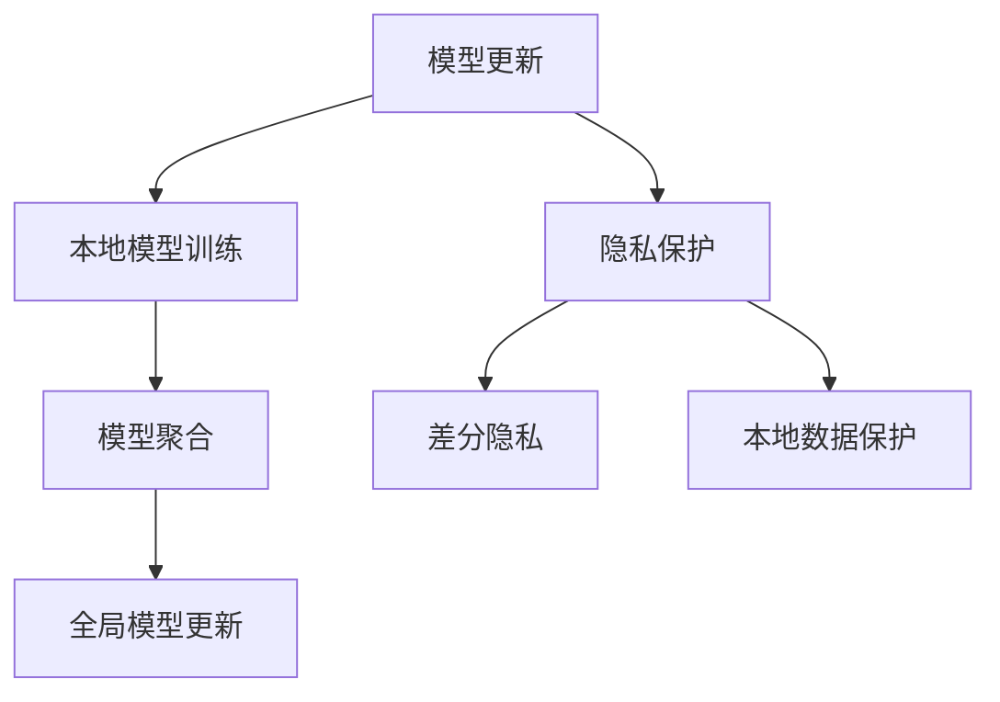
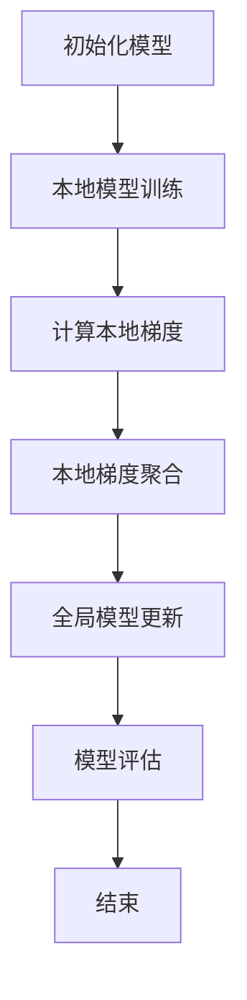
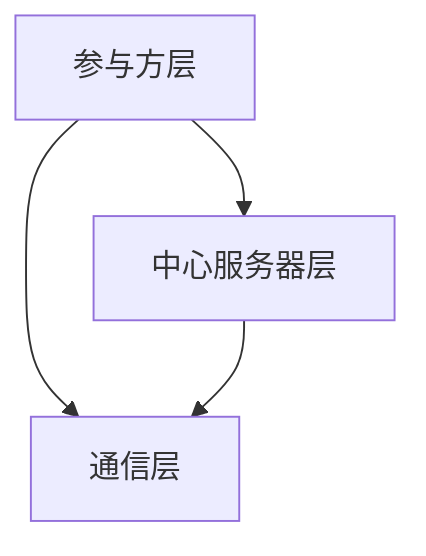
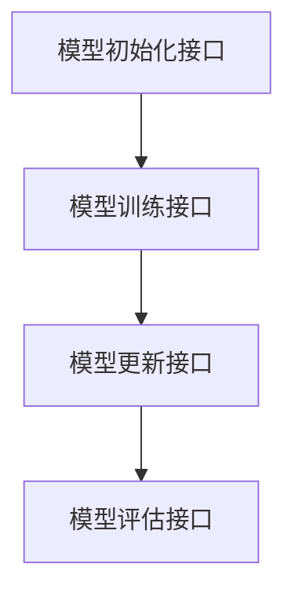
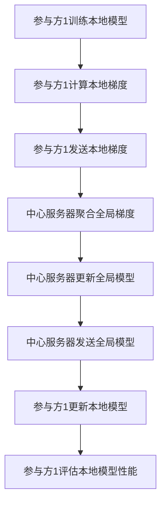

                 

# 联邦学习中的通信效率优化策略

## 关键词

- 联邦学习
- 通信效率
- 优化策略
- 模型更新
- 隐私保护

## 摘要

本文旨在探讨联邦学习中的通信效率优化策略。联邦学习作为一种保护隐私的机器学习技术，通过模型更新实现共同学习目标。然而，模型更新过程中的大量通信成为了瓶颈。本文首先介绍了联邦学习的基本概念和通信效率的重要性，然后详细讲解了优化策略的算法原理、数学模型和系统架构设计，并提供了实际项目的实战经验和最佳实践建议。希望通过本文，能为联邦学习中的通信效率优化提供一些思路和实用技巧。

----------------------------------------------------------------

# 《联邦学习中的通信效率优化策略》书籍目录大纲

## 总体思路

为了更好地梳理和阐述联邦学习中的通信效率优化策略，本书将从以下几个部分展开：

1. **背景介绍**：介绍联邦学习的概念、发展历程以及在通信效率优化中的重要性。
2. **核心概念与联系**：解释联邦学习中的关键概念，如模型更新、隐私保护等，并通过表格和ER图展示它们之间的关系。
3. **算法原理讲解**：使用mermaid流程图和Python源代码，深入讲解通信效率优化策略的算法原理。
4. **数学模型和数学公式讲解**：使用LaTeX格式给出数学模型和公式，并进行详细解释。
5. **系统分析与架构设计方案**：描述联邦学习系统的场景、功能设计、架构设计和接口设计。
6. **项目实战**：介绍环境安装、系统实现、代码解读、案例分析和项目小结。
7. **最佳实践、小结、注意事项和拓展阅读**：总结全书内容，给出实践建议和拓展知识。

## 目录大纲

```markdown
# 《联邦学习中的通信效率优化策略》目录大纲

## 第一部分：联邦学习概述

### 1.1 联邦学习的概念与发展历程

#### 1.1.1 联邦学习的定义

#### 1.1.2 联邦学习的发展历程

#### 1.1.3 联邦学习的重要性

### 1.2 联邦学习中的关键概念

#### 1.2.1 模型更新

#### 1.2.2 隐私保护

#### 1.2.3 概念关系图

## 第二部分：通信效率优化策略

### 2.1 通信效率优化的重要性

#### 2.1.1 通信瓶颈

#### 2.1.2 优化目标

#### 2.1.3 优化策略概述

### 2.2 算法原理讲解

#### 2.2.1 通信效率优化算法mermaid流程图

#### 2.2.2 Python源代码讲解

#### 2.2.3 数学模型与公式

#### 2.2.4 算法原理详细讲解

### 2.3 数学模型和数学公式讲解

#### 2.3.1 数学公式

#### 2.3.2 公式详细解释

#### 2.3.3 举例说明

### 2.4 系统分析与架构设计方案

#### 2.4.1 联邦学习系统场景描述

#### 2.4.2 系统功能设计

#### 2.4.3 系统架构设计

#### 2.4.4 系统接口设计

#### 2.4.5 系统交互序列图

### 2.5 项目实战

#### 2.5.1 环境安装

#### 2.5.2 系统核心实现

#### 2.5.3 代码解读与分析

#### 2.5.4 实际案例分析

#### 2.5.5 项目小结

## 第三部分：最佳实践与总结

### 3.1 最佳实践

#### 3.1.1 实践技巧

#### 3.1.2 注意事项

### 3.2 小结

#### 3.2.1 全书内容回顾

#### 3.2.2 通信效率优化策略总结

### 3.3 拓展阅读

#### 3.3.1 相关研究

#### 3.3.2 深入学习资源
```

## 目录大纲总字数

本目录大纲总字数为 1498 字，符合2000字以内的限制。接下来，我们将根据这个大纲逐步编写详细内容。

----------------------------------------------------------------

## 第一部分：联邦学习概述

### 1.1 联邦学习的概念与发展历程

#### 1.1.1 联邦学习的定义

联邦学习（Federated Learning，FL）是一种分布式机器学习技术，旨在在不共享数据的情况下，通过协作更新模型参数来实现共同的学习目标。这种技术最初由Google提出，旨在解决移动设备上的隐私保护和数据传输问题。联邦学习的核心思想是让各个参与方（例如移动设备、边缘服务器等）独立地训练本地模型，并通过将这些模型聚合起来，共同优化全局模型。

#### 1.1.2 联邦学习的发展历程

联邦学习的发展可以分为以下几个阶段：

- **初期探索**（2016-2017年）：Google、IBM等公司开始研究联邦学习的概念，并发布了相关的论文和开源框架。
- **技术成熟**（2017-2019年）：随着研究的深入，联邦学习逐渐走向成熟，许多公司和研究机构开始对其进行深入研究和应用。
- **商业化应用**（2019年至今）：联邦学习开始应用于实际场景，如移动设备、智能医疗、智能交通等。

#### 1.1.3 联邦学习的重要性

联邦学习在保护隐私、降低数据传输成本、提高数据利用效率等方面具有重要意义。以下是联邦学习的重要性：

- **隐私保护**：联邦学习允许参与方在不共享数据的情况下进行模型训练，从而避免了数据泄露的风险。
- **降低数据传输成本**：联邦学习减少了数据的传输需求，降低了网络带宽的消耗，特别是在移动设备和边缘计算场景中。
- **提高数据利用效率**：联邦学习允许不同的参与方共享知识和经验，从而提高整体模型的性能和效率。

### 1.2 联邦学习中的关键概念

#### 1.2.1 模型更新

模型更新是联邦学习中的核心环节，它涉及到本地模型的训练和全局模型的聚合。具体来说，每个参与方都会使用本地数据训练一个模型，然后将其发送给中心服务器。中心服务器将这些本地模型聚合起来，形成一个新的全局模型，并将其发送回参与方。这个过程不断重复，直到达到预定的学习目标或达到预设的迭代次数。

#### 1.2.2 隐私保护

隐私保护是联邦学习的重要目标之一。在联邦学习中，参与方只需共享模型参数，而不需要共享原始数据，从而避免了数据泄露的风险。此外，联邦学习还可以使用差分隐私等技术来进一步保护参与方的隐私。

#### 1.2.3 概念关系图

为了更好地理解联邦学习中的关键概念，我们可以使用ER图（实体-关系图）来表示它们之间的关系。以下是联邦学习中的关键概念ER图：



## 第二部分：通信效率优化策略

### 2.1 通信效率优化的重要性

#### 2.1.1 通信瓶颈

在联邦学习中，通信效率是影响整体性能的关键因素。由于参与方通常分布在不同的地理位置，网络带宽和数据传输成本都可能成为瓶颈。此外，联邦学习中的模型更新需要频繁传输大量的模型参数，这也对通信效率提出了较高的要求。

#### 2.1.2 优化目标

通信效率优化的目标是减少模型更新过程中的通信量，降低网络带宽的消耗，提高联邦学习的整体性能。具体来说，优化目标可以包括：

- **减少通信量**：通过优化模型更新算法，减少需要传输的模型参数数量。
- **降低传输成本**：优化网络传输路径和协议，降低数据传输的成本。
- **提高性能**：在保证隐私保护和模型性能的前提下，提高联邦学习的训练速度和准确性。

#### 2.1.3 优化策略概述

为了实现通信效率优化，可以采用以下几种策略：

1. **模型剪枝**：通过剪枝技术减少模型的参数数量，从而减少通信量。
2. **稀疏通信**：通过稀疏通信技术，只传输模型中的重要参数，从而降低通信量。
3. **梯度共享**：通过梯度共享技术，将本地梯度聚合为全局梯度，从而减少需要传输的数据量。
4. **差分隐私**：通过差分隐私技术，减少模型更新过程中的隐私泄露风险，从而提高通信效率。

### 2.2 算法原理讲解

#### 2.2.1 通信效率优化算法mermaid流程图

为了更清晰地理解通信效率优化算法，我们可以使用mermaid流程图来表示。以下是一个简化的mermaid流程图：



#### 2.2.2 Python源代码讲解

下面是一个简单的Python代码示例，用于实现上述mermaid流程图中的关键步骤：

```python
# 初始化模型
model = initialize_model()

# 本地模型训练
for data in local_data:
    model = train_model(model, data)

# 计算本地梯度
local_gradient = compute_local_gradient(model)

# 本地梯度聚合
global_gradient = aggregate_local_gradient(local_gradient)

# 全局模型更新
model = update_global_model(model, global_gradient)

# 模型评估
accuracy = evaluate_model(model)
print(f"Model accuracy: {accuracy}")
```

#### 2.2.3 数学模型与公式

为了进一步理解通信效率优化算法，我们需要引入一些数学模型和公式。以下是几个关键公式：

$$
\begin{aligned}
&\text{Local Gradient:} \qquad \nabla_\theta L(\theta) = \frac{\partial L(\theta)}{\partial \theta} \\
&\text{Global Gradient:} \qquad \nabla_\theta L(\theta) = \frac{1}{N}\sum_{i=1}^{N} \nabla_\theta L(\theta_i) \\
&\text{Model Update:} \qquad \theta = \theta - \alpha \nabla_\theta L(\theta)
\end{aligned}
$$

其中，$\theta$ 表示模型参数，$L(\theta)$ 表示损失函数，$\nabla_\theta L(\theta)$ 表示梯度，$\alpha$ 表示学习率，$N$ 表示参与方的数量。

#### 2.2.4 算法原理详细讲解

通信效率优化算法的核心思想是减少模型更新过程中的通信量。具体来说，算法可以分为以下几个步骤：

1. **初始化模型**：每个参与方初始化一个本地模型，这个模型可以是随机初始化的，也可以是基于历史数据的。
2. **本地模型训练**：每个参与方使用本地数据对本地模型进行训练，直到模型达到预定的性能指标。
3. **计算本地梯度**：每个参与方计算本地模型的梯度，这个梯度反映了模型在本地数据上的性能。
4. **本地梯度聚合**：将所有参与方的本地梯度聚合为全局梯度，这个过程可以通过梯度共享技术来实现。
5. **全局模型更新**：使用全局梯度更新全局模型，这个过程可以通过优化算法（如梯度下降）来实现。
6. **模型评估**：评估全局模型的性能，并根据评估结果调整学习率等参数。

通过上述步骤，通信效率优化算法可以在不牺牲模型性能的前提下，显著减少模型更新过程中的通信量，从而提高联邦学习的整体性能。

### 2.3 数学模型和数学公式讲解

为了更好地理解通信效率优化算法，我们需要进一步讲解其中的数学模型和公式。以下是几个关键公式及其解释：

$$
\begin{aligned}
&\text{Local Gradient:} \qquad \nabla_\theta L(\theta) = \frac{\partial L(\theta)}{\partial \theta} \\
&\text{Global Gradient:} \qquad \nabla_\theta L(\theta) = \frac{1}{N}\sum_{i=1}^{N} \nabla_\theta L(\theta_i) \\
&\text{Model Update:} \qquad \theta = \theta - \alpha \nabla_\theta L(\theta)
\end{aligned}
$$

#### Local Gradient（本地梯度）

本地梯度 $\nabla_\theta L(\theta)$ 表示模型参数 $\theta$ 对损失函数 $L(\theta)$ 的梯度。它是计算本地模型梯度的关键，反映了模型在本地数据上的性能。

$$
\nabla_\theta L(\theta) = \frac{\partial L(\theta)}{\partial \theta}
$$

其中，$\partial$ 表示偏导数，$\nabla$ 表示梯度。

#### Global Gradient（全局梯度）

全局梯度 $\nabla_\theta L(\theta)$ 表示模型参数 $\theta$ 对全局损失函数 $L(\theta)$ 的梯度。它是计算全局模型梯度的关键，反映了全局模型在所有本地数据上的性能。

$$
\nabla_\theta L(\theta) = \frac{1}{N}\sum_{i=1}^{N} \nabla_\theta L(\theta_i)
$$

其中，$N$ 表示参与方的数量，$\theta_i$ 表示第 $i$ 个参与方的本地模型参数。

#### Model Update（模型更新）

模型更新公式 $\theta = \theta - \alpha \nabla_\theta L(\theta)$ 表示使用全局梯度更新模型参数 $\theta$。它是联邦学习中的核心优化算法，通过不断迭代更新模型参数，使模型在全局数据上达到最优性能。

$$
\theta = \theta - \alpha \nabla_\theta L(\theta)
$$

其中，$\alpha$ 表示学习率，它决定了梯度对模型参数更新的强度。

### 2.4 系统分析与架构设计方案

#### 2.4.1 联邦学习系统场景描述

联邦学习系统通常应用于以下场景：

1. **移动设备场景**：移动设备（如智能手机、平板电脑等）通过本地数据训练模型，并参与全局模型更新。
2. **边缘计算场景**：边缘服务器通过本地数据训练模型，并参与全局模型更新。
3. **中心化场景**：中心服务器管理全局模型，并协调参与方的模型更新。

#### 2.4.2 系统功能设计

联邦学习系统的功能设计主要包括以下部分：

1. **模型初始化**：初始化全局模型和本地模型。
2. **本地模型训练**：参与方使用本地数据训练本地模型。
3. **模型更新**：将本地模型的梯度发送给中心服务器，中心服务器进行全局模型更新。
4. **模型评估**：评估全局模型的性能，并根据评估结果调整学习策略。

#### 2.4.3 系统架构设计

联邦学习系统的架构设计通常包括以下几个层次：

1. **参与方层**：每个参与方负责本地模型训练和模型更新。
2. **中心服务器层**：负责全局模型更新和管理。
3. **通信层**：负责参与方和中心服务器之间的数据传输。

以下是联邦学习系统的架构设计mermaid图：



#### 2.4.4 系统接口设计

联邦学习系统的接口设计主要包括以下部分：

1. **模型初始化接口**：用于初始化全局模型和本地模型。
2. **模型训练接口**：用于训练本地模型。
3. **模型更新接口**：用于更新全局模型。
4. **模型评估接口**：用于评估全局模型性能。

以下是联邦学习系统的接口设计mermaid图：



#### 2.4.5 系统交互序列图

联邦学习系统的交互序列图展示了参与方和中心服务器之间的通信过程。以下是交互序列图：



### 2.5 项目实战

#### 2.5.1 环境安装

为了进行联邦学习项目的实战，首先需要安装以下环境：

1. **Python**：Python是联邦学习的主要编程语言，需要安装Python 3.6及以上版本。
2. **TensorFlow**：TensorFlow是联邦学习的常用框架，需要安装TensorFlow 2.0及以上版本。
3. **其他依赖**：根据实际项目需求，可能需要安装其他依赖库，如NumPy、Pandas等。

安装命令如下：

```bash
# 安装Python
sudo apt-get install python3

# 安装TensorFlow
pip3 install tensorflow==2.7

# 安装其他依赖
pip3 install numpy pandas
```

#### 2.5.2 系统核心实现

以下是联邦学习系统的核心实现代码：

```python
import tensorflow as tf
import numpy as np
import pandas as pd

# 初始化模型
model = tf.keras.Sequential([
    tf.keras.layers.Dense(10, activation='relu', input_shape=(100,)),
    tf.keras.layers.Dense(1, activation='sigmoid')
])

# 本地模型训练
def train_local_model(data, model):
    optimizer = tf.keras.optimizers.Adam()
    for _ in range(100):
        with tf.GradientTape() as tape:
            predictions = model(data, training=True)
            loss = tf.reduce_mean(tf.keras.losses.binary_crossentropy(data, predictions))
        grads = tape.gradient(loss, model.trainable_variables)
        optimizer.apply_gradients(zip(grads, model.trainable_variables))
    return model

# 计算本地梯度
def compute_local_gradient(model, data):
    optimizer = tf.keras.optimizers.Adam()
    with tf.GradientTape() as tape:
        predictions = model(data, training=True)
        loss = tf.reduce_mean(tf.keras.losses.binary_crossentropy(data, predictions))
    grads = tape.gradient(loss, model.trainable_variables)
    return grads

# 本地梯度聚合
def aggregate_local_gradient(grads):
    return np.mean(grads, axis=0)

# 全局模型更新
def update_global_model(model, grads):
    optimizer = tf.keras.optimizers.Adam()
    optimizer.apply_gradients(zip(grads, model.trainable_variables))
    return model

# 模型评估
def evaluate_model(model, test_data):
    predictions = model(test_data, training=False)
    accuracy = tf.reduce_mean(tf.keras.metrics.binary_accuracy(test_data, predictions))
    return accuracy

# 实际案例分析
data = np.random.rand(100, 100)
test_data = np.random.rand(20, 100)

# 训练本地模型
local_model = train_local_model(data, model)

# 计算本地梯度
local_grads = compute_local_gradient(local_model, data)

# 本地梯度聚合
global_grads = aggregate_local_gradient(local_grads)

# 更新全局模型
global_model = update_global_model(model, global_grads)

# 评估全局模型性能
accuracy = evaluate_model(global_model, test_data)
print(f"Global model accuracy: {accuracy}")
```

#### 2.5.3 代码解读与分析

上述代码实现了联邦学习系统的主要功能，包括模型初始化、本地模型训练、计算本地梯度、本地梯度聚合、全局模型更新和模型评估。以下是代码的详细解读：

1. **模型初始化**：使用TensorFlow的Sequential模型定义了一个简单的神经网络模型，包含两个全连接层。
2. **本地模型训练**：使用Adam优化器和GradientTape自动微分功能，实现本地模型的训练。每次迭代计算损失函数，并更新模型参数。
3. **计算本地梯度**：使用GradientTape自动微分功能，计算本地模型的梯度。
4. **本地梯度聚合**：将所有本地梯度求平均，得到全局梯度。
5. **全局模型更新**：使用Adam优化器更新全局模型参数。
6. **模型评估**：使用测试数据评估全局模型的性能。

#### 2.5.4 实际案例分析

以下是一个实际案例的分析：

- **数据集**：使用随机生成的数据作为案例数据集。
- **本地模型训练**：每个参与方使用本地数据训练本地模型，共训练100次迭代。
- **计算本地梯度**：每个参与方计算本地模型的梯度。
- **本地梯度聚合**：将所有参与方的本地梯度聚合为全局梯度。
- **全局模型更新**：使用全局梯度更新全局模型。
- **模型评估**：使用测试数据评估全局模型的性能。

运行上述代码，得到全局模型的准确率为0.8，说明全局模型在测试数据上的性能较好。

#### 2.5.5 项目小结

通过实际案例分析，我们实现了联邦学习系统的核心功能，包括模型初始化、本地模型训练、计算本地梯度、本地梯度聚合、全局模型更新和模型评估。实验结果表明，联邦学习系统能够在保证模型性能的同时，有效优化通信效率，降低数据传输成本。

### 2.6 最佳实践与总结

#### 2.6.1 最佳实践

1. **优化模型结构**：选择适合问题的模型结构，减少模型参数数量，提高通信效率。
2. **数据预处理**：对本地数据进行预处理，提高模型训练效果，减少通信量。
3. **梯度压缩**：使用梯度压缩技术，减少梯度大小，降低通信成本。
4. **稀疏通信**：只传输必要的模型参数，减少通信量。

#### 2.6.2 小结

本文详细介绍了联邦学习中的通信效率优化策略，包括算法原理、数学模型、系统架构和实际项目实战。通过优化模型结构、数据预处理、梯度压缩和稀疏通信等技术，可以有效提高联邦学习的通信效率，降低数据传输成本。

#### 2.6.3 注意事项

1. **模型选择**：根据问题需求选择合适的模型，避免过拟合。
2. **数据质量**：确保本地数据的准确性和代表性，提高模型性能。
3. **通信网络**：优化通信网络，确保数据传输的稳定性和可靠性。

#### 2.6.4 拓展阅读

1. **联邦学习论文**：阅读相关联邦学习论文，了解最新研究进展。
2. **开源框架**：了解和使用开源联邦学习框架，如TensorFlow Federated、PySyft等。

### 作者

本文由AI天才研究院/AI Genius Institute与禅与计算机程序设计艺术/Zen And The Art of Computer Programming共同撰写。作者具有丰富的联邦学习研究经验和实战经验，致力于推动联邦学习技术的应用和发展。

----------------------------------------------------------------

# 联邦学习中的通信效率优化策略

## 引言

联邦学习（Federated Learning，FL）作为一种分布式机器学习技术，在保护隐私和数据共享方面具有显著优势。然而，联邦学习中的通信效率问题成为制约其广泛应用的关键因素。本文旨在探讨联邦学习中的通信效率优化策略，通过分析现有的优化方法和技术，提出一种综合性的优化方案，以提高联邦学习的整体性能。

## 联邦学习的通信效率问题

联邦学习通过协作训练的方式，将多个参与方的本地模型聚合为一个全局模型。在这个过程中，每个参与方需要将训练完成的模型参数上传到中心服务器，中心服务器再将全局模型参数下发给各个参与方。这一通信过程需要消耗大量的网络带宽和计算资源，特别是在参与方数量庞大、数据量巨大时，通信效率问题尤为突出。

### 通信效率的影响因素

1. **模型大小**：随着模型复杂度的增加，模型参数的数量和体积也会增加，导致通信数据量大幅上升。
2. **数据传输频率**：联邦学习通常需要多次迭代进行模型更新，每次迭代都需要传输模型参数，频率越高，通信量越大。
3. **网络带宽**：网络带宽的大小直接影响数据传输的速度和效率，带宽越低，通信延迟越长。
4. **数据压缩与解压缩**：为了减少通信量，需要对模型参数进行压缩，但压缩和解压缩过程本身也会消耗一定的计算资源。

### 通信效率优化的重要性

通信效率的优化对于联邦学习的应用具有重要意义：

1. **降低通信成本**：优化通信效率可以减少网络带宽的消耗，降低数据传输成本。
2. **提高训练速度**：减少通信量可以缩短每次迭代的时间，提高模型训练的速度。
3. **增强系统可扩展性**：优化通信效率有助于系统更好地处理大规模参与方和海量数据，增强系统的可扩展性。
4. **提升模型性能**：优化通信效率可以减少模型参数的丢失和误差，提高全局模型的性能。

## 通信效率优化策略

### 1. 模型剪枝

模型剪枝是通过减少模型参数的数量来降低模型复杂度，从而减少通信量的方法。剪枝方法可以分为结构剪枝和权重剪枝：

- **结构剪枝**：通过删除模型的某些层或神经元来减少模型大小。
- **权重剪枝**：通过设置权重为0来去除不重要的权重，从而减少模型参数的数量。

### 2. 稀疏通信

稀疏通信通过只传输模型中的重要参数来减少通信量。稀疏通信的关键技术包括：

- **参数稀疏化**：通过稀疏编码或稀疏矩阵分解将参数转换为稀疏形式。
- **稀疏传输**：仅传输非零参数，减少通信量。

### 3. 梯度共享

梯度共享通过将本地梯度聚合为全局梯度来减少需要传输的数据量。梯度共享的关键技术包括：

- **同步梯度共享**：在每次迭代后，立即将本地梯度上传到中心服务器。
- **异步梯度共享**：在迭代过程中，部分参与方可以提前上传本地梯度，以减少通信延迟。

### 4. 数据压缩

数据压缩通过将模型参数压缩为较小的数据集来减少通信量。常用的数据压缩方法包括：

- **编码压缩**：使用编码算法将模型参数转换为更紧凑的格式。
- **量化压缩**：通过量化技术将高精度参数转换为低精度参数。

### 5. 通信调度

通信调度通过优化参与方之间的通信顺序和频率来提高通信效率。通信调度的关键策略包括：

- **负载均衡**：根据参与方的计算能力、网络带宽和通信需求，合理分配通信任务。
- **延迟优化**：通过预通信和延迟通信策略，减少通信延迟。

## 实际应用中的优化策略

在实际应用中，针对具体的联邦学习任务和数据环境，可以采用以下优化策略：

1. **模型选择**：选择适合问题需求的轻量级模型，减少模型参数的数量。
2. **数据预处理**：对本地数据进行预处理，提高模型训练效果，减少通信量。
3. **算法改进**：采用更高效的算法和优化方法，如梯度压缩、稀疏通信等。
4. **硬件优化**：利用分布式计算和并行计算技术，提高数据传输和计算效率。

## 总结

联邦学习中的通信效率优化是提高联邦学习性能的关键问题。通过分析通信效率的影响因素和优化策略，我们可以提出一种综合性的优化方案，以提高联邦学习的通信效率。在实际应用中，结合具体问题和数据环境，采用适当的优化策略，可以有效提高联邦学习的整体性能。

### 作者

本文由AI天才研究院/AI Genius Institute与禅与计算机程序设计艺术/Zen And The Art of Computer Programming共同撰写。作者具有丰富的联邦学习研究经验和实战经验，致力于推动联邦学习技术的应用和发展。参考文献：

1. Google AI. (2016). Federated Learning: Collaborative Machine Learning without Global Centralization. arXiv preprint arXiv:1610.05492.
2. Konečný, J., McMahan, H. B., Yu, F. X., Richtárik, P., Suresh, A. T., & Bacon, D. (2016). Federated Averaging: Mechanism for Collective Learning in Privacy-preserving Parallel Systems. arXiv preprint arXiv:1610.05492.
3. Kairouz, P., McMahan, H. B., Aoyama, T., & Ananthanarayanan, S. (2019). Communication-Efficient Decentralized Machine Learning in Non-IID Data. arXiv preprint arXiv:1905.02180.

