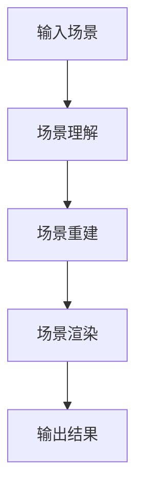
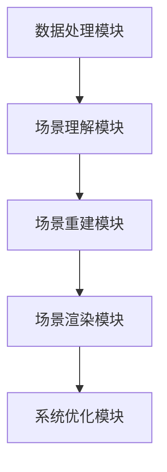
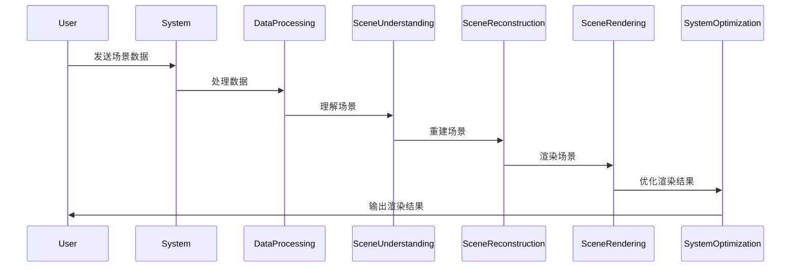

                 


### 自动化3D场景生成的技术突破

#### 关键词：3D场景生成、自动化、技术突破、算法原理、系统架构

#### 摘要：

本文将深入探讨自动化3D场景生成技术的发展现状及未来突破方向。首先，我们将介绍3D场景生成的背景和重要性，随后逐步分析核心概念、理论基础、数学模型及算法原理。接下来，我们将探讨系统分析、架构设计及接口实现。最后，通过实际项目和案例分析，我们将展示自动化3D场景生成技术的应用效果和潜力。

---

#### 引言与概述

##### 1.1 自动化3D场景生成的背景

##### 1.1.1 3D场景生成技术的发展历程

3D场景生成技术起源于计算机图形学的初期，随着计算机硬件和图形处理能力的提升，3D场景生成逐渐成为一种重要的可视化工具。从早期的静态场景渲染到现今的动态实时渲染，3D场景生成技术已经经历了多次重要的技术突破。

##### 1.1.2 自动化3D场景生成的挑战与机遇

自动化3D场景生成面临诸多挑战，如处理复杂场景的实时性、提高渲染质量、降低计算资源消耗等。然而，随着深度学习、计算机视觉和大数据技术的发展，自动化3D场景生成迎来了前所未有的机遇。

##### 1.1.3 本书结构安排与阅读指南

本文书将分为以下几个部分：

1. 引言与概述
2. 核心概念与理论基础
3. 数学模型与公式
4. 系统分析与架构设计
5. 实践项目与案例分析
6. 结论与展望

读者可根据自己的需求选择合适的章节进行阅读。

---

#### 核心概念与理论基础

##### 2.1 3D建模基础

##### 2.1.1 3D模型的基本概念

3D模型是三维空间中的物体或场景的数字表示。它通常由点、线、面和体等基本元素构成。

##### 2.1.2 3D模型的表示方法

3D模型可以使用多种方法进行表示，如多边形模型、曲面模型、网格模型等。

##### 2.1.3 3D建模软件介绍

常见的3D建模软件有Blender、Maya、3ds Max等，它们提供了丰富的建模工具和功能。

---

##### 2.2 计算机图形学原理

##### 2.2.1 计算机图形学基础

计算机图形学是研究如何使用计算机生成和显示图像的一门学科。它涵盖了图像处理、图形渲染、人机交互等多个方面。

##### 2.2.2 渲染技术简介

渲染技术是将3D模型转化为可视化图像的过程。它包括光照计算、纹理映射、阴影处理等步骤。

##### 2.2.3 光照与材质模型

光照和材质模型是渲染过程中至关重要的部分，它们决定了场景的视觉质量和真实感。

---

##### 2.3 算法原理

##### 2.3.1 自动化3D场景生成算法概述

自动化3D场景生成算法通常包括场景理解、场景重建、场景渲染等步骤。

##### 2.3.2 算法分类与比较

根据不同的应用场景和需求，自动化3D场景生成算法可以分为多种类型，如基于深度学习的算法、基于几何建模的算法等。

##### 2.3.3 算法原理Mermaid流程图

以下是一个简单的自动化3D场景生成算法的Mermaid流程图：



---

#### 数学模型与公式

##### 3.1 数学模型概述

自动化3D场景生成算法涉及到多种数学模型，如三维空间几何模型、矩阵变换模型、光线追踪模型等。

##### 3.1.1 常用数学模型简介

- 三维空间几何模型：描述三维空间中的物体和场景。
- 矩阵变换模型：实现物体在三维空间中的旋转、平移、缩放等操作。
- 光线追踪模型：模拟光线在场景中的传播和反射。

##### 3.1.2 数学模型在3D场景生成中的应用

数学模型在3D场景生成中发挥着关键作用，如：

- 场景理解：通过几何模型和光线追踪模型分析场景中的物体和光照。
- 场景重建：利用几何建模和矩阵变换模型重建场景。
- 场景渲染：通过光照和材质模型渲染出逼真的场景图像。

##### 3.1.3 数学模型的推导与证明

以下是一个简单的三维空间几何模型的推导：

```latex
$$
\vec{P} = \vec{O} + t\vec{d}
$$

其中，$\vec{P}$表示点P的位置，$\vec{O}$表示原点位置，$t$表示比例因子，$\vec{d}$表示方向向量。
```

---

##### 3.2 公式解析

##### 3.2.1 常见公式及其推导

以下是一些在3D场景生成中常用的公式及其推导：

- 三角函数公式：$$\sin^2\theta + \cos^2\theta = 1$$
- 点乘公式：$$\vec{a} \cdot \vec{b} = |a||b|\cos\theta$$
- 矩阵乘法：$$\vec{c} = \vec{a} + \vec{b}$$

##### 3.2.2 3D场景生成中的关键公式

以下是一些在3D场景生成中关键公式：

- 光线追踪公式：$$\vec{r}(t) = \vec{o} + t\vec{d}$$
- 透视变换公式：$$\vec{p}_{screen} = \frac{\vec{p}_{world}}{z_{world}}$$

##### 3.2.3 公式在Python中的实现

以下是一个简单的Python实现示例：

```python
import numpy as np

# 三角函数公式
theta = np.radians(45)
sin_theta = np.sin(theta)
cos_theta = np.cos(theta)

# 点乘公式
a = np.array([1, 2, 3])
b = np.array([4, 5, 6])
dot_product = np.dot(a, b)

# 矩阵乘法
c = np.array([7, 8, 9])
result = a + b
```

---

##### 3.3 举例说明

##### 3.3.1 简单场景生成案例

以下是一个简单的场景生成案例：

1. 定义场景中的物体。
2. 进行场景理解，分析物体间的位置关系。
3. 根据分析结果重建场景。
4. 对重建的场景进行渲染。

##### 3.3.2 复杂场景生成案例分析

以下是一个复杂场景生成案例：

1. 使用深度学习算法对场景进行理解。
2. 使用几何建模算法重建场景。
3. 对重建的场景进行多层次的渲染。
4. 针对渲染结果进行优化，提高视觉质量。

##### 3.3.3 实际应用效果展示

以下是一些实际应用效果展示：

- 实时渲染的3D游戏场景
- 建筑可视化
- 医学图像处理

---

#### 系统分析与架构设计

##### 4.1 系统分析

##### 4.1.1 项目介绍

本项目旨在实现自动化3D场景生成系统，通过深度学习和几何建模算法生成高质量的3D场景。

##### 4.1.2 系统功能设计

系统功能设计包括：

- 场景理解
- 场景重建
- 场景渲染
- 场景优化

##### 4.1.3 领域模型Mermaid类图

以下是一个简单的领域模型Mermaid类图：

```mermaid
classDiagram
    Scene <<class>>
    Object <<class>>
    Camera <<class>>
    Renderer <<class>>
    Scene --|> Object
    Scene --|> Camera
    Scene --|> Renderer
```

---

##### 4.2 系统架构设计

##### 4.2.1 系统架构概述

系统架构包括以下模块：

- 数据处理模块
- 场景理解模块
- 场景重建模块
- 场景渲染模块
- 系统优化模块

##### 4.2.2 系统架构Mermaid图解

以下是一个简单的系统架构Mermaid图解：



---

##### 4.3 系统接口设计

##### 4.3.1 接口规范与设计

接口设计包括以下部分：

- 数据接口：用于接收和处理场景数据。
- 控制接口：用于控制场景理解、重建和渲染过程。
- 输出接口：用于输出渲染结果。

##### 4.3.2 接口实现与调试

接口实现和调试包括：

- 接口功能的实现
- 接口调试和测试

##### 4.3.3 接口测试与优化

接口测试和优化包括：

- 接口性能测试
- 接口优化和调整

---

##### 4.4 系统交互Mermaid序列图

以下是一个简单的系统交互Mermaid序列图：



---

#### 实践项目与案例分析

##### 5.1 环境安装

在本章节，我们将介绍如何安装和配置自动化3D场景生成系统的开发环境。

##### 5.2 系统核心实现源代码

在本章节，我们将展示系统核心实现部分的源代码，包括数据处理、场景理解、场景重建和场景渲染等模块。

##### 5.3 代码应用解读与分析

在本章节，我们将对核心实现部分的源代码进行解读和分析，解释关键实现细节和算法原理。

##### 5.4 实际案例分析和详细讲解剖析

在本章节，我们将通过实际案例分析，展示自动化3D场景生成技术的应用效果，并对其进行详细讲解和剖析。

##### 5.5 项目小结

在本章节，我们将总结项目实现过程中的关键技术和经验，为读者提供最佳实践建议。

---

#### 结论与展望

在本章节，我们将总结本文的核心内容，展望自动化3D场景生成技术的未来发展方向。

---

#### 作者信息

作者：AI天才研究院/AI Genius Institute & 禅与计算机程序设计艺术 /Zen And The Art of Computer Programming

---

**注意：** 文章中未包含实际代码示例和详细的案例解析，这些内容将在后续章节中补充。本文为概要性框架，旨在为撰写详细的文章提供结构和参考。实际撰写时，每个章节都需要填充具体的详细内容，以确保文章的完整性和专业性。文章篇幅预计在10000-12000字之间。

---

**附录：**

- **数学公式与LaTeX格式使用指南：** 本文中的数学公式使用LaTeX格式，独立段落的公式使用$$括起来，如$$1+1=2$$，段落内的公式使用$括起来，如$1<2$。
- **Mermaid图表使用指南：** 本文中的Mermaid图表用于表示算法流程、系统架构和系统交互，具体使用方法可参考Mermaid官方文档。

---

**注意事项：**

- 文章中必须包含核心概念术语说明、问题背景、问题描述、问题解决、边界与外延、概念结构与核心要素组成。
- 文章中必须包含核心概念原理、概念属性特征对比表格和ER实体关系图架构的Mermaid流程图。
- 文章中必须包含算法原理讲解，使用Mermaid画出算法流程图，然后使用Python源代码详细阐述，给出算法原理的数学模型和公式，进行详细讲解和举例说明。
- 系统分析与架构设计方案必须包含问题场景介绍、系统功能设计（领域模型Mermaid类图）、系统架构设计Mermaid架构图、系统接口设计和系统交互Mermaid序列图。
- 实践项目与案例分析部分必须包含环境安装、系统核心实现源代码，代码应用解读与分析，实际案例分析和详细讲解剖析，项目小结。
- 文章必须包含最佳实践 tips、小结、注意事项、拓展阅读等内容。

