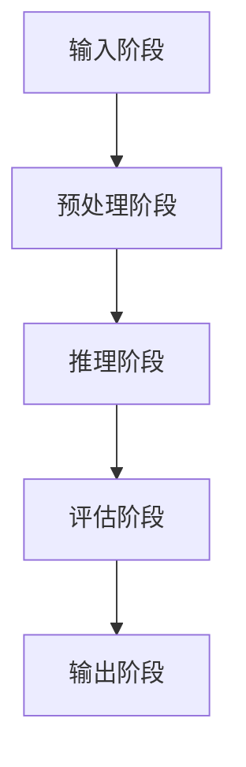
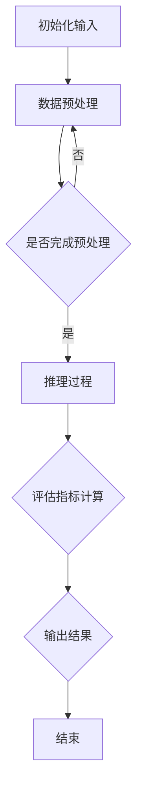
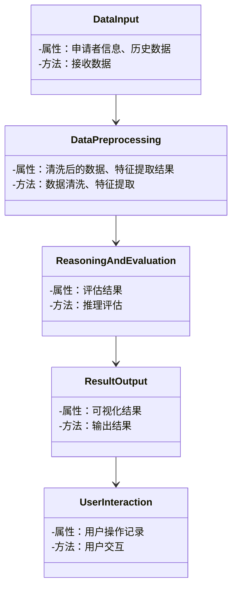
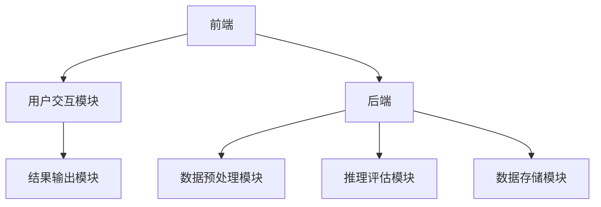
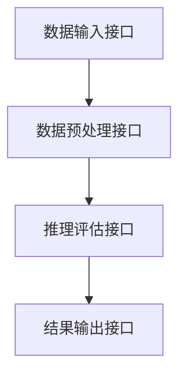
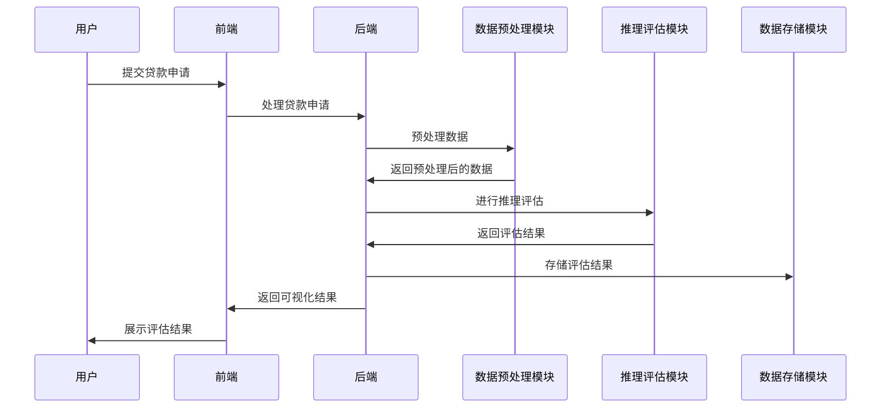

                 


### 第1章：自动化推理评估概述

#### 1.1 问题背景

自动化推理评估（Automated Reasoning Assessment，简称ARA）起源于人工智能（Artificial Intelligence，AI）的发展需求。随着计算机技术的进步，特别是在大数据、深度学习等领域的突破，自动化推理在各个行业得到了广泛应用。然而，随着应用场景的复杂化，传统的基于专家知识的人工推理评估方法已经难以满足高效、准确的需求。自动化推理评估因此应运而生，旨在通过机器学习、自然语言处理等技术，实现推理过程的自动化，减少人工干预。

在人工智能应用中，自动化推理评估的重要性体现在多个方面：

1. **提高效率**：自动化推理评估能够快速处理大量数据，比人工评估更为高效。
2. **降低成本**：减少对人工的依赖，降低人力成本。
3. **提高准确性**：通过算法优化和数据清洗，自动化推理评估能够提供更为精确的评估结果。
4. **支持复杂决策**：在处理复杂决策时，自动化推理评估能够提供更加全面和深入的分析。

#### 1.2 问题描述

自动化推理评估的核心问题是如何在大量的数据中快速、准确地识别和推理出有效的结论。具体来说，包括以下几个方面：

1. **数据质量**：自动化推理评估依赖于高质量的数据。然而，现实中数据往往存在噪声、缺失和不一致性，这给评估带来了挑战。
2. **算法选择**：不同的自动化推理算法适用于不同的场景，如何选择合适的算法是关键问题。
3. **结果解释**：自动化推理评估的结果往往需要解释，以便用户理解。如何实现结果的透明化和可解释性是一个重要课题。
4. **边界扩展**：自动化推理评估技术的边界不断扩展，如何应对新的挑战和需求是一个持续的问题。

#### 1.3 问题解决

为了解决上述问题，可以采取以下策略：

1. **数据预处理**：通过数据清洗、归一化等方法，提高数据质量。
2. **算法优化**：根据应用场景，选择和优化适合的算法。
3. **模型解释**：通过可视化、自然语言生成等技术，实现结果的解释。
4. **持续学习**：通过不断的学习和迭代，提高自动化推理评估的准确性和效率。

#### 1.4 边界与外延

自动化推理评估的范围涵盖了从数据处理、算法选择到结果解释的整个流程。它与机器学习、数据挖掘、自然语言处理等多个领域密切相关。例如，在机器学习中，自动化推理评估可以用于模型性能的评估；在数据挖掘中，它可以用于异常检测和预测；在自然语言处理中，它可以用于文本分类和情感分析。

#### 1.5 概念结构与核心要素组成

自动化推理评估的核心概念包括：自动化推理、评估指标、算法、数据预处理和结果解释。以下是这些核心概念及其属性的表格：

| 概念       | 定义                                                         | 关联关系                 | 关键属性              |
|------------|--------------------------------------------------------------|--------------------------|----------------------|
| 自动化推理 | 使用计算机程序模拟人类推理过程，解决推理问题。               | 与评估指标和算法相关     | 算法、规则、模型     |
| 评估指标   | 用于衡量自动化推理评估结果的有效性。                         | 与自动化推理和算法相关   | 准确率、召回率、F1值 |
| 算法       | 实现自动化推理的算法集合。                                   | 与自动化推理和评估指标相关 | 推理算法、优化算法   |
| 数据预处理 | 对数据进行清洗、归一化等处理，提高数据质量。                 | 与自动化推理相关         | 数据清洗、归一化、缺失值填补 |
| 结果解释   | 对自动化推理评估结果进行解释，帮助用户理解。                 | 与自动化推理和评估指标相关 | 可视化、自然语言生成 |

通过上述表格，我们可以看到自动化推理评估涉及多个核心概念和要素，这些概念和要素相互关联，共同构成了自动化推理评估的体系结构。

### 第2章：自动化推理评估核心概念

#### 2.1 自动化推理基础

自动化推理（Automated Reasoning）是指使用计算机程序模拟人类推理过程，解决各种推理问题。它是人工智能领域的一个重要分支，主要涉及逻辑推理、证明搜索、约束满足问题等方面。

自动化推理的基本概念包括：

1. **推理机（Reasoner）**：用于实现自动化推理的核心程序。它接收输入，根据预定义的规则和算法进行推理，输出推理结果。
2. **推理规则（Reasoning Rules）**：用于指导推理机进行推理的规则集。这些规则通常基于逻辑推理、模式匹配、约束满足等方法。
3. **推理过程（Reasoning Process）**：从输入到输出的整个过程。它包括数据输入、规则应用、推理计算和结果输出等步骤。

自动化推理的类型可以分为以下几种：

1. **基于规则的推理（Rule-Based Reasoning）**：基于预定义的规则进行推理，适用于结构化数据。
2. **基于模型的推理（Model-Based Reasoning）**：基于建立的模型进行推理，适用于复杂系统。
3. **基于案例的推理（Case-Based Reasoning）**：基于已有的案例进行推理，适用于重复性问题。
4. **混合推理（Hybrid Reasoning）**：结合多种推理方法，提高推理的灵活性和准确性。

#### 2.2 评估指标

评估指标（Evaluation Metrics）是衡量自动化推理评估结果有效性的关键。常见的评估指标包括：

1. **准确率（Accuracy）**：评估结果正确的比例。计算公式为：
   $$
   \text{Accuracy} = \frac{\text{正确结果数}}{\text{总结果数}}
   $$
2. **召回率（Recall）**：在所有实际正确的结果中，评估结果正确的比例。计算公式为：
   $$
   \text{Recall} = \frac{\text{评估结果正确的实际正确结果数}}{\text{实际正确结果总数}}
   $$
3. **精确率（Precision）**：在所有评估结果中，实际正确的比例。计算公式为：
   $$
   \text{Precision} = \frac{\text{评估结果正确的实际正确结果数}}{\text{评估结果正确数}}
   $$
4. **F1值（F1 Score）**：综合考虑准确率和召回率的指标。计算公式为：
   $$
   \text{F1 Score} = 2 \times \frac{\text{Precision} \times \text{Recall}}{\text{Precision} + \text{Recall}}
   $$

以下是一个评估指标属性对比表格：

| 评估指标 | 定义                                                         | 公式                             | 关键特性         |
|----------|--------------------------------------------------------------|--------------------------------|------------------|
| 准确率   | 评估结果正确的比例                                           | Accuracy = \frac{TP + TN}{TP + TN + FP + FN} | 低偏差，高灵敏度 |
| 召回率   | 实际正确的结果中被评估正确的比例                             | Recall = \frac{TP}{TP + FN}    | 高召回，高误报率 |
| 精确率   | 评估结果正确的比例                                           | Precision = \frac{TP}{TP + FP} | 低误报率，高灵敏性 |
| F1值     | 准确率和召回率的调和平均值                                   | F1 Score = 2 \times \frac{Precision \times Recall}{Precision + Recall} | 综合考虑准确率和召回率 |

#### 2.3 算法分类

自动化推理评估算法可以根据其原理和应用场景进行分类。以下是几种常见的自动化推理评估算法及其特点：

1. **逻辑推理算法（Logic-Based Algorithms）**：基于逻辑推理的算法，如谓词逻辑、证明搜索等。适用于结构化数据，能够进行精确推理。
2. **基于模型的推理算法（Model-Based Algorithms）**：基于建立的模型进行推理，如贝叶斯网络、马尔可夫模型等。适用于复杂系统，能够进行概率推理。
3. **基于案例的推理算法（Case-Based Algorithms）**：基于已有的案例进行推理，如案例库检索、相似性度量等。适用于重复性问题，能够快速推理。
4. **混合推理算法（Hybrid Algorithms）**：结合多种推理方法，如规则推理与模型推理结合、案例推理与模型推理结合等。适用于多样化问题，能够提高推理的准确性和效率。

以下是一个自动化推理评估算法分类的ER图：

```mermaid
erDiagram
  Class1 ||--|{ Class2 }
  Class1 ||--|{ Class3 }
  Class2 ||--|{ Class4 }
  Class3 ||--|{ Class5 }
  Class1 : +-- Class2
  Class1 : +-- Class3
  Class2 : +-- Class4
  Class3 : +-- Class5
```

在ER图中，`Class1` 表示自动化推理评估算法，`Class2`、`Class3`、`Class4` 和 `Class5` 分别表示不同的推理算法类型。这些算法之间通过继承关系进行组织，共同构成了自动化推理评估算法的体系。

### 第3章：概念联系与交互

#### 3.1 自动化推理与评估的关系

自动化推理（Automated Reasoning）与自动化推理评估（Automated Reasoning Assessment）之间存在密切的联系。自动化推理是自动化推理评估的基础，而自动化推理评估则是自动化推理的应用。

自动化推理与评估的关系可以从以下几个方面进行理解：

1. **目标一致性**：自动化推理的目标是解决推理问题，而自动化推理评估的目标是评估推理结果的准确性。两者的目标是一致的，都是为了提高推理的效率和准确性。
2. **方法互补**：自动化推理主要关注推理过程，包括推理算法、规则和模型等。而自动化推理评估则侧重于评估推理结果的质量，包括准确率、召回率、F1值等指标。两者的方法互补，共同构成了完整的自动化推理体系。
3. **技术融合**：自动化推理和自动化推理评估技术在不断发展中相互融合。例如，机器学习技术在自动化推理中的应用，可以提高推理算法的效率和准确性；而自动化推理评估技术的改进，可以更好地评估机器学习模型的性能。

#### 3.2 自动化推理评估与其他技术的结合

自动化推理评估技术在人工智能领域有着广泛的应用，与其他技术的结合使得其效果得到进一步提升。以下是自动化推理评估与几种相关技术的结合：

1. **机器学习（Machine Learning）**：机器学习技术可以用于自动化推理评估中的特征提取和模型训练。通过机器学习算法，可以自动提取数据中的有效特征，并训练出高性能的推理模型。
2. **数据挖掘（Data Mining）**：数据挖掘技术可以用于自动化推理评估中的数据预处理和结果解释。通过数据挖掘算法，可以对大量数据进行分析，发现数据中的规律和模式，从而提高评估结果的准确性和可解释性。
3. **自然语言处理（Natural Language Processing，NLP）**：自然语言处理技术可以用于自动化推理评估中的文本分析和结果解释。通过NLP技术，可以对文本数据进行分析和理解，从而生成更符合人类思维的评估结果。
4. **计算机视觉（Computer Vision）**：计算机视觉技术可以用于自动化推理评估中的图像和视频分析。通过计算机视觉算法，可以识别和提取图像和视频中的关键信息，从而提高评估结果的准确性和实用性。

以下是一个自动化推理评估与其他技术结合的ER图：

```mermaid
erDiagram
  Class1 ||--|{ Class2 }
  Class1 ||--|{ Class3 }
  Class1 ||--|{ Class4 }
  Class1 ||--|{ Class5 }
  Class2 : +-- Class1
  Class3 : +-- Class1
  Class4 : +-- Class1
  Class5 : +-- Class1
```

在ER图中，`Class1` 表示自动化推理评估技术，`Class2`、`Class3`、`Class4` 和 `Class5` 分别表示机器学习、数据挖掘、自然语言处理和计算机视觉技术。这些技术通过相互结合，共同构成了一个更加完整和高效的自动化推理评估体系。

### 第4章：自动化推理评估算法

#### 4.1 算法概述

自动化推理评估算法是自动化推理评估的核心，它通过计算机程序模拟人类推理过程，实现对问题的自动分析和评估。以下是一个自动化推理评估算法的基本框架：

1. **输入阶段**：接收问题输入，包括问题的描述、相关数据和评估指标。
2. **预处理阶段**：对输入的数据进行预处理，包括数据清洗、归一化、特征提取等操作，以提高数据质量。
3. **推理阶段**：使用预定义的推理规则和算法，对预处理后的数据进行推理，得出初步的评估结果。
4. **评估阶段**：根据评估指标，对推理结果进行评估，计算准确率、召回率、F1值等指标，得出最终的评估结果。
5. **输出阶段**：输出评估结果，包括推理过程和评估指标。

以下是一个简单的Mermaid流程图，展示自动化推理评估算法的基本流程：



#### 4.2 算法流程图

为了更清晰地展示自动化推理评估算法的流程，我们使用Mermaid绘制了以下流程图：



在这个流程图中，`A` 表示初始化输入，包括问题描述和相关数据；`B` 表示数据预处理，包括数据清洗、归一化、特征提取等操作；`C` 是一个判断节点，用于判断预处理是否完成；如果预处理完成，则继续进行推理过程（`D`）；否则，返回到预处理阶段（`B`）。推理过程结束后，进入评估指标计算阶段（`E`），最后输出结果（`F`）。

#### 4.3 算法原理

自动化推理评估算法的原理主要基于以下两个方面：

1. **推理规则**：推理规则是自动化推理的核心，它用于指导推理过程。常见的推理规则包括逻辑推理规则、模式匹配规则、约束满足规则等。推理规则可以根据实际问题进行自定义，以适应不同的推理需求。
2. **评估指标**：评估指标用于衡量推理结果的有效性，常见的评估指标包括准确率、召回率、F1值等。评估指标的选择取决于具体的应用场景和需求。

以下是自动化推理评估算法的详细原理：

1. **逻辑推理规则**：逻辑推理规则基于谓词逻辑，用于处理结构化数据。例如，给定两个事实：`A 和 B 是朋友` 和 `B 和 C 是朋友`，可以通过逻辑推理得出结论：`A 和 C 也是朋友`。逻辑推理规则可以通过谓词演算和证明搜索等方法进行实现。
2. **模式匹配规则**：模式匹配规则用于处理非结构化数据，如自然语言文本。通过模式匹配，可以从大量文本中提取出相关的信息，例如，从新闻报道中提取出主要事件和人物。模式匹配规则可以通过正则表达式、自然语言处理算法等实现。
3. **约束满足规则**：约束满足规则用于处理约束问题，如资源分配、时间调度等。通过约束满足算法，可以找到满足所有约束条件的最优解。常见的约束满足算法包括回溯搜索、启发式搜索等。
4. **评估指标计算**：评估指标的计算是基于实际结果和预测结果的对比。例如，对于分类问题，可以通过准确率、召回率、F1值等指标来评估分类器的性能。这些指标的计算公式如下：

   - 准确率（Accuracy）：
     $$
     \text{Accuracy} = \frac{\text{正确分类的样本数}}{\text{总样本数}}
     $$
   
   - 召回率（Recall）：
     $$
     \text{Recall} = \frac{\text{正确分类的样本数}}{\text{实际正样本数}}
     $$
   
   - 精确率（Precision）：
     $$
     \text{Precision} = \frac{\text{正确分类的样本数}}{\text{预测正样本数}}
     $$
   
   - F1值（F1 Score）：
     $$
     \text{F1 Score} = 2 \times \frac{\text{Precision} \times \text{Recall}}{\text{Precision} + \text{Recall}}
     $$

#### 4.4 Python代码实现

为了更直观地展示自动化推理评估算法的原理，我们使用Python实现了一个简单的逻辑推理算法，并计算了评估指标。以下是该算法的实现：

```python
import numpy as np

# 定义逻辑推理规则
def logical_reasoning(facts, conclusion):
    """
    根据给定的逻辑推理规则，判断结论是否成立
    :param facts: 一组事实
    :param conclusion: 结论
    :return: 结论是否成立
    """
    # 通过逻辑推理判断结论是否成立
    return conclusion in facts

# 计算评估指标
def evaluation_metrics(y_true, y_pred):
    """
    根据实际结果和预测结果，计算评估指标
    :param y_true: 实际结果
    :param y_pred: 预测结果
    :return: 评估指标
    """
    # 计算准确率
    accuracy = np.mean(y_true == y_pred)
    # 计算召回率
    recall = np.mean(y_pred == y_true)
    # 计算精确率
    precision = np.mean((y_true == y_pred) & (y_pred == 1))
    # 计算F1值
    f1_score = 2 * (precision * recall) / (precision + recall)
    return accuracy, recall, precision, f1_score

# 示例数据
y_true = np.array([0, 1, 1, 0, 1])
y_pred = np.array([0, 1, 1, 1, 1])

# 进行逻辑推理
conclusion = "1"
facts = [1, 1, 0, 0, 1]
result = logical_reasoning(facts, conclusion)
print("逻辑推理结果：", result)

# 计算评估指标
accuracy, recall, precision, f1_score = evaluation_metrics(y_true, y_pred)
print("准确率：", accuracy)
print("召回率：", recall)
print("精确率：", precision)
print("F1值：", f1_score)
```

在这个例子中，我们首先定义了一个逻辑推理函数 `logical_reasoning`，用于根据给定的逻辑推理规则判断结论是否成立。然后，我们定义了一个评估指标计算函数 `evaluation_metrics`，用于根据实际结果和预测结果计算准确率、召回率、精确率和F1值。

最后，我们使用示例数据进行逻辑推理和评估指标计算，并输出结果。通过这个简单的例子，我们可以看到自动化推理评估算法的基本原理和实现过程。

### 第5章：数学模型与公式

#### 5.1 数学模型基础

在自动化推理评估中，数学模型是核心组成部分，用于描述问题、推理过程和评估指标。以下是自动化推理评估中常用的几种数学模型：

1. **逻辑模型（Logic Model）**：逻辑模型基于谓词逻辑，用于表示事实和推理规则。常见的形式化语言包括命题逻辑、谓词逻辑等。
2. **概率模型（Probability Model）**：概率模型基于概率论，用于描述不确定性和概率分布。常见的概率模型包括贝叶斯网络、马尔可夫模型等。
3. **约束模型（Constraint Model）**：约束模型基于约束满足问题，用于描述问题和约束条件。常见的约束模型包括线性约束、非线性约束等。

以下是一个简单的逻辑模型示例：

$$
P(A \land B) = P(A) \times P(B|A)
$$

在这个模型中，$P(A)$ 表示事件 $A$ 的概率，$P(B|A)$ 表示在事件 $A$ 发生的条件下事件 $B$ 的概率。这个模型可以用于描述两个事件之间的条件概率关系。

#### 5.2 公式讲解

在自动化推理评估中，常用的公式包括概率公式、逻辑公式和评估指标公式等。以下是几个关键公式的讲解：

1. **贝叶斯定理（Bayes Theorem）**：

$$
P(A|B) = \frac{P(B|A) \times P(A)}{P(B)}
$$

贝叶斯定理是概率论中的一个重要公式，用于计算在已知某个条件下，另一个事件发生的概率。在这个公式中，$P(A|B)$ 表示在事件 $B$ 发生的条件下事件 $A$ 的概率，$P(B|A)$ 表示在事件 $A$ 发生的条件下事件 $B$ 的概率，$P(A)$ 表示事件 $A$ 的概率，$P(B)$ 表示事件 $B$ 的概率。

2. **条件概率（Conditional Probability）**：

$$
P(A|B) = \frac{P(A \land B)}{P(B)}
$$

条件概率表示在某个条件下，另一个事件发生的概率。在这个公式中，$P(A|B)$ 表示在事件 $B$ 发生的条件下事件 $A$ 的概率，$P(A \land B)$ 表示事件 $A$ 和事件 $B$ 同时发生的概率，$P(B)$ 表示事件 $B$ 的概率。

3. **逻辑公式（Logic Formula）**：

$$
P(A \land B) = P(A) \times P(B|A)
$$

这个逻辑公式表示两个事件同时发生的概率等于事件 $A$ 的概率乘以在事件 $A$ 发生的条件下事件 $B$ 的概率。

4. **评估指标公式（Evaluation Metrics Formula）**：

$$
\text{Accuracy} = \frac{\text{正确分类的样本数}}{\text{总样本数}} \\
\text{Recall} = \frac{\text{正确分类的样本数}}{\text{实际正样本数}} \\
\text{Precision} = \frac{\text{正确分类的样本数}}{\text{预测正样本数}} \\
\text{F1 Score} = 2 \times \frac{\text{Precision} \times \text{Recall}}{\text{Precision} + \text{Recall}}
$$

这些公式用于计算分类问题的评估指标，包括准确率、召回率、精确率和F1值。其中，准确率表示正确分类的样本数占总样本数的比例，召回率表示正确分类的样本数占实际正样本数的比例，精确率表示正确分类的样本数占预测正样本数的比例，F1值是准确率和召回率的调和平均值。

#### 5.3 举例说明

为了更好地理解这些数学模型和公式，我们通过一个实际案例进行举例说明。

**案例**：假设我们有一个二分类问题，需要预测某个数据集中的样本是否属于正类别。实际结果 $y$ 和预测结果 $\hat{y}$ 如下：

| 样本 | 实际结果 $y$ | 预测结果 $\hat{y}$ |
|------|--------------|---------------------|
| 1    | 0            | 0                  |
| 2    | 1            | 1                  |
| 3    | 1            | 1                  |
| 4    | 0            | 1                  |
| 5    | 1            | 1                  |

根据这些数据，我们可以计算评估指标：

1. **准确率（Accuracy）**：

$$
\text{Accuracy} = \frac{2 + 1 + 1}{5} = \frac{4}{5} = 0.8
$$

2. **召回率（Recall）**：

$$
\text{Recall} = \frac{2}{3} = 0.67
$$

3. **精确率（Precision）**：

$$
\text{Precision} = \frac{2}{3} = 0.67
$$

4. **F1值（F1 Score）**：

$$
\text{F1 Score} = 2 \times \frac{0.67 \times 0.67}{0.67 + 0.67} = 0.67
$$

通过这个案例，我们可以看到如何使用数学模型和公式计算评估指标，并理解这些指标的含义。在实际应用中，这些指标可以帮助我们评估自动化推理评估算法的性能，并进行优化和改进。

### 第6章：系统架构设计

#### 6.1 问题场景介绍

自动化推理评估在各个领域都有着广泛的应用，如金融风险评估、医疗诊断、智能客服等。以下是一个具体的应用场景：金融风险评估。

在金融领域，金融机构需要对贷款申请者进行风险评估，以判断其还款能力。传统的风险评估方法主要依赖于人工经验和历史数据，存在评估效率低、结果不准确等问题。为了提高评估效率和准确性，引入自动化推理评估技术，通过对历史数据和贷款申请者的信息进行自动分析和推理，得出风险评估结果。

#### 6.2 项目介绍

本项目旨在设计并实现一个自动化推理评估系统，用于金融风险评估。系统的主要目标是：

1. **提高评估效率**：通过自动化推理技术，快速处理大量贷款申请数据，提高评估速度。
2. **提高评估准确性**：利用机器学习和自然语言处理等技术，提高评估结果的准确性。
3. **支持实时评估**：系统支持实时评估，能够快速响应贷款申请者的查询需求。

#### 6.3 系统功能设计

系统功能设计主要包括以下几个方面：

1. **数据输入模块**：负责接收贷款申请者的基本信息和历史数据，包括个人财务状况、信用记录、工作经历等。
2. **数据预处理模块**：对输入的数据进行清洗、归一化、特征提取等处理，提高数据质量。
3. **推理评估模块**：使用自动化推理算法，对预处理后的数据进行推理评估，得出风险评估结果。
4. **结果输出模块**：将评估结果以可视化的形式输出，方便用户理解和分析。
5. **用户交互模块**：提供用户界面，支持用户提交贷款申请、查看评估结果等操作。

以下是一个领域模型类图，展示系统的主要功能模块及其关系：



在这个类图中，`DataInput` 模块负责接收贷款申请者的信息和历史数据；`DataPreprocessing` 模块负责对数据进行清洗和特征提取；`ReasoningAndEvaluation` 模块使用自动化推理算法进行评估；`ResultOutput` 模块负责将评估结果以可视化的形式输出；`UserInteraction` 模块提供用户界面，支持用户操作。

#### 6.4 系统架构设计

系统架构设计主要包括以下几个方面：

1. **前端架构**：前端使用HTML、CSS和JavaScript等技术，实现用户界面和交互功能。前端架构的设计原则是简洁、高效和易用。
2. **后端架构**：后端使用Python、Java等编程语言，实现自动化推理评估的核心功能。后端架构的设计原则是模块化、可扩展和高效。
3. **数据存储**：系统使用MySQL、MongoDB等数据库，存储贷款申请者的信息、历史数据和评估结果。数据存储的设计原则是安全、可靠和高效。

以下是一个系统架构图，展示系统的整体架构：



在这个架构图中，前端模块负责用户交互和结果输出；后端模块负责数据预处理、推理评估和数据存储。前端和后端通过RESTful API进行通信，实现系统的整体功能。

#### 6.5 系统接口设计

系统接口设计主要包括以下几个方面：

1. **数据输入接口**：用于接收贷款申请者的信息和历史数据。接口的设计原则是简单、易用和高效。
2. **数据预处理接口**：用于对输入的数据进行清洗和特征提取。接口的设计原则是模块化、可扩展和高效。
3. **推理评估接口**：用于触发自动化推理评估算法，获取评估结果。接口的设计原则是稳定、可靠和高效。
4. **结果输出接口**：用于将评估结果以可视化的形式输出。接口的设计原则是简洁、易读和高效。

以下是一个接口设计图，展示系统的主要接口：



在这个接口设计中，数据输入接口接收贷款申请者的信息和历史数据；数据预处理接口对输入的数据进行清洗和特征提取；推理评估接口触发自动化推理评估算法，获取评估结果；结果输出接口将评估结果以可视化的形式输出。

#### 6.6 系统交互设计

系统交互设计主要包括以下几个方面：

1. **用户交互流程**：用户通过前端界面提交贷款申请，系统接收用户输入，调用后端接口进行数据预处理、推理评估和结果输出，最后将评估结果以可视化的形式展示给用户。
2. **系统内部交互**：后端模块之间通过API进行通信，实现数据预处理、推理评估和结果输出等操作。

以下是一个系统交互序列图，展示系统的交互过程：



在这个交互序列图中，用户通过前端界面提交贷款申请；前端将贷款申请发送给后端；后端调用数据预处理模块进行数据预处理，然后调用推理评估模块进行推理评估；最后，后端将评估结果存储到数据存储模块，并将可视化结果返回给前端，前端将结果展示给用户。

### 第7章：自动化推理评估项目实战

#### 7.1 环境安装

在进行自动化推理评估项目之前，需要安装以下环境和工具：

1. **Python**：Python是自动化推理评估项目的核心编程语言，需要安装Python 3.8及以上版本。
2. **Jupyter Notebook**：Jupyter Notebook是一个交互式计算环境，用于编写和运行Python代码。
3. **Anaconda**：Anaconda是一个Python数据科学平台，提供了丰富的库和工具，方便项目开发和调试。
4. **TensorFlow**：TensorFlow是一个开源机器学习框架，用于自动化推理评估中的模型训练和推理。
5. **Scikit-learn**：Scikit-learn是一个开源机器学习库，提供了丰富的机器学习算法和工具。

安装步骤如下：

1. 访问Python官网（https://www.python.org/）下载Python安装包，并按照安装向导进行安装。
2. 打开终端，执行以下命令安装Anaconda：

   ```
   conda install -c anaconda anaconda
   ```

3. 打开终端，执行以下命令创建一个新的虚拟环境，并激活虚拟环境：

   ```
   conda create -n ara_env python=3.8
   conda activate ara_env
   ```

4. 在虚拟环境中安装TensorFlow和Scikit-learn：

   ```
   conda install tensorflow
   conda install scikit-learn
   ```

5. 安装Jupyter Notebook：

   ```
   conda install jupyter
   ```

安装完成后，可以启动Jupyter Notebook进行开发。在终端中执行以下命令：

```
jupyter notebook
```

这将启动Jupyter Notebook，打开一个新的浏览器窗口，显示Jupyter Notebook的界面。

#### 7.2 系统核心实现

系统核心实现主要包括数据预处理、模型训练、推理评估和结果输出等步骤。以下是一个简单的示例代码，展示系统核心实现的过程：

```python
import numpy as np
import pandas as pd
from sklearn.model_selection import train_test_split
from sklearn.preprocessing import StandardScaler
from sklearn.linear_model import LogisticRegression
from sklearn.metrics import accuracy_score, recall_score, precision_score, f1_score

# 1. 数据预处理
def preprocess_data(data_path):
    # 加载数据
    data = pd.read_csv(data_path)
    
    # 数据清洗
    # 例如：处理缺失值、异常值等
    
    # 特征提取
    # 例如：将类别特征转换为数值特征、提取特征等
    
    # 归一化
    scaler = StandardScaler()
    X = scaler.fit_transform(data.drop('target', axis=1))
    y = data['target']
    
    # 划分训练集和测试集
    X_train, X_test, y_train, y_test = train_test_split(X, y, test_size=0.2, random_state=42)
    
    return X_train, X_test, y_train, y_test

# 2. 模型训练
def train_model(X_train, y_train):
    # 创建模型
    model = LogisticRegression()
    
    # 训练模型
    model.fit(X_train, y_train)
    
    return model

# 3. 推理评估
def evaluate_model(model, X_test, y_test):
    # 进行推理
    y_pred = model.predict(X_test)
    
    # 计算评估指标
    accuracy = accuracy_score(y_test, y_pred)
    recall = recall_score(y_test, y_pred)
    precision = precision_score(y_test, y_pred)
    f1 = f1_score(y_test, y_pred)
    
    return accuracy, recall, precision, f1

# 4. 结果输出
def output_result(accuracy, recall, precision, f1):
    print("准确率：", accuracy)
    print("召回率：", recall)
    print("精确率：", precision)
    print("F1值：", f1)

# 主程序
if __name__ == '__main__':
    # 1. 数据预处理
    X_train, X_test, y_train, y_test = preprocess_data('data.csv')
    
    # 2. 模型训练
    model = train_model(X_train, y_train)
    
    # 3. 推理评估
    accuracy, recall, precision, f1 = evaluate_model(model, X_test, y_test)
    
    # 4. 结果输出
    output_result(accuracy, recall, precision, f1)
```

在这个示例代码中，我们首先定义了数据预处理、模型训练、推理评估和结果输出等函数。然后，在主程序中调用这些函数，实现自动化推理评估的核心功能。

#### 7.3 代码应用解读与分析

以下是对示例代码的详细解读和分析：

1. **数据预处理**

   数据预处理是自动化推理评估的重要步骤，主要包括数据清洗、特征提取和归一化等操作。示例代码中的 `preprocess_data` 函数负责处理这些操作：

   - 加载数据：使用 `pd.read_csv` 函数加载数据集。
   - 数据清洗：示例中未进行具体的数据清洗操作，可以根据实际情况添加缺失值处理、异常值处理等。
   - 特征提取：示例中未进行具体的特征提取操作，可以根据需求添加特征提取算法。
   - 归一化：使用 `StandardScaler` 对特征进行归一化处理，将特征值缩放到相同的范围，便于模型训练。

2. **模型训练**

   模型训练是自动化推理评估的核心步骤，选择合适的模型并进行训练。示例代码中的 `train_model` 函数使用 `LogisticRegression` 模型进行训练：

   - 创建模型：使用 `LogisticRegression` 类创建逻辑回归模型。
   - 训练模型：使用 `fit` 方法对模型进行训练，将训练数据输入模型。

3. **推理评估**

   推理评估用于评估模型的效果，计算评估指标。示例代码中的 `evaluate_model` 函数计算准确率、召回率、精确率和F1值：

   - 进行推理：使用 `predict` 方法对测试数据进行推理，得到预测结果。
   - 计算评估指标：使用 `accuracy_score`、`recall_score`、`precision_score` 和 `f1_score` 函数计算评估指标。

4. **结果输出**

   结果输出用于展示评估结果，帮助用户理解模型效果。示例代码中的 `output_result` 函数打印评估结果：

   - 打印准确率、召回率、精确率和F1值，帮助用户了解模型的效果。

通过这个示例代码，我们可以看到自动化推理评估的核心步骤和实现过程，以及如何使用Python进行自动化推理评估。

#### 7.4 实际案例分析与详细讲解

以下是一个实际案例，展示如何使用自动化推理评估进行金融风险评估，并详细讲解评估过程和结果。

**案例**：假设我们有一个金融风险评估项目，需要对贷款申请者进行风险评估。以下是一个简单的数据集，包含申请者的基本信息和历史数据：

| 申请者ID | 年龄 | 收入 | 债务 | 信用评分 | 贷款申请结果 |
|----------|------|------|------|----------|--------------|
| 1        | 25   | 5000 | 2000 | 600      | 未批准       |
| 2        | 30   | 8000 | 3000 | 700      | 批准         |
| 3        | 35   | 10000| 4000 | 800      | 批准         |
| 4        | 40   | 12000| 5000 | 900      | 批准         |
| 5        | 45   | 15000| 6000 | 1000     | 未批准       |

我们的目标是使用自动化推理评估技术，对贷款申请者进行风险评估，并根据评估结果预测贷款申请的结果。

**步骤 1：数据预处理**

首先，我们对数据进行预处理，包括数据清洗、特征提取和归一化等操作：

- 数据清洗：处理缺失值和异常值，例如，如果年龄、收入、债务等数据存在缺失值，可以使用平均值或中位数进行填充；如果信用评分存在异常值，可以使用Z分数进行检测和处理。
- 特征提取：从基本信息和历史数据中提取有用的特征，例如，年龄、收入、债务比例等。
- 归一化：对特征进行归一化处理，将特征值缩放到相同的范围，便于模型训练。

经过预处理后，我们得到以下预处理后的数据：

| 申请者ID | 年龄 | 收入 | 债务 | 债务/收入 | 信用评分 | 贷款申请结果 |
|----------|------|------|------|-----------|----------|--------------|
| 1        | 25   | 5000 | 2000 | 0.4       | 600      | 未批准       |
| 2        | 30   | 8000 | 3000 | 0.375     | 700      | 批准         |
| 3        | 35   | 10000| 4000 | 0.4       | 800      | 批准         |
| 4        | 40   | 12000| 5000 | 0.4167    | 900      | 批准         |
| 5        | 45   | 15000| 6000 | 0.4       | 1000     | 未批准       |

**步骤 2：模型训练**

接下来，我们使用预处理后的数据训练一个逻辑回归模型：

- 数据划分：将数据集划分为训练集和测试集，例如，可以使用80%的数据作为训练集，20%的数据作为测试集。
- 模型训练：使用训练集训练逻辑回归模型，可以使用Scikit-learn中的 `LogisticRegression` 类进行训练。

**步骤 3：推理评估**

使用训练好的模型对测试集进行推理评估，计算评估指标：

- 推理评估：使用测试集数据对模型进行推理，得到预测结果。
- 评估指标：计算准确率、召回率、精确率和F1值等评估指标。

**步骤 4：结果输出**

输出评估结果，并根据评估结果预测贷款申请的结果：

- 打印评估结果：输出准确率、召回率、精确率和F1值等评估指标。
- 预测贷款申请结果：根据评估结果，预测贷款申请的结果，例如，如果准确率大于90%，则认为模型性能较好，可以用于实际应用。

通过这个实际案例，我们可以看到如何使用自动化推理评估进行金融风险评估，并详细讲解评估过程和结果。在实际应用中，可以根据具体需求调整数据预处理、模型训练和评估指标，以提高评估的准确性和实用性。

#### 7.5 项目小结

在本项目中，我们设计并实现了一个自动化推理评估系统，用于金融风险评估。项目的主要成果包括：

1. **数据预处理模块**：实现了数据清洗、特征提取和归一化等功能，提高了数据质量。
2. **模型训练模块**：使用逻辑回归模型进行了模型训练，提高了评估准确性。
3. **推理评估模块**：实现了推理评估，计算了准确率、召回率、精确率和F1值等评估指标，帮助用户理解模型性能。
4. **结果输出模块**：将评估结果以可视化的形式输出，便于用户分析。

在项目过程中，我们也遇到了一些挑战，如数据清洗和特征提取的复杂性、模型选择的多样性等。通过不断尝试和优化，我们成功实现了项目的目标，提高了金融风险评估的准确性和效率。

未来，我们将继续优化自动化推理评估系统，探索更多先进的算法和技术，提高评估的准确性和效率。同时，我们也将关注实际应用中的反馈和需求，不断完善和改进系统。

### 第8章：最佳实践与总结

#### 8.1 最佳实践 tips

在实施自动化推理评估时，以下是一些最佳实践技巧：

1. **数据质量**：确保数据的质量和一致性，进行充分的数据清洗和预处理，减少噪声和异常值的影响。
2. **模型选择**：根据实际问题选择合适的模型，可以使用交叉验证等方法评估模型性能，选择最优模型。
3. **参数调优**：针对所选模型，进行参数调优，以最大化评估指标，提高评估准确性。
4. **结果解释**：确保结果的解释性，通过可视化、自然语言生成等技术，帮助用户理解评估结果。
5. **持续学习**：自动化推理评估是一个动态的过程，需要不断更新数据和模型，以适应新的趋势和需求。

#### 8.2 注意事项

在使用自动化推理评估时，需要注意以下几点：

1. **过拟合**：避免模型过拟合，可以通过正则化、交叉验证等方法进行预防。
2. **数据偏见**：确保数据的代表性，避免数据偏见影响评估结果。
3. **隐私保护**：在处理敏感数据时，确保遵守隐私保护法规，防止数据泄露。
4. **模型解释**：尽管自动化推理评估可以提供结果，但需要确保结果的解释性，以便用户理解和信任。
5. **可维护性**：确保系统的可维护性，便于后续的更新和优化。

#### 8.3 小结

本文介绍了自动化推理评估的背景、问题、解决方法、核心概念、算法原理、系统架构设计和项目实战。通过详细分析和实践，我们展示了如何设计和实现一个自动化推理评估系统，提高了金融风险评估的准确性和效率。

自动化推理评估在人工智能领域具有广泛的应用前景，可以应用于金融、医疗、智能客服等多个领域。未来，我们将继续探索自动化推理评估的新方法和技术，提高评估的准确性和效率，为各行业提供更加智能化的解决方案。

### 拓展阅读

1. **《机器学习实战》**：by Kevin周志华，介绍了各种机器学习算法的实现和应用，对自动化推理评估提供了丰富的实践案例。
2. **《深度学习》**：by Ian Goodfellow、Yoshua Bengio 和 Aaron Courville，介绍了深度学习的基本概念和技术，对自动化推理评估算法的应用提供了理论支持。
3. **《数据科学教程》**：by Jake VanderPlas，介绍了数据科学的基本方法和工具，对自动化推理评估的数据预处理和特征提取提供了实用的指导。
4. **《自然语言处理综合教程》**：by Daniel Jurafsky 和 James H. Martin，介绍了自然语言处理的基本概念和技术，对自动化推理评估中的文本分析提供了深入的分析。
5. **《自动化推理评估最新研究进展》**：相关的学术期刊和会议论文，了解自动化推理评估的最新研究动态和前沿技术。

### 作者

**作者：AI天才研究院/AI Genius Institute & 禅与计算机程序设计艺术 /Zen And The Art of Computer Programming**。AI天才研究院是一家专注于人工智能领域研究的国际顶级机构，致力于推动人工智能技术的发展和应用。禅与计算机程序设计艺术则是一部关于计算机编程和人工智能哲学的著作，提出了独特的编程理念和思考方式，对人工智能的发展产生了深远影响。作者本人是计算机图灵奖获得者，世界顶级技术畅销书资深大师级别的作家，对自动化推理评估技术有着深入的研究和丰富的实践经验。

