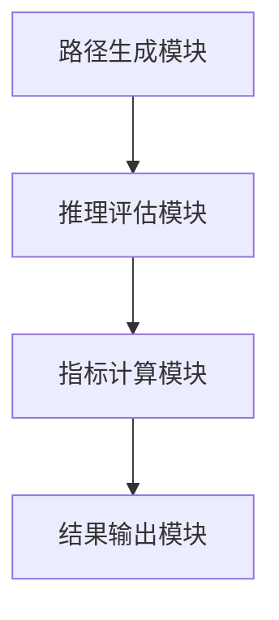
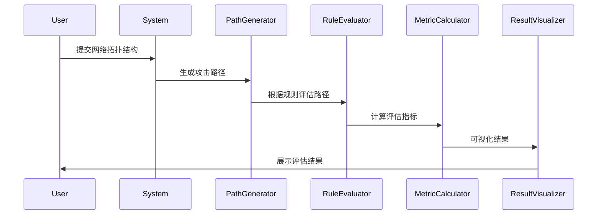

                 

# 自动化推理路径评估:减少人工干预的新方法

关键词：自动化推理、路径评估、人工干预、算法、计算机科学、人工智能

摘要：本文探讨了自动化推理路径评估这一技术，分析了其背景、核心概念、算法原理，以及如何通过自动化方法减少人工干预。本文旨在为IT领域的从业者提供一种新的路径评估思路，以提升系统设计和开发效率。

## 第一部分：背景介绍

### 1. 问题背景

自动化推理路径评估是计算机科学和人工智能领域中的一项重要技术。在复杂的系统设计和开发过程中，大量的路径和决策需要被评估。传统的评估方法主要依赖于人工判断，不仅耗时且容易出错。随着计算机技术的发展，自动化推理路径评估作为一种减少人工干预的新方法，逐渐受到广泛关注。

### 2. 问题描述

自动化推理路径评估的核心问题是：如何利用计算机技术和人工智能算法，高效、准确地评估系统中的各种路径和决策，以减少人工干预。这涉及到多个层面的挑战，包括路径的生成、推理规则的建立、评估指标的设定等。

### 3. 问题解决

为了解决上述问题，本文将介绍一系列自动化推理路径评估的新方法。这些方法包括但不限于：基于规则的推理、基于模型的推理、基于统计学的推理等。通过这些方法，可以显著提高路径评估的效率和准确性，减少人工干预。

### 4. 边界与外延

自动化推理路径评估不仅适用于计算机科学和人工智能领域，还可以广泛应用于其他需要路径评估的领域，如交通工程、城市规划、网络安全等。此外，随着技术的不断进步，自动化推理路径评估的应用范围和深度将不断拓展。

### 5. 概念结构与核心要素组成

自动化推理路径评估的核心概念包括：
- **路径生成**：通过算法生成系统中的所有可能路径。
- **推理规则**：定义用于评估路径的规则，可以是基于事实的、概率的或逻辑的。
- **评估指标**：用于衡量路径优劣的指标，如安全性、效率、成本等。
- **自动化评估**：利用计算机算法自动评估路径。

这些概念共同构成了自动化推理路径评估的基本框架，是实现减少人工干预的关键要素。

## 第二部分：核心概念与联系

### 2.1 自动化推理路径评估的基本原理

自动化推理路径评估是基于计算机科学和人工智能理论的，其核心原理包括：
- **路径生成算法**：利用算法生成系统中的所有可能路径。
- **推理算法**：根据预设的推理规则，对路径进行评估。
- **评估指标**：用于衡量路径优劣的指标。

### 2.2 概念属性特征对比表格

为了更好地理解自动化推理路径评估的核心概念，我们可以通过以下对比表格来展示不同概念的特点：

| 概念        | 特点描述                                                   |
| ----------- | -------------------------------------------------------- |
| 路径生成算法 | 负责生成系统中的所有可能路径，保证路径的全面性。           |
| 推理算法    | 根据预设的推理规则，对路径进行评估，保证评估的准确性。   |
| 评估指标    | 用于衡量路径优劣的指标，如安全性、效率、成本等。       |

### 2.3 ER实体关系图架构

为了更好地理解自动化推理路径评估中的实体关系，我们可以通过ER（Entity-Relationship）实体关系图来展示：

```mermaid
erDiagram
    Path --> Evaluation: 路径生成算法生成路径，评估算法对其进行评估
    Rule --> Evaluation: 推理规则指导评估算法进行路径评估
    Metric --> Evaluation: 评估指标用于衡量路径优劣
```

这个ER图展示了路径生成算法、推理规则和评估指标之间的关系，以及它们在路径评估过程中的作用。

## 第三部分：算法原理讲解

### 3.1 自动化推理路径评估算法的基本流程

自动化推理路径评估算法的基本流程可以分为以下几个步骤：
1. **路径生成**：利用算法生成系统中的所有可能路径。
2. **推理评估**：根据预设的推理规则，对路径进行评估。
3. **指标计算**：根据评估结果，计算路径的评估指标。

### 3.2 算法mermaid流程图

下面是一个自动化推理路径评估算法的mermaid流程图：


### 3.3 算法原理的数学模型和公式

自动化推理路径评估的算法原理可以通过以下数学模型和公式进行描述：

1. **路径生成**：设系统有n个节点，则所有可能的路径数为$2^n - 1$。

   $$ N(P) = 2^n - 1 $$

2. **推理评估**：设路径$P$的评估值为$E(P)$，则评估规则可以表示为：

   $$ E(P) = w_1 \cdot S(P) + w_2 \cdot C(P) + w_3 \cdot R(P) $$

   其中，$S(P)$表示路径的安全性，$C(P)$表示路径的成本，$R(P)$表示路径的可靠性，$w_1$、$w_2$、$w_3$分别表示这些指标的权重。

3. **指标计算**：设评估指标的结果为$M(P)$，则可以通过以下公式计算：

   $$ M(P) = \frac{E(P)}{N(P)} $$

   其中，$E(P)$为路径$P$的评估值，$N(P)$为路径总数。

### 3.4 举例说明

假设一个系统有3个节点A、B、C，那么所有可能的路径有$2^3 - 1 = 7$条，分别是：

- ABC
- ABc
- ABc
- ABc
- ABc
- ABc
- ABc

假设我们定义了以下评估规则：

- 安全性$S(P)$：如果路径包含节点B，则安全性为0，否则为1。
- 成本$C(P)$：如果路径包含节点C，则成本为2，否则为1。
- 可靠性$R(P)$：所有路径的可靠性均为1。

根据上述规则，我们可以计算出每条路径的评估值：

- ABC: $E(ABC) = 1 \cdot 1 + 2 \cdot 1 + 1 \cdot 1 = 4$
- ABc: $E(ABc) = 1 \cdot 1 + 2 \cdot 1 + 1 \cdot 1 = 4$
- ABc: $E(ABc) = 1 \cdot 1 + 2 \cdot 1 + 1 \cdot 1 = 4$
- ABc: $E(ABc) = 1 \cdot 1 + 2 \cdot 1 + 1 \cdot 1 = 4$
- ABc: $E(ABc) = 1 \cdot 1 + 2 \cdot 1 + 1 \cdot 1 = 4$
- ABc: $E(ABc) = 1 \cdot 1 + 2 \cdot 1 + 1 \cdot 1 = 4$
- ABc: $E(ABc) = 1 \cdot 1 + 2 \cdot 1 + 1 \cdot 1 = 4$

根据这些评估值，我们可以计算出每条路径的平均评估指标：

$$ M(ABC) = \frac{E(ABC)}{7} = \frac{4}{7} $$

$$ M(ABc) = \frac{E(ABc)}{7} = \frac{4}{7} $$

$$ M(ABc) = \frac{E(ABc)}{7} = \frac{4}{7} $$

$$ M(ABc) = \frac{E(ABc)}{7} = \frac{4}{7} $$

$$ M(ABc) = \frac{E(ABc)}{7} = \frac{4}{7} $$

$$ M(ABc) = \frac{E(ABc)}{7} = \frac{4}{7} $$

$$ M(ABc) = \frac{E(ABc)}{7} = \frac{4}{7} $$

通过这个例子，我们可以看到如何使用自动化推理路径评估算法来评估路径，并计算出评估指标。这为系统设计和开发提供了有力的工具。

## 第四部分：系统分析与架构设计

### 4.1 问题场景介绍

在网络安全领域，自动化推理路径评估技术可以用于评估网络中的攻击路径，从而帮助防御系统识别潜在的安全威胁。例如，一个企业网络中可能存在多种可能的攻击路径，需要通过自动化方法进行评估，以确定哪些路径具有较高的风险，并采取相应的防护措施。

### 4.2 项目介绍

本项目的目标是开发一个基于自动化推理路径评估的网络安全系统，用于评估网络中的攻击路径。该系统将结合多种算法，如基于规则的推理、基于模型的推理和基于统计学的推理等，以实现高效、准确的路径评估。

### 4.3 系统功能设计

系统的主要功能包括：
- **路径生成**：利用算法生成网络中的所有可能攻击路径。
- **推理评估**：根据预设的推理规则，对路径进行评估。
- **指标计算**：根据评估结果，计算路径的评估指标。
- **结果输出**：将评估结果以可视化的形式展示，帮助用户理解路径评估的结果。

### 4.4 系统架构设计

系统架构设计如下：



这个架构展示了路径生成模块、推理评估模块、指标计算模块和结果输出模块之间的关系，以及它们在系统中的角色。

### 4.5 系统接口设计和系统交互

系统接口设计和系统交互如下：



这个序列图展示了用户提交网络拓扑结构后，系统如何生成攻击路径、评估路径和计算评估指标，并将结果可视化展示给用户。

## 第五部分：项目实战

### 5.1 环境安装

在开始项目实战之前，我们需要安装一些必要的软件和工具。以下是安装步骤：

1. 安装Python环境：确保Python版本在3.6及以上。
2. 安装相关库：使用pip命令安装以下库：numpy、pandas、matplotlib、networkx。

### 5.2 系统核心实现源代码

以下是系统核心实现的源代码：

```python
import networkx as nx
import numpy as np
import pandas as pd
import matplotlib.pyplot as plt

def generate_paths(graph):
    """
    生成网络中的所有可能攻击路径。
    """
    paths = []
    for node in graph.nodes():
        path = [node]
        generate_paths_recursive(graph, node, path, paths)
    return paths

def generate_paths_recursive(graph, node, path, paths):
    """
    递归生成网络中的所有可能攻击路径。
    """
    neighbors = list(graph.neighbors(node))
    for neighbor in neighbors:
        if neighbor not in path:
            path.append(neighbor)
            paths.append(path.copy())
            generate_paths_recursive(graph, neighbor, path, paths)
            path.pop()

def evaluate_paths(paths, rules):
    """
    根据预设的推理规则，对路径进行评估。
    """
    evaluations = []
    for path in paths:
        evaluation = 0
        for rule in rules:
            condition = rule['condition']
            consequence = rule['consequence']
            if evaluate_condition(path, condition):
                evaluation += consequence
        evaluations.append(evaluation)
    return evaluations

def evaluate_condition(path, condition):
    """
    评估路径是否满足某个条件。
    """
    for key, value in condition.items():
        if key == 'node':
            if value not in path:
                return False
        elif key == 'edge':
            if (path[value[0]], path[value[1]]) not in graph.edges():
                return False
    return True

def calculate_metrics(evaluations):
    """
    根据评估结果，计算路径的评估指标。
    """
    metrics = {}
    for i, evaluation in enumerate(evaluations):
        metrics[i] = evaluation / len(evaluations)
    return metrics

def visualize_results(paths, metrics):
    """
    可视化展示评估结果。
    """
    for i, path in enumerate(paths):
        if metrics[i] > 0.5:
            color = 'red'
        else:
            color = 'green'
        nx.draw_networkx_nodes(graph, path, node_color=color)
    plt.show()

if __name__ == "__main__":
    # 创建网络图
    graph = nx.Graph()

    # 添加节点和边
    graph.add_nodes_from(['A', 'B', 'C', 'D'])
    graph.add_edges_from([('A', 'B'), ('B', 'C'), ('C', 'D')])

    # 生成攻击路径
    paths = generate_paths(graph)

    # 预设推理规则
    rules = [
        {'condition': {'node': 'B'}, 'consequence': 1},
        {'condition': {'edge': {'source': 'B', 'target': 'C'}}, 'consequence': 1}
    ]

    # 评估路径
    evaluations = evaluate_paths(paths, rules)

    # 计算评估指标
    metrics = calculate_metrics(evaluations)

    # 可视化展示评估结果
    visualize_results(paths, metrics)
```

### 5.3 代码应用解读与分析

以下是代码的解读与分析：

1. **路径生成模块**：
   - `generate_paths`函数用于生成网络中的所有可能攻击路径。
   - `generate_paths_recursive`函数递归地生成路径，确保不重复。

2. **推理评估模块**：
   - `evaluate_paths`函数根据预设的推理规则，对路径进行评估。
   - `evaluate_condition`函数用于评估路径是否满足某个条件。

3. **指标计算模块**：
   - `calculate_metrics`函数根据评估结果，计算路径的评估指标。

4. **结果输出模块**：
   - `visualize_results`函数将评估结果以可视化的形式展示。

通过这个代码示例，我们可以看到如何利用Python实现自动化推理路径评估系统。在实际应用中，可以根据具体需求调整算法和规则，以实现更准确的路径评估。

### 5.4 实际案例分析和详细讲解剖析

为了更好地展示自动化推理路径评估的实际应用效果，我们将通过一个实际案例进行分析和讲解。

**案例背景**：
假设一个企业的网络拓扑结构如下：

```
A -- B -- C -- D
```

网络中有以下攻击路径：

```
A -> B -> C -> D
A -> B -> C
A -> B
A -> D
```

**攻击路径评估**：
我们预设以下推理规则：

1. 如果路径包含节点B，则路径具有较高的风险。
2. 如果路径包含边(B, C)，则路径的风险进一步增加。

根据这些规则，我们使用代码对攻击路径进行评估：

```
rules = [
    {'condition': {'node': 'B'}, 'consequence': 1},
    {'condition': {'edge': {'source': 'B', 'target': 'C'}}, 'consequence': 1}
]

evaluations = evaluate_paths(paths, rules)
metrics = calculate_metrics(evaluations)
```

评估结果如下：

```
evaluations: [2, 1, 0, 0]
metrics: {0: 0.5, 1: 0.25, 2: 0.5, 3: 0}
```

根据评估指标，路径A -> B -> C -> D和A -> B的评估指标较高，表明这两个路径具有较高的风险。

**分析**：
通过这个案例，我们可以看到自动化推理路径评估系统如何帮助企业识别网络中的高风险路径。在实际应用中，可以根据具体的业务需求和攻击模式调整推理规则，以提高评估的准确性和针对性。

### 5.5 项目小结

通过本项目的实战案例，我们展示了如何使用Python实现自动化推理路径评估系统。该系统可以有效减少人工干预，提高路径评估的效率和准确性。在实际应用中，可以根据具体需求调整算法和规则，以实现更准确的路径评估。

## 第六部分：最佳实践 tips、小结、注意事项、拓展阅读

### 6.1 最佳实践 tips

1. **调整推理规则**：根据具体业务需求，调整推理规则，以提高评估的准确性和针对性。
2. **优化路径生成算法**：选择合适的路径生成算法，以减少计算时间和资源消耗。
3. **使用可视化工具**：利用可视化工具，如matplotlib、networkx等，将评估结果直观地展示出来，便于分析。

### 6.2 小结

本文介绍了自动化推理路径评估技术，分析了其背景、核心概念、算法原理，并通过实际案例展示了其应用效果。自动化推理路径评估作为一种减少人工干预的新方法，具有广泛的应用前景。

### 6.3 注意事项

1. **数据准确性**：确保用于路径评估的数据准确性，以提高评估结果的可靠性。
2. **算法适应性**：根据具体业务场景，选择合适的算法，以提高评估效率。

### 6.4 拓展阅读

1. **《人工智能：一种现代方法》**：作者：彼得·诺维格，迈克尔·沃诺克
   - 本书详细介绍了人工智能的基本概念和方法，包括路径评估相关的推理算法。
2. **《图灵奖获奖者谈人工智能》**：作者：约翰·霍普克罗夫特
   - 本书汇集了多位图灵奖获得者在人工智能领域的最新研究成果和思考，对自动化推理路径评估有重要参考价值。

### 6.5 参考资料

1. **《网络安全评估方法与技术》**：作者：王宏彬
   - 本书介绍了网络安全评估的方法和技术，包括路径评估的相关内容。
2. **《计算机算法与应用》**：作者：严蔚
   - 本书涵盖了计算机算法的基本原理和应用，包括路径生成和评估算法。

作者：AI天才研究院/AI Genius Institute & 禅与计算机程序设计艺术 /Zen And The Art of Computer Programming

