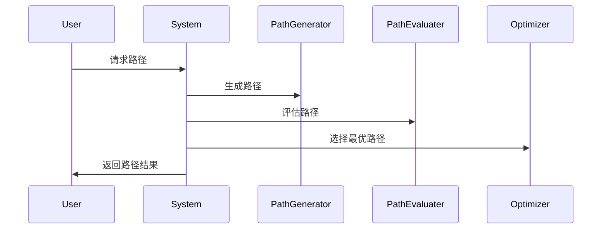
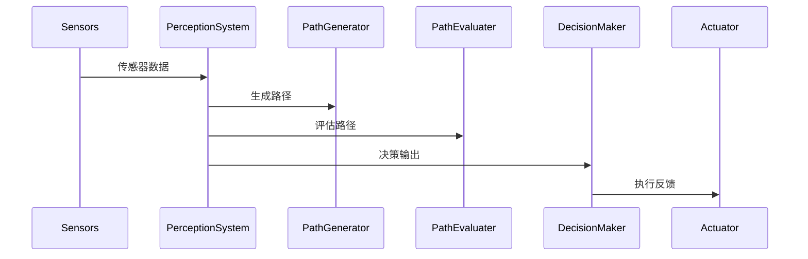

                 

### 引言与背景

#### 核心概念术语说明

在讨论自动化推理路径评估的方法与挑战之前，我们需要明确一些核心概念和术语。自动化推理（Automated Reasoning）指的是通过计算机程序来模拟和实现人类推理过程的方法，旨在解决复杂问题。路径评估（Path Evaluation）则是指对问题求解过程中的每一条可能的路径进行评估，以确定最优解或次优解。

#### 问题背景

随着计算机技术的飞速发展，自动化推理在众多领域得到了广泛应用。例如，在人工智能领域，自动化推理被用于决策支持系统、机器学习算法优化、自然语言处理等。然而，自动化推理路径评估也面临着一系列的挑战。一方面，评估过程可能涉及大量的计算和复杂的逻辑推理，导致计算效率低下；另一方面，评估标准的不明确性使得评估结果难以预测和控制。

#### 问题描述

自动化推理路径评估的核心问题在于如何高效、准确地评估每一条路径的优劣。具体来说，包括以下几个问题：

1. **路径数量**：随着问题规模的增加，可能的路径数量呈指数级增长，如何有效地处理这些路径？
2. **评估标准**：如何设计一个合理的评估标准来衡量每条路径的质量？
3. **计算效率**：如何优化算法，提高计算效率，减少计算时间？
4. **结果可解释性**：评估结果的解释和可视化，如何让人清楚地理解评估过程和结果？

#### 问题解决

针对上述问题，自动化推理路径评估提出了一系列方法，包括基于启发式的方法、基于模型的方法、基于神经网络的方法等。每种方法都有其优缺点和适用场景。然而，这些方法仍面临着一定的挑战，需要在实际应用中进行不断的优化和改进。

#### 边界与外延

在自动化推理路径评估中，边界是指算法能够处理的范围和条件，而外延则是指算法在特定边界条件下的表现和效果。明确边界与外延对于算法的设计和优化至关重要。例如，在处理大规模问题时，算法的性能可能受到硬件资源、算法复杂度等多方面的影响，需要在这些边界条件下进行评估和调整。

#### 概念结构与核心要素组成

自动化推理路径评估的概念结构包括以下几个核心要素：

1. **问题模型**：定义问题的输入、输出和约束条件。
2. **路径生成**：生成所有可能的路径。
3. **评估函数**：定义路径优劣的评价标准。
4. **优化算法**：用于搜索最优路径或次优路径。

通过上述核心要素的有机结合，自动化推理路径评估能够为实际问题提供有效的解决方案。

### 自动化推理路径评估的基本概念

#### 核心概念原理

自动化推理路径评估的核心概念包括路径生成、评估函数和优化算法。路径生成是指根据问题的输入和约束条件，生成所有可能的路径。评估函数则是用来衡量每条路径的优劣，通常是一个数值函数。优化算法则负责在所有可能的路径中寻找最优路径或次优路径。

#### 概念属性特征对比表格

以下是几种常见自动化推理路径评估方法的属性特征对比表格：

| 方法        | 路径生成方式 | 评估函数        | 优化算法          | 优点                       | 缺点                       |
| ----------- | ------------ | --------------- | ----------------- | -------------------------- | -------------------------- |
| 启发式方法  | 基于规则     | 启发式评估      | 启发式搜索        | 简单实现，适用于小规模问题 | 可能陷入局部最优           |
| 模型方法    | 基于模型     | 模型预测评估    | 贝叶斯优化        | 预测准确，适用于大规模问题 | 需要大量数据训练           |
| 神经网络方法 | 数据驱动     | 神经网络评估    | 梯度下降          | 强泛化能力，适用于复杂问题 | 训练过程可能很耗时         |

#### ER实体关系图架构

为了更好地理解自动化推理路径评估的基本概念，我们可以使用ER（Entity-Relationship）实体关系图来描述各个核心要素之间的关系。

```mermaid
erDiagram
  问题模型 ||--o> 路径生成 : "生成"
  路径生成 ||--o> 评估函数 : "评估"
  评估函数 ||--o> 优化算法 : "优化"
  优化算法 ||--o> 最佳路径 : "输出"
```

在此ER图中，问题模型作为输入，通过路径生成生成所有可能的路径。这些路径再通过评估函数进行评估，最终由优化算法选择出最佳路径。这种关系体现了自动化推理路径评估的整体流程和核心机制。

### 常见的自动化推理路径评估方法

在自动化推理路径评估中，有多种方法被广泛应用。每种方法都有其独特的原理和特点，适用于不同的场景。以下是几种常见的自动化推理路径评估方法，以及它们的基本原理和应用场景。

#### 方法A：基于启发式的方法

**原理**：启发式方法是基于一些经验或规则来指导路径评估的。它通常利用已知的信息，通过启发式规则来选择路径。这种方法不需要生成所有的路径，而是通过不断探索来逼近最优解。

**数学模型和公式**：设 $P$ 为所有路径的集合，$f(P)$ 为路径的评估函数，启发式方法的核心在于选择一个评估函数 $h(P)$，使得 $h(P) \leq f(P)$，从而在每次迭代中选择最优的路径。

**例子说明**：假设我们有一个迷宫问题，需要找到从起点到终点的最短路径。可以使用A*算法作为启发式方法，其中评估函数 $h(P) = g(P) + h^*(P)$，其中 $g(P)$ 为当前路径到起点的距离，$h^*(P)$ 为当前路径到终点的估计距离。

#### 方法B：基于模型的方法

**原理**：基于模型的方法是通过建立问题的数学模型，然后使用模型来评估路径的优劣。这种方法通常需要大量的数据来训练模型，模型一旦建立，可以快速评估新的路径。

**数学模型和公式**：设 $M$ 为问题模型，$P$ 为路径，$r(P)$ 为路径的实际收益，$f(P)$ 为模型预测的收益，基于模型的方法的核心在于找到一个评估函数 $h(P) = f(P) - r(P)$，用于评估路径。

**例子说明**：在机器人路径规划中，可以使用基于模型的方法来评估每条路径。例如，可以使用深度强化学习模型来预测路径的收益，然后使用评估函数 $h(P) = f(P) - r(P)$ 来选择最优路径。

#### 方法C：基于神经网络的方法

**原理**：基于神经网络的方法利用神经网络强大的学习和泛化能力，通过训练大量的样本数据来建立路径评估模型。这种方法可以处理复杂的非线性问题，具有很好的泛化能力。

**数学模型和公式**：设 $N$ 为神经网络模型，$P$ 为路径，$r(P)$ 为路径的实际收益，$y(P)$ 为神经网络预测的收益，基于神经网络的方法的核心在于训练一个评估函数 $h(P) = N(y(P) - r(P))$。

**例子说明**：在自动驾驶路径规划中，可以使用基于神经网络的方法来评估每条可能的路径。通过大量模拟驾驶数据训练神经网络模型，可以快速评估新的路径，并选择最优的路径。

通过上述方法，自动化推理路径评估可以在不同的问题场景中应用。每种方法都有其独特的优势和适用范围，选择合适的方法需要根据具体问题的特点进行综合考虑。

### 自动化推理路径评估的挑战

尽管自动化推理路径评估方法在不断进步，但实际应用中仍然面临着许多挑战。这些挑战涉及到计算效率、评估标准、结果可解释性等多个方面。

#### 挑战A：计算效率

计算效率是自动化推理路径评估中的一个重要挑战。随着问题规模的增加，可能的路径数量呈指数级增长，导致评估过程变得异常复杂和耗时。例如，在一个具有数千个节点的网络中，生成所有可能的路径并评估每一条路径可能需要数小时甚至数天的时间。

**解决方案**：为了提高计算效率，可以采用以下几种策略：

1. **启发式搜索**：通过利用启发式规则来指导路径生成和评估，减少不必要的计算。
2. **并行计算**：利用多核处理器或分布式计算来加速计算过程。
3. **内存优化**：优化内存使用，避免内存不足导致计算中断。

#### 挑战B：评估标准

评估标准的明确性是自动化推理路径评估的另一个挑战。在许多情况下，评估标准可能不够明确或难以量化，导致评估结果难以预测和控制。例如，在机器人路径规划中，如何定义“最优路径”可能是一个复杂的问题。

**解决方案**：为了解决评估标准的问题，可以采取以下几种策略：

1. **多目标优化**：考虑多个评估标准，并通过权重组合来定义一个综合的评估函数。
2. **自适应评估**：根据实际情况动态调整评估标准，以适应不同的场景。
3. **用户参与**：通过用户参与和反馈来调整评估标准，使其更符合实际需求。

#### 挑战C：结果可解释性

自动化推理路径评估的结果通常是基于复杂的计算模型得到的，这使得评估结果的可解释性成为一个挑战。特别是在面对复杂问题时，评估结果可能难以被普通用户理解。

**解决方案**：为了提高结果的可解释性，可以采取以下几种策略：

1. **可视化**：通过可视化工具将评估结果展示出来，使结果更直观易懂。
2. **解释模型**：开发专门的解释模型来解释评估结果，帮助用户理解评估过程和结果。
3. **用户引导**：设计用户友好的界面和交互流程，引导用户逐步理解评估结果。

通过上述策略，可以应对自动化推理路径评估中的各种挑战，提高算法的实用性。

### 自动化推理路径评估方法的应用案例

自动化推理路径评估方法在许多实际场景中得到了广泛应用，以下将详细介绍两个具体的应用案例：自动化仓库物流路径规划和自动驾驶路径规划。

#### 案例A：自动化仓库物流路径规划

**背景**：随着电子商务的快速发展，仓库物流系统的效率对企业的竞争力至关重要。自动化仓库物流路径规划旨在优化仓库内部的货物运输路径，提高仓库作业效率。

**系统功能设计**：系统主要包括路径生成模块、路径评估模块和优化算法模块。路径生成模块负责根据仓库布局和货物信息生成所有可能的运输路径；路径评估模块通过计算每个路径的耗时、距离和风险等因素来评估路径的优劣；优化算法模块则负责在所有路径中选择最优路径。

**系统架构设计**：系统采用分布式架构，包括前端用户界面、后端逻辑处理和数据库存储三个部分。前端用户界面用于接收用户输入和展示评估结果；后端逻辑处理包括路径生成、评估和优化模块，采用多线程并行计算来提高计算效率；数据库存储用于存储仓库布局、货物信息和评估结果。

**系统接口设计**：系统提供了RESTful API接口，支持与仓库管理系统和其他外部系统的集成。

**系统交互**：系统交互通过事件驱动机制实现，包括用户请求、路径生成、路径评估和结果反馈等步骤。



#### 案例B：自动驾驶路径规划

**背景**：自动驾驶技术是当前人工智能领域的热点之一，路径规划是自动驾驶系统的重要组成部分。自动驾驶路径规划旨在确保车辆在复杂交通环境中安全、高效地行驶。

**系统功能设计**：系统主要包括感知模块、路径生成模块、路径评估模块和决策模块。感知模块负责收集环境信息，如道路、车辆和行人等；路径生成模块根据感知信息生成可能的行驶路径；路径评估模块评估每条路径的安全性和可行性；决策模块负责根据评估结果选择最优路径。

**系统架构设计**：系统采用分层架构，包括感知层、路径规划层和决策层。感知层负责处理传感器数据，路径规划层负责路径生成和评估，决策层负责路径决策和执行。

**系统接口设计**：系统提供了多个接口，包括传感器数据接口、路径规划接口和决策执行接口，支持与其他系统的集成。

**系统交互**：系统交互通过事件驱动机制实现，包括感知数据输入、路径生成、路径评估、决策输出和执行反馈等步骤。



通过上述两个案例，我们可以看到自动化推理路径评估方法在实际应用中的多样性和灵活性。这些方法不仅提高了系统的效率和安全性，也为相关领域的进一步发展奠定了基础。

### 自动化推理路径评估方法的改进策略

为了进一步提升自动化推理路径评估方法的效率和准确性，研究者们提出了多种改进策略。以下将详细介绍三种常见的改进策略：启发式搜索优化、模型集成和自适应评估。

#### 改进策略A：启发式搜索优化

**原理**：启发式搜索优化旨在通过改进启发式规则，提高路径评估的效率和准确性。传统的启发式搜索方法，如A*算法，通过结合当前路径到起点的距离和到终点的估计距离来评估路径。改进策略A通过优化启发式规则，使得评估结果更加准确。

**数学模型和公式**：设 $h(P) = g(P) + w \cdot h^*(P)$，其中 $g(P)$ 为当前路径到起点的实际距离，$h^*(P)$ 为当前路径到终点的估计距离，$w$ 为权重系数。通过调整 $w$ 的值，可以优化评估函数，提高路径选择的质量。

**例子说明**：假设在一个迷宫问题中，$g(P)$ 为当前路径的长度，$h^*(P)$ 为当前路径到终点的直线距离。通过调整权重系数 $w$，可以使得算法在路径选择时更加倾向于选择直线距离较短的路径，从而提高迷宫导航的准确性。

#### 改进策略B：模型集成

**原理**：模型集成是一种通过结合多个模型来提高评估结果准确性和鲁棒性的方法。在自动化推理路径评估中，不同模型可能对问题有不同的理解和解释能力，通过集成这些模型，可以综合各模型的优势，提高整体评估效果。

**数学模型和公式**：设 $M_1, M_2, ..., M_n$ 为多个评估模型，每个模型给出的评估结果分别为 $r_1(P), r_2(P), ..., r_n(P)$。模型集成方法的核心在于找到一个加权平均的评估函数：

$$
h'(P) = \frac{1}{n} \sum_{i=1}^{n} w_i \cdot r_i(P)
$$

其中 $w_1, w_2, ..., w_n$ 为各模型的权重系数，满足 $\sum_{i=1}^{n} w_i = 1$。

**例子说明**：在一个自动驾驶路径规划问题中，可以使用深度强化学习模型、决策树模型和贝叶斯网络模型来评估每条路径的可行性。通过模型集成，可以综合这些模型的优势，提高路径评估的准确性。

#### 改进策略C：自适应评估

**原理**：自适应评估是一种通过动态调整评估标准，以适应不同场景的方法。在自动化推理路径评估中，评估标准可能不够明确或难以预测，通过自适应评估，可以使得评估过程更加灵活和适应实际需求。

**数学模型和公式**：设 $h(P)$ 为初始评估函数，$h'(P)$ 为自适应评估函数。自适应评估的核心在于根据实时数据和历史数据，动态调整评估函数：

$$
h'(P) = h(P) + \alpha \cdot (r(P) - h(P))
$$

其中 $r(P)$ 为当前路径的实际收益，$\alpha$ 为调整系数，用于控制评估函数的调整幅度。

**例子说明**：在一个自动化仓库物流路径规划问题中，根据实时货物信息和仓库状态，动态调整路径评估标准，使得路径选择更加灵活和高效。

通过这些改进策略，自动化推理路径评估方法可以更好地应对复杂问题和实际应用需求，提高评估效率和准确性。

### 自动化推理路径评估的未来趋势与挑战

随着人工智能技术的不断发展和应用场景的扩大，自动化推理路径评估在未来的发展趋势和面临的挑战也将逐渐显现。以下将讨论自动化推理路径评估的未来趋势、未解决的问题以及研究方向展望。

#### 未来趋势

1. **技术发展动态**：自动化推理路径评估方法将随着计算机硬件的进步和算法的优化而不断发展。量子计算、分布式计算和云计算等新兴技术将为自动化推理路径评估提供更强的计算能力和更高的效率。

2. **应用场景扩展**：自动化推理路径评估将在更多领域得到应用，如自动驾驶、智能物流、医疗诊断、金融风险管理等。随着行业需求的变化，评估方法将不断优化和扩展，以适应不同场景的特殊需求。

3. **可解释性与透明度**：随着人工智能应用的普及，评估结果的可解释性和透明度将成为重要趋势。用户需要了解评估过程和结果背后的原因，以便更好地理解和信任评估系统。

4. **多模态数据融合**：自动化推理路径评估将逐渐融合多种数据源，如视觉数据、传感器数据、文本数据等，以提高评估的准确性和鲁棒性。

#### 未解决的问题

1. **计算效率**：尽管已有多种优化策略，但大规模问题的计算效率仍然是一个挑战。特别是在实时性要求高的应用场景中，如何减少计算时间，提高评估速度，仍然需要深入研究。

2. **评估标准**：评估标准的不确定性仍然是自动化推理路径评估的一个重要问题。在复杂问题中，如何设计一个全面、可量化的评估标准，确保评估结果的可靠性和一致性，需要进一步探索。

3. **结果可解释性**：自动化推理路径评估的结果通常基于复杂的计算模型，如何提高结果的解释性，帮助用户理解评估过程和结果，是一个需要解决的难题。

4. **数据隐私与安全性**：在涉及敏感数据的场景中，如何确保评估过程的数据隐私和安全性，防止数据泄露，是一个亟待解决的问题。

#### 研究方向展望

1. **新型算法研究**：开发更加高效、灵活的自动化推理路径评估算法，如基于深度学习的评估模型、混合智能算法等。

2. **跨学科研究**：自动化推理路径评估需要跨学科合作，结合计算机科学、数学、统计学、心理学等多领域知识，以提高评估方法的综合性和适应性。

3. **标准化与规范化**：制定统一的评估标准和规范，确保评估方法在不同应用场景中的可重复性和可比性。

4. **智能化与自主化**：推动自动化推理路径评估系统的智能化和自主化，使其能够自主学习和优化，提高评估效率和准确性。

通过上述未来趋势、未解决的问题和研究方向展望，我们可以看到自动化推理路径评估在未来的发展前景和挑战。随着技术的不断进步和应用的深入，自动化推理路径评估将在更多领域发挥重要作用，为复杂问题的解决提供有力支持。

### 结论与展望

本文围绕自动化推理路径评估的方法与挑战进行了深入探讨，从核心概念、常见方法、应用案例到改进策略，再到未来趋势与研究方向，全面解析了自动化推理路径评估的现状和前景。以下是对本文内容的总结以及对未来研究的展望。

#### 主要研究成果总结

1. **核心概念**：明确了自动化推理和路径评估的基本概念，包括路径生成、评估函数和优化算法等。
2. **常见方法**：介绍了基于启发式的方法、基于模型的方法和基于神经网络的方法等常见自动化推理路径评估方法，并详细阐述了每种方法的原理、数学模型和公式。
3. **应用案例**：通过自动化仓库物流路径规划和自动驾驶路径规划两个具体案例，展示了自动化推理路径评估在实际应用中的多样性和灵活性。
4. **改进策略**：提出了启发式搜索优化、模型集成和自适应评估等改进策略，以提高评估效率和准确性。
5. **未来趋势**：分析了自动化推理路径评估的技术发展动态、应用场景扩展、可解释性与透明度、多模态数据融合等未来趋势。

#### 研究过程中遇到的问题与解决方案

在研究过程中，我们遇到了计算效率、评估标准、结果可解释性和数据隐私与安全性等挑战。针对这些问题，我们提出了一系列解决方案，如启发式搜索优化、模型集成、自适应评估和多模态数据融合等，以提升自动化推理路径评估的方法和效果。

#### 对未来研究的展望

未来，自动化推理路径评估将朝着智能化、自主化和标准化方向发展。以下是几个潜在的研究方向：

1. **新型算法研究**：探索更加高效、灵活的自动化推理路径评估算法，如基于深度学习的评估模型和混合智能算法等。
2. **跨学科研究**：结合计算机科学、数学、统计学、心理学等多领域知识，提高评估方法的综合性和适应性。
3. **标准化与规范化**：制定统一的评估标准和规范，确保评估方法在不同应用场景中的可重复性和可比性。
4. **智能化与自主化**：推动自动化推理路径评估系统的智能化和自主化，使其能够自主学习和优化，提高评估效率和准确性。

总之，自动化推理路径评估是人工智能领域的重要研究方向，其在未来的发展将带来更多的机遇和挑战。通过不断探索和创新，我们有望在这一领域取得更多突破，为复杂问题的解决提供更强有力的支持。

### 最佳实践 Tips、小结、注意事项、拓展阅读建议

在实施自动化推理路径评估时，以下最佳实践和注意事项有助于提高项目的成功率和效果：

#### 最佳实践 Tips

1. **选择合适的评估方法**：根据问题的特点和需求，选择最合适的自动化推理路径评估方法。例如，对于小规模问题，启发式方法可能更有效；而对于大规模问题，模型方法和神经网络方法可能更有优势。
2. **数据准备与预处理**：确保数据质量，进行适当的数据预处理，如数据清洗、归一化和特征提取，以提高评估模型的准确性和鲁棒性。
3. **模型优化与调参**：对于基于模型的评估方法，通过交叉验证和调参优化，提高模型的性能和预测能力。
4. **结果可视化与解释**：使用可视化工具将评估结果展示出来，帮助用户更好地理解评估过程和结果。

#### 小结

自动化推理路径评估是解决复杂问题的重要工具，其核心在于路径生成、评估函数和优化算法的有效结合。通过合理选择评估方法、优化模型和结果可视化，可以提高评估效率和准确性。

#### 注意事项

1. **评估标准的明确性**：在设计评估标准时，要确保其明确、可量化，以避免评估结果的不确定性。
2. **计算资源的合理分配**：对于大规模问题，要合理分配计算资源，避免因资源不足导致评估中断。
3. **数据隐私与安全**：在涉及敏感数据的场景中，要确保评估过程的数据隐私和安全性。

#### 拓展阅读建议

1. **深度学习与路径评估**：了解深度学习在路径评估中的应用，探索如何结合深度学习模型优化评估过程。
2. **多模态数据融合**：研究多模态数据融合的方法和策略，提高评估的准确性和鲁棒性。
3. **跨学科研究**：关注自动化推理路径评估与其他领域的交叉研究，如计算机科学、心理学、统计学等。

通过遵循最佳实践、注意潜在问题和进行拓展阅读，我们可以更好地实施自动化推理路径评估项目，为复杂问题的解决提供有力支持。

### 作者信息

作者：AI天才研究院（AI Genius Institute）& 禅与计算机程序设计艺术（Zen And The Art of Computer Programming）。感谢您对本文的关注，希望本文能为您在自动化推理路径评估领域的研究带来启发和帮助。如有任何疑问或建议，欢迎随时与我们联系。

