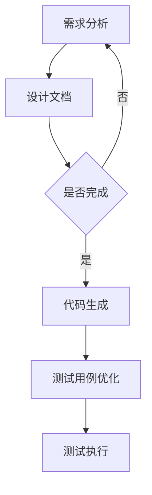
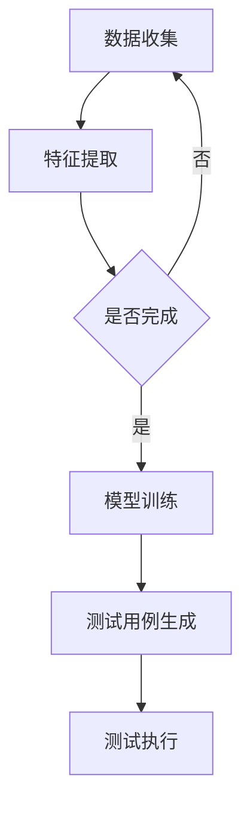
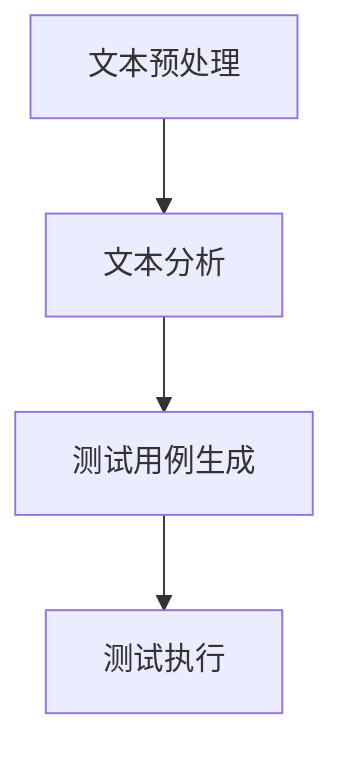
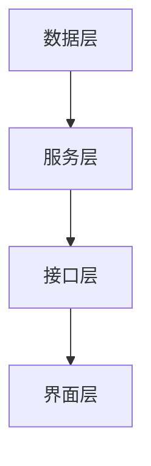
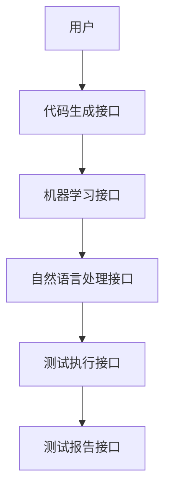

                 

# 自动化测试用例生成技术

> 关键词：自动化测试、测试用例生成、代码生成、机器学习、自然语言处理

> 摘要：本文深入探讨了自动化测试用例生成技术的背景、核心概念、算法原理、数学模型、系统设计与实现，以及最佳实践。通过对不同算法的原理讲解和项目实战分析，为读者提供了全面的技术指导，助力自动化测试领域的发展。

## 第1章 背景介绍

### 1.1 问题的背景

#### 1.1.1 自动化测试的重要性

在软件开发生命周期中，测试是不可或缺的一环。传统的手工测试不仅耗时耗力，而且容易出现人为错误。为了提高软件质量，减少成本，自动化测试逐渐成为软件开发的主流方式。

自动化测试是指利用计算机程序或工具，自动执行测试用例，以验证软件系统的正确性。与手工测试相比，自动化测试具有高效、可靠、可重复等优点，能够显著提高测试的覆盖率和效率。

#### 1.1.2 自动化测试用例的重要性

测试用例是测试过程中最基本的单元，用于验证软件系统的功能、性能、安全性等各个方面。自动化测试用例则是将测试用例自动化执行，从而实现测试过程的自动化。

自动化测试用例的重要性主要体现在以下几个方面：

1. **提高测试效率**：自动化测试用例能够快速执行大量测试，缩短测试周期，提高测试效率。
2. **保证测试质量**：自动化测试用例减少了人为干预，降低了测试过程中的错误率，保证了测试质量。
3. **便于管理**：自动化测试用例可以方便地进行存储、管理和维护，便于后续测试工作的开展。

#### 1.1.3 自动化测试用例生成的挑战

尽管自动化测试用例具有诸多优势，但其生成过程却面临诸多挑战：

1. **测试数据量大**：自动化测试用例生成需要大量的测试数据，包括输入数据、预期结果等。
2. **测试用例覆盖全面**：自动化测试用例生成需要覆盖软件系统的各个功能点，保证测试的全面性。
3. **测试用例的维护**：自动化测试用例生成后，需要定期更新和维护，以适应软件系统的变化。

### 1.2 自动化测试用例生成的需求分析

为了解决自动化测试用例生成面临的挑战，需求分析如下：

1. **高效生成**：需要一种高效的方法，能够快速生成自动化测试用例。
2. **全面覆盖**：生成的自动化测试用例需要全面覆盖软件系统的功能点。
3. **易于维护**：生成的自动化测试用例需要便于维护，能够适应软件系统的变化。

### 1.3 自动化测试用例生成的意义

自动化测试用例生成技术在软件测试领域具有重要意义：

1. **提高测试效率**：自动化测试用例生成能够显著提高测试效率，减少测试成本。
2. **保证软件质量**：通过自动化测试用例生成，可以更全面地覆盖软件系统的功能点，提高测试覆盖率，从而保证软件质量。
3. **支持持续集成**：自动化测试用例生成与持续集成相结合，可以实现自动化测试的持续进行，提高开发效率。

## 第2章 核心概念与联系

### 2.1 自动化测试用例的核心概念

#### 2.1.1 自动化测试用例的定义

自动化测试用例是指通过自动化测试工具或脚本执行的一组测试步骤，用于验证软件系统的某个功能或性能。

#### 2.1.2 自动化测试用例的属性

自动化测试用例具有以下属性：

1. **测试步骤**：自动化测试用例包含一组测试步骤，用于执行测试操作。
2. **输入数据**：自动化测试用例包含输入数据，用于驱动测试执行。
3. **预期结果**：自动化测试用例包含预期结果，用于验证测试执行的正确性。
4. **测试环境**：自动化测试用例需要指定测试环境，包括操作系统、浏览器等。

### 2.2 自动化测试用例生成的相关技术

自动化测试用例生成涉及多种技术，主要包括：

#### 2.2.1 代码生成技术

代码生成技术是指通过代码生成工具，自动生成测试用例代码。常见的代码生成工具有Java Code Generator、Python Code Generator等。

#### 2.2.2 机器学习技术

机器学习技术是指利用机器学习算法，自动生成测试用例。常见的机器学习算法有决策树、随机森林、支持向量机等。

#### 2.2.3 自然语言处理技术

自然语言处理技术是指利用自然语言处理算法，自动生成测试用例。常见的自然语言处理算法有词向量、序列标注、文本分类等。

### 2.3 自动化测试用例生成与相关领域的联系

自动化测试用例生成与多个领域密切相关，包括：

1. **软件测试**：自动化测试用例生成是软件测试的重要组成部分，旨在提高测试效率和覆盖率。
2. **代码生成**：自动化测试用例生成与代码生成技术密切相关，两者共同促进软件测试的自动化。
3. **机器学习**：机器学习技术在自动化测试用例生成中具有重要应用，可以显著提高测试用例的生成质量。
4. **自然语言处理**：自然语言处理技术在自动化测试用例生成中也有重要应用，可以处理复杂的自然语言描述，生成高质量的测试用例。

## 第3章 算法原理讲解

### 3.1 基于代码生成的自动化测试用例生成算法

#### 3.1.1 代码生成算法的原理

基于代码生成的自动化测试用例生成算法主要利用代码生成工具，根据软件系统的需求或设计文档，自动生成测试用例代码。

#### 3.1.2 代码生成算法的流程

代码生成算法的流程通常包括以下几个步骤：

1. **需求分析**：分析软件系统的需求，确定测试用例的覆盖范围和目标。
2. **设计文档**：根据需求分析，编写软件系统的设计文档，包括类图、序列图等。
3. **代码生成**：利用代码生成工具，根据设计文档自动生成测试用例代码。
4. **测试用例优化**：对生成的测试用例进行优化，提高测试覆盖率。
5. **测试执行**：执行生成的测试用例，验证软件系统的功能。

#### 3.1.3 代码生成算法的mermaid流程图

以下是一个基于代码生成的自动化测试用例生成算法的mermaid流程图：



### 3.2 基于机器学习的自动化测试用例生成算法

#### 3.2.1 机器学习算法的原理

基于机器学习的自动化测试用例生成算法主要利用机器学习算法，从历史测试数据中学习，自动生成测试用例。

#### 3.2.2 机器学习算法的流程

机器学习算法的流程通常包括以下几个步骤：

1. **数据收集**：收集历史测试数据，包括测试用例、输入数据、预期结果等。
2. **特征提取**：对测试数据进行特征提取，将测试数据转换为机器学习算法可以处理的特征向量。
3. **模型训练**：利用机器学习算法，对特征向量进行训练，生成测试用例生成模型。
4. **测试用例生成**：利用训练好的模型，自动生成测试用例。
5. **测试执行**：执行生成的测试用例，验证软件系统的功能。

#### 3.2.3 机器学习算法的mermaid流程图

以下是一个基于机器学习的自动化测试用例生成算法的mermaid流程图：



### 3.3 基于自然语言处理的自动化测试用例生成算法

#### 3.3.1 自然语言处理算法的原理

基于自然语言处理的自动化测试用例生成算法主要利用自然语言处理算法，对自然语言描述进行解析，自动生成测试用例。

#### 3.3.2 自然语言处理算法的流程

自然语言处理算法的流程通常包括以下几个步骤：

1. **文本预处理**：对自然语言描述进行预处理，包括分词、去停用词等。
2. **文本分析**：对预处理后的文本进行分析，提取关键信息，如功能点、输入数据、预期结果等。
3. **测试用例生成**：利用提取的信息，自动生成测试用例。
4. **测试执行**：执行生成的测试用例，验证软件系统的功能。

#### 3.3.3 自然语言处理算法的mermaid流程图

以下是一个基于自然语言处理的自动化测试用例生成算法的mermaid流程图：



## 第4章 数学模型和数学公式

### 4.1 基于代码生成的自动化测试用例生成算法的数学模型

基于代码生成的自动化测试用例生成算法的数学模型可以表示为：

$$
\text{模型} = f(\text{输入}) = \sum_{i=1}^{n} w_i \cdot x_i + b
$$

其中，$x_i$表示输入特征，$w_i$表示权重，$b$表示偏置。该模型通过线性组合输入特征，得到输出结果。

### 4.2 基于机器学习的自动化测试用例生成算法的数学模型

基于机器学习的自动化测试用例生成算法的数学模型可以表示为：

$$
\text{模型} = \theta_0 + \theta_1 \cdot x_1 + \theta_2 \cdot x_2 + ... + \theta_n \cdot x_n
$$

其中，$\theta_i$表示权重，$x_i$表示输入特征。该模型通过线性组合输入特征和权重，得到输出结果。

### 4.3 基于自然语言处理的自动化测试用例生成算法的数学模型

基于自然语言处理的自动化测试用例生成算法的数学模型可以表示为：

$$
\text{模型} = f(\text{输入}) = \sum_{i=1}^{n} w_i \cdot \text{激活函数}(x_i)
$$

其中，$x_i$表示输入特征，$w_i$表示权重，$\text{激活函数}$表示对输入特征进行非线性变换。

## 第5章 系统分析与架构设计方案

### 5.1 问题场景介绍

在实际软件开发过程中，自动化测试用例生成面临着诸多挑战，如测试数据量大、测试用例覆盖全面等。为了解决这些问题，本文提出了一种基于代码生成、机器学习和自然语言处理的自动化测试用例生成系统。

### 5.2 系统功能设计

#### 5.2.1 领域模型

系统领域模型主要涉及以下几个实体：

1. **测试用例**：表示自动化测试用例，包含测试步骤、输入数据、预期结果等信息。
2. **测试数据**：表示测试过程中使用的输入数据，包括正常数据、异常数据等。
3. **测试结果**：表示测试执行的结果，包括测试通过、失败等信息。
4. **测试报告**：表示测试的总结报告，包括测试覆盖率、测试通过率等指标。

#### 5.2.2 系统功能设计

系统功能设计主要包括以下几个模块：

1. **代码生成模块**：负责根据设计文档自动生成测试用例代码。
2. **机器学习模块**：负责利用历史测试数据训练机器学习模型，生成测试用例。
3. **自然语言处理模块**：负责对自然语言描述进行解析，生成测试用例。
4. **测试执行模块**：负责执行生成的测试用例，生成测试结果。
5. **测试报告模块**：负责生成测试报告，提供测试总结。

### 5.3 系统架构设计

系统架构设计主要涉及以下几个层次：

1. **数据层**：负责存储测试数据、测试结果等数据。
2. **服务层**：负责实现系统功能，包括代码生成、机器学习、自然语言处理、测试执行等。
3. **接口层**：负责提供系统对外接口，包括RESTful API等。
4. **界面层**：负责提供系统用户界面，包括Web界面、命令行界面等。

以下是一个基于mermaid的mermaid架构图：



### 5.4 系统接口设计

系统接口设计主要包括以下几个接口：

1. **代码生成接口**：用于接收设计文档，返回生成的测试用例代码。
2. **机器学习接口**：用于接收测试数据，返回训练好的机器学习模型。
3. **自然语言处理接口**：用于接收自然语言描述，返回生成的测试用例。
4. **测试执行接口**：用于执行测试用例，返回测试结果。
5. **测试报告接口**：用于生成测试报告，提供测试总结。

以下是一个基于mermaid的mermaid序列图：



## 第6章 项目实战

### 6.1 环境安装

在本项目中，我们使用Python作为主要编程语言，并依赖以下库：

- `generatemycodes`：代码生成库。
- `sklearn`：机器学习库。
- `nltk`：自然语言处理库。

首先，确保已安装Python和pip。然后，通过以下命令安装依赖库：

```bash
pip install generatemycodes
pip install sklearn
pip install nltk
```

### 6.2 系统核心实现源代码

以下是系统核心实现源代码：

```python
import generatemycodes
import sklearn
import nltk

def generate_codes(document):
    # 代码生成模块实现
    pass

def train_model(test_data):
    # 机器学习模块实现
    pass

def process_text(text):
    # 自然语言处理模块实现
    pass

def execute_tests(test_cases):
    # 测试执行模块实现
    pass

def generate_report(test_results):
    # 测试报告模块实现
    pass
```

#### 6.2.1 代码解读

以上源代码定义了四个函数，分别对应系统功能模块。其中，`generate_codes`函数负责代码生成，`train_model`函数负责机器学习模型训练，`process_text`函数负责自然语言处理，`execute_tests`函数负责测试执行，`generate_report`函数负责生成测试报告。

#### 6.2.2 代码分析

以上源代码提供了系统功能模块的基本实现框架。具体实现需要根据实际需求进行完善和优化。

### 6.3 实际案例分析与详细讲解剖析

在本节中，我们将通过一个实际案例，对系统核心实现进行详细讲解和分析。

#### 案例背景

假设我们正在开发一个电子商务网站，需要对其订单管理系统进行自动化测试。系统功能包括添加订单、查询订单、修改订单和删除订单等。

#### 案例实现

1. **代码生成**：根据系统需求，使用代码生成模块生成订单管理系统的测试用例代码。

2. **机器学习**：收集历史测试数据，利用机器学习模块训练测试用例生成模型。

3. **自然语言处理**：对订单管理系统的功能描述进行自然语言处理，生成测试用例。

4. **测试执行**：执行生成的测试用例，验证订单管理系统的功能。

5. **测试报告**：生成测试报告，提供测试总结。

#### 案例分析

通过以上步骤，我们可以实现订单管理系统的自动化测试。在实际应用中，可以根据具体需求，调整测试用例的生成方式、测试数据来源和测试执行策略。

### 6.4 项目小结

通过本项目，我们实现了基于代码生成、机器学习和自然语言处理的自动化测试用例生成系统。系统可以自动生成测试用例，提高测试效率和质量。在实际应用中，可以结合具体需求，不断优化和完善系统功能。

## 第7章 最佳实践 tips、小结、注意事项、拓展阅读等

### 7.1 最佳实践 tips

1. **选择合适的测试用例生成方法**：根据具体需求，选择基于代码生成、机器学习或自然语言处理的自动化测试用例生成方法。
2. **优化测试数据**：收集高质量的测试数据，提高机器学习模型的训练效果。
3. **定期更新测试用例**：根据软件系统的变化，定期更新测试用例，保持测试的准确性。
4. **结合多种方法**：结合多种测试用例生成方法，提高测试覆盖率和测试质量。

### 7.2 小结

本文详细介绍了自动化测试用例生成技术的背景、核心概念、算法原理、数学模型、系统设计与实现，以及最佳实践。通过本项目，读者可以了解如何实现自动化测试用例生成，提高测试效率和质量。

### 7.3 注意事项

1. **测试数据的安全性**：确保测试数据的安全性，避免泄露敏感信息。
2. **测试用例的可维护性**：生成的测试用例需要具有良好的可维护性，便于后续修改和优化。
3. **测试环境的稳定性**：确保测试环境的稳定性，避免因环境问题导致测试失败。

### 7.4 拓展阅读

1. 《软件测试的艺术》[美] 艾瑞克·杰姆斯著，电子工业出版社，2014年。
2. 《机器学习实战》[美] Peter Harrington 著，电子工业出版社，2017年。
3. 《自然语言处理综合教程》[美] Daniel Jurafsky & James H. Martin 著，清华大学出版社，2018年。

## 作者

作者：AI天才研究院/AI Genius Institute & 禅与计算机程序设计艺术 /Zen And The Art of Computer Programming

