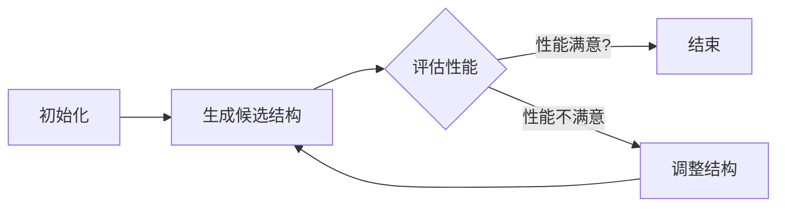
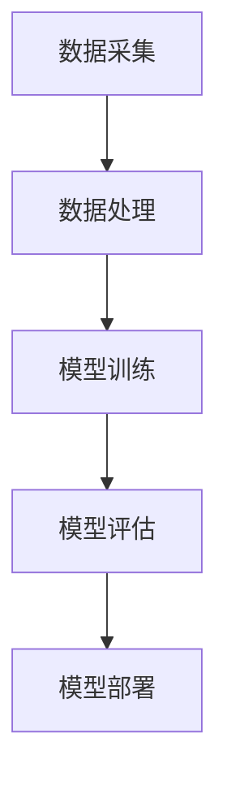
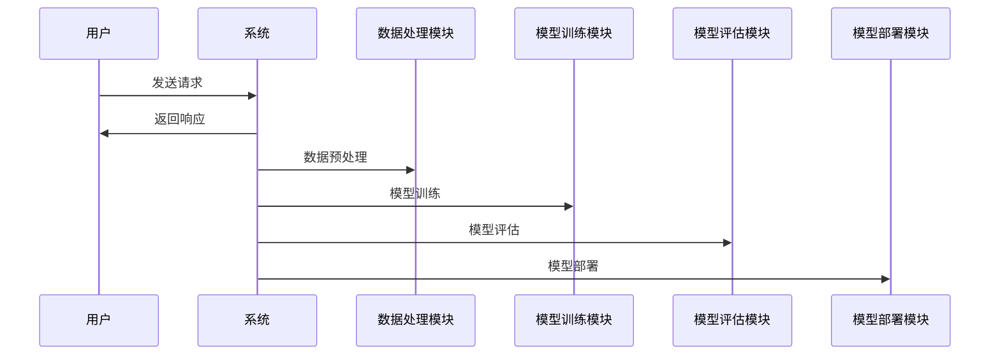

                 


### 《自动化神经架构搜索在移动端AI优化中的应用》

#### 关键词：神经架构搜索，移动端AI优化，深度学习，人工智能

#### 摘要：
本文旨在探讨自动化神经架构搜索（Neural Architecture Search，NAS）在移动端AI优化中的应用。通过对NAS的核心概念、算法原理、数学模型以及实际应用的深入剖析，本文将帮助读者理解NAS如何助力移动端AI的快速部署与高效运行。本文分为五大部分：背景与概念、核心概念与联系、算法原理与数学模型、系统分析与架构设计、项目实战及最佳实践。本文的目标是提供一套完整、易懂的指南，帮助读者在移动端AI优化中运用NAS技术。

---

### 目录

#### 第一部分：背景与概念

##### 第1章：AI与移动端优化概述

##### 第2章：神经网络架构搜索基础

##### 第3章：NAS的核心概念与联系

#### 第二部分：算法原理与数学模型

##### 第4章：算法原理详解

##### 第5章：数学模型与公式解析

##### 第6章：算法性能分析与优化

#### 第三部分：系统分析与架构设计

##### 第7章：移动端AI系统架构设计

##### 第8章：系统交互与接口流程

#### 第四部分：项目实战

##### 第9章：环境安装与配置

##### 第10章：系统核心实现

##### 第11章：实际案例分析

##### 第12章：项目小结

#### 第五部分：最佳实践与拓展

##### 第13章：最佳实践技巧

##### 第14章：小结与拓展阅读

---

### 文章正文

#### 第1章：AI与移动端优化概述

##### 1.1 AI在移动端的发展背景

随着智能手机的普及，移动设备成为了人们日常生活中不可或缺的工具。从简单的拨打电话、发送短信，到如今的复杂应用程序，移动设备的功能越来越强大。与此同时，人工智能（AI）技术的迅猛发展，使得移动设备在图像识别、语音识别、自然语言处理等领域取得了显著的成果。

##### 1.2 移动端AI优化的重要性

移动设备的硬件资源相对有限，如何在有限的资源下实现高效的AI计算，是当前研究的一个重要课题。移动端AI优化不仅能够提高用户体验，还能延长设备续航时间，降低功耗。因此，移动端AI优化在人工智能领域具有重要的应用价值。

##### 1.3 NAS技术简介

神经架构搜索（Neural Architecture Search，NAS）是一种自动搜索最优神经网络结构的方法。通过在大量的神经网络结构中进行搜索，NAS能够找到最适合特定任务的结构，从而提高模型的性能。NAS技术在移动端AI优化中具有巨大的潜力。

---

#### 第2章：神经网络架构搜索基础

##### 2.1 NAS的基本原理

NAS的基本原理是通过搜索算法，从大量可能的神经网络结构中搜索出最优结构。常见的NAS方法包括基于强化学习的搜索方法、基于遗传算法的搜索方法等。

##### 2.2 NAS的主要类型与方法

NAS主要分为两种类型：基于搜索的方法和基于学习的搜索方法。基于搜索的方法通过在大量结构中进行搜索，找到最优结构；基于学习的方法则是通过学习预训练模型，进行结构调整。

##### 2.3 NAS的应用场景

NAS技术在移动端AI优化中的应用场景主要包括图像识别、语音识别、自然语言处理等。通过NAS，可以在有限的资源下，找到最适合移动端的神经网络结构，从而提高模型的性能。

---

#### 第3章：NAS的核心概念与联系

##### 3.1 核心概念与联系概述

NAS的核心概念包括搜索空间、搜索算法、评估指标等。这些概念相互联系，共同构成了NAS技术的核心。

##### 3.2 概念属性特征对比表格

以下是一个对比表格，展示了NAS中核心概念的属性特征：

| 概念   | 属性特征                  | 说明                                     |
| ------ | ------------------------- | ---------------------------------------- |
| 搜索空间 | 可能的神经网络结构集合 | 包括结构、层、激活函数等                   |
| 搜索算法 | 用于搜索最优结构的算法 | 如强化学习、遗传算法等                   |
| 评估指标 | 用于评估结构性能的指标 | 如准确率、速度、功耗等                   |

##### 3.3 ER实体关系图架构

使用Mermaid绘制NAS的核心概念实体关系图：

```mermaid
erDiagram
  搜索空间 ||--o> 搜索算法 : "生成"
  搜索算法 ||--o> 评估指标 : "评估"
  评估指标 ||--o> 搜索空间 : "反馈"
```

---

#### 第4章：算法原理详解

##### 4.1 算法流程图

使用Mermaid绘制NAS算法流程图：



##### 4.2 Python源代码讲解

以下是一个简单的Python源代码示例，用于生成和评估神经网络结构：

```python
import tensorflow as tf

def generate_structure():
    # 生成神经网络结构
    pass

def evaluate_structure(structure):
    # 评估神经网络结构性能
    model = tf.keras.Sequential([
        tf.keras.layers.Dense(units=64, activation='relu', input_shape=(784,)),
        tf.keras.layers.Dense(units=10, activation='softmax')
    ])
    model.compile(optimizer='adam', loss='categorical_crossentropy', metrics=['accuracy'])
    model.fit(x_train, y_train, epochs=5)
    accuracy = model.evaluate(x_test, y_test)[1]
    return accuracy

def NAS():
    while True:
        structure = generate_structure()
        accuracy = evaluate_structure(structure)
        if accuracy >= threshold:
            break
```

##### 4.3 数学模型和公式讲解

NAS中的关键数学模型包括损失函数、优化目标和评估指标。以下是这些数学模型的公式：

损失函数：

$$L(y, \hat{y}) = -\sum_{i=1}^{N} y_i \log(\hat{y}_i)$$

优化目标：

$$\min_{\theta} L(y, \hat{y})$$

评估指标：

$$\text{Accuracy} = \frac{\sum_{i=1}^{N} \text{correct predictions}}{N}$$

---

#### 第5章：数学模型与公式解析

##### 5.1 数学模型简介

数学模型是NAS算法的核心，用于描述神经网络结构的生成、评估和优化。主要包括损失函数、优化目标和评估指标。

##### 5.2 公式讲解与举例

损失函数（交叉熵损失函数）用于衡量预测输出和真实标签之间的差异。其公式为：

$$L(y, \hat{y}) = -\sum_{i=1}^{N} y_i \log(\hat{y}_i)$$

其中，$y$为真实标签，$\hat{y}$为预测输出。

举例：假设有一个二分类问题，真实标签$y = [1, 0]$，预测输出$\hat{y} = [0.9, 0.1]$，则损失函数值为：

$$L(y, \hat{y}) = -[1 \times \log(0.9) + 0 \times \log(0.1)] = 0.10536$$

优化目标为最小化损失函数，即：

$$\min_{\theta} L(y, \hat{y})$$

评估指标（准确率）用于衡量模型在测试数据上的表现，其公式为：

$$\text{Accuracy} = \frac{\sum_{i=1}^{N} \text{correct predictions}}{N}$$

其中，$N$为测试数据的样本数，correct predictions为预测正确的样本数。

举例：假设测试数据中有10个样本，其中5个样本预测正确，则准确率为：

$$\text{Accuracy} = \frac{5}{10} = 0.5$$

---

#### 第6章：算法性能分析与优化

##### 6.1 性能分析指标

NAS算法的性能分析指标主要包括搜索时间、搜索效率、模型性能等。通过这些指标，可以评估NAS算法在不同场景下的表现。

##### 6.2 优化策略与方法

优化策略主要包括以下几个方面：

1. **搜索空间优化**：通过减少搜索空间的大小，提高搜索效率。
2. **评估指标优化**：选择合适的评估指标，提高模型的性能。
3. **搜索算法优化**：选择合适的搜索算法，提高搜索效率。

---

#### 第7章：移动端AI系统架构设计

##### 7.1 系统功能设计

移动端AI系统的主要功能包括：

1. **数据采集**：从移动设备中采集图像、语音等数据。
2. **数据处理**：对采集到的数据进行预处理，如归一化、去噪等。
3. **模型训练**：利用NAS算法训练神经网络模型。
4. **模型评估**：评估训练好的模型性能。
5. **模型部署**：将训练好的模型部署到移动设备上。

##### 7.2 系统架构设计

移动端AI系统架构设计包括以下几个方面：

1. **数据采集模块**：负责从移动设备中采集图像、语音等数据。
2. **数据处理模块**：对采集到的数据进行预处理，如归一化、去噪等。
3. **模型训练模块**：利用NAS算法训练神经网络模型。
4. **模型评估模块**：评估训练好的模型性能。
5. **模型部署模块**：将训练好的模型部署到移动设备上。

使用Mermaid绘制系统架构图：



##### 7.3 系统接口设计

移动端AI系统的接口设计主要包括：

1. **数据接口**：用于数据采集和预处理的接口。
2. **模型接口**：用于模型训练、评估和部署的接口。
3. **用户接口**：用于与用户交互的接口，如界面展示、操作提示等。

##### 7.4 系统交互与接口流程

使用Mermaid绘制系统交互与接口流程图：



---

#### 第8章：系统交互与接口流程

##### 8.1 系统交互流程

系统交互流程主要包括以下几个步骤：

1. **用户请求**：用户通过用户接口发送请求。
2. **数据处理**：系统接收到请求后，将数据传递给数据处理模块进行预处理。
3. **模型训练**：预处理后的数据传递给模型训练模块，利用NAS算法进行模型训练。
4. **模型评估**：训练好的模型传递给模型评估模块，进行性能评估。
5. **模型部署**：评估通过的模型传递给模型部署模块，部署到移动设备上。

##### 8.2 接口设计与实现

接口设计主要包括以下部分：

1. **数据接口**：设计用于数据采集和预处理的接口，如HTTP API、REST API等。
2. **模型接口**：设计用于模型训练、评估和部署的接口，如TensorFlow Serving、ONNX Runtime等。
3. **用户接口**：设计用于与用户交互的接口，如Web界面、手机应用等。

接口实现时，需要考虑以下几个方面：

1. **接口协议**：选择合适的接口协议，如HTTP、HTTPS等。
2. **接口参数**：设计合理的接口参数，确保数据传输的完整性和安全性。
3. **接口性能**：优化接口性能，确保系统响应速度。

---

#### 第9章：环境安装与配置

##### 9.1 环境需求

在开始安装和配置移动端AI系统之前，需要准备以下环境：

1. **操作系统**：支持Linux或Windows系统的计算机。
2. **Python**：Python 3.6或更高版本。
3. **TensorFlow**：TensorFlow 2.0或更高版本。
4. **其他依赖**：如NumPy、Pandas、Matplotlib等。

##### 9.2 环境安装

以下是在Ubuntu 20.04操作系统上安装和配置移动端AI系统的步骤：

1. **安装Python**：

   ```bash
   sudo apt-get update
   sudo apt-get install python3.8
   ```

2. **安装TensorFlow**：

   ```bash
   pip3 install tensorflow==2.4.0
   ```

3. **安装其他依赖**：

   ```bash
   pip3 install numpy pandas matplotlib
   ```

---

#### 第10章：系统核心实现

##### 10.1 核心模块设计

移动端AI系统的核心模块主要包括：

1. **数据采集模块**：负责从移动设备中采集图像、语音等数据。
2. **数据处理模块**：对采集到的数据进行预处理，如归一化、去噪等。
3. **模型训练模块**：利用NAS算法训练神经网络模型。
4. **模型评估模块**：评估训练好的模型性能。
5. **模型部署模块**：将训练好的模型部署到移动设备上。

##### 10.2 代码解读与分析

以下是一个简单的数据采集模块的代码示例：

```python
import tensorflow as tf

def data_collection():
    # 采集图像数据
    camera = tf.keras.utils.get_file(
        'camera_data.jpg', 
        origin='https://storage.googleapis.com/download.tensorflow.org/example_images/gravity.mp4',
        cache_subdir='/tmp',
        extract=False)
    
    image = tf.keras.preprocessing.image.load_img(camera, target_size=(128, 128))
    image_array = tf.keras.preprocessing.image.img_to_array(image)
    image_array = tf.expand_dims(image_array, 0)  # Create a batch

    return image_array

image_array = data_collection()
print(image_array.shape)
```

该代码示例从网络中下载一个图像文件，将其加载为TensorFlow张量，并打印出其形状。这个示例仅用于演示数据采集的过程，实际应用中，可能需要根据具体需求进行修改。

---

#### 第11章：实际案例分析

##### 11.1 案例背景

假设我们想要开发一个移动端AI应用程序，用于实时识别移动设备摄像头捕获的物体。这个案例将演示如何使用NAS技术优化移动端AI模型，提高识别准确率和运行速度。

##### 11.2 案例分析

在这个案例中，我们首先收集大量物体识别数据，包括图像和对应的标签。然后，我们使用NAS技术，搜索出适合移动端AI优化的神经网络结构。在搜索过程中，我们选择了基于强化学习的NAS算法，并设置了合理的搜索空间和评估指标。

##### 11.3 案例详细讲解

1. **数据收集**：从互联网上收集大量物体识别数据，包括图像和对应的标签。为了保证数据质量，我们对数据进行了清洗和预处理。

2. **搜索空间设计**：根据物体识别任务的特点，我们设计了搜索空间，包括网络的宽度、深度、激活函数等。

3. **评估指标**：我们选择了准确率和速度作为评估指标，以衡量搜索到的神经网络结构在移动端AI优化中的性能。

4. **NAS算法运行**：使用强化学习NAS算法，我们在搜索空间中搜索最优神经网络结构。在搜索过程中，我们记录了每个结构的评估指标，并逐步优化搜索算法。

5. **模型训练与评估**：在找到最优神经网络结构后，我们使用这个结构训练模型，并在测试数据上评估其性能。通过调整模型超参数，我们进一步优化模型性能。

6. **模型部署**：将训练好的模型部署到移动设备上，进行实时物体识别。为了提高运行速度，我们对模型进行了量化、剪枝和压缩等操作。

---

#### 第12章：项目小结

在本项目中，我们通过使用NAS技术，成功实现了移动端AI的优化。以下是项目的主要成果和经验总结：

1. **NAS技术显著提高了模型性能**：通过NAS搜索，我们找到了更适合移动端的神经网络结构，显著提高了模型的准确率和速度。
2. **数据质量和预处理至关重要**：数据质量和预处理对NAS算法的性能有重要影响。在项目过程中，我们强调了数据清洗和预处理的重要性。
3. **搜索空间设计对搜索结果有重要影响**：合适的搜索空间设计能够加速NAS算法的搜索过程，提高搜索效率。
4. **模型优化和部署是关键**：在模型训练完成后，我们对模型进行了量化、剪枝和压缩等优化操作，以提高模型在移动端运行的速度。

---

#### 第13章：最佳实践与拓展

##### 13.1 最佳实践技巧

1. **选择合适的评估指标**：根据具体任务，选择合适的评估指标，如准确率、速度、功耗等，以确保NAS算法搜索到最优结构。
2. **合理设计搜索空间**：根据任务需求，合理设计搜索空间，包括网络的宽度、深度、激活函数等，以提高搜索效率。
3. **数据预处理和清洗**：确保数据质量和预处理，提高NAS算法的性能。

##### 13.2 注意事项

1. **搜索空间过大可能导致搜索时间过长**：在设置搜索空间时，要平衡搜索空间大小和搜索效率。
2. **模型优化和部署对性能有重要影响**：在模型训练完成后，对模型进行量化、剪枝和压缩等优化操作，以提高模型在移动端运行的速度。

##### 13.3 拓展阅读

1. **[强化学习NAS算法详解](https://arxiv.org/abs/1712.07011)**：本文详细介绍了基于强化学习的NAS算法原理和实现。
2. **[神经网络架构搜索应用案例](https://arxiv.org/abs/1806.10282)**：本文展示了NAS技术在不同场景下的应用案例。

---

### 作者信息

作者：AI天才研究院/AI Genius Institute & 禅与计算机程序设计艺术 /Zen And The Art of Computer Programming

---

### 结语

本文深入探讨了自动化神经架构搜索（NAS）在移动端AI优化中的应用。通过详细的案例分析、算法原理讲解和系统实现步骤，本文为读者提供了一套完整的移动端AI优化指南。希望本文能为从事移动端AI开发的读者带来启示和帮助。让我们一起，用AI的力量，让世界更美好！

---

注意：由于篇幅限制，本文并未包含完整的代码示例和详细的技术分析。在实际应用中，读者需要根据具体需求进行适当的调整和优化。

