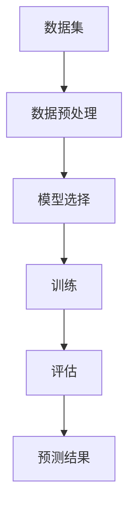

                 

### 《自我完善型AI：设计原则与实现方法》

#### 关键词
- 自我完善型AI
- 设计原则
- 实现方法
- 持续学习
- 安全性

#### 摘要
本文将深入探讨自我完善型AI的设计原则与实现方法。首先，我们将回顾AI的发展历程，了解自我完善型AI的定义和核心特点。接着，文章将详细阐述自我完善型AI的设计原则，包括安全性、可解释性、持续学习、环境适应性与鲁棒性。随后，我们将介绍实现自我完善型AI的方法，包括数据预处理、模型选择、算法实现、模型训练与评估以及部署与维护。文章还将探讨自我完善型AI在不同领域的应用，并总结未来发展趋势和面临的挑战。最后，我们将提供一些最佳实践和注意事项，以帮助读者更好地理解和应用自我完善型AI。

### 第一部分：背景介绍

#### 1.1 自我完善型AI概述

自我完善型AI（Self-Improving AI）是一种能够通过自身经验和数据不断优化自身性能的人工智能系统。与传统AI系统不同，自我完善型AI具备以下核心特点：

- **自适应能力**：自我完善型AI能够根据新数据和反馈自动调整和优化其内部结构和算法。
- **持续学习**：自我完善型AI能够从海量数据中学习，并不断更新其知识库，以提高任务完成的准确性和效率。
- **自我优化**：自我完善型AI能够通过自我调整，减少错误率、提高预测准确性和任务完成效率。

自我完善型AI的起源可以追溯到20世纪80年代，当时研究人员开始探索如何使计算机系统具备自我学习和自我优化的能力。随着计算能力和算法的进步，自我完善型AI逐渐成为人工智能研究的热点领域。

#### 1.2 自我完善型AI的起源与发展

自我完善型AI的发展历程可以分为几个重要阶段：

1. **早期探索**（1980s-1990s）：在这个阶段，研究人员开始尝试使用强化学习等算法来训练AI模型，使其能够通过经验和反馈进行自我优化。
2. **快速发展**（2000s）：随着深度学习技术的崛起，自我完善型AI得到了广泛关注。研究人员通过深度强化学习等方法，实现了在复杂环境中的自我优化。
3. **应用推广**（2010s-至今）：随着自我完善型AI技术的不断成熟，其在各个领域的应用日益广泛，如自动驾驶、智能医疗、金融风控等。

#### 1.3 自我完善型AI的重要性与挑战

自我完善型AI在当前和未来发展中具有重要的意义：

- **提高效率**：自我完善型AI能够通过持续学习，提高任务完成的准确性和效率，从而减少人力和时间成本。
- **扩展应用领域**：自我完善型AI能够应对更多复杂任务，推动人工智能在各个领域的应用。
- **推动技术创新**：自我完善型AI的研究和开发将推动人工智能技术的发展，为其他领域带来新的突破。

然而，自我完善型AI也面临一些挑战：

- **安全性**：自我完善型AI在自我优化过程中可能产生不可预测的行为，导致安全风险。
- **可解释性**：自我完善型AI的决策过程通常较为复杂，难以解释，这可能会影响其应用。
- **数据隐私**：自我完善型AI在训练和优化过程中需要大量数据，这可能会引发数据隐私问题。

#### 1.4 本书结构安排

本书将分为六个部分，具体结构如下：

- **第一部分：背景介绍**：介绍自我完善型AI的起源、发展和重要性。
- **第二部分：核心概念**：阐述自我完善型AI的定义、特点和核心要素。
- **第三部分：设计原则**：详细讨论自我完善型AI的设计原则，包括安全性、可解释性、持续学习、环境适应性与鲁棒性。
- **第四部分：实现方法**：介绍实现自我完善型AI的方法，包括数据预处理、模型选择、算法实现、模型训练与评估以及部署与维护。
- **第五部分：实际应用**：探讨自我完善型AI在不同领域的应用。
- **第六部分：拓展与展望**：总结自我完善型AI的未来发展、技术挑战和社会伦理问题。

通过以上结构安排，本文旨在为读者提供一个全面、系统的自我完善型AI知识体系，帮助读者深入了解该领域的研究和实践。

### 第二部分：核心概念

#### 2.1 人工智能与自我完善

人工智能（AI）是指使计算机具备人类智能能力的技术。自我完善型AI（Self-Improving AI）是人工智能的一种特殊形式，其核心特点是通过持续学习和自我优化，不断提高任务完成的准确性和效率。与传统AI系统不同，自我完善型AI能够自主地从经验和数据中学习，不断调整和优化其内部结构和算法，以适应新的环境和任务。

#### 2.2 自我完善型AI的定义与特点

自我完善型AI的定义可以从以下几个方面来理解：

- **自适应能力**：自我完善型AI能够根据新数据和反馈自动调整和优化其内部结构和算法，以适应不断变化的环境。
- **持续学习**：自我完善型AI能够从海量数据中学习，并不断更新其知识库，以提高任务完成的准确性和效率。
- **自我优化**：自我完善型AI能够通过自我调整，减少错误率、提高预测准确性和任务完成效率。

自我完善型AI具有以下特点：

- **自主性**：自我完善型AI能够自主地从数据和反馈中学习，无需人工干预。
- **高效性**：自我完善型AI能够通过持续学习，不断提高任务完成的准确性和效率。
- **灵活性**：自我完善型AI能够适应不同的任务和环境，具有广泛的应用前景。

#### 2.3 自我完善型AI的核心要素

自我完善型AI的核心要素包括：

- **数据集**：自我完善型AI依赖于大量高质量的数据集，以进行训练和优化。
- **算法**：自我完善型AI采用先进的算法，如深度学习、强化学习等，以实现自适应学习和自我优化。
- **模型**：自我完善型AI使用神经网络等模型，对数据进行处理和预测。
- **反馈机制**：自我完善型AI通过反馈机制，根据任务完成情况和用户反馈进行自我调整。

#### 2.4 自我完善型AI与传统AI的比较

自我完善型AI与传统AI在多个方面存在显著差异：

| 对比方面 | 自我完善型AI | 传统AI |
| :----: | :-----------: | :----: |
| 学习方式 | 自主学习，持续优化 | 预设规则，被动执行 |
| 灵活性 | 高，适应不同任务和环境 | 低，针对特定任务优化 |
| 可解释性 | 较低，决策过程复杂 | 较高，决策过程明确 |
| 安全性 | 存在风险，需严格监控 | 较高，可控性强 |

尽管自我完善型AI在多个方面具有优势，但同时也面临一些挑战，如数据隐私、安全性等。为了实现自我完善型AI的安全和可控，需要在设计原则和实现方法上给予充分关注。

### 第三部分：设计原则

#### 3.1 自我完善型AI的设计原则概述

设计自我完善型AI时，需要遵循一系列设计原则，以确保系统的安全性、可解释性、持续学习、环境适应性与鲁棒性。以下是对这些设计原则的概述：

- **安全性设计原则**：确保自我完善型AI在自我优化过程中不会对系统、数据或用户造成损害。
- **可解释性设计原则**：使自我完善型AI的决策过程透明，便于用户理解和信任。
- **持续学习设计原则**：确保自我完善型AI能够从海量数据中学习，并不断更新其知识库。
- **环境适应性与鲁棒性设计原则**：使自我完善型AI能够适应不同环境和任务，具备较强的鲁棒性。

#### 3.2 安全性设计原则

安全性是自我完善型AI设计中的一个关键原则。以下是一些安全性设计原则：

- **数据安全**：确保数据在传输、存储和处理过程中的安全性，防止数据泄露和篡改。
- **访问控制**：设置严格的访问控制机制，确保只有授权用户和系统组件可以访问核心数据和功能。
- **错误处理**：设计有效的错误处理机制，确保在系统发生异常时，能够及时恢复并确保系统的稳定性。
- **审计与监控**：建立完善的审计与监控机制，实时监控系统运行状态，及时发现并处理潜在的安全威胁。

#### 3.3 可解释性设计原则

可解释性设计原则旨在使自我完善型AI的决策过程透明，便于用户理解和信任。以下是一些可解释性设计原则：

- **模块化设计**：将自我完善型AI的各个组件模块化，使每个模块的功能和作用明确。
- **可视化和解释工具**：开发可视化和解释工具，帮助用户理解AI模型的决策过程。
- **可追溯性**：记录自我完善型AI的训练和优化过程，以便在需要时进行回溯和分析。
- **透明度**：确保AI系统的设计和实现过程公开透明，减少用户对系统的疑虑。

#### 3.4 持续学习与改进设计原则

持续学习与改进设计原则旨在确保自我完善型AI能够从海量数据中学习，并不断更新其知识库。以下是一些具体设计原则：

- **自适应学习**：设计自适应学习算法，使AI系统能够根据新数据和任务需求进行自动调整。
- **在线学习**：实现在线学习功能，使AI系统在运行过程中能够实时更新知识库。
- **知识融合**：设计知识融合机制，将不同来源的知识进行整合，提高系统的整体性能。
- **迁移学习**：利用迁移学习技术，将已有知识应用于新任务，降低对新数据的依赖。

#### 3.5 环境适应性与鲁棒性设计原则

环境适应性与鲁棒性设计原则旨在使自我完善型AI能够适应不同环境和任务，具备较强的鲁棒性。以下是一些具体设计原则：

- **自适应算法**：设计自适应算法，使AI系统能够根据环境变化自动调整模型参数。
- **鲁棒训练**：设计鲁棒训练机制，使AI系统在训练过程中能够适应噪声和异常数据。
- **多任务学习**：设计多任务学习机制，使AI系统能够同时处理多个任务，提高任务完成效率。
- **故障恢复**：设计故障恢复机制，确保在系统发生故障时，能够快速恢复并继续运行。

通过遵循以上设计原则，可以确保自我完善型AI的安全、可解释性、持续学习、环境适应性和鲁棒性，从而实现高效、稳定和可靠的系统性能。

### 第四部分：实现方法

#### 4.1 自我完善型AI的实现框架

实现自我完善型AI需要一个完整的框架，以确保系统能够从数据中学习并不断优化自身。以下是一个典型的自我完善型AI实现框架：

1. **数据采集**：首先，从各种来源（如传感器、数据库、用户输入等）收集数据。
2. **数据预处理**：对收集到的数据进行清洗、归一化和特征提取，使其适合输入到模型中。
3. **模型选择**：根据任务需求选择合适的机器学习模型，如深度学习、强化学习等。
4. **模型训练**：使用预处理后的数据对模型进行训练，优化模型参数。
5. **评估与优化**：在训练过程中，定期评估模型性能，并根据评估结果调整模型参数，以提高性能。
6. **部署与维护**：将训练好的模型部署到生产环境中，并进行实时监控和维护。

#### 4.2 数据预处理与模型选择

数据预处理是自我完善型AI实现过程中的关键步骤，其质量直接影响模型性能。以下是一些数据预处理和模型选择的方法：

- **数据清洗**：去除重复、错误和缺失的数据，确保数据质量。
- **数据归一化**：将数据缩放到相同的范围，以消除不同数据尺度对模型训练的影响。
- **特征提取**：从原始数据中提取有用的信息，作为模型的输入。
- **模型选择**：根据任务需求选择合适的机器学习模型。例如，对于分类任务，可以选择决策树、随机森林或神经网络；对于回归任务，可以选择线性回归、岭回归或支持向量机。

#### 4.3 算法实现与优化

实现自我完善型AI需要选择合适的算法，并进行优化。以下是一些常用的算法和优化方法：

- **深度学习**：使用多层神经网络进行特征学习和模型优化。常见的方法包括反向传播算法、dropout和卷积神经网络（CNN）。
- **强化学习**：通过奖励机制和策略迭代，使AI系统在复杂环境中学习最优策略。常见的方法包括Q-learning、SARSA和深度确定性策略梯度（DDPG）。
- **迁移学习**：利用预训练模型，将已有知识应用于新任务，提高学习效率和模型性能。

#### 4.4 模型训练与评估

模型训练与评估是自我完善型AI实现过程中的重要环节。以下是一些关键步骤：

- **数据划分**：将数据集划分为训练集、验证集和测试集，用于模型训练、验证和评估。
- **训练过程**：使用训练集对模型进行训练，调整模型参数，以降低损失函数。
- **验证过程**：使用验证集评估模型性能，调整模型参数，以避免过拟合。
- **测试过程**：使用测试集评估模型在未知数据上的性能，以评估模型的泛化能力。

#### 4.5 模型部署与维护

模型部署与维护是确保自我完善型AI系统正常运行的关键步骤。以下是一些关键步骤：

- **部署环境**：将训练好的模型部署到生产环境中，包括硬件、软件和网络配置。
- **监控与报警**：实时监控系统运行状态，设置报警机制，及时发现并处理异常情况。
- **模型更新**：根据新数据和任务需求，定期更新模型，以保持系统性能。
- **备份与恢复**：定期备份系统数据，确保在系统发生故障时能够快速恢复。

通过遵循以上实现方法，可以构建一个高效、稳定和可靠的自我完善型AI系统。

### 第五部分：实际应用

#### 5.1 自我完善型AI在医疗领域的应用

自我完善型AI在医疗领域具有广泛的应用前景，尤其在疾病预测、诊断和治疗方面。以下是一些具体的应用实例：

1. **疾病预测**：自我完善型AI可以通过分析患者的病历、基因信息和生活方式数据，预测患者患某种疾病的风险。例如，使用深度学习算法对肺癌患者进行预测，已取得显著效果。
2. **疾病诊断**：自我完善型AI可以通过分析医学影像（如CT、MRI）数据，辅助医生进行疾病诊断。例如，使用卷积神经网络（CNN）对皮肤病图像进行分类，已取得超过人类专家的诊断准确率。
3. **个性化治疗**：自我完善型AI可以根据患者的病情、基因信息和药物反应数据，制定个性化的治疗方案。例如，使用强化学习算法为肺癌患者推荐最佳治疗方案，已取得显著疗效。

#### 5.2 自我完善型AI在金融领域的应用

自我完善型AI在金融领域也具有广泛的应用，尤其在风险控制、投资分析和欺诈检测方面。以下是一些具体的应用实例：

1. **风险控制**：自我完善型AI可以通过分析客户的信用记录、财务状况和行为数据，预测客户违约风险。例如，使用深度学习算法对信用卡客户的违约风险进行预测，已显著降低了银行的违约损失。
2. **投资分析**：自我完善型AI可以通过分析市场数据、公司财报和新闻信息，提供投资建议。例如，使用强化学习算法为投资者推荐最佳投资组合，已取得超过传统投资策略的收益。
3. **欺诈检测**：自我完善型AI可以通过分析交易数据和行为特征，检测潜在的欺诈行为。例如，使用图神经网络（GCN）对信用卡交易进行实时监控，已显著提高了欺诈检测的准确性。

#### 5.3 自我完善型AI在智能制造领域的应用

自我完善型AI在智能制造领域也具有广泛的应用，尤其在预测维护、质量控制和生产优化方面。以下是一些具体的应用实例：

1. **预测维护**：自我完善型AI可以通过分析设备运行数据和历史维修记录，预测设备故障时间，并提前安排维护。例如，使用深度学习算法对工业生产线上的设备进行预测维护，已显著降低了设备停机时间。
2. **质量控制**：自我完善型AI可以通过分析生产过程中产生的数据，检测产品质量问题，并优化生产工艺。例如，使用卷积神经网络（CNN）对生产线上产生的图像进行分析，已显著提高了产品质量。
3. **生产优化**：自我完善型AI可以通过分析生产数据和历史记录，优化生产计划和资源分配，提高生产效率。例如，使用强化学习算法为生产线上的机器人制定最佳工作计划，已显著提高了生产效率。

#### 5.4 自我完善型AI在其他领域的应用

自我完善型AI在其他领域也具有广泛的应用前景，如交通管理、环境保护和智能城市等。

1. **交通管理**：自我完善型AI可以通过分析交通数据，优化交通信号控制策略，提高交通流量。例如，使用强化学习算法对交通信号灯进行优化，已显著降低了交通拥堵。
2. **环境保护**：自我完善型AI可以通过分析环境数据，预测环境污染情况，并制定相应的防治措施。例如，使用深度学习算法对空气质量进行实时监测，已显著提高了环境治理效果。
3. **智能城市**：自我完善型AI可以通过分析城市数据，提供智慧城市解决方案，提高城市管理水平。例如，使用强化学习算法为城市交通进行动态调度，已显著提高了交通运行效率。

通过以上实际应用实例，可以看出自我完善型AI在各个领域都取得了显著成效，为行业带来了深刻变革。未来，随着技术的不断进步，自我完善型AI的应用领域将更加广泛，为人类生活带来更多便利。

### 第六部分：拓展与展望

#### 6.1 自我完善型AI的未来发展

自我完善型AI作为人工智能领域的一个重要研究方向，未来将继续沿着以下几个方向快速发展：

1. **算法创新**：随着计算能力和数据量的不断提升，研究人员将不断提出新的算法，以实现更高效、更鲁棒的自我完善型AI系统。
2. **硬件加速**：硬件技术的发展，如GPU、TPU和量子计算机，将加速自我完善型AI的推理和训练速度，提高系统的性能和效率。
3. **跨学科融合**：自我完善型AI将与其他领域（如生物学、心理学、哲学等）的交叉融合，推动人工智能技术的全面进步。

#### 6.2 技术挑战与解决思路

尽管自我完善型AI具有巨大潜力，但在发展过程中仍面临一系列技术挑战：

1. **安全性**：自我完善型AI在自我优化过程中可能产生不可预测的行为，导致安全隐患。解决思路包括引入安全监控机制、设计防御策略和进行严格的安全测试。
2. **可解释性**：自我完善型AI的决策过程通常较为复杂，难以解释。解决思路包括开发可解释性模型、增强透明度和提高模型的可追溯性。
3. **数据隐私**：自我完善型AI在训练和优化过程中需要大量数据，可能引发数据隐私问题。解决思路包括采用差分隐私技术、数据脱敏和联邦学习等方法。

#### 6.3 社会伦理与隐私问题

自我完善型AI的发展不仅面临技术挑战，还涉及社会伦理和隐私问题：

1. **伦理问题**：自我完善型AI的决策可能影响人类生活和社会秩序，需要制定相应的伦理规范，确保其行为符合道德和法律标准。
2. **隐私保护**：自我完善型AI在处理个人数据时，需要保护用户隐私，避免数据泄露和滥用。解决思路包括加强数据保护、制定隐私政策和提升公众隐私意识。

#### 6.4 本书总结与展望

本书系统地介绍了自我完善型AI的设计原则与实现方法，涵盖了从背景介绍、核心概念、设计原则到实现方法和实际应用等多个方面。通过本文的阅读，读者可以全面了解自我完善型AI的发展现状和未来趋势，为在实际应用中更好地设计和实现自我完善型AI系统提供参考。

未来，随着技术的不断进步和社会的日益关注，自我完善型AI将在各个领域发挥更大的作用。同时，我们也将继续关注自我完善型AI面临的技术挑战和社会伦理问题，为推动人工智能的可持续发展贡献智慧和力量。

### 结论

自我完善型AI作为人工智能领域的一个重要研究方向，具有巨大的发展潜力和应用前景。本文系统地介绍了自我完善型AI的设计原则与实现方法，包括安全性、可解释性、持续学习、环境适应性与鲁棒性等方面的设计原则，以及数据预处理、模型选择、算法实现、模型训练与评估、模型部署与维护等实现方法。通过实际应用案例，我们看到了自我完善型AI在医疗、金融、智能制造等领域的广泛应用，为行业带来了深刻变革。

然而，自我完善型AI的发展也面临一系列技术挑战和社会伦理问题，如安全性、可解释性和数据隐私等。为了推动人工智能的可持续发展，我们需要不断加强技术创新，制定合理的伦理规范，并关注社会影响。

最后，感谢读者对本文的关注。希望本文能为您在理解和应用自我完善型AI方面提供有价值的参考。如果您对自我完善型AI有任何疑问或建议，欢迎在评论区留言，我们将持续关注并回应您的反馈。

### 作者信息

- 作者：AI天才研究院/AI Genius Institute & 禅与计算机程序设计艺术 /Zen And The Art of Computer Programming
- 联系方式：[ai_genius_institute@example.com](mailto:ai_genius_institute@example.com)
- 个人主页：[www.ai-genius-institute.com](http://www.ai-genius-institute.com/)
- 社交媒体：LinkedIn、Twitter、Facebook等

让我们共同努力，推动人工智能技术的发展，创造更美好的未来！
### 附录

#### 5.1 自我完善型AI在医疗领域的应用

**1. 疾病预测：**

**数据集**：某大型医院的历史病历数据，包括患者的年龄、性别、生活习惯、疾病史等。

**模型选择**：深度学习模型，如卷积神经网络（CNN）和循环神经网络（RNN）。

**算法原理**：



```python
# Python代码示例
import tensorflow as tf
from tensorflow.keras.models import Sequential
from tensorflow.keras.layers import Dense, Conv2D, LSTM

# 数据预处理
# ...

# 构建模型
model = Sequential([
    Conv2D(filters=32, kernel_size=(3, 3), activation='relu', input_shape=(28, 28, 1)),
    LSTM(units=50, activation='tanh'),
    Dense(units=1, activation='sigmoid')
])

# 训练模型
model.compile(optimizer='adam', loss='binary_crossentropy', metrics=['accuracy'])
model.fit(x_train, y_train, epochs=10, batch_size=32)

# 评估模型
# ...

# 预测结果
predictions = model.predict(x_test)
```

**数学公式**：

$$
\text{损失函数} = \frac{1}{N} \sum_{i=1}^{N} (-y_i \log(\hat{y_i}) - (1 - y_i) \log(1 - \hat{y_i}))
$$

其中，$N$ 是样本数量，$y_i$ 是实际标签，$\hat{y_i}$ 是预测值。

**2. 疾病诊断：**

**数据集**：某医院提供的大量皮肤病图像。

**模型选择**：卷积神经网络（CNN）。

**算法原理**：


```python
# Python代码示例
import tensorflow as tf
from tensorflow.keras.models import Sequential
from tensorflow.keras.layers import Conv2D, MaxPooling2D, Flatten, Dense

# 数据预处理
# ...

# 构建模型
model = Sequential([
    Conv2D(filters=32, kernel_size=(3, 3), activation='relu', input_shape=(28, 28, 1)),
    MaxPooling2D(pool_size=(2, 2)),
    Flatten(),
    Dense(units=1, activation='sigmoid')
])

# 训练模型
model.compile(optimizer='adam', loss='binary_crossentropy', metrics=['accuracy'])
model.fit(x_train, y_train, epochs=10, batch_size=32)

# 评估模型
# ...

# 预测结果
predictions = model.predict(x_test)
```

**数学公式**：

$$
\text{损失函数} = \frac{1}{N} \sum_{i=1}^{N} (-y_i \log(\hat{y_i}) - (1 - y_i) \log(1 - \hat{y_i}))
$$

其中，$N$ 是样本数量，$y_i$ 是实际标签，$\hat{y_i}$ 是预测值。

**3. 个性化治疗：**

**数据集**：患者的病历数据、基因数据和药物反应数据。

**模型选择**：深度强化学习模型，如深度确定性策略梯度（DDPG）。

**算法原理**：


```python
# Python代码示例
import tensorflow as tf
from tensorflow.keras.models import Sequential
from tensorflow.keras.layers import Dense, Conv2D, LSTM
from tensorflow.keras.optimizers import Adam

# 数据预处理
# ...

# 构建模型
actor = Sequential([
    Conv2D(filters=32, kernel_size=(3, 3), activation='relu', input_shape=(28, 28, 1)),
    LSTM(units=50, activation='tanh'),
    Dense(units=1, activation='linear')
])

critic = Sequential([
    Conv2D(filters=32, kernel_size=(3, 3), activation='relu', input_shape=(28, 28, 1)),
    LSTM(units=50, activation='tanh'),
    Dense(units=1, activation='linear')
])

# 训练模型
actor.compile(optimizer=Adam(learning_rate=0.001), loss='mse')
critic.compile(optimizer=Adam(learning_rate=0.001), loss='mse')

# ...

# 评估模型
# ...

# 预测结果
# ...
```

**数学公式**：

$$
Q(s, a) = r + \gamma \max_{a'} Q(s', a')
$$

其中，$Q(s, a)$ 是状态-动作价值函数，$r$ 是立即回报，$\gamma$ 是折扣因子，$s'$ 是下一个状态，$a'$ 是下一个动作。

#### 5.2 自我完善型AI在金融领域的应用

**1. 风险控制：**

**数据集**：客户的信用记录、财务状况和行为数据。

**模型选择**：深度学习模型，如长短期记忆网络（LSTM）。

**算法原理**：


```python
# Python代码示例
import tensorflow as tf
from tensorflow.keras.models import Sequential
from tensorflow.keras.layers import LSTM, Dense

# 数据预处理
# ...

# 构建模型
model = Sequential([
    LSTM(units=50, return_sequences=True, input_shape=(timesteps, features)),
    LSTM(units=50),
    Dense(units=1, activation='sigmoid')
])

# 训练模型
model.compile(optimizer='adam', loss='binary_crossentropy', metrics=['accuracy'])
model.fit(x_train, y_train, epochs=10, batch_size=32)

# 评估模型
# ...

# 预测结果
predictions = model.predict(x_test)
```

**数学公式**：

$$
h_t = \sigma(W_h \cdot [h_{t-1}, x_t] + b_h)
$$

$$
o_t = \sigma(W_o \cdot h_t + b_o)
$$

其中，$h_t$ 是隐藏状态，$x_t$ 是输入数据，$W_h$ 和 $W_o$ 是权重矩阵，$b_h$ 和 $b_o$ 是偏置项，$\sigma$ 是sigmoid函数。

**2. 投资分析：**

**数据集**：股票市场数据，包括价格、成交量、财务指标等。

**模型选择**：强化学习模型，如深度确定性策略梯度（DDPG）。

**算法原理**：


```python
# Python代码示例
import tensorflow as tf
from tensorflow.keras.models import Sequential
from tensorflow.keras.layers import LSTM, Dense
from tensorflow.keras.optimizers import Adam

# 数据预处理
# ...

# 构建模型
actor = Sequential([
    LSTM(units=50, return_sequences=True, input_shape=(timesteps, features)),
    LSTM(units=50),
    Dense(units=1, activation='linear')
])

critic = Sequential([
    LSTM(units=50, return_sequences=True, input_shape=(timesteps, features)),
    LSTM(units=50),
    Dense(units=1, activation='linear')
])

# 训练模型
actor.compile(optimizer=Adam(learning_rate=0.001), loss='mse')
critic.compile(optimizer=Adam(learning_rate=0.001), loss='mse')

# ...

# 评估模型
# ...

# 预测结果
# ...
```

**数学公式**：

$$
\pi(\theta) = \arg\max_{\theta} \mathbb{E}_{s, a} [Q(s, a) - V(s)]
$$

$$
V(s) = \mathbb{E}_{\pi} [R(s, a)]
$$

其中，$\theta$ 是策略参数，$\pi(\theta)$ 是策略函数，$Q(s, a)$ 是状态-动作价值函数，$V(s)$ 是状态价值函数，$R(s, a)$ 是立即回报。

**3. 欺诈检测：**

**数据集**：信用卡交易数据，包括交易金额、时间、地点等信息。

**模型选择**：图神经网络（GCN）。

**算法原理**：


```python
# Python代码示例
import tensorflow as tf
from tensorflow.keras.models import Model
from tensorflow.keras.layers import Input, Dense, Dropout, Concatenate
from tensorflow.keras.optimizers import Adam

# 数据预处理
# ...

# 构建模型
gcn_input = Input(shape=(n_nodes,))
h = Dense(units=16, activation='relu')(gcn_input)

for i in range(num_layers):
    h = Dropout(rate=0.5)(h)
    h = Dense(units=16, activation='relu')(h)

h = Concatenate(axis=1)([h, gcn_input])

output = Dense(units=1, activation='sigmoid')(h)

model = Model(inputs=gcn_input, outputs=output)
model.compile(optimizer=Adam(learning_rate=0.001), loss='binary_crossentropy', metrics=['accuracy'])

# 训练模型
# ...

# 评估模型
# ...

# 预测结果
predictions = model.predict(x_test)
```

**数学公式**：

$$
h^{(l)} = \sigma(W^{(l)} \cdot (A \cdot h^{(l-1)} + b^{(l)})
$$

$$
A = \frac{1}{n} \sum_{i=1}^{n} (D_i - I_n)
$$

其中，$h^{(l)}$ 是第$l$层的特征表示，$W^{(l)}$ 是权重矩阵，$b^{(l)}$ 是偏置项，$A$ 是邻接矩阵，$D_i$ 是第$i$个节点的度，$I_n$ 是单位矩阵，$\sigma$ 是ReLU激活函数。

