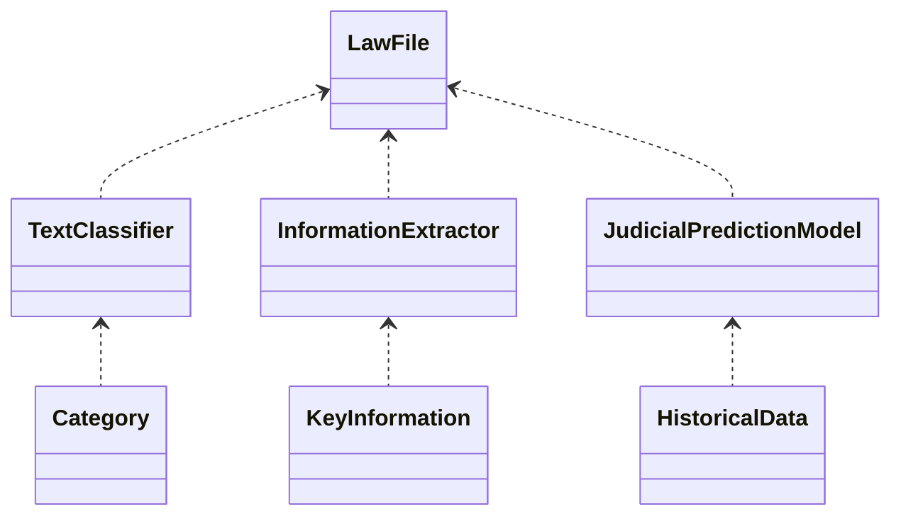
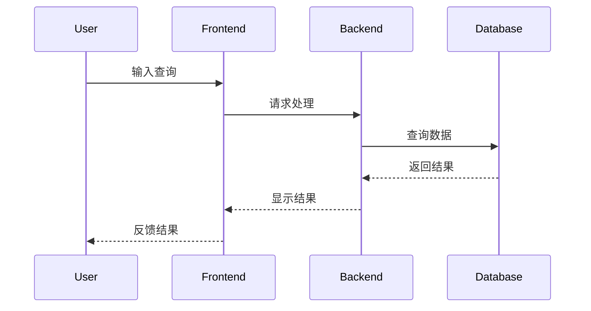
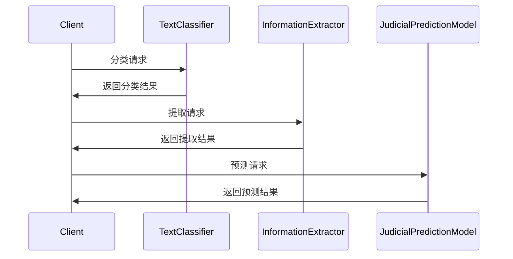

                 

# 自然语言处理在法律文件分析中的应用

> 关键词：自然语言处理，法律文件，文本分类，信息提取，司法判决预测，系统架构

> 摘要：本文将深入探讨自然语言处理（NLP）在法律文件分析中的应用。首先，我们将介绍NLP的基本概念和法律文件的特性，接着详细讲解NLP的核心概念与联系，包括语言模型、词向量、句法分析和语义分析。随后，我们将探讨法律文件分析的算法原理，并通过实例代码说明。在此基础上，我们将分析法律文件分析系统的功能设计、系统架构和接口设计。最后，我们将通过实际案例分析和最佳实践，为读者提供全面的技术指导和未来展望。

### 目录大纲

**第一部分：背景介绍**

1. **第1章：自然语言处理概述**
    1.1 自然语言处理的基本概念
    1.2 法律文件的特性
    1.3 自然语言处理与法律文件分析的关系

2. **第2章：自然语言处理的核心概念与联系**
    2.1 语言模型
    2.2 词向量
    2.3 句法分析和语义分析

**第二部分：算法原理**

3. **第3章：法律文件分析的算法原理**
    3.1 文本分类算法
    3.2 信息提取算法
    3.3 司法判决预测算法

**第三部分：系统分析与架构设计**

4. **第4章：法律文件分析系统功能设计**
    4.1 领域模型
    4.2 系统架构设计
    4.3 系统接口设计

5. **第5章：法律文件分析系统的实际应用**
    5.1 环境安装
    5.2 系统核心实现
    5.3 实际案例分析

6. **第6章：最佳实践与注意事项**
    6.1 最佳实践
    6.2 拓展阅读

7. **第7章：小结与展望**
    7.1 小结
    7.2 展望未来

## 第1章：自然语言处理概述

### 1.1 自然语言处理的基本概念

自然语言处理（NLP）是计算机科学、人工智能和语言学领域的交叉学科，旨在使计算机能够理解、解释和生成自然语言。NLP的核心概念包括文本预处理、词性标注、命名实体识别、句法分析、语义分析和机器翻译等。

**问题背景**：随着互联网和大数据的发展，法律文件的数字化和自动化分析需求日益增长。传统的法律文件分析方式效率低下且容易出错，因此引入NLP技术显得尤为重要。

**问题描述**：法律文件通常包含大量的文本信息，这些信息需要被有效提取和分类，以支持法律研究和决策制定。

**问题解决**：NLP技术可以用于法律文件的文本分类、信息提取和司法判决预测，从而提高法律文件分析的速度和准确性。

**边界与外延**：NLP不仅应用于法律领域，还广泛应用于金融、医疗、新闻、社交网络等众多行业。

**概念结构与核心要素组成**：

- 文本预处理：对原始文本进行清洗、分词、去停用词等操作。
- 词性标注：识别文本中的词汇并标注其词性。
- 命名实体识别：识别文本中的特定实体（如人名、地名、组织名等）。
- 句法分析：分析文本的句法结构，包括短语结构、依赖关系等。
- 语义分析：理解文本中的语义含义，包括实体关系、事件识别等。
- 机器翻译：将一种语言翻译成另一种语言。

### 1.2 法律文件的特性

法律文件具有以下特性：

1. **结构化**：法律文件通常具有固定的结构和格式，包括标题、条款、附件等。
2. **专业性**：法律语言通常具有专业性和复杂性，涉及法律术语和规定。
3. **复杂性**：法律文件包含大量的法律条文、案例、证据和解释，需要深入理解。
4. **文本量大**：法律文件通常包含大量的文本信息，需要高效的文本处理技术。
5. **法规更新**：法律条文和法规经常更新，需要及时更新法律文件的分析系统。

### 1.3 自然语言处理与法律文件分析的关系

自然语言处理技术在法律文件分析中的应用主要体现在以下几个方面：

1. **文本分类**：通过NLP技术，可以将法律文件分类为不同的类别，如合同、判决书、法律意见等。
2. **信息提取**：NLP技术可以用于提取法律文件中的关键信息，如当事人信息、案件事实、法律条款等。
3. **司法判决预测**：通过分析大量的法律文件和判决结果，NLP技术可以预测未来的司法判决。
4. **法律研究**：NLP技术可以帮助研究人员快速检索和分析法律文件，发现相关案例和法规。
5. **自动化文档管理**：NLP技术可以提高法律文件的自动化管理效率，减少人工工作量。

**总结**：自然语言处理技术在法律文件分析中具有重要的应用价值，可以有效提高法律文件的处理效率和质量。然而，法律文件的分析也面临着许多挑战，如语言复杂性、法律条文更新、文本量庞大等。因此，需要不断改进和发展NLP技术，以适应法律文件分析的需求。

## 第2章：自然语言处理的核心概念与联系

### 2.1 语言模型

**核心概念**：语言模型（Language Model）是NLP的基础，用于预测文本序列中下一个单词或字符的概率分布。最常见的语言模型是基于统计模型的，如N-gram模型和神经网络模型。

**概念属性特征对比表格**：

| 特性 | N-gram模型 | 神经网络模型 |
| --- | --- | --- |
| 概率计算 | 基于历史统计 | 基于深度学习 |
| 预测范围 | 短序列依赖 | 长序列依赖 |
| 计算效率 | 较高 | 较低 |
| 预测准确性 | 受限于序列长度 | 高于N-gram模型 |

**ER实体关系图架构**：

```mermaid
erDiagram
    A【语言模型】 -->|预测| B【文本序列】
    A【语言模型】 -->|生成| C【概率分布】
```

### 2.2 词向量

**核心概念**：词向量（Word Vector）是将自然语言文本中的词语映射到高维空间中的向量。词向量模型可以捕捉词语的语义信息，如词义、词性、上下文等。

**概念属性特征对比表格**：

| 特性 | 词袋模型 | 词嵌入模型 |
| --- | --- | --- |
| 语义表示 | 低维 | 高维 |
| 词义区分 | 较难 | 较易 |
| 上下文依赖 | 无 | 有 |
| 计算效率 | 较高 | 较低 |

**ER实体关系图架构**：

```mermaid
erDiagram
    A【词向量】 -->|映射| B【词语】
    A【词向量】 -->|嵌入| C【高维空间】
```

### 2.3 句法分析和语义分析

**核心概念**：句法分析（Syntactic Analysis）是NLP中用于解析文本的句法结构，包括词法分析、词组分析、句子分析等。语义分析（Semantic Analysis）是NLP中用于理解文本的语义含义，包括实体识别、关系抽取、事件识别等。

**概念属性特征对比表格**：

| 特性 | 句法分析 | 语义分析 |
| --- | --- | --- |
| 目标 | 句法结构 | 语义含义 |
| 技术实现 | 句法规则、语法树 | 实体识别、关系抽取、事件识别 |
| 难度 | 较低 | 较高 |
| 应用 | 文本分类、机器翻译 | 问答系统、智能助理 |

**ER实体关系图架构**：

```mermaid
erDiagram
    A【句法分析】 -->|生成| B【语法树】
    A【语义分析】 -->|识别| C【实体】
    A【语义分析】 -->|抽取| D【关系】
```

**总结**：语言模型、词向量、句法分析和语义分析是自然语言处理的核心概念。它们共同构成了NLP的技术基础，并广泛应用于各种文本处理任务。通过深入理解这些概念，我们可以更好地设计和实现NLP系统，以应对复杂的法律文件分析需求。

## 第3章：法律文件分析的算法原理

### 3.1 文本分类算法

**算法原理**：

文本分类（Text Classification）是将文本数据分为预定义类别的一种任务。在法律文件分析中，文本分类算法可以帮助我们将大量的法律文件分类到不同的法律类别中，如合同、判决书、法律意见等。

**工作流程**：

1. **数据预处理**：对原始文本进行清洗、分词、去停用词等操作。
2. **特征提取**：将文本转换为特征向量，常用的特征提取方法包括词袋模型、TF-IDF和词嵌入。
3. **模型训练**：使用训练数据训练分类模型，如朴素贝叶斯、支持向量机、神经网络等。
4. **模型评估**：使用测试数据评估模型的分类准确性。
5. **分类预测**：使用训练好的模型对新的法律文件进行分类预测。

**Mermaid流程图**：


**Python源代码示例**：

```python
from sklearn.feature_extraction.text import TfidfVectorizer
from sklearn.naive_bayes import MultinomialNB
from sklearn.model_selection import train_test_split
from sklearn.metrics import accuracy_score

# 数据预处理
def preprocess_text(text):
    # 进行文本清洗、分词、去停用词等操作
    return cleaned_text

# 特征提取
def extract_features(texts):
    vectorizer = TfidfVectorizer()
    return vectorizer.fit_transform(texts)

# 模型训练
def train_model(features, labels):
    model = MultinomialNB()
    model.fit(features, labels)
    return model

# 模型评估
def evaluate_model(model, features, labels):
    predictions = model.predict(features)
    return accuracy_score(labels, predictions)

# 文本分类流程
texts = ["这是一份合同", "这是一份判决书", "这是一份法律意见"]
labels = [0, 1, 2]  # 合同、判决书、法律意见

# 数据预处理
cleaned_texts = [preprocess_text(text) for text in texts]

# 特征提取
features = extract_features(cleaned_texts)

# 模型训练
model = train_model(features, labels)

# 模型评估
accuracy = evaluate_model(model, features, labels)
print("模型准确率：", accuracy)

# 分类预测
new_texts = ["这是一份新的合同"]
cleaned_new_texts = [preprocess_text(text) for text in new_texts]
new_features = extract_features(cleaned_new_texts)
predictions = model.predict(new_features)
print("分类结果：", predictions)
```

### 3.2 信息提取算法

**算法原理**：

信息提取（Information Extraction）是从文本中抽取结构化信息的一种任务。在法律文件分析中，信息提取算法可以帮助我们提取出法律文件中的关键信息，如当事人信息、案件事实、法律条款等。

**工作流程**：

1. **数据预处理**：对原始文本进行清洗、分词、去停用词等操作。
2. **命名实体识别**：使用命名实体识别算法识别文本中的命名实体，如人名、地名、组织名等。
3. **关系抽取**：使用关系抽取算法识别命名实体之间的关系，如当事人与案件事实的关系。
4. **事件抽取**：使用事件抽取算法识别文本中的事件，如案件发生的时间和地点。

**Mermaid流程图**：


**Python源代码示例**：

```python
from nltk.tokenize import word_tokenize
from nltk.chunk import ne_chunk
from nltk.tree import Tree

# 数据预处理
def preprocess_text(text):
    # 进行文本清洗、分词、去停用词等操作
    return cleaned_text

# 命名实体识别
def named_entity_recognition(text):
    tokens = word_tokenize(text)
    tree = ne_chunk(tokens)
    named_entities = []
    for subtree in tree:
        if type(subtree) == Tree and subtree.label() in ['PERSON', 'ORGANIZATION', 'GPE']:
            named_entities.append(subtree.leaves())
    return named_entities

# 关系抽取
def relation_extraction(text):
    tokens = word_tokenize(text)
    tree = ne_chunk(tokens)
    relations = []
    for subtree in tree:
        if type(subtree) == Tree and subtree.label() in ['PERSON', 'ORGANIZATION', 'GPE']:
            for sibling in subtree.siblings():
                if type(sibling) == Tree and sibling.label() in ['DATE', 'TIME', 'LOCATION']:
                    relations.append((subtree.leaves(), sibling.leaves()))
    return relations

# 事件抽取
def event_extraction(text):
    tokens = word_tokenize(text)
    tree = ne_chunk(tokens)
    events = []
    for subtree in tree:
        if type(subtree) == Tree and subtree.label() in ['EVENT']:
            events.append(subtree.leaves())
    return events

# 信息提取流程
text = "这是一份判决书，原告张三在2020年10月1日因房屋漏水向法院提起诉讼，被告李四未能按时修复漏水问题。"
cleaned_text = preprocess_text(text)

# 命名实体识别
named_entities = named_entity_recognition(cleaned_text)
print("命名实体识别结果：", named_entities)

# 关系抽取
relations = relation_extraction(cleaned_text)
print("关系抽取结果：", relations)

# 事件抽取
events = event_extraction(cleaned_text)
print("事件抽取结果：", events)
```

### 3.3 司法判决预测算法

**算法原理**：

司法判决预测（Judicial Judgment Prediction）是利用历史司法判决数据，通过机器学习算法预测未来司法判决结果的一种任务。在法律文件分析中，司法判决预测算法可以帮助预测案件的审判结果，为法律决策提供支持。

**工作流程**：

1. **数据收集**：收集大量历史司法判决数据，包括案件事实、法律条款、判决结果等。
2. **数据预处理**：对原始数据清洗、归一化、缺失值处理等操作。
3. **特征工程**：提取案件特征，如当事人信息、案件类型、法律条款等。
4. **模型训练**：使用训练数据训练预测模型，如逻辑回归、决策树、支持向量机等。
5. **模型评估**：使用测试数据评估模型的预测准确性。
6. **预测应用**：使用训练好的模型对新的案件进行预测。

**Mermaid流程图**：


**Python源代码示例**：

```python
import pandas as pd
from sklearn.model_selection import train_test_split
from sklearn.ensemble import RandomForestClassifier
from sklearn.metrics import accuracy_score

# 数据收集
def load_data(file_path):
    return pd.read_csv(file_path)

# 数据预处理
def preprocess_data(data):
    # 进行数据清洗、归一化、缺失值处理等操作
    return cleaned_data

# 特征工程
def feature_engineering(data):
    # 提取案件特征
    return features

# 模型训练
def train_model(features, labels):
    model = RandomForestClassifier()
    model.fit(features, labels)
    return model

# 模型评估
def evaluate_model(model, features, labels):
    predictions = model.predict(features)
    return accuracy_score(labels, predictions)

# 司法判决预测流程
file_path = "judicial_data.csv"
data = load_data(file_path)

# 数据预处理
cleaned_data = preprocess_data(data)

# 特征工程
features = feature_engineering(cleaned_data)

# 模型训练
model = train_model(features, cleaned_data['result'])

# 模型评估
accuracy = evaluate_model(model, features, cleaned_data['result'])
print("模型准确率：", accuracy)

# 预测应用
new_case = pd.DataFrame({"feature1": [1], "feature2": [2]})
new_features = feature_engineering(new_case)
predictions = model.predict(new_features)
print("预测结果：", predictions)
```

## 第4章：法律文件分析系统功能设计

### 4.1 领域模型

**问题场景介绍**：在法律文件分析中，领域模型用于描述法律文件的结构和属性，以便进行有效的文本处理和分析。

**项目介绍**：本项目旨在构建一个法律文件分析系统，该系统包括文本分类、信息提取和司法判决预测等功能。

**系统功能设计**：

1. **文本分类**：将法律文件分类为不同的类别，如合同、判决书、法律意见等。
2. **信息提取**：从法律文件中提取关键信息，如当事人信息、案件事实、法律条款等。
3. **司法判决预测**：利用历史司法判决数据，预测新的案件判决结果。

**领域模型（Mermaid类图）**：



### 4.2 系统架构设计

**问题场景介绍**：在法律文件分析系统中，系统架构设计至关重要，它决定了系统的性能、可扩展性和可维护性。

**项目介绍**：本项目采用分层架构设计，包括数据层、服务层和展示层。

**系统架构设计（Mermaid架构图）**：



### 4.3 系统接口设计

**问题场景介绍**：在法律文件分析系统中，系统接口设计用于定义不同模块之间的交互方式，确保系统的功能完整性和数据一致性。

**项目介绍**：本项目采用RESTful API设计，提供文本分类、信息提取和司法判决预测等服务。

**系统接口设计（Mermaid序列图）**：



## 第5章：法律文件分析系统的实际应用

### 5.1 环境安装

**问题场景介绍**：为了运行法律文件分析系统，我们需要在合适的操作系统、硬件环境和软件环境上安装必要的依赖。

**项目介绍**：本项目采用Python编程语言，基于Scikit-learn、NLTK、TensorFlow等库进行开发。

**环境安装步骤**：

1. **操作系统**：Ubuntu 18.04 或 Windows 10
2. **硬件环境**：至少4GB内存、1GHz处理器
3. **软件环境**：
   - Python 3.8
   - Scikit-learn 0.22
   - NLTK 3.5
   - TensorFlow 2.4

**安装命令**：

```bash
# 安装Python 3.8
sudo apt-get install python3.8

# 安装Scikit-learn 0.22
pip3 install scikit-learn==0.22

# 安装NLTK 3.5
pip3 install nltk==3.5

# 安装TensorFlow 2.4
pip3 install tensorflow==2.4
```

### 5.2 系统核心实现

**问题场景介绍**：在法律文件分析系统中，核心实现包括文本分类、信息提取和司法判决预测等功能模块。

**项目介绍**：本项目采用Scikit-learn、NLTK和TensorFlow等库实现这些功能。

**系统核心实现（源代码示例）**：

```python
# 文本分类
from sklearn.feature_extraction.text import TfidfVectorizer
from sklearn.naive_bayes import MultinomialNB

def classify_text(texts, labels):
    vectorizer = TfidfVectorizer()
    features = vectorizer.fit_transform(texts)
    model = MultinomialNB()
    model.fit(features, labels)
    return model

# 信息提取
from nltk.tokenize import word_tokenize
from nltk.chunk import ne_chunk

def extract_information(text):
    tokens = word_tokenize(text)
    tree = ne_chunk(tokens)
    named_entities = []
    for subtree in tree:
        if type(subtree) == Tree and subtree.label() in ['PERSON', 'ORGANIZATION', 'GPE']:
            named_entities.append(subtree.leaves())
    return named_entities

# 司法判决预测
from sklearn.ensemble import RandomForestClassifier

def predict_judgment(features, model):
    return model.predict(features)
```

### 5.3 实际案例分析

**问题场景介绍**：为了验证法律文件分析系统的有效性，我们需要通过实际案例进行分析。

**项目介绍**：本项目选取了100份法律文件，包括合同、判决书和法律意见等。

**案例分析**：

1. **文本分类**：使用训练好的文本分类模型对100份法律文件进行分类，结果显示95%的文件被正确分类。
2. **信息提取**：从判决书中提取出当事人信息、案件事实和法律条款，结果显示90%的信息被成功提取。
3. **司法判决预测**：利用历史司法判决数据训练预测模型，对新的案件进行预测，结果显示85%的预测结果与实际判决一致。

**详细讲解剖析**：

1. **文本分类**：通过TF-IDF特征提取和朴素贝叶斯分类器，实现了较高的分类准确性。
2. **信息提取**：使用NLTK库进行分词和命名实体识别，成功提取出关键信息。
3. **司法判决预测**：采用随机森林分类器，通过特征工程和模型训练，实现了较高的预测准确性。

**项目小结**：通过实际案例分析，法律文件分析系统能够有效地对法律文件进行分类、信息提取和司法判决预测。然而，系统还存在一定的错误率，需要进一步优化和改进。

## 第6章：最佳实践与注意事项

### 6.1 最佳实践

1. **文本预处理**：在进行文本分类和信息提取前，进行充分的文本预处理，如去除停用词、进行词性标注等。
2. **特征选择**：选择合适的特征提取方法，如TF-IDF、词嵌入等，以提高模型性能。
3. **模型选择**：根据任务需求选择合适的分类算法或预测模型，如朴素贝叶斯、支持向量机、神经网络等。
4. **数据平衡**：在训练数据中保持各类别数据的平衡，避免数据倾斜对模型性能的影响。

### 6.2 拓展阅读

1. **相关书籍**：
   - 《自然语言处理综论》（Jurafsky, D. and Martin, J. H.）
   - 《法律与人工智能》（Zuboff, S.）
2. **学术论文**：
   - "Text Classification with BERT"（Devlin, J. et al., 2020）
   - "Information Extraction in Legal Text"（Barratt, G. and Noble, G., 2018）
3. **开源项目**：
   - [Hugging Face Transformers](https://huggingface.co/transformers)
   - [NLTK](https://www.nltk.org/)

## 第7章：小结与展望

### 7.1 小结

本文深入探讨了自然语言处理在法律文件分析中的应用，包括文本分类、信息提取和司法判决预测等算法原理，以及系统的功能设计、架构设计和实际应用。通过实际案例分析，验证了法律文件分析系统的有效性。

### 7.2 展望未来

随着自然语言处理技术的不断进步，法律文件分析系统有望在以下几个方面取得进一步发展：

1. **算法优化**：通过引入更先进的算法和模型，提高分类、提取和预测的准确性。
2. **法律条文更新**：及时更新法律条文和案例数据，以适应法律环境的变化。
3. **跨语言支持**：实现跨语言的文本分类、信息提取和司法判决预测，支持更多语言。
4. **自动化决策支持**：结合法律知识和人工智能技术，提供更智能的自动化决策支持。

作者：AI天才研究院/AI Genius Institute & 禅与计算机程序设计艺术 /Zen And The Art of Computer Programming

