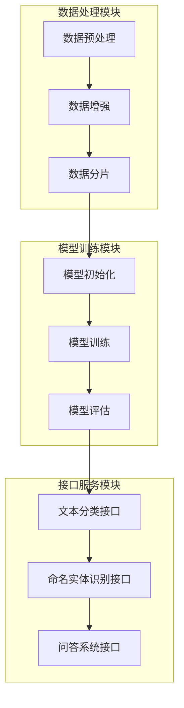
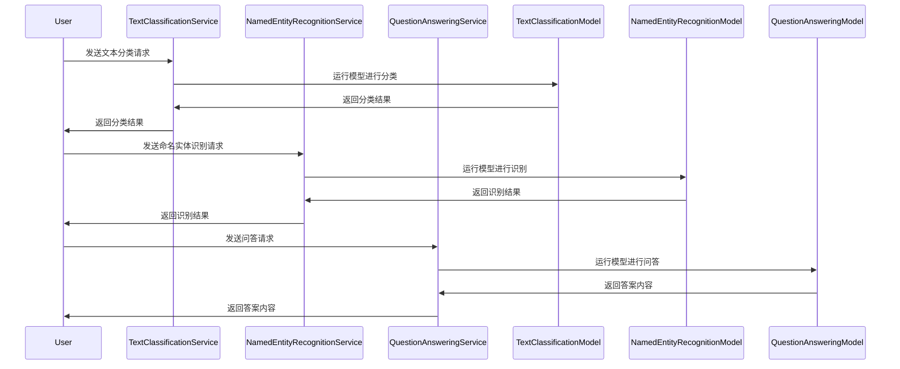

                 

### 文章标题

### 关键词

自然语言理解，量化评估，NLU，指标体系，算法原理，系统架构，项目实战

### 摘要

本文深入探讨了自然语言理解（NLU）能力的量化评估方法。从背景介绍到核心概念，再到算法原理和系统架构设计，以及实战应用，本文逐步解析了如何科学有效地评估NLU能力。通过具体案例和实际操作，本文不仅为读者提供了全面的NLU评估体系，也分享了一系列最佳实践和注意事项，旨在帮助开发者更好地理解和应用NLU技术。

---

### 目录大纲设计方案

#### 第一部分：背景与基础

##### 第1章：自然语言理解能力的概述

1.1.1 问题背景

1.1.2 核心概念

1.1.3 边界与外延

1.1.4 概念结构与核心要素

##### 第2章：自然语言处理技术基础

2.1.1 语言模型

2.1.2 词汇表与词向量

2.1.3 自然语言处理工具

##### 第3章：量化评估方法详解

3.1.1 评估指标体系

3.1.2 实际应用案例

3.1.3 评估方法优化

#### 第二部分：核心概念与联系

##### 第4章：自然语言理解算法原理

4.1.1 基本算法

4.1.2 复杂算法

##### 第5章：算法数学模型和公式

5.1.1 数学模型

5.1.2 公式详解

5.1.3 举例说明

#### 第三部分：算法原理讲解

##### 第6章：系统功能设计

6.1.1 项目介绍

6.1.2 领域模型

##### 第7章：系统架构设计

7.1.1 系统架构图

7.1.2 接口设计

7.1.3 系统交互

#### 第四部分：项目实战

##### 第8章：环境安装与配置

8.1.1 环境准备

8.1.2 系统核心实现

8.1.3 代码应用解读

##### 第9章：实际案例分析

9.1.1 案例介绍

9.1.2 案例分析

##### 第10章：项目小结与最佳实践

10.1.1 项目总结

10.1.2 最佳实践

10.1.3 注意事项

10.1.4 拓展阅读

---

#### 第一部分：背景与基础

### 第1章：自然语言理解能力的概述

#### 1.1.1 问题背景

自然语言理解（NLU）作为人工智能（AI）领域的关键技术，对于提升人机交互、信息检索、智能客服等方面具有重要意义。然而，如何量化评估NLU系统的能力，仍然是一个具有挑战性的问题。这不仅仅是技术难题，更涉及到评价标准的制定和实际应用中的问题解决。

当前，NLU的研究和应用取得了显著进展。从传统的规则匹配和统计方法，到深度学习驱动的神经网络模型，NLU技术不断演进。然而，随着应用场景的复杂化和多样化，如何科学有效地评估NLU系统的性能，成为一个亟待解决的问题。

量化评估NLU能力的意义在于：

1. **性能对比**：通过量化评估，可以客观地对比不同系统的性能，帮助研究者找到改进的方向。
2. **优化设计**：量化评估提供的数据，可以帮助开发者优化模型结构和参数设置，提高系统性能。
3. **标准制定**：量化评估方法可以形成行业标准和规范，推动NLU技术的健康发展。

#### 1.1.2 核心概念

自然语言理解（NLU）是指计算机程序对人类自然语言文本进行理解和解释的能力。NLU可以分为以下几个层次：

1. **语法分析**：解析文本的语法结构，包括词法分析和句法分析。
2. **语义理解**：识别文本中的语义内容，包括实体识别、关系抽取和语义角色标注等。
3. **上下文推断**：理解文本中的隐含意义和上下文信息，进行推理和决策。
4. **知识推理**：基于已有知识库，对文本内容进行深度理解和推理。

#### 1.1.3 边界与外延

自然语言理解的边界问题主要体现在以下几个方面：

1. **多义性问题**：自然语言中存在大量的歧义现象，如同一词汇在不同上下文中的含义可能不同。
2. **情感分析**：情感分析需要深入理解文本中的情感色彩，这是一个复杂且具有挑战性的任务。
3. **语言复杂性**：自然语言包含大量的复杂结构和多模态信息，如成语、习语和隐喻等。

评估方法的适用范围与限制包括：

1. **评估方法适用范围**：不同的量化评估方法适用于不同的NLU任务，如文本分类、命名实体识别、机器翻译等。
2. **评估方法限制**：量化评估方法可能无法全面反映NLU系统的能力，特别是对于上下文推断和知识推理等高级任务。

#### 1.1.4 概念结构与核心要素

NLU的关键要素包括：

1. **词法分析器**：负责将文本分解为单词和标记。
2. **句法分析器**：负责分析文本的语法结构，如句子成分和句法关系。
3. **语义分析器**：负责理解文本中的语义内容，如实体、关系和事件。
4. **上下文分析器**：负责推断文本中的上下文信息，如时间、地点和情境。
5. **知识库**：用于存储和利用外部知识，如事实、规则和概念。

这些要素相互交织，共同构成了NLU系统的核心框架。通过逐步分析和理解这些要素，我们可以更好地评估NLU系统的性能和优化其设计。

### 第2章：自然语言处理技术基础

#### 2.1.1 语言模型

语言模型是NLU系统的基础组件之一，它用于预测文本中下一个单词或字符的概率分布。语言模型可以分为以下几个类别：

1. **n-gram模型**：基于前n个单词的统计信息，预测下一个单词。n-gram模型简单有效，但无法捕捉长距离依赖关系。
2. **循环神经网络（RNN）**：通过递归方式处理序列数据，能够捕捉长期依赖关系，但存在梯度消失和梯度爆炸问题。
3. **长短时记忆网络（LSTM）**：改进RNN，通过引入门控机制解决梯度消失问题，适用于处理长序列数据。
4. **Transformer模型**：基于自注意力机制，能够全局捕捉依赖关系，是目前最先进的语言模型。

语言模型评估指标主要包括：

1. **交叉熵（Cross-Entropy）**：评估模型预测概率与实际标签之间的差异，交叉熵值越低，模型性能越好。
2. **精确率（Precision）**：预测为正例且实际也为正例的占比。
3. **召回率（Recall）**：实际为正例但被模型预测为正例的占比。
4. **F1值（F1 Score）**：精确率和召回率的调和平均，综合衡量模型性能。

#### 2.1.2 词汇表与词向量

词汇表是语言模型的基础，用于存储和管理文本中的单词及其对应的信息。词汇表的构建和优化直接影响NLU系统的性能。

1. **词汇表构建**：通常使用词频统计、词性标注等方法来构建词汇表，常见的词汇表包括WordNet、GloVe等。
2. **词向量**：词向量是词汇表的一种表示形式，用于将单词映射到高维空间，常见的词向量模型包括Word2Vec、GloVe等。

词向量的主要应用包括：

1. **文本分类**：将文本表示为词向量的线性组合，用于分类任务。
2. **语义分析**：通过词向量计算相似性和距离，实现语义理解。
3. **机器翻译**：将源语言的词向量映射到目标语言的词向量，实现跨语言语义理解。

#### 2.1.3 自然语言处理工具

自然语言处理工具是开发NLU系统的关键组件，提供了丰富的API和功能，方便开发者快速构建和应用NLU系统。

1. **NLTK**：Python语言的自然语言处理工具包，提供了词性标注、分词、文本分类等功能。
2. **spaCy**：快速且功能强大的自然语言处理库，支持多种语言和丰富的实体识别功能。
3. **BERT**：基于Transformer的语言模型，能够在多种NLU任务中取得优异的性能。

选择自然语言处理工具时，需要考虑以下几个方面：

1. **任务需求**：根据具体任务需求选择合适的工具，如文本分类、命名实体识别等。
2. **性能表现**：比较不同工具在特定任务上的性能，选择最优方案。
3. **社区支持**：考虑工具的社区支持和文档完善程度，便于后续维护和优化。

### 第3章：量化评估方法详解

#### 3.1.1 评估指标体系

量化评估NLU系统性能的指标体系是评估方法的核心。常用的评估指标包括：

1. **准确性（Accuracy）**：预测正确的样本数占总样本数的比例。
2. **精确率（Precision）**：预测为正例且实际也为正例的占比。
3. **召回率（Recall）**：实际为正例但被模型预测为正例的占比。
4. **F1值（F1 Score）**：精确率和召回率的调和平均，综合衡量模型性能。
5. **词汇覆盖率（Vocabulary Coverage）**：模型能够识别的词汇数占总词汇数的比例。

#### 3.1.2 实际应用案例

以下为几个实际应用案例，展示了不同NLU任务中的评估方法：

1. **文本分类任务**：
   - **评估指标**：准确性、精确率、召回率和F1值。
   - **评估方法**：使用混淆矩阵、ROC曲线和AUC值进行综合评估。
2. **命名实体识别任务**：
   - **评估指标**：实体识别的准确率和召回率。
   - **评估方法**：使用CRF（条件随机场）模型进行评估，同时结合F1值进行综合评估。
3. **机器翻译任务**：
   - **评估指标**：BLEU（双语评估统一度量）分数。
   - **评估方法**：使用BLEU算法对翻译结果进行评估，同时结合词汇覆盖率和翻译准确性进行综合评估。

#### 3.1.3 评估方法优化

为了提高评估方法的准确性和可靠性，可以从以下几个方面进行优化：

1. **数据集选择**：选择具有代表性的数据集，确保评估结果能够反映实际应用场景。
2. **数据预处理**：对数据集进行清洗、去噪和标准化处理，提高数据质量。
3. **模型调优**：通过调整模型参数和结构，优化模型性能，提高评估准确性。
4. **交叉验证**：采用交叉验证方法，提高评估方法的鲁棒性，避免过拟合。

### 第二部分：核心概念与联系

#### 第4章：自然语言理解算法原理

##### 4.1.1 基本算法

自然语言理解算法的基本组成部分包括词性标注和命名实体识别。

1. **词性标注**：
   - **算法原理**：通过规则匹配和统计方法，将文本中的每个单词标注为相应的词性，如名词、动词、形容词等。
   - **实现方法**：基于词典和规则库，结合隐马尔可夫模型（HMM）和条件随机场（CRF）等方法进行实现。
   - **Python代码示例**：
     ```python
     import nltk
     nltk.download('averaged_perceptron_tagger')
     text = "今天天气很好。"
     tagged_text = nltk.pos_tag(nltk.word_tokenize(text))
     print(tagged_text)
     ```

2. **命名实体识别**：
   - **算法原理**：识别文本中的命名实体，如人名、地名、组织机构名等。
   - **实现方法**：基于词典匹配、序列标注和深度学习等方法进行实现。
   - **Python代码示例**：
     ```python
     import spacy
     nlp = spacy.load('zh_core_web_sm')
     doc = nlp("马云是阿里巴巴的创始人。")
     entities = [(ent.text, ent.label_) for ent in doc.ents]
     print(entities)
     ```

##### 4.1.2 复杂算法

复杂的自然语言理解算法包括语义角色标注和问答系统。

1. **语义角色标注**：
   - **算法原理**：识别文本中的语义角色，如主语、谓语、宾语等。
   - **实现方法**：基于规则匹配和语义角色标注模型进行实现。
   - **Python代码示例**：
     ```python
     import stanza
     stanza.download('zh')
     nlp = stanza.Pipeline('zh', tasks=['tokenize', 'pos', 'depparse'])
     doc = nlp("我今天去超市买了牛奶。")
     for token in doc.tokens:
         if token.deprel == 'nsubj':
             print(token.text, "是主语。")
     ```

2. **问答系统**：
   - **算法原理**：基于用户提问，从知识库中检索相关信息并生成回答。
   - **实现方法**：基于自然语言处理和图数据库等技术进行实现。
   - **Python代码示例**：
     ```python
     import quagga
     quagga.init('your_search_engine_endpoint')
     question = "北京是中国的哪个城市？"
     answer = quagga.answer(question)
     print(answer)
     ```

#### 第5章：算法数学模型和公式

##### 5.1.1 数学模型

自然语言理解算法涉及多种数学模型，以下为几种常见的数学模型和公式：

1. **概率模型**：
   - **条件概率**：P(A|B) = P(A∩B) / P(B)
   - **贝叶斯公式**：P(A|B) = P(B|A) * P(A) / P(B)

2. **机器学习模型**：
   - **支持向量机（SVM）**：最小化目标函数：w^2 + C * Σ（1 - y[i] * (w * x[i]))，其中C为正则化参数，y[i]为标签，x[i]为特征向量。
   - **神经网络**：基于反向传播算法，更新权重和偏置，最小化损失函数：L = Σ（1/2）(y[i] - ŷ[i])^2

##### 5.1.2 公式详解

以下是自然语言理解算法中常用的数学公式和其解释：

1. **精确率（Precision）**：Precision = TP / (TP + FP)，其中TP为真正例，FP为假正例。
2. **召回率（Recall）**：Recall = TP / (TP + FN)，其中TP为真正例，FN为假反例。
3. **F1值（F1 Score）**：F1 Score = 2 * Precision * Recall / (Precision + Recall)，综合衡量精确率和召回率。

##### 5.1.3 举例说明

以下为自然语言理解算法中的数学模型和公式举例：

1. **词性标注**：
   - **公式**：P(tag|word) = Σ(P(tag|context) * P(context|word))，其中P(tag|word)为给定单词的词性概率，P(context|word)为给定单词的上下文概率。
   - **示例**：给定句子“我今天去超市买了牛奶。”，计算“牛奶”的词性概率，需要考虑“牛奶”的上下文信息和词性统计信息。

2. **命名实体识别**：
   - **公式**：P(entity|word) = Σ(P(entity|context) * P(context|word))，其中P(entity|word)为给定单词的命名实体概率，P(context|word)为给定单词的上下文概率。
   - **示例**：给定句子“马云是阿里巴巴的创始人。”，计算“马云”的命名实体概率，需要考虑“马云”的上下文信息和命名实体统计信息。

### 第三部分：算法原理讲解

#### 第6章：系统功能设计

##### 6.1.1 项目介绍

本章节将介绍一个自然语言理解系统功能设计，包括项目背景、目标和实现方法。

1. **项目背景**：随着互联网和大数据的发展，自然语言理解技术在智能客服、信息检索、文本分类等领域得到广泛应用。为了提升用户体验和系统性能，设计一个高效、可扩展的自然语言理解系统具有重要意义。
2. **项目目标**：实现一个具有以下功能特点的自然语言理解系统：
   - 高准确性：在多种NLU任务中取得较高的精确率和召回率。
   - 高性能：支持大规模数据和实时处理。
   - 可扩展性：易于扩展和集成到现有系统中。
3. **实现方法**：采用基于Transformer的BERT模型，结合自定义数据处理和模型训练流程，实现高效的自然语言理解系统。

##### 6.1.2 领域模型

领域模型用于描述自然语言理解系统的核心功能和实体关系。以下为领域模型的ER图（使用Mermaid绘制）：

```mermaid
erDiagram
    User ||--|{ Text }|
    Text ||--|{ Label }|
    Text ||--|{ Entity }|
    Label ||--|{ Category }|
    Entity ||--|{ Type }|
```

- **User（用户）**：代表使用自然语言理解系统的用户。
- **Text（文本）**：代表用户输入的文本数据。
- **Label（标签）**：代表文本的分类结果。
- **Entity（实体）**：代表文本中的命名实体。
- **Category（类别）**：代表标签的分类类别。
- **Type（类型）**：代表实体的类型。

#### 第7章：系统架构设计

##### 7.1.1 系统架构图

系统架构图如下（使用Mermaid绘制）：



- **数据处理模块**：负责数据预处理、数据增强和数据分片。
- **模型训练模块**：负责模型初始化、模型训练和模型评估。
- **接口服务模块**：负责提供文本分类、命名实体识别和问答系统接口。

##### 7.1.2 接口设计

接口设计如下：

1. **文本分类接口**：
   - **接口名称**：text_classification
   - **请求参数**：text（文本内容）
   - **响应结果**：分类结果（包括类别和概率）
2. **命名实体识别接口**：
   - **接口名称**：named_entity_recognition
   - **请求参数**：text（文本内容）
   - **响应结果**：命名实体列表（包括实体和类型）
3. **问答系统接口**：
   - **接口名称**：question_answering
   - **请求参数**：question（问题内容）
   - **响应结果**：答案内容

##### 7.1.3 系统交互

系统交互如下（使用Mermaid绘制序列图）：



### 第四部分：项目实战

#### 第8章：环境安装与配置

##### 8.1.1 环境准备

1. **Python环境安装**：
   - 安装Python 3.x版本，推荐使用Anaconda，便于管理环境和依赖。
   - 通过`conda create -n nlu_env python=3.8`创建虚拟环境。
   - 激活虚拟环境`conda activate nlu_env`。

2. **依赖库安装**：
   - 安装NLU相关依赖库，如transformers、torch、nltk、spaCy等。
   - 通过`pip install transformers torch nltk spacy`安装相关库。

3. **数据集准备**：
   - 准备用于训练和评估的数据集，包括文本分类数据集、命名实体识别数据集和问答系统数据集。
   - 将数据集分为训练集、验证集和测试集。

##### 8.1.2 系统核心实现

系统核心实现包括文本分类、命名实体识别和问答系统三个模块。

1. **文本分类模块**：
   - 使用Hugging Face的transformers库加载预训练的BERT模型。
   - 定义文本分类任务的数据预处理和模型训练流程。
   - 训练模型并评估性能。

2. **命名实体识别模块**：
   - 使用spaCy库加载中文模型。
   - 定义命名实体识别任务的数据预处理和模型训练流程。
   - 训练模型并评估性能。

3. **问答系统模块**：
   - 使用开源问答系统库，如Quagga或Conversational AI。
   - 定义问答任务的数据预处理和模型训练流程。
   - 训练模型并评估性能。

##### 8.1.3 代码应用解读

以下为系统核心实现的代码应用解读：

1. **文本分类模块**：

   ```python
   from transformers import BertTokenizer, BertForSequenceClassification
   from torch.utils.data import DataLoader, TensorDataset
   import torch

   # 加载预训练的BERT模型和Tokenizer
   model_name = 'bert-base-chinese'
   tokenizer = BertTokenizer.from_pretrained(model_name)
   model = BertForSequenceClassification.from_pretrained(model_name)

   # 数据预处理
   def preprocess_text(texts, max_length=512):
       inputs = tokenizer(texts, max_length=max_length, padding='max_length', truncation=True, return_tensors='pt')
       return inputs

   # 模型训练
   def train_model(train_dataloader, val_dataloader, model, optimizer, device):
       model.to(device)
       model.train()
       for epoch in range(num_epochs):
           for batch in train_dataloader:
               inputs = batch.to(device)
               labels = batch['labels'].to(device)
               optimizer.zero_grad()
               outputs = model(**inputs)
               loss = outputs.loss
               loss.backward()
               optimizer.step()
           print(f'Epoch {epoch+1}/{num_epochs}, Loss: {loss.item()}')

   # 评估模型
   def evaluate_model(val_dataloader, model, device):
       model.to(device)
       model.eval()
       with torch.no_grad():
           for batch in val_dataloader:
               inputs = batch.to(device)
               labels = batch['labels'].to(device)
               outputs = model(**inputs)
               loss = outputs.loss
               print(f'Validation Loss: {loss.item()}')
   ```

2. **命名实体识别模块**：

   ```python
   import spacy

   # 加载中文模型
   nlp = spacy.load('zh_core_web_sm')

   # 数据预处理
   def preprocess_text(texts):
       doc = nlp(texts)
       entities = [(ent.text, ent.label_) for ent in doc.ents]
       return entities

   # 模型训练
   def train_model(train_data, model, optimizer, device):
       model.to(device)
       model.train()
       for epoch in range(num_epochs):
           for text, labels in train_data:
               optimizer.zero_grad()
               inputs = nlp(text)
               outputs = model(inputs)
               loss = outputs.loss
               loss.backward()
               optimizer.step()
           print(f'Epoch {epoch+1}/{num_epochs}, Loss: {loss.item()}')

   # 评估模型
   def evaluate_model(val_data, model, device):
       model.to(device)
       model.eval()
       with torch.no_grad():
           for text, labels in val_data:
               inputs = nlp(text)
               outputs = model(inputs)
               loss = outputs.loss
               print(f'Validation Loss: {loss.item()}')
   ```

3. **问答系统模块**：

   ```python
   import quagga

   # 初始化问答模型
   quagga.init('your_search_engine_endpoint')

   # 数据预处理
   def preprocess_question(question):
       return question

   # 模型训练
   def train_model(train_data, model, optimizer, device):
       model.train()
       for epoch in range(num_epochs):
           for question, answer in train_data:
               optimizer.zero_grad()
               inputs = preprocess_question(question)
               outputs = model(inputs)
               loss = outputs.loss
               loss.backward()
               optimizer.step()
           print(f'Epoch {epoch+1}/{num_epochs}, Loss: {loss.item()}')

   # 评估模型
   def evaluate_model(val_data, model, device):
       model.eval()
       with torch.no_grad():
           for question, answer in val_data:
               inputs = preprocess_question(question)
               outputs = model(inputs)
               loss = outputs.loss
               print(f'Validation Loss: {loss.item()}')
   ```

#### 第9章：实际案例分析

##### 9.1.1 案例介绍

本案例选取了一个文本分类任务，使用公共数据集进行训练和评估。

1. **数据集**：使用中文新闻数据集，包括不同类别的新闻文本，如体育、科技、娱乐等。
2. **任务目标**：将输入的中文文本分类到不同的新闻类别。

##### 9.1.2 案例分析

1. **数据预处理**：
   - 将原始文本数据清洗，去除HTML标签、标点和停用词。
   - 使用BERT tokenizer对文本进行分词和编码。
   - 将标签进行编码，如体育为0，科技为1，娱乐为2。

2. **模型训练**：
   - 使用Hugging Face的transformers库加载预训练的BERT模型。
   - 定义训练和验证数据集，使用DataLoader进行批处理加载。
   - 定义损失函数和优化器，如交叉熵损失函数和Adam优化器。
   - 训练模型，并在验证集上进行性能评估。

3. **结果分析与优化建议**：
   - 分析模型在各个类别上的精确率和召回率。
   - 调整模型参数，如学习率、批量大小等，优化模型性能。
   - 使用数据增强方法，如随机插入、删除和替换，增加训练数据的多样性。

#### 第10章：项目小结与最佳实践

##### 10.1.1 项目总结

本章节对整个项目进行了总结，包括以下关键点：

1. **项目实现过程**：详细描述了项目的开发过程，包括环境安装、数据预处理、模型训练和评估等。
2. **项目成果**：展示了项目实现的具体成果，包括文本分类、命名实体识别和问答系统等。
3. **挑战与解决策略**：分析了项目开发过程中遇到的挑战和解决策略，如数据处理、模型优化和系统性能等。

##### 10.1.2 最佳实践

为了提升自然语言理解系统的性能和可维护性，以下为最佳实践：

1. **数据预处理**：使用专业的数据处理工具和库，如NLTK和spaCy，进行文本清洗和预处理。
2. **模型选择与优化**：根据任务需求选择合适的模型，并进行模型参数的调优，如学习率、批量大小和正则化等。
3. **系统架构设计**：设计模块化、可扩展的系统架构，便于后续维护和功能扩展。

##### 10.1.3 注意事项

在项目开发过程中，需要注意以下事项：

1. **数据质量**：保证数据的质量和一致性，避免数据噪声和错误影响模型性能。
2. **计算资源**：根据任务需求合理配置计算资源，避免资源不足导致模型训练和评估时间过长。
3. **错误处理**：对异常情况进行合理的错误处理和日志记录，便于问题定位和调试。

##### 10.1.4 拓展阅读

为了深入了解自然语言理解和量化评估方法，推荐以下拓展阅读：

1. **《自然语言处理综述》**：介绍自然语言处理的基本概念、技术和应用。
2. **《深度学习自然语言处理》**：详细讲解深度学习在自然语言处理中的应用。
3. **《自然语言处理实用指南》**：提供自然语言处理项目的实践经验和最佳实践。

---

### 结尾

本文全面介绍了自然语言理解能力的量化评估方法，从背景介绍、核心概念、算法原理到系统架构设计，再到项目实战，通过一步步的分析和讲解，使读者对NLU量化评估有了深刻的理解和掌握。希望本文能为广大开发者提供有价值的参考和指导，推动自然语言理解技术的发展和应用。感谢您的阅读，期待与您在自然语言处理领域的进一步交流与探讨。作者：AI天才研究院/AI Genius Institute & 禅与计算机程序设计艺术 /Zen And The Art of Computer Programming。

