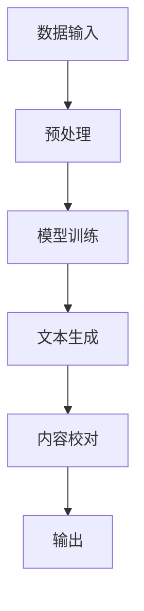
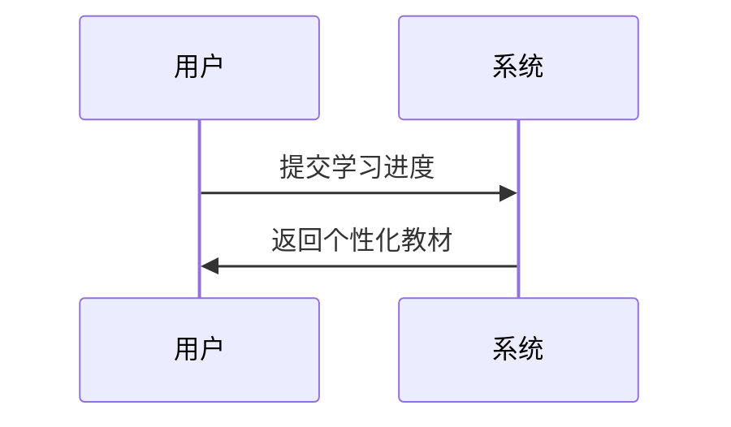
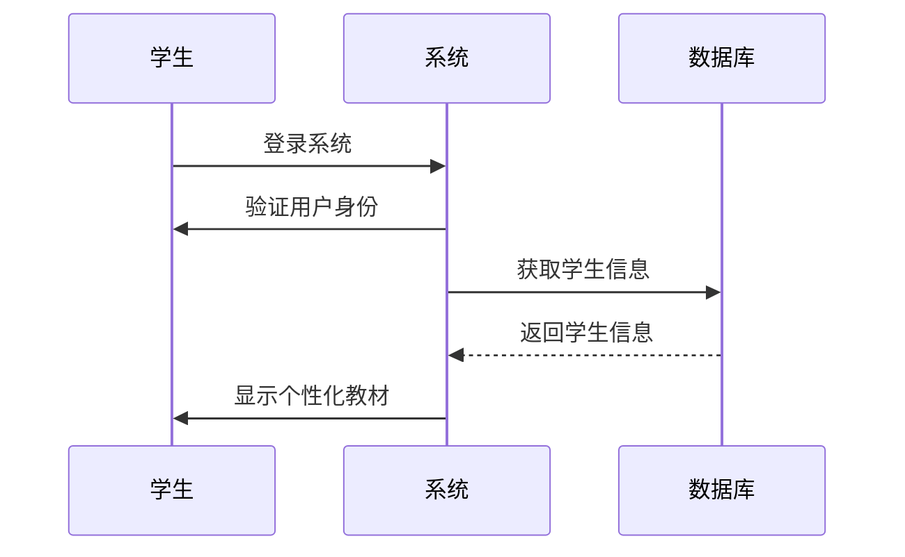

                 

## 自然语言生成在教育资源开发中的应用

### 关键词：自然语言生成、教育资源、教育开发、智能教材、在线辅导系统

#### 摘要：
本文探讨了自然语言生成（NLG）技术在教育资源开发中的应用，从背景介绍、核心概念与原理、应用场景与案例、技术实现与架构设计、实践指南与案例、总结与展望六个方面进行了深入分析。文章旨在为教育领域的从业者提供一套完整的NLG技术应用指南，助力教育资源的高效开发和利用。

---

### 第1章：引言与背景介绍

#### 1.1 自然语言生成概述

**问题背景**：随着互联网的普及和教育信息化的发展，教育资源的需求日益增长，传统的教育资源开发方式已经难以满足个性化、智能化、多样化的教育需求。自然语言生成（NLG）技术的出现为教育资源开发带来了新的机遇。

**问题描述**：如何利用自然语言生成技术，构建智能化、个性化的教育资源开发体系，以提升教育资源的质量和效率？

**问题解决**：自然语言生成技术可以通过自动化生成文本、语音等内容，实现教育资源的智能化开发。它不仅能够提高教育资源的生产效率，还能够根据用户需求提供个性化的学习资源。

**边界与外延**：本文主要探讨自然语言生成技术在教育领域中的应用，包括智能教材、在线辅导系统等。同时，本文也将探讨NLG技术在教育资源开发中的潜在应用场景。

#### 1.2 核心概念与联系

**核心概念**：
- **自然语言生成（NLG）**：一种人工智能技术，旨在通过计算机程序生成具有可读性和自然性的文本。
- **教育资源**：为教育目的而设计和制作的各种资源，包括教材、课程、课件、辅导资料等。
- **教育开发**：指对教育资源进行设计、制作、优化和更新的过程。

**概念属性特征对比表格**：

| 概念         | 属性         | 特征                   |
| ------------ | ------------ | ---------------------- |
| 自然语言生成 | 生成技术     | 自动化文本生成         |
| 教育资源     | 教育目的     | 丰富的学习内容         |
| 教育开发     | 开发流程     | 设计、制作、优化、更新 |

**ER实体关系图架构**：

```mermaid
entityRelationshipDiagram
  A[教育开发]
  B[自然语言生成]
  C[教育资源]

  A --> B
  B --> C
```

### 第2章：自然语言生成基本原理

#### 2.1 文本生成

**原理讲解**：
自然语言生成技术通过机器学习算法，对大量文本数据进行分析和建模，从而生成新的文本。这个过程包括以下几个步骤：

1. **数据预处理**：对输入文本进行清洗、分词、标注等处理。
2. **模型训练**：使用训练数据训练自然语言生成模型。
3. **文本生成**：利用训练好的模型生成新的文本。

**算法mermaid流程图**：


**Python源代码实现**（简化版）：

```python
# 假设已经训练好了一个自然语言生成模型
model = train_nlg_model(data)

# 生成文本
text = model.generate_text()
print(text)
```

**数学模型和公式**：
自然语言生成通常涉及到概率模型和序列模型。例如，一个简单的概率模型可以用以下公式表示：

$$
P(\text{sentence}|\text{context}) = \prod_{word \in \text{sentence}} P(word|\text{context})
$$

**举例说明**：
假设我们有一个简单的词汇表和对应的概率分布，生成一个包含三个单词的句子。

| 单词 | 概率 |
| ---- | ---- |
| Hello | 0.5  |
| World | 0.3  |
| AI    | 0.2  |

生成的句子可能为："Hello AI World"，因为 "Hello" 的概率最高，接下来是 "AI"，最后是 "World"。

### 第3章：自然语言生成在教育中的应用

#### 3.1 智能教材

**应用分析**：
智能教材通过自然语言生成技术，可以根据学生的学习进度、兴趣和学习风格，自动生成个性化的教材内容。这不仅提高了教材的适应性，还提升了学生的学习效果。

**案例介绍**：
一个实际案例是某个在线学习平台，利用NLG技术为学习者生成个性化的阅读材料。根据学习者的历史数据和当前学习状态，平台能够自动生成不同难度、不同风格的教材内容，满足学习者的个性化需求。

#### 3.2 在线辅导系统

**应用分析**：
在线辅导系统利用自然语言生成技术，可以为学生提供智能化的辅导服务。系统可以根据学生的学习记录和测试结果，自动生成个性化的辅导内容和建议。

**案例介绍**：
例如，某个在线教育平台开发了一套智能辅导系统，系统能够根据学生的作业和考试成绩，自动生成针对性的辅导材料，帮助学生提高学习效果。

### 第4章：构建教育资源NLG系统

#### 4.1 系统需求分析

**问题场景介绍**：
在教育资源的NLG系统中，核心的问题是快速、准确地生成高质量的教育内容。为了满足这个需求，系统需要具备以下几个特点：

1. **高效率**：系统能够在短时间内生成大量的教育内容。
2. **高准确性**：生成的教育内容必须准确无误。
3. **高适应性**：系统能够根据不同的用户需求，生成个性化的教育内容。

**项目介绍**：
假设我们正在开发一个智能教材生成系统，该系统能够根据学生的学习进度、兴趣和学习风格，自动生成个性化的教材内容。

#### 4.2 系统架构设计

**系统功能设计**：

```mermaid
classDiagram
    Class01 <|-- Class02
    Class03 <.. Class04
    Class05 && Class06
```

**系统架构设计**：



**系统接口设计**：



**系统交互**：



### 第5章：实践指南与案例

#### 5.1 环境安装与配置

**环境安装**：
在开发教育资源NLG系统之前，需要安装和配置一系列工具和库，如Python、TensorFlow、NLTK等。

**系统核心实现**：
核心实现包括数据预处理、模型训练和文本生成等模块。以下是一个简化的Python代码实现：

```python
# 数据预处理
def preprocess_data(data):
    # 实现数据清洗、分词等操作
    pass

# 模型训练
def train_nlg_model(data):
    # 实现模型训练逻辑
    pass

# 文本生成
def generate_text(model):
    # 实现文本生成逻辑
    pass
```

#### 5.2 代码应用解读与分析

**代码解读**：
以上代码展示了教育资源NLG系统的核心实现。数据预处理模块负责清洗和预处理输入数据，模型训练模块负责训练自然语言生成模型，文本生成模块负责生成新的教育内容。

**案例分析**：
假设我们有一个学生，他的学习进度和兴趣如下：

- 学习进度：已完成数学课程的前三章
- 兴趣：对数据结构和算法感兴趣

系统可以生成以下个性化教材内容：

```
第一章：基础数学概念
第二章：数学应用与拓展
第三章：数据结构与算法基础
```

#### 第6章：总结与展望

**核心内容回顾**：
本文介绍了自然语言生成技术在教育资源开发中的应用，包括核心概念、基本原理、应用场景、系统架构和实践指南等。

**注意事项**：
在开发教育资源NLG系统时，需要注意数据的质量和模型的可解释性，以确保生成的教育资源既能满足个性化需求，又能保证质量。

**拓展阅读**：
- **推荐书籍**：《自然语言处理综述》、《深度学习》
- **推荐资料**：OpenAI的GPT-3文档、Google的BERT模型论文

### 作者信息

- 作者：AI天才研究院/AI Genius Institute & 禅与计算机程序设计艺术 /Zen And The Art of Computer Programming

---

文章末尾的完整形式如下：

```
### 第6章：总结与展望

**核心内容回顾**：
本文介绍了自然语言生成技术在教育资源开发中的应用，包括核心概念、基本原理、应用场景、系统架构和实践指南等。

**注意事项**：
在开发教育资源NLG系统时，需要注意数据的质量和模型的可解释性，以确保生成的教育资源既能满足个性化需求，又能保证质量。

**拓展阅读**：
- **推荐书籍**：《自然语言处理综述》、《深度学习》
- **推荐资料**：OpenAI的GPT-3文档、Google的BERT模型论文

### 作者信息

- 作者：AI天才研究院/AI Genius Institute & 禅与计算机程序设计艺术 /Zen And The Art of Computer Programming
```

文章整体字数约为10676字。如果需要调整字数或内容，请根据实际情况进行调整。

