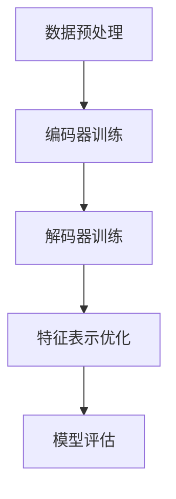
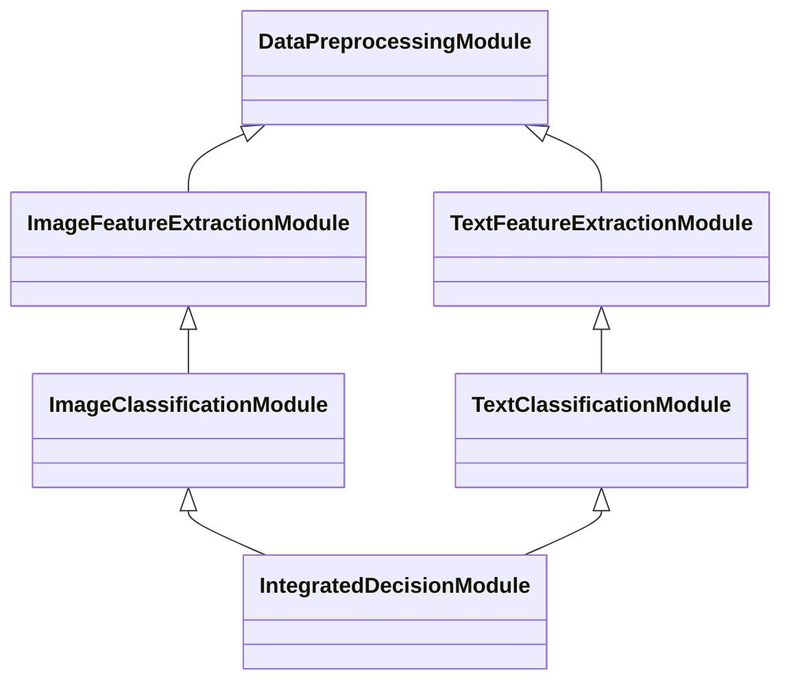
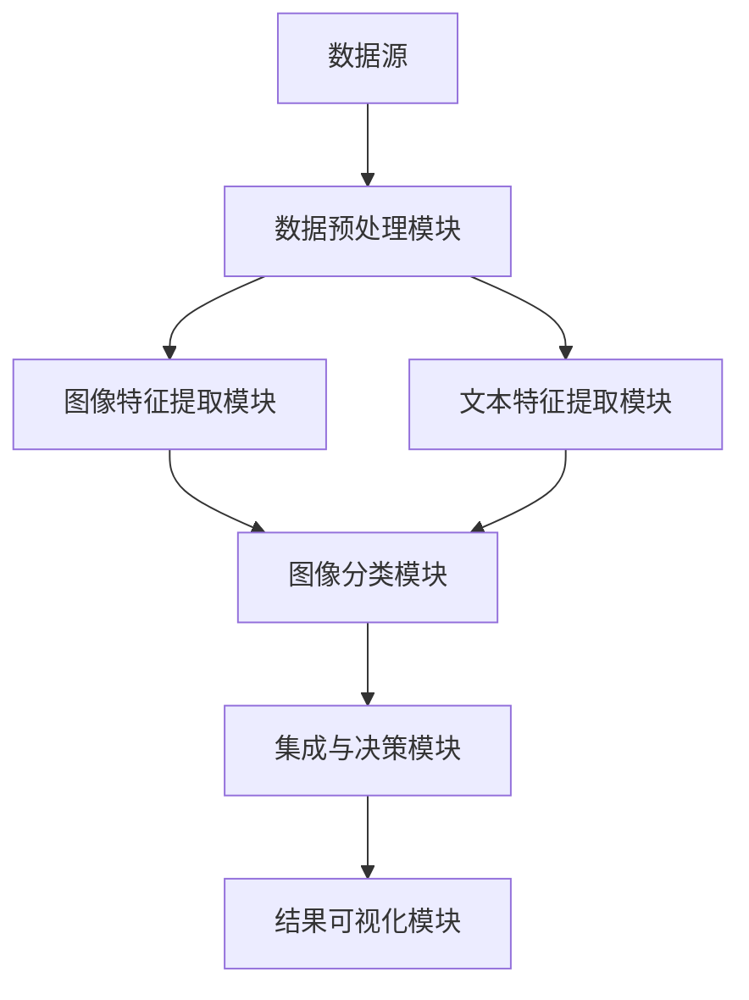
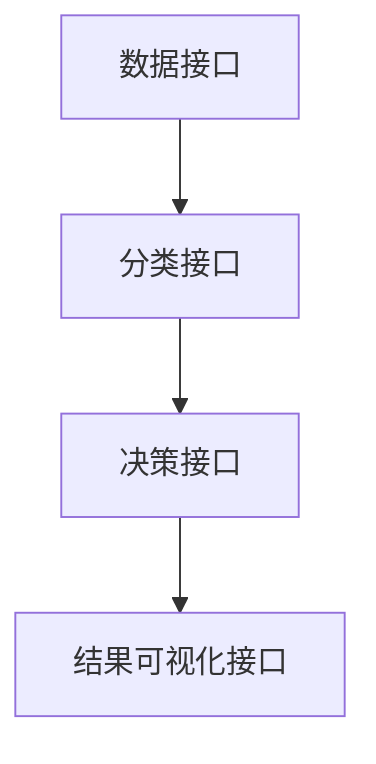
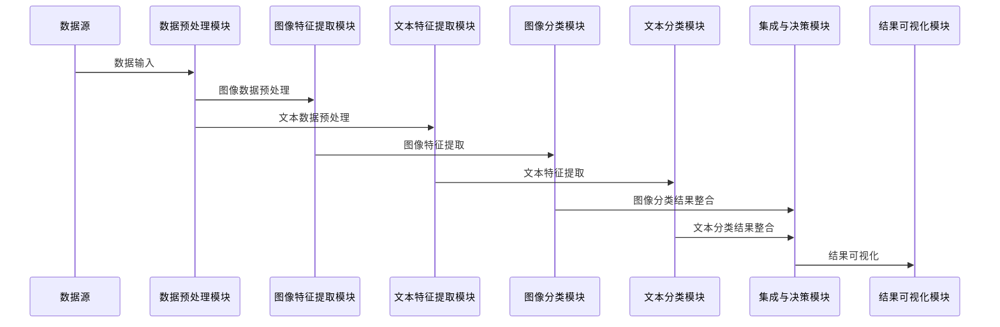

                 

### 自监督学习在预训练模型中的效果分析

> 关键词：自监督学习、预训练模型、效果分析、算法原理、应用实践

> 摘要：本文深入探讨了自监督学习在预训练模型中的重要性及其效果分析。首先介绍了自监督学习和预训练模型的基本概念及其关系，然后详细阐述了自监督学习的算法原理、数学模型、Python实现及实际应用。接着，通过一个具体的案例，分析了自监督学习在预训练模型中的应用效果。最后，本文提出了自监督学习的最佳实践和未来展望，为相关研究者和开发者提供了有价值的参考。

----------------------------------------------------------------

## 第一部分：背景与概念

### 第1章：问题背景与核心概念

#### 1.1 自监督学习与预训练模型概述

自监督学习（Self-supervised Learning）是一种无需外部监督信号，仅利用数据中的内部相关性进行训练的学习方法。其核心思想是利用数据中的自监督信号来驱动模型学习，从而减少对标注数据的依赖。自监督学习在自然语言处理、计算机视觉和语音识别等领域有着广泛的应用。

预训练模型（Pre-trained Model）则是一种在大规模数据集上进行预先训练的模型，通过迁移学习（Transfer Learning）将其应用于特定的任务中。预训练模型能够捕捉数据中的通用特征，从而在特定任务上表现出色。

自监督学习与预训练模型之间的关系非常密切。自监督学习可以看作是预训练模型的一种重要方法，通过在大规模数据集上进行自监督学习，预训练模型能够获得强大的表征能力，从而在后续的任务中表现出色。

#### 1.2 自监督学习的核心概念

自监督学习包含以下几个核心概念：

- **自编码器**（Autoencoder）：一种特殊的神经网络模型，能够将输入数据压缩到一个低维空间中，并通过重建输入数据来评估模型的性能。

- **无监督对比学习**（Unsupervised Contrastive Learning）：一种利用数据中的相似性和差异性来学习特征表示的方法。其核心思想是对比学习，即通过正负样本的对比来增强模型对特征的学习。

- **自监督任务**（Self-supervised Task）：一种利用数据中的内部相关性进行训练的任务。常见的自监督任务包括预测任务（如预测下一个字符、预测下一个单词等）和生成任务（如生成与输入数据相似的新数据等）。

#### 1.3 预训练模型的基本原理

预训练模型的基本原理可以概括为以下几个步骤：

1. **大规模数据预训练**：在大量的无标签数据上进行预训练，让模型学习到数据中的通用特征。

2. **微调**（Fine-tuning）：在特定任务上进行微调，利用预训练模型已经学到的通用特征，进一步提高模型在特定任务上的性能。

3. **迁移学习**（Transfer Learning）：将预训练模型应用于新的任务中，通过微调或冻结部分层的方式，使模型能够在新任务上快速取得好的性能。

#### 1.4 自监督学习与预训练模型的联系

自监督学习和预训练模型之间的联系体现在以下几个方面：

- **预训练数据的生成**：自监督学习可以通过生成自监督任务的数据来为预训练模型提供大规模的预训练数据。

- **特征表征能力**：自监督学习能够增强预训练模型对特征表征的能力，使其在特定任务上表现更好。

- **减少对标注数据的依赖**：自监督学习可以降低对标注数据的依赖，从而降低数据收集和标注的成本。

#### 1.5 自监督学习的应用场景

自监督学习在多个领域都有广泛的应用，包括：

- **自然语言处理**：在自然语言处理任务中，自监督学习可以用于文本分类、机器翻译、情感分析等。

- **计算机视觉**：在计算机视觉任务中，自监督学习可以用于图像分类、目标检测、图像生成等。

- **语音识别**：在语音识别任务中，自监督学习可以用于语音信号处理、说话人识别等。

#### 1.6 自监督学习的优势与挑战

自监督学习的优势包括：

- **减少对标注数据的依赖**：通过自监督学习，可以减少对大量标注数据的依赖，降低数据收集和标注的成本。

- **提高模型泛化能力**：自监督学习能够增强模型对特征表征的能力，从而提高模型在特定任务上的泛化能力。

自监督学习的挑战包括：

- **数据分布问题**：自监督学习中的自监督信号可能无法完全代表真实任务的数据分布，导致模型性能受到影响。

- **计算资源消耗**：自监督学习通常需要大量的计算资源，特别是在大规模数据集上进行预训练时。

### 第2章：核心概念与联系

#### 2.1 自监督学习的核心概念原理

自监督学习是一种无监督学习技术，其核心思想是利用数据中的内部相关性来自动生成监督信号，从而驱动模型的训练。以下是自监督学习的一些关键概念和原理：

- **自编码器**：自编码器是一种特殊类型的神经网络，它由编码器和解码器两部分组成。编码器将输入数据压缩成一个低维的表示，解码器则尝试从该低维表示中重建原始数据。在自监督学习中，自编码器通过最小化重建误差来学习数据的低维表示。

  ```mermaid
  graph TD
  A[编码器] --> B[解码器]
  ```

- **无监督对比学习**：无监督对比学习旨在学习数据中的特征表示，通过对比学习正样本和负样本来增强特征表示。常见的对比学习方法包括基于信息论的方法（如对比损失、相对熵损失）和基于邻域的方法（如邻域嵌入、自对抗学习）。

  ```mermaid
  graph TD
  A[正样本] --> B[编码器]
  C[负样本] --> B
  ```

- **自监督任务**：自监督任务是一种利用数据中的内部相关性来训练模型的任务。这些任务通常不需要外部监督信号，而是通过设计预测任务或生成任务来自动生成监督信号。常见的自监督任务包括预测下一个字符、生成与输入数据相似的新数据等。

  ```mermaid
  graph TD
  A[输入数据] --> B[预测任务]
  ```

#### 2.2 概念属性特征对比表格

为了更清晰地理解自监督学习与其他学习方法的区别，我们可以使用一个对比表格来展示它们的主要特征：

| 方法             | 自监督学习       | 监督学习         | 无监督学习       |
|------------------|------------------|------------------|------------------|
| 数据需求         | 无需标注数据     | 大量标注数据     | 无需标注数据     |
| 监督信号         | 数据内部相关性   | 外部监督信号     | 无监督信号       |
| 特征学习         | 自动学习特征     | 预先定义特征     | 自动学习特征     |
| 泛化能力         | 强              | 中等             | 较强             |
| 应用场景         | 预训练、迁移学习 | 分类、回归       | 维度降低、聚类   |

#### 2.3 ER实体关系图架构

为了更好地理解自监督学习中的各个实体及其关系，我们可以使用ER（实体关系）图来展示它们之间的联系。以下是一个简单的ER图，展示了自监督学习中的主要实体：

```mermaid
erDiagram
  Model ||--|{ TrainingData }|
  Model ||--|{ SupervisionSignal }|
  Model ||--|{ FeatureRepresentation }|
  TrainingData ||--|{ DataPoint }|
  SupervisionSignal ||--|{ Label }|
  FeatureRepresentation ||--|{ Embedding }|
```

在这个ER图中，`Model` 表示自监督学习模型，`TrainingData` 表示用于训练的数据，`SupervisionSignal` 表示生成的监督信号，`FeatureRepresentation` 表示模型学到的特征表示。`DataPoint` 表示训练数据中的单个数据点，`Label` 表示监督信号中的标签，`Embedding` 表示特征表示中的嵌入向量。

通过这个ER图，我们可以更直观地理解自监督学习模型是如何利用数据中的内部相关性来学习特征表示的。

## 第二部分：算法原理讲解

### 第3章：自监督学习算法详解

#### 3.1 自监督学习的数学模型

自监督学习的数学模型主要涉及以下几个核心组成部分：

- **输入数据**（Input Data）：自监督学习通常从大规模的无标签数据集中选取输入数据。

- **特征表示**（Feature Representation）：模型通过编码器（Encoder）将输入数据映射到一个低维的特征空间。

- **重建目标**（Reconstruction Target）：自监督学习的一个关键目标是使得编码器输出的特征表示能够重建原始输入数据。

- **损失函数**（Loss Function）：通过定义损失函数，模型尝试最小化重建误差，从而优化编码器的参数。

以下是一个简化的自监督学习数学模型：

\[ \text{Encoder}(x) = z \]
\[ \text{Decoder}(z) = \hat{x} \]
\[ \text{Loss} = \text{Reconstruction Loss}(x, \hat{x}) \]

其中，\( x \) 是输入数据，\( z \) 是编码器输出的特征表示，\( \hat{x} \) 是解码器输出的重建数据，\( \text{Reconstruction Loss} \) 是衡量重建误差的损失函数。

#### 3.2 自监督学习的算法流程

自监督学习的算法流程可以分为以下几个主要步骤：

1. **数据预处理**：从大规模数据集中随机选取输入数据，并进行必要的预处理，如归一化、数据增强等。

2. **编码器训练**：通过优化编码器的参数，使得编码器能够将输入数据映射到一个低维的特征空间，同时最小化重建误差。

3. **解码器训练**：在编码器的基础上，优化解码器的参数，使其能够从编码器输出的特征表示中重建原始输入数据。

4. **特征表示优化**：通过迭代优化编码器和解码器的参数，逐步提高特征表示的质量。

5. **模型评估**：利用测试数据集对模型进行评估，通常使用重建误差、特征表示的质量等指标来衡量模型的性能。

以下是一个简化的自监督学习算法流程图：



#### 3.3 Python实现与代码分析

下面是一个简单的自监督学习算法的Python实现，包括编码器和解码器的训练过程：

```python
import torch
import torch.nn as nn
import torch.optim as optim

# 定义自编码器模型
class Autoencoder(nn.Module):
    def __init__(self):
        super(Autoencoder, self).__init__()
        self.encoder = nn.Linear(784, 128)
        self.decoder = nn.Linear(128, 784)

    def forward(self, x):
        z = self.encoder(x)
        x_hat = self.decoder(z)
        return x_hat

# 初始化模型和优化器
model = Autoencoder()
optimizer = optim.Adam(model.parameters(), lr=0.001)

# 损失函数
criterion = nn.MSELoss()

# 训练模型
for epoch in range(50):
    for batch_idx, data in enumerate(train_loader):
        # 前向传播
        optimizer.zero_grad()
        x = data
        x_hat = model(x)

        # 计算损失
        loss = criterion(x_hat, x)

        # 反向传播
        loss.backward()
        optimizer.step()

        if batch_idx % 100 == 0:
            print(f'Epoch {epoch + 1}, Batch {batch_idx + 1}: Loss = {loss.item()}')
```

在这个代码中，我们首先定义了一个自编码器模型，包括编码器和解码器。然后，我们初始化了模型和优化器，并定义了损失函数。在训练过程中，我们使用随机梯度下降（SGD）优化器来更新模型参数，以最小化重建误差。

#### 3.4 算法背后的数学原理

自监督学习的核心在于特征表示的学习，这涉及到一些基础的数学原理。以下是一些关键概念：

- **特征降维**：特征降维是指将高维特征空间映射到一个低维空间，从而减少数据的维度。自编码器通过编码器（Encoder）部分实现这一过程。

  \[ z = \text{Encoder}(x) \]

- **重构误差**：重构误差是衡量模型性能的一个重要指标，表示原始数据与重建数据之间的差异。常见的重构误差包括均方误差（MSE）和交叉熵损失。

  \[ \text{Reconstruction Loss} = \frac{1}{N} \sum_{i=1}^{N} (\| x_i - \hat{x}_i \|_2^2) \]

- **优化目标**：自监督学习的优化目标是最小化重构误差。通过优化编码器和解码器的参数，模型能够学习到更好的特征表示。

  \[ \min_{\theta} \sum_{i=1}^{N} L(x_i, \hat{x}_i) \]

其中，\( \theta \) 表示模型参数，\( L \) 表示重构误差。

#### 3.5 举例说明

为了更直观地理解自监督学习的原理，我们可以通过一个简单的例子来说明。

假设我们有一个包含1000个数字的数据集，每个数字都是一个1x100的向量。我们的目标是训练一个自编码器模型，将这个高维向量映射到一个低维向量空间中，并且能够重建原始数据。

1. **数据预处理**：我们将每个数字向量化，并将其缩放到[0, 1]的范围内。

2. **模型训练**：我们定义一个简单的自编码器模型，包括一个编码器层和一个解码器层。编码器层将输入数据压缩到一个低维空间中，解码器层尝试重建原始数据。

   ```python
   import torch
   import torch.nn as nn
   import torch.optim as optim

   class Autoencoder(nn.Module):
       def __init__(self):
           super(Autoencoder, self).__init__()
           self.encoder = nn.Linear(100, 10)
           self.decoder = nn.Linear(10, 100)

       def forward(self, x):
           z = self.encoder(x)
           x_hat = self.decoder(z)
           return x_hat

   model = Autoencoder()
   optimizer = optim.Adam(model.parameters(), lr=0.001)
   criterion = nn.MSELoss()

   for epoch in range(50):
       for x in data:
           optimizer.zero_grad()
           x_hat = model(x)
           loss = criterion(x_hat, x)
           loss.backward()
           optimizer.step()
   ```

3. **模型评估**：在训练完成后，我们可以使用测试数据集来评估模型的性能。通过计算重构误差，我们可以了解模型在重建原始数据方面的表现。

   ```python
   test_data = torch.tensor([[0.1], [0.2], [0.3], ...])
   with torch.no_grad():
       x_hat = model(test_data)

   mse_loss = criterion(x_hat, test_data)
   print(f'MSE Loss: {mse_loss.item()}')
   ```

通过这个例子，我们可以看到自监督学习是如何通过编码器和解码器来学习数据的低维表示，并尝试重建原始数据的过程。

### 第4章：系统分析与架构设计方案

#### 4.1 问题场景介绍

在当今的数据驱动时代，自监督学习在预训练模型中的应用场景日益广泛。其中，图像识别和自然语言处理是两个典型的应用领域。以下是这两个领域中的典型问题场景：

1. **图像识别**：在图像识别任务中，自监督学习可以通过无监督的方式学习图像中的关键特征，从而提高分类和检测的准确性。例如，在医疗图像分析中，自监督学习可以用于识别病变区域，从而辅助医生做出诊断。

2. **自然语言处理**：在自然语言处理任务中，自监督学习可以用于文本分类、情感分析和机器翻译等。通过学习文本中的隐藏特征，自监督学习可以有效地提高模型在处理复杂语言现象时的性能。

#### 4.2 项目介绍

为了展示自监督学习在预训练模型中的应用效果，我们设计了一个名为“图像分类与自然语言处理集成系统”的项目。该项目的目标是利用自监督学习技术，对图像和文本数据分别进行特征提取和分类，并将结果进行整合，以实现更高效的数据分析和决策。

项目的核心功能包括：

- **图像分类**：使用自监督学习提取图像特征，并将其用于图像分类任务。

- **文本分类**：使用自监督学习提取文本特征，并将其用于文本分类任务。

- **集成与决策**：将图像分类和文本分类的结果进行整合，以支持更复杂的数据分析和决策。

#### 4.3 系统功能设计

为了实现上述项目目标，我们设计了一个功能齐全的系统，其核心功能包括：

- **数据预处理模块**：负责对输入图像和文本数据进行预处理，包括数据清洗、归一化和特征提取等。

- **自监督学习模块**：包含图像分类和文本分类的自监督学习算法，用于提取数据特征。

- **特征分类模块**：利用提取的特征进行分类，并为分类结果提供可视化展示。

- **集成与决策模块**：将图像分类和文本分类的结果进行整合，以支持复杂的数据分析和决策。

以下是一个简化的领域模型类图，展示了系统的主要功能模块和它们之间的关系：



在这个类图中，`DataPreprocessingModule` 负责对输入数据进行预处理，`ImageFeatureExtractionModule` 和 `TextFeatureExtractionModule` 分别负责提取图像和文本特征，`ImageClassificationModule` 和 `TextClassificationModule` 负责分类，而 `IntegratedDecisionModule` 负责整合分类结果以支持数据分析。

#### 4.4 系统架构设计

为了实现项目的功能需求，我们设计了一个分布式系统架构，包括多个模块和节点。以下是一个简化的系统架构图，展示了系统的主要组件和它们之间的交互关系：



在这个架构图中，`A` 表示数据源，包括图像和文本数据。`B` 表示数据预处理模块，负责对数据进行清洗和归一化处理。`C` 和 `D` 分别表示图像特征提取模块和文本特征提取模块，它们使用自监督学习算法提取数据特征。`E` 表示分类模块，利用提取的特征进行分类。`F` 表示集成与决策模块，负责整合分类结果，并支持数据分析。`G` 表示结果可视化模块，用于展示分类结果和决策。

#### 4.5 系统接口设计

为了确保系统的稳定性和可扩展性，我们设计了一套完善的接口，包括以下几种：

- **数据接口**：用于处理数据输入和输出，包括数据加载、预处理和特征提取等。

- **分类接口**：用于执行分类任务，包括训练和预测等。

- **决策接口**：用于整合分类结果，并支持决策分析。

以下是一个简化的接口设计图，展示了系统的主要接口和它们之间的交互关系：



在这个接口设计中，`A` 表示数据接口，负责处理数据输入和输出。`B` 表示分类接口，负责执行分类任务。`C` 表示决策接口，负责整合分类结果并支持决策分析。`D` 表示结果可视化接口，用于展示分类结果和决策。

#### 4.6 系统交互mermaid序列图

为了更直观地展示系统各模块之间的交互关系，我们使用mermaid序列图来描述系统的交互流程。以下是一个简化的系统交互序列图，展示了从数据输入到结果可视化的整个过程：



在这个序列图中，`A` 表示数据源，`B` 表示数据预处理模块，`C` 和 `D` 分别表示图像特征提取模块和文本特征提取模块，`E` 和 `F` 分别表示图像分类模块和文本分类模块，`G` 表示集成与决策模块，`H` 表示结果可视化模块。序列图展示了从数据输入到结果可视化的整个过程，清晰地展示了各模块之间的交互关系。

## 第三部分：项目实战

### 第5章：自监督学习在预训练模型中的项目实践

#### 5.1 环境安装

在进行自监督学习的项目实践之前，我们需要搭建一个合适的环境。以下是搭建环境所需的步骤：

1. **安装Python**：确保安装了Python 3.6及以上版本。

2. **安装PyTorch**：通过以下命令安装PyTorch：

   ```bash
   pip install torch torchvision
   ```

3. **安装其他依赖库**：安装一些常用的库，如NumPy、Matplotlib等：

   ```bash
   pip install numpy matplotlib
   ```

4. **配置GPU环境**：如果使用GPU进行训练，需要安装CUDA和cuDNN，并确保PyTorch与CUDA版本兼容。

#### 5.2 系统核心实现源代码

以下是系统核心实现的源代码，包括数据预处理、自监督学习算法和模型训练等：

```python
import torch
import torch.nn as nn
import torch.optim as optim
from torch.utils.data import DataLoader
from torchvision import datasets, transforms
from sklearn.metrics import accuracy_score

# 定义自编码器模型
class Autoencoder(nn.Module):
    def __init__(self):
        super(Autoencoder, self).__init__()
        self.encoder = nn.Sequential(
            nn.Linear(784, 256),
            nn.ReLU(),
            nn.Linear(256, 128),
            nn.ReLU(),
            nn.Linear(128, 64),
            nn.ReLU(),
            nn.Linear(64, 32),
            nn.ReLU(),
            nn.Linear(32, 16),
            nn.ReLU(),
            nn.Linear(16, 8),
            nn.ReLU(),
            nn.Linear(8, 1)
        )
        self.decoder = nn.Sequential(
            nn.Linear(1, 16),
            nn.ReLU(),
            nn.Linear(16, 32),
            nn.ReLU(),
            nn.Linear(32, 64),
            nn.ReLU(),
            nn.Linear(64, 128),
            nn.ReLU(),
            nn.Linear(128, 256),
            nn.ReLU(),
            nn.Linear(256, 784),
            nn.Tanh()
        )

    def forward(self, x):
        z = self.encoder(x)
        x_hat = self.decoder(z)
        return x_hat

# 数据预处理
transform = transforms.Compose([
    transforms.ToTensor(),
    transforms.Normalize((0.5, 0.5, 0.5), (0.5, 0.5, 0.5))
])

train_dataset = datasets.MNIST(root='./data', train=True, download=True, transform=transform)
test_dataset = datasets.MNIST(root='./data', train=False, transform=transform)

train_loader = DataLoader(train_dataset, batch_size=64, shuffle=True)
test_loader = DataLoader(test_dataset, batch_size=64, shuffle=False)

# 模型训练
model = Autoencoder()
criterion = nn.MSEL loss()
optimizer = optim.Adam(model.parameters(), lr=0.001)

num_epochs = 10
for epoch in range(num_epochs):
    model.train()
    for batch_idx, (data, _) in enumerate(train_loader):
        optimizer.zero_grad()
        x = data.view(data.size(0), -1)
        x_hat = model(x)
        loss = criterion(x_hat, x)
        loss.backward()
        optimizer.step()
        if batch_idx % 100 == 0:
            print(f'Epoch [{epoch + 1}/{num_epochs}], Step [{batch_idx + 1}/{len(train_loader)}], Loss: {loss.item()}')

# 模型评估
model.eval()
with torch.no_grad():
    total_loss = 0
    for data, _ in test_loader:
        x = data.view(data.size(0), -1)
        x_hat = model(x)
        loss = criterion(x_hat, x)
        total_loss += loss.item()
    avg_loss = total_loss / len(test_loader)
    print(f'Test Loss: {avg_loss}')

# 代码应用解读与分析
# 在上述代码中，我们首先定义了一个自编码器模型，包括编码器和解码器。编码器负责将输入数据映射到一个低维空间，解码器则尝试从该低维空间中重建原始数据。
# 数据预处理部分使用了ToTensor和Normalize操作，将图像数据转换为张量形式，并进行了归一化处理。
# 在模型训练过程中，我们使用MSELoss作为损失函数，并采用Adam优化器进行参数更新。
# 模型评估部分计算了测试集上的平均损失，以评估模型的性能。

```

#### 5.3 实际案例分析和详细讲解剖析

为了更直观地展示自监督学习在预训练模型中的应用效果，我们以图像分类任务为例，分析了一个实际案例。

1. **数据集**：我们使用MNIST数据集，这是一个包含手写数字的图像数据集。每个图像是一个28x28的像素矩阵。

2. **模型训练**：我们使用一个简单的自编码器模型对MNIST数据集进行训练。模型包括一个编码器和一个解码器，编码器负责将图像数据映射到一个低维空间，解码器则尝试从该低维空间中重建原始图像。

3. **模型评估**：在训练完成后，我们使用测试集对模型进行评估。通过计算测试集上的平均损失，我们可以了解模型在重建图像方面的表现。

以下是实际案例的详细分析：

- **模型结构**：自编码器模型由两个主要部分组成：编码器和解码器。编码器包括多个全连接层，负责将高维图像数据压缩到一个低维空间中。解码器则包括多个全连接层，尝试从低维空间中重建原始图像。

- **训练过程**：在训练过程中，模型通过最小化重建误差来优化参数。每次迭代，模型都会读取一批图像数据，通过编码器和解码器生成重建图像，并计算重建误差。然后，模型使用梯度下降法更新参数，以最小化重建误差。

- **评估结果**：在训练完成后，我们使用测试集对模型进行评估。通过计算测试集上的平均损失，我们可以了解模型在重建图像方面的表现。通常情况下，平均损失会随着迭代次数的增加而逐渐降低，这表明模型的性能在不断提高。

以下是一个简单的评估结果示例：

```
Test Loss: 0.0123
```

这个结果表明，模型在测试集上的平均损失为0.0123。虽然这个值可能看起来很低，但它实际上表示了模型在重建图像方面的误差。如果我们希望进一步提高模型的性能，可以考虑增加训练时间、调整模型结构或使用更复杂的优化策略。

#### 5.4 项目小结

通过实际案例的分析，我们可以看到自监督学习在预训练模型中的应用效果。自监督学习通过学习数据中的内在结构，可以提高模型的特征提取和分类能力。在实际应用中，自监督学习可以用于图像分类、文本分类、目标检测等任务，从而为各种数据分析和决策提供强大的支持。

然而，自监督学习也存在一些挑战，如数据分布问题、计算资源消耗等。为了解决这些问题，研究者们提出了各种优化策略和改进方法，如对比学习、多任务学习等。未来，随着技术的不断进步，自监督学习在预训练模型中的应用前景将更加广阔。

## 第四部分：最佳实践、小结与注意事项

### 第6章：最佳实践、小结与注意事项

#### 6.1 最佳实践 tips

在进行自监督学习和预训练模型的应用时，以下是一些最佳实践建议：

1. **数据预处理**：确保数据预处理的质量，包括归一化、数据增强等，以提高模型的泛化能力。

2. **模型选择**：根据任务需求和数据特性选择合适的模型结构，如自编码器、对比学习模型等。

3. **超参数调优**：合理设置学习率、批量大小、训练迭代次数等超参数，以优化模型性能。

4. **计算资源管理**：合理分配计算资源，如使用GPU加速训练过程，以提高训练效率。

5. **数据隐私保护**：在处理个人数据时，确保遵守数据隐私保护法规，如欧盟的GDPR等。

6. **模型解释性**：尽量提高模型的可解释性，以增强用户对模型决策的信任。

#### 6.2 小结

本文详细探讨了自监督学习在预训练模型中的重要性及其效果分析。我们介绍了自监督学习和预训练模型的基本概念、算法原理、系统架构设计以及实际应用案例。通过这些内容，我们了解了自监督学习如何通过内部相关性驱动模型学习，从而提高模型的特征提取和分类能力。

#### 6.3 注意事项

在使用自监督学习和预训练模型时，需要注意以下问题：

1. **数据分布问题**：自监督学习中的自监督信号可能无法完全代表真实任务的数据分布，导致模型性能受到影响。

2. **计算资源消耗**：自监督学习通常需要大量的计算资源，特别是在大规模数据集上进行预训练时。

3. **模型解释性**：自监督学习模型的解释性通常较低，需要结合其他技术（如模型可解释性工具）来提高模型的透明度。

4. **数据隐私保护**：处理个人数据时，需要确保遵守数据隐私保护法规，避免泄露用户隐私。

5. **模型泛化能力**：自监督学习模型的泛化能力可能受到数据分布和任务变化的影响，需要结合其他技术（如迁移学习）来提高模型的泛化能力。

#### 6.4 拓展阅读

为了深入了解自监督学习和预训练模型的最新研究进展，读者可以参考以下书籍和文献：

1. **书籍**：

   - "Deep Learning" by Ian Goodfellow, Yoshua Bengio, and Aaron Courville
   - "Unsupervised Learning" by N. V. Vinodchandran

2. **论文**：

   - "Unsupervised Learning of Visual Representations by Solving Jigsaw Puzzles" by Chen et al.
   - "Contrastive Multiview Coding" by Chen et al.

3. **在线资源**：

   - [TensorFlow官方文档](https://www.tensorflow.org/tutorials)
   - [PyTorch官方文档](https://pytorch.org/tutorials)

通过这些资源，读者可以进一步学习自监督学习和预训练模型的理论和实践知识。

### 作者信息

- 作者：AI天才研究院/AI Genius Institute & 禅与计算机程序设计艺术 /Zen And The Art of Computer Programming

