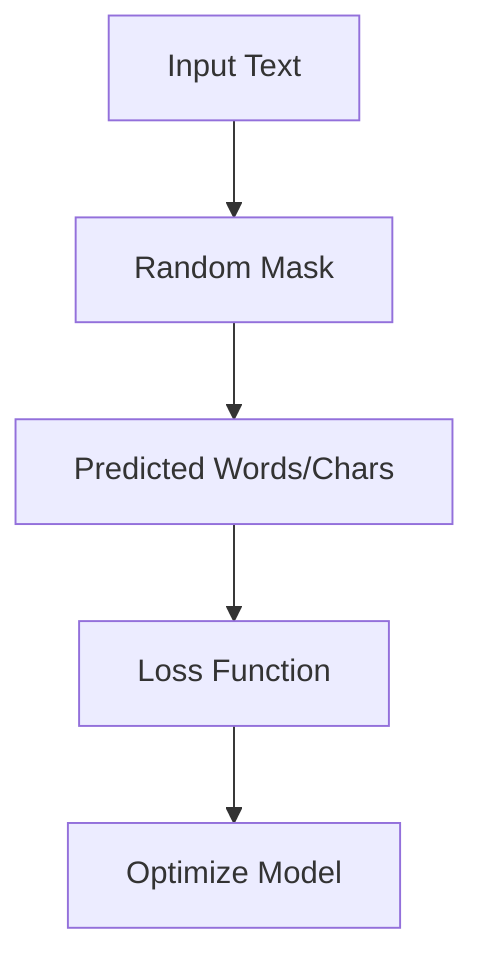

                 

# 自监督学习技术在语言模型训练中的新进展

## 关键词
- 自监督学习
- 语言模型
- 训练算法
- 人工智能
- 深度学习
- 自然语言处理

## 摘要
本文将深入探讨自监督学习在语言模型训练中的新进展。自监督学习是一种无需人工标注数据即可训练模型的方法，它在近年来获得了广泛关注。本文将从核心概念、算法与架构、数学模型、应用场景、案例分析以及最佳实践等方面，系统性地阐述自监督学习在语言模型训练中的最新研究成果和应用。

## 引言与背景

### 自监督学习的概念

自监督学习是一种机器学习方法，它利用未标注的数据来训练模型。这种方法的核心思想是从数据中提取出具有监督学习特征的信息，但无需人工标注每个数据点的标签。自监督学习的出现，解决了标注数据成本高、耗时长的难题，尤其在大规模数据集的背景下，显示出了巨大的潜力。

### 自监督学习在语言模型训练中的重要性

语言模型是自然语言处理（NLP）领域的重要工具，它能够预测文本序列中的下一个词或句子。传统的语言模型训练方法主要依赖于大量标注的数据，例如词袋模型、n元语法等。然而，随着数据集规模的扩大和复杂度的提升，标注数据的成本和难度不断增加。

自监督学习通过利用未标注的数据来训练模型，可以有效地降低训练成本，提高训练效率。此外，自监督学习还可以通过无监督的方式学习到更多的语言信息，从而提高模型的性能。

### 语言模型训练的挑战与趋势

语言模型训练面临着以下几个挑战：

1. **数据规模**：随着互联网的快速发展，可供训练的语言数据量呈现爆炸性增长。然而，如何有效地利用这些海量数据，仍然是一个亟待解决的问题。
2. **计算资源**：训练大规模语言模型需要大量的计算资源，如何优化计算效率，降低成本，是一个关键问题。
3. **模型可解释性**：大型语言模型往往表现出出色的性能，但其内部工作机制复杂，难以解释。如何提高模型的可解释性，使其更容易被理解和接受，是一个重要的研究方向。

在应对这些挑战的过程中，自监督学习展现出了巨大的潜力。它不仅能够降低训练成本，提高计算效率，还可以通过无监督的方式学习到更多的语言信息，提高模型的可解释性。

## 核心概念与原理

### 自监督学习的基本概念

自监督学习是一种从未标注数据中学习的方式。它的基本思想是将原始数据分成两个部分：一部分作为模型输入，另一部分作为模型的输出。模型的目标是通过学习输入和输出之间的关系，预测输出。

在自监督学习中，数据不需要经过人工标注，因此无需花费大量时间和资源进行数据标注。自监督学习通过设计特定的任务，使模型能够自动地从数据中提取有用的信息。

### 自监督学习的核心原理

自监督学习的核心原理包括以下几个方面：

1. **数据预处理**：首先，需要对原始数据进行预处理，将其转化为模型可以处理的格式。例如，对于文本数据，可以将其转化为单词或字符序列。
2. **任务设计**：设计合适的自监督学习任务，使模型能够从数据中提取有用的信息。常见的任务包括预测缺失的字符、预测缺失的词、预测下一个句子等。
3. **模型训练**：通过训练模型，使其能够预测缺失的数据部分。在训练过程中，模型会不断调整参数，以最小化预测误差。
4. **模型评估**：使用验证集或测试集对模型进行评估，以确定其性能。

### 自监督学习与传统监督学习的对比

自监督学习与传统监督学习有以下几点区别：

1. **数据需求**：自监督学习无需标注数据，而传统监督学习需要大量的标注数据。
2. **计算效率**：自监督学习通常需要较少的计算资源，因为它可以利用未标注的数据进行训练。
3. **模型性能**：自监督学习通过无监督的方式学习到更多的数据信息，因此可能比传统监督学习产生更好的模型性能。
4. **应用范围**：自监督学习适用于大量未标注数据的场景，而传统监督学习适用于需要精确标注数据的应用。

### 自监督学习在语言模型训练中的应用

自监督学习在语言模型训练中的应用非常广泛。以下是一些典型的应用场景：

1. **语言模型预训练**：使用大量未标注的文本数据，通过自监督学习的方式预训练语言模型，然后再将其用于特定任务的微调。
2. **文本分类**：通过自监督学习的方式，从大量未标注的文本数据中学习到文本的特征，从而实现文本分类任务。
3. **机器翻译**：利用自监督学习的方式，从源语言和目标语言的文本数据中学习到翻译模型，从而实现机器翻译任务。
4. **问答系统**：通过自监督学习的方式，从大量问答对中学习到问题回答的模型，从而实现问答系统。

## 算法与架构

### 主要算法

自监督学习在语言模型训练中常用的算法包括：

1. **Masked Language Model (MLM)**：通过随机屏蔽输入文本中的部分词或字符，然后预测这些被屏蔽的部分。Transformer模型就是基于MLM算法的一种语言模型。
2. **Predictive Language Model (PLM)**：通过预测下一个词或字符，从而理解输入文本的顺序和结构。n元语法是一种典型的PLM算法。
3. **Speech Transformer**：针对语音数据，通过自监督学习的方式训练语音识别模型。Speech Transformer是一种基于Transformer架构的自监督学习算法。

### 算法原理

1. **Masked Language Model (MLM)**

MLM算法通过随机屏蔽输入文本中的部分词或字符，然后预测这些被屏蔽的部分。具体步骤如下：

1. 输入文本：`The quick brown fox jumps over the lazy dog`
2. 随机屏蔽：`The quick brown fox jumps over the **lazy dog**`
3. 预测：预测被屏蔽的词或字符 `**lazy**`

MLM算法的优点是能够有效地捕捉到文本中的顺序和结构信息，从而提高模型的性能。

2. **Predictive Language Model (PLM)**

PLM算法通过预测下一个词或字符，从而理解输入文本的顺序和结构。以n元语法为例，具体步骤如下：

1. 输入文本：`The quick brown fox jumps over the lazy dog`
2. 分词：`['The', 'quick', 'brown', 'fox', 'jumps', 'over', 'the', 'lazy', 'dog']`
3. 预测：预测下一个词或字符
   - `The quick brown fox jumps over the`
     - 预测：`lazy`
   - `The quick brown fox jumps over the lazy`
     - 预测：`dog`

PLM算法的优点是能够捕捉到文本中的局部依赖关系，从而提高模型的性能。

3. **Speech Transformer**

Speech Transformer是一种基于Transformer架构的自监督学习算法，用于语音数据的处理。具体步骤如下：

1. 输入语音：一段语音数据
2. 特征提取：将语音数据转换为特征序列
3. Transformer编码：通过Transformer编码器对特征序列进行编码，得到编码后的序列
4. Transformer解码：通过Transformer解码器预测语音序列中的下一个特征
5. 损失函数：使用交叉熵损失函数计算预测特征与真实特征之间的差异，然后优化模型参数

### Mermaid流程图

以下是一个Masked Language Model (MLM)的Mermaid流程图：

## 数学模型与公式

### 数学模型

自监督学习的数学模型主要基于损失函数和优化算法。以下是一些常用的数学模型和公式：

1. **Masked Language Model (MLM)**

MLM算法的损失函数通常使用交叉熵损失函数，公式如下：

$$
Loss = -\sum_{i}^{N} y_i \log(p_i)
$$

其中，$y_i$是第$i$个预测词或字符的标签，$p_i$是模型对于第$i$个预测词或字符的预测概率。

2. **Predictive Language Model (PLM)**

PLM算法的损失函数通常使用平均平方误差（MSE），公式如下：

$$
Loss = \frac{1}{N} \sum_{i}^{N} (y_i - \hat{y_i})^2
$$

其中，$y_i$是第$i$个真实词或字符，$\hat{y_i}$是模型对于第$i$个词或字符的预测。

### 数学公式示例

以下是一个交叉熵损失函数的示例：

$$
Loss = -\sum_{i}^{N} y_i \log(p_i)
$$

其中，$y_i$为1（表示第$i$个预测词或字符为真实词或字符），$p_i$为模型对于第$i$个预测词或字符的预测概率。

## 应用场景

### 语言模型预训练

语言模型预训练是自监督学习在语言模型训练中最广泛的应用场景之一。通过使用大量未标注的文本数据，可以预先训练一个大规模的语言模型。然后，将这个预训练模型应用于特定任务的微调，例如文本分类、机器翻译、问答系统等。这种方法能够提高模型的性能，同时降低训练成本。

### 文本分类

文本分类是自然语言处理中的一项重要任务，其目的是将文本数据分类到不同的类别中。自监督学习通过从大量未标注的文本数据中学习特征，可以实现高效的文本分类。例如，可以使用预训练的语言模型来提取文本的特征，然后使用这些特征进行分类。

### 机器翻译

机器翻译是将一种语言的文本翻译成另一种语言的过程。自监督学习可以通过无监督的方式从源语言和目标语言的文本数据中学习翻译模型。例如，可以使用基于Transformer的自监督学习算法，如Speech Transformer，来训练语音识别模型，从而实现机器翻译。

### 问答系统

问答系统是一种能够回答用户问题的系统。自监督学习可以通过从大量问答对中学习问题回答的模型，从而实现问答系统。例如，可以使用预训练的语言模型来提取问题中的关键信息，然后使用这些信息来生成回答。

## 案例分析

### 案例一：BERT模型

BERT（Bidirectional Encoder Representations from Transformers）是一种基于Transformer架构的语言模型，通过自监督学习的方式进行预训练。BERT模型的核心思想是双向编码，即同时考虑文本序列的前后关系。

1. **数据预处理**：BERT模型使用大量未标注的文本数据进行预处理，将其转化为单词或字符序列。
2. **任务设计**：BERT模型通过两个任务进行预训练：Masked Language Model (MLM) 和 Next Sentence Prediction (NSP)。
3. **模型训练**：BERT模型使用训练数据进行训练，通过优化损失函数来调整模型参数。
4. **模型评估**：使用验证集和测试集对BERT模型进行评估，确定其性能。

### 案例二：Speech Transformer

Speech Transformer是一种基于Transformer架构的自监督学习算法，用于语音数据的处理。

1. **数据预处理**：将语音数据转换为特征序列。
2. **任务设计**：Speech Transformer通过预测语音序列中的下一个特征进行训练。
3. **模型训练**：使用训练数据进行训练，通过优化损失函数来调整模型参数。
4. **模型评估**：使用验证集和测试集对Speech Transformer模型进行评估，确定其性能。

## 最佳实践与注意事项

### 最佳实践

1. **数据预处理**：确保数据质量，去除噪声和错误数据。
2. **模型选择**：根据具体任务选择合适的自监督学习算法和模型架构。
3. **训练策略**：设计合适的训练策略，例如学习率调整、批量大小等。
4. **模型评估**：使用多个评估指标来评估模型性能，例如准确率、召回率、F1值等。

### 注意事项

1. **数据隐私**：在处理未标注的数据时，需要注意保护数据隐私。
2. **模型泛化能力**：自监督学习模型可能在特定数据集上表现良好，但可能无法泛化到其他数据集。
3. **计算资源**：自监督学习通常需要大量的计算资源，需要合理规划计算资源。

## 结论

自监督学习在语言模型训练中展现出了巨大的潜力。通过无监督的方式，它能够有效地降低训练成本，提高模型性能。本文从核心概念、算法与架构、数学模型、应用场景、案例分析以及最佳实践等方面，系统地阐述了自监督学习在语言模型训练中的新进展。未来，自监督学习将继续在自然语言处理领域发挥重要作用，推动人工智能的发展。

