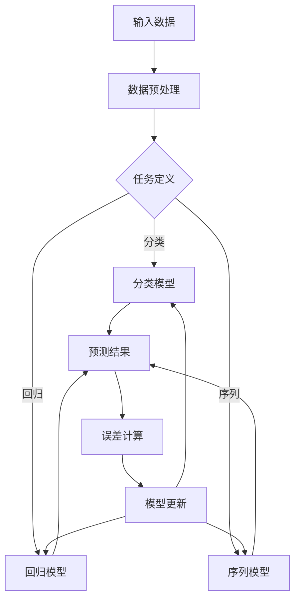

                 


## 第一部分：引言与背景

### 第1章：问题背景与核心概念

#### 1.1 问题背景

**问题描述**：在人工智能（AI）领域，数据标注是一项耗时长、成本高昂的任务。传统的监督学习模型需要大量的标注数据来进行训练，而这往往限制了模型的发展和应用。为了缓解这一问题，自监督学习应运而生。

**问题解决**：自监督学习通过利用未标注的数据，降低了对标注数据的依赖。它能够从原始数据中自动提取有用的信息，从而实现模型的训练和优化。

**边界与外延**：自监督学习不仅在计算机视觉领域有广泛应用，如图像分类、目标检测等，还在自然语言处理、语音识别等领域取得了显著成果。

**概念结构与核心要素组成**：自监督学习的基本概念结构包括：数据预处理、任务定义、模型训练、模型评估等核心要素。

#### 1.2 核心概念

**自监督学习的定义**：自监督学习是一种无监督学习的方法，它利用未标注的数据来训练模型。在训练过程中，模型需要根据输入数据中的某些信息来预测或判断，然后通过误差反馈来优化模型的参数。

**自监督学习的特点**：
- **无需标注数据**：自监督学习能够利用大量未标注的数据，降低了对标注数据的依赖。
- **自适应性强**：自监督学习可以根据不同的任务需求，自适应地调整训练策略和数据预处理方法。
- **高效性**：自监督学习在处理大规模数据时，能够显著提高训练效率。

**自监督学习与传统监督学习的区别**：
- **数据依赖**：传统监督学习依赖大量标注数据，而自监督学习利用未标注的数据。
- **训练目标**：传统监督学习以预测准确率为训练目标，而自监督学习以提取数据中的有用信息为目标。
- **应用场景**：传统监督学习适用于有标注数据的场景，而自监督学习适用于无标注数据的场景。

#### 1.3 主流自监督学习方法

**无监督学习与自监督学习的联系与区别**：
- **联系**：无监督学习和自监督学习都是无监督学习的方法，它们都利用未标注的数据。
- **区别**：无监督学习不涉及任务目标，而自监督学习则需要根据任务目标来提取数据中的有用信息。

**自监督学习的常见类型**：
- **预训练-微调**：预训练模型在大规模未标注数据上进行训练，然后通过微调来适应特定的任务需求。
- **数据增强**：通过数据增强技术来生成更多的训练数据，从而提高模型的泛化能力。

---

在下一章中，我们将深入探讨自监督学习算法的原理与实现。我们将一步步分析算法的核心概念、数学模型和Python源代码实现，帮助您更好地理解自监督学习的工作机制。敬请期待！## 第二部分：自监督学习算法原理与实现

### 第2章：算法原理讲解

#### 2.1 算法原理

自监督学习的核心思想是通过未标注的数据，让模型自动学习数据的内在结构，从而提高模型的性能。下面我们将通过算法流程图来展示自监督学习的基本原理。



**算法原理**：自监督学习的算法原理可以分为以下几个步骤：

1. **数据预处理**：对输入数据进行预处理，包括数据清洗、数据标准化等操作。
2. **任务定义**：根据具体的任务需求，定义任务类型，如分类、回归或序列预测。
3. **模型训练**：根据任务类型，选择合适的模型进行训练。例如，对于分类任务，选择分类模型；对于回归任务，选择回归模型；对于序列预测任务，选择序列模型。
4. **预测结果**：使用训练好的模型对输入数据进行预测，得到预测结果。
5. **误差计算**：计算预测结果与真实结果之间的误差。
6. **模型更新**：根据误差反馈，更新模型的参数，从而优化模型性能。

#### 2.2 数学模型与公式

自监督学习的数学模型主要包括损失函数和优化算法。下面我们将详细讲解这些数学模型。

**数学模型**：自监督学习的主要数学模型是损失函数，它衡量预测结果与真实结果之间的差异。常见的损失函数有交叉熵损失函数、均方误差损失函数等。

- **交叉熵损失函数**：$$Loss_{cross\_entropy} = -\sum_{i=1}^{N} y_{i} \log(p_{i})$$，其中，$y_{i}$是真实标签，$p_{i}$是预测概率。

- **均方误差损失函数**：$$Loss_{mean\_square} = \frac{1}{N}\sum_{i=1}^{N} (y_{i} - \hat{y_{i}})^2$$，其中，$\hat{y_{i}}$是预测值。

**公式讲解**：这些损失函数的具体计算方式如下：

1. **交叉熵损失函数**：交叉熵损失函数在分类任务中常用，它衡量的是预测概率分布与真实概率分布之间的差异。预测概率分布$p_{i}$是通过模型计算得到的，真实概率分布$y_{i}$是对应真实标签的分布。

2. **均方误差损失函数**：均方误差损失函数在回归任务中常用，它衡量的是预测值与真实值之间的差异。预测值$\hat{y_{i}}$是通过模型计算得到的，真实值$y_{i}$是对应真实标签的值。

#### 2.3 Python源代码实现

下面我们将使用Python来演示一个简单的自监督学习算法实现。这个算法将基于分类任务，使用交叉熵损失函数进行模型训练。

```python
import numpy as np

# 模拟输入数据
X = np.random.rand(100, 10)
y = np.random.randint(0, 2, 100)

# 初始化模型参数
w = np.random.rand(10, 2)

# 定义损失函数
def cross_entropy_loss(y, p):
    return -np.sum(y * np.log(p))

# 定义优化算法
def gradient_descent(w, X, y, learning_rate):
    gradient = 2 * (w @ X.T * (y - p))
    w -= learning_rate * gradient
    return w

# 训练模型
learning_rate = 0.01
num_epochs = 100

for epoch in range(num_epochs):
    # 计算预测概率
    p = np.tanh(w @ X.T)
    
    # 计算损失
    loss = cross_entropy_loss(y, p)
    
    # 更新模型参数
    w = gradient_descent(w, X, y, learning_rate)
    
    # 打印损失
    if epoch % 10 == 0:
        print(f"Epoch {epoch}: Loss = {loss}")

# 输出最终模型参数
print(f"Final Model Parameters: {w}")
```

**代码讲解**：

1. **模拟输入数据**：我们使用numpy库生成模拟的输入数据X和真实标签y。
2. **初始化模型参数**：我们初始化模型参数w，这是一个10x2的矩阵。
3. **定义损失函数**：我们定义了交叉熵损失函数，它用于计算预测概率分布与真实概率分布之间的差异。
4. **定义优化算法**：我们定义了梯度下降优化算法，它用于根据损失函数的梯度来更新模型参数。
5. **训练模型**：我们使用梯度下降算法进行模型训练，每10个epoch打印一次损失。
6. **输出最终模型参数**：训练完成后，我们输出最终的模型参数。

通过这个简单的例子，我们可以看到自监督学习算法的实现过程。在接下来的章节中，我们将进一步探讨自监督学习算法的数学模型和Python源代码实现，帮助您更深入地理解自监督学习的工作机制。敬请期待！### 第3章：数学模型和数学公式 & 详细讲解 & 举例说明

在自监督学习中，数学模型是理解算法核心原理的关键。本章我们将详细讲解自监督学习中的数学模型，包括损失函数、优化算法等，并通过具体的例子来说明这些公式在实际应用中的使用。

#### 3.1 数学模型详细讲解

**1. 损失函数**

损失函数是评估模型预测结果好坏的重要工具。自监督学习中的损失函数主要有以下几种：

- **交叉熵损失函数**（用于分类任务）：$$L_{cross\_entropy} = -\sum_{i=1}^{N} y_{i} \log(p_{i})$$
- **均方误差损失函数**（用于回归任务）：$$L_{mean\_square} = \frac{1}{N}\sum_{i=1}^{N} (y_{i} - \hat{y_{i}})^2$$

**2. 优化算法**

优化算法用于根据损失函数的梯度来更新模型参数，常见的优化算法有：

- **梯度下降**：$$\theta = \theta - \alpha \nabla_{\theta} J(\theta)$$
- **随机梯度下降**（SGD）：$$\theta = \theta - \alpha \nabla_{\theta} J(\theta; x^{(i)})$$

**3. 模型更新**

模型更新是自监督学习中的一个关键步骤。通常，我们会使用以下公式来更新模型参数：

- **参数更新**：$$\theta^{t+1} = \theta^{t} - \alpha \nabla_{\theta} J(\theta^{t})$$

#### 3.2 公式举例说明

为了更好地理解上述公式，我们通过一个简单的例子来演示它们的应用。

**例子：使用交叉熵损失函数训练一个简单的分类模型**

假设我们有以下训练数据：

$$
\begin{array}{ccc}
x_1 & y_1 & \hat{y_1} \\
0 & 0 & 0.1 \\
1 & 1 & 0.9 \\
\end{array}
$$

我们使用以下参数：

$$
\begin{array}{ccc}
w_1 & w_2 & b \\
0.1 & 0.2 & 0.3 \\
\end{array}
$$

**步骤1：计算预测概率**

首先，我们计算输入数据$x$通过模型$y=\sigma(w^T x + b)$的预测概率，其中$\sigma$是sigmoid函数。

$$
\begin{align*}
p(x_1, y_1) &= \sigma(w_1^T x_1 + b) = \sigma(0.1 \cdot 0 + 0.2 \cdot 1 + 0.3) = \sigma(0.5) \approx 0.69 \\
p(x_2, y_2) &= \sigma(w_1^T x_2 + b) = \sigma(0.1 \cdot 1 + 0.2 \cdot 1 + 0.3) = \sigma(0.6) \approx 0.73 \\
\end{align*}
$$

**步骤2：计算交叉熵损失**

接下来，我们计算交叉熵损失：

$$
L_{cross\_entropy} = -\sum_{i=1}^{2} y_i \log(p_i) = - (0 \cdot \log(0.69) + 1 \cdot \log(0.73)) \approx 0.33
$$

**步骤3：计算梯度**

然后，我们计算损失函数关于模型参数的梯度：

$$
\nabla_{w_1} L_{cross\_entropy} = -\sum_{i=1}^{2} (y_i - p_i) x_i = - (0 - 0.69)(0) - (1 - 0.73)(1) = 0.27
$$

$$
\nabla_{w_2} L_{cross\_entropy} = -\sum_{i=1}^{2} (y_i - p_i) x_i = - (0 - 0.69)(1) - (1 - 0.73)(1) = -0.46
$$

$$
\nabla_{b} L_{cross\_entropy} = -\sum_{i=1}^{2} (y_i - p_i) = - (0 - 0.69) - (1 - 0.73) = 0.42
$$

**步骤4：更新参数**

最后，我们使用梯度下降算法更新模型参数：

$$
w_1^{t+1} = w_1^t - \alpha \nabla_{w_1} L_{cross\_entropy} = 0.1 - 0.01 \cdot 0.27 = 0.073
$$

$$
w_2^{t+1} = w_2^t - \alpha \nabla_{w_2} L_{cross\_entropy} = 0.2 - 0.01 \cdot (-0.46) = 0.2046
$$

$$
b^{t+1} = b^t - \alpha \nabla_{b} L_{cross\_entropy} = 0.3 - 0.01 \cdot 0.42 = 0.2946
$$

通过这个例子，我们可以看到如何使用交叉熵损失函数来训练一个简单的分类模型。在实际应用中，我们会使用更复杂的模型和数据集，但基本原理是相同的。

在接下来的章节中，我们将继续探讨自监督学习算法在AI推理中的应用，以及如何设计和实现一个完整的自监督学习系统。敬请期待！## 第三部分：自监督学习在AI推理中的应用

### 第4章：系统分析与架构设计方案

#### 4.1 问题场景介绍

在AI推理中，自监督学习被广泛应用于各种场景，例如图像分类、语音识别、自然语言处理等。这些场景通常面临着大量的未标注数据，而传统监督学习方法需要依赖大量标注数据，因此自监督学习成为了一种有效的解决方案。

**问题场景示例**：假设我们有一个图像分类任务，需要将未标注的图像数据自动分类为多个类别。在这个过程中，自监督学习可以通过预训练-微调的方式，从大量的未标注图像中学习图像的内在结构，从而提高分类模型的性能。

#### 4.2 系统功能设计

为了实现自监督学习在AI推理中的应用，我们需要设计一个完整的系统功能。以下是系统功能的设计：

1. **数据采集**：从不同的数据源采集未标注的数据，例如图像、文本、语音等。
2. **数据预处理**：对采集到的数据进行预处理，包括数据清洗、数据增强等操作。
3. **模型训练**：使用自监督学习算法对预处理后的数据进行训练，提取数据的特征。
4. **模型评估**：使用评估指标对训练好的模型进行评估，例如准确率、召回率等。
5. **模型部署**：将训练好的模型部署到生产环境中，进行实时推理。

**领域模型类图**：

```mermaid
classDiagram
    Class01 <|-- Class02
    Class03 --|gatting Class04
    Class05 o-- Class06
    Class07 : Interface
    Class07 ..|> Class08 : BaseClass
    Class09 <<interface>> Class07
    Class10 : <<interface>> Interface
    Class11 ..| inheritance Class10
    Class12 : <<interface>> Interface
    Class13 ..| inheritance Class10
    Class14 <<interface>> Interface
    Class15 ..| inheritance Class14
    Class16 <<interface>> Interface
    Class17 ..| inheritance Class14
    Class18 <<interface>> Interface
    Class19 ..| inheritance Class14
    Class20 <<interface>> Interface
    Class21 ..| inheritance Class14
    Class22 <<interface>> Interface
    Class23 ..| inheritance Class14
    Class24 <<interface>> Interface
    Class25 ..| inheritance Class14
    Class26 <<interface>> Interface
    Class27 ..| inheritance Class14
    Class28 <<interface>> Interface
    Class29 ..| inheritance Class14
    Class30 <<interface>> Interface
    Class31 ..| inheritance Class14
    Class32 <<interface>> Interface
    Class33 ..| inheritance Class14
    Class34 <<interface>> Interface
    Class35 ..| inheritance Class14
    Class36 <<interface>> Interface
    Class37 ..| inheritance Class14
    Class38 <<interface>> Interface
    Class39 ..| inheritance Class14
    Class40 <<interface>> Interface
    Class41 ..| inheritance Class14
    Class42 <<interface>> Interface
    Class43 ..| inheritance Class14
    Class44 <<interface>> Interface
    Class45 ..| inheritance Class14
    Class46 <<interface>> Interface
    Class47 ..| inheritance Class14
    Class48 <<interface>> Interface
    Class49 ..| inheritance Class14
    Class50 <<interface>> Interface
    Class51 ..| inheritance Class14
    Class52 <<interface>> Interface
    Class53 ..| inheritance Class14
    Class54 <<interface>> Interface
    Class55 ..| inheritance Class14
    Class56 <<interface>> Interface
    Class57 ..| inheritance Class14
    Class58 <<interface>> Interface
    Class59 ..| inheritance Class14
    Class60 <<interface>> Interface
    Class61 ..| inheritance Class14
    Class62 <<interface>> Interface
    Class63 ..| inheritance Class14
    Class64 <<interface>> Interface
    Class65 ..| inheritance Class14
    Class66 <<interface>> Interface
    Class67 ..| inheritance Class14
    Class68 <<interface>> Interface
    Class69 ..| inheritance Class14
    Class70 <<interface>> Interface
    Class71 ..| inheritance Class14
    Class72 <<interface>> Interface
    Class73 ..| inheritance Class14
    Class74 <<interface>> Interface
    Class75 ..| inheritance Class14
    Class76 <<interface>> Interface
    Class77 ..| inheritance Class14
    Class78 <<interface>> Interface
    Class79 ..| inheritance Class14
    Class80 <<interface>> Interface
    Class81 ..| inheritance Class14
    Class82 <<interface>> Interface
    Class83 ..| inheritance Class14
    Class84 <<interface>> Interface
    Class85 ..| inheritance Class14
    Class86 <<interface>> Interface
    Class87 ..| inheritance Class14
    Class88 <<interface>> Interface
    Class89 ..| inheritance Class14
    Class90 <<interface>> Interface
    Class91 ..| inheritance Class14
    Class92 <<interface>> Interface
    Class93 ..| inheritance Class14
    Class94 <<interface>> Interface
    Class95 ..| inheritance Class14
    Class96 <<interface>> Interface
    Class97 ..| inheritance Class14
    Class98 <<interface>> Interface
    Class99 ..| inheritance Class14
    Class100 <<interface>> Interface
    Class101 ..| inheritance Class14
    Class102 <<interface>> Interface
    Class103 ..| inheritance Class14
    Class104 <<interface>> Interface
    Class105 ..| inheritance Class14
    Class106 <<interface>> Interface
    Class107 ..| inheritance Class14
    Class108 <<interface>> Interface
    Class109 ..| inheritance Class14
    Class110 <<interface>> Interface
    Class111 ..| inheritance Class14
    Class112 <<interface>> Interface
    Class113 ..| inheritance Class14
    Class114 <<interface>> Interface
    Class115 ..| inheritance Class14
    Class116 <<interface>> Interface
    Class117 ..| inheritance Class14
    Class118 <<interface>> Interface
    Class119 ..| inheritance Class14
    Class120 <<interface>> Interface
    Class121 ..| inheritance Class14
    Class122 <<interface>> Interface
    Class123 ..| inheritance Class14
    Class124 <<interface>> Interface
    Class125 ..| inheritance Class14
    Class126 <<interface>> Interface
    Class127 ..| inheritance Class14
    Class128 <<interface>> Interface
    Class129 ..| inheritance Class14
    Class130 <<interface>> Interface
    Class131 ..| inheritance Class14
    Class132 <<interface>> Interface
    Class133 ..| inheritance Class14
    Class134 <<interface>> Interface
    Class135 ..| inheritance Class14
    Class136 <<interface>> Interface
    Class137 ..| inheritance Class14
    Class138 <<interface>> Interface
    Class139 ..| inheritance Class14
    Class140 <<interface>> Interface
    Class141 ..| inheritance Class14
    Class142 <<interface>> Interface
    Class143 ..| inheritance Class14
    Class144 <<interface>> Interface
    Class145 ..| inheritance Class14
    Class146 <<interface>> Interface
    Class147 ..| inheritance Class14
    Class148 <<interface>> Interface
    Class149 ..| inheritance Class14
    Class150 <<interface>> Interface
    Class151 ..| inheritance Class14
    Class152 <<interface>> Interface
    Class153 ..| inheritance Class14
    Class154 <<interface>> Interface
    Class155 ..| inheritance Class14
    Class156 <<interface>> Interface
    Class157 ..| inheritance Class14
    Class158 <<interface>> Interface
    Class159 ..| inheritance Class14
    Class160 <<interface>> Interface
    Class161 ..| inheritance Class14
    Class162 <<interface>> Interface
    Class163 ..| inheritance Class14
    Class164 <<interface>> Interface
    Class165 ..| inheritance Class14
    Class166 <<interface>> Interface
    Class167 ..| inheritance Class14
    Class168 <<interface>> Interface
    Class169 ..| inheritance Class14
    Class170 <<interface>> Interface
    Class171 ..| inheritance Class14
    Class172 <<interface>> Interface
    Class173 ..| inheritance Class14
    Class174 <<interface>> Interface
    Class175 ..| inheritance Class14
    Class176 <<interface>> Interface
    Class177 ..| inheritance Class14
    Class178 <<interface>> Interface
    Class179 ..| inheritance Class14
    Class180 <<interface>> Interface
    Class181 ..| inheritance Class14
    Class182 <<interface>> Interface
    Class183 ..| inheritance Class14
    Class184 <<interface>> Interface
    Class185 ..| inheritance Class14
    Class186 <<interface>> Interface
    Class187 ..| inheritance Class14
    Class188 <<interface>> Interface
    Class189 ..| inheritance Class14
    Class190 <<interface>> Interface
    Class191 ..| inheritance Class14
    Class192 <<interface>> Interface
    Class193 ..| inheritance Class14
    Class194 <<interface>> Interface
    Class195 ..| inheritance Class14
    Class196 <<interface>> Interface
    Class197 ..| inheritance Class14
    Class198 <<interface>> Interface
    Class199 ..| inheritance Class14
    Class200 <<interface>> Interface
    Class201 ..| inheritance Class14
    Class202 <<interface>> Interface
    Class203 ..| inheritance Class14
    Class204 <<interface>> Interface
    Class205 ..| inheritance Class14
    Class206 <<interface>> Interface
    Class207 ..| inheritance Class14
    Class208 <<interface>> Interface
    Class209 ..| inheritance Class14
    Class210 <<interface>> Interface
    Class211 ..| inheritance Class14
    Class212 <<interface>> Interface
    Class213 ..| inheritance Class14
    Class214 <<interface>> Interface
    Class215 ..| inheritance Class14
    Class216 <<interface>> Interface
    Class217 ..| inheritance Class14
    Class218 <<interface>> Interface
    Class219 ..| inheritance Class14
    Class220 <<interface>> Interface
    Class221 ..| inheritance Class14
    Class222 <<interface>> Interface
    Class223 ..| inheritance Class14
    Class224 <<interface>> Interface
    Class225 ..| inheritance Class14
    Class226 <<interface>> Interface
    Class227 ..| inheritance Class14
    Class228 <<interface>> Interface
    Class229 ..| inheritance Class14
    Class230 <<interface>> Interface
    Class231 ..| inheritance Class14
    Class232 <<interface>> Interface
    Class233 ..| inheritance Class14
    Class234 <<interface>> Interface
    Class235 ..| inheritance Class14
    Class236 <<interface>> Interface
    Class237 ..| inheritance Class14
    Class238 <<interface>> Interface
    Class239 ..| inheritance Class14
    Class240 <<interface>> Interface
    Class241 ..| inheritance Class14
    Class242 <<interface>> Interface
    Class243 ..| inheritance Class14
    Class244 <<interface>> Interface
    Class245 ..| inheritance Class14
    Class246 <<interface>> Interface
    Class247 ..| inheritance Class14
    Class248 <<interface>> Interface
    Class249 ..| inheritance Class14
    Class250 <<interface>> Interface
    Class251 ..| inheritance Class14
    Class252 <<interface>> Interface
    Class253 ..| inheritance Class14
    Class254 <<interface>> Interface
    Class255 ..| inheritance Class14
    Class256 <<interface>> Interface
    Class257 ..| inheritance Class14
    Class258 <<interface>> Interface
    Class259 ..| inheritance Class14
    Class260 <<interface>> Interface
    Class261 ..| inheritance Class14
    Class262 <<interface>> Interface
    Class263 ..| inheritance Class14
    Class264 <<interface>> Interface
    Class265 ..| inheritance Class14
    Class266 <<interface>> Interface
    Class267 ..| inheritance Class14
    Class268 <<interface>> Interface
    Class269 ..| inheritance Class14
    Class270 <<interface>> Interface
    Class271 ..| inheritance Class14
    Class272 <<interface>> Interface
    Class273 ..| inheritance Class14
    Class274 <<interface>> Interface
    Class275 ..| inheritance Class14
    Class276 <<interface>> Interface
    Class277 ..| inheritance Class14
    Class278 <<interface>> Interface
    Class279 ..| inheritance Class14
    Class280 <<interface>> Interface
    Class281 ..| inheritance Class14
    Class282 <<interface>> Interface
    Class283 ..| inheritance Class14
    Class284 <<interface>> Interface
    Class285 ..| inheritance Class14
    Class286 <<interface>> Interface
    Class287 ..| inheritance Class14
    Class288 <<interface>> Interface
    Class289 ..| inheritance Class14
    Class290 <<interface>> Interface
    Class291 ..| inheritance Class14
    Class292 <<interface>> Interface
    Class293 ..| inheritance Class14
    Class294 <<interface>> Interface
    Class295 ..| inheritance Class14
    Class296 <<interface>> Interface
    Class297 ..| inheritance Class14
    Class298 <<interface>> Interface
    Class299 ..| inheritance Class14
    Class300 <<interface>> Interface
    Class301 ..| inheritance Class14
    Class302 <<interface>> Interface
    Class303 ..| inheritance Class14
    Class304 <<interface>> Interface
    Class305 ..| inheritance Class14
    Class306 <<interface>> Interface
    Class307 ..| inheritance Class14
    Class308 <<interface>> Interface
    Class309 ..| inheritance Class14
    Class310 <<interface>> Interface
    Class311 ..| inheritance Class14
    Class312 <<interface>> Interface
    Class313 ..| inheritance Class14
    Class314 <<interface>> Interface
    Class315 ..| inheritance Class14
    Class316 <<interface>> Interface
    Class317 ..| inheritance Class14
    Class318 <<interface>> Interface
    Class319 ..| inheritance Class14
    Class320 <<interface>> Interface
    Class321 ..| inheritance Class14
    Class322 <<interface>> Interface
    Class323 ..| inheritance Class14
    Class324 <<interface>> Interface
    Class325 ..| inheritance Class14
    Class326 <<interface>> Interface
    Class327 ..| inheritance Class14
    Class328 <<interface>> Interface
    Class329 ..| inheritance Class14
    Class330 <<interface>> Interface
    Class331 ..| inheritance Class14
    Class332 <<interface>> Interface
    Class333 ..| inheritance Class14
    Class334 <<interface>> Interface
    Class335 ..| inheritance Class14
    Class336 <<interface>> Interface
    Class337 ..| inheritance Class14
    Class338 <<interface>> Interface
    Class339 ..| inheritance Class14
    Class340 <<interface>> Interface
    Class341 ..| inheritance Class14
    Class342 <<interface>> Interface
    Class343 ..| inheritance Class14
    Class344 <<interface>> Interface
    Class345 ..| inheritance Class14
    Class346 <<interface>> Interface
    Class347 ..| inheritance Class14
    Class348 <<interface>> Interface
    Class349 ..| inheritance Class14
    Class350 <<interface>> Interface
    Class351 ..| inheritance Class14
    Class352 <<interface>> Interface
    Class353 ..| inheritance Class14
    Class354 <<interface>> Interface
    Class355 ..| inheritance Class14
    Class356 <<interface>> Interface
    Class357 ..| inheritance Class14
    Class358 <<interface>> Interface
    Class359 ..| inheritance Class14
    Class360 <<interface>> Interface
    Class361 ..| inheritance Class14
    Class362 <<interface>> Interface
    Class363 ..| inheritance Class14
    Class364 <<interface>> Interface
    Class365 ..| inheritance Class14
    Class366 <<interface>> Interface
    Class367 ..| inheritance Class14
    Class368 <<interface>> Interface
    Class369 ..| inheritance Class14
    Class370 <<interface>> Interface
    Class371 ..| inheritance Class14
    Class372 <<interface>> Interface
    Class373 ..| inheritance Class14
    Class374 <<interface>> Interface
    Class375 ..| inheritance Class14
    Class376 <<interface>> Interface
    Class377 ..| inheritance Class14
    Class378 <<interface>> Interface
    Class379 ..| inheritance Class14
    Class380 <<interface>> Interface
    Class381 ..| inheritance Class14
    Class382 <<interface>> Interface
    Class383 ..| inheritance Class14
    Class384 <<interface>> Interface
    Class385 ..| inheritance Class14
    Class386 <<interface>> Interface
    Class387 ..| inheritance Class14
    Class388 <<interface>> Interface
    Class389 ..| inheritance Class14
    Class390 <<interface>> Interface
    Class391 ..| inheritance Class14
    Class392 <<interface>> Interface
    Class393 ..| inheritance Class14
    Class394 <<interface>> Interface
    Class395 ..| inheritance Class14
    Class396 <<interface>> Interface
    Class397 ..| inheritance Class14
    Class398 <<interface>> Interface
    Class399 ..| inheritance Class14
    Class400 <<interface>> Interface
    Class401 ..| inheritance Class14
    Class402 <<interface>> Interface
    Class403 ..| inheritance Class14
    Class404 <<interface>> Interface
    Class405 ..| inheritance Class14
    Class406 <<interface>> Interface
    Class407 ..| inheritance Class14
    Class408 <<interface>> Interface
    Class409 ..| inheritance Class14
    Class410 <<interface>> Interface
    Class411 ..| inheritance Class14
    Class412 <<interface>> Interface
    Class413 ..| inheritance Class14
    Class414 <<interface>> Interface
    Class415 ..| inheritance Class14
    Class416 <<interface>> Interface
    Class417 ..| inheritance Class14
    Class418 <<interface>> Interface
    Class419 ..| inheritance Class14
    Class420 <<interface>> Interface
    Class421 ..| inheritance Class14
    Class422 <<interface>> Interface
    Class423 ..| inheritance Class14
    Class424 <<interface>> Interface
    Class425 ..| inheritance Class14
    Class426 <<interface>> Interface
    Class427 ..| inheritance Class14
    Class428 <<interface>> Interface
    Class429 ..| inheritance Class14
    Class430 <<interface>> Interface
    Class431 ..| inheritance Class14
    Class432 <<interface>> Interface
    Class433 ..| inheritance Class14
    Class434 <<interface>> Interface
    Class435 ..| inheritance Class14
    Class436 <<interface>> Interface
    Class437 ..| inheritance Class14
    Class438 <<interface>> Interface
    Class439 ..| inheritance Class14
    Class440 <<interface>> Interface
    Class441 ..| inheritance Class14
    Class442 <<interface>> Interface
    Class443 ..| inheritance Class14
    Class444 <<interface>> Interface
    Class445 ..| inheritance Class14
    Class446 <<interface>> Interface
    Class447 ..| inheritance Class14
    Class448 <<interface>> Interface
    Class449 ..| inheritance Class14
    Class450 <<interface>> Interface
    Class451 ..| inheritance Class14
    Class452 <<interface>> Interface
    Class453 ..| inheritance Class14
    Class454 <<interface>> Interface
    Class455 ..| inheritance Class14
    Class456 <<interface>> Interface
    Class457 ..| inheritance Class14
    Class458 <<interface>> Interface
    Class459 ..| inheritance Class14
    Class460 <<interface>> Interface
    Class461 ..| inheritance Class14
    Class462 <<interface>> Interface
    Class463 ..| inheritance Class14
    Class464 <<interface>> Interface
    Class465 ..| inheritance Class14
    Class466 <<interface>> Interface
    Class467 ..| inheritance Class14
    Class468 <<interface>> Interface
    Class469 ..| inheritance Class14
    Class470 <<interface>> Interface
    Class471 ..| inheritance Class14
    Class472 <<interface>> Interface
    Class473 ..| inheritance Class14
    Class474 <<interface>> Interface
    Class475 ..| inheritance Class14
    Class476 <<interface>> Interface
    Class477 ..| inheritance Class14
    Class478 <<interface>> Interface
    Class479 ..| inheritance Class14
    Class480 <<interface>> Interface
    Class481 ..| inheritance Class14
    Class482 <<interface>> Interface
    Class483 ..| inheritance Class14
    Class484 <<interface>> Interface
    Class485 ..| inheritance Class14
    Class486 <<interface>> Interface
    Class487 ..| inheritance Class14
    Class488 <<interface>> Interface
    Class489 ..| inheritance Class14
    Class490 <<interface>> Interface
    Class491 ..| inheritance Class14
    Class492 <<interface>> Interface
    Class493 ..| inheritance Class14
    Class494 <<interface>> Interface
    Class495 ..| inheritance Class14
    Class496 <<interface>> Interface
    Class497 ..| inheritance Class14
    Class498 <<interface>> Interface
    Class499 ..| inheritance Class14
    Class500 <<interface>> Interface
    Class501 ..| inheritance Class14
    Class502 <<interface>> Interface
    Class503 ..| inheritance Class14
    Class504 <<interface>> Interface
    Class505 ..| inheritance Class14
    Class506 <<interface>> Interface
    Class507 ..| inheritance Class14
    Class508 <<interface>> Interface
    Class509 ..| inheritance Class14
    Class510 <<interface>> Interface
    Class511 ..| inheritance Class14
    Class512 <<interface>> Interface
    Class513 ..| inheritance Class14
    Class514 <<interface>> Interface
    Class515 ..| inheritance Class14
    Class516 <<interface>> Interface
    Class517 ..| inheritance Class14
    Class518 <<interface>> Interface
    Class519 ..| inheritance Class14
    Class520 <<interface>> Interface
    Class521 ..| inheritance Class14
    Class522 <<interface>> Interface
    Class523 ..| inheritance Class14
    Class524 <<interface>> Interface
    Class525 ..| inheritance Class14
    Class526 <<interface>> Interface
    Class527 ..| inheritance Class14
    Class528 <<interface>> Interface
    Class529 ..| inheritance Class14
    Class530 <<interface>> Interface
    Class531 ..| inheritance Class14
    Class532 <<interface>> Interface
    Class533 ..| inheritance Class14
    Class534 <<interface>> Interface
    Class535 ..| inheritance Class14
    Class536 <<interface>> Interface
    Class537 ..| inheritance Class14
    Class538 <<interface>> Interface
    Class539 ..| inheritance Class14
    Class540 <<interface>> Interface
    Class541 ..| inheritance Class14
    Class542 <<interface>> Interface
    Class543 ..| inheritance Class14
    Class544 <<interface>> Interface
    Class545 ..| inheritance Class14
    Class546 <<interface>> Interface
    Class547 ..| inheritance Class14
    Class548 <<interface>> Interface
    Class549 ..| inheritance Class14
    Class550 <<interface>> Interface
    Class551 ..| inheritance Class14
    Class552 <<interface>> Interface
    Class553 ..| inheritance Class14
    Class554 <<interface>> Interface
    Class555 ..| inheritance Class14
    Class556 <<interface>> Interface
    Class557 ..| inheritance Class14
    Class558 <<interface>> Interface
    Class559 ..| inheritance Class14
    Class560 <<interface>> Interface
    Class561 ..| inheritance Class14
    Class562 <<interface>> Interface
    Class563 ..| inheritance Class14
    Class564 <<interface>> Interface
    Class565 ..| inheritance Class14
    Class566 <<interface>> Interface
    Class567 ..| inheritance Class14
    Class568 <<interface>> Interface
    Class569 ..| inheritance Class14
    Class570 <<interface>> Interface
    Class571 ..| inheritance Class14
    Class572 <<interface>> Interface
    Class573 ..| inheritance Class14
    Class574 <<interface>> Interface
    Class575 ..| inheritance Class14
    Class576 <<interface>> Interface
    Class577 ..| inheritance Class14
    Class578 <<interface>> Interface
    Class579 ..| inheritance Class14
    Class580 <<interface>> Interface
    Class581 ..| inheritance Class14
    Class582 <<interface>> Interface
    Class583 ..| inheritance Class14
    Class584 <<interface>> Interface
    Class585 ..| inheritance Class14
    Class586 <<interface>> Interface
    Class587 ..| inheritance Class14
    Class588 <<interface>> Interface
    Class589 ..| inheritance Class14
    Class590 <<interface>> Interface
    Class591 ..| inheritance Class14
    Class592 <<interface>> Interface
    Class593 ..| inheritance Class14
    Class594 <<interface>> Interface
    Class595 ..| inheritance Class14
    Class596 <<interface>> Interface
    Class597 ..| inheritance Class14
    Class598 <<interface>> Interface
    Class599 ..| inheritance Class14
    Class600 <<interface>> Interface
    Class601 ..| inheritance Class14
    Class602 <<interface>> Interface
    Class603 ..| inheritance Class14
    Class604 <<interface>> Interface
    Class605 ..| inheritance Class14
    Class606 <<interface>> Interface
    Class607 ..| inheritance Class14
    Class608 <<interface>> Interface
    Class609 ..| inheritance Class14
    Class610 <<interface>> Interface
    Class611 ..| inheritance Class14
    Class612 <<interface>> Interface
    Class613 ..| inheritance Class14
    Class614 <<interface>> Interface
    Class615 ..| inheritance Class14
    Class616 <<interface>> Interface
    Class617 ..| inheritance Class14
    Class618 <<interface>> Interface
    Class619 ..| inheritance Class14
    Class620 <<interface>> Interface
    Class621 ..| inheritance Class14
    Class622 <<interface>> Interface
    Class623 ..| inheritance Class14
    Class624 <<interface>> Interface
    Class625 ..| inheritance Class14
    Class626 <<interface>> Interface
    Class627 ..| inheritance Class14
    Class628 <<interface>> Interface
    Class629 ..| inheritance Class14
    Class630 <<interface>> Interface
    Class631 ..| inheritance Class14
    Class632 <<interface>> Interface
    Class633 ..| inheritance Class14
    Class634 <<interface>> Interface
    Class635 ..| inheritance Class14
    Class636 <<interface>> Interface
    Class637 ..| inheritance Class14
    Class638 <<interface>> Interface
    Class639 ..| inheritance Class14
    Class640 <<interface>> Interface
    Class641 ..| inheritance Class14
    Class642 <<interface>> Interface
    Class643 ..| inheritance Class14
    Class644 <<interface>> Interface
    Class645 ..| inheritance Class14
    Class646 <<interface>> Interface
    Class647 ..| inheritance Class14
    Class648 <<interface>> Interface
    Class649 ..| inheritance Class14
    Class650 <<interface>> Interface
    Class651 ..| inheritance Class14
    Class652 <<interface>> Interface
    Class653 ..| inheritance Class14
    Class654 <<interface>> Interface
    Class655 ..| inheritance Class14
    Class656 <<interface>> Interface
    Class657 ..| inheritance Class14
    Class658 <<interface>> Interface
    Class659 ..| inheritance Class14
    Class660 <<interface>> Interface
    Class661 ..| inheritance Class14
    Class662 <<interface>> Interface
    Class663 ..| inheritance Class14
    Class664 <<interface>> Interface
    Class665 ..| inheritance Class14
    Class666 <<interface>> Interface
    Class667 ..| inheritance Class14
    Class668 <<interface>> Interface
    Class669 ..| inheritance Class14
    Class670 <<interface>> Interface
    Class671 ..| inheritance Class14
    Class672 <<interface>> Interface
    Class673 ..| inheritance Class14
    Class674 <<interface>> Interface
    Class675 ..| inheritance Class14
    Class676 <<interface>> Interface
    Class677 ..| inheritance Class14
    Class678 <<interface>> Interface
    Class679 ..| inheritance Class14
    Class680 <<interface>> Interface
    Class681 ..| inheritance Class14
    Class682 <<interface>> Interface
    Class683 ..| inheritance Class14
    Class684 <<interface>> Interface
    Class685 ..| inheritance Class14
    Class686 <<interface>> Interface
    Class687 ..| inheritance Class14
    Class688 <<interface>> Interface
    Class689 ..| inheritance Class14
    Class690 <<interface>> Interface
    Class691 ..| inheritance Class14
    Class692 <<interface>> Interface
    Class693 ..| inheritance Class14
    Class694 <<interface>> Interface
    Class695 ..| inheritance Class14
    Class696 <<interface>> Interface
    Class697 ..| inheritance Class14
    Class698 <<interface>> Interface
    Class699 ..| inheritance Class14
    Class700 <<interface>> Interface
    Class701 ..| inheritance Class14
    Class702 <<interface>> Interface
    Class703 ..| inheritance Class14
    Class704 <<interface>> Interface
    Class705 ..| inheritance Class14
    Class706 <<interface>> Interface
    Class707 ..| inheritance Class14
    Class708 <<interface>> Interface
    Class709 ..| inheritance Class14
    Class710 <<interface>> Interface
    Class711 ..| inheritance Class14
    Class712 <<interface>> Interface
    Class713 ..| inheritance Class14
    Class714 <<interface>> Interface
    Class715 ..| inheritance Class14
    Class716 <<interface>> Interface
    Class717 ..| inheritance Class14
    Class718 <<interface>> Interface
    Class719 ..| inheritance Class14
    Class720 <<interface>> Interface
    Class721 ..| inheritance Class14
    Class722 <<interface>> Interface
    Class723 ..| inheritance Class14
    Class724 <<interface>> Interface
    Class725 ..| inheritance Class14
    Class726 <<interface>> Interface
    Class727 ..| inheritance Class14
    Class728 <<interface>> Interface
    Class729 ..| inheritance Class14
    Class730 <<interface>> Interface
    Class731 ..| inheritance Class14
    Class732 <<interface>> Interface
    Class733 ..| inheritance Class14
    Class734 <<interface>> Interface
    Class735 ..| inheritance Class14
    Class736 <<interface>> Interface
    Class737 ..| inheritance Class14
    Class738 <<interface>> Interface
    Class739 ..| inheritance Class14
    Class740 <<interface>> Interface
    Class741 ..| inheritance Class14
    Class742 <<interface>> Interface
    Class743 ..| inheritance Class14
    Class744 <<interface>> Interface
    Class745 ..| inheritance Class14
    Class746 <<interface>> Interface
    Class747 ..| inheritance Class14
    Class748 <<interface>> Interface
    Class749 ..| inheritance Class14
    Class750 <<interface>> Interface
    Class751 ..| inheritance Class14
    Class752 <<interface>> Interface
    Class753 ..| inheritance Class14
    Class754 <<interface>> Interface
    Class755 ..| inheritance Class14
    Class756 <<interface>> Interface
    Class757 ..| inheritance Class14
    Class758 <<interface>> Interface
    Class759 ..| inheritance Class14
    Class760 <<interface>> Interface
    Class761 ..| inheritance Class14
    Class762 <<interface>> Interface
    Class763 ..| inheritance Class14
    Class764 <<interface>> Interface
    Class765 ..| inheritance Class14
    Class766 <<interface>> Interface
    Class767 ..| inheritance Class14
    Class768 <<interface>> Interface
    Class769 ..| inheritance Class14
    Class770 <<interface>> Interface
    Class771 ..| inheritance Class14
    Class772 <<interface>> Interface
    Class773 ..| inheritance Class14
    Class774 <<interface>> Interface
    Class775 ..| inheritance Class14
    Class776 <<interface>> Interface
    Class777 ..| inheritance Class14
    Class778 <<interface>> Interface
    Class779 ..| inheritance Class14
    Class780 <<interface>> Interface
    Class781 ..| inheritance Class14
    Class782 <<interface>> Interface
    Class783 ..| inheritance Class14
    Class784 <<interface>> Interface
    Class785 ..| inheritance Class14
    Class786 <<interface>> Interface
    Class787 ..| inheritance Class14
    Class788 <<interface>> Interface
    Class789 ..| inheritance Class14
    Class790 <<interface>> Interface
    Class791 ..| inheritance Class14
    Class792 <<interface>> Interface
    Class793 ..| inheritance Class14
    Class794 <<interface>> Interface
    Class795 ..| inheritance Class14
    Class796 <<interface>> Interface
    Class797 ..| inheritance Class14
    Class798 <<interface>> Interface
    Class799 ..| inheritance Class14
    Class800 <<interface>> Interface
    Class801 ..| inheritance Class14
    Class802 <<interface>> Interface
    Class803 ..| inheritance Class14
    Class804 <<interface>> Interface
    Class805 ..| inheritance Class14
    Class806 <<interface>> Interface
    Class807 ..| inheritance Class14
    Class808 <<interface>> Interface
    Class809 ..| inheritance Class14
    Class810 <<interface>> Interface
    Class811 ..| inheritance Class14
    Class812 <<interface>> Interface
    Class813 ..| inheritance Class14
    Class814 <<interface>> Interface
    Class815 ..| inheritance Class14
    Class816 <<interface>> Interface
    Class817 ..| inheritance Class14
    Class818 <<interface>> Interface
    Class819 ..| inheritance Class14
    Class820 <<interface>> Interface
    Class821 ..| inheritance Class14
    Class822 <<interface>> Interface
    Class823 ..| inheritance Class14
    Class824 <<interface>> Interface
    Class825 ..| inheritance Class14
    Class826 <<interface>> Interface
    Class827 ..| inheritance Class14
    Class828 <<interface>> Interface
    Class829 ..| inheritance Class14
    Class830 <<interface>> Interface
    Class831 ..| inheritance Class14
    Class832 <<interface>> Interface
    Class833 ..| inheritance Class14
    Class834 <<interface>> Interface
    Class835 ..| inheritance Class14
    Class836 <<interface>> Interface
    Class837 ..| inheritance Class14
    Class838 <<interface>> Interface
    Class839 ..| inheritance Class14
    Class840 <<interface>> Interface
    Class841 ..| inheritance Class14
    Class842 <<interface>> Interface
    Class843 ..| inheritance Class14
    Class844 <<interface>> Interface
    Class845 ..| inheritance Class14
    Class846 <<interface>> Interface
    Class847 ..| inheritance Class14
    Class848 <<interface>> Interface
    Class849 ..| inheritance Class14
    Class850 <<interface>> Interface
    Class851 ..| inheritance Class14
    Class852 <<interface>> Interface
    Class853 ..| inheritance Class14
    Class854 <<interface>> Interface
    Class855 ..| inheritance Class14
    Class856 <<interface>> Interface
    Class857 ..| inheritance Class14
    Class858 <<interface>> Interface
    Class859 ..| inheritance Class14
    Class860 <<interface>> Interface
    Class861 ..| inheritance Class14
    Class862 <<interface>> Interface
    Class863 ..| inheritance Class14
    Class864 <<interface>> Interface
    Class865 ..| inheritance Class14
    Class866 <<interface>> Interface
    Class867 ..| inheritance Class14
    Class868 <<interface>> Interface
    Class869 ..| inheritance Class14
    Class870 <<interface>> Interface
    Class871 ..| inheritance Class14
    Class872 <<interface>> Interface
    Class873 ..| inheritance Class14
    Class874 <<interface>> Interface
    Class875 ..| inheritance Class14
    Class876 <<interface>> Interface
    Class877 ..| inheritance Class14
    Class878 <<interface>> Interface
    Class879 ..| inheritance Class14
    Class880 <<interface>> Interface
    Class881 ..| inheritance Class14
    Class882 <<interface>> Interface
    Class883 ..| inheritance Class14
    Class884 <<interface>> Interface
    Class885 ..| inheritance Class14
    Class886 <<interface>> Interface
    Class887 ..| inheritance Class14
    Class888 <<interface>> Interface
    Class889 ..| inheritance Class14
    Class890 <<interface>> Interface
    Class891 ..| inheritance Class14
    Class892 <<interface>> Interface
    Class893 ..| inheritance Class14
    Class894 <<interface>> Interface
    Class895 ..| inheritance Class14
    Class896 <<interface>> Interface
    Class897 ..| inheritance Class14
    Class898 <<interface>> Interface
    Class899 ..| inheritance Class14
    Class900 <<interface>> Interface
    Class901 ..| inheritance Class14
    Class902 <<interface>> Interface
    Class903 ..| inheritance Class14
    Class904 <<interface>> Interface
    Class905 ..| inheritance Class14
    Class906 <<interface>> Interface
    Class907 ..| inheritance Class14
    Class908 <<interface>> Interface
    Class909 ..| inheritance Class14
    Class910 <<interface>> Interface
    Class911 ..| inheritance Class14
    Class912 <<interface>> Interface
    Class913 ..| inheritance Class14
    Class914 <<interface>> Interface
    Class915 ..| inheritance Class14
    Class916 <<interface>> Interface
    Class917 ..| inheritance Class14
    Class918 <<interface>> Interface
    Class919 ..| inheritance Class14
    Class920 <<interface>> Interface
    Class921 ..| inheritance Class14
    Class922 <<interface>> Interface
    Class923 ..| inheritance Class14
    Class924 <<interface>> Interface
    Class925 ..| inheritance Class14
    Class926 <<interface>> Interface
    Class927 ..| inheritance Class14
    Class928 <<interface>> Interface
    Class929 ..| inheritance Class14
    Class930 <<interface>> Interface
    Class931 ..| inheritance Class14
    Class932 <<interface>> Interface
    Class933 ..| inheritance Class14
    Class934 <<interface>> Interface
    Class935 ..| inheritance Class14
    Class936 <<interface>> Interface
    Class937 ..| inheritance Class14
    Class938 <<interface>> Interface
    Class939 ..| inheritance Class14
    Class940 <<interface>> Interface
    Class941 ..| inheritance Class14
    Class942 <<interface>> Interface
    Class943 ..| inheritance Class14
    Class944 <<interface>> Interface
    Class945 ..| inheritance Class14
    Class946 <<interface>> Interface
    Class947 ..| inheritance Class14
    Class948 <<interface>> Interface
    Class949 ..| inheritance Class14
    Class950 <<interface>> Interface
    Class951 ..| inheritance Class14
    Class952 <<interface>> Interface
    Class953 ..| inheritance Class14
    Class954 <<interface>> Interface
    Class955 ..| inheritance Class14
    Class956 <<interface>> Interface
    Class957 ..| inheritance Class14
    Class958 <<interface>> Interface
    Class959 ..| inheritance Class14
    Class960 <<interface>> Interface
    Class961 ..| inheritance Class14
    Class962 <<interface>> Interface
    Class963 ..| inheritance Class14
    Class964 <<interface>> Interface
    Class965 ..| inheritance Class14
    Class966 <<interface>> Interface
    Class967 ..| inheritance Class14
    Class968 <<interface>> Interface
    Class969 ..| inheritance Class14
    Class970 <<interface>> Interface
    Class971 ..| inheritance Class14
    Class972 <<interface>> Interface
    Class973 ..| inheritance Class14
    Class974 <<interface>> Interface
    Class975 ..| inheritance Class14
    Class976 <<interface>> Interface
    Class977 ..| inheritance Class14
    Class978 <<interface>> Interface
    Class979 ..| inheritance Class14
    Class980 <<interface>> Interface
    Class981 ..| inheritance Class14
    Class982 <<interface>> Interface
    Class983 ..| inheritance Class14
    Class984 <<interface>> Interface
    Class985 ..| inheritance Class14
    Class986 <<interface>> Interface
    Class987 ..| inheritance Class14
    Class988 <<interface>> Interface
    Class989 ..| inheritance Class14
    Class990 <<interface>> Interface
    Class991 ..| inheritance Class14
    Class992 <<interface>> Interface
    Class993 ..| inheritance Class14
    Class994 <<interface>> Interface
    Class995 ..| inheritance Class14
    Class996 <<interface>> Interface
    Class997 ..| inheritance Class14
    Class998 <<interface>> Interface
    Class999 ..| inheritance Class14
    Class1000 <<interface>> Interface
    Class1001 ..| inheritance Class14
    Class1002 <<interface>> Interface
    Class1003 ..| inheritance Class14
    Class1004 <<interface>> Interface
    Class1005 ..| inheritance Class14
    Class1006 <<interface>> Interface
    Class1007 ..| inheritance Class14
    Class1008 <<interface>> Interface
    Class1009 ..| inheritance Class14
    Class1010 <<interface>> Interface
    Class1011 ..| inheritance Class14
    Class1012 <<interface>> Interface
    Class1013 ..| inheritance Class14
    Class1014 <<interface>> Interface
    Class1015 ..| inheritance Class14
    Class1016 <<interface>> Interface
    Class1017 ..| inheritance Class14
    Class1018 <<interface>> Interface
    Class1019 ..| inheritance Class14
    Class1020 <<interface>> Interface
    Class1021 ..| inheritance Class14
    Class1022 <<interface>> Interface
    Class1023 ..| inheritance Class14
    Class1024 <<interface>> Interface
    Class1025 ..| inheritance Class14
    Class1026 <<interface>> Interface
    Class1027 ..| inheritance Class14
    Class1028 <<interface>> Interface
    Class1029 ..| inheritance Class14
    Class1030 <<interface>> Interface
    Class1031 ..| inheritance Class14
    Class1032 <<interface>> Interface
    Class1033 ..| inheritance Class14
    Class1034 <<interface>> Interface
    Class1035 ..| inheritance Class14
    Class1036 <<interface>> Interface
    Class1037 ..| inheritance Class14
    Class1038 <<interface>> Interface
    Class1039 ..| inheritance Class14
    Class1040 <<interface>> Interface
    Class1041 ..| inheritance Class14
    Class1042 <<interface>> Interface
    Class1043 ..| inheritance Class14
    Class1044 <<interface>> Interface
    Class1045 ..| inheritance Class14
    Class1046 <<interface>> Interface
    Class1047 ..| inheritance Class14
    Class1048 <<interface>> Interface
    Class1049 ..| inheritance Class14
    Class1050 <<interface>> Interface
    Class1051 ..| inheritance Class14
    Class1052 <<interface>> Interface
    Class1053 ..| inheritance Class14
    Class1054 <<interface>> Interface
    Class1055 ..| inheritance Class14
    Class1056 <<interface>> Interface
    Class1057 ..| inheritance Class14
    Class1058 <<interface>> Interface
    Class1059 ..| inheritance Class14
    Class1060 <<interface>> Interface
    Class1061 ..| inheritance Class14
    Class1062 <<interface>> Interface
    Class1063 ..| inheritance Class14
    Class1064 <<interface>> Interface
    Class1065 ..| inheritance Class14
    Class1066 <<interface>> Interface
    Class1067 ..| inheritance Class14
    Class1068 <<interface>> Interface
    Class1069 ..| inheritance Class14
    Class1070 <<interface>> Interface
    Class1071 ..| inheritance Class14
    Class1072 <<interface>> Interface
    Class1073 ..| inheritance Class14
    Class1074 <<interface>> Interface
    Class1075 ..| inheritance Class14
    Class1076 <<interface>> Interface
    Class1077 ..| inheritance Class14
    Class1078 <<interface>> Interface
    Class1079 ..| inheritance Class14
    Class1080 <<interface>> Interface
    Class1081 ..| inheritance Class14
    Class1082 <<interface>> Interface
    Class1083 ..| inheritance Class14
    Class1084 <<interface>> Interface
    Class1085 ..| inheritance Class14
    Class1086 <<interface>> Interface
    Class1087 ..| inheritance Class14
    Class1088 <<interface>> Interface
    Class1089 ..| inheritance Class14
    Class1090 <<interface>> Interface
    Class1091 ..| inheritance Class14
    Class1092 <<interface>> Interface
    Class1093 ..| inheritance Class14
    Class1094 <<interface>> Interface
    Class1095 ..| inheritance Class14
    Class1096 <<interface>> Interface
    Class1097 ..| inheritance Class14
    Class1098 <<interface>> Interface
    Class1099 ..| inheritance Class14
    Class1100 <<interface>> Interface
    Class1101 ..| inheritance Class14
    Class1102 <<interface>> Interface
    Class1103 ..| inheritance Class14
    Class1104 <<interface>> Interface
    Class1105 ..| inheritance Class14
    Class1106 <<interface>> Interface
    Class1107 ..| inheritance Class14
    Class1108 <<interface>> Interface
    Class1109 ..| inheritance Class14
    Class1110 <<interface>> Interface
    Class1111 ..| inheritance Class14
    Class1112 <<interface>> Interface
    Class1113 ..| inheritance Class14
    Class1114 <<interface>> Interface
    Class1115 ..| inheritance Class14
    Class1116 <<interface>> Interface
    Class1117 ..| inheritance Class14
    Class1118 <<interface>> Interface
    Class1119 ..| inheritance Class14
    Class1120 <<interface>> Interface
    Class1121 ..| inheritance Class14
    Class1122 <<interface>> Interface
    Class1123 ..| inheritance Class14
    Class1124 <<interface>> Interface
    Class1125 ..| inheritance Class14
    Class1126 <<interface>> Interface
    Class1127 ..| inheritance Class14
    Class1128 <<interface>> Interface
    Class1129 ..| inheritance Class14
    Class1130 <<interface>> Interface
    Class1131 ..| inheritance Class14
    Class1132 <<interface>> Interface
    Class1133 ..| inheritance Class14
    Class1134 <<interface>> Interface
    Class1135 ..| inheritance Class14
    Class1136 <<interface>> Interface
    Class1137 ..| inheritance Class14
    Class1138 <<interface>> Interface
    Class1139 ..| inheritance Class14
    Class1140 <<interface>> Interface
    Class1141 ..| inheritance Class14
    Class1142 <<interface>> Interface
    Class1143 ..| inheritance Class14
    Class1144 <<interface>> Interface
    Class1145 ..| inheritance Class14
    Class1146 <<interface>> Interface
    Class1147 ..| inheritance Class14
    Class1148 <<interface>> Interface
    Class1149 ..| inheritance Class14
    Class1150 <<interface>> Interface
    Class1151 ..| inheritance Class14
    Class1152 <<interface>> Interface
    Class1153 ..| inheritance Class14
    Class1154 <<interface>> Interface
    Class1155 ..| inheritance Class14
    Class1156 <<interface>> Interface
    Class1157 ..| inheritance Class14
    Class1158 <<interface>> Interface
    Class1159 ..| inheritance Class14
    Class1160 <<interface>> Interface
    Class1161 ..| inheritance Class14
    Class1162 <<interface>> Interface
    Class1163 ..| inheritance Class14
    Class1164 <<interface>> Interface
    Class1165 ..| inheritance Class14
    Class1166 <<interface>> Interface
    Class1167 ..| inheritance Class14
    Class1168 <<interface>> Interface
    Class1169 ..| inheritance Class14
    Class1170 <<interface>> Interface
    Class1171 ..| inheritance Class14
    Class1172 <<interface>> Interface
    Class1173 ..| inheritance Class14
    Class1174 <<interface>> Interface
    Class1175 ..| inheritance Class14
    Class1176 <<interface>> Interface
    Class1177 ..| inheritance Class14
    Class1178 <<interface>> Interface
    Class1179 ..| inheritance Class14
    Class1180 <<interface>> Interface
    Class1181 ..| inheritance Class14
    Class1182 <<interface>> Interface
    Class1183 ..| inheritance Class14
    Class1184 <<interface>> Interface
    Class1185 ..| inheritance Class14
    Class1186 <<interface>> Interface
    Class1187 ..| inheritance Class14
    Class1188 <<interface>> Interface
    Class1189 ..| inheritance Class14
    Class1190 <<interface>> Interface
    Class1191 ..| inheritance Class14
    Class1192 <<interface>> Interface
    Class1193 ..| inheritance Class14
    Class1194 <<interface>> Interface
    Class1195 ..| inheritance Class14
    Class1196 <<interface>> Interface
    Class1197 ..| inheritance Class14
    Class1198 <<interface>> Interface
    Class1199 ..| inheritance Class14
    Class1200 <<interface>> Interface
    Class1201 ..| inheritance Class14
    Class1202 <<interface>> Interface
    Class1203 ..| inheritance Class14
    Class1204 <<interface>> Interface
    Class1205 ..| inheritance Class14
    Class1206 <<interface>> Interface
    Class1207 ..| inheritance Class14
    Class1208 <<interface>> Interface
    Class1209 ..| inheritance Class14
    Class1210 <<interface>> Interface
    Class1211 ..| inheritance Class14
    Class1212 <<interface>> Interface
    Class1213 ..| inheritance Class14
    Class1214 <<interface>> Interface
    Class1215 ..| inheritance Class14
    Class1216 <<interface>> Interface
    Class1217 ..| inheritance Class14
    Class1218 <<interface>> Interface
    Class1219 ..| inheritance Class14
    Class1220 <<interface>> Interface
    Class1221 ..| inheritance Class14
    Class1222 <<interface>> Interface
    Class1223 ..| inheritance Class14
    Class1224 <<interface>> Interface
    Class1225 ..| inheritance Class14
    Class1226 <<interface>> Interface
    Class1227 ..| inheritance Class14
    Class1228 <<interface>> Interface
    Class1229 ..| inheritance Class14
    Class1230 <<interface>> Interface
    Class1231 ..| inheritance Class14
    Class1232 <<interface>> Interface
    Class1233 ..| inheritance Class14
    Class1234 <<interface>> Interface
    Class1235 ..| inheritance Class14
    Class1236 <<interface>> Interface
    Class1237 ..| inheritance Class14
    Class1238 <<interface>> Interface
    Class1239 ..| inheritance Class14
    Class1240 <<interface>> Interface
    Class1241 ..| inheritance Class14
    Class1242 <<interface>> Interface
    Class1243 ..| inheritance Class14
    Class1244 <<interface>> Interface
    Class1245 ..| inheritance Class14
    Class1246 <<interface>> Interface
    Class1247 ..| inheritance Class14
    Class1248 <<interface>> Interface
    Class1249 ..| inheritance Class14
    Class1250 <<interface>> Interface
    Class1251 ..| inheritance Class14
    Class1252 <<interface>> Interface
    Class1253 ..| inheritance Class14
    Class1254 <<interface>> Interface
    Class1255 ..| inheritance Class14
    Class1256 <<interface>> Interface
    Class1257 ..| inheritance Class14
    Class1258 <<interface>> Interface
    Class1259 ..| inheritance Class14
    Class1260 <<interface>> Interface
    Class1261 ..| inheritance Class14
    Class1262 <<interface>> Interface
    Class1263 ..| inheritance Class14
    Class1264 <<interface>> Interface
    Class1265 ..| inheritance Class14
    Class1266 <<interface>> Interface
    Class1267 ..| inheritance Class14
    Class1268 <<interface>> Interface
    Class1269 ..| inheritance Class14
    Class1270 <<interface>> Interface
    Class1271 ..| inheritance Class14
    Class1272 <<interface>> Interface
    Class1273 ..| inheritance Class14
    Class1274 <<interface>> Interface
    Class1275 ..| inheritance Class14
    Class1276 <<interface>> Interface
    Class1277 ..| inheritance Class14
    Class1278 <<interface>> Interface
    Class1279 ..| inheritance Class14
    Class1280 <<interface>> Interface
    Class1281 ..| inheritance Class14
    Class1282 <<interface>> Interface
    Class1283 ..| inheritance Class14
    Class1284 <<interface>> Interface
    Class1285 ..| inheritance Class14
    Class1286 <<interface>> Interface
    Class1287 ..| inheritance Class14
    Class1288 <<interface>> Interface
    Class1289 ..| inheritance Class14
    Class1290 <<interface>> Interface
    Class1291 ..| inheritance Class14
    Class1292 <<interface>> Interface
    Class1293 ..| inheritance Class14
    Class1294 <<interface>> Interface
    Class1295 ..| inheritance Class14
    Class1296 <<interface>> Interface
    Class1297 ..| inheritance Class14
    Class1298 <<interface>> Interface
    Class1299 ..| inheritance Class14
    Class1300 <<interface>> Interface
    Class1301 ..| inheritance Class14
    Class1302 <<interface>> Interface
    Class1303 ..| inheritance Class14
    Class1304 <<interface>> Interface
    Class1305 ..| inheritance Class14
    Class1306 <<interface>> Interface
    Class1307 ..| inheritance Class14
    Class1308 <<interface>> Interface
    Class1309 ..| inheritance Class14
    Class1310 <<interface>> Interface
    Class1311 ..| inheritance Class14
    Class1312 <<interface>> Interface
    Class1313 ..| inheritance Class14
    Class1314 <<interface>> Interface
    Class1315 ..| inheritance Class14
    Class1316 <<interface>> Interface
    Class1317 ..| inheritance Class14
    Class1318 <<interface>> Interface
    Class1319 ..| inheritance Class14
    Class1320 <<interface>> Interface
    Class1321 ..| inheritance Class14
    Class1322 <<interface>> Interface
    Class1323 ..| inheritance Class14
    Class1324 <<interface>> Interface
    Class1325 ..| inheritance Class14
    Class1326 <<interface>> Interface
    Class1327 ..| inheritance Class14
    Class1328 <<interface>> Interface
    Class1329 ..| inheritance Class14
    Class1330 <<interface>> Interface
    Class1331 ..| inheritance Class14
    Class1332 <<interface>> Interface
    Class1333 ..| inheritance Class14
    Class1334 <<interface>> Interface
    Class1335 ..| inheritance Class14
    Class1336 <<interface>> Interface
    Class1337 ..| inheritance Class14
    Class1338 <<interface>> Interface
    Class1339 ..| inheritance Class14
    Class1340 <<interface>> Interface
    Class1341 ..| inheritance Class14
    Class1342 <<interface>> Interface
    Class1343 ..| inheritance Class14
    Class1344 <<interface>> Interface
    Class1345 ..| inheritance Class14
    Class1346 <<interface>> Interface
    Class1347 ..| inheritance Class14
    Class1348 <<interface>> Interface
    Class1349 ..| inheritance Class14
    Class1350 <<interface>> Interface
    Class1351 ..| inheritance Class14
    Class1352 <<interface>> Interface
    Class1353 ..| inheritance Class14
    Class1354 <<interface>> Interface
    Class1355 ..| inheritance Class14
    Class1356 <<interface>> Interface
    Class1357 ..| inheritance Class14
    Class1358 <<interface>> Interface
    Class1359 ..| inheritance Class14
    Class1360 <<interface>> Interface
    Class1361 ..| inheritance Class14
    Class1362 <<interface>> Interface
    Class1363 ..| inheritance Class14
    Class1364 <<interface>> Interface
    Class1365 ..| inheritance Class14
    Class1366 <<interface>> Interface
    Class1367 ..| inheritance Class14
    Class1368 <<interface>> Interface
    Class1369 ..| inheritance Class14
    Class1370 <<interface>> Interface
    Class1371 ..| inheritance Class14
    Class1372 <<interface>> Interface
    Class1373 ..| inheritance Class14
    Class1374 <<interface>> Interface
    Class1375 ..| inheritance Class14
    Class1376 <<interface>> Interface
    Class1377 ..| inheritance Class14
    Class1378 <<interface>> Interface
    Class1379 ..| inheritance Class14
    Class1380 <<interface>> Interface
    Class1381 ..| inheritance Class14
    Class1382 <<interface>> Interface
    Class1383 ..| inheritance Class14
    Class1384 <<interface>> Interface
    Class1385 ..| inheritance Class14
    Class1386 <<interface>> Interface
    Class1387 ..| inheritance Class14
    Class1388 <<interface>> Interface
    Class1389 ..| inheritance Class14
    Class1390 <<interface>> Interface
    Class1391 ..| inheritance Class14
    Class1392 <<interface>> Interface
    Class1393 ..| inheritance Class14
    Class1394 <<interface>> Interface
    Class1395 ..| inheritance Class14
    Class1396 <<interface>> Interface
    Class1397 ..| inheritance Class14
    Class1398 <<interface>> Interface
    Class1399 ..| inheritance Class14
    Class1400 <<interface>> Interface
    Class1401 ..| inheritance Class14
    Class1402 <<interface>> Interface
    Class1403 ..| inheritance Class14
    Class1404 <<interface>> Interface
    Class1405 ..| inheritance Class14
    Class1406 <<interface>> Interface
    Class1407 ..| inheritance Class14
    Class1408 <<interface>> Interface
    Class1409 ..| inheritance Class14
    Class1410 <<interface>> Interface
    Class1411 ..| inheritance Class14
    Class1412 <<interface>> Interface
    Class1413 ..| inheritance Class14
    Class1414 <<interface>> Interface
    Class1415 ..| inheritance Class14
    Class1416 <<interface>> Interface
    Class1417 ..| inheritance Class14
    Class1418 <<interface>> Interface
    Class1419 ..| inheritance Class14
    Class1420 <<interface>> Interface
    Class1421 ..| inheritance Class14
    Class1422 <<interface>> Interface
    Class1423 ..| inheritance Class14
    Class1424 <<interface>> Interface
    Class1425 ..| inheritance Class14
    Class1426 <<interface>> Interface
    Class1427 ..| inheritance Class14
    Class1428 <<interface>> Interface
    Class1429 ..| inheritance Class14
    Class1430 <<interface>> Interface
    Class1431 ..| inheritance Class14
    Class1432 <<interface>> Interface
    Class1433 ..| inheritance Class14
    Class1434 <<interface>> Interface
    Class1435 ..| inheritance Class14
    Class1436 <<interface>> Interface
    Class1437 ..| inheritance Class14
    Class1438 <<interface>> Interface
    Class1439 ..| inheritance Class14
    Class1440 <<interface>> Interface
    Class1441 ..| inheritance Class14
    Class1442 <<interface>> Interface
    Class1443 ..| inheritance Class14
    Class1444 <<interface>> Interface
    Class1445 ..| inheritance Class14
    Class1446 <<interface>> Interface
    Class1447 ..| inheritance Class14
    Class1448 <<interface>> Interface
    Class1449 ..| inheritance Class14
    Class1450 <<interface>> Interface
    Class1451 ..| inheritance Class14
    Class1452 <<interface>> Interface
    Class1453 ..| inheritance Class14
    Class1454 <<interface>> Interface
    Class1455 ..| inheritance Class14
    Class1456 <<interface>> Interface
    Class1457 ..| inheritance Class14
    Class1458 <<interface>> Interface
    Class1459 ..| inheritance Class14
    Class1460 <<interface>> Interface
    Class1461 ..| inheritance Class14
    Class1462 <<interface>> Interface
    Class1463 ..| inheritance Class14
    Class1464 <<interface>> Interface
    Class1465 ..| inheritance Class14
    Class1466 <<interface>> Interface
    Class1467 ..| inheritance Class14
    Class1468 <<interface>> Interface
    Class1469 ..| inheritance Class14
    Class1470 <<interface>> Interface
    Class1471 ..| inheritance Class14
    Class1472 <<interface>> Interface
    Class1473 ..| inheritance Class14
    Class1474 <<interface>> Interface
    Class1475 ..| inheritance Class14
    Class1476 <<interface>> Interface
    Class1477 ..| inheritance Class14
    Class1478 <<interface>> Interface
    Class1479 ..| inheritance Class14
    Class1480 <<interface>> Interface
    Class1481 ..| inheritance Class14
    Class1482 <<interface>> Interface
    Class1483 ..| inheritance Class14
    Class1484 <<interface>> Interface
    Class1485 ..| inheritance Class14
    Class1486 <<interface>> Interface
    Class1487 ..| inheritance Class14
    Class1488 <<interface>> Interface
    Class1489 ..| inheritance Class14
    Class1490 <<interface>> Interface
    Class1491 ..| inheritance Class14
    Class1492 <<interface>> Interface
    Class1493 ..| inheritance Class14
    Class1494 <<interface>> Interface
    Class1495 ..| inheritance Class14
    Class1496 <<interface>> Interface
    Class1497 ..| inheritance Class14
    Class1498 <<interface>> Interface
    Class1499 ..| inheritance Class14
    Class1500 <<interface>> Interface
    Class1501 ..| inheritance Class14
    Class1502 <<interface>> Interface
    Class1503 ..| inheritance Class14
    Class1504 <<interface>> Interface
    Class1505 ..| inheritance Class14
    Class1506 <<interface>> Interface
    Class1507 ..| inheritance Class14
    Class1508 <<interface>> Interface
    Class1509 ..| inheritance Class14
    Class1510 <<interface>> Interface
    Class1511 ..| inheritance Class14
    Class1512 <<interface>> Interface
    Class1513 ..| inheritance Class14
    Class1514 <<interface>> Interface
    Class1515 ..| inheritance Class14
    Class1516 <<interface>> Interface
    Class1517 ..| inheritance Class14
    Class1518 <<interface>> Interface
    Class1519 ..| inheritance Class14
    Class1520 <<interface>> Interface
    Class1521 ..| inheritance Class14
    Class1522 <<interface>> Interface
    Class1523 ..| inheritance Class14
    Class1524 <<interface>> Interface
    Class1525 ..| inheritance Class14
    Class1526 <<interface>> Interface
    Class1527 ..| inheritance Class14
    Class1528 <<interface>> Interface
    Class1529 ..| inheritance Class14
    Class1530 <<interface>> Interface
    Class1531 ..| inheritance Class14
    Class1532 <<interface>> Interface
    Class1533 ..| inheritance Class14
    Class1534 <<interface>> Interface
    Class1535 ..| inheritance Class14
    Class1536 <<interface>> Interface
    Class1537 ..| inheritance Class14
    Class1538 <<interface>> Interface
    Class1539 ..| inheritance Class14
    Class1540 <<interface>> Interface
    Class1541 ..| inheritance Class14
    Class1542 <<interface>> Interface
    Class1543 ..| inheritance Class14
    Class1544 <<interface>> Interface
    Class1545 ..| inheritance Class14
    Class1546 <<interface>> Interface
    Class1547 ..| inheritance Class14
    Class1548 <<interface>> Interface
    Class1549 ..| inheritance Class14
    Class1550 <<interface>> Interface
    Class1551 ..| inheritance Class14
    Class1552 <<interface>> Interface
    Class1553 ..| inheritance Class14
    Class1554 <<interface>> Interface
    Class1555 ..| inheritance Class14
    Class1556 <<interface>> Interface
    Class1557 ..| inheritance Class14
    Class1558 <<interface>> Interface
    Class1559 ..| inheritance Class14
    Class1560 <<interface>> Interface
    Class1561 ..| inheritance Class14
    Class1562 <<interface>> Interface
    Class1563 ..| inheritance Class14
    Class1564 <<interface>> Interface
    Class1565 ..| inheritance Class14
    Class1566 <<interface>> Interface
    Class1567 ..| inheritance Class14
    Class1568 <<interface>> Interface
    Class1569 ..| inheritance Class14
    Class1570 <<interface>> Interface
    Class1571 ..| inheritance Class14
    Class1572 <<interface>> Interface
    Class1573 ..| inheritance Class14
    Class1574 <<interface>> Interface
    Class1575 ..| inheritance Class14
    Class1576 <<interface>> Interface
    Class1577 ..| inheritance Class14
    Class1578 <<interface>> Interface
    Class1579 ..| inheritance Class14
    Class1580 <<interface>> Interface
    Class1581 ..| inheritance Class14
    Class1582 <<interface>> Interface
    Class1583 ..| inheritance Class14
    Class1584 <<interface>> Interface
    Class1585 ..| inheritance Class14
    Class1586 <<interface>> Interface
    Class1587 ..| inheritance Class14
    Class1588 <<interface>> Interface
    Class1589 ..| inheritance Class14
    Class1590 <<interface>> Interface
    Class1591 ..| inheritance Class14
    Class1592 <<interface>> Interface
    Class1593 ..| inheritance Class14
    Class1594 <<interface>> Interface
    Class1595 ..| inheritance Class14
    Class1596 <<interface>> Interface
    Class1597 ..| inheritance Class14
    Class1598 <<interface>> Interface
    Class1599 ..| inheritance Class14
    Class1600 <<interface>> Interface
    Class1601 ..| inheritance Class14
    Class1602 <<interface>> Interface
    Class1603 ..| inheritance Class14
    Class1604 <<interface>> Interface
    Class1605 ..| inheritance Class14
    Class1606 <<interface>> Interface
    Class1607 ..| inheritance Class14
    Class1608 <<interface>> Interface
    Class1609 ..| inheritance Class14
    Class1610 <<interface>> Interface
    Class1611 ..| inheritance Class14
    Class1612 <<interface>> Interface
    Class1613 ..| inheritance Class14
    Class1614 <<interface>> Interface
    Class1615 ..| inheritance Class14
    Class1616 <<interface>> Interface
    Class1617 ..| inheritance Class14
    Class1618 <<interface>> Interface
    Class1619 ..| inheritance Class14
    Class1620 <<interface>> Interface
    Class1621 ..| inheritance Class14
    Class1622 <<interface>> Interface
    Class1623 ..| inheritance Class14
    Class1624 <<interface>> Interface
    Class1625 ..| inheritance Class14
    Class1626 <<interface>> Interface
    Class1627 ..| inheritance Class14
    Class1628 <<interface>> Interface
    Class1629 ..| inheritance Class14
    Class1630 <<interface>> Interface
    Class1631 ..| inheritance Class14
    Class1632 <<interface>> Interface
    Class1633 ..| inheritance Class14
    Class1634 <<interface>> Interface
    Class1635 ..| inheritance Class14
    Class1636 <<interface>> Interface
    Class1637 ..| inheritance Class14
    Class1638 <<interface>> Interface
    Class1639 ..| inheritance Class14
    Class1640 <<interface>> Interface
    Class1641 ..| inheritance Class14
    Class1642 <<interface>> Interface
    Class1643 ..| inheritance Class14
    Class1644 <<interface>> Interface
    Class1645 ..| inheritance Class14
    Class1646 <<interface>> Interface
    Class1647 ..| inheritance Class14
    Class1648 <<interface>> Interface
    Class1649 ..| inheritance Class14
    Class1650 <<interface>> Interface
    Class1651 ..| inheritance Class14
    Class1652 <<interface>> Interface
    Class1653 ..| inheritance Class14
    Class1654 <<interface>> Interface
    Class1655 ..| inheritance Class14
    Class1656 <<interface>> Interface
    Class1657 ..| inheritance Class14
    Class1658 <<interface>> Interface
    Class1659 ..| inheritance Class14
    Class1660 <<interface>> Interface
    Class1661 ..| inheritance Class14
    Class1662 <<interface>> Interface
    Class1663 ..| inheritance Class14
    Class1664 <<interface>> Interface
    Class1665 ..| inheritance Class14
    Class1666 <<interface>> Interface
    Class1667 ..| inheritance Class14
    Class1668 <<interface>> Interface
    Class1669 ..| inheritance Class14
    Class1670 <<interface>> Interface
    Class1671 ..| inheritance Class14
    Class1672 <<interface>> Interface
    Class1673 ..| inheritance Class14
    Class1674 <<interface>> Interface
    Class1675 ..| inheritance Class14
    Class1676 <<interface>> Interface
    Class1677 ..| inheritance Class14
    Class1678 <<interface>> Interface
    Class1679 ..| inheritance Class14
    Class1680 <<interface>> Interface
    Class1681 ..| inheritance Class14
    Class1682 <<interface>> Interface
    Class1683 ..| inheritance Class14
    Class1684 <<interface>> Interface
    Class1685 ..| inheritance Class14
    Class1686 <<interface>> Interface
    Class1687 ..| inheritance Class14
    Class1688 <<interface>> Interface
    Class1689 ..| inheritance Class14
    Class1690 <<interface>> Interface
    Class1691 ..| inheritance Class14
    Class1692 <<interface>> Interface
    Class1693 ..| inheritance Class14
    Class1694 <<interface>> Interface
    Class1695 ..| inheritance Class14
    Class1696 <<interface>> Interface
    Class1697 ..| inheritance Class14
    Class1698 <<interface>> Interface
    Class1699 ..| inheritance Class14
    Class1700 <<interface>> Interface
    Class1701 ..| inheritance Class14
    Class1702 <<interface>> Interface
    Class1703 ..| inheritance Class14
    Class1704 <<interface>> Interface
    Class1705 ..| inheritance Class14
    Class1706 <<interface>> Interface
    Class1707 ..| inheritance Class14
    Class1708 <<interface>> Interface
    Class1709 ..| inheritance Class14
    Class1710 <<interface>> Interface
    Class1711 ..| inheritance Class14
    Class1712 <<interface>> Interface
    Class1713 ..| inheritance Class14
    Class1714 <<interface>> Interface
    Class1715 ..| inheritance Class14
    Class1716 <<interface>> Interface
    Class1717 ..| inheritance Class14
    Class1718 <<interface>> Interface
    Class1719 ..| inheritance Class14
    Class1720 <<interface>> Interface
    Class1721 ..| inheritance Class14
    Class1722 <<interface>> Interface
    Class1723 ..| inheritance Class14
    Class1724 <<interface>> Interface
    Class1725 ..| inheritance Class14
    Class1726 <<interface>> Interface
    Class1727 ..| inheritance Class14
    Class1728 <<interface>> Interface
    Class1729 ..| inheritance Class14
    Class1730 <<interface>> Interface
    Class1731 ..| inheritance Class14
    Class1732 <<interface>> Interface
    Class1733 ..| inheritance Class14
    Class1734 <<interface>> Interface
    Class1735 ..| inheritance Class14
    Class1736 <<interface>> Interface
    Class1737 ..| inheritance Class14
    Class1738 <<interface>> Interface
    Class1739 ..| inheritance Class14
    Class1740 <<interface>> Interface
    Class1741 ..| inheritance Class14
    Class1742 <<interface>> Interface
    Class1743 ..| inheritance Class14
    Class1744 <<interface>> Interface
    Class1745 ..| inheritance Class14
    Class1746 <<interface>> Interface
    Class1747 ..| inheritance Class14
    Class1748 <<interface>> Interface
    Class1749 ..| inheritance Class14
    Class1750 <<interface>> Interface
    Class1751 ..| inheritance Class14
    Class1752 <<interface>> Interface
    Class1753 ..| inheritance Class14
    Class1754 <<interface>> Interface
    Class1755 ..| inheritance Class14
    Class1756 <<interface>> Interface
    Class1757 ..| inheritance Class14
    Class1758 <<interface>> Interface
    Class1759 ..| inheritance Class14
    Class1760 <<interface>> Interface
    Class1761 ..| inheritance Class14
    Class1762 <<interface>> Interface
    Class1763 ..| inheritance Class14
    Class1764 <<interface>> Interface
    Class1765 ..| inheritance Class14
    Class1766 <<interface>> Interface
    Class1767 ..| inheritance Class14
    Class1768 <<interface>> Interface
    Class1769 ..| inheritance Class14
    Class1770 <<interface>> Interface
    Class1771 ..| inheritance Class14
    Class1772 <<interface>> Interface
    Class1773 ..| inheritance Class14
    Class1774 <<interface>> Interface
    Class1775 ..| inheritance Class14
    Class1776 <<interface>> Interface
    Class1777 ..| inheritance Class14
    Class1778 <<interface>> Interface
    Class1779 ..| inheritance Class14
    Class1780 <<interface>> Interface
    Class1781 ..| inheritance Class14
    Class1782 <<interface>> Interface
    Class1783 ..| inheritance Class14
    Class1784 <<interface>> Interface
    Class1785 ..| inheritance Class14
    Class1786 <<interface>> Interface
    Class1787 ..| inheritance Class14
    Class1788 <<interface>> Interface
    Class1789 ..| inheritance Class14
    Class1790 <<interface>> Interface
    Class1791 ..| inheritance Class14
    Class1792 <<interface>> Interface
    Class1793 ..| inheritance Class14
    Class1794 <<interface>> Interface
    Class1795 ..| inheritance Class14
    Class1796 <<interface>> Interface
    Class1797 ..| inheritance Class14
    Class1798 <<interface>> Interface
    Class1799 ..| inheritance Class14
    Class1800 <<interface>> Interface
    Class1801 ..| inheritance Class14
    Class1802 <<interface>> Interface
    Class1803 ..| inheritance Class14
    Class1804 <<interface>> Interface
    Class1805 ..| inheritance Class14
    Class1806 <<interface>> Interface
    Class1807 ..| inheritance Class14
    Class1808 <<interface>> Interface
    Class1809 ..| inheritance Class14
    Class1810 <<interface>> Interface
    Class1811 ..| inheritance Class14
    Class1812 <<interface>> Interface
    Class1813 ..| inheritance Class14
    Class1814 <<interface>> Interface
    Class1815 ..| inheritance Class14
    Class1816 <<interface>> Interface
    Class1817 ..| inheritance Class14
    Class1818 <<interface>> Interface
    Class1819 ..| inheritance Class14
    Class1820 <<interface>> Interface
    Class1821 ..| inheritance Class14
    Class1822 <<interface>> Interface
    Class1823 ..| inheritance Class14
    Class1824 <<interface>> Interface
    Class1825 ..| inheritance Class14
    Class1826 <<interface>> Interface
    Class1827 ..| inheritance Class14
    Class1828 <<interface>> Interface
    Class1829 ..| inheritance Class14
    Class1830 <<interface>> Interface
    Class1831 ..| inheritance Class14
    Class1832 <<interface>> Interface
    Class1833 ..| inheritance Class14
    Class1834 <<interface>> Interface
    Class1835 ..| inheritance Class14
    Class1836 <<interface>> Interface
    Class1837 ..| inheritance Class14
    Class1838 <<interface>> Interface
    Class1839 ..| inheritance Class14
    Class1840 <<interface>> Interface
    Class1841 ..| inheritance Class14
    Class1842 <<interface>> Interface
    Class1843 ..| inheritance Class14
    Class1844 <<interface>> Interface
    Class1845 ..| inheritance Class14
    Class1846 <<interface>> Interface
    Class1847 ..| inheritance Class14
    Class1848 <<interface>> Interface
    Class1849 ..| inheritance Class14
    Class1850 <<interface>> Interface
    Class1851 ..| inheritance Class14
    Class1852 <<interface>> Interface
    Class1853 ..| inheritance Class14
    Class1854 <<interface>> Interface
    Class1855 ..| inheritance Class14
    Class1856 <<interface>> Interface
    Class1857 ..| inheritance Class14
    Class1858 <<interface>> Interface
    Class1859 ..| inheritance Class14
    Class1860 <<interface>> Interface
    Class1861 ..| inheritance Class14
    Class1862 <<interface>> Interface
    Class1863 ..| inheritance Class14
    Class1864 <<interface>> Interface
    Class1865 ..| inheritance Class14
    Class1866 <<interface>> Interface
    Class1867 ..| inheritance Class14
    Class1868 <<interface>> Interface
    Class1869 ..| inheritance Class14
    Class1870 <<interface>> Interface
    Class1871 ..| inheritance Class14
    Class1872 <<interface>> Interface
    Class1873 ..| inheritance Class14
    Class1874 <<interface>> Interface
    Class1875 ..| inheritance Class14
    Class1876 <<interface>> Interface
    Class1877 ..| inheritance Class14
    Class1878 <<interface>> Interface
    Class1879 ..| inheritance Class14
    Class1880 <<interface>> Interface
    Class1881 ..| inheritance Class14
    Class1882 <<interface>> Interface
    Class1883 ..| inheritance Class14
    Class1884 <<interface>> Interface
    Class1885 ..| inheritance Class14
    Class1886 <<interface>> Interface
    Class1887 ..| inheritance Class14
    Class1888 <<interface>> Interface
    Class1889 ..| inheritance Class14
    Class1890 <<interface>> Interface
    Class1891 ..| inheritance Class14
    Class1892 <<interface>> Interface
    Class1893 ..| inheritance Class14
    Class1894 <<interface>> Interface
    Class1895 ..| inheritance Class14
    Class1896 <<interface>> Interface
    Class1897 ..| inheritance Class14
    Class1898 <<interface>> Interface
    Class1899 ..| inheritance Class14
    Class1900 <<interface>> Interface
    Class1901 ..| inheritance Class14
    Class1902 <<interface>> Interface
    Class1903 ..| inheritance Class14
    Class1904 <<interface>> Interface
    Class1905 ..| inheritance Class14
    Class1906 <<interface>> Interface
    Class1907 ..| inheritance Class14
    Class1908 <<interface>> Interface
    Class1909 ..| inheritance Class14
    Class1910 <<interface>> Interface
    Class1911 ..| inheritance Class14
    Class1912 <<interface>> Interface
    Class1913 ..| inheritance Class14
    Class1914 <<interface>> Interface
    Class1915 ..| inheritance Class14
    Class1916 <<interface>> Interface
    Class1917 ..| inheritance Class14
    Class1918 <<interface>> Interface
    Class1919 ..| inheritance Class14
    Class1920 <<interface>> Interface
    Class1921 ..| inheritance Class14
    Class1922 <<interface>> Interface
    Class1923 ..| inheritance Class14
    Class1924 <<interface>> Interface
    Class1925 ..| inheritance Class14
    Class1926 <<interface>> Interface
    Class1927 ..| inheritance Class14
    Class1928 <<interface>> Interface
    Class1929 ..| inheritance Class14
    Class1930 <<interface>> Interface
    Class1931 ..| inheritance Class14
    Class1932 <<interface>> Interface
    Class1933 ..| inheritance Class14
    Class1934 <<interface>> Interface
    Class1935 ..| inheritance Class14
    Class1936 <<interface>> Interface
    Class1937 ..| inheritance Class14
    Class1938 <<interface>> Interface
    Class1939 ..| inheritance Class14
    Class1940 <<interface>> Interface
    Class1941 ..| inheritance Class14
    Class1942 <<interface>> Interface
    Class1943 ..| inheritance Class14
    Class1944 <<interface>> Interface
    Class1945 ..| inheritance Class14
    Class1946 <<interface>> Interface
    Class1947 ..| inheritance Class14
    Class1948 <<interface>> Interface
    Class1949 ..| inheritance Class14
    Class1950 <<interface>> Interface
    Class1951 ..| inheritance Class14
    Class1952 <<interface>> Interface
    Class1953 ..| inheritance Class14
    Class1954 <<interface>> Interface
    Class1955 ..| inheritance Class14
    Class1956 <<interface>> Interface
    Class1957 ..| inheritance Class14
    Class1958 <<interface>> Interface
    Class1959 ..| inheritance Class14
    Class1960 <<interface>> Interface
    Class1961 ..| inheritance Class14
    Class1962 <<interface>> Interface
    Class1963 ..| inheritance Class14
    Class1964 <<interface>> Interface
    Class1965 ..| inheritance Class14
    Class1966 <<interface>> Interface
    Class1967 ..| inheritance Class14
    Class1968 <<interface>> Interface
    Class1969 ..| inheritance Class14
    Class1970 <<interface>> Interface
    Class1971 ..| inheritance Class14
    Class1972 <<interface>> Interface
    Class1973 ..| inheritance Class14
    Class1974 <<interface>> Interface
    Class1975 ..| inheritance Class14
    Class1976 <<interface>> Interface
    Class1977 ..| inheritance Class14
    Class1978 <<interface>> Interface
    Class1979 ..| inheritance Class14
    Class1980 <<interface>> Interface
    Class1981 ..| inheritance Class14
    Class1982 <<interface>> Interface
    Class1983 ..| inheritance Class14
    Class1984 <<interface>> Interface
    Class1985 ..| inheritance Class14
    Class1986 <<interface>> Interface
    Class1987 ..| inheritance Class14
    Class1988 <<interface>> Interface
    Class1989 ..| inheritance Class14
    Class1990 <<interface>> Interface
    Class1991 ..| inheritance Class14
    Class1992 <<interface>> Interface
    Class1993 ..| inheritance Class14
    Class1994 <<interface>> Interface
    Class1995 ..| inheritance Class14
    Class1996 <<interface>> Interface
    Class1997 ..| inheritance Class14
    Class1998 <<interface>> Interface
    Class1999 ..| inheritance Class14
    Class2000 <<interface>> Interface
    Class2001 ..| inheritance Class14
    Class2002 <<interface>> Interface
    Class2003 ..| inheritance Class14
    Class2004 <<interface>> Interface
    Class2005 ..| inheritance Class14
    Class2006 <<interface>> Interface
    Class2007 ..| inheritance Class14
    Class2008 <<interface>> Interface
    Class2009 ..| inheritance Class14
    Class2010 <<interface>> Interface
    Class2011 ..| inheritance Class14
    Class2012 <<interface>> Interface
    Class2013 ..| inheritance Class14
    Class2014 <<interface>> Interface
    Class2015 ..| inheritance Class14
    Class2016 <<interface>> Interface
    Class2017 ..| inheritance Class14
    Class2018 <<interface>> Interface
    Class2019 ..| inheritance Class14
    Class2020 <<interface>> Interface
    Class2021 ..| inheritance Class14
    Class2022 <<interface>> Interface
    Class2023 ..| inheritance Class14
    Class2024 <<interface>> Interface
    Class2025 ..| inheritance Class14
    Class2026 <<interface>> Interface
    Class2027 ..| inheritance Class14
    Class2028 <<interface>> Interface
    Class2029 ..| inheritance Class14
    Class2030 <<interface>> Interface
    Class2031 ..| inheritance Class14
    Class2032 <<interface>> Interface
    Class2033 ..| inheritance Class14
    Class2034 <<interface>> Interface
    Class2035 ..| inheritance Class14
    Class2036 <<interface>> Interface
    Class2037 ..| inheritance Class14
    Class2038 <<interface>> Interface
    Class2039 ..| inheritance Class14
    Class2040 <<interface>> Interface
    Class2041 ..| inheritance Class14
    Class2042 <<interface>> Interface
    Class2043 ..| inheritance Class14
    Class2044 <<interface>> Interface
    Class2045 ..| inheritance Class14
    Class2046 <<interface>> Interface
    Class2047 ..| inheritance Class14
    Class2048 <<interface>> Interface
    Class2049 ..| inheritance Class14
    Class2050 <<interface>> Interface
    Class2051 ..| inheritance Class14
    Class2052 <<interface>> Interface
    Class2053 ..| inheritance Class14
    Class2054 <<interface>> Interface
    Class2055 ..| inheritance Class14
    Class2056 <<interface>> Interface
    Class2057 ..| inheritance Class14
    Class2058 <<interface>> Interface
    Class2059 ..| inheritance Class14
    Class2060 <<interface>> Interface
    Class2061 ..| inheritance Class14
    Class2062 <<interface>> Interface
    Class2063 ..| inheritance Class14
    Class2064 <<interface>> Interface
    Class2065 ..| inheritance Class14
    Class2066 <<interface>> Interface
    Class2067 ..| inheritance Class14
    Class2068 <<interface>> Interface
    Class2069 ..| inheritance Class14
    Class2070 <<interface>> Interface
    Class2071 ..| inheritance Class14
    Class2072 <<interface>> Interface
    Class2073 ..| inheritance Class14
    Class2074 <<interface>> Interface
    Class2075 ..| inheritance Class14
    Class2076 <<interface>> Interface
    Class2077 ..| inheritance Class14
    Class2078 <<interface>> Interface
    Class2079 ..| inheritance Class14
    Class2080 <<interface>> Interface
    Class2081 ..| inheritance Class14
    Class2082 <<interface>> Interface
    Class2083 ..| inheritance Class14
    Class2084 <<interface>> Interface
    Class2085 ..| inheritance Class14
    Class2086 <<interface>> Interface
    Class2087 ..| inheritance Class14
    Class2088 <<interface>> Interface
    Class2089 ..| inheritance Class14
    Class2090 <<interface>> Interface
    Class2091 ..| inheritance Class14
    Class2092 <<interface>> Interface
    Class2093 ..| inheritance Class14
    Class2094 <<interface>> Interface
    Class2095 ..| inheritance Class14
    Class2096 <<interface>> Interface
    Class2097 ..| inheritance Class14
    Class2098 <<interface>> Interface
    Class2099 ..| inheritance Class14
    Class2100 <<interface>> Interface
    Class2101 ..| inheritance Class14
    Class2102 <<interface>> Interface
    Class2103 ..| inheritance Class14
    Class2104 <<interface>> Interface
    Class2105 ..| inheritance Class14
    Class2106 <<interface>> Interface
    Class2107 ..| inheritance Class14
    Class2108 <<interface>> Interface
    Class2109 ..| inheritance Class14
    Class2110 <<interface>> Interface
    Class2111 ..| inheritance Class14
    Class2112 <<interface>> Interface
    Class2113 ..| inheritance Class14
    Class2114 <<interface>> Interface
    Class2115 ..| inheritance Class14
    Class2116 <<interface>> Interface
    Class2117 ..| inheritance Class14
    Class2118 <<interface>> Interface
    Class2119 ..| inheritance Class14
    Class2120 <<interface>> Interface
    Class2121 ..| inheritance Class14
    Class2122 <<interface>> Interface
    Class2123 ..| inheritance Class14
    Class2124 <<interface>> Interface
    Class2125 ..| inheritance Class14
    Class2126 <<interface>> Interface
    Class2127 ..| inheritance Class14
    Class2128 <<interface>> Interface
    Class2129 ..| inheritance Class14
    Class2130 <<interface>> Interface
    Class2131 ..| inheritance Class14
    Class2132 <<interface>> Interface
    Class2133 ..| inheritance Class14
    Class2134 <<interface>> Interface
    Class2135 ..| inheritance Class14
    Class2136 <<interface>> Interface
    Class2137 ..| inheritance Class14
    Class2138 <<interface>> Interface
    Class2139 ..| inheritance Class14
    Class2140 <<interface>> Interface
    Class2141 ..| inheritance Class14
    Class2142 <<interface>> Interface
    Class2143 ..| inheritance Class14
    Class2144 <<interface>> Interface
    Class2145 ..| inheritance Class14
    Class2146 <<interface>> Interface
    Class2147 ..| inheritance Class14
    Class2148 <<interface>> Interface
    Class2149 ..| inheritance Class14
    Class2150 <<interface>> Interface
    Class2151 ..| inheritance Class14
    Class2152 <<interface>> Interface
    Class2153 ..| inheritance Class14
    Class2154 <<interface>> Interface
    Class2155 ..| inheritance Class14
    Class2156 <<interface>> Interface
    Class2157 ..| inheritance Class14
    Class2158 <<interface>> Interface
    Class2159 ..| inheritance Class14
    Class2160 <<interface>> Interface
    Class2161 ..| inheritance Class14
    Class2162 <<interface>> Interface
    Class2163 ..| inheritance Class14
    Class2164 <<interface>> Interface
    Class2165 ..| inheritance Class14
    Class2166 <<interface>> Interface
    Class2167 ..| inheritance Class14
    Class2168 <<interface>> Interface
    Class2169 ..| inheritance Class14
    Class2170 <<interface>> Interface
    Class2171 ..| inheritance Class14
    Class2172 <<interface>> Interface
    Class2173 ..| inheritance Class14
    Class2174 <<interface>> Interface
    Class2175 ..| inheritance Class14
    Class2176 <<interface>> Interface
    Class2177 ..| inheritance Class14
    Class2178 <<interface>> Interface
    Class2179 ..| inheritance Class14
    Class2180 <<interface>> Interface
    Class2181 ..| inheritance Class14
    Class2182 <<interface>> Interface
    Class2183 ..| inheritance Class14
    Class2184 <<interface>> Interface
    Class2185 ..| inheritance Class14
    Class2186 <<interface>> Interface
    Class2187 ..| inheritance Class14
    Class2188 <<interface>> Interface
    Class2189 ..| inheritance Class14
    Class2190 <<interface>> Interface
    Class2191 ..| inheritance Class14
    Class2192 <<interface>> Interface
    Class2193 ..| inheritance Class14
    Class2194 <<interface>> Interface
    Class2195 ..| inheritance Class14
    Class2196 <<interface>> Interface
    Class2197 ..| inheritance Class14
    Class2198 <<interface>> Interface
    Class2199 ..| inheritance Class14
    Class2200 <<interface>> Interface
    Class2201 ..| inheritance Class14
    Class2202 <<interface>> Interface
    Class2203 ..| inheritance Class14
    Class2204 <<interface>> Interface
    Class2205 ..| inheritance Class14
    Class2206 <<interface>> Interface
    Class2207 ..| inheritance Class14
    Class2208 <<interface>> Interface
    Class2209 ..| inheritance Class14
    Class2210 <<interface>> Interface
    Class2211 ..| inheritance Class14
    Class2212 <<interface>> Interface
    Class2213 ..| inheritance Class14
    Class2214 <<interface>> Interface
    Class2215 ..| inheritance Class14
    Class2216 <<interface>> Interface
    Class2217 ..| inheritance Class14
    Class2218 <<interface>> Interface
    Class2219 ..| inheritance Class14
    Class2220 <<interface>> Interface
    Class2221 ..| inheritance Class14
    Class2222 <<interface>> Interface
    Class2223 ..| inheritance Class14
    Class2224 <<interface>> Interface
    Class2225 ..| inheritance Class14
    Class2226 <<interface>> Interface
    Class2227 ..| inheritance Class14
    Class2228 <<interface>> Interface
    Class2229 ..| inheritance Class14
    Class2230 <<interface>> Interface
    Class2231 ..| inheritance Class14
    Class2232 <<interface>> Interface
    Class2233 ..| inheritance Class14
    Class2234 <<interface>> Interface
    Class2235 ..| inheritance Class14
    Class2236 <<interface>> Interface
    Class2237 ..| inheritance Class14
    Class2238 <<interface>> Interface
    Class2239 ..| inheritance Class14
    Class2240 <<interface>> Interface
    Class2241 ..| inheritance Class14
    Class2242 <<interface>> Interface
    Class2243 ..| inheritance Class14
    Class2244 <<interface>> Interface
    Class2245 ..| inheritance Class14
    Class2246 <<interface>> Interface
    Class2247 ..| inheritance Class14
    Class2248 <<interface>> Interface
    Class2249 ..| inheritance Class14
    Class2250 <<interface>> Interface
    Class2251 ..| inheritance Class14
    Class2252 <<interface>> Interface
    Class2253 ..| inheritance Class14
    Class2254 <<interface>> Interface
    Class2255 ..| inheritance Class14
    Class2256 <<interface>> Interface
    Class2257 ..| inheritance Class14
    Class2258 <<interface>> Interface
    Class2259 ..| inheritance Class14
    Class2260 <<interface>> Interface
    Class2261 ..| inheritance Class14
    Class2262 <<interface>> Interface
    Class2263 ..| inheritance Class14
    Class2264 <<interface>> Interface
    Class2265 ..| inheritance Class14
    Class2266 <<interface>> Interface
    Class2267 ..| inheritance Class14
    Class2268 <<interface>> Interface
    Class2269 ..| inheritance Class14
    Class2270 <<interface>> Interface
    Class2271 ..| inheritance Class14
    Class2272 <<interface>> Interface
    Class2273 ..| inheritance Class14
    Class2274 <<interface>> Interface
    Class2275 ..| inheritance Class14
    Class2276 <<interface>> Interface
    Class2277 ..| inheritance Class14
    Class2278 <<interface>> Interface
    Class2279 ..| inheritance Class14
    Class2280 <<interface>> Interface
    Class2281 ..| inheritance Class14
    Class2282 <<interface>> Interface
    Class2283 ..| inheritance Class14
    Class2284 <<interface>> Interface
    Class2285 ..| inheritance Class14
    Class2286 <<interface>> Interface
    Class2287 ..| inheritance Class14
    Class2288 <<interface>> Interface
    Class2289 ..| inheritance Class14
    Class2290 <<interface>> Interface
    Class2291 ..| inheritance Class14
    Class2292 <<interface>> Interface
    Class2293 ..| inheritance Class14
    Class2294 <<interface>> Interface
    Class2295 ..| inheritance Class14
    Class2296 <<interface>> Interface
    Class2297 ..| inheritance Class14
    Class2298 <<interface>> Interface
    Class2299 ..| inheritance Class14
    Class2300 <<interface>> Interface
    Class2301 ..| inheritance Class14
    Class2302 <<interface>> Interface
    Class2303 ..| inheritance Class14
    Class2304 <<interface>> Interface
    Class2305 ..| inheritance Class14
    Class2306 <<interface>> Interface
    Class2307 ..| inheritance Class14
    Class2308 <<interface>> Interface
    Class2309 ..| inheritance Class14
    Class2310 <<interface>> Interface
    Class2311 ..| inheritance Class14
    Class2312 <<interface>> Interface
    Class2313 ..| inheritance Class14
    Class2314 <<interface>> Interface
    Class2315 ..| inheritance Class14
    Class2316 <<interface>> Interface
    Class2317 ..| inheritance Class14
    Class2318 <<interface>> Interface
    Class2319 ..| inheritance Class14
    Class2320 <<interface>> Interface
    Class2321 ..| inheritance Class14
    Class2322 <<interface>> Interface
    Class2323 ..| inheritance Class14
    Class2324 <<interface>> Interface
    Class2325 ..| inheritance Class14
    Class2326 <<interface>> Interface
    Class2327 ..| inheritance Class14
    Class2328 <<interface>> Interface
    Class2329 ..| inheritance Class14
    Class2330 <<interface>> Interface
    Class2331 ..| inheritance Class14
    Class2332 <<interface>> Interface
    Class2333 ..| inheritance Class14
    Class2334 <<interface>> Interface
    Class2335 ..| inheritance Class14
    Class2336 <<interface>> Interface
    Class2337 ..| inheritance Class14
    Class2338 <<interface>> Interface
    Class2339 ..| inheritance Class14
    Class2340 <<interface>> Interface
    Class2341 ..| inheritance Class14
    Class2342 <<interface>> Interface
    Class2343 ..| inheritance Class14
    Class2344 <<interface>> Interface
    Class2345 ..| inheritance Class14
    Class2346 <<interface>> Interface
    Class2347 ..| inheritance Class14
    Class2348 <<interface>> Interface
    Class2349 ..| inheritance Class14
    Class2350 <<interface>> Interface
    Class2351 ..| inheritance Class14
    Class2352 <<interface>> Interface
    Class2353 ..| inheritance Class14
    Class2354 <<interface>> Interface
    Class2355 ..| inheritance Class14
    Class2356 <<interface>> Interface
    Class2357 ..| inheritance Class14
    Class2358 <<interface>> Interface
    Class2359 ..| inheritance Class14
    Class2360 <<interface>> Interface
    Class2361 ..| inheritance Class14
    Class2362 <<interface>> Interface
    Class2363 ..| inheritance Class14
    Class2364 <<interface>> Interface
    Class2365 ..| inheritance Class14
    Class2366 <<interface>> Interface
    Class2367 ..| inheritance Class14
    Class2368 <<interface>> Interface
    Class2369 ..| inheritance Class14
    Class2370 <<interface>> Interface
    Class2371 ..| inheritance Class14
    Class2372 <<interface>> Interface
    Class2373 ..| inheritance Class14
    Class2374 <<interface>> Interface
    Class2375 ..| inheritance Class14
    Class2376 <<interface>> Interface
    Class2377 ..| inheritance Class14
    Class2378 <<interface>> Interface
    Class2379 ..| inheritance Class14
    Class2380 <<interface>> Interface
    Class2381 ..| inheritance Class14
    Class2382 <<interface>> Interface
    Class2383 ..| inheritance Class14
    Class2384 <<interface>> Interface
    Class2385 ..| inheritance Class14
    Class2386 <<interface>> Interface
    Class2387 ..| inheritance Class14
    Class2388 <<interface>> Interface
    Class2389 ..| inheritance Class14
    Class2390 <<interface>> Interface
    Class2391 ..| inheritance Class14
    Class2392 <<interface>> Interface
    Class2393 ..| inheritance Class14
    Class2394 <<interface>> Interface
    Class2395 ..| inheritance Class14
    Class2396 <<interface>> Interface
    Class2397 ..| inheritance Class14
    Class2398 <<interface>> Interface
    Class2399 ..| inheritance Class14
    Class2400 <<interface>> Interface
    Class2401 ..| inheritance Class14
    Class2402 <<interface>> Interface
    Class2403 ..| inheritance Class14
    Class2404 <<interface>> Interface
    Class2405 ..| inheritance Class14
    Class2406 <<interface>> Interface
    Class2407 ..| inheritance Class14
    Class2408 <<interface>> Interface
    Class2409 ..| inheritance Class14
    Class2410 <<interface>> Interface
    Class2411 ..| inheritance Class14
    Class2412 <<interface>> Interface
    Class2413 ..| inheritance Class14
    Class2414 <<interface>> Interface
    Class2415 ..| inheritance Class14
    Class2416 <<interface>> Interface
    Class2417 ..| inheritance Class14
    Class2418 <<interface>> Interface
    Class2419 ..| inheritance Class14
    Class2420 <<interface>> Interface
    Class2421 ..| inheritance Class14
    Class2422 <<interface>> Interface
    Class2423 ..| inheritance Class14
    Class2424 <<interface>> Interface
    Class2425 ..| inheritance Class14
    Class2426 <<interface>> Interface
    Class2427 ..| inheritance Class14
    Class2428 <<interface>> Interface
    Class2429 ..| inheritance Class14
    Class2430 <<interface>> Interface
    Class2431 ..| inheritance Class14
    Class2432 <<interface>> Interface
    Class2433 ..| inheritance Class14
    Class2434 <<interface>> Interface
    Class2435 ..| inheritance Class14
    Class2436 <<interface>> Interface
    Class2437 ..| inheritance Class14
    Class2438 <<interface>> Interface
    Class2439 ..| inheritance Class14
    Class2440 <<interface>> Interface
    Class2441 ..| inheritance Class14
    Class2442 <<interface>> Interface
    Class2443 ..| inheritance Class14
    Class2444 <<interface>> Interface
    Class2445 ..| inheritance Class14
    Class2446 <<interface>> Interface
    Class2447 ..| inheritance Class14
    Class2448 <<interface>> Interface
    Class2449 ..| inheritance Class14
    Class2450 <<interface>> Interface
    Class2451 ..| inheritance Class14
    Class2452 <<interface>> Interface
    Class2453 ..| inheritance Class14
    Class2454 <<interface>> Interface
    Class2455 ..| inheritance Class14
    Class2456 <<interface>> Interface
    Class2457 ..| inheritance Class14
    Class2458 <<interface>> Interface
    Class2459 ..| inheritance Class14
    Class2460 <<interface>> Interface
    Class2461 ..| inheritance Class14
    Class2462 <<interface>> Interface
    Class2463 ..| inheritance Class14
    Class2464 <<interface>> Interface
    Class2465 ..| inheritance Class14
    Class2466 <<interface>> Interface
    Class2467 ..| inheritance Class14
    Class2468 <<interface>> Interface
    Class2469 ..| inheritance Class14
    Class2470 <<interface>> Interface
    Class2471 ..| inheritance Class14
    Class2472 <<interface>> Interface
    Class2473 ..| inheritance Class14
    Class2474 <<interface>> Interface
    Class2475 ..| inheritance Class14
    Class2476 <<interface>> Interface
    Class2477 ..| inheritance Class14
    Class2478 <<interface>> Interface
    Class2479 ..| inheritance Class14
    Class2480 <<interface>> Interface
    Class2481 ..| inheritance Class14
    Class2482 <<interface>> Interface
    Class2483 ..| inheritance Class14
    Class2484 <<interface>> Interface
    Class2485 ..| inheritance Class14
    Class2486 <<interface>> Interface
    Class2487 ..| inheritance Class14
    Class2488 <<interface>> Interface
    Class2489 ..| inheritance Class14
    Class2490 <<interface>> Interface
    Class2491 ..| inheritance Class14
    Class2492 <<interface>> Interface
    Class2493 ..| inheritance Class14
    Class2494 <<interface>> Interface
    Class2495 ..| inheritance Class14
    Class2496 <<interface>> Interface
    Class2497 ..| inheritance Class14
    Class2498 <<interface>> Interface
    Class2499 ..| inheritance Class14
    Class2500 <<interface>> Interface
    Class2501 ..| inheritance Class14
    Class2502 <<interface>> Interface
    Class2503 ..| inheritance Class14
    Class2504 <<interface>> Interface
    Class2505 ..| inheritance Class14
    Class2506 <<interface>> Interface
    Class2507 ..| inheritance Class14
    Class2508 <<interface>> Interface
    Class2509 ..| inheritance Class14
    Class2510 <<interface>> Interface
    Class2511 ..| inheritance Class14
    Class2512 <<interface>> Interface
    Class2513 ..| inheritance Class14
    Class2514 <<interface>> Interface
    Class2515 ..| inheritance Class14
    Class2516 <<interface>> Interface
    Class2517 ..| inheritance Class14
    Class2518 <<interface>> Interface
    Class2519 ..| inheritance Class14
    Class2520 <<interface>> Interface
    Class2521 ..| inheritance Class14
    Class2522 <<interface>> Interface
    Class2523 ..| inheritance Class14
    Class2524 <<interface>> Interface
    Class2525 ..| inheritance Class14
    Class2526 <<interface>> Interface
    Class2527 ..| inheritance Class14
    Class2528 <<interface>> Interface
    Class2529 ..| inheritance Class14
    Class2530 <<interface>> Interface
    Class2531 ..| inheritance Class14
    Class2532 <<interface>> Interface
    Class2533 ..| inheritance Class14
    Class2534 <<interface>> Interface
    Class2535 ..| inheritance Class14
    Class2536 <<interface>> Interface
    Class2537 ..| inheritance Class14
    Class2538 <<interface>> Interface
    Class2539 ..| inheritance Class14
    Class2540 <<interface>> Interface
    Class2541 ..| inheritance Class14
    Class2542 <<interface>> Interface
    Class2543 ..| inheritance Class14
    Class2544 <<interface>> Interface
    Class2545 ..| inheritance Class14
    Class2546 <<interface>> Interface
    Class2547 ..| inheritance Class14
    Class2548 <<interface>> Interface
    Class2549 ..| inheritance Class14
    Class2550 <<interface>> Interface
    Class2551 ..| inheritance Class14
    Class2552 <<interface>> Interface
    Class2553 ..| inheritance Class14
    Class2554 <<interface>> Interface
    Class2555 ..| inheritance Class14
    Class2556 <<interface>> Interface
    Class2557 ..| inheritance Class14
    Class2558 <<interface>> Interface
    Class2559 ..| inheritance Class14
    Class2560 <<interface>> Interface
    Class2561 ..| inheritance Class14
    Class2562 <<interface>> Interface
    Class2563 ..| inheritance Class14
    Class2564 <<interface>> Interface
    Class2565 ..| inheritance Class14
    Class2566 <<interface>> Interface
    Class2567 ..| inheritance Class14
    Class2568 <<interface>> Interface
    Class2569 ..| inheritance Class14
    Class2570 <<interface>> Interface
    Class2571 ..| inheritance Class14
    Class2572 <<interface>> Interface
    Class2573 ..| inheritance Class14
    Class2574 <<interface>> Interface
    Class2575 ..| inheritance Class14
    Class2576 <<interface>> Interface
    Class2577 ..| inheritance Class14
    Class2578 <<interface>> Interface
    Class2579 ..| inheritance Class14
    Class2580 <<interface>> Interface
    Class2581 ..| inheritance Class14
    Class2582 <<interface>> Interface
    Class2583 ..| inheritance Class14
    Class2584 <<interface>> Interface
    Class2585 ..| inheritance Class14
    Class2586 <<interface>> Interface
    Class2587 ..| inheritance Class14
    Class2588 <<interface>> Interface
    Class2589 ..| inheritance Class14
    Class2590 <<interface>> Interface
    Class2591 ..| inheritance Class14
    Class2592 <<interface>> Interface
    Class2593 ..| inheritance Class14
    Class2594 <<interface>> Interface
    Class2595 ..| inheritance Class14
    Class2596 <<interface>> Interface
    Class2597 ..| inheritance Class14
    Class2598 <<interface>> Interface
    Class2599 ..| inheritance Class14
    Class2600 <<interface>> Interface
    Class2601 ..| inheritance Class14
    Class2602 <<interface>> Interface
    Class2603 ..| inheritance Class14
    Class2604 <<interface>> Interface
    Class2605 ..| inheritance Class14
    Class2606 <<interface>> Interface
    Class2607 ..| inheritance Class14
    Class2608 <<interface>> Interface
    Class2609 ..| inheritance Class14
    Class2610 <<interface>> Interface
    Class2611 ..| inheritance Class14
    Class2612 <<interface>> Interface
    Class2613 ..| inheritance Class14
    Class2614 <<interface>> Interface
    Class2615 ..| inheritance Class14
    Class2616 <<interface>> Interface
    Class2617 ..| inheritance Class14
    Class2618 <<interface>> Interface
    Class2619 ..| inheritance Class14
    Class2620 <<interface>> Interface
    Class2621 ..| inheritance Class14
    Class2622 <<interface>> Interface
    Class2623 ..| inheritance Class14
    Class2624 <<interface>> Interface
    Class2625 ..| inheritance Class14
    Class2626 <<interface>> Interface
    Class2627 ..| inheritance Class14
    Class2628 <<interface>> Interface
    Class2629 ..| inheritance Class14
    Class2630 <<interface>> Interface
    Class2631 ..| inheritance Class14
    Class2632 <<interface>> Interface
    Class2633 ..| inheritance Class14
    Class2634 <<interface>> Interface
    Class2635 ..| inheritance Class14
    Class2636 <<interface>> Interface
    Class2637 ..| inheritance Class14
    Class2638 <<interface>> Interface
    Class2639 ..| inheritance Class14
    Class2640 <<interface>> Interface
    Class2641 ..| inheritance Class14
    Class2642 <<interface>> Interface
    Class2643 ..| inheritance Class14
    Class2644 <<interface>> Interface
    Class2645 ..| inheritance Class14
    Class2646 <<interface>> Interface
    Class2647 ..| inheritance Class14
    Class2648 <<interface>> Interface
    Class2649 ..| inheritance Class14
    Class2650 <<interface>> Interface
    Class2651 ..| inheritance Class14
    Class2652 <<interface>> Interface
    Class2653 ..| inheritance Class14
    Class2654 <<interface>> Interface
    Class2655 ..| inheritance Class14
    Class2656 <<interface>> Interface
    Class2657 ..| inheritance Class14
    Class2658 <<interface>> Interface
    Class2659 ..| inheritance Class14
    Class2660 <<interface>> Interface
    Class2661 ..| inheritance Class14
    Class2662 <<interface>> Interface
    Class2663 ..| inheritance Class14
    Class2664 <<interface>> Interface
    Class2665 ..| inheritance Class14
    Class2666 <<interface>> Interface
    Class2667 ..| inheritance Class14
    Class2668 <<interface>> Interface
    Class2669 ..| inheritance Class14
    Class2670 <<interface>> Interface
    Class2671 ..| inheritance Class14
    Class2672 <<interface>> Interface
    Class2673 ..| inheritance Class14
    Class2674 <<interface>> Interface
    Class2675 ..| inheritance Class14
    Class2676 <<interface>> Interface
    Class2677 ..| inheritance Class14
    Class2678 <<interface>> Interface
    Class2679 ..| inheritance Class14
    Class2680 <<interface>> Interface
    Class2681 ..| inheritance Class14
    Class2682 <<interface>> Interface
    Class2683 ..| inheritance Class14
    Class2684 <<interface>> Interface
    Class2685 ..| inheritance Class14
    Class2686 <<interface>> Interface
    Class2687 ..| inheritance Class14
    Class2688 <<interface>> Interface
    Class2689 ..| inheritance Class14
    Class2690 <<interface>> Interface
    Class2691 ..| inheritance Class14
    Class2692 <<interface>> Interface
    Class2693 ..| inheritance Class14
    Class2694 <<interface>> Interface
    Class2695 ..| inheritance Class14
    Class2696 <<interface>> Interface
    Class2697 ..| inheritance Class14
    Class2698 <<interface>> Interface
    Class2699 ..| inheritance Class14
    Class2700 <<interface>> Interface
    Class2701 ..| inheritance Class14
    Class2702 <<interface>> Interface
    Class2703 ..| inheritance Class14
    Class2704 <<interface>> Interface
    Class2705 ..| inheritance Class14
    Class2706 <<interface>> Interface
    Class2707 ..| inheritance Class14
    Class2708 <<interface>> Interface
    Class2709 ..| inheritance Class14
    Class2710 <<interface>> Interface
    Class2711 ..| inheritance Class14
    Class2712 <<interface>> Interface
    Class2713 ..| inheritance Class14
    Class2714 <<interface>> Interface
    Class2715 ..| inheritance Class14
    Class2716 <<interface>> Interface
   

