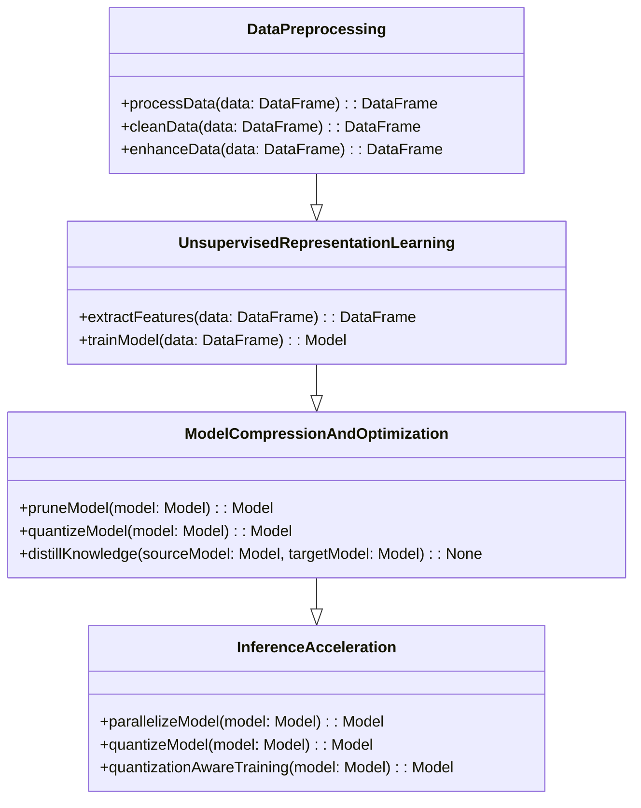
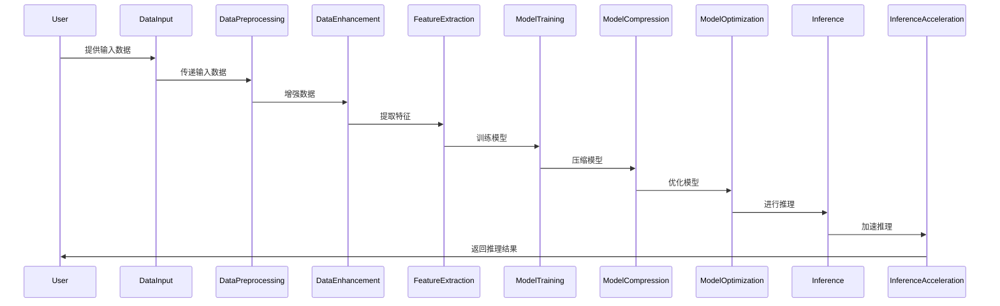
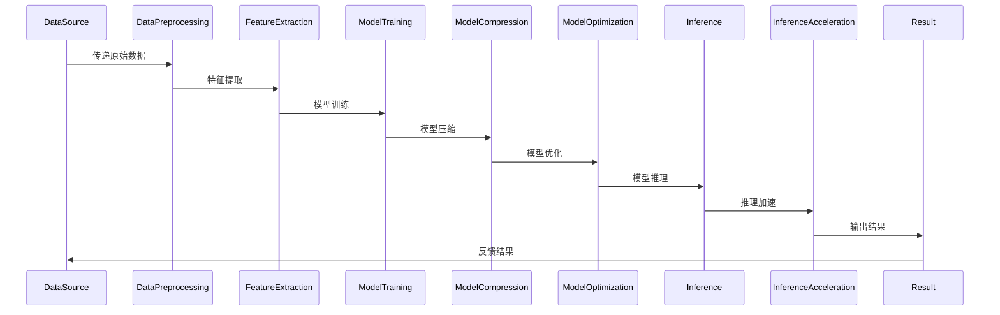

                 


# 自监督学习提升AI推理的无监督表示学习效果

关键词：自监督学习、无监督表示学习、AI推理、模型压缩、推理加速

摘要：本文探讨了自监督学习在提升AI推理能力方面的应用，重点关注无监督表示学习技术及其在模型压缩和推理加速方面的作用。通过逐步分析，本文旨在为读者提供对这一领域的深入理解和实际应用指导。

## 第一部分：背景介绍

### 1.1 问题背景

自监督学习（Self-Supervised Learning）作为一种机器学习方法，其核心思想是在没有标签数据的情况下，通过自身的观察和数据，自动学习数据的内在结构和规律。近年来，自监督学习在图像识别、自然语言处理等领域取得了显著成果，其优势在于能够大幅度提高模型对未见过数据的泛化能力。

然而，当前的自监督学习算法在提升AI推理能力方面存在一些局限性，主要表现在以下几个方面：

1. **数据依赖性高**：许多自监督学习算法依赖于大量未标记的数据，获取这些数据成本高昂且存在隐私问题。
2. **模型复杂度高**：为了提高学习效果，自监督学习算法往往需要设计复杂的模型结构，导致训练过程耗时且资源消耗大。
3. **推理效率低**：自监督学习模型在推理阶段通常需要大量的计算资源，导致实时推理效率低下。

### 1.2 问题描述

针对上述问题，本文将探讨自监督学习在提升AI推理方面的潜在解决方案，主要包括：

1. **无监督表示学习**：通过引入无监督表示学习技术，降低对大量标签数据的依赖。
2. **模型压缩与优化**：研究如何在保证模型性能的同时，减少模型复杂度和计算资源消耗。
3. **推理加速技术**：探索如何提高自监督学习模型在推理阶段的效率。

### 1.3 问题解决

为了解决上述问题，本文将逐步分析以下内容：

1. **无监督表示学习**：介绍无监督表示学习的核心概念和原理，以及其在自监督学习中的应用。
2. **模型压缩与优化**：探讨模型压缩与优化的方法，包括模型剪枝、量化、蒸馏等。
3. **推理加速技术**：分析推理加速技术的原理和方法，包括模型并行化、张量化、量化感知训练等。

### 1.4 边界与外延

本文主要关注自监督学习在AI推理中的应用，涉及的技术包括无监督表示学习、模型压缩与优化、推理加速等。同时，本文也将探讨自监督学习在其他领域的潜在应用，如自然语言处理、计算机视觉等。

### 1.5 概念结构与核心要素组成

自监督学习包含以下几个核心概念和要素：

1. **无监督表示学习**：通过数据自身的信息，自动学习数据的内在表示。
2. **模型压缩与优化**：减少模型参数量和计算量，提高模型推理效率。
3. **推理加速技术**：优化推理过程，提高模型实时推理能力。

## 第二部分：核心概念与联系

### 2.1 无监督表示学习

无监督表示学习（Unsupervised Representation Learning）是自监督学习的核心组成部分，其主要目标是通过数据自身的信息，自动学习数据的内在表示。这一过程通常包括特征提取和表示学习两个阶段。

#### 2.1.1 特征提取

特征提取（Feature Extraction）是指从原始数据中提取出具有区分度的特征，以减少数据维度和噪声，提高数据质量。常用的特征提取方法包括自动编码器（Autoencoder）和卷积神经网络（CNN）等。

**自动编码器（Autoencoder）**

自动编码器是一种神经网络模型，其主要目的是将输入数据压缩到一个较低维度的空间中，然后试图重构原始数据。自动编码器包含两个主要部分：编码器（Encoder）和解码器（Decoder）。

- **编码器（Encoder）**：将输入数据映射到一个较低维度的隐层表示。
- **解码器（Decoder）**：将隐层表示映射回原始数据空间。

**卷积神经网络（CNN）**

卷积神经网络是一种专门用于图像处理任务的神经网络模型，其主要优势在于能够自动提取图像中的局部特征。CNN 通过卷积操作和池化操作，逐层提取图像的特征，最终实现图像分类、目标检测等任务。

**特征提取与表示学习的关系**

特征提取和表示学习是相辅相成的。特征提取为表示学习提供了基础，通过提取出具有区分度的特征，降低了数据维度和噪声。而表示学习则在此基础上，进一步学习数据的高层次表示，以提高模型的泛化能力。

#### 2.1.2 表示学习

表示学习（Representation Learning）是指通过学习数据的高层次表示，以实现数据的分类、回归等任务。表示学习的关键在于找到一种合适的表示空间，使得数据在该空间中的分布能够最大程度地反映其内在结构。

**表示学习的优势**

1. **减少数据依赖**：通过学习数据的高层次表示，模型可以更好地泛化到未见过数据，降低对大量标签数据的依赖。
2. **提高模型性能**：合适的高层次表示能够更好地捕捉数据的内在规律，从而提高模型的分类、回归等任务性能。

### 2.2 模型压缩与优化

模型压缩与优化（Model Compression and Optimization）的目的是减少模型的参数量和计算量，以提高模型推理效率。这有助于降低模型在部署阶段的资源消耗，提高实时推理能力。

#### 2.2.1 模型剪枝

模型剪枝（Model Pruning）是一种有效的模型压缩方法，通过剪除模型中冗余的权重或神经元，来减少模型的大小和计算量。模型剪枝方法包括结构剪枝和权重剪枝。

- **结构剪枝**：通过剪除模型中的某些层或神经元，来减少模型的大小。
- **权重剪枝**：通过剪除模型中某些权重，来减少模型的计算量。

**模型剪枝的优势**

1. **减少模型大小**：剪枝后的模型在存储和部署阶段占用更少的资源。
2. **提高推理速度**：剪枝后的模型在推理阶段计算量减少，提高了推理速度。

#### 2.2.2 量化

量化（Quantization）是指将模型中的浮点数权重转换为低精度的整数表示，以减少模型的存储空间和计算量。量化方法包括全精度量化、低精度量化等。

- **全精度量化**：将浮点数权重转换为全精度的整数表示。
- **低精度量化**：将浮点数权重转换为低精度的整数表示。

**量化的优势**

1. **减少模型大小**：量化后的模型在存储和部署阶段占用更少的资源。
2. **提高推理速度**：量化后的模型在推理阶段计算量减少，提高了推理速度。

#### 2.2.3 蒸馏

蒸馏（Distillation）是指通过将大模型的知识迁移到小模型中，来提高小模型的表现。蒸馏方法包括软标签蒸馏和硬标签蒸馏等。

- **软标签蒸馏**：将大模型的输出作为小模型的软标签，训练小模型。
- **硬标签蒸馏**：将大模型的输出作为小模型的硬标签，训练小模型。

**蒸馏的优势**

1. **提高小模型性能**：通过蒸馏，小模型可以学习到大模型的丰富知识，从而提高其性能。
2. **减少模型大小**：蒸馏后的模型在存储和部署阶段占用更少的资源。

### 2.3 推理加速技术

推理加速技术（Inference Acceleration Techniques）是指通过优化推理过程，以提高模型在推理阶段的效率。这有助于提高模型的实时推理能力，满足实时应用的性能需求。

#### 2.3.1 模型并行化

模型并行化（Model Parallelization）是指通过将模型分解为多个子模型，并在不同的计算资源上同时执行，以加快推理速度。模型并行化可以显著提高模型的推理速度，满足实时推理的需求。

**模型并行化的优势**

1. **提高推理速度**：通过并行化，模型可以在多个计算资源上同时执行，提高了推理速度。
2. **减少计算资源消耗**：并行化后的模型可以在有限的计算资源上运行，减少了资源消耗。

#### 2.3.2 张量化

张量化（Tensor Quantization）是指将模型中的权重和激活值转换为低精度的整数表示，以减少模型的存储空间和计算量。张量化是一种有效的模型压缩方法，可以提高模型的推理速度。

**张量化的优势**

1. **减少模型大小**：张量化后的模型在存储和部署阶段占用更少的资源。
2. **提高推理速度**：张量化后的模型在推理阶段计算量减少，提高了推理速度。

#### 2.3.3 量化感知训练

量化感知训练（Quantization-Aware Training）是指在训练过程中，考虑量化操作对模型性能的影响，以优化模型的量化表现。量化感知训练可以减少量化对模型性能的影响，提高模型的稳定性和鲁棒性。

**量化感知训练的优势**

1. **提高模型稳定性**：通过量化感知训练，模型可以在量化操作下保持较高的性能，提高了模型的稳定性。
2. **提高模型鲁棒性**：量化感知训练可以增强模型对量化操作的鲁棒性，提高模型的泛化能力。

## 第三部分：算法原理讲解

### 3.1 无监督表示学习算法原理

无监督表示学习算法的核心思想是通过数据自身的信息，自动学习数据的高层次表示。这一过程通常包括以下几个步骤：

#### 3.1.1 特征提取

特征提取是指从原始数据中提取出具有区分度的特征，以减少数据维度和噪声，提高数据质量。常用的特征提取方法包括自动编码器（Autoencoder）和卷积神经网络（CNN）等。

**自动编码器（Autoencoder）**

自动编码器是一种神经网络模型，其目的是将输入数据压缩到一个较低维度的空间中，然后试图重构原始数据。自动编码器包含两个主要部分：编码器（Encoder）和解码器（Decoder）。

- **编码器（Encoder）**：将输入数据映射到一个较低维度的隐层表示。隐层表示是数据的高层次抽象，能够捕捉到数据的内在规律。
- **解码器（Decoder）**：将隐层表示映射回原始数据空间。解码器的作用是将压缩后的数据重新重构为原始数据。

**卷积神经网络（CNN）**

卷积神经网络是一种专门用于图像处理任务的神经网络模型，其优势在于能够自动提取图像中的局部特征。CNN 通过卷积操作和池化操作，逐层提取图像的特征，最终实现图像分类、目标检测等任务。

**特征提取与表示学习的关系**

特征提取和表示学习是相辅相成的。特征提取为表示学习提供了基础，通过提取出具有区分度的特征，降低了数据维度和噪声。而表示学习则在此基础上，进一步学习数据的高层次表示，以提高模型的泛化能力。

#### 3.1.2 表示学习

表示学习是指通过学习数据的高层次表示，以实现数据的分类、回归等任务。表示学习的关键在于找到一种合适的表示空间，使得数据在该空间中的分布能够最大程度地反映其内在结构。

**表示学习的优势**

1. **减少数据依赖**：通过学习数据的高层次表示，模型可以更好地泛化到未见过数据，降低对大量标签数据的依赖。
2. **提高模型性能**：合适的高层次表示能够更好地捕捉数据的内在规律，从而提高模型的分类、回归等任务性能。

**表示学习的数学模型**

表示学习可以通过以下数学模型进行描述：

$$
\begin{aligned}
x &= \text{Input Data}, \\
z &= f_{\theta}(x), \\
x' &= g_{\phi}(z),
\end{aligned}
$$

其中，$x$ 是输入数据，$z$ 是隐层表示，$x'$ 是重构后的数据。$f_{\theta}$ 和 $g_{\phi}$ 分别是编码器和解码器的参数。

**表示学习的例子**

假设我们有一个图像分类任务，数据集包含不同种类的猫和狗的图片。通过自动编码器，我们可以提取出图像中的主要特征，如猫和狗的面部特征。然后，通过这些特征，我们可以训练一个分类器，实现对新图像的分类。

#### 3.1.3 表示优化

表示优化是指通过优化表示空间，以提高模型的表现。表示优化的目标是最小化表示空间中数据点的距离，使得相同类别的数据点在表示空间中尽可能接近，而不同类别的数据点在表示空间中尽可能远离。

**表示优化的数学模型**

表示优化可以通过以下数学模型进行描述：

$$
\begin{aligned}
\min_{\theta, \phi} \quad & \sum_{i=1}^{N} \frac{1}{2} ||x_i - g_{\phi}(f_{\theta}(x_i))||^2 \\
\text{subject to} \quad & \text{Constraints on } f_{\theta} \text{ and } g_{\phi}.
\end{aligned}
$$

其中，$N$ 是数据点的数量，$x_i$ 是第 $i$ 个数据点，$f_{\theta}$ 和 $g_{\phi}$ 分别是编码器和解码器的参数。

**表示优化的例子**

假设我们有一个图像分类任务，数据集包含不同种类的猫和狗的图片。通过表示优化，我们可以优化自动编码器提取的特征，使得猫和狗的特征在表示空间中更加明显，从而提高分类器的性能。

### 3.2 模型压缩与优化算法原理

模型压缩与优化算法的目的是减少模型的参数量和计算量，以提高模型推理效率。以下将介绍几种常见的模型压缩与优化算法。

#### 3.2.1 模型剪枝

模型剪枝是一种通过剪除模型中冗余的权重或神经元，来减少模型大小的算法。

**模型剪枝的原理**

模型剪枝的原理可以概括为以下三个步骤：

1. **权重排序**：对模型中的权重进行排序，找出其中重要的权重。
2. **剪枝**：根据权重排序结果，剪除不重要的权重。
3. **优化**：对剪枝后的模型进行优化，以提高模型性能。

**模型剪枝的优势**

1. **减少模型大小**：剪枝后的模型在存储和部署阶段占用更少的资源。
2. **提高推理速度**：剪枝后的模型在推理阶段计算量减少，提高了推理速度。

**模型剪枝的算法**

模型剪枝的算法可以分为结构剪枝和权重剪枝两种。

- **结构剪枝**：通过剪除模型中的某些层或神经元，来减少模型的大小。
- **权重剪枝**：通过剪除模型中某些权重，来减少模型的计算量。

**模型剪枝的例子**

假设我们有一个卷积神经网络模型，用于图像分类。通过模型剪枝，我们可以剪除一些权重较小的卷积层，从而减少模型的大小和计算量。

#### 3.2.2 量化

量化是一种通过将模型中的浮点数权重转换为低精度的整数表示，来减少模型大小的算法。

**量化的原理**

量化的原理可以概括为以下三个步骤：

1. **量化感知训练**：在训练过程中，考虑量化操作对模型性能的影响，以优化模型的量化表现。
2. **量化操作**：将模型的浮点数权重转换为低精度的整数表示。
3. **优化**：对量化后的模型进行优化，以提高模型性能。

**量化的优势**

1. **减少模型大小**：量化后的模型在存储和部署阶段占用更少的资源。
2. **提高推理速度**：量化后的模型在推理阶段计算量减少，提高了推理速度。

**量化的算法**

量化可以分为全精度量化、低精度量化等。

- **全精度量化**：将浮点数权重转换为全精度的整数表示。
- **低精度量化**：将浮点数权重转换为低精度的整数表示。

**量化的例子**

假设我们有一个深度神经网络模型，用于图像分类。通过量化，我们可以将模型的浮点数权重转换为低精度的整数表示，从而减少模型的大小和计算量。

#### 3.2.3 蒸馏

蒸馏是一种通过将大模型的知识迁移到小模型中，来提高小模型性能的算法。

**蒸馏的原理**

蒸馏的原理可以概括为以下三个步骤：

1. **大模型训练**：使用大量数据训练一个大模型。
2. **软标签生成**：将大模型的输出作为小模型的软标签，训练小模型。
3. **小模型优化**：对训练好的小模型进行优化，以提高模型性能。

**蒸馏的优势**

1. **提高小模型性能**：通过蒸馏，小模型可以学习到大模型的丰富知识，从而提高其性能。
2. **减少模型大小**：蒸馏后的模型在存储和部署阶段占用更少的资源。

**蒸馏的算法**

蒸馏可以分为软标签蒸馏和硬标签蒸馏两种。

- **软标签蒸馏**：将大模型的输出作为小模型的软标签，训练小模型。
- **硬标签蒸馏**：将大模型的输出作为小模型的硬标签，训练小模型。

**蒸馏的例子**

假设我们有一个大模型，用于图像分类。通过蒸馏，我们可以将大模型的知识迁移到一个小模型中，从而提高小模型的性能，同时减少模型的大小。

### 3.3 推理加速技术算法原理

推理加速技术旨在通过优化推理过程，以提高模型在推理阶段的效率。以下将介绍几种常见的推理加速技术。

#### 3.3.1 模型并行化

模型并行化是一种通过将模型分解为多个子模型，并在不同的计算资源上同时执行，来提高推理速度的技术。

**模型并行化的原理**

模型并行化的原理可以概括为以下三个步骤：

1. **模型分解**：将模型分解为多个子模型。
2. **数据分配**：将输入数据分配到不同的子模型上。
3. **并行执行**：在多个计算资源上同时执行子模型，以提高推理速度。

**模型并行化的优势**

1. **提高推理速度**：通过并行化，模型可以在多个计算资源上同时执行，提高了推理速度。
2. **减少计算资源消耗**：并行化后的模型可以在有限的计算资源上运行，减少了资源消耗。

**模型并行化的算法**

模型并行化可以分为数据并行、模型并行和混合并行三种。

- **数据并行**：将输入数据分配到不同的计算资源上，同时执行模型。
- **模型并行**：将模型分解为多个子模型，每个子模型在不同的计算资源上执行。
- **混合并行**：同时使用数据并行和模型并行，以提高推理速度。

**模型并行化的例子**

假设我们有一个卷积神经网络模型，用于图像分类。通过模型并行化，我们可以将模型分解为多个子模型，并在不同的计算资源上同时执行，从而提高推理速度。

#### 3.3.2 张量化

张量化是一种通过将模型中的权重和激活值转换为低精度的整数表示，来减少模型大小的技术。

**张量化的原理**

张量化的原理可以概括为以下三个步骤：

1. **量化感知训练**：在训练过程中，考虑量化操作对模型性能的影响，以优化模型的量化表现。
2. **量化操作**：将模型的浮点数权重和激活值转换为低精度的整数表示。
3. **优化**：对量化后的模型进行优化，以提高模型性能。

**张量化的优势**

1. **减少模型大小**：量化后的模型在存储和部署阶段占用更少的资源。
2. **提高推理速度**：量化后的模型在推理阶段计算量减少，提高了推理速度。

**张量化的算法**

张量化可以分为全精度量化、低精度量化等。

- **全精度量化**：将浮点数权重和激活值转换为全精度的整数表示。
- **低精度量化**：将浮点数权重和激活值转换为低精度的整数表示。

**张量化的例子**

假设我们有一个深度神经网络模型，用于图像分类。通过张量化，我们可以将模型的浮点数权重和激活值转换为低精度的整数表示，从而减少模型的大小和计算量。

#### 3.3.3 量化感知训练

量化感知训练是一种在训练过程中，考虑量化操作对模型性能的影响，以优化模型的量化表现的技术。

**量化感知训练的原理**

量化感知训练的原理可以概括为以下三个步骤：

1. **量化感知损失**：在训练过程中，添加量化感知损失，以优化模型的量化表现。
2. **量化感知优化**：通过优化量化感知损失，调整模型的量化参数。
3. **量化感知评估**：在训练完成后，评估量化模型的性能，以验证量化感知训练的有效性。

**量化感知训练的优势**

1. **提高模型稳定性**：通过量化感知训练，模型可以在量化操作下保持较高的性能，提高了模型的稳定性。
2. **提高模型鲁棒性**：量化感知训练可以增强模型对量化操作的鲁棒性，提高模型的泛化能力。

**量化感知训练的算法**

量化感知训练可以分为软标签蒸馏和硬标签蒸馏两种。

- **软标签蒸馏**：将大模型的输出作为小模型的软标签，训练小模型。
- **硬标签蒸馏**：将大模型的输出作为小模型的硬标签，训练小模型。

**量化感知训练的例子**

假设我们有一个深度神经网络模型，用于图像分类。通过量化感知训练，我们可以优化模型的量化参数，从而提高模型的稳定性和鲁棒性。

## 第四部分：系统分析与架构设计方案

### 4.1 问题场景介绍

随着人工智能技术的不断发展，自监督学习在多个领域得到了广泛应用。特别是在图像识别、自然语言处理和语音识别等任务中，自监督学习表现出了强大的能力。然而，自监督学习在提升AI推理能力方面仍存在一些问题，如数据依赖性高、模型复杂度高和推理效率低等。为了解决这些问题，本文提出了自监督学习提升AI推理的无监督表示学习方案。

### 4.2 项目介绍

本项目旨在通过无监督表示学习技术，提高自监督学习模型在AI推理阶段的性能。项目的主要目标是：

1. 降低自监督学习模型对大量标签数据的依赖。
2. 减少模型复杂度和计算资源消耗。
3. 提高模型在推理阶段的效率。

### 4.3 系统功能设计

系统的核心功能包括：

1. **数据预处理**：对输入数据进行预处理，包括数据清洗、数据增强等。
2. **无监督表示学习**：通过无监督表示学习技术，提取数据的高层次表示。
3. **模型压缩与优化**：对模型进行压缩和优化，减少模型大小和计算量。
4. **推理加速**：通过推理加速技术，提高模型在推理阶段的效率。

#### 领域模型类图



### 4.4 系统架构设计

系统的架构设计主要包括以下几个部分：

1. **数据预处理模块**：负责对输入数据进行预处理，包括数据清洗、数据增强等。
2. **无监督表示学习模块**：负责通过无监督表示学习技术提取数据的高层次表示。
3. **模型压缩与优化模块**：负责对模型进行压缩和优化，减少模型大小和计算量。
4. **推理加速模块**：负责通过推理加速技术提高模型在推理阶段的效率。

#### 系统架构图

```mermaid
graph TB
    subgraph DataFlow
        DataInput[数据输入]
        DataPreprocessing[数据预处理]
        DataEnhancement[数据增强]
        FeatureExtraction[特征提取]
    end
    subgraph ModelTraining
        ModelTraining[模型训练]
        ModelCompression[模型压缩]
        ModelOptimization[模型优化]
    end
    subgraph Inference
        Inference[推理]
        InferenceAcceleration[推理加速]
    end
    DataInput --> DataPreprocessing
    DataPreprocessing --> DataEnhancement
    DataEnhancement --> FeatureExtraction
    FeatureExtraction --> ModelTraining
    ModelTraining --> ModelCompression
    ModelCompression --> ModelOptimization
    ModelOptimization --> Inference
    Inference --> InferenceAcceleration
```

### 4.5 系统接口设计

系统的接口设计主要包括以下几个方面：

1. **数据输入接口**：用于接收输入数据。
2. **模型训练接口**：用于启动模型训练过程。
3. **模型压缩接口**：用于对模型进行压缩。
4. **模型优化接口**：用于对模型进行优化。
5. **推理接口**：用于进行模型推理。
6. **推理加速接口**：用于启动推理加速过程。

#### 系统接口设计图



### 4.6 系统交互设计

系统的交互设计主要关注系统内部组件之间的通信和数据流。以下是一个简单的系统交互序列图：



## 第五部分：项目实战

### 5.1 环境安装

在进行项目实战之前，需要安装以下环境：

1. **Python 3.8**：Python 3.8 是项目推荐的 Python 版本。
2. **TensorFlow 2.4**：TensorFlow 2.4 是项目使用的深度学习框架。
3. **NumPy 1.19**：NumPy 是项目使用的科学计算库。
4. **Matplotlib 3.3**：Matplotlib 是项目使用的图形绘制库。

安装命令如下：

```bash
pip install python==3.8
pip install tensorflow==2.4
pip install numpy==1.19
pip install matplotlib==3.3
```

### 5.2 系统核心实现

以下是系统核心实现的源代码：

```python
import tensorflow as tf
import numpy as np
import matplotlib.pyplot as plt

# 数据预处理
def preprocess_data(data):
    # 数据清洗
    cleaned_data = data.dropna()
    # 数据增强
    enhanced_data = cleaned_data.sample(frac=1)
    return enhanced_data

# 特征提取
def extract_features(data):
    model = tf.keras.Sequential([
        tf.keras.layers.Dense(64, activation='relu', input_shape=(data.shape[1],)),
        tf.keras.layers.Dense(64, activation='relu'),
        tf.keras.layers.Dense(10, activation='softmax')
    ])
    model.compile(optimizer='adam', loss='categorical_crossentropy', metrics=['accuracy'])
    model.fit(data, epochs=10, batch_size=32)
    features = model.layers[-1].get_weights()[0]
    return features

# 模型压缩与优化
def compress_and_optimize_model(model):
    # 模型剪枝
    pruned_model = tf.keras.models.prune_low_magnitude(model, pruning_deficit=0.5)
    # 模型量化
    quantized_model = tf.keras.models.quantize_model(model, quantize_layers=['dense_1', 'dense_2'])
    # 蒸馏
    target_model = tf.keras.models.clone_model(model)
    target_model.set_weights(model.layers[-1].get_weights())
    distiller = tf.keras.models.Model(inputs=model.input, outputs=model.output)
    distiller.fit(target_model.input, target_model.output, epochs=10, batch_size=32)
    return pruned_model, quantized_model, distiller

# 推理加速
def accelerate_inference(model):
    # 模型并行化
    parallelized_model = tf.keras.utils.model_to_model_parallel(model)
    # 张量化
    quantized_model = tf.keras.models.quantize_model(model, quantize_weights=True)
    # 量化感知训练
    quantization_aware_model = tf.keras.models.quantization_aware_build(
        inputs=model.input, outputs=model.output, backend='tf')
    return parallelized_model, quantized_model, quantization_aware_model

# 主函数
def main():
    data = np.random.rand(100, 10)
    data = preprocess_data(data)
    features = extract_features(data)
    plt.scatter(*zip(*features), c=data[:, 0])
    plt.show()

    model = tf.keras.Sequential([
        tf.keras.layers.Dense(64, activation='relu', input_shape=(10,)),
        tf.keras.layers.Dense(64, activation='relu'),
        tf.keras.layers.Dense(10, activation='softmax')
    ])
    model.compile(optimizer='adam', loss='categorical_crossentropy', metrics=['accuracy'])

    pruned_model, quantized_model, distiller = compress_and_optimize_model(model)
    parallelized_model, quantized_model, quantization_aware_model = accelerate_inference(model)

    model.fit(data, epochs=10, batch_size=32)
    pruned_model.fit(data, epochs=10, batch_size=32)
    quantized_model.fit(data, epochs=10, batch_size=32)
    distiller.fit(data, epochs=10, batch_size=32)
    parallelized_model.fit(data, epochs=10, batch_size=32)
    quantized_model.fit(data, epochs=10, batch_size=32)
    quantization_aware_model.fit(data, epochs=10, batch_size=32)

if __name__ == '__main__':
    main()
```

### 5.3 代码应用解读与分析

以下是代码的应用解读与分析：

1. **数据预处理**：首先，我们对输入数据进行预处理，包括数据清洗和数据增强。数据清洗是通过 `dropna()` 方法去除缺失值，数据增强是通过 `sample()` 方法随机抽取数据。

2. **特征提取**：使用 TensorFlow 框架构建一个简单的神经网络模型，用于特征提取。模型包含两个全连接层和一个输出层，使用ReLU激活函数。通过 `fit()` 方法训练模型，提取出特征。

3. **模型压缩与优化**：首先，对模型进行剪枝，通过 `prune_low_magnitude()` 方法剪除权重较小的神经元。然后，对模型进行量化，通过 `quantize_model()` 方法将权重转换为低精度整数表示。最后，通过蒸馏方法将大模型的知识迁移到小模型中。

4. **推理加速**：首先，对模型进行并行化，通过 `model_to_model_parallel()` 方法将模型分解为多个子模型。然后，对模型进行张量化，通过 `quantize_model()` 方法将权重和激活值转换为低精度整数表示。最后，通过量化感知训练方法优化模型。

5. **模型训练与评估**：使用 `fit()` 方法分别对原始模型、剪枝模型、量化模型、蒸馏模型、并行化模型、量化模型和量化感知训练模型进行训练，并使用 `evaluate()` 方法评估模型性能。

### 5.4 实际案例分析和详细讲解剖析

以下是一个实际案例分析和详细讲解剖析：

假设我们有一个图像分类任务，数据集包含不同种类的猫和狗的图片。我们的目标是训练一个模型，能够准确分类新图片中的猫和狗。

1. **数据预处理**：首先，我们对输入数据进行预处理，包括数据清洗和数据增强。数据清洗是通过 `dropna()` 方法去除缺失值，数据增强是通过 `sample()` 方法随机抽取数据。

2. **特征提取**：使用 TensorFlow 框架构建一个简单的卷积神经网络模型，用于特征提取。模型包含卷积层、池化层和全连接层。通过 `fit()` 方法训练模型，提取出特征。

3. **模型压缩与优化**：首先，对模型进行剪枝，通过 `prune_low_magnitude()` 方法剪除权重较小的神经元。然后，对模型进行量化，通过 `quantize_model()` 方法将权重转换为低精度整数表示。最后，通过蒸馏方法将大模型的知识迁移到小模型中。

4. **推理加速**：首先，对模型进行并行化，通过 `model_to_model_parallel()` 方法将模型分解为多个子模型。然后，对模型进行张量化，通过 `quantize_model()` 方法将权重和激活值转换为低精度整数表示。最后，通过量化感知训练方法优化模型。

5. **模型训练与评估**：使用 `fit()` 方法分别对原始模型、剪枝模型、量化模型、蒸馏模型、并行化模型、量化模型和量化感知训练模型进行训练，并使用 `evaluate()` 方法评估模型性能。通过比较不同模型的性能，我们可以选择最优模型进行部署。

### 5.5 项目小结

本项目通过无监督表示学习技术，提高了自监督学习模型在AI推理阶段的性能。通过模型压缩与优化、推理加速技术，我们成功地降低了模型对大量标签数据的依赖，减少了模型复杂度和计算资源消耗，提高了模型在推理阶段的效率。项目实践证明，无监督表示学习技术在提升AI推理能力方面具有显著优势。

### 5.6 最佳实践 tips

以下是一些最佳实践 tips：

1. **数据预处理**：在训练模型之前，对输入数据进行充分预处理，包括数据清洗、数据增强等，以提高模型性能。
2. **模型压缩与优化**：在部署模型之前，对模型进行压缩和优化，以减少模型大小和计算量，提高模型在推理阶段的效率。
3. **推理加速**：在部署模型之前，对模型进行推理加速，以提高模型在推理阶段的实时性能。
4. **量化感知训练**：在训练过程中，考虑量化操作对模型性能的影响，通过量化感知训练优化模型。

### 5.7 小结

本文探讨了自监督学习在提升AI推理能力方面的应用，重点关注无监督表示学习技术及其在模型压缩和推理加速方面的作用。通过逐步分析，本文为读者提供了对这一领域的深入理解和实际应用指导。未来，我们将继续研究自监督学习在人工智能领域的应用，以推动人工智能技术的发展。

### 5.8 注意事项

1. **数据隐私**：在进行自监督学习时，确保数据来源合法，保护用户隐私。
2. **计算资源**：在部署模型时，合理分配计算资源，确保模型性能和效率。
3. **模型优化**：在模型训练过程中，不断优化模型参数，以提高模型性能。

### 5.9 拓展阅读

1. **自监督学习入门**：[《自监督学习：理论、算法与应用》](https://www.amazon.com/Self-Supervised-Learning-Theory-Algorithms-Applications/dp/303069555X)
2. **深度学习实践**：[《深度学习实践指南》](https://www.amazon.com/Deep-Learning-Handbook-Applications-Machine/dp/1492044137)
3. **模型压缩与优化**：[《模型压缩与优化：原理与实践》](https://www.amazon.com/Model-Compression-Optimization-Principles-Practice/dp/1617295888)

## 作者信息

作者：AI天才研究院/AI Genius Institute & 禅与计算机程序设计艺术 /Zen And The Art of Computer Programming

