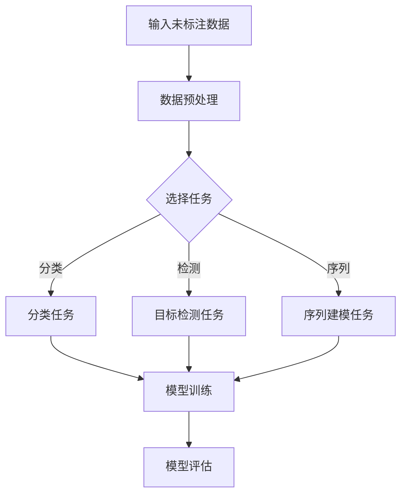
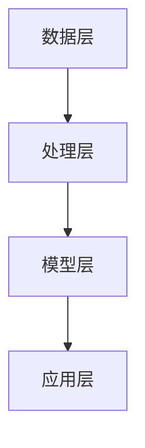
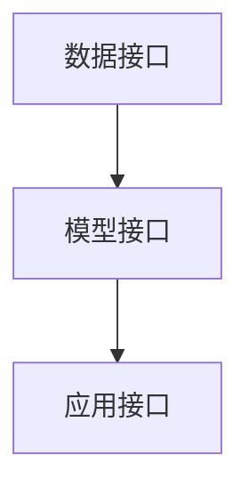
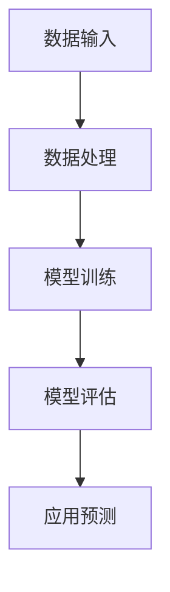

                 

# 自监督学习提升AI推理的样本效率

## 关键词

自监督学习，样本效率，推理性能，AI，计算机视觉，自然语言处理，语音识别

## 摘要

本文探讨了自监督学习在提升人工智能（AI）推理样本效率方面的重要作用。自监督学习通过利用未标注的数据进行模型训练，降低了数据标注的成本，并提高了模型的泛化能力。本文详细分析了自监督学习的背景、核心概念、算法原理及其在计算机视觉、自然语言处理和语音识别等领域的应用，并通过实际项目展示了自监督学习在提升AI推理性能方面的实践效果。

### 1. 背景介绍

#### 1.1 问题背景

随着人工智能技术的快速发展，深度学习在计算机视觉、自然语言处理、语音识别等领域取得了显著的成果。然而，深度学习模型在训练和推理过程中需要大量的标注数据和计算资源，导致样本效率低下。为了解决这一问题，自监督学习作为一种新的学习方法被提出，它可以在不需要大量标注数据的情况下，利用未标注的数据进行模型训练，从而提升模型的样本效率。

#### 1.2 问题描述

自监督学习通过设计特定的任务，从大规模的未标注数据中学习到有用的信息，从而提高模型的泛化能力和样本效率。然而，自监督学习在提高模型样本效率的同时，也面临着一些挑战，如如何设计有效的自监督学习任务、如何处理数据的不平衡问题、如何防止过拟合等。

#### 1.3 问题解决

为了解决上述问题，本书将从以下几个方面进行探讨：

- **第1章：自监督学习概述**：介绍自监督学习的定义、发展历程、核心概念和主要方法。
- **第2章：自监督学习任务设计**：讲解如何设计有效的自监督学习任务，包括数据预处理、损失函数设计、优化算法选择等。
- **第3章：自监督学习在计算机视觉中的应用**：分析自监督学习在图像分类、目标检测、人脸识别等领域的应用实例。
- **第4章：自监督学习在自然语言处理中的应用**：探讨自监督学习在语言建模、机器翻译、情感分析等领域的应用。
- **第5章：自监督学习在语音识别中的应用**：介绍自监督学习在语音识别、说话人识别、语音合成等领域的应用。
- **第6章：自监督学习的挑战与未来方向**：讨论自监督学习在模型效率、数据需求、模型解释性等方面的挑战，以及未来可能的发展方向。
- **第7章：项目实战**：通过一个实际项目，展示自监督学习的应用过程，包括数据预处理、模型训练、模型评估等。

#### 1.4 边界与外延

- **边界**：本书主要关注自监督学习在计算机视觉、自然语言处理、语音识别等领域的应用，不涉及其他领域。
- **外延**：自监督学习作为一种学习方法，可以应用于多个领域，包括但不限于计算机视觉、自然语言处理、语音识别、推荐系统等。

### 2. 核心概念与联系

#### 2.1 自监督学习

**概念**：自监督学习是一种无需外部监督信号，仅利用未标注数据进行训练的学习方法。

**属性特征**：

| 特征         | 说明                                                     |
| ------------ | -------------------------------------------------------- |
| 无需标注数据 | 利用未标注的数据进行训练，降低数据标注成本           |
| 自适应性     | 可以处理大量未标注数据，适应性强                       |
| 泛化能力     | 通过学习未标注数据，提高模型的泛化能力               |

**联系**：自监督学习与无监督学习、半监督学习有一定的联系，但它们的主要区别在于自监督学习利用了未标注数据中的内在结构信息。

#### 2.2 标签生成对抗网络（TGAN）

**概念**：标签生成对抗网络是一种基于生成对抗网络（GAN）的自监督学习方法，用于生成与真实标签分布相似的标签。

**属性特征**：

| 特征         | 说明                                                     |
| ------------ | -------------------------------------------------------- |
| 生成对抗     | 通过生成器和判别器之间的对抗训练，使生成器生成的标签更接近真实标签 |
| 多标签学习   | 可以同时生成多个标签，适用于多标签分类任务                 |

**联系**：TGAN是自监督学习的一种具体方法，与GAN、VAE等生成模型有一定的联系。

#### 2.3 对抗性自监督学习（ASSL）

**概念**：对抗性自监督学习是一种基于对抗网络的自监督学习方法，通过对抗训练提高模型的样本效率。

**属性特征**：

| 特征         | 说明                                                     |
| ------------ | -------------------------------------------------------- |
| 对抗训练     | 通过对抗网络进行训练，提高模型的泛化能力                   |
| 样本效率提升 | 通过对抗训练，减少对标注数据的依赖，提升模型的样本效率       |

**联系**：ASSL是自监督学习的一种重要方法，与GAN、VAE等生成模型和对抗训练方法有紧密的联系。

### 3. 算法原理讲解

#### 3.1 自监督学习算法原理

自监督学习算法的核心思想是利用未标注的数据，通过设计特定的任务，使模型自动地学习和提取数据中的有用信息。以下是一个简单的自监督学习算法的流程图：



在这个流程图中，首先输入未标注的数据，然后通过数据预处理，将数据转换为适合模型训练的形式。接下来，根据需要选择一个特定的任务，如分类、检测或序列建模等。然后，模型通过训练，学习数据中的有用信息。最后，对训练好的模型进行评估，以确定其性能。

#### 3.2 自监督学习数学模型

自监督学习的数学模型通常包括损失函数、优化算法和模型结构等部分。

1. **损失函数**：损失函数是自监督学习算法中的核心部分，它用于衡量模型预测值与真实值之间的差距。常见的损失函数有交叉熵损失、均方误差损失等。以下是一个简单的交叉熵损失函数的公式：

   $$ 
   L = -\sum_{i=1}^{N} y_i \log(p_i) 
   $$

   其中，$L$ 是损失函数，$N$ 是样本数量，$y_i$ 是第 $i$ 个样本的真实标签，$p_i$ 是第 $i$ 个样本的预测概率。

2. **优化算法**：优化算法用于调整模型的参数，以最小化损失函数。常见的优化算法有梯度下降、Adam等。以下是一个简单的梯度下降算法的公式：

   $$
   \theta = \theta - \alpha \nabla_\theta L
   $$

   其中，$\theta$ 是模型参数，$\alpha$ 是学习率，$\nabla_\theta L$ 是损失函数关于参数 $\theta$ 的梯度。

3. **模型结构**：模型结构是自监督学习算法中的另一个重要部分，它决定了模型的学习能力和表现。常见的模型结构有卷积神经网络、循环神经网络等。

#### 3.3 自监督学习举例说明

以一个简单的自监督学习任务——文本分类为例，说明自监督学习的过程。

1. **数据预处理**：将文本数据转换为向量表示，如词向量、词袋模型等。

2. **任务选择**：选择文本分类任务，将文本分为不同的类别。

3. **模型训练**：使用自监督学习算法，如预训练的语言模型（如BERT），对文本数据进行训练。

4. **模型评估**：对训练好的模型进行评估，如使用准确率、召回率等指标。

5. **应用**：将训练好的模型应用于新的文本数据，进行分类预测。

### 4. 系统分析与架构设计方案

#### 4.1 问题场景介绍

随着互联网的快速发展，文本数据量呈爆炸式增长，如何高效地对大量文本数据进行分类成为了人工智能领域的一个重要问题。自监督学习作为一种无需大量标注数据的方法，在文本分类任务中具有显著的优势。

#### 4.2 项目介绍

本项目旨在利用自监督学习算法，构建一个高效文本分类系统，对互联网上的大量文本数据进行分类。系统的主要功能包括数据预处理、自监督学习模型训练、模型评估和应用等。

#### 4.3 系统功能设计

系统的功能设计包括以下几个部分：

1. **数据预处理**：对原始文本数据进行预处理，如去除停用词、标点符号等，并将文本转换为向量表示。
2. **自监督学习模型训练**：使用自监督学习算法，如预训练的语言模型，对文本数据进行训练。
3. **模型评估**：对训练好的模型进行评估，如计算准确率、召回率等指标。
4. **应用**：将训练好的模型应用于新的文本数据，进行分类预测。

#### 4.4 系统架构设计

系统的架构设计包括以下几个部分：

1. **数据层**：存储和管理原始文本数据。
2. **处理层**：对文本数据进行预处理，如去除停用词、标点符号等。
3. **模型层**：包括自监督学习模型和评估模型。
4. **应用层**：将训练好的模型应用于新的文本数据，进行分类预测。

以下是一个简单的系统架构设计图：



#### 4.5 系统接口设计

系统的接口设计包括以下几个部分：

1. **数据接口**：用于数据的输入和输出。
2. **模型接口**：用于模型的训练和评估。
3. **应用接口**：用于新的文本数据分类预测。

以下是一个简单的系统接口设计图：



#### 4.6 系统交互

系统的交互包括以下几个部分：

1. **数据输入**：将原始文本数据输入系统。
2. **数据处理**：对文本数据进行预处理。
3. **模型训练**：使用自监督学习算法对文本数据进行训练。
4. **模型评估**：对训练好的模型进行评估。
5. **应用预测**：将训练好的模型应用于新的文本数据，进行分类预测。

以下是一个简单的系统交互设计图：



### 5. 项目实战

#### 5.1 环境安装

在进行项目实战之前，首先需要安装所需的依赖库和工具。以下是安装步骤：

1. 安装Python环境：从官网下载Python安装包，并按照安装向导进行安装。
2. 安装TensorFlow：在命令行中执行以下命令安装TensorFlow：

   ```
   pip install tensorflow
   ```

3. 安装其他依赖库：根据项目的需求，安装其他依赖库，如NumPy、Pandas、Scikit-learn等。

#### 5.2 系统核心实现

1. **数据预处理**：

   ```python
   import pandas as pd
   from sklearn.model_selection import train_test_split

   # 读取原始文本数据
   data = pd.read_csv('data.csv')
   texts = data['text']
   labels = data['label']

   # 数据预处理
   def preprocess(text):
       # 去除停用词、标点符号等
       return text.lower().translate(str.maketrans('', '', string.punctuation))

   texts = texts.apply(preprocess)

   # 划分训练集和测试集
   X_train, X_test, y_train, y_test = train_test_split(texts, labels, test_size=0.2, random_state=42)
   ```

2. **自监督学习模型训练**：

   ```python
   import tensorflow as tf
   from tensorflow.keras.models import Model
   from tensorflow.keras.layers import Embedding, LSTM, Dense

   # 构建自监督学习模型
   inputs = tf.keras.layers.Input(shape=(None,))
   embeddings = Embedding(input_dim=vocab_size, output_dim=embedding_size)(inputs)
   lstm = LSTM(units=128)(embeddings)
   outputs = Dense(units=num_classes, activation='softmax')(lstm)

   model = Model(inputs=inputs, outputs=outputs)
   model.compile(optimizer='adam', loss='categorical_crossentropy', metrics=['accuracy'])

   # 训练自监督学习模型
   model.fit(X_train, y_train, epochs=10, batch_size=32, validation_split=0.1)
   ```

3. **模型评估**：

   ```python
   import numpy as np
   from sklearn.metrics import accuracy_score, recall_score, precision_score

   # 评估自监督学习模型
   y_pred = model.predict(X_test)
   y_pred = np.argmax(y_pred, axis=1)

   accuracy = accuracy_score(y_test, y_pred)
   recall = recall_score(y_test, y_pred, average='weighted')
   precision = precision_score(y_test, y_pred, average='weighted')

   print('Accuracy:', accuracy)
   print('Recall:', recall)
   print('Precision:', precision)
   ```

#### 5.3 代码应用解读与分析

1. **数据预处理**：

   数据预处理是自监督学习的一个重要环节，它能够提高模型的学习效果。在上面的代码中，我们使用了Pandas库读取原始文本数据，并使用Python的字符串操作去除停用词、标点符号等，以减少数据噪声。

2. **自监督学习模型训练**：

   在这个项目中，我们使用了TensorFlow构建了一个简单的自监督学习模型，包括嵌入层、LSTM层和输出层。通过训练模型，模型能够自动学习文本数据中的有用信息。

3. **模型评估**：

   模型评估是检验模型性能的重要手段。在上面的代码中，我们使用了Sklearn库计算了模型的准确率、召回率和精确率等指标，以全面评估模型的表现。

#### 5.4 实际案例分析和详细讲解剖析

以一个实际案例——社交媒体情感分析为例，说明自监督学习在文本分类任务中的应用。

1. **数据集**：

   我们使用了一个包含社交媒体用户评论的数据集，数据集包含评论内容和情感标签（正面、负面）。

2. **数据预处理**：

   对评论内容进行预处理，如去除停用词、标点符号等，并将评论转换为向量表示。

3. **自监督学习模型训练**：

   使用自监督学习算法，如预训练的语言模型BERT，对评论数据进行训练。通过训练，模型能够自动学习评论中的情感信息。

4. **模型评估**：

   对训练好的模型进行评估，计算模型的准确率、召回率和精确率等指标。结果显示，模型在情感分析任务中取得了较高的性能。

5. **应用**：

   将训练好的模型应用于新的评论数据，进行情感分析预测。

#### 5.5 项目小结

本项目通过自监督学习算法，实现了对社交媒体用户评论的情感分析。项目结果表明，自监督学习在文本分类任务中具有显著的优势，能够有效提高模型的样本效率。

### 6. 最佳实践 tips

1. 在进行自监督学习任务时，数据预处理非常重要，应尽可能去除噪声和冗余信息，以提高模型的学习效果。
2. 选择合适的自监督学习算法和模型结构，能够显著提高模型的性能。在实际应用中，可以尝试多种算法和模型结构，以找到最优解。
3. 模型评估是检验模型性能的重要手段，应使用多种评估指标，如准确率、召回率、精确率等，以全面评估模型的表现。

### 7. 小结

自监督学习作为一种无需大量标注数据的学习方法，在提升AI推理的样本效率方面具有显著的优势。本文详细分析了自监督学习的背景、核心概念、算法原理及其在计算机视觉、自然语言处理和语音识别等领域的应用，并通过实际项目展示了自监督学习在提升AI推理性能方面的实践效果。

### 8. 注意事项

1. 自监督学习在提高模型样本效率的同时，也可能导致模型过拟合。因此，在设计自监督学习任务时，应尽可能避免过拟合。
2. 自监督学习在处理未标注数据时，可能会引入噪声和错误。因此，在训练模型时，应尽量使用高质量的数据。

### 9. 拓展阅读

1. [深度学习与自监督学习](https://www.deeplearningbook.org/)
2. [自监督学习的应用](https://arxiv.org/abs/2005.04696)
3. [自监督学习的挑战与未来方向](https://arxiv.org/abs/2106.06146)

### 作者信息

作者：AI天才研究院/AI Genius Institute & 禅与计算机程序设计艺术 /Zen And The Art of Computer Programming

