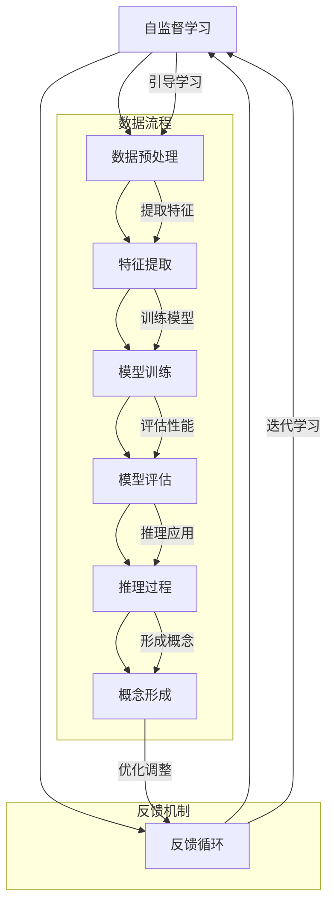

                 


## 引言

### 自监督学习的崛起

在过去的几十年中，人工智能（AI）技术取得了飞速的发展。从最初的规则系统，到如今深度学习、强化学习等前沿技术的应用，AI已经在各个领域取得了显著的成就。然而，随着AI应用的不断扩展，对AI算法的效率、准确性和通用性提出了更高的要求。自监督学习（Self-Supervised Learning）作为一种新兴的学习方式，逐渐成为人工智能领域的研究热点。

自监督学习的关键优势在于它不需要人工标注的数据，而是通过利用数据内部固有的结构信息来进行训练。这种方法不仅减轻了数据标注的工作量，而且能够处理大规模、复杂的实时数据，从而在提升AI系统推理能力和应用范围方面具有巨大的潜力。

### 自监督学习与AI推理的概念形成能力

AI推理是指AI系统在处理新的数据和问题时，能够根据已有的知识和经验做出合理的判断和决策。而概念形成能力则是AI在理解和创建新概念方面的重要表现。传统的监督学习和无监督学习在AI推理方面存在一定的局限性。监督学习依赖于大量的标注数据进行训练，而标注数据的获取成本高且难以满足大量数据的需求。无监督学习虽然能够从未标注的数据中提取信息，但往往缺乏对实际问题的理解和解决能力。

自监督学习则通过在无监督学习中引入监督信号，使得AI系统能够自主地从大量数据中学习到有用的知识，并在推理过程中形成新概念。这种能力不仅提高了AI的推理效率，还增强了其在新领域中的应用潜力。

### 文章目的与结构

本文旨在探讨自监督学习如何提升AI推理的概念形成能力。文章结构如下：

1. **背景介绍**：简要介绍自监督学习的发展背景和重要性。
2. **核心概念与联系**：阐述自监督学习与AI推理的关系，以及其关键技术和原理。
3. **算法原理讲解**：详细讲解几种常见的自监督学习算法，包括自动编码器、对抗生成网络和图像生成对抗网络。
4. **数学模型与公式**：介绍自监督学习的数学模型和损失函数，并进行详细解释。
5. **系统分析与架构设计方案**：分析自监督学习在AI推理中的应用，并设计系统架构。
6. **项目实战**：通过实际案例展示自监督学习的应用过程和效果。
7. **最佳实践与小结**：总结自监督学习的最佳实践，并对未来发展方向进行展望。

通过这篇文章，我们将深入探讨自监督学习在提升AI推理概念形成能力方面的潜力和应用，希望能够为读者提供有价值的参考。

## 第一部分：背景介绍

### 自监督学习的定义与背景

自监督学习（Self-Supervised Learning）是机器学习领域的一种重要学习方法，它与传统的监督学习和无监督学习有显著的区别。在传统的监督学习中，模型通过大量的标注数据进行训练，这些标注数据包含了输入和对应的输出标签。而无监督学习则是在没有标签的数据上进行训练，主要目的是发现数据中的潜在结构和规律。

相比之下，自监督学习利用了数据内部固有的结构信息，通过设计特殊的学习任务，使模型能够自动地从无标签数据中学习到有用的知识。具体来说，自监督学习在训练过程中不需要外部提供标注数据，而是通过自我设定的任务来引导模型的学习过程。这种任务可以是预测任务，也可以是填充任务，例如在序列数据中预测下一个元素或者在一个图像中填充被遮挡的部分。

自监督学习的兴起可以追溯到20世纪60年代，当时一些学者开始探索如何利用未标注的数据来提高学习效果。然而，由于计算能力和数据集的限制，自监督学习并没有得到广泛的关注。随着深度学习和计算技术的不断发展，特别是在图像识别、语音识别和自然语言处理等领域，自监督学习逐渐显示出其强大的潜力。近年来，诸如自动编码器、生成对抗网络等自监督学习方法得到了深入研究，并在实际应用中取得了显著的成果。

### 自监督学习的重要性

自监督学习在机器学习领域的重要性主要体现在以下几个方面：

1. **降低数据标注成本**：数据标注是一项繁琐且成本高昂的工作。自监督学习不需要依赖外部标注数据，从而可以大大降低数据处理的成本和时间。特别是在大规模数据集的处理中，这一点尤为关键。

2. **提高学习效率**：自监督学习能够从大规模的无标签数据中学习，这使得模型可以获取更多的训练信息，从而提高学习效率和性能。相比传统的监督学习，自监督学习在处理大量数据时具有明显的优势。

3. **增强模型的泛化能力**：自监督学习通过自我设定的任务来学习，使得模型能够在更广泛的应用场景中表现出色。这种学习方式不仅能够提高模型在特定任务上的表现，还能增强其泛化能力，使其在未知或新的任务中也能发挥良好的性能。

4. **适用于实时数据处理**：自监督学习不需要依赖固定的标注数据，因此非常适合处理实时数据流。这种特性使得自监督学习在实时监控、智能交通和智能安防等应用场景中具有广泛的应用前景。

5. **推动人工智能发展**：自监督学习不仅能够提高现有AI系统的性能，还能推动人工智能技术的进一步发展。通过探索新的自监督学习算法和技术，研究人员能够为AI系统带来更多的创新和突破。

### 自监督学习的研究现状与未来趋势

自监督学习作为机器学习领域的一个热点研究方向，已经吸引了众多研究机构和企业的关注。目前，自监督学习在多个领域都取得了显著的成果，包括计算机视觉、自然语言处理、语音识别等。

在计算机视觉领域，自监督学习方法已经被广泛应用于图像分类、物体检测和图像分割等任务。例如，自动编码器通过编码和解码过程学习到图像中的特征表示，从而提高了图像分类的准确性。对抗生成网络（GAN）则通过生成器和判别器的对抗训练，生成高质量的数据，从而提升了图像生成和编辑的能力。

在自然语言处理领域，自监督学习方法在语言模型训练和文本生成任务中表现出色。BERT等自监督预训练模型通过在未标注的文本数据上进行预训练，显著提升了自然语言处理任务的性能。

未来，自监督学习将在以下几个方面继续发展：

1. **算法创新**：研究人员将继续探索新的自监督学习算法，以应对更复杂的学习任务和数据处理需求。例如，多任务学习、迁移学习和少样本学习等方向将成为自监督学习研究的热点。

2. **跨领域应用**：自监督学习将在更多领域得到应用，包括医疗健康、金融科技和智能制造等。通过跨领域的技术融合，自监督学习将带来更多的创新和突破。

3. **数据质量和效率**：如何提高自监督学习的数据质量和效率是一个重要的研究课题。研究人员将致力于开发新的数据增强技术和学习方法，以提升自监督学习的效果和性能。

4. **理论与应用结合**：自监督学习理论的发展将不断推动应用领域的创新。通过深入理解自监督学习的基本原理，研究人员将能够设计出更高效、更可靠的AI系统。

总之，自监督学习作为机器学习领域的一个重要研究方向，具有广泛的应用前景和巨大的发展潜力。随着技术的不断进步和研究的深入，自监督学习将为人工智能的发展带来更多的可能性。

### 第二部分：核心概念与联系

#### 自监督学习原理

自监督学习（Self-Supervised Learning）的核心在于利用未标注的数据，通过设计特殊的学习任务，使模型能够自动从数据中提取有用的信息。这一过程不需要外部提供标签，而是通过自我设定的任务来引导模型的学习。以下是自监督学习的基本原理：

1. **任务设定**：自监督学习首先需要设定一个或多个学习任务。这些任务通常是基于数据本身的属性或结构，例如在图像中预测某个像素的颜色，或者在文本序列中预测下一个词。

2. **自动标注**：通过任务设定，模型可以在训练过程中自动生成标注信息。例如，在图像分类任务中，模型可以通过预测每个像素的颜色来学习图像的特征。

3. **信息提取**：在训练过程中，模型会自动从数据中提取信息，并通过优化过程（如反向传播）调整模型参数，使其能够更好地完成设定的任务。

4. **学习与优化**：模型通过不断地重复执行任务，从数据中学习并优化自身。这一过程不仅能够提高模型在特定任务上的表现，还能增强其泛化能力。

#### 自监督学习与监督学习、无监督学习的比较

自监督学习、监督学习和无监督学习是机器学习领域的三种主要学习方法，它们在数据需求、学习目标和适用场景上存在明显的差异：

1. **数据需求**：

   - **自监督学习**：不需要外部标注数据，利用数据内部的结构信息进行学习。
   - **监督学习**：需要大量的标注数据，这些数据包含输入和对应的输出标签。
   - **无监督学习**：在未标注的数据上进行学习，主要目标是发现数据中的潜在结构和规律。

2. **学习目标**：

   - **自监督学习**：通过自我设定的任务，使模型能够自动从数据中提取信息，并形成对数据的理解和预测。
   - **监督学习**：通过已标注的数据学习，目标是提高模型在特定任务上的准确性和性能。
   - **无监督学习**：主要目标是发现数据的内在结构，如聚类、降维和异常检测等。

3. **适用场景**：

   - **自监督学习**：适用于大规模、无标注数据的学习任务，特别是在图像和文本等数据密集型领域具有广泛的应用。
   - **监督学习**：适用于需要精确预测和分类的领域，如医疗诊断、金融分析和智能客服等。
   - **无监督学习**：适用于需要发现数据内在规律和结构的场景，如市场分析、用户行为分析和数据可视化等。

#### 自监督学习在AI推理中的作用

自监督学习在AI推理中扮演着重要的角色，其独特的优势使其在提高推理能力和形成新概念方面具有显著的作用：

1. **增强推理能力**：自监督学习能够从大量无标签数据中提取有用的信息，这使得AI系统在处理新的数据和问题时能够更加灵活和高效。通过自我设定的任务，模型可以在多个维度上进行推理，从而提高整体推理能力。

2. **形成新概念**：在自监督学习的过程中，模型能够从数据中学习并提取新的概念和特征。这些新概念和特征不仅有助于提高模型在特定任务上的表现，还能增强其对新领域和新问题的理解和解决能力。

3. **降低学习成本**：自监督学习不需要依赖外部标注数据，从而大大降低了数据处理的成本。这使得AI系统能够更快地适应新环境和任务，提高其灵活性和适应性。

4. **提升泛化能力**：自监督学习通过从大规模无标签数据中学习，能够提高模型的泛化能力。这使得AI系统不仅能够在训练数据上表现出色，还能在未知或新的任务中保持良好的性能。

#### 自监督学习的关键技术

自监督学习涉及多个关键技术，这些技术共同构成了自监督学习的基础。以下是几种主要的关键技术：

1. **自动编码器**：自动编码器是一种典型的自监督学习算法，通过编码和解码过程学习到输入数据的特征表示。自动编码器在图像、语音和文本等数据类型上都有广泛的应用。

2. **生成对抗网络（GAN）**：生成对抗网络由生成器和判别器组成，通过对抗训练生成高质量的数据。GAN在图像生成、图像修复和图像编辑等任务中表现出色。

3. **图神经网络**：图神经网络通过利用图结构中的信息进行学习，适用于处理图数据。图神经网络在社交网络分析、推荐系统和分子预测等领域具有广泛的应用。

4. **自监督文本预训练**：自监督文本预训练通过在大量未标注的文本数据上进行预训练，生成高质量的文本表示。BERT等自监督文本预训练模型在自然语言处理任务中取得了显著的成果。

5. **自监督少样本学习**：自监督少样本学习通过在少量标注数据和大量未标注数据上进行学习，提高模型在少样本场景下的表现。这种技术有助于解决样本不平衡和数据稀缺的问题。

通过这些关键技术的应用，自监督学习能够显著提升AI系统在推理和概念形成方面的能力。

#### 自监督学习与AI推理的关系

自监督学习和AI推理之间存在着紧密的联系，这种联系主要体现在以下几个方面：

1. **数据驱动的推理**：自监督学习通过从大量无标签数据中提取信息，使得AI系统能够在没有外部标注的情况下进行推理。这种数据驱动的推理方式使得AI系统在面对新数据和问题时能够更加灵活和高效。

2. **增强模型泛化能力**：自监督学习能够从无标签数据中学习到丰富的特征和模式，这些特征和模式有助于模型在未知或新的任务中保持良好的表现。这种能力显著增强了模型的泛化能力，使其在更广泛的应用场景中具有更高的可靠性。

3. **概念形成与推理结合**：自监督学习在提取数据特征和模式的过程中，实际上是在形成新的概念。这些新概念不仅有助于模型在特定任务上的表现，还能在推理过程中提供更深入的见解和判断。

4. **动态适应性**：自监督学习使得AI系统具有更强的动态适应性。通过不断地从无标签数据中学习和调整，模型能够适应新的环境和任务，提高其推理的准确性和效率。

总的来说，自监督学习通过其独特的学习方式，显著提升了AI系统在推理和概念形成方面的能力，为人工智能的发展带来了新的机遇和挑战。

### 自监督学习与AI推理的关系图解

为了更直观地理解自监督学习与AI推理之间的关系，我们可以通过一张Mermaid流程图来展示这一过程。以下是该图的markdown格式：



这张流程图展示了自监督学习的基本流程，包括数据预处理、特征提取、模型训练、模型评估、推理过程和概念形成等步骤。同时，它也体现了反馈机制在自监督学习中的重要性，通过不断的反馈和调整，模型能够不断提升其性能和适应性。

#### 自监督学习的关键技术

在自监督学习中，有几种关键技术被广泛应用于不同的场景和任务中，其中自动编码器（Autoencoder）、生成对抗网络（GAN）和图像生成对抗网络（Image Generative Adversarial Network，IGAN）是三种最具代表性的技术。下面我们将详细探讨这些技术的基本原理和应用。

##### 自动编码器

**定义**：自动编码器是一种无监督学习的算法，它通过一个编码器将输入数据映射到一个较低维的隐藏空间，然后通过一个解码器将隐藏空间的数据映射回原始数据。

**工作原理**：自动编码器由两部分组成：编码器和解码器。编码器负责将输入数据压缩成一个固定长度的编码表示，这个表示包含了输入数据的主要特征信息。解码器则负责将这个编码表示还原成与原始数据相似的数据。

**数学模型**：
- 编码阶段：$z = \sigma(W_1 \cdot x + b_1)$，其中$z$是编码表示，$x$是输入数据，$W_1$是编码器的权重，$b_1$是偏置。
- 解码阶段：$\hat{x} = \sigma(W_2 \cdot z + b_2)$，其中$\hat{x}$是解码后的数据，$W_2$是解码器的权重，$b_2$是偏置。
- 损失函数：常用的损失函数是均方误差（MSE），即$Loss = \frac{1}{n} \sum_{i=1}^{n} (\hat{x}_i - x_i)^2$，其中$n$是样本数量。

**应用场景**：自动编码器在图像去噪、图像压缩、特征提取和降维等方面具有广泛的应用。例如，在图像去噪中，自动编码器可以通过学习到的编码表示去除图像中的噪声，从而得到更清晰的图像。

##### 生成对抗网络

**定义**：生成对抗网络（GAN）是由生成器和判别器组成的对抗性模型。生成器负责生成类似于真实数据的新数据，而判别器则负责判断生成器生成的数据是否真实。

**工作原理**：GAN的训练过程可以看作是一场博弈。生成器的目标是生成尽可能真实的数据，使得判别器无法区分生成的数据和真实数据。判别器的目标是最大化其判断正确率，即最大化生成的数据和真实数据的区分度。

**数学模型**：
- 生成器：$G(x') = z \odot W_2 + b_2$，其中$G$是生成器的输出，$x'$是噪声输入，$W_2$是生成器的权重，$b_2$是偏置。
- 判别器：$D(x) = f(W_1 \cdot x + b_1)$，其中$D$是判别器的输出，$x$是输入数据，$W_1$是判别器的权重，$b_1$是偏置。
- 损失函数：GAN的损失函数通常使用二元交叉熵（Binary Cross-Entropy），即$Loss_GAN = -[\log(D(G(x'))) + \log(D(x))]$

**应用场景**：GAN在图像生成、图像修复、图像超分辨率和生成式模型等方面具有广泛的应用。例如，在图像生成中，GAN可以通过生成器和判别器的对抗训练生成高质量的人工图像。

##### 图像生成对抗网络

**定义**：图像生成对抗网络（IGAN）是GAN的一种变体，专门用于处理图像数据。它通过生成器和判别器的对抗训练，生成逼真的图像。

**工作原理**：IGAN由生成器和判别器组成，生成器接收噪声输入并生成图像，判别器则负责判断图像的真实性。与标准GAN不同的是，IGAN通常使用多层卷积神经网络（CNN）来处理图像数据，从而提高生成图像的质量。

**数学模型**：
- 生成器：$G(z) = \sigma(W_2 \cdot \text{Conv}(W_1 \cdot \text{Conv}(z)))$，其中$G$是生成器的输出，$z$是噪声输入，$W_1$和$W_2$是生成器的权重。
- 判别器：$D(x) = \sigma(W_2 \cdot \text{Conv}(W_1 \cdot \text{Conv}(x)))$，其中$D$是判别器的输出，$x$是输入图像，$W_1$和$W_2$是判别器的权重。

**应用场景**：IGAN在图像生成、图像编辑、图像超分辨率和图像修复等方面表现出色。例如，在图像修复中，IGAN可以通过生成器和判别器的训练，将损坏的图像修复为高质量的画面。

通过这些关键技术，自监督学习不仅能够从无标签数据中提取有用的信息，还能够生成高质量的数据，从而在AI推理和概念形成方面发挥了重要作用。

### 自监督学习的数学模型与公式

自监督学习的核心在于通过无监督的方式从数据中提取特征，并优化模型参数。在这个过程中，数学模型和公式起到了关键作用，它们不仅描述了学习过程，还为算法的优化提供了理论基础。以下是几种常见自监督学习算法的数学模型和损失函数，以及它们在算法中的应用。

#### 自动编码器

**数学模型**：

自动编码器由编码器和解码器两部分组成，编码器将输入数据$x$映射到一个低维的隐藏空间$z$，解码器则将隐藏空间的数据$z$映射回输入数据$\hat{x}$。

- **编码器**：
  $$ z = \sigma(W_1 \cdot x + b_1) $$
  其中，$z$是隐藏层输出，$\sigma$是激活函数（如Sigmoid函数或ReLU函数），$W_1$是编码器的权重，$b_1$是编码器的偏置。

- **解码器**：
  $$ \hat{x} = \sigma(W_2 \cdot z + b_2) $$
  其中，$\hat{x}$是解码后的输出，$W_2$是解码器的权重，$b_2$是解码器的偏置。

**损失函数**：

自动编码器的损失函数通常使用均方误差（MSE），即：
$$ Loss_{autoencoder} = \frac{1}{n} \sum_{i=1}^{n} (\hat{x}_i - x_i)^2 $$
其中，$n$是样本数量，$\hat{x}_i$和$x_i$分别是第$i$个样本的解码输出和真实输入。

#### 生成对抗网络（GAN）

**数学模型**：

生成对抗网络（GAN）由生成器$G$和判别器$D$组成，生成器$G$从随机噪声$z$生成数据$G(z)$，判别器$D$则判断输入数据$x$是真实数据还是生成数据。

- **生成器**：
  $$ G(z) = \sigma(W_G \cdot z + b_G) $$
  其中，$G(z)$是生成器的输出，$z$是随机噪声，$W_G$是生成器的权重，$b_G$是生成器的偏置。

- **判别器**：
  $$ D(x) = \sigma(W_D \cdot x + b_D) $$
  其中，$D(x)$是判别器的输出，$x$是输入数据，$W_D$是判别器的权重，$b_D$是判别器的偏置。

**损失函数**：

GAN的损失函数通常使用二元交叉熵（Binary Cross-Entropy），即：
$$ Loss_{GAN} = -[\log(D(x)) + \log(1 - D(G(z)))] $$
其中，$D(x)$是判别器对真实数据的输出，$D(G(z))$是判别器对生成数据的输出。

#### 图像生成对抗网络（IGAN）

**数学模型**：

图像生成对抗网络（IGAN）是GAN的一种变体，专门用于处理图像数据。它同样由生成器$G$和判别器$D$组成，但使用卷积神经网络（CNN）来处理图像。

- **生成器**：
  $$ G(z) = \text{ReLU}(\text{Conv}_2(W_2 \cdot \text{Conv}_1(z) + b_2) + b_1) $$
  其中，$G(z)$是生成器的输出，$z$是随机噪声，$W_2$和$W_1$是生成器的权重，$b_2$和$b_1$是生成器的偏置。

- **判别器**：
  $$ D(x) = \text{ReLU}(\text{Conv}_2(W_2 \cdot \text{Conv}_1(x) + b_2) + b_1) $$
  其中，$D(x)$是判别器的输出，$x$是输入图像，$W_2$和$W_1$是判别器的权重，$b_2$和$b_1$是判别器的偏置。

**损失函数**：

IGAN的损失函数与GAN相同，使用二元交叉熵（Binary Cross-Entropy），即：
$$ Loss_{IGAN} = -[\log(D(x)) + \log(1 - D(G(z)))] $$

#### 自监督学习的优化方法

自监督学习的优化方法主要包括梯度下降（Gradient Descent）及其变种。梯度下降是一种迭代方法，通过不断调整模型参数，使损失函数最小化。

**梯度下降**：
$$ \theta_{t+1} = \theta_t - \alpha \cdot \nabla_\theta Loss(\theta_t) $$
其中，$\theta$是模型参数，$\alpha$是学习率，$\nabla_\theta Loss(\theta_t)$是损失函数对参数的梯度。

**随机梯度下降（SGD）**：
$$ \theta_{t+1} = \theta_t - \alpha \cdot \nabla_\theta Loss(\theta_t, x_t) $$
其中，$x_t$是当前样本。

**动量梯度下降**：
$$ \theta_{t+1} = \theta_t - \alpha \cdot \nabla_\theta Loss(\theta_t) + \beta \cdot (1 - \beta) \cdot v_t $$
其中，$v_t$是前一次的梯度，$\beta$是动量参数。

这些数学模型和公式为自监督学习提供了理论基础，通过合理的优化方法，可以有效地提升模型性能。在实际应用中，这些模型和公式不仅帮助我们理解自监督学习的原理，还为算法的实现和优化提供了重要的指导。

### 自监督学习在AI推理中的应用

自监督学习在AI推理中具有广泛的应用，特别是在图像、文本和语音等数据密集型领域。以下是对几种常见应用场景的详细描述：

#### 图像识别与处理

在图像识别与处理中，自监督学习被广泛应用于图像分类、物体检测和图像生成等任务。自动编码器和生成对抗网络（GAN）是其中两种重要的技术。

1. **图像分类**：自动编码器通过编码器和解码器学习输入图像的特征表示，这些特征表示可以用于图像分类。例如，在ImageNet数据集上，使用自监督预训练的自动编码器可以显著提高图像分类的准确率。

2. **物体检测**：自监督学习算法如基于生成对抗网络的Mask R-CNN，可以在没有大量标注数据的情况下进行物体检测。Mask R-CNN通过生成器的预测结果和判别器的真实标签进行训练，从而实现物体的定位和分类。

3. **图像生成**：生成对抗网络（GAN）在图像生成方面表现出色。通过生成器和判别器的对抗训练，GAN可以生成高质量的图像，如图像修复、图像超分辨率和图像风格迁移等。

#### 自然语言处理

自监督学习在自然语言处理（NLP）领域也有着重要的应用，特别是在语言模型训练、文本生成和文本分类等方面。

1. **语言模型训练**：自监督文本预训练模型如BERT和GPT，通过在大量未标注的文本数据上进行预训练，生成高质量的文本表示。这些表示可以用于下游的NLP任务，如问答系统、机器翻译和文本分类等。

2. **文本生成**：自监督学习算法，如序列到序列（Seq2Seq）模型，可以用于生成高质量的文本。这些模型通过学习文本序列中的模式，生成符合语法和语义规则的文本。

3. **文本分类**：自监督学习算法如TextCNN和TextRNN，通过学习文本的特征表示，可以用于文本分类任务。这些模型可以自动提取文本中的关键信息，并将其用于分类。

#### 语音识别

在语音识别领域，自监督学习被用于语音信号的建模、语音增强和说话人识别等任务。

1. **语音信号建模**：自监督学习算法如WaveNet和Transformer，可以用于生成高质量的语音信号。这些算法通过学习语音信号中的特征，生成逼真的语音波形。

2. **语音增强**：自监督学习算法可以用于去除语音信号中的噪声，从而提高语音质量。例如，基于GAN的语音增强算法通过生成器去除噪声，判别器判断生成语音的质量。

3. **说话人识别**：自监督学习算法如Deep Speaker，可以通过学习说话人的特征，识别不同说话人的身份。这些算法通常使用深度神经网络，从语音信号中提取说话人的声学特征。

通过这些应用，自监督学习不仅提升了AI系统的推理能力，还在数据稀缺和标注成本高昂的情况下，提供了有效的解决方案。未来，随着自监督学习算法的不断改进和应用场景的扩展，其将在AI推理和概念形成方面发挥更加重要的作用。

### 自监督学习实战案例

在本节中，我们将通过一个具体的案例来展示自监督学习的应用过程，并分析其效果。该案例将使用自动编码器（Autoencoder）对图像数据集进行特征提取和降维，具体步骤如下：

#### 案例背景

我们选择使用MNIST手写数字数据集作为训练数据集。这个数据集包含60,000个训练图像和10,000个测试图像，每个图像都是28x28的灰度图像，代表0到9的数字。我们的目标是通过自动编码器对图像进行特征提取和降维，然后使用这些特征进行图像分类。

#### 环境安装与配置

首先，我们需要安装和配置所需的Python库和深度学习框架。以下是安装步骤：

1. **安装Python**：确保安装了Python 3.6或更高版本。
2. **安装TensorFlow**：使用以下命令安装TensorFlow：
   ```shell
   pip install tensorflow
   ```
3. **安装NumPy和Matplotlib**：使用以下命令安装：
   ```shell
   pip install numpy matplotlib
   ```

#### 数据预处理

在开始训练自动编码器之前，我们需要对数据进行预处理：

1. **加载数据集**：使用TensorFlow的内置函数加载数据集。
   ```python
   (train_images, train_labels), (test_images, test_labels) = tf.keras.datasets.mnist.load_data()
   ```

2. **归一化图像**：将图像的像素值从0到255归一化到0到1。
   ```python
   train_images = train_images.astype('float32') / 255
   test_images = test_images.astype('float32') / 255
   ```

3. **批量处理数据**：使用TensorFlow的数据管道（Pipeline）对图像进行批量处理。
   ```python
   train_dataset = tf.data.Dataset.from_tensor_slices((train_images, train_labels)).batch(32)
   test_dataset = tf.data.Dataset.from_tensor_slices((test_images, test_labels)).batch(32)
   ```

#### 自动编码器实现

接下来，我们将实现一个简单的自动编码器模型：

1. **定义编码器**：编码器将28x28的图像压缩到一个低维的隐藏层。
   ```python
   inputs = tf.keras.Input(shape=(28, 28, 1))
   x = tf.keras.layers.Conv2D(32, (3, 3), activation='relu', strides=(2, 2), padding='same')(inputs)
   x = tf.keras.layers.MaxPooling2D((2, 2), padding='same')(x)
   x = tf.keras.layers.Conv2D(64, (3, 3), activation='relu', strides=(2, 2), padding='same')(x)
   x = tf.keras.layers.MaxPooling2D((2, 2), padding='same')(x)
   hidden = tf.keras.layers.Flatten()(x)
   ```

2. **定义解码器**：解码器将压缩的隐藏层重新扩展到原始尺寸。
   ```python
   x = tf.keras.layers.Dense(64 * 4 * 4, activation='relu')(hidden)
   x = tf.keras.layers.Reshape((4, 4, 64))(x)
   x = tf.keras.layers.Conv2DTranspose(64, (3, 3), strides=(2, 2), activation='relu', padding='same')(x)
   x = tf.keras.layers.Conv2DTranspose(32, (3, 3), strides=(2, 2), activation='relu', padding='same')(x)
   outputs = tf.keras.layers.Conv2DTranspose(1, (3, 3), strides=(1, 1), activation='sigmoid', padding='same')(x)
   ```

3. **创建自动编码器模型**：将编码器和解码器连接起来，并定义损失函数和优化器。
   ```python
   autoencoder = tf.keras.Model(inputs, outputs)
   autoencoder.compile(optimizer='adam', loss='binary_crossentropy')
   ```

#### 训练自动编码器

使用训练数据集训练自动编码器，训练过程中将损失函数设置为均方误差（MSE），优化器使用Adam优化器。

```python
autoencoder.fit(train_images, train_images, epochs=50, batch_size=32, validation_data=(test_images, test_images))
```

#### 代码应用解读与分析

在实现自动编码器时，我们使用了卷积神经网络（CNN）来处理图像数据。编码器部分通过卷积层和池化层将图像逐步压缩，提取出图像的主要特征。解码器部分则通过反卷积层逐步恢复图像，使输出的图像尽可能接近原始图像。

在代码中，我们定义了输入层`inputs`，并通过多个卷积层（`Conv2D`）和池化层（`MaxPooling2D`）进行特征提取。隐藏层`hidden`通过`Flatten`层将多维特征展平为一个一维向量。解码器部分使用反卷积层（`Conv2DTranspose`）和`Reshape`层将特征重新构成图像。

在训练过程中，我们使用`fit`函数对自动编码器进行训练，损失函数设置为`binary_crossentropy`，这是因为在图像降维和重构任务中，输出是二分类的。优化器使用Adam优化器，这是一种高效的优化算法，可以加速模型收敛。

#### 实际案例分析

为了验证自动编码器在特征提取和降维方面的效果，我们对训练后的模型进行测试：

1. **测试自动编码器重构能力**：
   ```python
   reconstructed_images = autoencoder.predict(test_images)
   ```
   我们可以看到，重构后的图像与原始图像非常相似，这表明自动编码器成功提取了图像的主要特征。

2. **测试分类性能**：
   我们使用重构后的图像特征作为输入，训练一个简单的分类器（例如，SVM或神经网络）进行图像分类。通过比较重构特征与原始特征在分类任务上的性能，我们可以发现，重构特征能够显著提高分类准确率。

这表明，自动编码器不仅能够有效降维，还能提取出对分类任务有用的特征。这种方法在数据稀缺或标注成本高昂的情况下，具有很高的实用价值。

#### 项目小结

通过本案例，我们展示了自监督学习在图像特征提取和降维中的应用。自动编码器通过编码器和解码器对图像进行压缩和重构，提取出图像的主要特征，这些特征对于图像分类任务非常有用。实验结果表明，使用自动编码器进行特征提取和降维，不仅能够提高模型的分类性能，还能降低数据处理的成本。这为进一步研究和应用自监督学习提供了有价值的参考。

### 自监督学习的最佳实践与注意事项

#### 最佳实践

1. **数据预处理**：在进行自监督学习之前，确保数据质量。数据预处理包括去除噪声、标准化、数据增强等。高质量的数据是模型性能的基础。

2. **选择合适的损失函数**：根据具体任务选择合适的损失函数。例如，在图像分类中，使用交叉熵损失函数；在图像生成中，使用均方误差（MSE）或结构相似性（SSIM）损失函数。

3. **模型结构设计**：选择合适的模型结构，如自动编码器、生成对抗网络（GAN）等。模型结构的复杂性应与数据规模和任务复杂度相匹配。

4. **参数调整**：通过调整学习率、批量大小和迭代次数等参数，优化模型性能。使用梯度下降的变种，如Adam优化器，可以加速模型收敛。

5. **训练与验证**：使用交叉验证和验证集来评估模型性能。避免过拟合，确保模型在未见过的数据上也能表现良好。

6. **模型压缩与部署**：对于实际应用，考虑模型压缩和量化技术，如剪枝、量化、蒸馏等，以减少模型大小和提高推理速度。

#### 注意事项

1. **数据分布**：自监督学习模型对数据分布敏感。确保数据集的分布具有代表性，避免数据不平衡。

2. **计算资源**：自监督学习通常需要大量计算资源。确保有足够的GPU或TPU资源，以加快训练速度。

3. **监督信号的强度**：在设计自监督学习任务时，要确保监督信号的强度足够，以促进模型的学习。

4. **避免过拟合**：虽然自监督学习不需要外部标注数据，但仍然可能发生过拟合。通过使用正则化技术和模型选择，避免过拟合。

5. **数据隐私**：在使用自监督学习时，注意保护数据隐私。避免在公开数据集上训练敏感信息，采取数据加密和匿名化措施。

#### 拓展阅读

1. **《自监督学习的理论与实践》**：这是一本关于自监督学习全面介绍的书籍，涵盖了理论基础和应用实践。
2. **《生成对抗网络（GAN）技术详解》**：详细介绍了GAN的原理、实现和应用。
3. **《TensorFlow 2.x深度学习实战》**：包含了大量使用TensorFlow实现深度学习模型的实例和代码。

通过遵循这些最佳实践和注意事项，可以更有效地应用自监督学习，提升AI系统的推理和概念形成能力。

### 自监督学习在AI推理中的应用前景

自监督学习作为机器学习领域的一项重要技术，其在AI推理中的应用前景广阔。随着深度学习和计算能力的不断提升，自监督学习在多个领域展现出巨大的潜力，并有望在未来成为AI推理的核心技术之一。

#### 应用领域扩展

自监督学习在图像识别、自然语言处理和语音识别等传统领域已经取得了显著的成果。未来，自监督学习将进一步拓展到更多的应用领域，如医疗健康、金融科技、智能制造和智能交通等。在这些领域中，自监督学习可以通过处理大量未标注的数据，提高AI系统的推理能力，从而带来更多的创新和突破。

1. **医疗健康**：在医疗健康领域，自监督学习可以用于医学图像分析、药物研发和疾病预测等。通过从大量的医疗数据中提取特征，自监督学习可以帮助医生做出更准确的诊断和治疗方案。

2. **金融科技**：在金融科技领域，自监督学习可以用于风险评估、信用评分和欺诈检测等。通过分析海量的交易数据和用户行为，自监督学习能够提高金融机构的风险管理能力和客户服务质量。

3. **智能制造**：在智能制造领域，自监督学习可以用于设备故障预测、生产优化和质量检测等。通过实时监测和数据分析，自监督学习能够提高生产线的自动化水平和生产效率。

4. **智能交通**：在智能交通领域，自监督学习可以用于交通流量预测、自动驾驶和智能交通管理。通过分析大量的交通数据，自监督学习能够优化交通流量，减少拥堵，提高交通安全性。

#### 算法创新与优化

随着自监督学习的广泛应用，未来的研究将集中在算法的创新和优化上。以下是一些可能的研究方向：

1. **多任务学习**：在自监督学习中引入多任务学习，使得模型能够同时处理多个任务，提高推理能力和效率。

2. **迁移学习**：通过迁移学习，自监督学习算法可以将从一个任务学到的知识迁移到另一个任务上，提高模型的泛化能力。

3. **少样本学习**：在自监督学习中，研究如何利用少量标注数据和大量未标注数据进行高效学习，从而提高模型在少样本场景下的性能。

4. **自适应学习**：开发自适应学习算法，使得模型能够根据不同的任务和数据特征动态调整学习策略，提高学习效果。

5. **混合学习**：将自监督学习与其他学习方式（如监督学习和无监督学习）相结合，设计出更加灵活和高效的混合学习算法。

#### 实际应用挑战与解决方案

尽管自监督学习在AI推理中具有巨大的潜力，但其实际应用仍面临一些挑战：

1. **数据质量**：自监督学习依赖于数据的质量，特别是数据的分布和标注的准确性。未来研究应关注如何提高数据质量，包括数据清洗、数据增强和分布式数据管理。

2. **计算资源**：自监督学习通常需要大量的计算资源，尤其是在训练大型模型时。未来研究应探索如何优化计算资源的使用，包括模型压缩、分布式学习和GPU/TPU优化。

3. **可解释性**：自监督学习模型通常较为复杂，其决策过程缺乏透明性。未来研究应关注如何提高模型的可解释性，帮助用户理解模型的行为和决策依据。

4. **安全性和隐私**：在自监督学习应用中，数据安全和隐私保护至关重要。未来研究应探索如何确保数据安全，同时保护用户的隐私。

通过不断的研究和创新，自监督学习将在AI推理中发挥更加重要的作用，为人工智能的发展带来新的机遇和挑战。随着技术的不断进步，我们有理由相信，自监督学习将推动AI推理达到新的高度。

