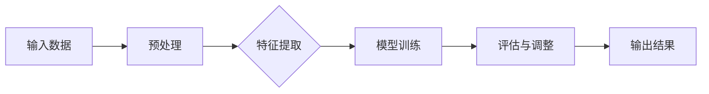

                 

：

### 自监督学习提升AI推理的泛化能力

自监督学习（Self-Supervised Learning）作为深度学习领域的一个重要分支，正逐渐改变着人工智能（AI）的研究和应用方式。在传统监督学习模型中，模型的训练需要大量的标记数据，而自监督学习则通过无标记数据或仅使用少量标记数据来训练模型，从而提高了AI推理的泛化能力。

#### 第一步：了解自监督学习的基本概念

自监督学习是一种机器学习范式，其目标是通过内部训练过程来学习数据表示。在这个过程中，模型需要利用数据中的内在结构来推断出有用的信息。与传统的监督学习相比，自监督学习不需要外部标签，这使得它能够在缺乏大量标注数据的情况下发挥作用。

#### 第二步：探讨自监督学习的原理

自监督学习通常包括以下几种类型：

1. **无监督预训练与微调（Unsupervised Pre-training and Fine-tuning）**：在这种方法中，模型首先在大规模未标记数据上预训练，以学习通用的特征表示。然后，使用少量标记数据对模型进行微调，使其适应特定任务。

2. **伪监督学习（Pseudo-Supervised Learning）**：这种方法利用少量的真实标签和大量的未标记数据进行训练。通过构建伪标签来模拟监督信号。

3. **自监督预训练（Self-Supervised Pre-training）**：模型直接从数据中学习预测任务，例如图像分类、目标检测等。

#### 第三步：分析自监督学习的优势

自监督学习的优势在于：

- **减少对标注数据的依赖**：标记数据通常非常昂贵且耗时，而自监督学习可以减少这一需求。

- **提高泛化能力**：通过在大规模无标记数据上进行预训练，模型可以学习到更一般的特征表示，从而在新的任务上表现出更好的泛化能力。

- **适应新任务**：自监督学习模型可以通过微调来快速适应新的任务，而无需从头开始训练。

#### 第四步：讲解自监督学习的算法原理

自监督学习的算法原理通常涉及以下步骤：

1. **数据预处理**：将原始数据转换为适合模型训练的格式。

2. **特征提取**：模型从数据中提取有用的特征表示。

3. **模型训练**：使用提取的特征来训练模型。

4. **评估与调整**：通过评估模型性能来调整模型参数。

以下是一个简单的自监督学习算法流程图：

#### 第五步：系统分析与架构设计方案

以一个自监督学习系统为例，我们可以从以下几个方面来设计和分析：

1. **项目场景介绍**：介绍自监督学习在AI推理中的应用，如图像识别、自然语言处理等。

2. **系统功能设计**：定义系统需要实现的功能，例如数据预处理、特征提取、模型训练等。

3. **系统架构设计**：设计系统的总体架构，包括数据处理模块、模型训练模块、评估模块等。

4. **系统接口设计**：定义系统的接口，包括数据输入、模型训练、模型评估等。

5. **系统交互**：使用Mermaid序列图来描述系统各部分的交互过程。

#### 第六步：项目实战

为了更好地理解自监督学习，我们可以通过一个实际的项目来讲解。以下是一个简单的项目框架：

1. **环境安装**：安装必要的软件和库，如TensorFlow、PyTorch等。

2. **核心实现源代码**：提供实现自监督学习的源代码。

3. **代码解读与分析**：对代码进行详细解读和分析。

4. **实际案例分析**：通过实际案例来展示自监督学习的应用效果。

5. **项目小结**：总结项目中的关键点和经验教训。

#### 第七步：最佳实践 tips

1. **数据预处理**：确保数据质量，去除噪声和异常值。

2. **模型选择**：根据任务需求选择合适的模型架构。

3. **超参数调整**：通过实验来优化模型超参数。

4. **模型评估**：使用多种评估指标来全面评估模型性能。

#### 第八步：小结与注意事项

自监督学习在提升AI推理的泛化能力方面具有显著优势。然而，在使用自监督学习时，需要注意数据预处理、模型选择、超参数调整等方面的问题。通过合理的架构设计和项目实战，我们可以更好地发挥自监督学习的作用。

#### 第九步：拓展阅读

1. **书籍**：《自监督学习的艺术》（The Art of Self-Supervised Learning）

2. **文章**：《自监督学习：提升AI泛化能力的利器》（Self-Supervised Learning: A Tool for Enhancing AI Generalization）

3. **资源**：[自监督学习GitHub仓库](https://github.com/username/self-supervised-learning)

### 结语

自监督学习是深度学习领域的一个重要方向，其通过利用无标记数据来提升AI推理的泛化能力，为AI的发展提供了新的可能性。本文通过逻辑清晰、结构紧凑的分析，旨在帮助读者更好地理解自监督学习的原理和应用。让我们继续探索这一领域，为AI的未来发展贡献自己的力量。

---

**作者：AI天才研究院/AI Genius Institute & 禅与计算机程序设计艺术 /Zen And The Art of Computer Programming**AI天才研究院/AI Genius Institute & 禅与计算机程序设计艺术 /Zen And The Art of Computer Programming</sop>

