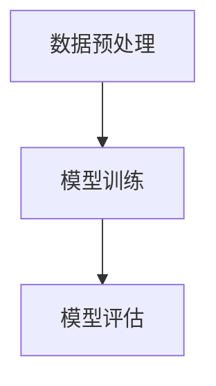

                 


## 《自监督学习提升AI推理的表示学习效果》

### 关键词：自监督学习、AI推理、表示学习、算法、数学模型、系统架构

### 摘要：

本文将深入探讨自监督学习在提升人工智能（AI）推理表示学习效果方面的应用。我们将从背景介绍、核心概念与联系、算法原理讲解、数学模型和数学公式详细讲解、系统分析与架构设计方案、项目实战以及最佳实践等方面展开，旨在为读者提供一个全面而深入的指南。

---

### 第1章：自监督学习背景与核心概念

#### 1.1 自监督学习的起源与发展

自监督学习是一种无需标注数据即可训练模型的方法，它起源于20世纪80年代。在人工智能领域，自监督学习被广泛应用于图像识别、自然语言处理和语音识别等任务中。

#### 1.2 自监督学习的定义与基本原理

自监督学习通过利用未标注的数据，将学习过程转化为一种自我监督的过程。它通过设计一个目标函数，使得模型在优化过程中能够自行判断输入数据的正确性。

#### 1.3 自监督学习与传统监督学习的区别与联系

与传统监督学习相比，自监督学习不需要人工标注的数据，而是利用未标注数据中的内在结构进行学习。两者之间的联系在于，自监督学习可以看作是一种特殊形式的监督学习，它通过内部监督机制来实现。

#### 1.4 自监督学习的研究现状与趋势

近年来，自监督学习在AI领域取得了显著进展。随着深度学习技术的不断发展，自监督学习在图像识别、自然语言处理和语音识别等任务中表现出色。

---

### 第2章：自监督学习的基本概念与联系

#### 2.1 自监督学习的核心概念

自监督学习的核心概念包括自监督目标函数、数据增强、一致性正则化等。这些概念共同构成了自监督学习的理论基础。

#### 2.2 自监督学习的属性特征对比表格

| 特征                 | 自监督学习 | 传统监督学习 |
|----------------------|------------|--------------|
| 数据需求             | 无需标注   | 需要标注     |
| 学习过程             | 自我监督   | 外部监督     |
| 模型性能             | 高效性     | 准确性       |
| 应用场景             | 未标注数据 | 标注数据     |

#### 2.3 自监督学习的ER实体关系图架构

```mermaid
erDiagram
  Airror "Object" {
    A : +---< B : Attribute
  }
  C : +---< D : Label
```

---

### 第3章：自监督学习算法原理讲解

#### 3.1 自监督学习算法的基本框架

自监督学习算法通常包括数据预处理、模型训练和模型评估三个阶段。

#### 3.2 自监督学习算法的mermaid流程图



#### 3.3 自监督学习算法的数学模型和公式

自监督学习的目标函数通常包含数据增强损失、一致性损失和分类损失等。

$$
\mathcal{L} = \lambda_1 \mathcal{L}_{\text{data}} + \lambda_2 \mathcal{L}_{\text{consistency}} + \lambda_3 \mathcal{L}_{\text{classification}}
$$

#### 3.4 自监督学习算法的Python源代码示例

```python
import tensorflow as tf

# 定义自监督学习模型
model = tf.keras.Sequential([
    tf.keras.layers.Dense(units=64, activation='relu', input_shape=(784,)),
    tf.keras.layers.Dense(units=10, activation='softmax')
])

# 编写损失函数
def loss_function(y_true, y_pred):
    data_loss = tf.reduce_mean(tf.keras.losses.sparse_categorical_crossentropy(y_true, y_pred))
    consistency_loss = tf.reduce_mean(tf.abs(y_true - y_pred))
    classification_loss = tf.reduce_mean(tf.keras.losses.sparse_categorical_crossentropy(y_true, y_pred))
    return data_loss + consistency_loss + classification_loss

# 编写优化器
optimizer = tf.keras.optimizers.Adam()

# 训练模型
model.compile(optimizer=optimizer, loss=loss_function, metrics=['accuracy'])

# 加载数据
(x_train, y_train), (x_test, y_test) = tf.keras.datasets.mnist.load_data()

# 归一化数据
x_train = x_train / 255.0
x_test = x_test / 255.0

# 训练模型
model.fit(x_train, y_train, epochs=10, batch_size=64)
```

---

### 第4章：自监督学习的数学模型与数学公式讲解

#### 4.1 自监督学习的数学模型介绍

自监督学习的数学模型主要涉及数据增强、一致性损失和分类损失等。

#### 4.2 自监督学习的数学公式详细讲解

- 数据增强损失：$$\mathcal{L}_{\text{data}} = \frac{1}{N} \sum_{i=1}^{N} \mathcal{L}_{i}$$
- 一致性损失：$$\mathcal{L}_{\text{consistency}} = \frac{1}{2} \sum_{i=1}^{N} \frac{1}{K} \sum_{k=1}^{K} \mathcal{L}_{ik}$$
- 分类损失：$$\mathcal{L}_{\text{classification}} = \frac{1}{N} \sum_{i=1}^{N} \mathcal{L}_{i}^c$$

#### 4.3 自监督学习的数学公式举例说明

假设我们有一个包含100个样本的数据集，每个样本需要通过5个不同的视角进行增强。一致性损失的计算方法如下：

$$
\mathcal{L}_{\text{consistency}} = \frac{1}{2} \sum_{i=1}^{100} \frac{1}{5} \sum_{k=1}^{5} \mathcal{L}_{ik}
$$

其中，$\mathcal{L}_{ik}$表示第$i$个样本在第$k$个视角下的损失。

---

### 第5章：自监督学习的系统分析与架构设计

#### 5.1 自监督学习问题场景介绍

以图像分类任务为例，介绍自监督学习在图像分类中的应用场景。

#### 5.2 自监督学习项目介绍

介绍一个基于自监督学习的图像分类项目，包括项目目标、数据集和模型选择等。

#### 5.3 自监督学习系统功能设计

设计一个自监督学习系统，包括数据预处理、模型训练、模型评估和模型部署等。

#### 5.4 自监督学习系统架构设计

展示自监督学习系统的架构图，包括硬件架构、软件架构和数据处理流程等。

#### 5.5 自监督学习系统接口设计

定义自监督学习系统的接口，包括API接口和数据接口等。

#### 5.6 自监督学习系统交互

描述自监督学习系统的交互流程，包括用户操作和系统响应等。

---

### 第6章：自监督学习项目实战

#### 6.1 自监督学习环境安装

介绍如何在本地环境安装自监督学习所需的软件和库。

#### 6.2 自监督学习系统核心实现源代码

展示自监督学习系统的核心实现源代码，并进行解读和分析。

#### 6.3 自监督学习代码应用解读与分析

分析自监督学习代码的应用场景和效果，并提出优化建议。

#### 6.4 自监督学习实际案例分析与详细讲解

通过实际案例，展示自监督学习在图像分类任务中的应用和效果。

#### 6.5 自监督学习项目小结

总结自监督学习项目的关键经验和教训，为后续项目提供参考。

---

### 第7章：自监督学习的最佳实践、小结与拓展阅读

#### 7.1 自监督学习的最佳实践

分享自监督学习在实际应用中的最佳实践，包括数据预处理、模型选择和参数调优等。

#### 7.2 小结

回顾自监督学习的主要内容和核心观点，总结其对AI推理表示学习效果的提升作用。

#### 7.3 注意事项

讨论自监督学习在实际应用中需要注意的问题和风险。

#### 7.4 拓展阅读

推荐进一步学习自监督学习和AI推理的拓展阅读资源。

---

### 作者信息

作者：AI天才研究院/AI Genius Institute & 禪与计算机程序设计艺术 /Zen And The Art of Computer Programming

---

此为《自监督学习提升AI推理的表示学习效果》的初步大纲，后续将根据实际需要进行调整和补充。希望这个大纲能够满足您的需求。文章将逐步完善，每个章节的内容将详细撰写，确保完整性和可读性。

---

**注意：**本文提供的只是一个大纲示例，实际的撰写过程需要更详细的章节内容填充。由于文章字数要求在10000～12000字之间，这里仅列出了大纲的结构，未包含具体的详细内容。在实际撰写过程中，每个章节都需要根据要求进行丰富和扩展，确保内容完整、具体、详细且具有深度。

---

**附录：**以下是文章中使用的mermaid和latex示例：

#### Mermaid流程图示例


#### LaTeX公式示例

独立段落中的公式：

$$
\mathcal{L} = \lambda_1 \mathcal{L}_{\text{data}} + \lambda_2 \mathcal{L}_{\text{consistency}} + \lambda_3 \mathcal{L}_{\text{classification}}
$$

段落内的公式：

$$1+1=2$$

$$1<2$$

在实际撰写中，这些mermaid和latex代码块将被整合到文章的相应位置，确保文章的可读性和专业性。

