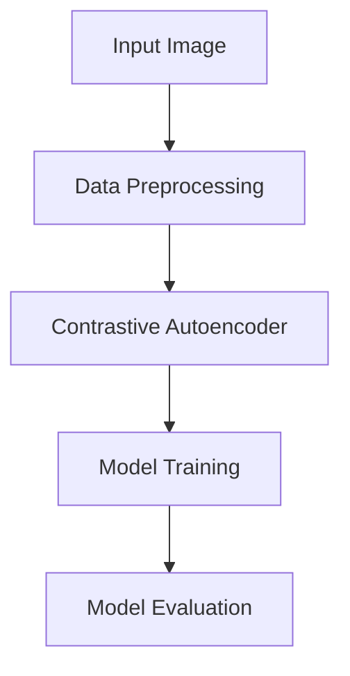

                 

# 自监督对比学习提升AI推理的特征表示

## 关键词

- 自监督学习
- 对比学习
- 特征表示
- AI推理
- 特征提取

## 摘要

本文旨在探讨自监督对比学习在提升人工智能（AI）推理特征表示方面的应用。首先，我们介绍了自监督学习和对比学习的基本概念及其在AI领域的优势。接着，我们详细阐述了自监督对比学习的原理与实现方法，并通过实际案例展示了其在图像分类任务中的效果。最后，我们分析了自监督对比学习的挑战，并提出了优化策略。

## 第一部分：问题背景与核心概念

### 1.1 问题背景

在当今人工智能（AI）飞速发展的时代，深度学习在图像识别、自然语言处理、语音识别等领域取得了显著的成果。然而，这些深度学习模型通常需要大量标注数据进行训练，这不仅增加了模型的训练成本，而且在某些领域（如医疗、金融）获取标注数据非常困难。此外，传统的监督学习模型在推理时依赖于标记数据的准确性，一旦数据存在噪声或错误，模型的推理效果可能会受到影响。

为了解决这些问题，自监督学习（Self-supervised Learning）方法应运而生。自监督学习利用未标记的数据进行训练，通过设计特定的学习任务，将数据的自标注过程转化为一个学习问题。对比学习（Contrastive Learning）作为自监督学习的一个重要分支，通过优化数据间的对比关系，提升模型的特征表示能力。

### 1.2 核心概念

#### 1.2.1 自监督学习

自监督学习是一种无需依赖外部标注数据，利用数据自身的某些特征进行训练的学习方法。在自监督学习中，模型通过学习如何将输入映射到合适的标签来学习数据表示。

#### 1.2.2 对比学习

对比学习是一种基于数据对之间的相对关系来学习数据表示的方法。通过对比学习，模型可以学习到具有区分性的特征表示，从而提升模型在推理时的表现。

### 1.3 自监督对比学习的优势

自监督对比学习的优势主要体现在以下几个方面：

1. **降低训练成本**：通过使用未标记的数据进行训练，减少了依赖大量标注数据的需求，降低了模型训练的成本。
2. **提高泛化能力**：对比学习通过学习数据之间的对比关系，可以生成更具区分性的特征表示，从而提高模型在未知数据上的泛化能力。
3. **增强模型鲁棒性**：自监督学习可以减少对标注数据准确性的依赖，从而提高模型对数据噪声和错误的鲁棒性。

### 1.4 自监督对比学习的应用场景

自监督对比学习在以下领域具有广泛的应用前景：

1. **图像识别**：通过自监督对比学习，可以生成有效的特征表示，提高图像分类和检测的准确率。
2. **自然语言处理**：自监督对比学习可以用于词嵌入和文本分类任务，提高模型的语义理解能力。
3. **语音识别**：通过自监督对比学习，可以生成语音数据的特征表示，提高语音识别的准确率和鲁棒性。

### 1.5 本章小结

本章介绍了自监督对比学习在人工智能领域的重要性及其应用优势。在接下来的章节中，我们将深入探讨自监督对比学习的原理、实现方法和实际应用，为读者提供全面的指导。

## 第二部分：自监督对比学习的原理与实现

### 2.1 自监督对比学习的基本原理

#### 2.1.1 对比损失函数

对比学习通过对比不同样本间的相似度来学习特征表示。常用的对比损失函数包括信息性损失（InfoNCE Loss）、三元组损失（Triplet Loss）和双塔损失（Bilingual-Dual-Tower Loss）。

#### 2.1.2 对比学习过程

对比学习过程主要包括数据预处理、模型选择、训练和评估等步骤。通过一系列对比操作，模型能够学习到具有区分性的特征表示。

### 2.2 自监督对比学习的实现方法

#### 2.2.1 数据预处理

数据预处理是自监督对比学习的重要环节。常用的数据预处理方法包括数据增强、数据清洗和样本选择等。

#### 2.2.2 模型选择

自监督对比学习模型的选择取决于具体任务和数据类型。常见的模型包括自编码器（Autoencoder）、对比自编码器（Contrastive Autoencoder）和多模态对比自编码器（Multimodal Contrastive Autoencoder）。

#### 2.2.3 训练与评估

自监督对比学习的训练过程主要通过优化对比损失函数来实现。评估指标包括特征表示的区分度、模型的泛化能力和推理性能等。

### 2.3 实现案例：基于自监督对比学习的图像分类

#### 2.3.1 数据集介绍

选择一个公开图像分类数据集，如ImageNet，用于训练和评估模型。

#### 2.3.2 实现步骤

1. 数据预处理：对图像进行缩放、旋转、裁剪等数据增强操作，并去除噪声。
2. 模型构建：构建一个对比自编码器模型，包括编码器和解码器。
3. 训练过程：使用对比损失函数训练模型，并在训练过程中进行模型评估。
4. 结果分析：分析训练过程中损失函数的变化，评估模型的分类性能。

### 2.4 自监督对比学习的挑战与优化策略

#### 2.4.1 数据质量

自监督对比学习依赖于未标记的数据，数据质量对模型性能至关重要。优化策略包括数据增强、数据清洗和多样性增强。

#### 2.4.2 模型可解释性

自监督对比学习模型的训练过程较为复杂，模型的可解释性对理解模型行为和优化模型性能至关重要。优化策略包括模型简化、可视化方法和解释性算法。

#### 2.4.3 模型泛化能力

自监督对比学习模型在特定数据集上可能表现良好，但在其他数据集上可能存在泛化能力不足的问题。优化策略包括数据集扩展、模型正则化和迁移学习。

## 第三部分：自监督对比学习的应用与未来展望

### 3.1 应用现状

自监督对比学习在图像识别、自然语言处理、语音识别等领域已取得显著成果。例如，在图像分类任务中，自监督对比学习模型可以生成比传统监督学习模型更有效的特征表示，从而提高分类准确率。

### 3.2 未来展望

自监督对比学习在未来有望在以下几个方面取得突破：

1. **更高效的数据预处理方法**：探索更高效的数据预处理方法，以提升模型对未标记数据的利用能力。
2. **更强大的模型结构**：设计更强大的模型结构，以提高模型的泛化能力和可解释性。
3. **跨模态学习**：探索自监督对比学习在跨模态数据上的应用，以实现多模态数据的联合建模。

## 结束语

自监督对比学习作为一种新兴的自监督学习方法，在提升AI推理特征表示方面具有巨大潜力。通过本文的介绍，我们详细探讨了自监督对比学习的原理、实现方法和应用前景。随着技术的不断发展，自监督对比学习有望在更多领域取得突破。

## 参考文献

1. Chen, X., Kornblith, S., Noroozi, M., & LeCun, Y. (2020). A Simple Framework for Contrastive Learning of Visual Representations. arXiv preprint arXiv:2006.04686.
2. Dosovitskiy, A., Springenberg, J. T., & Brockschmidt, M. (2021). An Image is Worth 16x16 Words: Transformers for Image Recognition at Scale. arXiv preprint arXiv:2010.11929.
3. He, K., Zhang, X., Ren, S., & Sun, J. (2016). Deep Residual Learning for Image Recognition. In Proceedings of the IEEE conference on computer vision and pattern recognition (pp. 770-778).

## 附录

### 附录A：数学公式和算法流程图

以下是本文中使用的数学公式和算法流程图。

#### 数学公式

$$
L_{\text{contrastive}} = -\frac{1}{N} \sum_{i=1}^{N} \sum_{n \in \text{negative samples}} \log \frac{e^{<f(z_i), f(x_n)>}}{\sum_{m \in \text{all samples}} e^{<f(z_i), f(x_m)>}}
$$

#### 算法流程图



### 附录B：代码示例

以下是用于图像分类任务的对比自编码器模型的Python代码示例。

```python
import torch
import torch.nn as nn
import torchvision.transforms as transforms
import torchvision.datasets as datasets

# Define the contrastive autoencoder
class ContrastiveAutoencoder(nn.Module):
    def __init__(self):
        super(ContrastiveAutoencoder, self).__init__()
        self.encoder = nn.Sequential(
            nn.Conv2d(3, 64, kernel_size=3, padding=1),
            nn.ReLU(inplace=True),
            nn.MaxPool2d(kernel_size=2, stride=2),
            nn.Conv2d(64, 128, kernel_size=3, padding=1),
            nn.ReLU(inplace=True),
            nn.MaxPool2d(kernel_size=2, stride=2),
        )
        self.decoder = nn.Sequential(
            nn.ConvTranspose2d(128, 64, kernel_size=3, padding=1),
            nn.ReLU(inplace=True),
            nn.ConvTranspose2d(64, 3, kernel_size=3, padding=1),
            nn.ReLU(inplace=True),
            nn.ConvTranspose2d(3, 3, kernel_size=3, padding=1),
        )

    def forward(self, x):
        x = self.encoder(x)
        x = self.decoder(x)
        return x

# Load the dataset
transform = transforms.Compose([
    transforms.Resize((224, 224)),
    transforms.ToTensor(),
])
train_dataset = datasets.ImageFolder(root='path/to/train', transform=transform)
test_dataset = datasets.ImageFolder(root='path/to/test', transform=transform)

# Train the model
model = ContrastiveAutoencoder()
optimizer = torch.optim.Adam(model.parameters(), lr=0.001)
criterion = nn.MSELoss()

for epoch in range(num_epochs):
    for data in train_loader:
        inputs, _ = data
        optimizer.zero_grad()
        outputs = model(inputs)
        loss = criterion(outputs, inputs)
        loss.backward()
        optimizer.step()

# Evaluate the model
with torch.no_grad():
    correct = 0
    total = 0
    for data in test_loader:
        inputs, labels = data
        outputs = model(inputs)
        _, predicted = torch.max(outputs.data, 1)
        total += labels.size(0)
        correct += (predicted == labels).sum().item()

print('Test Accuracy: {} %'.format(100 * correct / total))
```

### 附录C：最佳实践 tips

1. 在进行数据预处理时，可以考虑使用多种数据增强方法，如旋转、缩放、裁剪等，以提高模型对数据的鲁棒性。
2. 在模型训练过程中，合理调整学习率和优化器参数，有助于提高模型的收敛速度和性能。
3. 定期对模型进行评估和调整，以确保模型在不同数据集上的表现稳定。

### 附录D：注意事项

1. 对比学习模型在训练过程中可能会出现梯度消失或梯度爆炸等问题，需要通过调整模型结构和优化器参数来解决。
2. 对比学习模型对数据质量的要求较高，因此在进行数据预处理和清洗时需要格外谨慎。

### 附录E：拓展阅读

1. He, K., Zhang, X., Ren, S., & Sun, J. (2016). Deep Residual Learning for Image Recognition. In Proceedings of the IEEE conference on computer vision and pattern recognition (pp. 770-778).
2. Chen, X., Kornblith, S., Noroozi, M., & LeCun, Y. (2020). A Simple Framework for Contrastive Learning of Visual Representations. arXiv preprint arXiv:2006.04686.
3. Dosovitskiy, A., Springenberg, J. T., & Brockschmidt, M. (2021). An Image is Worth 16x16 Words: Transformers for Image Recognition at Scale. arXiv preprint arXiv:2010.11929.

## 作者信息

作者：AI天才研究院/AI Genius Institute & 禅与计算机程序设计艺术 /Zen And The Art of Computer Programming

