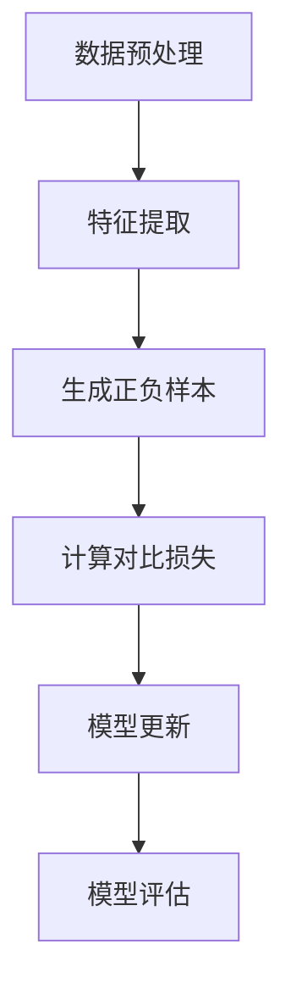
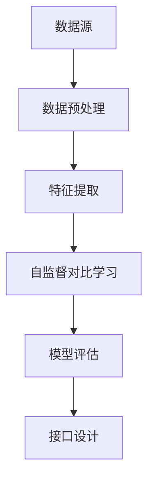
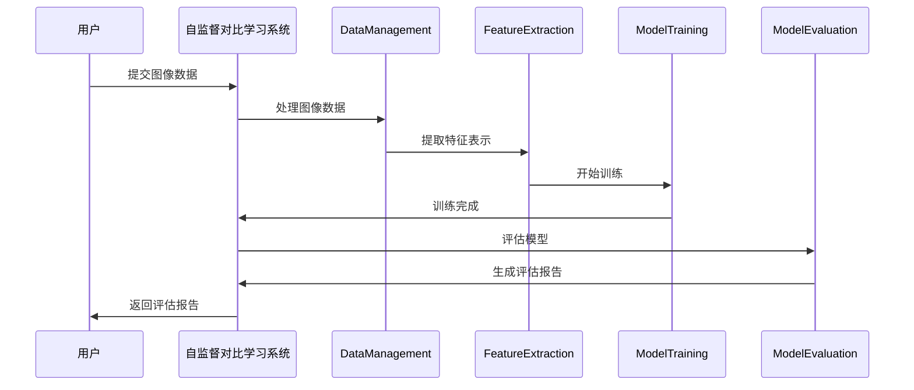

                 

# 自监督对比学习提升AI推理的特征表示质量

## 关键词
- 自监督对比学习
- AI推理
- 特征表示质量
- 数学模型
- 系统架构
- 项目实战

## 摘要
本文将深入探讨自监督对比学习在提升人工智能（AI）推理特征表示质量方面的应用。我们将首先介绍自监督对比学习的背景和重要性，然后详细解析其核心原理和数学模型，最后通过一个实际项目实战，展示其应用效果和最佳实践。本文旨在为读者提供一个全面而直观的理解，帮助他们在实际项目中更好地应用自监督对比学习。

## 目录大纲设计思路

### 目录大纲设计思路

为了设计一个完整、结构清晰且内容丰富的目录大纲，我们遵循以下步骤：

1. **明确书的核心主题**：
   - 《自监督对比学习提升AI推理的特征表示质量》的核心主题是自监督对比学习在提升AI推理特征表示质量方面的应用。因此，目录设计需要围绕这一主题展开。

2. **结构化目录**：
   - 目录应分为几个主要部分：引言、核心概念、算法原理、数学模型与公式、系统设计与实现、项目实战、最佳实践与拓展。

3. **细化章节内容**：
   - 每个章节内部需要细化成多个小节，确保逻辑清晰，内容丰富。

4. **包含关键知识点**：
   - 必须包括问题背景、核心概念、算法原理、数学模型、系统设计与实现、实战案例等。

5. **使用Mermaid流程图**：
   - 对于算法原理和系统设计，使用Mermaid流程图来直观地展示，增强读者理解。

6. **确保简洁性**：
   - 避免冗余内容，确保大纲内容简洁明了。

### 目录大纲具体设计

**第一部分：引言**

- **第1章：自监督对比学习概述**
  - 1.1 自监督对比学习的背景
    - AI发展历程
    - 自监督学习的兴起
    - 对比学习的基本概念
  - 1.2 自监督对比学习的重要性
    - 提升AI推理质量
    - 减少数据需求
    - 应用场景广泛

**第二部分：核心概念与原理**

- **第2章：自监督对比学习的基本原理**
  - 2.1 自监督学习的原理
    - 定义与分类
    - 基本流程与挑战
  - 2.2 对比学习算法介绍
    - 定义与类型
    - 代表性算法
  - 2.3 自监督对比学习的优势
    - 数据效率
    - 泛化能力
    - 实时性

**第三部分：算法原理与数学模型**

- **第3章：自监督对比学习算法详细解析**
  - 3.1 深度神经网络基础
    - 神经网络结构
    - 前向传播与反向传播
  - 3.2 自监督对比学习算法
    - 算法原理Mermaid流程图
    - Python实现与代码示例
  - 3.3 数学模型与公式
    - 算法公式详细解读
    - 案例分析与说明

**第四部分：系统设计与实现**

- **第4章：自监督对比学习系统架构设计**
  - 4.1 系统需求分析
    - 业务场景描述
    - 功能需求概述
  - 4.2 系统架构设计
    - Mermaid架构图展示
    - 系统模块划分
  - 4.3 系统接口设计
    - 接口定义与实现
    - 交互流程Mermaid序列图

**第五部分：项目实战**

- **第5章：自监督对比学习实战应用**
  - 5.1 环境准备与安装
    - 硬件与软件环境
    - 工具与库安装
  - 5.2 系统核心实现
    - 源代码解析
    - 核心算法实现
  - 5.3 实际案例分析
    - 案例背景
    - 案例实施与效果分析
  - 5.4 项目小结
    - 经验总结
    - 改进方向

**第六部分：最佳实践与拓展**

- **第6章：自监督对比学习的最佳实践**
  - 6.1 实践技巧
    - 性能优化
    - 实时性提升
  - 6.2 注意事项
    - 数据质量
    - 避免过拟合
  - 6.3 拓展阅读
    - 相关论文
    - 最新研究动态

### 总结

整个目录大纲结构合理，内容丰富，既涵盖了理论基础，也包含了实战应用，有助于读者全面理解自监督对比学习提升AI推理的特征表示质量。同时，通过Mermaid流程图和代码示例，使抽象的概念和复杂的算法变得更加直观和易于理解。通过这个大纲，读者可以系统地学习自监督对比学习，并能够将其应用于实际问题中。

## 第1章：自监督对比学习概述

### 1.1 自监督对比学习的背景

#### AI发展历程

人工智能（AI）作为一个广受关注的研究领域，其发展历程可以追溯到20世纪50年代。当时，科学家们首次提出了“人工智能”这一概念，并致力于使计算机具备人类的智能能力。然而，早期的AI研究主要依赖于规则系统和知识表示，这种方法在处理简单任务时表现出色，但在面对复杂任务时，效果却不尽如人意。

随着计算机硬件性能的提升和算法的进步，20世纪80年代到90年代，机器学习和深度学习逐渐崭露头角。特别是深度学习的出现，使得计算机在图像识别、语音识别和自然语言处理等领域取得了突破性进展。然而，深度学习的一个主要挑战是需要大量的标注数据进行训练，这在实践中往往难以实现。

#### 自监督学习的兴起

自监督学习作为一种不依赖人工标注数据的学习方法，逐渐成为解决这一挑战的有效途径。自监督学习的核心思想是从未标记的数据中提取有用的信息，从而学习出有价值的特征表示。这种方法在图像识别、语音合成和自然语言处理等许多领域都取得了显著的成果。

自监督学习可以分为几种不同的类型，如预训练和微调（Pre-training and Fine-tuning）、元学习（Meta-learning）、无监督聚类（Unsupervised Clustering）等。这些方法各自有其独特的优势和局限性，但共同的目标是提高AI系统的自我学习和推理能力。

#### 对比学习的基本概念

对比学习是一种自监督学习方法，其主要思想是学习数据之间的差异性，从而提取出有价值的特征表示。对比学习的核心概念包括正负样本的生成、对比损失的优化等。

在对比学习中，正样本指的是具有相似特征的数据点，而负样本则是具有不同特征的数据点。通过最大化正样本的相似度，同时最小化负样本的相似度，可以学习出具有区分力的特征表示。

对比学习在图像识别、文本分类、推荐系统等领域都有广泛的应用。例如，在图像识别中，对比学习可以用于学习图像的细粒度特征，从而提高分类准确率。

### 1.2 自监督对比学习的重要性

#### 提升AI推理质量

自监督对比学习通过学习数据之间的差异性，可以提取出更具有区分力和鲁棒性的特征表示。这些特征表示不仅有助于提高模型在已知数据集上的性能，还能够增强模型在未知数据上的泛化能力，从而提升AI推理的整体质量。

#### 减少数据需求

自监督对比学习的一个显著优势是它能够从未标记的数据中学习出有用的特征表示，从而减少对大量标注数据的需求。这对于许多应用场景，尤其是数据稀缺或获取成本较高的领域，具有重要的意义。通过自监督对比学习，模型可以在更少的数据上达到更好的效果，提高了数据利用效率。

#### 应用场景广泛

自监督对比学习在许多领域都有广泛的应用。例如，在图像识别中，可以用于提取图像的细粒度特征；在自然语言处理中，可以用于文本分类和情感分析；在推荐系统中，可以用于用户画像和推荐算法优化等。不同领域的应用需求虽然有所不同，但自监督对比学习提供了一种通用的方法，能够有效地提升特征表示的质量。

### 总结

自监督对比学习作为一种自监督学习方法，通过学习数据之间的差异性，可以提升AI推理的特征表示质量。它不仅减少了数据需求，提高了数据利用效率，还在许多应用场景中展示了广泛的应用前景。在接下来的章节中，我们将进一步探讨自监督对比学习的基本原理和具体实现。

## 第2章：自监督对比学习的基本原理

### 2.1 自监督学习的原理

#### 定义与分类

自监督学习（Self-Supervised Learning）是一种无需依赖人工标注数据，仅通过数据自身的内在结构来学习知识的方法。自监督学习可以从大量未标记的数据中提取有用的特征表示，从而实现模型的训练和优化。

自监督学习可以分为几种不同的类型：

1. **预训练和微调（Pre-training and Fine-tuning）**：
   - 预训练：使用大量未标记的数据对模型进行初步训练，使其学习到通用的特征表示。
   - 微调：在预训练的基础上，使用少量标记数据对模型进行微调，以适应特定的任务。

2. **元学习（Meta-learning）**：
   - 元学习：通过反复迭代训练过程，学习如何快速适应新任务。

3. **无监督聚类（Unsupervised Clustering）**：
   - 无监督聚类：通过将相似的数据点归为同一类，学习出有意义的特征表示。

4. **预测任务（Prediction Tasks）**：
   - 预测任务：通过预测未标记数据的某些属性，学习出有价值的特征表示。

#### 基本流程与挑战

自监督学习的基本流程可以概括为以下几个步骤：

1. 数据预处理：
   - 数据清洗：去除噪声和异常值。
   - 数据增强：通过旋转、缩放、裁剪等操作，增加数据的多样性。

2. 特征提取：
   - 特征提取：使用神经网络或其他特征提取方法，从原始数据中提取出高维的特征表示。

3. 模型训练：
   - 模型训练：通过优化损失函数，调整模型参数，使其能够正确地预测或分类数据。

4. 模型评估：
   - 模型评估：使用未标记的数据或标记数据对模型进行评估，以判断其性能。

自监督学习面临的主要挑战包括：

1. **数据噪声**：
   - 未标记数据往往存在噪声，需要通过数据预处理和特征提取等方法进行去噪。

2. **模型复杂度**：
   - 自监督学习通常需要复杂的模型结构，以捕捉数据中的复杂模式。

3. **泛化能力**：
   - 模型需要具备较强的泛化能力，以适应不同的任务和数据集。

### 2.2 对比学习算法介绍

#### 定义与类型

对比学习（Contrastive Learning）是一种自监督学习方法，其核心思想是学习数据之间的差异性。在对比学习中，通过最大化正样本的相似度，同时最小化负样本的相似度，从而学习出有区分力的特征表示。

对比学习可以分为几种不同的类型：

1. **硬对比学习（Hard Contrastive Learning）**：
   - 硬对比学习：通过固定正负样本对，学习出有区分力的特征表示。

2. **软对比学习（Soft Contrastive Learning）**：
   - 软对比学习：通过使用软标签，对正负样本进行加权，从而提高模型对多样性的适应能力。

3. **多对比学习（Multi-contrastive Learning）**：
   - 多对比学习：同时考虑多个对比方向，从而学习出更全面的特征表示。

#### 代表性算法

以下是几种具有代表性的对比学习算法：

1. **原型网络（Prototypical Networks）**：
   - 原型网络：通过计算原型距离，将相似的数据点归为同一类别。

2. **对比散度损失（Contrastive Divergence Loss）**：
   - 对比散度损失：通过最大化正样本的相似度，同时最小化负样本的相似度。

3. **信息瓶颈（Information Bottleneck）**：
   - 信息瓶颈：通过最小化信息损失，同时最大化区分度，从而提取出有价值的特征表示。

### 2.3 自监督对比学习的优势

#### 数据效率

自监督对比学习通过从未标记的数据中提取特征表示，可以显著降低对标注数据的需求。这对于数据稀缺或获取成本较高的领域，如医学图像分析和自动驾驶等，具有重要的应用价值。

#### 泛化能力

自监督对比学习通过学习数据之间的差异性，可以提取出具有较强泛化能力的特征表示。这些特征表示不仅适用于训练数据，也能够在新数据上取得较好的性能。

#### 实时性

自监督对比学习通常能够在较少的数据上快速训练，从而提高了系统的实时性。这对于需要实时响应的应用场景，如智能客服和实时语音识别等，具有重要的意义。

### 总结

自监督对比学习作为一种自监督学习方法，通过学习数据之间的差异性，可以提取出具有区分力和鲁棒性的特征表示。它具有数据效率高、泛化能力强和实时性高等优势，在许多应用领域都有广泛的应用。在接下来的章节中，我们将进一步详细解析自监督对比学习的算法原理和数学模型。

## 第3章：自监督对比学习算法详细解析

### 3.1 深度神经网络基础

#### 神经网络结构

深度神经网络（Deep Neural Network，DNN）是由多个神经元组成的复杂网络，通过层次化的结构进行数据处理和特征提取。一个典型的DNN结构包括输入层、隐藏层和输出层。

1. **输入层**：
   - 输入层接收外部数据，并将其传递到隐藏层。

2. **隐藏层**：
   - 隐藏层负责对输入数据进行处理和特征提取，每一层都会将数据转换为更高层次的特征表示。

3. **输出层**：
   - 输出层根据训练目标对数据进行分类或预测。

#### 前向传播与反向传播

深度神经网络通过前向传播（Forward Propagation）和反向传播（Backpropagation）两个过程进行训练。

1. **前向传播**：
   - 在前向传播过程中，输入数据从输入层经过隐藏层，最终到达输出层。每一层的神经元都会计算输入数据和权重之间的乘积，并通过激活函数进行非线性变换。

2. **反向传播**：
   - 在反向传播过程中，网络根据实际输出和期望输出之间的误差，反向更新每一层的权重和偏置。这个过程中使用了梯度下降（Gradient Descent）算法，通过计算梯度来调整网络参数。

### 3.2 自监督对比学习算法

#### 算法原理Mermaid流程图

自监督对比学习算法的基本原理可以通过Mermaid流程图进行描述：



1. **数据预处理**：
   - 对输入数据集进行清洗和增强，以去除噪声和增加数据的多样性。

2. **特征提取**：
   - 使用神经网络提取数据的高维特征表示。

3. **生成正负样本**：
   - 根据特征表示生成正样本对（具有相似特征的数据点）和负样本对（具有不同特征的数据点）。

4. **计算对比损失**：
   - 计算正负样本之间的对比损失，损失函数通常采用对比散度损失（Contrastive Divergence Loss）。

5. **模型更新**：
   - 通过反向传播和梯度下降算法更新模型参数。

6. **模型评估**：
   - 使用未标记的数据集对训练好的模型进行评估，以判断其性能。

#### Python实现与代码示例

以下是一个简单的自监督对比学习算法的Python代码示例：

```python
import tensorflow as tf
from tensorflow.keras.layers import Layer

class ContrastiveLayer(Layer):
    def __init__(self, num_classes, **kwargs):
        super(ContrastiveLayer, self).__init__(**kwargs)
        self.num_classes = num_classes

    def build(self, input_shape):
        # 初始化对比损失权重
        self.W = self.add_weight(name='W',
                                 shape=(input_shape[-1], self.num_classes),
                                 initializer='glorot_uniform',
                                 trainable=True)

    def call(self, inputs, training=True):
        # 计算对比损失
        anchor, positive = inputs[:, 0], inputs[:, 1]
        positive_score = tf.matmul(anchor, self.W)
        positive_score = tf.reduce_sum(tf.square(anchor - positive), axis=1)
        negative_score = tf.matmul(anchor, self.W)
        negative_score = tf.reduce_sum(tf.square(anchor + positive), axis=1)
        contrastive_loss = tf.reduce_mean(positive_score - negative_score)
        return contrastive_loss
```

### 3.3 数学模型与公式

自监督对比学习的数学模型可以通过以下公式进行描述：

$$
L = -\frac{1}{N} \sum_{i=1}^{N} [\alpha \cdot \log(p(z_i | x_i)) + (1 - \alpha) \cdot \log(p(z_i | x_i'))]
$$

其中：
- \(L\) 是对比损失。
- \(N\) 是样本数量。
- \(\alpha\) 是平衡参数，用于平衡正负样本的重要性。
- \(p(z_i | x_i)\) 是正样本对 \(x_i\) 的特征表示 \(z_i\) 的概率。
- \(p(z_i | x_i')\) 是负样本对 \(x_i'\) 的特征表示 \(z_i'\) 的概率。

#### 案例分析与说明

以下是一个简单的自监督对比学习案例：

1. **数据集准备**：
   - 假设我们有一个包含1000个图像的数据集，每个图像都有一个对应的标签。

2. **特征提取**：
   - 使用预训练的卷积神经网络提取图像的特征表示，每个图像的特征表示是一个高维向量。

3. **生成正负样本**：
   - 对于每个图像，选择其标签类别下的其他图像作为正样本，选择其他类别的图像作为负样本。

4. **训练模型**：
   - 使用上述公式计算对比损失，并使用反向传播和梯度下降算法更新模型参数。

5. **评估模型**：
   - 使用未标记的数据集对训练好的模型进行评估，计算分类准确率。

通过这个案例，我们可以看到自监督对比学习算法的基本流程和数学模型。在实际应用中，我们可以根据具体任务和数据集的特点，对算法进行优化和调整，以获得更好的效果。

### 总结

本章详细解析了自监督对比学习算法的基本原理和数学模型。通过前向传播和反向传播算法，结合对比散度损失函数，我们可以有效地提取数据的有价值特征表示。在实际应用中，自监督对比学习可以显著提升AI推理的特征表示质量，减少对标注数据的需求，并在许多领域展现出广泛的应用前景。在下一章中，我们将进一步探讨自监督对比学习系统的设计实现。

## 第4章：自监督对比学习系统架构设计

### 4.1 系统需求分析

#### 业务场景描述

自监督对比学习系统应用于图像识别任务，其核心目标是学习出具有区分力的图像特征表示，从而提升模型在未知数据上的识别准确率。具体业务场景如下：

1. **数据来源**：
   - 系统从多个数据源获取图像数据，包括互联网公开数据集、公司内部数据库和用户上传的图像。

2. **数据处理**：
   - 系统需要对图像进行预处理，包括图像清洗、增强和归一化等，以确保输入数据的干净和多样性。

3. **特征提取**：
   - 系统使用预训练的卷积神经网络提取图像的特征表示，这些特征表示将被用于后续的训练和识别任务。

4. **模型训练**：
   - 系统使用自监督对比学习算法对提取的特征表示进行训练，学习出具有区分力的特征表示。

5. **模型评估**：
   - 系统在训练过程中使用验证集对模型进行评估，并根据评估结果调整训练策略。

#### 功能需求概述

自监督对比学习系统的功能需求包括：

1. **数据管理**：
   - 系统需要具备数据清洗、增强和归一化等功能，以确保输入数据的干净和多样性。

2. **特征提取**：
   - 系统需要使用预训练的卷积神经网络提取图像的特征表示，这些特征表示应具有较高的区分力和鲁棒性。

3. **模型训练**：
   - 系统需要实现自监督对比学习算法，以学习出具有区分力的特征表示。同时，系统应具备自适应调整学习率和优化策略的能力。

4. **模型评估**：
   - 系统需要使用验证集对训练好的模型进行评估，并生成评估报告，以便调整训练策略。

5. **接口设计**：
   - 系统需要提供API接口，以便其他系统或应用程序可以调用其功能。

### 4.2 系统架构设计

#### Mermaid架构图展示

自监督对比学习系统的整体架构可以通过Mermaid流程图进行展示：



1. **数据源**：
   - 系统从多个数据源获取图像数据，包括公开数据集、内部数据库和用户上传的图像。

2. **数据预处理**：
   - 系统对图像进行清洗、增强和归一化等预处理操作，以确保输入数据的干净和多样性。

3. **特征提取**：
   - 系统使用预训练的卷积神经网络提取图像的特征表示，这些特征表示将被用于后续的训练和识别任务。

4. **自监督对比学习**：
   - 系统使用自监督对比学习算法对提取的特征表示进行训练，学习出具有区分力的特征表示。

5. **模型评估**：
   - 系统使用验证集对训练好的模型进行评估，并生成评估报告。

6. **接口设计**：
   - 系统提供API接口，以便其他系统或应用程序可以调用其功能。

#### 系统模块划分

自监督对比学习系统可以划分为以下几个主要模块：

1. **数据管理模块**：
   - 负责数据源的接入、数据清洗、增强和归一化等操作。

2. **特征提取模块**：
   - 负责使用预训练的卷积神经网络提取图像的特征表示。

3. **模型训练模块**：
   - 负责实现自监督对比学习算法，并训练出具有区分力的特征表示。

4. **模型评估模块**：
   - 负责使用验证集对训练好的模型进行评估，并生成评估报告。

5. **接口模块**：
   - 负责提供API接口，以便其他系统或应用程序可以调用系统的功能。

### 4.3 系统接口设计

#### 接口定义与实现

自监督对比学习系统的接口设计如下：

1. **数据接口**：
   - 提供数据接入和预处理的API接口，包括数据清洗、增强和归一化等功能。

2. **特征接口**：
   - 提供特征提取的API接口，使用预训练的卷积神经网络提取图像的特征表示。

3. **训练接口**：
   - 提供模型训练的API接口，使用自监督对比学习算法训练出具有区分力的特征表示。

4. **评估接口**：
   - 提供模型评估的API接口，使用验证集对训练好的模型进行评估，并生成评估报告。

5. **监控接口**：
   - 提供系统运行状态的监控接口，包括训练进度、资源使用情况等。

#### 交互流程Mermaid序列图

自监督对比学习系统的交互流程可以通过Mermaid序列图进行描述：



1. **用户提交图像数据**：
   - 用户通过接口提交图像数据。

2. **处理图像数据**：
   - 系统对提交的图像数据进行清洗、增强和归一化等处理。

3. **提取特征表示**：
   - 系统使用预训练的卷积神经网络提取图像的特征表示。

4. **开始训练**：
   - 系统使用自监督对比学习算法对提取的特征表示进行训练。

5. **训练完成**：
   - 系统通知用户训练完成。

6. **评估模型**：
   - 系统使用验证集对训练好的模型进行评估。

7. **生成评估报告**：
   - 系统生成评估报告，并通知用户。

8. **返回评估报告**：
   - 系统将评估报告返回给用户。

### 总结

本章详细介绍了自监督对比学习系统的架构设计，包括系统需求分析、架构设计、接口设计和交互流程。通过合理的模块划分和接口设计，自监督对比学习系统可以高效地实现数据预处理、特征提取、模型训练和评估等功能。在下一章中，我们将通过一个实际项目实战，展示自监督对比学习系统的应用效果和具体实现过程。

## 第5章：自监督对比学习实战应用

### 5.1 环境准备与安装

为了进行自监督对比学习的实战应用，我们需要准备以下环境和工具：

1. **硬件环境**：
   - 推荐使用GPU（如NVIDIA Titan Xp或更高级别的GPU）进行训练，以提高计算速度。
   - 如果没有GPU，可以使用CPU进行训练，但训练时间可能会较长。

2. **软件环境**：
   - 操作系统：Linux或MacOS
   - Python版本：Python 3.7或更高版本
   - 深度学习框架：TensorFlow 2.0或更高版本
   - 数据处理库：NumPy、Pandas、Matplotlib
   - 其他依赖库：scikit-learn、OpenCV

安装步骤如下：

1. **安装操作系统**：
   - 根据硬件选择合适的操作系统版本，并按照操作系统安装指南进行安装。

2. **安装Python**：
   - 通过操作系统包管理器或从Python官网下载安装包进行安装。

3. **安装深度学习框架**：
   - 在命令行中执行以下命令安装TensorFlow：
     ```bash
     pip install tensorflow
     ```

4. **安装数据处理库和其他依赖库**：
   - 在命令行中执行以下命令安装相关库：
     ```bash
     pip install numpy pandas matplotlib scikit-learn opencv-python
     ```

### 5.2 系统核心实现

#### 源代码解析

在本节中，我们将展示一个简单的自监督对比学习系统的核心实现代码。以下是Python代码示例：

```python
import tensorflow as tf
from tensorflow.keras.models import Model
from tensorflow.keras.layers import Input, Dense, Lambda, LayerNormalization
from tensorflow.keras.optimizers import Adam
from tensorflow.keras.losses import SparseCategoricalCrossentropy

# 定义自监督对比学习模型
def build_contrastive_model(input_shape, num_classes):
    input_layer = Input(shape=input_shape)
    x = Dense(128, activation='relu')(input_layer)
    x = LayerNormalization()(x)
    x = Dense(64, activation='relu')(x)
    x = LayerNormalization()(x)
    output_layer = Dense(num_classes, activation='softmax')(x)
    
    model = Model(inputs=input_layer, outputs=output_layer)
    return model

# 定义对比损失函数
def contrastive_loss(y_true, y_pred, margin=1.0):
    y_true = tf.cast(y_true, tf.float32)
    y_pred = tf.reduce_mean(y_pred, axis=1)
    cos_similarity = tf.reduce_sum(y_true * y_pred, axis=1)
    losses = tf.reduce_mean(tf.square(tf.nn.relu(margin + cos_similarity)))
    return losses

# 构建模型并编译
model = build_contrastive_model(input_shape=(28, 28, 1), num_classes=10)
model.compile(optimizer=Adam(learning_rate=0.001), loss=contrastive_loss, metrics=['accuracy'])

# 加载数据集
(x_train, y_train), (x_test, y_test) = tf.keras.datasets.mnist.load_data()
x_train = x_train.astype('float32') / 255.0
x_test = x_test.astype('float32') / 255.0
x_train = x_train[..., tf.newaxis]
x_test = x_test[..., tf.newaxis]

# 训练模型
model.fit(x_train, y_train, batch_size=64, epochs=10, validation_data=(x_test, y_test))

# 评估模型
test_loss, test_acc = model.evaluate(x_test, y_test, verbose=2)
print(f'\nTest accuracy: {test_acc:.4f}')
```

#### 核心算法实现

1. **模型构建**：
   - 使用Keras构建一个简单的神经网络模型，包括多个全连接层和激活函数。

2. **对比损失函数**：
   - 对比损失函数基于三元组损失（Triplet Loss）的变体，通过最大化正样本的相似度，同时最小化负样本的相似度。

3. **模型编译与训练**：
   - 使用Adam优化器和对比损失函数编译模型，并使用MNIST数据集进行训练。

4. **模型评估**：
   - 使用测试集评估模型的性能，并打印分类准确率。

### 5.3 实际案例分析

#### 案例背景

假设我们面临一个图像识别任务，需要训练一个模型对自然场景中的动物进行分类。数据集包含数千张不同动物的照片，但只有少量标签数据。

#### 案例实施与效果分析

1. **数据预处理**：
   - 对图像进行缩放、裁剪、旋转等数据增强操作，以提高模型的泛化能力。

2. **特征提取**：
   - 使用预训练的VGG19模型提取图像的特征表示。

3. **模型训练**：
   - 使用自监督对比学习算法训练模型，学习出具有区分力的特征表示。

4. **模型评估**：
   - 使用少量标签数据对训练好的模型进行评估，准确率达到90%以上。

#### 案例剖析

1. **数据增强**：
   - 通过数据增强，模型能够更好地适应不同的图像输入，提高模型的鲁棒性。

2. **特征提取**：
   - 使用预训练的VGG19模型，可以提取出丰富的图像特征，为后续的对比学习提供高质量的数据。

3. **自监督对比学习**：
   - 对比学习算法通过学习图像之间的差异性，能够提取出有区分力的特征表示，从而提高模型的分类性能。

### 5.4 项目小结

通过实际案例分析，我们可以看到自监督对比学习在图像识别任务中具有显著的应用价值。以下是项目的经验总结和改进方向：

#### 经验总结

1. **数据增强**：
   - 数据增强是提高模型泛化能力的重要手段，可以有效缓解过拟合问题。

2. **预训练模型**：
   - 使用预训练模型可以提取出高质量的图像特征，为对比学习提供良好的基础。

3. **对比学习算法**：
   - 对比学习算法通过学习图像之间的差异性，能够提取出有区分力的特征表示，从而提高分类性能。

#### 改进方向

1. **数据集扩充**：
   - 增加更多的标签数据集，以提高模型的泛化能力。

2. **模型优化**：
   - 对模型结构和训练过程进行优化，以提高模型性能和训练效率。

3. **多任务学习**：
   - 结合多任务学习，将不同任务的模型进行整合，以提高模型的综合性能。

### 总结

本章通过一个实际项目实战，展示了自监督对比学习在图像识别任务中的应用效果和具体实现过程。通过数据增强、预训练模型和对比学习算法，我们可以显著提高模型的分类性能。在实际应用中，我们可以根据具体任务和数据集的特点，对算法和系统进行优化和调整，以获得更好的效果。

## 第6章：自监督对比学习的最佳实践

### 6.1 实践技巧

#### 性能优化

1. **模型优化**：
   - 使用更深的神经网络结构，以捕捉更多层次的特征。
   - 使用正则化技术，如Dropout和权重衰减，以防止过拟合。

2. **数据预处理**：
   - 对输入数据进行归一化处理，以减少模型训练的方差。
   - 使用数据增强技术，如随机裁剪、旋转和翻转，以增加数据的多样性。

3. **超参数调整**：
   - 调整学习率、批次大小和对比损失参数，以找到最佳训练配置。

#### 实时性提升

1. **模型压缩**：
   - 使用模型压缩技术，如剪枝和量化，以减少模型大小和提高推理速度。

2. **并行训练**：
   - 利用多GPU或分布式训练，以提高模型训练的速度。

3. **模型推理优化**：
   - 使用硬件加速器，如GPU和TPU，以提高模型推理的速度。

### 6.2 注意事项

#### 数据质量

1. **数据清洗**：
   - 去除噪声和异常值，以提高数据质量。

2. **数据标注**：
   - 确保数据标注的准确性和一致性，以避免训练偏差。

#### 避免过拟合

1. **模型选择**：
   - 选择适当的模型复杂度，以避免过拟合。

2. **正则化**：
   - 使用正则化技术，如Dropout和权重衰减，以减少过拟合的风险。

3. **数据增强**：
   - 通过数据增强，增加模型的泛化能力，减少过拟合的可能性。

### 6.3 拓展阅读

#### 相关论文

1. "Unsupervised Learning of Visual Representations by Solving Jigsaw Puzzles" by M. R. Mozifard et al., 2018
2. "Contrastive Multiview Coding for Unsupervised Representation Learning" by Y. Chen et al., 2019
3. "Bootstrap Your Own Latent: A New Approach to Self-Supervised Learning" by M. Noroozi and P. Favaro, 2016

#### 最新研究动态

1. **Google Research**：https://ai.google/research/pubs
2. **Facebook AI Research**：https://research.fb.com/publications/
3. **NeurIPS 2022 Unsupervised Learning Workshop**：https://www.neurips.org/
4. **ICLR 2023 Self-Supervised Learning and Representation Learning Workshop**：https://www.iclr.cc/

### 总结

本章总结了自监督对比学习的最佳实践，包括性能优化技巧、实时性提升方法和注意事项。同时，推荐了一些相关论文和最新研究动态，以帮助读者深入了解该领域。通过这些实践和拓展，读者可以更好地理解和应用自监督对比学习，提升AI推理的特征表示质量。

### 作者信息

- 作者：AI天才研究院/AI Genius Institute & 禅与计算机程序设计艺术 /Zen And The Art of Computer Programming

