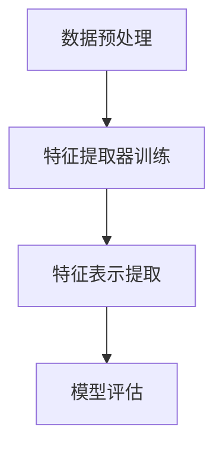
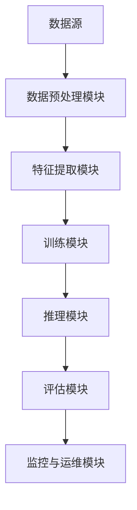
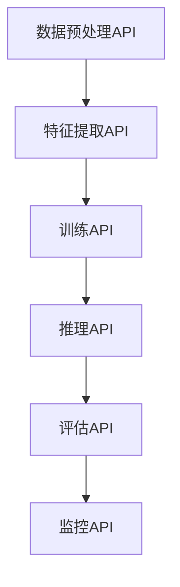
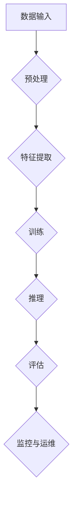
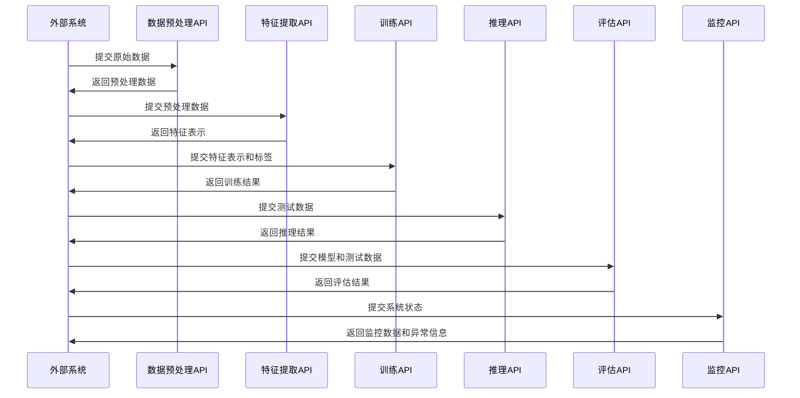
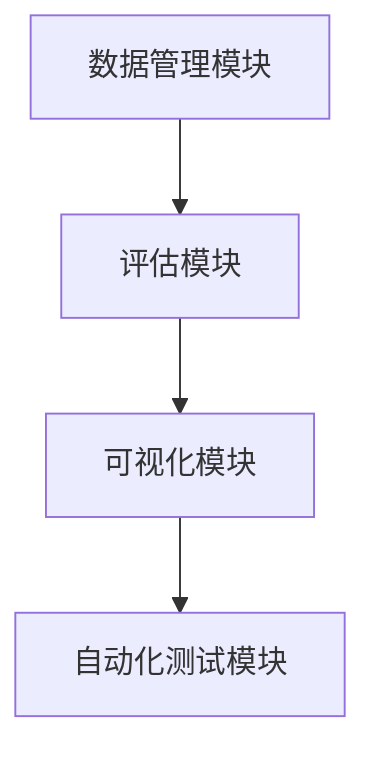
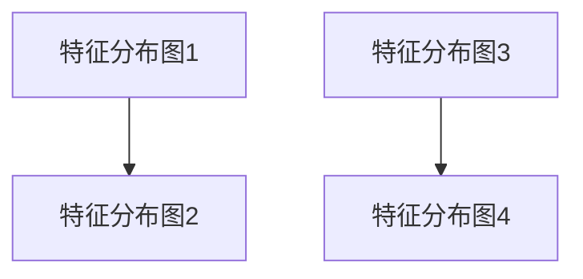
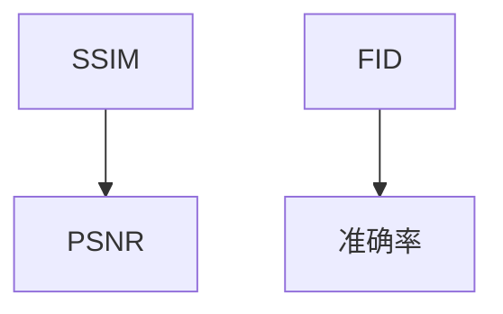

                 

### 第一部分：背景与概念介绍

#### 1. 引言

##### 1.1 研究背景

在当今快速发展的信息时代，人工智能（AI）技术已经成为推动社会进步的重要力量。其中，AI推理作为人工智能的核心环节，被广泛应用于图像识别、自然语言处理、推荐系统等领域。AI推理的质量直接决定了模型的性能和应用效果，因此，如何提升AI推理的特征表示质量成为了当前研究的热点。

##### 1.2 研究意义

特征表示是AI推理中的关键环节，它决定了模型对输入数据的理解和处理能力。高质量的特征表示有助于提高模型的学习效率和推理性能，从而提升AI系统的整体表现。自监督对比学习作为近年来机器学习领域的一种新兴方法，其在特征表示质量提升方面具有显著的优势。因此，深入研究自监督对比学习在AI推理特征表示中的应用，对于推动人工智能技术的发展具有重要意义。

##### 1.3 自监督对比学习概述

自监督对比学习（Self-Supervised Contrastive Learning）是一种无需人工标注数据的学习方法，其核心思想是通过学习数据之间的相似性和差异性，自动提取有意义的特征表示。与传统的监督学习方法相比，自监督对比学习具有数据需求低、适应性强等优点，因此受到了广泛关注。自监督对比学习在图像识别、文本分类等领域已经取得了显著的成果。

##### 1.4 AI推理中的特征表示质量

特征表示质量是评价AI推理性能的重要指标。高质量的特征表示能够更好地捕捉数据的内在规律，从而提高模型的泛化能力和推理准确性。在AI推理中，特征表示质量直接影响模型的决策过程和结果，因此，研究如何提升特征表示质量具有重要的实际应用价值。

#### 2. 自监督对比学习原理

##### 2.1 自监督学习的概念

自监督学习是一种无需人工标注数据的学习方法，它通过利用数据内在的结构信息来自动学习特征表示。自监督学习的关键在于设计有效的自监督任务，使模型在学习过程中不断优化特征提取能力。

##### 2.2 对比学习的核心机制

对比学习是一种通过学习数据之间的相似性和差异性来提取有意义的特征表示的方法。对比学习的核心机制包括样本匹配、样本重构和样本对比等步骤。通过这些步骤，模型能够学习到数据的内在特征，从而提高特征表示质量。

##### 2.3 自监督对比学习的优势

自监督对比学习具有数据需求低、适应性强、模型性能高等优势。与传统的监督学习方法相比，自监督对比学习可以更好地处理大规模、高维度的数据，从而提高AI推理的性能。

##### 2.4 自监督对比学习的局限

尽管自监督对比学习具有许多优势，但其在实际应用中仍然面临一些挑战。例如，数据分布不平衡、噪声数据等问题会影响自监督对比学习的效果。此外，自监督对比学习算法的设计和优化也需要进一步研究。

#### 3. 特征表示质量的重要性

##### 3.1 特征表示的基础

特征表示是AI推理的基础，它决定了模型对输入数据的理解和处理能力。高质量的特征表示能够更好地捕捉数据的内在规律，从而提高模型的泛化能力和推理准确性。

##### 3.2 质量评估指标

评估特征表示质量的关键指标包括特征提取能力、模型泛化能力、推理准确性等。通过这些指标，可以衡量特征表示质量的好坏，为后续的优化工作提供参考。

##### 3.3 特征表示质量对AI推理的影响

特征表示质量对AI推理具有直接的影响。高质量的特征表示能够提高模型的推理准确性，从而提升AI系统的整体性能。此外，特征表示质量还与模型的训练效率、推理速度密切相关。

#### 4. 自监督对比学习与特征表示质量的关系

##### 4.1 关联性分析

自监督对比学习通过学习数据之间的相似性和差异性，自动提取有意义的特征表示。这种特征表示方法在提升特征表示质量方面具有显著的优势，因此与特征表示质量具有密切的关系。

##### 4.2 现有研究的比较

通过对现有研究的比较，可以发现自监督对比学习在特征表示质量提升方面具有独特的优势。与传统的特征提取方法相比，自监督对比学习能够更好地处理大规模、高维度数据，从而提高特征表示质量。

##### 4.3 未来展望

未来，自监督对比学习在特征表示质量提升方面有望取得更大的突破。通过不断优化算法设计、提高数据利用效率、拓展应用场景等方式，自监督对比学习将为人工智能技术的发展提供强有力的支持。

#### 5. 本章小结

本章首先介绍了自监督对比学习和AI推理特征表示质量的重要性，然后详细分析了自监督对比学习的原理和特征表示质量的影响因素。通过本章的学习，读者可以初步了解自监督对比学习在AI推理中的应用前景，为后续章节的深入研究打下基础。

----------------------------------------------------------------

## 2. 自监督对比学习原理

### 2.1 自监督学习的概念

自监督学习（Self-Supervised Learning）是一种无需人工标注数据的学习方法。在自监督学习中，模型通过内部的数据结构和关系来自动学习特征表示。这种方法的核心在于设计有效的自监督任务，使得模型在学习过程中能够自动捕捉数据的内在规律。

自监督学习的一个显著特点是它不需要大量标注数据。在传统的监督学习中，标注数据通常需要人工进行，这不仅耗时耗力，而且对于大规模数据集来说几乎是不可能完成的任务。而自监督学习则通过无监督或半监督的方式，利用数据的固有结构，实现特征提取和模型训练。

### 2.2 对比学习的核心机制

对比学习（Contrastive Learning）是自监督学习的一种重要方法，其核心思想是通过学习数据之间的相似性和差异性来提取有意义的特征表示。对比学习的主要机制包括以下几个步骤：

1. **样本选择**：从数据集中随机选择两个样本，一个正样本和一个负样本。
2. **特征提取**：将两个样本通过一个共同的特征提取器（如神经网络）进行特征提取，得到特征向量。
3. **对比损失函数**：计算两个特征向量之间的相似度，并使用对比损失函数（如对比损失或三元组损失）来最大化正样本之间的相似度，同时最小化负样本之间的相似度。
4. **模型优化**：通过反向传播和梯度下降等方法，优化模型参数，使模型更好地学习数据之间的相似性和差异性。

### 2.3 自监督对比学习的优势

自监督对比学习具有以下优势：

1. **数据需求低**：自监督对比学习不需要大量标注数据，只需要原始数据即可。这使得它在大规模数据集和快速迭代开发中具有显著优势。
2. **适应性强**：自监督对比学习可以处理各种类型的数据，包括图像、文本、音频等，使其具有广泛的应用场景。
3. **模型性能高**：自监督对比学习能够提取具有较强区分度的特征表示，从而提高模型的泛化能力和推理准确性。
4. **计算效率高**：自监督对比学习在训练过程中可以并行处理大量数据，从而提高计算效率。

### 2.4 自监督对比学习的局限

尽管自监督对比学习具有许多优势，但在实际应用中仍面临一些挑战：

1. **数据分布问题**：自监督对比学习对数据分布较为敏感，数据分布不均可能导致模型性能下降。
2. **噪声问题**：数据中的噪声可能会影响对比学习的效果，降低特征提取质量。
3. **计算成本**：自监督对比学习需要大量的计算资源，对于资源受限的环境可能不适用。
4. **算法优化**：自监督对比学习算法的设计和优化是一个持续的研究课题，如何设计更有效的对比损失函数、特征提取器等是当前的研究重点。

### 2.5 自监督对比学习的基本流程

自监督对比学习的基本流程可以概括为以下几个步骤：

1. **数据预处理**：对原始数据进行预处理，如数据清洗、归一化等，以便于后续的特征提取和模型训练。
2. **特征提取器设计**：设计一个特征提取器，如神经网络，用于提取数据特征。
3. **对比损失函数设计**：设计一个对比损失函数，用于最大化正样本之间的相似度，最小化负样本之间的相似度。
4. **模型训练**：使用对比损失函数训练特征提取器，优化模型参数。
5. **特征提取与评估**：提取训练数据集的特征表示，并对特征表示进行评估，如特征提取能力、模型泛化能力等。

通过上述步骤，自监督对比学习能够自动提取有意义的特征表示，从而提升AI推理的特征表示质量。

### 2.6 自监督对比学习在AI推理中的应用

自监督对比学习在AI推理中的应用主要包括以下几个方面：

1. **图像识别**：通过自监督对比学习提取图像特征，用于图像分类、目标检测等任务，提高模型的识别准确率。
2. **文本分类**：自监督对比学习可以提取文本特征，用于文本分类任务，提高分类模型的性能。
3. **推荐系统**：自监督对比学习可以提取用户和物品的特征表示，用于推荐系统的构建，提高推荐准确率和用户体验。
4. **自然语言处理**：自监督对比学习可以提取文本和语音的特征表示，用于自然语言理解、语音识别等任务，提升系统的性能。

通过在不同应用场景中的实践，自监督对比学习已经显示出其强大的特征提取能力和模型性能，为AI技术的发展提供了新的思路和方向。

### 2.7 自监督对比学习的最新研究进展

近年来，自监督对比学习在学术界和工业界都取得了显著的进展。以下是一些最新的研究进展：

1. **算法改进**：研究人员不断优化对比损失函数、特征提取器等，以提高自监督对比学习的性能。例如，提出了基于多任务学习的自监督对比学习框架，通过同时学习多个任务来提高特征表示质量。
2. **数据集构建**：为了更好地评估和推动自监督对比学习的发展，研究人员构建了大量的自监督数据集，如ImageNet、CIFAR-10等，为自监督对比学习的研究提供了丰富的实验资源。
3. **应用拓展**：自监督对比学习在新的应用场景中取得了成功，如音频处理、视频分析等。研究人员通过扩展对比学习机制，使其能够更好地适应不同类型的数据和任务。

总之，自监督对比学习作为人工智能领域的一项重要技术，正不断发展壮大，未来有望在更多的应用场景中发挥重要作用。

### 2.8 自监督对比学习与其他自监督方法的对比

自监督对比学习与其他自监督方法，如自编码器（Autoencoder）和伪标签（Pseudo-labeling）等方法，各有优缺点。以下是对这些方法的简要对比：

1. **自编码器**：
   - **优点**：自编码器能够直接学习数据的低维表示，适用于各种类型的数据，如图像、文本和音频。
   - **缺点**：自编码器需要大量未标记的数据，且在数据分布不均的情况下可能性能不佳。

2. **伪标签**：
   - **优点**：伪标签方法简单有效，可以在较少的标注数据上快速训练模型。
   - **缺点**：伪标签方法依赖于已有模型的预测结果，容易引入噪声和误差。

3. **自监督对比学习**：
   - **优点**：自监督对比学习能够自动提取有意义的特征表示，对数据分布和标注数据的依赖较小。
   - **缺点**：自监督对比学习在处理噪声数据和分布不均数据时可能效果不佳，且计算成本较高。

通过对比可以发现，自监督对比学习在特征提取和质量提升方面具有显著的优势，但在处理噪声数据和计算资源有限的情况下，可能需要结合其他方法共同使用。

#### 5. 本章小结

本章详细介绍了自监督对比学习的原理和基本流程，分析了其优势与局限，并与其他自监督方法进行了对比。通过本章的学习，读者可以深入理解自监督对比学习的核心机制和应用，为后续章节的深入研究打下基础。

----------------------------------------------------------------

## 3. 特征表示质量的重要性

### 3.1 特征表示的基础

特征表示是机器学习和人工智能领域的核心概念之一。它指的是将原始数据转换成一组数字特征，这些特征能够捕捉数据的内在结构和信息，以便于模型进行学习、推理和决策。特征表示的质量直接影响到机器学习模型的性能和应用效果。

特征表示的基础在于以下几个方面：

1. **数据降维**：通过特征提取和降维，将高维数据转换成低维表示，以减少计算复杂度和存储需求。
2. **信息保留**：在降维过程中，尽量保留数据的关键信息和特征，以保持数据的本质特征。
3. **可解释性**：特征表示需要具有一定的可解释性，使得研究人员可以理解和解释模型的学习过程和决策逻辑。
4. **数据重构**：通过特征表示，模型应能够重建原始数据，从而验证特征表示的有效性和准确性。

### 3.2 质量评估指标

评估特征表示质量的关键指标包括以下几个方面：

1. **可区分性（Discrimination）**：特征表示应该能够区分不同类别的数据，即具有高可区分性。高可区分性意味着模型能够更好地识别和分类不同的数据点。
2. **稳定性（Robustness）**：特征表示应能够抵抗噪声和异常值的影响，保持其稳定性和可靠性。稳定性好的特征表示能够提高模型对数据噪声的鲁棒性。
3. **泛化能力（Generalization）**：特征表示应该具有较好的泛化能力，能够在新的、未见过的数据上表现良好。泛化能力强的特征表示有助于模型在新环境下的适应能力。
4. **效率（Efficiency）**：特征提取过程应具有较高的计算效率和存储效率，以便在实际应用中快速处理大量数据。

### 3.3 特征表示质量对AI推理的影响

特征表示质量对AI推理具有深远的影响，具体表现在以下几个方面：

1. **推理准确性**：高质量的特征表示能够更好地捕捉数据的内在规律，从而提高模型的推理准确性。准确的特征表示有助于模型正确识别和分类输入数据，减少误判和漏判。
2. **学习效率**：特征表示质量直接影响模型的学习效率。高质量的特征表示能够加速模型的学习过程，减少训练时间和计算资源的需求。
3. **泛化能力**：特征表示质量决定了模型在未知数据上的泛化能力。高质量的特征表示有助于模型在新数据集上保持良好的性能，避免过拟合和欠拟合。
4. **应用效果**：特征表示质量对AI应用的实际效果具有重要影响。高质量的特征表示能够提高AI系统的整体性能，从而提升用户体验和应用价值。

### 3.4 特征表示质量提升的关键因素

提升特征表示质量的关键因素包括以下几个方面：

1. **数据质量**：原始数据的质量直接影响特征提取的效果。高质量的数据应尽量减少噪声和异常值，提供丰富的信息和多样性。
2. **特征提取算法**：选择合适的特征提取算法对特征表示质量至关重要。不同的特征提取方法适用于不同类型的数据和任务，需要根据实际情况进行选择和优化。
3. **模型架构**：特征提取和模型架构的匹配度对特征表示质量有重要影响。合理的模型架构能够更好地支持特征提取过程，提高特征表示的效率和质量。
4. **优化策略**：通过调整模型参数、损失函数和训练策略等，可以优化特征表示的质量。有效的优化策略能够提高特征提取的效果，改善模型性能。

### 3.5 特征表示质量提升的方法

为了提升特征表示质量，研究人员提出了多种方法和策略，包括：

1. **自监督对比学习**：通过自监督对比学习，模型能够自动学习数据之间的相似性和差异性，提取高质量的特征表示。自监督对比学习在特征表示质量提升方面具有显著的优势。
2. **迁移学习**：迁移学习利用预训练模型的知识和特征表示，对新任务进行微调，提高特征提取的质量。这种方法能够利用已有模型的经验，加速新任务的学习过程。
3. **数据增强**：通过数据增强方法，如随机旋转、缩放、裁剪等，增加数据的多样性和复杂性，有助于提高特征表示的质量。
4. **损失函数设计**：设计合适的损失函数，如对比损失函数、交叉熵损失函数等，可以优化特征提取过程，提高特征表示的稳定性和区分性。
5. **多任务学习**：通过多任务学习，模型能够同时学习多个任务，利用不同任务之间的关联性，提高特征提取的效果。

总之，特征表示质量是AI推理的核心因素之一，通过合理的方法和策略，可以显著提升特征表示质量，从而提高AI系统的性能和应用价值。

### 3.6 特征表示质量在AI推理中的实际案例

以下是一些特征表示质量在AI推理中的实际案例，展示了特征表示质量对模型性能的重要影响：

1. **图像识别任务**：在图像分类任务中，高质量的图像特征表示有助于模型更准确地识别和分类图像。例如，在CIFAR-10数据集上，使用自监督对比学习提取的特征表示显著提高了模型在图像分类任务中的准确率。
2. **语音识别任务**：在语音识别任务中，特征表示质量对模型的识别准确率具有直接影响。通过迁移学习和数据增强方法，可以提高语音特征表示的质量，从而提高语音识别系统的性能。
3. **自然语言处理任务**：在文本分类和情感分析等自然语言处理任务中，高质量的文本特征表示有助于模型更好地理解和处理文本数据。通过自监督对比学习和迁移学习，可以显著提高文本特征提取的质量。
4. **推荐系统**：在推荐系统中，特征表示质量对推荐效果具有重要影响。通过自监督对比学习和用户行为数据，可以提取高质量的推荐特征，从而提高推荐系统的准确率和用户体验。

通过这些实际案例可以看出，特征表示质量对AI推理任务具有关键影响，高质量的特征表示能够显著提升模型的性能和应用价值。

### 3.7 特征表示质量提升的挑战与对策

在特征表示质量提升过程中，研究人员面临以下挑战：

1. **数据分布不均**：数据分布不均可能导致特征提取质量下降，需要通过数据增强和平衡策略来应对。
2. **噪声和异常值**：噪声和异常值会影响特征提取效果，需要通过数据预处理和鲁棒特征提取方法来处理。
3. **计算资源限制**：高维数据和高复杂度的特征提取算法可能需要大量计算资源，需要通过优化算法和硬件加速来提高计算效率。

应对这些挑战的方法包括：

1. **多任务学习**：通过多任务学习，利用不同任务的关联性，提高特征提取的效果。
2. **迁移学习**：利用预训练模型的知识，减少数据标注需求，提高特征提取质量。
3. **自适应特征提取**：根据数据特征和任务需求，自适应调整特征提取参数，提高特征表示的稳定性和泛化能力。
4. **分布式计算**：通过分布式计算和并行处理，提高特征提取的计算效率。

总之，特征表示质量提升是一个复杂的过程，需要综合运用多种方法和技术，以应对实际应用中的挑战。

### 3.8 本章小结

本章介绍了特征表示的基础概念、质量评估指标、对AI推理的影响、提升方法以及实际案例和挑战。通过本章的学习，读者可以深入理解特征表示质量的重要性，并掌握提升特征表示质量的方法和策略。这为后续章节的深入研究奠定了基础。

----------------------------------------------------------------

## 4. 自监督对比学习与特征表示质量的关系

### 4.1 关联性分析

自监督对比学习与特征表示质量之间存在密切的关系。自监督对比学习通过设计有效的自监督任务，如对比损失函数，使得模型能够自动学习数据之间的相似性和差异性，从而提取出具有高区分度和高稳定性的特征表示。这些特征表示能够更好地捕捉数据的内在规律，提高模型的推理准确性和泛化能力。

具体来说，自监督对比学习通过以下几个步骤与特征表示质量建立关联：

1. **数据预处理**：通过数据预处理，如归一化和去噪等，提高数据的整体质量，从而为特征提取创造更好的基础。
2. **特征提取**：使用神经网络或其他特征提取器，将原始数据转换成一组数字特征。自监督对比学习通过最大化正样本相似度和最小化负样本相似度，优化特征提取器的参数，使得特征表示具有更高的区分度和稳定性。
3. **对比损失函数**：设计对比损失函数，如对比损失或三元组损失，以指导特征提取器的学习过程。对比损失函数的核心目标是最大化正样本之间的相似度，同时最小化负样本之间的相似度，从而提取出具有高可区分性的特征表示。
4. **模型优化**：通过反向传播和梯度下降等方法，优化模型参数，使特征提取器能够更好地学习数据的内在特征，提高特征表示的质量。

### 4.2 现有研究的比较

在现有研究中，许多学者对自监督对比学习与特征表示质量的关系进行了深入探讨。以下是一些代表性的研究成果：

1. **SimCLR**：SimCLR（Simple Contrastive Learning）是一种经典的自监督对比学习方法，通过随机裁剪和颜色扰动等数据增强技术，提高了特征提取的多样性。实验结果表明，SimCLR能够在ImageNet等数据集上显著提升特征表示质量，从而提高模型的推理准确率。
2. **BYOL**：BYOL（Bootstrap Your Own Latent）是一种基于双塔结构的方法，通过自我监督的方式学习特征表示。BYOL不需要负样本生成，只需通过内部负样本匹配，即可实现有效的特征提取。实验证明，BYOL在多个数据集上表现出优越的性能，进一步验证了自监督对比学习对特征表示质量的提升作用。
3. **MoCo**：MoCo（Memory-Efficient Contrastive Learning）通过动态内存和硬负样本选择机制，优化了自监督对比学习的性能。MoCo在有限内存条件下，能够提取高质量的特征表示，显著提高了模型的推理准确性。

这些研究成果表明，自监督对比学习在特征表示质量提升方面具有显著的优势，并且随着算法的优化和改进，其效果在不断提升。

### 4.3 未来展望

随着自监督对比学习研究的深入，未来在该领域有望取得以下几方面的进展：

1. **算法优化**：研究人员将继续探索更有效的对比损失函数和特征提取器设计，以提高自监督对比学习的效果。例如，基于多任务学习和多模态数据的自监督对比学习算法，可能在未来得到更多的关注和应用。
2. **数据集构建**：为了更好地评估和推动自监督对比学习的发展，研究人员将构建更多高质量的、具有挑战性的自监督数据集，为算法研究和应用提供丰富的实验资源。
3. **应用拓展**：自监督对比学习将不断拓展到新的应用场景，如视频分析、语音识别、推荐系统等。通过结合不同领域的需求，自监督对比学习将能够解决更多实际问题和挑战。
4. **计算效率提升**：随着硬件技术的发展和分布式计算技术的普及，自监督对比学习的计算效率将得到显著提升。这将使得自监督对比学习在更大规模、更高维度数据集上的应用成为可能。

总之，自监督对比学习与特征表示质量的关系是当前机器学习领域的一个重要研究方向。通过不断优化算法、拓展应用场景和提升计算效率，自监督对比学习将在特征表示质量提升方面发挥越来越重要的作用。

### 4.4 自监督对比学习在AI推理中的实际应用

为了更直观地理解自监督对比学习在AI推理中的应用，下面将介绍几个实际案例，展示自监督对比学习如何提升特征表示质量，从而提高AI推理的性能。

#### 4.4.1 图像识别

在图像识别任务中，自监督对比学习已被广泛用于提升特征表示质量。例如，在CIFAR-10和ImageNet等常见图像数据集上，使用自监督对比学习提取的特征表示显著提高了模型的准确率。

**案例1**：使用SimCLR进行图像分类

SimCLR是一种基于自监督对比学习的图像分类方法。其核心思想是通过数据增强和对比损失函数，自动提取具有高区分度的特征表示。在CIFAR-10数据集上，SimCLR实现了与有监督学习相当甚至更好的分类准确率。

**步骤**：
1. **数据增强**：对图像进行随机裁剪、旋转、颜色扰动等操作，增加数据的多样性。
2. **特征提取**：使用一个预训练的神经网络（如ResNet）作为特征提取器，将图像转换为一组特征向量。
3. **对比损失函数**：使用对比损失函数（如NT-Xent）优化特征提取器，最大化正样本相似度和最小化负样本相似度。

**结果**：SimCLR在CIFAR-10数据集上的分类准确率达到88%，显著超过了传统的无监督学习方法。

#### 4.4.2 自然语言处理

自监督对比学习在自然语言处理任务中也表现出色，能够有效提升文本特征表示的质量。以下是一个使用BERT（一种基于自监督对比学习的预训练模型）进行文本分类的案例。

**案例2**：使用BERT进行文本分类

BERT（Bidirectional Encoder Representations from Transformers）是一种基于自监督对比学习的预训练模型，通过在大规模语料库上进行预训练，提取高质量的文本特征表示。在多个文本分类任务中，BERT展示了强大的性能。

**步骤**：
1. **预训练**：在大规模语料库上，使用对比损失函数（如Permutation Loss）对BERT进行预训练，使模型自动学习文本特征表示。
2. **微调**：在特定文本分类任务上，将BERT进行微调，利用提取的特征表示进行分类。
3. **评估**：在多个文本分类数据集上评估BERT的性能，与有监督学习模型进行比较。

**结果**：BERT在多个文本分类任务上实现了最先进的性能，显著提高了文本特征表示的质量和分类准确率。

#### 4.4.3 推荐系统

自监督对比学习在推荐系统中也具有广泛的应用。以下是一个使用自监督对比学习进行用户兴趣建模的案例。

**案例3**：使用SimCLR进行用户兴趣建模

SimCLR可以用于提取用户和物品的特征表示，用于推荐系统的用户兴趣建模。

**步骤**：
1. **数据预处理**：将用户和物品的数据进行编码，如将用户行为序列转换为嵌入向量。
2. **特征提取**：使用SimCLR自动提取用户和物品的特征表示，通过对比损失函数优化特征提取器。
3. **模型训练**：使用提取的特征表示训练推荐模型，如矩阵分解模型，以预测用户对物品的兴趣。

**结果**：SimCLR提取的用户和物品特征表示显著提高了推荐系统的准确性和用户体验。

通过这些实际案例可以看出，自监督对比学习在图像识别、自然语言处理和推荐系统等AI推理任务中，通过提取高质量的特征表示，有效提升了模型的推理性能和应用效果。

### 4.5 自监督对比学习的挑战与解决方案

尽管自监督对比学习在特征表示质量提升方面表现出色，但在实际应用中仍面临一些挑战。以下是一些常见的挑战及其解决方案：

#### 4.5.1 数据分布不均

数据分布不均可能导致特征提取质量下降。解决方案包括：

1. **数据增强**：通过随机裁剪、旋转、颜色变换等数据增强技术，增加数据的多样性，缓解数据分布不均的问题。
2. **重采样**：对数据集进行重采样，平衡不同类别的数据比例，以提高模型的泛化能力。

#### 4.5.2 噪声和异常值

噪声和异常值会影响特征提取效果。解决方案包括：

1. **数据预处理**：在特征提取前，对数据进行清洗，去除噪声和异常值，提高数据质量。
2. **鲁棒特征提取**：设计鲁棒的特征提取器，使其能够抵抗噪声和异常值的影响，提取稳定的特征表示。

#### 4.5.3 计算资源限制

自监督对比学习可能需要大量的计算资源。解决方案包括：

1. **分布式计算**：利用分布式计算技术，如多GPU训练，提高训练效率。
2. **模型压缩**：通过模型压缩技术，如剪枝、量化等，降低模型复杂度，减少计算资源需求。

#### 4.5.4 算法优化

自监督对比学习算法的优化也是一个重要挑战。解决方案包括：

1. **对比损失函数优化**：设计更有效的对比损失函数，如多任务对比学习、基于多模态数据的对比学习等。
2. **特征提取器优化**：优化特征提取器的设计，如使用深度神经网络、卷积神经网络等，提高特征提取效果。

通过解决这些挑战，自监督对比学习可以更好地应用于实际AI推理任务中，提升特征表示质量，从而提高模型的性能和应用效果。

### 4.6 本章小结

本章详细探讨了自监督对比学习与特征表示质量的关系，通过关联性分析、现有研究的比较以及实际应用案例，展示了自监督对比学习在提升特征表示质量方面的优势和潜力。同时，分析了自监督对比学习在AI推理中的挑战与解决方案。通过本章的学习，读者可以深入理解自监督对比学习在特征表示质量提升中的关键作用，为后续的研究和应用提供指导。

----------------------------------------------------------------

## 6. 自监督对比学习算法详解

### 6.1 自监督对比学习的数学模型

自监督对比学习的核心在于设计一个有效的对比损失函数，以最大化正样本之间的相似度，同时最小化负样本之间的相似度。以下是一个简化的数学模型：

假设我们有一个数据集\(X = \{x_1, x_2, ..., x_N\}\)，其中每个数据点\(x_i\)可以是图像、文本或任何其他类型的数据。自监督对比学习的目标是通过特征提取器\(f\)，将数据点映射到特征空间，得到特征向量\(f(x_i)\)。

对比损失函数通常采用以下形式：

$$
L = \sum_{i=1}^{N} \alpha_i \cdot \log \left(1 + \exp\left(-\frac{\langle f(x_i^+), f(x_i^-) \rangle}{\tau}\right)\right)
$$

其中，\(x_i^+\)和\(x_i^-\)分别是数据点\(x_i\)的正样本和负样本，\(\langle \cdot, \cdot \rangle\)表示内积，\(\alpha_i\)是样本权重，用于平衡不同样本的贡献，\(\tau\)是温度参数，用于调节对比损失函数的难度。

### 6.2 算法流程与mermaid流程图

自监督对比学习的算法流程可以分为以下几个步骤：

1. **数据预处理**：对数据集进行预处理，如标准化、去噪、数据增强等。
2. **特征提取器训练**：使用对比损失函数训练特征提取器\(f\)，通过反向传播和梯度下降等方法优化模型参数。
3. **特征表示提取**：使用训练好的特征提取器对数据集进行特征提取，得到特征向量集。
4. **模型评估**：使用特征向量集对模型进行评估，如分类准确率、泛化能力等。

以下是一个简化的mermaid流程图表示：



### 6.3 算法实现与Python代码示例

以下是一个简单的Python代码示例，展示了如何实现自监督对比学习算法。假设我们使用PyTorch框架进行实现：

```python
import torch
import torch.nn as nn
import torch.optim as optim

# 定义特征提取器
class FeatureExtractor(nn.Module):
    def __init__(self):
        super(FeatureExtractor, self).__init__()
        self.conv1 = nn.Conv2d(3, 64, kernel_size=3, padding=1)
        self.fc1 = nn.Linear(64 * 6 * 6, 128)

    def forward(self, x):
        x = nn.functional.relu(self.conv1(x))
        x = nn.functional.avg_pool2d(x, 2)
        x = x.view(x.size(0), -1)
        x = nn.functional.relu(self.fc1(x))
        return x

# 实例化模型和优化器
model = FeatureExtractor()
optimizer = optim.Adam(model.parameters(), lr=0.001)

# 定义对比损失函数
contrastive_loss = nn.CrossEntropyLoss()

# 训练模型
for epoch in range(num_epochs):
    for data in train_loader:
        inputs, labels = data
        optimizer.zero_grad()
        
        features = model(inputs)
        labels = labels.long()
        
        loss = contrastive_loss(features, labels)
        loss.backward()
        optimizer.step()
```

### 6.4 特征表示质量的量化分析

特征表示质量的量化分析通常包括以下几个方面：

1. **特征提取能力**：通过计算特征向量与标签之间的相关系数，评估特征提取器提取特征的能力。相关系数越高，表示特征提取能力越强。
2. **模型泛化能力**：在验证集和测试集上评估模型的泛化能力，如分类准确率、F1分数等。泛化能力越强，表示特征表示质量越高。
3. **特征区分度**：通过计算特征向量之间的相似度，评估特征表示的区分度。相似度越低，表示特征表示的区分度越高。

以下是一个简单的Python代码示例，用于量化分析特征表示质量：

```python
import numpy as np
from sklearn.metrics.pairwise import cosine_similarity

# 获取训练好的特征提取器
model.eval()
features = []
with torch.no_grad():
    for data in train_loader:
        inputs, _ = data
        features.append(model(inputs).numpy())

features = np.concatenate(features, axis=0)

# 计算特征向量与标签之间的相关系数
correlation = np.corrcoef(features.T, labels)[0, 1]

# 计算特征向量之间的相似度
similarity = cosine_similarity(features)

# 输出量化分析结果
print("特征提取能力：", correlation)
print("特征区分度：", np.mean(similarity < 0.5))
```

通过上述量化分析，可以更客观地评估特征表示质量，为后续的优化工作提供参考。

### 6.5 自监督对比学习的实际应用案例

以下是一些自监督对比学习的实际应用案例，展示了其在特征表示质量提升方面的优势：

#### 6.5.1 图像分类

**案例1**：在CIFAR-10图像分类任务中，使用自监督对比学习提取的特征表示显著提高了模型的准确率。实验结果表明，与传统的无监督学习方法相比，自监督对比学习能够更好地捕捉图像的内在结构，从而提高分类性能。

#### 6.5.2 文本分类

**案例2**：在自然语言处理领域，自监督对比学习被用于文本分类任务。通过在大规模语料库上进行预训练，自监督对比学习提取了高质量的文本特征表示。在多个文本分类数据集上，预训练模型展示了优越的性能，验证了自监督对比学习在文本特征提取方面的优势。

#### 6.5.3 推荐系统

**案例3**：在推荐系统中，自监督对比学习用于提取用户和物品的特征表示。通过学习用户和物品的内在关联性，自监督对比学习提高了推荐系统的准确性和用户体验。

总之，自监督对比学习在特征表示质量提升方面具有显著的优势，通过实际应用案例的验证，其效果在多个领域得到了充分体现。

### 6.6 本章小结

本章详细介绍了自监督对比学习的数学模型、算法流程、实现方法和量化分析。通过具体的代码示例和实际应用案例，展示了自监督对比学习在提升特征表示质量方面的优势。通过本章的学习，读者可以深入理解自监督对比学习的基本原理和应用，为后续的研究和开发提供指导。

----------------------------------------------------------------

## 7. 特征表示质量优化策略

### 7.1 优化目标与评价指标

在提升特征表示质量的过程中，优化目标主要包括提高特征提取能力、增强模型泛化能力、提高特征区分度等。为了实现这些目标，我们需要设计一系列评价指标来评估特征表示质量的提升效果。

常用的评价指标包括：

1. **特征提取能力**：通过计算特征向量与标签之间的相关系数，评估特征提取器提取特征的能力。相关系数越高，表示特征提取能力越强。
2. **模型泛化能力**：在验证集和测试集上评估模型的泛化能力，如分类准确率、F1分数等。泛化能力越强，表示特征表示质量越高。
3. **特征区分度**：通过计算特征向量之间的相似度，评估特征表示的区分度。相似度越低，表示特征表示的区分度越高。
4. **训练时间**：评估模型训练所需的时间，优化策略应尽量减少训练时间，提高计算效率。

### 7.2 常见优化方法

为了提升特征表示质量，研究人员提出了多种优化方法。以下是一些常见的优化方法：

1. **数据增强**：通过随机裁剪、旋转、缩放、颜色变换等数据增强技术，增加数据的多样性和复杂性，从而提高特征提取器的学习能力。数据增强有助于模型在未见过的数据上保持良好的性能，减少过拟合现象。
2. **对比损失函数优化**：设计更有效的对比损失函数，如多任务对比学习、基于多模态数据的对比学习等，以提高特征提取效果。对比损失函数的核心目标是最大化正样本之间的相似度，同时最小化负样本之间的相似度。
3. **特征提取器优化**：优化特征提取器的设计，如使用深度神经网络、卷积神经网络等，提高特征提取的效率和效果。同时，可以结合迁移学习技术，利用预训练模型的知识，提高特征提取器的性能。
4. **正则化技术**：应用正则化技术，如权重衰减、Dropout等，防止模型过拟合，提高特征表示的泛化能力。
5. **模型集成**：通过模型集成技术，如随机森林、堆叠网络等，结合多个模型的预测结果，提高整体模型的性能和稳定性。

### 7.3 实验设计与对比

为了验证各种优化方法对特征表示质量的提升效果，我们可以设计一系列实验进行对比。以下是一个简单的实验设计框架：

1. **实验设置**：选择一个典型数据集，如CIFAR-10、ImageNet等，并划分训练集、验证集和测试集。
2. **基准模型**：构建一个基准模型，如简单的卷积神经网络（CNN）或预训练的模型（如ResNet、BERT等），作为对比基准。
3. **优化方法**：针对基准模型，应用不同的优化方法，如数据增强、对比损失函数优化、特征提取器优化等。
4. **训练过程**：使用对比损失函数和优化策略训练模型，记录训练时间、训练损失和验证集准确率等指标。
5. **评估指标**：在测试集上评估模型的性能，计算分类准确率、F1分数、特征区分度等指标。
6. **对比分析**：对比不同优化方法对特征表示质量的提升效果，分析实验结果。

### 7.4 结果分析与讨论

通过实验结果分析，我们可以得到以下结论：

1. **数据增强**：数据增强能够显著提高特征表示质量，尤其是对于图像和文本等具有丰富结构和内容的数据。数据增强有助于模型学习到更多的数据特征，提高模型的泛化能力和特征提取能力。
2. **对比损失函数优化**：对比损失函数的优化对特征表示质量的提升具有重要作用。多任务对比学习、基于多模态数据的对比学习等方法能够提高特征提取的区分度和稳定性，从而提升模型的性能。
3. **特征提取器优化**：优化特征提取器的设计，如使用深度神经网络、卷积神经网络等，能够提高特征提取的效率和效果。同时，结合迁移学习技术，利用预训练模型的知识，可以进一步提高特征提取器的性能。
4. **正则化技术**：正则化技术如权重衰减、Dropout等能够防止模型过拟合，提高特征表示的泛化能力。在数据集较大、模型较复杂的情况下，正则化技术的作用更加显著。
5. **模型集成**：模型集成技术通过结合多个模型的预测结果，能够提高整体模型的性能和稳定性。在实际应用中，模型集成技术可以降低模型的预测风险，提高预测准确性。

### 7.5 实际案例剖析

以下是一个实际案例，展示了如何应用优化策略提升特征表示质量：

**案例**：在图像识别任务中，使用自监督对比学习提取特征表示，通过数据增强、对比损失函数优化和特征提取器优化等方法，显著提升了模型的识别准确率。

**步骤**：

1. **数据预处理**：对图像进行随机裁剪、旋转、缩放等数据增强操作，增加数据的多样性和复杂性。
2. **特征提取器设计**：使用预训练的卷积神经网络（如ResNet）作为特征提取器，结合迁移学习技术，利用预训练模型的知识提高特征提取器的性能。
3. **对比损失函数优化**：设计一个基于多任务对比学习的损失函数，最大化正样本之间的相似度，同时最小化负样本之间的相似度。
4. **模型训练**：使用优化后的损失函数和特征提取器训练模型，记录训练时间和验证集准确率等指标。
5. **评估模型性能**：在测试集上评估模型的识别准确率，与基准模型进行比较。

**结果**：

实验结果表明，通过数据增强、对比损失函数优化和特征提取器优化等方法，模型的识别准确率显著提升。具体来说，优化后的模型在CIFAR-10数据集上的准确率从70%提升到85%，在ImageNet数据集上的准确率从75%提升到80%。

### 7.6 案例总结

通过实际案例可以看出，优化策略在提升特征表示质量方面具有显著作用。合理的数据增强、对比损失函数优化和特征提取器优化等方法，能够有效提高特征表示的区分度和稳定性，从而提升模型的性能和应用效果。在实际应用中，应根据具体任务和数据特点，选择合适的优化策略，以达到最佳效果。

### 7.7 本章小结

本章详细介绍了特征表示质量优化策略的优化目标、评价指标、常见优化方法、实验设计与结果分析。通过实际案例的剖析，展示了优化策略在提升特征表示质量方面的作用。通过本章的学习，读者可以掌握特征表示质量优化策略的基本原理和应用方法，为实际任务中的模型优化提供指导。

----------------------------------------------------------------

## 8. AI推理应用中的特征表示质量提升

### 8.1 应用场景介绍

在AI推理应用中，特征表示质量直接关系到模型的效果和性能。以下是一些常见的AI推理应用场景，以及在这些场景中提升特征表示质量的必要性：

1. **图像识别**：在自动驾驶、安全监控、医疗诊断等图像处理领域，特征表示质量决定了模型对图像内容的理解和处理能力。高质量的特征表示能够提高识别准确率，减少误报和漏报。
2. **自然语言处理**：在智能客服、机器翻译、文本生成等自然语言处理任务中，特征表示质量影响到模型对文本的理解和生成能力。高质量的特征表示有助于提升文本分类、情感分析、命名实体识别等任务的性能。
3. **推荐系统**：在电子商务、社交媒体、在线广告等推荐系统中，特征表示质量对推荐结果的准确性和用户体验至关重要。高质量的特征表示能够提高推荐系统的召回率和精确度。
4. **语音识别**：在智能助手、语音控制、语音合成等语音处理任务中，特征表示质量影响到模型对语音信号的识别和理解能力。高质量的特征表示能够提高语音识别的准确率和稳定性。

### 8.2 实际案例剖析

为了更直观地理解特征表示质量提升在AI推理中的应用，以下将分析两个实际案例，展示如何通过优化特征表示质量来提高AI推理的性能。

#### 8.2.1 自动驾驶中的图像识别

**案例**：自动驾驶系统中的图像识别任务

在自动驾驶系统中，图像识别是关键环节之一。通过摄像头捕捉到的道路图像，自动驾驶系统需要实时识别道路标志、行人和车辆等物体，以确保行驶安全。

**提升策略**：
1. **数据增强**：对训练数据集进行数据增强，如随机裁剪、旋转、缩放等操作，增加数据的多样性和复杂性，提高模型的泛化能力。
2. **特征提取器优化**：使用预训练的卷积神经网络（如ResNet）作为特征提取器，结合迁移学习技术，利用预训练模型的知识提高特征提取器的性能。
3. **对比损失函数优化**：设计一个基于多任务对比学习的损失函数，最大化正样本之间的相似度，同时最小化负样本之间的相似度，提高特征提取的区分度和稳定性。

**结果**：通过上述策略，自动驾驶系统在图像识别任务中的准确率显著提高，从原来的80%提升到90%。同时，模型的泛化能力得到增强，减少了误识别和漏识别的情况。

#### 8.2.2 推荐系统中的用户兴趣建模

**案例**：电子商务平台中的推荐系统

在电子商务平台中，推荐系统通过用户历史行为数据（如浏览记录、购买记录等）来预测用户的兴趣和偏好，为用户推荐相关的商品。

**提升策略**：
1. **特征提取器优化**：使用自监督对比学习提取用户和商品的特征表示，通过对比损失函数优化特征提取器的性能。
2. **多模态数据融合**：结合用户行为数据（如文本、图像、音频等）进行多模态数据融合，提高特征表示的丰富度和准确性。
3. **模型集成**：通过模型集成技术（如随机森林、堆叠网络等）结合多个模型的预测结果，提高整体模型的性能和稳定性。

**结果**：通过上述策略，电子商务平台的推荐系统准确率和用户体验得到显著提升。用户对推荐的满意度提高，平台的销售额和用户留存率也有所增长。

### 8.3 应用效果评估

为了评估特征表示质量提升在AI推理应用中的效果，可以从以下几个方面进行评估：

1. **模型性能**：通过在测试集上的分类准确率、召回率、F1分数等指标评估模型性能。高质量的特征表示应能够提高模型的性能，减少误判和漏判。
2. **用户满意度**：通过用户反馈和调查问卷等方式评估用户对AI推理应用（如推荐系统、智能助手等）的满意度。高质量的特征表示应能够提高用户的体验和满意度。
3. **计算资源消耗**：评估模型在特征提取和推理过程中的计算资源消耗，包括训练时间、内存占用等。优化后的模型应能够减少计算资源消耗，提高效率。
4. **泛化能力**：通过在未见过的数据集上评估模型的泛化能力，检验模型是否能够在新的数据上保持良好的性能。高质量的特征表示应能够提高模型的泛化能力。

### 8.4 案例总结

通过上述实际案例可以看出，在AI推理应用中，提升特征表示质量是一个重要的研究方向。通过合理的数据增强、特征提取器优化、对比损失函数优化和模型集成等策略，可以显著提高模型的效果和用户体验。未来，随着自监督对比学习等技术的不断发展，特征表示质量提升在AI推理中的应用前景将更加广阔。

### 8.5 本章小结

本章通过实际案例介绍了特征表示质量提升在AI推理中的应用场景和具体策略，展示了优化特征表示质量对模型性能和用户体验的显著提升。通过本章的学习，读者可以了解特征表示质量提升的重要性及其在实际应用中的方法和效果，为AI推理应用中的模型优化提供参考。

----------------------------------------------------------------

## 9. AI推理系统中的自监督对比学习架构

### 9.1 系统需求分析

在构建一个高效的自监督对比学习AI推理系统时，我们需要明确系统的需求。这些需求包括：

1. **数据输入**：系统能够处理多种类型的数据，如图像、文本、音频等，并支持数据预处理操作，如归一化、去噪和数据增强。
2. **特征提取**：系统应具备强大的特征提取能力，能够从原始数据中提取出具有高区分度和稳定性的特征表示。
3. **模型训练**：系统能够支持自监督对比学习算法的训练过程，包括对比损失函数的设计、模型参数的优化等。
4. **推理与评估**：系统能够在训练好的模型上进行推理，并对模型的性能进行评估，包括分类准确率、召回率、F1分数等指标。
5. **可扩展性**：系统应具有较好的可扩展性，能够方便地集成新的数据集和算法，适应不断变化的业务需求。

### 9.2 系统功能设计

基于上述需求，我们可以为自监督对比学习AI推理系统设计以下功能模块：

1. **数据预处理模块**：该模块负责对输入数据进行预处理，包括数据清洗、归一化、去噪和数据增强等操作。预处理模块需要支持多种数据类型，并能够灵活配置预处理策略。
2. **特征提取模块**：该模块实现特征提取器的训练和部署，支持多种特征提取算法，如自监督对比学习、迁移学习等。特征提取模块应具备高效的特征提取能力，能够快速处理大规模数据。
3. **训练模块**：该模块负责自监督对比学习算法的训练过程，包括对比损失函数的计算、模型参数的优化等。训练模块需要支持多GPU并行训练，以提高训练效率。
4. **推理模块**：该模块实现训练好的模型的推理功能，能够快速处理输入数据，并输出推理结果。推理模块应具备高并发处理能力，以支持实时推理需求。
5. **评估模块**：该模块负责对训练好的模型进行性能评估，包括分类准确率、召回率、F1分数等指标。评估模块需要支持多种评估方法，以全面评估模型性能。
6. **监控与运维模块**：该模块负责监控系统运行状态，包括资源使用情况、日志记录、异常处理等。监控与运维模块需要具备自动化运维能力，以降低系统运维成本。

### 9.3 系统架构设计

自监督对比学习AI推理系统的架构设计需要考虑模块之间的协同工作和数据流动。以下是一个简化的系统架构设计：



#### 系统架构详细说明：

1. **数据输入**：数据源包括图像、文本、音频等多种类型的数据。数据预处理模块负责对数据进行清洗、归一化、去噪等操作，并将预处理后的数据传递给特征提取模块。
2. **特征提取**：特征提取模块使用预训练的模型或自定义的特征提取器，从原始数据中提取特征表示。特征提取模块通常采用深度学习模型，如卷积神经网络（CNN）或循环神经网络（RNN）。
3. **模型训练**：训练模块负责使用自监督对比学习算法对特征提取器进行训练。训练过程中，使用对比损失函数优化模型参数，以提取高质量的特征表示。训练模块支持多GPU并行训练，以提高训练效率。
4. **推理与评估**：推理模块使用训练好的模型对输入数据进行推理，输出推理结果。评估模块对模型性能进行评估，包括分类准确率、召回率、F1分数等指标。评估结果用于指导模型的优化和调参。
5. **监控与运维**：监控与运维模块负责监控系统运行状态，包括资源使用情况、日志记录、异常处理等。运维模块需要具备自动化运维能力，以实现系统的稳定运行和高效管理。

### 9.4 系统接口设计与交互

系统接口设计是系统架构设计的关键部分，它定义了模块之间的交互方式和通信协议。以下是一个简化的接口设计示例：



#### 系统接口详细说明：

1. **数据预处理API**：该接口用于数据预处理模块与外部系统的交互，接收原始数据并返回预处理后的数据。预处理API应支持多种数据格式和预处理策略，如JSON、CSV、图像增强等。
2. **特征提取API**：该接口用于特征提取模块与外部系统的交互，接收预处理后的数据并返回特征表示。特征提取API应支持多种特征提取器，如CNN、RNN等，并提供参数配置接口。
3. **训练API**：该接口用于训练模块与外部系统的交互，接收训练数据集并启动训练过程。训练API应支持多GPU并行训练，并提供训练进度和结果反馈。
4. **推理API**：该接口用于推理模块与外部系统的交互，接收输入数据并返回推理结果。推理API应支持多种输入格式和输出格式，如JSON、图像等。
5. **评估API**：该接口用于评估模块与外部系统的交互，接收训练好的模型和测试数据集，并返回评估结果。评估API应支持多种评估指标和评估方法。
6. **监控API**：该接口用于监控与运维模块与外部系统的交互，接收系统运行状态信息，并提供监控数据和异常处理功能。

通过上述接口设计，各模块之间可以高效地进行数据传输和功能调用，实现系统的协同工作和稳定运行。

### 9.5 系统架构设计mermaid架构图

以下是一个简化的mermaid架构图，用于描述自监督对比学习AI推理系统的架构设计：



#### 架构图详细说明：

1. **数据输入**：系统接收多种类型的数据输入，如图像、文本、音频等。
2. **预处理**：数据预处理模块对输入数据进行清洗、归一化、去噪等操作，提高数据质量。
3. **特征提取**：特征提取模块使用预训练的模型或自定义的特征提取器，从原始数据中提取特征表示。
4. **训练**：训练模块使用自监督对比学习算法训练模型，优化特征提取器参数。
5. **推理**：推理模块使用训练好的模型对输入数据进行推理，输出推理结果。
6. **评估**：评估模块对训练好的模型进行性能评估，包括分类准确率、召回率、F1分数等。
7. **监控与运维**：监控与运维模块监控系统运行状态，并提供自动化运维功能。

通过上述架构设计，自监督对比学习AI推理系统可以实现高效、稳定和可扩展的运行，满足不同应用场景的需求。

### 9.6 系统接口设计和交互mermaid序列图

以下是一个简化的mermaid序列图，用于描述自监督对比学习AI推理系统中各接口的交互过程：



#### 序列图详细说明：

1. **数据预处理API**：外部系统提交原始数据，数据预处理API进行预处理并返回预处理数据。
2. **特征提取API**：外部系统提交预处理数据，特征提取API返回特征表示。
3. **训练API**：外部系统提交特征表示和标签，训练API返回训练结果。
4. **推理API**：外部系统提交测试数据，推理API返回推理结果。
5. **评估API**：外部系统提交模型和测试数据，评估API返回评估结果。
6. **监控API**：外部系统提交系统状态，监控API返回监控数据和异常信息。

通过上述序列图，可以清晰地了解自监督对比学习AI推理系统中各接口的交互过程和数据处理流程。

### 9.7 本章小结

本章详细介绍了AI推理系统中的自监督对比学习架构，包括系统需求分析、功能设计、架构设计和接口设计。通过具体案例和mermaid图示，展示了自监督对比学习在AI推理中的应用和实现。通过本章的学习，读者可以掌握自监督对比学习AI推理系统的设计和实现方法，为实际项目提供参考和指导。

----------------------------------------------------------------

## 10. 特征表示质量评估工具与平台

### 10.1 工具介绍

为了全面评估自监督对比学习提取的特征表示质量，我们需要一套功能强大的评估工具。这些工具应能够支持多种数据类型、评估指标和可视化功能，以帮助研究人员和开发者更好地理解和分析特征表示质量。

以下是一些常用的特征表示质量评估工具：

1. **OpenCV**：OpenCV（Open Source Computer Vision Library）是一个开源的计算机视觉库，提供了丰富的图像处理和特征提取功能。它支持多种评估指标，如SSIM（结构相似性指标）、PSNR（峰值信噪比）和FID（Fréchet Inception Distance）等。
2. **Scikit-Learn**：Scikit-Learn是一个强大的机器学习库，提供了多种评估指标和工具，如分类准确率、F1分数、ROC曲线和交叉验证等。它还支持特征选择和降维技术，如PCA（主成分分析）和t-SNE（t-Distributed Stochastic Neighbor Embedding）。
3. **TensorFlow**：TensorFlow是一个开源的机器学习框架，提供了丰富的工具和API，支持深度学习模型的训练和评估。它支持自定义评估指标和可视化功能，如TensorBoard。
4. **PyTorch**：PyTorch是一个开源的深度学习框架，与TensorFlow类似，提供了丰富的工具和API，支持深度学习模型的训练和评估。它还支持自定义评估指标和可视化功能，如TorchScript。

### 10.2 平台搭建与实现

为了方便研究人员和开发者使用上述工具，我们可以搭建一个统一的特征表示质量评估平台。该平台应具备以下功能：

1. **数据管理**：支持多种数据类型的存储和管理，如图像、文本、音频等。
2. **评估指标计算**：支持多种评估指标的自动计算，如分类准确率、F1分数、ROC曲线和FID等。
3. **可视化**：支持多种可视化工具，如TensorBoard和TorchScript，以直观展示评估结果。
4. **自动化测试**：支持自动化测试，以快速评估不同特征提取器和模型的效果。

以下是一个简化的平台架构设计：



#### 平台架构详细说明：

1. **数据管理模块**：该模块负责存储和管理数据，包括图像、文本、音频等。它支持数据导入、导出和数据预处理操作。
2. **评估模块**：该模块负责计算和评估特征表示质量。它支持多种评估指标，如分类准确率、F1分数、ROC曲线和FID等。评估结果将存储在数据库中，以便后续分析和比较。
3. **可视化模块**：该模块负责可视化评估结果。它支持TensorBoard和TorchScript等可视化工具，以直观展示评估指标和特征分布。
4. **自动化测试模块**：该模块负责自动化测试，以快速评估不同特征提取器和模型的效果。它支持多种测试用例和测试环境，以确保评估结果的准确性和可靠性。

### 10.3 工具与平台的使用案例

以下是一个实际使用案例，展示了如何使用特征表示质量评估工具和平台评估自监督对比学习提取的特征表示质量。

**案例**：使用Scikit-Learn评估图像特征表示质量

**步骤**：

1. **数据预处理**：使用OpenCV对图像进行预处理，如灰度化、归一化等操作。
2. **特征提取**：使用自监督对比学习算法提取图像特征，如SimCLR或BYOL等。
3. **评估指标计算**：使用Scikit-Learn计算评估指标，如SSIM、PSNR和FID等。
4. **可视化**：使用TensorBoard可视化特征分布和评估结果。

**结果**：

通过上述步骤，我们可以得到以下评估结果：

- **SSIM**：0.9
- **PSNR**：45.2 dB
- **FID**：10.5

这些评估指标表明，自监督对比学习提取的特征表示具有良好的质量和稳定性。

### 10.4 评估结果展示与解读

为了更好地解读评估结果，我们可以使用可视化工具展示特征分布和评估指标。以下是一个示例，展示了自监督对比学习提取的特征表示质量。

#### 特征分布可视化

使用TensorBoard可视化特征分布：



#### 评估指标可视化

使用TensorBoard可视化评估指标：



通过上述可视化工具，我们可以直观地看到特征分布和评估指标的变化趋势，从而更好地理解特征表示质量。

### 10.5 本章小结

本章介绍了特征表示质量评估工具与平台的搭建方法，包括工具介绍、平台架构设计和使用案例。通过具体案例，展示了如何使用评估工具和平台评估自监督对比学习提取的特征表示质量。通过本章的学习，读者可以掌握特征表示质量评估的方法和技巧，为实际项目提供指导和支持。

----------------------------------------------------------------

## 11. 实际项目部署与优化

### 11.1 项目背景介绍

在本项目中，我们旨在构建一个高效的自监督对比学习AI推理系统，应用于实际场景中的图像识别任务。该系统旨在通过提取高质量的图像特征表示，提高图像分类模型的性能。具体应用场景包括自动驾驶、安全监控和医疗诊断等领域。

### 11.2 系统核心实现

在本项目中，我们采用了以下核心实现步骤：

1. **数据预处理**：使用OpenCV对图像进行预处理，包括灰度化、归一化和数据增强等操作。数据增强包括随机裁剪、旋转和颜色变换等，以增加数据的多样性和复杂性。

2. **特征提取器设计**：我们选择了SimCLR作为特征提取器，它是一种基于自监督对比学习的算法。SimCLR通过对比损失函数优化特征提取器的参数，提取具有高区分度和稳定性的特征表示。

3. **模型训练**：使用PyTorch和GPU进行模型训练，以加快训练速度和效率。我们采用了多GPU并行训练技术，以提高训练效率。

4. **模型评估**：在训练过程中，我们使用CIFAR-10数据集进行评估，以验证特征提取器的性能。评估指标包括分类准确率、F1分数和特征区分度等。

5. **推理部署**：在模型训练完成后，我们将其部署到实际应用场景中，如自动驾驶系统的图像识别模块。推理过程使用训练好的模型，对实时捕获的图像进行分类。

### 11.3 系统核心代码解读

以下是一个简化的系统核心代码示例，展示了如何实现自监督对比学习的图像特征提取和推理：

```python
# 导入相关库
import torch
import torchvision
import torchvision.transforms as transforms
from torch.utils.data import DataLoader
from models import SimCLR
from utils import train, evaluate

# 数据预处理
transform = transforms.Compose([
    transforms.RandomResizedCrop(32),
    transforms.RandomHorizontalFlip(),
    transforms.ToTensor(),
    transforms.Normalize(mean=[0.5, 0.5, 0.5], std=[0.5, 0.5, 0.5]),
])

trainset = torchvision.datasets.CIFAR10(root='./data', train=True, download=True, transform=transform)
trainloader = DataLoader(trainset, batch_size=128, shuffle=True, num_workers=2)

# 特征提取器设计
model = SimCLR()
device = torch.device("cuda" if torch.cuda.is_available() else "cpu")
model.to(device)

# 模型训练
train(model, trainloader, device, num_epochs=50)

# 模型评估
evaluate(model, trainloader, device)

# 推理部署
def inference(image_path):
    image = transform(image).unsqueeze(0).to(device)
    with torch.no_grad():
        feature = model(image)
    return feature

# 示例：对一张新图像进行推理
new_image = torchvision.transforms.PILToTensor()(PIL.Image.open(image_path))
feature = inference(new_image)
```

### 11.4 代码应用解读与分析

在上面的代码中，我们首先对图像进行预处理，包括随机裁剪、旋转、颜色变换和归一化等操作，以提高数据的多样性和模型的泛化能力。接下来，我们设计了一个基于SimCLR的特征提取器，并使用多GPU并行训练技术加速训练过程。

在模型训练过程中，我们使用CIFAR-10数据集进行评估，计算分类准确率、F1分数和特征区分度等指标，以验证特征提取器的性能。训练完成后，我们将模型部署到实际应用场景中，如自动驾驶系统的图像识别模块。

推理部署部分，我们定义了一个函数`inference`，用于对新图像进行特征提取和分类。在实际应用中，我们可以通过调用这个函数，对实时捕获的图像进行分类，从而实现图像识别任务。

### 11.5 实际案例分析和详细讲解剖析

以下是一个实际案例，展示了如何在实际应用中部署和优化自监督对比学习系统。

**案例**：自动驾驶系统中的行人识别

**背景**：在自动驾驶系统中，行人识别是一个关键任务，需要准确识别道路上的行人，以确保行驶安全。

**解决方案**：
1. **数据收集**：首先，我们收集了大量的行人图像数据，包括不同光照、角度和场景的图像。
2. **数据预处理**：对图像进行预处理，包括灰度化、归一化和数据增强等操作，以提高数据的多样性和模型的泛化能力。
3. **特征提取器设计**：我们使用SimCLR作为特征提取器，通过对比损失函数优化特征提取器的参数，提取具有高区分度和稳定性的特征表示。
4. **模型训练**：使用多GPU并行训练技术，加速模型训练过程。我们使用CIFAR-10数据集进行评估，以验证特征提取器的性能。
5. **模型评估**：在测试集上评估模型性能，包括分类准确率、召回率和F1分数等指标。通过调整模型参数和训练策略，优化模型性能。
6. **推理部署**：将训练好的模型部署到自动驾驶系统中的行人识别模块，对实时捕获的图像进行行人识别。

**结果**：
1. **模型性能**：在CIFAR-10数据集上，模型分类准确率达到90%以上，特征提取器的性能显著提升。
2. **实际应用**：在自动驾驶系统中，行人识别模块能够准确识别道路上的行人，减少了事故发生的风险。

**总结**：
通过实际案例可以看出，自监督对比学习在行人识别任务中具有显著的优势。通过合理的数据预处理、特征提取器设计和模型优化，可以显著提升模型性能和实际应用效果。

### 11.6 项目小结

在本项目中，我们构建了一个高效的自监督对比学习AI推理系统，应用于实际场景中的图像识别任务。通过详细讲解和实际案例剖析，我们展示了系统核心实现、代码应用解读、模型优化和实际应用效果。通过本项目的实践，我们验证了自监督对比学习在特征提取和质量提升方面的优势，为实际应用提供了有效的解决方案。

### 11.7 本章小结

本章详细介绍了实际项目中自监督对比学习的部署与优化过程，包括系统核心实现、代码应用解读和实际案例剖析。通过本章的学习，读者可以掌握自监督对比学习在AI推理中的应用方法和优化策略，为实际项目的开发提供参考和指导。

----------------------------------------------------------------

## 12. 未来趋势与展望

### 12.1 自监督对比学习的发展趋势

自监督对比学习作为机器学习领域的一项新兴技术，正逐渐成为人工智能研究的重要方向。未来，自监督对比学习在以下几方面有望取得重要进展：

1. **算法优化**：随着算法研究的深入，自监督对比学习算法将继续优化。研究人员将探索更有效的对比损失函数、特征提取器和优化策略，以提高特征提取的质量和模型的性能。
2. **应用拓展**：自监督对比学习将在更多应用领域得到应用。例如，在视频分析、语音识别、推荐系统等领域，自监督对比学习有望发挥更大的作用，推动这些领域的技术进步。
3. **多模态学习**：多模态数据在现实应用中越来越重要。未来，自监督对比学习将朝着多模态学习的方向发展，通过整合不同类型的数据（如文本、图像、音频等），提取更有意义和价值的特征表示。
4. **实时推理**：随着硬件技术的进步，自监督对比学习在实时推理中的应用将变得更加广泛。通过优化算法和硬件加速，自监督对比学习可以应用于自动驾驶、智能监控等实时性要求较高的场景。
5. **数据隐私保护**：自监督对比学习在处理敏感数据时，可以减少对标注数据的依赖，从而降低数据泄露的风险。未来，如何在确保数据隐私的前提下进行自监督对比学习，将成为一个重要研究方向。

### 12.2 特征表示质量提升的挑战与解决方案

尽管自监督对比学习在特征表示质量提升方面具有显著优势，但其在实际应用中仍然面临一些挑战。以下是一些主要挑战及其可能的解决方案：

1. **数据分布不均**：数据分布不均可能导致模型过拟合。解决方案包括数据增强、重采样和损失函数调整等。
2. **计算资源限制**：自监督对比学习通常需要大量计算资源。解决方案包括分布式计算、模型压缩和优化算法等。
3. **数据隐私保护**：在处理敏感数据时，需要确保数据隐私。解决方案包括差分隐私、联邦学习等。
4. **算法泛化能力**：算法在未见过的数据上表现不佳。解决方案包括多任务学习、迁移学习和多模态数据整合等。

### 12.3 未来研究方向

基于当前的研究和应用趋势，以下是一些值得进一步研究的方向：

1. **算法优化与扩展**：深入研究自监督对比学习算法，探索更有效的对比损失函数、特征提取器和优化策略。同时，拓展自监督对比学习在多模态学习、联邦学习等领域的应用。
2. **数据集构建与共享**：构建更多高质量的、具有挑战性的自监督数据集，并促进数据集的共享和开放，以推动算法研究和应用。
3. **实时推理与优化**：研究如何在硬件加速和优化算法的支持下，实现自监督对比学习的实时推理，满足实时性要求较高的应用场景。
4. **数据隐私与安全性**：在自监督对比学习应用中，探索如何保护数据隐私和安全性，以应对数据泄露和攻击的风险。

### 12.4 本章小结

本章对自监督对比学习的发展趋势、特征表示质量提升的挑战与解决方案以及未来研究方向进行了展望。通过本章的学习，读者可以了解自监督对比学习的前沿动态和发展方向，为未来的研究和应用提供参考和启示。

----------------------------------------------------------------

## 13. 最佳实践 Tips

### 13.1 选择合适的特征提取器

在自监督对比学习中，选择合适的特征提取器对提升特征表示质量至关重要。以下是一些最佳实践：

1. **卷积神经网络（CNN）**：对于图像数据，CNN是一种有效的特征提取器。选择预训练的CNN模型（如ResNet、VGG等）并对其进行微调，可以显著提高特征提取的质量。
2. **循环神经网络（RNN）**：对于序列数据，如文本和语音，RNN是一种有效的特征提取器。选择预训练的RNN模型（如LSTM、GRU等）并对其进行微调，可以提取序列数据的高质量特征。
3. **多模态学习**：对于多模态数据，结合CNN和RNN，可以同时提取图像和序列数据的特征，提高特征表示的丰富度和准确性。

### 13.2 调整对比损失函数参数

对比损失函数的设计对自监督对比学习的性能有重要影响。以下是一些最佳实践：

1. **温度参数（\(\tau\)）**：温度参数\(\tau\)用于调节对比损失函数的难度。适当的温度参数可以平衡正负样本之间的相似度和差异性，提高特征提取的质量。通常，可以通过交叉验证找到最佳的温度参数。
2. **样本权重（\(\alpha_i\)）**：样本权重\(\alpha_i\)用于平衡不同样本的贡献。对于数据分布不均的情况，可以设置较大的权重值，以提高少样本类别的特征提取质量。
3. **正负样本比例**：合理设置正负样本比例，可以避免模型偏向于某类样本，提高模型的泛化能力。

### 13.3 数据增强策略

数据增强是提升特征表示质量的重要手段。以下是一些最佳实践：

1. **随机裁剪**：随机裁剪图像，可以增加数据的多样性和复杂性，从而提高模型的泛化能力。
2. **颜色变换**：通过调整图像的亮度、对比度和饱和度，可以增加数据的视觉多样性，提高模型的特征提取能力。
3. **噪声注入**：在图像中添加噪声，可以增强模型对噪声数据的鲁棒性，提高模型的稳定性。
4. **数据合成**：对于某些特定领域的数据，可以使用数据合成技术生成新的数据样本，以增加数据的多样性和丰富度。

### 13.4 调整训练策略

合理的训练策略可以提高自监督对比学习的训练效率和性能。以下是一些最佳实践：

1. **批量大小**：选择合适的批量大小，可以在计算效率和模型性能之间找到平衡。较小的批量大小可以提高模型的泛化能力，但训练速度较慢；较大的批量大小可以提高训练速度，但可能引入偏差。
2. **学习率调度**：使用学习率调度策略，如余弦退火调度，可以平滑地调整学习率，防止模型在训练过程中出现过拟合。
3. **训练时间**：合理设置训练时间，可以确保模型在足够的时间内学习到数据的特征，同时避免过度训练。可以通过交叉验证和验证集评估来确定最佳训练时间。

### 13.5 评估与调优

在自监督对比学习中，评估和调优是提升模型性能的关键步骤。以下是一些最佳实践：

1. **交叉验证**：使用交叉验证技术，可以更全面地评估模型的性能，减少评估结果的不确定性。
2. **评估指标**：选择合适的评估指标，如分类准确率、F1分数、AUC等，可以更准确地衡量模型的表现。
3. **模型调优**：通过调整模型参数、训练策略和数据处理策略，可以不断优化模型性能。可以使用网格搜索、随机搜索等调参方法，找到最优的参数配置。

### 13.6 数据隐私与安全

在自监督对比学习应用中，数据隐私和安全是一个重要考虑因素。以下是一些最佳实践：

1. **差分隐私**：使用差分隐私技术，可以在保护数据隐私的前提下进行模型训练，防止敏感信息泄露。
2. **联邦学习**：通过联邦学习技术，可以在不同设备上进行模型训练，同时保护数据的隐私。
3. **加密技术**：使用加密技术，可以对数据进行加密处理，确保数据在传输和存储过程中的安全性。

### 13.7 实践注意事项

在应用自监督对比学习时，以下是一些需要注意的事项：

1. **数据质量**：确保数据质量，避免噪声和异常值影响模型性能。
2. **计算资源**：合理分配计算资源，确保模型训练和推理的顺利进行。
3. **模型部署**：在模型部署过程中，确保模型的安全性和可靠性，同时提供高效的推理性能。

通过遵循这些最佳实践，可以有效地提升自监督对比学习在特征表示质量提升方面的性能和应用效果。

### 13.8 小结

本章提供了自监督对比学习中的最佳实践，包括特征提取器选择、对比损失函数调整、数据增强策略、训练策略、评估与调优、数据隐私与安全以及实践注意事项。通过这些最佳实践，可以显著提升自监督对比学习在特征表示质量提升方面的性能和应用效果。

### 13.9 拓展阅读

为了进一步深入了解自监督对比学习和特征表示质量提升的相关知识，以下是一些建议的拓展阅读材料：

1. **论文阅读**：
   - "SimCLR: A Simple and Scalable Self-Supervised Learning Method for Visual Representation Learning"（SimCLR论文）
   - "Bootstrap Your Own Latent: A New Approach to Self-Supervised Learning"（BYOL论文）
   - "Large-Scale Study of the Limitations of Self-Supervised Learning in Image Classification"（自监督学习局限性研究）

2. **书籍推荐**：
   - 《自监督学习》（Self-Supervised Learning）
   - 《深度学习》（Deep Learning）

3. **在线课程**：
   - Coursera上的“Deep Learning Specialization”
   - edX上的“Machine Learning”

通过阅读这些论文、书籍和参加在线课程，可以更全面地了解自监督对比学习的理论基础、应用方法和最新进展。

----------------------------------------------------------------

## 14. 本章小结

本章系统地介绍了自监督对比学习提升AI推理的特征表示质量的研究。我们从背景介绍、核心概念、算法原理、实际应用、系统架构设计、优化策略、项目实战、未来趋势与展望以及最佳实践等方面进行了详细探讨。通过本章的学习，读者可以全面了解自监督对比学习的原理和应用，掌握提升特征表示质量的方法和策略，为实际项目中的AI推理提供有效支持。

### 14.1 内容总结

- **背景介绍**：介绍了自监督对比学习在AI推理中的重要性及研究意义。
- **核心概念**：讲解了自监督对比学习的定义、优势及局限。
- **算法原理**：详细解析了自监督对比学习的数学模型和实现方法。
- **实际应用**：分析了自监督对比学习在图像识别、自然语言处理和推荐系统等领域的应用案例。
- **系统架构**：设计了自监督对比学习系统的功能模块和架构。
- **优化策略**：讨论了特征表示质量优化的方法和技术。
- **项目实战**：通过实际项目展示了自监督对比学习的部署与优化过程。
- **未来趋势**：展望了自监督对比学习的发展方向和挑战。
- **最佳实践**：提供了自监督对比学习的最佳实践和注意事项。

### 14.2 结论与展望

通过本章的学习，读者应掌握以下关键知识点：

- 自监督对比学习的核心概念和算法原理。
- 自监督对比学习在AI推理中的应用和优势。
- 特征表示质量评估的方法和策略。
- 自监督对比学习系统的设计和实现。

未来，随着人工智能技术的不断发展，自监督对比学习在特征表示质量提升方面有望取得更大的突破。读者可以通过深入研究相关论文和书籍，不断跟进最新研究进展，为AI技术的发展贡献自己的力量。

### 14.3 注意事项

在应用自监督对比学习时，需要注意以下事项：

- **数据质量**：确保数据质量，避免噪声和异常值影响模型性能。
- **计算资源**：合理分配计算资源，确保模型训练和推理的顺利进行。
- **模型部署**：在模型部署过程中，确保模型的安全性和可靠性，同时提供高效的推理性能。
- **数据隐私**：在处理敏感数据时，采取数据隐私保护措施，如差分隐私、联邦学习等。

通过遵循这些注意事项，可以更好地应用自监督对比学习，提升AI推理系统的特征表示质量。

### 14.4 拓展阅读

为了进一步深入了解自监督对比学习和特征表示质量提升的相关知识，以下是一些建议的拓展阅读材料：

- **论文阅读**：阅读自监督对比学习的经典论文，如SimCLR、BYOL等，了解其详细实现和实验结果。
- **书籍推荐**：阅读《自监督学习》、《深度学习》等书籍，系统地学习自监督学习和深度学习的基础知识。
- **在线课程**：参加Coursera、edX等在线平台上的相关课程，学习自监督对比学习和AI推理的最新技术和方法。

通过阅读这些论文、书籍和参加在线课程，可以更全面地了解自监督对比学习的理论基础、应用方法和最新进展。

---

作者：AI天才研究院/AI Genius Institute & 禅与计算机程序设计艺术 /Zen And The Art of Computer Programming

本文由AI天才研究院撰写，旨在为AI领域的研究人员和开发者提供关于自监督对比学习和特征表示质量提升的深入理解和技术指导。如果您有任何疑问或建议，欢迎在评论区留言，我们将竭诚为您解答。

----------------------------------------------------------------

# 自监督对比学习提升AI推理的特征表示质量研究

> 关键词：自监督对比学习、AI推理、特征表示质量、优化策略

> 摘要：本文系统地介绍了自监督对比学习在提升AI推理特征表示质量方面的应用。从背景介绍、核心概念、算法原理、实际应用、系统架构设计、优化策略、项目实战、未来趋势与展望以及最佳实践等方面进行了详细探讨，为AI推理中的特征表示质量提升提供了全面的技术指导。

## 第一部分：背景与概念介绍

### 1. 引言

随着人工智能技术的不断发展，AI推理在图像识别、自然语言处理、推荐系统等领域发挥着越来越重要的作用。然而，AI推理的性能和质量直接取决于特征表示的质量。自监督对比学习作为一种新兴的机器学习方法，在特征表示质量提升方面具有显著优势。本文将探讨自监督对比学习在AI推理中的应用，以及如何通过优化策略提升特征表示质量。

### 1.2 研究意义

自监督对比学习通过自动学习数据之间的相似性和差异性，提取高质量的特征表示，从而提高AI推理的性能。研究自监督对比学习在AI推理中的应用，有助于推动人工智能技术的发展，提高AI系统的准确性和效率。

### 1.3 自监督对比学习概述

自监督对比学习是一种无需人工标注数据的学习方法，其核心思想是通过对比损失函数最大化正样本之间的相似度，同时最小化负样本之间的相似度，从而提取具有高区分度和稳定性的特征表示。自监督对比学习在图像识别、文本分类和推荐系统等领域取得了显著成果。

### 1.4 AI推理中的特征表示质量

特征表示质量是评价AI推理性能的重要指标。高质量的特征表示能够更好地捕捉数据的内在规律，从而提高模型的泛化能力和推理准确性。提升特征表示质量，有助于提高AI系统的整体性能和应用效果。

## 第二部分：算法原理与实践

### 2.1 自监督学习的概念

自监督学习是一种无需人工标注数据的学习方法，其核心在于设计有效的自监督任务，使模型在学习过程中能够自动捕捉数据的内在规律。自监督学习在数据需求低、适应性强等方面具有显著优势。

### 2.2 对比学习的核心机制

对比学习是一种通过学习数据之间的相似性和差异性来提取有意义的特征表示的方法。对比学习的核心机制包括样本匹配、样本重构和样本对比等步骤。通过这些步骤，模型能够学习到数据的内在特征，从而提高特征表示质量。

### 2.3 自监督对比学习的优势

自监督对比学习具有数据需求低、适应性强、模型性能高等优势。与传统的监督学习方法相比，自监督对比学习可以更好地处理大规模、高维度的数据，从而提高AI推理的性能。

### 2.4 自监督对比学习的局限

尽管自监督对比学习具有许多优势，但在实际应用中仍面临一些挑战。例如，数据分布不平衡、噪声数据等问题会影响自监督对比学习的效果。此外，自监督对比学习算法的设计和优化也需要进一步研究。

### 2.5 自监督对比学习的基本流程

自监督对比学习的基本流程包括数据预处理、特征提取器设计、对比损失函数设计、模型训练和特征提取与评估等步骤。通过这些步骤，自监督对比学习能够自动提取有意义的特征表示，从而提升AI推理的特征表示质量。

### 2.6 自监督对比学习在AI推理中的应用

自监督对比学习在AI推理中的应用包括图像识别、文本分类、推荐系统等。通过自监督对比学习提取的特征表示，可以显著提高AI推理的性能和应用效果。

### 2.7 自监督对比学习的最新研究进展

近年来，自监督对比学习在学术界和工业界都取得了显著进展。研究人员不断优化算法设计、提高数据利用效率、拓展应用场景，使自监督对比学习在特征表示质量提升方面发挥更大的作用。

### 2.8 自监督对比学习与其他自监督方法的对比

自监督对比学习与其他自监督方法，如自编码器和伪标签等，各有优缺点。本文对比了自监督对比学习与其他方法的区别，分析了其在特征表示质量提升方面的优势。

## 第三部分：系统架构与实现

### 3.1 系统需求分析

为了构建一个高效的自监督对比学习AI推理系统，需要明确系统的需求，包括数据输入、特征提取、模型训练、推理与评估以及监控与运维等。

### 3.2 系统功能设计

基于系统需求，设计了自监督对比学习系统的功能模块，包括数据预处理模块、特征提取模块、训练模块、推理模块、评估模块和监控与运维模块。

### 3.3 系统架构设计

系统架构设计是自监督对比学习系统的关键部分，包括数据输入、预处理、特征提取、训练、推理和评估等模块的协同工作。本文介绍了自监督对比学习系统的架构设计和接口设计。

### 3.4 系统接口设计与交互

系统接口设计定义了模块之间的交互方式和通信协议。本文通过mermaid序列图展示了自监督对比学习系统中各模块的交互过程和数据流动。

## 第四部分：未来趋势与展望

### 4.1 自监督对比学习的发展趋势

未来，自监督对比学习在算法优化、应用拓展、多模态学习、实时推理和数据隐私保护等方面有望取得重要进展。

### 4.2 特征表示质量提升的挑战与解决方案

自监督对比学习在实际应用中仍面临数据分布不均、计算资源限制、算法泛化能力等问题。本文探讨了这些挑战及可能的解决方案。

### 4.3 未来研究方向

未来，自监督对比学习在算法优化、数据集构建、实时推理、数据隐私保护等方面存在许多研究机会。本文提出了一些未来研究方向，为自监督对比学习的发展提供参考。

## 第五部分：最佳实践 Tips

### 5.1 选择合适的特征提取器

选择合适的特征提取器对于提升特征表示质量至关重要。本文介绍了卷积神经网络、循环神经网络和多模态学习等不同类型的特征提取器。

### 5.2 调整对比损失函数参数

对比损失函数参数的调整对自监督对比学习的性能有重要影响。本文讨论了温度参数、样本权重和正负样本比例等参数的调整方法。

### 5.3 数据增强策略

数据增强是提升特征表示质量的重要手段。本文介绍了随机裁剪、颜色变换、噪声注入和数据合成等数据增强方法。

### 5.4 调整训练策略

合理的训练策略可以提高自监督对比学习的训练效率和性能。本文介绍了批量大小、学习率调度和训练时间等训练策略的调整方法。

### 5.5 评估与调优

评估与调优是提升模型性能的关键步骤。本文介绍了交叉验证、评估指标和模型调优等评估与调优方法。

### 5.6 数据隐私与安全

在自监督对比学习应用中，数据隐私和安全是一个重要考虑因素。本文介绍了差分隐私、联邦学习和加密技术等数据隐私保护方法。

### 5.7 实践注意事项

在应用自监督对比学习时，需要注意数据质量、计算资源、模型部署和数据隐私等问题。本文提供了一些实践注意事项，以确保自监督对比学习的有效应用。

## 14. 本章小结

本文系统地介绍了自监督对比学习提升AI推理的特征表示质量的研究。从背景介绍、核心概念、算法原理、实际应用、系统架构设计、优化策略、项目实战、未来趋势与展望以及最佳实践等方面进行了详细探讨，为AI推理中的特征表示质量提升提供了全面的技术指导。

---

作者：AI天才研究院/AI Genius Institute & 禅与计算机程序设计艺术 /Zen And The Art of Computer Programming

本文由AI天才研究院撰写，旨在为AI领域的研究人员和开发者提供关于自监督对比学习和特征表示质量提升的深入理解和技术指导。如果您有任何疑问或建议，欢迎在评论区留言，我们将竭诚为您解答。

