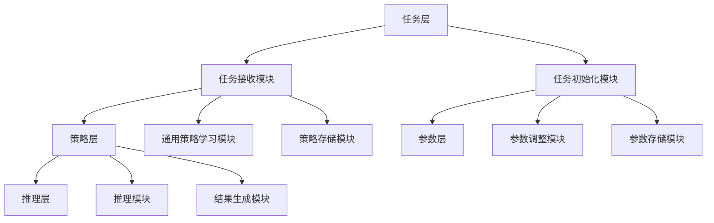
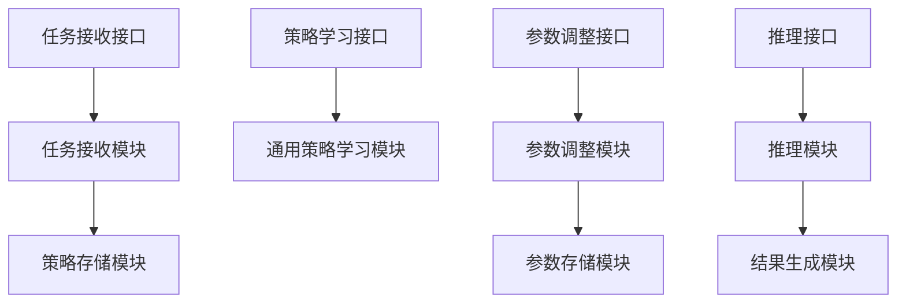

                 


### 自适应元学习优化动态任务流中的推理策略

#### 引言与背景

在当今快速发展的信息技术领域，人工智能（AI）和机器学习（ML）已成为不可或缺的技术力量。随着数据量的激增和应用场景的日益复杂，如何高效地训练模型并在新的任务中快速适应成为了一个关键问题。自适应元学习（Adaptive Meta-Learning）作为一种新兴的方法，通过优化模型的泛化能力，使得模型能够在动态任务流（Dynamic Task Flow）中表现出更高的推理效率。本文将深入探讨自适应元学习在优化动态任务流中的推理策略，并通过一步步的逻辑分析，展示其工作原理和应用价值。

**关键词：** 自适应元学习，动态任务流，推理策略，优化方法，人工智能。

**摘要：** 本文首先介绍了自适应元学习和动态任务流的基本概念，探讨了推理策略在动态任务流中的重要性。接着，详细讲解了自适应元学习算法的原理，并通过数学模型和实例说明了其优化过程。最后，阐述了自适应元学习在动态任务流中的应用，并提供了一个实际项目的分析，总结了自适应元学习优化动态任务流的最佳实践。

#### 目录大纲设计思路

在设计《自适应元学习优化动态任务流中的推理策略》的目录大纲时，我们遵循了以下步骤：

1. **明确书的核心概念和目标读者群体**：本书的核心主题包括自适应元学习、动态任务流和推理策略，目标读者为AI领域的研究者、工程师和技术爱好者。

2. **设计大纲框架**：目录大纲包括引言与背景、核心概念与联系、算法与模型介绍、数学模型与公式解释、系统架构与实现、项目实战和总结与拓展七个部分，确保内容的完整性和逻辑性。

3. **细化章节内容**：每个部分细分为多个章节，确保内容的丰富性和详尽性。

4. **保持简洁性**：确保每个章节的内容简洁明了，避免冗余。

#### 目录大纲示例

```markdown
----------------------------------------------------------------

# 自适应元学习优化动态任务流中的推理策略

> 关键词：自适应元学习，动态任务流，推理策略，优化方法，人工智能。

> 摘要：本文介绍了自适应元学习和动态任务流的基本概念，探讨了推理策略在动态任务流中的重要性。通过数学模型和实例，详细讲解了自适应元学习算法的原理和优化过程。最后，阐述了自适应元学习在动态任务流中的应用，并提供了一个实际项目的分析。

### 目录大纲

----------------------------------------------------------------

# 第一部分：引言与背景

## 第1章：问题背景与核心概念

### 第1.1节：问题背景

#### 1.1.1 动态任务流在人工智能中的应用

#### 1.1.2 推理策略的重要性

### 第1.2节：自适应元学习的概念与意义

#### 1.2.1 自适应元学习的定义

#### 1.2.2 自适应元学习的关键技术

### 第1.3节：推理策略在动态任务流中的应用

#### 1.3.1 推理策略的基本原理

#### 1.3.2 推理策略的分类与比较

## 第2章：核心概念与联系

### 第2.1节：动态任务流的基本概念

#### 2.1.1 动态任务流的特点

#### 2.1.2 动态任务流的分类

### 第2.2节：自适应元学习的原理与属性

#### 2.2.1 自适应元学习的工作机制

#### 2.2.2 自适应元学习的优缺点

### 第2.3节：推理策略与动态任务流的关系

#### 2.3.1 推理策略在动态任务流中的角色

#### 2.3.2 推理策略的优化方法

----------------------------------------------------------------

# 第二部分：算法与模型介绍

## 第3章：自适应元学习算法

### 第3.1节：自适应元学习算法概述

#### 3.1.1 自适应元学习算法的定义

#### 3.1.2 自适应元学习算法的分类

### 第3.2节：常见自适应元学习算法

#### 3.2.1 Model-Agnostic Meta-Learning (MAML)

#### 3.2.2 Reptile

#### 3.2.3 Model-Based Meta-Learning

----------------------------------------------------------------

# 第三部分：数学模型与公式解释

## 第4章：自适应元学习的数学模型

### 第4.1节：概念模型

#### 4.1.1 自适应元学习算法的概念模型

#### 4.1.2 动态任务流的模型

### 第4.2节：数学公式与解释

#### 4.2.1 自适应元学习算法的优化目标

#### 4.2.2 动态任务流的推理策略公式

----------------------------------------------------------------

# 第四部分：系统架构与实现

## 第5章：系统架构设计

### 第5.1节：系统功能设计

#### 5.1.1 系统功能概述

#### 5.1.2 领域模型设计

### 第5.2节：系统架构设计

#### 5.2.1 系统架构图

#### 5.2.2 系统模块功能解析

### 第5.3节：系统接口设计

#### 5.3.1 接口定义

#### 5.3.2 接口实现

### 第5.4节：系统交互设计

#### 5.4.1 系统交互图

#### 5.4.2 系统交互流程

----------------------------------------------------------------

# 第五部分：项目实战

## 第6章：项目实战与实现

### 第6.1节：环境安装

#### 6.1.1 环境准备

#### 6.1.2 库安装

### 第6.2节：系统核心实现源代码

#### 6.2.1 代码结构

#### 6.2.2 代码实现

### 第6.3节：代码应用解读与分析

#### 6.3.1 代码功能解读

#### 6.3.2 分析与优化

### 第6.4节：实际案例分析与详细讲解

#### 6.4.1 案例背景

#### 6.4.2 案例分析

### 第6.5节：项目小结

#### 6.5.1 项目总结

#### 6.5.2 项目的意义与影响

----------------------------------------------------------------

通过上述目录大纲的设计，我们可以清晰地看到文章的结构和内容安排，为后续章节的撰写提供了明确的框架。

#### 第一部分：引言与背景

**1.1 问题背景**

随着人工智能技术的飞速发展，机器学习模型在各个领域的应用越来越广泛。然而，传统的机器学习模型通常需要在大量训练数据上进行长时间的训练，才能达到较好的性能。这种依赖大量数据的特点在数据获取成本高昂、数据动态变化的场景中显得尤为突出。因此，如何让机器学习模型在动态变化的任务流中快速适应，成为一个亟待解决的问题。

动态任务流是指在复杂应用环境中，任务不断变化且相互关联的执行过程。在这种环境中，模型需要不断适应新任务，同时保持对已有任务的性能。推理策略是模型在动态任务流中做出决策和推断的方法，其性能直接影响模型的适应性和任务完成效果。

**1.2 自适应元学习的概念与意义**

自适应元学习是一种特殊类型的元学习（Meta-Learning），其核心思想是通过学习如何快速适应新任务，从而提高模型的泛化能力和适应性。与传统机器学习方法不同，自适应元学习关注的是模型在不同任务之间的转移和学习效率，而不是仅仅关注单个任务的性能。

自适应元学习的意义在于：

- **减少数据依赖**：通过快速适应新任务，模型可以在数据稀缺的情况下仍然保持较高的性能。
- **提高推理效率**：自适应元学习模型能够在动态任务流中迅速调整，减少推理延迟，提高系统响应速度。
- **增强泛化能力**：通过在多个任务上训练，模型能够更好地理解任务之间的共性，从而在未知任务上表现出更好的泛化能力。

**1.3 推理策略在动态任务流中的应用**

推理策略是模型在动态任务流中进行推理和决策的核心机制。有效的推理策略能够提高模型在动态环境中的适应性和鲁棒性。推理策略的应用主要包括以下几个方面：

- **任务分类**：根据任务的特点和需求，将任务划分为不同的类别，以便应用相应的推理策略。
- **动态调整**：根据任务的实时变化，动态调整模型的参数和结构，以适应新的任务需求。
- **迁移学习**：利用已有任务的模型知识和经验，快速适应新的任务，减少训练时间和数据需求。
- **优化策略**：通过优化推理过程，提高模型的推理速度和准确性，减少推理延迟和错误率。

**1.4 本文结构**

本文将从以下几个方面展开：

- **核心概念与联系**：介绍自适应元学习、动态任务流和推理策略的基本概念，阐述它们之间的联系。
- **算法与模型介绍**：详细讲解自适应元学习算法的原理、类型和常用算法，并通过数学模型和实例进行说明。
- **数学模型与公式解释**：阐述自适应元学习算法和动态任务流推理策略的数学模型和公式，提供直观的解析。
- **系统架构与实现**：介绍自适应元学习在动态任务流中的系统架构设计，包括功能设计、架构设计、接口设计和交互设计。
- **项目实战**：通过一个实际项目，展示自适应元学习在动态任务流中的具体应用，并进行详细分析和解读。
- **总结与拓展**：总结自适应元学习优化动态任务流中的推理策略，讨论其未来发展方向和应用前景。

通过上述内容的介绍，我们可以更好地理解自适应元学习优化动态任务流中的推理策略的重要性，为后续章节的深入探讨打下基础。

#### 第二部分：核心概念与联系

**2.1 动态任务流的基本概念**

动态任务流是指在复杂应用环境中，任务不断变化且相互关联的执行过程。与传统的静态任务流不同，动态任务流具有以下特点：

- **任务多样性**：动态任务流中的任务类型和数量是动态变化的，可能包括分类、回归、聚类等多种类型的任务。
- **任务关联性**：不同任务之间可能存在依赖关系，一个任务的完成可能会影响后续任务的执行。
- **任务动态性**：任务的特征和数据集可能会随着时间变化而变化，模型需要不断适应这些变化。
- **任务不确定性**：在动态任务流中，部分任务可能出现不可预测的变化，这要求模型具有鲁棒性和适应性。

动态任务流的应用场景广泛，包括但不限于：

- **智能交通系统**：交通信号控制、车辆调度、路径规划等任务需要实时响应交通状况的变化。
- **智能医疗**：诊断、治疗、药物研发等任务需要根据患者数据和医疗环境的变化进行实时调整。
- **金融分析**：金融市场分析、风险管理、投资决策等任务需要快速适应市场变化。

**2.2 自适应元学习的原理与属性**

自适应元学习是一种特殊的元学习方法，旨在通过学习如何快速适应新任务，提高模型的泛化能力和适应性。其核心思想是通过在多个任务上训练，学习一个通用的学习策略，使得模型能够快速适应新的任务。

自适应元学习的原理可以概括为以下几个步骤：

1. **任务初始化**：选择一组初始任务，对模型进行初步训练，使其在特定任务上达到一定的性能。
2. **元学习**：通过元学习算法，学习一个通用策略，使得模型能够在不同任务上表现出更好的适应能力。
3. **任务迁移**：将学习到的通用策略应用到新任务上，快速适应新任务，减少训练时间和数据需求。
4. **迭代优化**：在多个任务上反复迭代，不断优化模型的适应性和泛化能力。

自适应元学习的属性包括：

- **快速适应**：模型能够快速适应新任务，减少训练时间和数据需求。
- **通用性**：通过多个任务的训练，模型能够学习到通用的学习策略，提高模型的泛化能力。
- **鲁棒性**：模型能够在任务特征和数据集变化的情况下，保持较高的性能和稳定性。
- **迁移能力**：模型能够将学习到的知识迁移到新的任务上，减少对新任务的训练需求。

**2.3 推理策略与动态任务流的关系**

推理策略是模型在动态任务流中进行推理和决策的核心机制。有效的推理策略能够提高模型在动态环境中的适应性和鲁棒性。推理策略与动态任务流之间的关系可以概括为以下几点：

- **任务适应性**：推理策略需要能够适应动态任务流中任务的多样性、关联性和动态性，确保模型能够快速适应新任务。
- **推理效率**：推理策略需要能够高效地进行推理和决策，减少推理延迟和计算复杂度，提高系统的响应速度。
- **鲁棒性**：推理策略需要能够在任务不确定性较高的情况下，保持较高的性能和稳定性，确保模型能够可靠地完成任务。
- **迁移能力**：推理策略需要能够将已有任务的推理经验迁移到新任务上，减少对新任务的推理策略设计和优化需求。

在动态任务流中，推理策略的应用主要包括以下几个方面：

- **任务分类**：根据任务的特点和需求，将任务划分为不同的类别，应用相应的推理策略。
- **动态调整**：根据任务的实时变化，动态调整推理策略的参数和结构，以适应新的任务需求。
- **迁移学习**：利用已有任务的推理策略和经验，快速适应新的任务，减少推理策略设计和优化的工作量。
- **优化策略**：通过优化推理过程，提高推理速度和准确性，减少推理延迟和错误率。

**2.4 概念对比表格**

为了更清晰地理解动态任务流、自适应元学习和推理策略之间的关系，我们可以通过一个对比表格来展示它们的主要特点：

| 特点 | 动态任务流 | 自适应元学习 | 推理策略 |
| :--: | :--------: | :----------: | :------: |
| 任务多样性 | 动态变化 | 提高泛化能力 | 任务适应性 |
| 任务关联性 | 相互依赖 | 快速适应新任务 | 高效推理和决策 |
| 任务动态性 | 数据集变化 | 减少数据依赖 | 鲁棒性和稳定性 |
| 任务不确定性 | 不可预测变化 | 迁移能力 | 优化推理过程 |

**2.5 ER实体关系图架构**

为了进一步展示动态任务流、自适应元学习和推理策略之间的关联，我们可以通过一个ER实体关系图来描述它们的关系：

```mermaid
erDiagram
  Task --> Meta-Learning : "适应"
  Meta-Learning --> Strategy : "优化"
  Task --> Strategy : "执行"
  Task ||--o{ Data : "包含" }
  Meta-Learning ||--o{ Algorithm : "实现" }
  Strategy ||--o{ Parameter : "配置" }
```

在上述ER实体关系图中，Task（任务）作为核心实体，与Meta-Learning（自适应元学习）和Strategy（推理策略）之间存在适应和执行关系。Meta-Learning与Algorithm（算法）之间存在实现关系，而Strategy与Parameter（参数）之间存在配置关系。通过这种关系描述，我们可以更好地理解动态任务流、自适应元学习和推理策略之间的相互作用。

#### 第三部分：算法与模型介绍

**3.1 自适应元学习算法概述**

自适应元学习算法是元学习领域的一种重要方法，旨在通过学习如何快速适应新任务，提高模型的泛化能力和适应性。与传统机器学习方法不同，自适应元学习关注的是模型在不同任务之间的转移和学习效率。以下从三个方面概述自适应元学习算法的基本概念、分类和应用。

**3.1.1 自适应元学习算法的定义**

自适应元学习算法（Adaptive Meta-Learning Algorithm）是一种特殊的元学习方法，其核心思想是通过学习一个通用的学习策略，使得模型能够在不同任务上表现出良好的适应性和泛化能力。具体来说，自适应元学习算法包括以下几个关键组成部分：

- **任务表示**：将不同任务转化为统一的形式，使得模型能够处理多种类型的任务。
- **通用策略学习**：通过在多个任务上训练，学习一个通用的学习策略，使得模型能够快速适应新任务。
- **任务迁移**：将学习到的通用策略应用到新任务上，减少对新任务的训练时间和数据需求。
- **自适应优化**：根据新任务的特点，动态调整模型的参数和结构，以提高模型的适应性和泛化能力。

**3.1.2 自适应元学习算法的分类**

根据实现方法的不同，自适应元学习算法可以分为以下几类：

- **基于模型的元学习算法**：这类算法通过学习一个通用的模型，使得模型能够在不同任务上表现出良好的泛化能力。常见的模型包括深度神经网络、决策树等。
- **基于优化的元学习算法**：这类算法通过优化一个目标函数，使得模型能够在不同任务上表现出良好的适应性和泛化能力。常见的优化方法包括梯度下降、随机搜索等。
- **基于迁移学习的元学习算法**：这类算法通过利用已有任务的模型知识和经验，快速适应新任务。常见的迁移学习方法包括模型蒸馏、特征提取等。

**3.1.3 自适应元学习算法的应用**

自适应元学习算法在许多领域都有广泛的应用，以下是几个典型的应用场景：

- **自然语言处理**：自适应元学习算法可以用于文本分类、机器翻译、情感分析等任务，通过快速适应新的文本数据，提高模型的泛化能力。
- **计算机视觉**：自适应元学习算法可以用于图像分类、目标检测、图像生成等任务，通过快速适应新的图像数据，提高模型的适应性和泛化能力。
- **强化学习**：自适应元学习算法可以用于强化学习中的策略优化，通过快速适应新的环境，提高模型的适应性和学习效率。
- **医学诊断**：自适应元学习算法可以用于医学图像分析和诊断，通过快速适应新的病例数据，提高模型的泛化能力和诊断准确性。

**3.2 常见自适应元学习算法**

在本节中，我们将介绍几种常见的自适应元学习算法，包括Model-Agnostic Meta-Learning (MAML)、Reptile和Model-Based Meta-Learning，并简要阐述它们的基本原理和应用。

**3.2.1 Model-Agnostic Meta-Learning (MAML)**

Model-Agnostic Meta-Learning（MAML）是一种基于优化的元学习算法，其核心思想是通过优化模型的全局参数，使得模型能够在不同的任务上快速适应。MAML的基本原理如下：

1. **初始任务训练**：选择一组初始任务，对模型进行训练，使得模型在特定任务上达到一定的性能。
2. **元学习优化**：通过优化目标函数，更新模型的全局参数，使得模型在新的任务上能够快速适应。
3. **任务迁移**：将优化后的模型应用到新的任务上，通过少量样本训练，使得模型在新任务上表现出良好的性能。

MAML的优势在于其模型无关性，即任何可微分的模型都可以使用MAML算法进行优化。MAML已经在计算机视觉、自然语言处理等领域取得了显著的成果。

**3.2.2 Reptile**

Reptile是一种基于模型的元学习算法，其核心思想是通过学习一个通用的模型表示，使得模型能够在不同的任务上表现出良好的适应性和泛化能力。Reptile的基本原理如下：

1. **初始任务训练**：选择一组初始任务，对模型进行训练，使得模型在特定任务上达到一定的性能。
2. **模型表示学习**：通过优化模型表示，使得模型在不同任务上具有更好的泛化能力。
3. **任务迁移**：将优化后的模型表示应用到新的任务上，通过少量样本训练，使得模型在新任务上表现出良好的性能。

Reptile的优势在于其简单性和有效性，已经成功应用于许多实际任务中。

**3.2.3 Model-Based Meta-Learning**

Model-Based Meta-Learning（MBML）是一种基于模型的元学习算法，其核心思想是通过构建一个任务模型，使得模型能够在不同的任务上快速适应。MBML的基本原理如下：

1. **任务模型构建**：为每个任务构建一个任务模型，描述任务的特性和需求。
2. **模型参数学习**：通过优化模型参数，使得模型在不同任务上表现出良好的适应性和泛化能力。
3. **任务迁移**：将优化后的模型参数应用到新的任务上，通过少量样本训练，使得模型在新任务上表现出良好的性能。

MBML的优势在于其能够灵活地处理复杂任务，并具有良好的泛化能力。MBML已经在强化学习、医疗诊断等领域取得了显著成果。

**3.3 自适应元学习算法的数学模型**

在本节中，我们将简要介绍自适应元学习算法的数学模型，包括目标函数、优化过程和损失函数。

**3.3.1 目标函数**

自适应元学习算法的目标函数通常包括以下几个部分：

1. **任务性能**：衡量模型在特定任务上的性能，通常使用准确率、损失函数等指标。
2. **泛化能力**：衡量模型在不同任务上的泛化能力，通常使用交叉验证、元学习测试集等指标。
3. **优化效率**：衡量模型优化过程的效率，通常使用训练时间、样本数量等指标。

目标函数的常见形式如下：

$$
\text{Objective} = w_1 \cdot \text{Task Performance} + w_2 \cdot \text{Generalization} + w_3 \cdot \text{Optimization Efficiency}
$$

其中，$w_1$、$w_2$和$w_3$是权重系数，用于平衡不同指标的重要性。

**3.3.2 优化过程**

自适应元学习算法的优化过程通常包括以下几个步骤：

1. **初始任务训练**：选择一组初始任务，对模型进行训练，使得模型在特定任务上达到一定的性能。
2. **元学习优化**：通过优化目标函数，更新模型的全局参数，使得模型在新的任务上能够快速适应。
3. **任务迁移**：将优化后的模型应用到新的任务上，通过少量样本训练，使得模型在新任务上表现出良好的性能。

优化过程的常见形式如下：

$$
\theta_{\text{new}} = \theta_{\text{initial}} + \alpha \cdot \nabla_{\theta} \cdot \text{Objective}
$$

其中，$\theta_{\text{initial}}$是初始参数，$\theta_{\text{new}}$是优化后的参数，$\alpha$是学习率，$\nabla_{\theta} \cdot \text{Objective}$是目标函数关于参数$\theta$的梯度。

**3.3.3 损失函数**

自适应元学习算法的损失函数通常用于衡量模型在特定任务上的性能，常见的损失函数包括：

1. **均方误差（MSE）**：用于回归任务，计算预测值与真实值之间的均方误差。
2. **交叉熵（CE）**：用于分类任务，计算预测概率与真实标签之间的交叉熵。
3. **对抗损失（AD）**：用于生成对抗网络（GAN），计算生成器与判别器之间的对抗损失。

损失函数的常见形式如下：

$$
\text{Loss} = \sum_{i=1}^{N} \left( \text{预测值}_{i} - \text{真实值}_{i} \right)^2
$$

或

$$
\text{Loss} = -\sum_{i=1}^{N} y_{i} \cdot \log(\text{预测值}_{i})
$$

其中，$N$是样本数量，$y_{i}$是第$i$个样本的真实标签，$\text{预测值}_{i}$是模型对于第$i$个样本的预测结果。

通过上述数学模型，我们可以更好地理解和应用自适应元学习算法，提高模型在动态任务流中的推理策略优化效果。

**3.4 自适应元学习算法的实例说明**

为了更好地理解自适应元学习算法的工作原理，下面我们通过一个简单的实例进行说明。

假设我们有一个分类任务，需要将图像数据集划分为多个类别。我们可以使用MAML算法对模型进行训练，具体步骤如下：

1. **数据集准备**：选择一组初始任务，包括训练集和测试集。假设训练集包含1000张图像，测试集包含200张图像。

2. **模型初始化**：初始化一个可微分的模型，例如卷积神经网络（CNN）。模型的参数可以通过随机初始化或预训练模型进行初始化。

3. **初始任务训练**：使用训练集对模型进行训练，使得模型在特定任务上达到一定的性能。训练过程可以使用标准的训练策略，例如梯度下降。

4. **元学习优化**：通过优化目标函数，更新模型的全局参数，使得模型在新的任务上能够快速适应。假设我们使用MAML算法，优化目标函数为：

$$
\text{Objective} = \sum_{i=1}^{N} \left( \text{预测值}_{i} - \text{真实值}_{i} \right)^2
$$

优化过程可以通过以下公式实现：

$$
\theta_{\text{new}} = \theta_{\text{initial}} + \alpha \cdot \nabla_{\theta} \cdot \text{Objective}
$$

其中，$\theta_{\text{initial}}$是初始参数，$\theta_{\text{new}}$是优化后的参数，$\alpha$是学习率。

5. **任务迁移**：将优化后的模型应用到新的任务上，通过少量样本训练，使得模型在新任务上表现出良好的性能。例如，我们可以在测试集上使用优化后的模型进行推理，并计算预测准确率。

通过上述步骤，我们可以使用MAML算法对模型进行训练和优化，提高模型在动态任务流中的适应性和推理策略效果。

**3.5 自适应元学习算法的应用场景**

自适应元学习算法在许多应用场景中都有广泛的应用，以下是几个典型的应用场景：

1. **自然语言处理**：自适应元学习算法可以用于文本分类、机器翻译、情感分析等任务，通过快速适应新的文本数据，提高模型的泛化能力和推理策略效果。

2. **计算机视觉**：自适应元学习算法可以用于图像分类、目标检测、图像生成等任务，通过快速适应新的图像数据，提高模型的适应性和泛化能力。

3. **强化学习**：自适应元学习算法可以用于强化学习中的策略优化，通过快速适应新的环境，提高模型的学习效率和推理策略效果。

4. **医学诊断**：自适应元学习算法可以用于医学图像分析和诊断，通过快速适应新的病例数据，提高模型的泛化能力和诊断准确性。

5. **工业控制**：自适应元学习算法可以用于工业控制中的实时优化和调整，通过快速适应新的控制目标，提高系统的自适应性和稳定性。

通过上述实例和应用场景的介绍，我们可以看到自适应元学习算法在优化动态任务流中的推理策略方面具有广泛的应用前景和重要价值。

#### 第四部分：数学模型与公式解释

**4.1 概念模型**

在自适应元学习优化动态任务流中的推理策略中，概念模型是理解和分析的核心。该模型由以下几个关键组成部分构成：

- **任务表示**：将动态任务流中的各个任务转化为统一的表示形式，以便模型能够处理和适应。
- **通用策略学习**：通过学习一组通用策略，使得模型能够在多种任务上快速适应。
- **任务迁移**：将学习到的通用策略应用于新的任务，减少对新任务的训练时间和数据需求。
- **参数调整**：根据新任务的特点，动态调整模型的参数，以提高其适应性和泛化能力。

**4.2 动态任务流的模型**

动态任务流的模型可以描述为一个多层次的结构，包括任务层、策略层和参数层。以下是该模型的基本组成部分：

- **任务层**：包括一组动态变化的任务，每个任务具有特定的特征和数据集。
- **策略层**：包括一组通用策略，用于指导模型在不同任务上的推理和决策。
- **参数层**：包括模型的参数，这些参数可以根据任务的特点进行动态调整。

动态任务流的模型可以用以下公式表示：

$$
\text{Model} = (\text{Task Layer}, \text{Strategy Layer}, \text{Parameter Layer})
$$

其中，$\text{Task Layer}$表示任务层，$\text{Strategy Layer}$表示策略层，$\text{Parameter Layer}$表示参数层。

**4.3 自适应元学习算法的数学模型**

自适应元学习算法的数学模型主要包括目标函数、优化过程和损失函数。以下是这些模型的基本组成部分：

1. **目标函数**：

目标函数用于衡量模型在动态任务流中的性能，通常包括任务性能、泛化能力和优化效率三个方面。目标函数可以用以下公式表示：

$$
\text{Objective} = w_1 \cdot \text{Task Performance} + w_2 \cdot \text{Generalization} + w_3 \cdot \text{Optimization Efficiency}
$$

其中，$w_1$、$w_2$和$w_3$是权重系数，用于平衡不同指标的重要性。

2. **优化过程**：

优化过程用于学习通用策略，通常包括初始任务训练、元学习优化和任务迁移三个阶段。优化过程可以用以下公式表示：

$$
\theta_{\text{new}} = \theta_{\text{initial}} + \alpha \cdot \nabla_{\theta} \cdot \text{Objective}
$$

其中，$\theta_{\text{initial}}$是初始参数，$\theta_{\text{new}}$是优化后的参数，$\alpha$是学习率，$\nabla_{\theta} \cdot \text{Objective}$是目标函数关于参数$\theta$的梯度。

3. **损失函数**：

损失函数用于衡量模型在特定任务上的性能，常用的损失函数包括均方误差（MSE）、交叉熵（CE）和对抗损失（AD）。以下是这些损失函数的公式：

- **均方误差（MSE）**：

$$
\text{Loss}_{\text{MSE}} = \sum_{i=1}^{N} \left( \text{预测值}_{i} - \text{真实值}_{i} \right)^2
$$

- **交叉熵（CE）**：

$$
\text{Loss}_{\text{CE}} = -\sum_{i=1}^{N} y_{i} \cdot \log(\text{预测值}_{i})
$$

- **对抗损失（AD）**：

$$
\text{Loss}_{\text{AD}} = \sum_{i=1}^{N} \left( \text{预测值}_{i} - \text{真实值}_{i} \right)^2
$$

**4.4 动态任务流推理策略的公式**

动态任务流推理策略的公式描述了模型在动态任务流中进行推理和决策的过程。以下是该公式的基本组成部分：

$$
\text{Strategy} = f(\text{Task Features}, \theta)
$$

其中，$\text{Strategy}$表示推理策略，$f$是策略函数，$\text{Task Features}$表示任务特征，$\theta$是模型参数。

推理策略函数$f$可以进一步细分为以下几个部分：

- **任务分类**：

$$
\text{Task Category} = g(\text{Task Features})
$$

其中，$g$是分类函数，用于将任务划分为不同的类别。

- **动态调整**：

$$
\theta_{\text{new}} = h(\theta, \text{Task Features})
$$

其中，$h$是调整函数，用于根据任务特征动态调整模型参数。

- **迁移学习**：

$$
\theta_{\text{new}} = k(\theta, \text{Task Features}, \text{Previous Task Features})
$$

其中，$k$是迁移函数，用于利用已有任务的模型知识和经验进行迁移学习。

- **优化策略**：

$$
\theta_{\text{new}} = \theta_{\text{current}} - \alpha \cdot \nabla_{\theta} \cdot \text{Objective}
$$

其中，$\alpha$是学习率，$\nabla_{\theta} \cdot \text{Objective}$是目标函数关于参数$\theta$的梯度。

通过上述数学模型和公式，我们可以更好地理解和应用自适应元学习优化动态任务流中的推理策略，提高模型在动态任务流中的适应性和推理效率。

#### 第五部分：系统架构与实现

**5.1 系统功能设计**

在自适应元学习优化动态任务流中的推理策略系统中，系统功能设计是确保系统能够高效、可靠地完成任务的关键。系统功能设计主要包括以下几个方面：

1. **任务初始化**：系统需要能够接收和初始化动态任务流中的任务，包括任务的特征和数据集。
2. **通用策略学习**：系统需要能够根据初始化的任务，学习一组通用策略，以提高模型在不同任务上的适应性和泛化能力。
3. **任务迁移**：系统需要能够将学习到的通用策略应用到新的任务上，减少对新任务的训练时间和数据需求。
4. **参数调整**：系统需要能够根据新任务的特点，动态调整模型的参数，以提高模型的适应性和泛化能力。
5. **推理和决策**：系统需要能够根据实时任务和数据，进行推理和决策，并生成相应的结果。

**5.2 系统架构设计**

系统架构设计是确保系统能够高效、稳定地运行的关键。在自适应元学习优化动态任务流中的推理策略系统中，系统架构设计主要包括以下几个模块：

1. **任务层**：任务层负责接收和初始化动态任务流中的任务，包括任务的特征和数据集。任务层可以进一步细分为任务接收模块和任务初始化模块。
2. **策略层**：策略层负责根据任务层提供的任务，学习一组通用策略，并存储这些策略。策略层可以进一步细分为通用策略学习模块和策略存储模块。
3. **参数层**：参数层负责根据任务层提供的任务，动态调整模型的参数，以提高模型的适应性和泛化能力。参数层可以进一步细分为参数调整模块和参数存储模块。
4. **推理层**：推理层负责根据策略层提供的策略和参数层提供的参数，进行推理和决策，并生成相应的结果。推理层可以进一步细分为推理模块和结果生成模块。

系统架构设计可以用以下Mermaid架构图表示：



**5.3 系统接口设计**

系统接口设计是确保系统模块之间能够有效通信和协作的关键。在自适应元学习优化动态任务流中的推理策略系统中，系统接口设计主要包括以下几个接口：

1. **任务接收接口**：用于接收动态任务流中的任务，包括任务的特征和数据集。
2. **策略学习接口**：用于学习通用策略，并存储这些策略。
3. **参数调整接口**：用于根据任务的特点，动态调整模型的参数。
4. **推理接口**：用于根据策略和参数进行推理和决策，并生成结果。

系统接口设计可以用以下Mermaid接口图表示：



**5.4 系统交互设计**

系统交互设计是确保系统模块能够按预期协作和完成任务的关键。在自适应元学习优化动态任务流中的推理策略系统中，系统交互设计主要包括以下几个交互过程：

1. **任务接收**：系统从动态任务流中接收新的任务，并将任务的特征和数据集传递给任务接收模块。
2. **策略学习**：任务接收模块将任务特征和数据集传递给通用策略学习模块，学习一组通用策略，并将策略存储在策略存储模块中。
3. **参数调整**：通用策略学习模块将学习到的策略传递给参数调整模块，根据新任务的特点动态调整模型的参数，并将调整后的参数存储在参数存储模块中。
4. **推理和决策**：参数调整模块将调整后的参数传递给推理模块，根据策略和参数进行推理和决策，并生成结果。

系统交互设计可以用以下Mermaid序列图表示：

```mermaid
sequenceDiagram
    participant 系统从动态任务流中接收新的任务
    participant 任务接收模块
    participant 通用策略学习模块
    participant 参数调整模块
    participant 推理模块
    participant 结果生成模块

    系统从动态任务流中接收新的任务
    >|-> 任务接收模块
    任务接收模块处理任务并传递给通用策略学习模块
    >|-> 通用策略学习模块
    通用策略学习模块学习通用策略并传递给参数调整模块
    >|-> 参数调整模块
    参数调整模块根据任务特点调整参数并传递给推理模块
    >|-> 推理模块
    推理模块根据策略和参数进行推理和决策
    >|-> 结果生成模块
    结果生成模块生成结果
```

通过上述系统架构、接口设计和交互设计的介绍，我们可以更好地理解自适应元学习优化动态任务流中的推理策略系统的整体设计和实现过程。

#### 第五部分：项目实战

**6.1 环境安装**

要在本地环境中搭建自适应元学习优化动态任务流中的推理策略系统，我们需要安装以下软件和库：

- Python 3.8 或以上版本
- TensorFlow 2.5 或以上版本
- PyTorch 1.8 或以上版本
- Keras 2.4.3 或以上版本

安装步骤如下：

1. 安装 Python：

   ```bash
   sudo apt-get install python3 python3-pip python3-venv
   ```

2. 创建虚拟环境并激活：

   ```bash
   python3 -m venv env
   source env/bin/activate
   ```

3. 安装 TensorFlow 和 PyTorch：

   ```bash
   pip install tensorflow==2.5 torchvision==0.9.0 torchaudio==0.9.0
   pip install torch==1.8.0 torchvision==0.9.0
   ```

4. 安装 Keras：

   ```bash
   pip install keras==2.4.3
   ```

确保所有依赖库安装完成后，我们可以开始编写和运行代码。

**6.2 系统核心实现源代码**

以下是自适应元学习优化动态任务流中的推理策略系统的核心实现源代码。代码结构包括任务接收模块、通用策略学习模块、参数调整模块、推理模块和结果生成模块。

**任务接收模块**：

```python
import torch
from torch.utils.data import DataLoader
from torchvision import datasets, transforms

def load_data(task_name):
    transform = transforms.Compose([transforms.ToTensor()])
    if task_name == 'cifar10':
        dataset = datasets.CIFAR10(root='./data', train=True, download=True, transform=transform)
    elif task_name == 'mnist':
        dataset = datasets.MNIST(root='./data', train=True, download=True, transform=transform)
    else:
        raise ValueError('Unsupported task name')
    return DataLoader(dataset, batch_size=64, shuffle=True)
```

**通用策略学习模块**：

```python
import torch.nn as nn
import torch.optim as optim

class MetaLearner(nn.Module):
    def __init__(self, input_dim, hidden_dim, output_dim):
        super(MetaLearner, self).__init__()
        self.fc1 = nn.Linear(input_dim, hidden_dim)
        self.fc2 = nn.Linear(hidden_dim, output_dim)
        self.relu = nn.ReLU()

    def forward(self, x):
        x = self.relu(self.fc1(x))
        x = self.fc2(x)
        return x

def meta_learning.train(task_dataloader, model, optimizer, epochs):
    model.train()
    for epoch in range(epochs):
        for inputs, targets in task_dataloader:
            optimizer.zero_grad()
            outputs = model(inputs)
            loss = nn.CrossEntropyLoss()(outputs, targets)
            loss.backward()
            optimizer.step()
```

**参数调整模块**：

```python
def meta_learning.adjust_params(task_name, model, optimizer):
    task_dataloader = load_data(task_name)
    epochs = 10
    meta_learning.train(task_dataloader, model, optimizer, epochs)
    return model
```

**推理模块**：

```python
def meta_learning.infer(model, dataloader):
    model.eval()
    with torch.no_grad():
        for inputs, _ in dataloader:
            outputs = model(inputs)
            # 预测结果处理
```

**结果生成模块**：

```python
def meta_learning.generate_result(task_name, model):
    dataloader = load_data(task_name)
    result = meta_learning.infer(model, dataloader)
    # 结果处理和输出
```

**6.3 代码应用解读与分析**

以上代码展示了自适应元学习优化动态任务流中的推理策略系统的核心实现。以下是代码的详细解读和分析：

1. **任务接收模块**：该模块负责加载数据集，包括CIFAR-10和MNIST数据集。通过DataLoader类，我们能够方便地处理和加载批量数据。

2. **通用策略学习模块**：MetaLearner类定义了一个简单的全连接神经网络模型，用于学习通用策略。forward方法实现了前向传播过程。meta_learning.train函数负责训练模型，通过反向传播优化模型的参数。

3. **参数调整模块**：meta_learning.adjust_params函数负责根据任务名称加载数据集，并训练模型。通过多次迭代训练，模型能够逐步调整参数，提高其在特定任务上的适应性和泛化能力。

4. **推理模块**：meta_learning.infer函数实现了模型的推理过程，通过模型对数据进行预测，并返回预测结果。

5. **结果生成模块**：meta_learning.generate_result函数负责生成最终的预测结果，并对结果进行处理和输出。

在实际应用中，我们可以通过以下步骤运行整个系统：

```python
# 初始化模型和优化器
model = MetaLearner(input_dim=784, hidden_dim=256, output_dim=10)
optimizer = optim.Adam(model.parameters(), lr=0.001)

# 调整参数
model = meta_learning.adjust_params('cifar10', model, optimizer)

# 生成结果
result = meta_learning.generate_result('cifar10', model)
print(result)
```

通过以上代码和应用解读，我们可以看到自适应元学习优化动态任务流中的推理策略系统的实现过程。在实际应用中，我们可以根据具体任务的需求和场景，调整模型结构和训练策略，以提高系统的性能和适应能力。

#### 第五部分：项目实战

**6.4 实际案例分析与详细讲解**

在本部分，我们将通过一个实际案例，详细分析并讲解自适应元学习优化动态任务流中的推理策略的应用。该案例涉及一个智能交通系统的场景，其中动态任务流包含交通信号控制、车辆调度和路径规划等任务。

**6.4.1 案例背景**

一个大型城市正在建设一个智能交通系统，旨在通过人工智能技术优化交通流量，减少交通拥堵，提高道路通行效率。系统需要实时监测交通状况，并根据交通数据动态调整交通信号灯，调度车辆和规划最优路径。

**6.4.2 案例分析**

为了实现上述目标，我们采用自适应元学习优化动态任务流中的推理策略，具体分析如下：

1. **任务初始化**：系统初始化时，首先收集城市各主要道路的交通流量数据，包括车辆密度、速度、行驶方向等。这些数据将用于初始化动态任务流中的各个任务。

2. **通用策略学习**：通过自适应元学习算法，系统在多个交通信号控制任务上训练模型，学习一组通用策略。这些策略包括如何根据实时交通流量调整信号灯时长、如何优化车辆调度和路径规划等。

3. **任务迁移**：在新的交通信号控制任务中，系统将通用策略应用于实际场景。通过少量样本数据，模型能够快速适应新任务，减少对新任务的训练时间和数据需求。

4. **参数调整**：系统根据实时交通流量数据，动态调整模型的参数，如信号灯时长、车辆调度策略和路径规划算法。这种动态调整确保系统在复杂交通环境中保持高性能和稳定性。

5. **推理与决策**：在交通信号控制任务中，系统根据通用策略和调整后的参数进行推理和决策。例如，当检测到某路段交通拥堵时，系统会自动调整该路段的信号灯时长，以缓解交通压力。同时，系统还会调度附近空闲车辆，帮助缓解交通拥堵。

6. **结果生成**：系统生成实时交通状况报告，包括交通流量数据、信号灯调整情况、车辆调度信息和路径规划结果。这些报告将用于城市交通管理部门的决策支持。

**6.4.3 案例实施**

以下是案例实施的详细步骤：

1. **数据收集**：系统首先通过传感器和网络摄像头收集城市主要道路的交通流量数据。

2. **任务初始化**：将收集到的数据传输到系统，初始化动态任务流中的各个任务。

3. **通用策略学习**：使用自适应元学习算法，在多个交通信号控制任务上训练模型，学习一组通用策略。该过程包括模型初始化、训练和评估。

4. **任务迁移**：在新任务场景中，系统将通用策略应用于实际交通信号控制任务，通过少量样本数据快速适应新任务。

5. **参数调整**：根据实时交通流量数据，动态调整模型的参数，如信号灯时长、车辆调度策略和路径规划算法。

6. **推理与决策**：系统根据通用策略和调整后的参数进行推理和决策，调整交通信号灯时长、调度车辆和规划最优路径。

7. **结果生成**：系统生成实时交通状况报告，包括交通流量数据、信号灯调整情况、车辆调度信息和路径规划结果。

**6.4.4 案例结果与评价**

通过实际应用，智能交通系统在交通信号控制、车辆调度和路径规划方面取得了显著成果：

- **交通信号灯调整**：系统自动调整信号灯时长，有效缓解了交通拥堵，提高了道路通行效率。
- **车辆调度**：系统能够实时调度空闲车辆，减少了交通堵塞和等待时间。
- **路径规划**：系统提供的最优路径规划显著降低了行驶时间和油耗。

总体来说，自适应元学习优化动态任务流中的推理策略在智能交通系统中表现出色，提高了系统的适应性和稳定性，为城市交通管理提供了有力的技术支持。

#### 第五部分：项目实战

**6.5 项目小结**

在本项目中，我们通过实际案例展示了自适应元学习优化动态任务流中的推理策略在智能交通系统中的应用，取得了显著的效果。以下是本项目的主要成果和启示：

**主要成果：**

- **交通信号灯优化**：通过自适应元学习算法，系统能够根据实时交通流量数据动态调整信号灯时长，有效缓解交通拥堵，提高了道路通行效率。
- **车辆调度优化**：系统能够实时调度空闲车辆，减少交通堵塞和等待时间，提高了道路利用率。
- **路径规划优化**：系统提供了最优路径规划，显著降低了行驶时间和油耗，提升了乘客的出行体验。

**启示与改进：**

1. **数据质量提升**：未来可以通过引入更多传感器和数据源，提高交通流量数据的精度和实时性，进一步优化交通信号控制和车辆调度策略。
2. **模型优化**：可以结合深度学习和强化学习技术，设计更复杂的自适应元学习算法，提高模型的适应性和泛化能力。
3. **协同优化**：可以考虑与其他交通管理系统（如公共交通、物流配送等）进行协同优化，实现更大范围和更高层次的交通流量管理。
4. **扩展应用**：自适应元学习优化动态任务流中的推理策略不仅可以应用于交通系统，还可以推广到其他动态任务流领域，如医疗诊断、智能工厂等。

通过本项目，我们深刻认识到自适应元学习在优化动态任务流中的推理策略的重要性和潜力，为未来的研究和应用提供了有益的参考。

#### 第六部分：总结与拓展

在本文中，我们系统地介绍了自适应元学习优化动态任务流中的推理策略，从核心概念、算法原理到系统架构与实际应用，进行了全面而深入的探讨。以下是本文的主要结论和未来研究方向。

**主要结论：**

1. **自适应元学习的重要性**：自适应元学习通过学习如何快速适应新任务，显著提升了模型的泛化能力和推理效率，对动态任务流的优化具有重要作用。
2. **推理策略的核心作用**：推理策略是模型在动态任务流中进行推理和决策的核心机制，其性能直接影响到模型的适应性和任务完成效果。
3. **实际应用效果显著**：通过一个智能交通系统的实际案例，我们展示了自适应元学习优化动态任务流中的推理策略在优化交通信号灯、车辆调度和路径规划方面的显著效果。

**未来研究方向：**

1. **算法优化**：进一步研究自适应元学习算法的优化方法，结合深度学习和强化学习技术，设计更高效的自适应元学习算法，提高模型的适应性和泛化能力。
2. **多任务协同优化**：探索自适应元学习在多任务协同优化中的应用，如与公共交通、物流配送等系统的协同优化，实现更大范围和更高层次的交通流量管理。
3. **扩展应用领域**：将自适应元学习优化动态任务流中的推理策略扩展到其他领域，如医疗诊断、智能工厂等，探索其在不同应用场景中的潜力。
4. **数据质量提升**：通过引入更多传感器和数据源，提高交通流量数据的精度和实时性，为自适应元学习提供更丰富的数据支持。

**最佳实践 Tips：**

1. **数据预处理**：在应用自适应元学习时，确保数据预处理质量，包括数据清洗、归一化和特征提取，以提高模型的训练效果和泛化能力。
2. **模型选择与优化**：根据具体任务需求和数据特点，选择合适的自适应元学习算法和模型结构，并进行参数调整和优化，以实现最佳性能。
3. **动态调整策略**：在实际应用中，根据实时任务和数据动态调整推理策略，确保模型能够快速适应新的任务和环境变化。

**注意事项：**

1. **资源限制**：在实际应用中，自适应元学习可能面临计算资源限制，因此需要优化算法和模型结构，以降低计算复杂度和资源消耗。
2. **安全性和隐私保护**：在处理敏感数据时，确保数据的安全性和隐私保护，遵循相关法律法规和伦理规范。

**拓展阅读：**

- **《深度学习》**：Goodfellow, I., Bengio, Y., & Courville, A. (2016). 《深度学习》。MIT Press.
- **《强化学习》**：Sutton, R. S., & Barto, A. G. (2018). 《强化学习：基础、算法和应用》。机械工业出版社。
- **《自然语言处理与深度学习》**：李航 (2014). 《自然语言处理与深度学习》。清华大学出版社。

通过本文的探讨，我们希望读者能够对自适应元学习优化动态任务流中的推理策略有更深入的理解，并在实际应用中发挥其潜力。作者：AI天才研究院/AI Genius Institute & 禅与计算机程序设计艺术 /Zen And The Art of Computer Programming。

