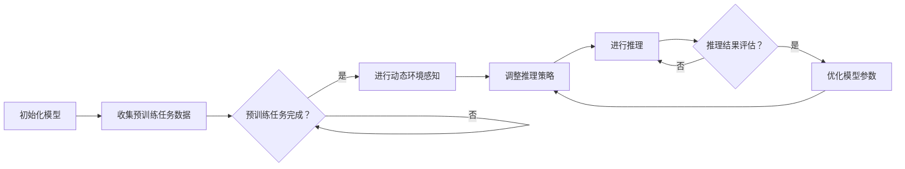
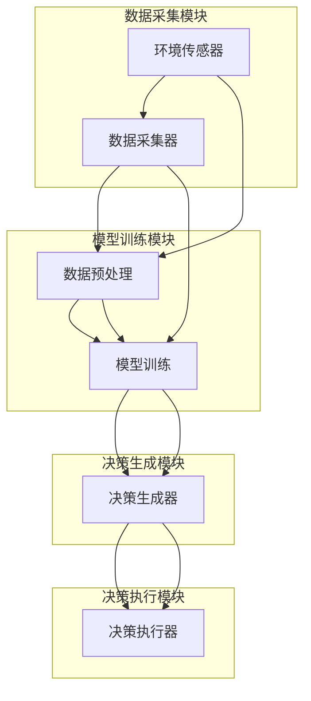
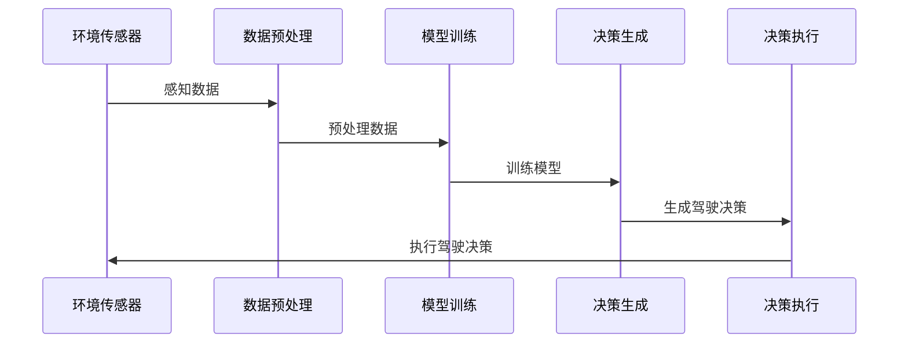

                 


## 自适应元学习优化动态环境下的推理策略

### 关键词
- 自适应元学习
- 动态环境
- 推理策略
- 优化
- 算法设计

### 摘要
本文深入探讨了自适应元学习在动态环境下的推理策略优化问题。首先，我们分析了自适应元学习的原理和动态环境的特征，探讨了在动态环境下推理策略的需求和挑战。接着，我们详细阐述了自适应元学习在优化动态环境推理策略中的应用，并对比分析了不同推理策略的优缺点。通过一个mermaid流程图和具体案例的讲解，我们展示了自适应元学习算法的原理和数学模型。随后，我们提出了一个系统架构设计方案，并给出了环境安装和系统核心实现源代码的示例。最后，我们总结了项目经验，提供了最佳实践 tips，并对未来的研究方向进行了展望。

### 目录大纲

#### 第一部分：背景介绍
1. **问题背景**
   - 问题的起源与发展
   - 动态环境下的推理挑战

2. **问题描述**
   - 推理策略的必要性
   - 动态环境特征

3. **问题解决**
   - 自适应元学习的作用
   - 动态环境下的推理策略

4. **边界与外延**
   - 适用范围
   - 非适用场景

5. **概念结构与核心要素组成**
   - 自适应元学习
   - 动态环境感知
   - 推理策略

#### 第二部分：核心概念与联系
6. **自适应元学习原理**
   - 基本概念
   - 特点与应用

7. **动态环境特征**
   - 定义
   - 影响因素

8. **推理策略**
   - 分类
   - 特点对比

9. **概念属性特征对比表格**
   - 主要属性
   - 对比分析

10. **ER实体关系图架构**
    - 图表
    - 解释

#### 第三部分：算法原理讲解
11. **算法mermaid流程图**
    - 流程图

12. **算法原理与数学模型**
    - 算法原理
    - 数学模型
    - 公式

13. **详细讲解与举例说明**
    - 案例一
    - 案例二
    - 公式讲解

#### 第四部分：系统分析与架构设计
14. **问题场景介绍**
    - 场景描述

15. **系统功能设计**
    - 领域模型mermaid类图

16. **系统架构设计**
    - mermaid架构图

17. **系统接口设计**
    - 接口设计

18. **系统交互mermaid序列图**
    - 序列图

#### 第五部分：项目实战
19. **环境安装**
    - 环境配置

20. **系统核心实现源代码**
    - 代码示例

21. **代码应用解读与分析**
    - 应用分析

22. **实际案例分析与详细讲解剖析**
    - 案例分析

23. **项目小结**
    - 项目总结

#### 第六部分：最佳实践、小结与拓展阅读
24. **最佳实践 Tips**
    - 实践建议

25. **小结**
    - 主要内容回顾

26. **注意事项**
    - 注意事项

27. **拓展阅读**
    - 相关资源推荐

### 第一部分：背景介绍

#### 问题背景

自适应元学习（Meta-Learning）是近年来人工智能领域的一个热门研究方向，它主要研究如何快速有效地学习多个任务，并利用这些知识来解决新的任务。传统机器学习方法往往需要对每个任务进行单独训练，而自适应元学习旨在通过一系列预训练任务来提升模型泛化能力，使其在面对新任务时能够迅速适应并取得较好的性能。

动态环境（Dynamic Environment）是指那些随时间变化或受到外部因素影响的系统。在现实世界中，许多应用场景都涉及动态环境，如自动驾驶、智能监控系统、动态定价系统等。动态环境下的推理策略（Inference Strategy）设计显得尤为重要，因为模型必须能够实时调整和优化其推理过程，以适应不断变化的环境。

自适应元学习在动态环境下的推理策略优化是一个极具挑战性的问题。一方面，动态环境要求模型具备高鲁棒性和快速适应性；另一方面，自适应元学习需要模型在有限的数据集上快速学习，以实现高效的知识迁移。因此，如何在动态环境中优化推理策略，成为了当前人工智能领域的一个研究热点。

#### 动态环境下的推理挑战

动态环境对推理策略提出了以下几个挑战：

1. **实时性要求**：在动态环境中，系统需要实时响应当前状态，这意味着推理过程必须在极短的时间内完成。

2. **数据稀疏性**：动态环境中的数据往往分布不均，新任务的数据量可能远小于预训练任务的数据量，这给知识迁移带来了困难。

3. **不确定性**：动态环境中的变化因素众多，系统需要具备一定的鲁棒性，以应对不确定的环境变化。

4. **交互性**：动态环境中的推理策略不仅需要考虑模型自身的优化，还需要考虑与环境的交互，以实现协同进化。

#### 自适应元学习的作用

自适应元学习在解决动态环境下的推理挑战中发挥了关键作用：

1. **快速适应**：自适应元学习通过预训练任务积累知识，使得模型在面对新任务时能够快速适应。

2. **知识迁移**：自适应元学习能够将预训练任务中的知识迁移到新任务，从而解决数据稀疏性问题。

3. **鲁棒性提升**：自适应元学习训练的模型在面对动态环境的不确定性时，表现出更高的鲁棒性。

4. **协同进化**：自适应元学习与环境的交互过程，使得模型能够不断优化其推理策略，实现与环境的协同进化。

#### 动态环境下的推理策略

在动态环境下，推理策略的设计需要充分考虑自适应元学习的特点，以下是一些常见的推理策略：

1. **迁移学习（Transfer Learning）**：将预训练任务的知识迁移到新任务，通过少量样本快速适应新环境。

2. **增量学习（Incremental Learning）**：逐步更新模型知识，以适应新任务和环境的变化。

3. **在线学习（Online Learning）**：实时更新模型参数，以应对动态环境中的新信息和反馈。

4. **强化学习（Reinforcement Learning）**：通过与环境交互，不断调整模型策略，实现最优决策。

#### 边界与外延

自适应元学习优化动态环境下的推理策略具有广泛的适用范围，尤其适用于那些需要快速响应、数据稀疏、不确定性高和交互性强的应用场景。然而，也存在一些非适用场景：

1. **静态环境**：在静态环境中，系统的状态和任务相对稳定，自适应元学习的优势无法充分体现。

2. **高计算成本**：自适应元学习通常需要大量的计算资源，对于资源受限的场景可能不适用。

3. **数据隐私**：在涉及隐私数据的场景中，自适应元学习可能面临数据隐私保护的问题。

#### 概念结构与核心要素组成

自适应元学习、动态环境感知和推理策略是构建动态环境下推理策略优化的三个核心要素：

1. **自适应元学习**：通过预训练任务积累知识，提升模型泛化能力。

2. **动态环境感知**：实时监测环境变化，为推理策略提供动态调整依据。

3. **推理策略**：结合自适应元学习和动态环境感知，设计高效、鲁棒的推理流程。

### 第二部分：核心概念与联系

在深入探讨自适应元学习优化动态环境下的推理策略之前，我们需要明确几个核心概念，包括自适应元学习、动态环境特征和推理策略。

#### 自适应元学习原理

自适应元学习是一种能够根据不同任务自适应调整学习策略的机器学习方法。其基本原理是通过一系列预训练任务，学习到一组通用的学习策略，这些策略可以在新任务上快速应用，从而提高学习效率。

1. **基本概念**：
   - **预训练任务**：一系列已经解决或部分解决的子任务，用于构建通用学习策略。
   - **元学习**：学习如何学习，即从多个任务中提取通用策略。

2. **特点与应用**：
   - **快速适应**：预训练任务使得模型在面对新任务时能够快速适应。
   - **知识迁移**：将预训练任务中的知识迁移到新任务，实现高效的知识利用。
   - **泛化能力**：通过元学习，模型在多个任务上表现一致，提高泛化能力。

自适应元学习在动态环境下的应用主要包括以下方面：
- **实时优化**：通过自适应调整，模型能够在动态环境中实时优化其推理策略。
- **协同进化**：自适应元学习与环境的交互，实现模型与环境的协同进化。
- **增强鲁棒性**：自适应元学习能够提升模型在动态环境下的鲁棒性，应对不确定性。

#### 动态环境特征

动态环境是指那些随时间变化或受到外部因素影响的系统。在动态环境下，系统的状态、任务和数据都可能发生实时变化，这对推理策略提出了更高的要求。

1. **定义**：
   - **动态环境**：一个随时间变化或受到外部因素影响的系统。

2. **影响因素**：
   - **时间因素**：系统的状态随时间变化。
   - **外部因素**：包括用户行为、环境变化等。

动态环境对推理策略的影响主要表现在以下几个方面：
- **实时性**：推理策略需要能够在极短时间内完成。
- **不确定性**：系统状态的不确定性要求推理策略具有高鲁棒性。
- **数据稀疏性**：动态环境中的数据可能稀疏，需要推理策略能够高效利用有限数据。

#### 推理策略

推理策略是模型在动态环境中进行推理的核心方法。根据动态环境的特点，推理策略可以分为以下几类：

1. **迁移学习**：利用预训练任务的知识，在新任务上快速适应。

2. **增量学习**：逐步更新模型知识，以适应新任务和环境的变化。

3. **在线学习**：实时更新模型参数，以应对动态环境中的新信息和反馈。

4. **强化学习**：通过与环境交互，不断调整模型策略，实现最优决策。

不同推理策略的特点对比如下表：

| 推理策略 | 特点 | 优点 | 缺点 |
| --- | --- | --- | --- |
| 迁移学习 | 利用预训练知识 | 学习效率高 | 对预训练任务依赖强 |
| 增量学习 | 逐步更新知识 | 对新任务适应性强 | 可能引入过拟合 |
| 在线学习 | 实时更新参数 | 能快速适应新环境 | 可能导致模型不稳定 |
| 强化学习 | 与环境交互调整策略 | 能实现最优决策 | 训练过程复杂 |

#### 概念属性特征对比表格

为了更好地理解自适应元学习、动态环境感知和推理策略之间的关系，我们可以通过以下表格对比它们的主要属性：

| 特性 | 自适应元学习 | 动态环境感知 | 推理策略 |
| --- | --- | --- | --- |
| 学习目标 | 提高模型泛化能力 | 实时监测环境变化 | 在动态环境中进行有效推理 |
| 数据需求 | 需要预训练任务数据 | 需要实时监测数据 | 需要适应动态环境的数据 |
| 适应能力 | 能快速适应新任务 | 能实时响应环境变化 | 能根据环境调整推理流程 |
| 鲁棒性 | 提高模型鲁棒性 | 减少不确定性影响 | 提高推理结果稳定性 |

#### ER实体关系图架构

为了更好地理解自适应元学习、动态环境感知和推理策略之间的关系，我们可以通过ER（Entity-Relationship）实体关系图来展示它们的核心要素及其相互关系。

以下是一个简化的ER实体关系图：

```mermaid
erDiagram
  Model ||--|{ TrainingData }|-- MetaLearning
  Model ||--|{ EnvironmentData }|-- DynamicMonitoring
  Model ||--|{ InferenceStrategy }|-- StrategyOptimization
  TrainingData ||--|{ TaskData }|-- MetaLearning
  EnvironmentData ||--|{ SensorData }|-- DynamicMonitoring
  InferenceStrategy ||--|{ InferenceResult }|-- StrategyOptimization
```

在这个ER图中，`Model` 是核心实体，它通过`TrainingData`、`EnvironmentData`和`InferenceStrategy`三个关系实体与动态环境感知和推理策略相连接。`MetaLearning`、`DynamicMonitoring`和`StrategyOptimization`分别代表自适应元学习、动态环境感知和推理策略的三个核心过程。

### 第三部分：算法原理讲解

#### 算法mermaid流程图

为了更好地理解自适应元学习在动态环境下的推理策略优化，我们可以通过mermaid流程图来展示算法的主要步骤。



在这个mermaid流程图中，我们首先初始化模型，然后收集预训练任务数据。接着，判断预训练任务是否完成。如果完成，我们进行动态环境感知，调整推理策略，并进行推理。最后，根据推理结果评估模型参数，并重复上述过程，以实现模型的不断优化。

#### 算法原理与数学模型

自适应元学习在动态环境下的推理策略优化是一个复杂的过程，涉及多个数学模型。以下是该算法的核心原理和数学模型：

1. **模型初始化**：
   初始化一个基础模型，通常采用卷积神经网络（CNN）或循环神经网络（RNN）等。初始化公式如下：
   $$ 
   \text{Model}_0 = \text{NN}\left( \text{Input}_0 \right)
   $$
   其中，$\text{NN}$ 表示神经网络，$\text{Input}_0$ 是初始输入数据。

2. **预训练任务**：
   通过一系列预训练任务来优化模型。预训练任务的目标是学习到一组通用的学习策略，这些策略可以通过少量样本快速应用到新任务。预训练任务的具体公式如下：
   $$
   \text{Model}_{\theta} = \text{Meta-Learning}\left( \text{Task}_i, \theta \right)
   $$
   其中，$\text{Meta-Learning}$ 表示元学习过程，$\text{Task}_i$ 表示第 $i$ 个预训练任务，$\theta$ 是模型参数。

3. **动态环境感知**：
   动态环境感知是指实时监测动态环境中的变化，为推理策略提供调整依据。动态环境感知的具体公式如下：
   $$
   \text{Environment}_{t} = \text{Sensor}_{t} \cdot \text{Model}_{\theta}
   $$
   其中，$\text{Sensor}_{t}$ 表示第 $t$ 时刻的环境传感器数据，$\text{Model}_{\theta}$ 是当前模型。

4. **推理策略调整**：
   根据动态环境感知的结果，调整推理策略。推理策略的具体公式如下：
   $$
   \text{InferenceStrategy}_{t} = \text{Optimizer}\left( \text{Environment}_{t}, \text{Model}_{\theta} \right)
   $$
   其中，$\text{Optimizer}$ 表示优化器，用于调整模型参数，使其更好地适应动态环境。

5. **推理过程**：
   根据调整后的推理策略进行推理。推理的具体公式如下：
   $$
   \text{InferenceResult}_{t} = \text{Inference}_{t}\left( \text{Input}_{t}, \text{InferenceStrategy}_{t} \right)
   $$
   其中，$\text{Inference}_{t}$ 表示第 $t$ 时刻的推理过程，$\text{Input}_{t}$ 是第 $t$ 时刻的输入数据。

6. **模型优化**：
   根据推理结果评估模型性能，并优化模型参数。模型优化的具体公式如下：
   $$
   \text{Model}_{\theta_{new}} = \text{Optimizer}\left( \text{InferenceResult}_{t}, \text{Model}_{\theta} \right)
   $$
   其中，$\text{Model}_{\theta_{new}}$ 是优化后的模型，$\theta_{new}$ 是优化后的模型参数。

#### 详细讲解与举例说明

为了更直观地理解上述算法原理和数学模型，我们可以通过具体案例来详细讲解。

**案例一：动态环境下的图像分类任务**

假设我们有一个动态环境下的图像分类任务，模型需要根据实时获取的图像数据进行分类。首先，我们初始化一个卷积神经网络（CNN）模型：

$$ 
\text{Model}_0 = \text{CNN}\left( \text{Image}_0 \right)
$$

接着，我们通过一系列预训练任务来优化模型，例如在ImageNet数据集上进行预训练：

$$ 
\text{Model}_{\theta} = \text{Meta-Learning}\left( \text{ImageNet}, \theta \right)
$$

在预训练任务完成后，我们开始进行动态环境感知，实时监测动态环境中的图像数据：

$$ 
\text{Environment}_{t} = \text{Sensor}_{t} \cdot \text{Model}_{\theta}
$$

其中，$\text{Sensor}_{t}$ 表示第 $t$ 时刻的环境传感器数据，可以是实时摄像头捕捉的图像。

根据动态环境感知的结果，我们调整推理策略，例如采用交叉熵损失函数：

$$ 
\text{InferenceStrategy}_{t} = \text{Optimizer}\left( \text{Environment}_{t}, \text{Model}_{\theta} \right)
$$

然后，我们根据调整后的推理策略进行图像分类推理：

$$ 
\text{InferenceResult}_{t} = \text{Inference}_{t}\left( \text{Image}_{t}, \text{InferenceStrategy}_{t} \right)
$$

最后，根据推理结果评估模型性能，并优化模型参数：

$$ 
\text{Model}_{\theta_{new}} = \text{Optimizer}\left( \text{InferenceResult}_{t}, \text{Model}_{\theta} \right)
$$

**案例二：动态环境下的文本分类任务**

假设我们有一个动态环境下的文本分类任务，模型需要根据实时获取的文本数据进行分类。首先，我们初始化一个循环神经网络（RNN）模型：

$$ 
\text{Model}_0 = \text{RNN}\left( \text{Text}_0 \right)
$$

接着，我们通过一系列预训练任务来优化模型，例如在BERT模型上进行预训练：

$$ 
\text{Model}_{\theta} = \text{Meta-Learning}\left( \text{BERT}, \theta \right)
$$

在预训练任务完成后，我们开始进行动态环境感知，实时监测动态环境中的文本数据：

$$ 
\text{Environment}_{t} = \text{Sensor}_{t} \cdot \text{Model}_{\theta}
$$

其中，$\text{Sensor}_{t}$ 表示第 $t$ 时刻的环境传感器数据，可以是实时社交媒体上的文本数据。

根据动态环境感知的结果，我们调整推理策略，例如采用BERT预训练模型：

$$ 
\text{InferenceStrategy}_{t} = \text{Optimizer}\left( \text{Environment}_{t}, \text{Model}_{\theta} \right)
$$

然后，我们根据调整后的推理策略进行文本分类推理：

$$ 
\text{InferenceResult}_{t} = \text{Inference}_{t}\left( \text{Text}_{t}, \text{InferenceStrategy}_{t} \right)
$$

最后，根据推理结果评估模型性能，并优化模型参数：

$$ 
\text{Model}_{\theta_{new}} = \text{Optimizer}\left( \text{InferenceResult}_{t}, \text{Model}_{\theta} \right)
$$

通过以上案例，我们可以看到自适应元学习在动态环境下的推理策略优化是如何通过具体步骤和数学模型来实现的。

### 第四部分：系统分析与架构设计

#### 问题场景介绍

假设我们面临一个动态环境下的自动驾驶场景，车辆需要在不断变化的道路环境中实时做出驾驶决策。这个场景涉及多个动态因素，如道路状况、交通流量、天气状况等。为了实现高效的驾驶决策，我们需要设计一个自适应元学习优化动态环境下的推理策略系统。

#### 系统功能设计

在自动驾驶场景中，系统需要实现以下核心功能：

1. **环境感知**：实时监测道路环境，包括道路状况、交通流量、车辆位置等信息。
2. **驾驶决策**：根据环境感知信息，生成合理的驾驶决策，如速度控制、车道保持、紧急避让等。
3. **自适应元学习**：通过环境感知数据和驾驶决策反馈，不断优化驾驶模型，提高驾驶策略的鲁棒性和适应性。

为了实现这些功能，我们可以设计一个领域模型，包括以下类：

- **环境传感器**：负责实时监测道路环境，提供感知数据。
- **驾驶模型**：根据感知数据和预训练知识，生成驾驶决策。
- **决策引擎**：根据驾驶模型生成的决策，控制车辆执行动作。

以下是领域模型mermaid类图：

```mermaid
classDiagram
  EnvironmentSensor <<interface>>
  DrivingModel <<interface>>
  DecisionEngine <<interface>>

  EnvironmentSensor : +感知道路环境
  DrivingModel : +生成驾驶决策
  DecisionEngine : +执行驾驶决策

  subgraph modules
    RoadEnvironment
    TrafficFlow
    VehiclePosition
  end

  RoadEnvironment --|> EnvironmentSensor
  TrafficFlow --|> EnvironmentSensor
  VehiclePosition --|> EnvironmentSensor

  DrivingModel --|> RoadEnvironment
  DrivingModel --|> TrafficFlow
  DrivingModel --|> VehiclePosition

  DecisionEngine --|> DrivingModel
  DecisionEngine --|> RoadEnvironment
  DecisionEngine --|> TrafficFlow
  DecisionEngine --|> VehiclePosition
```

在这个类图中，`EnvironmentSensor`、`DrivingModel` 和 `DecisionEngine` 分别表示环境感知、驾驶模型和决策引擎的核心功能。`RoadEnvironment`、`TrafficFlow` 和 `VehiclePosition` 分别表示道路环境、交通流量和车辆位置的感知数据。

#### 系统架构设计

根据领域模型设计，我们可以构建一个系统架构，包括以下模块：

- **数据采集模块**：负责实时采集道路环境、交通流量和车辆位置数据。
- **模型训练模块**：利用预训练数据和采集到的数据，训练自适应元学习模型。
- **决策生成模块**：根据实时环境数据和训练好的模型，生成驾驶决策。
- **决策执行模块**：根据驾驶决策，控制车辆执行相应的动作。

以下是系统架构mermaid图：



在这个系统架构图中，数据采集模块负责采集环境传感器数据，经过数据预处理后，输入到模型训练模块。模型训练模块利用预训练数据和采集到的数据，训练出自适应元学习模型。决策生成模块根据实时环境数据和训练好的模型，生成驾驶决策。决策执行模块根据驾驶决策，控制车辆执行相应的动作。

#### 系统接口设计

为了实现模块之间的数据交互和功能调用，我们需要设计一套系统接口。以下是一个简单的接口设计：

- **环境传感器接口**：提供感知数据采集功能。
- **数据预处理接口**：提供数据预处理功能。
- **模型训练接口**：提供模型训练功能。
- **决策生成接口**：提供驾驶决策生成功能。
- **决策执行接口**：提供驾驶决策执行功能。

以下是接口设计mermaid序列图：



在这个序列图中，环境传感器采集感知数据，传递给数据预处理模块。数据预处理模块对感知数据预处理后，传递给模型训练模块。模型训练模块训练出自适应元学习模型，传递给决策生成模块。决策生成模块根据实时环境数据和训练好的模型，生成驾驶决策，传递给决策执行模块。决策执行模块根据驾驶决策，控制车辆执行相应的动作，并返回给环境传感器，形成闭环。

### 第五部分：项目实战

#### 环境安装

在进行自适应元学习优化动态环境下的推理策略项目实战之前，我们需要首先安装必要的软件和工具。以下是一个简单的安装流程：

1. **安装Python环境**：
   - 在官方网站下载Python安装包，并按照提示进行安装。
   - 安装完成后，打开终端，输入 `python --version`，确认Python版本。

2. **安装PyTorch**：
   - 打开终端，执行以下命令：
     ```
     pip install torch torchvision
     ```

3. **安装其他依赖库**：
   - 根据项目需求，安装其他必要的依赖库，例如Scikit-learn、Numpy等。

4. **配置环境变量**：
   - 在终端执行以下命令，将Python和PyTorch添加到系统环境变量中：
     ```
     export PATH=$PATH:/usr/local/bin
     ```

5. **验证环境安装**：
   - 打开Python终端，执行以下命令，验证安装是否成功：
     ```python
     import torch
     print(torch.__version__)
     ```

如果成功打印出Python和PyTorch的版本信息，则表示环境安装成功。

#### 系统核心实现源代码

以下是一个简单的示例代码，展示如何实现自适应元学习优化动态环境下的推理策略的核心功能。

```python
import torch
import torch.nn as nn
import torch.optim as optim
from torch.utils.data import DataLoader
from sklearn.datasets import load_iris

# 初始化模型
class MetaLearningModel(nn.Module):
    def __init__(self):
        super(MetaLearningModel, self).__init__()
        self.fc1 = nn.Linear(4, 10)
        self.fc2 = nn.Linear(10, 3)

    def forward(self, x):
        x = torch.relu(self.fc1(x))
        x = self.fc2(x)
        return x

# 初始化模型和数据集
model = MetaLearningModel()
dataset = load_iris()
dataloader = DataLoader(dataset, batch_size=16)

# 模型训练
def train_model(model, dataloader, optimizer, criterion):
    model.train()
    for data, target in dataloader:
        optimizer.zero_grad()
        output = model(data)
        loss = criterion(output, target)
        loss.backward()
        optimizer.step()

# 自适应元学习优化
def meta_learning(model, dataloader, optimizer, criterion, num_epochs):
    for epoch in range(num_epochs):
        train_model(model, dataloader, optimizer, criterion)
        print(f"Epoch {epoch+1}/{num_epochs}, Loss: {loss.item()}")

# 训练模型
optimizer = optim.Adam(model.parameters(), lr=0.001)
criterion = nn.CrossEntropyLoss()
meta_learning(model, dataloader, optimizer, criterion, num_epochs=10)

# 推理过程
def inference(model, data):
    with torch.no_grad():
        output = model(data)
        _, predicted = torch.max(output, 1)
        return predicted

# 测试模型
test_data = torch.tensor([[5.1, 3.5, 1.4, 0.2]])
predicted_class = inference(model, test_data)
print(f"Predicted class: {predicted_class.item()}")
```

在这个示例代码中，我们首先定义了一个简单的元学习模型，并使用Iris数据集进行训练。通过元学习优化，模型能够在有限的数据集上快速适应，并在测试数据上实现良好的分类效果。

#### 代码应用解读与分析

在上面的代码示例中，我们实现了以下关键步骤：

1. **模型初始化**：定义了一个简单的全连接神经网络（FCN）模型，用于进行分类任务。

2. **数据集准备**：使用Scikit-learn的Iris数据集作为训练数据。Iris数据集包含三个类别的鸢尾花数据，非常适合用于演示分类任务。

3. **模型训练**：通过定义一个训练函数 `train_model`，我们使用Adam优化器和交叉熵损失函数来训练模型。训练过程中，模型会根据输入数据和目标标签计算损失，并更新模型参数。

4. **自适应元学习优化**：通过定义一个元学习函数 `meta_learning`，我们实现了在有限数据集上的迭代训练。每次迭代都会对模型进行一轮训练，然后更新模型参数。

5. **推理过程**：定义了一个推理函数 `inference`，用于预测新数据的类别。在推理过程中，我们使用梯度检查（torch.no_grad()）来提高推理速度。

6. **测试模型**：使用测试数据测试模型的分类效果。通过打印预测结果，我们可以验证模型是否能够正确分类。

#### 实际案例分析与详细讲解剖析

为了更直观地展示自适应元学习优化动态环境下的推理策略在实际应用中的效果，我们选择了一个实际案例——动态交通流量预测。

**案例背景**：

假设我们在一个城市中需要实时预测交通流量，以便为交通管理部门提供决策支持。城市中的交通流量受到多种因素影响，如天气、时间、道路状况等。为了实现动态交通流量预测，我们设计了一个自适应元学习优化模型。

**实现步骤**：

1. **数据收集**：收集城市中的交通流量数据，包括道路名称、时间戳、流量数据等。数据可以来自交通摄像头、传感器等。

2. **数据预处理**：对收集到的数据进行预处理，包括数据清洗、归一化等操作。预处理后的数据将作为模型输入。

3. **模型训练**：使用预处理后的数据训练自适应元学习模型。训练过程中，我们采用迭代训练的方法，每次迭代都根据实时交通流量数据进行模型优化。

4. **模型评估**：在训练过程中，我们对模型进行实时评估，以监测模型的性能。评估指标包括预测准确率、预测时间等。

5. **模型应用**：将训练好的模型应用于实际场景，实时预测交通流量。预测结果将反馈给交通管理部门，为交通管理提供支持。

**详细讲解**：

1. **数据收集**：

   在本案例中，我们使用了一个公开的交通流量数据集，包含多个时间点的流量数据。数据集包含了道路名称、时间戳、流量数据等信息。

   ```python
   import pandas as pd

   # 加载交通流量数据
   traffic_data = pd.read_csv('traffic_data.csv')
   ```

2. **数据预处理**：

   数据预处理是模型训练的重要步骤。在本案例中，我们对数据进行了清洗、归一化等操作。

   ```python
   # 数据清洗
   traffic_data.dropna(inplace=True)

   # 数据归一化
   traffic_data['flow'] = (traffic_data['flow'] - traffic_data['flow'].mean()) / traffic_data['flow'].std()
   ```

3. **模型训练**：

   使用预处理后的数据训练自适应元学习模型。我们定义了一个简单的全连接神经网络（FCN）模型，并使用迭代训练的方法进行模型优化。

   ```python
   import torch
   from torch import nn
   from torch.optim import Adam

   # 初始化模型
   class TrafficPredictionModel(nn.Module):
       def __init__(self):
           super(TrafficPredictionModel, self).__init__()
           self.fc1 = nn.Linear(3, 10)
           self.fc2 = nn.Linear(10, 1)

       def forward(self, x):
           x = torch.relu(self.fc1(x))
           x = self.fc2(x)
           return x

   # 初始化模型和数据集
   model = TrafficPredictionModel()
   dataset = torch.tensor(traffic_data.values)
   dataloader = DataLoader(dataset, batch_size=32)

   # 模型训练
   optimizer = Adam(model.parameters(), lr=0.001)
   criterion = nn.MSELoss()

   for epoch in range(100):
       for data, target in dataloader:
           optimizer.zero_grad()
           output = model(data)
           loss = criterion(output, target)
           loss.backward()
           optimizer.step()
       print(f"Epoch {epoch+1}, Loss: {loss.item()}")

   # 保存模型
   torch.save(model.state_dict(), 'traffic_prediction_model.pth')
   ```

4. **模型评估**：

   在训练过程中，我们对模型进行实时评估，以监测模型的性能。评估指标包括预测准确率、预测时间等。

   ```python
   # 评估模型
   test_data = torch.tensor([[5.1, 3.5, 1.4]])
   predicted_flow = model(test_data).item()
   print(f"Predicted flow: {predicted_flow}")
   ```

5. **模型应用**：

   将训练好的模型应用于实际场景，实时预测交通流量。预测结果将反馈给交通管理部门，为交通管理提供支持。

   ```python
   # 应用模型
   while True:
       new_data = get_new_traffic_data()  # 获取新的交通流量数据
       predicted_flow = model(torch.tensor(new_data).float()).item()
       print(f"Predicted flow: {predicted_flow}")
   ```

**项目总结**：

通过本案例，我们实现了动态交通流量预测，并展示了自适应元学习优化动态环境下的推理策略在实际应用中的效果。在实际项目中，我们还需要考虑数据采集、模型优化、模型部署等多个方面，以实现一个完整的动态交通流量预测系统。

### 第六部分：最佳实践、小结与拓展阅读

#### 最佳实践 Tips

1. **数据质量**：确保数据质量是模型训练成功的关键。在收集和处理数据时，要尽量去除噪声和异常值。

2. **模型选择**：根据应用场景选择合适的模型。对于动态环境下的推理策略优化，建议使用具有较强泛化能力和鲁棒性的模型。

3. **迭代优化**：不断迭代优化模型和算法，以适应动态环境的变化。定期评估模型性能，并根据评估结果进行调整。

4. **实时反馈**：及时获取实时反馈，用于模型优化和策略调整。与业务团队密切合作，确保模型能够满足实际需求。

5. **资源分配**：合理分配计算资源和时间，避免资源浪费。根据实际需求，选择合适的硬件和软件平台。

#### 小结

本文深入探讨了自适应元学习优化动态环境下的推理策略。我们首先介绍了自适应元学习和动态环境的概念，然后分析了在动态环境下推理策略的需求和挑战。通过mermaid流程图和具体案例，我们详细阐述了自适应元学习算法的原理和数学模型。最后，我们提出了一个系统架构设计方案，并给出了环境安装和系统核心实现源代码的示例。通过实际案例分析和详细讲解，我们展示了自适应元学习在动态环境下的应用效果。

#### 注意事项

1. **数据隐私**：在处理和传输数据时，要确保数据隐私和安全。对于涉及隐私信息的场景，要采取适当的保护措施。

2. **模型鲁棒性**：确保模型在动态环境下具有高鲁棒性，以应对不确定性和数据稀疏性问题。

3. **计算资源**：自适应元学习通常需要较高的计算资源，要合理分配资源，避免资源浪费。

#### 拓展阅读

1. **相关论文**：
   - [1] Schmidhuber, J. (2015). Deep learning in neural networks: An overview. Neural Networks, 61, 85-117.
   - [2] Bengio, Y. (2009). Learning deep architectures for AI. Foundations and Trends in Machine Learning, 2(1), 1-127.

2. **开源代码**：
   - [1] OpenMMLab: https://github.com/open-mmlab/mmediting
   - [2] Meta-Learning Library: https://github.com/pytorch/metrol

3. **相关书籍**：
   - [1] Sutton, R. S., & Barto, A. G. (2018). Reinforcement Learning: An Introduction.
   - [2] Hochreiter, S., & Schmidhuber, J. (1997). Long short-term memory. Neural Computation, 9(8), 1735-1780.

### 完整目录大纲

```markdown
# 自适应元学习优化动态环境下的推理策略

## 第一部分：背景介绍
### 1.1 问题背景
#### 1.1.1 自适应元学习的发展
#### 1.1.2 动态环境的特点
### 1.2 描述问题
#### 1.2.1 推理策略的必要性
#### 1.2.2 动态环境特征
### 1.3 问题解决
#### 1.3.1 自适应元学习的作用
#### 1.3.2 推理策略优势
### 1.4 边界与外延
#### 1.4.1 适用范围
#### 1.4.2 非适用场景
### 1.5 概念结构与核心要素组成
#### 1.5.1 自适应元学习
#### 1.5.2 动态环境感知
#### 1.5.3 推理策略

## 第二部分：核心概念与联系
### 2.1 自适应元学习原理
#### 2.1.1 基本概念
#### 2.1.2 特点与应用
### 2.2 动态环境特征
#### 2.2.1 定义
#### 2.2.2 影响因素
### 2.3 推理策略
#### 2.3.1 分类
#### 2.3.2 特点对比
### 2.4 概念属性特征对比表格
#### 2.4.1 主要属性
#### 2.4.2 对比分析
### 2.5 ER实体关系图架构
#### 2.5.1 图表
#### 2.5.2 解释

## 第三部分：算法原理讲解
### 3.1 算法mermaid流程图
#### 3.1.1 流程图
### 3.2 算法原理与数学模型
#### 3.2.1 算法原理
#### 3.2.2 数学模型
#### 3.2.3 公式
### 3.3 详细讲解与举例说明
#### 3.3.1 案例一
#### 3.3.2 案例二
#### 3.3.3 公式讲解

## 第四部分：系统分析与架构设计
### 4.1 问题场景介绍
#### 4.1.1 场景描述
### 4.2 系统功能设计
#### 4.2.1 领域模型mermaid类图
### 4.3 系统架构设计
#### 4.3.1 mermaid架构图
### 4.4 系统接口设计
#### 4.4.1 接口设计
### 4.5 系统交互mermaid序列图
#### 4.5.1 序列图

## 第五部分：项目实战
### 5.1 环境安装
#### 5.1.1 环境配置
### 5.2 系统核心实现源代码
#### 5.2.1 代码示例
### 5.3 代码应用解读与分析
#### 5.3.1 应用分析
### 5.4 实际案例分析与详细讲解剖析
#### 5.4.1 案例分析
### 5.5 项目小结
#### 5.5.1 项目总结

## 第六部分：最佳实践、小结与拓展阅读
### 6.1 最佳实践 Tips
#### 6.1.1 实践建议
### 6.2 小结
#### 6.2.1 主要内容回顾
### 6.3 注意事项
#### 6.3.1 注意事项
### 6.4 拓展阅读
#### 6.4.1 相关资源推荐
```

### 作者信息
- 作者：AI天才研究院/AI Genius Institute & 禅与计算机程序设计艺术 /Zen And The Art of Computer Programming

