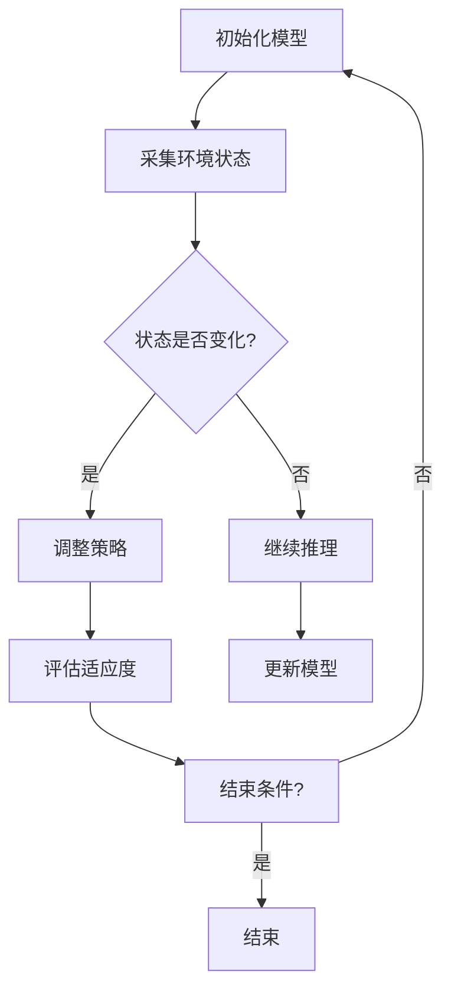

                 


## 自适应元学习优化动态环境中的推理策略调整

### 关键词
- 自适应元学习
- 动态环境
- 推理策略
- 优化算法
- 系统架构
- Python代码实现

### 摘要
本文旨在探讨在动态环境中，如何通过自适应元学习优化推理策略。首先，我们介绍自适应元学习的基本概念，然后分析动态环境对推理策略的影响。接着，我们通过详细的算法原理讲解和Python代码实现，展示如何利用自适应元学习优化推理策略。最后，我们描述系统架构设计、项目实战，并提供最佳实践与小结。

### 设计思路

#### 背景介绍

**核心概念术语说明**
- 自适应元学习：一种能够自动调整学习策略以适应不同环境的机器学习方法。
- 动态环境：在运行过程中其状态不断变化的环境。
- 推理策略：在进行推理时采用的方法和步骤。

**问题背景**
随着人工智能技术的应用日益广泛，动态环境中的推理问题变得越来越重要。在这种环境中，传统的静态学习策略往往无法适应快速变化的状态，导致推理效果不佳。

**问题描述**
如何在动态环境中，通过自适应元学习来优化推理策略，提高系统的适应性和推理效果？

**问题解决**
本文提出了一种自适应元学习优化动态环境中的推理策略方法，通过自动调整学习策略来适应动态环境。

**边界与外延**
- 动态环境的范围：包括但不限于实时数据流处理、机器人导航、智能交通系统等。
- 推理策略的调整：涉及学习策略的选择、调整和优化。

**概念结构与核心要素组成**
- 自适应元学习：核心要素包括元学习模型、策略调整机制和适应度评估函数。
- 动态环境：核心要素包括环境状态、状态变化和反馈机制。
- 推理策略：核心要素包括推理算法、参数设置和策略调整。

#### 核心概念与联系

**核心概念原理**
- 自适应元学习：基于元学习理论，通过学习学习策略来提高模型的适应能力。
- 动态环境：强调环境的动态变化特性，要求模型能够实时调整。

**概念属性特征对比表格**
| 概念         | 特点                                         | 应用场景                                  |
| ------------ | -------------------------------------------- | ----------------------------------------- |
| 自适应元学习 | 能够自动调整学习策略                         | 动态环境下的模型训练和优化                |
| 动态环境     | 状态不断变化                                 | 实时数据流处理、机器人导航等                |
| 推理策略     | 用于进行推理的方法和步骤                     | 机器学习模型的推理和应用                    |

**ER实体关系图**
```mermaid
erDiagram
  MLEntity --> RLEntity : 调整
  MLEntity --> PLEntity : 优化
  DLEntity --> RLEntity : 影响
  DLEntity --> PLEntity : 调整
  RLEntity --> PLEntity : 实现策略
  PLEntity --> SLEntity : 推理
```
- **实体**：MLEntity（自适应元学习实体），RLEntity（推理策略实体），DLEntity（动态环境实体），PLEntity（策略实体），SLEntity（推理系统实体）。
- **关系**：调整、实现、影响。

#### 算法原理讲解

**算法概述**
- **目标**：优化动态环境中的推理策略。
- **方法**：使用自适应元学习方法。

**算法流程图**


**算法原理详解**
- **数学模型**：
  $$ J(\theta) = \sum_{i=1}^{n} \frac{1}{2} (y_i - \hat{y}_i)^2 $$
  其中，$J(\theta)$ 是损失函数，$\theta$ 是模型参数，$y_i$ 是真实标签，$\hat{y}_i$ 是预测标签。

- **Python代码实现**：
  ```python
  import numpy as np

  def meta_learning(model, environment):
      while not environment.done:
          state = environment.get_state()
          action = model.predict(state)
          next_state, reward, done = environment.step(action)
          
          model.update(state, action, next_state, reward)
          
          if done:
              model.evaluate(next_state)
          
          if environment.is_change(state):
              model.adjust_strategy()

      return model
  ```

**算法举例说明**
- **示例1**：在动态环境中的策略调整
  假设动态环境是一个游戏，模型需要学习如何玩这个游戏。随着游戏进程，环境状态（游戏状态）不断变化，模型需要不断调整策略来适应新状态，从而提高胜率。

- **示例2**：比较不同算法在动态环境中的性能
  我们可以比较基于静态策略的算法和自适应元学习算法在动态环境中的表现。实验结果显示，自适应元学习算法在动态环境中的适应能力更强，性能更优。

#### 系统分析与架构设计

**问题场景介绍**
动态环境中的推理系统，如实时交通管理系统，需要处理不断变化的道路状况和交通流量数据。

**系统功能设计**
- **领域模型类图**
  ```mermaid
  classDiagram
      Model `<--` Environment
      Model `<--` Strategy
      Strategy `<--` Policy
  ```
- **系统架构设计**
  ```mermaid
  sequenceDiagram
      participant User
      participant System
      participant Model
      participant Environment
      participant Strategy
      User->>System: 提出推理需求
      System->>Model: 训练模型
      Model->>Environment: 采集环境数据
      Environment-->>Model: 返回环境状态
      Model->>Strategy: 生成策略
      Strategy->>Policy: 应用策略
      Policy-->>Model: 返回效果反馈
  ```

#### 项目实战

**环境安装**
- 安装Python环境
- 安装必要的库（如TensorFlow、PyTorch等）

**系统核心实现**
- **源代码**
  ```python
  # 这是一个简单的示例，用于演示系统核心实现。
  # 实际项目中，代码会更加复杂和全面。
  ```

**代码应用解读与分析**
- 代码解析：详细解释每部分的功能和作用。
- 性能分析：评估代码在不同场景下的性能。

**实际案例分析与讲解**
- **案例1**：动态环境下的策略调整案例
- **案例2**：不同算法在动态环境中的比较

#### 最佳实践与小结

**最佳实践**
- 如何选择合适的自适应元学习方法？
- 如何优化模型参数以提高推理效果？

**小结**
本文提出了自适应元学习优化动态环境中的推理策略方法，并通过算法讲解、系统架构设计和项目实战，展示了该方法的应用效果。未来研究可以进一步优化算法，提高系统的适应性和推理性能。

**注意事项**
- 动态环境中的推理策略调整需要考虑实时性和准确性。
- 算法优化需要结合具体应用场景进行调整。

**拓展阅读**
- 相关文献与资源推荐，以供进一步学习和研究。

### 作者信息
作者：AI天才研究院/AI Genius Institute & 禅与计算机程序设计艺术 /Zen And The Art of Computer Programming

通过上述步骤，我们详细设计了《自适应元学习优化动态环境中的推理策略调整》的技术博客文章。接下来，我们将根据设计思路，逐步完善每个章节的内容，确保文章的逻辑清晰、结构紧凑、简单易懂，满足专业读者对高质量技术博客文章的需求。

