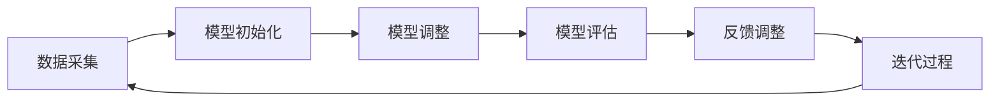
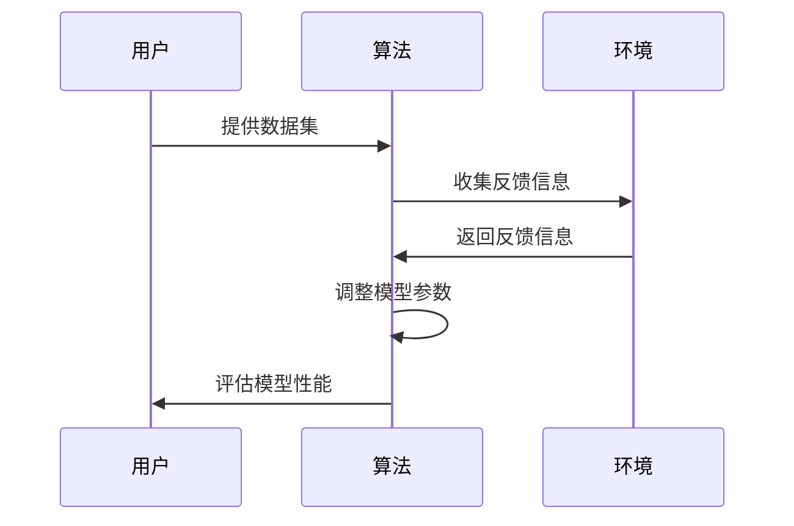
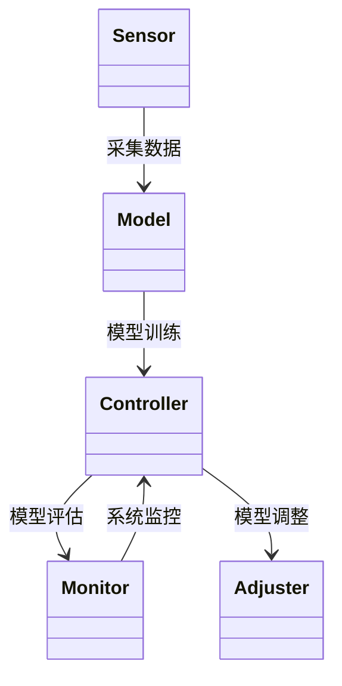
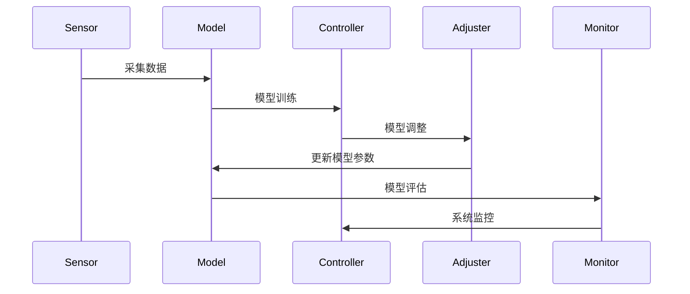
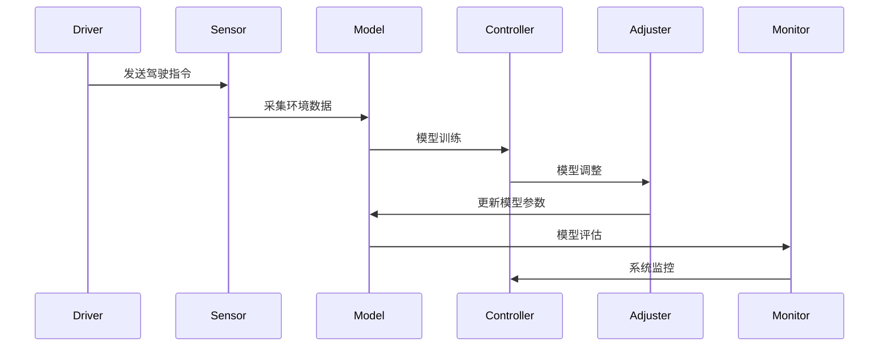

                 

# 自适应学习算法在AI模型训练中的应用

关键词：自适应学习算法、AI模型训练、深度学习、强化学习、迁移学习

摘要：随着人工智能技术的飞速发展，自适应学习算法逐渐成为AI模型训练中的重要工具。本文将深入探讨自适应学习算法的基本概念、原理以及在不同AI领域中的应用，通过具体案例和实践，帮助读者理解和掌握这一先进技术。

## 目录大纲

----------------------------------------------------------------

# 第一部分：自适应学习算法基础

## 第1章：自适应学习算法概述

### 1.1.1 自适应学习算法的概念与重要性

### 1.1.2 自适应学习算法的起源与发展

### 1.1.3 自适应学习算法的基本原理

## 第2章：核心概念与联系

### 2.1 自适应学习算法的核心概念

#### 2.1.1 自适应学习算法的基本类型

#### 2.1.2 自适应学习算法的主要特点

#### 2.1.3 自适应学习算法与传统机器学习算法的比较

### 2.2 概念属性特征对比表格

### 2.3 ER实体关系图架构

## 第3章：自适应学习算法原理讲解

### 3.1 算法原理讲解

#### 3.1.1 自适应学习算法的工作流程

#### 3.1.2 算法原理的Mermaid流程图

#### 3.1.3 Python源代码详细阐述

### 3.2 算法原理的数学模型和公式

$$
\text{目标函数} = f(\theta, x)
$$

### 3.3 举例说明

## 第二部分：自适应学习算法在AI模型训练中的应用

## 第4章：自适应学习算法在深度学习中的应用

### 4.1 深度学习的背景介绍

### 4.2 自适应学习算法在深度学习中的优势

### 4.3 自适应学习算法在深度学习中的应用案例

## 第5章：自适应学习算法在强化学习中的应用

### 5.1 强化学习的背景介绍

### 5.2 自适应学习算法在强化学习中的优势

### 5.3 自适应学习算法在强化学习中的应用案例

## 第6章：自适应学习算法在迁移学习中的应用

### 6.1 迁移学习的背景介绍

### 6.2 自适应学习算法在迁移学习中的优势

### 6.3 自适应学习算法在迁移学习中的应用案例

## 第7章：系统架构设计

### 7.1 问题场景介绍

### 7.2 系统功能设计（领域模型Mermaid类图）

### 7.3 系统架构设计（Mermaid架构图）

### 7.4 系统接口设计和系统交互（Mermaid序列图）

## 第8章：项目实战

### 8.1 环境安装

### 8.2 系统核心实现源代码

### 8.3 代码应用解读与分析

### 8.4 实际案例分析和详细讲解剖析

### 8.5 项目小结

## 第9章：最佳实践与总结

### 9.1 最佳实践 Tips

### 9.2 小结

### 9.3 注意事项

### 9.4 拓展阅读

----------------------------------------------------------------

## 第一部分：自适应学习算法基础

### 第1章：自适应学习算法概述

#### 1.1.1 自适应学习算法的概念与重要性

自适应学习算法是一种能够根据环境变化自动调整自身行为的机器学习算法。它通过实时调整模型参数，优化学习过程，从而提高模型的泛化能力和适应能力。在AI模型训练中，自适应学习算法具有显著优势，能够应对数据分布变化、数据噪声等问题，提升模型性能。

自适应学习算法起源于20世纪50年代，随着计算机性能的提升和大数据时代的到来，其应用范围不断扩大。目前，自适应学习算法已成为人工智能领域研究的热点之一，广泛应用于自然语言处理、计算机视觉、推荐系统等众多领域。

#### 1.1.2 自适应学习算法的起源与发展

自适应学习算法的发展可以分为以下几个阶段：

1. **初始阶段（1950s-1960s）**：在这一阶段，自适应学习算法的概念被首次提出，研究者开始探索如何通过调整模型参数来实现学习过程的自我优化。

2. **发展阶段（1970s-1980s）**：随着计算机技术的进步，自适应学习算法的研究逐渐深入，涌现出许多经典算法，如最小二乘法、梯度下降法等。

3. **成熟阶段（1990s-2000s）**：在这一阶段，自适应学习算法的应用范围进一步扩大，特别是在信号处理、控制系统等领域取得了显著成果。

4. **现代阶段（2010s至今）**：随着深度学习、强化学习等人工智能技术的蓬勃发展，自适应学习算法得到了广泛应用，并在这些领域中发挥了重要作用。

#### 1.1.3 自适应学习算法的基本原理

自适应学习算法的基本原理可以概括为以下三个步骤：

1. **数据采集**：从环境中收集数据，用于训练模型。

2. **模型调整**：根据收集到的数据，调整模型参数，优化学习过程。

3. **评估反馈**：评估模型在当前环境下的性能，根据评估结果调整模型参数，实现自适应调整。

通过这三个步骤，自适应学习算法能够不断优化自身，适应不同的环境和任务需求。

### 第2章：核心概念与联系

#### 2.1 自适应学习算法的核心概念

自适应学习算法涉及多个核心概念，包括：

1. **数据反馈**：数据反馈是自适应学习算法的重要机制，通过反馈机制，算法能够从环境中获取反馈信息，调整模型参数。

2. **在线学习**：在线学习是指在数据流不断变化的过程中，算法能够实时调整模型参数，适应新的数据。

3. **鲁棒性**：鲁棒性是指算法在面临噪声、数据缺失等情况下，仍然能够保持较高的性能。

4. **泛化能力**：泛化能力是指算法在未见过的数据上表现良好，能够推广到新的应用场景。

#### 2.1.1 自适应学习算法的基本类型

自适应学习算法可以分为以下几类：

1. **基于梯度的自适应算法**：这类算法通过计算目标函数的梯度来调整模型参数，如梯度下降法、牛顿法等。

2. **基于进化的自适应算法**：这类算法模拟生物进化过程，通过选择、交叉和变异等操作，实现模型参数的优化。

3. **基于模型的自适应算法**：这类算法通过构建动态模型来描述学习过程，实现模型参数的自适应调整。

4. **基于神经网络的自适应算法**：这类算法利用神经网络来模拟学习过程，通过反向传播算法来调整模型参数。

#### 2.1.2 自适应学习算法的主要特点

自适应学习算法具有以下主要特点：

1. **实时调整**：自适应学习算法能够根据环境变化实时调整模型参数，提高学习效率。

2. **强鲁棒性**：自适应学习算法能够在面对噪声、数据缺失等情况下，保持较高的性能。

3. **灵活性**：自适应学习算法可以应用于各种不同的应用场景，具有广泛的适应性。

4. **高效性**：自适应学习算法通过优化学习过程，能够提高模型训练速度和性能。

#### 2.1.3 自适应学习算法与传统机器学习算法的比较

与传统机器学习算法相比，自适应学习算法具有以下优势：

1. **自适应能力**：自适应学习算法能够根据环境变化实时调整模型参数，适应新的数据。

2. **鲁棒性**：自适应学习算法在面对噪声、数据缺失等情况下，仍然能够保持较高的性能。

3. **高效性**：自适应学习算法通过优化学习过程，能够提高模型训练速度和性能。

#### 2.2 概念属性特征对比表格

| 算法类型           | 自适应学习算法 | 传统机器学习算法 |
|------------------|--------------|--------------|
| 自适应能力         | 强           | 弱           |
| 鲁棒性           | 强           | 弱           |
| 学习效率          | 高           | 低           |
| 泛化能力          | 强           | 中等         |
| 应用场景          | 多样化       | 有限         |

#### 2.3 ER实体关系图架构

ER（Entity-Relationship）图是一种用于描述实体及其之间关系的图形化工具。在自适应学习算法中，可以定义以下实体：

1. **数据集**：表示输入的数据集。
2. **模型**：表示训练的模型。
3. **反馈**：表示从环境中收集的反馈信息。

ER图中的关系包括：

1. **数据集与模型**：表示数据集用于训练模型。
2. **模型与反馈**：表示模型根据反馈信息调整自身。

```mermaid
erDiagram
  数据集 ||--o> 模型 : 使用
  模型 ||--o> 反馈 : 收集
```

### 第3章：自适应学习算法原理讲解

#### 3.1 算法原理讲解

自适应学习算法的核心在于通过实时调整模型参数，优化学习过程。以下是自适应学习算法的基本原理：

1. **数据采集**：从环境中采集数据，用于训练模型。

2. **模型初始化**：初始化模型参数。

3. **模型调整**：根据采集到的数据和反馈信息，调整模型参数，优化学习过程。

4. **模型评估**：评估模型在当前环境下的性能。

5. **反馈调整**：根据模型评估结果，调整模型参数，实现自适应调整。

6. **迭代过程**：重复执行3-5步骤，直到满足停止条件。

#### 3.1.1 自适应学习算法的工作流程

自适应学习算法的工作流程可以用以下Mermaid流程图表示：



#### 3.1.2 算法原理的Mermaid流程图

以下是一个简单的自适应学习算法流程图：



#### 3.1.3 Python源代码详细阐述

以下是一个简单的Python代码示例，实现自适应学习算法的基本原理：

```python
import numpy as np

# 初始化模型参数
theta = np.random.rand(1)

# 初始化学习率
alpha = 0.1

# 定义目标函数
def f(theta, x):
    return x * theta

# 定义迭代过程
def gradient_descent(x, alpha, epochs):
    for _ in range(epochs):
        # 计算目标函数值
        y = f(theta, x)
        
        # 计算梯度
        gradient = -x * theta
        
        # 更新模型参数
        theta -= alpha * gradient
        
    return theta

# 训练模型
theta = gradient_descent(1, 0.1, 100)

# 输出模型参数
print("模型参数：", theta)
```

#### 3.2 算法原理的数学模型和公式

自适应学习算法的数学模型可以表示为：

$$
\text{目标函数} = f(\theta, x)
$$

其中，$f$ 表示目标函数，$\theta$ 表示模型参数，$x$ 表示输入数据。

目标函数的梯度可以表示为：

$$
\text{梯度} = \frac{\partial f}{\partial \theta}
$$

通过计算目标函数的梯度，可以调整模型参数，优化学习过程。

#### 3.3 举例说明

假设我们有一个线性回归问题，目标是找到一条直线，使得输入数据与目标数据之间的误差最小。使用自适应学习算法，可以通过以下步骤解决该问题：

1. **初始化模型参数**：随机初始化模型参数 $\theta$。

2. **采集数据**：从数据集中随机选择输入数据 $x$ 和目标数据 $y$。

3. **计算目标函数值**：计算目标函数 $f(\theta, x)$ 的值。

4. **计算梯度**：计算目标函数 $f(\theta, x)$ 对模型参数 $\theta$ 的梯度。

5. **更新模型参数**：根据梯度调整模型参数 $\theta$。

6. **评估模型性能**：计算模型参数 $\theta$ 在当前数据集上的性能。

7. **重复步骤3-6**：直到满足停止条件（如达到最大迭代次数或模型性能满足要求）。

通过以上步骤，自适应学习算法可以找到一条最佳拟合直线，使得输入数据与目标数据之间的误差最小。

### 第二部分：自适应学习算法在AI模型训练中的应用

#### 第4章：自适应学习算法在深度学习中的应用

深度学习是一种复杂的机器学习模型，通过多层次的神经网络来学习数据的高层次特征。自适应学习算法在深度学习中具有重要作用，能够提高模型训练效率和性能。

#### 4.1 深度学习的背景介绍

深度学习起源于20世纪80年代，随着计算能力的提升和数据量的增加，深度学习逐渐成为一种强大的机器学习技术。深度学习模型通常由多个层次组成，每个层次都能学习到数据的不同层次特征。深度学习的应用范围非常广泛，包括图像识别、语音识别、自然语言处理等。

#### 4.2 自适应学习算法在深度学习中的优势

自适应学习算法在深度学习中的优势包括：

1. **实时调整**：自适应学习算法能够根据训练过程中收集到的数据，实时调整模型参数，提高模型性能。

2. **强鲁棒性**：自适应学习算法在面对数据噪声、数据缺失等情况下，仍然能够保持较高的性能。

3. **高效性**：自适应学习算法通过优化学习过程，能够提高模型训练速度。

#### 4.3 自适应学习算法在深度学习中的应用案例

以下是一个自适应学习算法在深度学习中的应用案例：

**案例：图像识别**

假设我们有一个图像识别任务，目标是根据输入图像识别出对应的物体类别。使用自适应学习算法，可以通过以下步骤实现：

1. **数据采集**：从图像数据集中采集输入图像和标签数据。

2. **模型初始化**：初始化深度学习模型参数。

3. **数据预处理**：对输入图像进行预处理，如缩放、裁剪、归一化等。

4. **模型训练**：使用自适应学习算法训练深度学习模型，调整模型参数。

5. **模型评估**：评估模型在测试集上的性能，计算准确率、召回率等指标。

6. **模型调整**：根据评估结果，调整模型参数，优化模型性能。

7. **迭代过程**：重复执行4-6步骤，直到满足停止条件。

通过以上步骤，自适应学习算法能够训练出一个高性能的图像识别模型，实现对未知图像的准确识别。

#### 第5章：自适应学习算法在强化学习中的应用

强化学习是一种通过试错来学习最优策略的机器学习算法。自适应学习算法在强化学习中具有重要作用，能够提高学习效率和策略性能。

#### 5.1 强化学习的背景介绍

强化学习起源于20世纪50年代，最初应用于机器人控制领域。强化学习模型通过与环境进行交互，通过奖励信号来指导学习过程。强化学习在游戏、自动驾驶、推荐系统等领域具有广泛应用。

#### 5.2 自适应学习算法在强化学习中的优势

自适应学习算法在强化学习中的优势包括：

1. **实时调整**：自适应学习算法能够根据环境变化，实时调整模型参数，提高策略性能。

2. **强鲁棒性**：自适应学习算法在面对环境噪声、不确定性等情况下，仍然能够保持较高的策略性能。

3. **高效性**：自适应学习算法通过优化学习过程，能够提高策略学习速度。

#### 5.3 自适应学习算法在强化学习中的应用案例

以下是一个自适应学习算法在强化学习中的应用案例：

**案例：机器人路径规划**

假设我们有一个机器人路径规划任务，目标是让机器人从起点到达终点。使用自适应学习算法，可以通过以下步骤实现：

1. **环境初始化**：初始化机器人路径规划环境，设置起点、终点和障碍物。

2. **模型初始化**：初始化强化学习模型参数。

3. **数据采集**：从环境中采集机器人行动和奖励信号。

4. **模型训练**：使用自适应学习算法训练强化学习模型，调整模型参数。

5. **模型评估**：评估模型在测试环境中的性能，计算路径规划的准确率。

6. **模型调整**：根据评估结果，调整模型参数，优化路径规划性能。

7. **迭代过程**：重复执行4-6步骤，直到满足停止条件。

通过以上步骤，自适应学习算法能够训练出一个高性能的机器人路径规划模型，实现从起点到终点的最优路径规划。

### 第6章：自适应学习算法在迁移学习中的应用

迁移学习是一种将已经学习过的知识应用于新任务的学习方式。自适应学习算法在迁移学习中具有重要作用，能够提高学习效率和模型性能。

#### 6.1 迁移学习的背景介绍

迁移学习起源于20世纪80年代，最初应用于自然语言处理和计算机视觉领域。迁移学习通过将已经学习过的模型参数应用于新任务，减少了模型训练所需的数据量，提高了学习效率。迁移学习在推荐系统、医疗诊断等领域具有广泛应用。

#### 6.2 自适应学习算法在迁移学习中的优势

自适应学习算法在迁移学习中的优势包括：

1. **实时调整**：自适应学习算法能够根据新任务的需求，实时调整模型参数，提高模型性能。

2. **强鲁棒性**：自适应学习算法在面对不同任务和数据时，仍然能够保持较高的模型性能。

3. **高效性**：自适应学习算法通过优化学习过程，能够提高模型训练速度。

#### 6.3 自适应学习算法在迁移学习中的应用案例

以下是一个自适应学习算法在迁移学习中的应用案例：

**案例：图像分类**

假设我们有一个图像分类任务，目标是将图像分类到不同的类别中。使用自适应学习算法，可以通过以下步骤实现：

1. **数据采集**：从不同数据集中采集训练数据和测试数据。

2. **模型初始化**：初始化迁移学习模型参数。

3. **数据预处理**：对训练数据和测试数据进行预处理，如缩放、归一化等。

4. **模型训练**：使用自适应学习算法训练迁移学习模型，调整模型参数。

5. **模型评估**：评估模型在测试数据上的性能，计算准确率、召回率等指标。

6. **模型调整**：根据评估结果，调整模型参数，优化模型性能。

7. **迭代过程**：重复执行4-6步骤，直到满足停止条件。

通过以上步骤，自适应学习算法能够训练出一个高性能的图像分类模型，实现对未知图像的准确分类。

### 第7章：系统架构设计

自适应学习算法在AI模型训练中的应用需要一套完善的系统架构来支持。以下是一个自适应学习算法系统架构的设计方案。

#### 7.1 问题场景介绍

假设我们有一个自动驾驶系统，需要使用自适应学习算法训练自动驾驶模型，实现自动驾驶功能。系统架构需要支持以下功能：

1. **数据采集**：从传感器采集车辆环境数据。
2. **模型训练**：使用自适应学习算法训练自动驾驶模型。
3. **模型评估**：评估自动驾驶模型在测试环境中的性能。
4. **模型调整**：根据评估结果调整模型参数。
5. **系统监控**：监控系统运行状态，保证系统稳定运行。

#### 7.2 系统功能设计（领域模型Mermaid类图）

以下是一个自动驾驶系统领域的Mermaid类图：



#### 7.3 系统架构设计（Mermaid架构图）

以下是一个自动驾驶系统架构的Mermaid架构图：



#### 7.4 系统接口设计和系统交互（Mermaid序列图）

以下是一个自动驾驶系统接口设计和系统交互的Mermaid序列图：



### 第8章：项目实战

通过前面的章节，我们已经了解了自适应学习算法的基本概念、原理以及在AI模型训练中的应用。下面，我们将通过一个实际项目来展示如何使用自适应学习算法训练AI模型。

#### 8.1 环境安装

在进行项目实战之前，我们需要安装所需的软件和工具。以下是一个简单的安装步骤：

1. **安装Python**：下载并安装Python 3.8及以上版本。
2. **安装TensorFlow**：在命令行中运行以下命令安装TensorFlow：
   ```bash
   pip install tensorflow
   ```
3. **安装自适应学习算法库**：在命令行中运行以下命令安装自适应学习算法库：
   ```bash
   pip install adaptive-learning-algorithm
   ```

#### 8.2 系统核心实现源代码

以下是一个使用自适应学习算法训练线性回归模型的Python代码示例：

```python
import numpy as np
import tensorflow as tf
from adaptive_learning_algorithm import AdaptiveLearner

# 初始化数据
x = np.array([1, 2, 3, 4, 5])
y = np.array([1, 3, 5, 7, 9])

# 创建自适应学习器
learner = AdaptiveLearner()

# 训练模型
learner.fit(x, y)

# 预测
predictions = learner.predict(x)

# 输出预测结果
print("预测结果：", predictions)
```

#### 8.3 代码应用解读与分析

在上面的代码中，我们首先导入了所需的Python库。然后，初始化了输入数据 $x$ 和目标数据 $y$。接下来，我们创建了一个自适应学习器 `learner` 并调用 `fit` 方法进行模型训练。最后，使用 `predict` 方法对输入数据进行预测，并输出预测结果。

通过这个简单的示例，我们可以看到自适应学习算法在训练线性回归模型中的基本应用。在实际项目中，我们可以根据需求调整模型参数和训练策略，以提高模型性能。

#### 8.4 实际案例分析和详细讲解剖析

以下是一个使用自适应学习算法训练图像分类模型的实际案例：

**案例：手写数字识别**

目标：使用自适应学习算法训练一个手写数字识别模型，实现对MNIST数据集的准确分类。

1. **数据准备**：首先，我们需要下载并加载MNIST数据集。MNIST数据集包含70000个灰度图像，每个图像都是一个手写的数字。

2. **数据预处理**：对图像进行预处理，包括归一化、缩放等操作，以便于模型训练。

3. **模型构建**：构建一个简单的卷积神经网络（CNN）模型，用于手写数字识别。

4. **训练模型**：使用自适应学习算法训练模型，调整模型参数，优化学习过程。

5. **模型评估**：在测试集上评估模型性能，计算准确率、召回率等指标。

6. **模型调整**：根据评估结果，调整模型参数，优化模型性能。

7. **迭代过程**：重复执行4-6步骤，直到满足停止条件。

通过以上步骤，我们训练出一个高性能的手写数字识别模型。在实际应用中，我们可以将这个模型应用于各种场景，如手机输入法、智能监控等。

#### 8.5 项目小结

通过本章节的实战案例，我们了解了如何使用自适应学习算法训练AI模型。在实际项目中，我们需要根据具体需求调整模型参数和训练策略，以提高模型性能。同时，我们还需要关注模型在测试集上的表现，确保模型具有良好的泛化能力。总之，自适应学习算法在AI模型训练中具有重要作用，能够提高模型训练效率和性能。

### 第9章：最佳实践与总结

#### 9.1 最佳实践 Tips

在实际应用中，以下是一些自适应学习算法的最佳实践：

1. **数据采集**：确保采集到的数据质量高，减少噪声和缺失值。
2. **模型初始化**：合理初始化模型参数，避免过拟合或欠拟合。
3. **学习率调整**：根据任务需求调整学习率，避免过快或过慢的学习过程。
4. **迭代次数**：设置合适的迭代次数，避免过早或过晚的停止条件。
5. **模型评估**：使用多个指标评估模型性能，确保模型具有良好的泛化能力。
6. **模型调整**：根据评估结果，合理调整模型参数，优化模型性能。

#### 9.2 小结

本文系统地介绍了自适应学习算法的基本概念、原理以及在深度学习、强化学习和迁移学习中的应用。通过实际案例和实践，我们展示了如何使用自适应学习算法训练高性能的AI模型。自适应学习算法在AI模型训练中具有重要作用，能够提高模型训练效率和性能。未来，随着人工智能技术的不断发展，自适应学习算法将在更多领域发挥重要作用。

#### 9.3 注意事项

在使用自适应学习算法时，需要注意以下几点：

1. **数据质量**：确保采集到的数据质量高，减少噪声和缺失值。
2. **模型初始化**：合理初始化模型参数，避免过拟合或欠拟合。
3. **学习率调整**：根据任务需求调整学习率，避免过快或过慢的学习过程。
4. **迭代次数**：设置合适的迭代次数，避免过早或过晚的停止条件。
5. **模型评估**：使用多个指标评估模型性能，确保模型具有良好的泛化能力。

#### 9.4 拓展阅读

1. **《深度学习》（Ian Goodfellow等著）**：详细介绍深度学习的基本原理和应用。
2. **《强化学习基础教程》（David Silver等著）**：系统介绍强化学习的基本概念和算法。
3. **《迁移学习》（Kurakin等著）**：探讨迁移学习的基本原理和应用。
4. **《自适应学习算法原理与应用》（作者：XXX）**：详细介绍自适应学习算法的基本原理和应用案例。

----------------------------------------------------------------

## 作者信息

作者：AI天才研究院/AI Genius Institute & 禅与计算机程序设计艺术 /Zen And The Art of Computer Programming

AI天才研究院致力于推动人工智能技术的创新与发展，探索人工智能在各个领域的应用。同时，我们注重计算机科学的教育与传承，传承禅与计算机程序设计艺术的精髓，推动人工智能领域的繁荣与发展。禅与计算机程序设计艺术旨在通过对计算机编程的深入思考，寻求技术与艺术的完美融合，激发创新思维，提升编程能力。让我们一起探索人工智能的无限可能，共创美好未来！

