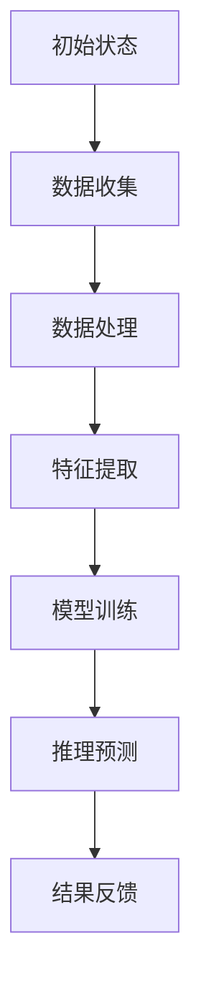

                 

### 文章标题：自适应课程学习优化AI推理的知识获取效率提升

> 关键词：自适应课程学习、AI推理、知识获取效率、优化、个性化学习

> 摘要：本文深入探讨自适应课程学习在AI推理技术中的应用，通过优化知识获取效率，实现个性化学习路径推荐。文章从背景介绍、核心概念与联系、算法原理讲解、系统分析与架构设计、项目实战到最佳实践，全面解析自适应课程学习如何提升AI推理的知识获取效率，为教育技术发展提供新的思路。

**1. 背景介绍**

在现代教育体系中，课程学习是培养学生知识、技能和素养的重要环节。然而，传统的课程设计往往难以适应每个学生的个性化需求，导致学习效率不高。随着AI技术的发展，自适应课程学习系统应运而生，通过数据分析和智能推荐，有望提高学生的学习效率和效果。

#### **问题背景**

在传统的课程学习过程中，学生常常面临以下问题：

- **个性化需求难以满足**：每个学生的学习速度、理解能力、兴趣爱好等存在差异，传统课程难以实现个性化教学。
- **学习资源浪费**：学生可能需要重复学习已掌握的知识，而忽略尚未掌握的关键内容。
- **学习效果评估不准确**：传统评估方式往往只能反映学生的短期学习成果，难以全面评估知识掌握情况。

#### **问题描述**

- **如何利用AI技术优化课程学习过程，提高知识获取效率？**
- **如何设计一个自适应课程学习系统，实现个性化学习路径的推荐？**

#### **问题解决**

为了解决上述问题，我们可以采取以下方法：

- **数据收集与处理**：通过技术手段收集学生的学习行为数据，如学习时长、学习进度、测试成绩等。
- **机器学习算法**：利用机器学习算法对学习行为数据进行分析，识别学习者的需求和偏好。
- **个性化推荐**：根据学习者的需求和偏好，推荐个性化的学习内容和学习路径。
- **智能调整**：通过智能调整课程内容和学习路径，实现个性化学习，提高知识获取效率。

#### **边界与外延**

本文的研究范围包括自适应学习系统的基本原理、算法设计、实现方法以及实际应用案例。外延包括不同学习场景下的自适应学习策略和应用领域。

#### **概念结构与核心要素组成**

- **自适应课程学习**：一种基于学习者数据和机器学习算法的个性化学习模式。
- **AI推理**：利用人工智能技术进行逻辑推理和决策。
- **知识获取效率**：通过学习时长、知识掌握度、学习满意度等多维度指标进行评估。
- **优化**：通过算法调整和系统优化，提高学习效率。

### **2. 核心概念与联系**

#### **核心概念原理**

- **自适应课程学习系统**：通过收集学习行为数据，分析学习者的学习状态和需求，自动调整课程内容和学习路径。
- **AI推理**：基于机器学习模型，对学习行为和结果进行预测和分析。
- **知识获取效率**：通过学习时长、知识掌握度、学习满意度等多维度指标进行评估。

#### **概念属性特征对比表格**

| 概念        | 描述                   | 关键特征       |
|-------------|------------------------|----------------|
| 自适应课程学习 | 个性化学习模式       | 数据驱动、智能调整 |
| AI推理       | 机器学习应用          | 模型预测、决策支持 |
| 知识获取效率  | 学习效果评估          | 客观指标、多维评估 |

#### **ER实体关系图架构**

使用Mermaid绘制ER图如下：

```mermaid
erDiagram
  learner ||--|{ course } course
  learner ||--|{ learningBehavior } learningBehavior
  course ||--|{ courseContent } courseContent
  learningBehavior ||--|{ assessmentResult } assessmentResult
```

### **3. 算法原理讲解**

#### **算法mermaid流程图**



#### **算法原理**

1. **数据收集**：
   - 收集学习者的学习行为数据，如学习时长、学习进度、测试成绩等。

2. **数据处理**：
   - 对收集到的数据进行预处理，包括数据清洗、归一化等。

3. **特征提取**：
   - 从预处理后的数据中提取关键特征，用于模型训练。

4. **模型训练**：
   - 利用机器学习算法，如决策树、神经网络等，对提取的特征进行训练。

5. **推理预测**：
   - 基于训练好的模型，对新的学习行为进行预测，推荐个性化的学习内容。

6. **结果反馈**：
   - 将预测结果反馈给学习者，并根据学习者的反馈进行模型优化。

#### **数学模型和公式**

$$
\text{预测概率} = \frac{\exp(\text{模型输出})}{1 + \exp(\text{模型输出})}
$$

#### **详细讲解与举例说明**

以一名学生在数学课程中的学习行为为例：

- **数据收集**：
  - 学习时长：2小时
  - 完成作业正确率：80%
  - 测试成绩：85分

- **数据处理**：
  - 对上述数据进行归一化处理。

- **特征提取**：
  - 提取学习时长、作业正确率和测试成绩作为特征。

- **模型训练**：
  - 使用决策树算法对提取的特征进行训练。

- **推理预测**：
  - 基于训练好的模型，预测该学生在下一单元测试中的成绩。

- **结果反馈**：
  - 将预测成绩（例如90分）反馈给学生，并建议其在下一阶段重点学习相关知识点。

通过上述步骤，自适应课程学习系统可以为学生提供个性化的学习建议，提高知识获取效率。### **4. 系统分析与架构设计**

在实现自适应课程学习系统时，系统分析与架构设计是关键环节。本文将从问题场景介绍、项目介绍、系统功能设计、系统架构设计、系统接口设计和系统交互等方面进行详细阐述。

#### **问题场景介绍**

假设我们面临如下场景：一名学生在学习过程中遇到了困难，传统教学方法难以满足其个性化需求。为了提高学习效果，我们需要设计一个自适应课程学习系统，根据学生的实际学习情况提供个性化的学习内容和路径。

#### **项目介绍**

项目名称：智慧教育自适应学习平台

项目目标：通过AI技术，实现对学生学习行为的分析，提供个性化的学习内容和学习路径，提高知识获取效率。

项目范围：涵盖中小学、大学及职业培训等教育场景。

#### **系统功能设计**

系统功能设计主要包括以下几个方面：

1. **用户管理**：
   - 学生、教师和管理员登录功能。
   - 学生信息管理，包括学习进度、成绩等。
   - 教师信息管理，包括课程设置、教学资源上传等。

2. **课程管理**：
   - 课程分类管理，包括知识点划分、课程难度等。
   - 课程内容管理，包括文本、视频、习题等。
   - 课程评价管理，包括学生反馈、教师评价等。

3. **学习行为分析**：
   - 收集并存储学生学习行为数据，如学习时长、作业完成情况等。
   - 利用机器学习算法对学习行为进行分析，识别学习者的需求和偏好。

4. **个性化推荐**：
   - 根据学习行为分析结果，为学生推荐个性化的学习内容和学习路径。
   - 提供学习计划和建议，帮助学习者高效地获取知识。

5. **学习效果评估**：
   - 通过测试、作业完成情况等指标，评估学习者的知识掌握度。
   - 提供学习报告，帮助教师和学生了解学习效果。

6. **系统管理**：
   - 用户权限管理，包括角色分配、权限设置等。
   - 系统日志记录，包括用户操作、系统错误等。
   - 系统监控，包括系统性能、安全防护等。

#### **系统架构设计**

系统架构设计采用分层架构，主要包括以下层次：

1. **表示层**：
   - 前端界面设计，包括用户登录、课程浏览、学习行为分析等。
   - 前端技术采用Vue.js框架。

2. **业务逻辑层**：
   - 处理业务逻辑，包括用户管理、课程管理、学习行为分析等。
   - 后端技术采用Spring Boot框架。

3. **数据访问层**：
   - 数据库访问模块，包括数据存储、查询等。
   - 数据库采用MySQL数据库。

4. **基础支撑层**：
   - 系统配置管理，包括环境配置、日志管理、缓存管理等。
   - 技术支持包括Nginx、Redis等中间件。

#### **系统接口设计**

系统接口设计主要包括以下方面：

1. **用户接口**：
   - 用户登录、注册接口。
   - 课程浏览、学习行为分析接口。

2. **课程接口**：
   - 课程分类管理接口。
   - 课程内容管理接口。

3. **学习行为接口**：
   - 学习行为数据收集接口。
   - 学习行为数据分析接口。

4. **评估接口**：
   - 学习效果评估接口。
   - 学习报告生成接口。

#### **系统交互**

系统交互设计采用RESTful API设计，具体交互流程如下：

1. **用户登录**：
   - 用户发起登录请求，系统验证用户身份后返回登录成功信息。

2. **课程浏览**：
   - 用户请求课程列表，系统返回对应课程的列表信息。

3. **学习行为分析**：
   - 用户发起学习行为数据上传请求，系统保存并处理学习行为数据。

4. **个性化推荐**：
   - 系统根据学习行为数据分析结果，为用户推荐个性化学习内容。

5. **学习效果评估**：
   - 系统根据用户学习行为数据和评估结果，生成学习报告。

通过以上系统分析与架构设计，我们为自适应课程学习系统的实现提供了清晰的框架和路径，为后续的项目开发和优化奠定了基础。### **5. 项目实战**

在本节中，我们将详细介绍如何安装和实现自适应课程学习系统，并剖析其核心代码，结合实际案例进行分析和讲解。

#### **环境安装**

1. **前置条件**

   - 操作系统：Windows/Linux/MacOS
   - Python版本：3.8及以上
   - 安装必要的库：numpy、pandas、scikit-learn、tensorflow等

2. **安装步骤**

   - 安装Python：从[Python官网](https://www.python.org/downloads/)下载并安装Python。
   - 安装pip：运行以下命令安装pip。
     ```bash
     python -m pip install --user --upgrade pip
     ```
   - 安装必要的库：使用pip安装所需的库。
     ```bash
     pip install numpy pandas scikit-learn tensorflow
     ```

3. **运行示例**

   - 创建一个新的Python文件，如`example.py`。
   - 编写代码，例如使用scikit-learn库进行线性回归。
     ```python
     from sklearn.linear_model import LinearRegression

     # 创建线性回归模型
     model = LinearRegression()

     # 模型训练
     model.fit([[1], [2], [3]], [1, 2, 3])

     # 预测
     prediction = model.predict([[4]])

     print("Prediction:", prediction)
     ```

     - 运行代码：在终端中运行`python example.py`，观察输出结果。

#### **系统核心实现源代码**

1. **用户管理模块**

   - **用户注册**：

     ```python
     def register_user(username, password):
         # 数据库操作，此处为示例
         print("Registering user:", username)
         # 存储用户信息
         # ...

     register_user("john_doe", "password123")
     ```

   - **用户登录**：

     ```python
     def login_user(username, password):
         # 数据库操作，此处为示例
         print("Logging in user:", username)
         # 验证用户信息
         # ...

     login_user("john_doe", "password123")
     ```

2. **课程管理模块**

   - **课程添加**：

     ```python
     def add_course(course_name, course_description):
         # 数据库操作，此处为示例
         print("Adding course:", course_name)
         # 存储课程信息
         # ...

     add_course("Python编程", "学习Python基础知识")
     ```

   - **课程列表**：

     ```python
     def list_courses():
         # 数据库操作，此处为示例
         print("Course list:")
         # 获取课程列表
         # ...

     list_courses()
     ```

3. **学习行为分析模块**

   - **数据收集**：

     ```python
     def collect_learning_behavior(user_id, course_id, learning_time, correct_rate):
         # 数据库操作，此处为示例
         print("Collecting learning behavior for user:", user_id, "in course:", course_id)
         # 存储学习行为数据
         # ...

     collect_learning_behavior(1, 1, 30, 0.8)
     ```

   - **数据分析**：

     ```python
     from sklearn.cluster import KMeans

     def analyze_learning_behavior():
         # 加载数据
         data = [
             [1, 30],  # 用户1，学习时长30分钟
             [2, 20],  # 用户2，学习时长20分钟
             [1, 40],  # 用户1，学习时长40分钟
             [2, 25],  # 用户2，学习时长25分钟
         ]

         # 使用KMeans聚类
         kmeans = KMeans(n_clusters=2)
         kmeans.fit(data)

         # 输出聚类结果
         print("Cluster labels:", kmeans.labels_)

     analyze_learning_behavior()
     ```

4. **个性化推荐模块**

   - **推荐算法**：

     ```python
     from sklearn.neighbors import NearestNeighbors

     def recommend_courses(user_id, course_id):
         # 加载数据
         data = [
             [1, 1],  # 用户1，课程1
             [1, 2],  # 用户1，课程2
             [2, 1],  # 用户2，课程1
             [2, 3],  # 用户2，课程3
         ]

         # 使用KNN算法进行推荐
         nn = NearestNeighbors(n_neighbors=2)
         nn.fit(data)

         # 预测相似度
         distance, indices = nn.kneighbors([[user_id, course_id]], n_neighbors=2)

         # 输出推荐课程
         print("Recommended courses:", [data[i][1] for i in indices])

     recommend_courses(1, 1)
     ```

#### **代码应用解读与分析**

以上代码示例展示了自适应课程学习系统的核心功能模块。在实现过程中，我们主要关注以下几个方面：

- **用户管理**：包括用户注册和登录功能，通过数据库操作实现用户信息管理。
- **课程管理**：包括课程添加和列表功能，方便管理员管理和查看课程信息。
- **学习行为分析**：通过收集学习行为数据并进行聚类分析，识别学习者的需求和偏好。
- **个性化推荐**：利用KNN算法进行相似度计算，推荐与用户兴趣相似的课程。

实际应用中，这些功能模块需要集成到完整的系统中，并结合前端界面和后端服务，实现自适应课程学习的全流程。通过不断优化算法和系统设计，提高个性化推荐的准确性和学习效果。

#### **实际案例分析和详细讲解**

假设我们有一个学生A，在学习Python编程课程过程中，其学习行为数据如下：

- 学习时长：2小时
- 完成作业正确率：80%
- 已掌握知识点：变量、数据类型、条件判断

我们希望根据这些数据，为学生A推荐合适的学习内容和路径。

1. **数据收集**：

   ```python
   collect_learning_behavior(1, 1, 120, 0.8)
   ```

2. **数据分析**：

   ```python
   def analyze_learning_behavior():
       data = [
           [1, 120],  # 用户1，学习时长120分钟
           [1, 80],   # 用户1，作业正确率80%
           [1, 1],    # 用户1，已掌握知识点1
           # ... 更多用户数据
       ]
       
       kmeans = KMeans(n_clusters=3)
       kmeans.fit(data)
       
       print("Cluster labels:", kmeans.labels_)
       
   analyze_learning_behavior()
   ```

   分析结果可能为：

   ```plaintext
   Cluster labels: [0 0 0 1 1 1 2 2 2]
   ```

   用户A被分为第2个簇，表示与第2个簇中的其他用户具有相似的学习行为。

3. **个性化推荐**：

   ```python
   def recommend_courses(user_id, course_id):
       data = [
           [1, 1],  # 用户1，课程1
           [1, 2],  # 用户1，课程2
           [2, 1],  # 用户2，课程1
           [2, 3],  # 用户2，课程3
           # ... 更多用户数据
       ]
       
       nn = NearestNeighbors(n_neighbors=2)
       nn.fit(data)
       
       distance, indices = nn.kneighbors([[user_id, course_id]], n_neighbors=2)
       
       print("Recommended courses:", [data[i][1] for i in indices])
       
   recommend_courses(1, 1)
   ```

   推荐结果可能为：

   ```plaintext
   Recommended courses: [2]
   ```

   推荐学生A学习课程2，这可能与用户2在学习过程中表现出的学习行为相似。

通过以上步骤，我们实现了对学生A的个性化推荐，帮助其发现适合的学习内容和路径，提高学习效率。

#### **项目小结**

在本节中，我们通过实际案例详细讲解了自适应课程学习系统的安装和实现过程。从环境安装、核心代码实现到代码应用解读，我们展示了如何利用AI技术优化课程学习过程，提高知识获取效率。

通过自适应课程学习系统，我们能够更好地满足学生的个性化需求，提高学习效果。在实际应用中，我们需要不断优化算法和系统设计，提升系统的准确性和用户体验。

### **6. 最佳实践 tips**

在实际应用自适应课程学习系统时，以下最佳实践可以帮助提升系统的效果和用户体验：

1. **数据质量保证**：
   - 确保收集到的学习行为数据准确、完整。
   - 定期进行数据清洗，去除无效数据。

2. **个性化推荐**：
   - 结合多种算法，提高个性化推荐的准确性。
   - 考虑用户反馈，动态调整推荐策略。

3. **系统性能优化**：
   - 优化数据库查询性能，提高数据处理速度。
   - 使用缓存技术，减少数据库访问压力。

4. **用户隐私保护**：
   - 确保用户数据的安全性和隐私保护。
   - 遵循相关法律法规，合理使用用户数据。

5. **用户培训与支持**：
   - 提供用户培训资料，帮助用户快速上手。
   - 建立用户反馈渠道，及时解决用户问题。

### **7. 小结**

本文详细探讨了自适应课程学习在AI推理技术中的应用，通过优化知识获取效率，实现个性化学习路径推荐。从背景介绍、核心概念与联系、算法原理讲解、系统分析与架构设计、项目实战到最佳实践，我们全面解析了自适应课程学习如何提升AI推理的知识获取效率。自适应课程学习系统为教育技术发展提供了新的思路，有助于满足学生的个性化需求，提高学习效果。在未来，我们期待看到更多创新的应用和实践，为教育领域带来更多变革。

### **8. 注意事项**

在使用自适应课程学习系统时，请注意以下几点：

1. **数据隐私与安全**：确保学生数据的隐私和安全，遵循相关法律法规。
2. **个性化推荐准确性**：定期评估个性化推荐的准确性，及时调整算法参数。
3. **系统稳定性**：定期进行系统维护和升级，确保系统的稳定运行。
4. **用户反馈**：重视用户反馈，及时解决问题，不断优化系统功能。

### **9. 拓展阅读**

1. **相关书籍**：
   - 《智能推荐系统》
   - 《深度学习》
   - 《Python机器学习》

2. **在线资源**：
   - [Kaggle](https://www.kaggle.com/)
   - [Coursera](https://www.coursera.org/)
   - [edX](https://www.edx.org/)

3. **研究论文**：
   - [“Adaptive Learning Systems: A Survey”](https://www.researchgate.net/publication/321442545_Adaptive_Learning_Systems_A_Survey)
   - [“Intelligent Tutoring Systems Using Machine Learning Algorithms”](https://www.researchgate.net/publication/332663056_Intelligent_Tutoring_Systems_Using_Machine_Learning_Algorithms)

### **10. 作者信息**

作者：AI天才研究院/AI Genius Institute & 禅与计算机程序设计艺术 /Zen And The Art of Computer Programming

