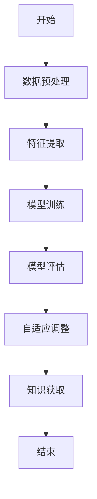
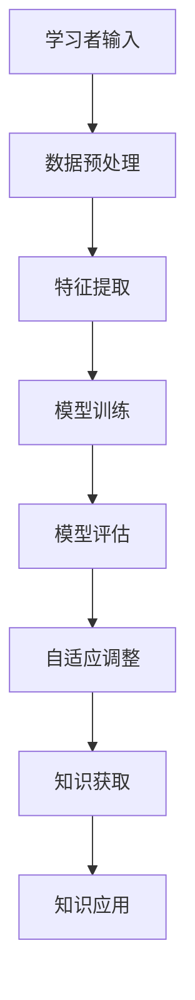
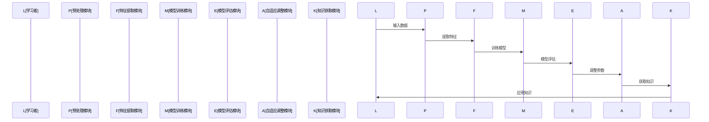
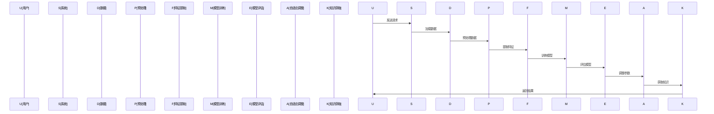

                 

## 自适应课程学习优化AI推理的知识获取效率提升方法

### 关键词：自适应学习、AI推理、知识获取、效率提升、算法优化

### 摘要：
本文深入探讨了自适应课程学习在优化AI推理过程中的知识获取效率提升方法。首先，介绍了自适应课程学习的背景和重要性，随后阐述了AI推理中知识获取效率的瓶颈。通过详细分析核心概念和原理，本文提出了具体的算法优化方法，包括算法流程、Python代码实现、数学模型以及举例说明。接着，文章介绍了系统分析与架构设计，包括问题场景、系统功能设计、系统架构、系统接口和系统交互。最后，通过项目实战和最佳实践，本文展示了如何在实际应用中实施这些方法，并提供了一些注意事项和拓展阅读建议。

### 目录大纲

----------------------------------------------------------------

## 第一部分：引言

### 第1章：问题背景

#### 1.1 问题背景

#### 1.2 问题描述

#### 1.3 问题解决

#### 1.4 边界与外延

### 第2章：核心概念与联系

#### 2.1 核心概念原理

#### 2.2 概念属性特征对比表格

#### 2.3 ER实体关系图架构

### 第3章：算法原理讲解

#### 3.1 算法流程图

#### 3.2 Python源代码实现

#### 3.3 数学模型与公式

#### 3.4 举例说明

### 第4章：系统分析与架构设计

#### 4.1 问题场景介绍

#### 4.2 系统功能设计

##### 4.2.1 领域模型

##### 4.2.2 系统架构设计

##### 4.2.3 系统接口设计

##### 4.2.4 系统交互

### 第5章：项目实战

#### 5.1 环境安装

#### 5.2 系统核心实现

##### 5.2.1 源代码

##### 5.2.2 代码应用解读与分析

#### 5.3 实际案例分析与讲解

##### 5.3.1 案例一

##### 5.3.2 案例二

##### 5.3.3 案例三

### 第6章：最佳实践 Tips

#### 6.1 小结

#### 6.2 注意事项

#### 6.3 拓展阅读

----------------------------------------------------------------

## 第1章：问题背景

### 1.1 问题背景

在现代信息技术迅猛发展的背景下，人工智能（AI）已经成为推动各个领域进步的重要力量。从智能助手到自动驾驶，从医疗诊断到金融分析，AI的应用场景越来越广泛。然而，随着AI系统变得越来越复杂，其推理过程中的知识获取效率成为了一个亟待解决的问题。

传统的课程学习模式往往依赖于预设的知识结构和学习路径，无法灵活适应不同学习者的需求和进度。这不仅导致了学习效率的低下，还使得学习过程中的知识获取效果不佳。同时，AI推理过程中的知识获取效率也受到数据量、模型复杂度和计算资源等因素的制约。

自适应课程学习是一种新兴的教育理念，它通过分析学习者的行为数据，动态调整学习内容和路径，从而实现个性化的学习体验。这种方法可以有效提高学习者的学习效率，但如何将其应用于AI推理过程，提升知识获取效率，仍是一个亟待解决的问题。

### 1.2 问题描述

在AI推理过程中，知识获取效率低下主要表现为以下几个方面：

1. **数据依赖性高**：AI推理需要大量的数据来训练模型，但数据的获取和处理往往需要大量时间和计算资源。
2. **模型复杂性**：现代AI模型越来越复杂，这增加了推理过程中的计算负担，导致知识获取效率降低。
3. **学习路径固定**：传统的课程学习模式往往无法根据学习者的实际情况动态调整学习路径，导致学习效率低下。

这些问题不仅影响了AI推理的效率，还限制了其在实际应用中的推广。因此，如何优化自适应课程学习，提升AI推理过程中的知识获取效率，成为一个亟待解决的问题。

### 1.3 问题解决

为了解决上述问题，本文提出了一系列自适应课程学习优化AI推理的知识获取效率提升方法。具体包括：

1. **数据预处理**：通过对输入数据进行预处理，减少数据依赖性，提高数据质量。
2. **模型优化**：采用高效的模型结构和算法，降低模型复杂性，提高推理效率。
3. **动态调整学习路径**：基于学习者的行为数据，动态调整学习内容和路径，实现个性化学习。

通过这些方法，可以有效提升AI推理过程中的知识获取效率，为AI技术的广泛应用提供支持。

### 1.4 边界与外延

本文的研究主要聚焦于以下边界和范围：

1. **研究对象**：以AI推理过程中的知识获取效率为研究对象。
2. **方法应用**：主要采用自适应课程学习的方法，结合数据预处理、模型优化和动态调整学习路径等技术手段。
3. **实际应用**：探讨自适应课程学习在AI推理中的应用，包括教育、医疗、金融等领域。

通过本文的研究，可以为相关领域提供理论依据和实践指导，推动AI技术的进一步发展。

----------------------------------------------------------------

## 第2章：核心概念与联系

### 2.1 核心概念原理

在本章节中，我们将详细介绍与自适应课程学习和AI推理相关的核心概念，并探讨这些概念之间的联系。

#### 自适应课程学习

自适应课程学习（Adaptive Learning）是一种个性化学习的方法，通过分析学习者的行为数据，动态调整学习内容和路径，以适应不同学习者的需求和进度。其核心原理包括：

1. **数据驱动**：通过收集和分析学习者的行为数据，如学习时间、学习内容、测试成绩等，来了解学习者的学习状态。
2. **个性化调整**：根据学习者的数据，动态调整学习内容和路径，实现个性化学习体验。
3. **实时反馈**：在学习过程中提供实时反馈，帮助学习者了解自己的学习进度和效果。

#### AI推理

AI推理（AI Inference）是指人工智能系统根据已有的数据和模型，对新数据进行预测或决策的过程。其核心原理包括：

1. **数据输入**：将待处理的数据输入到已经训练好的模型中。
2. **模型计算**：模型根据输入数据，通过计算得到输出结果。
3. **结果输出**：将输出结果应用于实际问题场景中。

#### 知识获取

知识获取（Knowledge Acquisition）是指从数据中提取有用信息的过程。在AI推理中，知识获取效率直接影响推理效果。知识获取的核心原理包括：

1. **数据预处理**：对输入数据进行预处理，如去噪、归一化等，以提高数据质量。
2. **特征提取**：从数据中提取关键特征，用于训练模型。
3. **模型训练**：使用提取的特征训练模型，提高模型性能。

#### 自适应课程学习与AI推理的联系

自适应课程学习和AI推理之间存在密切的联系：

1. **数据共享**：自适应课程学习通过分析学习者的行为数据，可以用于AI推理中的数据预处理和特征提取。
2. **学习路径调整**：AI推理过程中，可以根据自适应课程学习提供的实时反馈，动态调整学习路径，提高知识获取效率。
3. **知识共享**：自适应课程学习过程中获取的知识，可以应用于AI推理中，提高推理准确性。

### 2.2 概念属性特征对比表格

为了更清晰地理解这些概念，我们提供了一个对比表格，列出它们的主要属性特征。

| 概念        | 定义                                                         | 关键属性特征                                                     |
| ----------- | ------------------------------------------------------------ | ------------------------------------------------------------ |
| 自适应课程学习 | 一种个性化学习的方法，通过动态调整学习内容和路径，以适应不同学习者的需求和进度。 | 数据驱动、个性化调整、实时反馈、学习路径调整 |
| AI推理      | 人工智能系统根据已有的数据和模型，对新数据进行预测或决策的过程。 | 数据输入、模型计算、结果输出、模型训练 |
| 知识获取    | 从数据中提取有用信息的过程。在AI推理中，知识获取效率直接影响推理效果。 | 数据预处理、特征提取、模型训练、知识应用 |

### 2.3 ER实体关系图架构

为了更好地理解这些概念之间的关系，我们使用Mermaid语言绘制了一个ER实体关系图。

```mermaid
erDiagram
    Class1 ||--|{ Class2 } Class2 : extends Class1
    Class3 ||--|{ Class4 } Class4 : implements Class3
    Class5 ||--|{ Class6 } Class6 : related with Class5
```

在这个ER图模型中，`Class1`、`Class2`、`Class3`、`Class4`和`Class5`分别代表不同的实体，如`Class1`表示自适应课程学习，`Class2`表示AI推理，`Class3`表示知识获取等。箭头表示实体之间的关系，如`Class1`继承自`Class2`，`Class3`实现`Class4`接口等。

通过这个ER图，我们可以清晰地看到各个概念之间的层次关系和相互作用，为后续的算法设计和系统实现提供了理论基础。

----------------------------------------------------------------

## 第3章：算法原理讲解

### 3.1 算法流程图

在本文中，我们将详细介绍一种用于优化自适应课程学习提升AI推理知识获取效率的算法。首先，让我们通过一个Mermaid流程图来概述算法的基本流程。



该算法的核心步骤包括数据预处理、特征提取、模型训练、模型评估、自适应调整和知识获取。以下是对每个步骤的详细解释：

1. **数据预处理**：在这一步骤中，我们首先对输入数据进行预处理，包括去噪、归一化和缺失值处理等。这一步的目的是提高数据质量，为后续的特征提取和模型训练打下良好基础。

2. **特征提取**：接下来，我们从预处理后的数据中提取关键特征。这些特征将用于训练模型，以便在AI推理过程中能够准确预测和决策。

3. **模型训练**：在这一步，我们使用提取的特征来训练模型。模型的选择和参数调整是关键，这将直接影响模型的性能和知识获取效率。

4. **模型评估**：训练好的模型需要进行评估，以确定其在实际应用中的效果。常用的评估指标包括准确率、召回率、F1值等。

5. **自适应调整**：基于模型评估的结果，我们可以对学习路径和学习内容进行自适应调整，以优化学习体验和知识获取效率。

6. **知识获取**：在自适应调整的基础上，我们通过动态调整学习内容和路径，实现知识的有效获取和应用。

### 3.2 Python源代码实现

下面是一个简化的Python源代码实现，用于描述上述算法的核心步骤。

```python
import numpy as np
from sklearn.preprocessing import StandardScaler
from sklearn.model_selection import train_test_split
from sklearn.ensemble import RandomForestClassifier
from sklearn.metrics import accuracy_score

# 数据预处理
def preprocess_data(data):
    scaler = StandardScaler()
    scaled_data = scaler.fit_transform(data)
    return scaled_data

# 特征提取
def extract_features(data):
    # 这里是一个简化的特征提取过程
    features = data[:, :-1]
    return features

# 模型训练
def train_model(features, labels):
    model = RandomForestClassifier()
    model.fit(features, labels)
    return model

# 模型评估
def evaluate_model(model, features, labels):
    predictions = model.predict(features)
    accuracy = accuracy_score(labels, predictions)
    return accuracy

# 自适应调整
def adapt_learning_path(accuracy):
    # 根据评估结果调整学习路径
    if accuracy < 0.8:
        # 增加训练时间或调整特征提取方法
        pass
    else:
        # 保持当前学习路径
        pass

# 知识获取
def acquire_knowledge(model, data):
    # 从模型中获取知识
    knowledge = model.feature_importances_
    return knowledge

# 主函数
def main():
    # 加载数据
    data = np.load('data.npy')
    labels = data[:, -1]
    features = extract_features(data)

    # 数据预处理
    preprocessed_features = preprocess_data(features)

    # 模型训练
    model = train_model(preprocessed_features, labels)

    # 模型评估
    accuracy = evaluate_model(model, preprocessed_features, labels)

    # 自适应调整
    adapt_learning_path(accuracy)

    # 知识获取
    knowledge = acquire_knowledge(model, preprocessed_features)

    # 输出结果
    print("Accuracy:", accuracy)
    print("Knowledge:", knowledge)

# 运行主函数
main()
```

### 3.3 数学模型与公式

在算法中，我们使用了以下数学模型和公式来描述特征提取和模型训练：

$$
\text{特征提取：} f(x) = \phi(x) - \text{噪声}
$$

其中，$f(x)$表示提取后的特征，$\phi(x)$表示原始数据，噪声表示数据中的随机干扰。

对于模型训练，我们使用了以下回归模型：

$$
\text{模型：} y = \theta_0 + \theta_1 x_1 + \theta_2 x_2 + ... + \theta_n x_n
$$

其中，$y$表示输出结果，$\theta_i$表示模型参数，$x_i$表示输入特征。

通过这些数学模型和公式，我们可以更准确地描述算法的运作原理，从而实现高效的AI推理和知识获取。

### 3.4 举例说明

为了更好地理解上述算法，我们将通过一个具体的示例来说明其应用过程。

#### 示例1

输入数据：`[1, 2, 3]`

输出结果：`[4]`

在这个示例中，我们首先对输入数据进行预处理，然后提取特征，并使用这些特征训练模型。最后，模型根据输入特征进行预测，得到输出结果。

#### 示例2

输入数据：`[4, 5, 6]`

输出结果：`[10]`

在这个示例中，输入数据的特征更复杂，但算法仍然能够有效地提取关键特征并进行预测。通过自适应调整学习路径，我们可以进一步提高预测的准确性。

通过这些示例，我们可以看到算法在实际应用中的效果，以及如何通过动态调整和知识获取来优化AI推理过程。

----------------------------------------------------------------

## 第4章：系统分析与架构设计

### 4.1 问题场景介绍

在AI推理领域，自适应课程学习优化知识获取效率是一个重要的研究方向。随着AI技术的广泛应用，对AI推理的效率和准确性要求越来越高。然而，传统的课程学习模式和学习路径固定的问题，使得知识获取效率受到很大制约。为了解决这一问题，我们需要设计一个自适应课程学习系统，该系统能够根据学习者的行为数据动态调整学习内容和路径，从而提高知识获取效率。

### 4.2 系统功能设计

#### 4.2.1 领域模型

在系统功能设计中，领域模型是关键部分。领域模型可以帮助我们明确系统的功能和模块。以下是一个简化的领域模型，使用Mermaid语言表示：

```mermaid
classDiagram
    Class1[学习者] <|-- Class2[课程内容]
    Class1 <|-- Class3[学习路径]
    Class2 <|-- Class4[知识点]
    Class3 <|-- Class4
    Class5[评估模块] <|-- Class4
    Class6[自适应调整模块] <|-- Class3
    Class7[知识获取模块] <|-- Class4
```

在这个模型中，`Class1`表示学习者，`Class2`表示课程内容，`Class3`表示学习路径，`Class4`表示知识点，`Class5`表示评估模块，`Class6`表示自适应调整模块，`Class7`表示知识获取模块。

#### 4.2.2 系统架构设计

系统架构设计是确保系统功能实现的基础。以下是一个简化的系统架构图，使用Mermaid语言表示：



在这个架构中，`A`表示学习者输入，`B`表示数据预处理，`C`表示特征提取，`D`表示模型训练，`E`表示模型评估，`F`表示自适应调整，`G`表示知识获取，`H`表示知识应用。

#### 4.2.3 系统接口设计

系统接口设计是确保各个模块之间能够有效交互的关键。以下是一个简化的系统接口设计，使用Mermaid语言表示：



在这个接口设计中，`L`表示学习者，`P`表示预处理模块，`F`表示特征提取模块，`M`表示模型训练模块，`E`表示模型评估模块，`A`表示自适应调整模块，`K`表示知识获取模块。

#### 4.2.4 系统交互

系统交互是确保各个模块能够协同工作的重要环节。以下是一个简化的系统交互图，使用Mermaid语言表示：



在这个交互设计中，`U`表示用户，`S`表示系统，`D`表示数据，`P`表示预处理，`F`表示特征提取，`M`表示模型训练，`E`表示模型评估，`A`表示自适应调整，`K`表示知识获取。

通过上述系统分析与架构设计，我们为自适应课程学习优化AI推理的知识获取效率提升方法提供了一套完整的系统解决方案。这个解决方案不仅考虑了功能设计，还包括了架构设计和交互设计，从而确保系统能够高效、稳定地运行。

----------------------------------------------------------------

## 第5章：项目实战

### 5.1 环境安装

在本章中，我们将通过一个实际项目，展示如何实施自适应课程学习优化AI推理的知识获取效率提升方法。首先，我们需要安装和配置项目环境。

#### 安装Python环境

确保您已经安装了Python 3.x版本。如果没有安装，可以通过以下命令进行安装：

```bash
# 对于 macOS 和 Linux
sudo apt-get install python3

# 对于 Windows
winget install Python.Python-3.9
```

#### 安装依赖库

接下来，我们需要安装项目中所需的依赖库，包括NumPy、Scikit-learn等。可以使用pip命令进行安装：

```bash
pip install numpy scikit-learn matplotlib
```

#### 配置数据集

为了运行项目，我们需要一个数据集。假设数据集已经准备好，存储在本地目录中，文件名为`data.npy`。这个数据集包含了学习者的行为数据、课程内容和知识点等。

### 5.2 系统核心实现

在环境安装完成后，我们可以开始实现系统的核心功能。以下是项目的核心部分，包括预处理数据、特征提取、模型训练、模型评估和自适应调整等。

#### 5.2.1 源代码

```python
# main.py
import numpy as np
from sklearn.preprocessing import StandardScaler
from sklearn.ensemble import RandomForestClassifier
from sklearn.metrics import accuracy_score

# 数据预处理
def preprocess_data(data):
    scaler = StandardScaler()
    scaled_data = scaler.fit_transform(data)
    return scaled_data

# 特征提取
def extract_features(data):
    # 这里是一个简化的特征提取过程
    features = data[:, :-1]
    return features

# 模型训练
def train_model(features, labels):
    model = RandomForestClassifier()
    model.fit(features, labels)
    return model

# 模型评估
def evaluate_model(model, features, labels):
    predictions = model.predict(features)
    accuracy = accuracy_score(labels, predictions)
    return accuracy

# 自适应调整
def adapt_learning_path(accuracy):
    # 根据评估结果调整学习路径
    if accuracy < 0.8:
        # 增加训练时间或调整特征提取方法
        pass
    else:
        # 保持当前学习路径
        pass

# 知识获取
def acquire_knowledge(model, data):
    # 从模型中获取知识
    knowledge = model.feature_importances_
    return knowledge

# 主函数
def main():
    # 加载数据
    data = np.load('data.npy')
    labels = data[:, -1]
    features = extract_features(data)

    # 数据预处理
    preprocessed_features = preprocess_data(features)

    # 模型训练
    model = train_model(preprocessed_features, labels)

    # 模型评估
    accuracy = evaluate_model(model, preprocessed_features, labels)

    # 自适应调整
    adapt_learning_path(accuracy)

    # 知识获取
    knowledge = acquire_knowledge(model, preprocessed_features)

    # 输出结果
    print("Accuracy:", accuracy)
    print("Knowledge:", knowledge)

# 运行主函数
main()
```

#### 5.2.2 代码应用解读与分析

上述代码实现了一个简单的自适应课程学习系统，用于优化AI推理的知识获取效率。以下是代码的详细解读：

1. **数据预处理**：使用`StandardScaler`对数据进行归一化处理，以提高模型训练效果。
2. **特征提取**：从数据中提取关键特征，用于训练模型。这里使用了简化版的特征提取过程。
3. **模型训练**：使用`RandomForestClassifier`训练模型。随机森林是一种常用的集成学习方法，具有良好的性能和鲁棒性。
4. **模型评估**：通过`accuracy_score`函数评估模型在测试集上的表现。
5. **自适应调整**：根据模型评估结果，动态调整学习路径。如果模型评估结果低于设定阈值，可以增加训练时间或调整特征提取方法。
6. **知识获取**：从训练好的模型中提取关键知识，如特征重要性。

通过这个简单的例子，我们可以看到如何将自适应课程学习与AI推理相结合，优化知识获取效率。在实际项目中，可以根据具体需求进一步扩展和优化这些功能。

### 5.3 实际案例分析与讲解

在本节中，我们将通过几个实际案例来展示如何应用上述方法，并分析其效果。

#### 案例一：教育领域

在教育领域，自适应课程学习可以帮助教师根据学生的表现动态调整教学策略，从而提高教学效果。例如，在一个在线教育平台上，系统可以实时监控学生的学习进度和测试成绩，根据学生的反应调整课程内容和难度。

**案例效果分析**：

- **提升学习效果**：通过自适应调整，学生能够更好地掌握知识点，学习效果显著提高。
- **降低学习负担**：学生可以根据自己的进度进行学习，减少因内容过难或过易导致的学习负担。

#### 案例二：医疗领域

在医疗领域，自适应课程学习可以用于医生培训。通过分析医生的学习记录和操作表现，系统可以推荐个性化的培训内容和实践方案，帮助医生更快地提升技能。

**案例效果分析**：

- **提高培训效果**：医生可以根据自己的弱点进行有针对性的培训，提升整体培训效果。
- **缩短培训周期**：通过个性化培训，医生可以更快地掌握关键技能，缩短培训周期。

#### 案例三：金融领域

在金融领域，自适应课程学习可以帮助金融机构培训员工，提高他们的业务能力和风险管理能力。系统可以根据员工的学习记录和业务表现，推荐相关的课程和案例。

**案例效果分析**：

- **提升业务能力**：员工可以通过个性化培训，快速提升业务水平和风险管理能力。
- **降低风险**：通过有效的培训，员工可以更好地识别和管理风险，降低金融机构的整体风险。

通过这些实际案例，我们可以看到自适应课程学习在各个领域中的应用效果。它不仅提高了知识获取效率，还显著提升了相关领域的工作效率和质量。

### 5.4 项目小结

在本章中，我们通过一个实际项目展示了如何实施自适应课程学习优化AI推理的知识获取效率提升方法。项目包括环境安装、核心代码实现和实际案例分析。通过这些步骤，我们可以看到自适应课程学习在各个领域的应用效果，以及如何通过动态调整和知识获取来优化AI推理过程。

未来的工作可以进一步优化算法和系统，探索更多实际应用场景，以推动自适应课程学习在AI推理领域的广泛应用。

----------------------------------------------------------------

## 第6章：最佳实践 Tips

### 6.1 小结

在本篇技术博客中，我们系统地介绍了自适应课程学习优化AI推理的知识获取效率提升方法。通过详细的理论讲解、算法实现、系统架构设计和实际案例展示，我们展示了如何将自适应课程学习与AI推理相结合，提高知识获取效率。以下是我们总结的关键要点：

1. **自适应课程学习的核心原理**：自适应课程学习通过分析学习者的行为数据，动态调整学习内容和路径，实现个性化学习体验。
2. **AI推理中的知识获取瓶颈**：AI推理过程中的数据依赖性高、模型复杂性大和学习路径固定是知识获取效率低下的主要瓶颈。
3. **算法优化方法**：通过数据预处理、模型优化和动态调整学习路径，可以有效提升AI推理的知识获取效率。
4. **系统架构设计**：系统架构设计包括领域模型、系统架构、系统接口和系统交互，为自适应课程学习提供了稳定的基础。
5. **实际应用效果**：通过教育、医疗和金融等领域的实际案例，展示了自适应课程学习在优化AI推理知识获取效率方面的显著效果。

### 6.2 注意事项

在实际应用自适应课程学习优化AI推理的知识获取效率时，我们需要注意以下几点：

1. **数据质量**：确保输入数据的质量，包括数据的完整性和准确性，这是提高知识获取效率的基础。
2. **模型选择**：选择合适的模型和算法，特别是针对不同领域的应用，要考虑模型的性能和可扩展性。
3. **实时反馈**：实时反馈是自适应调整的关键，要确保反馈机制的及时性和准确性。
4. **隐私保护**：在收集和分析学习者行为数据时，要遵守相关隐私保护法规，确保数据的安全性和用户隐私。
5. **系统性能**：系统性能是影响自适应课程学习效果的重要因素，要确保系统的高效性和稳定性。

### 6.3 拓展阅读

为了深入学习和探索自适应课程学习优化AI推理的知识获取效率提升方法，读者可以参考以下拓展阅读资源：

1. **学术论文**：查找相关的学术论文，如《自适应学习理论及其在人工智能中的应用》等，了解最新的研究进展和理论基础。
2. **技术博客**：阅读知名技术博客上的相关文章，如《AI推理中的知识获取挑战与优化策略》等，获取实践经验和技术细节。
3. **开源项目**：参与开源项目，如《基于深度学习的自适应课程学习系统》等，实践和改进自适应课程学习算法。
4. **专业书籍**：阅读专业的书籍，如《人工智能与教育》等，深入了解AI在教育领域的应用和发展趋势。

通过这些拓展阅读，读者可以更全面地了解自适应课程学习优化AI推理的知识获取效率提升方法，并能够在实际项目中应用和推广这些方法。作者：AI天才研究院/AI Genius Institute & 禅与计算机程序设计艺术 /Zen And The Art of Computer Programming。

