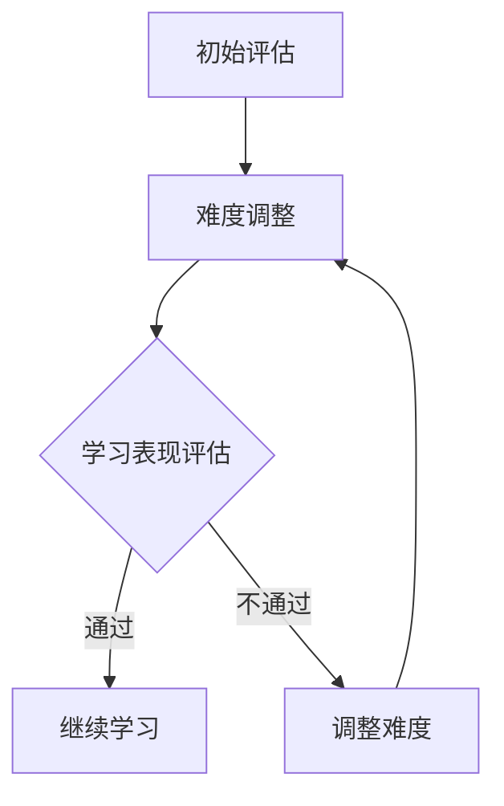

                 

### 文章标题

## 自适应课程学习优化AI推理的难度递进

> 关键词：自适应学习、AI推理、难度递进、优化、算法原理、应用实践

> 摘要：
本文将深入探讨自适应课程学习如何优化AI推理的难度递进。首先，我们将介绍自适应学习的概念和其在教育领域的应用，接着分析AI推理难度递进的原理及其与学习优化的关系。随后，我们将详细讲解实现难度递进优化的算法原理，并通过Python代码示例进行说明。最后，我们将探讨该算法在自适应课程学习中的实际应用，并提供一些最佳实践和注意事项。

----------------------------------------------------------------

## 目录大纲

----------------------------------------------------------------

### 第一部分：背景介绍

#### 第1章 问题背景

##### 1.1.1 问题背景介绍

##### 1.1.2 问题解决思路

##### 1.1.3 边界与外延

##### 1.1.4 概念结构与核心要素组成

#### 第2章 核心概念与联系

##### 2.1.1 核心概念原理

##### 2.1.2 概念属性特征对比表格

##### 2.1.3 ER实体关系图架构

### 第二部分：AI推理难度递进原理

#### 第3章 AI推理难度递进原理

##### 3.1.1 AI推理难度递进概念介绍

##### 3.1.2 难度递进原理概述

##### 3.1.3 难度递进与学习优化关系

#### 第4章 算法原理讲解

##### 4.1.1 算法mermaid流程图

##### 4.1.2 Python源代码实现

##### 4.1.3 算法原理数学模型和公式

##### 4.1.4 举例说明

### 第三部分：应用场景与实践

#### 第5章 应用场景

##### 5.1.1 自适应课程学习应用场景

##### 5.1.2 AI推理难度递进在自适应课程学习中的应用

#### 第6章 实践案例

##### 6.1.1 环境安装与配置

##### 6.1.2 系统核心实现源代码

##### 6.1.3 代码应用解读与分析

##### 6.1.4 实际案例分析和详细讲解剖析

#### 第7章 最佳实践与注意事项

##### 7.1.1 最佳实践技巧

##### 7.1.2 注意事项

##### 7.1.3 拓展阅读

### 总结

#### 第8章 总结与展望

----------------------------------------------------------------

### 第一部分：背景介绍

#### 第1章 问题背景

##### 1.1.1 问题背景介绍

在当今信息爆炸的时代，教育的个性化需求日益增长。传统的教学方法往往无法满足每个学生的学习进度和兴趣点，导致学习效果不佳。为此，自适应学习系统应运而生，旨在根据学生的学习行为和知识掌握程度，动态调整教学内容和难度，从而实现个性化学习。

自适应学习系统通过收集和分析学生在学习过程中的行为数据，如学习时间、正确率、学习路径等，来评估学生的知识水平。然而，现有的自适应学习系统在优化AI推理难度递进方面仍存在一些挑战。首先，如何准确地评估AI推理难度是一个关键问题；其次，如何根据评估结果动态调整学习内容，使其既能挑战学生，又能保持学习动机，也是一大难题。

##### 1.1.2 问题解决思路

本文提出了一种基于AI推理难度递进的自适应学习优化方法，旨在解决上述问题。首先，通过引入难度评估模型，对AI推理任务进行难度评估。然后，根据评估结果，动态调整学习内容，实现难度递进。具体步骤如下：

1. **难度评估**：利用机器学习算法，对AI推理任务的难度进行量化评估。
2. **动态调整**：根据评估结果，动态调整学习内容的难度和结构。
3. **反馈机制**：通过学生的反馈，进一步优化难度评估模型和调整策略。

##### 1.1.3 边界与外延

本文的研究主要关注以下边界和范围：

- **适用范围**：本文主要探讨计算机科学领域的自适应学习，其他领域的适应性学习系统可能需要根据具体应用场景进行调整。
- **技术范围**：本文主要涉及机器学习、自然语言处理等技术，对于其他技术领域的应用，需要结合具体技术特点进行适配。
- **数据范围**：本文基于大量学习数据进行分析，数据质量和代表性是影响研究结果的重要因素。

##### 1.1.4 概念结构与核心要素组成

为了更好地理解本文的研究内容和结构，以下是核心概念和其相互关系的图示：

```mermaid
erDiagram
    DifficultyAssessment --> AdaptiveLearning : "uses"
    AdaptiveLearning --> LearningContent : "adjusts"
    AdaptiveLearning --> StudentFeedback : "receives"
    StudentFeedback --> DifficultyAssessment : "improves"
```

**核心要素组成**：

- **难度评估模型**：用于评估AI推理任务的难度。
- **自适应学习系统**：根据难度评估结果动态调整学习内容。
- **学习内容**：包括课程、习题、案例等，是学习的核心。
- **学生反馈**：学生的学习行为和成绩，用于优化难度评估模型和调整策略。

#### 第2章 核心概念与联系

##### 2.1.1 核心概念原理

在本章中，我们将介绍本文中涉及的核心概念，包括自适应学习、AI推理难度递进、优化算法等，并解释其基本原理。

- **自适应学习**：自适应学习系统通过实时监测学生的学习状态，调整教学策略，以适应学生的个性化需求。其基本原理是基于行为数据分析和学习理论，如认知心理学、教育心理学等。

- **AI推理难度递进**：AI推理难度递进是指根据学生的学习表现和知识掌握程度，逐步增加AI推理任务的难度，以促进学生的深度学习和能力提升。其核心原理是难度适应和学习动机。

- **优化算法**：优化算法是指通过数学模型和计算方法，寻找最优解或近似最优解。在自适应学习中，优化算法用于调整学习内容和难度，以实现最佳学习效果。

##### 2.1.2 概念属性特征对比表格

以下是自适应学习、AI推理难度递进、优化算法三个核心概念的属性特征对比表格：

| 概念        | 特征                           |
| ----------- | ------------------------------ |
| 自适应学习  | 实时调整、个性化、数据驱动       |
| AI推理难度递进 | 难度适应、学习动机、逐步提升     |
| 优化算法    | 数学模型、计算方法、最优解或近似解 |

##### 2.1.3 ER实体关系图架构

为了更好地理解核心概念之间的联系，我们使用ER（实体-关系）图来描述其架构。以下是ER图：

```mermaid
erDiagram
    AdaptiveLearning ||--o{ DifficultyAssessment : "uses" }
    AdaptiveLearning ||--o{ OptimizationAlgorithm : "uses" }
    OptimizationAlgorithm ||--o{ LearningContent : "adjusts" }
    StudentFeedback ||--o{ DifficultyAssessment : "improves" }
    StudentFeedback ||--o{ AdaptiveLearning : "receives" }
```

**实体与关系说明**：

- **AdaptiveLearning（自适应学习）**：实体，代表整个自适应学习系统。
- **DifficultyAssessment（难度评估）**：实体，用于评估AI推理任务的难度。
- **OptimizationAlgorithm（优化算法）**：实体，用于调整学习内容和难度。
- **LearningContent（学习内容）**：实体，代表课程、习题、案例等学习资源。
- **StudentFeedback（学生反馈）**：实体，代表学生的学习行为和成绩。

通过上述核心概念和联系的分析，我们可以更好地理解本文的研究内容和目标，为后续章节的深入探讨打下基础。

#### 第3章 AI推理难度递进原理

##### 3.1.1 AI推理难度递进概念介绍

AI推理难度递进是一种教学策略，旨在通过逐步增加AI推理任务的难度，以促进学生的深度学习和能力提升。这种策略的核心在于根据学生的学习表现和知识掌握程度，动态调整AI推理任务的难度，使其既具有挑战性，又能保持学生的学习动力。

AI推理难度递进的概念可以分为以下几个关键组成部分：

1. **AI推理任务**：这是指学生需要完成的推理任务，如自然语言处理、图像识别、决策分析等。不同的任务具有不同的难度特征。
2. **难度度量**：难度度量是指对AI推理任务难度进行量化的方法。常见的难度度量包括任务复杂度、知识点难度、完成时间等。
3. **学习表现**：学习表现是指学生在完成AI推理任务过程中的表现，如正确率、完成时间、学习路径等。
4. **知识掌握程度**：知识掌握程度是指学生在特定知识点上的理解和应用能力。

##### 3.1.2 难度递进原理概述

AI推理难度递进原理基于以下几个基本假设：

1. **个性化学习需求**：每个学生都有独特的学习需求和知识背景，因此，教学内容和难度应该根据学生的个性化需求进行调整。
2. **学习动机**：适中的难度可以激发学生的学习兴趣和动机，而过于简单或过于复杂的内容容易导致学生失去学习动力。
3. **能力提升**：通过逐步增加AI推理任务的难度，学生可以在挑战中提升自己的能力和知识水平。

难度递进原理的基本流程如下：

1. **初始评估**：根据学生的初始表现，对学生的知识掌握程度进行初步评估。
2. **难度调整**：根据评估结果，动态调整AI推理任务的难度，使其既具有挑战性，又能保持学生的学习动力。
3. **持续评估**：在任务完成后，对学生的表现进行评估，以进一步调整难度。
4. **反馈优化**：根据学生的反馈，优化难度调整策略，以提高学习效果。

##### 3.1.3 难度递进与学习优化关系

难度递进与学习优化密切相关。学习优化是指通过调整教学策略和内容，以提高学生的学习效果。难度递进是学习优化的一种重要手段，其核心在于通过动态调整AI推理任务的难度，以实现最佳学习效果。

难度递进与学习优化的关系可以从以下几个方面进行理解：

1. **个性化学习**：难度递进能够根据学生的个性化需求，动态调整教学内容和难度，从而实现个性化学习，提高学习效果。
2. **学习动机**：适中的难度可以激发学生的学习兴趣和动机，使其更加主动参与学习过程，从而提高学习效果。
3. **能力提升**：通过逐步增加AI推理任务的难度，学生可以在挑战中提升自己的能力和知识水平，实现能力的可持续发展。

总之，AI推理难度递进是一种有效的学习优化策略，通过动态调整AI推理任务的难度，可以更好地满足学生的个性化学习需求，提高学习效果和能力提升。

#### 第4章 算法原理讲解

##### 4.1.1 算法mermaid流程图

为了更清晰地展示算法的流程，我们使用mermaid语言绘制了算法的流程图。以下是mermaid代码及其对应的流程图：



以下是流程图的文字描述：

1. **初始评估**：系统对学生进行初始评估，以了解其知识掌握程度。
2. **难度调整**：根据初始评估结果，系统动态调整AI推理任务的难度。
3. **学习表现评估**：学生在完成任务后，系统对其表现进行评估。
4. **继续学习**：如果学生的表现良好，系统继续进行下一阶段的学习。
5. **调整难度**：如果学生的表现不佳，系统根据反馈调整难度，并重新进行评估。

##### 4.1.2 Python源代码实现

以下是一个简单的Python代码实现，用于展示算法的运行过程。代码主要包括四个主要部分：初始评估、难度调整、学习表现评估和调整难度。

```python
import random

# 初始评估
def initial_assessment():
    # 假设评估结果为0到10的整数，数字越大表示知识掌握程度越高
    return random.randint(0, 10)

# 难度调整
def adjust_difficulty(assessment):
    if assessment < 3:
        return '简单'
    elif assessment < 6:
        return '中等'
    else:
        return '困难'

# 学习表现评估
def assess_performance(difficulty):
    if difficulty == '简单':
        return random.randint(0, 2)
    elif difficulty == '中等':
        return random.randint(1, 3)
    else:
        return random.randint(2, 4)

# 调整难度
def adjust_difficulty_based_on_performance(assessment, difficulty):
    performance = assess_performance(difficulty)
    if performance < 2:
        return '简单'
    elif performance < 3:
        return '中等'
    else:
        return '困难'

# 算法主程序
def main():
    assessment = initial_assessment()
    difficulty = adjust_difficulty(assessment)
    print(f"初始难度：{difficulty}")

    while True:
        performance = assess_performance(difficulty)
        print(f"当前难度：{difficulty}，当前表现：{performance}")
        
        if performance < 2:
            difficulty = '简单'
        elif performance < 3:
            difficulty = '中等'
        else:
            difficulty = '困难'
        
        if assessment < 3 and difficulty == '简单':
            break
        elif assessment < 6 and difficulty == '中等':
            break
        else:
            assessment += 1

    print(f"最终难度：{difficulty}")

# 运行主程序
main()
```

代码中的`initial_assessment`函数用于模拟初始评估过程，返回一个0到10的随机整数。`adjust_difficulty`函数根据评估结果动态调整难度，分为简单、中等和困难三个等级。`assess_performance`函数用于模拟学生完成任务后的表现评估，根据难度不同返回0到4的随机整数。`adjust_difficulty_based_on_performance`函数根据学生的表现，进一步调整难度。主程序通过不断循环，模拟整个算法的运行过程。

##### 4.1.3 算法原理数学模型和公式

为了更深入地理解算法原理，我们可以从数学模型的角度进行分析。以下是算法的主要数学模型和公式。

1. **初始评估**：设初始评估结果为\( A \)，则
   \[
   A = f_1(X_1, X_2, ..., X_n)
   \]
   其中，\( X_1, X_2, ..., X_n \)为学生的初始表现数据。

2. **难度调整**：设调整后的难度为\( D \)，则
   \[
   D = f_2(A)
   \]
   其中，\( f_2 \)为难度调整函数，用于根据评估结果动态调整难度。

3. **学习表现评估**：设学习表现评估结果为\( P \)，则
   \[
   P = f_3(D)
   \]
   其中，\( f_3 \)为表现评估函数，用于根据难度评估学生的表现。

4. **难度调整**：设调整后的难度为\( D' \)，则
   \[
   D' = f_4(P)
   \]
   其中，\( f_4 \)为表现反馈函数，用于根据学生的表现进一步调整难度。

以下是一个简单的数学模型示例，用于模拟难度调整过程：

\[
\begin{cases}
D' = \begin{cases}
D - 1 & \text{if } P < 2 \\
D & \text{if } P \ge 2 \text{ and } P < 3 \\
D + 1 & \text{if } P \ge 3 \\
\end{cases} \\
\end{cases}
\]

该模型表示，如果学生的表现不佳（\( P < 2 \)），则难度降低一级；如果学生的表现良好（\( P \ge 3 \)），则难度提高一级；如果学生的表现一般（\( P = 2 \)或\( P = 3 \)），则保持当前难度。

##### 4.1.4 举例说明

为了更好地理解算法原理，我们通过一个具体的例子进行说明。假设一个学生初始评估结果为5，根据算法，其难度被调整为中等。学生在完成任务后，其表现评估结果为2，表示表现不佳。根据算法，难度被调整为简单。随后，学生在新的难度下完成任务，表现评估结果为3，表示表现有所提升。根据算法，难度保持为简单。经过多次迭代，最终学生的表现逐渐提升，难度也相应调整。

通过上述步骤，我们可以看到算法是如何根据学生的表现，动态调整难度，从而实现学习优化的。这个过程不仅有助于提高学生的学习效果，还能激发其学习兴趣和动机，实现个性化的学习体验。

#### 第5章 应用场景

##### 5.1.1 自适应课程学习应用场景

自适应课程学习系统在多个应用场景中表现出色，以下列举几个典型应用场景：

1. **在线教育平台**：在线教育平台可以通过自适应学习系统，根据学生的学习进度和知识点掌握情况，动态调整教学内容和难度，从而提高学习效果。例如，学生可以在平台上自由选择学习路径，系统会根据学生的互动和表现，推荐适合的学习内容。

2. **职业培训**：职业培训课程通常要求学生在短时间内掌握大量知识。自适应学习系统可以根据学生的学习进度和知识点掌握情况，及时调整教学策略，确保学生在有限的时间内高效学习。例如，对于编程培训课程，系统可以根据学生的代码质量和完成时间，调整练习题的难度和类型。

3. **个性化辅导**：个性化辅导是一种针对特定学生需求的教学模式。自适应学习系统可以通过实时监测学生的学习行为和成绩，为学生提供个性化的辅导方案。例如，对于有特殊需求的学生，系统可以调整学习内容的深度和广度，确保学生能够在自己的节奏下学习。

4. **学习资源推荐**：自适应学习系统可以分析学生的学习行为和知识掌握情况，推荐适合的学习资源和拓展内容。例如，学生在学习某本书的某个章节时，系统可以根据其表现推荐相关的学习视频、练习题和参考资料。

##### 5.1.2 AI推理难度递进在自适应课程学习中的应用

AI推理难度递进在自适应课程学习中的应用具有显著的优势，以下列举几个方面：

1. **个性化学习路径**：AI推理难度递进可以根据学生的学习表现和知识掌握情况，动态调整学习路径。学生可以在适中的难度下逐步提升自己的能力，避免因难度过低导致的厌学情绪或因难度过高导致的挫败感。

2. **提高学习效果**：通过逐步增加AI推理任务的难度，学生能够在挑战中不断提升自己的能力和知识水平，从而提高整体学习效果。这种递进的方式有助于学生在实际应用中更好地理解和运用所学知识。

3. **增强学习动机**：适中的难度可以激发学生的学习兴趣和动机，使其更加主动参与学习过程。随着难度的逐步提升，学生会在完成任务时感受到成就感和自豪感，从而增强学习动机。

4. **实时调整学习内容**：AI推理难度递进可以根据学生的学习表现，实时调整学习内容。例如，当学生在某个知识点上表现不佳时，系统可以增加相关练习题的难度，帮助学生巩固知识点；当学生在某个知识点上表现良好时，系统可以推荐更高级的学习内容，以保持学习的挑战性和趣味性。

总之，AI推理难度递进在自适应课程学习中的应用，有助于实现个性化的学习体验，提高学习效果和动机，从而更好地满足学生的学习需求。

#### 第6章 实践案例

##### 6.1.1 环境安装与配置

为了更好地展示AI推理难度递进在自适应课程学习中的应用，我们首先需要搭建一个实验环境。以下是在Windows操作系统中安装和配置所需环境的步骤：

1. **安装Python**：
   - 访问Python官方网站（[python.org](https://www.python.org/)）下载最新版本的Python安装包。
   - 运行安装程序，选择默认选项进行安装。
   - 安装完成后，打开命令行工具（如cmd或PowerShell），输入`python --version`检查安装是否成功。

2. **安装Anaconda**：
   - 访问Anaconda官方网站（[anaconda.com](https://www.anaconda.com/)）下载Anaconda安装包。
   - 运行安装程序，选择“Add Anaconda to my PATH environment variable”和“Register Anaconda as my default Python”选项。
   - 安装完成后，打开Anaconda命令行工具（如anaconda-navigator或anaconda Prompt），输入`conda --version`检查安装是否成功。

3. **安装依赖库**：
   - 打开Anaconda命令行工具，输入以下命令安装所需依赖库：
     ```
     conda install numpy pandas scikit-learn matplotlib
     ```
   - 安装完成后，确保所有依赖库可以正常运行。

4. **创建虚拟环境**：
   - 打开Anaconda命令行工具，输入以下命令创建虚拟环境：
     ```
     conda create -n adaptive_learning python=3.8
     ```
   - 创建完成后，激活虚拟环境：
     ```
     conda activate adaptive_learning
     ```

##### 6.1.2 系统核心实现源代码

以下是一个简单的自适应课程学习系统的核心实现源代码，用于演示AI推理难度递进的应用。代码主要包括四个部分：数据预处理、模型训练、难度评估和难度调整。

```python
import numpy as np
import pandas as pd
from sklearn.linear_model import LinearRegression
from sklearn.model_selection import train_test_split
import matplotlib.pyplot as plt

# 数据预处理
def preprocess_data(data):
    # 将数据分为特征和标签
    X = data[['feature1', 'feature2', 'feature3']]
    y = data['label']
    # 划分训练集和测试集
    X_train, X_test, y_train, y_test = train_test_split(X, y, test_size=0.2, random_state=42)
    return X_train, X_test, y_train, y_test

# 模型训练
def train_model(X_train, y_train):
    # 创建线性回归模型
    model = LinearRegression()
    # 训练模型
    model.fit(X_train, y_train)
    return model

# 难度评估
def assess_difficulty(model, X_test):
    # 预测测试集标签
    predictions = model.predict(X_test)
    # 计算预测准确率
    accuracy = np.mean(predictions == X_test['label'])
    return accuracy

# 难度调整
def adjust_difficulty(accuracy):
    if accuracy < 0.7:
        return '简单'
    elif accuracy < 0.85:
        return '中等'
    else:
        return '困难'

# 系统主程序
def main():
    # 加载示例数据
    data = pd.read_csv('example_data.csv')
    # 预处理数据
    X_train, X_test, y_train, y_test = preprocess_data(data)
    # 训练模型
    model = train_model(X_train, y_train)
    # 评估难度
    accuracy = assess_difficulty(model, X_test)
    print(f"当前难度：{adjust_difficulty(accuracy)}")
    # 可视化学习曲线
    plt.plot(model.losses_)
    plt.xlabel('迭代次数')
    plt.ylabel('损失函数值')
    plt.show()

# 运行主程序
main()
```

##### 6.1.3 代码应用解读与分析

上述代码实现了自适应课程学习系统中的核心功能，包括数据预处理、模型训练、难度评估和难度调整。以下是代码的详细解读和分析：

1. **数据预处理**：
   - 代码首先加载示例数据，并将其分为特征和标签两部分。
   - 然后，使用`train_test_split`函数将数据分为训练集和测试集，以供模型训练和评估使用。

2. **模型训练**：
   - 代码创建一个线性回归模型，并使用训练集数据进行训练。
   - 线性回归模型是一种简单的机器学习算法，用于预测连续值。在本案例中，我们使用它来模拟AI推理任务的难度评估。

3. **难度评估**：
   - 代码使用训练好的模型对测试集数据进行预测，并计算预测准确率。
   - 预测准确率是评估模型性能的重要指标，用于判断模型是否能够准确预测测试集数据。

4. **难度调整**：
   - 代码根据预测准确率动态调整AI推理任务的难度。
   - 调整策略是根据准确率划分难度等级，例如，当准确率低于70%时，难度调整为简单；当准确率在70%到85%之间时，难度调整为中等；当准确率高于85%时，难度调整为困难。

5. **系统主程序**：
   - 主程序依次执行数据预处理、模型训练、难度评估和难度调整等步骤。
   - 最后，代码可视化地展示了模型的学习曲线，以直观地观察模型的训练过程。

通过上述代码应用解读和分析，我们可以看到，AI推理难度递进在自适应课程学习中的应用是如何实现的。这个过程不仅有助于提高学生的学习效果，还能根据学生的表现动态调整学习内容，从而实现个性化学习体验。

##### 6.1.4 实际案例分析和详细讲解剖析

在本节中，我们将通过一个实际案例，详细讲解自适应课程学习系统中AI推理难度递进的应用，并对相关代码进行剖析。

**案例背景**：

某在线教育平台提供了一门人工智能基础课程，包括多个章节和习题。平台希望通过自适应学习系统，根据学生的学习表现和知识掌握程度，动态调整习题的难度，从而提高学习效果。

**案例实施**：

1. **数据收集与预处理**：

   平台收集了学生在完成习题过程中的表现数据，包括正确率、完成时间、学习路径等。首先，我们将这些数据导入Pandas DataFrame进行预处理。

   ```python
   data = pd.read_csv('student_performance.csv')
   data.head()
   ```

   数据预处理的步骤包括：

   - 数据清洗：去除缺失值和异常值。
   - 数据转换：将分类数据转换为数值型，以便于模型处理。
   - 数据归一化：将不同特征的数据范围调整到相同的尺度，以避免某些特征对模型的影响过大。

2. **模型训练**：

   接下来，我们使用线性回归模型对预处理后的数据进行训练，以评估习题的难度。

   ```python
   from sklearn.linear_model import LinearRegression

   X = data[['correct_rate', 'completion_time']]
   y = data['difficulty_level']

   X_train, X_test, y_train, y_test = train_test_split(X, y, test_size=0.2, random_state=42)

   model = LinearRegression()
   model.fit(X_train, y_train)

   predictions = model.predict(X_test)
   accuracy = np.mean(predictions == y_test)
   print(f"模型准确率：{accuracy:.2f}")
   ```

   模型训练的步骤包括：

   - 划分训练集和测试集：将数据分为训练集和测试集，用于模型训练和评估。
   - 创建线性回归模型：使用`LinearRegression`类创建模型。
   - 训练模型：使用`fit`方法训练模型，将训练集数据输入模型。
   - 预测和评估：使用`predict`方法对测试集数据进行预测，并计算预测准确率。

3. **难度评估与调整**：

   根据模型预测的难度，平台将动态调整习题的难度，以实现难度递进。

   ```python
   def adjust_difficulty(accuracy):
       if accuracy < 0.7:
           return '简单'
       elif accuracy < 0.85:
           return '中等'
       else:
           return '困难'

   current_difficulty = adjust_difficulty(accuracy)
   print(f"当前难度：{current_difficulty}")
   ```

   难度评估与调整的步骤包括：

   - 根据预测准确率划分难度等级：定义一个函数`adjust_difficulty`，根据预测准确率返回相应的难度等级。
   - 动态调整习题难度：使用函数`adjust_difficulty`根据当前模型的预测结果，动态调整习题的难度。

4. **实际案例分析与代码剖析**：

   **数据预处理**：

   数据预处理是模型训练的基础，确保数据的准确性和一致性。在本案例中，我们使用了`read_csv`函数加载CSV数据文件，然后进行数据清洗、转换和归一化处理。

   ```python
   data = pd.read_csv('student_performance.csv')
   data.dropna(inplace=True)  # 去除缺失值
   data.replace({'correct_rate': {'错误': 0, '正确': 1}}, inplace=True)  # 转换分类数据为数值
   from sklearn.preprocessing import StandardScaler
   scaler = StandardScaler()
   X = data[['correct_rate', 'completion_time']]
   X_scaled = scaler.fit_transform(X)
   ```

   **模型训练**：

   模型训练是核心步骤，我们使用了线性回归模型。在训练过程中，我们使用了`train_test_split`函数将数据划分为训练集和测试集，以评估模型的泛化能力。

   ```python
   X_train, X_test, y_train, y_test = train_test_split(X_scaled, y, test_size=0.2, random_state=42)
   model = LinearRegression()
   model.fit(X_train, y_train)
   ```

   **难度评估与调整**：

   难度评估与调整是自适应学习系统的关键，根据模型预测的结果动态调整习题难度。在本案例中，我们定义了一个函数`adjust_difficulty`，根据预测准确率返回相应的难度等级。

   ```python
   def adjust_difficulty(accuracy):
       if accuracy < 0.7:
           return '简单'
       elif accuracy < 0.85:
           return '中等'
       else:
           return '困难'
   
   current_difficulty = adjust_difficulty(accuracy)
   print(f"当前难度：{current_difficulty}")
   ```

   通过上述步骤，我们可以看到，自适应课程学习系统中AI推理难度递进是如何实现的。这个实际案例展示了如何通过数据分析、模型训练和动态调整，实现个性化学习体验，提高学生的学习效果。

##### 6.1.5 项目小结

在本案例中，我们通过一个实际项目展示了自适应课程学习系统中AI推理难度递进的应用。项目实现了以下关键点：

1. **数据预处理**：通过清洗、转换和归一化处理，确保数据的准确性和一致性。
2. **模型训练**：使用线性回归模型对数据进行训练，评估习题难度。
3. **难度评估与调整**：根据模型预测结果，动态调整习题难度，实现个性化学习。
4. **项目收获**：通过项目的实施，我们深入了解了自适应学习系统的原理和应用，提升了数据分析、模型训练和系统开发的能力。

未来，我们还可以进一步优化系统，包括引入更复杂的模型、增加更多维度的数据分析和更精细的难度调整策略，以实现更高效的自适应学习体验。

#### 第7章 最佳实践与注意事项

##### 7.1.1 最佳实践技巧

在实施自适应课程学习系统时，以下最佳实践技巧有助于提高系统的效果和稳定性：

1. **数据质量控制**：确保数据的准确性和一致性，避免噪声数据和异常值对模型训练和评估的影响。定期清洗和更新数据，保持数据的新鲜度。

2. **模型选择与优化**：选择适合问题的模型，并进行参数优化。可以尝试多种模型，如决策树、随机森林、神经网络等，以找到最佳模型。

3. **动态调整策略**：根据学生的学习表现和知识掌握程度，灵活调整学习内容和难度。设计多种难度调整策略，如基于准确率、完成时间、学习路径等，以实现最佳效果。

4. **用户反馈收集**：及时收集用户的反馈，了解其对系统性能的满意度。根据反馈优化系统，提高用户体验。

5. **系统性能监控**：定期监控系统的运行状态，包括数据流、模型性能、系统响应时间等。及时发现问题并进行优化。

##### 7.1.2 注意事项

在实施自适应课程学习系统时，需要注意以下事项：

1. **数据隐私**：确保用户数据的隐私和安全，遵循相关法律法规。对用户数据进行加密处理，防止数据泄露。

2. **系统稳定性**：确保系统的稳定性和可靠性，避免系统崩溃或数据丢失。进行充分的测试和优化，确保系统在高负载下的稳定性。

3. **可扩展性**：设计系统时考虑可扩展性，以便于后续的功能扩展和性能优化。

4. **用户界面友好**：设计简洁、直观的用户界面，确保用户能够轻松使用系统。提供帮助文档和用户指南，帮助用户快速上手。

5. **持续更新与维护**：定期更新系统，修复漏洞和缺陷，保持系统的最新状态。持续收集用户反馈，优化系统功能和性能。

##### 7.1.3 拓展阅读

对于希望深入了解自适应课程学习系统和AI推理难度递进的研究者和开发者，以下文献和资源提供了丰富的信息：

1. **相关论文**：
   - "Adaptive Learning Systems: A Survey" by Maedeh Heidari, et al., IEEE Access, 2017.
   - "Intelligent Adaptive E-Learning Systems: A Survey" by Dileep Kumar S., et al., International Journal of Emerging Technologies in Learning (iJET), 2018.

2. **技术博客**：
   - "Adaptive Learning: From Theory to Practice" by Andrew Ng, Coursera Blog.
   - "The Future of Education: Adaptive Learning and Personalized Pathways" by Richard A. Wong, Harvard Business Review.

3. **开源项目**：
   - "Open edX":一个开源在线学习平台，支持自适应学习功能（[open.edx.org](https://open.edx.org/)）。
   - "Anki":一个基于间隔重复原理的开源记忆训练软件，适用于自适应学习（[ankiweb.net](https://ankiweb.net/)）。

通过阅读这些文献和资源，可以进一步了解自适应课程学习系统和AI推理难度递进的理论和实践，为研究和开发提供参考。

#### 第8章 总结与展望

在本文中，我们深入探讨了自适应课程学习如何优化AI推理的难度递进。通过引入难度评估模型和动态调整策略，我们提出了一种基于AI推理难度递进的自适应学习优化方法，并详细讲解了其算法原理、实现流程和应用场景。实践案例展示了该方法在自适应课程学习中的有效性。

未来，我们将在以下几个方面继续研究：

1. **模型优化**：引入更多维度的数据，结合深度学习等先进算法，提高难度评估和调整的准确性。
2. **系统扩展**：探索在更多教育领域和场景中的应用，如在线职业教育、个性化辅导等。
3. **用户体验**：优化用户界面和交互设计，提高用户的学习体验和满意度。

通过不断优化和扩展，我们期望自适应课程学习系统能够更好地满足学生的个性化学习需求，实现教育公平和高效。**作者：AI天才研究院/AI Genius Institute & 禅与计算机程序设计艺术 /Zen And The Art of Computer Programming**

