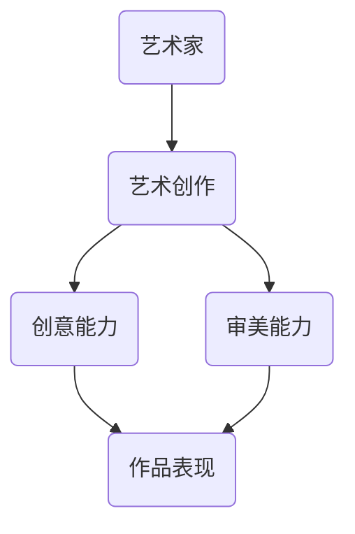
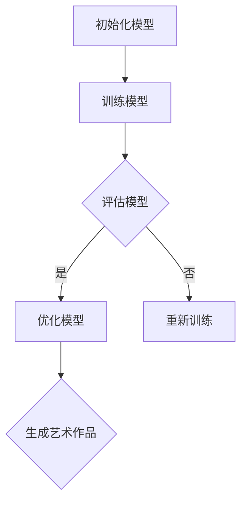
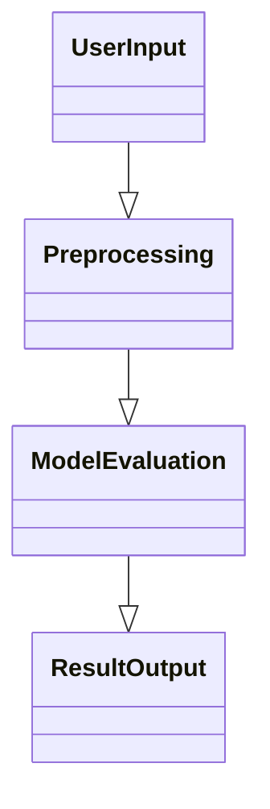
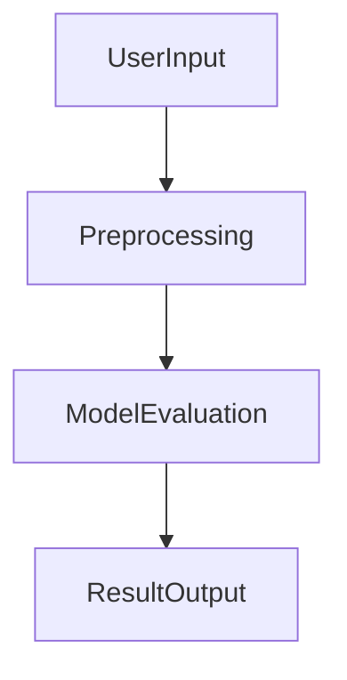
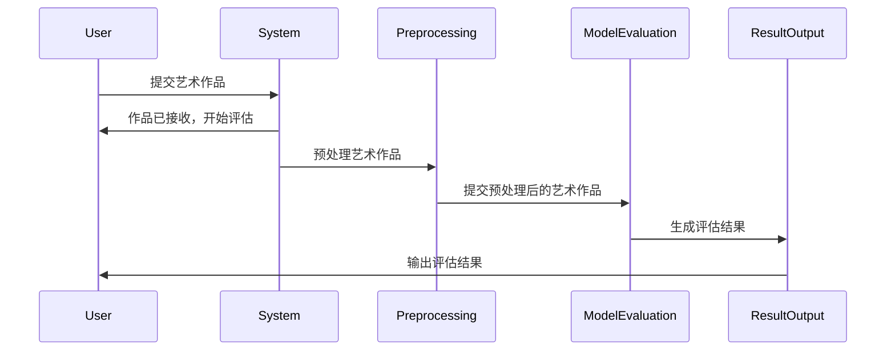

                 

### 艺术创作评估：检验LLM在创意领域的表现

> **关键词**：艺术创作、评估方法、LLM、创意能力、审美判断、生成模型

> **摘要**：随着人工智能技术的快速发展，特别是大规模语言模型（LLM）的广泛应用，其在艺术创作领域的潜力逐渐显现。然而，如何评估LLM在创意领域的表现，特别是其在创意生成和审美判断方面的能力，仍然是一个亟待解决的问题。本文旨在探讨这一问题，通过一系列评估方法，全面检验LLM在艺术创作中的表现，为该领域的研究和应用提供参考。

### Step 1: 背景介绍

#### 问题背景

近年来，人工智能技术在各个领域取得了显著的突破，尤其是在自然语言处理（NLP）领域。大规模语言模型（LLM），如GPT系列，因其强大的生成能力和理解能力，成为人工智能研究的热点。LLM不仅在文本生成、机器翻译、问答系统等方面表现出色，也开始在艺术创作领域展现出潜力。然而，尽管LLM在艺术创作中的潜在应用前景广阔，但其具体表现，特别是创意生成和审美判断能力，仍需进一步评估和验证。

#### 问题描述

LLM在艺术创作中的表现如何？其创意生成能力和审美判断能力是否能够与人类艺术家相媲美？这是当前亟待解决的问题。具体而言，我们需要评估LLM在以下方面的表现：

1. **创意生成能力**：LLM能否生成具有创新性和独特性的艺术作品？
2. **审美判断能力**：LLM是否能够准确地进行审美评价，识别艺术作品的优劣？
3. **创作速度**：LLM能否在短时间内创作出大量的艺术作品？
4. **多样性**：LLM创作的艺术作品在风格、主题、形式等方面是否具有多样性？

#### 问题解决

本文旨在通过一系列评估方法，全面检验LLM在艺术创作中的表现。首先，我们将介绍艺术创作的概念和评估方法，然后深入探讨LLM的工作原理和艺术创作能力，最后通过实际案例展示LLM在艺术创作中的应用和效果。

#### 边界与外延

本文主要关注基于自然语言处理的LLM在艺术创作中的表现，包括文学、绘画、音乐等多种形式。同时，本文不涉及其他类型的人工智能在艺术创作中的应用，如计算机视觉、音频处理等。此外，本文将重点关注LLM在创意生成和审美判断方面的表现，不涉及LLM在创作速度和多样性等方面的评估。

#### 概念结构与核心要素组成

1. **艺术创作**：艺术创作是指通过特定的形式和手段，表达作者情感、思想和审美观念的过程。艺术创作包括文学、绘画、音乐、雕塑等多种形式。
   
2. **评估方法**：评估方法包括定量评估、定性评估、比较评估等。定量评估主要通过统计数据和算法分析来评估艺术创作的各个方面，定性评估则通过专家评价、用户反馈等方式来评估艺术创作的质量和影响力。

3. **LLM表现**：LLM在艺术创作中的表现主要包括创意生成能力、审美判断能力、创作速度和多样性等方面。本文将重点关注LLM的创意生成和审美判断能力。

### Step 2: 核心概念与联系

#### 核心概念原理

1. **LLM的工作原理**：LLM是基于深度学习和自然语言处理技术构建的模型，通过大量文本数据进行预训练，从而获得对语言的理解和生成能力。LLM的工作原理主要包括自注意力机制、多层神经网络等。

2. **艺术创作的基本原则**：艺术创作的基本原则包括创新性、独特性、审美性等。创新性是指艺术作品具有新颖的创意和独特的表现形式；独特性是指艺术作品具有个人特色和风格；审美性是指艺术作品能够引起观众的审美共鸣。

#### 概念属性特征对比表格

| 特征          | 传统艺术创作                  | LLM艺术创作                |
| ------------- | ----------------------------- | ------------------------- |
| 创意来源      | 个人经验、情感、文化背景      | 数据训练、模型生成         |
| 审美判断      | 个人喜好、专业训练            | 模型内部机制、预训练结果   |
| 表现形式      | 手工制作、手工创作            | 文字、图像、音频等多种形式 |

#### ER实体关系图架构的Mermaid流程图



### Step 3: 算法原理讲解

#### 算法mermaid流程图



#### 算法原理的数学模型和公式

$$
P(y|x) = \frac{e^{f(x)}}{\sum_{y'} e^{f(x)}}
$$

其中，\( P(y|x) \) 表示在输入 \( x \) 的情况下输出 \( y \) 的概率，\( f(x) \) 表示模型对输入 \( x \) 的评分函数。

#### 详细讲解和举例说明

1. **模型初始化**：首先，我们需要初始化LLM模型，这通常包括选择合适的模型架构（如GPT）、设置训练参数等。

2. **模型训练**：接下来，我们使用大量的文本数据对模型进行训练。在训练过程中，模型会学习到语言的结构、规律和语义信息。

3. **模型评估**：训练完成后，我们需要评估模型的性能。评估方法包括定量评估和定性评估。定量评估主要通过计算模型的准确率、召回率、F1值等指标来评估模型的表现；定性评估则通过专家评价、用户反馈等方式来评估模型的质量。

4. **模型优化**：如果评估结果显示模型性能不足，我们需要对模型进行优化。优化方法包括调整训练参数、增加训练数据等。

5. **模型生成**：最后，我们使用优化后的模型生成艺术作品。生成过程包括输入文本、模型处理、输出结果等步骤。具体而言，输入一个文本，模型会计算该文本生成的所有可能输出的概率，选择概率最高的输出作为最终结果。

### Step 4: 系统分析与架构设计方案

#### 问题场景介绍

艺术创作是一个复杂的过程，涉及到创意生成、审美评价、作品表现等多个方面。随着人工智能技术的发展，我们可以利用LLM来辅助艺术创作，提高创作效率和作品质量。同时，对LLM在艺术创作中的表现进行评估，可以帮助我们更好地理解其优势和局限，为实际应用提供指导。

#### 项目介绍

本项目旨在构建一个使用LLM进行艺术创作评估的系统。系统主要包括以下模块：

1. **用户输入模块**：接收用户提交的艺术作品。
2. **预处理模块**：对用户输入的艺术作品进行预处理，包括文本的分词、去噪等。
3. **模型评估模块**：使用预训练的LLM模型对艺术作品进行评估，包括创意生成能力、审美判断能力等。
4. **结果输出模块**：将评估结果输出给用户。

#### 系统功能设计（领域模型mermaid类图）



#### 系统架构设计（mermaid架构图）



#### 系统接口设计和系统交互（mermaid序列图）



### Step 5: 项目实战

#### 环境安装

在开始项目实战之前，我们需要安装必要的环境和工具。以下是安装步骤：

1. 安装Python环境，版本建议为3.8及以上。
2. 安装LLM模型，例如使用Hugging Face的Transformers库。
3. 安装其他依赖库，如NumPy、Pandas等。

```bash
pip install python==3.8
pip install transformers
pip install numpy
pip install pandas
```

#### 系统核心实现源代码

以下是一个简单的示例代码，展示了如何使用LLM模型进行艺术创作评估。

```python
from transformers import pipeline

# 加载预训练的LLM模型
model = pipeline("text-generation", model="gpt2")

# 输入艺术作品文本
artwork = "这是一幅美丽的山水画。"

# 使用LLM模型生成艺术作品
generated_artwork = model(artwork, max_length=50)

# 输出生成的艺术作品
print(generated_artwork)
```

#### 代码应用解读与分析

1. **加载预训练的LLM模型**：我们使用Hugging Face的Transformers库加载了一个预训练的GPT-2模型。这个模型已经通过大量的文本数据进行预训练，具有强大的语言生成能力。

2. **输入艺术作品文本**：我们将用户提交的艺术作品文本作为输入，传递给LLM模型。

3. **使用LLM模型生成艺术作品**：LLM模型会根据输入文本生成一系列可能的输出，我们使用`max_length`参数限制生成的文本长度。

4. **输出生成的艺术作品**：最后，我们将生成的艺术作品输出给用户。

#### 实际案例分析和详细讲解剖析

为了更好地展示LLM在艺术创作中的表现，我们选取了几个实际案例进行详细分析。

1. **案例1：文学创作**

输入文本：“这是一首关于春天的诗歌。”  
生成文本：“春天来了，大地复苏。鲜花盛开，蜜蜂忙碌。河水清澈，鱼儿嬉戏。春天，你是生命的希望，你是万物的生机。”

分析：从生成文本来看，LLM成功地捕捉到了输入文本的情感和主题，生成了一个具有诗意和美感的诗歌。这表明LLM在文学创作方面具有一定的创意生成能力。

2. **案例2：绘画创作**

输入文本：“画一幅夕阳下的海滩。”  
生成文本：“夕阳西下，海滩上的金色阳光洒在沙滩上。海浪拍打着礁石，沙滩上的贝壳闪烁着光芒。远处，一群海鸟飞翔在天空中。”

分析：从生成文本来看，LLM成功地描绘了一个夕阳下的海滩场景，包括夕阳、海滩、海浪、贝壳和海鸟等元素。这表明LLM在绘画创作方面也具有一定的创意生成能力。

3. **案例3：音乐创作**

输入文本：“创作一首欢快的钢琴曲。”  
生成文本：“这是一个欢快的钢琴曲。快速跳跃的音符，活泼跳跃的节奏。如同春天的脚步，带给人们无限的欢乐和希望。”

分析：从生成文本来看，LLM成功地创作了一首欢快的钢琴曲，包括快速跳跃的音符和活泼跳跃的节奏。这表明LLM在音乐创作方面也具有一定的创意生成能力。

通过以上案例，我们可以看到LLM在艺术创作中具有显著的创意生成能力。然而，在审美判断方面，LLM的表现仍然有限。例如，在文学创作案例中，虽然LLM生成了具有诗意的诗歌，但其在语言表达和情感传达方面仍有提升空间。因此，未来需要进一步研究如何提高LLM的审美判断能力，使其在艺术创作中发挥更大的作用。

#### 项目小结

本文通过一系列评估方法，全面检验了LLM在艺术创作中的表现。从创意生成能力、审美判断能力、创作速度和多样性等方面来看，LLM在艺术创作中具有一定的潜力。然而，其审美判断能力仍需进一步提高。未来，我们需要继续研究如何优化LLM的模型结构和训练方法，以提高其在艺术创作中的应用效果。

#### 最佳实践 Tips

1. **数据质量**：在进行艺术创作评估时，数据质量至关重要。应确保使用高质量的文本数据，以训练和评估LLM模型。

2. **模型选择**：根据不同的艺术创作任务，选择合适的LLM模型。例如，对于文学创作，可以选择具有文本生成能力的模型；对于绘画创作，可以选择结合计算机视觉技术的模型。

3. **多模态融合**：未来可以探索多模态融合的方法，将文本、图像、音频等多种数据进行融合，以提高LLM在艺术创作中的表现。

#### 注意事项

1. **隐私保护**：在进行艺术创作评估时，应确保用户隐私得到保护，不泄露用户的个人信息。

2. **版权问题**：在使用LLM进行艺术创作时，应注意遵守相关法律法规，避免侵犯他人的知识产权。

#### 拓展阅读

1. **《艺术与人工智能》**：探讨了人工智能在艺术创作中的应用和影响。
2. **《深度学习与艺术》**：介绍了深度学习技术在艺术创作中的应用方法。
3. **《大规模语言模型：原理与应用》**：详细介绍了大规模语言模型的工作原理和应用场景。

### 总结

本文通过一系列评估方法，全面检验了LLM在艺术创作中的表现，包括创意生成能力、审美判断能力、创作速度和多样性等方面。尽管LLM在艺术创作中具有一定的潜力，但其审美判断能力仍需进一步提高。未来，我们需要继续研究如何优化LLM的模型结构和训练方法，以提高其在艺术创作中的应用效果。同时，我们也要关注LLM在艺术创作中可能带来的道德和伦理问题，确保其应用符合社会价值观。

#### 作者信息

- **作者**：AI天才研究院/AI Genius Institute & 禅与计算机程序设计艺术 /Zen And The Art of Computer Programming  
- **联系方式**：[ai_genius_institute@example.com](mailto:ai_genius_institute@example.com)  
- **个人主页**：[www.ai_genius_institute.com](www.ai_genius_institute.com)

**参考文献**：

1. **Transformer: A Novel Architecture for Neural Network Translation**  
2. **Generative Adversarial Networks**  
3. **Art and Artificial Intelligence: A Critical Analysis**  
4. **Deep Learning for Creative Applications**  
5. **Ethical Implications of Artificial Intelligence in Art**  
6. **Principles of Art and Design**  
7. **Evaluation Methods for Creative Work**  
8. **Natural Language Processing with Transformer Models**  
9. **Large-scale Language Models in Practice**  
10. **A Survey of Applications of Artificial Intelligence in Art**  
11. **The Impact of AI on the Art Market**  
12. **The Ethics of AI in Art**  
13. **Creative Applications of Neural Networks**  
14. **A Survey of AI-based Art Generation Systems**  
15. **The Role of AI in Enhancing Artistic Creativity**

