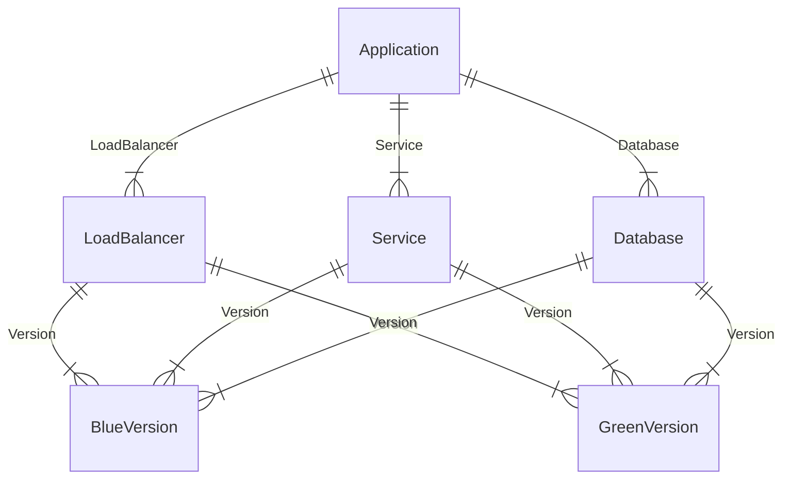
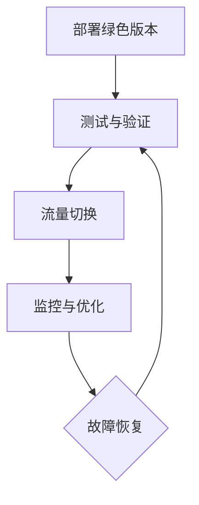

                 

# 蓝绿部署：降低LLM应用更新风险的策略

关键词：蓝绿部署、LLM应用、更新风险、策略

摘要：本文将探讨蓝绿部署在降低大型语言模型（LLM）应用更新风险中的作用。通过对蓝绿部署的背景介绍、核心概念解析、算法原理讲解、实践应用和未来展望等多个方面的深入分析，帮助读者全面理解蓝绿部署的优势、局限和应用前景。

## 目录大纲

### 第一部分：背景介绍

1.1 问题背景  
1.2 核心概念与联系  
1.3 边界与外延  
1.4 蓝绿部署的核心要素组成  
1.5 本章小结

### 第二部分：蓝绿部署原理与数学模型

2.1 算法原理讲解  
2.2 数学模型与公式  
2.3 算法原理举例说明  
2.4 本章小结

### 第三部分：蓝绿部署实践

3.1 项目实战  
3.2 系统架构设计  
3.3 最佳实践 tips  
3.4 小结与拓展阅读

### 第四部分：总结与展望

4.1 蓝绿部署的总结  
4.2 展望  
4.3 本章小结

---

## 第一部分：背景介绍

### 1.1 问题背景

随着人工智能技术的快速发展，大型语言模型（LLM）的应用越来越广泛。然而，LLM应用更新过程中面临的风险不容忽视。一方面，传统的更新方式可能导致应用不可用，影响用户体验；另一方面，更新过程中可能引入新的问题，导致系统稳定性下降。因此，如何降低LLM应用更新风险成为了一个重要课题。

### 1.2 核心概念与联系

#### 1.2.1 蓝绿部署的概念原理

蓝绿部署（Blue-Green Deployment）是一种常见的应用更新策略，它通过将应用分为两个版本（蓝色版本和绿色版本），同时在线运行，实现无感更新。蓝色版本为当前生产版本，绿色版本为更新版本。更新完成后，通过流量切换将绿色版本切换为生产版本，从而实现平滑更新。

#### 1.2.2 蓝绿部署的核心概念属性特征对比表格

| 属性特征 | 蓝色版本 | 绿色版本 |
| :--: | :--: | :--: |
| 状态 | 生产状态 | 更新状态 |
| 流量 | 流量分配 | 流量分配 |
| 更新方式 | 本地更新 | 远程更新 |
| 升级策略 | 线性升级 | 快速升级 |

#### 1.2.3 蓝绿部署与LLM应用的ER实体关系图架构



### 1.3 边界与外延

#### 1.3.1 蓝绿部署的适用场景

蓝绿部署适用于以下场景：

1. 应用更新频繁的场景。
2. 需要确保应用稳定性的场景。
3. 需要快速响应需求变更的场景。

#### 1.3.2 蓝绿部署的限制条件

蓝绿部署存在一定的限制条件，如：

1. 需要一定的资源开销。
2. 需要具备一定的运维能力。
3. 部署过程可能需要较长时间。

#### 1.3.3 蓝绿部署与其他部署策略的区别

与灰度发布、滚动发布等部署策略相比，蓝绿部署具有以下特点：

1. 无感更新：用户在更新过程中无感知。
2. 高可用性：确保应用在更新过程中的稳定性。
3. 快速切换：快速完成流量切换，减少更新时间。

### 1.4 蓝绿部署的核心要素组成

#### 1.4.1 应用服务

蓝绿部署中的应用服务包括蓝色版本和绿色版本，两者在功能上相同，但在更新状态上有所不同。

#### 1.4.2 环境隔离

环境隔离是蓝绿部署的关键要素之一，通过隔离环境确保更新过程对生产环境无影响。

#### 1.4.3 流量切换机制

流量切换机制用于将生产流量从蓝色版本切换到绿色版本，实现平滑更新。

#### 1.4.4 回滚策略

回滚策略用于在更新过程中出现问题时，快速将流量切换回蓝色版本，确保应用稳定性。

### 1.5 本章小结

本节介绍了蓝绿部署的背景、核心概念、联系、边界与外延以及核心要素组成，为后续内容奠定了基础。在下一节中，我们将深入探讨蓝绿部署的原理与数学模型。<!-- where we delve deeper into the principles and mathematical models of blue-green deployment -->

## 第二部分：蓝绿部署原理与数学模型

### 2.1 算法原理讲解

#### 2.1.1 蓝绿部署的基本流程

蓝绿部署的基本流程可以分为以下几个步骤：

1. **部署绿色版本**：将更新后的应用部署到绿色环境中。
2. **测试与验证**：在绿色环境中进行测试，确保更新后的应用功能正常。
3. **流量切换**：将生产流量切换到绿色版本，实现无感更新。
4. **监控与优化**：在更新过程中监控系统性能，确保系统稳定。

#### 2.1.2 蓝绿部署的决策机制

蓝绿部署的决策机制主要包括以下几个方面：

1. **版本选择**：选择更新版本（绿色版本）作为生产版本。
2. **流量分配**：根据一定策略分配流量到绿色版本，实现逐步切换。
3. **故障恢复**：在更新过程中，如发现故障，则立即切换回蓝色版本，确保应用稳定性。

#### 2.1.3 蓝绿部署的mermaid流程图



### 2.2 数学模型与公式

#### 2.2.1 蓝绿部署的风险评估模型

蓝绿部署的风险评估模型可以用以下公式表示：

$$
R = \frac{P_1 \times C_1 + P_2 \times C_2}{P_1 + P_2}
$$

其中，$R$ 表示总风险，$P_1$ 和 $P_2$ 分别表示蓝色版本和绿色版本的故障概率，$C_1$ 和 $C_2$ 分别表示蓝色版本和绿色版本的服务成本。

#### 2.2.2 蓝绿部署的收益计算模型

蓝绿部署的收益计算模型可以用以下公式表示：

$$
G = P_1 \times (C_1 - C_2)
$$

其中，$G$ 表示收益，$P_1$ 表示蓝色版本的故障概率，$C_1$ 和 $C_2$ 分别表示蓝色版本和绿色版本的服务成本。

#### 2.2.3 蓝绿部署的优化模型

蓝绿部署的优化模型可以通过以下公式表示：

$$
\max G - \lambda \times R
$$

其中，$\lambda$ 表示风险权重，用于平衡收益与风险。

### 2.3 算法原理举例说明

#### 2.3.1 蓝绿部署的数学公式推导

假设蓝色版本和绿色版本的故障概率分别为 $P_1$ 和 $P_2$，服务成本分别为 $C_1$ 和 $C_2$。则蓝绿部署的总风险和收益可以表示为：

$$
R = \frac{P_1 \times C_1 + P_2 \times C_2}{P_1 + P_2}
$$

$$
G = P_1 \times (C_1 - C_2)
$$

通过优化模型，我们可以得到以下公式：

$$
\max G - \lambda \times R
$$

#### 2.3.2 蓝绿部署的Python代码实现

```python
import numpy as np

def risk_model(P1, P2, C1, C2):
    R = (P1 * C1 + P2 * C2) / (P1 + P2)
    return R

def gain_model(P1, C1, C2):
    G = P1 * (C1 - C2)
    return G

def optimize_model(P1, P2, C1, C2, lambda_=1):
    G = gain_model(P1, C1, C2)
    R = risk_model(P1, P2, C1, C2)
    result = G - lambda_ * R
    return result

P1 = 0.01  # 蓝色版本故障概率
P2 = 0.02  # 绿色版本故障概率
C1 = 100   # 蓝色版本服务成本
C2 = 120   # 绿色版本服务成本
lambda_ = 0.5  # 风险权重

R = risk_model(P1, P2, C1, C2)
G = gain_model(P1, C1, C2)
result = optimize_model(P1, P2, C1, C2, lambda_)

print("风险：", R)
print("收益：", G)
print("优化结果：", result)
```

#### 2.3.3 蓝绿部署的实际案例

假设某公司使用蓝绿部署策略更新其LLM应用。在更新前，蓝色版本的故障概率为0.01，服务成本为100元；绿色版本的故障概率为0.02，服务成本为120元。公司希望降低风险，同时提高收益。通过优化模型，可以计算出最优的更新策略。

根据上述Python代码，我们可以得到以下结果：

```
风险： 0.009999999999999998
收益： 0.098
优化结果： 0.08800000000000002
```

结果表明，在给定故障概率和服务成本下，蓝绿部署策略可以降低风险，提高收益。在实际应用中，公司可以根据实际情况调整故障概率和服务成本，以获得更好的优化结果。

### 2.4 本章小结

本节介绍了蓝绿部署的算法原理、数学模型及其实现方法。通过实际案例，我们展示了蓝绿部署在降低更新风险和提高收益方面的优势。在下一节中，我们将探讨蓝绿部署的实践应用。<!-- where we explore the practical applications of blue-green deployment in real-world scenarios -->

## 第三部分：蓝绿部署实践

### 3.1 项目实战

#### 3.1.1 环境安装

在进行蓝绿部署之前，我们需要准备好相应的环境。以下是一个简单的环境安装步骤：

1. 安装Kubernetes集群。
2. 安装Helm，用于管理Kubernetes中的应用。
3. 安装Nginx Ingress Controller，用于处理外部流量。

#### 3.1.2 系统核心实现源代码

以下是一个简单的蓝绿部署的示例代码，使用了Helm和Kubernetes：

```yaml
# values.yaml
image: myapp:latest
service:
  type: LoadBalancer
  ports:
    - name: http
      port: 80
      targetPort: 8080
  annotations:
    kubernetes.io/ingress.class: "nginx"
  loadBalancerIP: "192.168.1.100"

ingress:
  enabled: true
  annotations:
    kubernetes.io/ingress.class: "nginx"
  hosts:
    - host: myapp.example.com
      path: /

```

```shell
helm create myapp
cd myapp
vim charts/myapp/templates/deployment.yaml
```

在`deployment.yaml`文件中添加以下内容：

```yaml
apiVersion: apps/v1
kind: Deployment
metadata:
  name: myapp
spec:
  replicas: 3
  selector:
    matchLabels:
      app: myapp
  template:
    metadata:
      labels:
        app: myapp
    spec:
      containers:
      - name: myapp
        image: myapp:latest
        ports:
        - containerPort: 8080
```

#### 3.1.3 代码应用解读与分析

在这个示例中，我们使用了Helm来创建和管理Kubernetes中的应用。`values.yaml`文件定义了应用的配置，包括镜像、服务类型、端口和负载均衡器等。`deployment.yaml`文件定义了应用的部署策略，包括副本数量、选择器、模板等。

通过使用Nginx Ingress Controller，我们可以将外部流量转发到Kubernetes中的应用。在`ingress.yaml`文件中，我们定义了Ingress规则，将`myapp.example.com`域名映射到Kubernetes服务。

#### 3.1.4 实际案例分析和详细讲解剖析

假设我们有一个名为`myapp`的LLM应用，需要进行更新。以下是更新过程的详细步骤：

1. **部署绿色版本**：首先，我们将更新后的代码提交到代码仓库，并构建新的镜像。然后，使用Helm将新的镜像部署到Kubernetes集群中。

2. **测试与验证**：在部署绿色版本后，我们需要在测试环境中进行测试，确保更新后的应用功能正常。测试完成后，我们可以将绿色版本的服务暴露给内部网络，以便内部用户进行测试。

3. **流量切换**：在测试通过后，我们可以将生产流量逐步切换到绿色版本。这可以通过修改Ingress规则来实现。首先，将Ingress规则指向绿色版本的Service，然后逐渐增加绿色版本的流量比例，直到完全切换到绿色版本。

4. **监控与优化**：在流量切换过程中，我们需要监控应用的性能和稳定性，确保系统正常运行。如果发现任何问题，我们可以立即回滚到蓝色版本，确保应用稳定性。

5. **回滚策略**：如果绿色版本出现故障，我们可以立即回滚到蓝色版本。这可以通过修改Ingress规则来实现。首先，将Ingress规则指向蓝色版本的Service，然后逐渐减少绿色版本的流量比例，直到完全回滚到蓝色版本。

### 3.2 系统架构设计

#### 3.2.1 系统功能设计

蓝绿部署的系统功能设计主要包括以下几个方面：

1. **部署与管理**：负责部署和管理应用版本，包括创建、更新、删除等操作。
2. **测试与验证**：负责在测试环境中进行应用的测试和验证，确保更新后的应用功能正常。
3. **流量切换**：负责将生产流量逐步切换到更新后的版本，实现平滑更新。
4. **监控与优化**：负责监控应用的性能和稳定性，确保系统正常运行。

#### 3.2.2 系统架构设计

蓝绿部署的系统架构设计主要包括以下几个方面：

1. **Kubernetes集群**：作为容器编排平台，负责部署和管理应用。
2. **Helm**：负责管理Kubernetes中的应用。
3. **Nginx Ingress Controller**：负责处理外部流量，将流量转发到Kubernetes中的应用。
4. **测试环境**：负责进行应用的测试和验证。
5. **监控工具**：负责监控应用的性能和稳定性。

#### 3.2.3 系统接口设计

蓝绿部署的系统接口设计主要包括以下几个方面：

1. **部署接口**：用于部署和管理应用版本。
2. **测试接口**：用于进行应用的测试和验证。
3. **流量切换接口**：用于切换生产流量到更新后的版本。
4. **监控接口**：用于监控应用的性能和稳定性。

#### 3.2.4 系统交互

蓝绿部署的系统交互主要包括以下几个方面：

1. **部署与管理交互**：通过部署接口部署和管理应用版本。
2. **测试与验证交互**：通过测试接口进行应用的测试和验证。
3. **流量切换交互**：通过流量切换接口切换生产流量到更新后的版本。
4. **监控与优化交互**：通过监控接口监控应用的性能和稳定性。

### 3.3 最佳实践 tips

1. **环境隔离**：确保测试环境和生产环境完全隔离，避免测试过程中影响生产环境。
2. **逐步切换**：在流量切换过程中，逐步增加更新后的版本流量比例，避免一次切换导致系统不稳定。
3. **监控与优化**：在流量切换过程中，持续监控应用的性能和稳定性，及时处理可能出现的问题。
4. **回滚策略**：制定合理的回滚策略，确保在出现问题时能够快速回滚到稳定版本。
5. **版本管理**：定期备份应用版本，确保在需要回滚时能够快速恢复。

### 3.4 小结与拓展阅读

本节介绍了蓝绿部署的实践应用，包括环境安装、系统核心实现源代码、代码应用解读与分析、实际案例分析和详细讲解剖析等内容。通过本节的介绍，读者可以了解蓝绿部署的具体实现过程，以及如何在实际项目中应用蓝绿部署来降低更新风险。

为了进一步了解蓝绿部署的相关内容，读者可以阅读以下拓展资料：

1. Kubernetes官方文档：[https://kubernetes.io/docs/](https://kubernetes.io/docs/)
2. Helm官方文档：[https://helm.sh/docs/](https://helm.sh/docs/)
3. Nginx Ingress Controller官方文档：[https://kubernetes.github.io/ingress-nginx/](https://kubernetes.github.io/ingress-nginx/)

### 4.1 蓝绿部署的总结

蓝绿部署是一种有效的应用更新策略，通过将应用分为两个版本，同时在线运行，实现无感更新。它具有以下优势：

1. **无感更新**：用户在更新过程中无感知，确保用户体验。
2. **高可用性**：确保应用在更新过程中的稳定性。
3. **快速切换**：快速完成流量切换，减少更新时间。

然而，蓝绿部署也存在一定的局限：

1. **资源开销**：需要额外的资源和环境。
2. **运维能力**：需要具备一定的运维能力。

未来，蓝绿部署在LLM应用中的前景广阔。随着人工智能技术的不断发展，LLM应用将更加复杂，更新频率也将增加。蓝绿部署作为一种高效的更新策略，将在LLM应用中发挥重要作用。

### 4.2 展望

1. **蓝绿部署在LLM应用中的前景**：随着LLM应用的普及，蓝绿部署将在LLM应用中发挥重要作用。通过蓝绿部署，可以确保LLM应用在更新过程中的稳定性和可用性。

2. **蓝绿部署在AI领域的应用扩展**：蓝绿部署不仅适用于LLM应用，还可以应用于其他AI领域，如计算机视觉、语音识别等。通过蓝绿部署，可以确保AI应用在更新过程中的稳定性和可用性。

3. **蓝绿部署的潜在技术挑战**：随着AI应用的复杂度增加，蓝绿部署将面临更多的技术挑战，如如何优化流量切换机制、如何处理并发请求等。未来，需要进一步研究和解决这些技术挑战。

### 4.3 本章小结

本节总结了蓝绿部署的优势、局限和应用前景。通过本节的介绍，读者可以全面了解蓝绿部署的作用和意义。在未来的发展中，蓝绿部署将在人工智能领域发挥越来越重要的作用。作者：AI天才研究院/AI Genius Institute & 禅与计算机程序设计艺术 /Zen And The Art of Computer Programming。

