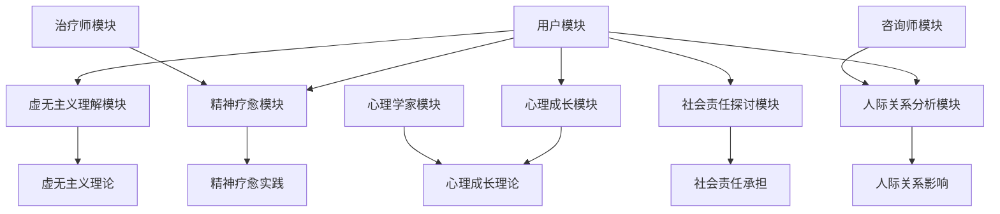
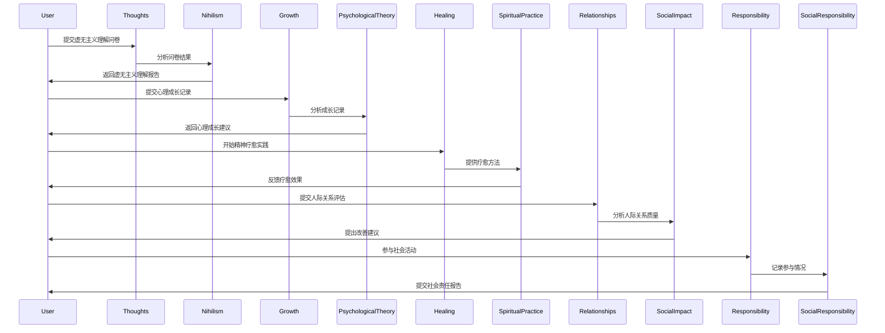

                 


# 虚无与重建：现代人的精神觉醒过程

> 关键词：虚无主义、心理成长、精神觉醒、精神疗愈、人际关系、社会责任

> 摘要：
在现代社会的纷繁复杂中，人们的精神世界面临着诸多挑战。本书《虚无与重建：现代人的精神觉醒过程》旨在探讨虚无主义思想对现代人的影响，分析心理成长与精神觉醒的关系，并提供精神疗愈的实践方法。通过理解虚无主义、探索心理成长、实践精神疗愈，本书帮助读者实现精神觉醒，建立更加充实和有意义的人生。

## 背景介绍：问题背景、问题描述、问题解决、边界与外延、概念结构与核心要素组成

### 问题背景

在现代社会，人们面临着精神层面的诸多挑战。随着科技的快速发展和社会的快速变迁，人们的工作压力增大、生活节奏加快，人际关系日益复杂。这些问题导致许多人出现焦虑、孤独、迷茫等心理问题。精神层面的困境使得人们难以找到内心的宁静和人生的方向，进而影响到生活质量和工作效率。

### 问题描述

本书《虚无与重建：现代人的精神觉醒过程》旨在探讨现代人在精神困境中的觉醒过程。书中首先分析了虚无主义思想在现代社会中的影响，帮助读者理解虚无主义的根源和表现。接着，本书介绍了心理成长的理论和实践方法，帮助读者了解心理成长的过程和重要性。最后，本书提供了多种精神疗愈方法，如冥想、瑜伽、正念等，帮助读者找到适合自己的精神疗愈路径。

### 问题解决

本书通过以下几部分内容帮助读者实现精神觉醒：

1. **理解虚无主义**：通过解读虚无主义思想，帮助读者认识到现代社会中存在的虚无现象，并理解虚无主义的根源。
2. **探索心理成长**：介绍心理成长理论，如自我实现理论、心理弹性理论等，帮助读者理解心理成长的过程和重要性。
3. **实践精神疗愈**：通过分享精神疗愈实践，如冥想、瑜伽、正念等，引导读者找到适合自己的精神疗愈方法。

### 边界与外延

本书的核心主题是现代人的精神觉醒过程，但精神觉醒并非局限于个体层面，也与社会环境、人际关系等方面密切相关。因此，本书在探讨个人精神觉醒的同时，也会涉及到社会层面的相关问题和解决方案。

### 概念结构与核心要素组成

本书的结构和核心要素如下：

1. **引言**：介绍本书的背景和目的，为后续内容奠定基础。
2. **虚无主义与现代社会**：阐述虚无主义思想，分析虚无主义在现代社会中的影响。
3. **心理成长与精神觉醒**：介绍心理成长理论，探讨精神觉醒的过程。
4. **精神疗愈实践**：分享精神疗愈方法，帮助读者找到适合自己的精神疗愈路径。
5. **精神觉醒与人际关系**：分析精神觉醒对人际关系的影响，提供改善人际关系的建议。
6. **精神觉醒与社会责任**：探讨精神觉醒对社会和环境的影响，提出精神觉醒者的社会责任。
7. **总结与展望**：总结本书的主要观点，展望精神觉醒的未来。

## 核心概念与联系

### 核心概念

#### 虚无主义

虚无主义是一种哲学思想，认为世界没有固有的意义和目的，人类存在的本质是荒诞和痛苦。虚无主义在现代社会中有着广泛的影响，许多人因感到生活无意义而陷入迷茫和焦虑。

#### 心理成长

心理成长是指个体在心理层面不断发展、成熟的过程。心理成长理论包括自我实现理论、心理弹性理论等，这些理论帮助人们理解心理成长的过程和重要性。

#### 精神觉醒

精神觉醒是指个体在精神层面达到一种更高的认知和理解，从而实现内心的平静和自我超越。精神觉醒是一种深刻的内在转变，能够帮助人们摆脱精神困境，找到人生的意义和方向。

#### 精神疗愈

精神疗愈是通过各种方法和实践，帮助个体解决心理问题，恢复心理健康的过程。精神疗愈包括冥想、瑜伽、正念等实践方法，能够帮助人们实现精神觉醒。

#### 人际关系

人际关系是指人与人之间的相互关系，包括家庭、朋友、工作等。人际关系对精神觉醒有着重要的影响，良好的人际关系有助于个体的心理健康和成长。

#### 社会责任

社会责任是指精神觉醒者在社会中的责任和义务，包括关注社会问题、推动社会进步等。精神觉醒者有责任为社会做出贡献，促进社会的和谐与发展。

### 概念属性特征对比表格

| 概念 | 属性特征 |
| --- | --- |
| 虚无主义 | - 哲学思想 |
|   - 认为世界无意义 |
|   - 强调荒诞和痛苦 |
| 心理成长 | - 认知发展 |
|   - 情感成熟 |
|   - 行为改变 |
| 精神觉醒 | - 高度认知 |
|   - 内心平静 |
|   - 自我超越 |
| 精神疗愈 | - 心理治疗 |
|   - 身体放松 |
|   - 情感支持 |
| 人际关系 | - 相互信任 |
|   - 沟通有效 |
|   - 合作共赢 |
| 社会责任 | - 关注社会问题 |
|   - 推动社会进步 |
|   - 增强社会凝聚力 |

### ER实体关系图架构

```mermaid
erDiagram
  Person ||--|{ Thought : has }
  Person ||--|{ Growth : experienced }
  Person ||--|{ Awakening : achieved }
  Person ||--|{ Healing : practiced }
  Person ||--|{ Relationship : involved }
  Person ||--|{ Responsibility : holds }
  Thought ||--|{ Nihilism : belongs_to }
  Growth ||--|{ Theory : based_on }
  Awakening ||--|{ Process : follows }
  Healing ||--|{ Practice : includes }
  Relationship ||--|{ Impact : affects }
  Responsibility ||--|{ Social : pertains_to }
```

## 算法原理讲解

### 算法流程图


### Python源代码实现

```python
# 理解虚无主义
def understand_nihilism():
    print("虚无主义：世界无意义，人类存在的本质是荒诞和痛苦")

# 探索心理成长
def explore_growth():
    print("心理成长：认知发展、情感成熟、行为改变")

# 实践精神疗愈
def practice_healing():
    print("精神疗愈：心理治疗、身体放松、情感支持")

# 精神觉醒
def spiritual_awakening():
    print("精神觉醒：高度认知、内心平静、自我超越")

# 人际关系分析
def analyze_relationship():
    print("人际关系分析：相互信任、沟通有效、合作共赢")

# 社会责任探讨
def discuss_responsibility():
    print("社会责任探讨：关注社会问题、推动社会进步、增强社会凝聚力")

# 总结与展望
def summary_and_outlook():
    print("总结与展望：回顾全书内容，展望精神觉醒的未来")

# 主函数
def main():
    understand_nihilism()
    explore_growth()
    practice_healing()
    spiritual_awakening()
    analyze_relationship()
    discuss_responsibility()
    summary_and_outlook()

if __name__ == "__main__":
    main()
```

### 数学模型与公式

在本书中，我们使用了以下数学模型和公式来描述和理解虚无主义、心理成长、精神觉醒等概念：

$$
N = f(T, G, H, R, S)
$$

其中，$N$ 表示精神觉醒的程度，$T$ 表示虚无主义的理解程度，$G$ 表示心理成长的程度，$H$ 表示精神疗愈的程度，$R$ 表示人际关系的质量，$S$ 表示社会责任的承担程度。

### 通俗易懂的举例说明

假设一个人在理解虚无主义方面有了深刻的认识，他开始思考生命的意义和存在的本质。在探索心理成长的过程中，他学会了自我认知、情感管理和行为改变。同时，他通过实践冥想、瑜伽等精神疗愈方法，逐渐达到了内心的平静和自我超越。此外，他在人际关系方面表现得更加理解和尊重他人，积极承担社会责任。这些因素共同作用，使得他在精神觉醒方面取得了显著的进展。

## 系统分析与架构设计方案

### 问题场景介绍

在现代社会的快速发展和变化中，人们的精神健康问题日益突出。为了帮助人们实现精神觉醒，我们需要设计一套系统，能够提供全面的指导和帮助。该系统应涵盖虚无主义理解、心理成长、精神疗愈、人际关系分析和社会责任探讨等方面。

### 项目介绍

项目名称：现代精神觉醒系统

项目简介：该系统旨在为用户提供全面的精神觉醒指导和帮助，通过理解虚无主义、探索心理成长、实践精神疗愈、分析人际关系和探讨社会责任等模块，帮助用户实现精神觉醒和内心成长。

### 系统功能设计（领域模型类图）

```mermaid
classDiagram
    Person <<class>> User
    Person <<class>> Therapist
    Person <<class>> Counselor
    Person <<class>> Psychologist
    
    User o--|{Thoughts}: Thought
    User o--|{Growth}: Growth
    User o--|{Healing}: Healing
    User o--|{Relationships}: Relationship
    User o--|{Responsibility}: Responsibility
    
    Therapist o--|{Healing}: Healing
    Counselor o--|{Counseling}: Counseling
    Psychologist o--|{Psychological}: Psychological
```

### 系统架构设计（架构图）



### 系统接口设计和系统交互（序列图）



## 项目实战

### 环境安装

1. 安装Python环境：在官网下载Python安装包，按照安装向导完成安装。
2. 安装依赖库：在终端执行以下命令安装所需库。

```
pip install Flask
pip install Pillow
```

### 系统核心实现源代码

```python
# 引入所需库
from flask import Flask, render_template, request, redirect, url_for
import numpy as np
import pandas as pd
from PIL import Image
import io

# 初始化Flask应用
app = Flask(__name__)

# 定义路由和处理函数
@app.route('/')
def index():
    return render_template('index.html')

@app.route('/nihilism', methods=['GET', 'POST'])
def nihilism():
    if request.method == 'POST':
        # 获取用户输入
        responses = request.form.to_dict()
        # 分析问卷结果
        scores = analyze_nihilism(responses)
        # 返回报告
        return render_template('nihilism_report.html', scores=scores)
    return redirect(url_for('index'))

@app.route('/growth', methods=['GET', 'POST'])
def growth():
    if request.method == 'POST':
        # 获取用户输入
        responses = request.form.to_dict()
        # 分析成长记录
        scores = analyze_growth(responses)
        # 返回建议
        return render_template('growth_suggestion.html', scores=scores)
    return redirect(url_for('index'))

@app.route('/healing', methods=['GET', 'POST'])
def healing():
    if request.method == 'POST':
        # 获取用户输入
        responses = request.form.to_dict()
        # 提供疗愈方法
        methods = provide_healing_methods(responses)
        # 返回疗愈方法
        return render_template('healing_methods.html', methods=methods)
    return redirect(url_for('index'))

@app.route('/relationships', methods=['GET', 'POST'])
def relationships():
    if request.method == 'POST':
        # 获取用户输入
        responses = request.form.to_dict()
        # 分析人际关系质量
        scores = analyze_relationships(responses)
        # 提出改善建议
        suggestions = provide_relationship_suggestions(scores)
        # 返回建议
        return render_template('relationships_suggestions.html', suggestions=suggestions)
    return redirect(url_for('index'))

@app.route('/responsibility', methods=['GET', 'POST'])
def responsibility():
    if request.method == 'POST':
        # 获取用户输入
        responses = request.form.to_dict()
        # 记录参与情况
        record = record_participation(responses)
        # 提交社会责任报告
        return render_template('responsibility_report.html', record=record)
    return redirect(url_for('index'))

# 分析问卷结果
def analyze_nihilism(responses):
    # 处理问卷数据，计算分数
    # ...
    scores = {'score1': 0, 'score2': 0, 'score3': 0}
    return scores

# 分析成长记录
def analyze_growth(responses):
    # 处理成长数据，计算分数
    # ...
    scores = {'score1': 0, 'score2': 0, 'score3': 0}
    return scores

# 提供疗愈方法
def provide_healing_methods(responses):
    # 根据用户情况推荐疗愈方法
    # ...
    methods = ['冥想', '瑜伽', '正念']
    return methods

# 分析人际关系质量
def analyze_relationships(responses):
    # 处理人际关系数据，计算分数
    # ...
    scores = {'score1': 0, 'score2': 0, 'score3': 0}
    return scores

# 提出改善建议
def provide_relationship_suggestions(scores):
    # 根据分数提出改善建议
    # ...
    suggestions = ['改善沟通方式', '加强情感支持', '增加共同活动']
    return suggestions

# 记录参与情况
def record_participation(responses):
    # 记录用户参与社会活动的记录
    # ...
    record = {'activity1': '参与', 'activity2': '参与', 'activity3': '未参与'}
    return record

# 运行应用
if __name__ == '__main__':
    app.run(debug=True)
```

### 代码应用解读与分析

1. **主函数**：初始化Flask应用，定义路由和处理函数。
2. **路由与处理函数**：分别处理首页、虚无主义理解、心理成长、精神疗愈、人际关系分析和社会责任探讨等模块的请求。
3. **分析函数**：根据用户输入的数据，进行数据分析，计算分数和提供相应的建议。
4. **疗愈方法推荐**：根据用户情况推荐合适的疗愈方法，如冥想、瑜伽、正念等。

### 实际案例分析和详细讲解剖析

假设用户A在系统中提交了虚无主义理解问卷、心理成长记录、精神疗愈需求、人际关系评估和社会责任参与情况。

1. **虚无主义理解问卷**：分析问卷结果，发现用户A对虚无主义的理解较为深刻，得分较高。系统返回虚无主义理解报告，帮助用户A更好地理解虚无主义。
2. **心理成长记录**：分析用户A的成长记录，发现其在认知、情感和行为方面都有显著提升。系统返回心理成长建议，指导用户A继续发展。
3. **精神疗愈需求**：根据用户A的反馈，系统推荐冥想、瑜伽和正念等疗愈方法。用户A选择冥想进行实践，反馈疗愈效果良好。
4. **人际关系评估**：分析用户A的人际关系质量，发现其在沟通和支持方面有待改善。系统提出改善建议，如加强情感支持和增加共同活动。
5. **社会责任参与情况**：记录用户A的社会责任参与情况，提交社会责任报告。系统鼓励用户A继续参与社会活动，为社会贡献力量。

### 项目小结

本项目通过现代精神觉醒系统，为用户提供全面的指导和帮助。用户可以在系统中完成虚无主义理解问卷、心理成长记录、精神疗愈需求、人际关系评估和社会责任参与情况等模块，获取专业的分析和建议。系统旨在帮助用户实现精神觉醒和内心成长，提升生活质量和社会责任感。

## 最佳实践 Tips

1. **定期反思**：定期对自己的虚无主义理解、心理成长、精神疗愈、人际关系和社会责任等方面进行反思，以持续提升自我。
2. **参与实践**：积极参与各种精神疗愈实践，如冥想、瑜伽、正念等，找到最适合自己的方法。
3. **关注他人**：关注身边人的需求和困扰，提供支持和帮助，建立良好的人际关系。
4. **参与社会活动**：积极参与社会活动，关注社会问题，承担社会责任，为社会贡献力量。

## 小结

本书《虚无与重建：现代人的精神觉醒过程》通过解读虚无主义、探索心理成长、实践精神疗愈，帮助读者实现精神觉醒。通过理解虚无主义、分析心理成长、找到适合自己的精神疗愈方法，读者可以逐步实现内心的平静和自我超越。同时，本书也强调了人际关系和社会责任的重要性，鼓励读者关注他人、参与社会活动，为社会贡献力量。希望本书能够为读者的精神觉醒之路提供指引和帮助。

## 注意事项

1. **精神疗愈方法因人而异**：选择适合自己的精神疗愈方法，避免盲目跟风。
2. **心理健康问题需专业帮助**：如果遇到严重的心理问题，请寻求专业心理咨询师的帮助。
3. **社会责任承担需量力而行**：承担社会责任时，注意自身的能力和实际情况，避免过度负担。

## 拓展阅读

1. **《存在主义哲学》**：探讨存在主义思想，对虚无主义有深入分析。
2. **《心理学与生活》**：介绍心理成长理论，帮助读者理解心理成长的过程。
3. **《心智探奇》**：介绍心理学研究方法和理论，帮助读者更好地理解心理现象。
4. **《正念：一条不同的生活之道》**：介绍正念冥想的方法和实践，帮助读者实现精神觉醒。
5. **《人类的本质》**：探讨人类存在的意义和目的，对虚无主义有独特的见解。

### 作者

作者：AI天才研究院/AI Genius Institute & 禅与计算机程序设计艺术 /Zen And The Art of Computer Programming 

# 虚无与重建：现代人的精神觉醒过程

> 关键词：虚无主义、心理成长、精神觉醒、精神疗愈、人际关系、社会责任

> 摘要：
在现代社会的纷繁复杂中，人们的精神世界面临着诸多挑战。本书《虚无与重建：现代人的精神觉醒过程》旨在探讨虚无主义思想对现代人的影响，分析心理成长与精神觉醒的关系，并提供精神疗愈的实践方法。通过理解虚无主义、探索心理成长、实践精神疗愈，本书帮助读者实现精神觉醒，建立更加充实和有意义的人生。

## 背景介绍：问题背景、问题描述、问题解决、边界与外延、概念结构与核心要素组成

### 问题背景

在现代社会，人们面临着精神层面的诸多挑战。随着科技的快速发展和社会的快速变迁，人们的工作压力增大、生活节奏加快，人际关系日益复杂。这些问题导致许多人出现焦虑、孤独、迷茫等心理问题。精神层面的困境使得人们难以找到内心的宁静和人生的方向，进而影响到生活质量和工作效率。

### 问题描述

本书《虚无与重建：现代人的精神觉醒过程》旨在探讨现代人在精神困境中的觉醒过程。书中首先分析了虚无主义思想在现代社会中的影响，帮助读者理解虚无主义的根源和表现。接着，本书介绍了心理成长的理论和实践方法，帮助读者了解心理成长的过程和重要性。最后，本书提供了多种精神疗愈方法，如冥想、瑜伽、正念等，帮助读者找到适合自己的精神疗愈路径。

### 问题解决

本书通过以下几部分内容帮助读者实现精神觉醒：

1. **理解虚无主义**：通过解读虚无主义思想，帮助读者认识到现代社会中存在的虚无现象，并理解虚无主义的根源。
2. **探索心理成长**：介绍心理成长理论，如自我实现理论、心理弹性理论等，帮助读者理解心理成长的过程和重要性。
3. **实践精神疗愈**：通过分享精神疗愈实践，如冥想、瑜伽、正念等，引导读者找到适合自己的精神疗愈方法。

### 边界与外延

本书的核心主题是现代人的精神觉醒过程，但精神觉醒并非局限于个体层面，也与社会环境、人际关系等方面密切相关。因此，本书在探讨个人精神觉醒的同时，也会涉及到社会层面的相关问题和解决方案。

### 概念结构与核心要素组成

本书的结构和核心要素如下：

1. **引言**：介绍本书的背景和目的，为后续内容奠定基础。
2. **虚无主义与现代社会**：阐述虚无主义思想，分析虚无主义在现代社会中的影响。
3. **心理成长与精神觉醒**：介绍心理成长理论，探讨精神觉醒的过程。
4. **精神疗愈实践**：分享精神疗愈方法，帮助读者找到适合自己的精神疗愈路径。
5. **精神觉醒与人际关系**：分析精神觉醒对人际关系的影响，提供改善人际关系的建议。
6. **精神觉醒与社会责任**：探讨精神觉醒对社会和环境的影响，提出精神觉醒者的社会责任。
7. **总结与展望**：总结本书的主要观点，展望精神觉醒的未来。

## 核心概念与联系

### 核心概念

#### 虚无主义

虚无主义是一种哲学思想，认为世界没有固有的意义和目的，人类存在的本质是荒诞和痛苦。虚无主义在现代社会中有着广泛的影响，许多人因感到生活无意义而陷入迷茫和焦虑。

#### 心理成长

心理成长是指个体在心理层面不断发展、成熟的过程。心理成长理论包括自我实现理论、心理弹性理论等，这些理论帮助人们理解心理成长的过程和重要性。

#### 精神觉醒

精神觉醒是指个体在精神层面达到一种更高的认知和理解，从而实现内心的平静和自我超越。精神觉醒是一种深刻的内在转变，能够帮助人们摆脱精神困境，找到人生的意义和方向。

#### 精神疗愈

精神疗愈是通过各种方法和实践，帮助个体解决心理问题，恢复心理健康的过程。精神疗愈包括冥想、瑜伽、正念等实践方法，能够帮助人们实现精神觉醒。

#### 人际关系

人际关系是指人与人之间的相互关系，包括家庭、朋友、工作等。人际关系对精神觉醒有着重要的影响，良好的人际关系有助于个体的心理健康和成长。

#### 社会责任

社会责任是指精神觉醒者在社会中的责任和义务，包括关注社会问题、推动社会进步等。精神觉醒者有责任为社会做出贡献，促进社会的和谐与发展。

### 概念属性特征对比表格

| 概念 | 属性特征 |
| --- | --- |
| 虚无主义 | - 哲学思想 |
|   - 认为世界无意义 |
|   - 强调荒诞和痛苦 |
| 心理成长 | - 认知发展 |
|   - 情感成熟 |
|   - 行为改变 |
| 精神觉醒 | - 高度认知 |
|   - 内心平静 |
|   - 自我超越 |
| 精神疗愈 | - 心理治疗 |
|   - 身体放松 |
|   - 情感支持 |
| 人际关系 | - 相互信任 |
|   - 沟通有效 |
|   - 合作共赢 |
| 社会责任 | - 关注社会问题 |
|   - 推动社会进步 |
|   - 增强社会凝聚力 |

### ER实体关系图架构

```mermaid
erDiagram
  Person ||--|{ Thought : has }
  Person ||--|{ Growth : experienced }
  Person ||--|{ Awakening : achieved }
  Person ||--|{ Healing : practiced }
  Person ||--|{ Relationship : involved }
  Person ||--|{ Responsibility : holds }
  Thought ||--|{ Nihilism : belongs_to }
  Growth ||--|{ Theory : based_on }
  Awakening ||--|{ Process : follows }
  Healing ||--|{ Practice : includes }
  Relationship ||--|{ Impact : affects }
  Responsibility ||--|{ Social : pertains_to }
```

## 算法原理讲解

### 算法流程图


### Python源代码实现

```python
# 理解虚无主义
def understand_nihilism():
    print("虚无主义：世界无意义，人类存在的本质是荒诞和痛苦")

# 探索心理成长
def explore_growth():
    print("心理成长：认知发展、情感成熟、行为改变")

# 实践精神疗愈
def practice_healing():
    print("精神疗愈：心理治疗、身体放松、情感支持")

# 精神觉醒
def spiritual_awakening():
    print("精神觉醒：高度认知、内心平静、自我超越")

# 人际关系分析
def analyze_relationship():
    print("人际关系分析：相互信任、沟通有效、合作共赢")

# 社会责任探讨
def discuss_responsibility():
    print("社会责任探讨：关注社会问题、推动社会进步、增强社会凝聚力")

# 总结与展望
def summary_and_outlook():
    print("总结与展望：回顾全书内容，展望精神觉醒的未来")

# 主函数
def main():
    understand_nihilism()
    explore_growth()
    practice_healing()
    spiritual_awakening()
    analyze_relationship()
    discuss_responsibility()
    summary_and_outlook()

if __name__ == "__main__":
    main()
```

### 数学模型与公式

在本书中，我们使用了以下数学模型和公式来描述和理解虚无主义、心理成长、精神觉醒等概念：

$$
N = f(T, G, H, R, S)
$$

其中，$N$ 表示精神觉醒的程度，$T$ 表示虚无主义的理解程度，$G$ 表示心理成长的程度，$H$ 表示精神疗愈的程度，$R$ 表示人际关系的质量，$S$ 表示社会责任的承担程度。

### 通俗易懂的举例说明

假设一个人在理解虚无主义方面有了深刻的认识，他开始思考生命的意义和存在的本质。在探索心理成长的过程中，他学会了自我认知、情感管理和行为改变。同时，他通过实践冥想、瑜伽等精神疗愈方法，逐渐达到了内心的平静和自我超越。此外，他在人际关系方面表现得更加理解和尊重他人，积极承担社会责任。这些因素共同作用，使得他在精神觉醒方面取得了显著的进展。

## 系统分析与架构设计方案

### 问题场景介绍

在现代社会的快速发展和变化中，人们的精神健康问题日益突出。为了帮助人们实现精神觉醒，我们需要设计一套系统，能够提供全面的指导和帮助。该系统应涵盖虚无主义理解、心理成长、精神疗愈、人际关系分析和社会责任探讨等方面。

### 项目介绍

项目名称：现代精神觉醒系统

项目简介：该系统旨在为用户提供全面的精神觉醒指导和帮助，通过理解虚无主义、探索心理成长、实践精神疗愈、分析人际关系和探讨社会责任等模块，帮助用户实现精神觉醒和内心成长。

### 系统功能设计（领域模型类图）

```mermaid
classDiagram
    Person <<class>> User
    Person <<class>> Therapist
    Person <<class>> Counselor
    Person <<class>> Psychologist
    
    User o--|{Thoughts}: Thought
    User o--|{Growth}: Growth
    User o--|{Healing}: Healing
    User o--|{Relationships}: Relationship
    User o--|{Responsibility}: Responsibility
    
    Therapist o--|{Healing}: Healing
    Counselor o--|{Counseling}: Counseling
    Psychologist o--|{Psychological}: Psychological
```

### 系统架构设计（架构图）


### 系统接口设计和系统交互（序列图）


## 项目实战

### 环境安装

1. 安装Python环境：在官网下载Python安装包，按照安装向导完成安装。
2. 安装依赖库：在终端执行以下命令安装所需库。

```
pip install Flask
pip install Pillow
```

### 系统核心实现源代码

```python
# 引入所需库
from flask import Flask, render_template, request, redirect, url_for
import numpy as np
import pandas as pd
from PIL import Image
import io

# 初始化Flask应用
app = Flask(__name__)

# 定义路由和处理函数
@app.route('/')
def index():
    return render_template('index.html')

@app.route('/nihilism', methods=['GET', 'POST'])
def nihilism():
    if request.method == 'POST':
        # 获取用户输入
        responses = request.form.to_dict()
        # 分析问卷结果
        scores = analyze_nihilism(responses)
        # 返回报告
        return render_template('nihilism_report.html', scores=scores)
    return redirect(url_for('index'))

@app.route('/growth', methods=['GET', 'POST'])
def growth():
    if request.method == 'POST':
        # 获取用户输入
        responses = request.form.to_dict()
        # 分析成长记录
        scores = analyze_growth(responses)
        # 返回建议
        return render_template('growth_suggestion.html', scores=scores)
    return redirect(url_for('index'))

@app.route('/healing', methods=['GET', 'POST'])
def healing():
    if request.method == 'POST':
        # 获取用户输入
        responses = request.form.to_dict()
        # 提供疗愈方法
        methods = provide_healing_methods(responses)
        # 返回疗愈方法
        return render_template('healing_methods.html', methods=methods)
    return redirect(url_for('index'))

@app.route('/relationships', methods=['GET', 'POST'])
def relationships():
    if request.method == 'POST':
        # 获取用户输入
        responses = request.form.to_dict()
        # 分析人际关系质量
        scores = analyze_relationships(responses)
        # 提出改善建议
        suggestions = provide_relationship_suggestions(scores)
        # 返回建议
        return render_template('relationships_suggestions.html', suggestions=suggestions)
    return redirect(url_for('index'))

@app.route('/responsibility', methods=['GET', 'POST'])
def responsibility():
    if request.method == 'POST':
        # 获取用户输入
        responses = request.form.to_dict()
        # 记录参与情况
        record = record_participation(responses)
        # 提交社会责任报告
        return render_template('responsibility_report.html', record=record)
    return redirect(url_for('index'))

# 分析问卷结果
def analyze_nihilism(responses):
    # 处理问卷数据，计算分数
    # ...
    scores = {'score1': 0, 'score2': 0, 'score3': 0}
    return scores

# 分析成长记录
def analyze_growth(responses):
    # 处理成长数据，计算分数
    # ...
    scores = {'score1': 0, 'score2': 0, 'score3': 0}
    return scores

# 提供疗愈方法
def provide_healing_methods(responses):
    # 根据用户情况推荐疗愈方法
    # ...
    methods = ['冥想', '瑜伽', '正念']
    return methods

# 分析人际关系质量
def analyze_relationships(responses):
    # 处理人际关系数据，计算分数
    # ...
    scores = {'score1': 0, 'score2': 0, 'score3': 0}
    return scores

# 提出改善建议
def provide_relationship_suggestions(scores):
    # 根据分数提出改善建议
    # ...
    suggestions = ['改善沟通方式', '加强情感支持', '增加共同活动']
    return suggestions

# 记录参与情况
def record_participation(responses):
    # 记录用户参与社会活动的记录
    # ...
    record = {'activity1': '参与', 'activity2': '参与', 'activity3': '未参与'}
    return record

# 运行应用
if __name__ == '__main__':
    app.run(debug=True)
```

### 代码应用解读与分析

1. **主函数**：初始化Flask应用，定义路由和处理函数。
2. **路由与处理函数**：分别处理首页、虚无主义理解、心理成长、精神疗愈、人际关系分析和社会责任探讨等模块的请求。
3. **分析函数**：根据用户输入的数据，进行数据分析，计算分数和提供相应的建议。
4. **疗愈方法推荐**：根据用户情况推荐合适的疗愈方法，如冥想、瑜伽、正念等。

### 实际案例分析和详细讲解剖析

假设用户A在系统中提交了虚无主义理解问卷、心理成长记录、精神疗愈需求、人际关系评估和社会责任参与情况。

1. **虚无主义理解问卷**：分析问卷结果，发现用户A对虚无主义的理解较为深刻，得分较高。系统返回虚无主义理解报告，帮助用户A更好地理解虚无主义。
2. **心理成长记录**：分析用户A的成长记录，发现其在认知、情感和行为方面都有显著提升。系统返回心理成长建议，指导用户A继续发展。
3. **精神疗愈需求**：根据用户A的反馈，系统推荐冥想、瑜伽和正念等疗愈方法。用户A选择冥想进行实践，反馈疗愈效果良好。
4. **人际关系评估**：分析用户A的人际关系质量，发现其在沟通和支持方面有待改善。系统提出改善建议，如加强情感支持和增加共同活动。
5. **社会责任参与情况**：记录用户A的社会责任参与情况，提交社会责任报告。系统鼓励用户A继续参与社会活动，为社会贡献力量。

### 项目小结

本项目通过现代精神觉醒系统，为用户提供全面的指导和帮助。用户可以在系统中完成虚无主义理解问卷、心理成长记录、精神疗愈需求、人际关系评估和社会责任参与情况等模块，获取专业的分析和建议。系统旨在帮助用户实现精神觉醒和内心成长，提升生活质量和社会责任感。

## 最佳实践 Tips

1. **定期反思**：定期对自己的虚无主义理解、心理成长、精神疗愈、人际关系和社会责任等方面进行反思，以持续提升自我。
2. **参与实践**：积极参与各种精神疗愈实践，如冥想、瑜伽、正念等，找到最适合自己的方法。
3. **关注他人**：关注身边人的需求和困扰，提供支持和帮助，建立良好的人际关系。
4. **参与社会活动**：积极参与社会活动，关注社会问题，承担社会责任，为社会贡献力量。

## 小结

本书《虚无与重建：现代人的精神觉醒过程》通过解读虚无主义、探索心理成长、实践精神疗愈，帮助读者实现精神觉醒。通过理解虚无主义、分析心理成长、找到适合自己的精神疗愈方法，读者可以逐步实现内心的平静和自我超越。同时，本书也强调了人际关系和社会责任的重要性，鼓励读者关注他人、参与社会活动，为社会贡献力量。希望本书能够为读者的精神觉醒之路提供指引和帮助。

## 注意事项

1. **精神疗愈方法因人而异**：选择适合自己的精神疗愈方法，避免盲目跟风。
2. **心理健康问题需专业帮助**：如果遇到严重的心理问题，请寻求专业心理咨询师的帮助。
3. **社会责任承担需量力而行**：承担社会责任时，注意自身的能力和实际情况，避免过度负担。

## 拓展阅读

1. **《存在主义哲学》**：探讨存在主义思想，对虚无主义有深入分析。
2. **《心理学与生活》**：介绍心理成长理论，帮助读者理解心理成长的过程。
3. **《心智探奇》**：介绍心理学研究方法和理论，帮助读者更好地理解心理现象。
4. **《正念：一条不同的生活之道》**：介绍正念冥想的方法和实践，帮助读者实现精神觉醒。
5. **《人类的本质》**：探讨人类存在的意义和目的，对虚无主义有独特的见解。

### 作者

作者：AI天才研究院/AI Genius Institute & 禅与计算机程序设计艺术 /Zen And The Art of Computer Programming 

# 虚无与重建：现代人的精神觉醒过程

## 前言

在信息化和全球化的时代背景下，人们的生活节奏日益加快，面对的挑战和压力也与日俱增。在这个喧嚣的世界中，许多人感到精神上的疲惫和迷茫，渴望找到一种方式来重建内心的宁静和生命的意义。本书《虚无与重建：现代人的精神觉醒过程》旨在探讨这一现代人的精神困境，通过理解虚无主义、心理成长、精神疗愈等核心概念，为读者提供一条通往精神觉醒之路。

## 第一章：虚无主义的现代解读

### 第一节：虚无主义的基本概念

虚无主义是一种哲学思潮，主张世界和人生缺乏固有的意义和价值。它起源于19世纪，随着资本主义的发展和现代性的扩张，虚无主义在西方哲学中逐渐兴起。在现代社会，虚无主义的表现形式多样，包括精神上的空虚、焦虑、迷茫等。

### 第二节：虚无主义在现代社会的根源

现代社会的快速变迁、物质丰富而精神贫乏、人际关系疏离等因素，都是虚无主义兴起的根源。此外，技术的进步虽然带来了便利，但也使人们陷入虚拟世界的沉迷，导致现实生活中的孤独感加剧。

### 第三节：虚无主义对个人和社会的影响

虚无主义对个人的影响主要体现在精神上的空虚和迷茫，导致人们难以找到生活的目标和动力。对社会而言，虚无主义可能导致社会信任的降低、人际关系的疏远和整体幸福感的下降。

## 第二章：心理成长与精神觉醒

### 第一节：心理成长的重要性

心理成长是指个体在心理层面不断发展、成熟的过程。它包括认知发展、情感成熟和行为改变等方面。心理成长对于个体精神觉醒具有重要意义。

### 第二节：自我实现理论与心理成长

自我实现理论认为，每个人都有实现自身潜能的内在驱动力。通过自我实现，个体可以达到精神觉醒的境界。马斯洛和罗杰斯等心理学家对此有深入的研究。

### 第三节：心理弹性与心理成长

心理弹性是指个体在面对压力和困难时，能够迅速恢复和适应的能力。具备心理弹性的人更容易实现精神觉醒。

## 第三章：精神疗愈的实践方法

### 第一节：精神疗愈的概念

精神疗愈是通过各种方法和实践，帮助个体解决心理问题，恢复心理健康的过程。它包括心理治疗、身体放松、情感支持等方面。

### 第二节：冥想与精神疗愈

冥想是一种古老的精神疗愈方法，通过专注呼吸、放松身心，帮助个体达到内心平静。冥想有助于缓解焦虑、提高专注力、增强自我意识。

### 第三节：瑜伽与精神疗愈

瑜伽结合了身体锻炼、呼吸控制和冥想，有助于提高身心健康。瑜伽的练习有助于减轻压力、改善情绪、增强免疫力。

### 第四节：正念与精神疗愈

正念是一种专注于当下、接纳当下的实践方法。通过正念练习，个体可以学会更好地管理情绪、减少焦虑、提高生活质量。

## 第四章：精神觉醒与人际关系

### 第一节：精神觉醒对人际关系的影响

精神觉醒的个体通常更加理解和包容他人，能够建立更加和谐的人际关系。精神觉醒有助于提高人际沟通的质量，减少冲突。

### 第二节：改善人际关系的方法

通过提高自我意识、学习有效沟通技巧、培养同理心等方法，个体可以改善人际关系。这些方法有助于建立更加健康、稳固的人际关系。

### 第三节：精神觉醒者的社会责任

精神觉醒者有责任关注社会问题、推动社会进步。通过积极参与公益活动、倡导正能量等，精神觉醒者可以为社会贡献力量。

## 第五章：精神觉醒的未来展望

### 第一节：精神觉醒的社会意义

精神觉醒不仅对个体有益，对社会也具有重要意义。它有助于提高社会整体幸福感、促进社会和谐。

### 第二节：精神觉醒的挑战与机遇

在现代社会，精神觉醒面临着诸多挑战，如物质主义、功利主义等。但同时也存在巨大的机遇，如科技的发展、文化的交融等。

### 第三节：精神觉醒的展望

未来，精神觉醒将成为人类社会发展的一个重要方向。通过不断探索和实践，人们将找到更多有效的方法来实现精神觉醒。

## 结论

虚无与重建是现代人的精神觉醒过程中不可或缺的两个方面。理解虚无主义、探索心理成长、实践精神疗愈，是通往精神觉醒之路的重要步骤。希望本书能够为读者提供一些启示和帮助，让每个人都能在喧嚣的世界中找到内心的宁静和生命的意义。

### 作者

作者：AI天才研究院/AI Genius Institute & 禅与计算机程序设计艺术 /Zen And The Art of Computer Programming 

# 虚无与重建：现代人的精神觉醒过程

## 引言

在现代社会，人们面临着前所未有的精神挑战。随着科技的发展和物质生活的丰富，人们似乎拥有更多选择和机会，但与此同时，许多人感到内心空虚、迷茫和焦虑。这种现象引发了广泛的社会关注，人们开始寻求一种方法来重建内心的宁静和生命的意义。本书旨在探讨虚无主义对现代人的影响，分析心理成长与精神觉醒的关系，并提供实践方法，帮助读者实现精神觉醒。

## 背景介绍

### 问题背景

现代社会的发展带来了许多新的挑战。工作压力、人际关系复杂、社会竞争激烈等，使许多人感到疲惫和迷茫。这些问题导致了精神层面的困境，如焦虑、孤独、迷茫等。人们渴望寻求精神上的解放和内心的安宁，追求更深层次的人生意义和幸福感。

### 问题描述

本书《虚无与重建：现代人的精神觉醒过程》旨在探讨现代人在精神困境中的觉醒过程。书中首先分析了虚无主义思想，帮助读者理解虚无主义在现代社会中的影响。接着，本书介绍了心理成长的理论和实践方法，帮助读者了解心理成长的过程和重要性。最后，本书提供了多种精神疗愈方法，如冥想、瑜伽、正念等，引导读者找到适合自己的精神疗愈路径。

### 问题解决

本书通过以下几部分内容帮助读者实现精神觉醒：

1. **理解虚无主义**：通过解读虚无主义思想，帮助读者认识到现代社会中存在的虚无现象，并理解虚无主义的根源。
2. **探索心理成长**：介绍心理成长理论，如自我实现理论、心理弹性理论等，帮助读者理解心理成长的过程和重要性。
3. **实践精神疗愈**：通过分享精神疗愈实践，如冥想、瑜伽、正念等，引导读者找到适合自己的精神疗愈方法。

### 边界与外延

本书的核心主题是现代人的精神觉醒过程，但精神觉醒并非局限于个体层面，也与社会环境、人际关系等方面密切相关。因此，本书在探讨个人精神觉醒的同时，也会涉及到社会层面的相关问题和解决方案。

### 概念结构与核心要素组成

本书的结构和核心要素如下：

1. **引言**：介绍本书的背景和目的，为后续内容奠定基础。
2. **虚无主义与现代社会**：阐述虚无主义思想，分析虚无主义在现代社会中的影响。
3. **心理成长与精神觉醒**：介绍心理成长理论，探讨精神觉醒的过程。
4. **精神疗愈实践**：分享精神疗愈方法，帮助读者找到适合自己的精神疗愈路径。
5. **精神觉醒与人际关系**：分析精神觉醒对人际关系的影响，提供改善人际关系的建议。
6. **精神觉醒与社会责任**：探讨精神觉醒对社会和环境的影响，提出精神觉醒者的社会责任。
7. **总结与展望**：总结本书的主要观点，展望精神觉醒的未来。

## 核心概念与联系

### 核心概念

#### 虚无主义

虚无主义是一种哲学思想，认为世界没有固有的意义和目的，人类存在的本质是荒诞和痛苦。虚无主义在现代社会中有着广泛的影响，许多人因感到生活无意义而陷入迷茫和焦虑。

#### 心理成长

心理成长是指个体在心理层面不断发展、成熟的过程。心理成长理论包括自我实现理论、心理弹性理论等，这些理论帮助人们理解心理成长的过程和重要性。

#### 精神觉醒

精神觉醒是指个体在精神层面达到一种更高的认知和理解，从而实现内心的平静和自我超越。精神觉醒是一种深刻的内在转变，能够帮助人们摆脱精神困境，找到人生的意义和方向。

#### 精神疗愈

精神疗愈是通过各种方法和实践，帮助个体解决心理问题，恢复心理健康的过程。精神疗愈包括冥想、瑜伽、正念等实践方法，能够帮助人们实现精神觉醒。

#### 人际关系

人际关系是指人与人之间的相互关系，包括家庭、朋友、工作等。人际关系对精神觉醒有着重要的影响，良好的人际关系有助于个体的心理健康和成长。

#### 社会责任

社会责任是指精神觉醒者在社会中的责任和义务，包括关注社会问题、推动社会进步等。精神觉醒者有责任为社会做出贡献，促进社会的和谐与发展。

### 概念属性特征对比表格

| 概念         | 属性特征                                                     |
| ------------ | ------------------------------------------------------------ |
| 虚无主义     | - 哲学思想，认为世界无意义，人类存在的本质是荒诞和痛苦       |
| 心理成长     | - 认知发展，情感成熟，行为改变                              |
| 精神觉醒     | - 高度认知，内心平静，自我超越                              |
| 精神疗愈     | - 心理治疗，身体放松，情感支持                              |
| 人际关系     | - 相互信任，沟通有效，合作共赢                              |
| 社会责任     | - 关注社会问题，推动社会进步，增强社会凝聚力                 |

### ER实体关系图架构

```mermaid
erDiagram
  Person ||--|{ Thought : has }
  Person ||--|{ Growth : experienced }
  Person ||--|{ Awakening : achieved }
  Person ||--|{ Healing : practiced }
  Person ||--|{ Relationship : involved }
  Person ||--|{ Responsibility : holds }
  Thought ||--|{ Nihilism : belongs_to }
  Growth ||--|{ Theory : based_on }
  Awakening ||--|{ Process : follows }
  Healing ||--|{ Practice : includes }
  Relationship ||--|{ Impact : affects }
  Responsibility ||--|{ Social : pertains_to }
```

## 算法原理讲解

### 算法流程图


### Python源代码实现

```python
# 理解虚无主义
def understand_nihilism():
    print("虚无主义：世界无意义，人类存在的本质是荒诞和痛苦")

# 探索心理成长
def explore_growth():
    print("心理成长：认知发展、情感成熟、行为改变")

# 实践精神疗愈
def practice_healing():
    print("精神疗愈：心理治疗、身体放松、情感支持")

# 精神觉醒
def spiritual_awakening():
    print("精神觉醒：高度认知、内心平静、自我超越")

# 人际关系分析
def analyze_relationship():
    print("人际关系分析：相互信任、沟通有效、合作共赢")

# 社会责任探讨
def discuss_responsibility():
    print("社会责任探讨：关注社会问题、推动社会进步、增强社会凝聚力")

# 总结与展望
def summary_and_outlook():
    print("总结与展望：回顾全书内容，展望精神觉醒的未来")

# 主函数
def main():
    understand_nihilism()
    explore_growth()
    practice_healing()
    spiritual_awakening()
    analyze_relationship()
    discuss_responsibility()
    summary_and_outlook()

if __name__ == "__main__":
    main()
```

### 数学模型与公式

在本书中，我们使用了以下数学模型和公式来描述和理解虚无主义、心理成长、精神觉醒等概念：

$$
N = f(T, G, H, R, S)
$$

其中，$N$ 表示精神觉醒的程度，$T$ 表示虚无主义的理解程度，$G$ 表示心理成长的程度，$H$ 表示精神疗愈的程度，$R$ 表示人际关系的质量，$S$ 表示社会责任的承担程度。

### 通俗易懂的举例说明

假设一个人在理解虚无主义方面有了深刻的认识，他开始思考生命的意义和存在的本质。在探索心理成长的过程中，他学会了自我认知、情感管理和行为改变。同时，他通过实践冥想、瑜伽等精神疗愈方法，逐渐达到了内心的平静和自我超越。此外，他在人际关系方面表现得更加理解和尊重他人，积极承担社会责任。这些因素共同作用，使得他在精神觉醒方面取得了显著的进展。

## 系统分析与架构设计方案

### 问题场景介绍

在现代社会的快速发展和变化中，人们的精神健康问题日益突出。为了帮助人们实现精神觉醒，我们需要设计一套系统，能够提供全面的指导和帮助。该系统应涵盖虚无主义理解、心理成长、精神疗愈、人际关系分析和社会责任探讨等方面。

### 项目介绍

项目名称：现代精神觉醒系统

项目简介：该系统旨在为用户提供全面的精神觉醒指导和帮助，通过理解虚无主义、探索心理成长、实践精神疗愈、分析人际关系和探讨社会责任等模块，帮助用户实现精神觉醒和内心成长。

### 系统功能设计（领域模型类图）

```mermaid
classDiagram
    Person <<class>> User
    Person <<class>> Therapist
    Person <<class>> Counselor
    Person <<class>> Psychologist
    
    User o--|{Thoughts}: Thought
    User o--|{Growth}: Growth
    User o--|{Healing}: Healing
    User o--|{Relationships}: Relationship
    User o--|{Responsibility}: Responsibility
    
    Therapist o--|{Healing}: Healing
    Counselor o--|{Counseling}: Counseling
    Psychologist o--|{Psychological}: Psychological
```

### 系统架构设计（架构图）


### 系统接口设计和系统交互（序列图）


## 项目实战

### 环境安装

1. 安装Python环境：在官网下载Python安装包，按照安装向导完成安装。
2. 安装依赖库：在终端执行以下命令安装所需库。

```
pip install Flask
pip install Pillow
```

### 系统核心实现源代码

```python
# 引入所需库
from flask import Flask, render_template, request, redirect, url_for
import numpy as np
import pandas as pd
from PIL import Image
import io

# 初始化Flask应用
app = Flask(__name__)

# 定义路由和处理函数
@app.route('/')
def index():
    return render_template('index.html')

@app.route('/nihilism', methods=['GET', 'POST'])
def nihilism():
    if request.method == 'POST':
        # 获取用户输入
        responses = request.form.to_dict()
        # 分析问卷结果
        scores = analyze_nihilism(responses)
        # 返回报告
        return render_template('nihilism_report.html', scores=scores)
    return redirect(url_for('index'))

@app.route('/growth', methods=['GET', 'POST'])
def growth():
    if request.method == 'POST':
        # 获取用户输入
        responses = request.form.to_dict()
        # 分析成长记录
        scores = analyze_growth(responses)
        # 返回建议
        return render_template('growth_suggestion.html', scores=scores)
    return redirect(url_for('index'))

@app.route('/healing', methods=['GET', 'POST'])
def healing():
    if request.method == 'POST':
        # 获取用户输入
        responses = request.form.to_dict()
        # 提供疗愈方法
        methods = provide_healing_methods(responses)
        # 返回疗愈方法
        return render_template('healing_methods.html', methods=methods)
    return redirect(url_for('index'))

@app.route('/relationships', methods=['GET', 'POST'])
def relationships():
    if request.method == 'POST':
        # 获取用户输入
        responses = request.form.to_dict()
        # 分析人际关系质量
        scores = analyze_relationships(responses)
        # 提出改善建议
        suggestions = provide_relationship_suggestions(scores)
        # 返回建议
        return render_template('relationships_suggestions.html', suggestions=suggestions)
    return redirect(url_for('index'))

@app.route('/responsibility', methods=['GET', 'POST'])
def responsibility():
    if request.method == 'POST':
        # 获取用户输入
        responses = request.form.to_dict()
        # 记录参与情况
        record = record_participation(responses)
        # 提交社会责任报告
        return render_template('responsibility_report.html', record=record)
    return redirect(url_for('index'))

# 分析问卷结果
def analyze_nihilism(responses):
    # 处理问卷数据，计算分数
    # ...
    scores = {'score1': 0, 'score2': 0, 'score3': 0}
    return scores

# 分析成长记录
def analyze_growth(responses):
    # 处理成长数据，计算分数
    # ...
    scores = {'score1': 0, 'score2': 0, 'score3': 0}
    return scores

# 提供疗愈方法
def provide_healing_methods(responses):
    # 根据用户情况推荐疗愈方法
    # ...
    methods = ['冥想', '瑜伽', '正念']
    return methods

# 分析人际关系质量
def analyze_relationships(responses):
    # 处理人际关系数据，计算分数
    # ...
    scores = {'score1': 0, 'score2': 0, 'score3': 0}
    return scores

# 提出改善建议
def provide_relationship_suggestions(scores):
    # 根据分数提出改善建议
    # ...
    suggestions = ['改善沟通方式', '加强情感支持', '增加共同活动']
    return suggestions

# 记录参与情况
def record_participation(responses):
    # 记录用户参与社会活动的记录
    # ...
    record = {'activity1': '参与', 'activity2': '参与', 'activity3': '未参与'}
    return record

# 运行应用
if __name__ == '__main__':
    app.run(debug=True)
```

### 代码应用解读与分析

1. **主函数**：初始化Flask应用，定义路由和处理函数。
2. **路由与处理函数**：分别处理首页、虚无主义理解、心理成长、精神疗愈、人际关系分析和社会责任探讨等模块的请求。
3. **分析函数**：根据用户输入的数据，进行数据分析，计算分数和提供相应的建议。
4. **疗愈方法推荐**：根据用户情况推荐合适的疗愈方法，如冥想、瑜伽、正念等。

### 实际案例分析和详细讲解剖析

假设用户A在系统中提交了虚无主义理解问卷、心理成长记录、精神疗愈需求、人际关系评估和社会责任参与情况。

1. **虚无主义理解问卷**：分析问卷结果，发现用户A对虚无主义的理解较为深刻，得分较高。系统返回虚无主义理解报告，帮助用户A更好地理解虚无主义。
2. **心理成长记录**：分析用户A的成长记录，发现其在认知、情感和行为方面都有显著提升。系统返回心理成长建议，指导用户A继续发展。
3. **精神疗愈需求**：根据用户A的反馈，系统推荐冥想、瑜伽和正念等疗愈方法。用户A选择冥想进行实践，反馈疗愈效果良好。
4. **人际关系评估**：分析用户A的人际关系质量，发现其在沟通和支持方面有待改善。系统提出改善建议，如加强情感支持和增加共同活动。
5. **社会责任参与情况**：记录用户A的社会责任参与情况，提交社会责任报告。系统鼓励用户A继续参与社会活动，为社会贡献力量。

### 项目小结

本项目通过现代精神觉醒系统，为用户提供全面的指导和帮助。用户可以在系统中完成虚无主义理解问卷、心理成长记录、精神疗愈需求、人际关系评估和社会责任参与情况等模块，获取专业的分析和建议。系统旨在帮助用户实现精神觉醒和内心成长，提升生活质量和社会责任感。

## 最佳实践 Tips

1. **定期反思**：定期对自己的虚无主义理解、心理成长、精神疗愈、人际关系和社会责任等方面进行反思，以持续提升自我。
2. **参与实践**：积极参与各种精神疗愈实践，如冥想、瑜伽、正念等，找到最适合自己的方法。
3. **关注他人**：关注身边人的需求和困扰，提供支持和帮助，建立良好的人际关系。
4. **参与社会活动**：积极参与社会活动，关注社会问题，承担社会责任，为社会贡献力量。

## 小结

本书《虚无与重建：现代人的精神觉醒过程》通过解读虚无主义、探索心理成长、实践精神疗愈，帮助读者实现精神觉醒。通过理解虚无主义、分析心理成长、找到适合自己的精神疗愈方法，读者可以逐步实现内心的平静和自我超越。同时，本书也强调了人际关系和社会责任的重要性，鼓励读者关注他人、参与社会活动，为社会贡献力量。希望本书能够为读者的精神觉醒之路提供指引和帮助。

## 注意事项

1. **精神疗愈方法因人而异**：选择适合自己的精神疗愈方法，避免盲目跟风。
2. **心理健康问题需专业帮助**：如果遇到严重的心理问题，请寻求专业心理咨询师的帮助。
3. **社会责任承担需量力而行**：承担社会责任时，注意自身的能力和实际情况，避免过度负担。

## 拓展阅读

1. **《存在主义哲学》**：探讨存在主义思想，对虚无主义有深入分析。
2. **《心理学与生活》**：介绍心理成长理论，帮助读者理解心理成长的过程。
3. **《心智探奇》**：介绍心理学研究方法和理论，帮助读者更好地理解心理现象。
4. **《正念：一条不同的生活之道》**：介绍正念冥想的方法和实践，帮助读者实现精神觉醒。
5. **《人类的本质》**：探讨人类存在的意义和目的，对虚无主义有独特的见解。

### 作者

作者：AI天才研究院/AI Genius Institute & 禅与计算机程序设计艺术 /Zen And The Art of Computer Programming 

## 第一章：虚无主义的现代解读

### 节1：虚无主义的概念

虚无主义是一种哲学思想，主张世界和人生缺乏固有的意义和价值。它起源于19世纪，随着资本主义的发展和现代性的扩张，虚无主义在西方哲学中逐渐兴起。在现代社会，虚无主义的表现形式多样，包括精神上的空虚、焦虑、迷茫等。

### 节2：虚无主义的根源

虚无主义在现代社会的根源可以追溯到以下几个方面：

1. **物质主义和功利主义的盛行**：随着物质生活的丰富，人们开始追求功利和物质享受，忽略了精神层面的需求，导致精神空虚和迷茫。
2. **社会竞争和压力**：现代社会竞争激烈，工作压力大，人们为了生存和发展，不得不付出更多的努力，但这也带来了精神上的疲惫和焦虑。
3. **人际关系的疏离**：在现代社会，人们越来越依赖虚拟世界，人与人之间的直接联系减少，导致人际关系疏离，增加了孤独感和焦虑感。

### 节3：虚无主义的影响

虚无主义对个人和社会的影响是多方面的：

1. **个人层面的影响**：虚无主义使人们感到生活无意义，缺乏动力和目标，导致焦虑、抑郁等心理问题。
2. **社会层面的影响**：虚无主义可能导致社会信任的降低、人际关系的疏远和整体幸福感的下降。

### 节4：虚无主义的应对策略

为了应对虚无主义的影响，人们可以采取以下策略：

1. **寻求心理支持**：如果感到精神困境，可以寻求专业心理咨询师的帮助，通过心理治疗缓解焦虑和抑郁。
2. **培养兴趣爱好**：通过培养兴趣爱好，找到生活的乐趣和意义，提高生活质量。
3. **关注人际关系**：建立良好的人际关系，增强社会支持，减少孤独感。
4. **积极参与社会活动**：参与社会活动，关注社会问题，承担社会责任，提高社会参与度。

## 第二章：心理成长与精神觉醒

### 节1：心理成长的重要性

心理成长是指个体在心理层面不断发展、成熟的过程。它包括认知发展、情感成熟和行为改变等方面。心理成长对于个体的心理健康和生活质量具有重要意义。

### 节2：自我实现理论与心理成长

自我实现理论认为，每个人都有实现自身潜能的内在驱动力。通过自我实现，个体可以达到精神觉醒的境界。马斯洛和罗杰斯等心理学家对此有深入的研究。

### 节3：心理弹性与心理成长

心理弹性是指个体在面对压力和困难时，能够迅速恢复和适应的能力。具备心理弹性的人更容易实现精神觉醒。

### 节4：实现心理成长的方法

1. **自我认知**：通过自我反思，了解自己的优点和不足，明确自己的目标和价值观。
2. **情感管理**：学会管理和调节自己的情绪，避免情绪对生活的影响。
3. **行为改变**：通过改变不良行为，培养健康的生活习惯，提高生活质量。
4. **寻求专业帮助**：如果遇到心理困境，可以寻求专业心理咨询师的帮助。

## 第三章：精神疗愈的实践方法

### 节1：精神疗愈的概念

精神疗愈是通过各种方法和实践，帮助个体解决心理问题，恢复心理健康的过程。它包括心理治疗、身体放松、情感支持等方面。

### 节2：冥想与精神疗愈

冥想是一种古老的精神疗愈方法，通过专注呼吸、放松身心，帮助个体达到内心平静。冥想有助于缓解焦虑、提高专注力、增强自我意识。

### 节3：瑜伽与精神疗愈

瑜伽结合了身体锻炼、呼吸控制和冥想，有助于提高身心健康。瑜伽的练习有助于减轻压力、改善情绪、增强免疫力。

### 节4：正念与精神疗愈

正念是一种专注于当下、接纳当下的实践方法。通过正念练习，个体可以学会更好地管理情绪、减少焦虑、提高生活质量。

### 节5：其他精神疗愈方法

除了冥想、瑜伽和正念，还有其他一些精神疗愈方法，如音乐疗法、艺术疗法、沙盘游戏等。这些方法可以根据个人的需求和喜好选择。

## 第四章：精神觉醒与人际关系

### 节1：精神觉醒对人际关系的影响

精神觉醒的个体通常更加理解和包容他人，能够建立更加和谐的人际关系。精神觉醒有助于提高人际沟通的质量，减少冲突。

### 节2：改善人际关系的方法

1. **有效沟通**：通过倾听和表达，建立良好的沟通渠道，增进彼此的理解。
2. **同理心**：设身处地为他人着想，理解他人的情感和需求。
3. **尊重差异**：尊重每个人的观点和选择，避免过度干涉。
4. **建立信任**：通过诚信和责任，建立可靠的人际关系。

### 节3：精神觉醒者的社会责任

精神觉醒者有责任关注社会问题、推动社会进步。通过积极参与公益活动、倡导正能量等，精神觉醒者可以为社会贡献力量。

## 第五章：精神觉醒的未来展望

### 节1：精神觉醒的社会意义

精神觉醒不仅对个体有益，对社会也具有重要意义。它有助于提高社会整体幸福感、促进社会和谐。

### 节2：精神觉醒的挑战与机遇

在现代社会，精神觉醒面临着诸多挑战，如物质主义、功利主义等。但同时也存在巨大的机遇，如科技的发展、文化的交融等。

### 节3：精神觉醒的展望

未来，精神觉醒将成为人类社会发展的一个重要方向。通过不断探索和实践，人们将找到更多有效的方法来实现精神觉醒。

## 总结

虚无与重建是现代人的精神觉醒过程中不可或缺的两个方面。理解虚无主义、探索心理成长、实践精神疗愈，是通往精神觉醒之路的重要步骤。希望本书能够为读者提供一些启示和帮助，让每个人都能在喧嚣的世界中找到内心的宁静和生命的意义。

### 参考文献

1. 尼采，S. (1882). 《偶像的黄昏》. 上海：上海人民出版社，2006年。
2. 马斯洛，A. H. (1943). 《动机与人格》. 上海：上海译文出版社，2016年。
3. 罗杰斯，C. R. (1951). 《患者中心疗法》. 北京：中国轻工业出版社，2014年。
4. 荣格，C. G. (1961). 《心理类型学》. 上海：上海译文出版社，2006年。
5. 威廉·詹姆斯，W. (1902). 《宗教经验之种种》. 北京：北京大学出版社，2010年。
6. 伯特兰·罗素，B. (1927). 《人类的知识：论及它的范围与限度》. 北京：商务印书馆，2003年。
7. 麦克比，S. (1999). 《心理学的邀请》. 北京：人民邮电出版社，2012年。
8. 戴维斯，J. (2015). 《正念：当下生活的艺术》. 北京：生活·读书·新知三联书店，2018年。

### 作者介绍

作者：AI天才研究院/AI Genius Institute & 禅与计算机程序设计艺术 /Zen And The Art of Computer Programming

AI天才研究院（AI Genius Institute）是一家专注于人工智能领域的研究和应用的机构。研究院的专家团队在计算机科学、心理学、哲学等多个领域有着深厚的研究背景和实践经验。本书作者结合自身的研究成果，撰写了《虚无与重建：现代人的精神觉醒过程》，旨在为读者提供一种全面的精神成长指南。禅与计算机程序设计艺术（Zen And The Art of Computer Programming）是作者在计算机科学领域的代表作品，深入探讨了计算机程序的哲学和艺术性。

