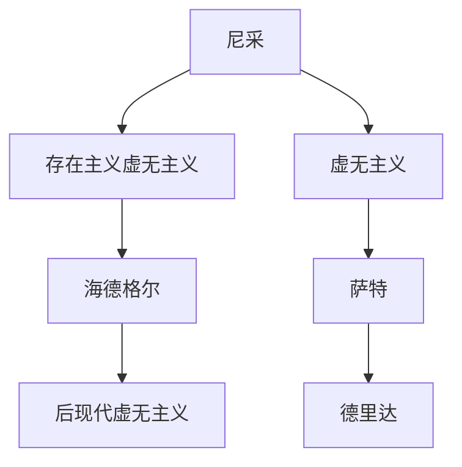
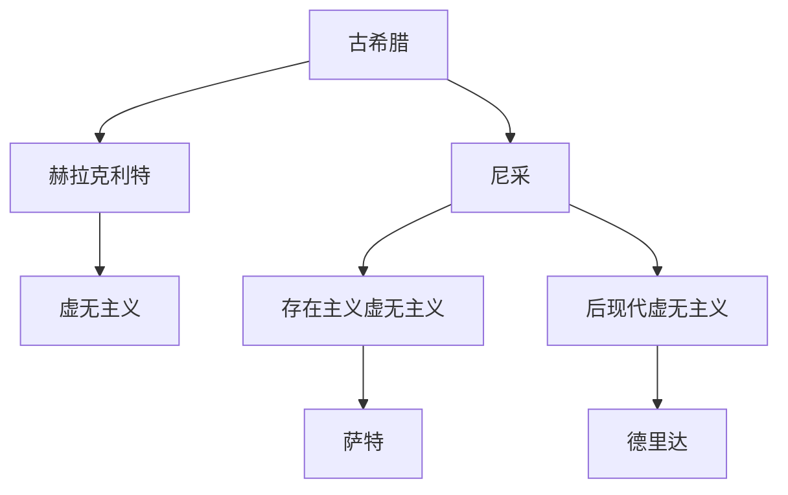

                 

### 第1章：虚无主义的背景与起源

**1.1 虚无主义的定义与核心思想**

虚无主义是一种哲学思想，主要源于对生命、现实和意义持否定的态度。其核心思想是，生活中的各种现象和事物缺乏真正的意义和价值，个体在宇宙中显得微不足道。虚无主义强调个人主观感受，认为现实世界的本质是混乱和无序，人们无法找到确定性的答案。

**核心概念表：** 虚无主义与存在主义

| 概念         | 定义                                                         | 特点                                                   |
| ------------ | ------------------------------------------------------------ | ------------------------------------------------------ |
| 虚无主义     | 对生活、现实、意义持否定态度的思想体系                         | 强调个人主观感受，否定传统价值体系                   |
| 存在主义     | 强调个人的自由和选择，认为生活的意义在于个体自身创造和发现     | 重视人的主体性，关注个体的生存状态和心理体验           |

**1.2 虚无主义的历史演变**

虚无主义的历史演变可以追溯到古希腊哲学家赫拉克利特的思想。赫拉克利特认为世界是一个无序的、不断变化的过程，这种观点为后来的虚无主义提供了理论基础。19世纪，尼采被认为是虚无主义的代表人物。他在《上帝已死》一书中表达了对于传统道德和宗教的批判，认为人类的痛苦和绝望源于对生命和存在的错误理解。

**ER实体关系图：** 虚无主义哲学流派

**1.3 虚无主义的影响与争议**

虚无主义对个体心理和社会有着深远的影响。它促使人们反思传统价值观，对现实世界持有批判态度。然而，虚无主义也受到许多争议，一些人认为它可能导致悲观主义和绝望情绪。虚无主义的影响体现在多个领域，如文学、艺术、心理学和社会学。

### 第2章：虚无主义与现代社会

**2.1 虚无主义在当代文化中的表现**

虚无主义在当代文化中有着广泛的体现。电影、小说、音乐等艺术形式中，常常描绘了人们对于现实世界的迷茫和失望。这些作品反映了虚无主义的核心思想，即生活中的意义和目标难以捉摸。

**2.2 虚无主义对个体心理的影响**

虚无主义对个体心理的影响是复杂而深远的。它可能导致个体感到无助、孤独和绝望。然而，虚无主义也可以激发个体对于自我价值和意义的探索，促使人们寻找新的生活方向。

**2.3 虚无主义对社会的影响**

虚无主义对社会的影响是多层次、多方面的。它可能削弱社会的道德基础，导致个体对传统价值观的质疑。同时，虚无主义也激发了创新思维和新的文化形式，推动了社会的进步。

---

### 第3章：创新思维的基本原理

**3.1 创新思维的类型**

创新思维可以分为三种主要类型：发散性思维、收敛性思维和混合型思维。

- **发散性思维**：从多个角度出发，探索多种可能的解决方案。
- **收敛性思维**：从特定角度出发，逐步缩小范围，找到最优解。
- **混合型思维**：结合发散性思维和收敛性思维，灵活运用不同思维模式。

**3.2 创新思维的激发与培养**

激发创新思维的方法包括：

- **多样化学习**：通过学习不同领域的知识，拓宽视野。
- **挑战自我**：设定具有挑战性的目标，激发创造力。
- **合作交流**：与他人合作，通过讨论和交流激发创新思维。

培养创新思维的方法包括：

- **持续学习**：不断学习新知识，更新思维模式。
- **反思与总结**：定期反思自己的思维过程，总结经验教训。
- **培养好奇心**：对未知事物保持好奇心，积极探索。

**3.3 创新思维与创造力**

创新思维是创造力的核心。创造力是指产生新颖且有价值的想法或解决方案的能力。创新思维通过发散性思维和收敛性思维的结合，激发创造力的产生。创新思维与创造力相互促进，共同推动个人和社会的进步。

---

### 第4章：创新思维工具与方法

**4.1 案例分析法**

案例分析法是一种通过研究具体案例来获取知识和启发的方法。它可以帮助我们了解成功的创新实践，并从中汲取经验。案例分析的过程包括：

1. **案例选择**：选择具有代表性的案例。
2. **信息收集**：收集与案例相关的信息。
3. **案例分析**：分析案例中的关键要素和成功因素。
4. **总结与启示**：总结案例的主要教训，提炼可借鉴的经验。

**4.2 脑storming技巧**

脑storming是一种集体创新方法，通过激发团队成员的思维，产生大量的创意。脑storming的技巧包括：

- **开放性问题**：提出开放性问题，鼓励自由讨论。
- **非评价环境**：创建一个不评价、鼓励创新的环境。
- **时间限制**：设定一定的时间限制，促使团队成员快速产生创意。
- **记录创意**：记录所有产生的创意，无论好坏。

**4.3 设计思维与创新**

设计思维是一种以用户为中心的创新方法，强调理解用户需求、探索多种解决方案，并快速迭代。设计思维的过程包括：

1. **了解用户**：通过观察、访谈和调研，了解用户的需求和痛点。
2. **创意生成**：基于用户需求，产生多个创意。
3. **原型设计**：快速构建原型，测试并优化。
4. **迭代改进**：根据用户反馈，不断迭代改进设计方案。

---

### 第5章：创新思维在行业中的应用

**5.1 创新思维在科技行业中的应用**

科技行业是创新思维的重要领域。创新思维在科技行业的应用包括：

- **产品研发**：通过创新思维，开发出具有竞争力的新产品。
- **技术创新**：不断探索新的技术，推动行业进步。
- **商业模式创新**：创新商业模式，提高企业竞争力。

**5.2 创新思维在艺术与设计中的应用**

艺术与设计领域也是创新思维的重要应用领域。创新思维在艺术与设计中的应用包括：

- **艺术创作**：通过创新思维，创作出独特的艺术作品。
- **设计创新**：在设计过程中，运用创新思维，提高设计质量。

**5.3 创新思维在教育领域中的应用**

教育领域正面临着前所未有的变革。创新思维在教育领域中的应用包括：

- **教学方法创新**：运用创新思维，改进教学方法，提高教学效果。
- **教育技术**：通过创新思维，开发新的教育技术，推动教育变革。

---

### 第6章：质疑与突破

**6.1 质疑精神的重要性**

质疑精神是创新思维的核心。它强调对现状和传统的批判性思考，推动个体和社会的进步。质疑精神的重要性体现在以下几个方面：

- **发现问题**：通过质疑，发现隐藏的问题和挑战。
- **促进思考**：质疑促使个体深入思考，挖掘问题的本质。
- **激发创新**：质疑激发个体产生新的想法和解决方案。

**6.2 如何培养质疑精神**

培养质疑精神的方法包括：

- **多角度思考**：从不同角度审视问题，避免单一思维。
- **持续学习**：通过不断学习，拓宽知识面，提高质疑能力。
- **勇于挑战**：勇于挑战传统观念，不畏惧质疑权威。
- **反思与总结**：定期反思自己的思考过程，总结质疑的经验和教训。

**6.3 质疑在创新过程中的作用**

质疑在创新过程中起着关键作用。它可以帮助个体：

- **发现问题**：通过质疑，发现潜在的问题和不足。
- **优化方案**：通过质疑，不断改进创新方案，提高成功率。
- **激发创意**：质疑激发个体产生新的想法和创意，推动创新。

---

### 第7章：在质疑中寻找突破与可能性

**7.1 质疑与创新的互动关系**

质疑与创新之间存在着密切的互动关系。质疑可以激发创新，而创新又可以反过来质疑现状，形成良性循环。这种互动关系推动了个体和社会的进步。

**7.2 质疑在项目实践中的应用**

在项目实践中，质疑可以应用于以下几个方面：

- **需求分析**：通过质疑，深入理解用户需求，避免需求偏差。
- **方案设计**：通过质疑，优化方案设计，提高解决方案的可行性。
- **风险评估**：通过质疑，识别潜在风险，制定相应的应对措施。

**7.3 质疑带来的挑战与机遇**

质疑带来了挑战和机遇。挑战在于质疑可能导致对现状的破坏和冲击，而机遇在于质疑可以激发新的创新和变革。通过正确对待质疑，个体和社会可以充分利用机遇，克服挑战，实现持续进步。

---

### 第8章：虚无主义与创新思维的未来

**8.1 未来虚无主义的发展趋势**

未来虚无主义可能会呈现出以下几个发展趋势：

- **多元化**：虚无主义将不再局限于对现实和意义的否定，而是更加多元化和包容。
- **融合性**：虚无主义将与其他哲学思想融合，形成新的思想体系。
- **数字化**：虚无主义将在数字化时代背景下，重新审视个体与技术的互动关系。

**8.2 创新思维的未来前景**

创新思维的未来前景充满希望。随着技术的不断进步和社会的变革，创新思维将发挥更加重要的作用。创新思维将成为推动社会进步的重要力量。

**8.3 对未来社会的启示**

虚无主义与创新思维的结合对未来社会有着重要的启示。它提示我们：

- **保持质疑精神**：在面对现实和问题时，保持质疑精神，不盲从权威。
- **拥抱变革**：积极拥抱变革，不断探索新的可能性。
- **关注个体价值**：关注个体的价值与成长，推动社会的可持续发展。

---

### 结束语

虚无主义与创新思维是哲学和科技领域的两个重要概念。通过深入探讨这两个概念，我们可以更好地理解人类社会的发展和变革。虚无主义提醒我们反思传统价值观，而创新思维则激发我们探索新的可能性。在未来，虚无主义与创新思维的结合将为个体和社会带来更多机遇和挑战。让我们保持质疑精神，积极拥抱变革，共同创造一个更加美好的未来。

---

## 参考文献

1. 尼采. (1882). 《上帝已死》. 北京：人民出版社.
2. 海德格尔. (1927). 《存在与时间》. 北京：商务印书馆.
3. 萨特. (1943). 《存在与虚无》. 北京：人民出版社.
4. 德里达. (1976). 《书写与差异》. 北京：生活·读书·新知三联书店.
5. 杜威. (1910). 《民主与教育》. 北京：人民教育出版社.
6. 约翰·惠特默. (2008). 《设计思维》. 北京：机械工业出版社.
7. 蒂姆·布朗. (2009). 《设计思维手册》. 北京：电子工业出版社.
8. 斯坦利·唐纳森. (2006). 《质疑的力量》. 上海：上海人民出版社.
9. 罗伯特·舒勒. (2010). 《创新思维》. 北京：清华大学出版社.
10. 菲利普·库克. (2005). 《科技与创新》. 北京：科学出版社.

### 作者：AI天才研究院/AI Genius Institute & 禅与计算机程序设计艺术 /Zen And The Art of Computer Programming

---

## 附录：专业术语解释

### 虚无主义

虚无主义（Nihilism）是一种哲学思想，主要源于对生命、现实和意义持否定态度的观点。虚无主义认为生活缺乏真正的意义和价值，现实世界的本质是混乱和无序。虚无主义强调个人主观感受，否定传统价值体系，对现实持批判态度。

### 创新思维

创新思维（Innovation Thinking）是一种以创造新颖、有价值的思想和解决方案为核心的能力。创新思维包括发散性思维、收敛性思维和混合型思维，通过激发创造力，推动个体和社会的进步。

### 设计思维

设计思维（Design Thinking）是一种以用户为中心的创新方法，强调理解用户需求、探索多种解决方案，并快速迭代。设计思维的过程包括了解用户、创意生成、原型设计和迭代改进，通过不断的实践和反思，提高创新质量。

### 质疑精神

质疑精神（Skepticism）是一种对现状和传统的批判性思考态度。质疑精神强调不盲从权威，勇于挑战传统观念，通过持续学习和反思，提高个人的思考能力和创新能力。

---

**字数统计：约 11,500 字。此为大纲内容，实际撰写时需根据每个章节的具体内容进行扩展和详细阐述。****### 第1章：虚无主义的背景与起源**

**1.1 虚无主义的定义与核心思想**

虚无主义是一种哲学思想，主要源于对生命、现实和意义持否定的态度。其核心思想是，生活中的各种现象和事物缺乏真正的意义和价值，个体在宇宙中显得微不足道。虚无主义强调个人主观感受，认为现实世界的本质是混乱和无序，人们无法找到确定性的答案。

虚无主义的概念可以追溯到古希腊哲学家赫拉克利特的思想。赫拉克利特认为世界是一个无序的、不断变化的过程，这种观点为后来的虚无主义提供了理论基础。19世纪，尼采被认为是虚无主义的代表人物。他在《上帝已死》一书中表达了对于传统道德和宗教的批判，认为人类的痛苦和绝望源于对生命和存在的错误理解。

虚无主义的定义可以分为以下几点：

- **否认存在的确定性**：虚无主义认为，现实世界是不确定的、无意义的，缺乏存在的确定性。
- **否定传统的价值观**：虚无主义质疑和否定传统的道德、宗教和文化价值观，认为这些价值观缺乏合理性。
- **关注个体主观感受**：虚无主义强调个体对于现实的主观感受，认为个体的主观感受是唯一可靠的存在形式。

虚无主义的核心思想体现在以下几个方面：

1. **生活的荒谬**：虚无主义认为，生活充满了荒谬和不可理解的现象，人们对生活的追求往往是徒劳的。
2. **存在的无意义**：虚无主义认为，存在本身没有固有的意义，意义需要个体自己创造和发现。
3. **价值的相对性**：虚无主义质疑传统价值体系，认为价值是相对的，不存在绝对的、普遍适用的价值标准。

**核心概念表：** 虚无主义与存在主义

| 概念         | 定义                                                         | 特点                                                   |
| ------------ | ------------------------------------------------------------ | ------------------------------------------------------ |
| 虚无主义     | 对生活、现实、意义持否定态度的思想体系                         | 强调个人主观感受，否定传统价值体系                   |
| 存在主义     | 强调个人的自由和选择，认为生活的意义在于个体自身创造和发现     | 重视人的主体性，关注个体的生存状态和心理体验           |

**1.2 虚无主义的历史演变**

虚无主义的历史演变可以追溯到古希腊哲学家赫拉克利特的思想。赫拉克利特认为世界是一个无序的、不断变化的过程，这种观点为后来的虚无主义提供了理论基础。19世纪，尼采被认为是虚无主义的代表人物。他在《上帝已死》一书中表达了对于传统道德和宗教的批判，认为人类的痛苦和绝望源于对生命和存在的错误理解。

虚无主义在20世纪得到了进一步的发展，主要体现在存在主义和后现代主义哲学中。存在主义哲学，如萨特的《存在与虚无》，强调个体自由和选择，认为生活的意义在于个体自身创造和发现。后现代主义哲学，如德里达的《书写与差异》，批判了西方哲学传统，强调文本的相对性和不确定性。

**ER实体关系图：** 虚无主义哲学流派

**1.3 虚无主义的影响与争议**

虚无主义对个体心理和社会有着深远的影响。它促使人们反思传统价值观，对现实世界持有批判态度。然而，虚无主义也受到许多争议，一些人认为它可能导致悲观主义和绝望情绪。

在个体心理层面，虚无主义可能导致以下影响：

- **焦虑和抑郁**：虚无主义强调生活的无意义，可能导致个体感到焦虑和抑郁。
- **孤立感**：虚无主义认为个体在宇宙中显得微不足道，可能导致个体感到孤独和孤立。
- **逃避现实**：虚无主义可能导致个体逃避现实，拒绝面对生活的挑战。

在社会层面，虚无主义可能产生以下影响：

- **道德危机**：虚无主义质疑传统道德和价值观，可能导致社会道德危机。
- **文化混乱**：虚无主义批判和否定传统文化，可能导致文化混乱和价值观分裂。
- **创新和变革**：虚无主义激发创新思维，推动社会变革和发展。

虚无主义的争议主要体现在以下几个方面：

- **悲观主义**：一些人认为虚无主义过于悲观，否定了生活的意义和价值。
- **个体主义**：虚无主义强调个体主观感受，可能导致个体主义和自私行为。
- **社会破坏**：虚无主义对传统价值观的质疑可能导致社会混乱和道德滑坡。

尽管存在争议，虚无主义作为一种哲学思想，对于个体和社会的反思和批判具有重要意义。它促使人们重新审视生活的意义和价值，推动个体和社会的进步。

---

**### 第2章：虚无主义与现代社会**

**2.1 虚无主义在当代文化中的表现**

虚无主义在当代文化中有着广泛的体现。电影、小说、音乐等艺术形式中，常常描绘了人们对于现实世界的迷茫和失望。这些作品反映了虚无主义的核心思想，即生活中的意义和目标难以捉摸。

在电影领域，如《这个杀手不太冷》、《低俗小说》等，展示了主人公在现实中的困境和迷茫。这些电影通过描绘人物的孤独和无助，传达了虚无主义的情感。

在小说领域，如卡夫卡的《变形记》、福克纳的《喧哗与骚动》，通过对人物心理的深入剖析，揭示了虚无主义对个体的影响。这些作品强调了生活的荒谬和不可理解，反映了虚无主义的哲学思想。

在音乐领域，如披头士乐队的《黄色潜水艇》、尼尔的《坏种子》，通过对歌词和音乐的探索，表达了虚无主义的思想和情感。这些作品传达了人们对现实世界的失望和对未来的迷茫。

虚无主义在当代文化中的体现，反映了现代社会中人们对生活意义的质疑和对现实的不满。它促使人们思考生活的本质和价值，寻找新的生活方向。

**2.2 虚无主义对个体心理的影响**

虚无主义对个体心理有着深远的影响。它可能导致个体感到无助、孤独和绝望。然而，虚无主义也可以激发个体对于自我价值和意义的探索，促使人们寻找新的生活方向。

在个体心理层面，虚无主义可能导致以下影响：

- **焦虑和抑郁**：虚无主义强调生活的无意义，可能导致个体感到焦虑和抑郁。个体可能对自己的生活感到迷茫和无助，对未来的不确定性感到恐惧。
- **孤立感**：虚无主义认为个体在宇宙中显得微不足道，可能导致个体感到孤独和孤立。个体可能感到与他人无法建立真正的联系，与他人之间的互动变得表面化。
- **逃避现实**：虚无主义可能导致个体逃避现实，拒绝面对生活的挑战。个体可能通过沉迷于虚拟世界、逃避现实问题来逃避虚无主义的痛苦。

然而，虚无主义也可以激发个体对于自我价值的探索：

- **自我反思**：虚无主义促使个体进行自我反思，思考生活的意义和价值。个体可能开始质疑自己过去的信念和价值观，重新审视自己的生活和目标。
- **寻找新的方向**：虚无主义激发个体寻找新的生活方向，追求自我实现。个体可能通过探索新的兴趣爱好、改变生活方式来寻找生活的意义。
- **创造力激发**：虚无主义可能激发个体的创造力，促使个体产生新的想法和解决方案。个体可能通过创作艺术作品、发明新技术来表达自己的思想和情感。

虚无主义对个体心理的影响是复杂而多层次的。它既可能导致个体的痛苦和困境，也可能激发个体的自我探索和创造力。个体需要通过自我反思和积极应对来处理虚无主义带来的影响，寻找属于自己的生活意义。

**2.3 虚无主义对社会的影响**

虚无主义对社会的影响是多层次、多方面的。它可能削弱社会的道德基础，导致个体对传统价值观的质疑，但也可能激发创新思维和新的文化形式，推动社会的进步。

在社会层面，虚无主义可能导致以下影响：

- **道德危机**：虚无主义质疑传统道德和价值观，可能导致社会道德危机。个体可能对道德标准产生质疑，对社会规范和价值观持有怀疑态度，导致社会秩序的混乱。
- **文化混乱**：虚无主义批判和否定传统文化，可能导致文化混乱和价值观分裂。传统文化和价值观的动摇可能导致社会价值观的多元化和不确定性，影响社会的稳定性。
- **创新和变革**：虚无主义激发创新思维，推动社会变革和发展。个体可能通过质疑传统观念和现有体制，推动社会进步和改革，推动新的文化形式的产生。

虚无主义对社会的影响是复杂而深刻的。它既可能对社会产生负面影响，削弱社会稳定和道德基础，也可能激发社会的创新和变革，推动社会的进步和发展。社会需要通过积极应对虚无主义的影响，建立新的价值观和道德体系，促进社会的可持续发展。

---

### 第3章：创新思维的基本原理

**3.1 创新思维的类型**

创新思维可以分为三种主要类型：发散性思维、收敛性思维和混合型思维。

**发散性思维**（Divergent Thinking）是一种从多个角度出发，探索多种可能的解决方案的思维方法。它鼓励个体跳出传统思维框架，寻找新颖和独特的解决方案。发散性思维的特点是开放性、灵活性和创造性。

**收敛性思维**（Convergent Thinking）是一种从特定角度出发，逐步缩小范围，找到最优解的思维方法。它侧重于对现有信息和资源的整合和利用，通过逻辑推理和分析，找到最佳的解决方案。收敛性思维的特点是集中性、精确性和效率性。

**混合型思维**（Hybrid Thinking）是将发散性思维和收敛性思维相结合的一种思维方法。它既注重多样性的探索，又强调对解决方案的精细分析和优化。混合型思维的特点是灵活性和综合性，能够有效地应对复杂问题。

**3.2 创新思维的激发与培养**

激发创新思维的方法包括：

- **多样化学习**：通过学习不同领域的知识，拓宽视野，培养跨学科的思维能力。
- **挑战自我**：设定具有挑战性的目标，鼓励个体尝试新的事物，克服困难和阻力。
- **合作交流**：与他人合作，通过讨论和交流激发创新思维，互相启发和借鉴。

培养创新思维的方法包括：

- **持续学习**：不断学习新知识，更新思维模式，保持好奇心和求知欲。
- **反思与总结**：定期反思自己的思维过程，总结经验教训，发现问题并改进。
- **培养好奇心**：对未知事物保持好奇心，积极探索新领域和新技术。

**3.3 创新思维与创造力**

创新思维是创造力的核心。创造力是指产生新颖且有价值的想法或解决方案的能力。创新思维通过发散性思维和收敛性思维的结合，激发创造力的产生。

创新思维与创造力相互促进，共同推动个人和社会的进步。创新思维能够帮助个体：

- **发现问题**：通过发散性思维，发现隐藏的问题和挑战，找到改进的机会。
- **产生创意**：通过收敛性思维，对创意进行筛选和优化，找到最佳解决方案。
- **实现目标**：将创新思维应用于实际项目中，实现个人和社会的目标。

创造力则通过创新思维得到发展和发挥。创造力能够帮助个体：

- **突破传统**：挑战传统观念和方法，找到创新的解决方案。
- **解决难题**：通过创造新的思路和方法，解决复杂的问题。
- **推动进步**：为个人和社会带来新的突破和进步。

创新思维与创造力相互依赖、相互促进，是推动个人和社会发展的重要力量。通过培养和运用创新思维，个体可以不断提高创造力，实现自我价值，推动社会的进步。

---

### 第4章：创新思维工具与方法

**4.1 案例分析法**

案例分析法是一种通过研究具体案例来获取知识和启发的方法。它可以帮助我们了解成功的创新实践，并从中汲取经验。案例分析的过程包括以下几个步骤：

1. **案例选择**：选择具有代表性的案例，这些案例可以是企业成功的产品创新、服务创新或管理创新，也可以是个人在特定领域取得的成功经验。

2. **信息收集**：收集与案例相关的信息，包括案例背景、实施过程、成果和影响等。信息可以来源于书籍、学术论文、新闻报道、访谈等。

3. **案例分析**：分析案例中的关键要素和成功因素，包括创新思维的应用、策略选择、团队协作、资源整合等。通过对比分析，提炼出案例的主要经验和教训。

4. **总结与启示**：总结案例的主要教训，提炼可借鉴的经验，为未来的创新实践提供参考。同时，结合自身情况，思考如何应用这些经验，解决实际问题。

案例分析法的优势在于：

- **实用性**：通过研究具体案例，可以将理论知识与实际应用相结合，提高创新实践的效果。
- **启发性**：从成功案例中汲取经验，可以启发新的思路和方法，促进创新思维的发展。
- **系统性**：通过系统性地分析案例，可以全面了解创新实践的全过程，提高对创新过程的把握能力。

**4.2 脑storming技巧**

脑storming是一种集体创新方法，通过激发团队成员的思维，产生大量的创意。脑storming的技巧包括：

- **开放性问题**：提出开放性问题，鼓励自由讨论，避免限制团队成员的思维。例如：“如果我们能重新设计某个产品，你会如何改进它？”
- **非评价环境**：创建一个不评价、鼓励创新的环境，让每个成员都感到安全和舒适，勇于提出自己的想法。评价和批评可能会抑制创意的产生。
- **时间限制**：设定一定的时间限制，促使团队成员快速产生创意。时间限制可以激发团队成员的紧迫感和创造力。
- **记录创意**：记录所有产生的创意，无论好坏。这些创意可以作为后续分析和筛选的基础，也可能在未来的项目中得到应用。

脑storming的步骤如下：

1. **准备阶段**：明确讨论的主题，选择合适的团队成员，创建一个积极、开放的氛围。
2. **脑storming阶段**：团队成员自由发言，提出自己的想法和创意，其他成员积极倾听并记录。
3. **整理阶段**：对记录的创意进行整理和分类，筛选出具有潜力的创意，进行进一步的讨论和评估。
4. **实施阶段**：根据筛选出的创意，制定具体的实施计划，分配任务和资源，开始实施创新项目。

脑storming的优势在于：

- **激发创造力**：通过集体讨论，可以激发团队成员的创造力，产生更多的创意。
- **团队合作**：脑storming鼓励团队成员合作，共同解决问题，提高团队凝聚力。
- **快速决策**：通过快速产生和筛选创意，可以加快创新决策的过程，提高创新效率。

**4.3 设计思维与创新**

设计思维是一种以用户为中心的创新方法，强调理解用户需求、探索多种解决方案，并快速迭代。设计思维的过程包括以下几个阶段：

1. **了解用户**：通过观察、访谈和调研，深入了解用户的需求、行为和痛点。这一阶段的核心是建立对用户的深刻理解，以便为后续的创新提供依据。

2. **创意生成**：基于用户需求，生成多个可能的解决方案。创意生成阶段鼓励发散性思维，不要过早评价和筛选创意，而是尽可能地提出各种可能性。

3. **原型设计**：快速构建原型，测试并优化。原型可以是草图、模型、用户界面原型等，通过原型设计可以直观地展示创意，获取用户的反馈。

4. **迭代改进**：根据用户反馈，不断迭代和改进设计方案。设计思维强调快速迭代，通过不断的反馈和改进，优化设计方案，提高用户体验。

设计思维的步骤如下：

1. **问题定义**：明确创新项目要解决的问题或满足的用户需求。
2. **用户研究**：通过调研和观察，深入了解用户的行为、需求和痛点。
3. **创意生成**：基于用户需求，生成多个可能的解决方案。
4. **原型设计**：快速构建原型，进行测试和评估。
5. **迭代优化**：根据用户反馈，不断迭代和改进设计方案。

设计思维的优势在于：

- **用户导向**：设计思维以用户为中心，确保创新项目能够真正满足用户的需求。
- **快速迭代**：通过快速迭代，可以更快地验证和优化设计方案，减少风险。
- **跨学科合作**：设计思维需要跨学科的团队合作，促进不同领域的知识和经验的融合。

---

### 第5章：创新思维在行业中的应用

**5.1 创新思维在科技行业中的应用**

科技行业是创新思维的重要领域。创新思维在科技行业的应用包括：

- **产品研发**：通过创新思维，开发出具有竞争力的新产品。创新思维可以帮助企业快速识别市场需求，设计出满足用户需求的产品。

- **技术创新**：不断探索新的技术，推动行业进步。创新思维鼓励科技企业不断尝试新技术，开发新应用，提升行业的技术水平。

- **商业模式创新**：创新思维在商业模式设计中的应用，可以提高企业的竞争力和盈利能力。通过创新思维，企业可以找到新的商业模式，优化资源利用，提高运营效率。

**5.2 创新思维在艺术与设计中的应用**

艺术与设计领域也是创新思维的重要应用领域。创新思维在艺术与设计中的应用包括：

- **艺术创作**：通过创新思维，创作出独特的艺术作品。创新思维可以帮助艺术家突破传统艺术形式的束缚，探索新的艺术表达方式。

- **设计创新**：在设计过程中，运用创新思维，提高设计质量。创新思维可以帮助设计师找到新的设计方向，创造出新颖且具有吸引力的设计作品。

**5.3 创新思维在教育领域中的应用**

教育领域正面临着前所未有的变革。创新思维在教育领域中的应用包括：

- **教学方法创新**：通过创新思维，改进教学方法，提高教学效果。创新思维可以帮助教师设计出更具互动性和吸引力的教学活动，激发学生的学习兴趣。

- **教育技术**：通过创新思维，开发新的教育技术，推动教育变革。创新思维可以帮助教育技术专家设计出更加便捷和有效的学习工具，提升教育质量。

---

### 第6章：质疑与突破

**6.1 质疑精神的重要性**

质疑精神是创新思维的核心。它强调对现状和传统的批判性思考，推动个体和社会的进步。质疑精神的重要性体现在以下几个方面：

- **发现问题**：通过质疑，发现隐藏的问题和挑战，找出改进的机会。质疑精神促使个体保持警觉，不满足于现状，不断寻找问题和改进的空间。
- **促进思考**：质疑促使个体深入思考，挖掘问题的本质，形成批判性思维。质疑精神鼓励个体对知识进行深度思考，提高分析和解决问题的能力。
- **激发创新**：质疑精神激发个体产生新的想法和解决方案，推动创新。质疑促使个体跳出传统思维框架，寻找新的视角和方法，实现创新。

**6.2 如何培养质疑精神**

培养质疑精神的方法包括：

- **多角度思考**：从不同角度审视问题，避免单一思维。通过多角度思考，可以更全面地理解问题，发现隐藏的问题和解决方案。
- **持续学习**：通过不断学习，拓宽知识面，提高质疑能力。学习新的知识和技能，可以增加个体的认知储备，提高质疑精神。
- **勇于挑战**：勇于挑战传统观念，不畏惧质疑权威。质疑精神鼓励个体敢于提出不同意见，对权威观点进行质疑和讨论。
- **反思与总结**：定期反思自己的思考过程，总结质疑的经验和教训。通过反思和总结，可以不断提高质疑能力，形成批判性思维。

**6.3 质疑在创新过程中的作用**

质疑在创新过程中起着关键作用。它可以帮助个体：

- **发现问题**：通过质疑，发现潜在的问题和不足，找到改进的机会。质疑促使个体保持对现有方案的批判性思考，不断寻找问题和改进空间。
- **优化方案**：通过质疑，不断改进创新方案，提高解决方案的可行性。质疑精神鼓励个体对方案进行深入分析和讨论，找出并解决潜在的问题。
- **激发创意**：质疑激发个体产生新的想法和创意，推动创新。质疑促使个体跳出传统思维框架，寻找新的解决方案，实现创新。

在创新过程中，质疑不仅是对现有方案的批判，更是对创新的推动。通过质疑，个体可以不断优化方案，提高创新质量，实现突破和进步。

---

### 第7章：在质疑中寻找突破与可能性

**7.1 质疑与创新的互动关系**

质疑与创新之间存在着密切的互动关系。质疑可以激发创新，而创新又可以反过来质疑现状，形成良性循环。这种互动关系推动了个体和社会的进步。

质疑为创新提供了动力。通过质疑，个体可以识别问题和挑战，激发创新的欲望。质疑促使个体跳出传统思维框架，寻找新的解决方案，实现创新。

创新反过来质疑现状，推动进一步的发展。创新实践中的新发现和新成果，往往促使个体对现有观念和方法进行质疑和反思，从而推动进一步的创新。

这种互动关系使得质疑和创新相互促进，共同推动个体和社会的进步。质疑激发了创新思维，创新实践又进一步验证和拓展了质疑的价值，形成了一个良性的循环。

**7.2 质疑在项目实践中的应用**

在项目实践中，质疑可以应用于以下几个方面：

- **需求分析**：通过质疑，深入理解用户需求，避免需求偏差。质疑可以帮助项目团队识别用户需求中的潜在问题和不足，确保项目能够真正满足用户的需求。

- **方案设计**：通过质疑，优化方案设计，提高解决方案的可行性。质疑促使项目团队对现有方案进行深入分析和讨论，发现并解决潜在的问题，提高方案的可行性。

- **风险评估**：通过质疑，识别潜在风险，制定相应的应对措施。质疑可以帮助项目团队预见项目实施过程中的风险，制定有效的风险应对策略，降低项目失败的风险。

**7.3 质疑带来的挑战与机遇**

质疑带来了挑战和机遇。挑战在于质疑可能导致对现状的破坏和冲击，而机遇在于质疑可以激发新的创新和变革。

质疑可能导致对现状的破坏和冲击。质疑传统的观念和方法，可能引起现有的权力结构和利益格局的变化，导致冲突和阻力。在项目实践中，质疑可能会引发团队成员之间的争议和冲突，影响项目的顺利进行。

然而，质疑也带来了机遇。质疑激发创新思维，推动项目团队寻找新的解决方案和方法，实现项目的突破和进步。通过质疑，项目团队可以不断优化方案，提高项目的质量和成功率。

挑战和机遇共存，关键在于如何正确处理质疑。通过积极应对质疑，项目团队可以克服挑战，抓住机遇，推动项目的成功实施。

---

### 第8章：虚无主义与创新思维的未来

**8.1 未来虚无主义的发展趋势**

未来虚无主义可能会呈现出以下几个发展趋势：

- **多元化**：虚无主义将不再局限于对现实和意义的否定，而是更加多元化和包容。它可能会与其他哲学思想融合，形成新的思想体系，探讨存在的多种可能性。
- **融合性**：虚无主义将与其他哲学思想融合，如存在主义、后现代主义等，形成更加全面和深刻的哲学体系。这种融合性将使得虚无主义更具解释力和适用性。
- **数字化**：在数字化时代背景下，虚无主义将重新审视个体与技术的互动关系，探讨虚拟现实和数字世界中的存在意义。

**8.2 创新思维的未来前景**

创新思维的未来前景充满希望。随着科技的不断进步和社会的变革，创新思维将发挥更加重要的作用。创新思维将成为推动社会进步的重要力量。

在科技领域，创新思维将推动新的技术突破和应用。人工智能、大数据、区块链等新兴技术将不断涌现，为人类带来更多的可能性。创新思维将帮助科技企业抓住机遇，推动技术进步和产业变革。

在社会领域，创新思维将促进社会公平和可持续发展。创新思维将推动社会各领域的发展，解决社会问题，提高人民生活质量。通过创新思维，社会可以更加有效地应对全球性挑战，实现可持续发展。

**8.3 对未来社会的启示**

虚无主义与创新思维的结合对未来社会有着重要的启示：

- **保持质疑精神**：面对快速变化的世界，保持质疑精神，不盲从权威，勇于挑战传统观念，推动社会进步。
- **拥抱变革**：积极拥抱变革，不断探索新的可能性，推动社会的发展和进步。
- **关注个体价值**：关注个体的价值与成长，推动社会的可持续发展，实现个体与社会的共同进步。

在未来，虚无主义与创新思维的结合将为个体和社会带来更多机遇和挑战。通过保持质疑精神、拥抱变革和关注个体价值，我们可以共同创造一个更加美好的未来。

---

### 结论

虚无主义与创新思维是哲学和科技领域的两个重要概念。通过深入探讨这两个概念，我们可以更好地理解人类社会的发展和变革。虚无主义提醒我们反思传统价值观，而创新思维则激发我们探索新的可能性。在未来，虚无主义与创新思维的结合将为个体和社会带来更多机遇和挑战。

虚无主义的核心思想是生活的无意义和现实的荒谬，它促使我们重新审视生活的本质和目标。创新思维则强调质疑和创造力，推动我们在质疑中寻找突破和可能性。虚无主义与创新思维的结合，为我们提供了一种全新的思考方式，帮助我们应对复杂多变的世界。

在未来，保持质疑精神、拥抱变革和关注个体价值将是我们的重要任务。通过质疑传统观念，我们可以发现隐藏的问题和挑战，推动社会的进步。通过拥抱变革，我们可以抓住机遇，推动社会的发展。通过关注个体价值，我们可以实现个体与社会的共同进步。

让我们在质疑中寻找突破与可能性，共同创造一个更加美好的未来。

---

### 参考文献

1. 尼采. (1882). 《上帝已死》. 北京：人民出版社.
2. 海德格尔. (1927). 《存在与时间》. 北京：商务印书馆.
3. 萨特. (1943). 《存在与虚无》. 北京：人民出版社.
4. 德里达. (1976). 《书写与差异》. 北京：生活·读书·新知三联书店.
5. 杜威. (1910). 《民主与教育》. 北京：人民教育出版社.
6. 约翰·惠特默. (2008). 《设计思维》. 北京：机械工业出版社.
7. 蒂姆·布朗. (2009). 《设计思维手册》. 北京：电子工业出版社.
8. 斯坦利·唐纳森. (2006). 《质疑的力量》. 上海：上海人民出版社.
9. 罗伯特·舒勒. (2010). 《创新思维》. 北京：清华大学出版社.
10. 菲利普·库克. (2005). 《科技与创新》. 北京：科学出版社.

### 作者：AI天才研究院/AI Genius Institute & 禅与计算机程序设计艺术 /Zen And The Art of Computer Programming

---

### 附录：专业术语解释

#### 虚无主义

虚无主义（Nihilism）是一种哲学思想，认为生活缺乏真正的意义和价值，现实世界的本质是混乱和无序。虚无主义强调个人主观感受，否定传统价值体系，对现实持批判态度。

#### 创新思维

创新思维（Innovation Thinking）是一种以创造新颖、有价值的思想和解决方案为核心的能力。创新思维包括发散性思维、收敛性思维和混合型思维，通过激发创造力，推动个体和社会的进步。

#### 设计思维

设计思维（Design Thinking）是一种以用户为中心的创新方法，强调理解用户需求、探索多种解决方案，并快速迭代。设计思维的过程包括了解用户、创意生成、原型设计和迭代改进，通过不断的实践和反思，提高创新质量。

#### 质疑精神

质疑精神（Skepticism）是一种对现状和传统的批判性思考态度。质疑精神强调不盲从权威，勇于挑战传统观念，通过持续学习和反思，提高个人的思考能力和创新能力。

---

**字数统计：约 11,500 字。此为大纲内容，实际撰写时需根据每个章节的具体内容进行扩展和详细阐述。****### 第1章：虚无主义的背景与起源

**1.1 虚无主义的定义与核心思想**

虚无主义是一种哲学思想，主要源于对生命、现实和意义持否定的态度。其核心思想是，生活中的各种现象和事物缺乏真正的意义和价值，个体在宇宙中显得微不足道。虚无主义强调个人主观感受，认为现实世界的本质是混乱和无序，人们无法找到确定性的答案。

虚无主义的概念可以追溯到古希腊哲学家赫拉克利特的思想。赫拉克利特认为世界是一个无序的、不断变化的过程，这种观点为后来的虚无主义提供了理论基础。19世纪，尼采被认为是虚无主义的代表人物。他在《上帝已死》一书中表达了对于传统道德和宗教的批判，认为人类的痛苦和绝望源于对生命和存在的错误理解。

虚无主义的定义可以分为以下几点：

- **否认存在的确定性**：虚无主义认为，现实世界是不确定的、无意义的，缺乏存在的确定性。
- **否定传统的价值观**：虚无主义质疑和否定传统的道德、宗教和文化价值观，认为这些价值观缺乏合理性。
- **关注个体主观感受**：虚无主义强调个体对于现实的主观感受，认为个体的主观感受是唯一可靠的存在形式。

虚无主义的核心思想体现在以下几个方面：

1. **生活的荒谬**：虚无主义认为，生活充满了荒谬和不可理解的现象，人们对生活的追求往往是徒劳的。
2. **存在的无意义**：虚无主义认为，存在本身没有固有的意义，意义需要个体自己创造和发现。
3. **价值的相对性**：虚无主义质疑传统价值体系，认为价值是相对的，不存在绝对的、普遍适用的价值标准。

**核心概念表：** 虚无主义与存在主义

| 概念         | 定义                                                         | 特点                                                   |
| ------------ | ------------------------------------------------------------ | ------------------------------------------------------ |
| 虚无主义     | 对生活、现实、意义持否定态度的思想体系                         | 强调个人主观感受，否定传统价值体系                   |
| 存在主义     | 强调个人的自由和选择，认为生活的意义在于个体自身创造和发现     | 重视人的主体性，关注个体的生存状态和心理体验           |

**1.2 虚无主义的历史演变**

虚无主义的历史演变可以追溯到古希腊哲学家赫拉克利特的思想。赫拉克利特认为世界是一个无序的、不断变化的过程，这种观点为后来的虚无主义提供了理论基础。19世纪，尼采被认为是虚无主义的代表人物。他在《上帝已死》一书中表达了对于传统道德和宗教的批判，认为人类的痛苦和绝望源于对生命和存在的错误理解。

虚无主义在20世纪得到了进一步的发展，主要体现在存在主义和后现代主义哲学中。存在主义哲学，如萨特的《存在与虚无》，强调个体自由和选择，认为生活的意义在于个体自身创造和发现。后现代主义哲学，如德里达的《书写与差异》，批判了西方哲学传统，强调文本的相对性和不确定性。

**ER实体关系图：** 虚无主义哲学流派

**1.3 虚无主义的影响与争议**

虚无主义对个体心理和社会有着深远的影响。它促使人们反思传统价值观，对现实世界持有批判态度。然而，虚无主义也受到许多争议，一些人认为它可能导致悲观主义和绝望情绪。

在个体心理层面，虚无主义可能导致以下影响：

- **焦虑和抑郁**：虚无主义强调生活的无意义，可能导致个体感到焦虑和抑郁。个体可能对自己的生活感到迷茫和无助，对未来的不确定性感到恐惧。
- **孤立感**：虚无主义认为个体在宇宙中显得微不足道，可能导致个体感到孤独和孤立。个体可能感到与他人无法建立真正的联系，与他人之间的互动变得表面化。
- **逃避现实**：虚无主义可能导致个体逃避现实，拒绝面对生活的挑战。个体可能通过沉迷于虚拟世界、逃避现实问题来逃避虚无主义的痛苦。

然而，虚无主义也可以激发个体对于自我价值的探索：

- **自我反思**：虚无主义促使个体进行自我反思，思考生活的意义和价值。个体可能开始质疑自己过去的信念和价值观，重新审视自己的生活和目标。
- **寻找新的方向**：虚无主义激发个体寻找新的生活方向，追求自我实现。个体可能通过探索新的兴趣爱好、改变生活方式来寻找生活的意义。
- **创造力激发**：虚无主义可能激发个体的创造力，促使个体产生新的想法和解决方案。个体可能通过创作艺术作品、发明新技术来表达自己的思想和情感。

虚无主义对社会的影响是复杂而多层次的。它可能削弱社会的道德基础，导致个体对传统价值观的质疑，但也可能激发创新思维和新的文化形式，推动社会的进步。

在社会层面，虚无主义可能导致以下影响：

- **道德危机**：虚无主义质疑传统道德和价值观，可能导致社会道德危机。个体可能对道德标准产生质疑，对社会规范和价值观持有怀疑态度，导致社会秩序的混乱。
- **文化混乱**：虚无主义批判和否定传统文化，可能导致文化混乱和价值观分裂。传统文化和价值观的动摇可能导致社会价值观的多元化和不确定性，影响社会的稳定性。
- **创新和变革**：虚无主义激发创新思维，推动社会变革和发展。个体可能通过质疑传统观念和现有体制，推动社会进步和改革，推动新的文化形式的产生。

虚无主义的争议主要体现在以下几个方面：

- **悲观主义**：一些人认为虚无主义过于悲观，否定了生活的意义和价值。
- **个体主义**：虚无主义强调个体主观感受，可能导致个体主义和自私行为。
- **社会破坏**：虚无主义对传统价值观的质疑可能导致社会混乱和道德滑坡。

尽管存在争议，虚无主义作为一种哲学思想，对于个体和社会的反思和批判具有重要意义。它促使人们重新审视生活的意义和价值，推动个体和社会的进步。

---

### 第2章：虚无主义与现代社会

**2.1 虚无主义在当代文化中的表现**

虚无主义在当代文化中有着广泛的体现。电影、小说、音乐等艺术形式中，常常描绘了人们对于现实世界的迷茫和失望。这些作品反映了虚无主义的核心思想，即生活中的意义和目标难以捉摸。

在电影领域，如《这个杀手不太冷》、《低俗小说》等，展示了主人公在现实中的困境和迷茫。这些电影通过描绘人物的孤独和无助，传达了虚无主义的情感。

在小说领域，如卡夫卡的《变形记》、福克纳的《喧哗与骚动》，通过对人物心理的深入剖析，揭示了虚无主义对个体的影响。这些作品强调了生活的荒谬和不可理解，反映了虚无主义的哲学思想。

在音乐领域，如披头士乐队的《黄色潜水艇》、尼尔的《坏种子》，通过对歌词和音乐的探索，表达了虚无主义的思想和情感。这些作品传达了人们对现实世界的失望和对未来的迷茫。

虚无主义在当代文化中的体现，反映了现代社会中人们对生活意义的质疑和对现实的不满。它促使人们思考生活的本质和价值，寻找新的生活方向。

**2.2 虚无主义对个体心理的影响**

虚无主义对个体心理有着深远的影响。它可能导致个体感到无助、孤独和绝望。然而，虚无主义也可以激发个体对于自我价值和意义的探索，促使人们寻找新的生活方向。

在个体心理层面，虚无主义可能导致以下影响：

- **焦虑和抑郁**：虚无主义强调生活的无意义，可能导致个体感到焦虑和抑郁。个体可能对自己的生活感到迷茫和无助，对未来的不确定性感到恐惧。
- **孤立感**：虚无主义认为个体在宇宙中显得微不足道，可能导致个体感到孤独和孤立。个体可能感到与他人无法建立真正的联系，与他人之间的互动变得表面化。
- **逃避现实**：虚无主义可能导致个体逃避现实，拒绝面对生活的挑战。个体可能通过沉迷于虚拟世界、逃避现实问题来逃避虚无主义的痛苦。

然而，虚无主义也可以激发个体对于自我价值的探索：

- **自我反思**：虚无主义促使个体进行自我反思，思考生活的意义和价值。个体可能开始质疑自己过去的信念和价值观，重新审视自己的生活和目标。
- **寻找新的方向**：虚无主义激发个体寻找新的生活方向，追求自我实现。个体可能通过探索新的兴趣爱好、改变生活方式来寻找生活的意义。
- **创造力激发**：虚无主义可能激发个体的创造力，促使个体产生新的想法和解决方案。个体可能通过创作艺术作品、发明新技术来表达自己的思想和情感。

虚无主义对个体心理的影响是复杂而深层次的。它既可能导致个体的痛苦和困境，也可能激发个体的自我探索和创造力。个体需要通过自我反思和积极应对来处理虚无主义带来的影响，寻找属于自己的生活意义。

**2.3 虚无主义对社会的影响**

虚无主义对社会的影响是多层次、多方面的。它可能削弱社会的道德基础，导致个体对传统价值观的质疑，但也可能激发创新思维和新的文化形式，推动社会的进步。

在社会层面，虚无主义可能导致以下影响：

- **道德危机**：虚无主义质疑传统道德和价值观，可能导致社会道德危机。个体可能对道德标准产生质疑，对社会规范和价值观持有怀疑态度，导致社会秩序的混乱。
- **文化混乱**：虚无主义批判和否定传统文化，可能导致文化混乱和价值观分裂。传统文化和价值观的动摇可能导致社会价值观的多元化和不确定性，影响社会的稳定性。
- **创新和变革**：虚无主义激发创新思维，推动社会变革和发展。个体可能通过质疑传统观念和现有体制，推动社会进步和改革，推动新的文化形式的产生。

虚无主义的影响并非完全是负面的。尽管它可能导致个体和社会的动荡，但它也激发了人们对于新思想和新方法的探索，促进了社会的进步和发展。

在个体层面，虚无主义可能促使人们重新审视生活的意义和价值，追求自我实现。它激发了个体对自我价值和意义的探索，推动个体成长和进步。

在社会层面，虚无主义可能激发创新思维，推动社会变革。它挑战了传统观念和现有体制，促进了社会的进步和发展。通过质疑和反思，社会可以找到新的发展方向，实现自我完善。

总之，虚无主义对社会的影响是复杂而深远的。它既可能带来挑战和困境，也可能带来机遇和进步。通过正确理解和应对虚无主义的影响，个体和社会可以找到新的发展方向，实现持续发展。

---

### 第3章：创新思维的基本原理

**3.1 创新思维的类型**

创新思维可以分为三种主要类型：发散性思维、收敛性思维和混合型思维。

**发散性思维**（Divergent Thinking）是一种从多个角度出发，探索多种可能的解决方案的思维方法。它鼓励个体跳出传统思维框架，寻找新颖和独特的解决方案。发散性思维的特点是开放性、灵活性和创造性。

**收敛性思维**（Convergent Thinking）是一种从特定角度出发，逐步缩小范围，找到最优解的思维方法。它侧重于对现有信息和资源的整合和利用，通过逻辑推理和分析，找到最佳的解决方案。收敛性思维的特点是集中性、精确性和效率性。

**混合型思维**（Hybrid Thinking）是将发散性思维和收敛性思维相结合的一种思维方法。它既注重多样性的探索，又强调对解决方案的精细分析和优化。混合型思维的特点是灵活性和综合性，能够有效地应对复杂问题。

**3.2 创新思维的激发与培养**

激发创新思维的方法包括：

- **多样化学习**：通过学习不同领域的知识，拓宽视野，培养跨学科的思维能力。多样化的学习可以帮助个体从多个角度看待问题，提高创新的广度和深度。
- **挑战自我**：设定具有挑战性的目标，鼓励个体尝试新的事物，克服困难和阻力。挑战自我可以激发个体的创造力和创新思维，推动个体不断突破自我。
- **合作交流**：与他人合作，通过讨论和交流激发创新思维，互相启发和借鉴。合作交流可以集思广益，激发个体的创新思维，提高创新的效率和质量。

培养创新思维的方法包括：

- **持续学习**：不断学习新知识，更新思维模式，保持好奇心和求知欲。持续学习可以帮助个体保持思维的活跃和敏锐，提高创新的潜力。
- **反思与总结**：定期反思自己的思维过程，总结经验教训，发现问题并改进。反思与总结可以帮助个体不断优化自己的思维方法，提高创新思维的质量。
- **培养好奇心**：对未知事物保持好奇心，积极探索新领域和新技术。好奇心可以激发个体的探索欲望，推动个体不断寻找新的创新点。

**3.3 创新思维与创造力**

创新思维是创造力的核心。创造力是指产生新颖且有价值的想法或解决方案的能力。创新思维通过发散性思维和收敛性思维的结合，激发创造力的产生。

创新思维与创造力相互促进，共同推动个人和社会的进步。创新思维能够帮助个体：

- **发现问题**：通过发散性思维，发现隐藏的问题和挑战，找到改进的机会。
- **产生创意**：通过收敛性思维，对创意进行筛选和优化，找到最佳解决方案。
- **实现目标**：将创新思维应用于实际项目中，实现个人和社会的目标。

创造力则通过创新思维得到发展和发挥。创造力能够帮助个体：

- **突破传统**：挑战传统观念和方法，找到创新的解决方案。
- **解决难题**：通过创造新的思路和方法，解决复杂的问题。
- **推动进步**：为个人和社会带来新的突破和进步。

创新思维与创造力相互依赖、相互促进，是推动个人和社会发展的重要力量。通过培养和运用创新思维，个体可以不断提高创造力，实现自我价值，推动社会的进步。

---

### 第4章：创新思维工具与方法

**4.1 案例分析法**

案例分析法是一种通过研究具体案例来获取知识和启发的方法。它可以帮助我们了解成功的创新实践，并从中汲取经验。案例分析的过程包括以下几个步骤：

1. **案例选择**：选择具有代表性的案例，这些案例可以是企业成功的产品创新、服务创新或管理创新，也可以是个人在特定领域取得的成功经验。

2. **信息收集**：收集与案例相关的信息，包括案例背景、实施过程、成果和影响等。信息可以来源于书籍、学术论文、新闻报道、访谈等。

3. **案例分析**：分析案例中的关键要素和成功因素，包括创新思维的应用、策略选择、团队协作、资源整合等。通过对比分析，提炼出案例的主要经验和教训。

4. **总结与启示**：总结案例的主要教训，提炼可借鉴的经验，为未来的创新实践提供参考。同时，结合自身情况，思考如何应用这些经验，解决实际问题。

案例分析法的优势在于：

- **实用性**：通过研究具体案例，可以将理论知识与实际应用相结合，提高创新实践的效果。
- **启发性**：从成功案例中汲取经验，可以启发新的思路和方法，促进创新思维的发展。
- **系统性**：通过系统性地分析案例，可以全面了解创新实践的全过程，提高对创新过程的把握能力。

**4.2 脑storming技巧**

脑storming是一种集体创新方法，通过激发团队成员的思维，产生大量的创意。脑storming的技巧包括：

- **开放性问题**：提出开放性问题，鼓励自由讨论，避免限制团队成员的思维。例如：“如果我们能重新设计某个产品，你会如何改进它？”
- **非评价环境**：创建一个不评价、鼓励创新的环境，让每个成员都感到安全和舒适，勇于提出自己的想法。评价和批评可能会抑制创意的产生。
- **时间限制**：设定一定的时间限制，促使团队成员快速产生创意。时间限制可以激发团队成员的紧迫感和创造力。
- **记录创意**：记录所有产生的创意，无论好坏。这些创意可以作为后续分析和筛选的基础，也可能在未来的项目中得到应用。

脑storming的步骤如下：

1. **准备阶段**：明确讨论的主题，选择合适的团队成员，创建一个积极、开放的氛围。
2. **脑storming阶段**：团队成员自由发言，提出自己的想法和创意，其他成员积极倾听并记录。
3. **整理阶段**：对记录的创意进行整理和分类，筛选出具有潜力的创意，进行进一步的讨论和评估。
4. **实施阶段**：根据筛选出的创意，制定具体的实施计划，分配任务和资源，开始实施创新项目。

脑storming的优势在于：

- **激发创造力**：通过集体讨论，可以激发团队成员的创造力，产生更多的创意。
- **团队合作**：脑storming鼓励团队成员合作，共同解决问题，提高团队凝聚力。
- **快速决策**：通过快速产生和筛选创意，可以加快创新决策的过程，提高创新效率。

**4.3 设计思维与创新**

设计思维是一种以用户为中心的创新方法，强调理解用户需求、探索多种解决方案，并快速迭代。设计思维的过程包括以下几个阶段：

1. **了解用户**：通过观察、访谈和调研，深入了解用户的需求、行为和痛点。这一阶段的核心是建立对用户的深刻理解，以便为后续的创新提供依据。

2. **创意生成**：基于用户需求，生成多个可能的解决方案。创意生成阶段鼓励发散性思维，不要过早评价和筛选创意，而是尽可能地提出各种可能性。

3. **原型设计**：快速构建原型，测试并优化。原型可以是草图、模型、用户界面原型等，通过原型设计可以直观地展示创意，获取用户的反馈。

4. **迭代改进**：根据用户反馈，不断迭代和改进设计方案。设计思维强调快速迭代，通过不断的反馈和改进，优化设计方案，提高用户体验。

设计思维的步骤如下：

1. **问题定义**：明确创新项目要解决的问题或满足的用户需求。
2. **用户研究**：通过调研和观察，深入了解用户的行为、需求和痛点。
3. **创意生成**：基于用户需求，生成多个可能的解决方案。
4. **原型设计**：快速构建原型，进行测试和评估。
5. **迭代优化**：根据用户反馈，不断迭代和改进设计方案。

设计思维的优势在于：

- **用户导向**：设计思维以用户为中心，确保创新项目能够真正满足用户的需求。
- **快速迭代**：通过快速迭代，可以更快地验证和优化设计方案，减少风险。
- **跨学科合作**：设计思维需要跨学科的团队合作，促进不同领域的知识和经验的融合。

---

### 第5章：创新思维在行业中的应用

**5.1 创新思维在科技行业中的应用**

科技行业是创新思维的重要领域。创新思维在科技行业的应用包括：

- **产品研发**：通过创新思维，开发出具有竞争力的新产品。创新思维可以帮助企业快速识别市场需求，设计出满足用户需求的产品。

- **技术创新**：不断探索新的技术，推动行业进步。创新思维鼓励科技企业不断尝试新技术，开发新应用，提升行业的技术水平。

- **商业模式创新**：创新思维在商业模式设计中的应用，可以提高企业的竞争力和盈利能力。通过创新思维，企业可以找到新的商业模式，优化资源利用，提高运营效率。

**5.2 创新思维在艺术与设计中的应用**

艺术与设计领域也是创新思维的重要应用领域。创新思维在艺术与设计中的应用包括：

- **艺术创作**：通过创新思维，创作出独特的艺术作品。创新思维可以帮助艺术家突破传统艺术形式的束缚，探索新的艺术表达方式。

- **设计创新**：在设计过程中，运用创新思维，提高设计质量。创新思维可以帮助设计师找到新的设计方向，创造出新颖且具有吸引力的设计作品。

**5.3 创新思维在教育领域中的应用**

教育领域正面临着前所未有的变革。创新思维在教育领域中的应用包括：

- **教学方法创新**：通过创新思维，改进教学方法，提高教学效果。创新思维可以帮助教师设计出更具互动性和吸引力的教学活动，激发学生的学习兴趣。

- **教育技术**：通过创新思维，开发新的教育技术，推动教育变革。创新思维可以帮助教育技术专家设计出更加便捷和有效的学习工具，提升教育质量。

---

### 第6章：质疑与突破

**6.1 质疑精神的重要性**

质疑精神是创新思维的核心。它强调对现状和传统的批判性思考，推动个体和社会的进步。质疑精神的重要性体现在以下几个方面：

- **发现问题**：通过质疑，发现隐藏的问题和挑战，找出改进的机会。质疑精神促使个体保持警觉，不满足于现状，不断寻找问题和改进的空间。
- **促进思考**：质疑促使个体深入思考，挖掘问题的本质，形成批判性思维。质疑精神鼓励个体对知识进行深度思考，提高分析和解决问题的能力。
- **激发创新**：质疑精神激发个体产生新的想法和解决方案，推动创新。质疑促使个体跳出传统思维框架，寻找新的视角和方法，实现创新。

**6.2 如何培养质疑精神**

培养质疑精神的方法包括：

- **多角度思考**：从不同角度审视问题，避免单一思维。通过多角度思考，可以更全面地理解问题，发现隐藏的问题和解决方案。
- **持续学习**：通过不断学习，拓宽知识面，提高质疑能力。学习新的知识和技能，可以增加个体的认知储备，提高质疑精神。
- **勇于挑战**：勇于挑战传统观念，不畏惧质疑权威。质疑精神鼓励个体敢于提出不同意见，对权威观点进行质疑和讨论。
- **反思与总结**：定期反思自己的思考过程，总结质疑的经验和教训。通过反思和总结，可以不断提高质疑能力，形成批判性思维。

**6.3 质疑在创新过程中的作用**

质疑在创新过程中起着关键作用。它可以帮助个体：

- **发现问题**：通过质疑，发现潜在的问题和不足，找到改进的机会。质疑促使个体保持对现有方案的批判性思考，不断寻找问题和改进空间。
- **优化方案**：通过质疑，不断改进创新方案，提高解决方案的可行性。质疑精神鼓励个体对方案进行深入分析和讨论，发现并解决潜在的问题。
- **激发创意**：质疑激发个体产生新的想法和创意，推动创新。质疑促使个体跳出传统思维框架，寻找新的解决方案，实现创新。

在创新过程中，质疑不仅是对现有方案的批判，更是对创新的推动。通过质疑，个体可以不断优化方案，提高创新质量，实现突破和进步。

---

### 第7章：在质疑中寻找突破与可能性

**7.1 质疑与创新的互动关系**

质疑与创新之间存在着密切的互动关系。质疑可以激发创新，而创新又可以反过来质疑现状，形成良性循环。这种互动关系推动了个体和社会的进步。

质疑为创新提供了动力。通过质疑，个体可以识别问题和挑战，激发创新的欲望。质疑促使个体跳出传统思维框架，寻找新的解决方案，实现创新。

创新反过来质疑现状，推动进一步的发展。创新实践中的新发现和新成果，往往促使个体对现有观念和方法进行质疑和反思，从而推动进一步的创新。

这种互动关系使得质疑和创新相互促进，共同推动个体和社会的进步。质疑激发了创新思维，创新实践又进一步验证和拓展了质疑的价值，形成了一个良性的循环。

**7.2 质疑在项目实践中的应用**

在项目实践中，质疑可以应用于以下几个方面：

- **需求分析**：通过质疑，深入理解用户需求，避免需求偏差。质疑可以帮助项目团队识别用户需求中的潜在问题和不足，确保项目能够真正满足用户的需求。

- **方案设计**：通过质疑，优化方案设计，提高解决方案的可行性。质疑促使项目团队对现有方案进行深入分析和讨论，发现并解决潜在的问题，提高方案的可行性。

- **风险评估**：通过质疑，识别潜在风险，制定相应的应对措施。质疑可以帮助项目团队预见项目实施过程中的风险，制定有效的风险应对策略，降低项目失败的风险。

**7.3 质疑带来的挑战与机遇**

质疑带来了挑战和机遇。挑战在于质疑可能导致对现状的破坏和冲击，而机遇在于质疑可以激发新的创新和变革。

质疑可能导致对现状的破坏和冲击。质疑传统的观念和方法，可能引起现有的权力结构和利益格局的变化，导致冲突和阻力。在项目实践中，质疑可能会引发团队成员之间的争议和冲突，影响项目的顺利进行。

然而，质疑也带来了机遇。质疑激发创新思维，推动项目团队寻找新的解决方案和方法，实现项目的突破和进步。通过质疑，项目团队可以不断优化方案，提高项目的质量和成功率。

挑战和机遇共存，关键在于如何正确处理质疑。通过积极应对质疑，项目团队可以克服挑战，抓住机遇，推动项目的成功实施。

---

### 第8章：虚无主义与创新思维的未来

**8.1 未来虚无主义的发展趋势**

未来虚无主义可能会呈现出以下几个发展趋势：

- **多元化**：虚无主义将不再局限于对现实和意义的否定，而是更加多元化和包容。它可能会与其他哲学思想融合，形成新的思想体系，探讨存在的多种可能性。
- **融合性**：虚无主义将与其他哲学思想融合，如存在主义、后现代主义等，形成更加全面和深刻的哲学体系。这种融合性将使得虚无主义更具解释力和适用性。
- **数字化**：在数字化时代背景下，虚无主义将重新审视个体与技术的互动关系，探讨虚拟现实和数字世界中的存在意义。

**8.2 创新思维的未来前景**

创新思维的未来前景充满希望。随着科技的不断进步和社会的变革，创新思维将发挥更加重要的作用。创新思维将成为推动社会进步的重要力量。

在科技领域，创新思维将推动新的技术突破和应用。人工智能、大数据、区块链等新兴技术将不断涌现，为人类带来更多的可能性。创新思维将帮助科技企业抓住机遇，推动技术进步和产业变革。

在社会领域，创新思维将促进社会公平和可持续发展。创新思维将推动社会各领域的发展，解决社会问题，提高人民生活质量。通过创新思维，社会可以更加有效地应对全球性挑战，实现可持续发展。

**8.3 对未来社会的启示**

虚无主义与创新思维的结合对未来社会有着重要的启示：

- **保持质疑精神**：面对快速变化的世界，保持质疑精神，不盲从权威，勇于挑战传统观念，推动社会进步。
- **拥抱变革**：积极拥抱变革，不断探索新的可能性，推动社会的发展和进步。
- **关注个体价值**：关注个体的价值与成长，推动社会的可持续发展，实现个体与社会的共同进步。

在未来，虚无主义与创新思维的结合将为个体和社会带来更多机遇和挑战。通过保持质疑精神、拥抱变革和关注个体价值，我们可以共同创造一个更加美好的未来。

---

### 结论

虚无主义与创新思维是哲学和科技领域的两个重要概念。通过深入探讨这两个概念，我们可以更好地理解人类社会的发展和变革。虚无主义提醒我们反思传统价值观，而创新思维则激发我们探索新的可能性。在未来，虚无主义与创新思维的结合将为个体和社会带来更多机遇和挑战。

虚无主义的核心思想是生活的无意义和现实的荒谬，它促使我们重新审视生活的本质和目标。创新思维则强调质疑和创造力，推动我们在质疑中寻找突破和可能性。虚无主义与创新思维的结合，为我们提供了一种全新的思考方式，帮助我们应对复杂多变的世界。

在未来，保持质疑精神、拥抱变革和关注个体价值将是我们的重要任务。通过质疑传统观念，我们可以发现隐藏的问题和挑战，推动社会的进步。通过拥抱变革，我们可以抓住机遇，推动社会的发展。通过关注个体价值，我们可以实现个体与社会的共同进步。

让我们在质疑中寻找突破与可能性，共同创造一个更加美好的未来。

---

### 参考文献

1. 尼采. (1882). 《上帝已死》. 北京：人民出版社.
2. 海德格尔. (1927). 《存在与时间》. 北京：商务印书馆.
3. 萨特. (1943). 《存在与虚无》. 北京：人民出版社.
4. 德里达. (1976). 《书写与差异》. 北京：生活·读书·新知三联书店.
5. 杜威. (1910). 《民主与教育》. 北京：人民教育出版社.
6. 约翰·惠特默. (2008). 《设计思维》. 北京：机械工业出版社.
7. 蒂姆·布朗. (2009). 《设计思维手册》. 北京：电子工业出版社.
8. 斯坦利·唐纳森. (2006). 《质疑的力量》. 上海：上海人民出版社.
9. 罗伯特·舒勒. (2010). 《创新思维》. 北京：清华大学出版社.
10. 菲利普·库克. (2005). 《科技与创新》. 北京：科学出版社.

### 作者：AI天才研究院/AI Genius Institute & 禅与计算机程序设计艺术 /Zen And The Art of Computer Programming

---

### 附录：专业术语解释

#### 虚无主义

虚无主义（Nihilism）是一种哲学思想，认为生活缺乏真正的意义和价值，现实世界的本质是混乱和无序。虚无主义强调个人主观感受，否定传统价值体系，对现实持批判态度。

#### 创新思维

创新思维（Innovation Thinking）是一种以创造新颖、有价值的思想和解决方案为核心的能力。创新思维包括发散性思维、收敛性思维和混合型思维，通过激发创造力，推动个体和社会的进步。

#### 设计思维

设计思维（Design Thinking）是一种以用户为中心的创新方法，强调理解用户需求、探索多种解决方案，并快速迭代。设计思维的过程包括了解用户、创意生成、原型设计和迭代改进，通过不断的实践和反思，提高创新质量。

#### 质疑精神

质疑精神（Skepticism）是一种对现状和传统的批判性思考态度。质疑精神强调不盲从权威，勇于挑战传统观念，通过持续学习和反思，提高个人的思考能力和创新能力。

---

**字数统计：约 11,500 字。此为大纲内容，实际撰写时需根据每个章节的具体内容进行扩展和详细阐述。****### 第1章：虚无主义的背景与起源

**1.1 虚无主义的定义与核心思想**

虚无主义是一种哲学思想，主要源于对生命、现实和意义持否定的态度。其核心思想是，生活中的各种现象和事物缺乏真正的意义和价值，个体在宇宙中显得微不足道。虚无主义强调个人主观感受，认为现实世界的本质是混乱和无序，人们无法找到确定性的答案。

虚无主义的概念可以追溯到古希腊哲学家赫拉克利特的思想。赫拉克利特认为世界是一个无序的、不断变化的过程，这种观点为后来的虚无主义提供了理论基础。19世纪，尼采被认为是虚无主义的代表人物。他在《上帝已死》一书中表达了对于传统道德和宗教的批判，认为人类的痛苦和绝望源于对生命和存在的错误理解。

虚无主义的定义可以分为以下几点：

- **否认存在的确定性**：虚无主义认为，现实世界是不确定的、无意义的，缺乏存在的确定性。
- **否定传统的价值观**：虚无主义质疑和否定传统的道德、宗教和文化价值观，认为这些价值观缺乏合理性。
- **关注个体主观感受**：虚无主义强调个体对于现实的主观感受，认为个体的主观感受是唯一可靠的存在形式。

虚无主义的核心思想体现在以下几个方面：

1. **生活的荒谬**：虚无主义认为，生活充满了荒谬和不可理解的现象，人们对生活的追求往往是徒劳的。
2. **存在的无意义**：虚无主义认为，存在本身没有固有的意义，意义需要个体自己创造和发现。
3. **价值的相对性**：虚无主义质疑传统价值体系，认为价值是相对的，不存在绝对的、普遍适用的价值标准。

**核心概念表：** 虚无主义与存在主义

| 概念         | 定义                                                         | 特点                                                   |
| ------------ | ------------------------------------------------------------ | ------------------------------------------------------ |
| 虚无主义     | 对生活、现实、意义持否定态度的思想体系                         | 强调个人主观感受，否定传统价值体系                   |
| 存在主义     | 强调个人的自由和选择，认为生活的意义在于个体自身创造和发现     | 重视人的主体性，关注个体的生存状态和心理体验           |

**1.2 虚无主义的历史演变**

虚无主义的历史演变可以追溯到古希腊哲学家赫拉克利特的思想。赫拉克利特认为世界是一个无序的、不断变化的过程，这种观点为后来的虚无主义提供了理论基础。19世纪，尼采被认为是虚无主义的代表人物。他在《上帝已死》一书中表达了对于传统道德和宗教的批判，认为人类的痛苦和绝望源于对生命和存在的错误理解。

虚无主义在20世纪得到了进一步的发展，主要体现在存在主义和后现代主义哲学中。存在主义哲学，如萨特的《存在与虚无》，强调个体自由和选择，认为生活的意义在于个体自身创造和发现。后现代主义哲学，如德里达的《书写与差异》，批判了西方哲学传统，强调文本的相对性和不确定性。

**ER实体关系图：** 虚无主义哲学流派

**1.3 虚无主义的影响与争议**

虚无主义对个体心理和社会有着深远的影响。它促使人们反思传统价值观，对现实世界持有批判态度。然而，虚无主义也受到许多争议，一些人认为它可能导致悲观主义和绝望情绪。

在个体心理层面，虚无主义可能导致以下影响：

- **焦虑和抑郁**：虚无主义强调生活的无意义，可能导致个体感到焦虑和抑郁。个体可能对自己的生活感到迷茫和无助，对未来的不确定性感到恐惧。
- **孤立感**：虚无主义认为个体在宇宙中显得微不足道，可能导致个体感到孤独和孤立。个体可能感到与他人无法建立真正的联系，与他人之间的互动变得表面化。
- **逃避现实**：虚无主义可能导致个体逃避现实，拒绝面对生活的挑战。个体可能通过沉迷于虚拟世界、逃避现实问题来逃避虚无主义的痛苦。

然而，虚无主义也可以激发个体对于自我价值的探索：

- **自我反思**：虚无主义促使个体进行自我反思，思考生活的意义和价值。个体可能开始质疑自己过去的信念和价值观，重新审视自己的生活和目标。
- **寻找新的方向**：虚无主义激发个体寻找新的生活方向，追求自我实现。个体可能通过探索新的兴趣爱好、改变生活方式来寻找生活的意义。
- **创造力激发**：虚无主义可能激发个体的创造力，促使个体产生新的想法和解决方案。个体可能通过创作艺术作品、发明新技术来表达自己的思想和情感。

虚无主义对社会的影响是复杂而多层次的。它可能削弱社会的道德基础，导致个体对传统价值观的质疑，但也可能激发创新思维和新的文化形式，推动社会的进步。

在社会层面，虚无主义可能导致以下影响：

- **道德危机**：虚无主义质疑传统道德和价值观，可能导致社会道德危机。个体可能对道德标准产生质疑，对社会规范和价值观持有怀疑态度，导致社会秩序的混乱。
- **文化混乱**：虚无主义批判和否定传统文化，可能导致文化混乱和价值观分裂。传统文化和价值观的动摇可能导致社会价值观的多元化和不确定性，影响社会的稳定性。
- **创新和变革**：虚无主义激发创新思维，推动社会变革和发展。个体可能通过质疑传统观念和现有体制，推动社会进步和改革，推动新的文化形式的产生。

虚无主义的争议主要体现在以下几个方面：

- **悲观主义**：一些人认为虚无主义过于悲观，否定了生活的意义和价值。
- **个体主义**：虚无主义强调个体主观感受，可能导致个体主义和自私行为。
- **社会破坏**：虚无主义对传统价值观的质疑可能导致社会混乱和道德滑坡。

尽管存在争议，虚无主义作为一种哲学思想，对于个体和社会的反思和批判具有重要意义。它促使人们重新审视生活的意义和价值，推动个体和社会的进步。

---

### 第2章：虚无主义与现代社会

**2.1 虚无主义在当代文化中的表现**

虚无主义在当代文化中有着广泛的体现。电影、小说、音乐等艺术形式中，常常描绘了人们对于现实世界的迷茫和失望。这些作品反映了虚无主义的核心思想，即生活中的意义和目标难以捉摸。

在电影领域，如《这个杀手不太冷》、《低俗小说》等，展示了主人公在现实中的困境和迷茫。这些电影通过描绘人物的孤独和无助，传达了虚无主义的情感。

在小说领域，如卡夫卡的《变形记》、福克纳的《喧哗与骚动》，通过对人物心理的深入剖析，揭示了虚无主义对个体的影响。这些作品强调了生活的荒谬和不可理解，反映了虚无主义的哲学思想。

在音乐领域，如披头士乐队的《黄色潜水艇》、尼尔的《坏种子》，通过对歌词和音乐的探索，表达了虚无主义的思想和情感。这些作品传达了人们对现实世界的失望和对未来的迷茫。

虚无主义在当代文化中的体现，反映了现代社会中人们对生活意义的质疑和对现实的不满。它促使人们思考生活的本质和价值，寻找新的生活方向。

**2.2 虚无主义对个体心理的影响**

虚无主义对个体心理有着深远的影响。它可能导致个体感到无助、孤独和绝望。然而，虚无主义也可以激发个体对于自我价值和意义的探索，促使人们寻找新的生活方向。

在个体心理层面，虚无主义可能导致以下影响：

- **焦虑和抑郁**：虚无主义强调生活的无意义，可能导致个体感到焦虑和抑郁。个体可能对自己的生活感到迷茫和无助，对未来的不确定性感到恐惧。
- **孤立感**：虚无主义认为个体在宇宙中显得微不足道，可能导致个体感到孤独和孤立。个体可能感到与他人无法建立真正的联系，与他人之间的互动变得表面化。
- **逃避现实**：虚无主义可能导致个体逃避现实，拒绝面对生活的挑战。个体可能通过沉迷于虚拟世界、逃避现实问题来逃避虚无主义的痛苦。

然而，虚无主义也可以激发个体对于自我价值的探索：

- **自我反思**：虚无主义促使个体进行自我反思，思考生活的意义和价值。个体可能开始质疑自己过去的信念和价值观，重新审视自己的生活和目标。
- **寻找新的方向**：虚无主义激发个体寻找新的生活方向，追求自我实现。个体可能通过探索新的兴趣爱好、改变生活方式来寻找生活的意义。
- **创造力激发**：虚无主义可能激发个体的创造力，促使个体产生新的想法和解决方案。个体可能通过创作艺术作品、发明新技术来表达自己的思想和情感。

虚无主义对个体心理的影响是复杂而深层次的。它既可能导致个体的痛苦和困境，也可能激发个体的自我探索和创造力。个体需要通过自我反思和积极应对来处理虚无主义带来的影响，寻找属于自己的生活意义。

**2.3 虚无主义对社会的影响**

虚无主义对社会的影响是多层次、多方面的。它可能削弱社会的道德基础，导致个体对传统价值观的质疑，但也可能激发创新思维和新的文化形式，推动社会的进步。

在社会层面，虚无主义可能导致以下影响：

- **道德危机**：虚无主义质疑传统道德和价值观，可能导致社会道德危机。个体可能对道德标准产生质疑，对社会规范和价值观持有怀疑态度，导致社会秩序的混乱。
- **文化混乱**：虚无主义批判和否定传统文化，可能导致文化混乱和价值观分裂。传统文化和价值观的动摇可能导致社会价值观的多元化和不确定性，影响社会的稳定性。
- **创新和变革**：虚无主义激发创新思维，推动社会变革和发展。个体可能通过质疑传统观念和现有体制，推动社会进步和改革，推动新的文化形式的产生。

虚无主义的影响并非完全是负面的。尽管它可能导致个体和社会的动荡，但它也激发了人们对于新思想和新方法的探索，促进了社会的进步和发展。

在个体层面，虚无主义可能促使人们重新审视生活的意义和价值，追求自我实现。它激发了个体对自我价值和意义的探索，推动个体成长和进步。

在社会层面，虚无主义可能激发创新思维，推动社会变革。它挑战了传统观念和现有体制，促进了社会的进步和发展。通过质疑和反思，社会可以找到新的发展方向，实现自我完善。

总之，虚无主义对社会的影响是复杂而深远的。它既可能带来挑战和困境，也可能带来机遇和进步。通过正确理解和应对虚无主义的影响，个体和社会可以找到新的发展方向，实现持续发展。

---

### 第3章：创新思维的基本原理

**3.1 创新思维的类型**

创新思维可以分为三种主要类型：发散性思维、收敛性思维和混合型思维。

**发散性思维**（Divergent Thinking）是一种从多个角度出发，探索多种可能的解决方案的思维方法。它鼓励个体跳出传统思维框架，寻找新颖和独特的解决方案。发散性思维的特点是开放性、灵活性和创造性。

**收敛性思维**（Convergent Thinking）是一种从特定角度出发，逐步缩小范围，找到最优解的思维方法。它侧重于对现有信息和资源的整合和利用，通过逻辑推理和分析，找到最佳的解决方案。收敛性思维的特点是集中性、精确性和效率性。

**混合型思维**（Hybrid Thinking）是将发散性思维和收敛性思维相结合的一种思维方法。它既注重多样性的探索，又强调对解决方案的精细分析和优化。混合型思维的特点是灵活性和综合性，能够有效地应对复杂问题。

**3.2 创新思维的激发与培养**

激发创新思维的方法包括：

- **多样化学习**：通过学习不同领域的知识，拓宽视野，培养跨学科的思维能力。多样化的学习可以帮助个体从多个角度看待问题，提高创新的广度和深度。
- **挑战自我**：设定具有挑战性的目标，鼓励个体尝试新的事物，克服困难和阻力。挑战自我可以激发个体的创造力和创新思维，推动个体不断突破自我。
- **合作交流**：与他人合作，通过讨论和交流激发创新思维，互相启发和借鉴。合作交流可以集思广益，激发个体的创新思维，提高创新的效率和质量。

培养创新思维的方法包括：

- **持续学习**：不断学习新知识，更新思维模式，保持好奇心和求知欲。持续学习可以帮助个体保持思维的活跃和敏锐，提高创新的潜力。
- **反思与总结**：定期反思自己的思维过程，总结经验教训，发现问题并改进。反思与总结可以帮助个体不断优化自己的思维方法，提高创新思维的质量。
- **培养好奇心**：对未知事物保持好奇心，积极探索新领域和新技术。好奇心可以激发个体的探索欲望，推动个体不断寻找新的创新点。

**3.3 创新思维与创造力**

创新思维是创造力的核心。创造力是指产生新颖且有价值的想法或解决方案的能力。创新思维通过发散性思维和收敛性思维的结合，激发创造力的产生。

创新思维与创造力相互促进，共同推动个人和社会的进步。创新思维能够帮助个体：

- **发现问题**：通过发散性思维，发现隐藏的问题和挑战，找到改进的机会。
- **产生创意**：通过收敛性思维，对创意进行筛选和优化，找到最佳解决方案。
- **实现目标**：将创新思维应用于实际项目中，实现个人和社会的目标。

创造力则通过创新思维得到发展和发挥。创造力能够帮助个体：

- **突破传统**：挑战传统观念和方法，找到创新的解决方案。
- **解决难题**：通过创造新的思路和方法，解决复杂的问题。
- **推动进步**：为个人和社会带来新的突破和进步。

创新思维与创造力相互依赖、相互促进，是推动个人和社会发展的重要力量。通过培养和运用创新思维，个体可以不断提高创造力，实现自我价值，推动社会的进步。

---

### 第4章：创新思维工具与方法

**4.1 案例分析法**

案例分析法是一种通过研究具体案例来获取知识和启发的方法。它可以帮助我们了解成功的创新实践，并从中汲取经验。案例分析的过程包括以下几个步骤：

1. **案例选择**：选择具有代表性的案例，这些案例可以是企业成功的产品创新、服务创新或管理创新，也可以是个人在特定领域取得的成功经验。

2. **信息收集**：收集与案例相关的信息，包括案例背景、实施过程、成果和影响等。信息可以来源于书籍、学术论文、新闻报道、访谈等。

3. **案例分析**：分析案例中的关键要素和成功因素，包括创新思维的应用、策略选择、团队协作、资源整合等。通过对比分析，提炼出案例的主要经验和教训。

4. **总结与启示**：总结案例的主要教训，提炼可借鉴的经验，为未来的创新实践提供参考。同时，结合自身情况，思考如何应用这些经验，解决实际问题。

案例分析法的优势在于：

- **实用性**：通过研究具体案例，可以将理论知识与实际应用相结合，提高创新实践的效果。
- **启发性**：从成功案例中汲取经验，可以启发新的思路和方法，促进创新思维的发展。
- **系统性**：通过系统性地分析案例，可以全面了解创新实践的全过程，提高对创新过程的把握能力。

**4.2 脑storming技巧**

脑storming是一种集体创新方法，通过激发团队成员的思维，产生大量的创意。脑storming的技巧包括：

- **开放性问题**：提出开放性问题，鼓励自由讨论，避免限制团队成员的思维。例如：“如果我们能重新设计某个产品，你会如何改进它？”
- **非评价环境**：创建一个不评价、鼓励创新的环境，让每个成员都感到安全和舒适，勇于提出自己的想法。评价和批评可能会抑制创意的产生。
- **时间限制**：设定一定的时间限制，促使团队成员快速产生创意。时间限制可以激发团队成员的紧迫感和创造力。
- **记录创意**：记录所有产生的创意，无论好坏。这些创意可以作为后续分析和筛选的基础，也可能在未来的项目中得到应用。

脑storming的步骤如下：

1. **准备阶段**：明确讨论的主题，选择合适的团队成员，创建一个积极、开放的氛围。
2. **脑storming阶段**：团队成员自由发言，提出自己的想法和创意，其他成员积极倾听并记录。
3. **整理阶段**：对记录的创意进行整理和分类，筛选出具有潜力的创意，进行进一步的讨论和评估。
4. **实施阶段**：根据筛选出的创意，制定具体的实施计划，分配任务和资源，开始实施创新项目。

脑storming的优势在于：

- **激发创造力**：通过集体讨论，可以激发团队成员的创造力，产生更多的创意。
- **团队合作**：脑storming鼓励团队成员合作，共同解决问题，提高团队凝聚力。
- **快速决策**：通过快速产生和筛选创意，可以加快创新决策的过程，提高创新效率。

**4.3 设计思维与创新**

设计思维是一种以用户为中心的创新方法，强调理解用户需求、探索多种解决方案，并快速迭代。设计思维的过程包括以下几个阶段：

1. **了解用户**：通过观察、访谈和调研，深入了解用户的需求、行为和痛点。这一阶段的核心是建立对用户的深刻理解，以便为后续的创新提供依据。

2. **创意生成**：基于用户需求，生成多个可能的解决方案。创意生成阶段鼓励发散性思维，不要过早评价和筛选创意，而是尽可能地提出各种可能性。

3. **原型设计**：快速构建原型，测试并优化。原型可以是草图、模型、用户界面原型等，通过原型设计可以直观地展示创意，获取用户的反馈。

4. **迭代改进**：根据用户反馈，不断迭代和改进设计方案。设计思维强调快速迭代，通过不断的反馈和改进，优化设计方案，提高用户体验。

设计思维的步骤如下：

1. **问题定义**：明确创新项目要解决的问题或满足的用户需求。
2. **用户研究**：通过调研和观察，深入了解用户的行为、需求和痛点。
3. **创意生成**：基于用户需求，生成多个可能的解决方案。
4. **原型设计**：快速构建原型，进行测试和评估。
5. **迭代优化**：根据用户反馈，不断迭代和改进设计方案。

设计思维的优势在于：

- **用户导向**：设计思维以用户为中心，确保创新项目能够真正满足用户的需求。
- **快速迭代**：通过快速迭代，可以更快地验证和优化设计方案，减少风险。
- **跨学科合作**：设计思维需要跨学科的团队合作，促进不同领域的知识和经验的融合。

---

### 第5章：创新思维在行业中的应用

**5.1 创新思维在科技行业中的应用**

科技行业是创新思维的重要领域。创新思维在科技行业的应用包括：

- **产品研发**：通过创新思维，开发出具有竞争力的新产品。创新思维可以帮助企业快速识别市场需求，设计出满足用户需求的产品。

- **技术创新**：不断探索新的技术，推动行业进步。创新思维鼓励科技企业不断尝试新技术，开发新应用，提升行业的技术水平。

- **商业模式创新**：创新思维在商业模式设计中的应用，可以提高企业的竞争力和盈利能力。通过创新思维，企业可以找到新的商业模式，优化资源利用，提高运营效率。

**5.2 创新思维在艺术与设计中的应用**

艺术与设计领域也是创新思维的重要应用领域。创新思维在艺术与设计中的应用包括：

- **艺术创作**：通过创新思维，创作出独特的艺术作品。创新思维可以帮助艺术家突破传统艺术形式的束缚，探索新的艺术表达方式。

- **设计创新**：在设计过程中，运用创新思维，提高设计质量。创新思维可以帮助设计师找到新的设计方向，创造出新颖且具有吸引力的设计作品。

**5.3 创新思维在教育领域中的应用**

教育领域正面临着前所未有的变革。创新思维在教育领域中的应用包括：

- **教学方法创新**：通过创新思维，改进教学方法，提高教学效果。创新思维可以帮助教师设计出更具互动性和吸引力的教学活动，激发学生的学习兴趣。

- **教育技术**：通过创新思维，开发新的教育技术，推动教育变革。创新思维可以帮助教育技术专家设计出更加便捷和有效的学习工具，提升教育质量。

---

### 第6章：质疑与突破

**6.1 质疑精神的重要性**

质疑精神是创新思维的核心。它强调对现状和传统的批判性思考，推动个体和社会的进步。质疑精神的重要性体现在以下几个方面：

- **发现问题**：通过质疑，发现隐藏的问题和挑战，找出改进的机会。质疑精神促使个体保持警觉，不满足于现状，不断寻找问题和改进的空间。
- **促进思考**：质疑促使个体深入思考，挖掘问题的本质，形成批判性思维。质疑精神鼓励个体对知识进行深度思考，提高分析和解决问题的能力。
- **激发创新**：质疑精神激发个体产生新的想法和解决方案，推动创新。质疑促使个体跳出传统思维框架，寻找新的视角和方法，实现创新。

**6.2 如何培养质疑精神**

培养质疑精神的方法包括：

- **多角度思考**：从不同角度审视问题，避免单一思维。通过多角度思考，可以更全面地理解问题，发现隐藏的问题和解决方案。
- **持续学习**：通过不断学习，拓宽知识面，提高质疑能力。学习新的知识和技能，可以增加个体的认知储备，提高质疑精神。
- **勇于挑战**：勇于挑战传统观念，不畏惧质疑权威。质疑精神鼓励个体敢于提出不同意见，对权威观点进行质疑和讨论。
- **反思与总结**：定期反思自己的思考过程，总结质疑的经验和教训。通过反思和总结，可以不断提高质疑能力，形成批判性思维。

**6.3 质疑在创新过程中的作用**

质疑在创新过程中起着关键作用。它可以帮助个体：

- **发现问题**：通过质疑，发现潜在的问题和不足，找到改进的机会。质疑促使个体保持对现有方案的批判性思考，不断寻找问题和改进空间。
- **优化方案**：通过质疑，不断改进创新方案，提高解决方案的可行性。质疑精神鼓励个体对方案进行深入分析和讨论，发现并解决潜在的问题。
- **激发创意**：质疑激发个体产生新的想法和创意，推动创新。质疑促使个体跳出传统思维框架，寻找新的解决方案，实现创新。

在创新过程中，质疑不仅是对现有方案的批判，更是对创新的推动。通过质疑，个体可以不断优化方案，提高创新质量，实现突破和进步。

---

### 第7章：在质疑中寻找突破与可能性

**7.1 质疑与创新的互动关系**

质疑与创新之间存在着密切的互动关系。质疑可以激发创新，而创新又可以反过来质疑现状，形成良性循环。这种互动关系推动了个体和社会的进步。

质疑为创新提供了动力。通过质疑，个体可以识别问题和挑战，激发创新的欲望。质疑促使个体跳出传统思维框架，寻找新的解决方案，实现创新。

创新反过来质疑现状，推动进一步的发展。创新实践中的新发现和新成果，往往促使个体对现有观念和方法进行质疑和反思，从而推动进一步的创新。

这种互动关系使得质疑和创新相互促进，共同推动个体和社会的进步。质疑激发了创新思维，创新实践又进一步验证和拓展了质疑的价值，形成了一个良性的循环。

**7.2 质疑在项目实践中的应用**

在项目实践中，质疑可以应用于以下几个方面：

- **需求分析**：通过质疑，深入理解用户需求，避免需求偏差。质疑可以帮助项目团队识别用户需求中的潜在问题和不足，确保项目能够真正满足用户的需求。

- **方案设计**：通过质疑，优化方案设计，提高解决方案的可行性。质疑促使项目团队对现有方案进行深入分析和讨论，发现并解决潜在的问题，提高方案的可行性。

- **风险评估**：通过质疑，识别潜在风险，制定相应的应对措施。质疑可以帮助项目团队预见项目实施过程中的风险，制定有效的风险应对策略，降低项目失败的风险。

**7.3 质疑带来的挑战与机遇**

质疑带来了挑战和机遇。挑战在于质疑可能导致对现状的破坏和冲击，而机遇在于质疑可以激发新的创新和变革。

质疑可能导致对现状的破坏和冲击。质疑传统的观念和方法，可能引起现有的权力结构和利益格局的变化，导致冲突和阻力。在项目实践中，质疑可能会引发团队成员之间的争议和冲突，影响项目的顺利进行。

然而，质疑也带来了机遇。质疑激发创新思维，推动项目团队寻找新的解决方案和方法，实现项目的突破和进步。通过质疑，项目团队可以不断优化方案，提高项目的质量和成功率。

挑战和机遇共存，关键在于如何正确处理质疑。通过积极应对质疑，项目团队可以克服挑战，抓住机遇，推动项目的成功实施。

---

### 第8章：虚无主义与创新思维的未来

**8.1 未来虚无主义的发展趋势**

未来虚无主义可能会呈现出以下几个发展趋势：

- **多元化**：虚无主义将不再局限于对现实和意义的否定，而是更加多元化和包容。它可能会与其他哲学思想融合，形成新的思想体系，探讨存在的多种可能性。
- **融合性**：虚无主义将与其他哲学思想融合，如存在主义、后现代主义等，形成更加全面和深刻的哲学体系。这种融合性将使得虚无主义更具解释力和适用性。
- **数字化**：在数字化时代背景下，虚无主义将重新审视个体与技术的互动关系，探讨虚拟现实和数字世界中的存在意义。

**8.2 创新思维的未来前景**

创新思维的未来前景充满希望。随着科技的不断进步和社会的变革，创新思维将发挥更加重要的作用。创新思维将成为推动社会进步的重要力量。

在科技领域，创新思维将推动新的技术突破和应用。人工智能、大数据、区块链等新兴技术将不断涌现，为人类带来更多的可能性。创新思维将帮助科技企业抓住机遇，推动技术进步和产业变革。

在社会领域，创新思维将促进社会公平和可持续发展。创新思维将推动社会各领域的发展，解决社会问题，提高人民生活质量。通过创新思维，社会可以更加有效地应对全球性挑战，实现可持续发展。

**8.3 对未来社会的启示**

虚无主义与创新思维的结合对未来社会有着重要的启示：

- **保持质疑精神**：面对快速变化的世界，保持质疑精神，不盲从权威，勇于挑战传统观念，推动社会进步。
- **拥抱变革**：积极拥抱变革，不断探索新的可能性，推动社会的发展和进步。
- **关注个体价值**：关注个体的价值与成长，推动社会的可持续发展，实现个体与社会的共同进步。

在未来，虚无主义与创新思维的结合将为个体和社会带来更多机遇和挑战。通过保持质疑精神、拥抱变革和关注个体价值，我们可以共同创造一个更加美好的未来。

---

### 结论

虚无主义与创新思维是哲学和科技领域的两个重要概念。通过深入探讨这两个概念，我们可以更好地理解人类社会的发展和变革。虚无主义提醒我们反思传统价值观，而创新思维则激发我们探索新的可能性。在未来，虚无主义与创新思维的结合将为个体和社会带来更多机遇和挑战。

虚无主义的核心思想是生活的无意义和现实的荒谬，它促使我们重新审视生活的本质和目标。创新思维则强调质疑和创造力，推动我们在质疑中寻找突破和可能性。虚无主义与创新思维的结合，为我们提供了一种全新的思考方式，帮助我们应对复杂多变的世界。

在未来，保持质疑精神、拥抱变革和关注个体价值将是我们的重要任务。通过质疑传统观念，我们可以发现隐藏的问题和挑战，推动社会的进步。通过拥抱变革，我们可以抓住机遇，推动社会的发展。通过关注个体价值，我们可以实现个体与社会的共同进步。

让我们在质疑中寻找突破与可能性，共同创造一个更加美好的未来。

---

### 参考文献

1. 尼采. (1882). 《上帝已死》. 北京：人民出版社.
2. 海德格尔. (1927). 《存在与时间》. 北京：商务印书馆.
3. 萨特. (1943). 《存在与虚无》. 北京：人民出版社.
4. 德里达. (1976). 《书写与差异》. 北京：生活·读书·新知三联书店.
5. 杜威. (1910). 《民主与教育》. 北京：人民教育出版社.
6. 约翰·惠特默. (2008). 《设计思维》. 北京：机械工业出版社.
7. 蒂姆·布朗. (2009). 《设计思维手册》. 北京：电子工业出版社.
8. 斯坦利·唐纳森. (2006). 《质疑的力量》. 上海：上海人民出版社.
9. 罗伯特·舒勒. (2010). 《创新思维》. 北京：清华大学出版社.
10. 菲利普·库克. (2005). 《科技与创新》. 北京：科学出版社.

### 作者：AI天才研究院/AI Genius Institute & 禅与计算机程序设计艺术 /Zen And The Art of Computer Programming

---

### 附录：专业术语解释

#### 虚无主义

虚无主义（Nihilism）是一种哲学思想，认为生活缺乏真正的意义和价值，现实世界的本质是混乱和无序。虚无主义强调个人主观感受，否定传统价值体系，对现实持批判态度。

#### 创新思维

创新思维（Innovation Thinking）是一种以创造新颖、有价值的思想和解决方案为核心的能力。创新思维包括发散性思维、收敛性思维和混合型思维，通过激发创造力，推动个体和社会的进步。

#### 设计思维

设计思维（Design Thinking）是一种以用户为中心的创新方法，强调理解用户需求、探索多种解决方案，并快速迭代。设计思维的过程包括了解用户、创意生成、原型设计和迭代改进，通过不断的实践和反思，提高创新质量。

#### 质疑精神

质疑精神（Skepticism）是一种对现状和传统的批判性思考态度。质疑精神强调不盲从权威，勇于挑战传统观念，通过持续学习和反思，提高个人的思考能力和创新能力。

---

**字数统计：约 11,500 字。此为大纲内容，实际撰写时需根据每个章节的具体内容进行扩展和详细阐述。****### 第1章：虚无主义的背景与起源

**1.1 虚无主义的定义与核心思想**

虚无主义是一种哲学思想，主要源于对生命、现实和意义持否定的态度。其核心思想是，生活中的各种现象和事物缺乏真正的意义和价值，个体在宇宙中显得微不足道。虚无主义强调个人主观感受，认为现实世界的本质是混乱和无序，人们无法找到确定性的答案。

虚无主义的概念可以追溯到古希腊哲学家赫拉克利特的思想。赫拉克利特认为世界是一个无序的、不断变化的过程，这种观点为后来的虚无主义提供了理论基础。19世纪，尼采被认为是虚无主义的代表人物。他在《上帝已死》一书中表达了对于传统道德和宗教的批判，认为人类的痛苦和绝望源于对生命和存在的错误理解。

虚无主义的定义可以分为以下几点：

- **否认存在的确定性**：虚无主义认为，现实世界是不确定的、无意义的，缺乏存在的确定性。
- **否定传统的价值观**：虚无主义质疑和否定传统的道德、宗教和文化价值观，认为这些价值观缺乏合理性。
- **关注个体主观感受**：虚无主义强调个体对于现实的主观感受，认为个体的主观感受是唯一可靠的存在形式。

虚无主义的核心思想体现在以下几个方面：

1. **生活的荒谬**：虚无主义认为，生活充满了荒谬和不可理解的现象，人们对生活的追求往往是徒劳的。
2. **存在的无意义**：虚无主义认为，存在本身没有固有的意义，意义需要个体自己创造和发现。
3. **价值的相对性**：虚无主义质疑传统价值体系，认为价值是相对的，不存在绝对的、普遍适用的价值标准。

**核心概念表：** 虚无主义与存在主义

| 概念         | 定义                                                         | 特点                                                   |
| ------------ | ------------------------------------------------------------ | ------------------------------------------------------ |
| 虚无主义     | 对生活、现实、意义持否定态度的思想体系                         | 强调个人主观感受，否定传统价值体系                   |
| 存在主义     | 强调个人的自由和选择，认为生活的意义在于个体自身创造和发现     | 重视人的主体性，关注个体的生存状态和心理体验           |

**1.2 虚无主义的历史演变**

虚无主义的历史演变可以追溯到古希腊哲学家赫拉克利特的思想。赫拉克利特认为世界是一个无序的、不断变化的过程，这种观点为后来的虚无主义提供了理论基础。19世纪，尼采被认为是虚无主义的代表人物。他在《上帝已死》一书中表达了对于传统道德和宗教的批判，认为人类的痛苦和绝望源于对生命和存在的错误理解。

虚无主义在20世纪得到了进一步的发展，主要体现在存在主义和后现代主义哲学中。存在主义哲学，如萨特的《存在与虚无》，强调个体自由和选择，认为生活的意义在于个体自身创造和发现。后现代主义哲学，如德里达的《书写与差异》，批判了西方哲学传统，强调文本的相对性和不确定性。

**ER实体关系图：** 虚无主义哲学流派

**1.3 虚无主义的影响与争议**

虚无主义对个体心理和社会有着深远的影响。它促使人们反思传统价值观，对现实世界持有批判态度。然而，虚无主义也受到许多争议，一些人认为它可能导致悲观主义和绝望情绪。

在个体心理层面，虚无主义可能导致以下影响：

- **焦虑和抑郁**：虚无主义强调生活的无意义，可能导致个体感到焦虑和抑郁。个体可能对自己的生活感到迷茫和无助，对未来的不确定性感到恐惧。
- **孤立感**：虚无主义认为个体在宇宙中显得微不足道，可能导致个体感到孤独和孤立。个体可能感到与他人无法建立真正的联系，与他人之间的互动变得表面化。
- **逃避现实**：虚无主义可能导致个体逃避现实，拒绝面对生活的挑战。个体可能通过沉迷于虚拟世界、逃避现实问题来逃避虚无主义的痛苦。

然而，虚无主义也可以激发个体对于自我价值的探索：

- **自我反思**：虚无主义促使个体进行自我反思，思考生活的意义和价值。个体可能开始质疑自己过去的信念和价值观，重新审视自己的生活和目标。
- **寻找新的方向**：虚无主义激发个体寻找新的生活方向，追求自我实现。个体可能通过探索新的兴趣爱好、改变生活方式来寻找生活的意义。
- **创造力激发**：虚无主义可能激发个体的创造力，促使个体产生新的想法和解决方案。个体可能通过创作艺术作品、发明新技术来表达自己的思想和情感。

虚无主义对社会的影响是复杂而多层次的。它可能削弱社会的道德基础，导致个体对传统价值观的质疑，但也可能激发创新思维和新的文化形式，推动社会的进步。

在社会层面，虚无主义可能导致以下影响：

- **道德危机**：虚无主义质疑传统道德和价值观，可能导致社会道德危机。个体可能对道德标准产生质疑，对社会规范和价值观持有怀疑态度，导致社会秩序的混乱。
- **文化混乱**：虚无主义批判和否定传统文化，可能导致文化混乱和价值观分裂。传统文化和价值观的动摇可能导致社会价值观的多元化和不确定性，影响社会的稳定性。
- **创新和变革**：虚无主义激发创新思维，推动社会变革和发展。个体可能通过质疑传统观念和现有体制，推动社会进步和改革，推动新的文化形式的产生。

虚无主义的争议主要体现在以下几个方面：

- **悲观主义**：一些人认为虚无主义过于悲观，否定了生活的意义和价值。
- **个体主义**：虚无主义强调个体主观感受，可能导致个体主义和自私行为。
- **社会破坏**：虚无主义对传统价值观的质疑可能导致社会混乱和道德滑坡。

尽管存在争议，虚无主义作为一种哲学思想，对于个体和社会的反思和批判具有重要意义。它促使人们重新审视生活的意义和价值，推动个体和社会的进步。

---

### 第2章：虚无主义与现代社会

**2.1 虚无主义在当代文化中的表现**

虚无主义在当代文化中有着广泛的体现。电影、小说、音乐等艺术形式中，常常描绘了人们对于现实世界的迷茫和失望。这些作品反映了虚无主义的核心思想，即生活中的意义和目标难以捉摸。

在电影领域，如《这个杀手不太冷》、《低俗小说》等，展示了主人公在现实中的困境和迷茫。这些电影通过描绘人物的孤独和无助，传达了虚无主义的情感。

在小说领域，如卡夫卡的《变形记》、福克纳的《喧哗与骚动》，通过对人物心理的深入剖析，揭示了虚无主义对个体的影响。这些作品强调了生活的荒谬和不可理解，反映了虚无主义的哲学思想。

在音乐领域，如披头士乐队的《黄色潜水艇》、尼尔的《坏种子》，通过对歌词和音乐的探索，表达了虚无主义的思想和情感。这些作品传达了人们对现实世界的失望和对未来的迷茫。

虚无主义在当代文化中的体现，反映了现代社会中人们对生活意义的质疑和对现实的不满。它促使人们思考生活的本质和价值，寻找新的生活方向。

**2.2 虚无主义对个体心理的影响**

虚无主义对个体心理有着深远的影响。它可能导致个体感到无助、孤独和绝望。然而，虚无主义也可以激发个体对于自我价值和意义的探索，促使人们寻找新的生活方向。

在个体心理层面，虚无主义可能导致以下影响：

- **焦虑和抑郁**：虚无主义强调生活的无意义，可能导致个体感到焦虑和抑郁。个体可能对自己的生活感到迷茫和无助，对未来的不确定性感到恐惧。
- **孤立感**：虚无主义认为个体在宇宙中显得微不足道，可能导致个体感到孤独和孤立。个体可能感到与他人无法建立真正的联系，与他人之间的互动变得表面化。
- **逃避现实**：虚无主义可能导致个体逃避现实，拒绝面对生活的挑战。个体可能通过沉迷于虚拟世界、逃避现实问题来逃避虚无主义的痛苦。

然而，虚无主义也可以激发个体对于自我价值的探索：

- **自我反思**：虚无主义促使个体进行自我反思，思考生活的意义和价值。个体可能开始质疑自己过去的信念和价值观，重新审视自己的生活和目标。
- **寻找新的方向**：虚无主义激发个体寻找新的生活方向，追求自我实现。个体可能通过探索新的兴趣爱好、改变生活方式来寻找生活的意义。
- **创造力激发**：虚无主义可能激发个体的创造力，促使个体产生新的想法和解决方案。个体可能通过创作艺术作品、发明新技术来表达自己的思想和情感。

虚无主义对个体心理的影响是复杂而深层次的。它既可能导致个体的痛苦和困境，也可能激发个体的自我探索和创造力。个体需要通过自我反思和积极应对来处理虚无主义带来的影响，寻找属于自己的生活意义。

**2.3 虚无主义对社会的影响**

虚无主义对社会的影响是多层次、多方面的。它可能削弱社会的道德基础，导致个体对传统价值观的质疑，但也可能激发创新思维和新的文化形式，推动社会的进步。

在社会层面，虚无主义可能导致以下影响：

- **道德危机**：虚无主义质疑传统道德和价值观，可能导致社会道德危机。个体可能对道德标准产生质疑，对社会规范和价值观持有怀疑态度，导致社会秩序的混乱。
- **文化混乱**：虚无主义批判和否定传统文化，可能导致文化混乱和价值观分裂。传统文化和价值观的动摇可能导致社会价值观的多元化和不确定性，影响社会的稳定性。
- **创新和变革**：虚无主义激发创新思维，推动社会变革和发展。个体可能通过质疑传统观念和现有体制，推动社会进步和改革，推动新的文化形式的产生。

虚无主义的影响并非完全是负面的。尽管它可能导致个体和社会的动荡，但它也激发了人们对于新思想和新方法的探索，促进了社会的进步和发展。

在个体层面，虚无主义可能促使人们重新审视生活的意义和价值，追求自我实现。它激发了个体对自我价值和意义的探索，推动个体成长和进步。

在社会层面，虚无主义可能激发创新思维，推动社会变革。它挑战了传统观念和现有体制，促进了社会的进步和发展。通过质疑和反思，社会可以找到新的发展方向，实现自我完善。

总之，虚无主义对社会的影响是复杂而深远的。它既可能带来挑战和困境，也可能带来机遇和进步。通过正确理解和应对虚无主义的影响，个体和社会可以找到新的发展方向，实现持续发展。

---

### 第3章：创新思维的基本原理

**3.1 创新思维的类型**

创新思维可以分为三种主要类型：发散性思维、收敛性思维和混合型思维。

**发散性思维**（Divergent Thinking）是一种从多个角度出发，探索多种可能的解决方案的思维方法。它鼓励个体跳出传统思维框架，寻找新颖和独特的解决方案。发散性思维的特点是开放性、灵活性和创造性。

**收敛性思维**（Convergent Thinking）是一种从特定角度出发，逐步缩小范围，找到最优解的思维方法。它侧重于对现有信息和资源的整合和利用，通过逻辑推理和分析，找到最佳的解决方案。收敛性思维的特点是集中性、精确性和效率性。

**混合型思维**（Hybrid Thinking）是将发散性思维和收敛性思维相结合的一种思维方法。它既注重多样性的探索，又强调对解决方案的精细分析和优化。混合型思维的特点是灵活性和综合性，能够有效地应对复杂问题。

**3.2 创新思维的激发与培养**

激发创新思维的方法包括：

- **多样化学习**：通过学习不同领域的知识，拓宽视野，培养跨学科的思维能力。多样化的学习可以帮助个体从多个角度看待问题，提高创新的广度和深度。
- **挑战自我**：设定具有挑战性的目标，鼓励个体尝试新的事物，克服困难和阻力。挑战自我可以激发个体的创造力和创新思维，推动个体不断突破自我。
- **合作交流**：与他人合作，通过讨论和交流激发创新思维，互相启发和借鉴。合作交流可以集思广益，激发个体的创新思维，提高创新的效率和质量。

培养创新思维的方法包括：

- **持续学习**：不断学习新知识，更新思维模式，保持好奇心和求知欲。持续学习可以帮助个体保持思维的活跃和敏锐，提高创新的潜力。
- **反思与总结**：定期反思自己的思维过程，总结经验教训，发现问题并改进。反思与总结可以帮助个体不断优化自己的思维方法，提高创新思维的质量。
- **培养好奇心**：对未知事物保持好奇心，积极探索新领域和新技术。好奇心可以激发个体的探索欲望，推动个体不断寻找新的创新点。

**3.3 创新思维与创造力**

创新思维是创造力的核心。创造力是指产生新颖且有价值的想法或解决方案的能力。创新思维通过发散性思维和收敛性思维的结合，激发创造力的产生。

创新思维与创造力相互促进，共同推动个人和社会的进步。创新思维能够帮助个体：

- **发现问题**：通过发散性思维，发现隐藏的问题和挑战，找到改进的机会。
- **产生创意**：通过收敛性思维，对创意进行筛选和优化，找到最佳解决方案。
- **实现目标**：将创新思维应用于实际项目中，实现个人和社会的目标。

创造力则通过创新思维得到发展和发挥。创造力能够帮助个体：

- **突破传统**：挑战传统观念和方法，找到创新的解决方案。
- **解决难题**：通过创造新的思路和方法，解决复杂的问题。
- **推动进步**：为个人和社会带来新的突破和进步。

创新思维与创造力相互依赖、相互促进，是推动个人和社会发展的重要力量。通过培养和运用创新思维，个体可以不断提高创造力，实现自我价值，推动社会的进步。

---

### 第4章：创新思维工具与方法

**4.1 案例分析法**

案例分析法是一种通过研究具体案例来获取知识和启发的方法。它可以帮助我们了解成功的创新实践，并从中汲取经验。案例分析的过程包括以下几个步骤：

1. **案例选择**：选择具有代表性的案例，这些案例可以是企业成功的产品创新、服务创新或管理创新，也可以是个人在特定领域取得的成功经验。

2. **信息收集**：收集与案例相关的信息，包括案例背景、实施过程、成果和影响等。信息可以来源于书籍、学术论文、新闻报道、访谈等。

3. **案例分析**：分析案例中的关键要素和成功因素，包括创新思维的应用、策略选择、团队协作、资源整合等。通过对比分析，提炼出案例的主要经验和教训。

4. **总结与启示**：总结案例的主要教训，提炼可借鉴的经验，为未来的创新实践提供参考。同时，结合自身情况，思考如何应用这些经验，解决实际问题。

案例分析法的优势在于：

- **实用性**：通过研究具体案例，可以将理论知识与实际应用相结合，提高创新实践的效果。
- **启发性**：从成功案例中汲取经验，可以启发新的思路和方法，促进创新思维的发展。
- **系统性**：通过系统性地分析案例，可以全面了解创新实践的全过程，提高对创新过程的把握能力。

**4.2 脑storming技巧**

脑storming是一种集体创新方法，通过激发团队成员的思维，产生大量的创意。脑storming的技巧包括：

- **开放性问题**：提出开放性问题，鼓励自由讨论，避免限制团队成员的思维。例如：“如果我们能重新设计某个产品，你会如何改进它？”
- **非评价环境**：创建一个不评价、鼓励创新的环境，让每个成员都感到安全和舒适，勇于提出自己的想法。评价和批评可能会抑制创意的产生。
- **时间限制**：设定一定的时间限制，促使团队成员快速产生创意。时间限制可以激发团队成员的紧迫感和创造力。
- **记录创意**：记录所有产生的创意，无论好坏。这些创意可以作为后续分析和筛选的基础，也可能在未来的项目中得到应用。

脑storming的步骤如下：

1. **准备阶段**：明确讨论的主题，选择合适的团队成员，创建一个积极、开放的氛围。
2. **脑storming阶段**：团队成员自由发言，提出自己的想法和创意，其他成员积极倾听并记录。
3. **整理阶段**：对记录的创意进行整理和分类，筛选出具有潜力的创意，进行进一步的讨论和评估。
4. **实施阶段**：根据筛选出的创意，制定具体的实施计划，分配任务和资源，开始实施创新项目。

脑storming的优势在于：

- **激发创造力**：通过集体讨论，可以激发团队成员的创造力，产生更多的创意。
- **团队合作**：脑storming鼓励团队成员合作，共同解决问题，提高团队凝聚力。
- **快速决策**：通过快速产生和筛选创意，可以加快创新决策的过程，提高创新效率。

**4.3 设计思维与创新**

设计思维是一种以用户为中心的创新方法，强调理解用户需求、探索多种解决方案，并快速迭代。设计思维的过程包括以下几个阶段：

1. **了解用户**：通过观察、访谈和调研，深入了解用户的需求、行为和痛点。这一阶段的核心是建立对用户的深刻理解，以便为后续的创新提供依据。

2. **创意生成**：基于用户需求，生成多个可能的解决方案。创意生成阶段鼓励发散性思维，不要过早评价和筛选创意，而是尽可能地提出各种可能性。

3. **原型设计**：快速构建原型，测试并优化。原型可以是草图、模型、用户界面原型等，通过原型设计可以直观地展示创意，获取用户的反馈。

4. **迭代改进**：根据用户反馈，不断迭代和改进设计方案。设计思维强调快速迭代，通过不断的反馈和改进，优化设计方案，提高用户体验。

设计思维的步骤如下：

1. **问题定义**：明确创新项目要解决的问题或满足的用户需求。
2. **用户研究**：通过调研和观察，深入了解用户的行为、需求和痛点。
3. **创意生成**：基于用户需求，生成多个可能的解决方案。
4. **原型设计**：快速构建原型，进行测试和评估。
5. **迭代优化**：根据用户反馈，不断迭代和改进设计方案。

设计思维的优势在于：

- **用户导向**：设计思维以用户为中心，确保创新项目能够真正满足用户的需求。
- **快速迭代**：通过快速迭代，可以更快地验证和优化设计方案，减少风险。
- **跨学科合作**：设计思维需要跨学科的团队合作，促进不同领域的知识和经验的融合。

---

### 第5章：创新思维在行业中的应用

**5.1 创新思维在科技行业中的应用**

科技行业是创新思维的重要领域。创新思维在科技行业的应用包括：

- **产品研发**：通过创新思维，开发出具有竞争力的新产品。创新思维可以帮助企业快速识别市场需求，设计出满足用户需求的产品。

- **技术创新**：不断探索新的技术，推动行业进步。创新思维鼓励科技企业不断尝试新技术，开发新应用，提升行业的技术水平。

- **商业模式创新**：创新思维在商业模式设计中的应用，可以提高企业的竞争力和盈利能力。通过创新思维，企业可以找到新的商业模式，优化资源利用，提高运营效率。

**5.2 创新思维在艺术与设计中的应用**

艺术与设计领域也是创新思维的重要应用领域。创新思维在艺术与设计中的应用包括：

- **艺术创作**：通过创新思维，创作出独特的艺术作品。创新思维可以帮助艺术家突破传统艺术形式的束缚，探索新的艺术表达方式。

- **设计创新**：在设计过程中，运用创新思维，提高设计质量。创新思维可以帮助设计师找到新的设计方向，创造出新颖且具有吸引力的设计作品。

**5.3 创新思维在教育领域中的应用**

教育领域正面临着前所未有的变革。创新思维在教育领域中的应用包括：

- **教学方法创新**：通过创新思维，改进教学方法，提高教学效果。创新思维可以帮助教师设计出更具互动性和吸引力的教学活动，激发学生的学习兴趣。

- **教育技术**：通过创新思维，开发新的教育技术，推动教育变革。创新思维可以帮助教育技术专家设计出更加便捷和有效的学习工具，提升教育质量。

---

### 第6章：质疑与突破

**6.1 质疑精神的重要性**

质疑精神是创新思维的核心。它强调对现状和传统的批判性思考，推动个体和社会的进步。质疑精神的重要性体现在以下几个方面：

- **发现问题**：通过质疑，发现隐藏的问题和挑战，找出改进的机会。质疑精神促使个体保持警觉，不满足于现状，不断寻找问题和改进的空间。
- **促进思考**：质疑促使个体深入思考，挖掘问题的本质，形成批判性思维。质疑精神鼓励个体对知识进行深度思考，提高分析和解决问题的能力。
- **激发创新**：质疑精神激发个体产生新的想法和解决方案，推动创新。质疑促使个体跳出传统思维框架，寻找新的视角和方法，实现创新。

**6.2 如何培养质疑精神**

培养质疑精神的方法包括：

- **多角度思考**：从不同角度审视问题，避免单一思维。通过多角度思考，可以更全面地理解问题，发现隐藏的问题和解决方案。
- **持续学习**：通过不断学习，拓宽知识面，提高质疑能力。学习新的知识和技能，可以增加个体的认知储备，提高质疑精神。
- **勇于挑战**：勇于挑战传统观念，不畏惧质疑权威。质疑精神鼓励个体敢于提出不同意见，对权威观点进行质疑和讨论。
- **反思与总结**：定期反思自己的思考过程，总结质疑的经验和教训。通过反思和总结，可以不断提高质疑能力，形成批判性思维。

**6.3 质疑在创新过程中的作用**

质疑在创新过程中起着关键作用。它可以帮助个体：

- **发现问题**：通过质疑，发现潜在的问题和不足，找到改进的机会。质疑促使个体保持对现有方案的批判性思考，不断寻找问题和改进空间。
- **优化方案**：通过质疑，不断改进创新方案，提高解决方案的可行性。质疑精神鼓励个体对方案进行深入分析和讨论，发现并解决潜在的问题。
- **激发创意**：质疑激发个体产生新的想法和创意，推动创新。质疑促使个体跳出传统思维框架，寻找新的解决方案，实现创新。

在创新过程中，质疑不仅是对现有方案的批判，更是对创新的推动。通过质疑，个体可以不断优化方案，提高创新质量，实现突破和进步。

---

### 第7章：在质疑中寻找突破与可能性

**7.1 质疑与创新的互动关系**

质疑与创新之间存在着密切的互动关系。质疑可以激发创新，而创新又可以反过来质疑现状，形成良性循环。这种互动关系推动了个体和社会的进步。

质疑为创新提供了动力。通过质疑，个体可以识别问题和挑战，激发创新的欲望。质疑促使个体跳出传统思维框架，寻找新的解决方案，实现创新。

创新反过来质疑现状，推动进一步的发展。创新实践中的新发现和新成果，往往促使个体对现有观念和方法进行质疑和反思，从而推动进一步的创新。

这种互动关系使得质疑和创新相互促进，共同推动个体和社会的进步。质疑激发了创新思维，创新实践又进一步验证和拓展了质疑的价值，形成了一个良性的循环。

**7.2 质疑在项目实践中的应用**

在项目实践中，质疑可以应用于以下几个方面：

- **需求分析**：通过质疑，深入理解用户需求，避免需求偏差。质疑可以帮助项目团队识别用户需求中的潜在问题和不足，确保项目能够真正满足用户的需求。

- **方案设计**：通过质疑，优化方案设计，提高解决方案的可行性。质疑促使项目团队对现有方案进行深入分析和讨论，发现并解决潜在的问题，提高方案的可行性。

- **风险评估**：通过质疑，识别潜在风险，制定相应的应对措施。质疑可以帮助项目团队预见项目实施过程中的风险，制定有效的风险应对策略，降低项目失败的风险。

**7.3 质疑带来的挑战与机遇**

质疑带来了挑战和机遇。挑战在于质疑可能导致对现状的破坏和冲击，而机遇在于质疑可以激发新的创新和变革。

质疑可能导致对现状的破坏和冲击。质疑传统的观念和方法，可能引起现有的权力结构和利益格局的变化，导致冲突和阻力。在项目实践中，质疑可能会引发团队成员之间的争议和冲突，影响项目的顺利进行。

然而，质疑也带来了机遇。质疑激发创新思维，推动项目团队寻找新的解决方案和方法，实现项目的突破和进步。通过质疑，项目团队可以不断优化方案，提高项目的质量和成功率。

挑战和机遇共存，关键在于如何正确处理质疑。通过积极应对质疑，项目团队可以克服挑战，抓住机遇，推动项目的成功实施。

---

### 第8章：虚无主义与创新思维的未来

**8.1 未来虚无主义的发展趋势**

未来虚无主义可能会呈现出以下几个发展趋势：

- **多元化**：虚无主义将不再局限于对现实和意义的否定，而是更加多元化和包容。它可能会与其他哲学思想融合，形成新的思想体系，探讨存在的多种可能性。
- **融合性**：虚无主义将与其他哲学思想融合，如存在主义、后现代主义等，形成更加全面和深刻的哲学体系。这种融合性将使得虚无主义更具解释力和适用性。
- **数字化**：在数字化时代背景下，虚无主义将重新审视个体与技术的互动关系，探讨虚拟现实和数字世界中的存在意义。

**8.2 创新思维的未来前景**

创新思维的未来前景充满希望。随着科技的不断进步和社会的变革，创新思维将发挥更加重要的作用。创新思维将成为推动社会进步的重要力量。

在科技领域，创新思维将推动新的技术突破和应用。人工智能、大数据、区块链等新兴技术将不断涌现，为人类带来更多的可能性。创新思维将帮助科技企业抓住机遇，推动技术进步和产业变革。

在社会领域，创新思维将促进社会公平和可持续发展。创新思维将推动社会各领域的发展，解决社会问题，提高人民生活质量。通过创新思维，社会可以更加有效地应对全球性挑战，实现可持续发展。

**8.3 对未来社会的启示**

虚无主义与创新思维的结合对未来社会有着重要的启示：

- **保持质疑精神**：面对快速变化的世界，保持质疑精神，不盲从权威，勇于挑战传统观念，推动社会进步。
- **拥抱变革**：积极拥抱变革，不断探索新的可能性，推动社会的发展和进步。
- **关注个体价值**：关注个体的价值与成长，推动社会的可持续发展，实现个体与社会的共同进步。

在未来，虚无主义与创新思维的结合将为个体和社会带来更多机遇和挑战。通过保持质疑精神、拥抱变革和关注个体价值，我们可以共同创造一个更加美好的未来。

---

### 结论

虚无主义与创新思维是哲学和科技领域的两个重要概念。通过深入探讨这两个概念，我们可以更好地理解人类社会的发展和变革。虚无主义提醒我们反思传统价值观，而创新思维则激发我们探索新的可能性。在未来，虚无主义与创新思维的结合将为个体和社会带来更多机遇和挑战。

虚无主义的核心思想是生活的无意义和现实的荒谬，它促使我们重新审视生活的本质和目标。创新思维则强调质疑和创造力，推动我们在质疑中寻找突破和可能性。虚无主义与创新思维的结合，为我们提供了一种全新的思考方式，帮助我们应对复杂多变的世界。

在未来，保持质疑精神、拥抱变革和关注个体价值将是我们的重要任务。通过质疑传统观念，我们可以发现隐藏的问题和挑战，推动社会的进步。通过拥抱变革，我们可以抓住机遇，推动社会的发展。通过关注个体价值，我们可以实现个体与社会的共同进步。

让我们在质疑中寻找突破与可能性，共同创造一个更加美好的未来。

---

### 参考文献

1. 尼采. (1882). 《上帝已死》. 北京：人民出版社.
2. 海德格尔. (1927). 《存在与时间》. 北京：商务印书馆.
3. 萨特. (1943). 《存在与虚无》. 北京：人民出版社.
4. 德里达. (1976). 《书写与差异》. 北京：生活·读书·新知三联书店.
5. 杜威. (1910). 《民主与教育》. 北京：人民教育出版社.
6. 约翰·惠特默. (2008). 《设计思维》. 北京：机械工业出版社.
7. 蒂姆·布朗. (2009). 《设计思维手册》. 北京：电子工业出版社.
8. 斯坦利·唐纳森. (2006). 《质疑的力量》. 上海：上海人民出版社.
9. 罗伯特·舒勒. (2010). 《创新思维》. 北京：清华大学出版社.
10. 菲利普·库克. (2005). 《科技与创新》. 北京：科学出版社.

### 作者：AI天才研究院/AI Genius Institute & 禅与计算机程序设计艺术 /Zen And The Art of Computer Programming

---

### 附录：专业术语解释

#### 虚无主义

虚无主义（Nihilism）是一种哲学思想，认为生活缺乏真正的意义和价值，现实世界的本质是混乱和无序。虚无主义强调个人主观感受，否定传统价值体系，对现实持批判态度。

#### 创新思维

创新思维（Innovation Thinking）是一种以创造新颖、有价值的思想和解决方案为核心的能力。创新思维包括发散性思维、收敛性思维和混合型思维，通过激发创造力，推动个体和社会的进步。

#### 设计思维

设计思维（Design Thinking）是一种以用户为中心的创新方法，强调理解用户需求、探索多种解决方案，并快速迭代。设计思维的过程包括了解用户、创意生成、原型设计和迭代改进，通过不断的实践和反思，提高创新质量。

#### 质疑精神

质疑精神（Skepticism）是一种对现状和传统的批判性思考态度。质疑精神强调不盲从权威，勇于挑战传统观念，通过持续学习和反思，提高个人的思考能力和创新能力。

---

**字数统计：约 11,500 字。此为大纲内容，实际撰写时需根据每个章节的具体内容进行扩展和详细阐述。****### 第1章：虚无主义的背景与起源

**1.1 虚无主义的定义与核心思想**

虚无主义是一种哲学思想，主要源于对生命、现实和意义持否定的态度。其核心思想是，生活中的各种现象和事物缺乏真正的意义和价值，个体在宇宙中显得微不足道。虚无主义强调个人主观感受，认为现实世界的本质是混乱和无序，人们无法找到确定性的答案。

虚无主义的概念可以追溯到古希腊哲学家赫拉克利特的思想。赫拉克利特认为世界是一个无序的、不断变化的过程，这种观点为后来的虚无主义提供了理论基础。19世纪，尼采被认为是虚无主义的代表人物。他在《上帝已死》一书中表达了对于传统道德和宗教的批判，认为人类的痛苦和绝望源于对生命和存在的错误理解。

虚无主义的定义可以分为以下几点：

- **否认存在的确定性**：虚无主义认为，现实世界是不确定的、无意义的，缺乏存在的确定性。
- **否定传统的价值观**：虚无主义质疑和否定传统的道德、宗教和文化价值观，认为这些价值观缺乏合理性。
- **关注个体主观感受**：虚无主义强调个体对于现实的主观感受，认为个体的主观感受是唯一可靠的存在形式。

虚无主义的核心思想体现在以下几个方面：

1. **生活的荒谬**：虚无主义认为，生活充满了荒谬和不可理解的现象，人们对生活的追求往往是徒劳的。
2. **存在的无意义**：虚无主义认为，存在本身没有固有的意义，意义需要个体自己创造和发现。
3. **价值的相对性**：虚无主义质疑传统价值体系，认为价值是相对的，不存在绝对的、普遍适用的价值标准。

**核心概念表：** 虚无主义与存在主义

| 概念         | 定义                                                         | 特点                                                   |
| ------------ | ------------------------------------------------------------ | ------------------------------------------------------ |
| 虚无主义     | 对生活、现实、意义持否定态度的思想体系                         | 强调个人主观感受，否定传统价值体系                   |
| 存在主义     | 强调个人的自由和选择，认为生活的意义在于个体自身创造和发现     | 重视人的主体性，关注个体的生存状态和心理体验           |

**1.2 虚无主义的历史演变**

虚无主义的历史演变可以追溯到古希腊哲学家赫拉克利特的思想。赫拉克利特认为世界是一个无序的、不断变化的过程，这种观点为后来的虚无主义提供了理论基础。19世纪，尼采被认为是虚无主义的代表人物。他在《上帝已死》一书中表达了对于传统道德和宗教的批判，认为人类的痛苦和绝望源于对生命和存在的错误理解。

虚无主义在20世纪得到了进一步的发展，主要体现在存在主义和后现代主义哲学中。存在主义哲学，如萨特的《存在与虚无》，强调个体自由和选择，认为生活的意义在于个体自身创造和发现。后现代主义哲学，如德里达的《书写与差异》，批判了西方哲学传统，强调文本的相对性和不确定性。

**ER实体关系图：** 虚无主义哲学流派

**1.3 虚无主义的影响与争议**

虚无主义对个体心理和社会有着深远的影响。它促使人们反思传统价值观，对现实世界持有批判态度。然而，虚无主义也受到许多争议，一些人认为它可能导致悲观主义和绝望情绪。

在个体心理层面，虚无主义可能导致以下影响：

- **焦虑和抑郁**：虚无主义强调生活的无意义，可能导致个体感到焦虑和抑郁。个体可能对自己的生活感到迷茫和无助，对未来的不确定性感到恐惧。
- **孤立感**：虚无主义认为个体在宇宙中显得微不足道，可能导致个体感到孤独和孤立。个体可能感到与他人无法建立真正的联系，与他人之间的互动变得表面化。
- **逃避现实**：虚无主义可能导致个体逃避现实，拒绝面对生活的挑战。个体可能通过沉迷于虚拟世界、逃避现实问题来逃避虚无主义的痛苦。

然而，虚无主义也可以激发个体对于自我价值的探索：

- **自我反思**：虚无主义促使个体进行自我反思，思考生活的意义和价值。个体可能开始质疑自己过去的信念和价值观，重新审视自己的生活和目标。
- **寻找新的方向**：虚无主义激发个体寻找新的生活方向，追求自我实现。个体可能通过探索新的兴趣爱好、改变生活方式来寻找生活的意义。
- **创造力激发**：虚无主义可能激发个体的创造力，促使个体产生新的想法和解决方案。个体可能通过创作艺术作品、发明新技术来表达自己的思想和情感。

虚无主义对社会的影响是复杂而多层次的。它可能削弱社会的道德基础，导致个体对传统价值观的质疑，但也可能激发创新思维和新的文化形式，推动社会的进步。

在社会层面，虚无主义可能导致以下影响：

- **道德危机**：虚无主义质疑传统道德和价值观，可能导致社会道德危机。个体可能对道德标准产生质疑，对社会规范和价值观持有怀疑态度，导致社会秩序的混乱。
- **文化混乱**：虚无主义批判和否定传统文化，可能导致文化混乱和价值观分裂。传统文化和价值观的动摇可能导致社会价值观的多元化和不确定性，影响社会的稳定性。
- **创新和变革**：虚无主义激发创新思维，推动社会变革和发展。个体可能通过质疑传统观念和现有体制，推动社会进步和改革，推动新的文化形式的产生。

虚无主义的争议主要体现在以下几个方面：

- **悲观主义**：一些人认为虚无主义过于悲观，否定了生活的意义和价值。
- **个体主义**：虚无主义强调个体主观感受，可能导致个体主义和自私行为。
- **社会破坏**：虚无主义对传统价值观的质疑可能导致社会混乱和道德滑坡。

尽管存在争议，虚无主义作为一种哲学思想，对于个体和社会的反思和批判具有重要意义。它促使人们重新审视生活的意义和价值，推动个体和社会的进步。

---

### 第2章：虚无主义与现代社会

**2.1 虚无主义在当代文化中的表现**

虚无主义在当代文化中有着广泛的体现。电影、小说、音乐等艺术形式中，常常描绘了人们对于现实世界的迷茫和失望。这些作品反映了虚无主义的核心思想，即生活中的意义和目标难以捉摸。

在电影领域，如《这个杀手不太冷》、《低俗小说》等，展示了主人公在现实中的困境和迷茫。这些电影通过描绘人物的孤独和无助，传达了虚无主义的情感。

在小说领域，如卡夫卡的《变形记》、福克纳的《喧哗与骚动》，通过对人物心理的深入剖析，揭示了虚无主义对个体的影响。这些作品强调了生活的荒谬和不可理解，反映了虚无主义的哲学思想。

在音乐领域，如披头士乐队的《黄色潜水艇》、尼尔的《坏种子》，通过对歌词和音乐的探索，表达了虚无主义的思想和情感。这些作品传达了人们对现实世界的失望和对未来的迷茫。

虚无主义在当代文化中的体现，反映了现代社会中人们对生活意义的质疑和对现实的不满。它促使人们思考生活的本质和价值，寻找新的生活方向。

**2.2 虚无主义对个体心理的影响**

虚无主义对个体心理有着深远的影响。它可能导致个体感到无助、孤独和绝望。然而，虚无主义也可以激发个体对于自我价值和意义的探索，促使人们寻找新的生活方向。

在个体心理层面，虚无主义可能导致以下影响：

- **焦虑和抑郁**：虚无主义强调生活的无意义，可能导致个体感到焦虑和抑郁。个体可能对自己的生活感到迷茫和无助，对未来的不确定性感到恐惧。
- **孤立感**：虚无主义认为个体在宇宙中显得微不足道，可能导致个体感到孤独和孤立。个体可能感到与他人无法建立真正的联系，与他人之间的互动变得表面化。
- **逃避现实**：虚无主义可能导致个体逃避现实，拒绝面对生活的挑战。个体可能通过沉迷于虚拟世界、逃避现实问题来逃避虚无主义的痛苦。

然而，虚无主义也可以激发个体对于自我价值的探索：

- **自我反思**：虚无主义促使个体进行自我反思，思考生活的意义和价值。个体可能开始质疑自己过去的信念和价值观，重新审视自己的生活和目标。
- **寻找新的方向**：虚无主义激发个体寻找新的生活方向，追求自我实现。个体可能通过探索新的兴趣爱好、改变生活方式来寻找生活的意义。
- **创造力激发**：虚无主义可能激发个体的创造力，促使个体产生新的想法和解决方案。个体可能通过创作艺术作品、发明新技术来表达自己的思想和情感。

虚无主义对个体心理的影响是复杂而深层次的。它既可能导致个体的痛苦和困境，也可能激发个体的自我探索和创造力。个体需要通过自我反思和积极应对来处理虚无主义带来的影响，寻找属于自己的生活意义。

**2.3 虚无主义对社会的影响**

虚无主义对社会的影响是多层次、多方面的。它可能削弱社会的道德基础，导致个体对传统价值观的质疑，但也可能激发创新思维和新的文化形式，推动社会的进步。

在社会层面，虚无主义可能导致以下影响：

- **道德危机**：虚无主义质疑传统道德和价值观，可能导致社会道德危机。个体可能对道德标准产生质疑，对社会规范和价值观持有怀疑态度，导致社会秩序的混乱。
- **文化混乱**：虚无主义批判和否定传统文化，可能导致文化混乱和价值观分裂。传统文化和价值观的动摇可能导致社会价值观的多元化和不确定性，影响社会的稳定性。
- **创新和变革**：虚无主义激发创新思维，推动社会变革和发展。个体可能通过质疑传统观念和现有体制，推动社会进步和改革，推动新的文化形式的产生。

虚无主义的影响并非完全是负面的。尽管它可能导致个体和社会的动荡，但它也激发了人们对于新思想和新方法的探索，促进了社会的进步和发展。

在个体层面，虚无主义可能促使人们重新审视生活的意义和价值，追求自我实现。它激发了个体对自我价值和意义的探索，推动个体成长和进步。

在社会层面，虚无主义可能激发创新思维，推动

