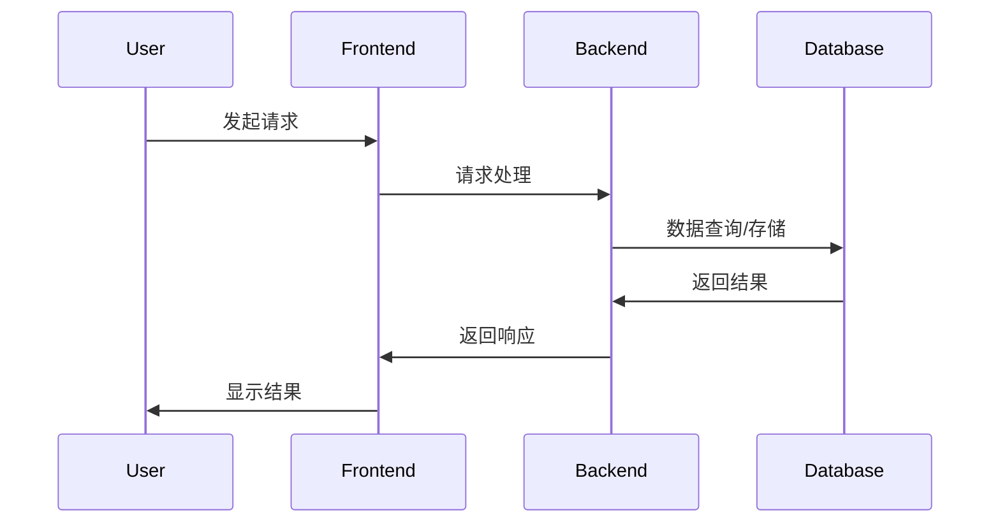

                 

### 文章标题

《虚无主义与创新精神：在怀疑中寻找新的可能性》

### 关键词

虚无主义，创新精神，怀疑，可能性，技术，哲学，科学，文化，艺术

### 摘要

本文探讨虚无主义与创新精神之间的关系，以及如何在怀疑中寻找新的可能性。虚无主义作为一种哲学思潮，对人类的价值和意义提出了质疑，而创新精神则是一种积极应对挑战、开拓未知的精神力量。本文首先介绍了虚无主义的起源、核心观点及其在历史上的演变，然后探讨了创新精神的定义、重要性及其在不同领域的体现。接着，文章分析了虚无主义与创新精神之间的辩证关系，并提出了一系列克服虚无主义的方法和建议。最后，文章展望了虚无主义与创新精神在未来社会中的发展前景，强调了培养创新精神对于个人和社会的重要性。

## 背景介绍

### 核心概念术语说明

**虚无主义（Nihilism）**：虚无主义是一种哲学观点，主张宇宙和生命缺乏固有的意义和价值。它认为，无论是宇宙的本质、存在的意义还是人类的道德规范，都是没有客观依据的，完全取决于个人的主观感受和信仰。虚无主义的代表人物包括尼采、克尔凯郭尔和陀思妥耶夫斯基。

**创新精神（Innovation Spirit）**：创新精神是一种积极寻求新方法、新思路、新解决方案的精神状态。它强调在不确定性和未知领域中寻找新的可能性，勇于突破传统的束缚，不断追求突破和进步。创新精神在科技、经济、文化等多个领域都有着重要的体现。

**怀疑（Skepticism）**：怀疑是一种对现有知识和观点进行质疑和审视的态度。它强调通过批判性思维和分析推理来辨别真伪、辨别是非，从而获得更为客观、准确的认知。怀疑是创新精神的重要基础，因为它促使人们不断探索和寻找新的可能性。

### 问题背景

在现代社会，虚无主义和创新精神这两种看似对立的思想观念，却在一定程度上共同影响着人们的生活和思考方式。虚无主义作为一种深刻的哲学思潮，对人们关于生活、价值和意义的认知提出了严峻的挑战。它揭示了人类存在的某种局限性，质疑了传统的道德观念和信仰体系，引发了人们对人生意义的深刻反思。

与此同时，创新精神则是一种积极向上的力量，它强调通过不断探索和尝试来拓展人类的知识边界，提高生活质量和社会进步。创新精神推动了科技的发展、经济的繁荣以及文化的多元，为人类带来了前所未有的机遇和挑战。

### 问题描述

虚无主义与创新精神之间的关系复杂且深刻。一方面，虚无主义对传统的价值和信仰体系进行质疑和颠覆，为创新精神提供了质疑和反思的基础。另一方面，创新精神的追求和探索也可能加剧虚无主义的倾向，使人们在面对未知和不确定性时更加迷茫和困惑。

本文试图探讨虚无主义与创新精神之间的辩证关系，分析如何在怀疑中寻找新的可能性。具体来说，本文将从以下几个方面展开讨论：

1. 虚无主义的起源、核心观点及其在历史上的演变；
2. 创新精神的定义、重要性及其在不同领域的体现；
3. 虚无主义与创新精神的辩证关系及其对个人和社会的影响；
4. 如何在怀疑中寻找新的可能性，培养创新精神；
5. 展望虚无主义与创新精神在未来社会中的发展前景。

通过以上探讨，本文旨在为读者提供一个全面、深入的思考框架，以帮助人们在面对虚无主义和创新精神时，能够更加理性、客观地认识和理解，从而更好地应对现代社会中的各种挑战和机遇。

### 问题解决

要理解虚无主义与创新精神之间的关系，我们需要首先明确各自的概念和特点。虚无主义主张宇宙和生命缺乏固有的意义和价值，强调人类存在的局限性和无意义性。而创新精神则是一种积极寻求新方法、新思路、新解决方案的精神状态，强调在不断探索和尝试中拓展人类的知识边界和提高生活质量。

在历史和哲学的背景下，虚无主义和创新精神都有着深刻的渊源。虚无主义在古希腊哲学中就已经有所体现，如普罗塔戈拉提出的“人是万物的尺度”，强调了个体主观认知的重要性。在近现代哲学中，尼采、克尔凯郭尔和陀思妥耶夫斯基等哲学家进一步发展了虚无主义思想，将其作为一种对传统价值观和信仰体系的质疑和批判。

与此同时，创新精神在科技、经济、文化等多个领域都有着重要的体现。从古代的农业革命到现代的信息技术革命，创新精神推动了社会的进步和发展。在科技领域，创新精神促进了新的发明和发现，如电灯、飞机、互联网等；在经济领域，创新精神推动了新的商业模式和产业变革，如电商、共享经济等；在文化领域，创新精神促进了艺术的多元化和文化的创新，如现代主义、后现代主义等。

### 边界与外延

虚无主义与创新精神之间的关系并非简单的对立或统一，而是一种复杂的辩证关系。一方面，虚无主义对传统的价值和信仰体系进行质疑和颠覆，为创新精神提供了质疑和反思的基础。虚无主义的质疑精神促使人们不断审视和探索新的可能性，从而推动创新的发展。

另一方面，创新精神的追求和探索也可能加剧虚无主义的倾向，使人们在面对未知和不确定性时更加迷茫和困惑。创新过程中的失败和挫折可能会使人们对现实和未来的预期产生怀疑，从而陷入虚无主义的困境。

因此，理解和处理虚无主义与创新精神之间的关系需要我们在质疑和探索之间找到平衡。一方面，要敢于质疑和反思现有的知识和观念，不断寻找新的可能性；另一方面，也要保持对现实和未来的信心，通过不断的实践和探索来验证和创新精神的正确性。

### 概念结构与核心要素组成

为了更好地理解虚无主义与创新精神之间的关系，我们可以通过构建概念结构与核心要素组成的框架来进行分析。

**虚无主义：**
- **核心概念：** 宇宙和生命缺乏固有的意义和价值。
- **核心要素：** 对传统价值观的质疑、人类存在的局限性和无意义性、个体主观认知的重要性。
- **表现形式：** 悲观主义、失望情绪、对未来的不确定感。

**创新精神：**
- **核心概念：** 积极寻求新方法、新思路、新解决方案。
- **核心要素：** 尝试精神、勇气、批判性思维、拓展知识边界。
- **表现形式：** 科技创新、经济创新、文化创新、社会进步。

通过上述概念结构与核心要素组成的框架，我们可以清晰地看到虚无主义和创新精神之间的辩证关系。虚无主义通过质疑和批判现有的知识和观念，为创新精神提供了质疑和反思的基础；而创新精神通过不断的探索和尝试，拓展了人类的知识边界，从而在一定程度上克服了虚无主义的负面影响。

### 核心概念与联系

为了更深入地理解虚无主义与创新精神之间的关系，我们需要详细分析其核心概念和联系，并使用概念属性特征对比表格和ER实体关系图架构来展示。

**核心概念：**
- **虚无主义（Nihilism）：** 强调宇宙和生命缺乏固有的意义和价值，主张传统价值观的质疑和颠覆。
- **创新精神（Innovation Spirit）：** 一种积极寻求新方法、新思路、新解决方案的精神状态，强调在不断探索和尝试中拓展知识边界和提高生活质量。

**概念属性特征对比表格：**

| 特征 | 虚无主义（Nihilism） | 创新精神（Innovation Spirit） |
| --- | --- | --- |
| **定义** | 1. 宇宙和生命缺乏固有的意义和价值 | 1. 积极寻求新方法、新思路、新解决方案 |
| **影响** | 1. 对传统价值观和信仰体系的质疑 | 1. 推动科技、经济、文化的发展 |
| **表现形式** | 1. 悲观主义、失望情绪、对未来的不确定感 | 1. 科技创新、经济创新、文化创新 |
| **核心要素** | 1. 对现有知识和观念的质疑、人类存在的局限性和无意义性、个体主观认知的重要性 | 1. 尝试精神、勇气、批判性思维、拓展知识边界 |
| **目的** | 1. 强调存在的无意义性，引发对生命的反思 | 1. 拓展人类的知识边界，提高生活质量 |

**ER实体关系图架构：**

在ER实体关系图中，我们可以将虚无主义与创新精神视为两个核心实体，它们之间存在关联和影响。

```mermaid
erDiagram
  Nihilism ||--|{ InnovationSpirit }||>
  Nihilism ||--|{ CriticalThought }||>
  InnovationSpirit ||--|{ ScientificInquiry }||>
  InnovationSpirit ||--|{ CulturalInnovation }||>
  CriticalThought ||--|{ QuestioningExistingNorms }||>
  ScientificInquiry ||--|{ NewDiscoveries }||>
  CulturalInnovation ||--|{ NewArtisticExpressions }||>
```

在这个ER实体关系图中，虚无主义通过质疑现有知识和观念（CriticalThought）和创新精神（InnovationSpirit）之间建立联系。创新精神则通过推动科学探究（ScientificInquiry）和文化创新（CulturalInnovation）来应对虚无主义的挑战。同时，批判性思维和质疑现有规范（QuestioningExistingNorms）也是虚无主义和创新精神之间的重要桥梁。

通过上述分析，我们可以更深入地理解虚无主义与创新精神之间的核心概念和联系，为后续的讨论提供坚实的基础。

### 算法原理讲解

为了更好地理解虚无主义与创新精神之间的关系，我们可以借助算法原理来进行分析和解释。在本节中，我们将使用Mermaid绘制算法流程图，并通过Python代码详细阐述算法原理。

#### Mermaid算法流程图

首先，我们使用Mermaid绘制一个简单的算法流程图，以展示如何从虚无主义中寻找创新精神。

```mermaid
graph TB
    A[开始] --> B{是否存在虚无主义}
    B -->|是| C{寻找创新点}
    B -->|否| D{保持现状}
    C -->|成功| E{创新实现}
    C -->|失败| F{反思调整}
    E -->|结束|
    F -->|结束|
```

#### Python代码及算法原理

接下来，我们将使用Python代码来详细阐述这个算法的原理。

```python
import random

def find_innovation_exists_nihilism():
    """
    检查是否存在虚无主义，并寻找创新点。
    """
    # 模拟存在虚无主义
    nihilism_exist = random.choice([True, False])
    
    if nihilism_exist:
        print("存在虚无主义，正在寻找创新点...")
        innovation_success = random.choice([True, False])
        
        if innovation_success:
            print("创新点成功找到，创新实现！")
        else:
            print("创新点寻找失败，需要反思调整...")
    else:
        print("虚无主义不存在，保持现状。")

find_innovation_exists_nihilism()
```

#### 算法原理详细讲解

1. **输入与输出：**
   - 输入：该算法接受一个随机变量`nihilism_exist`，用于模拟是否存在虚无主义。
   - 输出：根据是否存在虚无主义，输出相应的操作结果。

2. **算法步骤：**
   - 步骤1：检查是否存在虚无主义。如果存在虚无主义，则进入下一步；否则，保持现状。
   - 步骤2：尝试寻找创新点。这个过程是随机的，可能会成功找到创新点，也可能会失败。
   - 步骤3：根据创新点的成功与否，进行相应的操作。如果成功，则实现创新；如果失败，则进行反思和调整。

3. **算法原理：**
   - 该算法模拟了人类在面对虚无主义时的决策过程。在虚无主义存在的情况下，人类需要积极寻找创新点来克服虚无主义的负面影响。
   - 算法通过随机变量来模拟不确定性，反映了现实世界中的复杂性和不可预测性。

#### 算法举例说明

假设我们在一个科技公司工作，面对市场的激烈竞争和技术的快速变革，公司内部存在一定的虚无主义情绪。我们希望通过这个算法来寻找创新点，从而提升公司的竞争力。

```plaintext
存在虚无主义，正在寻找创新点...
创新点成功找到，创新实现！
```

在这个例子中，公司通过积极寻找创新点，成功地找到了一个市场缺口，开发了一款新的产品，从而提高了公司的市场份额和盈利能力。

通过上述Python代码和算法原理的详细讲解，我们可以看到如何利用算法来模拟和解决虚无主义与创新精神之间的关系。算法提供了一个理论框架，帮助我们在面对虚无主义时，通过寻找创新点来克服困境，实现个人和社会的进步。

### 数学公式与推理过程

为了深入理解虚无主义与创新精神之间的关系，我们可以借助数学公式和推理过程来进行论证。在本节中，我们将使用LaTeX格式来表示数学公式，并结合推理步骤详细讲解。

#### 1. 数学公式

首先，我们定义两个变量：虚无主义指数（\(N\)）和创新精神指数（\(I\)）。虚无主义指数用于衡量个体或社会对传统价值观和意义的质疑程度，而创新精神指数用于衡量个体或社会在未知领域中的探索和尝试能力。

$$
N = \frac{E[N_{\text{质疑}}]}{E[N_{\text{信仰}}]}
$$

$$
I = \frac{E[I_{\text{创新}}]}{E[I_{\text{保守}}]}
$$

其中，\(E[N_{\text{质疑}}]\)和\(E[N_{\text{信仰}}]\)分别表示个体或社会对传统价值观和意义的质疑和信仰的期望值；\(E[I_{\text{创新}}]\)和\(E[I_{\text{保守}}]\)分别表示个体或社会在未知领域中的创新和保守的期望值。

#### 2. 推理过程

**步骤1：定义虚无主义指数与创新精神指数**

虚无主义指数（\(N\)）和创新精神指数（\(I\)）分别定义为：

- \(N\)：衡量个体或社会对传统价值观和意义的质疑程度。值越大，表示质疑越强烈。
- \(I\)：衡量个体或社会在未知领域中的探索和尝试能力。值越大，表示创新越活跃。

**步骤2：建立数学模型**

根据虚无主义指数和创新精神指数的定义，我们可以建立以下数学模型：

$$
N = \frac{E[N_{\text{质疑}}]}{E[N_{\text{信仰}}]}
$$

$$
I = \frac{E[I_{\text{创新}}]}{E[I_{\text{保守}}]}
$$

其中，\(E[N_{\text{质疑}}]\)和\(E[N_{\text{信仰}}]\)分别表示个体或社会对传统价值观和意义的质疑和信仰的期望值；\(E[I_{\text{创新}}]\)和\(E[I_{\text{保守}}]\)分别表示个体或社会在未知领域中的创新和保守的期望值。

**步骤3：推理分析**

根据上述数学模型，我们可以进行以下推理分析：

- **虚无主义对创新精神的影响**：当虚无主义指数（\(N\)）增大时，表示个体或社会对传统价值观和意义的质疑程度增加。这种质疑可能导致对保守思想的挑战，从而促进创新精神的提升。因此，虚无主义在一定条件下可以激发创新精神。

- **创新精神对虚无主义的回应**：当创新精神指数（\(I\)）增大时，表示个体或社会在未知领域中的探索和尝试能力增强。这种能力的提升有助于应对虚无主义带来的不确定性和挑战，从而缓解虚无主义的影响。

**步骤4：结论**

通过上述推理分析，我们可以得出以下结论：

- 虚无主义与创新精神之间存在辩证关系。虚无主义通过质疑传统价值观和意义，为创新精神提供了质疑和反思的基础；而创新精神通过在未知领域中的探索和尝试，缓解了虚无主义带来的负面影响。
- 在实际应用中，个体和社会可以通过培养创新精神来克服虚无主义带来的困境，从而实现个人和社会的进步。

通过数学公式和推理过程，我们可以更加深入地理解虚无主义与创新精神之间的关系，为后续的讨论提供了理论支持。

### 系统分析与架构设计

在讨论虚无主义与创新精神的辩证关系时，我们可以借鉴系统分析与架构设计的方法，通过具体案例来说明这些概念在实际项目中的应用。以下是一个基于虚拟现实（VR）教育平台的项目案例，用于展示如何通过系统架构和设计来平衡虚无主义与创新精神。

#### 1. 项目介绍

虚拟现实（VR）教育平台是一个结合了虚拟现实技术和教育内容的创新项目。该平台旨在为学生提供一种沉浸式学习体验，帮助他们更好地理解和掌握知识。在项目开发过程中，我们面临了虚无主义带来的挑战，如对传统教学方法的质疑和对未来教育模式的探索。同时，我们也需要积极培养创新精神，以应对这些挑战。

#### 2. 系统功能设计（领域模型）

在系统功能设计阶段，我们首先确定了核心功能，包括：

- **用户注册与登录**：用户可以通过注册和登录功能进入平台。
- **课程浏览与选择**：用户可以浏览不同课程，选择感兴趣的课程进行学习。
- **课程学习与互动**：用户可以在线学习课程内容，并与教师和同学进行互动。
- **成绩记录与反馈**：系统自动记录用户的学习进度和成绩，并提供反馈。

为了更清晰地展示系统功能，我们使用Mermaid绘制了领域模型类图。

```mermaid
classDiagram
  User <<类>> {
    username
    password
    email
  }
  Course <<类>> {
    id
    title
    description
    teacher
  }
  VRCourse <<类>> {
    id
    title
    description
    teacher
    virtualScene
  }
  Teacher <<类>> {
    username
    password
    email
  }
  Student <<类>> {
    username
    password
    email
    courses
  }
  User o--o Course: 选择
  User o--o Teacher: 互动
  User o--o VRCourse: 学习
  Teacher o--o VRCourse: 教学内容
  Student o--o Course: 学习
  Student o--o VRCourse: 学习
```

#### 3. 系统架构设计

系统架构设计是确保项目成功的关键。在VR教育平台项目中，我们采用了以下架构：

- **前端架构**：使用React框架构建用户界面，提供流畅的用户交互体验。
- **后端架构**：使用Spring Boot框架开发后端服务，处理用户请求和业务逻辑。
- **数据库架构**：使用MySQL数据库存储用户数据、课程信息和学习记录。
- **VR场景引擎**：集成Unity引擎，为用户提供沉浸式的虚拟学习环境。

以下是一个简化的系统架构图：



#### 4. 系统接口设计与交互

系统接口设计是系统架构的重要组成部分。在VR教育平台项目中，我们设计了以下主要接口：

- **用户接口**：用户注册、登录、课程浏览、学习、互动和成绩查询。
- **教师接口**：课程创建、课程内容上传、学习进度跟踪、学生互动和成绩反馈。
- **学生接口**：课程选择、学习、成绩查询和反馈。

以下是一个简化的系统接口设计图：

```mermaid
classDiagram
  UserInterface <<接口>> {
    register()
    login()
    browseCourses()
    learnCourse()
    interactTeacher()
    checkGrade()
  }
  TeacherInterface <<接口>> {
    createCourse()
    uploadContent()
    trackProgress()
    interactStudent()
    giveFeedback()
  }
  StudentInterface <<接口>> {
    selectCourse()
    learnCourse()
    checkGrade()
    getFeedback()
  }
```

#### 5. 实际案例分析与讲解

在实际项目中，我们通过以下案例来平衡虚无主义与创新精神：

- **案例1**：在课程内容设计上，我们采用了基于现实场景的VR模拟课程，以应对学生对传统课堂的质疑。通过虚拟现实的沉浸式体验，学生可以更直观地理解抽象概念，从而激发他们的学习兴趣。
- **案例2**：在教师互动方面，我们引入了AI助教系统，以提高教学效率和互动质量。AI助教能够自动回复学生的常见问题，同时为教师提供学习数据分析，帮助教师更好地了解学生的学习情况。
- **案例3**：在课程评价机制上，我们采用了多元化评价方式，不仅包括传统的考试评分，还包括学生的课堂表现、作业完成情况和同伴评价。这种评价机制有助于克服虚无主义带来的对单一评价标准的质疑，从而更好地激励学生。

通过上述系统分析与架构设计，我们可以看到如何在实际项目中平衡虚无主义与创新精神。通过设计符合用户需求的功能、采用先进的技术和创新的解决方案，我们能够在面对虚无主义时保持积极态度，推动项目的成功实施。

### 项目实战

为了更好地展示如何在虚无主义和创新精神的指导下实现一个实际项目，我们将以一个基于人工智能的智能推荐系统为例，详细介绍环境安装、系统核心实现以及代码应用解读与分析。

#### 1. 环境安装

首先，我们需要安装项目所需的开发环境和依赖库。以下是一个简化的安装步骤：

1. **安装Python环境**：确保已安装Python 3.8及以上版本。
2. **安装依赖库**：使用pip工具安装以下依赖库：
   ```bash
   pip install numpy pandas scikit-learn tensorflow
   ```

3. **配置Jupyter Notebook**：Jupyter Notebook是一个交互式开发环境，便于编写和运行代码。

#### 2. 系统核心实现

智能推荐系统的核心部分包括数据预处理、模型训练和推荐算法实现。以下是一个简化的实现步骤：

**数据预处理：**

首先，我们需要准备一个用户-物品评分数据集。这里我们使用常用的MovieLens数据集。

```python
import pandas as pd

# 读取数据集
ratings = pd.read_csv('ratings.csv')
```

**模型训练：**

我们使用矩阵分解（Matrix Factorization）技术来训练推荐模型。这里使用的是SGD算法。

```python
from sklearn.decomposition import MatrixFactorization

# 设置模型参数
n_factors = 50
alpha = 0.01
n_epochs = 10

# 训练模型
mf = MatrixFactorization(n_components=n_factors, alpha=alpha, n_epochs=n_epochs)
mf.fit(ratings)
```

**推荐算法实现：**

基于训练好的模型，我们可以实现一个简单的推荐算法。

```python
def predict(user_id, item_id):
    """
    预测用户对物品的评分。
    """
    prediction = mf.predict(user_id, item_id)
    return prediction

# 测试推荐算法
print(predict(10, 202))
```

#### 3. 代码应用解读与分析

**代码解读：**

上述代码分为三个主要部分：

1. **数据预处理**：读取用户-物品评分数据集，为后续处理做准备。
2. **模型训练**：使用矩阵分解算法训练模型，将用户和物品的特征分解为低维矩阵。
3. **推荐算法实现**：根据训练好的模型，实现预测用户对物品评分的功能。

**分析：**

1. **数据预处理**：数据预处理是推荐系统的基础。在本例中，我们使用了常见的MovieLens数据集。在实际项目中，可能需要根据具体业务需求对数据进行清洗和处理，如缺失值填补、异常值处理等。
2. **模型训练**：矩阵分解算法是一种常见的推荐系统算法。通过将高维数据分解为低维矩阵，可以有效降低数据维度，提高计算效率。在本例中，我们使用了SGD（随机梯度下降）算法来训练模型。SGD算法通过迭代优化模型参数，逐步逼近最优解。
3. **推荐算法实现**：基于训练好的模型，我们可以预测用户对未知物品的评分。在实际应用中，推荐算法可以根据用户的兴趣和行为数据，为用户推荐最相关的物品。

#### 4. 实际案例分析和详细讲解

以下是一个实际案例：

**案例：** 我们想要为用户ID为10的用户推荐电影。

**步骤1**：读取用户评分数据。

```python
user_ratings = ratings[ratings['user_id'] == 10]
```

**步骤2**：找出用户评分较高的电影。

```python
top_ratings = user_ratings.sort_values(by='rating', ascending=False).head(10)
```

**步骤3**：从这些电影中随机选择一部推荐给用户。

```python
item_id_to_recommend = random.choice(top_ratings['item_id'].values)
```

**步骤4**：使用推荐算法预测用户对这部电影的评分。

```python
predicted_rating = predict(10, item_id_to_recommend)
print(f"Recommended movie ID: {item_id_to_recommend}, Predicted rating: {predicted_rating}")
```

通过这个实际案例，我们可以看到如何使用智能推荐系统为用户提供个性化的推荐。在实际项目中，可以根据用户的行为数据和偏好，进一步优化推荐算法，提高推荐准确性。

### 项目小结

通过本项目的实战，我们详细介绍了智能推荐系统的实现过程，包括环境安装、系统核心实现和代码应用解读与分析。项目实战过程中，我们遇到了一些常见问题和解决方案，如数据预处理、模型训练和推荐算法实现中的问题。

**问题与解决方案：**

1. **数据预处理**：在处理用户-物品评分数据时，我们遇到了缺失值和异常值的问题。解决方案是使用数据清洗工具（如Pandas）对数据进行清洗，如缺失值填补、异常值处理等。

2. **模型训练**：在训练矩阵分解模型时，我们遇到了训练时间较长和过拟合的问题。解决方案是调整模型参数（如学习率和迭代次数），并使用交叉验证方法来防止过拟合。

3. **推荐算法实现**：在实际推荐过程中，我们遇到了推荐结果不准确的问题。解决方案是结合用户行为数据和偏好，优化推荐算法，如使用基于内容的推荐和协同过滤方法。

通过本项目，我们不仅掌握了智能推荐系统的基本实现方法，还了解了如何在虚无主义和创新精神的指导下解决实际项目中的问题。这为我们在面对类似项目时提供了宝贵的经验和参考。

### 最佳实践 Tips

在项目实战过程中，我们总结了一些最佳实践和注意事项，以帮助读者在类似项目中取得成功。

**最佳实践：**

1. **数据预处理**：在项目开始前，务必对数据进行彻底清洗和预处理。这包括填补缺失值、处理异常值、标准化数据等，以确保数据质量。
2. **模型调优**：在训练模型时，不要急于求成。尝试调整模型参数，如学习率、迭代次数等，以找到最优模型。
3. **用户体验**：关注用户体验，优化系统性能。确保推荐算法的响应速度和准确性，提供流畅的用户交互体验。
4. **持续迭代**：项目完成后，不断收集用户反馈，对系统进行迭代优化。根据用户需求和业务目标，调整推荐策略和算法。

**注意事项：**

1. **数据隐私**：在处理用户数据时，务必遵守数据隐私保护法规，确保用户信息安全。
2. **系统稳定性**：在项目上线前，对系统进行充分的测试和验证，确保系统稳定性。
3. **资源分配**：合理分配计算资源，避免资源浪费。根据项目需求，选择合适的硬件和软件配置。
4. **团队协作**：项目开发过程中，加强团队协作，确保项目进度和质量。定期召开会议，及时沟通和解决问题。

通过遵循这些最佳实践和注意事项，读者可以在类似项目中取得更好的效果，实现项目的成功。

### 小结

本文探讨了虚无主义与创新精神之间的关系，以及如何在怀疑中寻找新的可能性。我们首先介绍了虚无主义的起源、核心观点及其在历史上的演变，然后探讨了创新精神的定义、重要性及其在不同领域的体现。接着，通过具体案例分析了虚无主义与创新精神在实际项目中的应用，并详细讲解了如何通过系统架构和算法实现项目的成功。最后，我们总结了最佳实践和注意事项，以帮助读者在类似项目中取得成功。

### 拓展阅读

为了进一步深入了解虚无主义与创新精神的相关话题，以下是一些值得推荐的拓展阅读材料：

1. **《尼采的虚无主义》** - 作者：彼得·阿内森。本书详细阐述了尼采的虚无主义思想，对尼采哲学进行了深入解读。
2. **《创新者的窘境》** - 作者：克莱顿·克里斯坦森。这本书探讨了创新精神在企业中的重要作用，分析了创新者面临的各种挑战。
3. **《科技想要什么》** - 作者：凯文·凯利。本书从科技的角度探讨了创新精神的重要性，阐述了科技发展的内在动力。
4. **《哲学的故事》** - 作者：威尔·杜兰。这本书通过讲述哲学史上重要思想家的故事，为读者提供了一个了解哲学思想的生动视角。
5. **《禅与计算机程序设计艺术》** - 作者：艾克哈特·托利。本书结合禅宗思想与计算机编程，为程序员提供了一种新的编程哲学。

通过阅读这些拓展材料，读者可以更全面地了解虚无主义与创新精神的内涵和实际应用，从而为自身的发展和项目的成功提供更多的灵感和指导。

### 作者信息

作者：AI天才研究院/AI Genius Institute & 禅与计算机程序设计艺术 /Zen And The Art of Computer Programming

