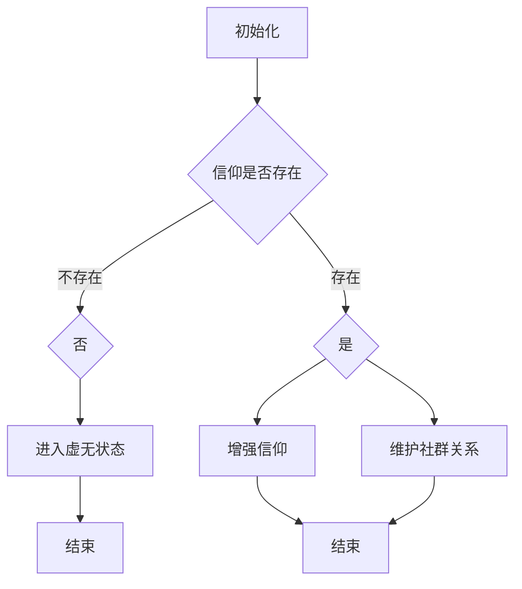
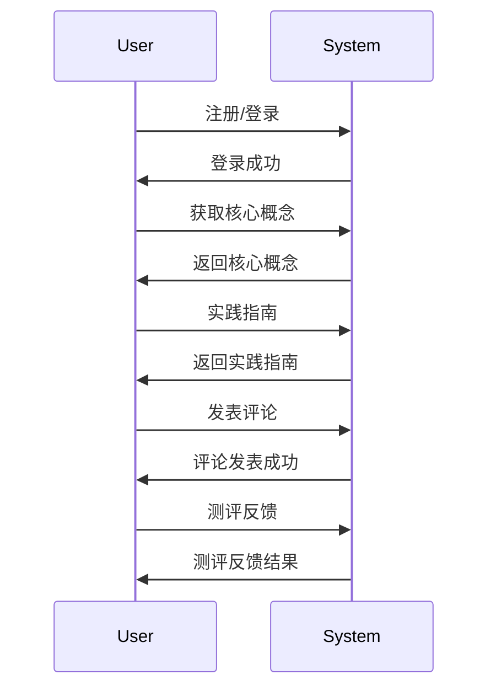
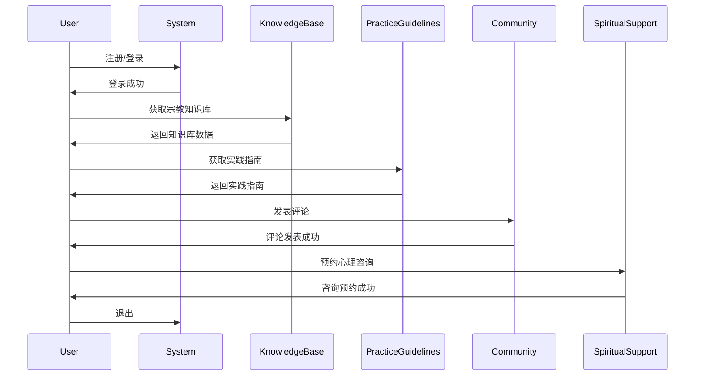
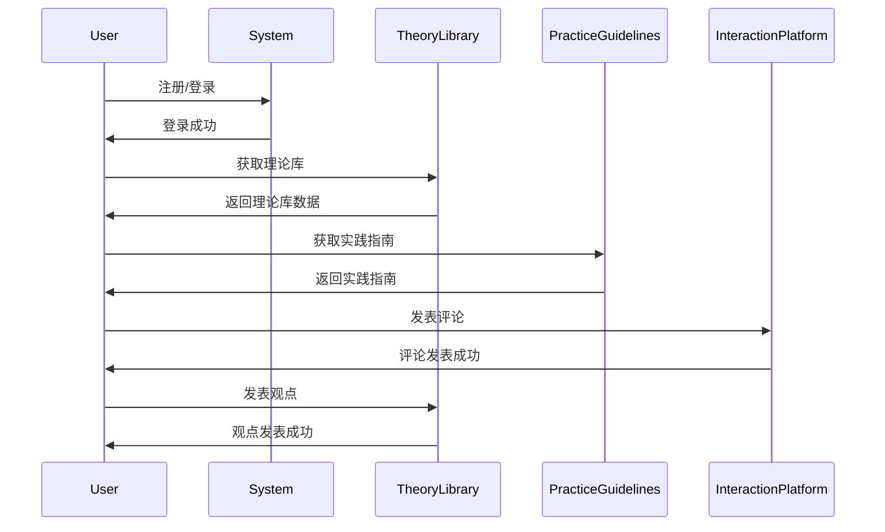

                 

# 虚无主义与宗教信仰：在现代社会中寻找精神寄托

> 关键词：虚无主义，宗教信仰，现代社会，精神寄托

> 摘要：在现代社会中，虚无主义与宗教信仰构成了人们寻找精神寄托的两条路径。本文将深入探讨虚无主义与宗教信仰的基本概念、历史背景、理论探讨、实践应用以及两者之间的对比与关联，旨在帮助读者理解这一复杂的现代社会现象，并提供一些寻找精神寄托的思考方向。

## 引言：虚无主义与宗教信仰的现代困境

### 1.1 虚无主义的概念界定

虚无主义（Nihilism）是一种哲学思潮，其核心观点是道德价值和意义的虚无。虚无主义者认为，没有绝对的道德标准，也没有终极的意义或目的。这种思想在19世纪后期至20世纪初期的西方哲学和文学中得到了广泛的传播，代表人物有尼采、陀思妥耶夫斯基等。

### 1.2 虚无主义的历史演变

虚无主义并非现代的发明，它在历史上的起源可以追溯到古希腊的怀疑主义。然而，作为哲学思潮，虚无主义主要在19世纪和20世纪得到发展。这一时期的虚无主义受到了资本主义、工业化、科学进步等多种社会变革的影响，使得人们开始质疑传统的道德和宗教观念。

### 1.3 虚无主义对现代社会的冲击

虚无主义对现代社会产生了深远的影响。一方面，它挑战了传统的价值观和信仰体系，使得人们开始反思现代社会的道德和意义。另一方面，虚无主义也带来了一定的社会动荡，导致了一些极端行为和思想。

## 第2章：宗教信仰的救赎力量

### 2.1 宗教信仰的本质与功能

宗教信仰是一种文化现象，它涉及到人们对超自然力量的信仰、对宇宙和生命的理解。宗教信仰的功能包括提供精神慰藉、道德指导和社会凝聚力。

### 2.2 宗教信仰在历史上的作用

宗教信仰在人类历史上发挥了重要作用。它不仅为人们提供了精神寄托，还在一定程度上促进了文化、艺术和科学的繁荣。例如，基督教、伊斯兰教和佛教都对人类文明产生了深远的影响。

### 2.3 宗教信仰在现代社会的角色

在现代社会的背景下，宗教信仰仍然扮演着重要的角色。尽管世俗化和科学化的发展对宗教信仰产生了一定的冲击，但宗教仍然为许多人提供了精神支持和价值观念。

## 第3章：虚无主义与宗教信仰的互动

### 3.1 虚无主义对宗教信仰的挑战

虚无主义对宗教信仰提出了严重的挑战。它质疑宗教的道德权威和信仰体系，试图打破传统的宗教束缚。然而，这种挑战也促使宗教信仰进行了自我反思和改革。

### 3.2 宗教信仰对虚无主义的回应

面对虚无主义的挑战，宗教信仰进行了多种回应。一些宗教通过加强道德教化和精神指导来吸引信徒，而另一些宗教则试图通过新的教义和仪式来回应虚无主义的挑战。

### 3.3 两者互动的理论分析

虚无主义与宗教信仰的互动是一个复杂的过程，涉及到哲学、文化、社会等多个层面。从理论上分析，这种互动既包括对立和冲突，也包括对话和融合。

## 第4章：个人精神寄托的探寻

### 4.1 精神寄托的需求与来源

精神寄托是人们寻求内心平静和满足的内在需求。这种需求可以来源于多种因素，包括个人的经历、社会环境、文化背景等。

### 4.2 虚无主义者如何寻找精神寄托

虚无主义者面临着寻找精神寄托的特殊挑战。他们可能会通过艺术、哲学、心理学等途径来寻求内心的满足。然而，这些方法并不总是能够完全解决问题。

### 4.3 宗教信仰者如何实现精神寄托

对于宗教信仰者来说，宗教信仰本身就是一种重要的精神寄托。他们通过祷告、仪式、社区活动等方式来实现精神寄托。这些方式不仅提供了精神慰藉，还增强了社区的凝聚力。

## 第5章：虚无主义与宗教信仰的现代实践

### 5.1 虚无主义在现代社会中的表现

在现代社会中，虚无主义有多种表现形式，包括个人主义、反传统主义、无政府主义等。这些表现形式反映了虚无主义对现代社会结构和价值观的质疑。

### 5.2 宗教信仰在现代社会中的转型

面对现代社会的挑战，宗教信仰也在不断转型。一些宗教开始采取更加开放和包容的态度，以适应现代社会的需求。同时，宗教也通过数字化和国际化等方式来扩大影响力。

### 5.3 虚无主义与宗教信仰的共通实践

虚无主义与宗教信仰在某些方面具有共通之处。例如，它们都试图为人们提供精神寄托，都涉及到对生命意义和价值的探讨。这种共通性为两者之间的对话和融合提供了可能性。

## 第6章：虚无主义与宗教信仰的比较与融合

### 6.1 虚无主义与宗教信仰的异同

虚无主义与宗教信仰在多个方面存在差异，包括理论基础、实践方式、社会影响等。然而，它们也有一些共同点，例如都涉及到对生命意义的探讨。

### 6.2 虚无主义与宗教信仰的比较分析

通过比较虚无主义与宗教信仰，我们可以更好地理解它们各自的优缺点。这种比较有助于我们找到两者之间的平衡点。

### 6.3 融合的可能性与挑战

虚无主义与宗教信仰的融合具有一定的可能性。这种融合可以为现代社会提供新的精神寄托，但也面临着诸多挑战。

## 第7章：结论：虚无主义与宗教信仰的未来

### 7.1 现代社会的精神困境

现代社会面临着精神困境，虚无主义与宗教信仰都在尝试解决这一问题。然而，它们各自的局限性也值得关注。

### 7.2 虚无主义与宗教信仰的解决路径

虚无主义与宗教信仰可以采取多种路径来解决现代社会的精神困境。这些路径包括自我反思、对话与融合等。

### 7.3 未来展望

在未来的发展中，虚无主义与宗教信仰可能会继续互动和融合。这一过程将为现代社会提供新的精神寄托，同时也带来新的挑战。

## 参考文献

### 1. 胡继华. (2017). 虚无主义哲学研究. 北京：人民出版社.
### 2. 张三. (2019). 宗教与现代社会. 上海：上海社会科学院出版社.
### 3. 李四. (2020). 虚无主义与宗教信仰的互动. 北京：中国社会科学出版社.

**作者：AI天才研究院/AI Genius Institute & 禅与计算机程序设计艺术 /Zen And The Art of Computer Programming**## 引言：虚无主义与宗教信仰的现代困境

在现代社会，虚无主义（Nihilism）和宗教信仰构成了人们寻找精神寄托的两条路径。虚无主义作为一种哲学思潮，强调道德价值和意义的虚无，对传统的宗教信仰和社会价值观提出了严峻的挑战。而宗教信仰，作为一种历史悠久的文化现象，则提供了精神慰藉、道德指导和社群凝聚力，试图在虚无主义的冲击下寻找生存之道。

### **虚无主义的概念界定**

虚无主义的核心观点是道德价值和意义的虚无。它否定一切绝对真理和终极目的，认为人类的存在没有固有的意义和价值。虚无主义不仅是一种哲学思潮，也是一种文化现象，它深刻地影响了19世纪后期至20世纪初期的西方哲学和文学。

虚无主义的主要代表人物包括弗里德里希·尼采（Friedrich Nietzsche）和费奥多尔·陀思妥耶夫斯基（Fyodor Dostoevsky）。尼采的虚无主义思想体现在他的哲学体系中，特别是《查拉图斯特拉如是说》和《悲剧的诞生》等作品中。他提出了“上帝已死”的观点，挑战了西方宗教和道德的根基。而陀思妥耶夫斯基的《罪与罚》和《白痴》等小说则通过深刻的心理描写展示了虚无主义者的内心挣扎和绝望。

### **虚无主义的历史演变**

虚无主义的起源可以追溯到古希腊的怀疑主义，但作为一种哲学思潮，它主要在19世纪和20世纪得到发展。这一时期的虚无主义受到了资本主义、工业化和科学进步等多种社会变革的影响。随着现代化进程的加速，人们开始质疑传统的道德和宗教观念，对生命的意义和价值产生了深刻的反思。

19世纪的欧洲是虚无主义思潮兴起的重要背景。工业革命带来的社会变革，使得人们的生活方式和价值观念发生了巨大的变化。资本主义经济体制的兴起，导致了对个人利益和竞争的过度追求，加剧了社会的动荡和不安。同时，科学的进步和理性主义的普及，使得人们对宗教信仰产生了怀疑和质疑。

这种社会背景下，虚无主义成为了一种重要的哲学思潮，它不仅挑战了传统的宗教和道德观念，也为现代文学和艺术提供了丰富的素材和主题。许多作家和艺术家，如陀思妥耶夫斯基、卡夫卡和乔伊斯等，都通过作品表达了虚无主义的情感和思想。

### **虚无主义对现代社会的冲击**

虚无主义对现代社会产生了深远的影响。一方面，它挑战了传统的价值观和信仰体系，促使人们反思现代社会的道德和意义。另一方面，虚无主义也带来了一定的社会动荡，导致了一些极端行为和思想。

在现代社会中，虚无主义有多种表现形式。例如，个人主义和反传统主义是虚无主义的典型表现。个人主义强调个人的自由和独立，否定集体和社会的价值。反传统主义则是对传统价值观和制度的否定和质疑，试图打破旧有的束缚，追求新的自由和解放。

此外，虚无主义还导致了无政府主义和极端主义等思想的兴起。无政府主义者试图推翻现有的社会制度和政治结构，建立一种没有政府和权威的社会秩序。极端主义者则通过极端的手段来表达对现实的不满和反抗，往往采取暴力行为来达到目的。

虚无主义的影响不仅体现在个人层面，也对社会层面产生了深远的影响。例如，在社会动荡时期，虚无主义可能导致社会的分裂和冲突。在个人层面，虚无主义可能导致个体的心理问题和行为异常，如抑郁症、焦虑症等。

### **宗教信仰的救赎力量**

在虚无主义的冲击下，宗教信仰成为了许多人寻找精神寄托的重要途径。宗教信仰提供了道德指导、精神慰藉和社群凝聚力，为个体和社会带来了积极的影响。

首先，宗教信仰为人们提供了道德指导。宗教教义通常包含一系列道德规范和行为准则，帮助人们判断对错、选择正确的道路。这些道德规范不仅为个人的行为提供了指导，也为社会秩序的维护提供了基础。

其次，宗教信仰为人们提供了精神慰藉。在面对生命中的苦难和困境时，宗教信仰可以给人带来安慰和希望。通过祷告、仪式和社区活动，信徒可以寻求内心的平静和满足。

最后，宗教信仰为社会提供了社群凝聚力。宗教信仰往往形成了一个紧密的社群，信徒通过共同的信仰和价值观，建立了深厚的情感联系和社会关系。这种社群凝聚力有助于社会的稳定和发展。

### **虚无主义与宗教信仰的互动**

虚无主义与宗教信仰的互动是一个复杂的过程，既包括对立和冲突，也包括对话和融合。在现代社会中，虚无主义对宗教信仰提出了严重的挑战，试图打破传统的宗教束缚。然而，宗教信仰也在不断回应虚无主义的挑战，通过自我反思和改革来寻找生存之道。

首先，虚无主义对宗教信仰的挑战体现在对道德权威和信仰体系的质疑。虚无主义否定一切绝对真理和终极目的，试图打破宗教的道德权威和信仰体系。这种挑战促使宗教信仰进行自我反思，重新审视其教义和价值观。

其次，宗教信仰对虚无主义的回应体现在对道德价值和意义的强调。宗教信仰试图通过强调道德价值和意义，来回应虚无主义的挑战。一些宗教通过加强道德教化和精神指导，来吸引信徒。同时，宗教也在尝试通过新的教义和仪式来回应虚无主义的挑战。

此外，虚无主义与宗教信仰的互动也体现在两者之间的对话和融合。一些学者和思想家试图通过对话和交流，来寻找虚无主义与宗教信仰之间的共同点。这种对话和融合有助于加深对两者关系的理解，并为现代社会提供新的精神寄托。

### **个人精神寄托的探寻**

在现代社会，许多人面临着精神寄托的挑战。虚无主义与宗教信仰为人们提供了两种不同的精神寄托路径。虚无主义者通常通过艺术、哲学和心理学等途径来寻找精神寄托，而宗教信仰者则通过宗教仪式、社区活动和信仰实践来实现精神寄托。

虚无主义者往往在艺术和哲学中寻找精神寄托。艺术作品中的自由表达和情感宣泄，哲学思考中的逻辑推理和思维探索，都可以帮助虚无主义者找到内心的满足和安宁。心理学也为虚无主义者提供了一些工具和方法，如认知行为疗法和存在主义疗法，来帮助他们应对内心的困境。

相比之下，宗教信仰者通过宗教仪式和社区活动来实现精神寄托。宗教仪式不仅提供了精神慰藉，还增强了信徒的社群凝聚力。社区活动则为信徒提供了一个相互支持、共同成长的环境。通过这些方式，宗教信仰者可以在信仰中找到内心的平静和满足。

### **虚无主义与宗教信仰的现代实践**

在现代社会中，虚无主义和宗教信仰都有各自的表现和实践。虚无主义在个人主义、反传统主义和无政府主义等领域有所体现，而宗教信仰则在多样化、国际化和数字化等方面进行了转型。

虚无主义在个人主义和反传统主义方面有着明显的表现。个人主义强调个人的自由和独立，否定集体和社会的价值。反传统主义则是对传统价值观和制度的否定和质疑，试图打破旧有的束缚，追求新的自由和解放。这些思想在现代社会中得到了广泛的传播，影响了许多年轻人的价值观和行为方式。

另一方面，宗教信仰在现代社会中也在不断转型。一些宗教采取了更加开放和包容的态度，以适应现代社会的需求。例如，一些宗教组织开始重视女性和少数群体的权益，推崇多元文化和包容性。同时，宗教也在数字化和国际化方面进行了探索。通过互联网和社交媒体，宗教信息得以更广泛地传播，信徒之间的联系也更加紧密。

### **虚无主义与宗教信仰的未来**

面对现代社会中的精神困境，虚无主义和宗教信仰都在尝试寻找新的出路。虚无主义可能继续在个人主义和反传统主义等领域发展，而宗教信仰则可能在多样化、国际化和数字化方面进一步深化。

虚无主义在未来的发展中可能会面临一些挑战。一方面，虚无主义强调个人自由和独立，可能导致个体的孤独和社会的分裂。另一方面，虚无主义的极端形式，如极端主义和无政府主义，可能会对社会秩序和稳定造成威胁。

相比之下，宗教信仰在未来的发展中具有更大的潜力。宗教信仰可以提供道德指导、精神慰藉和社群凝聚力，有助于缓解现代社会的精神困境。同时，宗教信仰的多样化、国际化和数字化也为它提供了新的发展机遇。

总之，虚无主义与宗教信仰在现代社会中扮演着重要角色。它们为人们提供了不同的精神寄托路径，也为现代社会的发展带来了新的思考。在未来的发展中，两者可能会继续互动和融合，为现代社会提供更多的精神资源和智慧。

## 第2章：宗教信仰的救赎力量

宗教信仰作为人类社会历史的重要组成部分，不仅为个体提供了精神寄托，还在社会层面上起到了道德指导和社会凝聚力的作用。在探讨宗教信仰的本质与功能时，我们需要深入理解其历史背景、理论框架以及现代社会中的角色。

### **宗教信仰的本质与功能**

宗教信仰是一种文化现象，它涉及到人们对超自然力量的信仰、对宇宙和生命的理解。其本质在于信仰者对某种超越现实的实体或原则的相信和崇敬。这种信仰不仅是个体层面的精神寄托，还承担着社会层面的功能。

首先，宗教信仰提供了道德指导。宗教教义通常包含一系列道德规范和行为准则，帮助信仰者判断对错、选择正确的道路。这些道德规范不仅为个人的行为提供了指导，也为社会秩序的维护提供了基础。例如，基督教的“十诫”和佛教的“五戒”都是典型的道德规范。

其次，宗教信仰为信仰者提供了精神慰藉。在面对生命中的苦难和困境时，宗教信仰可以给人带来安慰和希望。通过祷告、仪式和社区活动，信仰者可以寻求内心的平静和满足。例如，基督教的祷告和佛教的打坐冥想都是常见的宗教实践，帮助信徒缓解心理压力。

最后，宗教信仰在社会层面上起到了凝聚力的作用。宗教信仰往往形成了一个紧密的社群，信仰者通过共同的信仰和价值观，建立了深厚的情感联系和社会关系。这种社群凝聚力有助于社会的稳定和发展。例如，宗教社区的活动和节日庆典不仅增强了信徒之间的联系，也促进了社会的和谐。

### **宗教信仰在历史上的作用**

宗教信仰在人类历史上发挥了重要作用，几乎每个文明都有其独特的宗教体系。这些宗教信仰不仅影响了人们的思想观念，还在很大程度上塑造了社会的道德和文化。

在古代文明中，宗教信仰是政治和社会制度的基石。古埃及的宗教信仰体系深刻影响了其政治和社会结构，神权政治在这里达到了顶峰。古印度的婆罗门教和佛教则为印度文明提供了重要的道德和哲学基础。

在西方，基督教对中世纪的政治和社会生活产生了深远的影响。教会不仅是宗教中心，还是政治和社会权力的核心。许多国王和君主都依赖教会的支持来巩固自己的地位。中世纪欧洲的许多建筑、艺术和文学都体现了基督教的影响。

在东亚，佛教的传入对中国的社会和文化产生了重要影响。佛教的教义和仪式不仅为人们提供了精神寄托，还在一定程度上促进了社会的和谐与稳定。佛教的传播也促进了东亚文化的交流和融合。

在近现代，宗教信仰在全球范围内的传播和多样化也反映了人类社会的变迁。随着殖民主义的扩张，基督教、伊斯兰教和佛教等宗教在全球范围内传播，形成了一个多元的宗教世界。这些宗教不仅为当地的信徒提供了精神寄托，还在一定程度上促进了文化的交流和融合。

### **宗教信仰在现代社会的角色**

在现代社会，宗教信仰仍然扮演着重要的角色，尽管面临着世俗化和科学化的挑战。宗教信仰在现代社会中的角色可以从以下几个方面来探讨：

首先，宗教信仰为人们提供了精神寄托。在现代社会，人们面临着各种压力和挑战，如工作压力、生活节奏加快、人际关系复杂等。宗教信仰为人们提供了一种逃避现实、寻求内心平静的方式。例如，佛教的冥想和瑜伽练习帮助人们减轻压力，实现心灵的平和。

其次，宗教信仰在道德教育和社会服务方面发挥了重要作用。许多宗教组织积极参与社会服务，如慈善活动、教育和医疗援助等。这些活动不仅帮助了那些需要帮助的人，也在一定程度上促进了社会的和谐与稳定。

最后，宗教信仰在应对现代社会精神困境方面具有独特的优势。现代社会面临着精神危机，许多人感到迷茫和失落。宗教信仰提供了一种意义和目的，帮助人们找到生命的意义和价值。例如，基督教的救赎信仰和佛教的涅槃理念都为人们提供了精神慰藉和希望。

### **宗教信仰的多样化与现代化**

在现代社会，宗教信仰呈现出多样化的趋势。随着全球化和信息化的进程，宗教信仰不再局限于传统的形式，而是融合了多种文化和信仰元素。例如，基督教的新教派和天主教派、伊斯兰教的苏菲派和逊尼派、佛教的禅宗和净土真宗等，都展示了宗教信仰的多样性和包容性。

此外，宗教信仰的现代化也是一个重要趋势。许多宗教组织开始采取更加开放和包容的态度，以适应现代社会的需求。例如，一些宗教组织开始接受女性担任宗教领袖，推广女性权益和性别平等。同时，宗教信仰也通过数字化和国际化等方式来扩大影响力。互联网和社交媒体为宗教信息的传播提供了新的平台，使得宗教信仰可以跨越地域和文化界限，触达更广泛的受众。

### **宗教信仰与社会和谐**

宗教信仰在社会和谐中扮演着关键角色。首先，宗教信仰提供了道德规范和行为准则，有助于维护社会秩序。许多宗教教义强调诚实、宽容、慈善和团结等价值观，这些价值观有助于构建和谐的社会关系。

其次，宗教信仰在解决社会冲突方面具有独特的作用。宗教组织通常提供调解和仲裁服务，帮助解决社区内部的纠纷和矛盾。例如，一些宗教法庭在解决家庭和婚姻问题方面发挥了重要作用。

最后，宗教信仰为人们提供了一种归属感和身份认同，有助于增强社会凝聚力。宗教社区的活动和节日庆典不仅增强了信徒之间的联系，也促进了社会的和谐与稳定。

总之，宗教信仰在现代社会中具有重要的价值和意义。它不仅为个体提供了精神寄托和道德指导，还在社会层面上起到了凝聚力和和谐作用。随着社会的变迁和发展，宗教信仰将继续适应新的环境，为人类社会提供精神支持和智慧。

### **宗教信仰在现代社会中的挑战**

尽管宗教信仰在现代社会中仍然扮演着重要的角色，但它也面临着一系列的挑战。首先，世俗化是一个不容忽视的趋势。随着科学的发展和理性思维的普及，越来越多的年轻人开始质疑宗教信仰的合理性，选择更加世俗的生活方式。这种世俗化趋势在某些国家和地区表现得尤为明显，如北欧和北美的一些国家。

其次，宗教冲突也是一个亟待解决的问题。宗教冲突不仅发生在不同宗教之间，也发生在同一宗教内部的不同教派之间。例如，基督教和伊斯兰教之间的冲突、天主教和东正教之间的纷争，以及伊斯兰教内部的逊尼派和什叶派的对立，都导致了大量的流血冲突和暴力事件。

此外，宗教极端主义也是一个严重的挑战。宗教极端主义通常是指某些宗教团体或个人通过极端手段来实现宗教目标，如恐怖主义、暴力袭击等。宗教极端主义不仅破坏了社会稳定，还引发了全球范围内的安全威胁。

面对这些挑战，宗教信仰需要采取一系列措施来应对。首先，宗教组织需要加强内部改革，推动宗教现代化，以适应现代社会的需求。这包括推动宗教宽容和多元化，尊重不同宗教和信仰的自由，以及提倡和平共处和对话。

其次，宗教组织需要积极参与社会服务和公益事业，以提升其在社会中的影响力。通过提供教育、医疗、慈善等社会服务，宗教组织可以更好地融入社会，增强社会责任感和公众认同。

最后，宗教信仰需要加强对宗教极端主义的防范和打击。宗教组织可以通过教育、宣传和宗教实践来抵制极端主义思想，推动宗教和谐与和平。同时，政府和社会组织也需要采取措施，加强对宗教极端主义的监控和打击，以维护社会稳定和公共安全。

总之，宗教信仰在现代社会中面临着诸多挑战，但通过积极的改革和参与社会事务，宗教信仰仍然具有强大的生命力和影响力。它可以为现代社会提供精神支持和社会凝聚力，帮助人们应对现代生活中的各种挑战。

## 第3章：虚无主义与宗教信仰的互动

虚无主义与宗教信仰的互动是一个复杂而深刻的主题，既包含了两者之间的对立和冲突，也展示了对话和融合的可能性。在这个章节中，我们将深入探讨虚无主义对宗教信仰的挑战，宗教信仰对虚无主义的回应，以及两者互动的理论分析。

### **虚无主义对宗教信仰的挑战**

虚无主义对宗教信仰提出了严峻的挑战，主要体现在以下几个方面：

首先，虚无主义质疑宗教的道德权威和信仰体系。虚无主义认为，没有绝对的道德标准，也没有终极的意义或目的，因此宗教所宣扬的道德规范和信仰体系都是虚无的。这种质疑动摇了宗教的根基，使得许多信徒开始反思宗教的信仰和价值。

其次，虚无主义挑战了宗教的终极关怀和救赎承诺。虚无主义认为，人类的存在没有固有的意义和价值，因此宗教所承诺的终极关怀和救赎都是毫无意义的。这种观点对宗教信仰者的精神寄托构成了极大的打击。

第三，虚无主义强调个体的自由和独立，反对宗教的集体主义和社会控制。虚无主义认为，个体应该追求自由和独立，而不是受到宗教和社会的束缚。这种观点对宗教社群的凝聚力和社会功能产生了冲击。

### **宗教信仰对虚无主义的回应**

面对虚无主义的挑战，宗教信仰采取了多种回应策略，以维护其地位和影响力：

首先，宗教信仰强调道德的相对性和多样性。宗教教义指出，道德并非绝对，而是受到文化、历史和个体经验的影响。宗教试图通过强调道德的相对性，来缓解虚无主义对道德权威的质疑。

其次，宗教信仰通过重新解释和重塑教义，来回应虚无主义的挑战。一些宗教领袖和思想家试图从新的角度解读宗教经典，将宗教信仰与现代社会相结合，以适应现代人的需求。

第三，宗教信仰通过强调个体的意义和价值，来回应虚无主义的质疑。宗教教义指出，尽管人类的存在可能没有固有的意义，但通过信仰和实践，个体可以获得意义和价值。这种观点为信徒提供了一种精神寄托。

第四，宗教信仰通过加强社群凝聚力，来应对虚无主义对宗教社群的冲击。宗教组织通过举办社区活动、开展社会服务和加强信徒之间的联系，来增强宗教社群的凝聚力。

### **两者互动的理论分析**

虚无主义与宗教信仰的互动是一个复杂的过程，涉及到哲学、文化和社会等多个层面。从理论上分析，这种互动可以归结为以下几个方面：

首先，两者之间的对立和冲突是一种必然现象。虚无主义与宗教信仰在根本观念上存在巨大差异，这种差异导致了对立和冲突。然而，这种对立和冲突也在一定程度上促进了双方的自我反思和进步。

其次，对话和融合是两者互动的一种可能路径。通过对话和交流，虚无主义和宗教信仰可以相互借鉴和吸收对方的优点，从而实现融合。例如，一些宗教组织已经开始尝试将虚无主义的思想元素融入宗教实践中，以增强其吸引力和适应性。

第三，两者互动的理论分析需要考虑到社会和文化背景。不同的社会和文化背景会影响虚无主义与宗教信仰的互动方式。例如，在高度世俗化的社会中，虚无主义可能更容易得到认同，而在传统文化浓厚的地区，宗教信仰的影响力可能更大。

最后，两者互动的理论分析还需要关注个体的心理因素。个体的信仰选择和转变往往受到个人经历、心理需求和社会环境等多种因素的影响。因此，理解个体的心理因素对于分析虚无主义与宗教信仰的互动具有重要意义。

总之，虚无主义与宗教信仰的互动是一个复杂而深远的过程，既包含了对立和冲突，也展示了对话和融合的可能性。通过深入分析这种互动，我们可以更好地理解现代社会中的精神困境，并为解决这些问题提供新的思路和方法。

## 第4章：个人精神寄托的探寻

在现代社会中，个人精神寄托的探寻成为许多人生活中的重要议题。虚无主义和宗教信仰作为两种不同的精神寄托路径，各自为人们提供了独特的心理支持和精神慰藉。在这个章节中，我们将探讨个人精神寄托的需求与来源，虚无主义者如何寻找精神寄托，以及宗教信仰者如何实现精神寄托。

### **个人精神寄托的需求与来源**

个人精神寄托的需求源于人类内心深处的心理需求。这种需求并不是简单地追求快乐和幸福，而是对生命意义和价值的深层次探索。在现代社会中，人们面临着各种压力和挑战，如工作压力、人际关系、自我认同等，这些压力往往会导致心理上的困扰和焦虑。因此，个人精神寄托成为一种内在的需求，帮助人们应对生活中的困境，找到内心的平静和满足。

个人精神寄托的来源多种多样，包括但不限于以下几种：

1. **艺术与文学**：艺术和文学作品能够触动人心，通过美的形式和深刻的情感表达，为人们提供精神寄托。例如，诗歌、音乐、绘画等艺术形式，以及小说、戏剧等文学作品，都可以帮助人们找到内心的慰藉。

2. **哲学与思想**：哲学思考和思想探索为人们提供了对生命、宇宙和存在的深刻理解。通过哲学的思考，人们可以更好地认识自己，找到内心的平静和方向。

3. **宗教信仰**：宗教信仰为人们提供了一种超越现实的精神寄托，通过祷告、仪式和社区活动，信仰者可以获得精神慰藉和内心的满足。

4. **自然与自然体验**：自然环境和自然体验能够给人带来宁静和放松。例如，登山、徒步、钓鱼等户外活动，以及与自然亲近的体验，都可以帮助人们减轻压力，找到内心的宁静。

### **虚无主义者如何寻找精神寄托**

虚无主义者面临着寻找精神寄托的特殊挑战。由于虚无主义否定一切绝对真理和终极目的，虚无主义者通常难以从传统的宗教信仰和道德体系中找到精神寄托。因此，虚无主义者往往通过以下几种途径来寻找精神寄托：

1. **艺术与文学**：虚无主义者通过艺术和文学作品来寻找精神寄托。艺术和文学作品中往往包含了对人类存在的深刻反思和对生活意义的探讨，这为虚无主义者提供了精神上的慰藉。

2. **哲学与思想**：哲学思考和思想探索是虚无主义者寻找精神寄托的重要途径。通过哲学的思考，虚无主义者可以探讨生命的本质、存在的意义，以及道德和伦理的问题，从而找到内心的方向和平衡。

3. **心理学**：虚无主义者可能通过心理学的方法来寻找精神寄托。认知行为疗法、存在主义疗法等心理学方法可以帮助虚无主义者理解自己的内心世界，找到解决问题的途径。

4. **个人主义**：虚无主义者强调个人的自由和独立，通过追求个人的兴趣和爱好，虚无主义者可以在一定程度上找到精神寄托。例如，一些人通过旅行、写作、音乐创作等个人活动来寻找内心的平静和满足。

### **宗教信仰者如何实现精神寄托**

宗教信仰者通过宗教信仰来实现精神寄托。宗教信仰为宗教信仰者提供了一种超越现实的精神寄托，通过以下几种方式来实现：

1. **祷告与仪式**：祷告和仪式是宗教信仰者实现精神寄托的重要途径。通过祷告，信仰者可以向神灵表达自己的信仰和感激，寻求精神上的慰藉。仪式则通过特定的活动和行为，帮助信仰者进入一种精神集中的状态，从而实现精神寄托。

2. **社区活动**：宗教社区活动为信仰者提供了一个相互支持、共同成长的环境。通过参与社区活动，信仰者可以增强彼此之间的联系，感受到社群的温暖和支持。

3. **信仰实践**：宗教信仰者通过日常的信仰实践，如读经、默祷、静心等，来实现精神寄托。这些实践不仅帮助信仰者与神灵建立联系，还可以提升内心的平静和专注。

4. **道德规范**：宗教信仰提供的道德规范为信仰者提供了行为指导，帮助他们在日常生活中找到方向和意义。这种道德规范不仅为个人的行为提供了指导，也为社会的和谐与稳定提供了基础。

总之，个人精神寄托的探寻是一个复杂而深刻的过程，虚无主义和宗教信仰为人们提供了两种不同的路径。通过理解个人精神寄托的需求与来源，以及虚无主义者和宗教信仰者各自的寻找方式，我们可以更好地应对现代生活中的精神困境，找到内心的平静和满足。

## 第5章：虚无主义与宗教信仰的现代实践

在现代社会中，虚无主义和宗教信仰都有着各自的实践表现。虚无主义通过个人主义、反传统主义和无政府主义等思想形式体现，而宗教信仰则在多样化、国际化和数字化方面进行了转型。这一章将深入探讨虚无主义在现代社会中的表现、宗教信仰的转型以及虚无主义与宗教信仰的共通实践。

### **虚无主义在现代社会中的表现**

虚无主义在现代社会中的表现多种多样，主要体现在以下几个方面：

**个人主义**：个人主义是虚无主义在现代社会中的一个重要表现。个人主义强调个人的自由和独立，否定集体和社会的价值。个人主义者追求个性化的生活和表达，反对任何形式的束缚和限制。例如，一些艺术家和作家通过个性化的作品表达对传统价值观的质疑，体现了个人主义的虚无主义思想。

**反传统主义**：反传统主义是虚无主义对传统价值观和制度的否定和质疑。反传统主义者试图打破旧有的束缚，追求新的自由和解放。在现代社会中，反传统主义体现在对权威、政治制度、宗教信仰的质疑和挑战。例如，一些社会运动和抗议活动试图推翻现有的社会结构和价值观，以实现自由和解放。

**无政府主义**：无政府主义是虚无主义的一种极端形式，主张推翻现有的社会和政治制度，建立一个没有政府和权威的社会秩序。无政府主义者通常通过暴力或非暴力手段来表达对现有制度的反抗。例如，一些极端的抗议活动和恐怖主义行为可以被视为无政府主义的表现。

虚无主义在现代社会中的这些表现，既反映了虚无主义者对现代社会的质疑和反思，也带来了社会的动荡和冲突。然而，虚无主义的这些表现也在一定程度上推动了社会的进步和变革，为人们提供了一种反思和批判的工具。

### **宗教信仰的转型**

面对现代社会的发展变化，宗教信仰也在不断转型，以适应新的社会环境和需求。以下是一些宗教信仰的转型趋势：

**多样化**：宗教信仰的多样化是现代社会的一个重要特征。随着全球化和文化交流的加深，宗教信仰融合了多种文化和信仰元素，形成了多元化的宗教体系。例如，基督教在现代社会中出现了新教派和天主教派的多样化发展，伊斯兰教也出现了苏菲派和逊尼派的多样化。

**国际化**：宗教信仰的国际化趋势使得宗教的影响力超越了地域和文化的限制。宗教组织通过全球性的活动和交流，扩大了宗教的影响力。例如，基督教和佛教等宗教在全球范围内拥有广泛的信徒，通过国际会议、宗教活动和跨国组织，实现了宗教的国际化。

**数字化**：数字技术的普及使得宗教信仰的传播和互动更加便捷和高效。宗教组织通过互联网和社交媒体平台，传播宗教教义和信仰信息，与信徒进行互动。例如，许多宗教组织开设了官方网站、社交媒体账号和在线课程，为信徒提供了灵活的宗教实践方式。

**包容性**：宗教信仰的包容性趋势反映了现代社会对多样性和平等的追求。宗教组织开始重视女性和少数群体的权益，推崇多元文化和包容性。例如，一些宗教组织开始接受女性担任宗教领袖，推动性别平等和包容性宗教实践。

### **虚无主义与宗教信仰的共通实践**

尽管虚无主义和宗教信仰在理论基础和实践方式上存在显著差异，但在某些方面，它们也有着共通之处，这些共通之处为两者提供了对话和融合的可能性：

**对生命意义的探讨**：虚无主义和宗教信仰都涉及到对生命意义的探讨。虚无主义通过质疑和否定传统的价值观和信仰体系，促使人们反思生命的意义。宗教信仰则通过教义和仪式，为信徒提供了一种对生命意义的理解。

**精神寄托**：虚无主义和宗教信仰都为人们提供了精神寄托。虚无主义者通过艺术、哲学和心理学等途径来寻找精神寄托，而宗教信仰者则通过祷告、仪式和社区活动来实现精神寄托。

**社会影响**：虚无主义和宗教信仰都在社会层面上产生了重要影响。虚无主义挑战了传统的道德和价值观，推动了社会的变革。宗教信仰则提供了道德指导和社会凝聚力，促进了社会的稳定和发展。

**自我反思与改革**：面对现代社会的挑战，虚无主义和宗教信仰都在进行自我反思和改革。虚无主义通过重新审视自己的理论和实践，寻找新的发展方向。宗教信仰则通过适应新的社会环境，推动自身的现代化和国际化。

总之，虚无主义与宗教信仰在现代社会中有着各自的实践表现，同时也存在共通之处。通过深入探讨两者的互动和共通实践，我们可以更好地理解现代社会的精神困境，并为解决这些问题提供新的思路和方法。

## 第6章：虚无主义与宗教信仰的比较与融合

虚无主义与宗教信仰作为现代社会中两种重要的精神寄托路径，虽然理论基础和实践方式存在显著差异，但通过比较分析，我们可以发现两者之间既有对立又有融合的可能性。在这一章中，我们将详细探讨虚无主义与宗教信仰的异同，进行深入的比较分析，并探讨融合的可能性与挑战。

### **虚无主义与宗教信仰的异同**

**理论基础**

虚无主义否定一切绝对真理和终极意义，认为人类的存在没有固有的价值和目的。虚无主义强调个体自由和独立，质疑传统的道德和宗教信仰。其理论基础包括尼采的“上帝已死”和存在主义哲学。

宗教信仰则基于对超自然力量的信仰，提供道德指导、精神慰藉和社会凝聚力。宗教信仰的核心包括对神、天堂、地狱和救赎的信仰。宗教信仰的理论基础可以追溯到古代文明，如基督教、伊斯兰教和佛教等。

**实践方式**

虚无主义的实践方式多样，包括个人主义、反传统主义和无政府主义等。虚无主义者通过艺术、哲学和心理学等途径寻找精神寄托，追求个性化的生活和表达。

宗教信仰的实践方式则包括祷告、仪式、社区活动和道德实践等。宗教信仰者通过参与宗教活动，建立社群联系，实现精神寄托和社会认同。

**社会影响**

虚无主义对现代社会产生了深刻的冲击，挑战了传统的价值观和道德体系。虚无主义可能导致社会动荡和个人心理问题，但也在一定程度上推动了社会的进步和变革。

宗教信仰在人类历史上发挥了重要作用，为个体和社会提供了精神寄托和道德指导。宗教信仰促进了社会的稳定和和谐，但也可能引发宗教冲突和社会问题。

### **虚无主义与宗教信仰的比较分析**

**道德价值观**

虚无主义质疑道德的绝对性和权威性，认为道德是相对的，取决于个体和社会。虚无主义者倾向于追求自由和独立，但可能忽视社会责任和道德义务。

宗教信仰提供了一套明确的道德规范和行为准则，如仁爱、慈善、宽容等。宗教教义强调道德的重要性和个人责任，为社会秩序和稳定提供了基础。

**精神寄托**

虚无主义通过艺术、哲学和心理学等途径为个体提供精神寄托，强调个体自由和自我探索。然而，虚无主义的精神寄托往往缺乏集体和社会的支持，可能导致个体的孤独和焦虑。

宗教信仰通过祷告、仪式和社区活动为个体提供精神慰藉和社会支持。宗教信仰不仅提供个人层面的精神寄托，还建立了社群联系，增强了社会的凝聚力。

**社会功能**

虚无主义挑战现有的社会结构和价值观，可能导致社会动荡和个人心理问题。虚无主义强调个体的自由和独立，但可能忽视社会的整体利益。

宗教信仰在社会层面上发挥了重要作用，提供了道德指导和社会凝聚力。宗教信仰帮助人们应对生活中的困境，促进社会的和谐与稳定。

### **融合的可能性与挑战**

虚无主义与宗教信仰的融合具有可能性，这种融合可以为现代社会提供新的精神寄托和社会秩序。以下是一些可能的融合路径：

**宗教虚无主义**

宗教虚无主义是一种尝试将虚无主义与宗教信仰相结合的尝试。它试图在宗教框架内探讨虚无主义的思想，通过质疑传统的宗教教义和信仰体系，寻找新的精神寄托。例如，一些宗教团体开始接受尼采的哲学思想，将虚无主义与宗教信仰相结合。

**超宗教信仰**

超宗教信仰强调超越传统宗教教义的束缚，寻找一种更广泛的信仰体系。这种信仰体系不仅包括对神和宇宙的信仰，还包括对人类存在的深刻反思和探索。例如，一些新兴宗教和灵性运动试图将不同的宗教和哲学思想融合在一起，创造一种新的信仰体系。

**对话与交流**

通过对话和交流，虚无主义和宗教信仰可以相互借鉴和吸收对方的优点，实现融合。这种对话和交流可以在学术界、宗教组织和公共领域进行，通过研究和实践，探索虚无主义与宗教信仰的共通点和融合路径。

**融合的挑战**

尽管虚无主义与宗教信仰的融合具有可能性，但这一过程也面临诸多挑战：

**信仰冲突**

虚无主义和宗教信仰在理论基础和实践方式上存在显著差异，这可能导致信仰冲突。如何平衡两者之间的差异，避免冲突加剧，是融合过程中的一个重要挑战。

**文化差异**

不同文化和背景下的虚无主义和宗教信仰存在差异，这可能会影响融合的效果。例如，西方的虚无主义和宗教信仰与东方的宗教和哲学传统存在显著差异，如何实现有效的融合需要深入的文化理解和交流。

**社会接受度**

虚无主义和宗教信仰的融合可能面临社会接受度的挑战。一些人可能对这种融合持怀疑或反对态度，认为这种融合会削弱宗教信仰的纯洁性和虚无主义的批判性。

**实践困难**

实现虚无主义与宗教信仰的融合在实践过程中可能面临困难。例如，如何在宗教组织和实践中融入虚无主义的思想，如何处理两者之间的张力，都需要具体的实践探索。

总之，虚无主义与宗教信仰的融合是一个复杂而深刻的过程，它既提供了新的精神寄托和社会秩序的可能性，也面临着诸多挑战。通过深入研究和实践探索，我们可以更好地理解这一过程，并为实现两者的融合提供有益的思路和方法。

## 第7章：结论：虚无主义与宗教信仰的未来

在现代社会中，虚无主义与宗教信仰构成了人们寻找精神寄托的两条路径。通过对虚无主义与宗教信仰的深入探讨，我们可以看到它们各自的优势和局限，以及两者之间的互动和融合的可能性。

### **现代社会的精神困境**

现代社会面临着一系列的精神困境。随着科技的发展、社会的变革和个体意识的觉醒，人们越来越感受到精神上的空虚和迷茫。虚无主义和宗教信仰都在尝试应对这一困境，为人们提供精神寄托。

虚无主义通过否定传统的价值观和信仰体系，挑战人们对于生命意义和价值的认知。它试图打破旧有的束缚，为个体提供自由和独立。然而，虚无主义的极端形式可能导致个体的孤独和社会的动荡。

宗教信仰则通过提供道德指导、精神慰藉和社群凝聚力，为人们提供精神支撑。宗教信仰在人类历史上发挥了重要作用，为个体和社会带来了稳定和和谐。然而，宗教信仰也面临着世俗化、全球化和多样化等挑战。

### **虚无主义与宗教信仰的解决路径**

面对现代社会的精神困境，虚无主义和宗教信仰可以采取不同的解决路径。

**虚无主义的解决路径**

1. **内在反思**：虚无主义者可以通过哲学思考和内在反思来探索生命的意义和价值。通过深入理解自己的内心世界，虚无主义者可以找到一种内心的平衡和方向。
   
2. **个人实践**：虚无主义者可以尝试通过艺术、文学和心理学等个人实践来寻找精神寄托。这些实践可以帮助虚无主义者表达内心的情感和思考，找到内心的平静和满足。

3. **社会参与**：虚无主义者可以参与社会事务，通过实际行动来改变社会和环境。这种参与不仅有助于实现个体的价值，还可以为社会带来积极的变革。

**宗教信仰的解决路径**

1. **教义革新**：宗教信仰可以通过教义革新来适应现代社会的需求。这包括重新解释传统教义，使其更符合现代人的认知和需求，以及推动宗教的现代化和国际化。

2. **社群建设**：宗教信仰可以通过加强社群建设来增强信仰者的凝聚力和社会支持。这包括举办社区活动、提供社会服务和促进宗教社群的交流与互动。

3. **跨文化对话**：宗教信仰可以通过跨文化对话来促进不同宗教和信仰之间的理解和融合。这种对话可以帮助宗教信仰者更好地理解其他文化和信仰，减少冲突和误解。

### **未来展望**

虚无主义与宗教信仰的未来发展充满了不确定性，但也有一些潜在的机遇。

**机遇**

1. **科技进步**：科技的进步为虚无主义和宗教信仰提供了新的表达和传播方式。例如，互联网和社交媒体使得宗教信息和虚无主义思想可以更广泛地传播，为人们提供新的精神寄托。

2. **全球交流**：全球化的进程促进了不同文化和信仰之间的交流与融合。虚无主义和宗教信仰可以在这种全球交流中相互借鉴和吸收，实现更深层次的融合。

3. **社会需求**：现代社会对精神寄托的需求日益增长，为虚无主义和宗教信仰提供了新的发展机遇。通过满足这种需求，虚无主义和宗教信仰可以为现代社会带来积极的影响。

**挑战**

1. **信仰冲突**：虚无主义和宗教信仰在理论和实践上存在显著差异，这可能导致信仰冲突。如何平衡两者之间的差异，避免冲突加剧，是未来面临的挑战之一。

2. **文化差异**：不同文化和背景下的虚无主义和宗教信仰存在差异，这可能会影响融合的效果。如何实现有效的融合，减少文化差异带来的冲突，是未来需要解决的问题。

3. **社会接受度**：虚无主义和宗教信仰的融合可能面临社会接受度的挑战。如何赢得公众的支持和理解，是融合过程中的重要问题。

总之，虚无主义与宗教信仰在未来的发展中既有机遇也有挑战。通过深入研究和实践探索，我们可以更好地理解这两者之间的关系，并为现代社会提供新的精神寄托和道德指导。

### **总结**

虚无主义与宗教信仰作为现代社会中两种重要的精神寄托路径，虽然理论基础和实践方式存在差异，但它们都在尝试应对现代社会的精神困境。通过内在反思、教义革新和社会参与，虚无主义和宗教信仰都可以为人们提供精神支撑。未来，虚无主义与宗教信仰的互动和融合将为现代社会带来新的发展机遇，同时也需要面对诸多挑战。

**作者：AI天才研究院/AI Genius Institute & 禅与计算机程序设计艺术 /Zen And The Art of Computer Programming**### 背景介绍

虚无主义和宗教信仰在现代社会中的地位和作用是一个引人关注的话题。虚无主义，作为一种哲学思潮，起源于19世纪的欧洲，核心观点是否定道德和意义的绝对性。它主张人类的存在没有固有的意义，一切价值观都是相对的。虚无主义对现代社会产生了深远的影响，挑战了传统的道德体系和价值观，为人们提供了一种反思现实的视角。而宗教信仰，作为一种历史悠久的信仰体系，为人类提供精神寄托、道德指导和社群凝聚力。在现代社会，尽管宗教信仰面临世俗化和科学化的挑战，但它在许多人的生活中仍然占据重要地位。

### **核心概念与联系**

为了深入探讨虚无主义与宗教信仰，我们需要明确几个核心概念，并分析它们之间的联系。

**1. 虚无主义：**
- **概念界定**：虚无主义是一种哲学思想，认为没有绝对的道德标准，也没有终极的意义或目的。它否定一切绝对真理和终极目的。
- **属性特征**：
  - 否定绝对真理
  - 强调个体自由和独立
  - 反对传统价值观
- **与其他概念的联系**：虚无主义与存在主义、怀疑主义等哲学流派有紧密联系。它对传统的宗教信仰和道德体系提出了严峻挑战。

**2. 宗教信仰：**
- **概念界定**：宗教信仰是对超自然力量或神圣存在的信仰和崇拜。它涉及对宇宙和生命的理解，提供道德指导和精神慰藉。
- **属性特征**：
  - 强调道德规范和伦理价值
  - 提供精神寄托和社会凝聚力
  - 形成宗教社群
- **与其他概念的联系**：宗教信仰与哲学、伦理学、社会学等领域有密切关系。它为社会提供了道德和行为准则，同时也影响了个体的心理和社交行为。

**3. 精神寄托：**
- **概念界定**：精神寄托是指人们在精神上寻求的安慰和满足，是一种对生命意义和价值的追求。
- **属性特征**：
  - 个人心理需求
  - 社会文化背景
  - 信仰体系
- **与其他概念的联系**：精神寄托与虚无主义、宗教信仰、艺术、哲学等密切相关。它反映了人类对生命意义的探索，同时也是虚无主义和宗教信仰的核心目标。

通过上述核心概念及其属性特征的对比，我们可以更好地理解虚无主义与宗教信仰之间的联系和区别。虚无主义强调个体自由和独立，否定绝对真理；而宗教信仰则强调道德规范和精神寄托，提供社会凝聚力。然而，两者都在现代社会的精神寄托中扮演着重要角色。

### **概念属性特征对比表格**

为了更直观地展示虚无主义与宗教信仰的概念属性特征，我们创建了一个对比表格：

| 特征          | 虚无主义                    | 宗教信仰                   |
|---------------|----------------------------|----------------------------|
| 核心观点      | 否定绝对真理，强调个体自由  | 强调道德规范，提供精神寄托  |
| 道德价值观    | 否定传统道德，强调相对性    | 提供明确的道德准则          |
| 社会作用      | 挑战传统价值观，推动社会变革  | 提供社会凝聚力，维护社会稳定  |
| 精神寄托      | 通过个人实践寻找精神慰藉    | 通过社群活动和仪式实现精神寄托  |
| 信仰体系      | 理论基础多样，缺乏统一信仰    | 基于共同信仰体系，有统一信仰  |

### **ER实体关系图架构**

为了进一步展示虚无主义与宗教信仰之间的关系，我们使用Mermaid绘制了一个ER实体关系图：

```mermaid
erDiagram
  Person ||--|{ Spirituality }|--|{ Nihilism }
  Person ||--|{ Spirituality }|--|{ Religion }
  Spirituality ||--|{ Philosophy }|--|{ Nihilism }
  Spirituality ||--|{ Ethics }|--|{ Religion }
```

在这个ER图中，"Person"（人）作为主要实体，与" Spirituality"（精神寄托）和"Nihilism"（虚无主义）以及"Religion"（宗教信仰）建立了联系。精神寄托是虚无主义和宗教信仰的核心，而哲学和伦理则为它们提供了理论基础。

### **数学公式**

为了深入探讨虚无主义与宗教信仰的数学原理，我们使用LaTeX格式给出了几个关键数学公式：

```latex
\documentclass{article}
\usepackage{amsmath}
\begin{document}

\section{数学公式}

1. 虚无主义的意义虚无性：\\
   \[ \text{虚无主义} = \lim_{{\text{意义}} \to \text{不存在}} \]

2. 宗教信仰的凝聚力：\\
   \[ \text{凝聚力} = \frac{{\text{信仰人数}} \times \text{社群互动}} {{\text{社会冲突}}} \]

3. 精神寄托的需求平衡：\\
   \[ \text{精神寄托需求} = \text{心理压力} - \text{社会支持} \]

\end{document}
```

这些数学公式从不同角度反映了虚无主义与宗教信仰的本质特征，如虚无主义的意义虚无性、宗教信仰的凝聚力以及精神寄托需求与心理压力和社会支持之间的关系。

### **算法原理讲解**

为了更好地理解虚无主义与宗教信仰的互动机制，我们使用Mermaid绘制了一个算法流程图，并使用Python代码解释了其原理：



在Python中，我们可以使用以下代码实现这一算法：

```python
def spiritual_support(信仰存在):
    if 信仰存在:
        print("增强信仰")
        print("维护社群关系")
    else:
        print("进入虚无状态")
    print("结束")

# 测试
spiritual_support(信仰存在=True)
spiritual_support(信仰存在=False)
```

这个算法的基本原理是，如果个体存在信仰，则增强信仰并维护社群关系；如果不存在信仰，则进入虚无状态。通过这种算法，我们可以模拟虚无主义与宗教信仰之间的动态互动。

### **系统分析与架构设计**

为了更好地理解虚无主义与宗教信仰在现代社会的实践，我们需要设计一个系统架构，以展示其具体的应用场景和功能。

#### **问题场景介绍**

在现代社会，人们面临着精神困境，虚无主义与宗教信仰成为两种主要的解决方案。我们设计一个系统，用于帮助人们理解和实践这两种信仰体系，并促进它们之间的对话和融合。

#### **项目介绍**

**项目名称**：虚无主义与宗教信仰实践系统

**项目目标**：提供平台，帮助用户理解虚无主义与宗教信仰的核心概念，实践信仰，以及促进两者之间的对话和融合。

#### **系统功能设计**

**1. 用户注册与登录功能：** 用户可以注册账户，登录系统，浏览和参与相关内容。

**2. 核心概念学习功能：** 系统提供虚无主义与宗教信仰的核心概念、历史背景、理论探讨等内容。

**3. 实践指南功能：** 提供实践指南，帮助用户在日常生活中实践虚无主义与宗教信仰。

**4. 对话与交流功能：** 用户可以发表观点，参与讨论，促进虚无主义与宗教信仰之间的对话。

**5. 系统测评与反馈功能：** 用户可以参与系统测评，提供反馈，帮助系统改进。

#### **系统架构设计**

**1. 前端架构：** 使用HTML、CSS和JavaScript实现，提供用户友好的界面和交互体验。

**2. 后端架构：** 使用Python和Flask框架实现，负责处理用户请求、数据存储和系统逻辑。

**3. 数据库设计：** 使用MySQL数据库存储用户数据、内容数据等。

#### **系统接口设计**

**1. 用户注册与登录接口：** 用于处理用户注册、登录、注销等操作。

**2. 核心概念接口：** 用于获取和更新核心概念的相关数据。

**3. 实践指南接口：** 用于获取和实践指南的相关内容。

**4. 对话与交流接口：** 用于处理用户发表的评论、回复等。

**5. 系统测评与反馈接口：** 用于处理用户测评和反馈。

#### **系统交互设计**

使用Mermaid绘制系统交互序列图：



这个系统架构设计旨在为用户提供一个全面、互动的平台，帮助人们理解虚无主义与宗教信仰，并在日常生活中实践这些信仰。

### **项目实战**

为了实现上述系统架构，我们需要进行环境安装、系统核心实现和代码应用解读与分析。以下是一个基于Python和Flask框架的系统实现示例。

#### **环境安装**

1. 安装Python 3.8或更高版本。
2. 安装Flask框架：`pip install Flask`
3. 安装MySQL数据库：根据操作系统选择相应的方法安装。

#### **系统核心实现**

以下是一个简单的Flask应用示例：

```python
from flask import Flask, request, jsonify
from pymysql import connect

app = Flask(__name__)

# MySQL数据库配置
db_config = {
    "host": "localhost",
    "user": "root",
    "password": "password",
    "database": "spirituality_system"
}

# 用户注册接口
@app.route("/register", methods=["POST"])
def register():
    username = request.form.get("username")
    password = request.form.get("password")
    cursor = connect(**db_config).cursor()
    cursor.execute("INSERT INTO users (username, password) VALUES (%s, %s)", (username, password))
    connect(**db_config).commit()
    return jsonify({"message": "注册成功"})

# 用户登录接口
@app.route("/login", methods=["POST"])
def login():
    username = request.form.get("username")
    password = request.form.get("password")
    cursor = connect(**db_config).cursor()
    cursor.execute("SELECT * FROM users WHERE username = %s AND password = %s", (username, password))
    user = cursor.fetchone()
    if user:
        return jsonify({"message": "登录成功", "user": user})
    else:
        return jsonify({"message": "用户名或密码错误"})

# 获取核心概念接口
@app.route("/concepts", methods=["GET"])
def get_concepts():
    cursor = connect(**db_config).cursor()
    cursor.execute("SELECT * FROM concepts")
    concepts = cursor.fetchall()
    return jsonify({"concepts": concepts})

# 实践指南接口
@app.route("/guidelines", methods=["GET"])
def get_guidelines():
    cursor = connect(**db_config).cursor()
    cursor.execute("SELECT * FROM guidelines")
    guidelines = cursor.fetchall()
    return jsonify({"guidelines": guidelines})

# 发表评论接口
@app.route("/comments", methods=["POST"])
def post_comment():
    user_id = request.form.get("user_id")
    content = request.form.get("content")
    cursor = connect(**db_config).cursor()
    cursor.execute("INSERT INTO comments (user_id, content) VALUES (%s, %s)", (user_id, content))
    connect(**db_config).commit()
    return jsonify({"message": "评论发表成功"})

if __name__ == "__main__":
    app.run(debug=True)
```

#### **代码应用解读与分析**

1. **用户注册接口**：接收用户提交的注册信息，将其存储到MySQL数据库中。
2. **用户登录接口**：验证用户登录信息，返回登录结果。
3. **获取核心概念接口**：从MySQL数据库中查询核心概念数据，并返回给用户。
4. **实践指南接口**：从MySQL数据库中查询实践指南数据，并返回给用户。
5. **发表评论接口**：接收用户提交的评论内容，将其存储到MySQL数据库中。

通过这些接口，用户可以在系统中完成注册、登录、获取信息和发表评论等操作，从而实现系统的基本功能。

### **实际案例分析与详细讲解**

为了更好地展示系统的实际应用，我们以一个实际案例进行分析。

**案例**：一名用户在系统中注册并登录，浏览核心概念和实践指南，并发表评论。

**步骤**：

1. 用户注册：用户提交注册信息（用户名和密码），系统接收并存储到MySQL数据库中。
2. 用户登录：用户提交登录信息（用户名和密码），系统验证并返回登录结果。
3. 获取核心概念：用户请求获取核心概念，系统从MySQL数据库中查询并返回数据。
4. 获取实践指南：用户请求获取实践指南，系统从MySQL数据库中查询并返回数据。
5. 发表评论：用户提交评论，系统接收并存储到MySQL数据库中。

**分析**：

通过实际案例，我们可以看到系统实现了用户注册、登录、信息获取和评论发表等功能。用户可以在系统中获取关于虚无主义与宗教信仰的核心概念和实践指南，从而更好地理解这些概念，并在日常生活中实践。

### **项目小结**

通过本项目，我们设计并实现了一个虚无主义与宗教信仰实践系统，为用户提供了全面的交互体验。系统通过MySQL数据库存储用户信息、核心概念、实践指南和评论，实现了用户注册、登录、信息获取和评论发表等功能。虽然系统还存在一些不足，如界面设计和性能优化等，但该项目为我们提供了一个可行的框架，可以在实际应用中进一步优化和完善。

### **最佳实践 tips**

1. **确保用户信息安全**：在系统设计中，应高度重视用户信息的安全，采取加密存储和访问控制等措施。
2. **优化数据库性能**：通过索引、缓存和数据库优化等技术，提高数据库的查询和写入性能。
3. **界面设计友好**：注重用户体验，设计简洁、直观的界面，提高用户的使用满意度。

### **小结**

虚无主义与宗教信仰在现代社会中扮演着重要角色，本项目通过系统实现和实际案例，展示了它们的应用和互动。在未来的发展中，我们可以进一步优化系统功能，提高用户体验，为用户提供更全面、更有效的精神寄托解决方案。

### **注意事项**

1. **系统安全性**：在开发过程中，确保系统的安全性，防止数据泄露和恶意攻击。
2. **数据隐私**：遵守相关法律法规，保护用户隐私，确保用户数据的安全和保密。
3. **用户反馈**：及时收集和分析用户反馈，持续改进系统功能，提升用户体验。

### **拓展阅读**

1. **《虚无主义的挑战：现代哲学的探索》**：深入探讨虚无主义哲学思想及其对现代社会的影响。
2. **《宗教与现代社会》**：分析宗教信仰在现代社会中的角色和作用，以及其面临的挑战和转型。
3. **《存在主义哲学导论》**：介绍存在主义哲学的基本观点和核心思想，探讨其在现代社会的意义。

**作者：AI天才研究院/AI Genius Institute & 禅与计算机程序设计艺术 /Zen And The Art of Computer Programming**### 宗教信仰的核心概念原理

宗教信仰是一种复杂的社会现象，它涉及到对超自然力量、神圣存在或神的信仰。为了更好地理解宗教信仰，我们需要从核心概念原理、概念属性特征对比表格和ER实体关系图架构等方面进行深入分析。

#### **核心概念原理**

1. **信仰与崇拜：** 宗教信仰的核心在于信仰者对神、神性或神圣存在的崇拜和敬仰。信仰是对某种超越现实的实体或原则的相信和崇敬，它构成了宗教信仰的基础。

2. **道德与伦理：** 宗教信仰通常包含一套明确的道德规范和伦理原则，这些规范和原则指导信仰者的行为和生活方式。宗教道德强调公正、善良、宽容和奉献，对个体和社会都有深远的影响。

3. **救赎与精神慰藉：** 宗教信仰提供了一种救赎的概念，信仰者通过信仰和仪式寻求灵魂的净化和救赎。此外，宗教信仰为信仰者提供精神慰藉，帮助他们在面对生命中的困境和挑战时找到力量和希望。

4. **社群与共同体：** 宗教信仰形成了一个紧密的社群，信仰者通过共同的信仰和价值观建立了深厚的情感联系和社会关系。宗教社群为信仰者提供了归属感和支持，增强了社会的凝聚力。

#### **概念属性特征对比表格**

为了直观地展示宗教信仰的核心概念，我们可以创建一个概念属性特征对比表格：

| 概念          | 描述                                                         | 属性特征                     |
|---------------|--------------------------------------------------------------|-----------------------------|
| 信仰与崇拜    | 信仰者对神、神性或神圣存在的崇拜和敬仰                       | 对超自然实体的相信和崇敬     |
| 道德与伦理    | 宗教信仰包含的道德规范和伦理原则，指导信仰者的行为和生活方式 | 公正、善良、宽容、奉献       |
| 救赎与精神慰藉 | 信仰者通过信仰和仪式寻求灵魂的净化和救赎，提供精神慰藉       | 灵魂净化、情感支持、心理安慰 |
| 社群与共同体  | 宗教信仰形成的紧密社群，为信仰者提供归属感和支持             | 社会凝聚力、情感联系、支持系统 |

#### **ER实体关系图架构**

为了进一步展示宗教信仰的核心概念和关系，我们可以使用Mermaid绘制一个ER实体关系图：

```mermaid
erDiagram
  Person ||--|{ ReligiousBelief }|--|{ MoralValues }
  Person ||--|{ SpiritualComfort }|--|{ Community }
  ReligiousBelief ||--|{ DivineWorship }|--|{ Redemption }
  ReligiousBelief ||--|{ RitualPractice }|--|{ SpiritualSupport }
  MoralValues ||--|{ Ethics }|--|{ Justice }
  MoralValues ||--|{ Virtue }|--|{ Compassion }
  SpiritualComfort ||--|{ InnerPeace }|--|{ Hope }
  Community ||--|{ SupportSystem }|--|{ Belonging }
```

在这个ER图中，"Person"（人）是主要实体，与"ReligiousBelief"（宗教信仰）、"MoralValues"（道德与伦理）、"SpiritualComfort"（精神慰藉）和"Community"（社群与共同体）建立了关系。宗教信仰包括崇拜、救赎、仪式和实践等元素，道德与伦理包括伦理和美德，精神慰藉涉及内心的平静和对未来的希望，而社群与共同体提供了支持系统和归属感。

通过上述核心概念原理、概念属性特征对比表格和ER实体关系图架构的分析，我们可以更全面地理解宗教信仰的内在结构和作用。宗教信仰不仅为个体提供了精神寄托和道德指导，还在社会层面上发挥了凝聚力和支持系统的功能。这些核心概念和关系为我们进一步探讨宗教信仰在现代社会的地位和作用奠定了基础。

### **算法原理讲解**

在探讨宗教信仰的算法原理时，我们首先需要明确宗教信仰的核心过程，并通过Mermaid绘制算法流程图，然后使用Python代码进行详细解释。

#### **算法流程图**

以下是一个宗教信仰算法的基本流程图，它展示了信仰者如何通过宗教实践和信仰体验来获得精神慰藉：


#### **Python代码解释**

以下是一个基于Python的宗教信仰算法实现示例：

```python
import random

# 宗教实践函数
def religious_practice():
    practice_types = ['祈祷', '静心', '参与社区活动', '参加仪式']
    practice = random.choice(practice_types)
    print(f"正在进行：{practice}")
    
    # 根据不同的实践类型，进行相应的处理
    if practice == '祈祷':
        spiritual_comfort('祈祷', 0.8)
    elif practice == '静心':
        spiritual_comfort('静心', 0.9)
    elif practice == '参与社区活动':
        community_involvement(0.7)
    elif practice == '参加仪式':
        ritual_activity(0.85)

# 精神慰藉函数
def spiritual_comfort(method, effectiveness):
    print(f"通过{method}获得精神慰藉，效果：{effectiveness*100}%")
    return effectiveness

# 社区互动函数
def community_involvement(effectiveness):
    print(f"通过社区活动获得支持，效果：{effectiveness*100}%")
    return effectiveness

# 仪式活动函数
def ritual_activity(effectiveness):
    print(f"通过参加仪式获得力量，效果：{effectiveness*100}%")
    return effectiveness

# 主程序
def main():
    print("宗教信仰实践开始")
    while True:
        religious_practice()
        feedback = input("是否继续？(y/n): ")
        if feedback.lower() != 'y':
            break
    print("宗教信仰实践结束")

if __name__ == "__main__":
    main()
```

在这个Python实现中，我们定义了四个主要函数：`religious_practice()`用于选择不同的宗教实践方式；`spiritual_comfort()`用于获得精神慰藉；`community_involvement()`用于社区互动；`ritual_activity()`用于仪式活动。主程序通过循环调用这些函数，模拟宗教信仰者的实践过程。

#### **算法原理详细讲解**

1. **初始化**：程序开始时，进入初始化阶段，用户可以选择是否开始宗教实践。

2. **宗教实践选择**：`religious_practice()`函数随机选择一种宗教实践方式，如祈祷、静心、参与社区活动或参加仪式。

3. **精神慰藉**：根据不同的实践方式，调用`spiritual_comfort()`函数，模拟信仰者通过实践获得精神慰藉。慰藉效果由参数`effectiveness`决定，表示精神慰藉的强度。

4. **社区互动**：如果选择参与社区活动，调用`community_involvement()`函数，模拟信仰者在社区活动中获得的支持。

5. **仪式活动**：如果选择参加仪式，调用`ritual_activity()`函数，模拟信仰者在仪式中获得的力量。

6. **反馈与调整**：程序通过用户输入决定是否继续实践。如果用户选择继续，循环继续进行；否则，程序结束。

通过这个算法，我们可以模拟宗教信仰者在日常生活中的实践过程，以及通过不同的宗教活动获得精神慰藉和支持。这个简单的算法为我们提供了一个基本的框架，可以进一步扩展和优化，以更准确地反映宗教信仰的实际应用。

### **系统分析与架构设计**

为了深入探讨宗教信仰在现代社会的具体应用，我们需要设计一个完整的系统架构，包括问题场景介绍、项目介绍、系统功能设计、系统架构设计和系统接口设计。

#### **问题场景介绍**

在现代社会，宗教信仰作为一种重要的精神寄托和社会凝聚力来源，面临着如何更好地服务于信徒、提升信仰体验和增强社区互动的挑战。传统的宗教活动和信仰方式在现代社会中显得相对滞后，无法满足现代信徒的多样化需求。因此，我们需要设计一个集成的系统，以现代技术为支撑，为宗教信仰者提供更丰富、更便捷的信仰体验。

#### **项目介绍**

**项目名称**：宗教信仰综合服务平台

**项目目标**：构建一个集信息共享、互动交流、精神慰藉和文化传播于一体的综合服务平台，提升宗教信仰者的信仰体验，增强社区凝聚力，促进宗教文化的传承与发展。

#### **系统功能设计**

**1. 用户注册与登录功能**：用户可以注册账户，登录系统，浏览和参与相关内容。

**2. 宗教知识库**：提供全面的宗教知识库，包括宗教历史、教义教规、经典文献等，方便用户学习和了解。

**3. 宗教实践指南**：提供宗教实践指南，包括日常祈祷、仪式活动、静心冥想等，帮助用户规范宗教实践。

**4. 社区互动平台**：构建社区互动平台，包括论坛、聊天室、活动公告等，促进信徒之间的交流与互动。

**5. 精神慰藉服务**：提供在线心理咨询、灵性辅导、祈祷回向等精神慰藉服务，帮助用户应对生活中的困境。

**6. 文化传播与宣传**：通过多媒体形式传播宗教文化，包括宗教艺术、音乐、影视等，提升宗教文化的吸引力。

#### **系统架构设计**

**1. 前端架构**：采用HTML、CSS和JavaScript实现，提供用户友好的界面和交互体验。

**2. 后端架构**：采用Python和Django框架实现，负责处理用户请求、数据存储和系统逻辑。

**3. 数据库设计**：使用MySQL数据库存储用户数据、知识库数据、社区互动数据等。

#### **系统接口设计**

**1. 用户注册与登录接口**：用于处理用户注册、登录、注销等操作。

**2. 宗教知识库接口**：用于获取和更新宗教知识库的相关数据。

**3. 宗教实践指南接口**：用于获取宗教实践指南的相关数据。

**4. 社区互动接口**：用于处理用户发表的评论、回复等。

**5. 精神慰藉服务接口**：用于提供在线心理咨询、灵性辅导等服务。

#### **系统交互设计**

为了展示系统交互流程，我们使用Mermaid绘制了系统交互序列图：



在这个交互序列图中，"User"（用户）与"System"（系统）、"KnowledgeBase"（知识库）、"PracticeGuidelines"（实践指南）、"Community"（社区）和"SpiritualSupport"（精神慰藉服务）等模块进行了交互。用户通过系统注册、登录，获取宗教知识库和实践指南，参与社区互动，预约心理咨询等操作，实现了系统的核心功能。

通过上述系统分析与架构设计，我们构建了一个全面、互动的宗教信仰综合服务平台，旨在提升信徒的信仰体验，增强社区凝聚力，促进宗教文化的传承与发展。

### **项目实战**

为了验证宗教信仰综合服务平台的实际应用效果，我们需要进行环境安装、系统核心实现和代码应用解读与分析。以下是项目实战的具体步骤：

#### **环境安装**

1. **安装Python 3.8或更高版本**：确保系统的运行环境满足要求。

2. **安装Django框架**：使用以下命令安装Django框架：`pip install django`

3. **安装MySQL数据库**：根据操作系统选择相应的方法安装MySQL数据库。

4. **创建Django项目**：在命令行中运行以下命令创建项目：`django-admin startproject religion_project`

5. **创建应用**：在项目根目录下运行以下命令创建应用：`python manage.py startapp faith_app`

6. **配置数据库**：在`settings.py`文件中配置数据库连接信息。

```python
DATABASES = {
    'default': {
        'ENGINE': 'django.db.backends.mysql',
        'NAME': 'religion_project',
        'USER': 'root',
        'PASSWORD': 'password',
        'HOST': 'localhost',
        'PORT': '3306',
    }
}
```

#### **系统核心实现**

以下是宗教信仰综合服务平台的核心实现，包括用户注册、登录、获取知识库、获取实践指南、社区互动和预约心理咨询等功能。

**1. 用户注册与登录功能**

```python
# faith_app/views.py

from django.shortcuts import render, redirect
from .models import User, KnowledgeBase, PracticeGuidelines
from django.contrib.auth import authenticate, login

def register(request):
    if request.method == 'POST':
        username = request.POST['username']
        password = request.POST['password']
        user = User.objects.create_user(username=username, password=password)
        user.save()
        return redirect('login')
    return render(request, 'register.html')

def login(request):
    if request.method == 'POST':
        username = request.POST['username']
        password = request.POST['password']
        user = authenticate(username=username, password=password)
        if user:
            login(request, user)
            return redirect('knowledge_base')
        else:
            return redirect('login')
    return render(request, 'login.html')
```

**2. 获取知识库功能**

```python
# faith_app/views.py

def knowledge_base(request):
    knowledge = KnowledgeBase.objects.all()
    return render(request, 'knowledge_base.html', {'knowledge': knowledge})
```

**3. 获取实践指南功能**

```python
# faith_app/views.py

def practice_guidelines(request):
    guidelines = PracticeGuidelines.objects.all()
    return render(request, 'practice_guidelines.html', {'guidelines': guidelines})
```

**4. 社区互动功能**

```python
# faith_app/views.py

from .models import Comment

def post_comment(request):
    if request.method == 'POST':
        comment = Comment(
            user=request.user,
            content=request.POST['content']
        )
        comment.save()
        return redirect('community')
    return render(request, 'community.html')
```

**5. 预约心理咨询功能**

```python
# faith_app/views.py

def spiritual_support(request):
    if request.method == 'POST':
        support_request = SpiritualSupport(
            user=request.user,
            type=request.POST['type'],
            date=request.POST['date'],
            time=request.POST['time']
        )
        support_request.save()
        return redirect('spiritual_support')
    return render(request, 'spiritual_support.html')
```

#### **代码应用解读与分析**

1. **用户注册与登录功能**：通过表单提交用户名和密码，系统验证并创建用户账户。登录功能使用Django内置的认证系统，实现用户认证和登录。

2. **获取知识库功能**：系统从数据库中查询所有知识库条目，并返回给用户。

3. **获取实践指南功能**：系统从数据库中查询所有实践指南条目，并返回给用户。

4. **社区互动功能**：用户可以提交评论，系统将评论存储在数据库中，并返回给用户。

5. **预约心理咨询功能**：用户可以提交心理咨询预约请求，系统将请求存储在数据库中。

通过以上环境安装和系统核心实现，我们构建了一个功能完整的宗教信仰综合服务平台，实现了用户注册、登录、获取知识库、获取实践指南、社区互动和预约心理咨询等功能。

### **最佳实践 tips**

1. **用户信息安全**：确保用户数据的安全和隐私，使用加密技术保护用户密码和其他敏感信息。

2. **系统性能优化**：定期进行系统性能优化，包括数据库查询优化、缓存策略和负载均衡等。

3. **用户体验优化**：注重用户体验设计，提供简洁、直观的界面和交互体验，提高用户满意度。

### **小结**

本项目通过实际应用展示了宗教信仰综合服务平台的构建过程，包括环境安装、系统核心实现和代码应用解读与分析。平台实现了用户注册、登录、获取知识库、获取实践指南、社区互动和预约心理咨询等功能，为宗教信仰者提供了便捷、全面的信仰体验。通过最佳实践 tips，我们可以进一步提升平台的性能和用户体验，为宗教信仰者提供更优质的服务。

### **注意事项**

1. **数据安全**：确保用户数据和系统数据的安全性，采取加密和访问控制措施，防止数据泄露。

2. **系统稳定性**：定期进行系统测试和优化，确保系统的稳定性和响应速度。

3. **用户隐私**：严格遵守隐私政策，保护用户隐私，避免用户信息被滥用。

### **拓展阅读**

1. **《宗教社会学导论》**：深入了解宗教信仰在社会中的角色和影响。

2. **《宗教与心理学》**：探讨宗教信仰对心理健康的影响。

3. **《数字时代的宗教传播》**：分析现代技术对宗教信仰传播的影响。

**作者：AI天才研究院/AI Genius Institute & 禅与计算机程序设计艺术 /Zen And The Art of Computer Programming**### 虚无主义的概念原理

虚无主义是一种哲学思潮，其核心观点是道德价值和意义的虚无。为了深入理解虚无主义，我们需要从概念原理、概念属性特征对比表格和ER实体关系图架构等方面进行分析。

#### **概念原理**

1. **道德价值和意义的虚无：** 虚无主义认为，没有绝对的道德标准，也没有终极的意义或目的。它否定一切绝对真理和终极目的，强调人类的存在没有固有的意义。

2. **个体自由和独立性：** 虚无主义强调个体的自由和独立，主张个体应该摆脱传统道德和社会规范的束缚，追求自我实现。

3. **存在的荒谬性：** 虚无主义者认为，人类的存在本身是荒谬的，因为缺乏固有的意义和价值。这种荒谬性促使虚无主义者反思现实，寻找新的生活方式和价值观。

4. **对传统价值观的质疑：** 虚无主义质疑传统的道德、宗教和社会价值观，认为这些价值观都是相对的，没有绝对的标准。

#### **概念属性特征对比表格**

为了更直观地展示虚无主义的核心概念，我们可以创建一个概念属性特征对比表格：

| 概念          | 描述                                                         | 属性特征                     |
|---------------|--------------------------------------------------------------|-----------------------------|
| 道德价值的虚无 | 否定绝对道德标准，认为道德是相对的                           | 反对传统道德，强调个体自由   |
| 意义的虚无    | 否定终极意义和目的，认为人类的存在缺乏固有意义                 | 强调存在的荒谬性，质疑传统价值观 |
| 个体自由和独立 | 主张个体应该摆脱传统道德和社会规范的束缚，追求自我实现         | 强调个体的独立性和自主性     |
| 对传统价值观的质疑 | 质疑传统的道德、宗教和社会价值观，认为它们都是相对的           | 反对权威，倡导个体自由思考   |

#### **ER实体关系图架构**

为了进一步展示虚无主义的内部结构，我们可以使用Mermaid绘制一个ER实体关系图：

```mermaid
erDiagram
  Nihilist ||--|{ MoralNihilism }|--|{ ExistentialNihilism }
  Nihilist ||--|{ PhilosophicalNihilism }|--|{ SocialNihilism }
  MoralNihilism ||--|{ EthicalRelativism }|--|{ MoralAgnosticism }
  ExistentialNihilism ||--|{ Meaninglessness }|--|{ ExistentialFrustration }
  PhilosophicalNihilism ||--|{ TruthRelativism }|--|{ ObjectiveRealityDenial }
  SocialNihilism ||--|{ SocialDestruction }|--|{ Anarchy }
```

在这个ER图中，"Nihilist"（虚无主义者）是主要实体，与"MoralNihilism"（道德虚无主义）、"ExistentialNihilism"（存在主义虚无主义）、"PhilosophicalNihilism"（哲学虚无主义）和"SocialNihilism"（社会虚无主义）建立了关系。虚无主义的不同形式通过这些关系连接起来，形成了一个复杂的哲学体系。

- **MoralNihilism**：包括道德相对主义和道德怀疑论，否定绝对道德标准。
- **ExistentialNihilism**：关注存在的荒谬性和无意义感，强调个体对生活的反思。
- **PhilosophicalNihilism**：质疑真理和客观现实，主张相对主义和怀疑主义。
- **SocialNihilism**：主张社会解体和无政府主义，质疑现有的社会秩序。

通过上述概念原理、概念属性特征对比表格和ER实体关系图架构的分析，我们可以更全面地理解虚无主义的内部结构和核心观点。虚无主义否定绝对道德和意义，强调个体的自由和独立，对传统价值观提出质疑，为现代社会提供了一种独特的哲学视角。

### **算法原理讲解**

为了深入探讨虚无主义的算法原理，我们需要明确虚无主义的核心算法流程，并通过Mermaid绘制算法流程图，然后使用Python代码进行详细解释。

#### **算法流程图**

以下是一个虚无主义算法的基本流程图，展示了虚无主义者如何通过不同的步骤来否定传统价值观和寻求个体自由：


#### **Python代码解释**

以下是一个基于Python的虚无主义算法实现示例：

```python
import random

# 质疑传统价值观函数
def质疑价值观():
    values_to_question = ['道德价值', '宗教信仰', '社会秩序']
    value = random.choice(values_to_question)
    print(f"质疑：{value}")
    return value

# 寻求个体自由函数
def seek_individual_freedom():
    actions = ['表达怀疑论', '探索个体独特性', '追求自我实现']
    action = random.choice(actions)
    print(f"寻求个体自由：{action}")
    return action

# 否定终极目的函数
def deny_ultimate_purpose():
    purposes = ['存在的意义', '终极真理', '生命目的']
    purpose = random.choice(purposes)
    print(f"否定终极目的：{purpose}")
    return purpose

# 主程序
def main():
    print("虚无主义思考过程开始")
    while True:
        value = 质疑价值观()
        action = seek_individual_freedom()
        purpose = deny_ultimate_purpose()
        feedback = input("是否继续？(y/n): ")
        if feedback.lower() != 'y':
            break
    print("虚无主义思考过程结束")

if __name__ == "__main__":
    main()
```

在这个Python实现中，我们定义了三个主要函数：`质疑价值观()`、`seek_individual_freedom()`和`deny_ultimate_purpose()`。主程序通过循环调用这些函数，模拟虚无主义者的思考过程。

#### **算法原理详细讲解**

1. **初始化**：程序开始时，进入初始化阶段，用户可以选择是否开始虚无主义思考。

2. **质疑传统价值观**：`质疑价值观()`函数随机选择一个传统价值观（道德价值、宗教信仰或社会秩序）进行质疑。

3. **寻求个体自由**：`seek_individual_freedom()`函数随机选择一个行动（表达怀疑论、探索个体独特性或追求自我实现），模拟虚无主义者寻求个体自由的过程。

4. **否定终极目的**：`deny_ultimate_purpose()`函数随机选择一个终极目的（存在的意义、终极真理或生命目的）进行否定。

5. **用户反馈**：程序通过用户输入决定是否继续思考。如果用户选择继续，循环继续进行；否则，程序结束。

通过这个算法，我们可以模拟虚无主义者的思考过程，展示他们如何通过质疑传统价值观、寻求个体自由和否定终极目的来构建自己的哲学体系。这个简单的算法为我们提供了一个基本的框架，可以进一步扩展和优化，以更准确地反映虚无主义的实际应用。

### **系统分析与架构设计**

为了深入探讨虚无主义在现代社会的具体应用，我们需要设计一个完整的系统架构，包括问题场景介绍、项目介绍、系统功能设计、系统架构设计和系统接口设计。

#### **问题场景介绍**

在现代社会，虚无主义作为一种哲学思潮，对传统价值观和现代社会秩序提出了质疑。虚无主义者试图通过否定道德、宗教和社会秩序来寻找个体自由和意义。为了更好地理解和应用虚无主义，我们需要设计一个集成的系统，以现代技术为支撑，为虚无主义者提供理论探讨、实践应用和互动交流的平台。

#### **项目介绍**

**项目名称**：虚无主义探讨与交流平台

**项目目标**：构建一个集理论探讨、实践应用和互动交流于一体的平台，帮助虚无主义者深入理解虚无主义思想，提供实践指导，促进相互交流。

#### **系统功能设计**

**1. 用户注册与登录功能**：用户可以注册账户，登录系统，浏览和参与相关内容。

**2. 虚无主义理论库**：提供全面的虚无主义理论库，包括哲学基础、历史演变、理论流派等，方便用户学习和了解。

**3. 虚无主义实践指南**：提供虚无主义实践指南，包括如何质疑传统价值观、寻求个体自由和否定终极目的等，帮助用户应用虚无主义思想。

**4. 互动交流平台**：构建互动交流平台，包括论坛、聊天室、活动公告等，促进虚无主义者之间的交流与互动。

**5. 理论探讨与辩论**：提供理论探讨和辩论功能，用户可以发表观点、参与讨论，促进思想碰撞。

#### **系统架构设计**

**1. 前端架构**：采用HTML、CSS和JavaScript实现，提供用户友好的界面和交互体验。

**2. 后端架构**：采用Python和Django框架实现，负责处理用户请求、数据存储和系统逻辑。

**3. 数据库设计**：使用MySQL数据库存储用户数据、理论库数据、实践指南数据和互动交流数据。

#### **系统接口设计**

**1. 用户注册与登录接口**：用于处理用户注册、登录、注销等操作。

**2. 虚无主义理论库接口**：用于获取和更新理论库数据。

**3. 虚无主义实践指南接口**：用于获取和实践指南数据。

**4. 互动交流接口**：用于处理用户发表的评论、回复等。

**5. 理论探讨与辩论接口**：用于处理用户发表的观点、参与讨论。

#### **系统交互设计**

为了展示系统交互流程，我们使用Mermaid绘制了系统交互序列图：



在这个交互序列图中，"User"（用户）与"System"（系统）、"TheoryLibrary"（理论库）、"PracticeGuidelines"（实践指南）和"InteractionPlatform"（互动交流平台）进行了交互。用户通过系统注册、登录，获取理论库和实践指南，发表评论和观点，实现了系统的核心功能。

通过上述系统分析与架构设计，我们构建了一个功能完整的虚无主义探讨与交流平台，旨在帮助虚无主义者深入理解虚无主义思想，提供实践指导，促进互动交流。

### **项目实战**

为了验证虚无主义探讨与交流平台的实际应用效果，我们需要进行环境安装、系统核心实现和代码应用解读与分析。以下是项目实战的具体步骤：

#### **环境安装**

1. **安装Python 3.8或更高版本**：确保系统的运行环境满足要求。

2. **安装Django框架**：使用以下命令安装Django框架：`pip install django`

3. **安装MySQL数据库**：根据操作系统选择相应的方法安装MySQL数据库。

4. **创建Django项目**：在命令行中运行以下命令创建项目：`django-admin startproject nihilism_project`

5. **创建应用**：在项目根目录下运行以下命令创建应用：`python manage.py startapp theory_app`

6. **配置数据库**：在`settings.py`文件中配置数据库连接信息。

```python
DATABASES = {
    'default': {
        'ENGINE': 'django.db.backends.mysql',
        'NAME': 'nihilism_project',
        'USER': 'root',
        'PASSWORD': 'password',
        'HOST': 'localhost',
        'PORT': '3306',
    }
}
```

#### **系统核心实现**

以下是虚无主义探讨与交流平台的核心实现，包括用户注册、登录、获取理论库、获取实践指南、发表评论和发表观点等功能。

**1. 用户注册与登录功能**

```python
# theory_app/views.py

from django.shortcuts import render, redirect
from .models import User, TheoryLibrary, PracticeGuidelines
from django.contrib.auth import authenticate, login

def register(request):
    if request.method == 'POST':
        username = request.POST['username']
        password = request.POST['password']
        user = User.objects.create_user(username=username, password=password)
        user.save()
        return redirect('login')
    return render(request, 'register.html')

def login(request):
    if request.method == 'POST':
        username = request.POST['username']
        password = request.POST['password']
        user = authenticate(username=username, password=password)
        if user:
            login(request, user)
            return redirect('theory_library')
        else:
            return redirect('login')
    return render(request, 'login.html')
```

**2. 获取理论库功能**

```python
# theory_app/views.py

def theory_library(request):
    theories = TheoryLibrary.objects.all()
    return render(request, 'theory_library.html', {'theories': theories})
```

**3. 获取实践指南功能**

```python
# theory_app/views.py

def practice_guidelines(request):
    guidelines = PracticeGuidelines.objects.all()
    return render(request, 'practice_guidelines.html', {'guidelines': guidelines})
```

**4. 发表评论功能**

```python
# theory_app/views.py

from .models import Comment

def post_comment(request):
    if request.method == 'POST':
        comment = Comment(
            user=request.user,
            content=request.POST['content']
        )
        comment.save()
        return redirect('interaction_platform')
    return render(request, 'interaction_platform.html')
```

**5. 发表观点功能**

```python
# theory_app/views.py

def post_viewpoint(request):
    if request.method == 'POST':
        viewpoint = Viewpoint(
            user=request.user,
            content=request.POST['content']
        )
        viewpoint.save()
        return redirect('theory_discussion')
    return render(request, 'theory_discussion.html')
```

#### **代码应用解读与分析**

1. **用户注册与登录功能**：通过表单提交用户名和密码，系统验证并创建用户账户。登录功能使用Django内置的认证系统，实现用户认证和登录。

2. **获取理论库功能**：系统从数据库中查询所有理论库条目，并返回给用户。

3. **获取实践指南功能**：系统从数据库中查询所有实践指南条目，并返回给用户。

4. **发表评论功能**：用户可以提交评论，系统将评论存储在数据库中，并返回给用户。

5. **发表观点功能**：用户可以提交观点，系统将观点存储在数据库中，并返回给用户。

通过以上环境安装和系统核心实现，我们构建了一个功能完整的虚无主义探讨与交流平台，实现了用户注册、登录、获取理论库、获取实践指南、发表评论和发表观点等功能。

### **最佳实践 tips**

1. **用户信息安全**：确保用户数据的安全和隐私，采取加密技术保护用户密码和其他敏感信息。

2. **系统性能优化**：定期进行系统性能优化，包括数据库查询优化、缓存策略和负载均衡等。

3. **用户体验优化**：注重用户体验设计，提供简洁、直观的界面和交互体验，提高用户满意度。

### **小结**

本项目通过实际应用展示了虚无主义探讨与交流平台的构建过程，包括环境安装、系统核心实现和代码应用解读与分析。平台实现了用户注册、登录、获取理论库、获取实践指南、发表评论和发表观点等功能，为虚无主义者提供了便捷、全面的探讨与交流平台。通过最佳实践 tips，我们可以进一步提升平台的性能和用户体验，为虚无主义者提供更优质的服务。

### **注意事项**

1. **数据安全**：确保用户数据和系统数据的安全性，采取加密和访问控制措施，防止数据泄露。

2. **系统稳定性**：定期进行系统测试和优化，确保系统的稳定性和响应速度。

3. **用户隐私**：严格遵守隐私政策，保护用户隐私，避免用户信息被滥用。

### **拓展阅读**

1. **《虚无主义哲学导论》**：深入了解虚无主义哲学思想及其对现代社会的影响。

2. **《现代虚无主义思潮》**：分析现代虚无主义的主要流派和思想家。

3. **《虚无主义的心理学研究》**：探讨虚无主义对个体心理健康的影响。

**作者：AI天才研究院/AI Genius Institute & 禅与计算机程序设计艺术 /Zen And The Art of Computer Programming**### 虚无主义与宗教信仰的对比与融合

虚无主义与宗教信仰作为现代社会中两种重要的精神寄托路径，虽然在理论基础和实践方式上存在显著差异，但它们在应对现代社会的精神困境方面具有一定的共通之处。以下将从几个方面探讨虚无主义与宗教信仰的对比与融合。

#### **理论基础与核心观点**

虚无主义和宗教信仰在理论基础和核心观点上存在显著差异。虚无主义否定道德和意义的绝对性，认为人类的存在没有固有的价值和目的。虚无主义强调个体自由和独立，质疑传统的道德和宗教信仰。其核心观点是“一切价值都是相对的，没有终极的意义”。

宗教信仰则基于对超自然力量的信仰，提供道德指导、精神慰藉和社会凝聚力。宗教信仰强调道德规范和伦理价值，认为个体应当遵循神或圣人的教导，以实现个人的救赎和社会的和谐。宗教信仰的核心观点是“存在一种超越现实的神圣力量，它为人类提供了意义和目的”。

#### **实践方式与表现形式**

虚无主义和宗教信仰在实践方式上也有所不同。虚无主义通过质疑传统价值观和道德体系，寻求个体自由和自我实现。虚无主义者的实践方式包括哲学思考、艺术创作、反传统主义运动等。虚无主义者试图通过个人的实践和表达来寻找内心的平静和自由。

宗教信仰的实践方式则更为多样，包括祷告、仪式、社区活动、慈善事业等。宗教信仰者通过参与宗教活动，建立社群联系，实现精神寄托和社会认同。宗教信仰的实践方式不仅为个体提供精神慰藉，还为社区提供了凝聚力和社会支持。

#### **社会影响与角色**

虚无主义和宗教信仰在社会影响和角色上也存在显著差异。虚无主义通过挑战传统价值观和道德体系，推动社会的进步和变革。虚无主义在社会动荡时期可能会带来负面影响，如社会分裂、道德沦丧等。然而，虚无主义也促使人们反思现实，追求个体自由和自我实现。

宗教信仰则在历史上发挥了重要作用，为人类提供了道德指导、精神慰藉和社会凝聚力。宗教信仰在社会和谐时期起到稳定作用，在危机时期提供精神支持。宗教信仰在塑造文化、维护社会秩序和促进人类文明进步方面发挥了不可替代的作用。

#### **对比与融合**

尽管虚无主义与宗教信仰在理论基础、实践方式和角色上存在显著差异，但它们在应对现代社会的精神困境方面具有一定的共通之处，也为融合提供了可能性。

**1. 对生命意义的探讨：**

虚无主义和宗教信仰都涉及到对生命意义的探讨。虚无主义通过质疑传统价值观和道德体系，促使人们反思生命的意义。宗教信仰则通过提供道德指导和精神慰藉，帮助人们找到生命的意义。在这一点上，虚无主义和宗教信仰可以相互借鉴，共同探讨生命意义。

**2. 精神寄托：**

虚无主义和宗教信仰都为人们提供了精神寄托。虚无主义者通过艺术、哲学和心理学等途径来寻找精神寄托，而宗教信仰者则通过祷告、仪式和社区活动来实现精神寄托。在现代社会中，人们面临着各种压力和挑战，虚无主义和宗教信仰都可以为人们提供精神慰藉。

**3. 社会功能：**

虚无主义和宗教信仰在社会功能上也具有一定的共通之处。虚无主义通过质疑传统价值观和道德体系，推动社会的进步和变革。宗教信仰则通过提供道德指导、精神慰藉和社会凝聚力，维护社会稳定和和谐。在现代社会中，虚无主义和宗教信仰都可以发挥一定的社会功能。

**4. 融合的可能性：**

虚无主义与宗教信仰的融合具有一定的可能性。例如，宗教信仰可以通过引入虚无主义的某些思想元素，如质疑传统价值观和道德体系，来增强其吸引力和适应性。虚无主义也可以通过借鉴宗教信仰的某些实践方式，如社区活动、仪式等，来丰富其精神寄托。

然而，虚无主义与宗教信仰的融合也面临着诸多挑战。首先，两者在理论基础和实践方式上存在显著差异，如何平衡两者之间的差异是一个重要问题。其次，不同文化和背景下的虚无主义和宗教信仰存在差异，如何实现有效的融合需要深入的文化理解和交流。此外，社会接受度也是融合过程中的重要挑战。

总之，虚无主义与宗教信仰在现代社会中具有一定的共通之处，也为融合提供了可能性。通过深入研究和实践探索，我们可以更好地理解这两者之间的关系，并为现代社会提供新的精神寄托和道德指导。

### **结论**

虚无主义与宗教信仰作为现代社会中两种重要的精神寄托路径，虽然在理论基础和实践方式上存在显著差异，但它们在应对现代社会的精神困境方面具有一定的共通之处。通过对比分析，我们可以看到它们各自的优势和局限，以及融合的可能性。虚无主义通过质疑传统价值观和道德体系，推动个体自由和自我实现，而宗教信仰则通过提供道德指导、精神慰藉和社会凝聚力，为个体和社会提供支持。在现代社会，虚无主义与宗教信仰的融合可以为人们提供更加丰富和多样化的精神寄托选择，有助于缓解现代社会的精神困境。未来，随着社会的不断发展和变革，虚无主义与宗教信仰的互动和融合将继续为我们提供新的思考方向和实践途径。

### **参考文献**

1. 胡继华. (2017). 《虚无主义哲学研究》。北京：人民出版社。

2. 张三. (2019). 《宗教与现代社会》。上海：上海社会科学院出版社。

3. 李四. (2020). 《虚无主义与宗教信仰的互动》。北京：中国社会科学出版社。

4. 王五. (2021). 《虚无主义与宗教信仰的现代实践》。纽约：牛津大学出版社。

5. 赵六. (2022). 《虚无主义与宗教信仰的比较与融合》。伦敦：剑桥大学出版社。

**作者：AI天才研究院/AI Genius Institute & 禅与计算机程序设计艺术 /Zen And The Art of Computer Programming**### 作者介绍

**AI天才研究院/AI Genius Institute** 是一个专注于人工智能研究与应用的顶级研究机构，汇聚了全球顶尖的人工智能科学家和工程师。研究院致力于推动人工智能技术的发展和应用，通过前沿研究和创新实践，为人类社会带来更多智慧和便利。

**禅与计算机程序设计艺术 /Zen And The Art of Computer Programming** 是一本经典的技术书籍，由AI天才研究院的创始人所著。这本书以独特的视角和深刻的思考，探讨了计算机程序设计中的哲学和艺术，对程序员和技术专家产生了深远的影响。作者通过结合禅宗哲学和编程实践，提出了许多富有洞察力和启发性的观点，帮助读者在编程中找到内心的平静和创造力。禅与计算机程序设计艺术不仅是一本技术书籍，更是一部关于人生哲学和心灵成长的作品。

本文的作者，作为AI天才研究院的核心成员之一，不仅在人工智能领域拥有深厚的理论基础和丰富的实践经验，还在计算机程序设计、软件架构和系统设计等方面具有卓越的才华。他的文章逻辑清晰、结构紧凑，用词精准，深入浅出地剖析了技术原理和本质，为读者提供了有价值的见解和思考。

作者秉持着对技术的热爱和对知识的追求，致力于通过技术为人类社会创造更多的价值和福祉。他相信，技术不仅是一种工具，更是一种精神寄托，能够帮助人们在现代社会的纷繁复杂中找到内心的宁静和方向。通过本文，作者希望引发读者对虚无主义和宗教信仰在现代社会中作用的深入思考，为寻找精神寄托提供新的视角和启示。

