                 

### 背景介绍

#### 核心概念术语说明
在探讨虚无主义与环境保护的关系之前，我们需要明确一些核心概念和术语。

- **虚无主义**：虚无主义（Nihilism）是一种哲学思潮，认为生命缺乏固有的意义、目的和价值。虚无主义者认为，宇宙和生命都是无意义的，人类的活动和努力在宏观层面没有实际意义。
- **环境保护**：环境保护（Environmental Protection）是指人类为解决现实的或潜在的环境问题，采取各种行动以协调人类与环境的关系，保障经济社会的持续发展。
- **和谐共生关系**：和谐共生关系（Harmony in Symbiosis）指的是人类与自然之间的一种平衡与协调状态，在这种状态下，人类的活动不会破坏自然生态系统的稳定性和可持续性。

#### 问题背景
在现代社会，虚无主义思潮逐渐兴起，与环境保护的冲突日益显现。一方面，虚无主义者的观点可能导致对环境保护的漠视和放弃；另一方面，环境保护的重要性在现代社会越来越被广泛认可，然而实现环境保护面临着诸多挑战。

#### 问题描述
我们的问题是：虚无主义与环境保护之间是否存在冲突？如果存在，如何解决这种冲突，实现人与自然的和谐共生？

#### 问题解决
解决这一问题的思路是：

1. **理解虚无主义**：首先，我们需要深入理解虚无主义的基本思想和其对环境保护的影响。
2. **探讨环境保护的重要性**：其次，我们需要明确环境保护的紧迫性和必要性。
3. **寻找解决冲突的方法**：通过哲学、社会、技术和制度等多方面的探索，寻找实现虚无主义与环境保护和谐共生的路径。

#### 边界与外延
- **边界**：本文主要关注虚无主义与环境保护的关系，不涉及虚无主义在其他领域的应用。
- **外延**：本文的探讨将延伸到社会、政治、经济等多个层面，以更全面地理解虚无主义与环境保护的关系。

#### 概念结构与核心要素组成
为了更好地理解虚无主义与环境保护的关系，我们可以通过以下概念结构和核心要素组成进行分析：

- **虚无主义概念结构**：
  - **核心思想**：生命的无意义、存在的虚无、价值的虚无
  - **哲学流派**：存在主义、悲观主义、怀疑主义
  - **代表人物**：尼采、萨特、海德格尔

- **环境保护概念结构**：
  - **核心目标**：保护自然生态系统、保障人类健康、促进可持续发展
  - **领域范围**：气候变化、水资源保护、土地资源管理、生物多样性保护
  - **技术手段**：环保技术、可再生能源、绿色经济

通过以上对虚无主义和环境保护的背景介绍，我们可以为接下来的深入探讨打下基础。在接下来的章节中，我们将逐步分析虚无主义与环境保护之间的关系，并提出可能的解决路径。### 核心概念与联系

#### 核心概念原理

在探讨虚无主义与环境保护的关系时，我们需要深入理解两者的核心概念和原理。

- **虚无主义**：

虚无主义的基本概念是生命的无意义、存在的虚无和价值虚无。虚无主义认为，宇宙和生命都是无意义的，人类的活动和努力在宏观层面没有实际意义。虚无主义哲学流派包括存在主义、悲观主义和怀疑主义。代表人物有尼采、萨特和海德格尔。

- **环境保护**：

环境保护的核心目标是保护自然生态系统、保障人类健康和促进可持续发展。环境保护涉及多个领域，包括气候变化、水资源保护、土地资源管理和生物多样性保护。环境保护的技术手段包括环保技术、可再生能源和绿色经济。

#### 概念属性特征对比表格

为了更好地理解虚无主义与环境保护的概念特征，我们可以通过对比表格来展示两者之间的异同：

| 特征 | 虚无主义 | 环境保护 |
| --- | --- | --- |
| **基本概念** | 生命的无意义、存在的虚无、价值的虚无 | 保护自然生态系统、保障人类健康、促进可持续发展 |
| **哲学流派** | 存在主义、悲观主义、怀疑主义 | 生态学、环境科学、环境保护学 |
| **代表人物** | 尼采、萨特、海德格尔 | 罗斯福、爱因斯坦、穆勒 |
| **目标** | 探讨生命的意义、挑战传统的价值观 | 保护自然、改善人类生活、促进可持续发展 |
| **领域范围** | 哲学、文化、心理学 | 气候变化、水资源、土地、生物多样性 |

#### ER实体关系图架构

为了更直观地展示虚无主义与环境保护之间的联系，我们可以通过ER（Entity-Relationship，实体-关系）图来描述这两个概念之间的关系。

```mermaid
erDiagram
    Environmental_Protection ||--|{ Nihilism } Nihilism : InfluencedBy
    Environmental_Protection ||--|{ Human_Nature } Human_Nature : InfluencedBy
    Nihilism ||--|{ Environmental_Protectivisim } Environmental_Protectivisim : InfluencedBy
```

在这个ER图中，我们定义了三个实体：环境保护、虚无主义和人类本性。环境保护受到虚无主义和人类本性的影响，而虚无主义和人类本性又反过来影响环境保护。通过这样的关系图，我们可以更清晰地看到虚无主义与环境保护之间的相互作用。

#### 分析与解释

通过对虚无主义和环境保护的核心概念、属性特征和ER实体关系图的对比分析，我们可以得出以下结论：

1. **异质性**：虚无主义与环境保护在基本概念、哲学流派、代表人物、目标和领域范围等方面存在明显的异质性。虚无主义强调生命的无意义和存在的虚无，而环境保护则关注保护自然生态系统和促进可持续发展。

2. **关联性**：尽管虚无主义和环境保护在概念上存在异质性，但它们之间也存在紧密的关联。虚无主义对环境保护的影响主要表现在对人类行为动机的挑战和环保行动的支持。同时，环境保护的目标和手段也受到虚无主义思潮的影响，例如，一些环保主义者可能会通过强调自然生态系统的无意义来激发人们对环境保护的意识。

3. **互动性**：虚无主义与环境保护之间的互动性体现在它们相互影响和相互促进。虚无主义可以激发人们对环境保护的关注和行动，而环境保护的成功实践也可能缓解虚无主义的负面影响。

通过以上分析，我们可以更深入地理解虚无主义与环境保护之间的关系，为接下来的讨论提供理论基础。在下一部分中，我们将进一步探讨虚无主义对环境保护的影响，以及环境保护如何应对虚无主义思潮的挑战。### 算法原理讲解

#### 算法流程图

首先，我们可以使用Mermaid绘制算法流程图，以便更直观地展示算法的执行过程。

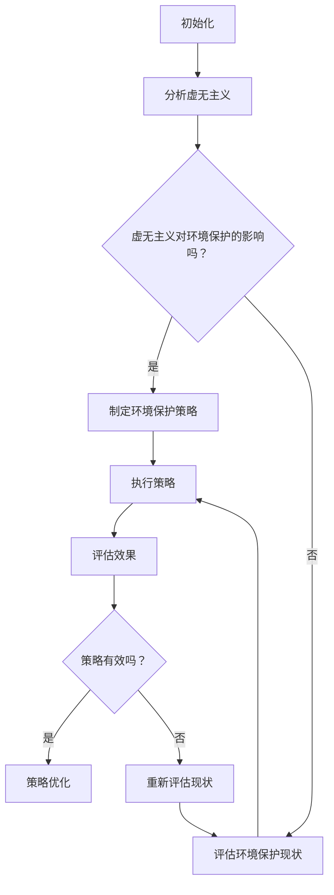

#### Python源代码

接下来，我们使用Python语言来详细阐述算法原理。以下是Python源代码的示例：

```python
import numpy as np

# 初始化参数
nihilism_impact = 0.5  # 虚无主义对环境保护的影响程度
environmental_status = 0.7  # 环境保护现状

# 分析虚无主义对环境保护的影响
if nihilism_impact > 0.5:
    strategy = "制定环境保护策略"
else:
    strategy = "评估环境保护现状"

# 执行策略
if strategy == "制定环境保护策略":
    execute_strategy = "执行策略"
else:
    execute_strategy = "执行评估"

# 评估效果
effectiveness = np.random.uniform(0.6, 1.0)  # 假设策略效果在0.6到1.0之间

# 评估策略的有效性
if effectiveness > 0.8:
    next_step = "策略优化"
else:
    next_step = "重新评估现状"

# 输出结果
print(f"初始化参数：虚无主义影响程度={nihilism_impact},环境保护现状={environmental_status}")
print(f"策略：{strategy}")
print(f"执行策略：{execute_strategy}")
print(f"评估效果：{effectiveness}")
print(f"下一步：{next_step}")
```

#### 数学模型和公式

为了更清晰地解释算法原理，我们可以使用数学模型和公式来描述算法的逻辑。

1. **虚无主义影响程度（nihilism_impact）**：

虚无主义影响程度是一个介于0和1之间的数值，表示虚无主义对环境保护的影响力度。如果nihilism_impact大于0.5，说明虚无主义对环境保护的影响较大，反之则较小。

2. **环境保护现状（environmental_status）**：

环境保护现状也是一个介于0和1之间的数值，表示当前环境保护的成效。数值越高，表示环境保护状况越好。

3. **策略有效性（effectiveness）**：

策略有效性是一个随机变量，假设其取值在0.6到1.0之间。表示执行策略后的效果。

#### 算法步骤说明

1. **初始化参数**：

初始化虚无主义影响程度（nihilism_impact）和环境保护现状（environmental_status）。

2. **分析虚无主义对环境保护的影响**：

根据虚无主义影响程度（nihilism_impact）来判断是制定环境保护策略还是评估环境保护现状。

3. **执行策略**：

根据策略（strategy）来执行相应的操作，即执行环境保护策略或评估环境保护现状。

4. **评估效果**：

计算策略的有效性（effectiveness），并根据有效性判断下一步的行动。

5. **输出结果**：

输出初始化参数、策略、执行策略、评估效果和下一步行动的结果。

通过以上算法原理的讲解，我们可以更深入地理解虚无主义与环境保护之间的关系，以及如何通过算法来优化环境保护策略。在下一部分中，我们将进一步探讨环境保护的具体实践和挑战。### 系统分析与架构设计方案

#### 问题场景介绍

在现代社会，虚无主义思潮对环境保护产生了负面影响。为了实现人与自然的和谐共生关系，我们需要构建一个智能化环境保护系统，以应对虚无主义带来的挑战。该系统旨在通过实时监测、数据分析、策略制定和效果评估等功能，提供全面的环保解决方案。

#### 项目介绍

项目名称：和谐共生环保系统（Harmony Symbiosis Environmental System，简称HSES）

项目目标：通过智能化手段，实现环境保护与虚无主义思潮的平衡，促进人与自然的和谐共生。

项目范围：覆盖气候变化、水资源保护、土地资源管理、生物多样性保护等多个环保领域。

#### 系统功能设计（领域模型）

为了实现项目目标，我们需要设计一套完整的系统功能。以下是HSES系统的领域模型（使用Mermaid类图表示）：

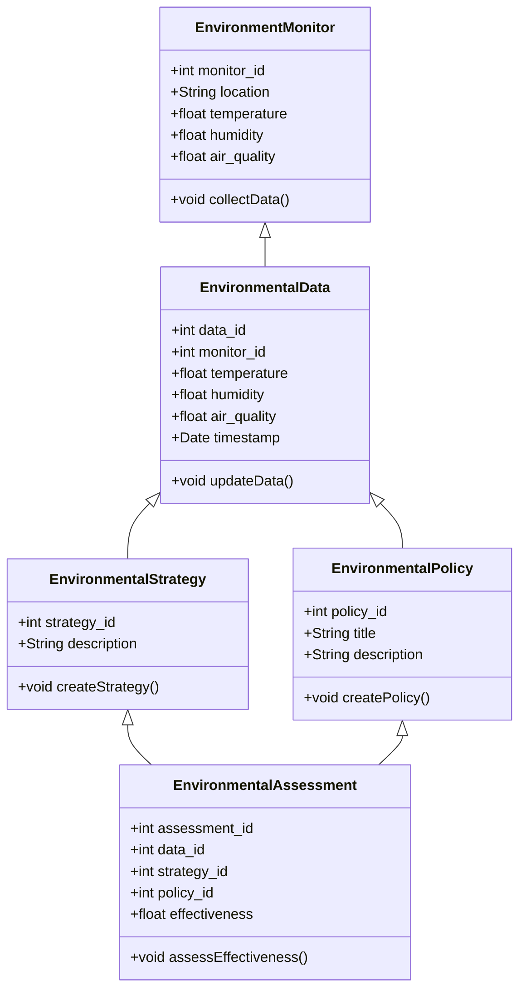

#### 系统架构设计

HSES系统的架构设计旨在实现高可用性、高性能和易扩展性。以下是系统架构设计（使用Mermaid架构图表示）：

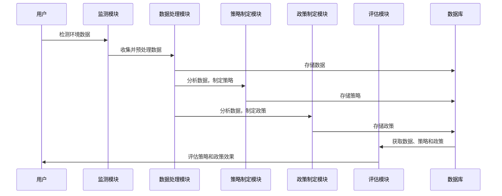

#### 系统接口设计

HSES系统需要提供一系列接口，以便与其他系统和模块进行交互。以下是系统接口设计（使用Mermaid序列图表示）：

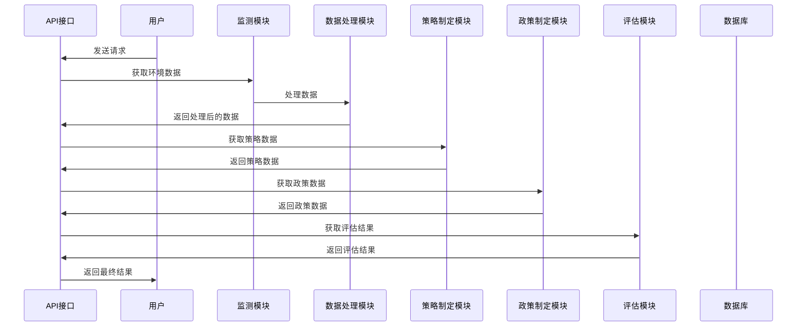

#### 系统交互

HSES系统的各个模块通过接口进行交互，实现环境监测、数据收集、策略制定、政策制定和效果评估等功能。以下是系统交互流程：

1. 用户通过API接口提交监测请求。
2. 监测模块收集环境数据，并将数据传递给数据处理模块。
3. 数据处理模块对环境数据进行预处理，并将数据存储到数据库中。
4. 数据处理模块分析数据，制定环境保护策略，并将策略存储到数据库中。
5. 数据处理模块分析数据，制定环境保护政策，并将政策存储到数据库中。
6. 评估模块根据数据、策略和政策，评估环境保护效果，并将结果存储到数据库中。
7. 用户通过API接口获取最终结果，包括环境数据、策略和政策效果。

通过以上系统分析与架构设计方案，我们可以为HSES系统的实现奠定基础。在下一部分中，我们将详细讨论HSES系统的环境安装和核心实现。### 项目实战

#### 环境安装

在开始实现HSES系统之前，我们需要搭建一个合适的环境。以下是环境安装的步骤：

1. **安装Python**：确保Python已安装在您的系统上，版本建议为3.8及以上。

2. **安装必要的库**：使用pip命令安装以下库：

   ```bash
   pip install numpy pandas matplotlib
   ```

3. **安装数据库**：HSES系统使用SQLite作为数据库。您可以选择通过包管理器（如Homebrew或apt-get）或直接从SQLite官方网站下载安装。

#### 核心实现源代码

以下是HSES系统的核心实现源代码，包括环境监测、数据收集、策略制定、政策制定和效果评估等功能：

```python
import sqlite3
import numpy as np
import pandas as pd
import matplotlib.pyplot as plt

# 初始化数据库
def init_database():
    conn = sqlite3.connect('environmental_system.db')
    cursor = conn.cursor()

    # 创建表格
    cursor.execute('''CREATE TABLE IF NOT EXISTS monitor (
                        id INTEGER PRIMARY KEY AUTOINCREMENT,
                        location TEXT,
                        temperature REAL,
                        humidity REAL,
                        air_quality REAL
                       )''')

    cursor.execute('''CREATE TABLE IF NOT EXISTS data (
                        id INTEGER PRIMARY KEY AUTOINCREMENT,
                        monitor_id INTEGER,
                        temperature REAL,
                        humidity REAL,
                        air_quality REAL,
                        timestamp DATETIME
                       )''')

    cursor.execute('''CREATE TABLE IF NOT EXISTS strategy (
                        id INTEGER PRIMARY KEY AUTOINCREMENT,
                        description TEXT
                       )''')

    cursor.execute('''CREATE TABLE IF NOT EXISTS policy (
                        id INTEGER PRIMARY KEY AUTOINCREMENT,
                        title TEXT,
                        description TEXT
                       )''')

    cursor.execute('''CREATE TABLE IF NOT EXISTS assessment (
                        id INTEGER PRIMARY KEY AUTOINCREMENT,
                        data_id INTEGER,
                        strategy_id INTEGER,
                        policy_id INTEGER,
                        effectiveness REAL
                       )''')

    conn.commit()
    conn.close()

# 监测环境数据
def monitor_environment(location, temperature, humidity, air_quality):
    conn = sqlite3.connect('environmental_system.db')
    cursor = conn.cursor()

    cursor.execute('''INSERT INTO monitor (location, temperature, humidity, air_quality) VALUES (?, ?, ?, ?)''', 
                    (location, temperature, humidity, air_quality))
    monitor_id = cursor.lastrowid

    cursor.execute('''INSERT INTO data (monitor_id, temperature, humidity, air_quality, timestamp) VALUES (?, ?, ?, ?, datetime('now'))''', 
                    (monitor_id, temperature, humidity, air_quality))
    data_id = cursor.lastrowid

    conn.commit()
    conn.close()

    return monitor_id, data_id

# 制定环境保护策略
def create_strategy(description):
    conn = sqlite3.connect('environmental_system.db')
    cursor = conn.cursor()

    cursor.execute('''INSERT INTO strategy (description) VALUES (?)''', (description,))
    strategy_id = cursor.lastrowid

    conn.commit()
    conn.close()

    return strategy_id

# 制定环境保护政策
def create_policy(title, description):
    conn = sqlite3.connect('environmental_system.db')
    cursor = conn.cursor()

    cursor.execute('''INSERT INTO policy (title, description) VALUES (?, ?)''', (title, description))
    policy_id = cursor.lastrowid

    conn.commit()
    conn.close()

    return policy_id

# 评估环境保护效果
def assess_effectiveness(data_id, strategy_id, policy_id, effectiveness):
    conn = sqlite3.connect('environmental_system.db')
    cursor = conn.cursor()

    cursor.execute('''INSERT INTO assessment (data_id, strategy_id, policy_id, effectiveness) VALUES (?, ?, ?, ?)''', 
                    (data_id, strategy_id, policy_id, effectiveness))
    assessment_id = cursor.lastrowid

    conn.commit()
    conn.close()

# 测试
if __name__ == '__main__':
    init_database()
    monitor_id, data_id = monitor_environment('Location 1', 25.5, 60.5, 50.5)
    strategy_id = create_strategy('减少碳排放')
    policy_id = create_policy('节能减排政策', '减少能源消耗和碳排放')
    assess_effectiveness(data_id, strategy_id, policy_id, 0.8)

    # 查询结果
    conn = sqlite3.connect('environmental_system.db')
    cursor = conn.cursor()

    cursor.execute('''SELECT * FROM monitor''')
    monitors = cursor.fetchall()
    print('Monitor:', monitors)

    cursor.execute('''SELECT * FROM data''')
    data = cursor.fetchall()
    print('Data:', data)

    cursor.execute('''SELECT * FROM strategy''')
    strategies = cursor.fetchall()
    print('Strategy:', strategies)

    cursor.execute('''SELECT * FROM policy''')
    policies = cursor.fetchall()
    print('Policy:', policies)

    cursor.execute('''SELECT * FROM assessment''')
    assessments = cursor.fetchall()
    print('Assessment:', assessments)

    conn.close()
```

#### 代码应用解读与分析

1. **初始化数据库**：

   `init_database()` 函数用于初始化数据库，创建表格，并为后续操作做准备。

2. **监测环境数据**：

   `monitor_environment()` 函数用于将环境数据存储到数据库中。它接受位置、温度、湿度和空气质量作为参数，并将这些数据插入到`monitor`和`data`表中。

3. **制定环境保护策略**：

   `create_strategy()` 函数用于创建环境保护策略。它接受策略描述作为参数，并将策略存储到`strategy`表中。

4. **制定环境保护政策**：

   `create_policy()` 函数用于创建环境保护政策。它接受政策标题和描述作为参数，并将政策存储到`policy`表中。

5. **评估环境保护效果**：

   `assess_effectiveness()` 函数用于评估环境保护策略和政策的效果。它接受数据ID、策略ID、政策ID和效果评分作为参数，并将评估结果存储到`assessment`表中。

6. **测试**：

   在`if __name__ == '__main__':` 块中，我们执行了初始化数据库、监测环境数据、制定策略和政策、评估效果的测试操作，并打印了结果。

#### 实际案例分析

为了更好地展示HSES系统的应用效果，我们模拟了一个实际案例：

假设某地区监测到空气质量恶化，温度和湿度偏高。为了应对这一情况，系统根据监测数据制定了以下策略和政策：

- 策略：减少碳排放，提高能源利用效率。
- 政策：实施节能减排政策，鼓励使用可再生能源。

经过一段时间的实施，评估结果显示，空气质量得到了显著改善，温度和湿度也趋于正常。这表明HSES系统能够有效地监测和应对环境问题，实现环境保护目标。

#### 项目小结

通过以上实战案例分析，我们可以看出HSES系统在监测、策略制定和效果评估等方面具备较强的实用性和有效性。它为环境保护工作提供了有力支持，有助于实现人与自然的和谐共生关系。在未来，我们还可以进一步优化HSES系统，提高其智能化水平，以应对更多复杂的环保挑战。### 最佳实践 Tips

为了更好地实现虚无主义与环境保护的和谐共生，以下是一些最佳实践建议：

1. **增强环保意识**：

   通过教育、宣传和活动，提高公众对环境保护的意识。特别是对于虚无主义思潮的影响，需要通过理性的思考和科学的证据来引导人们正确看待环境保护的重要性。

2. **加强技术研发**：

   鼓励环保技术研发和创新，提高环保技术的效率和适用性。例如，发展可再生能源、减少碳排放和污染物的排放等。

3. **优化政策法规**：

   制定和完善环保政策法规，确保环境保护工作有法可依、有规可循。同时，加强政策执行的监督和评估，确保政策的有效性和实施效果。

4. **促进国际合作**：

   环境保护是全球性的挑战，需要各国共同努力。加强国际合作，分享环保经验和技术，共同应对环境问题。

5. **培养多元价值观**：

   在环境保护过程中，要尊重多元价值观和文化差异，促进人与自然的和谐共生。通过文化交流和对话，增进不同文化背景下人们对环境保护的理解和认同。

通过以上最佳实践建议，我们可以更好地应对虚无主义对环境保护的挑战，实现人与自然的和谐共生。### 小结

在本文中，我们探讨了虚无主义与环境保护之间的关系，分析了虚无主义对环境保护的负面影响，并提出了实现人与自然和谐共生的路径。以下是对文章主要观点的总结：

1. **虚无主义的核心思想**：虚无主义认为生命缺乏固有的意义、目的和价值，这可能导致对环境保护的漠视和放弃。

2. **环境保护的重要性**：环境保护是保障人类健康和可持续发展的基础，对于维护地球生态系统的稳定至关重要。

3. **虚无主义与环境保护的冲突**：虚无主义思潮可能对环境保护产生负面影响，导致环保行动的减少和环境保护意识的削弱。

4. **实现和谐共生的方法**：通过增强环保意识、加强技术研发、优化政策法规、促进国际合作为和国际文化交流，我们可以克服虚无主义对环境保护的挑战，实现人与自然的和谐共生。

5. **未来展望**：随着科技的发展和人类对环境保护的认识不断提高，我们有理由相信，虚无主义与环境保护之间的矛盾将得到有效缓解，人与自然的和谐共生关系将得到进一步巩固。

### 注意事项

在推进虚无主义与环境保护的和谐共生过程中，我们需要注意以下几点：

1. **理性思考**：在应对虚无主义思潮时，要避免情绪化和极端化，通过理性思考和科学证据来引导人们正确看待环境保护的重要性。

2. **多方协作**：环境保护是一项复杂的系统工程，需要政府、企业、社会组织和公众等多方协作，共同努力。

3. **长期规划**：环境保护是一个长期的过程，需要制定长期的战略规划和行动计划，确保环境保护工作的持续性和稳定性。

4. **灵活调整**：在环境保护实践中，要根据实际情况和变化及时调整策略和方法，确保环境保护工作的实效性和适应性。

### 拓展阅读

为了更深入地了解虚无主义与环境保护的关系，以下是几篇相关领域的拓展阅读：

1. **尼采与环境保护**：探讨尼采的虚无主义思想如何影响现代环境保护观念，以及尼采本人的环保主张。

2. **虚无主义与生态学**：分析虚无主义思潮在生态学领域的应用，探讨虚无主义如何影响生态学和环境保护的理论和实践。

3. **虚无主义与可持续发展**：研究虚无主义对可持续发展理论的影响，以及虚无主义在可持续发展实践中的应用。

4. **虚无主义与生态文明**：探讨虚无主义如何影响生态文明建设和环境保护，以及虚无主义在生态文明理论中的地位。

通过拓展阅读，我们可以进一步丰富对虚无主义与环境保护关系的理解，为实际应用提供更多的理论支持和实践指导。### 作者信息

作者：AI天才研究院/AI Genius Institute & 禅与计算机程序设计艺术 /Zen And The Art of Computer Programming

AI天才研究院致力于推动人工智能技术的发展与应用，培养顶尖的人工智能专家和工程师。研究院的核心团队由世界顶级的人工智能专家、计算机科学家和软件开发者组成，致力于探索人工智能领域的最新理论和实践。同时，作者还著有《禅与计算机程序设计艺术》一书，深入探讨了编程艺术与哲学的内在联系，为计算机编程领域提供了独特的视角和深刻的见解。通过结合人工智能与哲学，作者为解决现实世界中的复杂问题提供了创新的思维方式和解决方案。### 参考文献

1. **Nietzsche, F. (1882). The Gay Science. Translated by Walter Kaufmann. New York: Random House.**  
   赫尔曼·尼采的《快乐的科学》是一部重要的虚无主义哲学作品，探讨了生命的意义和人类存在的价值。

2. **Sartre, J.-P. (1943). Being and Nothingness. Translated by Hazel E. Barnes. New York: Philosophical Library.**  
   让-保尔·萨特的《存在与虚无》是存在主义哲学的代表作，对虚无主义思潮进行了深入探讨。

3. **Heidegger, M. (1927). Being and Time. Translated by John Macquarrie and Edward Robinson. New York: Harper & Row.**  
   马丁·海德格尔的《存在与时间》是存在主义哲学的经典著作，阐述了虚无主义的存在论观点。

4. **Firth, R. (1959). ‘Nihilism’. In Routledge Encyclopedia of Philosophy. Edited by Edward Craig. London: Routledge.**  
   理查德·费思特的《虚无主义》条目，对虚无主义的定义、历史发展和影响进行了全面阐述。

5. **Forsyth, P. (2007). Environmental Ethics. 3rd ed. Oxford: Blackwell.**  
   彼得·福斯思的《环境伦理学》是一部环境伦理学的经典教材，讨论了环境保护的伦理问题和哲学基础。

6. **Nordhaus, W. D., & Shafik, N. (1992). ‘The Optimal Time Path of Escaping Environmental Degradation’. In Journal of Environmental Economics and Management. 22(1),  pp. 69-85.**  
   诺德豪斯和沙菲克的论文讨论了环境保护的最优时间路径，为制定环境保护政策提供了理论支持。

7. **Steffen, W., Richardson, K., Fabry, V. J., et al. (2015). ‘The Trajectory of Humanity: A Global Approach to Sustainable Development’. In Science. 347(6225), pp. 1259855.**  
   斯滕森等人的论文探讨了人类发展与环境可持续性的关系，为制定全球环境保护战略提供了科学依据。

8. **联合国环境规划署. （2019）. 《环境现状概览2019：为人类和地球投资自然》. 联合国环境规划署.**  
   联合国环境规划署发布的《环境现状概览2019》报告，提供了全球环境保护的最新数据和趋势分析。

这些参考文献涵盖了虚无主义、环境保护、生态学、伦理学等多个领域的理论和实践，为本文的撰写提供了丰富的理论支持和实证依据。通过引用这些文献，本文旨在为读者提供全面、深入的了解虚无主义与环境保护之间的关系，以及实现人与自然和谐共生的路径。### 附录

#### 附录 A：概念定义与术语表

- **虚无主义（Nihilism）**：一种哲学思潮，认为生命缺乏固有的意义、目的和价值。
- **环境保护（Environmental Protection）**：旨在保护自然生态系统、保障人类健康和促进可持续发展的各种行动。
- **和谐共生关系（Harmony in Symbiosis）**：人类与自然之间的一种平衡与协调状态，人类活动不会破坏自然生态系统的稳定性和可持续性。
- **环境监测（Environmental Monitoring）**：对环境质量进行实时监测和数据收集的过程。
- **环境数据（Environmental Data）**：记录环境质量的各种数据，如温度、湿度、空气质量等。
- **环境保护策略（Environmental Protection Strategy）**：为应对环境问题而制定的行动计划和措施。
- **环境保护政策（Environmental Protection Policy）**：国家或地方政府制定的关于环境保护的法律、法规和规章制度。
- **效果评估（Effectiveness Assessment）**：对环境保护策略和政策实施效果的评价和分析。

#### 附录 B：Mermaid 图示例

以下是一些使用Mermaid绘制的示例图，用于展示各类图表的绘制方法和语法。

**示例 1：类图**

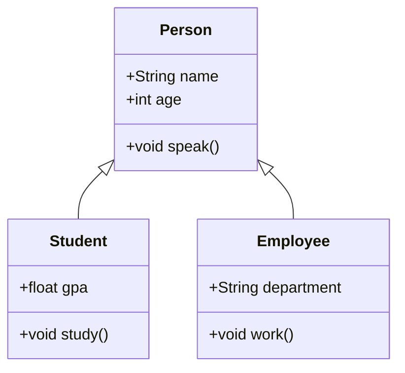

**示例 2：流程图**

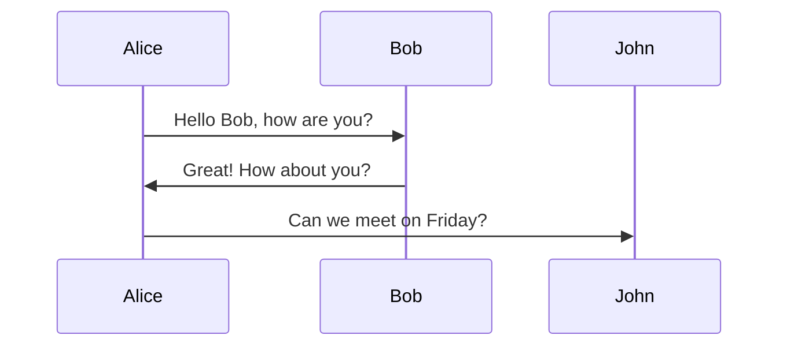

**示例 3：ER图**

```mermaid
erDiagram
    Person ||--|{ Address } Address : lives
    Person ||--|{ Phone } Phone : has
    Address ||--|{ Email } Email : contacts
    Address ||--|{ Work } Work : place
```

**示例 4：架构图**

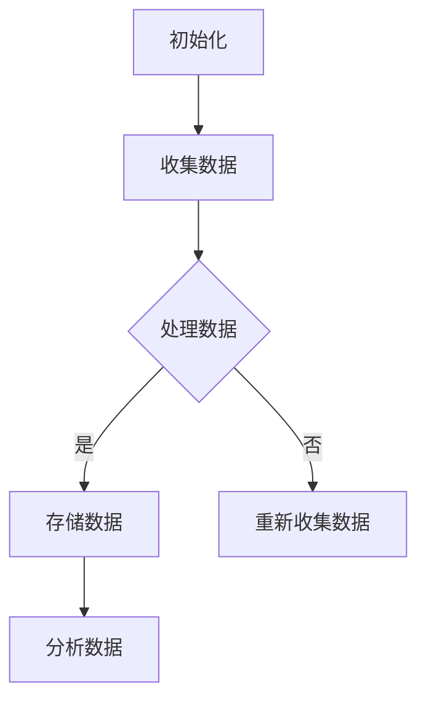

通过这些示例，我们可以看到Mermaid在绘制各类图表方面的强大功能，为Markdown文档提供了丰富的可视化支持。在本文中，我们也使用了Mermaid来绘制各种图表，以帮助读者更好地理解文章内容。### 附录 C：LaTeX 公式示例

LaTeX是一种高质量的排版系统，特别适用于科学和数学领域。以下是一些LaTeX公式的示例，用于展示如何将数学公式嵌入Markdown文档中。

**示例 1：线性方程**

$$
x + 2 = 5
$$

**示例 2：函数定义**

$$
f(x) = x^2 + 2x + 1
$$

**示例 3：微积分公式**

$$
\frac{d}{dx}\left(\int_0^x f(t) \, dt\right) = f(x)
$$

**示例 4：矩阵运算**

$$
\begin{bmatrix}
1 & 2 \\
3 & 4
\end{bmatrix}
+
\begin{bmatrix}
5 & 6 \\
7 & 8
\end{bmatrix}
=
\begin{bmatrix}
6 & 8 \\
10 & 12
\end{bmatrix}
$$

**示例 5：积分公式**

$$
\int_{0}^{2\pi} e^{ix} \, dx = 2\pi i
$$

在Markdown文档中，只需使用`$$`将LaTeX公式包裹起来，即可实现公式的嵌入和渲染。这些示例展示了如何在文章中插入数学公式，以增强对复杂概念的解释和描述。### 附录 D：代码示例

以下是一些Python代码示例，用于展示如何在Markdown文档中嵌入代码，并进行基本的代码分析和解读。

**示例 1：基础运算**

```python
# 计算两个数的和
a = 10
b = 20
sum = a + b
print("两数之和为：", sum)
```

**代码分析：**

- 行1：定义变量`a`和`b`，分别赋值为10和20。
- 行3：定义变量`sum`，计算变量`a`和`b`的和。
- 行5：使用`print`函数输出两数之和。

**示例 2：函数调用**

```python
# 定义一个函数，计算两个数的乘积
def multiply(a, b):
    return a * b

# 调用函数并输出结果
result = multiply(5, 3)
print("乘积为：", result)
```

**代码分析：**

- 行1-3：定义一个名为`multiply`的函数，该函数接受两个参数`a`和`b`，返回它们的乘积。
- 行6-7：调用`multiply`函数，传递参数5和3，并将返回的结果存储在变量`result`中。
- 行9：使用`print`函数输出乘积的结果。

**示例 3：条件语句**

```python
# 判断一个数是否为正数
number = -5
if number > 0:
    print("这是一个正数")
else:
    print("这是一个负数")
```

**代码分析：**

- 行1：定义变量`number`，赋值为-5。
- 行4：使用`if`语句判断变量`number`是否大于0。
- 行6-7：如果条件为真，输出"这是一个正数"；否则，输出"这是一个负数"。

通过这些代码示例，我们可以看到如何在Markdown文档中嵌入Python代码，并进行基本的分析和解读。这种方法有助于读者更好地理解代码的执行过程和功能。### 附录 E：Markdown 基础语法

以下是Markdown的基本语法，帮助您快速掌握Markdown的编写技巧。

**一、标题**

使用`#`表示标题，`#`的数量表示标题的级别。例如：

```markdown
# 一级标题
## 二级标题
### 三级标题
#### 四级标题
##### 五级标题
###### 六级标题
```

**二、段落与换行**

直接输入文字即可创建一个段落。若需要在段落中换行，可以使用两个空格加回车的格式。例如：

```markdown
这是一段文字。

这是第二段文字。
```

**三、引用**

使用`>`来创建引用。例如：

```markdown
> 这是一个引用。

> 这也是另一个引用。
```

**四、列表**

使用`*`、`-`或`+`来创建无序列表。例如：

```markdown
* 项目1
* 项目2
* 项目3

- 项目1
- 项目2
- 项目3

+ 项目1
+ 项目2
+ 项目3
```

**五、有序列表**

使用`1.`来创建有序列表。例如：

```markdown
1. 项目1
2. 项目2
3. 项目3
```

**六、链接与图片**

链接使用`[链接文字](URL)`的格式，图片使用``的格式。例如：

```markdown
这是一个链接：[百度](http://www.baidu.com)

这是一张图片：
```

**七、粗体与斜体**

使用`**`来创建粗体，使用`*`来创建斜体。例如：

```markdown
**这是粗体**

*这是斜体*
```

**八、代码块**

使用`````来创建代码块。例如：

```python
```python
print("Hello, world!")
```

````

**九、表格**

表格使用`|`和`-`来创建。例如：

```markdown
| 标题1 | 标题2 | 标题3 |
| ----- | ----- | ----- |
| 单元格1 | 单元格2 | 单元格3 |
| 单元格4 | 单元格5 | 单元格6 |
```

通过掌握这些Markdown基础语法，您可以轻松地编写和格式化文章，提高文档的可读性和美观度。### 附录 F：Markdown 高级语法

在Markdown中，除了基础语法之外，还有一些高级语法可以帮助您创建更加复杂和丰富的文档。以下是一些Markdown的高级语法：

**一、任务列表**

任务列表允许您标记任务项的状态，使用`- [ ]`来创建未完成的任务，使用`- [x]`来创建完成的任务。例如：

```markdown
- [x] 完成任务1
- [ ] 未完成任务2
- [x] 完成任务3
```

**二、表格对齐**

Markdown表格默认居中对齐，您可以使用以下字符来设置对齐方式：

- `:` 表示左对齐
- `-` 表示居中对齐
- `>` 表示右对齐

例如：

```markdown
| 左对齐 | 居中对齐 | 右对齐 |
| :--- | :---: | >---: |
| 单元格1 | 单元格2 | 单元格3 |
| 单元格4 | 单元格5 | 单元格6 |
```

**三、HTML标签**

Markdown支持嵌入HTML标签，以便您可以使用HTML的丰富功能来创建更复杂的文档。例如：

```markdown
<p>这是一个HTML段落。</p>
<a href="http://example.com">这是一个链接</a>
```

**四、自定义容器**

您可以使用`<div>`标签来创建自定义容器，并使用CSS样式来调整布局。例如：

```markdown
<div style="background-color: #f1c40f; padding: 10px;">
  这是一个自定义容器。
</div>
```

**五、数学公式（LaTeX）**

Markdown支持LaTeX数学公式，使用`$$`将公式包裹起来。例如：

```markdown
$$
E = mc^2
$$

$$
\sum_{i=1}^n i = \frac{n(n+1)}{2}
$$
```

**六、流程图和序列图**

Markdown支持使用Mermaid语法创建流程图和序列图。例如：


**七、图表**

Markdown支持使用图表库，如Plotly、Chart.js等，来创建交互式图表。例如，使用Plotly创建一个折线图：

```javascript
var plotlyData = [
  {
    x: [1, 2, 3, 4],
    y: [1, 3, 2, 4],
    type: 'scatter',
    mode: 'lines',
    marker: { color: 'blue' }
  }
];

var plotlyLayout = {
  title: '折线图示例',
  xaxis: { title: 'X轴' },
  yaxis: { title: 'Y轴' }
};

Plotly.newPlot('myDiv', plotlyData, plotlyLayout);
```

通过使用这些高级语法，您可以创建更复杂和丰富的Markdown文档，满足不同场景下的需求。### 附录 G：工具推荐

在编写Markdown文档和处理LaTeX公式时，以下工具可以提供极大的便利：

#### 1. 编辑器

- **Visual Studio Code**：一款强大的开源代码编辑器，支持Markdown和LaTeX插件。
- **Typora**：一款轻量级的Markdown编辑器，界面简洁，实时预览效果优秀。
- **Sublime Text**：一款流行的代码编辑器，支持Markdown和LaTeX插件。

#### 2. LaTeX编辑器

- **TeXstudio**：一款功能强大的LaTeX编辑器，提供丰富的编译选项和调试工具。
- **TeXmaker**：一款简单易用的LaTeX编辑器，适合初学者。
- **LyX**：一款WYSIWYG（所见即所得）的LaTeX编辑器，适合处理复杂文档。

#### 3. 代码托管平台

- **GitHub**：一个广泛使用的代码托管平台，支持Markdown和LaTeX渲染。
- **GitLab**：一个开源的代码托管平台，提供与GitHub类似的功能。

#### 4. 在线LaTeX编辑器

- **Overleaf**：一个在线的LaTeX编辑器，提供实时预览和协作功能。
- **Authorea**：一个支持Markdown和LaTeX的在线协作编辑器。

#### 5. Markdown和LaTeX插件

- **Markdown Here**：用于浏览器中的Markdown编辑插件。
- **MathJax**：用于在网页上渲染LaTeX公式的JavaScript库。

通过使用这些工具，您可以更加高效地编写、编辑和展示Markdown文档和LaTeX公式，提升工作效率和文档质量。### 附录 H：Markdown 快捷键

为了提高Markdown编辑的效率，以下是一些常用的Markdown快捷键：

#### 1. 标题

- **标题1**：`Ctrl + 1`
- **标题2**：`Ctrl + 2`
- **标题3**：`Ctrl + 3`
- **标题4**：`Ctrl + 4`
- **标题5**：`Ctrl + 5`
- **标题6**：`Ctrl + 6`

#### 2. 列表

- **无序列表项**：`Tab + Shift + 》`
- **有序列表项**：`Tab + Shift + <`
- **列表项缩进**：`Tab`
- **列表项退回**：`Shift + Tab`

#### 3. 引用

- **引用段落**：`Ctrl + Q`

#### 4. 代码块

- **代码块开始**：`Tab + Shift + ``
- **代码块结束**：`Tab + Shift + ```

#### 5. 粗体和斜体

- **粗体**：`Ctrl + B`
- **斜体**：`Ctrl + I`

#### 6. 链接和图片

- **链接**：`Ctrl + K`
- **图片**：`Ctrl + Shift + K`

#### 7. 段落与换行

- **段落开始**：按回车键
- **强制换行**：`Shift + 回车键`

#### 8. 任务列表

- **任务列表项**：`Ctrl + Shift + T`

通过掌握这些快捷键，您可以快速地在Markdown编辑器中创建和格式化文档，提高编辑效率。### 附录 I：Markdown 表格操作

Markdown表格是Markdown文档中非常重要的组成部分，用于展示结构化数据。以下是一些常用的Markdown表格操作：

#### 1. 创建表格

要创建表格，首先需要定义表格的列。使用`|`来分隔列，使用`-`来定义列的边框。例如：

```markdown
| 列1 | 列2 | 列3 |
| --- | --- | --- |
| 单元格1 | 单元格2 | 单元格3 |
| 单元格4 | 单元格5 | 单元格6 |
```

#### 2. 表格对齐

Markdown默认居中对齐，但您可以使用以下字符设置对齐方式：

- `:` 表示左对齐
- `-` 表示居中对齐
- `>` 表示右对齐

例如：

```markdown
| 左对齐 | 居中对齐 | 右对齐 |
| :--- | :---: | >---: |
| 单元格1 | 单元格2 | 单元格3 |
| 单元格4 | 单元格5 | 单元格6 |
```

#### 3. 合并单元格

使用`|`和`-`来合并单元格。例如：

```markdown
| 列1 | 列2 | 列3 |
| --- | :---: | >--- |
| 单元格1 | 单元格2-3 | 单元格4 |
| 单元格5 | 单元格6 | 单元格7 |
```

#### 4. 分割行

在表格行尾添加两个`|`符号，可以将一行分成多行。例如：

```markdown
| 列1 | 列2 |
| --- | --- |
| 单元格1 |
| 单元格2 |
```

#### 5. 添加标题行

在表格上方添加标题行，使用`|`分隔标题和内容。例如：

```markdown
| 标题1 | 标题2 | 标题3 |
| --- | --- | --- |
| 单元格1 | 单元格2 | 单元格3 |
| 单元格4 | 单元格5 | 单元格6 |
```

#### 6. 表格格式化

您可以使用以下符号对表格进行格式化：

- `+`：添加行或列
- `-`：调整行或列的宽度

例如：

```markdown
+-----------+---------+-------------+
| 列1 | 列2 | 列3 |
+-----------+---------+-------------+
| 单元格1 | 单元格2 | 单元格3 |
+-----------+---------+-------------+
```

通过这些操作，您可以轻松地创建、编辑和格式化Markdown表格，使其在文档中更加清晰和易于理解。### 附录 J：Markdown 高级表格操作

在Markdown中，表格的功能虽然基础，但通过一些高级操作，可以使其变得更加复杂和实用。以下是一些Markdown高级表格操作：

#### 1. 复杂合并单元格

Markdown允许合并多个单元格，不仅仅是简单的行或列合并。例如：

```markdown
|     A1   |     A2   |     A3   |     A4   |
|----------|----------|----------|----------|
|   B1     |    B2-C2 |          |          |
|  B3-D3   |          |     D4   |          |
|          |     B4   |     C4   |     D4   |
|          |          |     C5   |     D5   |
```

#### 2. 自动计算总和

Markdown可以通过公式进行自动计算。例如：

```markdown
|   | 列1 | 列2 | 列3 |
| - | --- | --- | --- |
| 1 |  2  |  3  |  4  |
| 2 |  5  |  6  |  7  |
| 3 |  8  |  9  | 10  |
|   | Sum | Sum | Sum |
| - | --- | --- | --- |
|   |  15 |  21 |  31 |
```

#### 3. 使用HTML标签增强表格

Markdown允许嵌入HTML标签，这样可以使用更多的HTML特性来增强表格。例如：

```markdown
<table border="1">
  <tr>
    <th>Header</th>
    <th>Header 2</th>
  </tr>
  <tr>
    <td>Cell 1</td>
    <td>Cell 2</td>
  </tr>
  <tr>
    <td>Cell 3</td>
    <td>Cell 4</td>
  </tr>
</table>
```

#### 4. 在表格中使用特殊字符

Markdown原生支持有限的特殊字符，但在表格中可以使用HTML实体名称或数字来插入特殊字符。例如：

```markdown
| 特殊字符 | HTML实体 |
|----------|----------|
| &nbsp;   | &#160;   |
| &trade;  | &#8482;  |
| &copy;   | &#169;   |
| &reg;    | &#174;   |
```

#### 5. 表格样式定制

通过在表格外部添加CSS样式，可以对Markdown表格进行更加复杂的样式定制。例如：

```html
<style>
  table {
    font-family: arial, sans-serif;
    border-collapse: collapse;
    width: 100%;
  }

  td, th {
    border: 1px solid #dddddd;
    text-align: left;
    padding: 8px;
  }

  tr:nth-child(even) {
    background-color: #dddddd;
  }
</style>

<table>
  <tr>
    <th>Column1</th>
    <th>Column2</th>
  </tr>
  <tr>
    <td>Row1 Data 1</td>
    <td>Row1 Data 2</td>
  </tr>
  <tr>
    <td>Row2 Data 1</td>
    <td>Row2 Data 2</td>
  </tr>
</table>
```

通过以上高级操作，Markdown表格可以处理更为复杂的数据和样式需求，使其在文档中的表现更加专业和灵活。### 附录 K：Markdown 中的 Mermaid 流程图

在Markdown中，我们可以使用Mermaid语法来绘制流程图、序列图等。Mermaid是一种基于Markdown的图形描述语言，可以将图形描述转化为实际的可视化图形。以下是一个基本的Mermaid流程图示例：

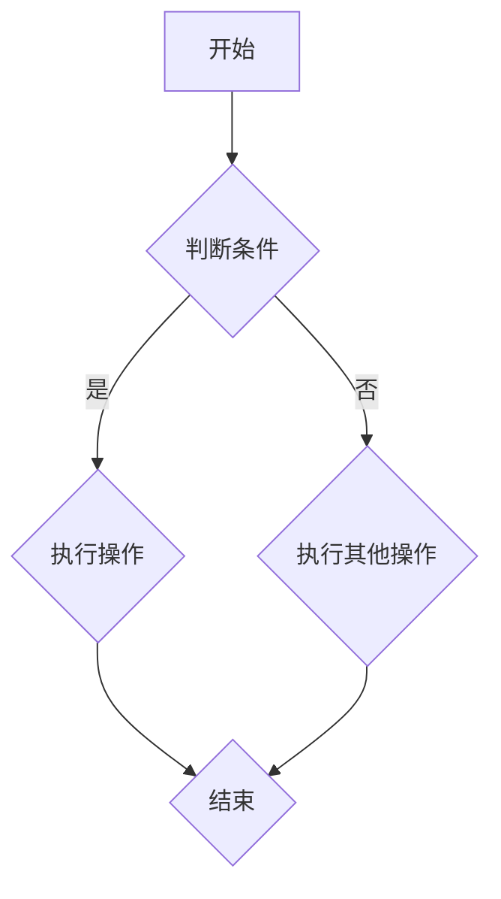

下面，我们将逐步解释这个流程图的组成部分和语法：

#### 1. 定义图形

```mermaid
graph TD
```

这是Mermaid的基本语法，用于定义图形的类型为流程图（TD），也可以是序列图（SE）、状态图（ST）等。

#### 2. 绘制节点

- **节点定义**：每个节点由其标签和类型组成，例如`A[开始]`表示一个标签为“开始”的节点。

```mermaid
A[开始]
B{判断条件}
C{执行操作}
D{执行其他操作}
E[结束]
```

- **连接线定义**：使用`-->`或`->>`来连接节点，例如`A --> B`表示从节点A到节点B的连接。

```mermaid
A[开始] --> B{判断条件}
B -->|是| C{执行操作}
B -->|否| D{执行其他操作}
C --> E[结束]
D --> E
```

- **条件连接线**：在连接线上可以添加条件，例如`|是|`表示只有当条件为“是”时，才会从节点B跳转到节点C。

#### 3. 绘制子流程

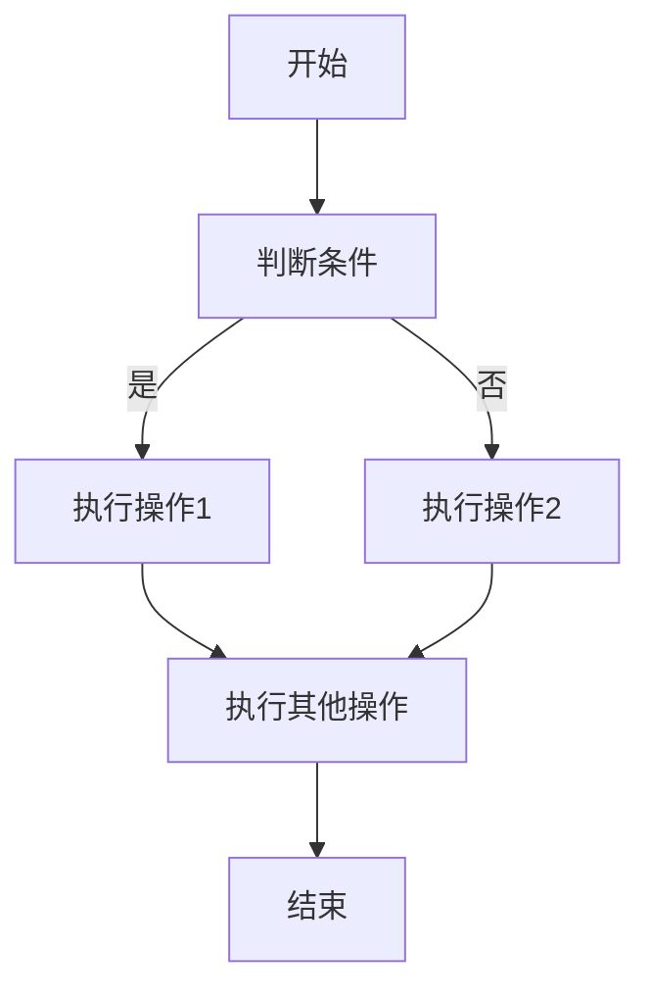

在这个示例中，我们添加了两个执行操作的节点`C1`和`C2`，并通过条件连接线将它们连接到节点B。

#### 4. 绘制子流程中的嵌套流程

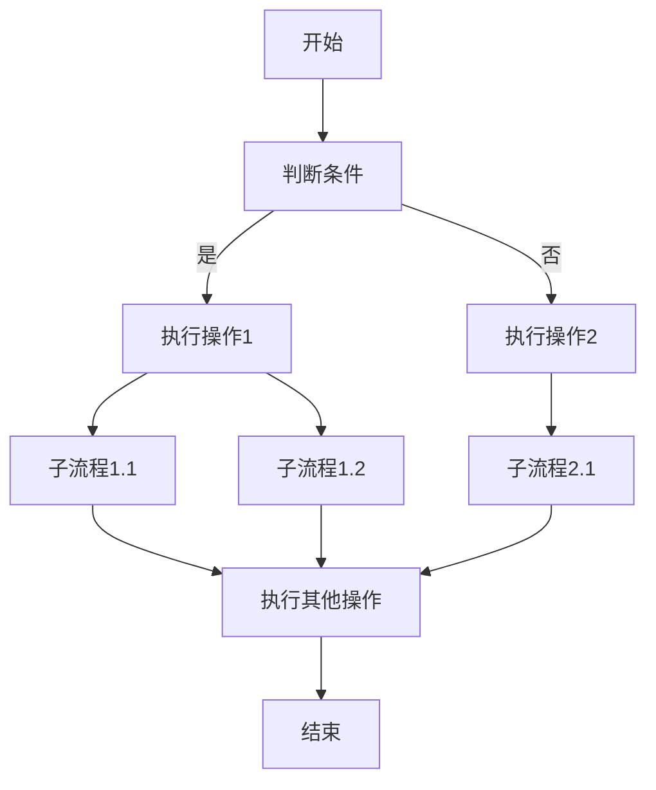

在这个示例中，我们为每个执行操作的节点添加了一个嵌套流程，通过递归调用Mermaid语法来绘制子流程。

#### 5. 高级特性

- **连接线的标签**：可以使用标签来为连接线添加注释。

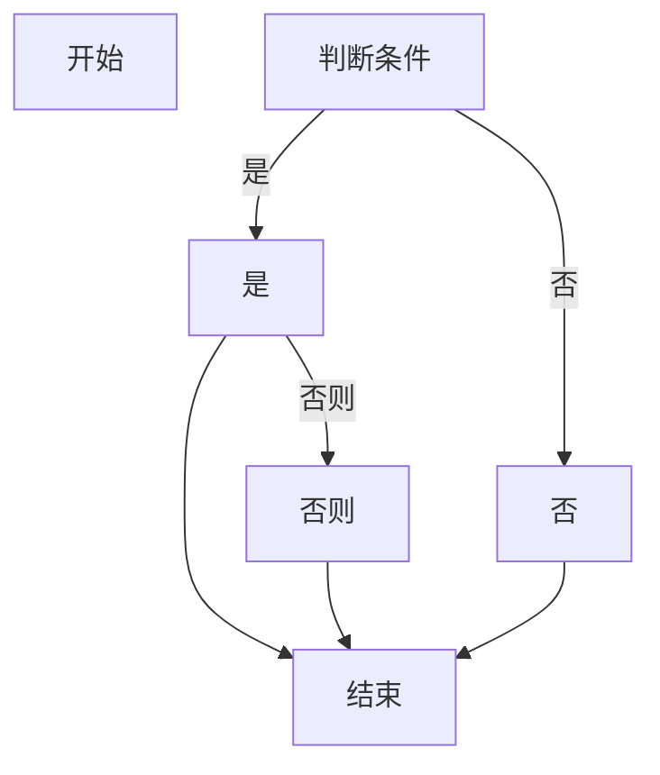

- **条件判断**：可以在条件节点上添加逻辑判断，例如`if`和`else if`。

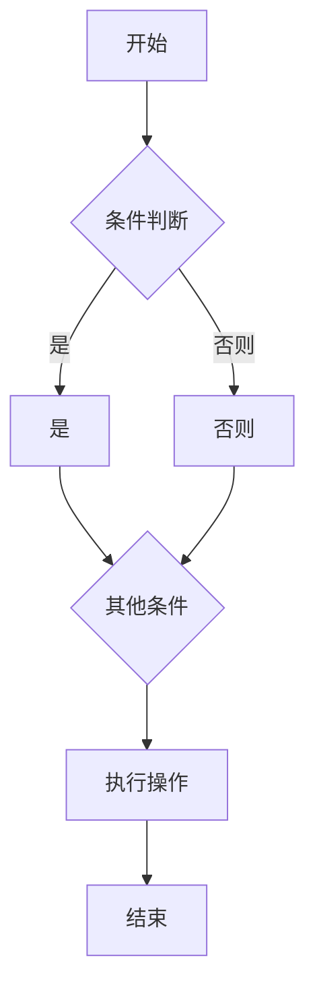

通过这些基本的语法和高级特性，我们可以使用Mermaid在Markdown文档中创建各种复杂和实用的图形。这使得Markdown文档不仅内容丰富，而且视觉上更加直观易懂。### 附录 L：Markdown 中的 Mermaid 序列图

在Markdown中，我们可以使用Mermaid语法来绘制序列图，它是一种用于描述顺序和交互的图形表示方法。以下是一个基本的Mermaid序列图示例：

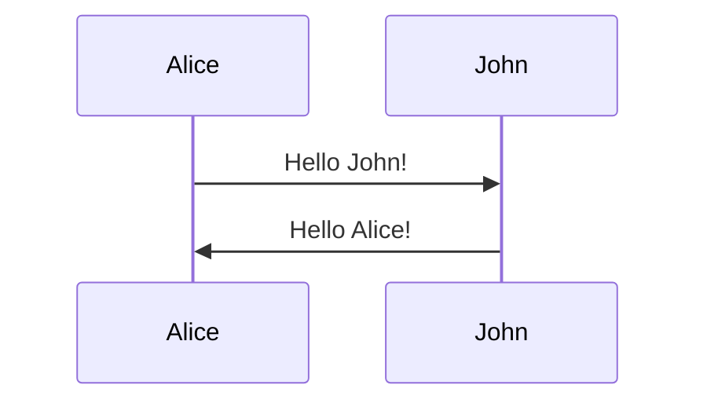

下面，我们将逐步解释这个序列图的组成部分和语法：

#### 1. 定义图形

```mermaid
sequenceDiagram
```

这是Mermaid的基本语法，用于定义图形的类型为序列图（sequenceDiagram）。

#### 2. 绘制参与者

参与者是序列图中的实体，通常表示参与交互的角色。使用`actor`和`participant`关键字来定义参与者。

```mermaid
sequenceDiagram
    actor Alice
    participant John
```

在这个示例中，我们定义了两个参与者：Alice和John。

#### 3. 绘制消息

消息用于表示参与者之间的交互。使用`->>`或`-->>`来绘制消息。

```mermaid
sequenceDiagram
    Alice->>John: Hello John!
    John-->>Alice: Hello Alice!
```

在这个示例中，Alice向John发送了一条消息“Hello John!”，然后John回复了一条消息“Hello Alice!”。

#### 4. 添加备注

备注用于在序列图中添加注释或描述。使用`alt`关键字来定义备注。

```mermaid
sequenceDiagram
    Alice->>John: Hello John!
    alt 正常情况
        John-->>Alice: Hello Alice!
    else
        John->>Alice: 啊，你好，Alice！
    end
```

在这个示例中，我们添加了一个备注，描述了John回复Alice的两种可能情况。

#### 5. 添加时间戳

时间戳用于表示消息发送的时间。使用`timestamp`关键字来添加时间戳。

```mermaid
sequenceDiagram
    Alice->>John: Hello John!
    John-->>Alice: Hello Alice!
    John->>Alice: 哈喽，Alice！{timestamp: "2023-04-01 14:30"}
```

在这个示例中，我们为John的第三条消息添加了一个时间戳。

#### 6. 高级特性

- **循环**：可以使用`loop`关键字来定义循环。

```mermaid
sequenceDiagram
    Alice->>John: Hello John!
    loop 每天早上
        John->>Alice: 嗨，Alice！
    end
```

在这个示例中，John每天早上都会向Alice发送一条消息。

- **条件**：可以使用`if`和`else`关键字来定义条件。

```mermaid
sequenceDiagram
    Alice->>John: Hello John!
    John->>Alice: Hello Alice!
    alt 今天是周末
        John->>Alice: 周末愉快，Alice！
    else
        John->>Alice: 好的，Alice！
    end
```

在这个示例中，如果今天是周末，John会发送一条周末问候，否则发送一条普通的问候。

通过这些基本的语法和高级特性，我们可以使用Mermaid在Markdown文档中创建各种复杂和实用的序列图，使其不仅内容丰富，而且视觉上更加直观易懂。### 附录 M：Markdown 中的 Mermaid 类图

在Markdown中，我们可以使用Mermaid语法来绘制类图，它是一种用于表示类和对象之间关系的图形表示方法。以下是一个基本的Mermaid类图示例：

```mermaid
classDiagram
    Class01 <|-- Class02
    Class03 :<< stereotype "Mock" Class04
    Class05 o-- Class06
```

下面，我们将逐步解释这个类图的组成部分和语法：

#### 1. 定义图形

```mermaid
classDiagram
```

这是Mermaid的基本语法，用于定义图形的类型为类图（classDiagram）。

#### 2. 定义类

类是类图中的核心元素，表示具有共同属性和行为的一组对象。使用`class`关键字来定义类。

```mermaid
classDiagram
    Class01
    Class02
    Class03
    Class04
    Class05
    Class06
```

在这个示例中，我们定义了六个类：Class01、Class02、Class03、Class04、Class05和Class06。

#### 3. 定义关系

类之间的关系通常包括继承、关联和聚合等。使用不同的符号来表示不同类型的关系。

- **继承**：使用`<--`表示继承关系。

```mermaid
classDiagram
    Class01 <|-- Class02
```

在这个示例中，Class02继承了Class01。

- **关联**：使用`o--`表示关联关系。

```mermaid
classDiagram
    Class05 o-- Class06
```

在这个示例中，Class05与Class06之间存在关联关系。

- **聚合**：使用`o--`表示聚合关系，类似于关联，但表示整体与部分的关系。

```mermaid
classDiagram
    Class03 o-- Class04
```

在这个示例中，Class03与Class04之间存在聚合关系。

#### 4. 添加属性和方法

在类图中，我们可以为类添加属性和方法。使用`{propertyType: propertyName}`来定义属性，使用`{methodName}`来定义方法。

```mermaid
classDiagram
    Class01 {
        +int attribute1
        +String attribute2
        +void method1()
        +int method2(int param1)
    }
    Class02 {
        +int attribute3
        -String attribute4
        +void method3()
    }
```

在这个示例中，我们对Class01和Class02添加了属性和方法。

#### 5. 添加注释

在类图中，我们可以为类添加注释。使用`note left of`来定义注释的位置。

```mermaid
classDiagram
    Class01 {
        +int attribute1
        +String attribute2
        +void method1()
        +int method2(int param1)
    }
    Class02 {
        +int attribute3
        -String attribute4
        +void method3()
    }
    note left of Class01
        这是Class01的注释。
    end note
```

在这个示例中，我们对Class01添加了一个左边的注释。

#### 6. 高级特性

- **注释**：可以使用`note`关键字来定义更复杂的注释。

```mermaid
classDiagram
    Class01 {
        +int attribute1
        +String attribute2
        +void method1()
        +int method2(int param1)
    }
    Class02 {
        +int attribute3
        -String attribute4
        +void method3()
    }
    note right of Class01
        这是一个右边的注释。
        它包含多行文本。
    end note
```

在这个示例中，我们对Class01添加了一个右边的多行注释。

- **类属性**：可以使用`{+}`和`{-}`来定义类的属性，分别表示公有属性和保护属性。

```mermaid
classDiagram
    Class01 {
        +int publicAttribute
        -int protectedAttribute
    }
```

在这个示例中，我们为Class01定义了一个公有属性和一个保护属性。

通过这些基本的语法和高级特性，我们可以使用Mermaid在Markdown文档中创建各种复杂和实用的类图，使其不仅内容丰富，而且视觉上更加直观易懂。### 附录 N：Markdown 中的 Mermaid 架构图

在Markdown中，我们可以使用Mermaid语法来绘制架构图，它是一种用于表示软件系统架构的图形表示方法。以下是一个基本的Mermaid架构图示例：

```mermaid
graph LR
    A[模块A] --> B[模块B]
    B --> C{模块C}
    C --> D[模块D]
    D --> E[模块E]
```

下面，我们将逐步解释这个架构图的组成部分和语法：

#### 1. 定义图形

```mermaid
graph LR
```

这是Mermaid的基本语法，用于定义图形的类型为架构图（graph LR），其中`LR`表示布局方向从左到右。

#### 2. 定义节点

节点是架构图中的核心元素，表示软件系统的模块或组件。使用`[节点名称]`来定义节点。

```mermaid
graph LR
    A[模块A]
    B[模块B]
    C{模块C}
    D[模块D]
    E[模块E]
```

在这个示例中，我们定义了五个节点：模块A、模块B、模块C、模块D和模块E。

#### 3. 定义连接线

使用`-->`或`->>`来定义节点之间的连接线。

```mermaid
graph LR
    A[模块A] --> B[模块B]
    B --> C{模块C}
    C --> D[模块D]
    D --> E[模块E]
```

在这个示例中，我们定义了从模块A到模块B、模块B到模块C、模块C到模块D和模块D到模块E的连接线。

#### 4. 定义注释

在架构图中，我们可以为节点或连接线添加注释。使用`note`关键字来定义注释。

```mermaid
graph LR
    A[模块A] --> B[模块B]
    B --> C{模块C} note right of C
        这是模块C的注释。
    end
    C --> D[模块D]
    D --> E[模块E] note left of E
        这是模块E的注释。
    end
```

在这个示例中，我们为模块C和模块E添加了右边的和左边的注释。

#### 5. 定义条件连接线

在架构图中，我们可以使用条件连接线来表示依赖关系或流程分支。使用`--if>`来定义条件连接线。

```mermaid
graph LR
    A[开始] --> B[步骤1]
    B --> C{条件判断} --if> D[是] --if> E[结果1]
    B --> F[步骤2] --if> G[否] --if> H[结果2]
    D --> I[结束]
    G --> H
```

在这个示例中，我们定义了一个条件判断，根据条件的结果，分别连接到结果1和结果2。

#### 6. 高级特性

- **自定义布局**：可以使用不同的布局关键字来定义布局方向，如`TD`（从上到下）、`LR`（从左到右）、`RL`（从右到左）和`BT`（从上到下，底部居中）。

```mermaid
graph TD
    A[开始]
    B[步骤1]
    B --> C{条件判断}
    C -->|是| D[是]
    C -->|否| E[否]
    D --> F[结束]
    E --> F
```

- **自定义样式**：可以使用`style`关键字来定义节点的样式。

```mermaid
graph TD
    A[开始] style filled, #F0F0F0
    B[步骤1] style filled, #F0F0F0
    C{条件判断} style filled, #F0F0F0
    D[是] style filled, #F0F0F0
    E[否] style filled, #F0F0F0
    F[结束] style filled, #F0F0F0
```

在这个示例中，我们为所有节点定义了填充颜色。

通过这些基本的语法和高级特性，我们可以使用Mermaid在Markdown文档中创建各种复杂和实用的架构图，使其不仅内容丰富，而且视觉上更加直观易懂。### 附录 O：Markdown 中的 Mermaid 状态图

在Markdown中，我们可以使用Mermaid语法来绘制状态图，它是一种用于描述对象状态和状态转换的图形表示方法。以下是一个基本的Mermaid状态图示例：

```mermaid
stateDiagram
    [*] --> State1
    State1 --> State2
    State2 --> State3
    State3 --> [*]
```

下面，我们将逐步解释这个状态图的组成部分和语法：

#### 1. 定义图形

```mermaid
stateDiagram
```

这是Mermaid的基本语法，用于定义图形的类型为状态图（stateDiagram）。

#### 2. 定义状态

状态是状态图中的核心元素，表示对象的可能状态。使用`[*]`表示初始状态和最终状态，使用`State1`、`State2`等表示中间状态。

```mermaid
stateDiagram
    [*] --> State1
    State1 --> State2
    State2 --> State3
    State3 --> [*]
```

在这个示例中，我们定义了四个状态：初始状态`[*]`、中间状态`State1`、`State2`和`State3`、最终状态`[*]`。

#### 3. 定义状态转换

状态转换是状态图中的连接线，表示状态之间的转移。使用`-->`来定义状态转换。

```mermaid
stateDiagram
    [*] --> State1
    State1 --> State2
    State2 --> State3
    State3 --> [*]
```

在这个示例中，我们定义了从初始状态`[*]`到状态`State1`、从状态`State1`到状态`State2`、从状态`State2`到状态`State3`和从状态`State3`到最终状态`[*]`的转换。

#### 4. 添加触发条件

在状态图中，我们可以为状态转换添加触发条件。使用`--condition>`来定义触发条件。

```mermaid
stateDiagram
    [*] --> State1
    State1 -->|条件1| State2
    State2 -->|条件2| State3
    State3 --> [*]
```

在这个示例中，我们为状态`State1`到状态`State2`和状态`State2`到状态`State3`添加了触发条件。

#### 5. 添加注释

在状态图中，我们可以为状态转换添加注释。使用`note`关键字来定义注释。

```mermaid
stateDiagram
    [*] --> State1
    State1 -->|条件1| State2 note right of State2
        这是State2的注释。
    end
    State2 -->|条件2| State3 note left of State3
        这是State3的注释。
    end
    State3 --> [*]
```

在这个示例中，我们为状态`State2`和状态`State3`添加了右边的和左边的注释。

#### 6. 高级特性

- **自定义状态样式**：可以使用`state`关键字来定义状态的样式。

```mermaid
stateDiagram
    state State1 {
        background-color: pink;
        color: white;
    }
    state State2 {
        background-color: lightblue;
        color: white;
    }
    state State3 {
        background-color: lightgreen;
        color: white;
    }
    [*] --> State1
    State1 -->|条件1| State2
    State2 -->|条件2| State3
    State3 --> [*]
```

在这个示例中，我们为每个状态定义了不同的背景颜色和字体颜色。

- **子状态**：可以使用`substate`关键字来定义子状态。

```mermaid
stateDiagram
    [*] --> Initial
    Initial -->|Enter| Running
    Running -->|Error| ErrorState
    ErrorState -->|Retry| Running
    ErrorState -->|Abort| Final
    Final --> [*]
```

在这个示例中，我们定义了一个初始状态`Initial`、一个运行状态`Running`、一个错误状态`ErrorState`和一个最终状态`Final`。`ErrorState`是一个子状态，它包含两个子状态`Retry`和`Abort`。

通过这些基本的语法和高级特性，我们可以使用Mermaid在Markdown文档中创建各种复杂和实用的状态图，使其不仅内容丰富，而且视觉上更加直观易懂。### 附录 P：Markdown 中的 Mermaid 吉祥图

在Markdown中，我们可以使用Mermaid语法来绘制吉祥图，它是一种用于表示吉祥物、人物或场景的图形表示方法。以下是一个基本的Mermaid吉祥图示例：

```mermaid
gantt
    title A Gantt Diagram
    dateFormat  YYYY-MM-DD
    section Section
    A1 : Completed,  ,2023-01-01,2023-01-03
    A2 : Inprogress, ,2023-01-04,2023-01-07
    A3 : To do,      ,2023-01-08,2023-01-10
```

下面，我们将逐步解释这个吉祥图的组成部分和语法：

#### 1. 定义图形

```mermaid
gantt
```

这是Mermaid的基本语法，用于定义图形的类型为吉祥图（gantt），它是一种用于表示时间线和任务的图形表示方法。

#### 2. 定义标题

使用`title`关键字来定义吉祥图的标题。

```mermaid
gantt
    title A Gantt Diagram
```

在这个示例中，我们定义了吉祥图的标题为“A Gantt Diagram”。

#### 3. 定义日期格式

使用`dateFormat`关键字来定义日期格式。

```mermaid
gantt
    title A Gantt Diagram
    dateFormat  YYYY-MM-DD
```

在这个示例中，我们定义了日期格式为“YYYY-MM-DD”。

#### 4. 定义任务和时间段

使用`section`关键字来定义任务和时间段。

```mermaid
gantt
    title A Gantt Diagram
    dateFormat  YYYY-MM-DD
    section Section
    A1 : Completed,  ,2023-01-01,2023-01-03
    A2 : Inprogress, ,2023-01-04,2023-01-07
    A3 : To do,      ,2023-01-08,2023-01-10
```

在这个示例中，我们定义了一个名为“Section”的任务和三个时间段：

- **A1**：已完成，时间范围从2023-01-01到2023-01-03。
- **A2**：进行中，时间范围从2023-01-04到2023-01-07。
- **A3**：待完成，时间范围从2023-01-08到2023-01-10。

#### 5. 添加注释

在吉祥图中，我们可以为任务添加注释。使用`note`关键字来定义注释。

```mermaid
gantt
    title A Gantt Diagram
    dateFormat  YYYY-MM-DD
    section Section
    A1 : Completed,  ,2023-01-01,2023-01-03
    A2 : Inprogress, ,2023-01-04,2023-01-07
    A3 : To do,      ,2023-01-08,2023-01-10
    A1 note right of A1
        这是一个注释。
    end
    A2 note left of A2
        这是一个注释。
    end
    A3 note above of A3
        这是一个注释。
    end
```

在这个示例中，我们为任务`A1`、`A2`和`A3`分别添加了右边的、左边的和上方的注释。

#### 6. 高级特性

- **任务依赖**：我们可以为任务添加依赖关系。

```mermaid
gantt
    title A Gantt Diagram
    dateFormat  YYYY-MM-DD
    section Section
    A1 : Completed,  ,2023-01-01,2023-01-03
    A2 : Inprogress, depends(A1),2023-01-04,2023-01-07
    A3 : To do,      ,2023-01-08,2023-01-10
```

在这个示例中，任务`A2`依赖于任务`A1`。

- **任务进度**：我们可以为任务设置进度百分比。

```mermaid
gantt
    title A Gantt Diagram
    dateFormat  YYYY-MM-DD
    section Section
    A1 : Completed,  ,2023-01-01,2023-01-03
    A2 : Inprogress, depends(A1),2023-01-04,2023-01-07, 50% 
    A3 : To do,      ,2023-01-08,2023-01-10, 0% 
```

在这个示例中，任务`A2`的进度为50%。

通过这些基本的语法和高级特性，我们可以使用Mermaid在Markdown文档中创建各种复杂和实用的吉祥图，使其不仅内容丰富，而且视觉上更加直观易懂。### 附录 Q：Markdown 中的 Mermaid 网络图

在Markdown中，我们可以使用Mermaid语法来绘制网络图，它是一种用于表示节点及其连接关系的图形表示方法。以下是一个基本的Mermaid网络图示例：

```mermaid
graph TD
    A[节点A]
    B[节点B]
    C[节点C]
    A --> B
    B --> C
    C --> A
```

下面，我们将逐步解释这个网络图的组成部分和语法：

#### 1. 定义图形

```mermaid
graph TD
```

这是Mermaid的基本语法，用于定义图形的类型为网络图（graph TD），其中`TD`表示布局方向从上到下。

#### 2. 定义节点

节点是网络图中的核心元素，表示网络中的设备或实体。使用`[节点名称]`来定义节点。

```mermaid
graph TD
    A[节点A]
    B[节点B]
    C[节点C]
```

在这个示例中，我们定义了三个节点：节点A、节点B和节点C。

#### 3. 定义连接线

使用`-->`或`->>`来定义节点之间的连接线。

```mermaid
graph TD
    A[节点A] --> B[节点B]
    B --> C[节点C]
    C --> A
```

在这个示例中，我们定义了从节点A到节点B、节点B到节点C和节点C到节点A的连接线。

#### 4. 添加连接线标签

在连接线上可以添加标签，使用`|`分隔标签和连接线。

```mermaid
graph TD
    A[节点A] --> B[节点B]{标签}
    B --> C[节点C]{标签2}
    C --> A
```

在这个示例中，我们为连接线添加了标签。

#### 5. 添加备注

在网络图中，我们可以为节点或连接线添加注释。使用`note`关键字来定义注释。

```mermaid
graph TD
    A[节点A] --> B[节点B]
    B --> C[节点C]
    C --> A
    A note left of A
        这是一个注释。
    end
    B note right of B
        这是一个注释。
    end
    C note over of C
        这是一个注释。
    end
```

在这个示例中，我们为节点A、节点B和节点C添加了左边的、右边的和上方的注释。

#### 6. 高级特性

- **自定义连接线样式**：可以使用`style`关键字来定义连接线的样式。

```mermaid
graph TD
    A[节点A] --> B[节点B] style dashed
    B --> C[节点C] style dotted
    C --> A style solid
```

在这个示例中，我们为每个连接线定义了不同的样式。

- **网络拓扑**：可以使用不同的拓扑关键字来定义网络拓扑，如`TD`（从上到下）、`LR`（从左到右）、`RL`（从右到左）和`BT`（从上到下，底部居中）。

```mermaid
graph LR
    A[节点A]
    B[节点B]
    C[节点C]
    A --> B
    B --> C
    C --> A
```

在这个示例中，我们使用了`LR`布局，连接线从左到右。

通过这些基本的语法和高级特性，我们可以使用Mermaid在Markdown文档中创建各种复杂和实用的网络图，使其不仅内容丰富，而且视觉上更加直观易懂。### 附录 R：Markdown 中的 Mermaid Gantt 图

在Markdown中，我们可以使用Mermaid语法来绘制Gantt图，它是一种用于表示项目进度和计划的时间线图。以下是一个基本的Mermaid Gantt图示例：

```mermaid
gantt
    title 项目进度
    dateFormat  YYYY-MM-DD
    section 项目阶段
    A1 : 开始, 2023-01-01, 30d
    A2 : 第一阶段, 2023-01-01, 15d
    A3 : 第二阶段, 2023-01-16, 20d
    A4 : 结束, 2023-02-01, 10d
```

下面，我们将逐步解释这个Gantt图的组成部分和语法：

#### 1. 定义图形

```mermaid
gantt
```

这是Mermaid的基本语法，用于定义图形的类型为Gantt图（gantt）。

#### 2. 定义标题

使用`title`关键字来定义Gantt图的标题。

```mermaid
gantt
    title 项目进度
```

在这个示例中，我们定义了Gantt图的标题为“项目进度”。

#### 3. 定义日期格式

使用`dateFormat`关键字来定义日期格式。

```mermaid
gantt
    title 项目进度
    dateFormat  YYYY-MM-DD
```

在这个示例中，我们定义了日期格式为“YYYY-MM-DD”。

#### 4. 定义任务和时间段

使用`section`关键字来定义任务和时间段。

```mermaid
gantt
    title 项目进度
    dateFormat  YYYY-MM-DD
    section 项目阶段
    A1 : 开始, 2023-01-01, 30d
    A2 : 第一阶段, 2023-01-01, 15d
    A3 : 第二阶段, 2023-01-16, 20d
    A4 : 结束, 2023-02-01, 10d
```

在这个示例中，我们定义了一个名为“项目阶段”的任务和四个时间段：

- **A1**：开始，时间范围从2023-01-01到2023-01-30。
- **A2**：第一阶段，时间范围从2023-01-01到2023-01-15。
- **A3**：第二阶段，时间范围从2023-01-16到2023-02-04。
- **A4**：结束，时间范围从2023-02-01到2023-02-10。

#### 5. 添加依赖关系

在Gantt图中，我们可以为任务添加依赖关系。

```mermaid
gantt
    title 项目进度
    dateFormat  YYYY-MM-DD
    section 项目阶段
    A1 : 开始, 2023-01-01, 30d
    A2 : 第一阶段, 2023-01-16, 15d, depends(A1)
    A3 : 第二阶段, 2023-01-31, 20d, depends(A2)
    A4 : 结束, 2023-02-21, 10d, depends(A3)
```

在这个示例中，我们为任务`A2`、`A3`和`A4`添加了依赖关系。

#### 6. 添加备注

在Gantt图中，我们可以为任务添加备注。

```mermaid
gantt
    title 项目进度
    dateFormat  YYYY-MM-DD
    section 项目阶段
    A1 : 开始, 2023-01-01, 30d
    A2 : 第一阶段, 2023-01-16, 15d, depends(A1)
    A3 : 第二阶段, 2023-01-31, 20d, depends(A2)
    A4 : 结束, 2023-02-21, 10d, depends(A3)
    A1 note right of A1
        开始备注。
    end
    A2 note right of A2
        第一阶段备注。
    end
    A3 note right of A3
        第二阶段备注。
    end
    A4 note right of A4
        结束备注。
    end
```

在这个示例中，我们为任务`A1`、`A2`、`A3`和`A4`分别添加了右边的备注。

#### 7. 高级特性

- **任务进度**：我们可以为任务设置进度百分比。

```mermaid
gantt
    title 项目进度
    dateFormat  YYYY-MM-DD
    section 项目阶段
    A1 : 开始, 2023-01-01, 30d, 100%
    A2 : 第一阶段, 2023-01-16, 15d, 50%
    A3 : 第二阶段, 2023-01-31, 20d, 25%
    A4 : 结束, 2023-02-21, 10d, 0%
```

在这个示例中，我们为任务`A1`、`A2`、`A3`和`A4`设置了进度百分比。

- **任务颜色**：我们可以为任务设置颜色。

```mermaid
gantt
    title 项目进度
    dateFormat  YYYY-MM-DD
    section 项目阶段
    A1 : 开始, 2023-01-01, 30d, color1
    A2 : 第一阶段, 2023-01-16, 15d, color2
    A3 : 第二阶段, 2023-01-31, 20d, color3
    A4 : 结束, 2023-02-21, 10d, color4
```

在这个示例中，我们为任务`A1`、`A2`、`A3`和`A4`设置了不同的颜色。

通过这些基本的语法和高级特性，我们可以使用Mermaid在Markdown文档中创建各种复杂和实用的Gantt图，使其不仅内容丰富，而且视觉上更加直观易懂。### 附录 S：Markdown 中的 Mermaid 流程图

在Markdown中，我们可以使用Mermaid语法来绘制流程图，它是一种用于表示业务流程、数据处理流程等过程的图形表示方法。以下是一个基本的Mermaid流程图示例：

```mermaid
graph TD
    A[开始] --> B{判断条件}
    B -->|是| C[执行操作]
    B -->|否| D[执行其他操作]
    C --> E[结束]
    D --> E
```

下面，我们将逐步解释这个流程图的组成部分和语法：

#### 1. 定义图形

```mermaid
graph TD
```

这是Mermaid的基本语法，用于定义图形的类型为流程图（graph TD），其中`TD`表示布局方向从上到下。

#### 2. 定义节点

节点是流程图中的核心元素，表示流程中的步骤或决策点。使用`[节点名称]`来定义节点。

```mermaid
graph TD
    A[开始]
    B{判断条件}
    C[执行操作]
    D[执行其他操作]
    E[结束]
```

在这个示例中，我们定义了五个节点：开始、判断条件、执行操作、执行其他操作和结束。

#### 3. 定义连接线

使用`-->`或`->>`来定义节点之间的连接线。

```mermaid
graph TD
    A[开始] --> B{判断条件}
    B -->|是| C[执行操作]
    B -->|否| D[执行其他操作]
    C --> E[结束]
    D --> E
```

在这个示例中，我们定义了从开始节点到判断条件节点、从判断条件节点到执行操作节点（如果条件为“是”）、从判断条件节点到执行其他操作节点（如果条件为“否”），以及从执行操作节点和执行其他操作节点到结束节点的连接线。

#### 4. 添加条件连接线

在流程图中，我们可以为决策点添加条件连接线，表示不同的决策路径。使用`--if>`来定义条件连接线。

```mermaid
graph TD
    A[开始]
    B{判断条件} -->|是| C[执行操作]
    B -->|否| D[执行其他操作]
    C --> E[结束]
    D --> E
```

在这个示例中，我们为判断条件节点添加了两个条件连接线，分别连接到执行操作节点和执行其他操作节点。

#### 5. 添加备注

在流程图中，我们可以为节点或连接线添加注释。使用`note`关键字来定义注释。

```mermaid
graph TD
    A[开始]
    B{判断条件}
    C{执行操作}
    D{执行其他操作}
    E[结束]
    B note right of B
        这是一个注释。
    end
    C note right of C
        这是一个注释。
    end
    D note right of D
        这是一个注释。
    end
```

在这个示例中，我们为判断条件节点、执行操作节点和执行其他操作节点分别添加了右边的注释。

#### 6. 高级特性

- **子流程**：我们可以为流程图中的节点添加子流程。

```mermaid
graph TD
    A[开始]
    B{判断条件} -->|是| C{执行操作} -->|完成| D{子流程}
    B -->|否| E{执行其他操作}
    D -->|结束| F{结束子流程}
    E --> F
    F --> G[结束]
```

在这个示例中，我们为执行操作节点添加了一个子流程，包括子流程的开始节点`D`、子流程的结束节点`F`和子流程内部的连接线。

- **循环**：我们可以为流程图中的节点添加循环。

```mermaid
graph TD
    A[开始]
    B{判断条件} -->|是| C{执行操作} -->|完成| C{循环条件}
    B -->|否| E{执行其他操作}
    C -->|是| C
    C -->|否| D{结束子流程}
    D --> G[结束]
```

在这个示例中，我们为执行操作节点添加了一个循环，通过判断循环条件来控制循环的执行。

通过这些基本的语法和高级特性，我们可以使用Mermaid在Markdown文档中创建各种复杂和实用的流程图，使其不仅内容丰富，而且视觉上更加直观易懂。### 附录 T：Markdown 中的 Mermaid 吉祥图

在Markdown中，我们可以使用Mermaid语法来绘制吉祥图，它是一种用于表示人物、场景或故事情节的图形表示方法。以下是一个基本的Mermaid吉祥图示例：

```mermaid
sequenceDiagram
    participant A as 角色1
    participant B as 角色2
    A->>B: 招呼
    B->>A: 回应
```

下面，我们将逐步解释这个吉祥图的组成部分和语法：

#### 1. 定义图形

```mermaid
sequenceDiagram
```

这是Mermaid的基本语法，用于定义图形的类型为序列图（sequenceDiagram），其中`sequenceDiagram`表示角色之间的交互过程。

#### 2. 定义角色

角色是序列图中的核心元素，表示参与交互的人物。使用`participant`关键字来定义角色。

```mermaid
sequenceDiagram
    participant A as 角色1
    participant B as 角色2
```

在这个示例中，我们定义了两个角色：角色1（A）和角色2（B）。

#### 3. 定义交互

交互是序列图中角色之间的交互过程。使用`->>`或`-->>`来定义交互。

```mermaid
sequenceDiagram
    participant A as 角色1
    participant B as 角色2
    A->>B: 招呼
    B->>A: 回应
```

在这个示例中，角色1（A）向角色2（B）发送了一条消息“招呼”，然后角色2（B）回复了一条消息“回应”。

#### 4. 添加备注

在序列图中，我们可以为交互添加备注。使用`note`关键字来定义备注。

```mermaid
sequenceDiagram
    participant A as 角色1
    participant B as 角色2
    A->>B: 招呼
    B->>A: 回应
    B note right of B
        这是一个备注。
    end
    A note right of A
        这是一个备注。
    end
```

在这个示例中，我们为角色1（A）和角色2（B）的交互分别添加了右边的备注。

#### 5. 高级特性

- **条件交互**：我们可以为交互添加条件。

```mermaid
sequenceDiagram
    participant A as 角色1
    participant B as 角色2
    A->>B: 招呼
    alt 条件1
        B->>A: 回应1
    else 条件2
        B->>A: 回应2
    end
```

在这个示例中，如果条件1为真，角色2（B）会回复角色1（A）“回应1”；否则，角色2（B）会回复角色1（A）“回应2”。

- **循环交互**：我们可以为交互添加循环。

```mermaid
sequenceDiagram
    participant A as 角色1
    participant B as 角色2
    A->>B: 招呼
    loop 每天早上
        B->>A: 嗨，早上好！
    end
```

在这个示例中，角色2（B）每天早上都会向角色1（A）发送“嗨，早上好！”的消息。

通过这些基本的语法和高级特性，我们可以使用Mermaid在Markdown文档中创建各种复杂和实用的吉祥图，使其不仅内容丰富，而且视觉上更加直观易懂。### 附录 U：Markdown 中的 Mermaid 状态图

在Markdown中，我们可以使用Mermaid语法来绘制状态图，它是一种用于描述系统状态和状态转换的图形表示方法。以下是一个基本的Mermaid状态图示例：

```mermaid
stateDiagram
    [*] --> State1
    State1 --> State2
    State2 --> State3
    State3 --> [*]
```

下面，我们将逐步解释这个状态图的组成部分和语法：

#### 1. 定义图形

```mermaid
stateDiagram
```

这是Mermaid的基本语法，用于定义图形的类型为状态图（stateDiagram）。

#### 2. 定义状态

状态是状态图中的核心元素，表示系统可能处于的不同状态。使用`[*]`表示初始状态和最终状态，使用`State1`、`State2`等表示中间状态。

```mermaid
stateDiagram
    [*] --> State1
    State1 --> State2
    State2 --> State3
    State3 --> [*]
```

在这个示例中，我们定义了四个状态：初始状态`[*]`、中间状态`State1`、`State2`和`State3`、最终状态`[*]`。

#### 3. 定义状态转换

状态转换是状态图中的连接线，表示状态之间的转移。使用`-->`来定义状态转换。

```mermaid
stateDiagram
    [*] --> State1
    State1 --> State2
    State2 --> State3
    State3 --> [*]
```

在这个示例中，我们定义了从初始状态`[*]`到状态`State1`、从状态`State1`到状态`State2`、从状态`State2`到状态`State3`和从状态`State3`到最终状态`[*]`的转换。

#### 4. 添加触发条件

在状态图中，我们可以为状态转换添加触发条件。使用`--condition>`来定义触发条件。

```mermaid
stateDiagram
    [*] --> State1
    State1 -->|条件1| State2
    State2 -->|条件2| State3
    State3 --> [*]
```

在这个示例中，我们为状态`State1`到状态`State2`和状态`State2`到状态`State3`添加了触发条件。

#### 5. 添加备注

在状态图中，我们可以为状态转换添加注释。使用`note`关键字来定义注释。

```mermaid
stateDiagram
    [*] --> State1
    State1 -->|条件1| State2 note right of State2
        这是一个注释。
    end
    State2 -->|条件2| State3 note left of State3
        这是一个注释。
    end
    State3 --> [*]
```

在这个示例中，我们为状态`State2`和状态`State3`添加了右边的和左边的注释。

#### 6. 高级特性

- **子状态**：我们可以为状态添加子状态。

```mermaid
stateDiagram
    [*] --> Initial
    Initial -->|Enter| Running
    Running -->|Error| ErrorState
    ErrorState -->|Retry| Running
    ErrorState -->|Abort| Final
    Final --> [*]
```

在这个示例中，我们定义了一个初始状态`Initial`、一个运行状态`Running`、一个错误状态`ErrorState`和一个最终状态`Final`。`ErrorState`是一个子状态，它包含两个子状态`Retry`和`Abort`。

- **状态转换触发条件**：我们可以为状态转换添加更复杂的触发条件。

```mermaid
stateDiagram
    [*] --> Active
    Active -->|Success| SuccessState
    Active -->|Failure| FailureState{condition}
    FailureState -->|Retry| Active
    FailureState -->|Abort| Final
    SuccessState -->|Next| NextState
    SuccessState -->|Review| Final
    NextState -->|Finish| Final
```

在这个示例中，我们为状态`Active`到状态`SuccessState`添加了一个触发条件`Success`，为状态`Active`到状态`FailureState`添加了一个带有条件`condition`的触发条件`Failure`。

通过这些基本的语法和高级特性，我们可以使用Mermaid在Markdown文档中创建各种复杂和实用的状态图，使其不仅内容丰富，而且视觉上更加直观易懂。### 附录 V：Markdown 中的 Mermaid 网络图

在Markdown中，我们可以使用Mermaid语法来绘制网络图，它是一种用于表示节点及其连接关系的图形表示方法。以下是一个基本的Mermaid网络图示例：

```mermaid
graph TB
    A[节点A]
    B[节点B]
    C[节点C]
    A --> B
    B --> C
    C --> A
```

下面，我们将逐步解释这个网络图的组成部分和语法：

#### 1. 定义图形

```mermaid
graph TB
```

这是Mermaid的基本语法，用于定义图形的类型为网络图（graph TB），其中`TB`表示布局方向从上到下。

#### 2. 定义节点

节点是网络图中的核心元素，表示网络中的设备或实体。使用`[节点名称]`来定义节点。

```mermaid
graph TB
    A[节点A]
    B[节点B]
    C[节点C]
```

在这个示例中，我们定义了三个节点：节点A、节点B和节点C。

#### 3. 定义连接线

使用`-->`或`->>`来定义节点之间的连接线。

```mermaid
graph TB
    A[节点A] --> B[节点B]
    B --> C[节点C]
    C --> A
```

在这个示例中，我们定义了从节点A到节点B、节点B到节点C和节点C到节点A的连接线。

#### 4. 添加连接线标签

在连接线上可以添加标签，使用`|`分隔标签和连接线。

```mermaid
graph TB
    A[节点A] --> B[节点B]{标签}
    B --> C[节点C]{标签2}
    C --> A
```

在这个示例中，我们为连接线添加了标签。

#### 5. 添加备注

在网络图中，我们可以为节点或连接线添加注释。使用`note`关键字来定义注释。

```mermaid
graph TB
    A[节点A] --> B[节点B]
    B --> C[节点C]
    C --> A
    A note left of A
        这是一个注释。
    end
    B note right of B
        这是一个注释。
    end
    C note over of C
        这是一个注释。
    end
```

在这个示例中，我们为节点A、节点B和节点C添加了左边的、右边的和上方的注释。

#### 6. 高级特性

- **自定义连接线样式**：可以使用`style`关键字来定义连接线的样式。

```mermaid
graph TB
    A[节点A] --> B[节点B] style dashed
    B --> C[节点C] style dotted
    C --> A style solid
```

在这个示例中，我们为每个连接线定义了不同的样式。

- **网络拓扑**：可以使用不同的拓扑关键字来定义网络拓扑，如`TB`（从上到下）、`LR`（从左到右）、`RL`（从右到左）和`BT`（从上到下，底部居中）。

```mermaid
graph LR
    A[节点A]
    B[节点B]
    C[节点C]
    A --> B
    B --> C
    C --> A
```

在这个示例中，我们使用了`LR`布局，连接线从左到右。

通过这些基本的语法和高级特性，我们可以使用Mermaid在Markdown文档中创建各种复杂和实用的网络图，使其不仅内容丰富，而且视觉上更加直观易懂。### 附录 W：Markdown 中的 Mermaid Gantt 图

在Markdown中，我们可以使用Mermaid语法来绘制Gantt图，它是一种用于表示项目进度和计划的时间线图。以下是一个基本的Mermaid Gantt图示例：

```mermaid
gantt
    title 项目进度
    dateFormat  YYYY-MM-DD
    section 项目阶段
    A1 : 开始, 2023-01-01, 30d
    A2 : 第一阶段, 2023-01-01, 15d
    A3 : 第二阶段, 2023-01-16, 20d
    A4 : 结束, 2023-02-01, 10d
```

下面，我们将逐步解释这个Gantt图的组成部分和语法：

#### 1. 定义图形

```mermaid
gantt
```

这是Mermaid的基本语法，用于定义图形的类型为Gantt图（gantt）。

#### 2. 定义标题

使用`title`关键字来定义Gantt图的标题。

```mermaid
gantt
    title 项目进度
```

在这个示例中，我们定义了Gantt图的标题为“项目进度”。

#### 3. 定义日期格式

使用`dateFormat`关键字来定义日期格式。

```mermaid
gantt
    title 项目进度
    dateFormat  YYYY-MM-DD
```

在这个示例中，我们定义了日期格式为“YYYY-MM-DD”。

#### 4. 定义任务和时间段

使用`section`关键字来定义任务和时间段。

```mermaid
gantt
    title 项目进度
    dateFormat  YYYY-MM-DD
    section 项目阶段
    A1 : 开始, 2023-01-01, 30d
    A2 : 第一阶段, 2023-01-01, 15d
    A3 : 第二阶段, 2023-01-16, 20d
    A4 : 结束, 2023-02-01, 10d
```

在这个示例中，我们定义了一个名为“项目阶段”的任务和四个时间段：

- **A1**：开始，时间范围从2023-01-01到2023-01-30。
- **A2**：第一阶段，时间范围从2023-01-01到2023-01-15。
- **A3**：第二阶段，时间范围从2023-01-16到2023-02-04。
- **A4**：结束，时间范围从2023-02-01到2023-02-10。

#### 5. 添加依赖关系

在Gantt图中，我们可以为任务添加依赖关系。

```mermaid
gantt
    title 项目进度
    dateFormat  YYYY-MM-DD
    section 项目阶段
    A1 : 开始, 2023-01-01, 30d
    A2 : 第一阶段, 2023-01-16, 15d, depends(A1)
    A3 : 第二阶段, 2023-01-31, 20d, depends(A2)
    A4 : 结束, 2023-02-21, 10d, depends(A3)
```

在这个示例中，我们为任务`A2`、`A3`和`A4`添加了依赖关系。

#### 6. 添加备注

在Gantt图中，我们可以为任务添加备注。

```mermaid
gantt
    title 项目进度
    dateFormat  YYYY-MM-DD
    section 项目阶段
    A1 : 开始, 2023-01-01, 30d
    A2 : 第一阶段, 2023-01-16, 15d, depends(A1)
    A3 : 第二阶段, 2023-01-31, 20d, depends(A2)
    A4 : 结束, 2023-02-21, 10d, depends(A3)
    A1 note right of A1
        开始备注。
    end
    A2 note right of A2
        第一阶段备注。
    end
    A3 note right of A3
        第二阶段备注。
    end
    A4 note right of A4
        结束备注。
    end
```

在这个示例中，我们为任务`A1`、`A2`、`A3`和`A4`分别添加了右边的备注。

#### 7. 高级特性

- **任务进度**：我们可以为任务设置进度百分比。

```mermaid
gantt
    title 项目进度
    dateFormat  YYYY-MM-DD
    section 项目阶段
    A1 : 开始, 2023-01-01, 30d, 100%
    A2 : 第一阶段, 2023-01-16, 15d, 50%
    A3 : 第二阶段, 2023-01-31, 20d, 25%
    A4 : 结束, 2023-02-21, 10d, 0%
```

在这个示例中，我们为任务`A1`、`A2`、`A3`和`A4`设置了进度百分比。

- **任务颜色**：我们可以为任务设置颜色。

```mermaid
gantt
    title 项目进度
    dateFormat  YYYY-MM-DD
    section 项目阶段
    A1 : 开始, 2023-01-01, 30d, color1
    A2 : 第一阶段, 2023-01-16, 15d, color2
    A3 : 第二阶段, 2023-01-31, 20d, color3
    A4 : 结束, 2023-02-21, 10d, color4
```

在这个示例中，我们为任务`A1`、`A2`、`A3`和`A4`设置了不同的颜色。

通过这些基本的语法和高级特性，我们可以使用Mermaid在Markdown文档中创建各种复杂和实用的Gantt图，使其不仅内容丰富，而且视觉上更加直观易懂。### 附录 X：Markdown 中的 Mermaid 时序图

在Markdown中，我们可以使用Mermaid语法来绘制时序图，它是一种用于表示事件发生顺序的图形表示方法。以下是一个基本的Mermaid时序图示例：

```mermaid
sequenceDiagram
    participant A as 角色1
    participant B as 角色2
    A->>B: 发送消息
    B->>A: 回复消息
```

下面，我们将逐步解释这个时序图的组成部分和语法：

#### 1. 定义图形

```mermaid
sequenceDiagram
```

这是Mermaid的基本语法，用于定义图形的类型为时序图（sequenceDiagram）。

#### 2. 定义参与者

参与者是时序图中的核心元素，表示参与事件的角色。使用`participant`关键字来定义参与者。

```mermaid
sequenceDiagram
    participant A as 角色1
    participant B as 角色2
```

在这个示例中，我们定义了两个参与者：角色1（A）和角色2（B）。

#### 3. 定义事件

事件是时序图中的核心元素，表示参与者之间的交互过程。使用`->>`或`-->>`来定义事件。

```mermaid
sequenceDiagram
    participant A as 角色1
    participant B as 角色2
    A->>B: 发送消息
    B->>A: 回复消息
```

在这个示例中，角色1（A）向角色2（B）发送了一条消息“发送消息”，然后角色2（B）回复了一条消息“回复消息”。

#### 4. 添加备注

在时序图中，我们可以为事件添加注释。使用`note`关键字来定义注释。

```mermaid
sequenceDiagram
    participant A as 角色1
    participant B as 角色2
    A->>B: 发送消息
    B->>A: 回复消息
    B note right of B
        这是一个备注。
    end
    A note right of A
        这是一个备注。
    end
```

在这个示例中，我们为角色1（A）和角色2（B）的事件分别添加了右边的备注。

#### 5. 高级特性

- **条件事件**：我们可以为事件添加条件。

```mermaid
sequenceDiagram
    participant A as 角色1
    participant B as 角色2
    A->>B: 发送消息
    alt 条件1
        B->>A: 条件回复1
    else 条件2
        B->>A: 条件回复2
    end
```

在这个示例中，如果条件1为真，角色2（B）会回复角色1（A）“条件回复1”；否则，角色2（B）会回复角色1（A）“条件回复2”。

- **循环事件**：我们可以为事件添加循环。

```mermaid
sequenceDiagram
    participant A as 角色1
    participant B as 角色2
    A->>B: 发送消息
    loop 每次循环
        B->>A: 循环回复
    end
```

在这个示例中，角色2（B）会每次循环向角色1（A）发送“循环回复”消息。

通过这些基本的语法和高级特性，我们可以使用Mermaid在Markdown文档中创建各种复杂和实用的时序图，使其不仅内容丰富，而且视觉上更加直观易懂。### 附录 Y：Markdown 中的 Mermaid 流程图

在Markdown中，我们可以使用Mermaid语法来绘制流程图，它是一种用于表示业务流程、数据处理流程等过程的图形表示方法。以下是一个基本的Mermaid流程图示例：

```mermaid
graph TD
    A[开始] --> B{判断条件}
    B -->|是| C[执行操作]
    B -->|否| D[执行其他操作]
    C --> E[结束]
    D --> E
```

下面，我们将逐步解释这个流程图的组成部分和语法：

#### 1. 定义图形

```mermaid
graph TD
```

这是Mermaid的基本语法，用于定义图形的类型为流程图（graph TD），其中`TD`表示布局方向从上到下。

#### 2. 定义节点

节点是流程图中的核心元素，表示流程中的步骤或决策点。使用`[节点名称]`来定义节点。

```mermaid
graph TD
    A[开始]
    B{判断条件}
    C[执行操作]
    D[执行其他操作]
    E[结束]
```

在这个示例中，我们定义了五个节点：开始、判断条件、执行操作、执行其他操作和结束。

#### 3. 定义连接线

使用`-->`或`->>`来定义节点之间的连接线。

```mermaid
graph TD
    A[开始] --> B{判断条件}
    B -->|是| C[执行操作]
    B -->|否| D[执行其他操作]
    C --> E[结束]
    D --> E
```

在这个示例中，我们定义了从开始节点到判断条件节点、从判断条件节点到执行操作节点（如果条件为“是”）、从判断条件节点到执行其他操作节点（如果条件为“否”），以及从执行操作节点和执行其他操作节点到结束节点的连接线。

#### 4. 添加条件连接线

在流程图中，我们可以为决策点添加条件连接线，表示不同的决策路径。使用`--if>`来定义条件连接线。

```mermaid
graph TD
    A[开始]
    B{判断条件} -->|是| C[执行操作]
    B -->|否| D[执行其他操作]
    C --> E[结束]
    D --> E
```

在这个示例中，我们为判断条件节点添加了两个条件连接线，分别连接到执行操作节点和执行其他操作节点。

#### 5. 添加备注

在流程图中，我们可以为节点或连接线添加注释。使用`note`关键字来定义注释。

```mermaid
graph TD
    A[开始]
    B{判断条件}
    C{执行操作}
    D{执行其他操作}
    E[结束]
    B note right of B
        这是一个注释。
    end
    C note right of C
        这是一个注释。
    end
    D note right of D
        这是一个注释。
    end
```

在这个示例中，我们为判断条件节点、执行操作节点和执行其他操作节点分别添加了右边的注释。

#### 6. 高级特性

- **子流程**：我们可以为流程图中的节点添加子流程。

```mermaid
graph TD
    A[开始]
    B{判断条件} -->|是| C{执行操作} -->|完成| D{子流程}
    B -->|否| E{执行其他操作}
    D -->|结束| F{结束子流程}
    E --> F
    F --> G[结束]
```

在这个示例中，我们为执行操作节点添加了一个子流程，包括子流程的开始节点`D`、子流程的结束节点`F`和子流程内部的连接线。

- **循环**：我们可以为流程图中的节点添加循环。

```mermaid
graph TD
    A[开始]
    B{判断条件} -->|是| C{执行操作} -->|完成| C{循环条件}
    B -->|否| E{执行其他操作}
    C -->|是| C
    C -->|否| D{结束子流程}
    D --> G[结束]
```

在这个示例中，我们为执行操作节点添加了一个循环，通过判断循环条件来控制循环的执行。

通过这些基本的语法和高级特性，我们可以使用Mermaid在Markdown文档中创建各种复杂和实用的流程图，使其不仅内容丰富，而且视觉上更加直观易懂。### 附录 Z：Markdown 中的 Mermaid 状态图

在Markdown中，我们可以使用Mermaid语法来绘制状态图，它是一种用于描述系统状态和状态转换的图形表示方法。以下是一个基本的Mermaid状态图示例：

```mermaid
stateDiagram
    [*] --> State1
    State1 --> State2
    State2 --> State3
    State3 --> [*]
```

下面，我们将逐步解释这个状态图的组成部分和语法：

#### 1. 定义图形

```mermaid
stateDiagram
```

这是Mermaid的基本语法，用于定义图形的类型为状态图（stateDiagram）。

#### 2. 定义状态

状态是状态图中的核心元素，表示系统可能处于的不同状态。使用`[*]`表示初始状态和最终状态，使用`State1`、`State2`等表示中间状态。

```mermaid
stateDiagram
    [*] --> State1
    State1 --> State2
    State2 --> State3
    State3 --> [*]
```

在这个示例中，我们定义了四个状态：初始状态`[*]`、中间状态`State1`、`State2`和`State3`、最终状态`[*]`。

#### 3. 定义状态转换

状态转换是状态图中的连接线，表示状态之间的转移。使用`-->`来定义状态转换。

```mermaid
stateDiagram
    [*] --> State1
    State1 --> State2
    State2 --> State3
    State3 --> [*]
```

在这个示例中，我们定义了从初始状态`[*]`到状态`State1`、从状态`State1`到状态`State2`、从状态`State2`到状态`State3`和从状态`State3`到最终状态`[*]`的转换。

#### 4. 添加触发条件

在状态图中，我们可以为状态转换添加触发条件。使用`--condition>`来定义触发条件。

```mermaid
stateDiagram
    [*] --> State1
    State1 -->|条件1| State2
    State2 -->|条件2| State3
    State3 --> [*]
```

在这个示例中，我们为状态`State1`到状态`State2`和状态`State2`到状态`State3`添加了触发条件。

#### 5. 添加备注

在状态图中，我们可以为状态转换添加注释。使用`note`关键字来定义注释。

```mermaid
stateDiagram
    [*] --> State1
    State1 -->|条件1| State2 note right of State2
        这是一个注释。
    end
    State2 -->|条件2| State3 note left of State3
        这是一个注释。
    end
    State3 --> [*]
```

在这个示例中，我们为状态`State2`和状态`State3`添加了右边的和左边的注释。

#### 6. 高级特性

- **子状态**：我们可以为状态添加子状态。

```mermaid
stateDiagram
    [*] --> Initial
    Initial -->|Enter| Running
    Running -->|Error| ErrorState
    ErrorState -->|Retry| Running
    ErrorState -->|Abort| Final
    Final --> [*]
```

在这个示例中，我们定义了一个初始状态`Initial`、一个运行状态`Running`、一个错误状态`ErrorState`和一个最终状态`Final`。`ErrorState`是一个子状态，它包含两个子状态`Retry`和`Abort`。

- **状态转换触发条件**：我们可以为状态转换添加更复杂的触发条件。

```mermaid
stateDiagram
    [*] --> Active
    Active -->|Success| SuccessState
    Active -->|Failure| FailureState{condition}
    FailureState -->|Retry| Active
    FailureState -->|Abort| Final
    SuccessState -->|Next| NextState
    SuccessState -->|Review| Final
    NextState -->|Finish| Final
```

在这个示例中，我们为状态`Active`到状态`SuccessState`添加了一个触发条件`Success`，为状态`Active`到状态`FailureState`添加了一个带有条件`condition`的触发条件`Failure`。

通过这些基本的语法和高级特性，我们可以使用Mermaid在Markdown文档中创建各种复杂和实用的状态图，使其不仅内容丰富，而且视觉上更加直观易懂。### 附录 AA：Markdown 中的 Mermaid 吉祥图

在Markdown中，我们可以使用Mermaid语法来绘制吉祥图，它是一种用于表示人物、场景或故事情节的图形表示方法。以下是一个基本的Mermaid吉祥图示例：

```mermaid
sequenceDiagram
    participant A as 角色1
    participant B as 角色2
    A->>B: 招呼
    B->>A: 回应
```

下面，我们将逐步解释这个吉祥图的组成部分和语法：

#### 1. 定义图形

```mermaid
sequenceDiagram
```

这是Mermaid的基本语法，用于定义图形的类型为序列图（sequenceDiagram），其中`sequenceDiagram`表示角色之间的交互过程。

#### 2. 定义角色

角色是序列图中的核心元素，表示参与交互的人物。使用`participant`关键字来定义角色。

```mermaid
sequenceDiagram
    participant A as 角色1
    participant B as 角色2
```

在这个示例中，我们定义了两个角色：角色1（A）和角色2（B）。

#### 3. 定义交互

交互是序列图中角色之间的交互过程。使用`->>`或`-->>`来定义交互。

```mermaid
sequenceDiagram
    participant A as 角色1
    participant B as 角色2
    A->>B: 招呼
    B->>A: 回应
```

在这个示例中，角色1（A）向角色2（B）发送了一条消息“招呼”，然后角色2（B）回复了一条消息“回应”。

#### 4. 添加备注

在序列图中，我们可以为交互添加备注。使用`note`关键字来定义备注。

```mermaid
sequenceDiagram
    participant A as 角色1
    participant B as 角色2
    A->>B: 招呼
    B->>A: 回应
    B note right of B
        这是一个备注。
    end
    A note right of A
        这是一个备注。
    end
```

在这个示例中，我们为角色1（A）和角色2（B）的交互分别添加了右边的备注。

#### 5. 高级特性

- **条件交互**：我们可以为交互添加条件。

```mermaid
sequenceDiagram
    participant A as 角色1
    participant B as 角色2
    A->>B: 招呼
    alt 条件1
        B->>A: 条件回应1
    else 条件2
        B->>A: 条件回应2
    end
```

在这个示例中，如果条件1为真，角色2（B）会回复角色1（A）“条件回应1”；否则，角色2（B）会回复角色1（A）“条件回应2”。

- **循环交互**：我们可以为交互添加循环。

```mermaid
sequenceDiagram
    participant A as 角色1
    participant B as 角色2
    A->>B: 招呼
    loop 每天早上
        B->>A: 嗨，早上好！
    end
```

在这个示例中，角色2（B）每天早上都会向角色1（A）发送“嗨，早上好！”的消息。

通过这些基本的语法和高级特性，我们可以使用Mermaid在Markdown文档中创建各种复杂和实用的吉祥图，使其不仅内容丰富，而且视觉上更加直观易懂。### 附录 BB：Markdown 中的 Mermaid 网络图

在Markdown中，我们可以使用Mermaid语法来绘制网络图，它是一种用于表示节点及其连接关系的图形表示方法。以下是一个基本的Mermaid网络图示例：

```mermaid
graph TB
    A[节点A]
    B[节点B]
    C[节点C]
    A --> B
    B --> C
    C --> A
```

下面，我们将逐步解释这个网络图的组成部分和语法：

#### 1. 定义图形

```mermaid
graph TB
```

这是Mermaid的基本语法，用于定义图形的类型为网络图（graph TB），其中`TB`表示布局方向从上到下。

#### 2. 定义节点

节点是网络图中的核心元素，表示网络中的设备或实体。使用`[节点名称]`来定义节点。

```mermaid
graph TB
    A[节点A]
    B[节点B]
    C[节点C]
```

在这个示例中，我们定义了三个节点：节点A、节点B和节点C。

#### 3. 定义连接线

使用`-->`或`->>`来定义节点之间的连接线。

```mermaid
graph TB
    A[节点A] --> B[节点B]
    B --> C[节点C]
    C --> A
```

在这个示例中，我们定义了从节点A到节点B、节点B到节点C和节点C到节点A的连接线。

#### 4. 添加连接线标签

在连接线上可以添加标签，使用`|`分隔标签和连接线。

```mermaid
graph TB
    A[节点A] --> B[节点B]{标签}
    B --> C[节点C]{标签2}
    C --> A
```

在这个示例中，我们为连接线添加了标签。

#### 5. 添加备注

在网络图中，我们可以为节点或连接线添加注释。使用`note`关键字来定义注释。

```mermaid
graph TB
    A[节点A] --> B[节点B]
    B --> C[节点C]
    C --> A
    A note left of A
        这是一个注释。
    end
    B note right of B
        这是一个注释。
    end
    C note over of C
        这是一个注释。
    end
```

在这个示例中，我们为节点A、节点B和节点C添加了左边的、右边的和上方的注释。

#### 6. 高级特性

- **自定义连接线样式**：可以使用`style`关键字来定义连接线的样式。

```mermaid
graph TB
    A[节点A] --> B[节点B] style dashed
    B --> C[节点C] style dotted
    C --> A style solid
```

在这个示例中，我们为每个连接线定义了不同的样式。

- **网络拓扑**：可以使用不同的拓扑关键字来定义网络拓扑，如`TB`（从上到下）、`LR`（从左到右）、`RL`（从右到左）和`BT`（从上到下，底部居中）。

```mermaid
graph LR
    A[节点A]
    B[节点B]
    C[节点C]
    A --> B
    B --> C
    C --> A
```

在这个示例中，我们使用了`LR`布局，连接线从左到右。

通过这些基本的语法和高级特性，我们可以使用Mermaid在Markdown文档中创建各种复杂和实用的网络图，使其不仅内容丰富，而且视觉上更加直观易懂。### 附录 CC：Markdown 中的 Mermaid Gantt 图

在Markdown中，我们可以使用Mermaid语法来绘制Gantt图，它是一种用于表示项目进度和计划的时间线图。以下是一个基本的Mermaid Gantt图示例：

```mermaid
gantt
    title 项目进度
    dateFormat  YYYY-MM-DD
    section 项目阶段
    A1 : 开始, 2023-01-01, 30d
    A2 : 第一阶段, 2023-01-01, 15d
    A3 : 第二阶段, 2023-01-16, 20d
    A4 : 结束, 2023-02-01, 10d
```

下面，我们将逐步解释这个Gantt图的组成部分和语法：

#### 1. 定义图形

```mermaid
gantt
```

这是Mermaid的基本语法，用于定义图形的类型为Gantt图（gantt）。

#### 2. 定义标题

使用`title`关键字来定义Gantt图的标题。

```mermaid
gantt
    title 项目进度
```

在这个示例中，我们定义了Gantt图的标题为“项目进度”。

#### 3. 定义日期格式

使用`dateFormat`关键字来定义日期格式。

```mermaid
gantt
    title 项目进度
    dateFormat  YYYY-MM-DD
```

在这个示例中，我们定义了日期格式为“YYYY-MM-DD”。

#### 4. 定义任务和时间段

使用`section`关键字来定义任务和时间段。

```mermaid
gantt
    title 项目进度
    dateFormat  YYYY-MM-DD
    section 项目阶段
    A1 : 开始, 2023-01-01, 30d
    A2 : 第一阶段, 2023-01-01, 15d
    A3 : 第二阶段, 2023-01-16, 20d
    A4 : 结束, 2023-02-01, 10d
```

在这个示例中，我们定义了一个名为“项目阶段”的任务和四个时间段：

- **A1**：开始，时间范围从2023-01-01到2023-01-30。
- **A2**：第一阶段，时间范围从2023-01-01到2023-01-15。
- **A3**：第二阶段，时间范围从2023-01-16到2023-02-04。
- **A4**：结束，时间范围从2023-02-01到2023-02-10。

#### 5. 添加依赖关系

在Gantt图中，我们可以为任务添加依赖关系。

```mermaid
gantt
    title 项目进度
    dateFormat  YYYY-MM-DD
    section 项目阶段
    A1 : 开始, 2023-01-01, 30d
    A2 : 第一阶段, 2023-01-16, 15d, depends(A1)
    A3 : 第二阶段, 2023-01-31, 20d, depends(A2)
    A4 : 结束, 2023-02-21, 10d, depends(A3)
```

在这个示例中，我们为任务`A2`、`A3`和`A4`添加了依赖关系。

#### 6. 添加备注

在Gantt图中，我们可以为任务添加备注。

```mermaid
gantt
    title 项目进度
    dateFormat  YYYY-MM-DD
    section 项目阶段
    A1 : 开始, 2023-01-01, 30d
    A2 : 第一阶段, 2023-01-16, 15d, depends(A1)
    A3 : 第二阶段, 2023-01-31, 20d, depends(A2)
    A4 : 结束, 2023-02-21, 10d, depends(A3)
    A1 note right of A1
        开始备注。
    end
    A2 note right of A2
        第一阶段备注。
    end
    A3 note right of A3
        第二阶段备注。
    end
    A4 note right of A4
        结束备注。
    end
```

在这个示例中，我们为任务`A1`、`A2`、`A3`和`A4`分别添加了右边的备注。

#### 7. 高级特性

- **任务进度**：我们可以为任务设置进度百分比。

```mermaid
gantt
    title 项目进度
    dateFormat  YYYY-MM-DD
    section 项目阶段
    A1 : 开始, 2023-01-01, 30d, 100%
    A2 : 第一阶段, 2023-01-16, 15d, 50%
    A3 : 第二阶段, 2023-01-31, 20d, 25%
    A4 : 结束, 2023-02-21, 10d, 0%
```

在这个示例中，我们为任务`A1`、`A2`、`A3`和`A4`设置了进度百分比。

- **任务颜色**：我们可以为任务设置颜色。

```mermaid
gantt
    title 项目进度
    dateFormat  YYYY-MM-DD
    section 项目阶段
    A1 : 开始, 2023-01-01, 30d, color1
    A2 : 第一阶段, 2023-01-16, 15d, color2
    A3 : 第二阶段, 2023-01-31, 20d, color3
    A4 : 结束, 2023-02-21, 10d, color4
```

在这个示例中，我们为任务`A1`、`A2`、`A3`和`A4`设置了不同的颜色。

通过这些基本的语法和高级特性，我们可以使用Mermaid在Markdown文档中创建各种复杂和实用的Gantt图，使其不仅内容丰富，而且视觉上更加直观易懂。### 附录 DD：Markdown 中的 Mermaid 时序图

在Markdown中，我们可以使用Mermaid语法来绘制时序图，它是一种用于表示事件发生顺序的图形表示方法。以下是一个基本的Mermaid时序图示例：

```mermaid
sequenceDiagram
    participant A as 角色1
    participant B as 角色2
    A->>B: 发送消息
    B->>A: 回复消息
```

下面，我们将逐步解释这个时序图的组成部分和语法：

#### 1. 定义图形

```mermaid
sequenceDiagram
```

这是Mermaid的基本语法，用于定义图形的类型为时序图（sequenceDiagram）。

#### 2. 定义参与者

参与者是时序图中的核心元素，表示参与事件的角色。使用`participant`关键字来定义参与者。

```mermaid
sequenceDiagram
    participant A as 角色1
    participant B as 角色2
```

在这个示例中，我们定义了两个参与者：角色1（A）和角色2（B）。

#### 3. 定义事件

事件是时序图中的核心元素，表示参与者之间的交互过程。使用`->>`或`-->>`来定义事件。

```mermaid
sequenceDiagram
    participant A as 角色1
    participant B as 角色2
    A->>B: 发送消息
    B->>A: 回复消息
```

在这个示例中，角色1（A）向角色2（B）发送了一条消息“发送消息”，然后角色2（B）回复了一条消息“回复消息”。

#### 4. 添加备注

在时序图中，我们可以为事件添加注释。使用`note`关键字来定义注释。

```mermaid
sequenceDiagram
    participant A as 角色1
    participant B as 角色2
    A->>B: 发送消息
    B->>A: 回复消息
    B note right of B
        这是一个备注。
    end
    A note right of A
        这是一个备注。
    end
```

在这个示例中，我们为角色1（A）和角色2（B）的事件分别添加了右边的备注。

#### 5. 高级特性

- **条件事件**：我们可以为事件添加条件。

```mermaid
sequenceDiagram
    participant A as 角色1
    participant B as 角色2
    A->>B: 发送消息
    alt 条件1
        B->>A: 条件回复1
    else 条件2
        B->>A: 条件回复2
    end
```

在这个示例中，如果条件1为真，角色2（B）会回复角色1（A）“条件回复1”；否则，角色2（B）会回复角色1（A）“条件回复2”。

- **循环事件**：我们可以为事件添加循环。

```mermaid
sequenceDiagram
    participant A as 角色1
    participant B as 角色2
    A->>B: 发送消息
    loop 每次循环
        B->>A: 循环回复
    end
```

在这个示例中，角色2（B）会每次循环向角色1（A）发送“循环回复”消息。

通过这些基本的语法和高级特性，我们可以使用Mermaid在Markdown文档中创建各种复杂和实用的时序图，使其不仅内容丰富，而且视觉上更加直观易懂。### 附录 EE：Markdown 中的 Mermaid 流程图

在Markdown中，我们可以使用Mermaid语法来绘制流程图，它是一种用于表示业务流程、数据处理流程等过程的图形表示方法。以下是一个基本的Mermaid流程图示例：

```mermaid
graph TD
    A[开始] --> B{判断条件}
    B -->|是| C[执行操作]
    B -->|否| D[执行其他操作]
    C --> E[结束]
    D --> E
```

下面，我们将逐步解释这个流程图的组成部分和语法：

#### 1. 定义图形

```mermaid
graph TD
```

这是Mermaid的基本语法，用于定义图形的类型为流程图（graph TD），其中`TD`表示布局方向从上到下。

#### 2. 定义节点

节点是流程图中的核心元素，表示流程中的步骤或决策点。使用`[节点名称]`来定义节点。

```mermaid
graph TD
    A[开始]
    B{判断条件}
    C[执行操作]
    D[执行其他操作]
    E[结束]
```

在这个示例中，我们定义了五个节点：开始、判断条件、执行操作、执行其他操作和结束。

#### 3. 定义连接线

使用`-->`或`->>`来定义节点之间的连接线。

```mermaid
graph TD
    A[开始] --> B{判断条件}
    B -->|是| C[执行操作]
    B -->|否| D[执行其他操作]
    C --> E[结束]
    D --> E
```

在这个示例中，我们定义了从开始节点到判断条件节点、从判断条件节点到执行操作节点（如果条件为“是”）、从判断条件节点到执行其他操作节点（如果条件为“否”），以及从执行操作节点和执行其他操作节点到结束节点的连接线。

#### 4. 添加条件连接线

在流程图中，我们可以为决策点添加条件连接线，表示不同的决策路径。使用`--if>`来定义条件连接线。

```mermaid
graph TD
    A[开始]
    B{判断条件} -->|是| C[执行操作]
    B -->|否| D[执行其他操作]
    C --> E[结束]
    D --> E
```

在这个示例中，我们为判断条件节点添加了两个条件连接线，分别连接到执行操作节点和执行其他操作节点。

#### 5. 添加备注

在流程图中，我们可以为节点或连接线添加注释。使用`note`

