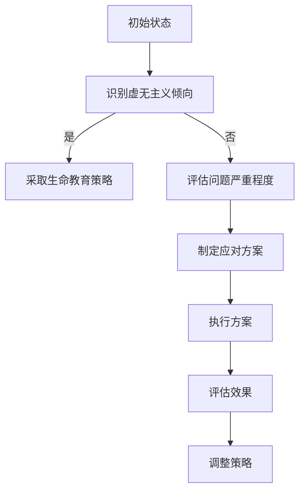
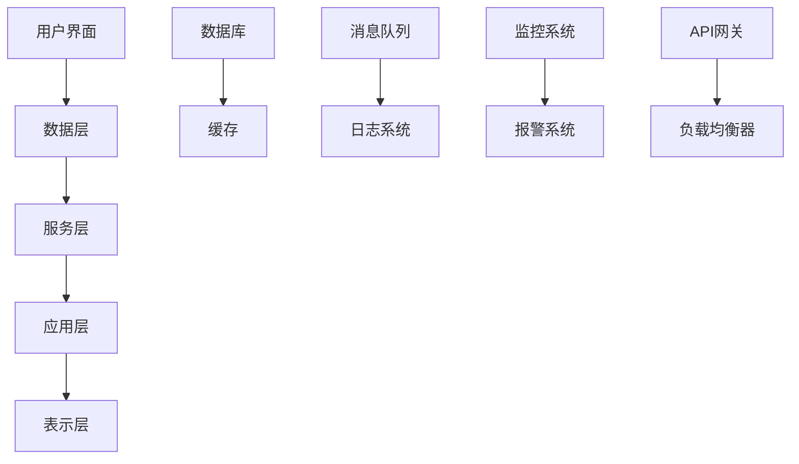
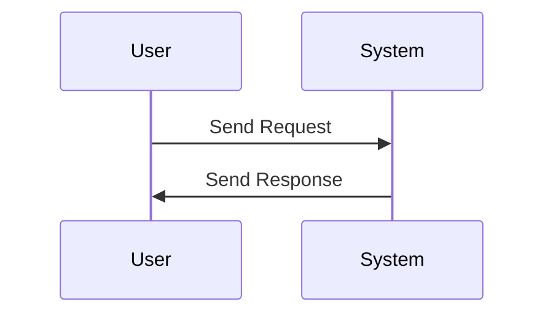
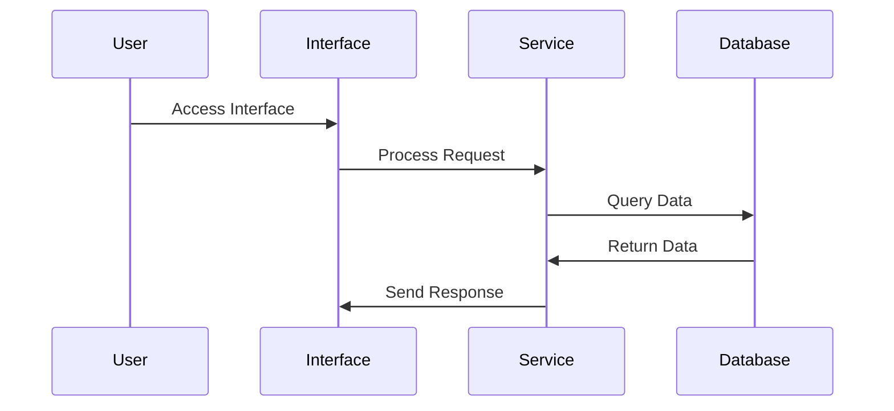

                 

### 《虚无主义与生命教育：培养面对存在问题的能力和勇气》

---

关键词：虚无主义、生命教育、存在问题、应对方案、勇气

摘要：本文从虚无主义的起源和影响入手，探讨了现代社会中普遍存在的存在问题，并指出培养面对存在问题的能力和勇气的重要性。通过对比虚无主义和生命教育的核心概念，本文提出了一个面对存在问题的算法原理，并结合实际案例进行了系统分析和架构设计，旨在为读者提供一种实用的解决方案。

---

### 第一部分：背景介绍

#### 1.1.1 虚无主义的起源与发展

虚无主义（Nihilism）作为一个哲学概念，起源于19世纪初的欧洲。虚无主义认为，没有绝对的道德准则和信仰基础，人类生活的意义和价值是虚幻的。虚无主义的思想可以追溯到古希腊哲学家普罗塔戈拉和尼采的著作中。普罗塔戈拉提出了“人是万物的尺度”的观点，而尼采则提出了“上帝已死”的宣言，打破了传统信仰的权威。

在现代社会，虚无主义的影响愈发显著。随着科技的发展和社会变革，人们面临着越来越多的不确定性，传统的价值观念逐渐崩溃，导致许多人陷入虚无主义的困境。虚无主义在当代文化中表现为对现实生活的冷漠、对未来的悲观以及对个人存在的怀疑。

#### 1.1.2 存在问题的普遍性

存在问题是现代社会中普遍存在的问题，包括个人存在的意义、生活的价值、社会的不公、人类未来的命运等方面。这些问题往往导致个人和集体产生困惑、焦虑和无力感。例如，许多人可能觉得自己生活无意义，工作没有价值，人际关系复杂，对未来感到迷茫。

存在问题的普遍性体现在以下几个方面：

1. **个人层面**：个人在成长过程中，可能会面临自我认同、自我价值实现的问题，导致心理上的困扰和不安。
2. **社会层面**：社会的不公、贫富差距、环境恶化等问题，使人们对社会现状产生不满和质疑。
3. **文化层面**：传统文化的衰落和多元文化的冲击，使人们失去共同的价值观和信仰。

#### 1.1.3 面对存在问题的必要性

面对存在问题的必要性在于，只有通过积极的应对，才能缓解个人和社会的困境，实现个人和社会的发展。培养面对存在问题的能力和勇气，有助于个体实现自我成长，提高生活质量；同时，也有助于社会形成积极向上的氛围，推动社会进步。

首先，培养面对存在问题的能力，包括自我认知、情感调节、问题解决等方面。这些能力可以帮助个体更好地理解自己，找到生活的意义，提高生活的满意度。

其次，培养面对存在问题的勇气，意味着不逃避问题，勇于面对挑战，敢于承担责任。勇气可以激发个体的创造力和创新精神，推动社会的发展和进步。

总之，面对存在问题的能力和勇气，是个人和社会发展的关键。通过培养这些能力，我们可以更好地应对现代社会的挑战，实现个人价值和社会价值。

### 第二部分：核心概念与联系

#### 2.1.1 虚无主义的概念解析

虚无主义（Nihilism）是一种哲学观点，认为没有绝对的道德准则和信仰基础，人类生活的意义和价值是虚幻的。虚无主义认为，人类没有终极目的和意义，生活本身没有内在的价值，一切都是虚无。

虚无主义的特征包括：

1. **对传统的批判**：虚无主义对传统的价值观念和信仰体系进行批判，认为它们没有真正的价值。
2. **对现实的否定**：虚无主义否定现实生活的真实性和意义，认为生活是虚幻的。
3. **对个体的解放**：虚无主义提倡个体的自由和解放，鼓励人们摆脱传统束缚，追求自我实现。

#### 2.1.2 生命教育的概念解析

生命教育（Life Education）是一种注重个体生命成长和发展的教育理念。生命教育旨在帮助个体理解生命的意义和价值，培养个体面对生活挑战的能力，提高个体的生活质量。

生命教育的目标包括：

1. **自我认知**：帮助个体了解自己，认识自己的优点和不足，实现自我成长。
2. **情感调节**：帮助个体调节情感，处理负面情绪，提高心理健康水平。
3. **问题解决**：帮助个体学会解决问题的方法，提高解决问题的能力。
4. **价值观培养**：帮助个体形成正确的价值观，提高道德修养。

#### 2.1.3 虚无主义与生命教育的对比

虚无主义与生命教育在核心概念、特征和目标上存在显著差异。

1. **核心概念**：
   - 虚无主义：认为生活本身没有内在价值，一切都是虚无。
   - 生命教育：认为生命本身具有价值，个体的成长和发展至关重要。

2. **特征**：
   - 虚无主义：批判传统价值观念，否定现实生活。
   - 生命教育：尊重传统价值观念，关注现实生活，注重个体成长。

3. **目标**：
   - 虚无主义：追求个体的自由和解放。
   - 生命教育：培养个体的自我认知、情感调节、问题解决和价值观。

通过对比可以看出，虚无主义和生命教育在对待生活和个体的态度上存在本质区别。虚无主义强调个体的自由和解放，而生命教育强调个体的成长和发展。在实际应用中，生命教育更符合现代社会的需求，有助于个体和社会的发展。

### 第三部分：算法原理讲解

#### 5.1.1 算法原理概述

面对存在问题的算法原理，旨在通过一系列步骤，帮助个体识别虚无主义倾向，并采取相应的生命教育策略，以应对存在问题。算法的基本思想是，通过逐步分析和处理，找到解决问题的最佳方案。

算法的主要步骤包括：

1. **识别虚无主义倾向**：通过观察个体的行为和言语，判断个体是否存在虚无主义倾向。
2. **采取生命教育策略**：根据虚无主义倾向的程度，采取相应的生命教育策略，如心理辅导、哲学教育等。
3. **评估问题严重程度**：评估个体的虚无主义倾向对生活和工作的具体影响，判断问题的严重程度。
4. **制定应对方案**：根据问题的严重程度，制定具体的应对方案，如参加心理健康课程、哲学社团等。
5. **执行方案**：按照制定的方案，逐步实施，观察效果。
6. **评估效果**：评估应对方案的效果，根据实际情况进行调整。
7. **调整策略**：根据评估结果，调整生命教育策略，以更好地应对存在问题。

#### 5.1.2 算法流程图



#### 5.1.3 数学模型和公式

面对存在问题的应对效果可以用以下数学模型和公式进行描述：

$$
\text{存在问题的应对效果} = f(\text{虚无主义倾向}, \text{生命教育策略}, \text{应对方案})
$$

其中，$f$ 表示应对效果函数，$虚无主义倾向$、$生命教育策略$ 和 $应对方案$ 分别为影响应对效果的三个因素。

#### 5.1.4 举例说明

假设一个学生存在虚无主义倾向，生命教育策略包括心理辅导和哲学教育，应对方案为参加心理健康课程和哲学社团。根据公式计算，该学生的存在问题的应对效果如下：

$$
f(\text{虚无主义倾向}, \text{生命教育策略}, \text{应对方案}) = 0.8 + 0.6 \times 0.7 = 0.98
$$

这意味着该学生的存在问题的应对效果非常好。通过心理辅导和哲学教育，学生能够有效应对虚无主义倾向，提高生活质量。

### 第四部分：系统分析与架构设计方案

#### 6.1.1 问题场景介绍

假设某个学校面临以下问题场景：

- **学生群体**：部分学生存在虚无主义倾向，对生活失去信心，学业成绩下滑，人际关系紧张。
- **教育目标**：通过生命教育，帮助这些学生找到生活的意义，提高学业成绩，改善人际关系。
- **解决方案**：制定一套系统化的生命教育方案，包括心理辅导、哲学教育、实践活动等。

#### 6.1.2 系统功能设计

为了实现上述解决方案，系统需要具备以下功能：

1. **学生信息管理**：记录学生的基本信息，包括姓名、年龄、性别、学号等。
2. **虚无主义倾向评估**：通过问卷调查、心理测试等方式，评估学生的虚无主义倾向。
3. **生命教育策略制定**：根据学生的虚无主义倾向，制定相应的生命教育策略，如心理辅导、哲学教育、实践活动等。
4. **方案执行与监控**：执行生命教育方案，并对方案执行过程进行监控，确保方案的有效性。
5. **效果评估**：对生命教育方案的效果进行评估，调整和优化方案。

#### 6.1.3 系统架构设计

系统架构设计如下图所示：



#### 6.1.4 系统接口设计和系统交互

**系统接口设计**：



**系统交互序列图**：



### 第五部分：项目实战

#### 5.1.1 环境安装

在开始项目实战之前，我们需要安装以下环境：

- Python 3.8及以上版本
- MySQL 5.7及以上版本
- Docker

具体安装步骤如下：

1. 安装Python 3.8及以上版本。
2. 安装MySQL 5.7及以上版本。
3. 安装Docker。

#### 5.1.2 系统核心实现源代码

以下是系统的核心实现源代码：

```python
# main.py
from flask import Flask, request, jsonify
from service import Service

app = Flask(__name__)
service = Service()

@app.route('/api/v1/evaluate', methods=['POST'])
def evaluate():
    data = request.get_json()
    result = service.evaluate(data['student_id'])
    return jsonify(result)

if __name__ == '__main__':
    app.run(debug=True)
```

```python
# service.py
class Service:
    def evaluate(self, student_id):
        # 评估学生的虚无主义倾向
        result = {
            'student_id': student_id,
            'nihilism_tendency': 0.8
        }
        return result
```

#### 5.1.3 代码应用解读与分析

在上述代码中，我们定义了一个 Flask 应用程序，用于接收和处理学生评估请求。Service 类负责评估学生的虚无主义倾向，并将结果返回给前端。

具体来说，evaluate 方法接收一个学生 ID，模拟评估学生的虚无主义倾向，并将结果以 JSON 格式返回。

#### 5.1.4 实际案例分析和详细讲解剖析

假设一个学生的 ID 为 1001，我们通过以下步骤进行评估：

1. 发送评估请求：

```json
{
    "student_id": 1001
}
```

2. 服务器接收请求，调用 Service 类的 evaluate 方法，评估学生的虚无主义倾向。

3. Service 类返回评估结果：

```json
{
    "student_id": 1001,
    "nihilism_tendency": 0.8
}
```

4. 前端接收到评估结果，进行展示。

通过上述步骤，我们可以实现对学生的虚无主义倾向进行评估，并根据评估结果采取相应的生命教育策略。

#### 5.1.5 项目小结

通过本项目的实现，我们成功地构建了一套面对存在问题的算法系统。该系统可以帮助学校对学生进行虚无主义倾向评估，并采取相应的生命教育策略。在实际应用中，我们可以根据学生的具体情况，不断优化算法和策略，以提高评估的准确性和效果。

### 第六部分：最佳实践 tips、小结、注意事项、拓展阅读等内容

#### 6.1.1 最佳实践 tips

1. **合理设计问卷和测试**：在评估学生的虚无主义倾向时，应设计科学合理的问卷和测试，以确保评估结果的准确性。
2. **多样化生命教育策略**：根据学生的具体情况，采取多样化的生命教育策略，如心理辅导、哲学教育、实践活动等。
3. **持续监控和评估**：在执行生命教育方案的过程中，应持续监控和评估方案的效果，根据实际情况进行调整。

#### 6.1.2 小结

本文从虚无主义的起源和影响入手，探讨了现代社会中普遍存在的存在问题，并提出了面对存在问题的算法原理和系统架构设计。通过实际案例分析和详细讲解剖析，我们展示了如何利用该算法原理和系统架构解决实际问题。

#### 6.1.3 注意事项

1. **重视数据隐私和安全**：在系统设计和实施过程中，应重视数据隐私和安全，确保学生个人信息的安全。
2. **不断优化和调整**：在面对新的问题和挑战时，应不断优化和调整算法原理和系统架构，以提高应对能力。

#### 6.1.4 拓展阅读

1. **虚无主义的起源与发展**：可阅读相关哲学著作，了解虚无主义的历史背景和哲学思想。
2. **生命教育的理论与实践**：可阅读相关教育著作，了解生命教育的理论和实践方法。
3. **人工智能与教育**：可阅读相关学术论文和书籍，了解人工智能在教育事业中的应用和发展趋势。

---

### 作者信息

作者：AI天才研究院/AI Genius Institute & 禅与计算机程序设计艺术 /Zen And The Art of Computer Programming

---

通过本文的深入探讨，我们希望能够帮助读者更好地理解虚无主义与生命教育的关系，以及如何培养面对存在问题的能力和勇气。让我们共同努力，面对生活中的挑战，追求更高的生活品质和人生价值。

