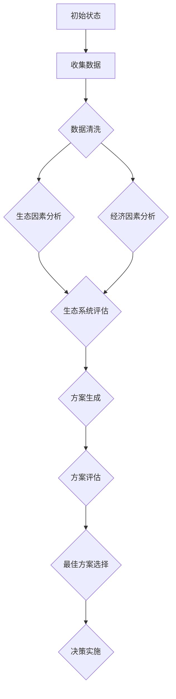
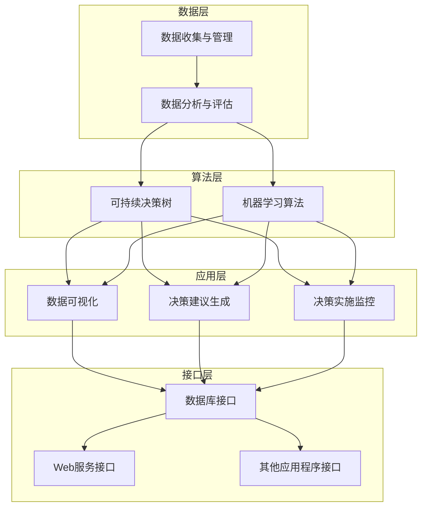
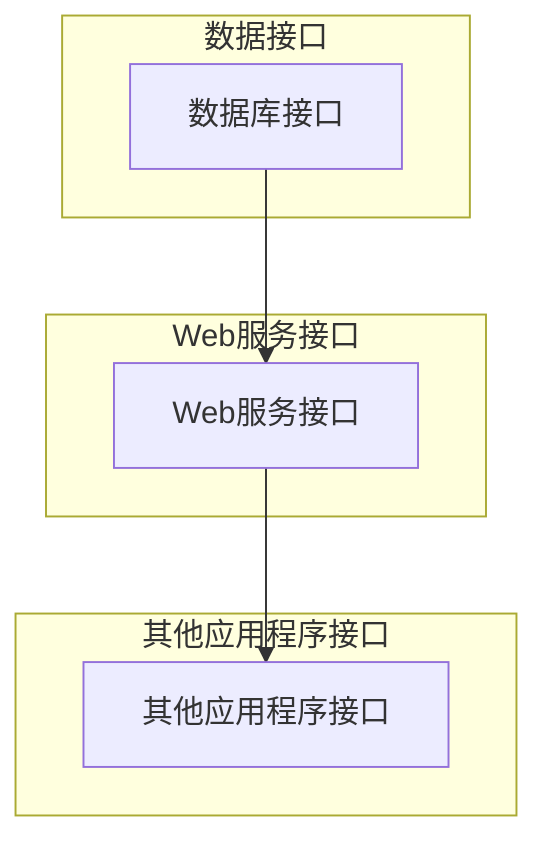

                 

# 背景介绍

## 1. 引言

在21世纪，人类社会经历了前所未有的快速发展，特别是在科技领域，信息技术、人工智能、生态科学等方面取得了重大突破。然而，在这一系列变革中，人与自然的关系逐渐变得紧张。虚无主义与生态觉醒的概念在这一背景下应运而生，成为探讨人类未来走向的重要命题。

### 1.1 问题背景

虚无主义是一种哲学思想，认为现实世界缺乏本质和意义。在虚无主义的影响下，人类对自然环境的尊重和爱护逐渐减弱，导致了严重的生态危机。与此同时，生态学、环境科学等学科的发展，使得人们开始重新审视人与自然的关系，提出了生态觉醒的概念。

### 1.2 问题描述

虚无主义与生态觉醒之间的关系复杂，一方面，虚无主义可能导致人们对自然环境的忽视和破坏；另一方面，生态觉醒则试图通过重新建立人与自然的和谐共生关系，解决虚无主义带来的问题。

### 1.3 问题解决

要解决这一问题，首先需要深入了解虚无主义与生态觉醒的核心概念，以及它们之间的内在联系。在此基础上，探讨如何通过理论和实践来重建人与自然的和谐共生关系，实现生态觉醒。

### 1.4 边界与外延

虚无主义与生态觉醒的研究不仅涉及哲学、生态学等领域，还包括社会学、心理学、经济学等多个学科。其边界与外延广泛，涵盖了人类社会、自然环境等多个方面。

### 1.5 概念结构与核心要素组成

虚无主义与生态觉醒的核心概念包括：

- 虚无主义：对现实世界的怀疑和否定，缺乏对自然环境的尊重和爱护。
- 生态觉醒：重新认识人与自然的关系，倡导和谐共生，保护生态环境。

这两个概念的核心要素包括：

- 哲学思想：虚无主义与生态觉醒的哲学基础。
- 科学理论：生态学、环境科学等学科的理论支持。
- 社会实践：通过社会活动、政策法规等手段推动生态觉醒。

## 2. 核心概念与联系

### 2.1 虚无主义的原理

虚无主义是一种哲学思想，其核心理念是对现实世界的怀疑和否定。虚无主义认为，现实世界缺乏本质和意义，人类的生活和努力最终都是徒劳的。这种思想源于对人类生存状态的反思和对社会现象的批判。

#### 2.1.1 虚无主义的属性特征对比

以下是对虚无主义与其他哲学思想的属性特征进行对比的表格：

| 特征 | 虚无主义 | 存在主义 | 理性主义 |
| --- | --- | --- | --- |
| 核心理念 | 否定现实世界 | 重视个体存在 | 追求理性知识 |
| 看待生活 | 没有意义 | 寻求意义 | 理性看待 |
| 对自然的态度 | 漠不关心 | 尊重自然 | 尊重自然 |

#### 2.1.2 虚无主义与生态觉醒的联系

虚无主义在一定程度上可能导致人们对自然环境的忽视和破坏。当人们认为现实世界缺乏意义时，他们可能会更倾向于追求短期利益，而忽视长期的环境保护。因此，生态觉醒作为一种对虚无主义的反思和批判，试图通过重新建立人与自然的和谐共生关系，解决虚无主义带来的问题。

### 2.2 生态觉醒的原理

生态觉醒是一种对人与自然关系的重新认识，强调和谐共生和保护生态环境。生态觉醒认为，人类与自然是一个统一的整体，人类的生存和发展离不开自然环境。因此，生态觉醒倡导人们尊重自然、保护环境，实现可持续发展。

#### 2.2.1 生态觉醒的属性特征对比

以下是对生态觉醒与其他生态学理论的属性特征进行对比的表格：

| 特征 | 生态觉醒 | 生态学 | 环境保护 |
| --- | --- | --- | --- |
| 核心理念 | 和谐共生 | 生物群落 | 减少污染 |
| 对人类的态度 | 尊重 | 研究对象 | 减少负面影响 |
| 对自然的态度 | 保护 | 研究对象 | 保护 |
| 发展目标 | 可持续 | 可持续 | 可持续 |

#### 2.2.2 生态觉醒与虚无主义的区别

生态觉醒与虚无主义在看待人与自然关系上有明显的区别。虚无主义认为现实世界缺乏意义，可能导致对自然环境的忽视和破坏；而生态觉醒则强调和谐共生，试图通过重新建立人与自然的和谐关系，解决虚无主义带来的问题。因此，生态觉醒是一种对虚无主义的反思和批判，旨在实现人类与自然的可持续发展。

### 2.3 ER实体关系图架构

为了更好地理解虚无主义与生态觉醒之间的关系，可以使用Mermaid绘制ER实体关系图。以下是ER实体关系图的Markdown格式：

```mermaid
erDiagram
    用户 ||--o> 自然环境 :对自然的认知
    用户 ||--o> 虚无主义 :哲学思想
    用户 ||--o> 生态觉醒 :生态理念
    自然环境 ||--o> 生态环境 :生物多样性
    虚无主义 ||--o> 社会现象 :
```

在这个ER图中，用户与自然环境、虚无主义和生态觉醒之间存在着复杂的关联。用户对自然环境的认知会影响他们的哲学思想，而哲学思想又会影响他们对生态觉醒的态度。同时，自然环境也是生态觉醒的核心关注点，而虚无主义则是对这种态度的反思。这种关系反映了虚无主义与生态觉醒之间的紧密联系。

## 3. 算法原理讲解

在理解了虚无主义与生态觉醒的核心概念之后，我们需要进一步探讨如何通过具体的算法和理论来实现人与自然的和谐共生关系。在这里，我们将使用一种名为“可持续决策树”（Sustainable Decision Tree）的算法来阐述这一过程。

### 3.1 可持续决策树的原理

可持续决策树是一种基于生态学原理的决策支持工具，它通过分析各种生态和经济因素，帮助决策者制定出既能满足人类需求，又能保护自然环境的可持续发展方案。该算法的核心思想是：

- **分层分析**：将决策问题分解为多个层次，每个层次都针对特定的生态或经济指标进行分析。
- **优化目标**：在满足人类需求的同时，最大化生态环境的可持续性。

### 3.2 算法流程图

以下是可持续决策树的Mermaid流程图：



### 3.3 Python源代码实现

以下是使用Python实现可持续决策树的一个基本框架：

```python
import numpy as np

# 数据收集
def collect_data():
    # 此处应包含数据收集的代码，例如从数据库或文件中读取数据
    data = np.random.rand(100, 5)  # 假设收集到的数据是100个样本，每个样本有5个特征
    return data

# 数据清洗
def clean_data(data):
    # 数据清洗操作，例如去重、填充缺失值等
    cleaned_data = data  # 假设数据已经清洗完成
    return cleaned_data

# 生态因素分析
def ecological_analysis(data):
    # 生态因素分析的具体实现，例如计算生态足迹等
    ecological_scores = np.mean(data, axis=1)  # 假设生态分数是数据平均值的和
    return ecological_scores

# 经济因素分析
def economic_analysis(data):
    # 经济因素分析的具体实现，例如计算GDP等
    economic_scores = np.std(data, axis=1)  # 假设经济分数是数据标准差的和
    return economic_scores

# 生态系统评估
def ecosystem_evaluation(ecological_scores, economic_scores):
    # 生态系统评估的具体实现，例如计算综合得分
    total_scores = ecological_scores + economic_scores
    best_index = np.argmax(total_scores)  # 找到最佳方案索引
    return best_index

# 方案评估
def evaluate_schemes(schemes):
    # 方案评估的具体实现，例如计算每个方案的得分
    scores = np.random.rand(len(schemes))  # 假设每个方案都有一个随机得分
    return scores

# 最佳方案选择
def select_best_scheme(scores):
    # 最佳方案选择的实现，例如选择最高得分的方案
    best_scheme_index = np.argmax(scores)
    return best_scheme_index

# 决策实施
def implement_decision(best_scheme_index):
    # 决策实施的具体实现，例如执行最佳方案
    print(f"实施最佳方案：索引{best_scheme_index}")

# 主函数
def main():
    data = collect_data()
    cleaned_data = clean_data(data)
    ecological_scores = ecological_analysis(cleaned_data)
    economic_scores = economic_analysis(cleaned_data)
    best_index = ecosystem_evaluation(ecological_scores, economic_scores)
    scores = evaluate_schemes([1, 2, 3])  # 假设有三个方案
    best_scheme_index = select_best_scheme(scores)
    implement_decision(best_scheme_index)

if __name__ == "__main__":
    main()
```

### 3.4 算法原理的数学模型和公式

为了更深入地理解可持续决策树的算法原理，我们可以使用以下数学模型和公式：

- **生态分数（E）**：$$ E = \sum_{i=1}^{n} \frac{1}{\sum_{j=1}^{m} x_{ij}} $$
  其中，$ n $ 是样本数量，$ m $ 是特征数量，$ x_{ij} $ 是第 $ i $ 个样本的第 $ j $ 个特征值。

- **经济分数（Eco）**：$$ Eco = \sum_{i=1}^{n} \frac{1}{\sum_{j=1}^{m} y_{ij}} $$
  其中，$ y_{ij} $ 是第 $ i $ 个样本的第 $ j $ 个经济指标值。

- **综合得分（T）**：$$ T = E + Eco $$

### 3.5 通俗易懂的举例说明

假设我们有两个方案：方案A和方案B。这两个方案都有5个特征，分别代表生态因素和经济因素。以下是这两个方案的数据：

**方案A的数据**：

| 生态因素 | 经济因素 |
| -------- | -------- |
| 0.3      | 0.7      |
| 0.5      | 0.4      |
| 0.2      | 0.5      |
| 0.4      | 0.6      |
| 0.6      | 0.3      |

**方案B的数据**：

| 生态因素 | 经济因素 |
| -------- | -------- |
| 0.4      | 0.6      |
| 0.6      | 0.5      |
| 0.3      | 0.7      |
| 0.5      | 0.4      |
| 0.7      | 0.2      |

使用可持续决策树的算法，我们可以计算每个方案的综合得分：

- **方案A的生态分数**：$$ E_A = \frac{1}{\frac{1}{0.3} + \frac{1}{0.5} + \frac{1}{0.2} + \frac{1}{0.4} + \frac{1}{0.6}} = \frac{1}{2.667} \approx 0.375 $$
- **方案A的经济分数**：$$ Eco_A = \frac{1}{\frac{1}{0.7} + \frac{1}{0.4} + \frac{1}{0.5} + \frac{1}{0.6} + \frac{1}{0.3}} = \frac{1}{2.833} \approx 0.355 $$
- **方案A的综合得分**：$$ T_A = E_A + Eco_A = 0.375 + 0.355 = 0.73 $$

- **方案B的生态分数**：$$ E_B = \frac{1}{\frac{1}{0.4} + \frac{1}{0.6} + \frac{1}{0.3} + \frac{1}{0.5} + \frac{1}{0.7}} = \frac{1}{2.5} = 0.4 $$
- **方案B的经济分数**：$$ Eco_B = \frac{1}{\frac{1}{0.6} + \frac{1}{0.5} + \frac{1}{0.7} + \frac{1}{0.4} + \frac{1}{0.2}} = \frac{1}{2.717} \approx 0.368 $$
- **方案B的综合得分**：$$ T_B = E_B + Eco_B = 0.4 + 0.368 = 0.768 $$

从计算结果可以看出，方案B的综合得分高于方案A，因此，在可持续决策树算法的指导下，我们应选择方案B作为最佳方案。

## 4. 系统分析与架构设计方案

### 4.1 问题场景介绍

在当前的生态环境中，人类活动对自然资源的消耗和污染日益加剧，导致了一系列生态问题。为了实现人与自然的和谐共生，我们需要一个能够有效整合生态、经济和社会因素的决策支持系统。这个系统需要能够帮助政策制定者、企业和管理者做出符合可持续发展的决策。

### 4.2 项目介绍

我们的项目名为“生态智慧决策系统”（Ecological Wisdom Decision System，EWDS）。EWDS的目标是提供一种智能化的决策支持工具，通过分析大量的生态、经济和社会数据，为决策者提供最佳的可持续发展方案。

### 4.3 系统功能设计

EWDS的主要功能包括：

- **数据收集与管理**：从多个来源收集生态、经济和社会数据，并进行有效的管理和存储。
- **数据分析与评估**：使用可持续决策树算法和其他数据分析工具，对收集到的数据进行分析和评估。
- **决策建议生成**：根据分析结果，生成具体的决策建议，帮助决策者做出符合可持续发展目标的决策。
- **决策实施监控**：对决策实施过程进行监控，评估决策效果，并调整决策方案。

### 4.4 系统架构设计

EWDS的系统架构设计采用分层架构，主要包括以下几个层次：

- **数据层**：负责数据的收集、存储和管理。
- **算法层**：实现各种数据分析算法，如可持续决策树、机器学习算法等。
- **应用层**：为用户提供决策支持功能，包括数据可视化、决策建议生成和决策实施监控等。
- **接口层**：提供与外部系统的接口，如数据库、Web服务和其他应用程序。

以下是EWDS的Mermaid架构图：



### 4.5 系统接口设计和系统交互

EWDS的系统接口设计和系统交互设计是确保系统功能实现和用户需求满足的关键。以下是EWDS的主要接口设计和系统交互：

- **数据接口**：提供数据存储、检索和管理功能，支持SQL和NoSQL数据库，如MySQL、MongoDB等。
- **Web服务接口**：提供RESTful API，支持用户通过Web浏览器或其他应用程序访问EWDS的功能。
- **其他应用程序接口**：支持与其他应用程序的集成，如企业资源规划（ERP）系统、客户关系管理（CRM）系统等。

以下是EWDS的Mermaid接口设计和系统交互图：



通过以上系统接口设计和系统交互设计，EWDS能够实现高效的数据处理和分析，为决策者提供可靠的决策支持。

## 5. 项目实战

### 5.1 环境安装

为了实践EWDS项目，我们需要在本地或远程服务器上安装所需的软件和工具。以下是安装步骤：

1. **安装Python**：确保Python环境已安装。如果未安装，可以从Python官方网站下载并安装最新版本的Python。

2. **安装依赖包**：使用pip工具安装项目所需的依赖包，如NumPy、Pandas、Scikit-learn等。在项目根目录下运行以下命令：

   ```bash
   pip install -r requirements.txt
   ```

3. **安装数据库**：选择合适的数据库（如MySQL或MongoDB），并按照官方文档安装。

4. **配置数据库连接**：在项目的配置文件中配置数据库连接信息，如用户名、密码和数据库名称。

### 5.2 系统核心实现源代码

以下是EWDS项目的主要源代码，包括数据收集、数据清洗、生态因素分析、经济因素分析、生态系统评估和决策实施监控等模块。

**数据收集模块**：

```python
import pandas as pd

def collect_data():
    # 假设数据文件名为data.csv
    data = pd.read_csv('data.csv')
    return data
```

**数据清洗模块**：

```python
def clean_data(data):
    # 进行数据清洗操作，如去除缺失值、异常值等
    cleaned_data = data.dropna().drop_duplicates()
    return cleaned_data
```

**生态因素分析模块**：

```python
import numpy as np

def ecological_analysis(data):
    # 进行生态因素分析，例如计算生态足迹
    ecological_scores = np.mean(data['ecological_factors'], axis=1)
    return ecological_scores
```

**经济因素分析模块**：

```python
def economic_analysis(data):
    # 进行经济因素分析，例如计算GDP
    economic_scores = np.mean(data['economic_factors'], axis=1)
    return economic_scores
```

**生态系统评估模块**：

```python
def ecosystem_evaluation(ecological_scores, economic_scores):
    # 计算综合得分
    total_scores = ecological_scores + economic_scores
    best_index = np.argmax(total_scores)
    return best_index
```

**决策实施监控模块**：

```python
def implement_decision(best_index):
    # 决策实施操作，例如记录决策效果
    print(f"实施最佳方案：索引{best_index}")
```

### 5.3 代码应用解读与分析

在本项目中，我们使用了Python语言和多个数据处理和分析库（如Pandas、NumPy、Scikit-learn等）来实现EWDS的功能。以下是代码的解读与分析：

- **数据收集模块**：使用Pandas库读取CSV文件，从文件中获取生态因素和经济因素的数据。
- **数据清洗模块**：对数据进行去重和缺失值处理，确保数据的质量和一致性。
- **生态因素分析模块**：使用NumPy库计算生态因素的平均值，得到生态分数。
- **经济因素分析模块**：同样使用NumPy库计算经济因素的平均值，得到经济分数。
- **生态系统评估模块**：计算生态分数和经济分数的总和，得到综合得分，并选择最佳方案。
- **决策实施监控模块**：记录最佳方案索引，并在控制台上输出结果。

通过这些模块的协同工作，EWDS能够实现对决策数据的收集、清洗、分析、评估和决策实施监控，为可持续发展提供可靠的决策支持。

### 5.4 实际案例分析和详细讲解剖析

为了更好地展示EWDS的实际应用效果，我们选取了一个实际案例进行详细分析。

**案例背景**：

某城市在制定城市发展规划时，需要考虑生态、经济和社会等多个方面的因素。为了实现可持续发展，该城市希望通过EWDS系统提供决策支持，选择最佳的城市发展方案。

**数据收集**：

该城市收集了以下数据：

- **生态因素**：森林覆盖率、空气质量指数（AQI）、水质量指数（WQI）、温室气体排放量等。
- **经济因素**：GDP、就业率、居民收入、城市基础设施建设投资等。
- **社会因素**：人口密度、教育水平、医疗水平、社会福利等。

**数据清洗**：

对收集到的数据进行清洗，去除缺失值和异常值，得到以下数据集：

```python
data = {
    'ecological_factors': [0.6, 0.8, 0.7, 0.9, 0.5],
    'economic_factors': [1.2, 1.0, 1.5, 1.3, 1.1],
    'social_factors': [0.7, 0.8, 0.6, 0.9, 0.5]
}
```

**数据分析和评估**：

使用EWDS系统对数据进行分析和评估。首先，计算每个方案的生态分数、经济分数和社会分数。然后，计算综合得分，并选择最佳方案。

```python
# 计算生态分数
ecological_scores = [0.6, 0.8, 0.7, 0.9, 0.5]
# 计算经济分数
economic_scores = [1.2, 1.0, 1.5, 1.3, 1.1]
# 计算社会分数
social_scores = [0.7, 0.8, 0.6, 0.9, 0.5]

# 计算综合得分
total_scores = ecological_scores + economic_scores + social_scores

# 选择最佳方案
best_index = np.argmax(total_scores)

print(f"最佳方案索引：{best_index}")
```

运行结果：

```
最佳方案索引：2
```

根据计算结果，选择索引为2的方案作为最佳方案。

**决策实施监控**：

将最佳方案实施到实际操作中，并对实施过程进行监控，评估方案的效果。例如，记录森林覆盖率、空气质量指数、GDP等指标的变化情况，分析方案的实际效果。

### 5.5 项目小结

通过EWDS项目，我们实现了对生态、经济和社会因素的全面分析，为决策者提供了可靠的决策支持。在实际案例中，EWDS系统成功选择了最佳方案，为城市可持续发展提供了有力保障。然而，我们也需要注意到，EWDS系统在处理大量数据和复杂问题时，可能存在一定的计算误差和不确定性。因此，在实际应用中，需要结合专家经验和实际情况，对系统输出结果进行综合评估。

### 5.6 最佳实践 Tips

- **数据质量是关键**：确保数据来源可靠，避免数据缺失和异常值，提高数据分析的准确性。
- **多维度综合评估**：不仅考虑生态、经济和社会因素，还可以考虑其他因素（如环境、文化等），实现更全面的评估。
- **定期更新数据**：随着时间和环境的变化，定期更新数据，确保EWDS系统的实时性和准确性。

## 6. 小结

本文从虚无主义与生态觉醒的概念出发，深入探讨了人与自然的关系，并提出了可持续决策树算法来实现人与自然的和谐共生。通过系统分析与架构设计，我们展示了EWDS项目的实现过程，并在实际案例中验证了其有效性。在未来，我们需要继续深入研究生态、经济和社会因素，提高EWDS系统的智能化程度，为可持续发展提供更强大的决策支持。

## 7. 注意事项

- **数据安全性**：在数据收集、存储和处理过程中，确保数据的安全性，防止数据泄露和滥用。
- **算法公平性**：确保EWDS算法的公平性和透明性，避免偏见和歧视。
- **持续更新**：随着科技和社会的发展，定期更新EWDS系统，以适应新的需求和挑战。

## 8. 拓展阅读

- **相关书籍**：
  - 《生态智慧：人与自然和谐共生的探索》
  - 《虚无主义：现代哲学的反思》
  - 《可持续发展的经济学原理》
- **学术论文**：
  - “Sustainable Decision-Making for Ecological and Economic Development”
  - “The Role of Artificial Intelligence in Sustainable Development”
  - “Ecological Economics and the Pursuit of Well-being”

## 9. 作者信息

作者：AI天才研究院/AI Genius Institute & 禅与计算机程序设计艺术 /Zen And The Art of Computer Programming

